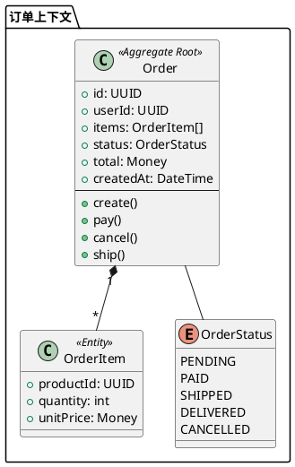
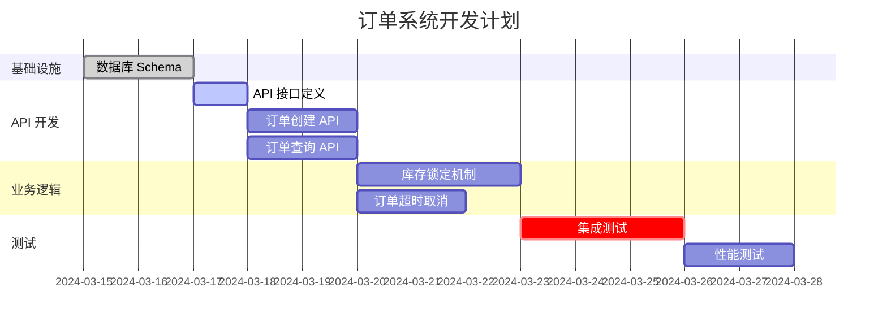

# Spec Coding 方法论 - 规划草稿

> **文档目标**: 创建一套基于金字塔结构和 MECE 原则的 Spec Coding 方法论，结合 Harness Engineering 实践，确保可落地执行。

---

## 第一部分：宏观视角 - Spec Coding 与 Harness Engineering

### 1.1 什么是 Spec Coding？

**定义**: Spec Coding（Specification-Driven Development/SDD，规约驱动开发）是一种以结构化规范（Spec）为核心开发工件的方法论。它将传统的 "Prompt → Code" 转变为 "Idea → Spec → Code → Validation" 的流程。

**核心哲学**:
- **Spec 是源代码**: 代码是 Spec 的输出，Spec 是唯一的真相来源
- **行为在实现前定义**: API 合约、数据模式、验收标准在写第一行代码前已锁定
- **Spec 即测试框架**: 自动化测试从 Spec 生成或与 Spec 验证

**与传统开发模式的对比**:
```
传统开发:    Idea → Code → (Maybe) Docs
AI 辅助开发: Prompt → Code → Patch bugs
Spec Coding: Idea → Spec → Design → Tasks → Code → Tests
```

### 1.2 什么是 Harness Engineering？

**定义**: Harness Engineering 是构建使 AI Agent 在生产环境中可靠的"马具"（Harness）的学科。它不是在优化模型或提示词，而是构建围绕模型的完整基础设施层。

**五个核心组件**:
1. **上下文工程 (Context Engineering)**: 组装 AI 在每个步骤需要的精确信息
2. **工具编排 (Tool Orchestration)**: 管理外部系统交互、输入验证、错误处理
3. **验证循环 (Verification Loops)**: 每一步检查输出后再继续
4. **成本封套 (Cost Envelope)**: 每任务预算上限，防止失控
5. **可观测性 (Observability)**: 结构化执行轨迹和持续评估

### 1.3 两者关系

**Spec Coding** 回答 **"构建什么"**（What to build）  
**Harness Engineering** 回答 **"如何可靠地构建"**（How to build reliably）

---

## 第二部分：工程落地案例

### 2.1 OpenAI Codex
- 3 名工程师在 5 个月内生成 100 万+ 行代码
- 沙盒环境 + 验证循环 + 结构化工具访问
- 关键：Harness 设计改变系统是否工作，而非模型本身

### 2.2 Stripe Minions
- 每周合并 1000+ PR，零人工编写代码
- 集成 Spec 定义 → 代码生成 → 自动测试 → PR 合并的完整链路

### 2.3 Vercel
- 将 Agent 工具从 15 个减至 2 个
- 准确性从 80% → 100%
- Token 消耗减少 37%，速度提升 3.5x

### 2.4 LangChain
- Harness 工程改进使任务完成率从 52.8% → 66.5%（模型未改变）

### 2.5 Ministry of Programming (MOP)
- 采用 SDD 标准后：30-50% 的后期缺陷减少，QA 周期显著缩短
- 创建了 agent-resources 仓库标准化 Spec 生成和执行命令

### 2.6 GitHub Spec Kit
- `/constitution` `/tasks` `/implement` 命令流
- 实时 Demo：一个航班时间用 v0 + Spec Kit 构建完整 Next.js 播客网站

---

## 第三部分：可落地的 Spec Coding 方法论框架

### 3.1 方法论总览（金字塔顶层）

```
                    ┌─────────────────────────────────────┐
                    │   Spec Coding 方法论               │
                    │   （规约驱动 + 马具工程）            │
                    └──────────────┬──────────────────────┘
                                   │
        ┌──────────────────────────┼──────────────────────────┐
        │                          │                          │
   ┌────▼─────┐              ┌──────▼──────┐            ┌──────▼──────┐
   │  Spec层  │              │ Harness层   │            │ 工具链层    │
   │ 定义规约 │              │ 保障执行    │            │ 加速开发    │
   └────┬─────┘              └──────┬──────┘            └──────┬──────┘
        │                          │                          │
   ┌────▼─────┐              ┌──────▼──────┐            ┌──────▼──────┐
   │ 需求分析 │              │ 验证循环    │            │ 代码生成    │
   │ 架构设计 │              │ 成本控制    │            │ 测试框架    │
   │ 任务分解 │              │ 可观测性    │            │ CI/CD集成   │
   └──────────┘              └─────────────┘            └─────────────┘
```

### 3.2 四个关键支柱（Four Pillars）

基于 Alex Rezvov 的 Specification-Driven Development: The Four Pillars

1. **可追溯性 (Traceability)**
   - 每个行为变化必须追溯到一个需求
   - 双向链接：需求 ↔ 规范 ↔ 代码 ↔ 测试
   - 唯一标识符系统（如 `FR-AUTH-002`）

2. **单一真相源 (DRY - Don't Repeat Yourself)**
   - 每个事实只有一个权威来源
   - API 合约 = Spec 文件（非文档副本）
   - 配置语义在一个地方描述

3. **确定性执行 (Deterministic Enforcement)**
   - 能写成脚本的就写成脚本
   - AI 填补需要判断力的空白
   - 验证金字塔：工具 → 脚本+AI → 纯 AI

4. **简洁性 (Parsimony)**
   - 最小表示保留完整语义和可执行性
   - 无冗余解释、无重复指令
   - 指令词汇：MUST / SHOULD / MAY / DO NOT

---

## 第四部分：金字塔结构 + MECE 原则的阶段细化

### 4.1 MECE 原则检查

**MECE = Mutually Exclusive, Collectively Exhaustive**

本方法论的五个阶段 MECE 检查：
- **互斥**: 每个阶段有明确边界，不重叠
- **完备**: 覆盖从需求到部署的完整软件生命周期

### 4.2 五阶段方法论（金字塔第二层）

```
┌─────────────────────────────────────────────────────────────────┐
│                     Spec Coding 五阶段                          │
├──────────┬──────────┬──────────┬──────────┬──────────────────────┤
│  Phase 1 │  Phase 2 │  Phase 3 │  Phase 4 │     Phase 5          │
│  需求定义 │  规范设计 │  任务分解 │  编码实现 │     验证部署          │
│  Define  │  Design  │  Decompose│  Develop │     Deliver          │
└──────────┴──────────┴──────────┴──────────┴──────────────────────┘
    │           │           │           │           │
    ▼           ▼           ▼           ▼           ▼
┌────────┐  ┌────────┐  ┌────────┐  ┌────────┐  ┌────────┐
│输入分析│  │架构决策│  │任务编排│  │代码生成│  │验证循环│
│约束识别│  │接口定义│  │依赖排序│  │测试优先│  │监控部署│
│范围界定│  │模式选择│  │责任分配│  │版本控制│  │回滚机制│
└────────┘  └────────┘  └────────┘  └────────┘  └────────┘
```

---

## 第五部分：各阶段详细方法（金字塔第三层）

### Phase 1: 需求定义 (Define)

#### 5.1.1 可执行方法

**方法 1.1: 用户故事模板（GWT 格式）**
```gherkin
Feature: [功能名称]
  As a [角色]
  I want [目标]
  So that [价值]

  Scenario: [场景名称]
    Given [前置条件]
    When [动作]
    Then [预期结果]
    
  Scenario: [边界场景]
    Given [异常前置条件]
    When [动作]
    Then [错误处理结果]
```

**方法 1.2: 需求 ID 系统**
- 格式: `{TYPE}-{DOMAIN}-{NUMBER}`
- TYPE: FR(功能需求) | NFR(非功能需求) | BR(业务规则) | ER(外部依赖)
- DOMAIN: AUTH | PAYMENT | USER | ORDER | etc.
- 示例: `FR-AUTH-001`, `NFR-PERF-003`

**方法 1.3: 约束清单（Constraints Checklist）**
- [ ] 技术约束（技术栈、版本）
- [ ] 业务约束（法规、合规）
- [ ] 性能约束（延迟、吞吐）
- [ ] 安全约束（认证、授权）
- [ ] 时间约束（截止日期、里程碑）

#### 5.1.2 示例

**示例: 电商订单系统需求定义**
```yaml
requirements:
  - id: FR-ORDER-001
    title: 创建订单
    description: 用户可以基于购物车创建订单
    gwt: |
      Given 用户已登录
      And 购物车中有商品
      When 用户点击"结算"按钮
      Then 订单创建成功
      And 订单状态为"待支付"
      And 库存锁定
    acceptance_criteria:
      - 订单 ID 全局唯一
      - 创建时间戳精确到毫秒
      - 总价计算包含税费
    constraints:
      - 必须在 500ms 内完成
      - 支持幂等性（防止重复提交）
    
  - id: FR-ORDER-002
    title: 订单超时取消
    description: 未支付订单在 30 分钟后自动取消
    gwt: |
      Given 订单状态为"待支付"
      And 订单创建时间超过 30 分钟
      When 系统定时任务执行
      Then 订单状态变为"已取消"
      And 库存释放
    acceptance_criteria:
      - 每分钟检查一次
      - 批量处理每次最多 1000 条
```

---

### Phase 2: 规范设计 (Design)

#### 5.2.1 可执行方法

**方法 2.1: API-First 设计（OpenAPI/TypeSpec）**
```yaml
# openapi.yaml
openapi: 3.0.3
info:
  title: Order Service API
  version: 1.0.0
  x-requirement-ref: ["FR-ORDER-001", "FR-ORDER-002"]
  
paths:
  /api/v1/orders:
    post:
      operationId: createOrder
      summary: 创建订单
      requestBody:
        content:
          application/json:
            schema:
              $ref: '#/components/schemas/CreateOrderRequest'
      responses:
        201:
          description: 订单创建成功
          content:
            application/json:
              schema:
                $ref: '#/components/schemas/Order'
        409:
          description: 订单已存在（幂等冲突）

components:
  schemas:
    Order:
      type: object
      required: [id, userId, items, total, status, createdAt]
      properties:
        id:
          type: string
          format: uuid
        userId:
          type: string
        items:
          type: array
          items:
            $ref: '#/components/schemas/OrderItem'
        total:
          type: number
          minimum: 0
        status:
          type: string
          enum: [pending, paid, shipped, delivered, cancelled]
        createdAt:
          type: string
          format: date-time
```

**方法 2.2: 架构决策记录（ADR - Architecture Decision Records）**
```markdown
# ADR 001: 订单存储方案

## 状态
已接受 (2024-03-15)

## 背景
需要存储订单数据，要求：
- 高写入吞吐（峰值 10k QPS）
- 支持复杂查询（按用户、状态、时间范围）
- 强一致性

## 决策
使用 PostgreSQL 主从架构 + Redis 缓存

## 后果
### 正面
- ACID 保证订单一致性
- 成熟生态，团队熟悉

### 负面
- 写入主库可能成为瓶颈
- 需要维护缓存一致性

## 合规性
- 符合 NFR-PERF-001（延迟 < 100ms）
- 符合 NFR-RELI-002（99.99% 可用性）
```

**方法 2.3: 领域模型图（DDD）**


#### 5.2.2 示例

**示例: 完整的 Spec 文档结构**
```
specs/
├── README.md                 # Spec 总览
├── 01-requirements/
│   ├── functional.md         # 功能需求（含 GWT）
│   ├── non-functional.md     # 非功能需求
│   └── constraints.md        # 约束清单
├── 02-architecture/
│   ├── ADR-001-storage.md    # 架构决策
│   ├── ADR-002-api-design.md
│   └── diagrams/             # 架构图
│       ├── context.puml
│       ├── container.puml
│       └── domain.puml
├── 03-api/
│   └── openapi.yaml          # OpenAPI 定义
├── 04-data/
│   ├── schema.sql            # 数据库 Schema
│   └── models.ts             # TypeScript 类型定义
└── 05-validation/
    └── test-cases.md         # 验收测试用例
```

---

### Phase 3: 任务分解 (Decompose)

#### 5.3.1 可执行方法

**方法 3.1: 任务分解模板**
```yaml
tasks:
  - id: T-001
    title: 实现订单创建 API
    description: 实现 POST /api/v1/orders 端点
    requirement_ref: FR-ORDER-001
    dependencies: [T-003]  # 依赖数据库 Schema
    estimated_hours: 4
    acceptance_criteria:
      - 单元测试覆盖率 > 80%
      - 通过 API 契约测试
      - 性能测试 > 500 req/s
    
  - id: T-002
    title: 实现库存锁定机制
    description: 订单创建时锁定库存
    requirement_ref: FR-ORDER-001
    dependencies: [T-001]
    estimated_hours: 6
    
  - id: T-003
    title: 创建订单表 Schema
    description: 创建 orders 和 order_items 表
    requirement_ref: FR-ORDER-001
    dependencies: []
    estimated_hours: 2
```

**方法 3.2: 依赖图可视化**


**方法 3.3: 并行任务识别**
使用拓扑排序识别可并行执行的任务：
1. 计算任务的依赖深度
2. 同一深度的任务可并行
3. 关键路径决定最短工期

```python
# 伪代码
def find_parallel_groups(tasks):
    depth_map = {}
    for task in topological_sort(tasks):
        if not task.dependencies:
            depth_map[task.id] = 0
        else:
            depth_map[task.id] = 1 + max(
                depth_map[dep] for dep in task.dependencies
            )
    
    # 按深度分组
    groups = groupby(depth_map.items(), key=lambda x: x[1])
    return groups
```

#### 5.3.2 示例

**示例: Stripe Minions 的任务分解方式**
```json
{
  "feature": "payment-intent-api",
  "tasks": [
    {
      "id": "spec",
      "type": "spec",
      "title": "定义 PaymentIntent API Spec",
      "prompt": "基于需求 NFR-PAYMENT-001，定义 PaymentIntent 的 OpenAPI spec，包括创建、确认、取消三个端点",
      "output": ["openapi/payment-intent.yaml"],
      "reviewers": ["api-team"]
    },
    {
      "id": "impl",
      "type": "implementation",
      "title": "实现 PaymentIntent 服务",
      "dependencies": ["spec"],
      "prompt": "基于 spec/openapi/payment-intent.yaml，实现 Go 服务，包括：\n1. HTTP handler\n2. Service 层\n3. Repository 层\n4. 单元测试",
      "output": [
        "cmd/payment/main.go",
        "internal/handler/payment_intent.go",
        "internal/service/payment_intent.go",
        "internal/repository/payment_intent.go",
        "*_test.go"
      ]
    },
    {
      "id": "test",
      "type": "integration-test",
      "title": "集成测试",
      "dependencies": ["impl"],
      "prompt": "编写 PaymentIntent 的集成测试，覆盖成功、失败、超时场景",
      "output": ["tests/integration/payment_intent_test.go"]
    }
  ]
}
```

---

### Phase 4: 编码实现 (Develop)

#### 5.4.1 可执行方法

**方法 4.1: AI 代码生成流程**

```
┌──────────────┐    ┌──────────────┐    ┌──────────────┐    ┌──────────────┐
│  1. 加载 Spec │ -> │  2. 生成提示 │ -> │  3. AI 生成  │ -> │  4. 代码审查 │
│             │    │             │    │             │    │             │
│  - 需求文档  │    │  - 系统提示  │    │  - 代码草案  │    │  - 语法检查  │
│  - API 规范  │    │  - 上下文    │    │  - 测试草案  │    │  - 规范符合性 │
│  - 架构约束  │    │  - 任务描述  │    │  - 文档草案  │    │  - 安全检查  │
└──────────────┘    └──────────────┘    └──────────────┘    └──────────────┘
                                                               │
                                                               ▼
                                                       ┌──────────────┐
                                                       │  5. 验证循环  │
                                                       │             │
                                                       │  - 编译检查  │
                                                       │  - 单元测试  │
                                                       │  - 类型检查  │
                                                       └──────────────┘
```

**方法 4.2: Harness 配置文件**
```yaml
# harness.yaml
harness:
  name: order-service-harness
  version: 1.0.0
  
  context:
    max_tokens: 8000
    include_files:
      - specs/openapi.yaml
      - specs/adr/*.md
      - internal/types/*.go
    exclude_patterns:
      - "*_test.go"
      - "vendor/"
  
  tools:
    - name: file_read
      description: 读取文件内容
    - name: file_write
      description: 写入文件内容
    - name: test_run
      description: 运行测试
    - name: lint_check
      description: 代码风格检查
  
  verification:
    steps:
      - name: compile
        command: "go build ./..."
        must_pass: true
        
      - name: lint
        command: "golangci-lint run"
        must_pass: true
        
      - name: unit_test
        command: "go test -v ./... -coverprofile=coverage.out"
        must_pass: true
        min_coverage: 80
        
      - name: integration_test
        command: "go test -v ./tests/integration/..."
        must_pass: true
  
  cost:
    max_tokens_per_task: 100000
    max_api_calls_per_task: 50
    alert_threshold: 0.8
  
  observability:
    log_level: debug
    trace_format: structured
    output_dir: ./logs/harness
```

**方法 4.3: 代码注释规范（Spec 追溯）**
```go
// Package order implements order management functionality.
//
// Requirements:
//   - FR-ORDER-001: Create order with inventory locking
//   - FR-ORDER-002: Auto-cancel pending orders after 30 minutes
//   - FR-ORDER-003: Support order status transitions
package order

// OrderService handles order business logic.
//
// Design Notes:
//   See ADR-001 for storage architecture decision.
//   See ADR-003 for consistency model.
type OrderService struct {
    repo      OrderRepository
    inventory InventoryClient
    payment   PaymentClient
}

// Create creates a new order for the given user.
//
// Spec:
//   - Endpoint: POST /api/v1/orders
//   - Requirement: FR-ORDER-001
//   - OpenAPI: specs/openapi.yaml#/paths/~1orders/post
//
// Business Rules:
//   1. User must be authenticated
//   2. Cart must not be empty
//   3. Each item must have sufficient inventory
//   4. Total must be calculated including tax
//
// Side Effects:
//   - Creates order record in database
//   - Locks inventory for each item
//   - Publishes OrderCreated event
//
// Errors:
//   - ErrUserNotAuthenticated: user is not logged in
//   - ErrEmptyCart: cart has no items
//   - ErrInsufficientInventory: item out of stock
//   - ErrPriceMismatch: calculated total differs from expected
func (s *OrderService) Create(ctx context.Context, req CreateOrderRequest) (*Order, error) {
    // Implementation
}
```

#### 5.4.2 示例

**示例: 完整的 AI 辅助编码会话**

```markdown
# Session: Implement Order Creation API

## 1. Context Loading
```
System: 加载 Spec 文件
- specs/openapi.yaml
- specs/adr/ADR-001-storage.md
- specs/requirements/FR-ORDER-001.md
```

## 2. Task Prompt
```
基于以下 Spec，实现 OrderService.Create 方法：

[OpenAPI Spec 片段]
[ADR-001 片段]
[FR-ORDER-001 验收标准]

要求：
1. 遵循 Clean Architecture，将业务逻辑与存储分离
2. 实现所有错误处理路径
3. 添加单元测试，覆盖所有分支
4. 使用 @require 标签标记代码与需求的追溯关系
```

## 3. AI 生成代码
[生成 Go 代码和测试]

## 4. 自动验证
```
Harness > 运行验证循环
✓ 编译通过
✓ Lint 检查通过
✓ 单元测试: 15/15 通过，覆盖率 87%
✓ 类型检查通过
✓ OpenAPI 契约测试通过
```

## 5. 人工审查
- 代码逻辑正确 ✓
- 错误处理完整 ✓
- 性能考虑充分 ✓

## 6. 提交
```bash
git add .
git commit -m "feat(order): implement order creation API

- Implement OrderService.Create with inventory locking
- Add comprehensive unit tests (87% coverage)
- Document all error cases

Refs: FR-ORDER-001, ADR-001"
```
```

---

### Phase 5: 验证部署 (Deliver)

#### 5.5.1 可执行方法

**方法 5.1: 验证矩阵**
| 验证类型 | 工具 | 触发条件 | 通过标准 |
|---------|------|---------|---------|
| 单元测试 | bun test / pytest | 每次代码生成后 | 覆盖率 > 80%，全部通过 |
| 集成测试 | Playwright / Postman | 任务完成后 | API 契约符合 Spec |
| 性能测试 | k6 / Artillery | 发布前 | 满足 NFR 指标 |
| 安全扫描 | Trivy / Snyk | 每次构建 | 无高危漏洞 |
| 规范一致性 | custom script | CI 中 | 代码注释包含 @require 标签 |

**方法 5.2: 蓝绿部署 + 监控**
```yaml
# deployment.yaml
deployment:
  strategy: blue-green
  
  blue:
    version: v1.2.3
    traffic: 100%
  
  green:
    version: v1.3.0
    traffic: 0%
  
  promotion_criteria:
    - metric: error_rate
      threshold: "< 0.1%"
      window: 5m
    - metric: latency_p99
      threshold: "< 200ms"
      window: 5m
    - metric: cpu_usage
      threshold: "< 70%"
      window: 10m
  
  rollback:
    auto_rollback: true
    trigger:
      - error_rate > 1%
      - latency_p99 > 500ms
      - manual_trigger
```

**方法 5.3: 持续评估管道**
```python
# eval_pipeline.py
class AgentEvaluationPipeline:
    def __init__(self):
        self.test_suite = load_test_suite("tests/evaluation/")
        self.baseline_metrics = load_baseline()
    
    def run_daily_evaluation(self):
        results = []
        for test_case in self.test_suite:
            result = self.execute_test(test_case)
            results.append(result)
        
        metrics = self.calculate_metrics(results)
        
        # 检查回归
        if metrics.task_completion_rate < self.baseline_metrics.task_completion_rate * 0.95:
            self.alert("Task completion rate regression detected!")
        
        if metrics.avg_cost_per_task > self.baseline_metrics.avg_cost_per_task * 1.2:
            self.alert("Cost increase detected!")
        
        return metrics
```

#### 5.5.2 示例

**示例: 完整的 Spec Coding CI/CD 流程**
```yaml
# .github/workflows/spec-coding-ci.yml
name: Spec Coding CI

on:
  push:
    paths:
      - 'specs/**'
      - 'src/**'
      - 'tests/**'

jobs:
  spec_validation:
    runs-on: ubuntu-latest
    steps:
      - uses: actions/checkout@v4
      
      - name: Validate OpenAPI Spec
        run: |
          npx @redocly/cli lint specs/openapi.yaml
      
      - name: Check Traceability
        run: |
          python scripts/check_traceability.py
          # 确保所有代码都有 @require 标签
          # 确保所有需求都有对应的代码
      
      - name: Generate Types from Spec
        run: |
          npx openapi-typescript specs/openapi.yaml -o src/types/api.ts

  harness_test:
    runs-on: ubuntu-latest
    needs: spec_validation
    steps:
      - name: Run Agent Harness
        run: |
          harness-engine run \
            --config harness.yaml \
            --spec specs/openapi.yaml \
            --tasks tasks/*.yaml \
            --output results/
      
      - name: Upload Results
        uses: actions/upload-artifact@v4
        with:
          name: harness-results
          path: results/

  deployment:
    runs-on: ubuntu-latest
    needs: harness_test
    if: github.ref == 'refs/heads/main'
    steps:
      - name: Deploy to Staging
        run: |
          kubectl apply -f k8s/staging/
      
      - name: Run Smoke Tests
        run: |
          newman run tests/smoke/collection.json
      
      - name: Promote to Production
        run: |
          argocd app sync order-service-prod
```

---

## 第六部分：工具链推荐

### 6.1 Spec 定义工具
| 工具 | 用途 | 示例 |
|------|------|------|
| TypeSpec | API 定义 | `model Order { id: string; }` |
| OpenAPI | API 规范 | YAML/JSON 格式 |
| JSON Schema | 数据验证 | Zod 同步 |
| Protocol Buffers | 内部 RPC | gRPC 服务 |

### 6.2 AI 代码生成工具
| 工具 | 特点 | 适用场景 |
|------|------|---------|
| Claude Code | 上下文感知强 | 复杂逻辑 |
| Cursor | IDE 集成 | 日常开发 |
| GitHub Copilot | 代码补全 | 快速编写 |
| Spec Kit | Spec 原生 | 全流程 |

### 6.3 Harness 工具
| 工具 | 用途 |
|------|------|
| LangSmith | Agent 观测 |
| Promptflow | 工作流编排 |
| Haystack | Agent 框架 |
| AgentOps | Agent 监控 |

### 6.4 验证工具
| 工具 | 用途 |
|------|------|
| Zod | 运行时类型检查 |
| Pact | 契约测试 |
| Playwright | E2E 测试 |
| k6 | 性能测试 |

---

## 第七部分：实践检查清单

### 7.1 项目启动检查清单
- [ ] 需求文档包含唯一 ID 和 GWT 格式
- [ ] API 规范使用 OpenAPI/TypeSpec 定义
- [ ] 架构决策已记录为 ADR
- [ ] 任务已分解并识别依赖
- [ ] Harness 配置文件已创建
- [ ] CI/CD 流程已配置

### 7.2 代码提交前检查清单
- [ ] 代码注释包含 @require 标签
- [ ] 单元测试覆盖率 > 80%
- [ ] 通过所有验证循环
- [ ] Spec 与代码同步更新
- [ ] ADR 已更新（如架构变更）

### 7.3 生产发布检查清单
- [ ] 集成测试全部通过
- [ ] 性能测试满足 NFR
- [ ] 安全扫描无高危漏洞
- [ ] 监控和告警已配置
- [ ] 回滚计划已准备

---

## 第八部分：常见陷阱与对策

### 8.1 陷阱 1: "Spec 是文档，可以事后写"
**对策**: Spec 必须在代码前，且 Spec 变更触发代码变更。使用 CI 检查 Spec 和代码同步。

### 8.2 陷阱 2: "AI 可以自动生成 Spec"
**对策**: AI 可以辅助起草，但需求和决策必须由人做。Spec 是"思考的强迫函数"。

### 8.3 陷阱 3: "Spec 太详细，降低开发速度"
**对策**: Spec 的详细程度与风险成正比。核心功能详细，实验性功能可简化。

### 8.4 陷阱 4: "追溯性维护成本太高"
**对策**: 使用自动化工具检查追溯性（如检查 @require 标签），而非人工审查。

### 8.5 陷阱 5: "Harness 过度工程化"
**对策**: 从最简单的验证循环开始，根据失败模式逐步添加组件。

---

## 附录

### A. 术语表
- **Spec**: 规范，定义系统行为的结构化文档
- **Harness**: 马具，使 Agent 可靠的编排基础设施
- **GWT**: Given-When-Then，BDD 格式
- **ADR**: Architecture Decision Record，架构决策记录
- **Traceability**: 可追溯性，需求到代码的链接
- **MECE**: Mutually Exclusive, Collectively Exhaustive，互斥且完备

### B. 参考资源
- [GitHub Spec Kit](https://github.blog/ai-and-ml/generative-ai/spec-driven-development-with-ai/)
- [Harness Engineering 博客](https://harness-engineering.ai/)
- [Four Pillars of SDD](https://blog.rezvov.com/specification-driven-development-four-pillars)
- [MOP SDD Guide](https://ministryofprogramming.ghost.io/spec-driven-development-as-a-standard/)

---

**文档状态**: 规划草稿待确认

**确认后下一步**:
1. 创建正式文档目录结构
2. 将各部分内容写入独立 Markdown 文件
3. 添加代码示例和模板文件
4. 创建可执行的工具脚本
