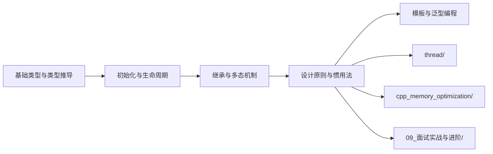

# C++ 语言深度解析 - 文档导航

> 本目录包含关于 C++ 语言核心特性、类型系统、面向对象编程与现代 C++ 最佳实践的系统性深度文章

---

## 文档结构

本文档采用**金字塔结构**组织，主文章提供全景视图，子文件深入关键概念。

### 主文章

| 文件 | 描述 | 行数 |
|------|------|------|
| **[Cpp_Language_深度解析.md](./Cpp_Language_深度解析.md)** | C++ 语言全景概览：类型系统、面向对象、现代特性演进与面试高频考点 | ~680 |

### 子文件（按主题分类）

#### 类型系统与语言基础

| 文件 | 描述 | 行数 |
|------|------|------|
| [基础类型与类型推导_详细解析.md](./01_类型系统与语言基础/基础类型与类型推导_详细解析.md) | 基本类型、auto/decltype 推导规则、类型转换、CTAD、narrowing conversion | ~700 |
| [初始化与生命周期_详细解析.md](./01_类型系统与语言基础/初始化与生命周期_详细解析.md) | 统一初始化、存储期、对象生命周期、copy elision、结构化绑定 | ~700 |

#### 面向对象编程

| 文件 | 描述 | 行数 |
|------|------|------|
| [继承与多态机制_详细解析.md](./02_面向对象编程/继承与多态机制_详细解析.md) | vtable 实现原理、虚函数开销、override/final、RTTI、多重继承、EBO | ~800 |
| [设计原则与惯用法_详细解析.md](./02_面向对象编程/设计原则与惯用法_详细解析.md) | SOLID 原则、Rule of Five、PImpl、NVI、CRTP、Copy-and-Swap | ~700 |

#### 泛型编程与模板

| 文件 | 描述 | 行数 |
|------|------|------|
| [模板基础与特化_详细解析.md](./03_泛型编程与模板/模板基础与特化_详细解析.md) | 函数模板、类模板、全特化、偏特化、特化优先级 | ~700 |
| [SFINAE与类型萃取_详细解析.md](./03_泛型编程与模板/SFINAE与类型萃取_详细解析.md) | SFINAE 原理、enable_if、类型萃取、void_t | ~900 |
| [变参模板与折叠表达式_详细解析.md](./03_泛型编程与模板/变参模板与折叠表达式_详细解析.md) | 参数包、递归展开、折叠表达式、完美转发 | ~800 |
| [高级模板技术_详细解析.md](./03_泛型编程与模板/高级模板技术_详细解析.md) | CRTP、表达式 SFINAE、模板元编程、编译期计算 | ~900 |

#### 现代 C++ 核心特性

| 文件 | 描述 | 行数 |
|------|------|------|
| [移动语义与右值引用_详细解析.md](./04_现代Cpp核心特性/移动语义与右值引用_详细解析.md) | 右值引用、移动构造、完美转发、引用折叠 | ~700 |
| [智能指针深入_详细解析.md](./04_现代Cpp核心特性/智能指针深入_详细解析.md) | unique_ptr、shared_ptr、weak_ptr、自定义删除器 | ~700 |
| [Lambda与函数式编程_详细解析.md](./04_现代Cpp核心特性/Lambda与函数式编程_详细解析.md) | Lambda 捕获、泛型 Lambda、函数对象、std::function | ~600 |
| [constexpr与编译期计算_详细解析.md](./04_现代Cpp核心特性/constexpr与编译期计算_详细解析.md) | constexpr 函数、编译期变量、if constexpr | ~500 |

#### 内存管理与资源安全

| 文件 | 描述 | 行数 |
|------|------|------|
| [RAII与资源管理_详细解析.md](./05_内存管理与资源安全/RAII与资源管理_详细解析.md) | RAII 惯用法、异常安全、Rule of Zero/Five、智能指针 | ~800 |
| [内存模型与对象布局_详细解析.md](./05_内存管理与资源安全/内存模型与对象布局_详细解析.md) | 内存对齐、对象布局、sizeof、placement new | ~700 |

#### STL 深入解析

| 文件 | 描述 | 行数 |
|------|------|------|
| [容器与迭代器_详细解析.md](./06_STL深入解析/容器与迭代器_详细解析.md) | 容器选择、迭代器失效、自定义分配器、emplace | ~900 |
| [算法与函数对象_详细解析.md](./06_STL深入解析/算法与函数对象_详细解析.md) | STL 算法、严格弱序、lambda 比较器、并行算法 | ~700 |

#### 并发编程

| 文件 | 描述 | 行数 |
|------|------|------|
| [README.md](./07_并发编程/README.md) | C++ 并发编程导航，链接至 thread/ 完整文档 | ~350 |

#### 性能优化与编译技术

| 文件 | 描述 | 行数 |
|------|------|------|
| [编译优化与链接_详细解析.md](./08_性能优化与编译技术/编译优化与链接_详细解析.md) | 编译优化选项、LTO、内联、向量化 | ~800 |
| [性能分析与调试_详细解析.md](./08_性能优化与编译技术/性能分析与调试_详细解析.md) | Profiling、缓存优化、伪共享、benchmark | ~700 |

#### 面试实战与进阶

| 文件 | 描述 | 行数 |
|------|------|------|
| [Cpp高频面试题解析_详细解析.md](./09_面试实战与进阶/Cpp高频面试题解析_详细解析.md) | 高级/专家级面试题：类型系统、模板、内存、并发、方案设计 | ~1000 |

---

## 学习路径

根据不同的学习目标，推荐以下学习路径：

### 路径一：快速入门（1-2天）

适合：想快速了解 C++ 语言全貌的开发者

```
Cpp_Language_深度解析.md（全文）
    │
    ├─→ 基础类型与类型推导_详细解析.md（auto/decltype 部分）
    │
    └─→ 继承与多态机制_详细解析.md（vtable 原理）
```

### 路径二：深入原理（1-2周）

适合：需要理解 C++ 底层机制的工程师

```
Cpp_Language_深度解析.md
    │
    ├─→ 基础类型与类型推导_详细解析.md
    │
    ├─→ 初始化与生命周期_详细解析.md
    │
    └─→ 继承与多态机制_详细解析.md
```

### 路径三：面试强化（3-5天）

适合：准备 C++ 高级/专家级面试的候选人

```
Cpp_Language_深度解析.md（面试高频考点部分）
    │
    ├─→ 继承与多态机制_详细解析.md（虚函数原理）
    │
    ├─→ 设计原则与惯用法_详细解析.md（RAII、Rule of Five）
    │
    ├─→ 基础类型与类型推导_详细解析.md（类型转换陷阱）
    │
    └─→ Cpp高频面试题解析_详细解析.md（面试实战题）
```

### 路径四：工程实践导向（3-5天）

适合：需要在项目中设计高质量 C++ 代码的开发者

```
Cpp_Language_深度解析.md
    │
    ├─→ 设计原则与惯用法_详细解析.md（PImpl、CRTP）
    │
    ├─→ 初始化与生命周期_详细解析.md（最佳实践）
    │
    └─→ 继承与多态机制_详细解析.md（性能优化）
```

---

## 进阶路线图



**推荐进阶顺序**：
1. **语言核心**：完成本文档所有子模块
2. **内存管理**：深入 `cpp_memory_optimization/` 理解 RAII、内存模型
3. **并发编程**：学习 `thread/` 掌握多线程与同步机制
4. **模板元编程**：探索泛型编程与编译期计算
5. **面试实战**：通过 `09_面试实战与进阶/` 检验学习成果

---

## 写作原则

本系列文档遵循以下写作原则：

### 1. 金字塔结构
- 主文章提供全景概览，明确"做什么"和"为什么"
- 子文件深入细节，解释"怎么做"和"如何优化"
- 每篇文章开头有核心结论，便于快速把握要点

### 2. 面向实践
- 避免纯理论推导，强调概念与实际应用的关联
- 提供具体的代码示例，使用现代 C++11/14/17 标准
- 包含常见问题、踩坑点和最佳实践

### 3. 面试导向
- 每个模块标注 Top 3 面试高频考点
- 提供追问场景与标准答案思路
- 涵盖 Undefined Behavior 的典型案例

### 4. 渐进深入
- 每个概念先给出直观解释，再展开技术细节
- 配合 ASCII 图解辅助理解内存布局
- 提供"进一步阅读"指引，满足深入学习需求

---

## 目标读者

本系列文档面向以下读者：

| 读者类型 | 背景假设 | 重点章节 |
|---------|---------|---------|
| **初级开发者** | 有 C 语言或基础 C++ 经验 | 类型系统、初始化 |
| **中级开发者** | 熟悉 C++ 语法，需要深入原理 | 虚函数机制、类型推导 |
| **高级开发者** | 需要设计高质量代码架构 | 设计惯用法、最佳实践 |
| **面试候选人** | 准备 C++ 相关技术面试 | 面试高频考点、常见陷阱 |

**前置知识**：
- 基本的编程概念（变量、函数、控制流）
- 了解面向对象基本概念（类、对象、继承）
- 不要求深入的编译原理或汇编背景（文中会解释必要概念）

---

## 核心概念速查表

### 类型系统

| 术语 | 英文 | 简要解释 | 详见 |
|------|------|---------|------|
| auto | Auto Type Deduction | 根据初始化表达式推导变量类型 | 类型推导 |
| decltype | Decltype Specifier | 返回表达式的精确类型 | 类型推导 |
| CTAD | Class Template Argument Deduction | C++17 类模板参数自动推导 | 类型推导 |
| narrowing | Narrowing Conversion | 窄化转换，可能导致精度丢失 | 类型转换 |
| UB | Undefined Behavior | 标准未定义的行为 | 语言基础 |

### 面向对象

| 术语 | 英文 | 简要解释 | 详见 |
|------|------|---------|------|
| vtable | Virtual Table | 虚函数表，实现运行时多态 | 继承与多态 |
| vptr | Virtual Pointer | 对象中指向 vtable 的隐藏指针 | 继承与多态 |
| override | Override Specifier | 确保正确重写虚函数 | 继承与多态 |
| final | Final Specifier | 禁止类被继承或虚函数被重写 | 继承与多态 |
| RTTI | Run-Time Type Information | 运行时类型信息 | 继承与多态 |
| EBO | Empty Base Optimization | 空基类优化 | 继承与多态 |
| RAII | Resource Acquisition Is Initialization | 资源获取即初始化 | 设计惯用法 |
| PImpl | Pointer to Implementation | 编译防火墙惯用法 | 设计惯用法 |
| CRTP | Curiously Recurring Template Pattern | 奇异递归模板模式 | 设计惯用法 |

---

## 参考资源

### 标准文档
- ISO/IEC 14882:2017 (C++17)
- ISO/IEC 14882:2020 (C++20)
- cppreference.com

### 权威书籍
- Stroustrup, B. - *The C++ Programming Language* (4th Edition)
- Meyers, S. - *Effective Modern C++* (C++11/14)
- Meyers, S. - *Effective C++* (3rd Edition)
- Alexandrescu, A. - *Modern C++ Design*
- Sutter, H. - *Exceptional C++*

### 在线资源
- cppreference.com - C++ 标准库参考
- CppCon YouTube Channel - 年度大会演讲
- isocpp.org - C++ 标准委员会官方
- Compiler Explorer (godbolt.org) - 在线编译探索

---

## 相关知识库

本知识库是 C++ 体系的基础部分，建议结合以下知识库学习：

- **[../thread/](../thread/)** - C++ 多线程编程深度解析
- **[../cpp_memory_optimization/](../cpp_memory_optimization/)** - C++ 内存优化技术

---

## 更新日志

| 日期 | 版本 | 更新内容 |
|------|------|----------|
| 2026-04-04 | v1.0 | 创建 C++ 语言知识库 |
| 2026-04-04 | v1.1 | 新增面试实战模块，完善文档索引 |

---

> 如有问题或建议，欢迎反馈。
