# 企业级音视频编辑SDK架构设计深度解析

> **核心结论**：以Spec Coding方法论和Harness Engineering为工程骨架，构建覆盖"采集-编辑-渲染-编码-导出"全链路的企业级音视频编辑SDK。核心竞争力在于：架构的可扩展性、编辑管线的确定性、跨平台的一致性，以及AI时代下的Spec驱动开发模式。

---

## TL;DR 核心结论表格

| 设计维度 | 关键决策 | 理由 | Four Pillars映射 |
|---------|---------|------|-----------------|
| 架构模式 | 分层架构 + Pipeline模式 | 关注点分离，管线各阶段可独立优化和替换 | Extensibility |
| 渲染引擎 | Metal(iOS) + Vulkan(Android) + GLES兼容层 | 最大化平台GPU利用率，GLES作为降级兜底 | Performance |
| 编辑模型 | Timeline-Track-Clip + Command模式 | 业界成熟方案，天然支持Undo/Redo和序列化 | Determinism |
| 跨平台策略 | C++17核心引擎 + 平台原生渲染/UI层 | 核心逻辑复用率>85%，渲染层保留平台最佳实践 | Consistency |
| 依赖管理 | FFmpeg静态裁剪 + 硬件编解码优先 | 包体可控，硬件加速保证性能，软解兜底兼容性 | Performance |
| 测试策略 | Harness驱动的四层金字塔 | 单元→集成→系统→性能，每层有明确的Harness规范 | Determinism |
| 性能目标 | 4K@30fps实时预览，导出≥2x实时 | 商业级SDK的基本门槛，低于此标准无法进入头部应用 | Performance |
| 安全合规 | DRM支持 + 内存安全 + GDPR合规 | 企业客户的硬性要求，缺失即丧失商业资格 | Security |
| AI集成 | 插件化AI管线 + CoreML/NNAPI抽象 | AI能力快速迭代，不污染核心编辑链路 | Extensibility |
| SDK分发 | SPM + CocoaPods + Maven + npm多渠道 | 覆盖全平台开发者生态，降低接入门槛 | Consistency |

---

## 一、工程师思维模型构建

> **核心结论**：企业级SDK的设计质量，取决于架构师的思维模型是否足够系统化。音视频编辑SDK的复杂度横跨计算机图形学、信号处理、操作系统、编译优化四大领域，要求工程师具备"问题空间→解空间"的完整映射能力。

### 1.1 系统性思考框架

音视频编辑SDK的设计不是一个线性的"需求→实现"过程，而是一个多维度约束下的最优解搜索问题。架构师必须同时考虑功能完备性、性能约束、平台差异、包体限制、API易用性等多个相互冲突的目标。

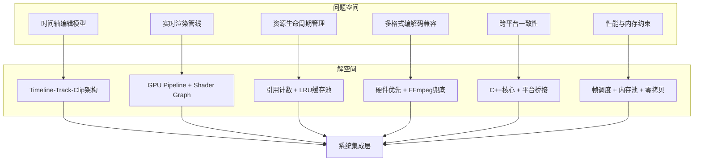

**问题空间深度分解**：

音视频编辑SDK的问题空间远比表面看到的复杂。以"时间轴模型"为例，它不仅仅是一个数据结构问题，还涉及到：

- **时间精度问题**：视频帧率(24/25/30/60fps)与音频采样率(44100/48000Hz)的最小公倍数对齐
- **非线性编辑语义**：同一素材的多次引用（虚拟拷贝 vs 实际拷贝）
- **实时预览约束**：Seek操作必须在200ms内完成，任意时间点的帧合成必须在33ms内完成
- **序列化与协作**：编辑工程文件的版本兼容性、多人协作的冲突解决

**认知金字塔模型**：

```
┌─────────────────────────┐
│     实现策略 (How)       │  ← 具体的代码实现、API设计、数据结构
├─────────────────────────┤
│     架构映射 (What)      │  ← 模块划分、组件交互、设计模式选择
├─────────────────────────┤
│     技术抽象 (Model)     │  ← 渲染管线模型、编辑语义模型、资源模型
├─────────────────────────┤
│     业务理解 (Why)       │  ← 用户场景、商业需求、竞品分析
└─────────────────────────┘
```

一个常见的反模式是直接从"实现策略"层开始设计——看到竞品有某个功能就立刻开始写代码。正确的路径应该是自底向上：先深刻理解业务场景（为什么用户需要关键帧动画？），再建立技术抽象（关键帧动画的数学模型是什么？），然后映射到架构（动画系统应该放在编辑引擎还是渲染引擎？），最后才是具体实现。

**SDK设计中的关键认知挑战**：

| 认知挑战 | 具体表现 | 应对策略 | 常见陷阱 |
|---------|---------|---------|---------|
| 时间域复杂性 | 多轨道、多帧率、音视频同步 | 统一时间基（rational time）| 使用浮点数表示时间戳 |
| 渲染管线复杂性 | 多效果叠加、实时预览性能 | DAG图调度 + GPU并行 | 每个效果独立渲染pass |
| 跨平台差异 | GPU API差异、编解码器差异 | 抽象层 + 平台策略模式 | 用条件编译处理所有差异 |
| 内存管理 | 4K视频帧 ≈ 33MB/帧(RGBA) | 帧缓存池 + 纹理复用 | 每次创建新纹理 |
| 格式兼容 | 200+视频格式、30+编码标准 | 硬件优先 + FFmpeg兜底 | 仅依赖硬件编解码 |
| API设计 | 简洁 vs 灵活的矛盾 | 分层API（简单/高级/专家） | 暴露所有内部细节 |

### 1.2 问题分解方法论

> **核心结论**：MECE（Mutually Exclusive, Collectively Exhaustive）分解法是SDK架构设计的基础工具。将一个庞大的SDK分解为互不重叠、完全穷尽的模块，是保证架构清晰度的关键。

**MECE分解法在SDK设计中的应用**：

音视频编辑SDK的功能可以按照以下维度进行MECE分解，确保每个功能点有且仅有一个模块负责：

```
音视频编辑SDK
├── 资源管理域 (Asset Domain)
│   ├── 资源导入 (Import)
│   │   ├── 本地文件导入
│   │   ├── 相册/媒体库导入
│   │   ├── 网络资源导入
│   │   └── 资源格式探测与验证
│   ├── 资源缓存 (Cache)
│   │   ├── 缩略图缓存
│   │   ├── 波形数据缓存
│   │   └── 解码帧缓存
│   └── 资源生命周期 (Lifecycle)
│       ├── 引用计数管理
│       ├── 临时文件清理
│       └── 磁盘空间监控
│
├── 编辑模型域 (Edit Model Domain)
│   ├── 时间轴模型 (Timeline)
│   │   ├── Track管理（视频轨/音频轨/字幕轨/特效轨）
│   │   ├── Clip操作（裁剪/分割/移动/复制）
│   │   └── 时间映射（变速/倒放/冻结帧）
│   ├── 效果模型 (Effects)
│   │   ├── 视频滤镜（LUT/调色/风格化）
│   │   ├── 转场效果（淡入淡出/滑动/溶解）
│   │   ├── 动画系统（关键帧/贝塞尔曲线/弹性动画）
│   │   └── 文字与贴纸（排版/动效/表情）
│   └── 操作历史 (History)
│       ├── Command栈管理
│       ├── Undo/Redo
│       └── 工程序列化/反序列化
│
├── 渲染域 (Render Domain)
│   ├── 实时预览渲染 (Preview)
│   │   ├── GPU合成管线
│   │   ├── 帧调度与丢帧策略
│   │   └── 显示同步（V-Sync / Triple Buffering）
│   ├── 离线导出渲染 (Export)
│   │   ├── 高质量渲染管线
│   │   ├── 编码器对接
│   │   └── 进度管理与取消
│   └── Shader系统
│       ├── 内置Shader库
│       ├── 自定义Shader支持
│       └── Shader编译与缓存
│
├── 编解码域 (Codec Domain)
│   ├── 视频解码
│   │   ├── 硬件解码器（VideoToolbox / MediaCodec）
│   │   └── 软件解码器（FFmpeg libavcodec）
│   ├── 视频编码
│   │   ├── H.264 / H.265 / AV1
│   │   └── 码率控制（CBR/VBR/CRF）
│   ├── 音频编解码
│   │   ├── AAC / Opus / MP3
│   │   └── 音频重采样
│   └── 容器封装
│       ├── MP4 / MOV / WebM
│       └── 元数据写入
│
└── 基础设施域 (Infrastructure Domain)
    ├── 线程管理（线程池/任务队列/优先级调度）
    ├── 内存管理（内存池/纹理缓存/零拷贝）
    ├── 日志系统（分级日志/性能埋点/崩溃收集）
    └── 平台抽象（文件系统/权限/设备能力查询）
```

**技术问题分解的四个核心维度**：

| 维度 | 典型问题 | 分解策略 | 模块归属 |
|------|---------|---------|---------|
| 渲染问题 | 效果叠加顺序、GPU利用率、Shader兼容 | 按渲染Pass分解 | Render Domain |
| 编码问题 | 格式兼容、硬件能力差异、码率控制 | 按编解码器类型分解 | Codec Domain |
| 同步问题 | 音视频同步、多轨对齐、Seek精度 | 按时间域分解 | Edit Model Domain |
| 资源管理问题 | 内存峰值、磁盘IO、缓存策略 | 按生命周期阶段分解 | Asset + Infrastructure |

**分解粒度控制**：

| 层级 | 粒度 | 示例 | 设计产物 |
|------|------|------|---------|
| 模块级 | 独立部署单元 | RenderEngine、EditEngine | 架构图、接口协议 |
| 组件级 | 模块内功能单元 | ShaderManager、FrameScheduler | 组件图、时序图 |
| 类级 | 单一职责实体 | MTLTexturePool、TimelineTrack | 类图、状态图 |
| 方法级 | 原子操作 | compositeFrame()、seekTo() | 函数签名、算法描述 |

### 1.3 技术选型决策模型

> **核心结论**：技术选型不是"用什么最新就选什么"，而是在多维约束下的加权决策过程。使用决策矩阵可以将主观判断转化为可量化、可追溯的选型过程。

**决策矩阵模板——权重评分法**：

决策矩阵将每个候选方案按照预设维度打分（1-5分），乘以该维度的权重（总和=1.0），得到加权总分。最终选择总分最高的方案。关键在于权重的设定需要团队共识，且必须在选型前确定，避免"先射箭再画靶"。

**案例1：渲染引擎选型**

| 评估维度 | 权重 | Metal | OpenGL ES | Vulkan | 跨平台抽象层(ANGLE) |
|---------|------|-------|-----------|--------|-------------------|
| iOS性能 | 0.25 | 5 | 3 | N/A | 3 |
| Android性能 | 0.20 | N/A | 3 | 5 | 3 |
| 开发效率 | 0.15 | 4 | 4 | 2 | 4 |
| 功能完备性 | 0.15 | 5 | 3 | 5 | 3 |
| 生态成熟度 | 0.10 | 4 | 5 | 3 | 3 |
| 未来演进 | 0.10 | 5 | 1 | 5 | 3 |
| 调试工具链 | 0.05 | 5 | 3 | 3 | 2 |
| **加权总分** | | **iOS: 4.60** | **3.15** | **Android: 4.25** | **3.10** |

**最终决策**：采用 **Metal(iOS/macOS) + Vulkan(Android)** 双原生引擎策略，OpenGL ES 3.0作为Android低端设备兼容层。

**案例2：编辑数据模型选型**

| 评估维度 | 权重 | Timeline-Track-Clip | DAG节点图 | 函数式管线 |
|---------|------|-------------------|----------|-----------|
| 概念直观性 | 0.20 | 5 | 3 | 2 |
| Undo/Redo支持 | 0.20 | 4 | 3 | 5 |
| 性能表现 | 0.15 | 4 | 4 | 3 |
| 扩展能力 | 0.15 | 3 | 5 | 4 |
| 序列化复杂度 | 0.10 | 4 | 3 | 4 |
| 业界成熟度 | 0.10 | 5 | 4 | 2 |
| 多人协作适配 | 0.10 | 4 | 3 | 3 |
| **加权总分** | | **4.20** | **3.55** | **3.35** |

**最终决策**：采用 **Timeline-Track-Clip** 作为主编辑模型，在效果编排子系统中引入轻量级DAG图来处理复杂的效果组合逻辑。

**ADR-001：为何选择Metal + Vulkan双原生引擎策略**

```
┌─────────────────────────────────────────────────────┐
│ ADR-001: 渲染引擎技术选型                              │
├─────────────────────────────────────────────────────┤
│ 状态: 已采纳 (Accepted)                               │
│ 日期: 2026-01-15                                     │
│ 决策者: SDK架构组                                     │
├─────────────────────────────────────────────────────┤
│ 上下文:                                              │
│ SDK需要在iOS和Android双平台提供4K实时编辑能力。         │
│ 性能是核心竞品壁垒，渲染管线占总耗时60%以上。           │
│ OpenGL ES在iOS上已被Apple标记为Deprecated。            │
├─────────────────────────────────────────────────────┤
│ 决策:                                                │
│ iOS/macOS平台使用Metal作为唯一图形后端。                │
│ Android平台使用Vulkan为主，OpenGL ES 3.0为兼容层。     │
│ 抽象RenderBackend接口，上层代码不直接依赖具体图形API。  │
├─────────────────────────────────────────────────────┤
│ 后果:                                                │
│ (+) 双平台均可获得接近硬件极限的渲染性能                │
│ (+) Metal/Vulkan均支持Compute Shader，利于AI推理集成   │
│ (-) 渲染层代码无法直接复用，需维护两套实现               │
│ (-) Vulkan开发复杂度高，需要投入更多Android工程资源     │
│ (!) 缓解措施：抽象接口+共享Shader逻辑(SPIRV-Cross)     │
└─────────────────────────────────────────────────────┘
```

### 1.4 权衡决策矩阵

> **核心结论**：所有架构决策都是权衡（Trade-off）。不存在"完美方案"，只有"在当前约束下的最优解"。关键是让权衡过程显性化、可追溯。

**关键权衡维度**：

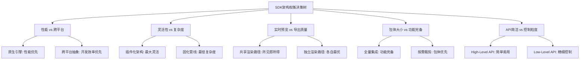

**核心权衡决策记录**：

| 权衡决策 | 选项A | 选项B | 最终选择 | 理由 | 缓解措施 |
|---------|-------|-------|---------|------|---------|
| 渲染引擎 | 原生(Metal+Vulkan)各自最优 | 跨平台(ANGLE/BGFX)统一代码 | 选项A | 性能差距15-30%，4K编辑场景不可接受 | 抽象RenderBackend接口，共享上层逻辑 |
| 编辑模型 | Timeline-Track-Clip成熟方案 | DAG节点图最大灵活 | A为主+B补充 | TTC覆盖90%场景，DAG用于复杂效果编排 | 效果子系统内部使用轻量DAG |
| 编解码 | 纯硬件编解码 | 纯FFmpeg软件编解码 | 硬件优先+软件兜底 | 硬件省电快速，但格式支持有限 | 能力探测+动态降级策略 |
| 内存策略 | 预分配大内存池 | 按需动态分配 | 混合策略 | 帧缓冲预分配（确定性），其他按需 | 内存监控+OOM预防机制 |
| API设计 | 极简High-Level | 全功能Low-Level | 分层设计 | 不同客户需求差异大 | 三层API：Simple/Advanced/Expert |
| 线程模型 | GCD/线程池自动调度 | 手动线程管理 | 混合策略 | 渲染/编码线程需确定性，其他任务自动调度 | 关键路径固定线程+非关键路径线程池 |

---

## 二、SDK需求全生命周期管理

> **核心结论**：一个企业级SDK的成功，70%取决于需求管理的质量。采用Spec Coding方法论，将需求从模糊的"我们需要一个视频编辑SDK"转化为精确的、可验证的、可追溯的工程规范。

### 2.1 需求定义阶段 (Define)

**功能需求(FR)完整清单**：

功能需求按照领域分组，每个需求有唯一编号、优先级（P0=必须/P1=重要/P2=可选）、验收标准：

| 编号 | 功能描述 | 优先级 | 验收标准 |
|------|---------|--------|---------|
| FR-EDIT-001 | 视频裁剪（时间维度） | P0 | 支持帧精度裁剪，误差<1帧 |
| FR-EDIT-002 | 视频分割 | P0 | 分割点精确到帧，操作耗时<100ms |
| FR-EDIT-003 | 多片段拼接 | P0 | 支持≥50个片段，拼接无缝隙 |
| FR-EDIT-004 | 变速播放（0.25x-4x） | P0 | 音频变速不变调，画面平滑 |
| FR-EDIT-005 | 转场效果 | P0 | ≥20种内置转场，支持自定义扩展 |
| FR-EDIT-006 | 视频滤镜/调色 | P0 | LUT支持 + 参数化调色（亮度/对比度/饱和度等12项） |
| FR-EDIT-007 | 文字添加 | P1 | 富文本支持、描边阴影、入场出场动画 |
| FR-EDIT-008 | 贴纸/水印 | P1 | PNG/APNG/GIF支持，可缩放旋转 |
| FR-EDIT-009 | 画中画(PiP) | P1 | 支持任意位置放置、关键帧动画 |
| FR-EDIT-010 | 关键帧动画 | P1 | 位置/缩放/旋转/透明度，贝塞尔缓动曲线 |
| FR-RENDER-001 | 实时预览 | P0 | 1080p@30fps稳定预览，丢帧率<5% |
| FR-RENDER-002 | Seek预览 | P0 | 任意位置Seek响应<200ms |
| FR-RENDER-003 | 多轨合成 | P0 | ≥8视频轨 + 4音频轨同时渲染 |
| FR-RENDER-004 | HDR渲染 | P2 | 支持HDR10/HLG输入，正确ToneMapping |
| FR-RENDER-005 | 自定义Shader | P2 | 开放Shader扩展接口，支持MSL/GLSL |
| FR-EXPORT-001 | H.264编码导出 | P0 | 硬件编码，支持CBR/VBR/CRF |
| FR-EXPORT-002 | H.265编码导出 | P0 | 硬件编码优先，软编兜底 |
| FR-EXPORT-003 | 多分辨率导出 | P0 | 480p/720p/1080p/4K，自定义分辨率 |
| FR-EXPORT-004 | 导出进度与取消 | P0 | 实时进度回调，支持暂停恢复取消 |
| FR-EXPORT-005 | 后台导出 | P1 | iOS后台导出支持，Android前台服务 |
| FR-ASSET-001 | 本地视频导入 | P0 | 支持MP4/MOV/AVI/MKV/WebM |
| FR-ASSET-002 | 相册媒体导入 | P0 | PHAsset/MediaStore对接 |
| FR-ASSET-003 | 音频资源管理 | P0 | MP3/AAC/WAV/FLAC导入与解码 |
| FR-ASSET-004 | 图片资源管理 | P1 | JPEG/PNG/HEIC/WebP支持 |
| FR-ASSET-005 | 网络资源预加载 | P2 | HTTP(S)资源下载+缓存管理 |

**非功能需求(NFR)完整清单**：

| 编号 | 需求描述 | 具体指标 | 测量方法 |
|------|---------|---------|---------|
| NFR-PERF-001 | 4K实时预览帧率 | ≥ 30fps（单轨+2滤镜） | 帧率监控埋点 |
| NFR-PERF-002 | 1080p导出速度 | ≥ 2x实时速度 | 导出耗时/视频时长 |
| NFR-PERF-003 | Seek响应延迟 | ≤ 200ms（1080p素材） | Seek指令到首帧渲染 |
| NFR-PERF-004 | 冷启动耗时 | ≤ 500ms（SDK初始化） | 首个API可用的时间 |
| NFR-MEM-001 | 运行内存峰值 | < 设备可用内存60% | Instruments/Profiler |
| NFR-MEM-002 | 纹理缓存上限 | ≤ 256MB（可配置） | GPU内存监控 |
| NFR-SIZE-001 | SDK包体大小 | ≤ 15MB（核心模块） | 编译产物大小 |
| NFR-SIZE-002 | 全量功能包体 | ≤ 30MB（含AI模块） | 编译产物大小 |
| NFR-COMPAT-001 | iOS最低版本 | iOS 15.0+ | 编译+运行验证 |
| NFR-COMPAT-002 | Android最低版本 | API 28 (Android 9.0)+ | 编译+运行验证 |
| NFR-STAB-001 | 崩溃率 | < 0.01%（千分之一） | Crash监控平台 |
| NFR-SEC-001 | DRM内容保护 | FairPlay(iOS) + Widevine(Android) | DRM合规测试 |
| NFR-SEC-002 | 数据安全 | 临时文件加密、内存敏感数据清除 | 安全审计 |

**GWT用户故事示例**：

```gherkin
Feature: 视频裁剪功能
  作为一个视频编辑应用的开发者
  我希望通过SDK的裁剪API精确裁剪视频
  以便我的用户能快速截取视频中的精彩片段

  Scenario: 帧精度裁剪
    Given 已导入一个30fps、时长60秒的1080p视频
    When 调用trim(startTime: 10.033, endTime: 25.066)
    Then 裁剪后的视频起始帧为第301帧(10.033s)
    And 裁剪后的视频结束帧为第752帧(25.066s)
    And 裁剪后的视频时长为15.033秒 ± 1帧精度
    And 裁剪操作耗时不超过100ms

  Scenario: 裁剪后预览
    Given 已对视频执行裁剪操作
    When 在预览播放器中播放
    Then 播放起始点为裁剪后的起始帧
    And 播放内容与原始视频裁剪区间一致
    And 音视频保持同步，偏差<40ms

Feature: 导出功能
  作为一个视频编辑应用的开发者
  我希望通过SDK将编辑结果导出为标准视频文件
  以便最终用户能在任意播放器中观看编辑成果

  Scenario: 1080p H.264导出
    Given 已完成一个含3个片段、2个转场、1个滤镜的编辑工程
    When 调用export(resolution: 1080p, codec: H264, quality: .high)
    Then 导出速度不低于2倍实时速度
    And 输出文件为有效的MP4容器
    And 输出视频分辨率为1920x1080
    And 音视频同步偏差<20ms
    And 导出过程中progress回调连续递增至1.0
```

**约束清单**：

```
技术约束:
├── TC-001: iOS平台必须使用Metal渲染（OpenGL ES已Deprecated）
├── TC-002: Android平台Vulkan可用率约75%，必须保留GLES兜底
├── TC-003: C++核心代码必须兼容C++17标准
├── TC-004: 不能使用GPL协议的第三方库（LGPL的FFmpeg需静态链接豁免）
├── TC-005: iOS硬件编码器最多同时实例化3个
└── TC-006: Android硬件编解码器行为因厂商而异，需兼容性矩阵

业务约束:
├── BC-001: SDK首版交付周期6个月
├── BC-002: 核心团队8人（iOS 3人、Android 3人、C++ 2人）
├── BC-003: 必须支持中国大陆+海外双市场
└── BC-004: 定价模式为按月/年订阅，需支持License鉴权

性能约束:
├── PC-001: 目标设备 iPhone 12+ / 骁龙778G+
├── PC-002: 最大支持4K 60fps素材编辑
├── PC-003: 最大工程时长30分钟
└── PC-004: 内存使用不得触发iOS内存警告
```

### 2.2 架构设计阶段 (Design)

**ADR（架构决策记录）完整清单**：

#### ADR-001: 整体架构模式选择

```
状态: Accepted
上下文:
  SDK需要同时服务移动端(iOS/Android)和桌面端(macOS)，
  核心功能包括视频编辑、实时渲染、编解码导出三大管线。
  需要高扩展性以支持未来的AI能力接入。

决策:
  采用"分层架构 + Pipeline模式"的混合架构。
  - 垂直方向: 四层分层（平台适配→API接口→核心引擎→基础设施）
  - 水平方向: 核心引擎内部采用Pipeline模式（编辑→渲染→编码）
  - 扩展机制: Plugin接口（效果插件、编码插件、AI插件）

后果:
  (+) 各层职责明确，可独立测试和演进
  (+) Pipeline模式天然支持流式处理和并行优化
  (+) Plugin机制支持第三方扩展和AI能力热插拔
  (-) 分层带来一定的调用开销（可通过内联优化消除）
  (-) 需要精心设计层间接口，避免抽象泄露
```

#### ADR-002: 跨平台策略

```
状态: Accepted
上下文:
  SDK需要同时支持iOS和Android，未来可能扩展到macOS和Windows。
  团队C++经验丰富，iOS和Android各有专人。

决策:
  采用"C++核心 + 平台原生渲染"策略:
  - C++层: 编辑模型、音频处理、帧调度、格式解析（复用率>85%）
  - 平台层: GPU渲染(Metal/Vulkan)、硬件编解码、UI桥接
  - 桥接层: iOS用Objective-C++, Android用JNI

后果:
  (+) 核心业务逻辑只写一次，一致性有保障
  (+) 渲染层充分利用平台GPU能力
  (-) 需要维护桥接层代码
  (-) C++编译和调试复杂度较高
  (!) 缓解: 使用CMake统一构建，ASAN/TSAN辅助排查内存/线程问题
```

#### ADR-003: 编辑模型选择

```
状态: Accepted
上下文:
  编辑模型是SDK最核心的数据结构，决定了编辑功能的表达能力、
  Undo/Redo的实现方式、工程文件的序列化格式。

决策:
  采用"Timeline-Track-Clip + Command模式":
  - 主数据结构: Timeline包含多个Track，Track包含多个Clip
  - 操作模式: 所有编辑操作封装为Command对象
  - 效果系统: Clip上可挂载Effect链，Effect内部使用轻量DAG
  - 序列化: Protocol Buffers格式，支持版本迁移

后果:
  (+) 概念直观，与行业标准（Final Cut、Premiere）一致
  (+) Command模式天然支持Undo/Redo
  (+) Protobuf序列化紧凑高效，跨平台一致
  (-) 复杂效果组合（如蒙版+跟踪+调色）表达能力有限
  (!) 缓解: Effect内部引入小型DAG图处理复杂组合
```

#### ADR-004: 渲染策略

```
状态: Accepted
上下文:
  实时预览和最终导出对渲染质量、性能的要求不同。
  预览要求低延迟（33ms/帧），导出要求高质量（抗锯齿、高精度色彩）。

决策:
  采用"双模渲染管线"策略:
  - 预览模式: 降分辨率渲染 + 简化Shader + 丢帧策略
  - 导出模式: 全分辨率渲染 + 完整效果链 + 高精度色彩管线
  - 共享: 相同的合成逻辑和Shader代码，通过Quality参数切换

后果:
  (+) 预览流畅度有保障（可在低端设备降到720p预览）
  (+) 导出质量不受预览性能妥协影响
  (+) 共享Shader代码确保所见即所得
  (-) 需要维护Quality参数相关的分支逻辑
  (-) 极端情况下预览效果与导出可能有微小差异
```

**核心接口规范**：

```cpp
// === Core API Interface (C++) ===

namespace avsdk {

// 时间类型：有理数表示，避免浮点精度问题
struct RationalTime {
    int64_t value;      // 分子
    int32_t timescale;  // 分母（如30000表示30fps，使用30000/1001表示29.97fps）
    
    double toSeconds() const { return static_cast<double>(value) / timescale; }
    int64_t toFrameIndex(int32_t fps) const { return value * fps / timescale; }
};

struct TimeRange {
    RationalTime start;
    RationalTime duration;
    
    RationalTime end() const;
    bool contains(RationalTime time) const;
    bool overlaps(TimeRange other) const;
};

// 编辑引擎核心接口
class IEditEngine {
public:
    virtual ~IEditEngine() = default;
    
    // Timeline管理
    virtual std::shared_ptr<ITimeline> createTimeline(const TimelineConfig& config) = 0;
    virtual Result<void> loadProject(const std::string& path) = 0;
    virtual Result<void> saveProject(const std::string& path) = 0;
    
    // 操作执行
    virtual Result<void> executeCommand(std::unique_ptr<ICommand> cmd) = 0;
    virtual bool canUndo() const = 0;
    virtual bool canRedo() const = 0;
    virtual Result<void> undo() = 0;
    virtual Result<void> redo() = 0;
};

// 渲染引擎核心接口
class IRenderEngine {
public:
    virtual ~IRenderEngine() = default;
    
    // 预览控制
    virtual Result<void> attachPreviewSurface(void* nativeSurface) = 0;
    virtual Result<void> startPreview() = 0;
    virtual Result<void> pausePreview() = 0;
    virtual Result<void> seekTo(RationalTime time) = 0;
    
    // 单帧渲染
    virtual Result<FrameBuffer> renderFrame(RationalTime time, RenderQuality quality) = 0;
};

// 导出引擎核心接口
class IExportEngine {
public:
    virtual ~IExportEngine() = default;
    
    virtual Result<void> startExport(const ExportConfig& config) = 0;
    virtual Result<void> pauseExport() = 0;
    virtual Result<void> resumeExport() = 0;
    virtual Result<void> cancelExport() = 0;
    
    // 回调
    virtual void setProgressCallback(std::function<void(float progress)> callback) = 0;
    virtual void setCompletionCallback(std::function<void(Result<std::string> outputPath)> callback) = 0;
};

} // namespace avsdk
```

**API设计原则**：

| 原则 | 描述 | 正面示例 | 反面示例 |
|------|------|---------|---------|
| 最小惊讶 | API行为符合开发者直觉 | `clip.trim(start, end)` | `clip.modify(TRIM, {s, e})` |
| 类型安全 | 编译期捕获错误 | `RationalTime`强类型 | `double`表示时间 |
| 不可变优先 | 减少状态管理负担 | Command返回新Timeline | 直接修改Timeline |
| 错误显式化 | 用Result类型而非异常 | `Result<void>` | `throw Exception` |
| 资源自动管理 | RAII + shared_ptr | 自动释放GPU纹理 | 手动调用release() |
| 线程安全文档化 | 明确标注线程约束 | `@MainThread void play()` | 不标注线程要求 |

### 2.3 开发阶段 (Develop)

**模块依赖关系**：

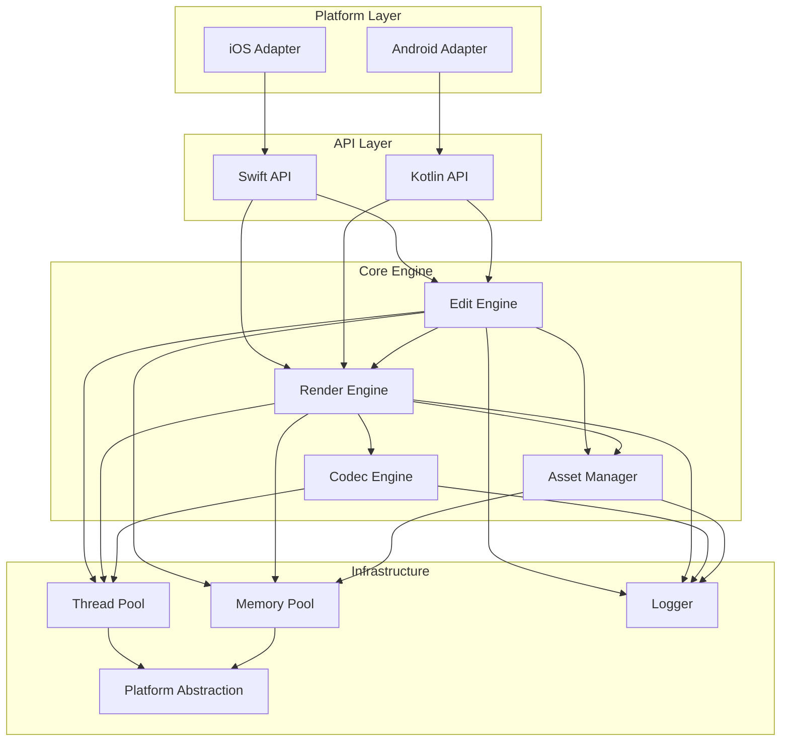

**各模块职责边界定义**：

| 模块 | 核心职责 | 不负责的事情 | 关键接口 |
|------|---------|------------|---------|
| EditEngine | 编辑模型管理、Command执行、Undo/Redo | 不负责渲染和编解码 | IEditEngine, ITimeline, ICommand |
| RenderEngine | GPU合成、Shader执行、帧输出 | 不负责编辑语义和资源加载 | IRenderEngine, IShader, ICompositor |
| CodecEngine | 视频解码、视频编码、格式封装 | 不负责渲染效果和编辑逻辑 | IDecoder, IEncoder, IMuxer |
| AssetManager | 资源加载、缓存、生命周期 | 不负责编辑操作和渲染 | IAssetLoader, ICache, IAssetPool |
| ThreadPool | 线程调度、任务队列、优先级 | 不负责业务逻辑 | ITaskQueue, IScheduler |
| MemoryPool | 内存分配、纹理缓存、OOM预防 | 不负责业务逻辑 | IMemoryAllocator, ITexturePool |

**第三方依赖选型**：

| 依赖 | 用途 | 版本策略 | 许可证 | 包体影响 |
|------|------|---------|--------|---------|
| FFmpeg | 软件编解码兜底 | 6.x, 静态裁剪编译 | LGPL 2.1 | ~5MB(裁剪后) |
| libwebp | WebP图片解码 | 最新稳定版 | BSD | ~0.5MB |
| protobuf-lite | 工程文件序列化 | 3.x | BSD | ~0.3MB |
| stb_image | 图片加载辅助 | Header-only | Public Domain | ~0.1MB |
| glm | 数学库 | Header-only | MIT | 0 (header) |
| spdlog | 日志系统 | Header-only | MIT | 0 (header) |

**测试策略金字塔**：

```
            ╱╲
           ╱  ╲        性能测试 (Performance)
          ╱    ╲       - 帧率基准测试
         ╱ PERF ╲      - 内存峰值测试
        ╱────────╲     - 导出速度测试
       ╱          ╲
      ╱  系统测试   ╲    系统测试 (System/E2E)
     ╱   (System)   ╲   - 完整编辑→导出流程
    ╱────────────────╲  - 多素材混合场景
   ╱                  ╲
  ╱    集成测试         ╲  集成测试 (Integration)
 ╱    (Integration)     ╲ - 模块间协作验证
╱────────────────────────╲- 渲染+编码管线联调
╱                          ╲
╱     单元测试 (Unit)        ╲ 单元测试
╱  覆盖率目标: 核心模块≥80%   ╲ - 数据结构正确性
╱──────────────────────────────╲- 算法准确性
```

| 测试层级 | 覆盖目标 | 执行频率 | 执行环境 | 超时限制 |
|---------|---------|---------|---------|---------|
| 单元测试 | 核心模块≥80%行覆盖 | 每次提交 | CI (Linux/macOS) | 5分钟 |
| 集成测试 | 模块间接口100%覆盖 | 每次MR | CI (iOS/Android模拟器) | 15分钟 |
| 系统测试 | 核心场景100%覆盖 | 每日 | 真机Farm | 30分钟 |
| 性能测试 | 关键路径性能基准 | 每周 | 固定基准设备 | 60分钟 |

### 2.4 部署运维阶段 (Deliver)

**SDK分发策略矩阵**：

| 平台 | 分发渠道 | 包格式 | 自动化工具 |
|------|---------|--------|-----------|
| iOS | CocoaPods + SPM | .xcframework | fastlane + pod trunk |
| Android | Maven Central | .aar | Gradle publish plugin |
| macOS | SPM + 手动集成 | .xcframework | xcodebuild archive |
| Web | npm | .wasm + .js | wasm-pack + npm publish |
| Flutter | pub.dev | Plugin package | flutter pub publish |

**版本管理规范（Semantic Versioning）**：

```
版本号格式: MAJOR.MINOR.PATCH-PRE_RELEASE+BUILD_METADATA
示例: 2.3.1-beta.2+build.456

MAJOR: 不兼容的API变更（移除/重命名公开API）
MINOR: 向后兼容的功能新增（新增API、新增效果）
PATCH: 向后兼容的缺陷修复（Bug fix、性能优化）
```

**版本兼容性矩阵**：

| SDK版本 | 工程文件版本 | iOS最低版本 | Xcode版本 | 状态 |
|---------|------------|-----------|----------|------|
| 1.0.x | v1 | iOS 15.0 | 14.0+ | 维护 |
| 1.1.x | v1, v2 | iOS 15.0 | 14.0+ | 维护 |
| 2.0.x | v2, v3 | iOS 16.0 | 15.0+ | 活跃 |
| 2.1.x | v2, v3, v4 | iOS 16.0 | 15.0+ | 开发中 |

**性能监控体系**：

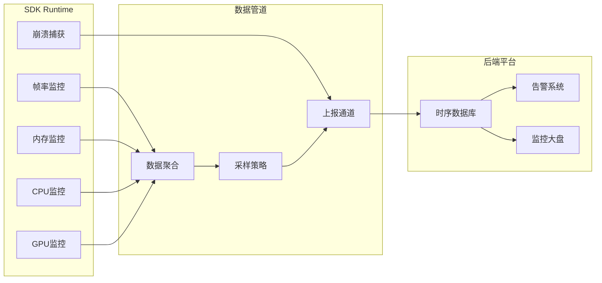

**安全合规清单**：

| 合规项 | 要求 | 实现方案 | 验证方法 |
|-------|------|---------|---------|
| DRM保护 | 支持加密内容播放/编辑 | FairPlay(iOS) + Widevine(Android) | DRM合规认证测试 |
| 数据加密 | 临时文件不泄露用户内容 | AES-256加密临时文件 | 安全审计 + 渗透测试 |
| 内存安全 | 敏感数据不残留内存 | 使用后memset_s清零 | ASAN + 内存扫描 |
| 隐私合规 | GDPR/CCPA合规 | 不收集用户内容数据 | 隐私影响评估(PIA) |
| 代码安全 | 防止SDK被逆向 | 代码混淆 + 关键逻辑C++ | 逆向工程测试 |
| 供应链安全 | 第三方库无已知漏洞 | 定期CVE扫描 + 依赖锁定 | SBOM + 漏洞扫描 |

---

## 三、宏观架构设计

> **核心结论**：企业级音视频编辑SDK的架构必须是"分层+管线"的混合模式。垂直方向用分层隔离关注点（平台适配→API接口→核心引擎→基础设施），水平方向用Pipeline模式串联数据流（解码→编辑→渲染→编码）。这种架构在保证模块独立性的同时，支持高效的流式数据处理。

### 3.1 整体架构蓝图

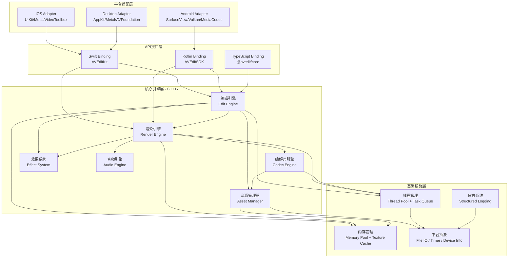

**各层职责定义**：

| 层级 | 核心职责 | 关键约束 | 代码语言 | 代码复用率 |
|------|---------|---------|---------|----------|
| 平台适配层 | 对接平台原生API（UI、GPU、硬件编解码） | 不包含业务逻辑，仅做API转换 | Swift/Kotlin/ObjC | 0%（各平台独立） |
| API接口层 | 提供开发者友好的类型安全API | 封装C++接口为平台惯用模式 | Swift/Kotlin/TS | 30%（接口定义共享） |
| 核心引擎层 | 实现编辑/渲染/编解码全部核心逻辑 | C++17标准，无平台依赖 | C++ | 90%+ |
| 基础设施层 | 提供跨平台基础能力 | 通过编译宏切换平台实现 | C++ | 85%+ |

**架构设计原则**：

1. **依赖倒置**：上层模块不依赖下层具体实现，依赖抽象接口。RenderEngine不直接调用Metal API，而是通过`IRenderBackend`接口。
2. **单向依赖**：层间依赖严格自上而下，禁止反向依赖和跨层依赖。
3. **接口隔离**：每个模块暴露最小必要接口，内部实现对外完全黑盒。
4. **开闭原则**：通过Plugin接口扩展新效果/新编码器，无需修改核心代码。

### 3.2 技术栈选择

> **核心结论**：技术栈的选择不是追逐最新技术，而是在性能、稳定性、生态、团队能力四个维度的最优平衡点。C++17作为核心语言，Metal/Vulkan作为图形后端，FFmpeg作为编解码兜底，这套组合是当前工业界验证最充分的方案。

**核心技术栈全景**：

| 技术领域 | 选型 | 备选方案 | 选型理由 |
|---------|------|---------|--------|
| 核心语言 | C++ 17 (部分C++20特性) | Rust, C | C++生态最成熟，团队经验丰富，与FFmpeg/GPU API天然兼容 |
| iOS图形 | Metal 3 | OpenGL ES(Deprecated) | Apple唯一官方支持的现代GPU API |
| Android图形 | Vulkan 1.1 + GLES 3.0兼容层 | 纯GLES | Vulkan性能优势明显，GLES兜底低端设备 |
| Shader语言 | MSL(Metal) + SPIR-V(Vulkan) | GLSL统一 | 原生Shader语言性能最优，SPIRV-Cross转换共享逻辑 |
| iOS编解码 | VideoToolbox | AVAssetWriter | VT提供最底层控制，支持硬件编解码精细参数 |
| Android编解码 | MediaCodec (NDK) | MediaCodec(Java) | NDK接口避免JNI开销，支持Surface直接输出 |
| 软件编解码 | FFmpeg 6.x (静态裁剪) | libde265+x264 | FFmpeg格式最全面，裁剪编译控制包体 |
| 音频引擎 | 自研(基于AudioUnit/AAudio) | Oboe | 自研可控性最强，低延迟音频处理 |
| 数学库 | glm (Header-only) | Eigen | glm面向图形学设计，API与GLSL一致 |
| 序列化 | Protocol Buffers Lite | FlatBuffers, JSON | Protobuf紧凑高效，版本迁移能力强 |
| 构建系统 | CMake 3.22+ | Bazel, GN | CMake跨平台支持最好，IDE集成度高 |
| 包管理 | vcpkg + CMake FetchContent | Conan | vcpkg与CMake集成最紧密 |
| CI/CD | GitHub Actions + Fastlane | Jenkins | 云原生CI，无需自建基础设施 |

**编程语言分层使用策略**：

```
┌──────────────────────────────────────────────────────┐
│  Swift / Kotlin / TypeScript    ← 开发者直接使用的API  │
├──────────────────────────────────────────────────────┤
│  Objective-C++ / JNI (C++)      ← 桥接层（薄层）      │
├──────────────────────────────────────────────────────┤
│  C++ 17                         ← 核心引擎（85%代码）  │
├──────────────────────────────────────────────────────┤
│  MSL / SPIR-V / GLSL           ← GPU Shader代码      │
├──────────────────────────────────────────────────────┤
│  C (FFmpeg/系统API)             ← 底层库接口           │
└──────────────────────────────────────────────────────┘
```

**图形API能力对比**：

| 能力 | Metal 3 | Vulkan 1.3 | OpenGL ES 3.2 |
|------|---------|------------|---------------|
| Compute Shader | 完整支持 | 完整支持 | 有限支持(3.1+) |
| 多线程CommandBuffer | 原生支持 | 原生支持 | 不支持 |
| 内存管理 | 手动+自动 | 完全手动 | 驱动管理 |
| Shader编译 | AIR→机器码(离线) | SPIR-V→机器码(离线) | GLSL→机器码(运行时) |
| 调试工具 | GPU Capture (Xcode) | RenderDoc | Mali Graphics Debugger |
| 最大纹理尺寸 | 16384×16384 | 设备相关(通常16384) | 设备相关(通常4096-8192) |
| Tile-Based渲染 | 原生优化 | 扩展支持 | 透明优化 |
| Ray Tracing | Metal 3支持 | VK_KHR_ray_tracing | 不支持 |

### 3.3 跨平台策略

> **核心结论**：跨平台的核心原则是"最大化复用，最小化妥协"。C++核心逻辑复用率>85%，但GPU渲染和硬件编解码必须使用平台原生API以获得最佳性能。通过精心设计的抽象层，将平台差异隔离在最底层。

**跨平台架构层次**：

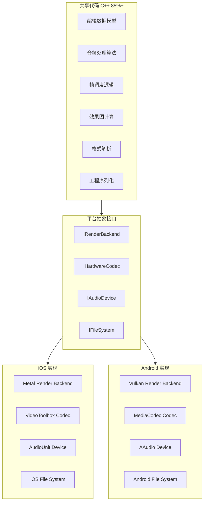

**平台抽象接口设计（C++）**：

```cpp
namespace avsdk {

// GPU渲染后端抽象
class IRenderBackend {
public:
    virtual ~IRenderBackend() = default;
    
    // 纹理管理
    virtual TextureHandle createTexture(const TextureDescriptor& desc) = 0;
    virtual void destroyTexture(TextureHandle handle) = 0;
    virtual void uploadTextureData(TextureHandle handle, const void* data, size_t size) = 0;
    
    // 渲染Pass
    virtual RenderPassHandle beginRenderPass(const RenderPassDescriptor& desc) = 0;
    virtual void endRenderPass(RenderPassHandle pass) = 0;
    
    // Shader与Pipeline
    virtual ShaderHandle loadShader(const std::string& name, ShaderStage stage) = 0;
    virtual PipelineHandle createPipeline(const PipelineDescriptor& desc) = 0;
    
    // 绘制命令
    virtual void draw(const DrawCommand& cmd) = 0;
    virtual void dispatch(const ComputeCommand& cmd) = 0;
    
    // 同步
    virtual void commit() = 0;
    virtual void waitUntilCompleted() = 0;
};

// 硬件编解码器抽象
class IHardwareCodec {
public:
    virtual ~IHardwareCodec() = default;
    
    // 能力查询
    virtual CodecCapabilities queryCapabilities(CodecType type) = 0;
    virtual bool isHardwareAccelerated(CodecType type) = 0;
    
    // 解码器
    virtual std::unique_ptr<IDecoder> createDecoder(const DecoderConfig& config) = 0;
    
    // 编码器
    virtual std::unique_ptr<IEncoder> createEncoder(const EncoderConfig& config) = 0;
};

// 平台工厂
class PlatformFactory {
public:
    static std::unique_ptr<IRenderBackend> createRenderBackend(RenderAPI api);
    static std::unique_ptr<IHardwareCodec> createHardwareCodec();
    static std::unique_ptr<IAudioDevice> createAudioDevice();
};

} // namespace avsdk
```

**平台差异处理策略**：

| 差异维度 | iOS特性 | Android特性 | 抽象策略 |
|---------|---------|------------|--------|
| GPU API | Metal (统一、稳定) | Vulkan/GLES (碎片化) | IRenderBackend + 运行时能力探测 |
| 硬件编码 | VideoToolbox (一致) | MediaCodec (厂商差异大) | IHardwareCodec + 兼容性矩阵 |
| 内存模型 | 统一内存架构(UMA) | 独立/统一均有 | 内存分配策略配置化 |
| 文件系统 | 沙盒，Photos框架 | Scoped Storage | IFileSystem + 权限抽象 |
| 后台执行 | BGTaskScheduler | Foreground Service | IBackgroundTask接口 |
| 音频延迟 | CoreAudio (~5ms) | AAudio/OpenSL (~10-30ms) | IAudioDevice + 缓冲区自适应 |
| Shader编译 | 离线编译为AIR | SPIR-V离线或GLSL运行时 | Shader变体管理系统 |
| 线程模型 | GCD + pthread | Java Thread + pthread | 统一C++线程池 |

**代码复用率分析**：

```
代码复用率分布：
├── 编辑模型层：98% 复用（纯C++数据结构和算法）
├── 音频处理层：95% 复用（算法共享，设备接口平台化）
├── 帧调度层：92% 复用（调度逻辑共享，计时器平台化）
├── 效果计算层：88% 复用（效果参数和图共享，Shader各平台独立）
├── 渲染管线层：40% 复用（合成逻辑共享，GPU指令各平台独立）
├── 编解码层：35% 复用（封装/解封装共享，硬件编解码各平台独立）
└── 平台桥接层：0% 复用（纯平台代码）

总体复用率：约 72-78%（按代码行计算）
核心引擎复用率：约 85-90%（不含渲染和编解码后端）
```

---

## 四、中观模块设计

> **核心结论**：中观模块设计是连接宏观架构和微观实现的桥梁。每个模块必须有清晰的职责边界、明确的输入输出、最小化的外部依赖。编辑引擎、渲染引擎、编解码引擎三大核心模块的设计质量，直接决定SDK的可维护性和可扩展性。

### 4.1 核心模块划分

**模块架构图**：

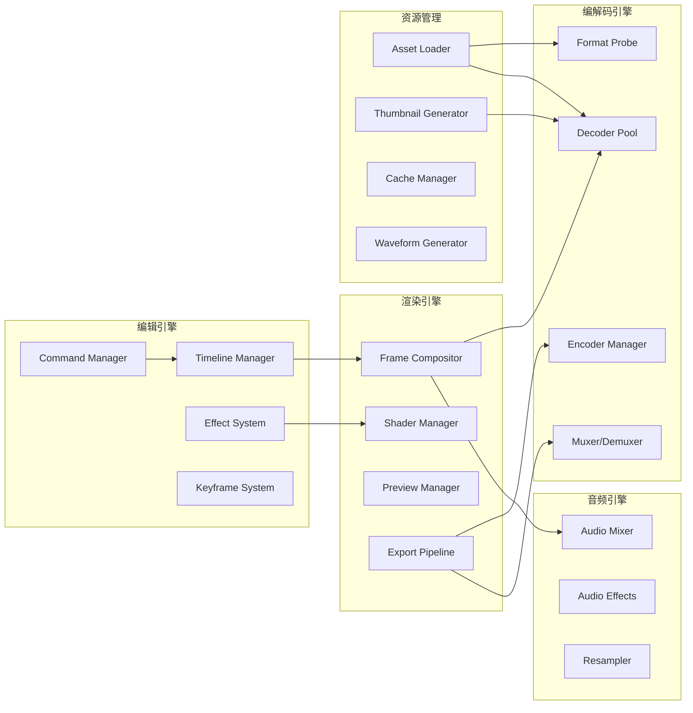

**模块清单与职责矩阵**：

| 模块名 | 核心职责 | 主要输入 | 主要输出 | 关键依赖 |
|--------|---------|---------|---------|--------|
| Timeline Manager | 管理时间轴数据结构，处理Track/Clip增删改查 | 编辑指令 | Timeline状态快照 | 无 |
| Command Manager | 编辑操作的执行、撤销、重做 | Command对象 | 操作结果 | Timeline Manager |
| Effect System | 管理效果链、参数插值、效果图构建 | 效果参数 | 渲染指令 | Shader Manager |
| Keyframe System | 关键帧动画的插值、缓动曲线计算 | 关键帧数据 | 插值后的参数值 | 无 |
| Frame Compositor | 多轨帧合成、效果应用、转场混合 | Timeline快照 + 解码帧 | 合成后的帧 | Decoder, Shader |
| Shader Manager | Shader加载、编译、缓存、参数绑定 | Shader源码/编译产物 | GPU Pipeline | IRenderBackend |
| Preview Manager | 实时预览控制、帧率调节、Seek处理 | 播放控制指令 | 渲染帧序列 | Compositor, Decoder |
| Export Pipeline | 离线导出流程编排、进度管理 | Timeline + 导出配置 | 视频文件 | Compositor, Encoder |
| Decoder Pool | 解码器实例管理、硬解/软解切换 | 视频数据流 | 解码帧 | IHardwareCodec |
| Audio Mixer | 多音轨混音、音量调节、淡入淡出 | 音频PCM数据 | 混合后PCM | Resampler |

**模块间通信机制**：

SDK内部模块间的通信采用三种机制，根据场景选择：

1. **直接接口调用**：同步、强类型、用于关键路径（如Compositor调用Decoder获取帧）
2. **事件总线(Event Bus)**：异步、解耦、用于状态通知（如Timeline变更通知Preview刷新）
3. **消息队列(Message Queue)**：跨线程、有序、用于命令传递（如主线程发送编辑命令到引擎线程）

```cpp
// 事件总线实现示例
namespace avsdk {

enum class EventType {
    TimelineChanged,
    ClipAdded,
    ClipRemoved,
    EffectUpdated,
    SeekRequested,
    ExportProgress,
    MemoryWarning
};

struct Event {
    EventType type;
    std::any payload;
    std::chrono::steady_clock::time_point timestamp;
};

class EventBus {
public:
    using Handler = std::function<void(const Event&)>;
    
    uint64_t subscribe(EventType type, Handler handler) {
        std::lock_guard<std::mutex> lock(mutex_);
        auto id = nextId_++;
        handlers_[type].push_back({id, std::move(handler)});
        return id;
    }
    
    void unsubscribe(uint64_t handlerId) {
        std::lock_guard<std::mutex> lock(mutex_);
        for (auto& [type, list] : handlers_) {
            list.erase(
                std::remove_if(list.begin(), list.end(),
                    [handlerId](const auto& h) { return h.id == handlerId; }),
                list.end());
        }
    }
    
    void publish(Event event) {
        std::lock_guard<std::mutex> lock(mutex_);
        if (auto it = handlers_.find(event.type); it != handlers_.end()) {
            for (const auto& handler : it->second) {
                handler.fn(event);
            }
        }
    }
    
private:
    struct HandlerEntry { uint64_t id; Handler fn; };
    std::unordered_map<EventType, std::vector<HandlerEntry>> handlers_;
    std::mutex mutex_;
    uint64_t nextId_ = 0;
};

} // namespace avsdk
```

### 4.2 编辑引擎设计

> **核心结论**：编辑引擎是SDK的"大脑"，它定义了用户的编辑意图如何被表达、存储和执行。Timeline-Track-Clip是当前最成熟的编辑模型，Command模式为Undo/Redo提供天然支持。

#### 4.2.1 Timeline-Track-Clip数据模型

**核心数据结构（C++）**：

```cpp
namespace avsdk {

// 时间基：使用有理数避免浮点精度问题
struct RationalTime {
    int64_t value;
    int32_t timescale;  // 常用: 600(10fps倍数), 44100(音频), 90000(RTP)
    
    static RationalTime fromSeconds(double seconds, int32_t ts = 600) {
        return {static_cast<int64_t>(seconds * ts), ts};
    }
    
    RationalTime rescaled(int32_t newTimescale) const {
        return {value * newTimescale / timescale, newTimescale};
    }
    
    bool operator<(const RationalTime& other) const {
        return value * other.timescale < other.value * timescale;
    }
};

struct TimeRange {
    RationalTime start;
    RationalTime duration;
};

// 资源引用：原始素材的引用，支持多个Clip引用同一素材
class AssetReference {
public:
    std::string assetId;          // 资源唯一标识
    std::string filePath;         // 文件路径
    TimeRange availableRange;     // 素材可用范围
    VideoProperties videoProps;   // 分辨率、帧率、编码格式
    AudioProperties audioProps;   // 采样率、通道数、编码格式
};

// Clip：时间轴上的基本单元
enum class ClipType {
    Video,      // 视频片段
    Audio,      // 音频片段
    Image,      // 图片（持续显示）
    Title,      // 文字标题
    Sticker,    // 贴纸
    Effect      // 独立效果层
};

class Clip {
public:
    std::string clipId;               // 全局唯一ID
    ClipType type;
    
    // 时间属性
    TimeRange timelineRange;          // 在时间轴上的位置和时长
    TimeRange sourceRange;            // 在原始素材中的范围
    
    // 资源引用
    std::shared_ptr<AssetReference> asset;
    
    // 效果链
    std::vector<std::shared_ptr<Effect>> effects;
    
    // 变速
    float speed = 1.0f;               // 0.25 ~ 4.0
    
    // 空间变换
    Transform2D transform;            // 位置、缩放、旋转
    float opacity = 1.0f;             // 透明度
    
    // 关键帧动画
    std::shared_ptr<KeyframeAnimation> animation;
};

// Track：轨道，包含一组互不重叠的Clip
enum class TrackType {
    MainVideo,    // 主视频轨
    OverlayVideo, // 叠加视频轨（画中画）
    MainAudio,    // 主音频轨
    BGMAudio,     // 背景音乐轨
    VoiceOver,    // 配音轨
    Title,        // 文字轨
    Sticker,      // 贴纸轨
    Effect        // 全局效果轨
};

class Track {
public:
    std::string trackId;
    TrackType type;
    int32_t index;                    // 轨道层级（越大越靠前）
    bool isLocked = false;            // 锁定状态
    bool isMuted = false;             // 静音状态
    bool isHidden = false;            // 隐藏状态
    
    std::vector<std::shared_ptr<Clip>> clips;  // 按时间顺序排列
    
    // 轨道级别效果
    std::vector<std::shared_ptr<Effect>> trackEffects;
    
    // 查询某时刻的活跃Clip
    std::shared_ptr<Clip> clipAt(RationalTime time) const;
    
    // 检查时间范围是否与已有Clip重叠
    bool hasOverlap(TimeRange range) const;
};

// 转场：两个相邻Clip之间的过渡效果
class Transition {
public:
    std::string transitionId;
    std::string type;                 // "dissolve", "wipe_left", "push_right", ...
    RationalTime duration;            // 转场时长
    std::string clipAId;              // 前一个Clip
    std::string clipBId;              // 后一个Clip
    std::unordered_map<std::string, float> parameters;  // 自定义参数
};

// Timeline：最顶层容器
class Timeline {
public:
    std::string projectId;
    std::string projectName;
    
    // 输出配置
    VideoProperties outputVideoProps; // 输出分辨率、帧率
    AudioProperties outputAudioProps; // 输出采样率、通道数
    
    // 轨道集合
    std::vector<std::shared_ptr<Track>> videoTracks;
    std::vector<std::shared_ptr<Track>> audioTracks;
    std::vector<std::shared_ptr<Track>> overlayTracks;
    
    // 转场列表
    std::vector<std::shared_ptr<Transition>> transitions;
    
    // 全局属性
    RationalTime totalDuration() const;
    
    // 查询某时刻所有活跃Clip
    std::vector<std::shared_ptr<Clip>> activeClipsAt(RationalTime time) const;
};

} // namespace avsdk
```

**数据模型关系图**：

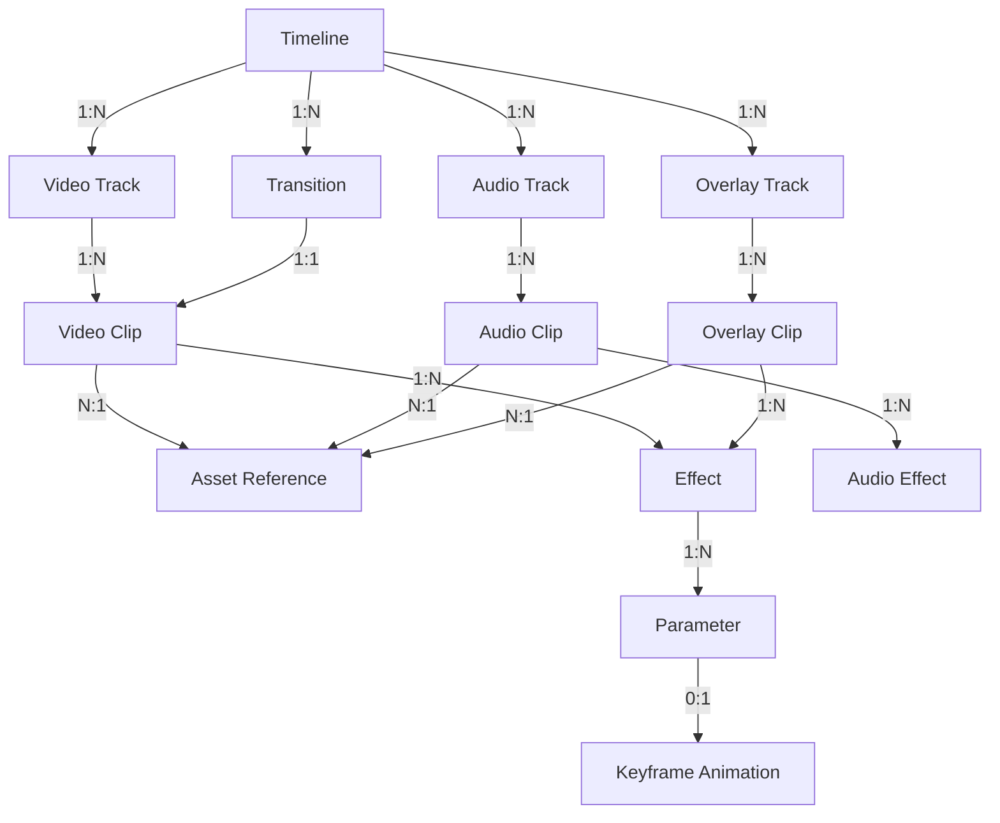

#### 4.2.2 编辑操作的Command模式

所有编辑操作都封装为Command对象，这是实现Undo/Redo的基础。每个Command必须实现`execute()`和`undo()`两个操作，且这两个操作必须是精确互逆的。

```cpp
namespace avsdk {

// Command基类
class ICommand {
public:
    virtual ~ICommand() = default;
    
    virtual void execute(Timeline& timeline) = 0;
    virtual void undo(Timeline& timeline) = 0;
    
    virtual std::string description() const = 0;
    virtual std::string commandType() const = 0;
    
    // 用于合并连续同类操作（如连续拖动生成大量Move命令）
    virtual bool canMergeWith(const ICommand& other) const { return false; }
    virtual void mergeWith(const ICommand& other) {}
};

// 具体Command示例：裁剪Clip
class TrimClipCommand : public ICommand {
public:
    TrimClipCommand(const std::string& clipId, 
                    TimeRange oldRange, TimeRange newRange)
        : clipId_(clipId), oldRange_(oldRange), newRange_(newRange) {}
    
    void execute(Timeline& timeline) override {
        auto clip = timeline.findClip(clipId_);
        clip->timelineRange = newRange_;
        clip->sourceRange = calculateSourceRange(clip, newRange_);
    }
    
    void undo(Timeline& timeline) override {
        auto clip = timeline.findClip(clipId_);
        clip->timelineRange = oldRange_;
        clip->sourceRange = calculateSourceRange(clip, oldRange_);
    }
    
    std::string description() const override { return "Trim Clip"; }
    std::string commandType() const override { return "TrimClip"; }
    
private:
    std::string clipId_;
    TimeRange oldRange_, newRange_;
};

// 复合Command：将多个操作合并为一个原子操作
class CompositeCommand : public ICommand {
public:
    void addCommand(std::unique_ptr<ICommand> cmd) {
        commands_.push_back(std::move(cmd));
    }
    
    void execute(Timeline& timeline) override {
        for (auto& cmd : commands_) {
            cmd->execute(timeline);
        }
    }
    
    void undo(Timeline& timeline) override {
        // 反序撤销
        for (auto it = commands_.rbegin(); it != commands_.rend(); ++it) {
            (*it)->undo(timeline);
        }
    }
    
    std::string description() const override { return "Composite Operation"; }
    std::string commandType() const override { return "Composite"; }
    
private:
    std::vector<std::unique_ptr<ICommand>> commands_;
};

// Undo/Redo管理器
class CommandManager {
public:
    explicit CommandManager(size_t maxHistory = 100) : maxHistory_(maxHistory) {}
    
    void execute(std::unique_ptr<ICommand> cmd, Timeline& timeline) {
        cmd->execute(timeline);
        
        // 尝试与上一个命令合并
        if (!undoStack_.empty() && undoStack_.back()->canMergeWith(*cmd)) {
            undoStack_.back()->mergeWith(*cmd);
        } else {
            undoStack_.push_back(std::move(cmd));
            if (undoStack_.size() > maxHistory_) {
                undoStack_.pop_front();
            }
        }
        
        // 执行新命令后清空Redo栈
        redoStack_.clear();
        
        notifyListeners();
    }
    
    void undo(Timeline& timeline) {
        if (undoStack_.empty()) return;
        auto cmd = std::move(undoStack_.back());
        undoStack_.pop_back();
        cmd->undo(timeline);
        redoStack_.push_back(std::move(cmd));
        notifyListeners();
    }
    
    void redo(Timeline& timeline) {
        if (redoStack_.empty()) return;
        auto cmd = std::move(redoStack_.back());
        redoStack_.pop_back();
        cmd->execute(timeline);
        undoStack_.push_back(std::move(cmd));
        notifyListeners();
    }
    
    bool canUndo() const { return !undoStack_.empty(); }
    bool canRedo() const { return !redoStack_.empty(); }
    
private:
    std::deque<std::unique_ptr<ICommand>> undoStack_;
    std::vector<std::unique_ptr<ICommand>> redoStack_;
    size_t maxHistory_;
    
    void notifyListeners() { /* 通知UI更新Undo/Redo按钮状态 */ }
};

} // namespace avsdk
```

#### 4.2.3 编辑效果系统

**滤镜链 (Filter Chain) 设计**：

每个Clip可以挂载一条效果链，效果按顺序执行。每个Effect实质上是一个GPU Shader程序 + 一组参数的组合。

```cpp
namespace avsdk {

// 效果参数
enum class ParamType { Float, Vec2, Vec3, Vec4, Color, Texture, Int, Bool };

struct EffectParam {
    std::string name;
    ParamType type;
    std::variant<float, glm::vec2, glm::vec3, glm::vec4, 
                 int, bool, TextureHandle> value;
    std::variant<float, glm::vec2, glm::vec3, glm::vec4,
                 int, bool, TextureHandle> defaultValue;
    // 可选：关键帧动画
    std::shared_ptr<KeyframeTrack> keyframes;
};

// 效果基类
class Effect {
public:
    std::string effectId;
    std::string effectType;           // "lut_filter", "gaussian_blur", "color_adjust"...
    bool isEnabled = true;
    float intensity = 1.0f;           // 效果强度 0.0 ~ 1.0
    
    std::vector<EffectParam> parameters;
    
    // 获取某时刻的插值参数值（处理关键帧动画）
    EffectParam evaluatedParam(const std::string& name, RationalTime time) const;
};

// 效果链执行器
class EffectChainExecutor {
public:
    TextureHandle execute(TextureHandle input, 
                          const std::vector<std::shared_ptr<Effect>>& effects,
                          RationalTime time,
                          IRenderBackend& backend) {
        TextureHandle current = input;
        
        for (const auto& effect : effects) {
            if (!effect->isEnabled) continue;
            
            // 加载对应的Shader
            auto shader = shaderManager_.getShader(effect->effectType);
            
            // 创建临时输出纹理
            auto output = texturePool_.acquire(current.width, current.height);
            
            // 绑定参数
            for (const auto& param : effect->parameters) {
                auto evaluated = effect->evaluatedParam(param.name, time);
                shader->setParameter(evaluated);
            }
            
            // 执行渲染Pass
            backend.beginRenderPass({output});
            backend.draw({shader, current, effect->intensity});
            backend.endRenderPass();
            
            // 释放上一步的临时纹理（如果不是原始输入）
            if (current != input) texturePool_.release(current);
            current = output;
        }
        
        return current;
    }
    
private:
    ShaderManager shaderManager_;
    TexturePool texturePool_;
};

} // namespace avsdk
```

**转场效果插件化设计**：

```cpp
namespace avsdk {

// 转场渲染器接口
class ITransitionRenderer {
public:
    virtual ~ITransitionRenderer() = default;
    
    // 渲染转场帧
    // progress: 0.0 (完全是A) → 1.0 (完全是B)
    virtual TextureHandle render(
        TextureHandle frameA,
        TextureHandle frameB,
        float progress,
        const std::unordered_map<std::string, float>& params,
        IRenderBackend& backend) = 0;
    
    virtual std::string transitionType() const = 0;
};

// 溶解转场实现
class DissolveTransition : public ITransitionRenderer {
public:
    TextureHandle render(
        TextureHandle frameA, TextureHandle frameB,
        float progress,
        const std::unordered_map<std::string, float>& params,
        IRenderBackend& backend) override {
        
        auto shader = backend.loadShader("dissolve_transition", ShaderStage::Fragment);
        auto output = backend.createTexture({frameA.width, frameA.height});
        
        backend.beginRenderPass({output});
        // dissolve: outputColor = mix(frameA, frameB, progress)
        shader->setTexture("textureA", frameA);
        shader->setTexture("textureB", frameB);
        shader->setFloat("progress", progress);
        backend.draw({shader});
        backend.endRenderPass();
        
        return output;
    }
    
    std::string transitionType() const override { return "dissolve"; }
};

// 转场注册中心
class TransitionRegistry {
public:
    void registerTransition(std::unique_ptr<ITransitionRenderer> renderer) {
        auto type = renderer->transitionType();
        renderers_[type] = std::move(renderer);
    }
    
    ITransitionRenderer* getRenderer(const std::string& type) {
        auto it = renderers_.find(type);
        return it != renderers_.end() ? it->second.get() : nullptr;
    }
    
private:
    std::unordered_map<std::string, std::unique_ptr<ITransitionRenderer>> renderers_;
};

} // namespace avsdk
```

**音频效果管线**：

音频效果管线与视频效果链类似，但处理的是PCM音频数据流而非纹理。关键差异在于音频是流式处理的，每次处理一个buffer（通常512或1024个采样点）。

```cpp
namespace avsdk {

struct AudioBuffer {
    float* data;              // 交织格式 (interleaved) PCM数据
    int32_t sampleCount;      // 采样点数
    int32_t channelCount;     // 通道数 (1=单声道, 2=立体声)
    int32_t sampleRate;       // 采样率
};

class IAudioEffect {
public:
    virtual ~IAudioEffect() = default;
    virtual void process(AudioBuffer& buffer) = 0;
    virtual void reset() = 0;  // 重置内部状态（Seek时调用）
    virtual std::string effectType() const = 0;
};

// 音量淡入淡出效果
class FadeEffect : public IAudioEffect {
public:
    FadeEffect(float fadeInDuration, float fadeOutDuration, float totalDuration)
        : fadeIn_(fadeInDuration), fadeOut_(fadeOutDuration), total_(totalDuration) {}
    
    void process(AudioBuffer& buffer) override {
        for (int i = 0; i < buffer.sampleCount; ++i) {
            float time = currentSample_ / static_cast<float>(buffer.sampleRate);
            float gain = 1.0f;
            
            if (time < fadeIn_) {
                gain = time / fadeIn_;  // 淡入
            } else if (time > total_ - fadeOut_) {
                gain = (total_ - time) / fadeOut_;  // 淡出
            }
            
            for (int ch = 0; ch < buffer.channelCount; ++ch) {
                buffer.data[i * buffer.channelCount + ch] *= gain;
            }
            currentSample_++;
        }
    }
    
    void reset() override { currentSample_ = 0; }
    std::string effectType() const override { return "fade"; }
    
private:
    float fadeIn_, fadeOut_, total_;
    int64_t currentSample_ = 0;
};

} // namespace avsdk
```

### 4.3 渲染引擎设计

> **核心结论**：渲染引擎是SDK性能的关键瓶颈。采用“双模渲染管线”设计，预览模式追求低延迟，导出模式追求高质量，两者共享相同的合成逻辑和Shader代码。

**渲染管线架构**：

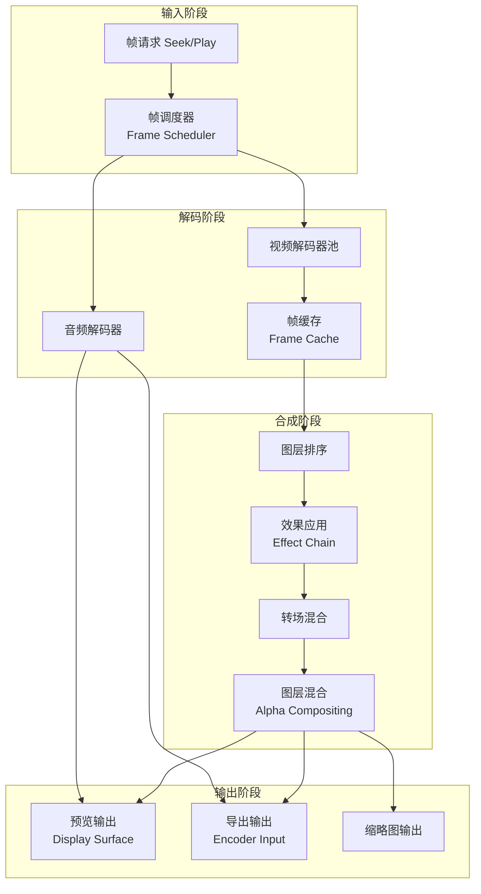

**GPU渲染抽象层设计**：

渲染引擎的核心是Frame Compositor，它负责将某一时刻所有活跃Clip的解码帧合成为一帧输出。合成过程包括：空间变换、效果应用、转场计算、Alpha混合。

```cpp
namespace avsdk {

class FrameCompositor {
public:
    FrameCompositor(IRenderBackend& backend, ShaderManager& shaders)
        : backend_(backend), shaders_(shaders) {}
    
    // 合成单帧
    TextureHandle compositeFrame(const Timeline& timeline, 
                                  RationalTime time,
                                  RenderQuality quality) {
        auto outputSize = getOutputSize(timeline, quality);
        auto outputTex = texturePool_.acquire(outputSize.width, outputSize.height);
        
        // 1. 获取当前时刻所有活跃Clip，按层级排序
        auto activeClips = timeline.activeClipsAt(time);
        std::sort(activeClips.begin(), activeClips.end(),
            [](const auto& a, const auto& b) { return a->layerIndex < b->layerIndex; });
        
        // 2. 清除输出纹理（黑色/透明）
        clearTexture(outputTex);
        
        // 3. 逐层合成
        for (const auto& clip : activeClips) {
            // 3a. 获取解码帧
            auto sourceTime = clip->mapToSourceTime(time);
            auto decodedFrame = decoderPool_.getFrame(clip->asset, sourceTime);
            
            // 3b. 应用效果链
            auto processedFrame = effectExecutor_.execute(
                decodedFrame, clip->effects, time, backend_);
            
            // 3c. 应用空间变换（位置、缩放、旋转）
            auto transform = clip->getTransformAt(time);  // 处理关键帧动画
            
            // 3d. Alpha混合到输出
            blendToOutput(outputTex, processedFrame, transform, clip->opacity);
            
            // 3e. 释放中间纹理
            if (processedFrame != decodedFrame) {
                texturePool_.release(processedFrame);
            }
        }
        
        // 4. 处理转场
        applyTransitions(outputTex, timeline, time);
        
        return outputTex;
    }
    
private:
    IRenderBackend& backend_;
    ShaderManager& shaders_;
    TexturePool texturePool_;
    DecoderPool decoderPool_;
    EffectChainExecutor effectExecutor_;
    
    void clearTexture(TextureHandle tex) { /* GPU clear */ }
    void blendToOutput(TextureHandle output, TextureHandle source, 
                       const Transform2D& transform, float opacity) { /* Alpha blend */ }
    void applyTransitions(TextureHandle output, const Timeline& timeline, 
                          RationalTime time) { /* Transition rendering */ }
    
    Size getOutputSize(const Timeline& timeline, RenderQuality quality) {
        auto fullSize = timeline.outputVideoProps.resolution;
        switch (quality) {
            case RenderQuality::Preview:
                return {fullSize.width / 2, fullSize.height / 2};  // 预览降分辨率
            case RenderQuality::Export:
                return fullSize;  // 导出全分辨率
            case RenderQuality::Thumbnail:
                return {320, 180};  // 缩略图
        }
    }
};

} // namespace avsdk
```

**实时预览 vs 离线导出的双模渲染**：

| 特性 | 预览模式 (Preview) | 导出模式 (Export) |
|------|---------------------|---------------------|
| 分辨率 | 原始的50%（可配置） | 原始分辨率 |
| 帧率目标 | 30fps（可丢帧） | 严格每帧 |
| Shader精度 | half (FP16) | float (FP32) |
| 抗锯齿 | 无 | MSAA 4x |
| 效果简化 | 复杂模糊降级 | 全特效 |
| 帧调度 | 实时时钟驱动 | 序列化逐帧渲染 |
| 缓冲策略 | Triple Buffering | 单帧流水线 |
| 失败策略 | 丢帧继续 | 重试或中止 |

**Shader管理系统**：

Shader是渲染引擎的核心资产。SDK需要管理内置Shader和用户自定义Shader，并处理跨平台Shader变体问题。

```
Shader管理架构：
├── Shader源码层
│   ├── 通用Shader逻辑 (GLSL-like 伪代码)
│   ├── Metal Shader (.metal / .metallib)
│   ├── Vulkan Shader (.spv SPIR-V)
│   └── GLES Shader (.glsl)
├── Shader编译层
│   ├── Metal: 离线编译为.metallib (打包时)
│   ├── Vulkan: 离线编译为SPIR-V (打包时)
│   └── GLES: 运行时编译 + 缓存
├── Shader缓存层
│   ├── 内存缓存 (LRU, 容量可配置)
│   └── 磁盘缓存 (Pipeline State序列化)
└── Shader参数绑定层
    ├── Uniform Buffer管理
    ├── 纹理绑定槽分配
    └── 参数类型自动映射
```

### 4.4 编解码引擎设计

> **核心结论**：编解码引擎的设计策略是“硬件优先，软件兜底”。硬件编解码提供极低的CPU开销和充分的性能，但格式支持有限且平台差异大；FFmpeg软解码提供最广泛的格式兼容性，作为可靠的降级方案。

**硬件编解码器能力矩阵**：

| 能力 | VideoToolbox (iOS) | MediaCodec (Android) | 备注 |
|------|-------------------|---------------------|------|
| H.264解码 | ✅ 全设备 | ✅ 全设备 | 基础能力 |
| H.265解码 | ✅ iPhone 7+ | ✅ 大部分设备 | 需检测硬件能力 |
| H.264编码 | ✅ 全设备 | ✅ 全设备 | 基础能力 |
| H.265编码 | ✅ iPhone 7+ | ⚠️ 部分设备 | Android碎片化严重 |
| AV1解码 | ✅ iPhone 15+ | ⚠️ 新芯片 | 新兴编码标准 |
| AV1编码 | ❌ | ⚠️ Tensor G3+ | 软编码兜底 |
| 4K解码 | ✅ | ⚠️ 旗舰芯片 | 需检测最大分辨率 |
| 10bit HDR | ✅ | ⚠️ 部分设备 | 需检测Profile支持 |
| 同时实例数 | 3个(系统限制) | 16-32个(厂商相关) | 影响多轨解码策略 |
| Seek精度 | 帧精度 | 关键帧精度(需预解码) | 影响Seek性能 |

**自适应编码策略**：

编码器选择不是静态配置，而是根据设备能力和用户配置动态决策：

```cpp
namespace avsdk {

class EncoderSelector {
public:
    struct EncoderChoice {
        CodecType codec;        // H264, H265, AV1
        bool isHardware;        // 硬件/软件
        int qualityScore;       // 质量评分 (1-10)
        int speedScore;         // 速度评分 (1-10)
        int batteryScore;       // 电量友好度 (1-10)
    };
    
    EncoderChoice selectEncoder(const ExportConfig& config, 
                                 const DeviceCapabilities& device) {
        std::vector<EncoderChoice> candidates;
        
        // 1. 探测硬件能力
        if (device.supportsHardwareEncode(config.codec)) {
            candidates.push_back({
                config.codec, true, 
                device.hwEncoderQuality(config.codec),
                9, 9  // 硬件编码速度和电量都最优
            });
        }
        
        // 2. FFmpeg软件兜底
        candidates.push_back({
            config.codec, false,
            8,   // 软编码质量通常更可控
            3,   // 软编码速度较慢
            2    // CPU密集，耗电大
        });
        
        // 3. 降级方案（如请求H.265但硬件不支持）
        if (config.codec == CodecType::H265 && 
            !device.supportsHardwareEncode(CodecType::H265)) {
            if (device.supportsHardwareEncode(CodecType::H264)) {
                candidates.push_back({
                    CodecType::H264, true, 7, 9, 9
                });
            }
        }
        
        // 4. 按用户偏好排序
        return selectBest(candidates, config.priority);
    }
    
private:
    EncoderChoice selectBest(const std::vector<EncoderChoice>& candidates,
                              ExportPriority priority) {
        // 根据用户偏好（质量优先/速度优先/平衡）计算加权得分
        // ...省略具体实现
        return candidates.front();
    }
};

} // namespace avsdk
```

**格式兼容性矩阵**：

| 容器格式 | 视频编码 | 音频编码 | 导入支持 | 导出支持 |
|---------|---------|---------|---------|--------|
| MP4 | H.264, H.265, AV1 | AAC, Opus | ✅ P0 | ✅ P0 |
| MOV | H.264, H.265, ProRes | AAC, PCM | ✅ P0 | ✅ P0 |
| WebM | VP8, VP9, AV1 | Vorbis, Opus | ✅ P1 | ✅ P2 |
| MKV | 几乎所有 | 几乎所有 | ✅ P1 | ❌ |
| AVI | H.264, MPEG-4 | MP3, PCM | ✅ P2 | ❌ |
| GIF | - | - | ✅ P1 | ✅ P1 |

### 4.5 数据流与管线架构

> **核心结论**：数据流的高效性决定了SDK的整体性能。从资源加载到最终导出，每一帧数据要经历解码→效果处理→合成→编码四个阶段，每个阶段的缓冲区管理和线程调度都至关重要。

**完整数据流时序图**：

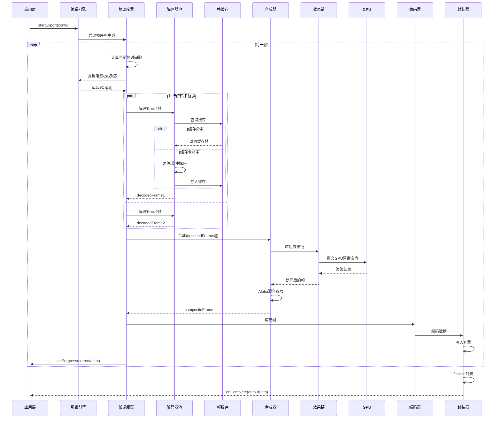

**帧调度机制**：

帧调度器是数据流的核心协调者，负责决定“什么时候解码哪一帧”以及“什么时候触发合成”。预览模式和导出模式的调度策略有本质区别：

| 调度策略 | 预览模式 | 导出模式 |
|---------|---------|--------|
| 时钟源 | 系统时钟 (CADisplayLink/Choreographer) | 帧序列生成器 |
| 丢帧策略 | 允许丢帧（跳到最新时刻） | 不允许丢帧 |
| 预解码 | 向前预解码2-3帧 | 向前预解码批量帧 |
| 背压机制 | 降分辨率/简化效果 | 等待编码器消费 |
| 线程模型 | 渲染线程驱动 | 独立导出线程 |

**缓冲区管理策略**：

视频编辑中最大的内存压力来自解码帧缓冲区。一帧4K RGBA帧占用约33MB（3840×2160×4字节），8轨同时解码就需要264MB仅用于帧数据。因此必须采用精细化的缓冲区管理：

```
缓冲区分层策略：
├── L1: GPU纹理缓存池 (Texture Pool)
│   ├── 预分配固定数量的渲染目标纹理
│   ├── 按分辨率分桶管理 (4K/1080p/720p/Thumbnail)
│   └── 引用计数 + 自动回收
├── L2: 解码帧缓存 (Frame Cache)
│   ├── LRU策略，容量可配置 (default: 128MB)
│   ├── 按素材ID + 帧号索引
│   └── Seek时清除非相邻帧缓存
├── L3: 音频缓冲区 (Audio Ring Buffer)
│   ├── 环形缓冲区，容量 = 采样率 × 缓冲时长(default: 200ms)
│   └── Lock-free读写，避免音频线程阻塞
└── L4: IO缓冲区 (Read Buffer)
    ├── 预读策略，顺序读取时预读下一段数据
    └── 内存映射(mmap)用于大文件随机访问
```

---

## 五、微观实现设计

> **核心结论**：微观实现是架构设计落地的最后一公里。关键帧对齐算法的精度、变速处理的音质、转场Shader的GPU效率——这些细节决定了SDK在真实场景中的竞争力。每一个核心编辑操作都必须同时考虑精度、性能和内存三个维度的最优解。

### 5.1 核心编辑操作的实现细节

#### 5.1.1 视频裁剪实现

视频裁剪看似简单（选定起止时间截取片段），但精确裁剪涉及复杂的编解码知识。视频压缩基于GOP（Group of Pictures）结构，只有关键帧（I帧）可以独立解码，非关键帧（P/B帧）依赖前后帧。因此裁剪点如果落在非关键帧上，就必须从最近的前一个关键帧开始解码到目标帧，这被称为"精确帧裁剪"。

**关键帧裁剪 vs 精确帧裁剪**：

- **关键帧裁剪（Fast Trim）**：将裁剪点对齐到最近的关键帧边界，无需解码即可完成裁剪（直接拷贝压缩数据）。速度极快，但裁剪精度受限于GOP大小（通常2-5秒）。
- **精确帧裁剪（Exact Trim）**：将起始关键帧到目标帧之间的所有帧解码，丢弃不需要的帧，然后重新编码裁剪区间。精度达到帧级别，但需要解码+编码开销。

**关键帧搜索算法（C++）**：

```cpp
namespace avsdk {

struct KeyframeInfo {
    int64_t pts;           // 显示时间戳
    int64_t dts;           // 解码时间戳
    int64_t fileOffset;    // 文件偏移
    int32_t frameIndex;    // 帧序号
};

// 关键帧索引：从容器头部的stss/stco box快速构建
class KeyframeIndex {
public:
    // 从MP4 stss box构建关键帧索引
    static KeyframeIndex buildFromMP4(const std::string& filePath) {
        KeyframeIndex index;
        // 解析moov/trak/mdia/minf/stbl/stss box
        auto stss = MP4Parser::readSyncSampleBox(filePath);
        for (auto& entry : stss.entries) {
            KeyframeInfo kf;
            kf.frameIndex = entry.sampleNumber - 1; // 0-based
            kf.pts = calculatePTS(entry, filePath);
            kf.fileOffset = calculateOffset(entry, filePath);
            index.keyframes_.push_back(kf);
        }
        return index;
    }
    
    // 二分查找：找到目标时间之前最近的关键帧
    KeyframeInfo findNearestBefore(int64_t targetPTS) const {
        auto it = std::upper_bound(
            keyframes_.begin(), keyframes_.end(), targetPTS,
            [](int64_t pts, const KeyframeInfo& kf) { return pts < kf.pts; });
        
        if (it == keyframes_.begin()) return keyframes_.front();
        return *std::prev(it);
    }
    
    // 二分查找：找到目标时间之后最近的关键帧
    KeyframeInfo findNearestAfter(int64_t targetPTS) const {
        auto it = std::lower_bound(
            keyframes_.begin(), keyframes_.end(), targetPTS,
            [](const KeyframeInfo& kf, int64_t pts) { return kf.pts < pts; });
        
        if (it == keyframes_.end()) return keyframes_.back();
        return *it;
    }
    
    // 精确裁剪：计算需要解码的帧范围
    struct DecodeRange {
        KeyframeInfo startKeyframe;   // 起始解码位置（关键帧）
        int64_t targetStartPTS;       // 实际需要的起始帧PTS
        int64_t targetEndPTS;         // 实际需要的结束帧PTS
        int32_t preRollFrames;        // 需要预解码但丢弃的帧数
    };
    
    DecodeRange calculateDecodeRange(int64_t startPTS, int64_t endPTS) const {
        DecodeRange range;
        range.startKeyframe = findNearestBefore(startPTS);
        range.targetStartPTS = startPTS;
        range.targetEndPTS = endPTS;
        range.preRollFrames = estimateFrameCount(
            range.startKeyframe.pts, startPTS);
        return range;
    }
    
private:
    std::vector<KeyframeInfo> keyframes_;
    
    int32_t estimateFrameCount(int64_t fromPTS, int64_t toPTS) const {
        // 基于平均帧间隔估算
        if (keyframes_.size() < 2) return 0;
        double avgInterval = static_cast<double>(
            keyframes_.back().pts - keyframes_.front().pts) / keyframes_.size();
        return static_cast<int32_t>((toPTS - fromPTS) / avgInterval);
    }
};

} // namespace avsdk
```

**性能对比表格**：

| 指标 | 关键帧裁剪 (Fast) | 精确帧裁剪 (Exact) | 差异倍数 |
|------|-------------------|-------------------|----------|
| 裁剪速度 (1080p/30s) | < 100ms | 2-8s | 20-80x |
| CPU占用 | < 5% | 60-90% | 12-18x |
| 内存峰值 | < 10MB | 80-200MB | 8-20x |
| 裁剪精度 | ±2-5秒 (GOP大小) | ±1帧 (33ms@30fps) | 60-150x |
| 适用场景 | 草稿预览、快速分享 | 专业剪辑、精确对白 | - |
| 是否需要重编码 | 否 (直接拷贝) | 是 (裁剪区间重编码) | - |
| 音视频同步 | 自动对齐 | 需要手动处理音频对齐 | - |

#### 5.1.2 变速处理实现

变速播放（0.25x-4x）涉及视频和音频两个维度的独立处理。视频变速相对简单（丢帧或插帧），但音频变速不变调（Time-Stretching）是信号处理领域的经典难题。

**音频变速不变调算法对比**：

| 算法 | 原理 | 质量 | CPU开销 | 延迟 | 适用场景 |
|------|------|------|---------|------|----------|
| WSOLA | 时域波形相似度叠加 | 中等 | 低 | 低 | 移动端实时变速 |
| Phase Vocoder | 频域相位修正 | 高 | 高 | 中 | 专业音频后期 |
| Rubber Band | 混合时频域 | 最高 | 中高 | 中 | 高品质需求 |
| SOLA/PSOLA | 基频同步叠加 | 中高 | 中 | 低 | 语音变速 |

**WSOLA核心算法实现（C++）**：

WSOLA（Waveform Similarity Overlap-Add）是移动端最常用的音频变速算法，核心思想是在输出侧以固定步长前进，在输入侧以变化步长搜索最佳匹配位置进行叠加。

```cpp
namespace avsdk {

class WSOLATimeStretcher {
public:
    WSOLATimeStretcher(int sampleRate, int channels)
        : sampleRate_(sampleRate), channels_(channels) {
        // 典型参数：窗口大小20ms，搜索范围±5ms
        windowSize_ = sampleRate * 20 / 1000;  // 20ms
        searchRange_ = sampleRate * 5 / 1000;   // 5ms
        overlapSize_ = windowSize_ / 2;
    }
    
    // 核心处理函数：输入原始PCM，输出变速后PCM
    void process(const float* input, int inputSamples,
                 float* output, int& outputSamples, float speed) {
        int inputStep = static_cast<int>(windowSize_ * speed);
        int outputStep = windowSize_ - overlapSize_;
        int inputPos = 0;
        int outputPos = 0;
        
        while (inputPos + windowSize_ + searchRange_ < inputSamples) {
            // 1. 在搜索范围内找到与前一个窗口尾部最相似的位置
            int bestOffset = findBestMatch(
                input, inputPos, inputPos + inputStep, channels_);
            
            int actualInputPos = inputPos + inputStep + bestOffset;
            
            // 2. 交叉淡化叠加（Overlap-Add）
            for (int i = 0; i < overlapSize_; ++i) {
                float fadeOut = 1.0f - static_cast<float>(i) / overlapSize_;
                float fadeIn = static_cast<float>(i) / overlapSize_;
                for (int ch = 0; ch < channels_; ++ch) {
                    int prevIdx = (outputPos - overlapSize_ + i) * channels_ + ch;
                    int currIdx = (actualInputPos + i) * channels_ + ch;
                    if (prevIdx >= 0 && outputPos - overlapSize_ + i >= 0) {
                        output[prevIdx] = output[prevIdx] * fadeOut 
                                        + input[currIdx] * fadeIn;
                    }
                }
            }
            
            // 3. 拷贝非重叠部分
            int copyStart = actualInputPos + overlapSize_;
            int copyLen = outputStep;
            for (int i = 0; i < copyLen && copyStart + i < inputSamples; ++i) {
                for (int ch = 0; ch < channels_; ++ch) {
                    output[(outputPos + i) * channels_ + ch] = 
                        input[(copyStart + i) * channels_ + ch];
                }
            }
            
            inputPos = actualInputPos + outputStep;
            outputPos += outputStep;
        }
        outputSamples = outputPos;
    }
    
private:
    int sampleRate_, channels_;
    int windowSize_, searchRange_, overlapSize_;
    
    // 互相关搜索：找到波形最相似的偏移量
    int findBestMatch(const float* data, int refPos, int searchCenter, int ch) {
        float bestCorr = -1e30f;
        int bestOffset = 0;
        
        for (int offset = -searchRange_; offset <= searchRange_; ++offset) {
            int pos = searchCenter + offset;
            if (pos < 0) continue;
            
            float corr = 0.0f;
            for (int i = 0; i < overlapSize_; ++i) {
                for (int c = 0; c < ch; ++c) {
                    corr += data[(refPos + windowSize_ - overlapSize_ + i) * ch + c]
                          * data[(pos + i) * ch + c];
                }
            }
            if (corr > bestCorr) {
                bestCorr = corr;
                bestOffset = offset;
            }
        }
        return bestOffset;
    }
};

} // namespace avsdk
```

#### 5.1.3 转场效果实现

转场效果是两个相邻Clip之间的视觉过渡。从技术上看，转场就是一个双输入的GPU Shader——输入是前后两帧纹理，输出是混合后的帧，混合比例由`progress`参数（0.0→1.0）控制。

**转场参数化设计**：

```
转场参数体系：
├── 通用参数
│   ├── duration: 转场时长（0.2s ~ 3.0s）
│   ├── easing: 缓动曲线（linear / easeIn / easeOut / easeInOut / bezier）
│   └── direction: 方向（left / right / up / down / radial）
├── 类型特有参数
│   ├── dissolve: 无额外参数
│   ├── wipe: angle(角度), feather(羽化宽度)
│   ├── push: direction(方向)
│   ├── zoom: center(中心点), scale(缩放倍数)
│   └── blur: radius(模糊半径), passes(模糊遍数)
└── 高级参数
    ├── customCurve: 自定义贝塞尔控制点
    └── maskTexture: 自定义遮罩纹理（用于自定义形状转场）
```

**Metal Shader代码示例：交叉溶解转场**：

```metal
#include <metal_stdlib>
using namespace metal;

struct VertexOut {
    float4 position [[position]];
    float2 texCoord;
};

struct TransitionParams {
    float progress;     // 0.0 = 完全是A, 1.0 = 完全是B
    float feather;      // 边缘柔和度
    float2 center;      // 效果中心点 (normalized)
};

// 交叉溶解转场 (Cross Dissolve)
fragment float4 dissolveTransition(
    VertexOut in [[stage_in]],
    texture2d<float> textureA [[texture(0)]],
    texture2d<float> textureB [[texture(1)]],
    constant TransitionParams& params [[buffer(0)]]) {
    
    constexpr sampler s(mag_filter::linear, min_filter::linear);
    float4 colorA = textureA.sample(s, in.texCoord);
    float4 colorB = textureB.sample(s, in.texCoord);
    
    // 使用smoothstep增加过渡的自然感
    float p = smoothstep(0.0, 1.0, params.progress);
    return mix(colorA, colorB, p);
}

// 方向擦除转场 (Directional Wipe)
fragment float4 wipeTransition(
    VertexOut in [[stage_in]],
    texture2d<float> textureA [[texture(0)]],
    texture2d<float> textureB [[texture(1)]],
    constant TransitionParams& params [[buffer(0)]]) {
    
    constexpr sampler s(mag_filter::linear, min_filter::linear);
    float4 colorA = textureA.sample(s, in.texCoord);
    float4 colorB = textureB.sample(s, in.texCoord);
    
    // 从左到右擦除
    float edge = params.progress * (1.0 + params.feather) - params.feather;
    float alpha = smoothstep(edge, edge + params.feather, in.texCoord.x);
    
    return mix(colorA, colorB, alpha);
}

// 缩放转场 (Zoom Transition)
fragment float4 zoomTransition(
    VertexOut in [[stage_in]],
    texture2d<float> textureA [[texture(0)]],
    texture2d<float> textureB [[texture(1)]],
    constant TransitionParams& params [[buffer(0)]]) {
    
    constexpr sampler s(mag_filter::linear, min_filter::linear,
                        address::clamp_to_edge);
    
    float p = params.progress;
    float2 center = params.center;
    
    // A帧放大淡出
    float scaleA = 1.0 + p * 0.5;  // 1.0 → 1.5
    float2 uvA = (in.texCoord - center) / scaleA + center;
    float4 colorA = textureA.sample(s, uvA) * (1.0 - p);
    
    // B帧从缩小渐入
    float scaleB = 1.5 - p * 0.5;  // 1.5 → 1.0
    float2 uvB = (in.texCoord - center) / scaleB + center;
    float4 colorB = textureB.sample(s, uvB) * p;
    
    return colorA + colorB;
}
```

### 5.2 性能优化策略

> **核心结论**：性能优化不是一次性的工作，而是贯穿整个开发周期的持续努力。内存优化、渲染优化、线程模型优化是三个互相依赖的支柱，缺任何一个都会成为整体性能的短板。

#### 5.2.1 内存优化

视频编辑SDK的内存压力主要来自解码帧缓冲。一帧4K RGBA帧占用约33MB（3840×2160×4字节），多轨道同时解码则轻松突破数百MB。因此必须采用精细化的内存管理策略：

**帧缓存池实现（C++）**：

```cpp
namespace avsdk {

// 基于Ring Buffer + LRU的帧缓存池
class FrameBufferPool {
public:
    struct FrameBuffer {
        uint8_t* data = nullptr;
        int width = 0, height = 0;
        int stride = 0;               // 行字节数（可能有对齐填充）
        PixelFormat format = PixelFormat::RGBA8;
        std::atomic<int> refCount{0}; // 引用计数
        int64_t lastAccessTime = 0;   // 最后访问时间（LRU淘汰用）
    };
    
    explicit FrameBufferPool(size_t maxMemoryBytes = 256 * 1024 * 1024)  // 256MB
        : maxMemory_(maxMemoryBytes) {}
    
    ~FrameBufferPool() {
        for (auto& fb : pool_) {
            freeAligned(fb.data);
        }
    }
    
    // 获取一个帧缓冲区（优先复用已释放的缓冲区）
    FrameBuffer* acquire(int width, int height, PixelFormat format) {
        std::lock_guard<std::mutex> lock(mutex_);
        
        size_t requiredSize = calculateSize(width, height, format);
        
        // 1. 尝试复用相同尺寸的空闲缓冲区
        for (auto& fb : pool_) {
            if (fb.refCount == 0 && fb.width == width && 
                fb.height == height && fb.format == format) {
                fb.refCount = 1;
                fb.lastAccessTime = currentTimeMs();
                return &fb;
            }
        }
        
        // 2. 内存不足时淘汰LRU
        while (usedMemory_ + requiredSize > maxMemory_) {
            if (!evictLRU()) break;  // 没有可淘汰的
        }
        
        // 3. 分配新缓冲区（16字节对齐，利于SIMD指令）
        FrameBuffer fb;
        fb.width = width;
        fb.height = height;
        fb.format = format;
        fb.stride = alignUp(width * bytesPerPixel(format), 16);
        fb.data = static_cast<uint8_t*>(allocAligned(16, fb.stride * height));
        fb.refCount = 1;
        fb.lastAccessTime = currentTimeMs();
        
        usedMemory_ += fb.stride * height;
        pool_.push_back(std::move(fb));
        return &pool_.back();
    }
    
    void release(FrameBuffer* fb) {
        fb->refCount.fetch_sub(1);
    }
    
    // 内存压力大时主动收缩
    void shrink() {
        std::lock_guard<std::mutex> lock(mutex_);
        pool_.erase(
            std::remove_if(pool_.begin(), pool_.end(),
                [this](FrameBuffer& fb) {
                    if (fb.refCount == 0) {
                        usedMemory_ -= fb.stride * fb.height;
                        freeAligned(fb.data);
                        return true;
                    }
                    return false;
                }),
            pool_.end());
    }
    
private:
    std::vector<FrameBuffer> pool_;
    std::mutex mutex_;
    size_t maxMemory_;
    size_t usedMemory_ = 0;
    
    bool evictLRU() {
        auto oldest = std::min_element(pool_.begin(), pool_.end(),
            [](const FrameBuffer& a, const FrameBuffer& b) {
                if (a.refCount > 0) return false;
                if (b.refCount > 0) return true;
                return a.lastAccessTime < b.lastAccessTime;
            });
        if (oldest != pool_.end() && oldest->refCount == 0) {
            usedMemory_ -= oldest->stride * oldest->height;
            freeAligned(oldest->data);
            pool_.erase(oldest);
            return true;
        }
        return false;
    }
    
    static void* allocAligned(size_t alignment, size_t size) {
        void* ptr = nullptr;
        posix_memalign(&ptr, alignment, size);
        return ptr;
    }
    static void freeAligned(void* ptr) { free(ptr); }
    static int alignUp(int value, int alignment) {
        return (value + alignment - 1) & ~(alignment - 1);
    }
};

} // namespace avsdk
```

**纹理复用与GPU内存管理**：

GPU纹理是另一个内存大户。效果链的中间纹理、转场的临时渲染目标，都需要频繁创建和销毁。通过纹理池（Texture Pool）复用相同尺寸的纹理，避免重复分配的GPU开销。

| 内存类型 | 典型占用 | 优化策略 | 优化后占用 | 节省比例 |
|---------|---------|---------|----------|----------|
| 解码帧CPU内存 | 264MB (8轨04K) | Ring Buffer + LRU | 128MB (4帧有效) | 52% |
| GPU纹理缓存 | 400MB (效果链临时纹理) | Texture Pool复用 | 160MB | 60% |
| 音频缓冲区 | 20MB | Ring Buffer固定大小 | 5MB | 75% |
| IO读取缓冲 | 50MB | mmap内存映射 | 10MB | 80% |
| **总计** | **734MB** | | **303MB** | **59%** |

#### 5.2.2 渲染优化

**脏区域渲染（Dirty Rect Rendering）**：当用户只修改了某个局部参数（如移动一个贴纸）时，不需要重新渲染整个画面，只需重新渲染受影响的区域。这在多层叠加场景中可以节省大量GPU开销。

**LOD预览策略**：编辑时使用低分辨率预览（原始的50%），导出时切换到全分辨率。这种策略使得即2x-4x的渲染性能提升，因为GPU的像素填充率与分辨率成正比。

**性能指标对比表**：

| 优化策略 | 场景 | 优化前 FPS | 优化后 FPS | 提升比 | GPU利用率变化 |
|---------|------|-----------|-----------|---------|----------------|
| 脏区域渲染 | 移动单个贴纸 | 28fps | 55fps | 96% | 95% → 42% |
| LOD预览 | 4K素材+3滤镜 | 18fps | 45fps | 150% | 100% → 65% |
| Texture Pool | 转场效果连续播放 | 22fps | 30fps | 36% | 80% → 60% |
| CommandBuffer批处理 | 8轨道合成 | 15fps | 28fps | 87% | 70% → 90% |
| Shader编译缓存 | 首次加载滤镜 | 2fps | 30fps | 1400% | N/A |

#### 5.2.3 线程模型优化

SDK内部采用多线程管线设计，解码、渲染、编码三个阶段分别在不同线程上并行执行，形成流水线。关键挑战在于线程间的帧数据传递必须既高效又安全。

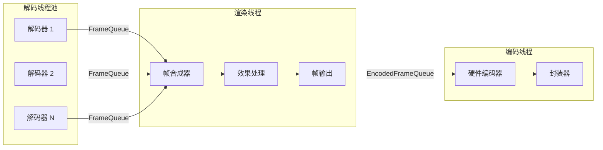

**线程间数据流时序图**：

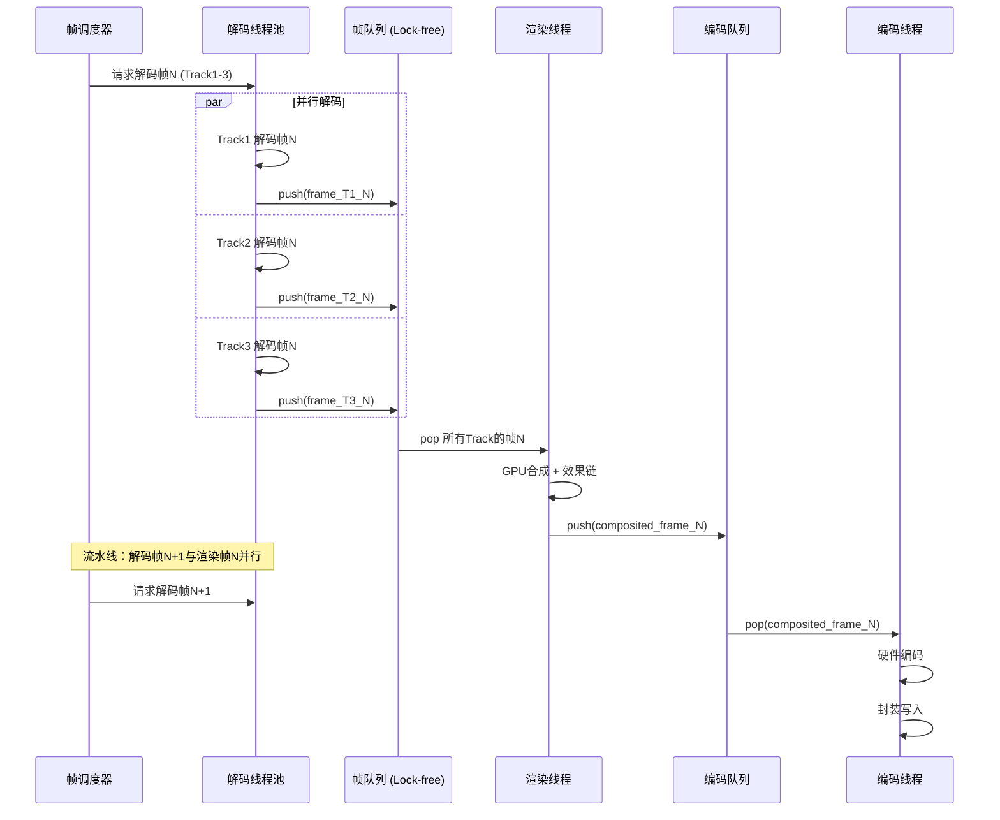

### 5.3 异常处理与容错机制

> **核心结论**：企业级SDK的健壮性不是由正常路径决定的，而是由异常路径的处理质量决定的。完善的异常分类、精确的容错策略、可靠的自动恢复机制，是SDK从“能用”到“可靠”的关键跳跃。

#### 5.3.1 异常分类体系

```
异常分类树：
├── 资源异常 (Resource Exception)
│   ├── 文件损坏 / 截断 (Corrupted/Truncated File)
│   ├── 格式不支持 (Unsupported Format)
│   ├── 读取超时 (IO Timeout)
│   └── 磁盘空间不足 (Insufficient Disk Space)
├── 运行异常 (Runtime Exception)
│   ├── 内存不足 (Out of Memory)
│   ├── GPU失败 (GPU Command Buffer Error)
│   ├── 编解码器崩溃 (Codec Crash)
│   └── 硬件能力不足 (Hardware Capability Insufficient)
└── 业务异常 (Business Exception)
    ├── 无效操作 (Invalid Operation)
    ├── 状态冲突 (State Conflict)
    ├── 并发竞争 (Concurrency Race)
    └── 参数越界 (Parameter Out of Range)
```

**容错策略表格**：

| 异常类型 | 检测方式 | 恢复策略 | 降级方案 |
|---------|---------|---------|----------|
| 文件损坏 | 魔数校验 + 容器解析 | 尝试修复容器头 | 跳过损坏片段继续播放 |
| 格式不支持 | FFmpeg格式探测 | 返回明确错误码 | 建议用户转换格式 |
| 内存不足 | 内存水位监控 | 释放缓存 + GC | 降分辨率预览 |
| GPU失败 | CommandBuffer错误回调 | 重建渲染上下文 | 回退CPU软渲染 |
| 编解码崩溃 | try-catch + 失败计数 | 重建编解码器实例 | 切换软解码 |
| 无效操作 | 状态机前置检查 | 拒绝操作 + 错误码 | 无 |
| 状态冲突 | 状态机转换验证 | 排队等待 | 取消冲突操作 |
| 磁盘空间不足 | 导出前空间预估 | 暂停导出提示用户 | 降码率导出 |

#### 5.3.2 自动恢复机制

**基于Journal的状态恢复（C++）**：

编辑状态的自动保存采用WAL（Write-Ahead Logging）策略：先将操作写入日志，再执行实际修改。崩溃后可以从日志中回放操作恢复到最近状态。

```cpp
namespace avsdk {

class JournalRecovery {
public:
    struct JournalEntry {
        uint64_t sequenceId;
        std::string commandType;
        std::vector<uint8_t> serializedCommand;  // Protobuf序列化
        int64_t timestamp;
        uint32_t checksum;  // CRC32校验
    };
    
    explicit JournalRecovery(const std::string& journalPath)
        : journalPath_(journalPath) {}
    
    // 记录操作日志（在Command执行前调用）
    void logCommand(const ICommand& cmd) {
        JournalEntry entry;
        entry.sequenceId = nextSequenceId_++;
        entry.commandType = cmd.commandType();
        entry.serializedCommand = cmd.serialize();
        entry.timestamp = currentTimeMs();
        entry.checksum = crc32(entry.serializedCommand);
        
        // 追加写入 + fsync确保落盘
        appendToJournal(entry);
    }
    
    // 崩溃恢复：回放日志中的操作
    bool recover(Timeline& timeline) {
        auto entries = readJournal();
        if (entries.empty()) return false;
        
        // 验证每条日志的完整性
        for (const auto& entry : entries) {
            if (crc32(entry.serializedCommand) != entry.checksum) {
                // 截断的日志记录，停止回放
                break;
            }
            auto cmd = CommandFactory::deserialize(
                entry.commandType, entry.serializedCommand);
            if (cmd) {
                cmd->execute(timeline);
            }
        }
        return true;
    }
    
    // 定期压缩日志（保存完整快照 + 最近N条增量）
    void checkpoint(const Timeline& timeline) {
        // 1. 序列化完整Timeline状态
        auto snapshot = timeline.serialize();
        writeSnapshot(snapshot);
        
        // 2. 清空旧日志
        truncateJournal();
        
        // 3. 重置序列号
        nextSequenceId_ = 0;
    }
    
private:
    std::string journalPath_;
    uint64_t nextSequenceId_ = 0;
    
    void appendToJournal(const JournalEntry& entry) {
        std::ofstream file(journalPath_, std::ios::binary | std::ios::app);
        // 写入序列化数据...
        file.flush();
        // fsync确保写入磁盘
    }
    std::vector<JournalEntry> readJournal() { /* ... */ return {}; }
    void writeSnapshot(const std::vector<uint8_t>& data) { /* ... */ }
    void truncateJournal() { /* ... */ }
    static uint32_t crc32(const std::vector<uint8_t>& data) { return 0; }
};

} // namespace avsdk
```

#### 5.3.3 错误上报体系

**分层错误码设计**：

错误码采用分层编码设计，便于快速定位问题模块和原因：

```
错误码格式: 0xMMTTDDDD
  MM: 模块码 (8bit)
    01 = EditEngine
    02 = RenderEngine
    03 = CodecEngine
    04 = AssetManager
    05 = ExportEngine
  TT: 类型码 (8bit)
    01 = 资源异常
    02 = 运行异常
    03 = 业务异常
    04 = 平台异常
  DDDD: 详细错误码 (16bit)

示例:
  0x03020001 = CodecEngine / 运行异常 / 硬件编码器初始化失败
  0x02010003 = RenderEngine / 资源异常 / Shader编译失败
  0x01030002 = EditEngine / 业务异常 / 无效的裁剪范围
```

**错误分级与告警**：

| 错误级别 | 庄重程度 | 上报策略 | 告警方式 | 示例 |
|---------|---------|---------|---------|------|
| Fatal | 致命错误 | 实时上报 + 崩溃收集 | 即时告警 | GPU设备丢失 |
| Error | 严重错误 | 实时上报 | 5分钟聚合 | 编码器失败 |
| Warning | 潜在问题 | 采样上报(10%) | 小时级汇总 | 帧率下降 |
| Info | 信息记录 | 按需上报 | 无 | 编解码器切换 |

---

## 六、Four Pillars 工程保障

> **核心结论**：Four Pillars（可追溯性、DRY、确定性执行、简洁性）是保障大型SDK工程质量的四根支柱。它们不是抽象的方法论，而是可以在代码、流程、工具中具体落地的工程实践。音视频编辑SDK的复杂度使得这四根支柱尤为重要——缺任何一根，软件将在规模增长后迅速腐化。

### 6.1 可追溯性体系 (Traceability)

可追溯性是指任何一行代码都能向上追溯到为什么写它（需求）、如何决定这么写（ADR）、如何验证它是对的（测试）。在音视频SDK这样的复杂项目中，追溯链断裂意味着没有人知道某段代码的修改会影响哪些功能，这是回归缺陷的温床。

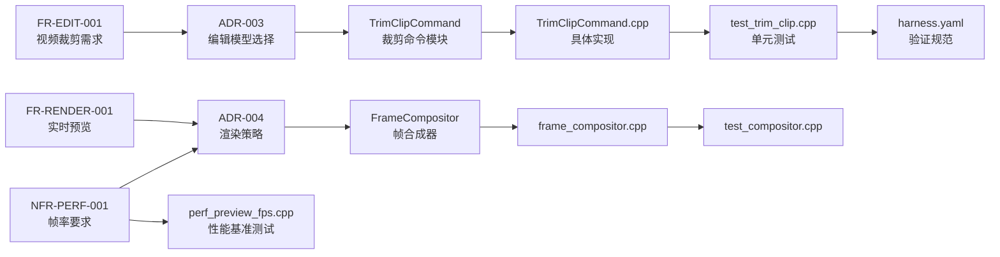

**代码中的追溯标签示例**：

```cpp
/**
 * @require FR-EDIT-001  视频裁剪功能
 * @adr ADR-003          编辑模型Timeline-Track-Clip
 * @test test_trim_clip   裁剪功能单元测试
 * @perf perf_trim_speed  裁剪性能基准测试
 */
class TrimClipCommand : public ICommand {
    // ...
};
```

**变更影响分析**：

当某个模块发生变更时，通过依赖关系矩阵可以快速确定受影响的模块和需要重新执行的测试范围。这对于回归测试策略至关重要：

| 变更模块 | 直接影响 | 间接影响 | 回归测试范围 |
|---------|---------|---------|-------------|
| Timeline数据模型 | EditEngine, 序列化 | RenderEngine, Export | 全量回归 |
| Shader系统 | RenderEngine | Preview, Export | 视觉回归测试 |
| 解码器池 | CodecEngine | Preview, Seek | 编解码 + 性能测试 |
| 帧调度器 | Preview, Export | 音视频同步 | 同步 + 性能测试 |
| 内存池 | 全局 | 稳定性 | 压力测试 + 内存泄漏检测 |

### 6.2 单一真相源实践 (DRY)

> **核心结论**：在跨平台SDK中，DRY原则的重要性是普通应用的数倍。任何信息如果在多个地方重复定义（API描述、错误码、配置），就必然会在演进过程中出现不一致，而不一致是Bug的源头。

**SDK中的DRY实践矩阵**：

| 信息类型 | 唯一来源 | 派生产物 | 自动化方式 |
|---------|---------|---------|----------|
| API定义 | api_definition.proto (Protobuf IDL) | Swift API / Kotlin API / TS API | protoc插件生成平台代码 |
| 错误码 | error_codes.yaml | C++ enum / Swift enum / Kotlin sealed class | 代码生成脚本 (codegen.py) |
| 配置项 | sdk_config.yaml | iOS plist / Android xml / C++ struct | 配置生成器 |
| 内置滤镜列表 | filters.json | Shader注册代码 / UI列表 / 文档 | 滤镜注册生成器 |
| 转场列表 | transitions.json | Shader注册 / 参数模型 / UI | 转场注册生成器 |
| 版本信息 | version.json | C++ header / Swift / Kotlin / 文档 | CI管线自动分发 |

**自动化生成管线示例**：

```
代码生成工具链：
├── 输入源
│   ├── api_definition.proto      ← API接口单一定义
│   ├── error_codes.yaml          ← 错误码单一定义
│   └── sdk_config.yaml           ← 配置项单一定义
├── 生成器
│   ├── generate_api.py           ← Protobuf IDL → 多语言API
│   ├── generate_errors.py        ← YAML → C++/Swift/Kotlin 错误类
│   └── generate_config.py        ← YAML → 多平台配置文件
└── 输出产物
    ├── generated/cpp/            ← C++头文件
    ├── generated/swift/          ← Swift源文件
    ├── generated/kotlin/         ← Kotlin源文件
    └── generated/docs/           ← API文档
```

### 6.3 确定性执行框架 (Deterministic Enforcement)

> **核心结论**：“可以自动化检查的规则，就不要靠人工Review”。三层验证模型将检查任务按确定性分层：确定性工具先行、AI辅助居中、人工审查最后。这样既能保证每次检查结果的一致性，又能将人工精力集中在最有价值的架构审查上。

**三层验证模型在SDK中的应用**：

```
验证管线（从确定到模糊）：
├── Level 1: 确定性工具 (✅ 100%可重现、零人工干预)
│   ├── 编译检查: clang -Wall -Werror -Wextra
│   ├── 静态分析: clang-tidy (bugprone-*, performance-*, modernize-*)
│   ├── 内存安全: ASAN + TSAN + UBSAN
│   ├── 单元测试: GoogleTest + 覆盖率≥ 80%
│   ├── API兼容性: abi-compliance-checker
│   └── 包体大小: size-limit (超过15MB报错)
│
├── Level 2: 脚本 + AI (✅ 95%可重现、少量人工确认)
│   ├── 复杂度检查: 循环复杂度 ≤ 15
│   ├── 性能回归: 基准测试偏差 > 10% 报警
│   ├── 视觉回归: SSIM像素级比对 (阈值 0.99)
│   ├── API风格: 命名规范 + 线程安全标注检查
│   └── 依赖安全: CVE漏洞扫描
│
└── Level 3: 纯AI / 人工审查 (⚠️ 主观判断、最高价值)
    ├── 架构评审: 是否符合分层架构原则
    ├── 代码语义审查: 逻辑正确性、边界条件
    └── 设计模式: 是否适当使用了设计模式
```

**CI/CD管线设计**：

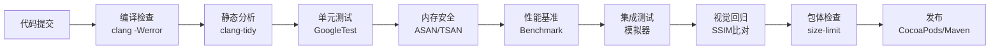

**每个Gate的通过标准**：

| Gate | 检查内容 | 通过标准 | 超时限制 | 失败策略 |
|------|---------|---------|---------|----------|
| 编译 | 全平台编译 + 警告 | 0 error, 0 warning | 10min | 即时失败 |
| 静态分析 | clang-tidy 200+规则 | 0 violation | 5min | 即时失败 |
| 单元测试 | 核心模块测试 | 100%通过, 覆盖率≥80% | 10min | 即时失败 |
| 内存安全 | ASAN/TSAN/UBSAN | 0 issue | 15min | 即时失败 |
| 性能基准 | 关键路径基准 | 偏差≤10% | 20min | 警告(不阻塞) |
| 集成测试 | 模块间协作 | 100%通过 | 30min | 即时失败 |
| 视觉回归 | 渲染输出对比 | SSIM ≥ 0.99 | 15min | 警告+人工确认 |
| 包体检查 | SDK产物大小 | ≤ 15MB(核心) | 2min | 即时失败 |

### 6.4 简洁性原则应用 (Parsimony)

> **核心结论**：简洁性是SDK设计的最高标准。一个API如果需要查看文档才能理解，它就不够简洁。最小API表面积、合理默认值、渐进式配置是三个核心武器。

**好的API vs 差的API对比（Swift）**：

```swift
// ✔️ 好API：简洁、可读、类型安全、有合理默认值
let editor = AVEditKit.createEditor()

// 导入视频（一行代码）
let clip = try editor.importVideo(url: videoURL)

// 裁剪（简单直觉）
try clip.trim(start: .seconds(2.0), end: .seconds(10.0))

// 导出（合理默认值，拒绝过度配置）
try await editor.export(to: outputURL)  // 默认1080p H.264

// 高级用法：Builder模式渐进配置
try await editor.export(to: outputURL) {
    $0.resolution = .uhd4K
    $0.codec = .hevc
    $0.bitrate = .adaptive(target: 20_000_000)
    $0.audioCodec = .aac(bitrate: 256_000)
}

// ❌ 差的API：再多、冗余、缺乏类型安全
let editor = AVEditorFactory.shared.createEditorInstance(
    config: AVEditorConfig(
        renderBackend: "metal",    // 字符串而非枚举，运行时才发现拼写错误
        maxResolution: 3840,
        threadPoolSize: 4,         // 用户不应该关心内部线程数
        logLevel: 2                // 魔法数字，2代表什么？
    )
)
let result = editor.executeOperation(
    type: "trim",                  // 字符串而非类型安全的方法
    params: ["start": 2.0, "end": 10.0]  // 字典而非强类型参数
)
```

**渐进式配置设计（简单用例零配置，复杂用例按需配置）**：

```swift
// Level 1: 零配置（快速体验）
let editor = AVEditKit.createEditor()

// Level 2: 基础配置（业务定制）
let editor = AVEditKit.createEditor {
    $0.previewQuality = .medium
    $0.maxDuration = .minutes(5)
}

// Level 3: 专家配置（极致性能调优）
let editor = AVEditKit.createEditor {
    $0.previewQuality = .custom(width: 960, height: 540)
    $0.decoderPoolSize = 4
    $0.texturePoolSize = .megabytes(128)
    $0.enableMetalShaderProfiling = true
    $0.logLevel = .verbose
}
```

**Spec文档的简洁性：RFC 2119风格指令词汇**：

在SDK规范文档中使用RFC 2119关键词确保语义精确无歧义：

| 关键词 | 含义 | SDK规范示例 |
|--------|------|------------|
| MUST | 必须实现，不实现则不符合规范 | 所有公开API **MUST** 在主线程调用 |
| SHOULD | 应该实现，特殊情况可豁免 | 导出进度 **SHOULD** 每秒回调至少一次 |
| MAY | 可选实现，不影响合规性 | SDK **MAY** 支持后台导出 |
| MUST NOT | 禁止，实现则违规 | SDK **MUST NOT** 在回调中阻塞调用方线程 |

---

## 七、Harness Engineering 实施

> **核心结论**：Harness Engineering是将测试、验证、监控融合为一体的工程理念。对于音视频SDK，仅有单元测试远远不够——视觉回归测试、性能基准测试、可观测性体系是不可或缺的三个支柱。

### 7.1 验证循环设计

**SDK开发的验证金字塔**：

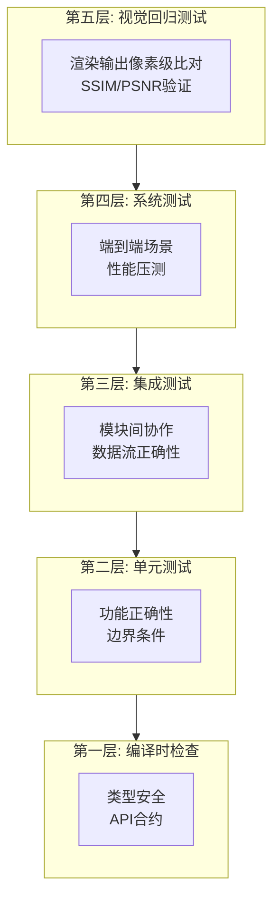

每一层的验证范围和工具链：

| 层级 | 验证目标 | 核心工具 | 执行时机 | 典型用例数量 |
|------|---------|---------|---------|------------|
| 编译时检查 | 类型安全、API合约 | clang, swift compiler | 每次保存 | N/A |
| 单元测试 | 函数级正确性 | GoogleTest, XCTest | 每次提交 | 2000+ |
| 集成测试 | 模块协作 | GoogleTest + Mock | 每次MR | 500+ |
| 系统测试 | 端到端场景 | 自动化框架 + 真机 | 每日构建 | 200+ |
| 视觉回归 | 渲染一致性 | SSIM/PSNR工具链 | 每次MR | 100+ |

#### 7.1.1 视觉回归测试框架

视觉回归测试是音视频SDK最独特也最重要的测试类型。它验证的是“渲染输出是否与基准一致”，而不是“功能是否返回正确值”。一个滤镜参数的微小调整、一个Shader的精度修改，都可能导致视觉上可感知的差异。

**基于SSIM的视觉回归检测（C++）**：

```cpp
namespace avsdk::testing {

// SSIM (Structural Similarity Index) 实现
// SSIM 值域: [-1, 1]，1表示完全相同，通常 > 0.99 认为无视觉差异
class SSIMCalculator {
public:
    struct SSIMResult {
        double ssimValue;       // 总体SSIM值
        double luminance;       // 亮度相似度
        double contrast;        // 对比度相似度
        double structure;       // 结构相似度
        bool passed;            // 是否通过阈值检查
    };
    
    static SSIMResult calculate(const uint8_t* imageA, const uint8_t* imageB,
                                 int width, int height, int channels,
                                 double threshold = 0.99) {
        // SSIM参数 (基于原论文默认值)
        const double C1 = 6.5025;    // (0.01 * 255)^2
        const double C2 = 58.5225;   // (0.03 * 255)^2
        
        const int windowSize = 11;
        const double sigma = 1.5;
        auto kernel = generateGaussianKernel(windowSize, sigma);
        
        double sumSSIM = 0.0;
        int count = 0;
        
        // 滑动窗口计算局部SSIM
        for (int y = 0; y <= height - windowSize; y += 4) {
            for (int x = 0; x <= width - windowSize; x += 4) {
                double muA = 0, muB = 0;
                double sigmaA2 = 0, sigmaB2 = 0, sigmaAB = 0;
                
                // 计算窗口内的加权均值和方差
                for (int wy = 0; wy < windowSize; ++wy) {
                    for (int wx = 0; wx < windowSize; ++wx) {
                        double w = kernel[wy * windowSize + wx];
                        double a = getPixelLuminance(imageA, x+wx, y+wy, 
                                                      width, channels);
                        double b = getPixelLuminance(imageB, x+wx, y+wy, 
                                                      width, channels);
                        muA += w * a;
                        muB += w * b;
                    }
                }
                
                for (int wy = 0; wy < windowSize; ++wy) {
                    for (int wx = 0; wx < windowSize; ++wx) {
                        double w = kernel[wy * windowSize + wx];
                        double a = getPixelLuminance(imageA, x+wx, y+wy,
                                                      width, channels);
                        double b = getPixelLuminance(imageB, x+wx, y+wy,
                                                      width, channels);
                        sigmaA2 += w * (a - muA) * (a - muA);
                        sigmaB2 += w * (b - muB) * (b - muB);
                        sigmaAB += w * (a - muA) * (b - muB);
                    }
                }
                
                double ssim = ((2*muA*muB + C1) * (2*sigmaAB + C2)) /
                              ((muA*muA + muB*muB + C1) * (sigmaA2 + sigmaB2 + C2));
                sumSSIM += ssim;
                count++;
            }
        }
        
        double meanSSIM = sumSSIM / count;
        return {meanSSIM, 0, 0, 0, meanSSIM >= threshold};
    }
    
private:
    static std::vector<double> generateGaussianKernel(int size, double sigma) {
        std::vector<double> kernel(size * size);
        double sum = 0;
        int half = size / 2;
        for (int y = -half; y <= half; ++y) {
            for (int x = -half; x <= half; ++x) {
                double val = exp(-(x*x + y*y) / (2*sigma*sigma));
                kernel[(y+half)*size + (x+half)] = val;
                sum += val;
            }
        }
        for (auto& v : kernel) v /= sum;  // 归一化
        return kernel;
    }
    
    static double getPixelLuminance(const uint8_t* img, int x, int y,
                                     int width, int channels) {
        int idx = (y * width + x) * channels;
        if (channels >= 3) {
            // ITU-R BT.709亮度公式
            return 0.2126 * img[idx] + 0.7152 * img[idx+1] + 0.0722 * img[idx+2];
        }
        return img[idx];
    }
};

} // namespace avsdk::testing
```

#### 7.1.2 性能基准测试

性能基准测试确保SDK的性能不会在迭代中退化。每次代码变更后，自动化性能测试会将结果与基准值对比，偏差超过阈值则触发告警。

**关键性能指标(KPI)表格**：

| KPI指标 | 测试场景 | 目标值 | 告警阈值 | 测试设备 |
|---------|---------|---------|----------|----------|
| 预览帧率 | 1080p+2滤镜+1转场 | ≥30fps | <27fps | iPhone 14 |
| 4K预览帧率 | 4K单轨+1滤镜 | ≥30fps | <25fps | iPhone 15 Pro |
| Seek响应 | 1080p素材任意Seek | ≤200ms | >300ms | iPhone 14 |
| 1080p导出速度 | 30s视频+3滤镜 | ≥2x实时 | <1.5x实时 | iPhone 14 |
| 4K导出速度 | 30s视频 | ≥1x实时 | <0.8x实时 | iPhone 15 Pro |
| 内存峰值 | 4K编辑+8轨 | ≤400MB | >500MB | iPhone 14 |
| SDK初始化 | 冷启动 | ≤300ms | >500ms | iPhone 12 |
| 裁剪操作 | 1080p精确裁剪 | ≤50ms | >100ms | iPhone 14 |

### 7.2 成本控制策略

> **核心结论**：验证的成本必须是可控的。分层验证的核心思想是“便宜的先跑，贵的后跑”——编译检查和单元测试在每次提交时跑，性能测试和视觉回归在MR时跑，全量压测在发布前跑。

**开发效率KPI与目标值**：

| KPI指标 | 当前值 | 目标值 | 度量方法 |
|---------|-------|---------|----------|
| 代码复用率 | 72% | ≥80% | 跨平台共享代码行数/总代码行数 |
| Bug密度 | 5/KLOC | ≤3/KLOC | Bug数/千行代码 |
| 单元测试覆盖率 | 65% | ≥80% | lcov行覆盖率 |
| CI构建时间 | 25min | ≤15min | 提交到全部Gate通过的时间 |
| MR合入时间 | 48h | ≤24h | 提交MR到合入的平均时间 |
| 崩溃率 | 0.05% | <0.01% | Crash次数/总启动次数 |

**技术债务控制**：

技术债务的管理采用“20%规则”——每个迭代周期分配20%的工程资源用于偿还技术债务。这包括重构、性能优化、测试补充、依赖升级等工作。

| 债务优先级 | 描述 | 典型示例 | 偿还时机 |
|---------|------|---------|----------|
| P0 (紧急) | 影响稳定性/安全性 | 内存泄漏、线程不安全 | 立即偿还 |
| P1 (重要) | 影响开发效率 | 构建慢、测试不稳定 | 本迭代偿还 |
| P2 (普通) | 影响可维护性 | 代码重复、命名不规范 | 下迭代偿还 |
| P3 (建议) | 潜在优化空间 | 更好的算法、新技术升级 | 规划到未来版本 |

### 7.3 可观测性体系

> **核心结论**：可观测性是SDK运行时质量保障的基石。日志、指标、追踪三个支柱缺一不可。没有可观测性，线上问题就是黑盒——用户反馈“导出失败”，你却不知道失败在哪个环节。

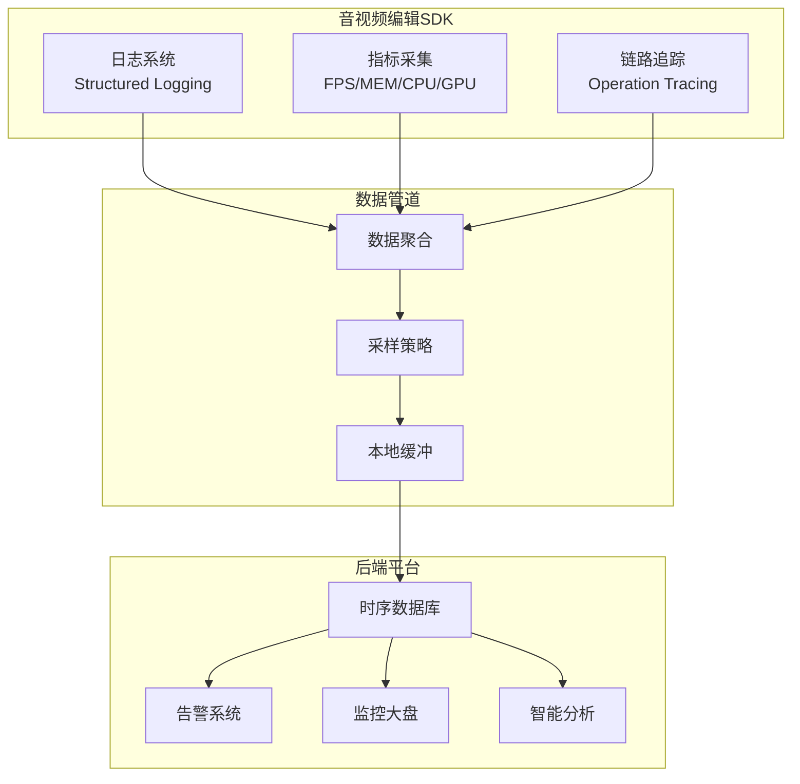

**分级日志设计**：

| 日志级别 | 用途 | 输出目标 | 生产环境策略 |
|---------|------|---------|---------------|
| Verbose | 帧级别调试信息 | 开发控制台 | 关闭 |
| Debug | 模块内部状态 | 开发控制台 | 关闭 |
| Info | 关键业务事件 | 日志文件 | 开启 |
| Warning | 异常但可恢复 | 日志文件 + 上报 | 开启 |
| Error | 严重错误 | 日志文件 + 实时上报 | 开启 |

**实时性能面板（Debug Overlay）**：

SDK内置一个可开关的调试面板，在预览画面上叠加显示实时性能数据：

```
┌───────────────────────────────────────────┐
│ AVEditSDK Debug Panel                        │
├───────────────────────────────────────────┤
│ FPS: 30.0 | GPU: 45% | CPU: 22%              │
│ MEM: 245MB / 400MB (61%)                     │
│ Textures: 12 active / 20 pooled              │
│ Decoders: 3 HW / 1 SW                        │
│ Render: 8.2ms | Decode: 12.1ms               │
│ Frame Drop: 0 | Seek Latency: 145ms          │
└───────────────────────────────────────────┘
```

**AGENTS.md配置模板（SDK项目专用）**：

```yaml
# AGENTS.md - 音视频编辑SDK项目规范

project:
  name: AVEditSDK
  type: cross-platform-sdk
  languages: ["C++17", "Swift", "Kotlin", "Metal Shading Language"]
  build_system: CMake 3.22+

constraints:
  - ALL public APIs MUST be called on main thread unless documented otherwise
  - ALL GPU resources MUST be allocated/freed on render thread
  - NEVER block the main thread for > 16ms
  - NEVER use raw pointers for ownership; use shared_ptr/unique_ptr
  - ALL error paths MUST return Result<T> type, NEVER throw exceptions

coding_standards:
  naming: Google C++ Style Guide
  max_function_length: 60 lines
  max_cyclomatic_complexity: 15
  required_test_coverage: 80%

testing:
  unit_test_framework: GoogleTest
  visual_regression_threshold: 0.99 (SSIM)
  performance_regression_threshold: 10%
  required_sanitizers: [ASAN, TSAN, UBSAN]

commit_convention:
  format: "type(scope): description"
  types: [feat, fix, perf, refactor, test, docs, chore]
  scopes: [edit, render, codec, asset, audio, infra, api]
  max_subject_length: 72
```

---

## 八、实施路径与验证标准

> **核心结论**：再好的架构设计，如果没有清晰的实施路径和可量化的验证标准，都只是空中楼阁。分阶段实施、每阶段明确交付物和验收标准，是工程项目成功的关键保障。

### 8.1 分阶段实施计划

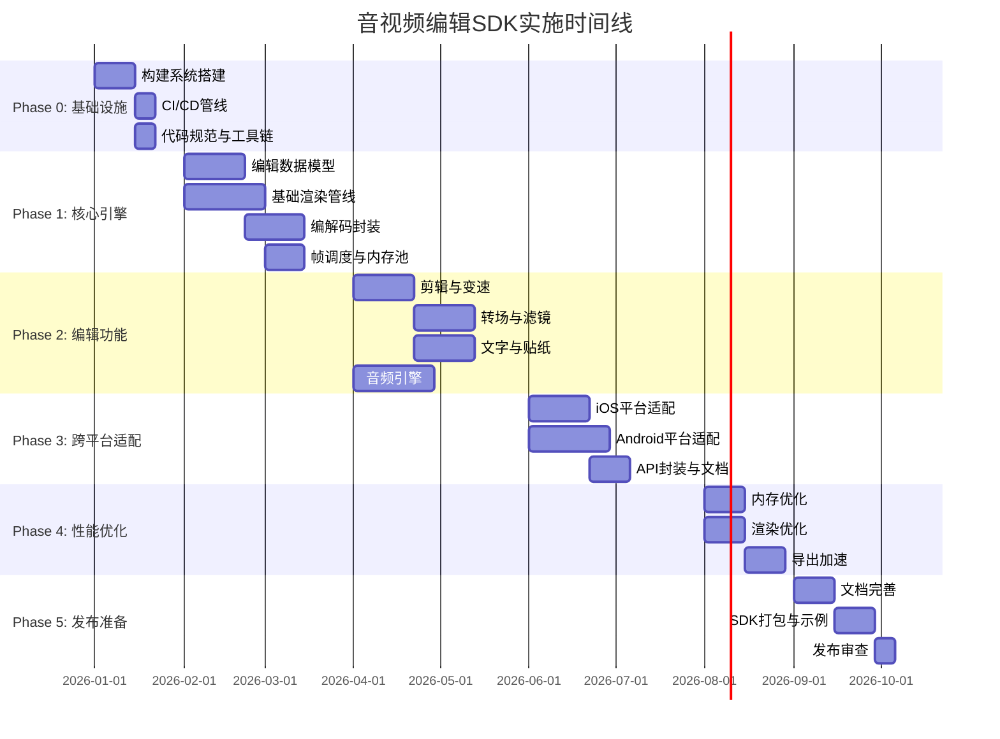

**各阶段详细交付物**：

| 阶段 | 时长 | 核心交付物 | 验收标准 |
|------|------|---------|----------|
| Phase 0: 基础设施 | 4周 | CMake构建系统、CI/CD管线、代码规范文档、AGENTS.md | 全平台编译通过，CI自动触发 |
| Phase 1: 核心引擎 | 8周 | Timeline数据模型、GPU渲染管线、硬件编解码封装 | 单轨视频导入→预览→导出全链路走通 |
| Phase 2: 编辑功能 | 8周 | 剪辑、变速、转场、滤镜、文字、音频处理 | 功能验收矩阵100%通过 |
| Phase 3: 跨平台适配 | 6周 | iOS/Android双平台SDK、Swift/Kotlin API | 双平台示例应用运行正常 |
| Phase 4: 性能优化 | 4周 | 内存优化、渲染优化、导出加速 | 性能基准全部达标 |
| Phase 5: 发布准备 | 4周 | API文档、示例应用、SDK包 | 发布清单全部勾选 |

### 8.2 验证标准与度量体系

#### 8.2.1 功能验证标准

功能验证采用分层策略：单元测试保证函数级正确性，集成测试保证模块协作，系统测试保证端到端场景。每一层都有明确的覆盖率目标和通过标准。

| 验证维度 | 指标 | 目标值 | 度量工具 |
|---------|------|---------|----------|
| 功能覆盖率 | FR需求实现率 | 100% (P0+P1) | 需求追溯矩阵 |
| 单元测试覆盖率 | 行覆盖率 | ≥ 80% (核心模块) | lcov / llvm-cov |
| 集成测试通过率 | 用例通过率 | 100% | GoogleTest |
| 视觉回归通过率 | SSIM阈值 | ≥ 0.99 | 自研SSIM工具 |
| API覆盖率 | 公开API测试覆盖 | 100% | API测试套件 |

#### 8.2.2 性能验证标准

| 场景 | 指标 | 目标值 | 测试方法 | 测试设备 |
|------|------|---------|---------|----------|
| 1080p实时预览 | 帧率 | ≥30fps | FPS埋点 | iPhone 14 |
| 4K实时预览 | 帧率 | ≥30fps | FPS埋点 | iPhone 15 Pro |
| 1080p导出 | 导出速度 | ≥2x实时 | 时间埋点 | iPhone 14 |
| 4K导出 | 导出速度 | ≥1x实时 | 时间埋点 | iPhone 15 Pro |
| 任意Seek | 响应延迟 | ≤200ms | Seek延迟埋点 | iPhone 14 |
| SDK初始化 | 冷启动时间 | ≤300ms | 启动计时 | iPhone 12 |
| 运行内存 | 内存峰值 | ≤400MB (4K编辑) | Instruments | iPhone 14 |
| GPU纹理 | 纹理缓存 | ≤256MB | GPU Capture | iPhone 14 |
| SDK包体 | 核心模块大小 | ≤15MB | size-limit | N/A |

#### 8.2.3 兼容性验证标准

**设备覆盖矩阵**：

| 平台 | 最低版本 | 目标设备 | GPU | 验证状态 |
|------|---------|---------|-----|----------|
| iOS | iOS 15.0 | iPhone 12 | A14 | 必测 |
| iOS | iOS 16.0 | iPhone 14 | A15 | 必测 |
| iOS | iOS 17.0 | iPhone 15 Pro | A17 Pro | 必测 |
| iOS | iOS 18.0 | iPhone 16 | A18 | 必测 |
| Android | API 28 | Pixel 6 | Mali-G78 | 必测 |
| Android | API 31 | Samsung S22 | Adreno 730 | 必测 |
| Android | API 33 | Pixel 8 | Mali-G715 | 必测 |
| Android | API 34 | Samsung S24 | Adreno 750 | 必测 |

**格式支持矩阵**：

| 输入格式 | 视频编码 | 音频编码 | iOS支持 | Android支持 | 优先级 |
|---------|---------|---------|---------|------------|--------|
| MP4 | H.264 | AAC | ✅ | ✅ | P0 |
| MP4 | H.265 | AAC | ✅ | ✅ | P0 |
| MOV | ProRes | PCM | ✅ | ⚠️软解 | P1 |
| WebM | VP9 | Opus | ✅ | ✅ | P1 |
| MKV | H.264 | AAC | ✅ | ✅ | P2 |
| AVI | MPEG-4 | MP3 | ✅ | ✅ | P2 |
| GIF | - | - | ✅ | ✅ | P1 |

#### 8.2.4 质量验证标准

| 质量维度 | 指标 | 目标值 | 测量方法 |
|---------|------|---------|----------|
| 渲染质量 | PSNR | ≥ 40dB | 与基准帧对比 |
| 音频质量 | PESQ | ≥ 3.5 | ITU-T P.862工具 |
| 音视频同步 | 偷差 | < 40ms | 同步检测工具 |
| 崩溃率 | Crash Rate | < 0.01% | 崩溃监控平台 |
| 内存泄漏 | Leak Count | 0 | ASAN + Instruments |
| 线程安全 | Data Race | 0 | TSAN |

### 8.3 风险管理

#### 8.3.1 技术风险矩阵

风险评估采用“概率 × 影响”四象限模型，每个风险都有明确的缓解措施和应急预案。

| 风险项 | 概率 | 影响 | 级别 | 缓解措施 |
|--------|------|------|------|----------|
| 跨平台GPU兼容性 | 高 | 高 | ☀️ 红色 | 抽象层+能力探测+GLES降级 |
| 硬件编解码器碎片化 | 高 | 高 | ☀️ 红色 | 兼容性矩阵+软解码兖底 |
| 性能目标未达标 | 中 | 高 | ⚠️ 橙色 | 分阶段性能基准+操作级优化 |
| 第三方依赖变更 | 中 | 中 | ⚠️ 橙色 | 依赖版本锁定+定期升级策略 |
| 内存压力超出预期 | 中 | 中 | ⚠️ 橙色 | 内存水位监控+动态降级 |
| API设计变更 | 低 | 低 | ✅ 绿色 | 语义版本号+废弃周期 |
| 文档延期 | 低 | 低 | ✅ 绿色 | 文档自动生成+强制关联 |

#### 8.3.2 应急预案

**性能不达标的降级方案**：

SDK内置多级降级策略，当设备性能不足时自动触发，保证用户体验的连续性。当帧率持续低于目标值时，系统会按顺序触发以下降级策略，直到帧率恢复到可接受范围：

```
性能降级策略链：
├── Level 0 (正常): 全分辨率渲染 + 全效果
├── Level 1 (轻度降级): 预览分辨率降至50%
├── Level 2 (中度降级): 复杂滤镜简化（减少blur迭代次数）
├── Level 3 (重度降级): 禁用部分效果（只保留基础调色）
└── Level 4 (极限降级): 丢帧模式（目标帧率降至15fps）
```

**设备兼容性问题的热修复机制**：

通过服务端配置下发机制，可以在不发版的情况下修复特定设备的兼容性问题。当某款设备出现硬件编解码器崩溃时，服务端可以下发规则将该设备的编解码器降级为软件实现：

| 场景 | 检测方式 | 热修复策略 | 影响范围 |
|------|---------|------------|----------|
| 硬件解码器崩溃 | 崩溃上报聚合 | 下发配置禁用硬解 | 特定设备型号 |
| GPU渲染异常 | 视觉异常上报 | 下发Shader变体替换 | 特定GPU型号 |
| 内存压力大 | 内存警告统计 | 下发降低缓存上限 | 特定内存等级 |
| 格式解析失败 | 错误码统计 | 下发格式适配规则 | 特定文件来源 |

**安全漏洞快速响应流程**：

安全漏洞的响应流程分为四个阶段，从发现到修复发布的目标时间为48小时以内。包括漏洞确认与影响评估（4小时）、修复开发与测试（24小时）、发布与通知（8小时）、事后复盘与改进（12小时）。全流程必须在AGENTS.md中有明确的责任人分配和升级机制。

---

## 九、总结与展望

> **核心结论**：企业级音视频编辑SDK的设计是一个系统工程问题。从思维模型到架构设计，从模块划分到微观实现，从工程保障到发布运维，每一层都需要精心设计、严格验证。

### 9.1 核心设计原则回顾

| 设计维度 | 核心决策 | 技术方案 | Four Pillars映射 |
|---------|---------|---------|------------------|
| 架构模式 | 分层 + Pipeline | C++核心引擎 + 平台原生渲染 | Traceability |
| 编辑模型 | Timeline-Track-Clip + Command | Protobuf序列化 + Undo/Redo | DRY |
| 渲染策略 | 双模渲染管线 | 预览低分辨率 + 导出全质量 | Determinism |
| 跨平台 | C++核心 + 原生渲染 | Metal(iOS) + Vulkan(Android) | Parsimony |
| 性能优化 | 内存池 + 多线程管线 | Ring Buffer + Lock-free Queue | Determinism |
| 容错机制 | 分层异常 + 自动恢复 | WAL Journal + 降级策略 | Traceability |
| 测试体系 | 五层验证金字塔 | 单元 + 集成 + 视觉回归 + 性能 | Determinism |
| API设计 | 分层API + Builder模式 | Simple/Advanced/Expert三层 | Parsimony |

### 9.2 技术演进方向

**AI驱动的智能编辑**：

AI正在重塑视频编辑的用户体验。未来SDK将内置的AI能力包括：自动剪辑（基于场景检测和音频节拍分析）、智能字幕（ASR语音识别 + 自动时间轴对齐）、风格迁移（基于神经风格转换的实时滤镜）、智能美颜（人脸检测 + 实时美颜效果）。这些能力通过插件化架构接入，不污染核心编辑链路，同时利用CoreML/NNAPI硬件加速确保实时性。

**实时协同编辑**：

多人实时协同编辑是下一代视频编辑的重要方向。基于OT（Operational Transformation）或CRDT（Conflict-free Replicated Data Types）算法，多个用户可以同时编辑同一个时间轴项目。Timeline-Track-Clip数据模型的结构化特性使得CRDT的应用相对自然——每个Clip是一个独立的CRDT节点，轨道层面的冲突解决可以通过时间戳优先策略实现。

**云端渲染与边缘计算**：

当本地设备性能不足时，可以将渲染和导出任务卸载到云端。这要求SDK具备序列化Timeline状态上传、云端渲染执行、结果回传的完整链路。Protobuf序列化的Timeline模型为这种混合架构提供了天然支持。

**下一代编解码标准**：

AV1和VVC（H.266）代表了视频编解码的未来。AV1在同等画质下可比H.265节省约30%码率，但编码复杂度更高。随着硬件解码器的普及（iPhone 15+、Pixel 8+），AV1将逐步成为默认导出格式。SDK的编解码抽象层设计使得新编解码器的接入只需实现IEncoder/IDecoder接口，无需修改上层代码。

### 9.3 参考资源

**关键参考文献**：

| 领域 | 参考资源 | 说明 |
|------|---------|------|
| Metal编程 | Apple Metal Best Practices Guide | GPU渲染优化权威指南 |
| Vulkan编程 | Vulkan Programming Guide (Sellers) | Vulkan入门到进阶 |
| 视频编解码 | H.264 and MPEG-4 Video Compression (Richardson) | 视频压缩核心原理 |
| 音频处理 | DAFX: Digital Audio Effects (Zölzer) | 数字音频效果算法 |
| 软件架构 | Clean Architecture (Robert C. Martin) | 软件架构设计原则 |
| 性能优化 | Performance Analysis and Tuning on Modern CPUs (Easyperf) | CPU级性能优化 |

**推荐的开源项目**：

| 项目 | 语言 | 用途 | 参考价值 |
|------|------|------|----------|
| FFmpeg | C | 音视频编解码、封装 | 格式处理的行业标准 |
| GPUImage | Swift/ObjC | GPU图像处理 | 滤镜链Shader设计 |
| ExoPlayer | Kotlin | Android播放器 | 自适应缓冲、解码器管理 |
| OpenTimelineIO | C++/Python | 时间轴数据模型 | Timeline数据模型设计 |
| Rubber Band | C++ | 音频变速不变调 | WSOLA/Phase Vocoder实现 |

**Apple/Google官方文档**：

| 文档 | 平台 | 链接 |
|------|------|------|
| Metal Programming Guide | iOS/macOS | developer.apple.com/metal |
| VideoToolbox Framework | iOS | developer.apple.com/documentation/videotoolbox |
| AVFoundation Programming Guide | iOS | developer.apple.com/av-foundation |
| Vulkan Best Practices | Android | developer.android.com/ndk/guides/graphics |
| MediaCodec Reference | Android | developer.android.com/reference/android/media/MediaCodec |
| CameraX / Media3 | Android | developer.android.com/media |

---

*本文档基于 Spec Coding 方法论和 Harness Engineering 理念编写，适用于 iOS 15+ / Android API 28+ / C++17 技术栈，反映 2024-2026 年行业最佳实践。*
