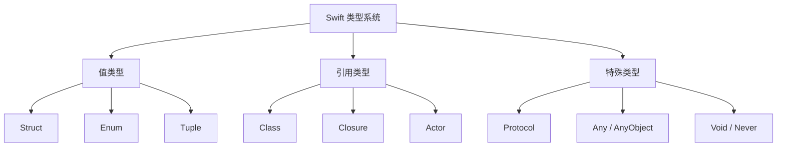
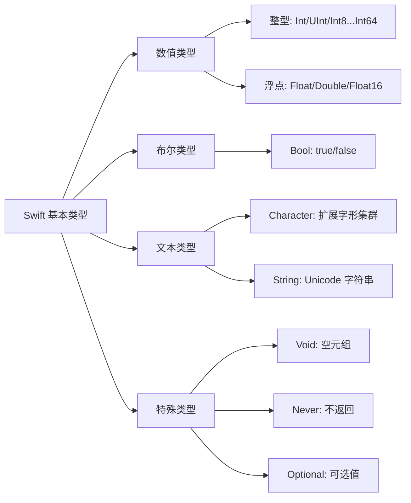
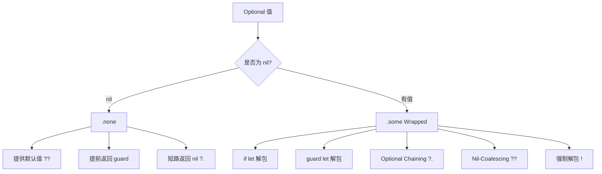

# 基础类型与类型推导深度解析

> 深入理解 Swift 类型系统：静态类型 + 类型推断的设计哲学、值类型与引用类型、Optional 机制与类型转换

---

## 目录

- [核心结论 TL;DR](#核心结论-tldr)
- [第一部分：Swift 类型系统概述](#第一部分swift-类型系统概述)
- [第二部分：基本数据类型](#第二部分基本数据类型)
- [第三部分：Optional 类型系统](#第三部分optional-类型系统)
- [第四部分：类型推断](#第四部分类型推断)
- [第五部分：类型转换](#第五部分类型转换)
- [第六部分：类型别名与元类型](#第六部分类型别名与元类型)
- [最佳实践](#最佳实践)
- [常见陷阱](#常见陷阱)
- [面试考点](#面试考点)
- [参考资源](#参考资源)

---

## 核心结论 TL;DR

| 维度 | 核心洞察 |
|------|----------|
| **设计哲学** | Swift 采用静态类型 + 强类型推断，在编译期捕获类型错误，同时减少冗余注解 |
| **值 vs 引用** | Struct/Enum/Tuple 是值类型（拷贝语义），Class 是引用类型（共享语义），值类型是 Swift 的默认选择 |
| **Optional** | Optional 本质是 `enum Optional<Wrapped> { case none, some(Wrapped) }`，是 Swift 空安全的核心 |
| **类型推断** | 编译器通过上下文（字面量、返回值、泛型约束）自动推导类型，绝大多数场景无需显式标注 |
| **类型转换** | Swift 不做隐式类型转换，所有转换必须显式进行，避免 C/ObjC 中常见的隐式转换 Bug |

---

## 第一部分：Swift 类型系统概述

### 1.1 设计哲学：静态类型 + 类型推断

**结论先行**：Swift 是一门静态强类型语言，但通过强大的类型推断机制，代码简洁度接近动态语言。

Swift 类型系统的三大支柱：
1. **编译期类型检查** — 所有类型错误在编译时发现，不留到运行时
2. **类型推断** — 编译器自动推导类型，减少样板代码
3. **类型安全** — 不允许隐式类型转换，强制显式处理

```swift
// ✅ 类型推断 — 编译器自动推导
let name = "Swift"        // 推断为 String
let count = 42            // 推断为 Int
let pi = 3.14159          // 推断为 Double
let isReady = true        // 推断为 Bool

// ✅ 显式类型注解 — 当需要特定类型时
let price: Float = 9.99   // 明确指定 Float（否则推断为 Double）
let byte: UInt8 = 255     // 明确指定 UInt8

// ❌ 类型安全 — 不允许隐式转换
let intVal: Int = 42
// let doubleVal: Double = intVal  // 编译错误！
let doubleVal: Double = Double(intVal)  // ✅ 必须显式转换
```

### 1.2 值类型 vs 引用类型

**结论先行**：Swift 优先使用值类型（Struct），仅在需要共享状态或继承时使用引用类型（Class）。

```
┌──────────────────────────────────────────────────────────────┐
│                    Swift 类型分类                              │
├──────────────────────────────────────────────────────────────┤
│                                                              │
│  值类型（Value Types）— 赋值时复制                            │
│  ├─ Struct    ：Int, Double, String, Array, Dictionary...    │
│  ├─ Enum      ：Optional, Result, 自定义枚举                 │
│  └─ Tuple     ：(Int, String), (x: Double, y: Double)       │
│                                                              │
│  引用类型（Reference Types）— 赋值时共享引用                  │
│  ├─ Class     ：UIViewController, NSObject 子类...           │
│  ├─ Closure   ：闭包是引用类型                                │
│  └─ Actor     ：Swift 并发中的 actor                         │
│                                                              │
│  特殊类型                                                    │
│  ├─ Protocol  ：可被值类型和引用类型遵循                      │
│  ├─ Any       ：任意类型                                     │
│  └─ AnyObject ：任意 class 类型                              │
│                                                              │
└──────────────────────────────────────────────────────────────┘
```

```swift
// ✅ 值类型 — 赋值后独立副本
struct Point {
    var x: Double
    var y: Double
}

var p1 = Point(x: 1, y: 2)
var p2 = p1          // 复制
p2.x = 10
print(p1.x)          // 1 — p1 不受影响

// ✅ 引用类型 — 赋值后共享
class Node {
    var value: Int
    init(value: Int) { self.value = value }
}

let n1 = Node(value: 1)
let n2 = n1          // 共享引用
n2.value = 10
print(n1.value)      // 10 — n1 也被修改！
```

| 特性 | 值类型（Struct/Enum） | 引用类型（Class） |
|------|----------------------|-------------------|
| 赋值语义 | 复制（Copy-on-Write 优化） | 共享引用 |
| 存储位置 | 通常栈分配 | 堆分配 |
| 线程安全 | 天然安全（独立副本） | 需要同步机制 |
| 继承 | 不支持 | 支持 |
| deinit | 不支持 | 支持 |
| 恒等运算符 === | 不支持 | 支持 |



### 1.3 Swift 标准库类型都是值类型

**结论先行**：Swift 标准库中的核心类型（Int、String、Array、Dictionary）全部是 Struct，通过 Copy-on-Write 保证性能。

```swift
// String 是值类型
var greeting = "Hello"
var copy = greeting
copy += " World"
print(greeting)    // "Hello" — 未被修改

// Array 是值类型（带 CoW 优化）
var arr1 = [1, 2, 3]
var arr2 = arr1     // 此时共享底层存储（CoW）
arr2.append(4)      // 触发真正的复制
print(arr1)         // [1, 2, 3]
print(arr2)         // [1, 2, 3, 4]
```

---

## 第二部分：基本数据类型

### 2.1 整型家族

Swift 整型按**符号**和**位宽**两个维度分类，且在不同平台上大小确定：

| 类型 | 位宽 | 最小值 | 最大值 | 说明 |
|------|------|--------|--------|------|
| `Int8` | 8 | -128 | 127 | 有符号 8 位 |
| `UInt8` | 8 | 0 | 255 | 无符号 8 位 |
| `Int16` | 16 | -32768 | 32767 | 有符号 16 位 |
| `UInt16` | 16 | 0 | 65535 | 无符号 16 位 |
| `Int32` | 32 | -2^31 | 2^31-1 | 有符号 32 位 |
| `UInt32` | 32 | 0 | 2^32-1 | 无符号 32 位 |
| `Int64` | 64 | -2^63 | 2^63-1 | 有符号 64 位 |
| `UInt64` | 64 | 0 | 2^64-1 | 无符号 64 位 |
| `Int` | 平台相关 | 32/64位系统分别对应 | — | **默认选择** |
| `UInt` | 平台相关 | — | — | 非必要不使用 |

```swift
// ✅ 推荐：统一使用 Int
let count: Int = 42

// ✅ 整型边界值
print(Int8.min)   // -128
print(Int8.max)   // 127
print(UInt8.max)  // 255

// ✅ 数字字面量支持下划线分隔
let million = 1_000_000
let binary = 0b1010_1100     // 二进制
let octal = 0o55             // 八进制
let hex = 0xFF               // 十六进制

// ❌ 整型溢出 — 运行时崩溃
// let overflow: Int8 = Int8.max + 1  // Fatal error: arithmetic overflow

// ✅ 安全溢出运算
let (result, overflowed) = Int8.max.addingReportingOverflow(1)
print(result)      // -128（回绕）
print(overflowed)  // true
```

### 2.2 浮点型

| 类型 | 大小 | 精度 | 使用场景 |
|------|------|------|----------|
| `Float16` | 2 字节 | ~3 位有效数字 | ML 推理、GPU 计算 |
| `Float` | 4 字节 | ~7 位有效数字 | 图形/音频处理 |
| `Double` | 8 字节 | ~15 位有效数字 | **默认选择** |

```swift
// ✅ 浮点字面量默认推断为 Double
let pi = 3.14159          // Double
let gravity: Float = 9.8  // 明确指定 Float

// ❌ 浮点精度陷阱
let a: Double = 0.1 + 0.2
print(a == 0.3)           // false! (0.30000000000000004)

// ✅ 浮点比较的正确方式
func isAlmostEqual(_ a: Double, _ b: Double, tolerance: Double = 1e-10) -> Bool {
    return abs(a - b) < tolerance
}
print(isAlmostEqual(0.1 + 0.2, 0.3))  // true

// ✅ 特殊值
let inf = Double.infinity
let nan = Double.nan
print(nan == nan)          // false — NaN 不等于自身
print(nan.isNaN)           // true
```

### 2.3 Bool 类型

```swift
let isReady = true
let isEmpty = false

// ❌ Swift 不允许隐式 Bool 转换
// if 1 { }              // 编译错误！
// if "hello" { }        // 编译错误！

// ✅ 必须显式使用 Bool 表达式
if count > 0 { }
if !isEmpty { }
```

### 2.4 Character 与 String

**结论先行**：Swift 的 String 完全支持 Unicode，Character 表示一个扩展字形集群（Extended Grapheme Cluster）。

```swift
// Character — 单个扩展字形集群
let letter: Character = "A"
let emoji: Character = "👨‍👩‍👧‍👦"  // 一个 Character，但底层多个 Unicode 标量

// String — 值类型
var str = "Hello"
str += " Swift"
print(str.count)         // 11

// ✅ 字符串插值
let name = "World"
let message = "Hello, \(name)!"

// ✅ 多行字符串
let multiline = """
    第一行
    第二行
    第三行
    """

// ✅ String 不支持整数下标（因为 Unicode 变长编码）
let greeting = "Hello"
let first = greeting[greeting.startIndex]                    // "H"
let second = greeting[greeting.index(after: greeting.startIndex)]  // "e"

// ❌ 不能用整数下标
// let ch = greeting[0]  // 编译错误！
```

### 2.5 Void 与 Never

```swift
// Void 是空元组的类型别名
// public typealias Void = ()
func doSomething() -> Void {  // 等价于 -> ()
    print("done")
}

// Never — 表示函数永远不会正常返回
func fatalError(_ message: String) -> Never {
    // 进程终止，不会返回
}

// Never 的实际用途：
// 1. 标记不可达代码路径
// 2. 在 switch 中处理不可能的 case
// 3. 作为 Result<T, Never> 表示不会失败
let result: Result<String, Never> = .success("always succeeds")
```



---

## 第三部分：Optional 类型系统

### 3.1 Optional 的本质

**结论先行**：Optional 是一个泛型枚举，`T?` 是 `Optional<T>` 的语法糖，这是 Swift 空安全的基石。

```swift
// Optional 的底层定义（简化版）
enum Optional<Wrapped> {
    case none         // nil
    case some(Wrapped) // 有值
}

// 以下两种写法完全等价
var name1: String? = "Swift"
var name2: Optional<String> = .some("Swift")

var empty1: String? = nil
var empty2: Optional<String> = .none
```

### 3.2 Optional Binding

```swift
let possibleNumber: String? = "42"

// ✅ if let — 条件解包
if let number = possibleNumber {
    print("数字是 \(number)")  // number 类型是 String（非 Optional）
}

// ✅ if let 简写（Swift 5.7+）
if let possibleNumber {
    print("数字是 \(possibleNumber)")
}

// ✅ guard let — 提前退出
func process(input: String?) {
    guard let value = input else {
        print("input 为 nil，提前退出")
        return
    }
    // value 在这里可用，类型是 String
    print("处理 \(value)")
}

// ✅ 多条件 Optional Binding
if let first = Int("1"),
   let second = Int("2"),
   first < second {
    print("\(first) < \(second)")
}
```

### 3.3 Optional Chaining

**结论先行**：Optional Chaining 在链式调用中遇到 nil 时短路返回 nil，避免层层嵌套的 if let。

```swift
class Address {
    var street: String?
}
class Person {
    var address: Address?
}

let person = Person()

// ✅ Optional Chaining — 安全访问
let street = person.address?.street  // String? 类型
// 等价于：
// if person.address != nil {
//     if person.address!.street != nil { ... }
// }

// ✅ 链式调用
let streetLength = person.address?.street?.count  // Int?

// ✅ Optional Chaining 调用方法
let uppercased = person.address?.street?.uppercased()  // String?
```

### 3.4 Nil-Coalescing 运算符

```swift
// ✅ ?? 提供默认值
let name: String? = nil
let displayName = name ?? "Anonymous"  // "Anonymous"

// ✅ 链式 ??
let primary: String? = nil
let secondary: String? = nil
let fallback = "Default"
let result = primary ?? secondary ?? fallback  // "Default"

// ✅ ?? 与 Optional Chaining 结合
let street = person.address?.street ?? "Unknown Street"
```

### 3.5 强制解包与隐式解包

```swift
// ❌ 强制解包 — 如果为 nil 则崩溃
let possibleInt: Int? = nil
// let value = possibleInt!  // Fatal error: Unexpectedly found nil

// ✅ 仅在确定有值时使用强制解包
let definiteInt: Int? = 42
let value = definiteInt!  // 42（但仍建议用 if let）

// Implicitly Unwrapped Optional（IUO）
// 典型场景：IBOutlet、在 init 后必定有值的属性
class ViewController {
    var label: UILabel!  // IUO：使用时自动解包
    
    func viewDidLoad() {
        label = UILabel()         // 在此之后一定有值
        label.text = "Hello"      // 自动解包，无需 ? 或 !
    }
}
```



---

## 第四部分：类型推断（Type Inference）

### 4.1 编译器推断规则

**结论先行**：Swift 编译器从右向左、从具体到抽象进行类型推断，包括字面量推断、上下文推断和泛型推断。

```swift
// 1. 字面量推断
let x = 42            // Int（整型字面量默认 Int）
let y = 3.14          // Double（浮点字面量默认 Double）
let z = "hello"       // String
let b = true          // Bool

// 2. 表达式推断
let sum = x + 10      // Int（因为 x 是 Int）
let arr = [1, 2, 3]   // [Int]（从元素推断）
let dict = ["a": 1]   // [String: Int]

// 3. 返回值推断
func makeArray() -> [String] {
    return []          // 编译器知道返回 [String]
}

// 4. 闭包上下文推断
let numbers = [1, 2, 3]
let doubled = numbers.map { $0 * 2 }  // [Int]，编译器推断 $0 为 Int
```

### 4.2 显式注解 vs 类型推断

```swift
// ✅ 类型推断 — 推荐，简洁清晰
let name = "Swift"
let count = 42
let colors = ["red", "green", "blue"]

// ✅ 显式注解 — 以下场景需要
let price: Float = 9.99           // 需要 Float 而非 Double
let empty: [String] = []          // 空集合必须注解
let callback: (Int) -> Bool       // 声明闭包类型
var optional: String? = nil       // 初始为 nil 时需要注解

// ❌ 过度注解 — 不推荐
let name: String = "Swift"        // 冗余：推断即可
let count: Int = 42               // 冗余：推断即可
```

### 4.3 泛型上下文中的推断

```swift
// 泛型函数 — 从参数推断类型
func firstElement<T>(of array: [T]) -> T? {
    return array.first
}
let first = firstElement(of: [1, 2, 3])  // T 推断为 Int

// 泛型约束推断
func compare<T: Comparable>(_ a: T, _ b: T) -> Bool {
    return a < b
}
compare(1, 2)         // T 推断为 Int
compare("a", "b")     // T 推断为 String

// Result Builder 上下文推断（SwiftUI）
// var body: some View {
//     Text("Hello")     // 编译器推断具体 View 类型
// }
```

### 4.4 推断失败的场景与解决

```swift
// ❌ 空集合 — 无法推断元素类型
// let arr = []              // 编译错误
let arr: [Int] = []          // ✅ 必须显式注解

// ❌ 多重重载 — 编译器无法选择
// let val = max(1, 2.0)     // 编译错误：Int 还是 Double？
let val = max(1.0, 2.0)      // ✅ 统一类型

// ❌ 复杂表达式 — 编译器超时
// let result = dict.map { ... }.filter { ... }.reduce(...) { ... }
// 解决方案：拆分为多步，或添加类型注解
let mapped: [Int] = dict.map { $0.value }  // ✅ 帮助编译器推断

// ❌ 闭包返回值歧义
let handler: (Int) -> String = { num in
    return "\(num)"           // ✅ 明确返回类型
}
```

---

## 第五部分：类型转换

### 5.1 is 类型检查

```swift
class Animal {}
class Dog: Animal {}
class Cat: Animal {}

let pet: Animal = Dog()

// is — 类型检查（返回 Bool）
if pet is Dog {
    print("是一只狗")     // ✅ 执行
}
if pet is Cat {
    print("是一只猫")     // 不执行
}

// 在 switch 中使用
switch pet {
case is Dog: print("Dog")
case is Cat: print("Cat")
default: print("Other")
}
```

### 5.2 as / as? / as! 转换

```swift
// as — 保证成功的转换（上转型/字面量协议）
let dog = Dog()
let animal: Animal = dog as Animal   // 上转型，总是成功

// as? — 条件转换（返回 Optional）
let maybeDog = animal as? Dog        // Dog?
if let dog = animal as? Dog {
    print("转换成功：\(dog)")
}

// as! — 强制转换（失败则崩溃）
let forceDog = animal as! Dog        // ✅ 成功
// let forceCat = animal as! Cat     // ❌ 运行时崩溃！
```

| 操作符 | 返回类型 | 失败行为 | 使用场景 |
|--------|----------|----------|----------|
| `as` | 目标类型 | 编译时保证成功 | 上转型、字面量协议 |
| `as?` | Optional | 返回 nil | 不确定是否成功 |
| `as!` | 目标类型 | 运行时崩溃 | 确定成功时（慎用） |

### 5.3 数值类型间的转换

```swift
// ❌ Swift 不做隐式数值转换
let intVal: Int = 42
// let doubleVal: Double = intVal      // 编译错误！

// ✅ 必须显式构造
let doubleVal = Double(intVal)         // 42.0
let floatVal = Float(intVal)           // 42.0
let int8Val = Int8(exactly: intVal)    // Int8?（安全转换）

// ✅ Int8(exactly:) — 超出范围返回 nil
let big: Int = 1000
let safe = Int8(exactly: big)          // nil（1000 超出 Int8 范围）

// ❌ 直接截断
let truncated = Int8(truncatingIfNeeded: big)  // 截断后的值
```

### 5.4 Any 与 AnyObject

```swift
// Any — 可以表示任何类型（值类型 + 引用类型）
var anyArray: [Any] = [1, "hello", true, 3.14]

// AnyObject — 只能表示 class 类型
var objArray: [AnyObject] = [Dog(), Cat()]

// 从 Any 恢复具体类型
for item in anyArray {
    switch item {
    case let intVal as Int:
        print("Int: \(intVal)")
    case let strVal as String:
        print("String: \(strVal)")
    case let boolVal as Bool:
        print("Bool: \(boolVal)")
    default:
        print("Other: \(item)")
    }
}
```

---

## 第六部分：类型别名与元类型

### 6.1 typealias 的使用场景

```swift
// 1. 简化复杂类型
typealias CompletionHandler = (Result<Data, Error>) -> Void
typealias UserID = String
typealias Coordinate = (x: Double, y: Double)

func fetchData(completion: CompletionHandler) { }

// 2. 协议关联类型的具体化
protocol Container {
    associatedtype Element
    func add(_ element: Element)
}

struct IntContainer: Container {
    typealias Element = Int  // 具体化关联类型
    func add(_ element: Int) { }
}

// 3. 跨平台兼容
#if os(macOS)
typealias PlatformColor = NSColor
#else
typealias PlatformColor = UIColor
#endif
```

### 6.2 元类型（Metatype）

**结论先行**：`T.Type` 是类型 T 的元类型，`.self` 获取元类型实例，用于运行时类型操作和工厂模式。

```swift
// T.Type — 元类型，T.self — 元类型的实例
let intType: Int.Type = Int.self
let stringType: String.Type = String.self

// 使用场景 1：type(of:) 获取运行时类型
let str = "Hello"
print(type(of: str))  // String

// 使用场景 2：工厂模式
class Animal2 {
    required init() {}
}
class Dog2: Animal2 {}
class Cat2: Animal2 {}

func createAnimal(_ type: Animal2.Type) -> Animal2 {
    return type.init()
}
let myDog = createAnimal(Dog2.self)  // 创建 Dog2 实例

// 使用场景 3：表注册（UITableView）
// tableView.register(MyCell.self, forCellReuseIdentifier: "cell")
```

### 6.3 与 C++ 类型系统的对比

| 特性 | Swift | C++ |
|------|-------|-----|
| 类型推断关键字 | 自动推断（无关键字） | `auto` / `decltype` |
| 空值表示 | `Optional<T>` 类型安全 | `nullptr` / `std::optional` |
| 隐式转换 | 完全禁止 | 支持（可能导致 Bug） |
| 类型转换 | `as` / `as?` / `as!` | `static_cast` / `dynamic_cast` / `reinterpret_cast` |
| 类型别名 | `typealias` | `using` / `typedef` |
| 值类型 vs 引用类型 | Struct vs Class，语言级区分 | 统一对象模型，通过指针/引用手动控制 |
| 元编程 | 有限（泛型+协议） | 强大（模板元编程） |

---

## 最佳实践

### 类型选择

1. **优先使用 `Int`** — 即使值不可能为负，统一使用 Int 避免类型转换开销
2. **优先使用 `Double`** — 浮点默认选择 Double，精度更高
3. **优先使用值类型** — Struct 是 Swift 的默认选择，仅在需要继承/共享时用 Class
4. **避免 `Any` / `AnyObject`** — 使用泛型或协议替代，保持类型安全

### Optional 处理

5. **优先使用 `if let` / `guard let`** — 安全解包
6. **使用 `??` 提供合理默认值** — 比 if let 更简洁
7. **避免强制解包 `!`** — 除非在单元测试或已有 guard 保护
8. **使用 `map` / `flatMap` 处理 Optional** — 函数式风格

```swift
// ✅ Optional 的函数式处理
let number: Int? = 42
let string = number.map { String($0) }  // Optional<String>

let nested: String? = "123"
let parsed = nested.flatMap { Int($0) }  // Optional<Int>
```

### 类型注解

9. **让编译器推断** — 大多数场景不需要显式注解
10. **复杂闭包添加注解** — 帮助编译器加速编译

---

## 常见陷阱

### 陷阱 1：浮点比较

```swift
// ❌ 直接比较浮点数
if 0.1 + 0.2 == 0.3 {  // false！
    print("equal")
}

// ✅ 使用容差比较
if abs((0.1 + 0.2) - 0.3) < 1e-10 {
    print("equal")
}
```

### 陷阱 2：强制解包崩溃

```swift
// ❌ 不确定时强制解包
func getUser() -> User? { return nil }
// let user = getUser()!  // 崩溃！

// ✅ 安全解包
guard let user = getUser() else {
    print("No user")
    return
}
```

### 陷阱 3：值类型中包含引用类型

```swift
// ❌ Struct 内嵌 Class — 复制后共享引用成员
class Engine {
    var horsepower = 200
}
struct Car {
    var name: String
    var engine: Engine  // 引用类型成员！
}

var car1 = Car(name: "Tesla", engine: Engine())
var car2 = car1          // 复制 Struct，但 engine 共享
car2.engine.horsepower = 500
print(car1.engine.horsepower)  // 500！car1 的 engine 也被修改

// ✅ 解决方案：深拷贝或使用纯值类型
```

### 陷阱 4：String 不支持整数下标

```swift
// ❌ 常见错误
let str = "Hello"
// let ch = str[0]       // 编译错误

// ✅ 使用 String.Index
let first = str[str.startIndex]
let range = str.startIndex..<str.index(str.startIndex, offsetBy: 3)
let sub = str[range]     // "Hel"

// ✅ 或者转为数组
let chars = Array(str)
let ch = chars[0]        // "H"
```

### 陷阱 5：数值转换溢出

```swift
// ❌ 不安全的转换
let big: Int = 1000
// let small = Int8(big)  // 运行时崩溃！超出范围

// ✅ 安全转换
if let small = Int8(exactly: big) {
    print(small)
} else {
    print("值超出 Int8 范围")  // 执行这里
}
```

---

## 面试考点

### 考题 1：Swift 中值类型和引用类型的区别是什么？

**标准答案**：
- 值类型（Struct/Enum/Tuple）赋值时复制，引用类型（Class）赋值时共享引用
- 值类型通常栈分配，引用类型堆分配
- 值类型天然线程安全，引用类型需要同步
- Swift 标准库类型（Int/String/Array/Dictionary）都是值类型（Struct）

**追问**：
- Copy-on-Write 是如何实现的？（通过 `isKnownUniquelyReferenced` 检查引用计数）
- 值类型中包含引用类型成员时会怎样？（浅拷贝，引用成员共享）
- 什么时候应该用 Class 而不是 Struct？（需要继承、需要共享状态、需要 deinit、与 ObjC 互操作）

### 考题 2：Optional 的底层实现是什么？

**标准答案**：
- Optional 是泛型枚举 `enum Optional<Wrapped> { case none, some(Wrapped) }`
- `T?` 是 `Optional<T>` 的语法糖
- `nil` 是 `.none` 的语法糖
- Optional Chaining 返回值自动升级为 Optional

**追问**：
- `Optional<Optional<Int>>` 和 `Int??` 是什么关系？（相同，嵌套 Optional）
- `if let` 和 `guard let` 的区别？（作用域不同，guard let 解包后在外部可用）
- map 和 flatMap 在 Optional 上的区别？（map 返回 `Optional<U>`，flatMap 拍平嵌套 Optional）

### 考题 3：Swift 为什么不允许隐式类型转换？

**标准答案**：
- 消除 C/ObjC 中隐式转换导致的精度丢失和逻辑 Bug
- 强制开发者意识到类型边界，提高代码安全性
- 编译期完全确定类型关系，利于优化
- 例如 `Int` 不能隐式转 `Double`，必须写 `Double(intVal)`

**追问**：
- 字面量为什么可以赋给不同类型？（通过 ExpressibleByXxxLiteral 协议，编译器选择正确构造器）
- `as` / `as?` / `as!` 的区别？（保证成功 / 条件转换 / 强制转换）

---

## 参考资源

- [The Swift Programming Language - The Basics](https://docs.swift.org/swift-book/documentation/the-swift-programming-language/thebasics)
- [The Swift Programming Language - Optional Chaining](https://docs.swift.org/swift-book/documentation/the-swift-programming-language/optionalchaining)
- [Swift Standard Library - Int](https://developer.apple.com/documentation/swift/int)
- [WWDC: Understanding Swift Performance](https://developer.apple.com/videos/play/wwdc2016/416/)
- [Swift Evolution - SE-0345: if let shorthand](https://github.com/apple/swift-evolution/blob/main/proposals/0345-if-let-shorthand.md)
