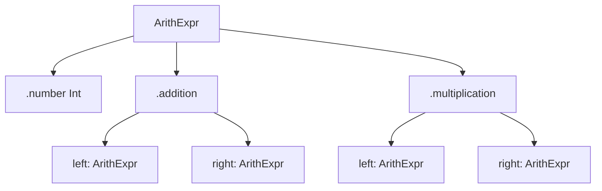
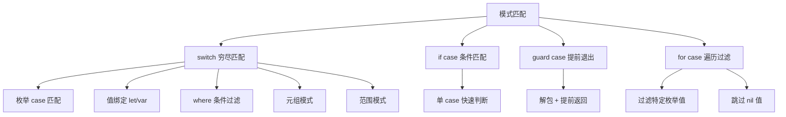
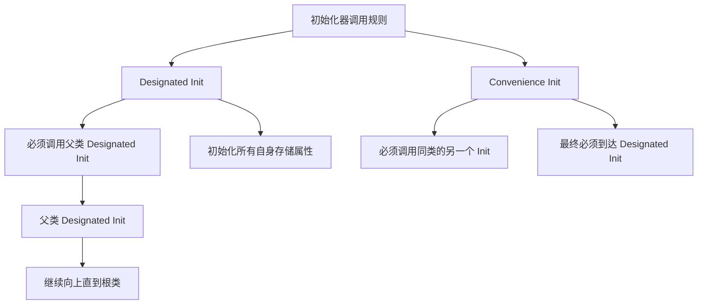
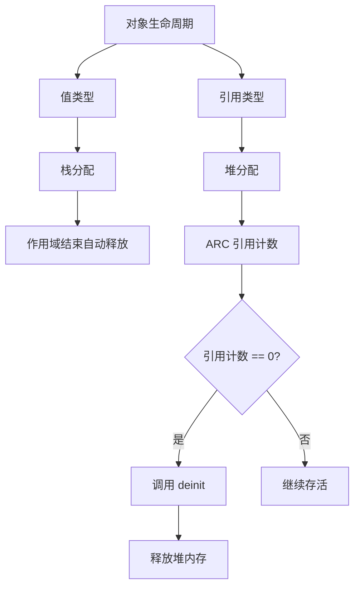

# 枚举与模式匹配深度解析

> 深入理解 Swift 枚举的强大能力、模式匹配的多种形式、值语义与初始化器体系

---

## 目录

- [核心结论 TL;DR](#核心结论-tldr)
- [第一部分：枚举深度解析](#第一部分枚举深度解析)
- [第二部分：模式匹配](#第二部分模式匹配)
- [第三部分：值语义深度解析](#第三部分值语义深度解析)
- [第四部分：初始化器体系](#第四部分初始化器体系)
- [第五部分：生命周期与存储](#第五部分生命周期与存储)
- [最佳实践](#最佳实践)
- [常见陷阱](#常见陷阱)
- [面试考点](#面试考点)
- [参考资源](#参考资源)

---

## 核心结论 TL;DR

| 维度 | 核心洞察 |
|------|----------|
| **枚举** | Swift 枚举是一等类型，支持关联值、方法、计算属性、协议遵循，远超 C/ObjC 枚举 |
| **模式匹配** | switch 必须穷尽所有 case，配合 where/元组/表达式模式实现强大的数据解构 |
| **值语义** | Struct/Enum 采用值语义，赋值即复制，天然线程安全，是 Swift 的默认选择 |
| **初始化器** | 两阶段初始化 + designated/convenience 体系保证对象在使用前完全初始化 |
| **生命周期** | 值类型自动管理（栈分配），引用类型通过 ARC + deinit 管理（堆分配） |

---

## 第一部分：枚举深度解析

### 1.1 基本枚举与 Raw Value

**结论先行**：Swift 枚举不像 C 那样自动分配整数值，必须显式指定 Raw Value 类型。Raw Value 支持 String、Int、Double 等。

```swift
// ✅ 基本枚举（无 Raw Value）
enum Direction {
    case north, south, east, west
}
let dir = Direction.north

// ✅ Int Raw Value — 自动递增
enum Planet: Int {
    case mercury = 1, venus, earth, mars  // 2, 3, 4 自动递增
}
let earth = Planet(rawValue: 3)  // Optional<Planet> → .earth

// ✅ String Raw Value — 默认与 case 名称相同
enum HTTPMethod: String {
    case get = "GET"
    case post = "POST"
    case put = "PUT"
    case delete = "DELETE"
}
let method = HTTPMethod.get
print(method.rawValue)  // "GET"

// ✅ Raw Value 的反向查找（Failable Initializer）
if let method = HTTPMethod(rawValue: "POST") {
    print(method)  // post
}
let invalid = HTTPMethod(rawValue: "PATCH")  // nil
```

### 1.2 Associated Value（关联值）

**结论先行**：关联值是 Swift 枚举最强大的特性，让每个 case 携带不同类型的附加数据，实现代数数据类型。

```swift
// ✅ 关联值枚举 — 每个 case 可以携带不同类型数据
enum NetworkResult {
    case success(data: Data, statusCode: Int)
    case failure(error: Error, retryable: Bool)
    case loading(progress: Double)
}

let result = NetworkResult.success(data: Data(), statusCode: 200)

// 解构关联值
switch result {
case .success(let data, let statusCode):
    print("成功：\(statusCode), 数据大小：\(data.count)")
case .failure(let error, let retryable):
    print("失败：\(error), 可重试：\(retryable)")
case .loading(let progress):
    print("加载中：\(progress * 100)%")
}

// ✅ 实际应用：Result 类型
enum AppError: Error {
    case networkFailed(code: Int)
    case decodingFailed(description: String)
    case unauthorized
}

func fetchUser() -> Result<User, AppError> {
    // ...
    return .failure(.networkFailed(code: 500))
}
```

**Raw Value vs Associated Value 对比**：

| 特性 | Raw Value | Associated Value |
|------|-----------|------------------|
| 类型 | 所有 case 相同类型 | 每个 case 可不同 |
| 赋值时机 | 编译期确定 | 运行时传入 |
| 反向查找 | `init?(rawValue:)` | 不支持 |
| 共存 | 不可与 Associated Value 共存 | 不可与 Raw Value 共存 |
| 典型用途 | 状态码映射、序列化 | 数据建模、错误处理 |

### 1.3 递归枚举（indirect）

**结论先行**：使用 `indirect` 关键字让枚举 case 引用自身类型，编译器自动将其存储为引用（堆分配）。

```swift
// ✅ 递归枚举 — 树形数据结构
indirect enum ArithExpr {
    case number(Int)
    case addition(ArithExpr, ArithExpr)
    case multiplication(ArithExpr, ArithExpr)
}

// (5 + 3) * 2
let expr = ArithExpr.multiplication(
    .addition(.number(5), .number(3)),
    .number(2)
)

func evaluate(_ expr: ArithExpr) -> Int {
    switch expr {
    case .number(let value):
        return value
    case .addition(let left, let right):
        return evaluate(left) + evaluate(right)
    case .multiplication(let left, let right):
        return evaluate(left) * evaluate(right)
    }
}
print(evaluate(expr))  // 16

// ✅ 也可以对整个枚举标记 indirect
indirect enum BinaryTree<T> {
    case leaf
    case node(T, left: BinaryTree, right: BinaryTree)
}
```



### 1.4 枚举的方法与计算属性

```swift
enum Suit: String, CaseIterable {
    case hearts = "♥️"
    case diamonds = "♦️"
    case clubs = "♣️"
    case spades = "♠️"
    
    // ✅ 计算属性
    var color: String {
        switch self {
        case .hearts, .diamonds: return "Red"
        case .clubs, .spades: return "Black"
        }
    }
    
    // ✅ 方法
    func description() -> String {
        return "\(self.rawValue) (\(self.color))"
    }
    
    // ✅ 静态方法
    static func random() -> Suit {
        return Suit.allCases.randomElement()!
    }
}

print(Suit.hearts.color)         // "Red"
print(Suit.hearts.description()) // "♥️ (Red)"

// ✅ CaseIterable — 遍历所有 case
for suit in Suit.allCases {
    print(suit.rawValue)
}
print(Suit.allCases.count)  // 4
```

### 1.5 枚举与 Codable

```swift
// ✅ Raw Value 枚举自动支持 Codable
enum Status: String, Codable {
    case active
    case inactive
    case pending
}

// ✅ Associated Value 枚举需要手动实现
enum Payment: Codable {
    case cash(amount: Double)
    case card(number: String, expiry: String)
    case digital(provider: String)
    
    // Swift 5.5+ 自动合成 Codable（如果关联值都遵循 Codable）
}

// 编解码示例
let payment = Payment.cash(amount: 99.9)
let data = try JSONEncoder().encode(payment)
let decoded = try JSONDecoder().decode(Payment.self, from: data)
```

---

## 第二部分：模式匹配

### 2.1 switch 语句与穷尽检查

**结论先行**：Swift 的 switch 必须穷尽所有可能的值，否则编译错误。这是类型安全的重要保障。

```swift
enum Direction { case north, south, east, west }

// ✅ 穷尽所有 case
func navigate(_ dir: Direction) -> String {
    switch dir {
    case .north: return "向北"
    case .south: return "向南"
    case .east:  return "向东"
    case .west:  return "向西"
    }
    // 不需要 default — 已穷尽
}

// ✅ 多值匹配
switch dir {
case .north, .south:
    print("南北方向")
case .east, .west:
    print("东西方向")
}

// ⚠️ default 的使用 — 非枚举类型或需要兜底
let value = 42
switch value {
case 0:     print("零")
case 1...9: print("个位数")
case 10..<100: print("两位数")
default:    print("更大的数")
}

// ✅ Swift 的 switch 不会 fallthrough（与 C 不同）
// 需要贯穿时显式使用 fallthrough 关键字
switch value {
case 42:
    print("找到了")
    fallthrough
case 43:
    print("也会执行")
default:
    break
}
```

### 2.2 if case / guard case 语法

```swift
enum Media {
    case image(name: String, size: Int)
    case video(name: String, duration: Double)
    case audio(name: String, bitrate: Int)
}

let media = Media.video(name: "demo.mp4", duration: 120.0)

// ✅ if case — 匹配单个模式
if case .video(let name, let duration) = media {
    print("视频：\(name)，时长：\(duration)s")
}

// ✅ if case 简写
if case let .video(name, duration) = media {
    print("视频：\(name)，时长：\(duration)s")
}

// ✅ guard case — 提前退出
func processMedia(_ media: Media) {
    guard case let .video(name, duration) = media else {
        print("不是视频")
        return
    }
    print("处理视频：\(name)，\(duration)秒")
}
```

### 2.3 for case 模式匹配

```swift
let items: [Media] = [
    .image(name: "photo.jpg", size: 2048),
    .video(name: "clip.mp4", duration: 30),
    .image(name: "banner.png", size: 4096),
    .audio(name: "song.mp3", bitrate: 320),
    .video(name: "movie.mp4", duration: 7200),
]

// ✅ for case — 只遍历特定模式
for case let .video(name, duration) in items {
    print("视频：\(name)，\(duration)秒")
}
// 输出：
// 视频：clip.mp4，30.0秒
// 视频：movie.mp4，7200.0秒

// ✅ for case 过滤 Optional
let numbers: [Int?] = [1, nil, 3, nil, 5]
for case let number? in numbers {
    print(number)  // 1, 3, 5 — 自动跳过 nil
}
```

### 2.4 where 子句过滤

```swift
// ✅ switch + where
let point = (x: 3, y: -2)
switch point {
case let (x, y) where x == y:
    print("在 y = x 线上")
case let (x, y) where x == -y:
    print("在 y = -x 线上")
case let (x, _) where x > 0:
    print("在右半平面")
default:
    print("其他位置")
}

// ✅ for + where
for i in 0..<100 where i % 3 == 0 && i % 5 == 0 {
    print(i)  // 0, 15, 30, 45, 60, 75, 90
}

// ✅ if case + where
let response = NetworkResult.success(data: Data(), statusCode: 200)
if case .success(_, let code) = response, code == 200 {
    print("请求成功")
}
```

### 2.5 元组模式与通配符

```swift
// ✅ 元组模式匹配
let coordinate = (x: 0, y: 0)
switch coordinate {
case (0, 0):
    print("原点")
case (_, 0):
    print("在 x 轴上")
case (0, _):
    print("在 y 轴上")
case (-2...2, -2...2):
    print("在中心区域")
default:
    print("其他位置")
}

// ✅ HTTP 状态码匹配
let statusCode = 404
let message: String? = "Not Found"

switch (statusCode, message) {
case (200, _):
    print("成功")
case (404, let msg?):
    print("未找到：\(msg)")
case (500..., _):
    print("服务器错误")
default:
    print("未知状态")
}
```

### 2.6 表达式模式（~= 运算符）

**结论先行**：`~=` 是 Swift 模式匹配的底层运算符，switch 的 case 匹配实际调用的就是 `~=`。

```swift
// ✅ 范围匹配（Range ~= 运算符）
let age = 25
switch age {
case 0..<18:  print("未成年")
case 18..<65: print("成年人")  // ✅ 匹配
default:      print("老年人")
}

// ✅ 自定义 ~= 运算符
struct Regex {
    let pattern: String
    init(_ pattern: String) { self.pattern = pattern }
}

func ~=(regex: Regex, value: String) -> Bool {
    return value.range(of: regex.pattern, options: .regularExpression) != nil
}

let email = "user@example.com"
switch email {
case Regex("[A-Z0-9._%+-]+@[A-Z0-9.-]+\\.[A-Z]{2,}", 
           // 注意：实际需要 case-insensitive
           ):
    print("可能是邮箱")
default:
    print("不是邮箱")
}
```



---

## 第三部分：值语义深度解析

### 3.1 值类型 vs 引用类型的语义区别

**结论先行**：值语义保证每次赋值产生独立副本，修改不影响原始值；引用语义共享同一实例，任何修改全局可见。

```swift
// ✅ 值语义 — Struct
struct Size {
    var width: Double
    var height: Double
}

var s1 = Size(width: 100, height: 200)
var s2 = s1           // 复制
s2.width = 300
print(s1.width)       // 100 — 未被修改

// ✅ 引用语义 — Class
class Frame {
    var width: Double
    var height: Double
    init(width: Double, height: Double) {
        self.width = width
        self.height = height
    }
}

let f1 = Frame(width: 100, height: 200)
let f2 = f1           // 共享引用
f2.width = 300
print(f1.width)       // 300 — 被修改！
```

### 3.2 结构体的自动成员初始化

```swift
// ✅ Struct 自动生成 memberwise initializer
struct User {
    var name: String
    var age: Int
    var email: String = "unknown"  // 有默认值
}

// 自动生成的初始化器
let user1 = User(name: "Alice", age: 30, email: "alice@mail.com")
let user2 = User(name: "Bob", age: 25)  // email 使用默认值

// ⚠️ 定义自定义初始化器会覆盖自动成员初始化器
// 解决方案：在 extension 中定义自定义初始化器
extension User {
    init(csvLine: String) {
        let parts = csvLine.split(separator: ",")
        self.name = String(parts[0])
        self.age = Int(parts[1]) ?? 0
        self.email = parts.count > 2 ? String(parts[2]) : "unknown"
    }
}
// 此时两种初始化器都可用
let user3 = User(name: "Eve", age: 28)           // memberwise
let user4 = User(csvLine: "Dave,35,dave@mail.com") // 自定义
```

### 3.3 mutating 方法

**结论先行**：值类型的属性默认不可变，修改属性的方法必须标记 `mutating`，实质是替换 `self`。

```swift
struct Vector2D {
    var x: Double
    var y: Double
    
    // ✅ mutating — 修改自身属性
    mutating func normalize() {
        let length = sqrt(x * x + y * y)
        x /= length
        y /= length
    }
    
    // ✅ mutating 的本质 — 替换 self
    mutating func reset() {
        self = Vector2D(x: 0, y: 0)
    }
    
    // ✅ 非 mutating — 返回新值
    func normalized() -> Vector2D {
        let length = sqrt(x * x + y * y)
        return Vector2D(x: x / length, y: y / length)
    }
}

var v = Vector2D(x: 3, y: 4)
v.normalize()             // ✅ var 变量可以调用 mutating
print(v)                  // (0.6, 0.8)

let v2 = Vector2D(x: 3, y: 4)
// v2.normalize()          // ❌ let 常量不能调用 mutating
let v3 = v2.normalized()  // ✅ 返回新值
```

### 3.4 值类型的不可变性保证

```swift
// ✅ let 声明的值类型 — 完全不可变
let point = Size(width: 10, height: 20)
// point.width = 30    // ❌ 编译错误：Cannot assign to property

// ✅ let 声明的引用类型 — 引用不可变，内容可变
let frame = Frame(width: 10, height: 20)
frame.width = 30        // ✅ 允许！frame 引用没变，内容变了

// ✅ 函数参数默认不可变
func process(_ size: Size) {
    // size.width = 100  // ❌ 编译错误
    var mutableSize = size
    mutableSize.width = 100  // ✅ 复制后修改
}

// ✅ inout — 传入可变引用
func double(_ size: inout Size) {
    size.width *= 2
    size.height *= 2
}
var s = Size(width: 10, height: 20)
double(&s)
print(s)  // Size(width: 20, height: 40)
```

---

## 第四部分：初始化器体系

### 4.1 Designated Initializer（指定初始化器）

**结论先行**：指定初始化器是类的主初始化器，必须初始化所有存储属性，并调用父类的指定初始化器。

```swift
class Vehicle {
    let wheels: Int
    var color: String
    
    // ✅ Designated Initializer
    init(wheels: Int, color: String) {
        self.wheels = wheels    // 初始化所有存储属性
        self.color = color
    }
}

class Car: Vehicle {
    var brand: String
    
    // ✅ Designated Initializer — 必须调用 super.init
    init(brand: String, color: String) {
        self.brand = brand           // 第一阶段：初始化自身属性
        super.init(wheels: 4, color: color)  // 调用父类指定初始化器
        // 第二阶段：可以访问 self
        self.color = color.uppercased()
    }
}
```

### 4.2 Convenience Initializer（便利初始化器）

```swift
class Car2: Vehicle {
    var brand: String
    
    // ✅ Designated Initializer
    init(brand: String, wheels: Int, color: String) {
        self.brand = brand
        super.init(wheels: wheels, color: color)
    }
    
    // ✅ Convenience Initializer — 必须调用 self.init
    convenience init(brand: String) {
        self.init(brand: brand, wheels: 4, color: "Black")
    }
    
    convenience init() {
        self.init(brand: "Unknown")  // 便利→便利→指定
    }
}

let car = Car2()  // 使用便利初始化器
```



### 4.3 Required Initializer

```swift
class BaseView {
    var frame: CGRect
    
    // ✅ required — 子类必须实现
    required init(frame: CGRect) {
        self.frame = frame
    }
}

class CustomView: BaseView {
    var title: String
    
    // ✅ 子类必须标记 required（不需要 override）
    required init(frame: CGRect) {
        self.title = "Default"
        super.init(frame: frame)
    }
}
```

### 4.4 Failable Initializer（可失败初始化器）

```swift
// ✅ init? — 初始化可能失败，返回 nil
struct Temperature {
    let celsius: Double
    
    init?(celsius: Double) {
        guard celsius >= -273.15 else {
            return nil  // 绝对零度以下无效
        }
        self.celsius = celsius
    }
    
    init?(fahrenheit: Double) {
        let c = (fahrenheit - 32) * 5 / 9
        self.init(celsius: c)  // 委托给另一个可失败初始化器
    }
}

let valid = Temperature(celsius: 100)     // Optional<Temperature>
let invalid = Temperature(celsius: -300)  // nil

// ✅ 枚举的 Raw Value 初始化器就是 Failable
enum Planet: Int {
    case mercury = 1, venus, earth
}
let earth = Planet(rawValue: 3)   // Optional<Planet> → .earth
let pluto = Planet(rawValue: 10)  // nil
```

### 4.5 两阶段初始化规则

**结论先行**：Swift 的两阶段初始化确保所有属性在使用前被初始化，编译器严格检查。

```
┌────────────────────────────────────────────────────────────┐
│                   两阶段初始化规则                           │
├────────────────────────────────────────────────────────────┤
│                                                            │
│  第一阶段（自底向上）：                                     │
│  1. 初始化子类引入的所有存储属性                             │
│  2. 调用父类的指定初始化器                                   │
│  3. 父类重复此过程直到根类                                   │
│  ⚠️ 此阶段不能访问 self、调用方法、读取属性                  │
│                                                            │
│  第二阶段（自顶向下）：                                     │
│  4. 根类初始化完成后，可以自定义属性                         │
│  5. 可以访问 self、调用方法                                  │
│  6. 便利初始化器也可以自定义                                 │
│                                                            │
└────────────────────────────────────────────────────────────┘
```

```swift
class Animal {
    var name: String
    init(name: String) {
        self.name = name
        // 第二阶段：可以调用方法
        printInfo()
    }
    func printInfo() { print("Animal: \(name)") }
}

class Dog: Animal {
    var breed: String
    
    init(name: String, breed: String) {
        // 第一阶段：初始化自身属性
        self.breed = breed
        // ❌ self.printInfo()  // 编译错误：第一阶段不能访问 self
        
        super.init(name: name)  // 调用父类
        
        // 第二阶段：可以自定义
        self.name = name + " the \(breed)"
    }
}
```

### 4.6 默认初始化器与成员初始化器

```swift
// ✅ Class 的默认初始化器 — 所有属性有默认值时自动提供
class Settings {
    var theme = "light"
    var fontSize = 14
    var notifications = true
}
let settings = Settings()  // 使用默认初始化器

// ✅ Struct 的成员初始化器 — 自动生成
struct Config {
    var host: String
    var port: Int
    var useSSL: Bool = true
}
let config = Config(host: "api.example.com", port: 443)
// 也可以覆盖默认值
let config2 = Config(host: "localhost", port: 8080, useSSL: false)
```

---

## 第五部分：生命周期与存储

### 5.1 栈分配 vs 堆分配

**结论先行**：值类型优先栈分配（快速、自动释放），引用类型堆分配（需要 ARC 管理）。编译器可能将小的值类型优化到寄存器中。

| 特性 | 栈分配 | 堆分配 |
|------|--------|--------|
| 速度 | 极快（移动栈指针） | 较慢（malloc/free） |
| 管理 | 自动（函数返回即释放） | ARC 引用计数 |
| 线程安全 | 天然安全（每线程独立栈） | 需要原子操作 |
| 适用类型 | Struct/Enum/Tuple | Class/Closure |
| 大小限制 | 栈空间有限（~1MB） | 堆空间较大 |

```swift
// ✅ 值类型 — 通常栈分配
func calculate() {
    let point = Point(x: 1, y: 2)  // 栈上分配
    let size = Size(width: 100, height: 200)  // 栈上分配
    // 函数返回时自动释放
}

// ✅ 引用类型 — 堆分配
func createNode() -> Node {
    let node = Node(value: 42)  // 堆上分配
    return node                  // 引用计数 +1，不释放
}
// 当最后一个引用消失时，ARC 释放堆内存
```

### 5.2 defer 语句

**结论先行**：`defer` 在当前作用域退出时执行，无论是正常返回还是抛出错误，用于确保资源清理。

```swift
// ✅ 基本用法 — 清理资源
func readFile(path: String) throws -> String {
    let file = try openFile(path)
    defer {
        file.close()  // 无论如何都会执行
    }
    
    let content = try file.read()
    return content
    // defer 在此执行
}

// ✅ 多个 defer — 后进先出（LIFO）
func multiDefer() {
    defer { print("1") }
    defer { print("2") }
    defer { print("3") }
    print("函数体")
}
// 输出：函数体 → 3 → 2 → 1

// ✅ 锁管理
func threadSafe() {
    lock.lock()
    defer { lock.unlock() }
    
    // 临界区代码
    // 无论怎么退出，锁都会被释放
}

// ✅ 状态恢复
func withTemporaryChange() {
    let originalValue = settings.debugMode
    settings.debugMode = true
    defer { settings.debugMode = originalValue }
    
    // 使用 debug 模式执行操作
}
```

### 5.3 对象的析构（deinit）

```swift
// ✅ deinit — 仅 Class 支持
class FileHandle {
    let path: String
    
    init(path: String) {
        self.path = path
        print("打开文件：\(path)")
    }
    
    deinit {
        print("关闭文件：\(path)")
        // 清理资源：关闭文件句柄、取消网络请求等
    }
}

// 引用计数归零时自动调用 deinit
func process() {
    let handle = FileHandle(path: "/tmp/data.txt")
    // 使用 handle...
}  // handle 离开作用域，引用计数→0，deinit 被调用

// ⚠️ Struct/Enum 没有 deinit
// 值类型不需要析构，自动释放
```



---

## 最佳实践

### 枚举设计

1. **优先使用关联值枚举**建模不同状态 — 比多个 Bool 标志更安全
2. **为 API 枚举添加 `@frozen`** — 如果确定不会新增 case，允许编译器优化
3. **Raw Value 枚举用于序列化** — JSON/数据库映射
4. **递归枚举用于树形结构** — 比 Class 更轻量

### 模式匹配

5. **避免不必要的 default** — 穷尽匹配让编译器帮你检查遗漏
6. **使用 `if case` 替代单分支 switch** — 更简洁
7. **使用 `for case` 过滤集合** — 比 filter + map 更直观

### 初始化器

8. **在 extension 中定义自定义初始化器** — 保留 Struct 的成员初始化器
9. **使用 `init?` 验证输入** — 比抛出异常更轻量
10. **遵循两阶段初始化** — 先初始化所有属性，再自定义

### 生命周期

11. **使用 defer 管理资源** — 保证清理代码一定执行
12. **避免在 deinit 中做复杂操作** — deinit 应该只释放资源

---

## 常见陷阱

### 陷阱 1：switch 遗漏 case（添加新 case 后）

```swift
// ❌ 使用 default 后，新增 case 不会编译报错
enum State { case loading, success, failure, cancelled }

func handle(_ state: State) {
    switch state {
    case .loading: print("加载中")
    case .success: print("成功")
    case .failure: print("失败")
    default: break  // ⚠️ cancelled 被默默吞掉了
    }
}

// ✅ 不用 default，穷尽所有 case
func handleSafe(_ state: State) {
    switch state {
    case .loading:   print("加载中")
    case .success:   print("成功")
    case .failure:   print("失败")
    case .cancelled: print("已取消")
    // 如果新增 case，编译器会报错
    }
}
```

### 陷阱 2：枚举关联值的相等判断

```swift
enum Token {
    case number(Int)
    case string(String)
}

// ❌ 枚举不自动遵循 Equatable（有关联值时）
// let a = Token.number(1)
// if a == Token.number(1) { }  // 编译错误！

// ✅ 手动遵循或让编译器自动合成
enum Token2: Equatable {
    case number(Int)
    case string(String)
}
let a = Token2.number(1)
let b = Token2.number(1)
print(a == b)  // true（Swift 4.1+ 自动合成）
```

### 陷阱 3：mutating 方法与 let

```swift
struct Counter {
    var count = 0
    mutating func increment() { count += 1 }
}

// ❌ let 常量不能调用 mutating
let counter = Counter()
// counter.increment()  // 编译错误！

// ✅ 必须用 var
var mutableCounter = Counter()
mutableCounter.increment()
```

### 陷阱 4：Class 的两阶段初始化顺序

```swift
class Parent {
    var name: String
    init(name: String) {
        self.name = name
    }
}

class Child: Parent {
    var age: Int
    
    init(name: String, age: Int) {
        // ❌ 错误顺序
        // super.init(name: name)  // 编译错误：必须先初始化自身属性
        // self.age = age
        
        // ✅ 正确顺序
        self.age = age              // 1. 先初始化自身属性
        super.init(name: name)      // 2. 再调用父类初始化器
    }
}
```

### 陷阱 5：defer 中捕获变量

```swift
// ⚠️ defer 捕获变量的最终值
func tricky() -> Int {
    var value = 1
    defer { print("defer: \(value)") }
    value = 42
    return value
}
// 输出 "defer: 42" — defer 看到的是修改后的值

// ✅ 如果需要捕获当前值，使用闭包捕获列表
func trickySafe() -> Int {
    var value = 1
    defer { [capturedValue = value] in
        print("defer: \(capturedValue)")  // 1
    }
    value = 42
    return value
}
```

---

## 面试考点

### 考题 1：Swift 枚举与 C/ObjC 枚举有何区别？

**标准答案**：
- Swift 枚举是一等类型，支持方法、计算属性、协议遵循；C 枚举只是整数常量
- Swift 枚举支持关联值（Associated Value），每个 case 可以携带不同类型数据
- Swift 枚举支持递归（indirect），可以建模树形结构
- Swift switch 必须穷尽所有 case，编译器保证不遗漏
- Swift 枚举的 Raw Value 不限于整数，支持 String、Double 等

**追问**：
- 关联值和 Raw Value 能否共存？（不能，二者互斥）
- indirect 枚举的内存布局是怎样的？（indirect case 存储为指针，指向堆上的实际数据）
- CaseIterable 有什么限制？（有关联值的枚举不能自动遵循）

### 考题 2：Swift 的两阶段初始化是什么？为什么需要？

**标准答案**：
- 第一阶段：从子类到父类，初始化所有存储属性，不能访问 self
- 第二阶段：从父类到子类，可以自定义属性、调用方法
- 目的：保证对象在被使用前，所有属性都已初始化（消除未初始化内存访问）
- 编译器在编译期检查，不像 C++ 允许访问未初始化成员

**追问**：
- convenience init 和 designated init 的调用规则？（convenience 只能调用同类 init，designated 必须调用父类 designated）
- 为什么自定义初始化器会覆盖 Struct 的成员初始化器？如何保留？（在 extension 中定义）
- required init 的作用？（强制子类实现，用于工厂模式和协议约束）

### 考题 3：值语义有什么优势？何时不适合使用值类型？

**标准答案**：
- 优势：天然线程安全（无共享状态）、可预测性（修改不影响其他引用）、栈分配性能好
- 不适合场景：需要共享状态（如单例、缓存）、需要继承体系、大数据结构频繁复制开销大、需要 deinit 清理资源

**追问**：
- Copy-on-Write 如何工作？（内部引用计数，写入时检查唯一引用，非唯一才复制）
- inout 参数是传引用吗？（不是，是 copy-in copy-out，但编译器会优化为传引用）
- Actor 是值类型还是引用类型？（引用类型，但通过 actor 隔离保证并发安全）

---

## 参考资源

- [The Swift Programming Language - Enumerations](https://docs.swift.org/swift-book/documentation/the-swift-programming-language/enumerations)
- [The Swift Programming Language - Initialization](https://docs.swift.org/swift-book/documentation/the-swift-programming-language/initialization)
- [The Swift Programming Language - Patterns](https://docs.swift.org/swift-book/documentation/the-swift-programming-language/patterns)
- [WWDC: Understanding Swift Performance](https://developer.apple.com/videos/play/wwdc2016/416/)
- [Swift Evolution - SE-0155: Normalize Enum Case Representation](https://github.com/apple/swift-evolution/blob/main/proposals/0155-normalize-enum-case-representation.md)
- [Swift Evolution - SE-0185: Synthesizing Equatable and Hashable conformance](https://github.com/apple/swift-evolution/blob/main/proposals/0185-synthesize-equatable-hashable.md)
