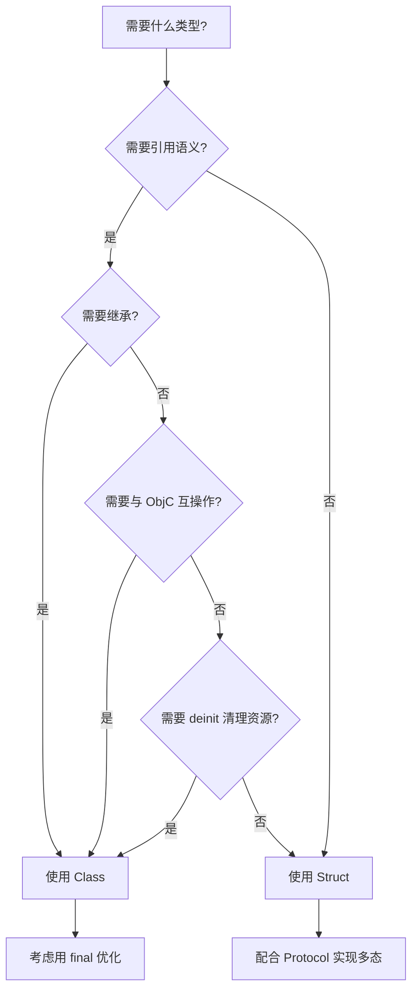
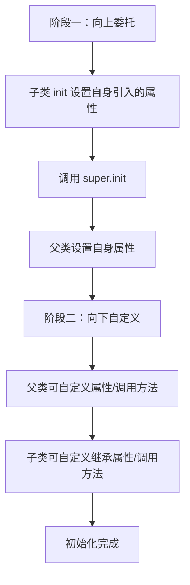

# 类继承与多态深度解析

> 深入理解 Swift 值类型与引用类型选择、属性系统、继承模型、访问控制与 Extension 机制

---

## 目录

- [核心结论](#核心结论)
- [第一部分：Struct vs Class 选择决策](#第一部分struct-vs-class-选择决策)
- [第二部分：属性系统](#第二部分属性系统)
- [第三部分：方法与下标](#第三部分方法与下标)
- [第四部分：继承与 override](#第四部分继承与-override)
- [第五部分：访问控制](#第五部分访问控制)
- [第六部分：Extension 机制](#第六部分extension-机制)
- [最佳实践](#最佳实践)
- [常见陷阱](#常见陷阱)
- [面试考点](#面试考点)
- [参考资源](#参考资源)

---

## 核心结论

**Swift 通过值类型优先 + 协议组合替代传统 OOP 的深层继承，同时保留类继承用于引用语义场景。**

| 维度 | 核心洞察 |
|------|----------|
| **类型选择** | 默认用 Struct，仅在需要引用语义、继承、与 ObjC 互操作时使用 Class |
| **属性系统** | 5 种属性机制覆盖存储、计算、延迟、观察、类型属性，比 ObjC 统一且安全 |
| **继承模型** | 单继承 + final 优化 + 两阶段初始化，编译器强制安全约束 |
| **访问控制** | 5 级权限（open > public > internal > fileprivate > private），最小权限原则 |
| **Extension** | 强大的横切扩展能力，但方法为静态派发，不进入 VTable |

---

## 第一部分：Struct vs Class 选择决策

### 1.1 六大核心差异

| 特性 | Struct（值类型） | Class（引用类型） |
|------|-----------------|------------------|
| **内存分配** | 栈分配（小对象）/ 内联 | 堆分配 + 引用计数 |
| **赋值语义** | 拷贝（Copy-on-Write 优化） | 共享引用 |
| **继承** | ❌ 不支持 | ✅ 支持单继承 |
| **引用计数** | ❌ 无 | ✅ ARC 管理 |
| **可变性控制** | let 实例完全不可变 | let 实例仅引用不可变，属性可变 |
| **析构器** | ❌ 无 deinit | ✅ 有 deinit |

### 1.2 性能对比

```swift
// ✅ Struct：栈分配，零引用计数开销
struct Point {
    var x: Double
    var y: Double
}

// 赋值时拷贝（编译器可能优化为 move）
var p1 = Point(x: 1.0, y: 2.0)
var p2 = p1  // 独立副本
p2.x = 3.0
print(p1.x)  // 1.0 — 不受影响

// ❌ Class：堆分配 + ARC 开销
class PointClass {
    var x: Double
    var y: Double
    init(x: Double, y: Double) {
        self.x = x
        self.y = y
    }
}

// 赋值时共享引用
var pc1 = PointClass(x: 1.0, y: 2.0)
var pc2 = pc1  // 共享同一对象，引用计数 +1
pc2.x = 3.0
print(pc1.x)  // 3.0 — 被修改！
```

**性能关键数据**：

| 操作 | Struct | Class |
|------|--------|-------|
| 分配 | ~0ns（栈） | ~25ns（堆 + malloc） |
| 赋值 | memcpy（小对象内联） | 引用计数 retain/release |
| 释放 | 自动（栈帧弹出） | ARC dealloc + free |
| 缓存友好性 | ✅ 连续内存 | ❌ 指针间接访问 |

### 1.3 Apple 官方选择指南



**Apple 推荐原则**：
1. 默认使用 Struct
2. 需要 Objective-C 互操作时使用 Class
3. 需要控制对象身份（identity）时使用 Class
4. 用 Protocol + Struct 组合替代类继承层次

### 1.4 Copy-on-Write（COW）机制

```swift
// Swift 标准库的 Array、Dictionary、String 等均使用 COW
var array1 = [1, 2, 3]
var array2 = array1  // 此时共享底层 buffer，未发生拷贝

// 只有在修改时才真正拷贝
array2.append(4)  // 触发 COW，array2 获得独立副本

// ✅ 自定义 COW 实现
final class StorageRef<T> {
    var value: T
    init(_ value: T) { self.value = value }
}

struct COWContainer<T> {
    private var storage: StorageRef<T>
    
    init(_ value: T) {
        storage = StorageRef(value)
    }
    
    var value: T {
        get { storage.value }
        set {
            // 关键：检查是否唯一引用
            if !isKnownUniquelyReferenced(&storage) {
                storage = StorageRef(newValue)
            } else {
                storage.value = newValue
            }
        }
    }
}
```

---

## 第二部分：属性系统

### 2.1 Stored Property（存储属性）

```swift
struct Person {
    let id: Int              // 常量存储属性，初始化后不可变
    var name: String         // 变量存储属性
    var age: Int = 0         // 带默认值的存储属性
}

// ✅ Struct 的 let 实例 → 所有属性不可变
let person = Person(id: 1, name: "Alice")
// person.name = "Bob"  // ❌ 编译错误：let 实例不能修改

// Class 的 let 实例 → var 属性仍可修改
class PersonClass {
    let id: Int
    var name: String
    init(id: Int, name: String) {
        self.id = id
        self.name = name
    }
}

let pc = PersonClass(id: 1, name: "Alice")
pc.name = "Bob"  // ✅ 合法！let 仅约束引用，不约束属性
```

### 2.2 Computed Property（计算属性）

```swift
struct Circle {
    var radius: Double
    
    // 只读计算属性（可省略 get）
    var area: Double {
        .pi * radius * radius
    }
    
    // 读写计算属性
    var diameter: Double {
        get { radius * 2 }
        set { radius = newValue / 2 }  // newValue 为隐式参数
    }
}

var circle = Circle(radius: 5)
print(circle.area)        // 78.539...
circle.diameter = 20      // 等价于 radius = 10
```

### 2.3 Lazy Property（延迟属性）

```swift
class DataManager {
    // ✅ lazy：首次访问时才初始化，适合昂贵资源
    lazy var importer: DataImporter = {
        let importer = DataImporter()
        importer.configure()
        return importer
    }()
    
    var data: [String] = []
}

// ⚠️ 注意：lazy 属性必须是 var（因为初始值在初始化后才设置）
// ⚠️ lazy 属性不是线程安全的！多线程首次访问可能初始化多次
```

### 2.4 Property Observer（属性观察器）

```swift
class StepCounter {
    var totalSteps: Int = 0 {
        willSet(newTotalSteps) {
            // 在值改变前调用
            print("即将设置为 \(newTotalSteps)")
        }
        didSet {
            // 在值改变后调用
            if totalSteps > oldValue {
                print("增加了 \(totalSteps - oldValue) 步")
            }
        }
    }
}

// ⚠️ 初始化阶段不触发 observer
let counter = StepCounter()  // 不触发
counter.totalSteps = 100     // willSet → didSet

// ✅ 子类重写属性可以同时添加 observer
class SpecialCounter: StepCounter {
    override var totalSteps: Int {
        didSet {
            print("Special: 新值 \(totalSteps)")
        }
    }
}
```

### 2.5 Static / Class Property

```swift
struct MathConstants {
    // static：类型属性，所有实例共享
    static let pi = 3.14159265358979
    static var precision: Int = 6
}

class BaseLogger {
    // class：可被子类 override 的类型属性（仅限计算属性）
    class var logLevel: String { "INFO" }
    
    // static：不可被 override
    static let maxEntries = 1000
}

class DebugLogger: BaseLogger {
    override class var logLevel: String { "DEBUG" }  // ✅ 合法
    // override static let maxEntries = 2000         // ❌ static 不可 override
}
```

### 2.6 属性与 KVO / KVC 的关系

```swift
// KVO 需要：1) 继承 NSObject  2) 标记 @objc dynamic
class ObservableUser: NSObject {
    @objc dynamic var name: String = ""
    @objc dynamic var age: Int = 0
}

let user = ObservableUser()
let observation = user.observe(\.name, options: [.new, .old]) { obj, change in
    print("name 从 \(change.oldValue ?? "") 变为 \(change.newValue ?? "")")
}
user.name = "Alice"  // 触发观察

// ⚠️ 纯 Swift 类不支持 KVO，必须继承 NSObject + @objc dynamic
// ✅ 推荐替代方案：Combine 的 @Published 或 Property Observer
```

---

## 第三部分：方法与下标

### 3.1 实例方法 vs 类型方法

```swift
struct Counter {
    var count = 0
    
    // 实例方法
    func display() {
        print("Count: \(count)")
    }
    
    // ✅ mutating：值类型中修改 self 的方法
    mutating func increment() {
        count += 1
    }
    
    // mutating 方法甚至可以替换整个 self
    mutating func reset() {
        self = Counter()
    }
    
    // 类型方法
    static func zero() -> Counter {
        Counter(count: 0)
    }
}

var c = Counter()
c.increment()     // ✅ var 实例可以调用 mutating
// let c2 = Counter(); c2.increment()  // ❌ let 实例不能调用 mutating
```

### 3.2 class 方法 vs static 方法

```swift
class Animal {
    // class：子类可以 override
    class func makeSound() -> String { "..." }
    
    // static：不可 override（等价于 class final）
    static func kingdom() -> String { "Animalia" }
}

class Dog: Animal {
    override class func makeSound() -> String { "Woof!" }  // ✅
    // override static func kingdom() ...                    // ❌ 编译错误
}
```

### 3.3 Subscript（下标）

```swift
struct Matrix {
    let rows: Int, columns: Int
    var grid: [Double]
    
    init(rows: Int, columns: Int) {
        self.rows = rows
        self.columns = columns
        grid = Array(repeating: 0.0, count: rows * columns)
    }
    
    // ✅ 下标定义
    subscript(row: Int, column: Int) -> Double {
        get {
            precondition(row >= 0 && row < rows && column >= 0 && column < columns)
            return grid[row * columns + column]
        }
        set {
            precondition(row >= 0 && row < rows && column >= 0 && column < columns)
            grid[row * columns + column] = newValue
        }
    }
}

var matrix = Matrix(rows: 2, columns: 2)
matrix[0, 1] = 3.14
print(matrix[0, 1])  // 3.14

// ✅ 类型下标
enum Planet: Int {
    case mercury = 1, venus, earth, mars
    
    static subscript(n: Int) -> Planet? {
        Planet(rawValue: n)
    }
}
let planet = Planet[3]  // .earth
```

---

## 第四部分：继承与 override

### 4.1 单继承模型

```swift
class Vehicle {
    var speed: Double = 0.0
    var description: String {
        "速度: \(speed) km/h"
    }
    func makeNoise() { /* 默认无声 */ }
}

class Car: Vehicle {
    var gear = 1
    
    // ✅ override 属性
    override var description: String {
        super.description + " 档位: \(gear)"
    }
    
    // ✅ override 方法
    override func makeNoise() {
        print("Vroom!")
    }
}

class ElectricCar: Car {
    override func makeNoise() {
        print("Whirr...")  // 覆盖 Car 的实现
    }
}
```

### 4.2 override 规则

```swift
// ❌ 忘记 override → 编译错误
class BadDerived: Vehicle {
    // func makeNoise() { }  // ❌ Error: overriding declaration requires 'override'
}

// ❌ override 不存在的方法 → 编译错误
class BadDerived2: Vehicle {
    // override func fly() { }  // ❌ Error: method does not override any method
}
```

### 4.3 final 关键字

```swift
// ✅ final class：禁止被继承
final class Singleton {
    static let shared = Singleton()
    private init() {}
}
// class SubSingleton: Singleton { }  // ❌ 编译错误

// ✅ final 方法/属性：禁止被重写
class Base {
    final func criticalMethod() { /* 不可被 override */ }
    final var version: Int { 1 }
}

// 🚀 性能优势：final 允许编译器使用直接派发替代 VTable 派发
// 建议：不打算被继承的类都标记 final
```

### 4.4 两阶段初始化



```swift
class Vehicle {
    var wheels: Int
    
    init(wheels: Int) {
        self.wheels = wheels  // 阶段一：设置自身属性
    }
    
    convenience init() {
        self.init(wheels: 4)  // convenience 必须委托到同类的 designated init
    }
}

class Bicycle: Vehicle {
    var hasBasket: Bool
    
    init(hasBasket: Bool) {
        // 阶段一：先设置自身引入的属性
        self.hasBasket = hasBasket
        // 然后调用父类 init
        super.init(wheels: 2)
        // 阶段二：此后才能使用 self、调用方法
    }
}

// ✅ required init：子类必须实现
class Document {
    var name: String
    required init(name: String) {
        self.name = name
    }
}

class AutoDocument: Document {
    var isAutoSaved: Bool = false
    // 即使没有新属性，也必须实现 required init
    required init(name: String) {
        super.init(name: name)
    }
}
```

### 4.5 初始化器继承规则

| 条件 | 继承行为 |
|------|----------|
| 子类未定义任何 designated init | 自动继承父类所有 designated init |
| 子类实现了父类所有 designated init | 自动继承父类所有 convenience init |
| 子类定义了新的 designated init | 不继承父类任何 init |

---

## 第五部分：访问控制

### 5.1 五级访问权限

| 级别 | 作用域 | 适用场景 |
|------|--------|----------|
| **open** | 跨模块可访问 + 可继承/重写 | 框架的公开基类/方法 |
| **public** | 跨模块可访问，不可继承/重写 | 框架的公开 API |
| **internal** | 模块内可访问（默认） | App 内部代码 |
| **fileprivate** | 文件内可访问 | 同文件内的 Extension 协作 |
| **private** | 声明作用域内可访问 | 实现细节封装 |

### 5.2 open vs public 的关键区别

```swift
// 框架 MyFramework 中：
open class OpenBase {
    open func canOverride() { }    // 跨模块可以 override
    public func cannotOverride() { } // 跨模块不能 override
}

public class PublicBase {
    // 跨模块不能继承这个类
}

// App 中（不同模块）：
class MyChild: OpenBase {          // ✅ open class 可以被继承
    override func canOverride() { } // ✅ open func 可以被重写
    // override func cannotOverride() { } // ❌ public func 不可重写
}
// class MyChild2: PublicBase { }  // ❌ public class 不可继承
```

### 5.3 最小权限原则实践

```swift
// ✅ 推荐：精确控制访问级别
public struct APIClient {
    // 公开接口
    public let baseURL: URL
    
    // 内部实现
    private let session: URLSession
    private var token: String?
    
    public init(baseURL: URL) {
        self.baseURL = baseURL
        self.session = URLSession(configuration: .default)
    }
    
    // 公开方法
    public func fetch(_ endpoint: String) async throws -> Data {
        try await performRequest(endpoint)  // 调用私有方法
    }
    
    // 私有实现
    private func performRequest(_ endpoint: String) async throws -> Data {
        let url = baseURL.appendingPathComponent(endpoint)
        var request = URLRequest(url: url)
        if let token = token {
            request.setValue("Bearer \(token)", forHTTPHeaderField: "Authorization")
        }
        let (data, _) = try await session.data(for: request)
        return data
    }
}
```

---

## 第六部分：Extension 机制

### 6.1 Extension 的功能与限制

```swift
// ✅ Extension 可以做的事
extension String {
    // 1. 添加计算属性
    var isBlank: Bool { trimmingCharacters(in: .whitespaces).isEmpty }
    
    // 2. 添加方法
    func repeated(_ times: Int) -> String {
        (0..<times).map { _ in self }.joined()
    }
    
    // 3. 添加下标
    subscript(safe index: Int) -> Character? {
        guard index >= 0, index < count else { return nil }
        return self[self.index(startIndex, offsetBy: index)]
    }
}

// ✅ Extension 添加初始化器
extension CGRect {
    init(center: CGPoint, size: CGSize) {
        self.init(
            x: center.x - size.width / 2,
            y: center.y - size.height / 2,
            width: size.width,
            height: size.height
        )
    }
}

// ❌ Extension 不能做的事：
// - 不能添加存储属性
// - 不能添加 deinit
// - 不能 override 已有方法（非 @objc）
```

### 6.2 Extension 添加协议遵循

```swift
protocol Describable {
    var description: String { get }
}

// ✅ 通过 Extension 使已有类型遵循协议
extension Int: Describable {
    var description: String { "整数: \(self)" }
}

// ✅ 分离关注点：主定义放核心逻辑，Extension 放协议遵循
struct User {
    let id: Int
    let name: String
}

extension User: Codable { }  // 如果所有属性都 Codable，自动合成
extension User: Hashable { }
extension User: CustomStringConvertible {
    var description: String { "User(\(id): \(name))" }
}
```

### 6.3 Extension 方法派发机制（关键！）

```swift
protocol Greetable {
    func greet() -> String
}

extension Greetable {
    func greet() -> String { "Hello!" }      // 协议要求的默认实现 → 动态派发
    func farewell() -> String { "Goodbye!" } // 非协议要求 → 静态派发！
}

struct EnglishSpeaker: Greetable {
    func greet() -> String { "Hi there!" }
    func farewell() -> String { "See ya!" }
}

let speaker = EnglishSpeaker()
let greetable: Greetable = speaker

// ✅ greet() 在协议要求中 → 动态派发
print(speaker.greet())    // "Hi there!"
print(greetable.greet())  // "Hi there!" ← 正确派发到实现

// ⚠️ farewell() 不在协议要求中 → 静态派发
print(speaker.farewell())    // "See ya!"
print(greetable.farewell())  // "Goodbye!" ← 调用了 Extension 的默认实现！
```

### 6.4 Conditional Extension（条件扩展）

```swift
// ✅ where 子句约束扩展适用条件
extension Array where Element: Numeric {
    var sum: Element {
        reduce(0, +)
    }
}

[1, 2, 3].sum          // 6 ✅
// ["a", "b"].sum      // ❌ 编译错误：String 不是 Numeric

// ✅ 条件遵循协议
extension Array: Describable where Element: Describable {
    var description: String {
        map(\.description).joined(separator: ", ")
    }
}
```

---

## 最佳实践

### 类型选择

1. **默认使用 Struct** — 值语义更安全、性能更好
2. **仅在必要时使用 Class** — 引用语义、继承、ObjC 互操作
3. **不打算继承的 Class 标记 `final`** — 启用编译器直接派发优化
4. **大型 Struct 考虑 COW** — 避免频繁拷贝开销

### 属性与方法

5. **计算属性替代无参方法** — 当操作是 O(1) 且无副作用时
6. **使用 `private(set)`** — 外部只读，内部可写
7. **`lazy` 属性注意线程安全** — 多线程场景需额外同步

### 继承与扩展

8. **优先用 Protocol + Extension** — 替代深层继承
9. **Extension 分离关注点** — 每个协议遵循一个 Extension
10. **注意 Extension 静态派发** — 非协议要求的方法不会动态派发

---

## 常见陷阱

### 陷阱一：Class let 实例的可变性

```swift
// ❌ 误以为 let 完全不可变
let user = UserClass(name: "Alice")
user.name = "Bob"  // ✅ 合法！let 只约束引用，不约束属性

// ✅ 值类型 let 才是真正不可变
let point = Point(x: 1, y: 2)
// point.x = 3  // ❌ 编译错误
```

### 陷阱二：Struct 中包含引用类型

```swift
// ⚠️ Struct 拷贝只是浅拷贝引用类型成员
class Engine { var horsepower = 100 }

struct Car {
    var engine: Engine
}

var car1 = Car(engine: Engine())
var car2 = car1              // engine 是共享引用！
car2.engine.horsepower = 200
print(car1.engine.horsepower) // 200 — 被意外修改！

// ✅ 解决方案：使用值类型或手动深拷贝
```

### 陷阱三：lazy 属性多线程竞争

```swift
// ❌ lazy 不是线程安全的
class Config {
    lazy var settings: [String: Any] = loadSettings()
    // 多线程同时首次访问可能导致多次初始化
    
    // ✅ 使用 dispatch_once 等效方案或在确定的单线程中初始化
}
```

### 陷阱四：两阶段初始化顺序错误

```swift
class Child: Parent {
    var childProp: Int
    
    init() {
        // ❌ 错误：在 super.init 前访问继承属性
        // self.parentProp = 10  // 编译错误
        
        // ✅ 正确：先设置自身属性，再调用 super.init
        self.childProp = 42
        super.init()
        // 阶段二：现在可以访问所有属性
        self.parentProp = 10  // ✅
    }
}
```

---

## 面试考点

### 考题一：Struct 和 Class 有什么区别？什么时候用哪个？

**参考答案**：

核心区别有六点：值类型 vs 引用类型、栈分配 vs 堆分配、拷贝语义 vs 共享引用、无引用计数 vs ARC、不支持继承 vs 支持继承、let 完全不可变 vs 仅引用不可变。

选择原则：默认 Struct，仅在需要引用语义（共享状态）、继承、ObjC 互操作或 deinit 时用 Class。

**追问**：
- Q: Struct 赋值一定会发生拷贝吗？
- A: 不一定。编译器会进行 COW 优化（Array/Dictionary/String），以及 move 优化。只有在真正修改时才拷贝。
- Q: 一个 Struct 中包含引用类型属性，赋值时会发生什么？
- A: Struct 浅拷贝，引用类型成员只拷贝指针，共享同一对象。需要手动深拷贝或避免值类型包含引用类型。

### 考题二：Swift 类的两阶段初始化是什么？为什么这样设计？

**参考答案**：

阶段一（向上委托）：先初始化子类引入的所有存储属性，然后调用 super.init()，依次向上直到根类。阶段二（向下自定义）：从根类开始向下，每层可以进一步自定义属性、调用方法。

设计目的是确保所有属性在使用前已被初始化，防止访问未初始化内存（安全性保证）。

**追问**：
- Q: convenience init 和 designated init 的区别？
- A: designated 是主初始化器，必须调用父类 designated init。convenience 是辅助初始化器，必须调用同类的 designated init（横向委托），不能被子类调用 super 访问。
- Q: required init 什么时候用？
- A: 当协议要求 init 或工厂模式需要保证子类都实现特定 init 时使用。

### 考题三：Extension 中的方法是什么派发方式？会有什么问题？

**参考答案**：

Extension 中的方法默认是静态派发（直接调用），不进入类的 VTable。对于协议 Extension，如果方法是协议要求的默认实现，则通过 Protocol Witness Table 动态派发；如果方法不在协议要求中，则静态派发。

这会导致：通过协议类型调用非协议要求的 Extension 方法时，始终调用 Extension 的默认实现，而非具体类型的实现。

**追问**：
- Q: 如何让 Extension 中的方法支持动态派发？
- A: 1) 将方法声明为协议的要求（而非仅在 Extension 中定义）；2) 对 NSObject 子类使用 @objc 标记走消息派发。

---

## 参考资源

- [Apple 官方文档 - Classes and Structures](https://docs.swift.org/swift-book/documentation/the-swift-programming-language/classesandstructures/)
- [Apple 官方文档 - Inheritance](https://docs.swift.org/swift-book/documentation/the-swift-programming-language/inheritance/)
- [Apple 官方文档 - Access Control](https://docs.swift.org/swift-book/documentation/the-swift-programming-language/accesscontrol/)
- [Apple 官方文档 - Extensions](https://docs.swift.org/swift-book/documentation/the-swift-programming-language/extensions/)
- [WWDC - Understanding Swift Performance](https://developer.apple.com/videos/play/wwdc2016/416/)
- [关联文档 - Swift运行时与ABI稳定性](../../iOS_Framework_Architecture/04_底层运行机制/Swift运行时与ABI稳定性_详细解析.md)
