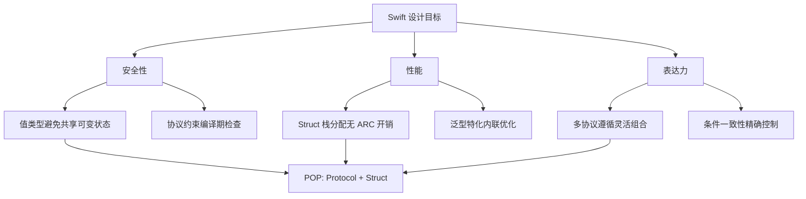
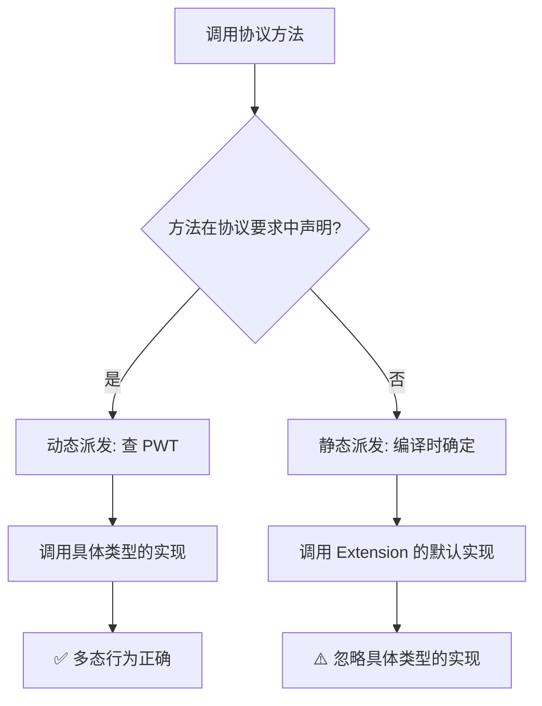

# 面向协议编程深度解析

> 深入理解 Swift Protocol-Oriented Programming 设计哲学、协议扩展、关联类型、条件一致性与 Protocol Witness Table 底层机制

---

## 目录

- [核心结论](#核心结论)
- [第一部分：POP 设计哲学](#第一部分pop-设计哲学)
- [第二部分：协议定义与遵循](#第二部分协议定义与遵循)
- [第三部分：Protocol Extension（协议扩展）](#第三部分protocol-extension协议扩展)
- [第四部分：关联类型（Associated Types）](#第四部分关联类型associated-types)
- [第五部分：条件一致性（Conditional Conformance）](#第五部分条件一致性conditional-conformance)
- [第六部分：Protocol Witness Table（PWT）](#第六部分protocol-witness-tablepwt)
- [第七部分：Self 约束与可选协议](#第七部分self-约束与可选协议)
- [最佳实践](#最佳实践)
- [常见陷阱](#常见陷阱)
- [面试考点](#面试考点)
- [参考资源](#参考资源)

---

## 核心结论

**Swift 的面向协议编程（POP）通过协议 + 扩展 + 泛型约束，提供了比类继承更灵活、可组合的多态机制。**

| 维度 | 核心洞察 |
|------|----------|
| **设计哲学** | 协议优先于继承，组合优先于层次，值类型也能多态 |
| **协议扩展** | 为协议提供默认实现，但非协议要求的方法是静态派发（最大陷阱！） |
| **关联类型** | 使协议具备泛型能力，但导致协议不能直接作为类型使用 |
| **条件一致性** | 按条件遵循协议（如 `Array: Equatable where Element: Equatable`） |
| **PWT 机制** | 协议类型通过 Existential Container + Protocol Witness Table 实现动态派发 |

---

## 第一部分：POP 设计哲学

### 1.1 OOP vs POP 范式对比

| 特性 | OOP（面向对象） | POP（面向协议） |
|------|----------------|----------------|
| **多态基础** | 类继承 + 虚函数表 | 协议遵循 + PWT |
| **代码复用** | 继承层次 | 协议扩展默认实现 |
| **类型限制** | 仅 Class | Struct / Class / Enum 均可 |
| **继承模型** | 单继承（钻石问题） | 多协议遵循（无冲突） |
| **耦合度** | 紧耦合（is-a） | 松耦合（has-capability） |
| **值语义** | ❌ Class 是引用语义 | ✅ Struct + Protocol 保持值语义 |

### 1.2 WWDC 2015 核心理念

Apple 在 WWDC 2015 "Protocol-Oriented Programming in Swift" 中提出：

1. **不要从 Class 开始设计** — 从 Protocol 开始
2. **继承不适合值类型** — Struct/Enum 无法继承，但可以遵循协议
3. **协议可以被任何类型遵循** — 不仅是 Class
4. **协议扩展提供默认实现** — 替代基类的共享逻辑

```swift
// ❌ OOP 思维：基类承载共享逻辑
class Shape {
    func area() -> Double { fatalError("子类必须实现") }
    func perimeter() -> Double { fatalError("子类必须实现") }
    
    // 共享逻辑
    func describe() -> String {
        "面积: \(area()), 周长: \(perimeter())"
    }
}

class Circle: Shape {
    var radius: Double
    init(radius: Double) { self.radius = radius }
    override func area() -> Double { .pi * radius * radius }
    override func perimeter() -> Double { 2 * .pi * radius }
}

// ✅ POP 思维：协议定义能力，扩展提供默认行为
protocol Shape {
    func area() -> Double
    func perimeter() -> Double
}

extension Shape {
    func describe() -> String {
        "面积: \(area()), 周长: \(perimeter())"
    }
}

struct Circle: Shape {  // Struct 也能参与！
    var radius: Double
    func area() -> Double { .pi * radius * radius }
    func perimeter() -> Double { 2 * .pi * radius }
}
```

### 1.3 协议 vs 抽象类对比

| 特性 | Swift Protocol | C++ 抽象类 / Java Abstract Class |
|------|---------------|--------------------------------|
| 存储属性 | ❌ 不能有 | ✅ 可以有 |
| 默认实现 | ✅ 通过 Extension | ✅ 非纯虚函数 |
| 多重遵循 | ✅ 无冲突 | ❌ 菱形继承问题 |
| 值类型支持 | ✅ Struct/Enum | ❌ 仅 Class |
| 关联类型 | ✅ associatedtype | ❌ 需要模板 |
| 初始化器要求 | ✅ | 部分支持 |

### 1.4 为什么 Swift 选择协议优先



---

## 第二部分：协议定义与遵循

### 2.1 协议属性要求

```swift
protocol Identifiable {
    // get：遵循者可以用 let、var 或 computed property 实现
    var id: String { get }
    
    // get set：遵循者必须提供可读写（var 或读写 computed property）
    var name: String { get set }
}

// ✅ 多种方式满足协议属性要求
struct User: Identifiable {
    let id: String           // get 要求 → let 满足 ✅
    var name: String         // get set 要求 → var 满足 ✅
}

struct AutoUser: Identifiable {
    var id: String {         // 计算属性满足 get ✅
        UUID().uuidString
    }
    var name: String
}
```

### 2.2 协议方法要求

```swift
protocol Drawable {
    func draw(on context: CGContext)
    mutating func resize(by factor: Double)  // mutating：值类型可修改 self
    static func defaultColor() -> UIColor    // 类型方法要求
}

struct Rectangle: Drawable {
    var width: Double
    var height: Double
    
    func draw(on context: CGContext) { /* 绘制逻辑 */ }
    
    // Struct 实现 mutating 方法
    mutating func resize(by factor: Double) {
        width *= factor
        height *= factor
    }
    
    static func defaultColor() -> UIColor { .blue }
}

// ⚠️ Class 实现时不需要 mutating 关键字
class CircleView: Drawable {
    var radius: Double = 10
    
    func draw(on context: CGContext) { /* 绘制 */ }
    func resize(by factor: Double) { radius *= factor }  // 无需 mutating
    static func defaultColor() -> UIColor { .red }
}
```

### 2.3 协议初始化器要求

```swift
protocol Creatable {
    init(raw: String)
}

// Class 遵循时必须标记 required（确保子类也实现）
class Document: Creatable {
    let content: String
    required init(raw: String) {
        self.content = raw
    }
}

// final class 不需要 required（无子类）
final class FinalDoc: Creatable {
    let content: String
    init(raw: String) {
        self.content = raw
    }
}
```

### 2.4 类专属协议

```swift
// 限制仅 Class 可以遵循
protocol Cacheable: AnyObject {  // 或旧写法 protocol Cacheable: class
    var cacheKey: String { get }
    func invalidate()
}

// ✅ Class 可以遵循
class ImageCache: Cacheable {
    var cacheKey: String = "images"
    func invalidate() { /* ... */ }
}

// ❌ Struct 不能遵循
// struct SimpleCache: Cacheable { }  // 编译错误
```

### 2.5 协议组合

```swift
protocol Named { var name: String { get } }
protocol Aged { var age: Int { get } }

// ✅ 协议组合：要求同时满足多个协议
func greet(person: Named & Aged) {
    print("Hello \(person.name), you are \(person.age)")
}

// 也可以组合协议与类
func configure(view: UIView & Configurable) {
    // view 必须既是 UIView 又遵循 Configurable
}

// ✅ typealias 简化组合
typealias NamedAndAged = Named & Aged

struct Employee: NamedAndAged {
    var name: String
    var age: Int
}
```

---

## 第三部分：Protocol Extension（协议扩展）

### 3.1 默认实现机制

```swift
protocol Loggable {
    var logTag: String { get }
    func log(_ message: String)
}

// ✅ 提供默认实现 — 遵循者可以直接使用或 override
extension Loggable {
    var logTag: String { String(describing: type(of: self)) }
    
    func log(_ message: String) {
        print("[\(logTag)] \(message)")
    }
}

struct NetworkService: Loggable {
    // 不需要实现 logTag 和 log — 自动获得默认实现
}

struct DatabaseService: Loggable {
    // 自定义实现覆盖默认
    var logTag: String { "DB" }
}

NetworkService().log("请求发送")   // [NetworkService] 请求发送
DatabaseService().log("查询执行")  // [DB] 查询执行
```

### 3.2 静态派发 vs 动态派发的陷阱（关键！）

```swift
protocol Animal {
    func speak() -> String   // ← 协议要求中声明
}

extension Animal {
    func speak() -> String { "..." }        // 默认实现（在协议要求中）→ 动态派发
    func description() -> String { "动物" }  // 仅在扩展中定义（不在协议要求中）→ 静态派发！
}

struct Cat: Animal {
    func speak() -> String { "Meow" }
    func description() -> String { "猫" }
}

let cat = Cat()
let animal: Animal = cat

// ✅ speak() 在协议要求中 → 通过 PWT 动态派发
print(cat.speak())     // "Meow"
print(animal.speak())  // "Meow" ← 正确！

// ⚠️ description() 不在协议要求中 → 静态派发
print(cat.description())     // "猫"
print(animal.description())  // "动物" ← 陷阱！调用了 Extension 的实现
```



### 3.3 与 C++ 默认虚函数实现的对比

| 特性 | Swift Protocol Extension | C++ 虚函数默认实现 |
|------|------------------------|-------------------|
| 派发方式 | 协议要求→动态；仅扩展→静态 | 始终动态（vtable） |
| 覆盖安全性 | 静态派发的方法覆盖无效果 | 所有 override 有效 |
| 性能 | 静态派发可内联优化 | 虚函数调用不可内联 |
| 陷阱 | 高！新手常踩 | 低，行为一致 |

---

## 第四部分：关联类型（Associated Types）

### 4.1 associatedtype 声明

```swift
// ✅ 关联类型使协议具备泛型能力
protocol Container {
    associatedtype Item
    
    var count: Int { get }
    mutating func append(_ item: Item)
    subscript(i: Int) -> Item { get }
}

// 遵循时，编译器从实现推断 Item 的具体类型
struct IntStack: Container {
    // Item 被推断为 Int
    var items: [Int] = []
    var count: Int { items.count }
    
    mutating func append(_ item: Int) {
        items.append(item)
    }
    
    subscript(i: Int) -> Int {
        items[i]
    }
}

// ✅ 也可以显式指定
struct StringStack: Container {
    typealias Item = String  // 显式声明
    var items: [String] = []
    var count: Int { items.count }
    mutating func append(_ item: String) { items.append(item) }
    subscript(i: Int) -> String { items[i] }
}
```

### 4.2 where 约束

```swift
// ✅ 关联类型约束
protocol SortableContainer: Container where Item: Comparable {
    func sorted() -> [Item]
}

// ✅ 方法级 where 约束
extension Container {
    // 仅当 Item 遵循 Equatable 时，此方法可用
    func contains(_ item: Item) -> Bool where Item: Equatable {
        for i in 0..<count {
            if self[i] == item { return true }
        }
        return false
    }
    
    // 仅当两个 Container 的 Item 类型相同且 Equatable 时可比较
    func elementsEqual<C: Container>(_ other: C) -> Bool
        where C.Item == Item, Item: Equatable {
        guard count == other.count else { return false }
        for i in 0..<count {
            if self[i] != other[i] { return false }
        }
        return true
    }
}
```

### 4.3 协议中的 Self 类型

```swift
protocol Copyable {
    func copy() -> Self  // Self 表示遵循类型本身
}

struct Document: Copyable {
    var title: String
    func copy() -> Document {  // Self 就是 Document
        Document(title: title + " (副本)")
    }
}

// ⚠️ Class 实现 Self 返回类型需要 required init
class Node: Copyable {
    var value: Int
    required init(value: Int) { self.value = value }
    
    func copy() -> Self {
        type(of: self).init(value: value)  // 确保返回实际类型
    }
}
```

### 4.4 关联类型使 Protocol 不能直接作为类型

```swift
protocol Container {
    associatedtype Item
    var count: Int { get }
}

// ❌ 有 associatedtype 的协议不能直接作为类型
// func process(container: Container) { }
// Error: Protocol 'Container' can only be used as a generic constraint

// ✅ 方案一：使用泛型约束
func process<C: Container>(container: C) where C.Item: Equatable {
    print("Items: \(container.count)")
}

// ✅ 方案二：使用 any（Swift 5.7+ Existential）
func processAny(container: any Container) {
    print("Items: \(container.count)")
}

// ✅ 方案三：使用 some（Opaque Type，Swift 5.1+）
func makeContainer() -> some Container {
    IntStack()
}
```

**为什么有 associatedtype 就不能直接当类型用？**

因为编译器需要在编译时确定关联类型的具体类型来生成代码。`any Container` 内部使用 Existential Container 擦除类型信息，有运行时开销；`some Container` 编译器知道具体类型，零开销。

---

## 第五部分：条件一致性（Conditional Conformance）

### 5.1 概念与语法

```swift
// ✅ 条件一致性：仅当满足条件时，类型才遵循协议
// 标准库经典示例：
// extension Array: Equatable where Element: Equatable { }
// extension Optional: Equatable where Wrapped: Equatable { }

// 自定义示例
struct Stack<Element> {
    private var items: [Element] = []
    mutating func push(_ item: Element) { items.append(item) }
    mutating func pop() -> Element? { items.popLast() }
}

// 仅当 Element: Equatable 时，Stack 才遵循 Equatable
extension Stack: Equatable where Element: Equatable {
    static func == (lhs: Stack, rhs: Stack) -> Bool {
        lhs.items == rhs.items
    }
}

// 仅当 Element: Hashable 时，Stack 才遵循 Hashable
extension Stack: Hashable where Element: Hashable {
    func hash(into hasher: inout Hasher) {
        items.hash(into: &hasher)
    }
}

// 使用
var s1 = Stack<Int>()
s1.push(1); s1.push(2)
var s2 = s1
print(s1 == s2)  // true ✅ — Int: Equatable，所以 Stack<Int>: Equatable

// Stack<SomeNonEquatable> 不能使用 ==（编译期检查）
```

### 5.2 标准库中的条件一致性

| 类型 | 条件 | 遵循协议 |
|------|------|----------|
| `Array<Element>` | `Element: Equatable` | `Equatable` |
| `Array<Element>` | `Element: Hashable` | `Hashable` |
| `Array<Element>` | `Element: Codable` | `Codable` |
| `Optional<Wrapped>` | `Wrapped: Equatable` | `Equatable` |
| `Dictionary<K, V>` | `K: Hashable, V: Equatable` | `Equatable` |

### 5.3 与 C++ 模板特化的对比

| 特性 | Swift 条件一致性 | C++ 模板特化 |
|------|----------------|-------------|
| 语法 | `extension T: P where ...` | `template<> class T<Spec>` |
| 约束检查 | 编译时 | 编译时（SFINAE / concepts） |
| 可组合性 | ✅ 多个条件独立 | 手动管理 |
| 协议链传播 | ✅ 自动传播 | ❌ 需要手动 |
| 错误信息 | 清晰 | 模板错误晦涩 |

---

## 第六部分：Protocol Witness Table（PWT）

### 6.1 PWT 的结构与作用

**Protocol Witness Table 是 Swift 实现协议多态的核心机制，类似于 C++ 的 vtable，但用于协议。**

```
┌─────────────────────────────────────────────────────────┐
│           Protocol Witness Table (PWT)                  │
├─────────────────────────────────────────────────────────┤
│  每个 "类型 + 协议" 组合生成一张 PWT                     │
│                                                         │
│  Cat 遵循 Animal 协议的 PWT:                             │
│  ┌─────────────────────────────────────────────┐        │
│  │  slot 0: Cat.speak  (→ 函数指针)             │        │
│  │  slot 1: Cat.eat    (→ 函数指针)             │        │
│  │  slot 2: Cat.sleep  (→ 函数指针)             │        │
│  └─────────────────────────────────────────────┘        │
│                                                         │
│  Dog 遵循 Animal 协议的 PWT:                             │
│  ┌─────────────────────────────────────────────┐        │
│  │  slot 0: Dog.speak  (→ 函数指针)             │        │
│  │  slot 1: Dog.eat    (→ 函数指针)             │        │
│  │  slot 2: Dog.sleep  (→ 函数指针)             │        │
│  └─────────────────────────────────────────────┘        │
└─────────────────────────────────────────────────────────┘
```

### 6.2 Existential Container 内存布局

```swift
// 当使用协议类型（Existential Type）时，Swift 使用 Existential Container
let animal: Animal = Cat()
```

```
┌─────────────────────────────────────────────────────────────────┐
│              Existential Container（40 字节）                     │
├─────────────────────────────────────────────────────────────────┤
│  Value Buffer (24 bytes)                                        │
│  ┌──────────┬──────────┬──────────┐                             │
│  │ word 0   │ word 1   │ word 2   │  ← 小值直接内联存储         │
│  └──────────┴──────────┴──────────┘    大值存堆指针              │
│                                                                  │
│  Metadata Pointer (8 bytes)                                      │
│  ┌──────────────────────────────────┐                            │
│  │ → Cat 的 Value Witness Table      │  ← 管理值的拷贝/销毁     │
│  └──────────────────────────────────┘                            │
│                                                                  │
│  PWT Pointer (8 bytes)                                           │
│  ┌──────────────────────────────────┐                            │
│  │ → Cat 遵循 Animal 的 PWT          │  ← 方法派发入口          │
│  └──────────────────────────────────┘                            │
└─────────────────────────────────────────────────────────────────┘

注意：每多遵循一个协议，多一个 PWT 指针（8 bytes）
```

### 6.3 协议类型 vs 泛型约束的性能差异

```swift
// 方式一：协议类型（Existential） — 动态派发，有间接开销
func feedAnimals(_ animals: [Animal]) {
    for animal in animals {
        animal.speak()  // 通过 PWT 间接调用
    }
}

// 方式二：泛型约束 — 编译器特化，可内联
func feedAnimals<T: Animal>(_ animals: [T]) {
    for animal in animals {
        animal.speak()  // 编译器可特化为直接调用
    }
}
```

| 指标 | 协议类型 `Animal` | 泛型 `<T: Animal>` |
|------|-------------------|---------------------|
| 内存布局 | Existential Container（40B+） | 值类型直接内联 |
| 方法调用 | PWT 间接调用 | 编译器特化→直接调用/内联 |
| 集合元素 | 可混合不同类型 | 同一类型（均质集合） |
| 编译产物 | 单份代码 | 每种类型一份特化代码 |
| 适用场景 | 异构集合、运行时多态 | 同构集合、性能敏感路径 |

```swift
// ✅ 性能敏感场景：使用泛型
func sum<C: Collection>(_ collection: C) -> C.Element
    where C.Element: AdditiveArithmetic {
    collection.reduce(.zero, +)
}

// ✅ 灵活性场景：使用协议类型
var plugins: [any Plugin] = [LogPlugin(), AuthPlugin(), CachePlugin()]
```

---

## 第七部分：Self 约束与可选协议

### 7.1 Self 要求的含义

```swift
// Self 表示遵循协议的具体类型
protocol Equatable {
    static func == (lhs: Self, rhs: Self) -> Bool
}

// Self 约束意味着只能比较相同类型
struct Point: Equatable {
    var x: Double, y: Double
    static func == (lhs: Point, rhs: Point) -> Bool {
        lhs.x == rhs.x && lhs.y == rhs.y
    }
}

// ⚠️ 有 Self 约束的协议不能直接作为 Existential 类型
// let items: [Equatable] = [...]  // ❌ 'Equatable' 有 Self 约束
// ✅ Swift 5.7+：可以用 any Equatable，但功能受限
```

### 7.2 @objc optional 协议方法

```swift
// ⚠️ 仅 @objc 协议支持可选方法，且仅 Class 可以遵循
@objc protocol TableDelegate {
    func numberOfRows() -> Int
    @objc optional func didSelectRow(at index: Int)  // 可选方法
    @objc optional var headerTitle: String { get }    // 可选属性
}

class MyDelegate: NSObject, TableDelegate {
    func numberOfRows() -> Int { 10 }
    // didSelectRow 和 headerTitle 不实现也不报错
}

// 调用时需要可选链
func configure(delegate: TableDelegate) {
    let rows = delegate.numberOfRows()
    delegate.didSelectRow?(at: 0)  // 可选调用
    let title = delegate.headerTitle ?? "Default"
}
```

### 7.3 可选协议的替代方案（推荐！）

```swift
// ✅ 纯 Swift 方案：用协议扩展提供空默认实现
protocol ModernDelegate {
    func numberOfRows() -> Int
    func didSelectRow(at index: Int)
    var headerTitle: String? { get }
}

extension ModernDelegate {
    // 默认空实现 → 遵循者可以选择性实现
    func didSelectRow(at index: Int) { }
    var headerTitle: String? { nil }
}

struct SwiftDelegate: ModernDelegate {
    func numberOfRows() -> Int { 10 }
    // 不实现 didSelectRow 和 headerTitle → 使用默认实现
}

// ✅ 优势：
// - 不需要 @objc，Struct 也能遵循
// - 类型安全，无 optional chaining
// - 更符合 Swift 风格
```

### 7.4 协议继承

```swift
protocol Printable {
    func printDescription()
}

protocol PrettyPrintable: Printable {
    func prettyPrint()
}

extension PrettyPrintable {
    // 默认实现基于父协议
    func prettyPrint() {
        print("--- Pretty ---")
        printDescription()
        print("--------------")
    }
}

struct Report: PrettyPrintable {
    var title: String
    func printDescription() { print("Report: \(title)") }
    // prettyPrint() 自动获得默认实现
}
```

---

## 最佳实践

### 设计原则

1. **从协议开始设计，而非从类开始** — 先定义行为契约
2. **协议保持小而聚焦** — 单一职责，便于组合
3. **用协议组合替代继承层次** — `Named & Aged` 而非 `NamedAgedBase`
4. **协议扩展提供合理默认值** — 减少遵循者的重复实现

### 实现技巧

5. **协议要求中声明所有需要多态的方法** — 避免静态派发陷阱
6. **性能敏感路径使用泛型约束而非协议类型** — `<T: P>` 优于 `P`
7. **使用条件一致性扩展泛型类型的协议遵循** — 保持类型安全
8. **避免过度使用 @objc optional** — 用默认实现替代

### 类型擦除

9. **需要异构集合时使用 `any Protocol`（Swift 5.7+）** — 明确 Existential 开销
10. **返回协议类型时优先 `some Protocol`** — 编译器优化、零开销抽象

---

## 常见陷阱

### 陷阱一：协议扩展静态派发（最常见！）

```swift
protocol Renderable {
    func render()  // ← 在协议要求中声明
}

extension Renderable {
    func render() { print("默认渲染") }
    func cleanup() { print("默认清理") }  // ← 仅在扩展中定义！
}

struct OpenGLRenderer: Renderable {
    func render() { print("OpenGL 渲染") }
    func cleanup() { print("OpenGL 清理") }
}

let renderer: Renderable = OpenGLRenderer()
renderer.render()   // "OpenGL 渲染" ✅ — 动态派发
renderer.cleanup()  // "默认清理" ❌ — 静态派发，忽略了 OpenGL 实现！

// ✅ 修复：将 cleanup 添加到协议要求中
protocol FixedRenderable {
    func render()
    func cleanup()  // ← 添加到协议要求
}
```

### 陷阱二：associatedtype 导致协议不能作为类型

```swift
protocol Repository {
    associatedtype Entity
    func find(id: String) -> Entity?
}

// ❌ 不能直接作为参数类型
// func save(to repo: Repository) { }  // 编译错误

// ✅ 方案一：泛型约束
func save<R: Repository>(to repo: R) where R.Entity: Codable { }

// ✅ 方案二：any（Swift 5.7+）
func save(to repo: any Repository) { }

// ✅ 方案三：类型擦除包装器
struct AnyRepository<Entity>: Repository {
    private let _find: (String) -> Entity?
    
    init<R: Repository>(_ repo: R) where R.Entity == Entity {
        _find = repo.find
    }
    
    func find(id: String) -> Entity? { _find(id) }
}
```

### 陷阱三：协议遵循冲突

```swift
protocol A { func doSomething() -> String }
protocol B { func doSomething() -> String }

// 两个协议要求同名方法 — 一个实现同时满足两者
struct MyType: A, B {
    func doSomething() -> String { "Done" }  // 同时满足 A 和 B
}

// ⚠️ 但如果返回类型不同，则无法同时遵循
// protocol C { func doSomething() -> Int }
// struct Conflict: A, C { }  // 无法同时满足
```

### 陷阱四：Existential Container 的性能开销

```swift
// ❌ 性能敏感路径使用协议类型
func processItems(_ items: [any Processable]) {
    for item in items {
        item.process()  // 每次调用经过 Existential Container → PWT 间接调用
    }
}

// ✅ 同构集合使用泛型（编译器特化，直接调用）
func processItems<T: Processable>(_ items: [T]) {
    for item in items {
        item.process()  // 编译器特化→直接调用→可内联
    }
}
```

---

## 面试考点

### 考题一：Swift 的 Protocol Extension 默认实现有什么派发陷阱？

**参考答案**：

Protocol Extension 中的方法有两种派发方式：
1. 方法在协议要求中声明 → 通过 PWT 动态派发，具体类型的实现会正确生效
2. 方法仅在 Extension 中定义（不在协议要求中）→ 静态派发，编译时根据变量声明类型决定调用

陷阱场景：通过协议类型变量调用仅在 Extension 中定义的方法时，即使具体类型提供了自己的实现，也会调用 Extension 的默认实现。

**追问**：
- Q: 如何避免这个陷阱？
- A: 将所有需要多态行为的方法放入协议要求声明中，而不是仅在 Extension 中定义。
- Q: 为什么 Swift 要这样设计，不全都动态派发？
- A: 性能考虑。静态派发允许编译器内联优化，PWT 动态派发有间接调用开销。设计者有意让开发者明确哪些方法需要多态。

### 考题二：有 associatedtype 的协议为什么不能直接当类型用？有哪些解决方案？

**参考答案**：

有 associatedtype 的协议编译器无法确定关联类型的具体类型，无法确定内存布局和方法签名，所以不能直接作为 Existential 类型。

解决方案：
1. 泛型约束 `<T: Protocol>` — 编译时确定，零开销，最推荐
2. `any Protocol`（Swift 5.7+）— 运行时擦除，灵活但有 Existential 开销
3. `some Protocol`（Swift 5.1+）— 不透明返回类型，编译器知道具体类型
4. 手动类型擦除（AnyXxx 包装器）— Swift 5.7 前的标准做法

**追问**：
- Q: `any Protocol` 和 `some Protocol` 的区别？
- A: `any` 是 Existential 类型，运行时动态，可以装不同类型，有 Existential Container 开销。`some` 是 Opaque Type，编译器知道具体类型但外部不知道，零开销，但每次只能是一种类型。
- Q: 标准库的 `AnySequence`、`AnyHashable` 是什么模式？
- A: 类型擦除模式。内部通过闭包或 thunk 函数擦除具体类型信息，对外暴露统一的接口。Swift 5.7 的 `any` 语法使手动类型擦除的需求大幅减少。

### 考题三：协议类型和泛型约束在性能上有什么区别？底层机制是什么？

**参考答案**：

协议类型（`any Protocol`）使用 Existential Container 包装值（40 字节），通过 PWT 动态派发方法调用，无法内联优化。

泛型约束（`<T: Protocol>`）编译器对每种具体类型生成特化代码，方法直接调用，可以内联。等价于 C++ 模板特化。

性能差异：泛型在热路径上可快数倍，但会增加编译产物大小（代码膨胀）。实际选择取决于场景：异构集合用协议类型，同构高性能场景用泛型。

**追问**：
- Q: Existential Container 的内存布局是怎样的？
- A: 由 Value Buffer（3 个 word = 24 字节）+ Value Witness Table 指针（8 字节）+ 每个协议的 PWT 指针（8 字节）组成。小于 24 字节的值内联存储，大于的堆分配后存指针。
- Q: PWT 和 VTable 有什么区别？
- A: VTable 是类级别的，一个类一张表，包含所有虚方法。PWT 是"类型+协议"组合级别的，每种类型对每个遵循的协议各有一张表。VTable 通过对象内的 vptr 访问，PWT 通过 Existential Container 中的指针访问。

---

## 参考资源

- [Apple 官方文档 - Protocols](https://docs.swift.org/swift-book/documentation/the-swift-programming-language/protocols/)
- [WWDC 2015 - Protocol-Oriented Programming in Swift](https://developer.apple.com/videos/play/wwdc2015/408/)
- [WWDC 2016 - Understanding Swift Performance](https://developer.apple.com/videos/play/wwdc2016/416/)
- [Swift 源码 - Existential Container 实现](https://github.com/apple/swift/tree/main/stdlib/public/runtime)
- [关联文档 - Swift运行时与ABI稳定性](../../iOS_Framework_Architecture/04_底层运行机制/Swift运行时与ABI稳定性_详细解析.md)
- [关联文档 - 类继承与多态](./类继承与多态_详细解析.md)
