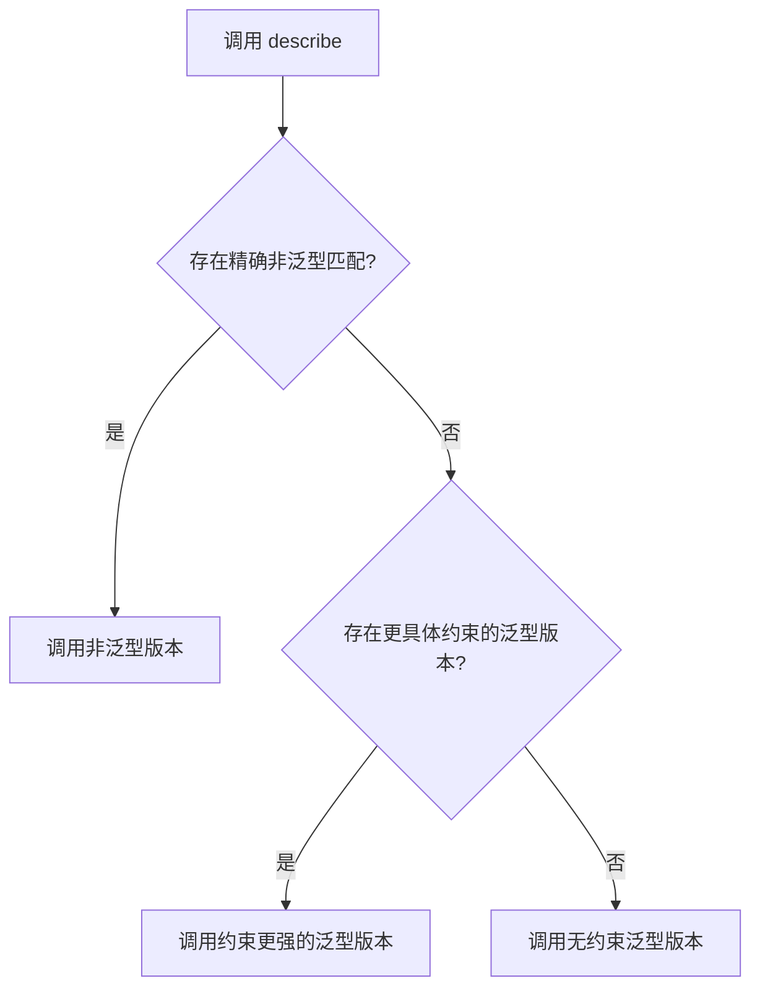
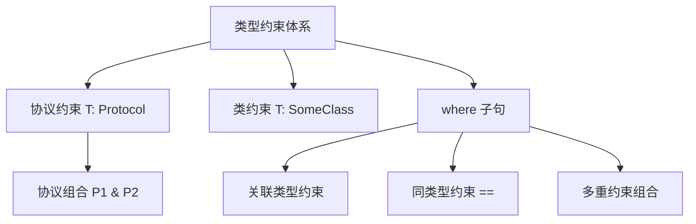
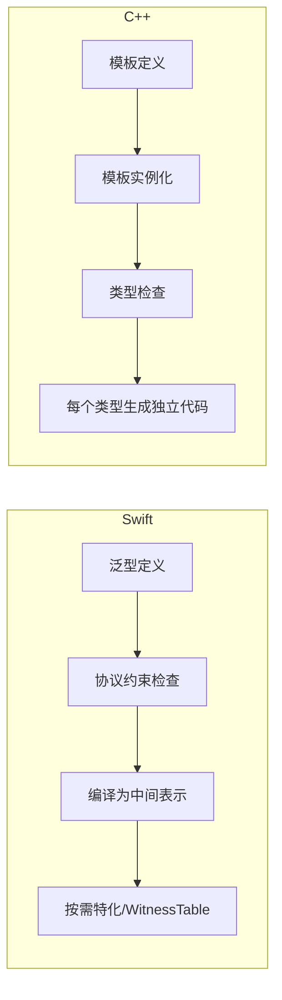

# 泛型基础与约束详细解析

> **核心结论**：Swift 泛型是类型安全代码复用的基石，通过**协议约束**而非 C++ 的 SFINAE 实现编译期类型检查。理解泛型函数、泛型类型、类型约束、关联类型和 Primary Associated Types 是掌握 Swift 类型系统的关键。**优先用协议约束表达意图，而非依赖运行时类型检查。**

---

## 核心结论 TL;DR

| # | 核心洞察 | 关键要点 |
|---|---------|---------|
| 1 | **泛型 = 类型安全 + 代码复用** | 一份代码适配无限类型，编译期捕获类型错误 |
| 2 | **协议约束是 Swift 泛型的灵魂** | `<T: Protocol>` 明确告诉编译器 T 能做什么 |
| 3 | **where 子句表达复杂约束** | 多重约束、关联类型约束、同类型约束均通过 where 实现 |
| 4 | **Associated Type 是协议的"泛型参数"** | 让协议也能表达泛型语义，Swift 5.7 引入 Primary Associated Types |
| 5 | **Swift 泛型 ≠ C++ 模板** | Swift 分开编译 + 协议约束；C++ 头文件包含 + SFINAE |

---

## 1. Why — 为什么需要泛型编程

**结论先行**：泛型让你写出一份代码适配所有类型，同时保持完整的类型安全——这是 `Any` 和强制转换无法做到的。

### 1.1 没有泛型的痛点

```swift
// ❌ 没有泛型：为每种类型写重复代码
func swapInts(_ a: inout Int, _ b: inout Int) {
    let temp = a; a = b; b = temp
}

func swapStrings(_ a: inout String, _ b: inout String) {
    let temp = a; a = b; b = temp
}

// ❌ 用 Any 失去类型安全
func swapAny(_ a: inout Any, _ b: inout Any) {
    let temp = a; a = b; b = temp
}
// 编译器无法阻止你把 Int 和 String 混着交换

// ✅ 泛型：一份代码，类型安全
func swapValues<T>(_ a: inout T, _ b: inout T) {
    let temp = a; a = b; b = temp
}
var x = 1, y = 2
swapValues(&x, &y)  // T 被推导为 Int
```

### 1.2 泛型在 Swift 标准库中的应用

```swift
// Array、Dictionary、Optional 全是泛型类型
let numbers: Array<Int> = [1, 2, 3]            // Array<Element>
let map: Dictionary<String, Int> = ["a": 1]    // Dictionary<Key, Value>
let opt: Optional<String> = "Hello"            // Optional<Wrapped>

// 高阶函数是泛型方法
let doubled = numbers.map { $0 * 2 }           // func map<T>(_ transform: (Element) -> T) -> [T]
let filtered = numbers.filter { $0 > 1 }       // func filter(_ isIncluded: (Element) -> Bool) -> [Element]

// sort 要求 Element: Comparable
numbers.sorted()  // 因为 Int: Comparable
```

### 1.3 Swift 泛型 vs C++ 模板：设计哲学差异

| 维度 | Swift 泛型 | C++ 模板 |
|-----|-----------|---------|
| **核心机制** | 协议约束（Protocol Constraints） | 鸭子类型 → SFINAE → Concepts(C++20) |
| **编译模型** | 分开编译，支持二进制框架分发 | 头文件包含，模板定义必须在头文件中 |
| **错误时机** | 定义处即可检查约束是否满足 | 实例化时才报错（错误信息冗长） |
| **特化** | 无显式特化，用重载+约束替代 | 全特化、偏特化 |

---

## 2. What — 泛型函数

**结论先行**：泛型函数通过类型参数 `<T>` 实现参数化多态，配合约束可精确控制类型要求。

### 2.1 基本语法

```swift
// ✅ 泛型函数基础语法
func findIndex<T: Equatable>(of value: T, in array: [T]) -> Int? {
    for (index, element) in array.enumerated() {
        if element == value {
            return index
        }
    }
    return nil
}

let index = findIndex(of: "banana", in: ["apple", "banana", "cherry"])  // Optional(1)
```

### 2.2 类型参数命名惯例

```swift
// 单一用途：使用 T、U、V
func pair<T, U>(_ first: T, _ second: U) -> (T, U) {
    return (first, second)
}

// 语义明确时：使用描述性名称
func allItemsMatch<C1: Container, C2: Container>(
    _ someContainer: C1,
    _ anotherContainer: C2
) -> Bool where C1.Item == C2.Item, C1.Item: Equatable {
    if someContainer.count != anotherContainer.count { return false }
    for i in 0..<someContainer.count {
        if someContainer[i] != anotherContainer[i] { return false }
    }
    return true
}
```

**命名规范**：

| 场景 | 推荐命名 | 示例 |
|-----|---------|------|
| 通用占位 | `T`, `U`, `V` | `func swap<T>` |
| 集合元素 | `Element` | `struct Stack<Element>` |
| 键值对 | `Key`, `Value` | `struct Cache<Key, Value>` |
| 序列相关 | `S: Sequence` | `func process<S: Sequence>` |

### 2.3 多类型参数

```swift
// ✅ 多类型参数函数
func transform<Input, Output>(_ value: Input, using closure: (Input) -> Output) -> Output {
    return closure(value)
}

let result = transform(42) { String($0) }  // "42"，Input=Int, Output=String

// ✅ 带约束的多类型参数
func merge<T: Collection, U: Collection>(
    _ first: T,
    _ second: U
) -> [T.Element] where T.Element == U.Element {
    return Array(first) + Array(second)
}

let merged = merge([1, 2], Set([3, 4]))  // [1, 2, 3, 4] 或 [1, 2, 4, 3]
```

### 2.4 泛型函数重载解析

```swift
// 非泛型版本优先级最高
func describe(_ value: Int) -> String {
    return "Int: \(value)"
}

// 带约束的泛型版本次之
func describe<T: CustomStringConvertible>(_ value: T) -> String {
    return "CustomStringConvertible: \(value.description)"
}

// 无约束泛型版本优先级最低
func describe<T>(_ value: T) -> String {
    return "Generic: \(value)"
}

describe(42)        // "Int: 42" — 精确匹配非泛型版本
describe(3.14)      // "CustomStringConvertible: 3.14" — Double: CustomStringConvertible
describe((1, 2))    // "Generic: (1, 2)" — 元组无 CustomStringConvertible
```

**重载优先级规则**：



---

## 3. What — 泛型类型

**结论先行**：泛型类型（Struct/Class/Enum）让数据结构一次定义、无限复用，配合 Extension 可按条件扩展功能。

### 3.1 泛型 Struct

```swift
// ✅ 经典泛型栈
struct Stack<Element> {
    private var items: [Element] = []
    
    mutating func push(_ item: Element) {
        items.append(item)
    }
    
    mutating func pop() -> Element? {
        return items.isEmpty ? nil : items.removeLast()
    }
    
    var top: Element? {
        return items.last
    }
    
    var isEmpty: Bool {
        return items.isEmpty
    }
    
    var count: Int {
        return items.count
    }
}

var intStack = Stack<Int>()
intStack.push(1)
intStack.push(2)
print(intStack.pop()!)  // 2
```

### 3.2 泛型 Enum

```swift
// ✅ 泛型 Result 类型（标准库实际定义）
enum Result<Success, Failure: Error> {
    case success(Success)
    case failure(Failure)
}

// ✅ 泛型链表
indirect enum LinkedList<Element> {
    case empty
    case node(Element, LinkedList<Element>)
}

let list: LinkedList<Int> = .node(1, .node(2, .node(3, .empty)))
```

### 3.3 泛型类型的扩展

```swift
// ✅ 无条件扩展：对所有 Stack<Element> 生效
extension Stack {
    var topItem: Element? {
        return items.last
    }
}

// ✅ 条件扩展：仅当 Element: Equatable 时生效
extension Stack where Element: Equatable {
    func contains(_ item: Element) -> Bool {
        return items.contains(item)
    }
}

// ✅ 条件扩展：仅当 Element: Numeric 时生效
extension Stack where Element: Numeric {
    func sum() -> Element {
        return items.reduce(0, +)
    }
}

var numStack = Stack<Int>()
numStack.push(10)
numStack.push(20)
numStack.sum()       // 30 ✅ Int: Numeric
numStack.contains(10) // true ✅ Int: Equatable

var anyStack = Stack<(Int, Int)>()
anyStack.push((1, 2))
// anyStack.contains((1, 2))  // ❌ 编译错误：(Int, Int) 不遵循 Equatable
```

### 3.4 泛型嵌套类型

```swift
// ✅ 泛型类型内的嵌套类型
struct Matrix<Element: Numeric> {
    let rows: Int, columns: Int
    var grid: [Element]
    
    init(rows: Int, columns: Int, defaultValue: Element) {
        self.rows = rows
        self.columns = columns
        grid = Array(repeating: defaultValue, count: rows * columns)
    }
    
    // 嵌套类型可使用外部泛型参数
    struct Index {
        let row: Int, column: Int
    }
    
    subscript(index: Index) -> Element {
        get { grid[index.row * columns + index.column] }
        set { grid[index.row * columns + index.column] = newValue }
    }
}

var matrix = Matrix(rows: 2, columns: 2, defaultValue: 0)
matrix[Matrix<Int>.Index(row: 0, column: 1)] = 42
```

### 3.5 泛型与初始化器

```swift
// ✅ 泛型类型的初始化器
struct Pair<First, Second> {
    let first: First
    let second: Second
    
    // 成员初始化器自动泛型化
    init(first: First, second: Second) {
        self.first = first
        self.second = second
    }
    
    // 便利初始化器可引入新泛型参数... 但 struct 不支持 convenience
    // 使用静态工厂方法替代
    static func duplicate<T>(_ value: T) -> Pair<T, T> {
        return Pair<T, T>(first: value, second: value)
    }
}

let p = Pair(first: "Hello", second: 42)       // Pair<String, Int>
let d = Pair.duplicate("Swift")                 // Pair<String, String>
```

---

## 4. How — 类型约束深入

**结论先行**：类型约束是 Swift 泛型的核心竞争力——在代码定义处而非调用处检查类型能力，让错误信息清晰、代码意图明确。

### 4.1 协议约束

```swift
// ✅ 协议约束：T 必须遵循 Comparable
func binarySearch<T: Comparable>(_ array: [T], target: T) -> Int? {
    var low = 0, high = array.count - 1
    while low <= high {
        let mid = (low + high) / 2
        if array[mid] == target { return mid }
        else if array[mid] < target { low = mid + 1 }
        else { high = mid - 1 }
    }
    return nil
}

binarySearch([1, 3, 5, 7, 9], target: 5)  // Optional(2)

// ❌ 无约束版本：编译器不知道 T 能比较
func binarySearchBad<T>(_ array: [T], target: T) -> Int? {
    // if array[0] < target { }  // 编译错误：Binary operator '<' cannot be applied to two 'T' operands
    return nil
}
```

### 4.2 类约束

```swift
// ✅ 类约束：限制 T 必须是某个类的子类
class Animal {
    var name: String
    init(name: String) { self.name = name }
}

class Dog: Animal {
    var breed: String
    init(name: String, breed: String) {
        self.breed = breed
        super.init(name: name)
    }
}

func printAnimalName<T: Animal>(_ animal: T) {
    print(animal.name)  // 编译器知道 T 有 name 属性
}

let dog = Dog(name: "Buddy", breed: "Labrador")
printAnimalName(dog)  // "Buddy"
// printAnimalName("not an animal")  // ❌ 编译错误
```

### 4.3 where 子句的高级用法

```swift
// ✅ 关联类型约束
func sumOfSequence<S: Sequence>(_ seq: S) -> S.Element
    where S.Element: AdditiveArithmetic {
    return seq.reduce(.zero, +)
}
sumOfSequence([1.1, 2.2, 3.3])  // 6.6

// ✅ 同类型约束
func concatenate<S1: Sequence, S2: Sequence>(
    _ first: S1, _ second: S2
) -> [S1.Element] where S1.Element == S2.Element {
    return Array(first) + Array(second)
}

// ✅ 扩展中的 where 子句
extension Array where Element: Comparable {
    func isSorted() -> Bool {
        guard count > 1 else { return true }
        return zip(self, self.dropFirst()).allSatisfy { $0 <= $1 }
    }
}
[1, 2, 3].isSorted()    // true
[3, 1, 2].isSorted()    // false
```

### 4.4 多重约束组合

```swift
// ✅ 多重约束：T 必须同时满足多个协议
func processAndDisplay<T: Hashable & CustomStringConvertible>(_ value: T) {
    print("Hash: \(value.hashValue), Desc: \(value.description)")
}

// ✅ 复杂 where 子句组合
func complexConstraint<C: Collection>(
    _ collection: C
) -> [String] where C.Element: CustomStringConvertible,
                    C.Index == Int {
    return collection.map { $0.description }
}

// ✅ 协议组合约束
typealias Displayable = Hashable & CustomStringConvertible & Codable

func store<T: Displayable>(_ value: T) {
    // T 可哈希、可描述、可编解码
}
```

### 4.5 约束冲突与解决

```swift
// ❌ 约束冲突示例：两个扩展对同一方法有不同约束
extension Stack where Element: Equatable {
    func findFirst(_ item: Element) -> Int? {
        return items.firstIndex(of: item)
    }
}

// ✅ 约束细化：更具体的约束覆盖更宽泛的约束
extension Stack where Element: Comparable {
    // 这不会与 Equatable 版本冲突
    // 因为 Comparable 继承自 Equatable
    func sorted() -> [Element] {
        return items.sorted()
    }
}

// ✅ 解决真正的歧义：用更精确的类型标注
protocol Printable {
    func printDescription()
}
protocol Loggable {
    func printDescription()
}
// 当同时遵循两个有相同方法的协议时
// Swift 使用单一实现满足两个协议
```



---

## 5. Deep — 关联类型与泛型的关系

**结论先行**：Associated Type 是协议层面的泛型参数，让协议可以抽象地描述类型关系。Swift 5.7 的 Primary Associated Types 让泛型协议的使用体验大幅提升。

### 5.1 Associated Type 基础

```swift
// ✅ 协议中的关联类型
protocol Container {
    associatedtype Item
    
    mutating func append(_ item: Item)
    var count: Int { get }
    subscript(i: Int) -> Item { get }
}

// 实现时确定具体类型
struct IntStack: Container {
    typealias Item = Int  // 可省略，编译器自动推断
    
    var items: [Int] = []
    
    mutating func append(_ item: Int) {
        items.append(item)
    }
    
    var count: Int { items.count }
    
    subscript(i: Int) -> Int {
        return items[i]
    }
}
```

### 5.2 泛型类型遵循含 Associated Type 的协议

```swift
// ✅ 泛型 Stack 自动满足 Container
extension Stack: Container {
    // Item 被推断为 Element
    mutating func append(_ item: Element) {
        self.push(item)
    }
    
    var count: Int { self.count }
    
    subscript(i: Int) -> Element {
        return items[i]
    }
}
```

### 5.3 Associated Type 的约束

```swift
// ✅ 约束关联类型
protocol SortableContainer {
    associatedtype Item: Comparable  // Item 必须是 Comparable
    
    var items: [Item] { get }
    func sorted() -> [Item]
}

// ✅ 多重约束
protocol CodableContainer {
    associatedtype Item: Codable & Hashable
    
    func encode() throws -> Data
}

// ✅ where 子句约束关联类型之间的关系
protocol ConvertibleContainer {
    associatedtype Item
    associatedtype ConvertedItem
    
    func convert(_ transform: (Item) -> ConvertedItem) -> [ConvertedItem]
}
```

### 5.4 Primary Associated Types（Swift 5.7+）

```swift
// ✅ Swift 5.7+: Primary Associated Types
// 标准库定义
// protocol Collection<Element>: Sequence { ... }

// 之前（Swift 5.6-）
func printAll<C: Collection>(_ collection: C) where C.Element == Int {
    for item in collection { print(item) }
}

// 之后（Swift 5.7+）：语法更简洁
func printAll(_ collection: some Collection<Int>) {
    for item in collection { print(item) }
}

// 用于存在类型
func processCollection(_ collection: any Collection<String>) {
    for item in collection { print(item) }
}

// 自定义 Primary Associated Type
protocol Repository<Model> {
    associatedtype Model: Identifiable
    
    func find(byID id: Model.ID) -> Model?
    func save(_ model: Model) throws
}
```

**Primary Associated Types 的价值**：

| 特性 | 之前 (< 5.7) | 之后 (≥ 5.7) |
|-----|-------------|-------------|
| 泛型约束 | `<C: Collection> where C.Element == Int` | `some Collection<Int>` |
| 存在类型 | `AnyCollection<Int>` (需类型擦除) | `any Collection<Int>` |
| 可读性 | 冗长的 where 子句 | 类似普通泛型语法 |

---

## 6. Compare — Swift 泛型 vs C++ 模板

**结论先行**：Swift 泛型和 C++ 模板虽然目标相似（参数化多态），但实现哲学截然不同：Swift 选择了约束明确、错误前置的路线，C++ 选择了灵活强大但错误延后的路线。

### 6.1 编译模型差异

```swift
// ✅ Swift：泛型定义在模块内部，可编译为二进制框架
// ModuleA.swift
public func genericFunc<T: Equatable>(_ a: T, _ b: T) -> Bool {
    return a == b
}
// 编译为 .swiftmodule，其他模块直接 import 使用
```

```cpp
// C++：模板定义必须在头文件中
// header.h
template<typename T>
bool genericFunc(T a, T b) {
    return a == b;  // 如果 T 没有 == 运算符，实例化时才报错
}
```

### 6.2 约束方式差异

```swift
// ✅ Swift：协议约束，意图清晰
func sort<T: Comparable>(_ array: inout [T]) {
    // 编译器保证 T 有 <、==、> 等操作
}

// C++20 Concepts（类似 Swift 的协议约束）
// template<std::totally_ordered T>
// void sort(std::vector<T>& vec) { ... }

// C++17 及之前：SFINAE
// template<typename T, typename = std::enable_if_t<std::is_arithmetic_v<T>>>
// T add(T a, T b) { return a + b; }
```

### 6.3 特化差异

```swift
// Swift 没有显式模板特化，用重载 + 条件扩展替代
extension Array where Element == Int {
    func optimizedSum() -> Int {
        // 可以用 SIMD 等 Int 特有优化
        return self.reduce(0, +)
    }
}

extension Array where Element == String {
    func joined(with separator: String) -> String {
        return self.joined(separator: separator)
    }
}
```

```cpp
// C++ 支持全特化和偏特化
template<typename T>
struct Printer {
    static void print(T value) { std::cout << value; }
};

// 全特化
template<>
struct Printer<bool> {
    static void print(bool value) { std::cout << (value ? "true" : "false"); }
};

// 偏特化
template<typename T>
struct Printer<std::vector<T>> {
    static void print(const std::vector<T>& vec) { /*...*/ }
};
```

### 6.4 全面对比表

| 维度 | Swift 泛型 | C++ 模板 |
|------|-----------|---------|
| **编译模型** | 分开编译，支持 ABI 稳定 | 头文件包含，每个 TU 实例化 |
| **约束系统** | 协议约束（显式、前置） | SFINAE/Concepts（C++20 后改善） |
| **特化** | 无显式特化，用条件扩展替代 | 全特化 + 偏特化 |
| **错误诊断** | 定义处即报错，信息清晰 | 实例化处报错，信息冗长 |
| **运行时表示** | Witness Table（可能动态派发） | 完全编译期展开，零运行时开销 |
| **代码膨胀** | 编译器按需特化，较可控 | 每个类型实例化一份，可能膨胀 |
| **元编程** | 不支持（用 Macro 替代部分） | 模板元编程（图灵完备） |



---

## 7. 最佳实践

| # | 实践 | 说明 |
|---|------|------|
| 1 | **始终添加必要的约束** | `<T: Equatable>` 比 `<T>` + 运行时检查好得多 |
| 2 | **优先用协议约束而非类约束** | 协议更灵活，不绑定继承层次 |
| 3 | **用 where 子句表达复杂约束** | 比在 `<>` 中堆叠更清晰 |
| 4 | **泛型命名要有语义** | `Element`、`Key`、`Value` 比 `T`、`U`、`V` 更可读 |
| 5 | **善用条件扩展** | 替代 C++ 的偏特化，按需为特定类型添加功能 |
| 6 | **Swift 5.7+ 使用 Primary Associated Types** | `some Collection<Int>` 比 where 子句更简洁 |
| 7 | **避免过度泛型化** | 如果只用于 1-2 种类型，不需要泛型 |

---

## 8. 常见陷阱

### 陷阱 1：忘记约束导致编译错误

```swift
// ❌ 错误：T 没有 == 运算符
func findIndex<T>(of value: T, in array: [T]) -> Int? {
    for (i, item) in array.enumerated() {
        // if item == value { return i }  // 编译错误！
    }
    return nil
}

// ✅ 修复：添加 Equatable 约束
func findIndex<T: Equatable>(of value: T, in array: [T]) -> Int? {
    for (i, item) in array.enumerated() {
        if item == value { return i }
    }
    return nil
}
```

### 陷阱 2：协议不能直接当泛型用

```swift
// ❌ 错误：有 associatedtype 的协议不能直接用作类型（Swift 5.6 前）
protocol Identifiable {
    associatedtype ID: Hashable
    var id: ID { get }
}

// let items: [Identifiable] = []  // ❌ Swift 5.6 前编译错误

// ✅ 修复方案 1：泛型约束
func process<T: Identifiable>(_ item: T) { }

// ✅ 修复方案 2：Swift 5.7+ 使用 any
let items: [any Identifiable] = []

// ✅ 修复方案 3：类型擦除
// struct AnyIdentifiable { ... }
```

### 陷阱 3：条件扩展的方法不可见

```swift
struct Wrapper<T> {
    let value: T
}

extension Wrapper where T: Numeric {
    func doubled() -> T { value + value }
}

let w = Wrapper(value: "hello")
// w.doubled()  // ❌ 编译错误：String 不是 Numeric

// ✅ 理解：条件扩展的方法只在约束满足时可用
let n = Wrapper(value: 42)
n.doubled()  // ✅ 84
```

### 陷阱 4：泛型类型的静态属性是按类型参数独立的

```swift
struct Counter<T> {
    static var count = 0
}

Counter<Int>.count += 1
Counter<String>.count += 1

print(Counter<Int>.count)     // 1（不是 2！）
print(Counter<String>.count)  // 1
// Counter<Int> 和 Counter<String> 是不同的类型
```

---

## 9. 面试考点

### 考题 1：Swift 泛型与 C++ 模板的核心区别是什么？

**参考答案**：

核心区别在于**约束系统和编译模型**：
1. **约束系统**：Swift 使用协议约束，在泛型定义处即可检查类型是否满足要求；C++ 在模板实例化时才检查（C++20 Concepts 改善了这一点）
2. **编译模型**：Swift 泛型可分开编译，支持二进制框架分发；C++ 模板定义必须放在头文件中
3. **特化**：Swift 无显式特化，用条件扩展替代；C++ 支持全特化和偏特化
4. **运行时**：Swift 泛型未特化时通过 Witness Table 动态派发；C++ 模板完全编译期展开

**追问**：Swift 的 Witness Table 会带来性能损失吗？如何避免？

> 会。可以通过编译器的泛型特化（Generic Specialization）优化来消除。在同一模块内，编译器会自动为已知类型生成特化版本。跨模块可用 `@inlinable` 暴露实现以启用特化。

### 考题 2：解释 where 子句的作用和使用场景

**参考答案**：

where 子句用于表达泛型参数之间的复杂约束关系：
1. **关联类型约束**：`where C.Element: Hashable`
2. **同类型约束**：`where C1.Element == C2.Element`
3. **协议约束**：在扩展中 `extension Array where Element: Comparable`

**追问**：where 子句可以放在哪些位置？

> 函数签名末尾、泛型类型定义、扩展声明、associated type 声明中均可使用 where 子句。Swift 5.7 后还可以在 Protocol 的 Primary Associated Type 上使用。

### 考题 3：什么是 Primary Associated Types？它解决了什么问题？

**参考答案**：

Primary Associated Types（Swift 5.7）让带 associated type 的协议可以像泛型类型一样使用尖括号语法：
- 之前：`func f<C: Collection>(_ c: C) where C.Element == Int` 
- 之后：`func f(_ c: some Collection<Int>)`

它解决了两个问题：
1. 泛型约束语法冗长
2. 存在类型不好用（之前需要手写类型擦除，现在可以直接用 `any Collection<Int>`）

**追问**：如何定义自己的 Primary Associated Type？

> 在协议名后用尖括号声明：`protocol Repository<Model> { associatedtype Model: Identifiable ... }`。尖括号中的 associated type 就是 primary 的，可以在 `some`/`any` 语法中直接指定。

---

## 10. 参考资源

| 资源 | 链接 |
|------|------|
| Swift 官方文档 — Generics | https://docs.swift.org/swift-book/documentation/the-swift-programming-language/generics |
| SE-0346: Lightweight same-type requirements | https://github.com/apple/swift-evolution/blob/main/proposals/0346-light-weight-same-type-syntax.md |
| SE-0309: Unlock existentials for all protocols | https://github.com/apple/swift-evolution/blob/main/proposals/0309-unlock-existential-types-for-all-protocols.md |
| WWDC 2022 — Embrace Swift generics | https://developer.apple.com/videos/play/wwdc2022/110352/ |
| C++ 模板对比参考 | `../../../Cpp_Language/03_泛型编程与模板/模板基础与特化_详细解析.md` |
