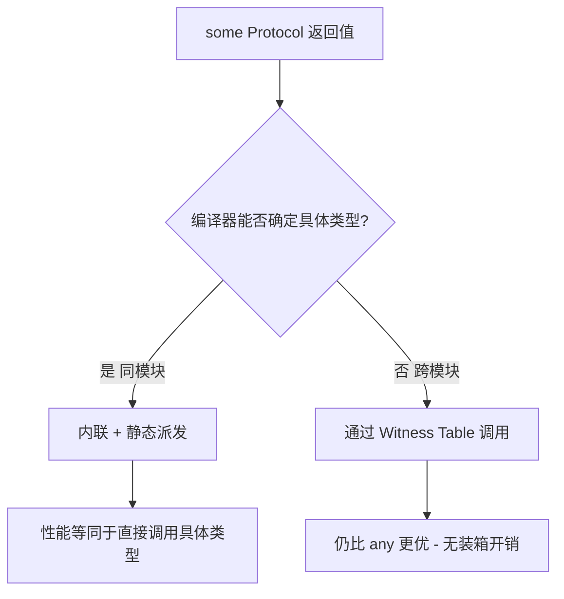
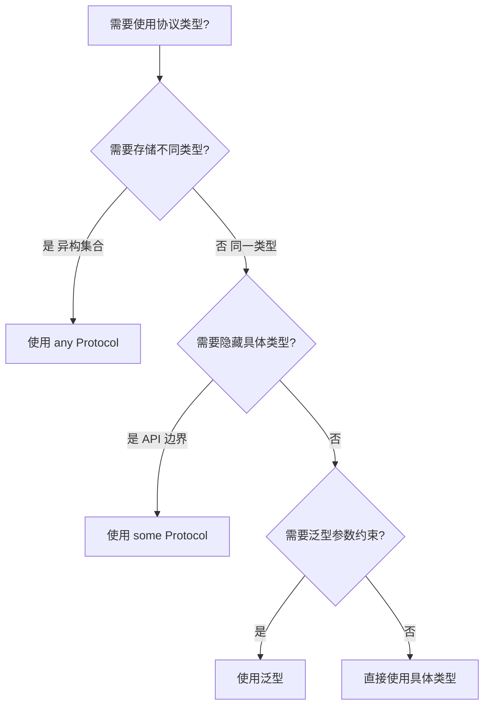
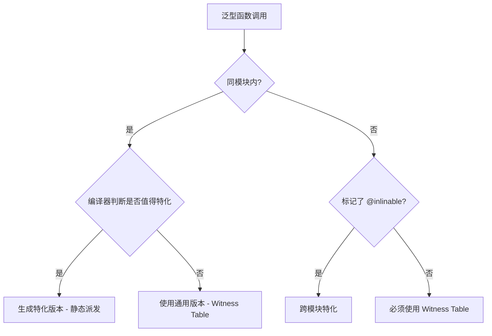
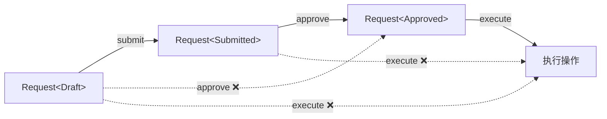

# 高级泛型与类型系统详细解析

> **核心结论**：Swift 的高级泛型特性——Opaque Types（`some`）、Existential Types（`any`）、类型擦除、泛型特化、Conditional Conformance 和 Phantom Types——构成了一套完整的类型抽象工具箱。**理解 `some` vs `any` 的本质差异（静态派发 vs 动态派发）是写出高性能 Swift 代码的关键。**

---

## 核心结论 TL;DR

| # | 核心洞察 | 关键要点 |
|---|---------|---------|
| 1 | **`some` = 编译期确定的固定类型** | 调用者不知道具体类型，但编译器知道，可静态派发 |
| 2 | **`any` = 运行时可变的动态类型** | Existential Container 装箱，动态派发，有性能开销 |
| 3 | **类型擦除正在被 `any` 替代** | Swift 5.7+ 的 `any` 大幅简化了之前手写 AnyXxx 的模式 |
| 4 | **泛型特化是性能关键** | 编译器同模块内自动特化；跨模块需 `@inlinable` |
| 5 | **Phantom Types 实现编译期状态机** | 零运行时开销的类型安全状态转换 |

---

## 1. Opaque Types（不透明类型）

**结论先行**：`some Protocol` 表示"某个遵循协议的固定类型"——调用者不知道是什么类型，但编译器知道，因此可以进行静态派发和优化。

### 1.1 基础语法与语义

```swift
// ✅ 返回不透明类型：调用者只知道返回值遵循 Shape
protocol Shape {
    func area() -> Double
}

struct Circle: Shape {
    let radius: Double
    func area() -> Double { .pi * radius * radius }
}

struct Square: Shape {
    let side: Double
    func area() -> Double { side * side }
}

// some Shape = "返回某个固定的 Shape 类型"
func makeShape() -> some Shape {
    return Circle(radius: 5)  // 始终返回 Circle
}

let shape = makeShape()
print(shape.area())  // 78.54...

// ❌ 错误：some 要求返回类型唯一
func makeRandomShape(useCircle: Bool) -> some Shape {
    // if useCircle {
    //     return Circle(radius: 5)   // ❌ 不同的分支返回不同类型
    // } else {
    //     return Square(side: 4)     // ❌ 编译错误！
    // }
    return Circle(radius: 5)  // ✅ 必须始终返回同一类型
}
```

### 1.2 返回类型中的 some（Swift 5.1+）

```swift
// ✅ SwiftUI 中最常见的用法
import SwiftUI

struct ContentView: View {
    var body: some View {  // 返回不透明的 View 类型
        VStack {
            Text("Hello")
            Text("World")
        }
        // 实际类型是 VStack<TupleView<(Text, Text)>>
        // 但调用者只看到 some View
    }
}

// ✅ 链式调用中保持类型信息
func makeCollection() -> some Collection<Int> {
    return [1, 2, 3, 4, 5]
}

let c = makeCollection()
print(c.count)  // 5 — 编译器知道具体类型，可以优化
```

### 1.3 参数位置的 some（Swift 5.7+）

```swift
// ✅ Swift 5.7+：参数位置的 some 等价于泛型参数
func printArea(_ shape: some Shape) {
    print(shape.area())
}
// 等价于：
// func printArea<T: Shape>(_ shape: T) { print(shape.area()) }

// ✅ 多个 some 参数各自独立
func compare(_ a: some Shape, _ b: some Shape) -> Bool {
    return a.area() > b.area()
}
// 等价于：
// func compare<T: Shape, U: Shape>(_ a: T, _ b: U) -> Bool

// ⚠️ 注意：如果需要两个参数类型相同，必须用显式泛型
func samePair<T: Shape>(_ a: T, _ b: T) -> Bool {
    return a.area() == b.area()
}
```

### 1.4 some 保证类型唯一性

```swift
// ✅ some 保证类型一致性，支持类型推导链
protocol Animal {
    associatedtype Food
    func eat(_ food: Food)
}

struct Cat: Animal {
    func eat(_ food: String) { print("Cat eats \(food)") }
}

func getAnimal() -> some Animal {
    return Cat()
}

let a = getAnimal()
let b = getAnimal()
// type(of: a) == type(of: b) 始终为 true
// 编译器可以推断 a.Food == b.Food == String
```

### 1.5 some 与编译器优化



---

## 2. Existential Types（存在类型）

**结论先行**：`any Protocol` 表示"任意遵循该协议的类型"——通过 Existential Container 装箱实现运行时多态，灵活但有性能开销。

### 2.1 基础语法（Swift 5.6+）

```swift
// ✅ Swift 5.6+：显式 any 标记存在类型
let shapes: [any Shape] = [Circle(radius: 3), Square(side: 4)]

for shape in shapes {
    print(shape.area())  // 动态派发
}

// ✅ 函数参数中使用 any
func printAllAreas(_ shapes: [any Shape]) {
    for shape in shapes {
        print(shape.area())
    }
}

// ❌ Swift 5.6+ 不加 any 会有警告/错误
// let shapes: [Shape] = [...]  // 需要改为 [any Shape]
```

### 2.2 Existential Container 内存布局

```swift
// Existential Container 的内存结构：
// ┌─────────────────────────────┐
// │  Inline Buffer (3 words)    │ ← 小类型直接内联存储
// │  24 bytes on 64-bit         │
// ├─────────────────────────────┤
// │  Metadata Pointer (1 word)  │ ← 指向类型的 Value Witness Table
// ├─────────────────────────────┤
// │  Protocol Witness Table     │ ← 指向协议方法实现
// │  (1 word per protocol)      │
// └─────────────────────────────┘
// 总计：5 words = 40 bytes（单协议约束）

// 小类型（<= 3 words）内联存储
struct SmallShape: Shape {
    let x: Double  // 1 word
    func area() -> Double { x * x }
}

// 大类型（> 3 words）堆分配
struct LargeShape: Shape {
    let a, b, c, d: Double  // 4 words > 3 words
    func area() -> Double { a * b }
}

// ✅ 使用 any 时编译器自动处理装箱
let s1: any Shape = SmallShape(x: 3)  // 内联存储
let s2: any Shape = LargeShape(a: 1, b: 2, c: 3, d: 4)  // 堆分配
```

### 2.3 any vs some 的根本区别

```swift
// ✅ some：编译期固定类型（Reverse Generic）
func process1(_ shape: some Shape) {
    // 编译器知道 shape 的具体类型
    // 可以内联、静态派发
    print(shape.area())
}

// ✅ any：运行时动态类型（Existential）
func process2(_ shape: any Shape) {
    // 编译器不知道具体类型
    // 通过 Witness Table 动态派发
    print(shape.area())
}

// 关键区别：some 不能存异构集合
// let shapes: [some Shape] = [Circle(radius: 1), Square(side: 2)]  // ❌

// any 可以存异构集合
let shapes: [any Shape] = [Circle(radius: 1), Square(side: 2)]  // ✅
```

| 维度 | `some Protocol` | `any Protocol` |
|------|----------------|----------------|
| **类型身份** | 编译期固定一种类型 | 运行时可以是任意类型 |
| **派发方式** | 静态派发（可内联） | 动态派发（Witness Table） |
| **内存布局** | 与具体类型一致 | Existential Container（40 bytes+） |
| **异构集合** | ❌ 不支持 | ✅ 支持 |
| **性能** | 高（零开销抽象） | 较低（装箱 + 间接调用） |
| **使用场景** | API 返回值、单态参数 | 异构集合、运行时多态 |

### 2.4 性能对比

```swift
// 性能测试：some vs any
// 100万次调用

func sumAreas_some<S: Shape>(_ shapes: [S]) -> Double {
    // 编译器为具体类型特化，可内联 area()
    return shapes.reduce(0) { $0 + $1.area() }
}

func sumAreas_any(_ shapes: [any Shape]) -> Double {
    // 每次 area() 调用都经过 Witness Table
    return shapes.reduce(0) { $0 + $1.area() }
}

// 典型性能差异：some 版本快 2-5x
// 原因：静态派发 + 内联 + 无装箱
```

### 2.5 决策指南



---

## 3. 类型擦除（Type Erasure）

**结论先行**：类型擦除通过隐藏具体类型信息，让带 associated type 的协议可以用作"值类型"。Swift 5.7+ 的 `any` 已大幅简化此需求，但理解底层原理仍然重要。

### 3.1 为什么需要类型擦除

```swift
// 问题：带 associated type 的协议不能直接用作类型
protocol Publisher {
    associatedtype Output
    associatedtype Failure: Error
    
    func subscribe<S: Subscriber>(subscriber: S)
        where S.Input == Output, S.Failure == Failure
}

// ❌ Swift 5.6 前无法这样写
// var publishers: [Publisher] = []  // 编译错误

// ✅ 解决方案：类型擦除
// Combine 框架的 AnyPublisher<Output, Failure>
```

### 3.2 标准库中的类型擦除

```swift
// ✅ AnyHashable — 擦除 Hashable 的具体类型
let dict: [AnyHashable: Any] = [
    1: "Int",
    "key": "String",
    true: "Bool"
]

// ✅ AnySequence — 擦除 Sequence 的具体类型
func makeSequence() -> AnySequence<Int> {
    let array = [1, 2, 3]
    return AnySequence(array)
}

// ✅ AnyCollection — 擦除 Collection
func makeCollection() -> AnyCollection<String> {
    let set: Set<String> = ["a", "b", "c"]
    return AnyCollection(set)
}
```

### 3.3 自定义类型擦除：三种模式

#### 模式 1：Wrapper（包装器模式）

```swift
// ✅ Wrapper 模式：最传统的类型擦除
protocol Drawable {
    associatedtype Canvas
    func draw(on canvas: Canvas)
}

// 类型擦除包装器
struct AnyDrawable<Canvas> {
    private let _draw: (Canvas) -> Void
    
    init<D: Drawable>(_ drawable: D) where D.Canvas == Canvas {
        _draw = drawable.draw
    }
    
    func draw(on canvas: Canvas) {
        _draw(canvas)
    }
}

struct CircleDrawable: Drawable {
    func draw(on canvas: CGContext) {
        // 绘制圆形
    }
}

let drawable: AnyDrawable<CGContext> = AnyDrawable(CircleDrawable())
```

#### 模式 2：Closure（闭包捕获模式）

```swift
// ✅ Closure 模式：更轻量的类型擦除
protocol DataStore {
    associatedtype Model
    func save(_ model: Model) throws
    func load(id: String) -> Model?
}

struct AnyDataStore<Model> {
    private let _save: (Model) throws -> Void
    private let _load: (String) -> Model?
    
    init<Store: DataStore>(_ store: Store) where Store.Model == Model {
        _save = store.save
        _load = store.load
    }
    
    func save(_ model: Model) throws { try _save(model) }
    func load(id: String) -> Model? { _load(id) }
}
```

#### 模式 3：Box 抽象基类模式

```swift
// ✅ Box 模式：用于需要保持引用语义的场景
private class _AnyAnimalBoxBase<Food> {
    func eat(_ food: Food) { fatalError("Abstract") }
}

private class _AnyAnimalBox<A: Animal>: _AnyAnimalBoxBase<A.Food> {
    let base: A
    init(_ base: A) { self.base = base }
    override func eat(_ food: A.Food) { base.eat(food) }
}

struct AnyAnimal<Food> {
    private let box: _AnyAnimalBoxBase<Food>
    
    init<A: Animal>(_ animal: A) where A.Food == Food {
        box = _AnyAnimalBox(animal)
    }
    
    func eat(_ food: Food) { box.eat(food) }
}
```

### 3.4 Swift 5.7+ 的 `any` 如何简化类型擦除

```swift
// ✅ Swift 5.7+ 大幅简化
// 之前需要手写 AnyDrawable
let drawables_old: [AnyDrawable<CGContext>] = [...]

// 之后直接用 any（对于不含 associated type 的协议）
let shapes: [any Shape] = [Circle(radius: 3), Square(side: 4)]

// 对于含 associated type 的协议，配合 Primary Associated Types
let publishers: [any Publisher<Int, Never>] = [...]  // Swift 5.7+

// ⚠️ 但 any 有性能开销，高频调用仍建议用泛型
```

### 3.5 Wrapper vs Closure 模式对比

| 维度 | Wrapper 模式 | Closure 模式 | Box 基类模式 |
|------|-------------|-------------|-------------|
| **实现复杂度** | 中等 | 低 | 高 |
| **类型安全** | ✅ 完整 | ✅ 完整 | ✅ 完整 |
| **值语义** | ✅ | ✅ | ❌ 引用语义 |
| **可调试性** | 中等 | 差（闭包难以调试） | 好 |
| **适用场景** | 通用场景 | 方法少的协议 | 需要继承层次 |

---

## 4. 泛型特化（Generic Specialization）

**结论先行**：泛型特化是 Swift 编译器最重要的优化之一——为已知类型生成专用代码，消除 Witness Table 开销，达到与手写具体类型相同的性能。

### 4.1 编译器自动特化

```swift
// ✅ 同模块内：编译器自动特化
func add<T: Numeric>(_ a: T, _ b: T) -> T {
    return a + b
}

let result = add(1, 2)       // 编译器生成 add_Int 特化版本
let result2 = add(1.5, 2.5)  // 编译器生成 add_Double 特化版本

// 特化后的代码等价于：
// func add_Int(_ a: Int, _ b: Int) -> Int { return a + b }
// func add_Double(_ a: Double, _ b: Double) -> Double { return a + b }
```

### 4.2 @_specialize 属性

```swift
// ✅ @_specialize：显式告诉编译器为特定类型生成特化版本
@_specialize(where T == Int)
@_specialize(where T == Double)
public func fastAdd<T: Numeric>(_ a: T, _ b: T) -> T {
    return a + b
}

// ⚠️ @_specialize 是下划线前缀的非公开 API
// 在框架开发中用于跨模块优化
// 普通应用代码一般不需要手动使用
```

### 4.3 特化对性能的影响

```swift
// 性能对比（概念示意）
// 未特化版本的执行路径：
// 1. 查找 T 的 Witness Table
// 2. 通过 Witness Table 间接调用 + 方法
// 3. 可能涉及值的装箱/拆箱

// 特化版本的执行路径：
// 1. 直接调用 Int.+ 方法（内联后甚至变成 ADD 指令）

// 典型加速比：3-10x（取决于操作复杂度）
```

| 场景 | 未特化 | 特化后 | 加速比 |
|------|-------|-------|-------|
| 简单算术 | ~5ns | ~0.5ns | ~10x |
| 集合操作 | ~20ns/元素 | ~5ns/元素 | ~4x |
| 协议方法调用 | ~3ns | ~1ns | ~3x |

### 4.4 跨模块特化的限制

```swift
// Module A
public func process<T: Codable>(_ value: T) -> Data {
    // 如果不标记 @inlinable，其他模块无法特化
    try! JSONEncoder().encode(value)
}

// ✅ 用 @inlinable 允许跨模块特化
@inlinable
public func processInlinable<T: Codable>(_ value: T) -> Data {
    try! JSONEncoder().encode(value)
}

// Module B
import ModuleA
let data = processInlinable(42)  // 编译器可以为 Int 生成特化版本
```

### 4.5 与 C++ 模板实例化的对比

| 维度 | Swift 泛型特化 | C++ 模板实例化 |
|------|--------------|--------------|
| **触发时机** | 编译器按需优化 | 每次使用必然实例化 |
| **非特化回退** | 有通用版本（Witness Table） | 无回退，必须实例化 |
| **代码膨胀** | 可控（编译器决策） | 可能严重（每个类型一份） |
| **跨模块** | 需 `@inlinable` | 头文件自动可用 |
| **链接时优化** | WMO 可跨文件特化 | LTO 可跨 TU 去重 |



---

## 5. Conditional Conformance 高级用法

**结论先行**：Conditional Conformance 让泛型类型在元素满足特定协议时，自动获得更丰富的能力——这是 Swift 标准库设计的基石。

### 5.1 标准库中的条件一致性

```swift
// ✅ Array<Element>: Equatable when Element: Equatable
let a = [1, 2, 3]
let b = [1, 2, 3]
a == b  // true ✅ 因为 Int: Equatable

// ✅ Optional<Wrapped>: Hashable when Wrapped: Hashable
let dict: [Int?: String] = [1: "one", nil: "none"]  // ✅

// ✅ Array<Element>: Codable when Element: Codable
let data = try! JSONEncoder().encode([1, 2, 3])  // ✅ [Int]: Codable
```

### 5.2 自定义条件一致性

```swift
// ✅ 自定义泛型类型的条件一致性
struct Pair<First, Second> {
    let first: First
    let second: Second
}

// 当两个元素都 Equatable 时，Pair 也 Equatable
extension Pair: Equatable where First: Equatable, Second: Equatable {
    static func == (lhs: Pair, rhs: Pair) -> Bool {
        return lhs.first == rhs.first && lhs.second == rhs.second
    }
}

// 当两个元素都 Hashable 时，Pair 也 Hashable
extension Pair: Hashable where First: Hashable, Second: Hashable {
    func hash(into hasher: inout Hasher) {
        hasher.combine(first)
        hasher.combine(second)
    }
}

// 当两个元素都 Codable 时，Pair 也 Codable
extension Pair: Codable where First: Codable, Second: Codable { }

let p1 = Pair(first: 1, second: "a")
let p2 = Pair(first: 1, second: "a")
p1 == p2  // true ✅
```

### 5.3 嵌套条件一致性

```swift
// ✅ 嵌套泛型的条件一致性层层传递
// Array<Pair<Int, String>>: Equatable
// 因为 Pair<Int, String>: Equatable（Int: Equatable, String: Equatable）
// 因为 Array<T>: Equatable when T: Equatable

let pairs1 = [Pair(first: 1, second: "a"), Pair(first: 2, second: "b")]
let pairs2 = [Pair(first: 1, second: "a"), Pair(first: 2, second: "b")]
pairs1 == pairs2  // true ✅ 嵌套条件一致性自动推导

// ✅ Optional<Array<Pair<Int, String>>>: Equatable
// 逐层推导：Int ✅ → String ✅ → Pair ✅ → Array ✅ → Optional ✅
let opt1: [Pair<Int, String>]? = pairs1
let opt2: [Pair<Int, String>]? = pairs2
opt1 == opt2  // true ✅
```

### 5.4 条件一致性与类型擦除的结合

```swift
// ✅ 条件一致性让类型擦除更自然
struct AnyEquatableBox {
    private let _isEqual: (Any) -> Bool
    private let value: Any
    
    init<T: Equatable>(_ value: T) {
        self.value = value
        self._isEqual = { other in
            guard let otherT = other as? T else { return false }
            return value == otherT
        }
    }
    
    func isEqual(to other: AnyEquatableBox) -> Bool {
        return _isEqual(other.value)
    }
}

// 标准库的 AnyHashable 就是类似实现
let h1 = AnyHashable(42)
let h2 = AnyHashable(42)
h1 == h2  // true
```

---

## 6. 高级模式

**结论先行**：Phantom Types、递归约束、类型级编程和 Result Builders 与泛型的结合，展示了 Swift 类型系统的表达力——将业务规则编码为类型约束，让编译器帮你检查正确性。

### 6.1 Phantom Types（幻影类型）

```swift
// ✅ Phantom Type：类型参数不在运行时使用，仅用于编译期约束
enum Locked {}
enum Unlocked {}

struct Door<State> {
    let name: String
}

// 只有 Unlocked 的门可以进入
extension Door where State == Unlocked {
    func enter() {
        print("Entering through \(name)")
    }
}

// 只有 Locked 的门可以解锁
extension Door where State == Locked {
    func unlock() -> Door<Unlocked> {
        print("Unlocking \(name)")
        return Door<Unlocked>(name: name)
    }
}

// 只有 Unlocked 的门可以上锁
extension Door where State == Unlocked {
    func lock() -> Door<Locked> {
        print("Locking \(name)")
        return Door<Locked>(name: name)
    }
}

let lockedDoor = Door<Locked>(name: "Front Door")
// lockedDoor.enter()  // ❌ 编译错误！Locked 状态无法 enter
let unlockedDoor = lockedDoor.unlock()  // ✅ Locked → Unlocked
unlockedDoor.enter()  // ✅ Unlocked 状态可以 enter
```

**Phantom Types 的应用场景**：

```swift
// ✅ 类型安全的单位系统
enum Meters {}
enum Kilometers {}
enum Seconds {}

struct Measurement<Unit> {
    let value: Double
}

// 只允许同单位相加
func + <U>(lhs: Measurement<U>, rhs: Measurement<U>) -> Measurement<U> {
    return Measurement(value: lhs.value + rhs.value)
}

let d1 = Measurement<Meters>(value: 100)
let d2 = Measurement<Meters>(value: 200)
let d3 = d1 + d2  // ✅ 300 米

let t1 = Measurement<Seconds>(value: 10)
// let bad = d1 + t1  // ❌ 编译错误：Meters ≠ Seconds
```

### 6.2 泛型约束中的递归

```swift
// ✅ 递归约束：类型引用自身
protocol TreeNode {
    associatedtype Child: TreeNode
    var children: [Child] { get }
}

// ✅ 实际应用：JSON 值类型
indirect enum JSON {
    case null
    case bool(Bool)
    case number(Double)
    case string(String)
    case array([JSON])         // 递归引用自身
    case object([String: JSON]) // 递归引用自身
}

// ✅ 递归泛型约束
protocol Comparable2 {
    // Self 约束是隐式递归
    static func < (lhs: Self, rhs: Self) -> Bool
}
```

### 6.3 类型级编程技巧

```swift
// ✅ 类型级别的状态机
protocol RequestState {}
enum Draft: RequestState {}
enum Submitted: RequestState {}
enum Approved: RequestState {}

struct Request<State: RequestState> {
    let id: String
    let content: String
}

extension Request where State == Draft {
    func submit() -> Request<Submitted> {
        return Request<Submitted>(id: id, content: content)
    }
}

extension Request where State == Submitted {
    func approve() -> Request<Approved> {
        return Request<Approved>(id: id, content: content)
    }
}

extension Request where State == Approved {
    func execute() {
        print("Executing approved request: \(id)")
    }
}

let draft = Request<Draft>(id: "001", content: "Deploy")
let submitted = draft.submit()
let approved = submitted.approve()
approved.execute()  // ✅

// draft.approve()  // ❌ 编译错误：Draft 不能直接 approve
// submitted.execute()  // ❌ 编译错误：Submitted 不能直接 execute
```



### 6.4 Result Builders 与泛型的结合

```swift
// ✅ Result Builder 配合泛型
@resultBuilder
struct ArrayBuilder<Element> {
    static func buildBlock(_ components: Element...) -> [Element] {
        return components
    }
    
    static func buildOptional(_ component: [Element]?) -> [Element] {
        return component ?? []
    }
    
    static func buildEither(first component: [Element]) -> [Element] {
        return component
    }
    
    static func buildEither(second component: [Element]) -> [Element] {
        return component
    }
}

func buildArray<T>(@ArrayBuilder<T> _ builder: () -> [T]) -> [T] {
    return builder()
}

let numbers = buildArray {
    1
    2
    3
}
// [1, 2, 3]
```

---

## 7. 最佳实践

| # | 实践 | 说明 |
|---|------|------|
| 1 | **默认用 `some`，需要异构时才用 `any`** | `some` 性能远优于 `any` |
| 2 | **善用 Conditional Conformance** | 让泛型类型自动获得能力，减少手动实现 |
| 3 | **用 Phantom Types 编码业务规则** | 编译期捕获状态转换错误 |
| 4 | **标记 `@inlinable` 允许跨模块特化** | 框架的核心泛型函数应该可被特化 |
| 5 | **避免过度使用 `any`** | Existential Container 有 40 bytes 开销 + 动态派发 |
| 6 | **优先用 `any`/Primary Associated Types 替代手写类型擦除** | Swift 5.7+ 已大幅简化 |
| 7 | **理解 WMO 对泛型特化的影响** | Whole Module Optimization 可跨文件特化 |

---

## 8. 常见陷阱

### 陷阱 1：混淆 some 和 any

```swift
// ❌ 错误：用 some 存储异构集合
// let shapes: [some Shape] = [Circle(radius: 1), Square(side: 2)]  // 编译错误

// ✅ 修复：异构集合用 any
let shapes: [any Shape] = [Circle(radius: 1), Square(side: 2)]

// ❌ 错误：对性能敏感的代码用 any
func hotPath(_ shapes: [any Shape]) -> Double {  // 每次调用都动态派发
    return shapes.reduce(0) { $0 + $1.area() }
}

// ✅ 修复：用泛型保持静态派发
func hotPath<S: Shape>(_ shapes: [S]) -> Double {
    return shapes.reduce(0) { $0 + $1.area() }
}
```

### 陷阱 2：any 类型无法直接传给泛型参数

```swift
// ❌ 常见错误
func process<T: Shape>(_ shape: T) { }

let shape: any Shape = Circle(radius: 3)
// process(shape)  // ❌ 编译错误：any Shape 不满足 T: Shape

// ✅ 修复方案 1：用 any 版本的函数
func processAny(_ shape: any Shape) { }

// ✅ 修复方案 2：打开存在类型（Swift 5.7+）
func callProcess(_ shape: any Shape) {
    // 编译器自动"打开"existential
    processOpened(shape)
}
func processOpened(_ shape: some Shape) {
    print(shape.area())
}
```

### 陷阱 3：Existential Container 的隐形开销

```swift
// ❌ 陷阱：看似简单的代码有 40 bytes/element 开销
var shapes: [any Shape] = []
for _ in 0..<100_000 {
    shapes.append(Circle(radius: 1))  // 每个元素 40 bytes（Existential Container）
}
// 内存：100,000 × 40 = 4 MB

// ✅ 优化：如果所有元素类型相同，用具体类型
var circles: [Circle] = []
for _ in 0..<100_000 {
    circles.append(Circle(radius: 1))  // 每个元素 8 bytes
}
// 内存：100,000 × 8 = 0.8 MB — 节省 80%
```

### 陷阱 4：@inlinable 暴露实现细节

```swift
// ⚠️ @inlinable 的代价：实现成为 ABI 的一部分
@inlinable
public func calculate<T: Numeric>(_ value: T) -> T {
    return value * value  // 这个实现被固化，无法在不破坏 ABI 的情况下修改
}

// ✅ 策略：只对稳定的、简单的泛型函数使用 @inlinable
// 复杂逻辑可以调用非 inlinable 的内部函数
@inlinable
public func process<T: Codable>(_ value: T) -> Data {
    return _processImpl(value)  // 实际逻辑在非 inlinable 函数中
}

@usableFromInline
internal func _processImpl<T: Codable>(_ value: T) -> Data {
    // 可以自由修改实现
    try! JSONEncoder().encode(value)
}
```

---

## 9. 面试考点

### 考题 1：解释 `some` 和 `any` 的区别及各自适用场景

**参考答案**：

`some Protocol`（Opaque Type）：
- 表示一个**编译期固定的、遵循协议的具体类型**
- 调用者不知道具体类型，但编译器知道
- **静态派发**，可内联优化，零额外开销
- 不支持异构集合

`any Protocol`（Existential Type）：
- 表示**运行时可以是任意遵循协议的类型**
- 通过 Existential Container（40 bytes）装箱
- **动态派发**，通过 Protocol Witness Table
- 支持异构集合

适用场景：`some` 用于 API 返回值和不需要异构的参数；`any` 用于需要存储不同类型的集合。

**追问**：Existential Container 的内存布局是什么？为什么是 40 bytes？

> 5 个 word（64 位系统 40 bytes）：3 word inline buffer（存小值类型，大类型堆分配）+ 1 word Value Witness Table 指针 + 1 word Protocol Witness Table 指针。多协议约束时 PWT 指针会增加。

### 考题 2：什么是泛型特化？跨模块如何启用？

**参考答案**：

泛型特化是编译器为已知具体类型生成专用代码的优化过程。例如 `func add<T: Numeric>(_ a: T, _ b: T) -> T` 在调用 `add(1, 2)` 时，编译器生成等价于 `func add_Int(_ a: Int, _ b: Int) -> Int` 的代码，消除 Witness Table 查找和间接调用的开销。

同模块内编译器自动特化。跨模块需要：
1. 标记函数 `@inlinable` 暴露实现
2. 或使用 `@_specialize(where T == Int)` 预生成特化版本
3. 开启 Whole Module Optimization (WMO)

**追问**：`@inlinable` 有什么代价？

> 实现细节成为模块 ABI 的一部分，后续修改实现可能破坏二进制兼容性。建议只对稳定的简单函数使用，复杂逻辑通过 `@usableFromInline internal` 函数间接调用。

### 考题 3：什么是 Phantom Types？给一个实际应用场景

**参考答案**：

Phantom Types 是类型参数只出现在泛型声明中，不在运行时数据中使用的技术。其目的是在编译期编码状态信息，让类型系统帮你检查状态转换的合法性。

实际场景——类型安全的 HTTP 请求构建器：

```swift
enum NotSent {}
enum Sent {}
struct HTTPRequest<State> { let url: URL }
extension HTTPRequest where State == NotSent {
    func send() -> HTTPRequest<Sent> { /* ... */ }
}
extension HTTPRequest where State == Sent {
    func parseResponse() -> Data { /* ... */ }
}
```

这样编译器保证：未发送的请求不能解析响应，已发送的请求不能重复发送。零运行时开销。

**追问**：Phantom Types 和 enum 状态机相比有什么优劣？

> Phantom Types 在编译期检查状态转换，零运行时开销，但状态数量固定、不能运行时动态切换。Enum 状态机在运行时检查，更灵活但可能遗漏非法转换。对于状态确定的 API 设计优选 Phantom Types。

---

## 10. 参考资源

| 资源 | 链接 |
|------|------|
| Swift 官方文档 — Opaque and Boxed Types | https://docs.swift.org/swift-book/documentation/the-swift-programming-language/opaquetypes |
| SE-0335: Introduce existential any | https://github.com/apple/swift-evolution/blob/main/proposals/0335-existential-any.md |
| SE-0244: Opaque Result Types | https://github.com/apple/swift-evolution/blob/main/proposals/0244-opaque-result-types.md |
| SE-0346: Lightweight same-type requirements | https://github.com/apple/swift-evolution/blob/main/proposals/0346-light-weight-same-type-syntax.md |
| WWDC 2022 — Design protocol interfaces in Swift | https://developer.apple.com/videos/play/wwdc2022/110353/ |
| Understanding Swift Performance (WWDC 2016) | https://developer.apple.com/videos/play/wwdc2016/416/ |
| 泛型基础与约束 | `./泛型基础与约束_详细解析.md` |
