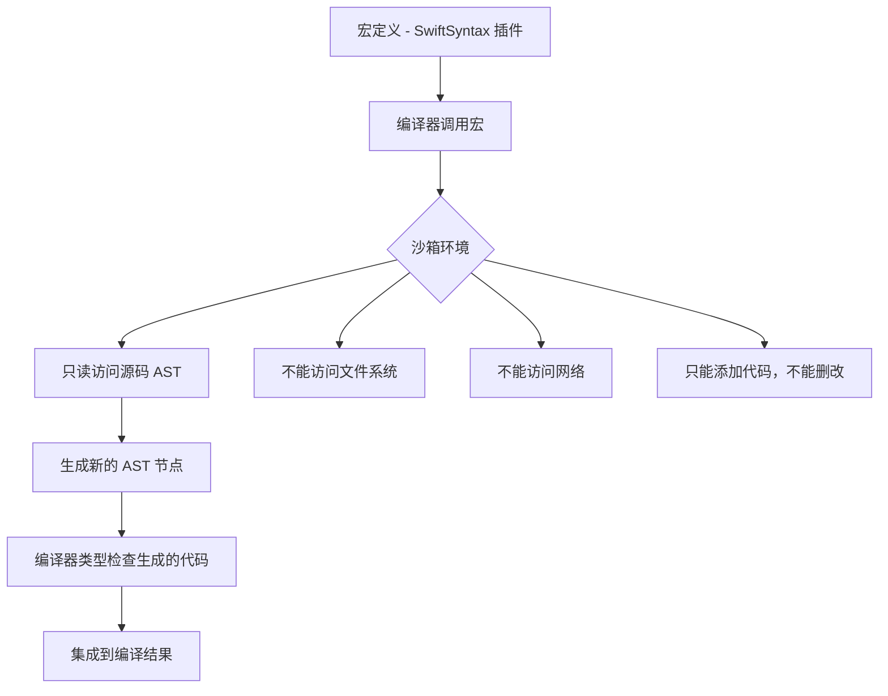
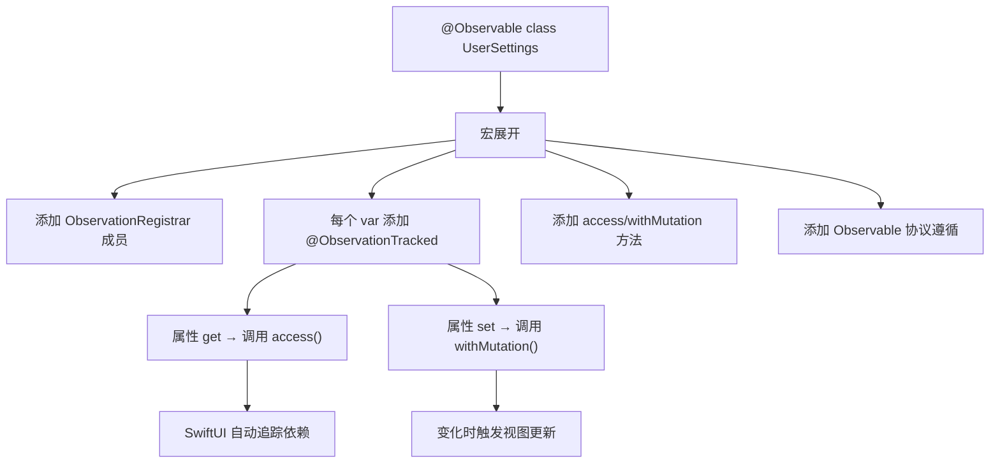
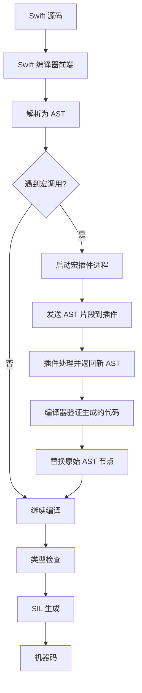

# Macros 与编译期能力详细解析

> **核心结论**：Swift Macros（Swift 5.9+）是基于 SwiftSyntax 的编译器插件，在编译期对 AST 进行类型安全的代码生成与变换。宏系统在沙箱中运行，只能添加代码不能删除或修改现有代码，从根本上保证了安全性。

---

## 核心结论 TL;DR

| 维度 | 核心洞察 |
|------|---------|
| **宏的本质** | 编译期 AST 变换插件，接收语法树节点，返回新的语法树节点 |
| **安全保证** | 沙箱执行、只能添加代码、类型检查、不能访问文件系统或网络 |
| **两大分类** | Freestanding（`#macro`）独立使用 + Attached（`@macro`）附加到声明 |
| **核心依赖** | SwiftSyntax 库提供 AST 解析、遍历、生成能力 |
| **vs 代码生成** | 宏集成在编译流程中，有类型检查；代码生成是预处理步骤，无类型安全 |

---

## 1. Swift 宏系统概述

### 1.1 Swift 5.9+ 引入宏的动机

**结论先行**：宏填补了 Swift 在「编译期代码生成」领域的空白，替代了以往依赖外部代码生成工具（如 Sourcery）或运行时反射的做法。

**引入宏之前的痛点**：
- 大量样板代码（Codable 的 CodingKeys、Equatable 的实现等）
- 依赖外部代码生成工具，构建流程复杂
- 运行时反射性能差且类型不安全
- 协议默认实现无法访问具体类型的存储属性

```swift
// ❌ 没有宏之前：手写大量样板代码
class UserModel {
    var name: String = ""
    var age: Int = 0
    
    // 手动实现 KVO 兼容（数十行重复代码）
    // 手动实现 Codable
    // 手动实现 description
}

// ✅ 有宏之后：一行搞定
@Observable
class UserModel {
    var name: String = ""
    var age: Int = 0
}
```

### 1.2 宏 vs 代码生成 vs 协议默认实现

| 方案 | 类型安全 | 集成度 | 可调试 | 适用场景 |
|------|---------|--------|--------|---------|
| **Swift Macros** | 编译期检查 | 编译器原生 | Xcode 支持展开 | 样板代码消除、DSL |
| **Sourcery** | 生成后检查 | 需构建脚本 | 查看生成文件 | 复杂模板、跨模块 |
| **协议默认实现** | 编译期检查 | 语言原生 | 标准调试 | 通用行为抽象 |
| **C 预处理器宏** | 无 | 预处理阶段 | 困难 | **不推荐** |

### 1.3 宏的安全保证



**安全规则**：
1. **只增不删** — 宏只能添加新的声明、表达式，不能修改或删除已有代码
2. **沙箱隔离** — 宏在独立进程中运行，无法访问文件系统或网络
3. **类型检查** — 宏生成的代码会经过完整的类型检查
4. **可审计** — Xcode 中可以「Expand Macro」查看宏展开结果

---

## 2. 宏的分类

### 2.1 Freestanding Macros（独立宏）

独立宏以 `#` 开头，可在表达式或声明位置使用。

#### Expression Macro

```swift
// ✅ 定义：表达式宏 — 返回一个表达式
@freestanding(expression)
public macro stringify<T>(_ value: T) -> (T, String) = #externalMacro(
    module: "MyMacros",
    type: "StringifyMacro"
)

// 使用
let (result, code) = #stringify(2 + 3)
print(result) // 5
print(code)   // "2 + 3"

// ✅ 更实用的例子：编译期 URL 验证
@freestanding(expression)
public macro URL(_ string: String) -> URL = #externalMacro(
    module: "MyMacros",
    type: "URLMacro"
)

let url = #URL("https://apple.com")  // 编译期验证 URL 格式
// let bad = #URL("not a url")       // 编译错误！
```

#### Declaration Macro

```swift
// ✅ 声明宏 — 生成新的声明
@freestanding(declaration, names: named(warning))
public macro warning(_ message: String) = #externalMacro(
    module: "MyMacros",
    type: "WarningMacro"
)

// 使用
#warning("TODO: 实现此功能")  // 标准库已有此宏
```

### 2.2 Attached Macros（附加宏）

附加宏以 `@` 开头，附加到已有声明上。

```swift
// 各种角色的附加宏
@attached(peer)            // 在同级添加新声明
@attached(member)          // 在类型内部添加成员
@attached(accessor)        // 为属性添加 get/set
@attached(memberAttribute) // 为所有成员添加属性
@attached(conformance)     // 添加协议遵循（Swift 5.9 为 extension）
```

| 角色 | 作用位置 | 典型用途 |
|------|---------|---------|
| `@peer` | 声明旁边 | 生成 async 版本、生成 mock |
| `@member` | 类型内部 | 添加 init、添加 CodingKeys |
| `@accessor` | 属性 | 添加 get/set/willSet/didSet |
| `@memberAttribute` | 类型的每个成员 | 批量添加 `@objc` 等属性 |
| `@conformance`/`@extension` | 类型 | 自动添加协议遵循 |

#### @Observable 宏解析

```swift
// ✅ 使用 @Observable（Swift 5.9+ / iOS 17+）
@Observable
class UserSettings {
    var theme: String = "light"
    var fontSize: Int = 14
}

// 编译器展开后等价于：
class UserSettings: Observable {
    @ObservationTracked var theme: String = "light"
    @ObservationTracked var fontSize: Int = 14
    
    // @Observable 宏生成的成员
    @ObservationIgnored private let _$observationRegistrar = ObservationRegistrar()
    
    internal nonisolated func access<Member>(
        keyPath: KeyPath<UserSettings, Member>
    ) {
        _$observationRegistrar.access(self, keyPath: keyPath)
    }
    
    internal nonisolated func withMutation<Member, MutationResult>(
        keyPath: KeyPath<UserSettings, Member>,
        _ mutation: () throws -> MutationResult
    ) rethrows -> MutationResult {
        try _$observationRegistrar.withMutation(of: self, keyPath: keyPath, mutation)
    }
}
```



---

## 3. SwiftSyntax 基础

### 3.1 AST（抽象语法树）概念

**结论先行**：SwiftSyntax 将 Swift 源码解析为树状结构，每个语法元素（函数声明、表达式、类型标注等）都是树的节点。宏开发就是操作这棵树。

```swift
// 源码
func greet(_ name: String) -> String {
    return "Hello, \(name)!"
}

// AST 结构（简化）
// FunctionDeclSyntax
// ├── name: "greet"
// ├── signature: FunctionSignatureSyntax
// │   ├── parameterClause: FunctionParameterClauseSyntax
// │   │   └── parameters: [FunctionParameterSyntax]
// │   │       └── firstName: "_", secondName: "name", type: "String"
// │   └── returnClause: ReturnClauseSyntax
// │       └── type: "String"
// └── body: CodeBlockSyntax
//     └── statements: [ReturnStmtSyntax]
```

### 3.2 SwiftSyntax 库结构

```swift
import SwiftSyntax
import SwiftSyntaxMacros
import SwiftSyntaxBuilder

// 核心模块
// SwiftSyntax       — AST 节点类型定义
// SwiftParser        — 将源码解析为 AST
// SwiftSyntaxBuilder — 用 Result Builder 构建 AST
// SwiftSyntaxMacros  — 宏协议定义
```

### 3.3 语法节点遍历与修改

```swift
import SwiftSyntax

// ✅ 遍历：使用 SyntaxVisitor
class FunctionCounter: SyntaxVisitor {
    var count = 0
    
    override func visit(_ node: FunctionDeclSyntax) -> SyntaxVisitorContinueKind {
        count += 1
        return .visitChildren
    }
}

// ✅ 修改：使用 SyntaxRewriter
class PublicRewriter: SyntaxRewriter {
    override func visit(_ node: FunctionDeclSyntax) -> DeclSyntax {
        // 给所有函数添加 public 修饰符
        var modifiedNode = node
        let publicModifier = DeclModifierSyntax(name: .keyword(.public))
        modifiedNode.modifiers.append(publicModifier)
        return DeclSyntax(modifiedNode)
    }
}
```

---

## 4. 自定义宏开发

### 4.1 宏包的项目结构

```
MyMacroPackage/
├── Package.swift
├── Sources/
│   ├── MyMacros/              # 宏的实现（编译器插件）
│   │   ├── MyMacroPlugin.swift
│   │   └── StringifyMacro.swift
│   ├── MyMacroLib/            # 宏的声明（用户导入的模块）
│   │   └── Macros.swift
│   └── MyMacroClient/         # 使用示例
│       └── main.swift
└── Tests/
    └── MyMacroTests/          # 宏测试
        └── MacroTests.swift
```

```swift
// ✅ Package.swift 配置
// swift-tools-version: 5.9
import PackageDescription
import CompilerPluginSupport

let package = Package(
    name: "MyMacros",
    platforms: [.macOS(.v10_15), .iOS(.v13)],
    dependencies: [
        .package(url: "https://github.com/apple/swift-syntax.git", from: "509.0.0"),
    ],
    targets: [
        .macro(
            name: "MyMacros",
            dependencies: [
                .product(name: "SwiftSyntaxMacros", package: "swift-syntax"),
                .product(name: "SwiftCompilerPlugin", package: "swift-syntax"),
            ]
        ),
        .target(name: "MyMacroLib", dependencies: ["MyMacros"]),
        .testTarget(
            name: "MyMacroTests",
            dependencies: [
                "MyMacros",
                .product(name: "SwiftSyntaxMacrosTestSupport", package: "swift-syntax"),
            ]
        ),
    ]
)
```

### 4.2 实现一个 Expression Macro

```swift
// Sources/MyMacros/StringifyMacro.swift
import SwiftSyntax
import SwiftSyntaxMacros

public struct StringifyMacro: ExpressionMacro {
    public static func expansion(
        of node: some FreestandingMacroExpansionSyntax,
        in context: some MacroExpansionContext
    ) throws -> ExprSyntax {
        guard let argument = node.argumentList.first?.expression else {
            throw MacroError.missingArgument
        }
        
        // 返回元组：(计算结果, 源码字符串)
        return "(\(argument), \(literal: argument.description))"
    }
}

// 注册插件
import SwiftCompilerPlugin
import SwiftSyntaxMacros

@main
struct MyMacroPlugin: CompilerPlugin {
    let providingMacros: [Macro.Type] = [
        StringifyMacro.self,
    ]
}
```

### 4.3 实现一个 Attached Macro

```swift
// ✅ 自动生成 init 的宏
public struct AutoInitMacro: MemberMacro {
    public static func expansion(
        of node: AttributeSyntax,
        providingMembersOf declaration: some DeclGroupSyntax,
        in context: some MacroExpansionContext
    ) throws -> [DeclSyntax] {
        // 收集所有存储属性
        let storedProperties = declaration.memberBlock.members
            .compactMap { $0.decl.as(VariableDeclSyntax.self) }
            .filter { $0.bindings.first?.accessorBlock == nil } // 排除计算属性
        
        // 生成参数列表
        let parameters = storedProperties.compactMap { property -> String? in
            guard let name = property.bindings.first?.pattern.description,
                  let type = property.bindings.first?.typeAnnotation?.type.description else {
                return nil
            }
            return "\(name): \(type)"
        }.joined(separator: ", ")
        
        // 生成赋值语句
        let assignments = storedProperties.compactMap { property -> String? in
            guard let name = property.bindings.first?.pattern.description else { return nil }
            return "self.\(name) = \(name)"
        }.joined(separator: "\n        ")
        
        let initDecl: DeclSyntax = """
        init(\(raw: parameters)) {
            \(raw: assignments)
        }
        """
        
        return [initDecl]
    }
}

// 使用
@AutoInit
struct User {
    var name: String
    var age: Int
    var email: String
}
// 自动生成：init(name: String, age: Int, email: String)
```

### 4.4 宏测试策略

```swift
import SwiftSyntaxMacrosTestSupport
import XCTest

final class MyMacroTests: XCTestCase {
    // ✅ 使用 assertMacroExpansion 测试展开结果
    func testStringify() throws {
        assertMacroExpansion(
            """
            #stringify(2 + 3)
            """,
            expandedSource: """
            (2 + 3, "2 + 3")
            """,
            macros: ["stringify": StringifyMacro.self]
        )
    }
    
    // ✅ 测试错误诊断
    func testStringifyMissingArgument() throws {
        assertMacroExpansion(
            """
            #stringify()
            """,
            expandedSource: """
            #stringify()
            """,
            diagnostics: [
                DiagnosticSpec(message: "Missing argument", line: 1, column: 1)
            ],
            macros: ["stringify": StringifyMacro.self]
        )
    }
}
```

### 4.5 调试宏展开结果

```swift
// ✅ 方法 1：Xcode 中右键 → Expand Macro
// 可直接查看宏展开后的代码

// ✅ 方法 2：命令行编译查看
// swift build -Xswiftc -dump-macro-expansions

// ✅ 方法 3：单元测试 assertMacroExpansion
// 最推荐的方式，可持续验证宏行为

// ✅ 方法 4：使用 MacroExpansionContext 输出诊断信息
context.diagnose(Diagnostic(
    node: node,
    message: MyDiagnosticMessage(message: "调试信息", id: "debug")
))
```

---

## 5. 内置宏解析

### 5.1 @Observable 宏的展开过程

```swift
// 输入
@Observable
class Counter {
    var count = 0
    var name = "Counter"
    let id = UUID()          // let 属性不被追踪
    private var _cache: Int? // 带下划线前缀的不被追踪
}

// 展开后
class Counter: Observable {
    @ObservationTracked
    var count = 0 {
        get {
            access(keyPath: \.count)
            return _count
        }
        set {
            withMutation(keyPath: \.count) {
                _count = newValue
            }
        }
    }
    
    @ObservationTracked
    var name = "Counter" { /* 类似展开 */ }
    
    let id = UUID()           // let 不变
    private var _cache: Int?  // 保持不变
    
    @ObservationIgnored private let _$observationRegistrar = ObservationRegistrar()
    
    // 生成的辅助方法...
}
```

### 5.2 #Preview 宏

```swift
// ✅ Swift 5.9+ 的预览宏
#Preview("Counter View") {
    CounterView()
}

#Preview("Dark Mode", traits: .portrait) {
    ContentView()
        .preferredColorScheme(.dark)
}

// 展开后生成 PreviewProvider 兼容的代码
// 替代了旧的 PreviewProvider 协议写法
```

### 5.3 @Model 宏（SwiftData）

```swift
import SwiftData

// ✅ SwiftData 的核心宏
@Model
class Trip {
    var name: String
    var destination: String
    var startDate: Date
    var endDate: Date
    
    @Relationship(deleteRule: .cascade)
    var activities: [Activity] = []
}

// @Model 宏展开后：
// 1. 添加 PersistentModel 协议遵循
// 2. 为每个属性生成 get/set 访问器（持久化支持）
// 3. 生成 schema 相关代码
// 4. 添加 @Transient 属性的忽略逻辑
```

### 5.4 编译器插件架构



---

## 6. 宏的最佳实践与限制

### 6.1 适合用宏的场景

1. **消除样板代码** — 如 `@Observable`、`@Model` 自动生成属性观察/持久化代码
2. **编译期验证** — 如 `#URL` 在编译期验证 URL 格式
3. **生成协议遵循** — 自动实现 `Codable`、`Equatable` 等
4. **DSL 增强** — 配合 Result Builder 构建更强大的 DSL
5. **代码内省** — 生成基于当前类型结构的辅助代码

### 6.2 不适合用宏的场景

```swift
// ❌ 不适合：简单的代码模板（用协议扩展即可）
// ❌ 不适合：运行时动态行为（用协议+泛型）
// ❌ 不适合：跨模块代码生成（宏只能看到当前声明）
// ❌ 不适合：需要删除或修改已有代码（宏只能添加）
```

### 6.3 宏的编译时间影响

| 因素 | 影响 | 优化建议 |
|------|------|---------|
| 宏插件进程启动 | 首次编译较慢 | 合理组织宏包，减少插件数量 |
| SwiftSyntax 解析 | 中等 | 避免在宏内做复杂的 AST 遍历 |
| 生成代码量 | 增加类型检查时间 | 只生成必要代码 |
| 增量编译 | 宏变更触发重编译 | 稳定宏接口，减少变更 |

### 6.4 与 C++ 宏和模板元编程的对比

| 特性 | Swift Macros | C 预处理宏 | C++ 模板元编程 |
|------|-------------|-----------|---------------|
| **安全性** | 沙箱 + 类型检查 | 无（文本替换） | 编译期类型检查 |
| **可调试** | Xcode Expand Macro | 困难（-E 预处理） | 困难（错误信息复杂） |
| **表达力** | AST 级别操作 | 文本替换 | 图灵完备但语法晦涩 |
| **卫生性** | 宏卫生（不污染命名空间） | 非卫生 | N/A |
| **工具链** | SwiftSyntax | 无 | 无专用工具 |
| **错误提示** | 宏可发出自定义诊断 | 不友好 | 极不友好 |

```swift
// Swift 宏：安全的编译期代码生成
@AutoInit
struct Point {
    var x: Double
    var y: Double
}
// 生成的 init 经过类型检查，有清晰的错误提示
```

```cpp
// C++ 模板元编程：强大但复杂
template<typename... Args>
auto make_point(Args&&... args) {
    return Point{std::forward<Args>(args)...};
}
// 错误信息可能长达数百行
```

---

## 最佳实践

1. **宏声明和实现分离** — 声明放在用户可见的库中，实现放在 macro target 中
2. **为宏编写充分的测试** — 使用 `assertMacroExpansion` 测试正常路径和错误路径
3. **提供清晰的诊断信息** — 用 `context.diagnose` 给出有意义的错误提示
4. **最小化生成代码** — 只生成必要的代码，避免代码膨胀
5. **宏不应有副作用** — 同样的输入必须产生同样的输出（纯函数）
6. **优先考虑协议扩展** — 如果能用协议默认实现解决，不要用宏

---

## 常见陷阱

### 陷阱 1：宏只能添加代码，不能修改

```swift
// ❌ 错误期望：想让宏修改现有属性的实现
@MyMacro
var name: String = ""
// 宏不能改变 name 的默认值或类型

// ✅ 正确理解：宏通过 accessor 角色「包装」属性
// @attached(accessor) 可以为属性添加 get/set
// 但不能删除或修改属性声明本身
```

### 陷阱 2：SwiftSyntax 版本与 Swift 编译器版本绑定

```swift
// ❌ 版本不匹配会导致编译失败
// Swift 5.9 → SwiftSyntax 509.x.x
// Swift 5.10 → SwiftSyntax 510.x.x
// Swift 6.0 → SwiftSyntax 600.x.x

// ✅ 在 Package.swift 中指定正确的版本范围
.package(url: "https://github.com/apple/swift-syntax.git",
         from: "509.0.0") // 匹配你的 Swift 版本
```

### 陷阱 3：宏展开中的命名冲突

```swift
// ❌ 宏生成的代码可能与用户代码命名冲突
@AutoInit
struct Model {
    var count: Int
    var _count: Int  // 与 @Observable 生成的 _count 冲突！
}

// ✅ 使用 context.makeUniqueName() 避免冲突
let uniqueName = context.makeUniqueName("storage")
// 生成类似 __macro_local_6storagefMu_ 的唯一名称
```

### 陷阱 4：忽略宏的编译性能影响

```swift
// ❌ 在大型项目中大量使用复杂宏 → 编译时间显著增加
// 每个宏调用都需要：
// 1. 启动/通信插件进程
// 2. 解析 AST
// 3. 生成代码
// 4. 类型检查生成的代码

// ✅ 策略
// - 合并功能到单个宏（如 @Observable 一次性生成所有代码）
// - 缓存宏插件进程（编译器自动处理）
// - 监控编译时间，避免宏成为瓶颈
```

---

## 面试考点

### 考题 1：Swift Macros 和 C 预处理宏有什么本质区别？

**参考答案**：Swift Macros 操作的是类型化的 AST（抽象语法树），在沙箱中运行，生成的代码经过完整的类型检查，具有宏卫生性（不会污染命名空间）。C 预处理宏是简单的文本替换，没有类型安全，容易产生命名冲突和意外的副作用。Swift 宏只能添加代码不能修改删除，而 C 宏可以任意替换文本。

**追问**：
- Swift 宏的「沙箱」具体限制了什么？（不能访问文件系统、网络、环境变量，只能操作传入的 AST）
- 为什么说 Swift 宏是「卫生的」？（生成的标识符不会与用户代码冲突，可用 `makeUniqueName` 生成唯一名）

### 考题 2：@Observable 宏做了什么？相比 ObservableObject 有什么优势？

**参考答案**：`@Observable` 宏在编译期为每个存储属性生成访问追踪代码（`access` 和 `withMutation` 调用），添加 `ObservationRegistrar` 成员，并使类遵循 `Observable` 协议。相比 `ObservableObject`：(1) 不需要为每个属性写 `@Published`；(2) SwiftUI 按属性级别追踪变化，而非整个对象级别，减少不必要的视图刷新；(3) 是值语义追踪，性能更好。

**追问**：
- `@Observable` 如何知道哪些属性需要追踪？（`var` 存储属性被追踪，`let` 和计算属性不被追踪）
- 如何排除某个属性不被追踪？（使用 `@ObservationIgnored` 修饰）

### 考题 3：如何开发和测试一个自定义 Swift 宏？

**参考答案**：开发流程：(1) 创建 Swift Package，配置 `.macro` target 和 SwiftSyntax 依赖；(2) 在宏声明模块中用 `#externalMacro` 声明宏接口；(3) 在宏实现模块中遵循对应协议（如 `ExpressionMacro`、`MemberMacro`）实现 `expansion` 方法；(4) 注册到 `CompilerPlugin`。测试使用 `SwiftSyntaxMacrosTestSupport` 的 `assertMacroExpansion`，验证输入源码 → 展开结果的映射。

**追问**：
- Freestanding 和 Attached Macro 的区别？（`#macro` vs `@macro`，独立使用 vs 附加到声明）
- 宏可以访问其他文件的类型信息吗？（不能，宏只能看到当前传入的语法节点）

---

## 参考资源

- [Swift Evolution — SE-0382: Expression Macros](https://github.com/apple/swift-evolution/blob/main/proposals/0382-expression-macros.md)
- [Swift Evolution — SE-0389: Attached Macros](https://github.com/apple/swift-evolution/blob/main/proposals/0389-attached-macros.md)
- [Apple Documentation — Swift Macros](https://docs.swift.org/swift-book/documentation/the-swift-programming-language/macros/)
- [Apple — SwiftSyntax Documentation](https://swiftpackageindex.com/apple/swift-syntax/documentation)
- [WWDC23 — Write Swift Macros](https://developer.apple.com/videos/play/wwdc2023/10166/)
- [WWDC23 — Expand on Swift Macros](https://developer.apple.com/videos/play/wwdc2023/10167/)
