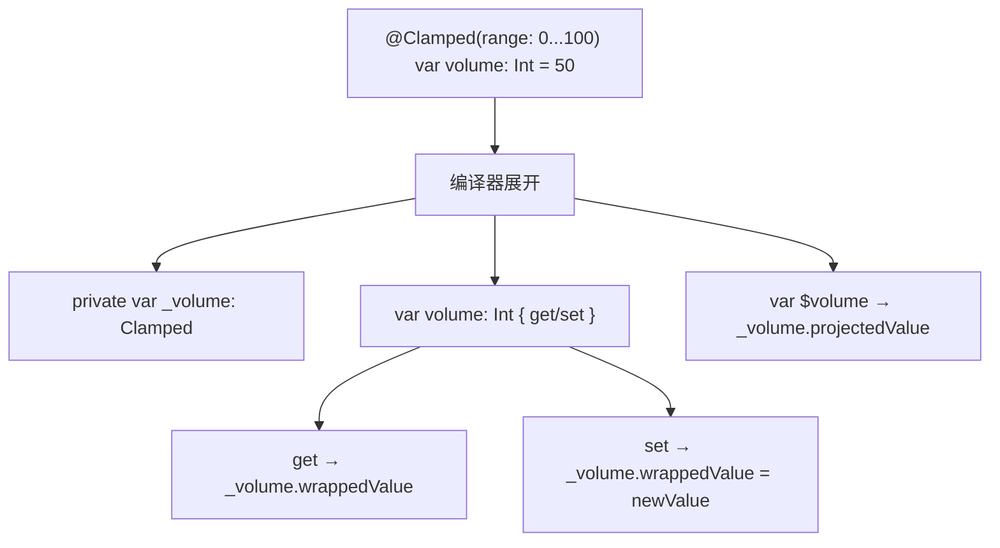
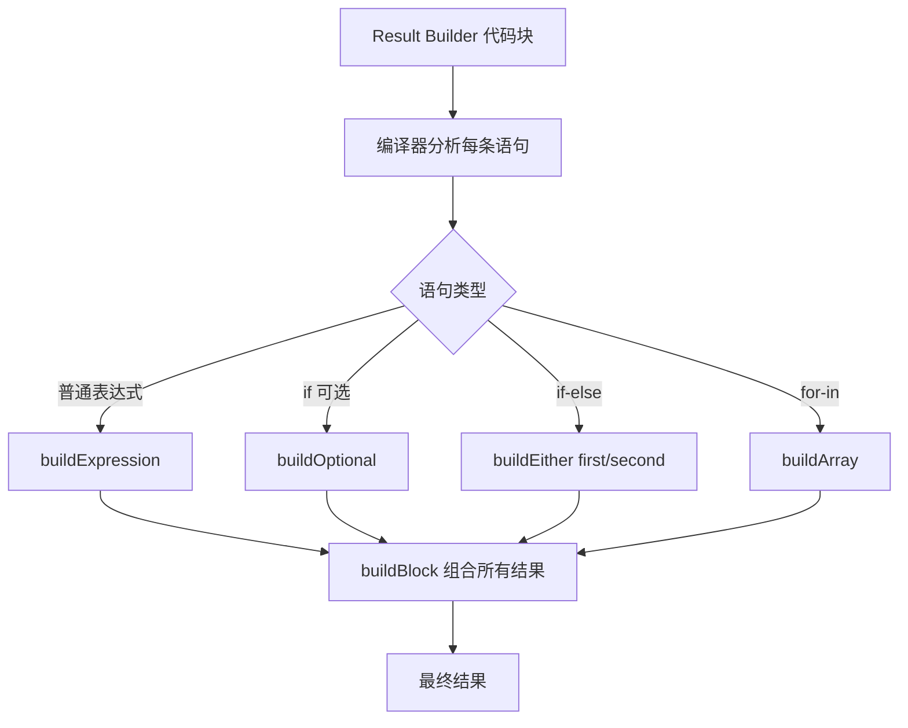

# Property Wrappers 与 Result Builders 详细解析

> **核心结论**：Property Wrappers 通过编译器展开将属性存取逻辑封装为可复用组件，Result Builders 则将命令式代码转换为声明式 DSL。两者都是 Swift 元编程能力的核心支柱，是 SwiftUI 声明式范式的基石。

---

## 核心结论 TL;DR

| 维度 | 核心洞察 |
|------|---------|
| **Property Wrapper 本质** | 编译器将 `@Wrapper var x` 展开为包含 `_x` 存储属性和计算属性的代码 |
| **projectedValue** | `$` 前缀访问投影值，如 `@State` 的 `$name` 返回 `Binding<String>` |
| **Result Builder 本质** | 编译器将代码块中的每条语句转换为 `buildBlock/buildOptional/buildEither` 调用 |
| **@ViewBuilder** | SwiftUI 的核心 Result Builder，将多个 View 声明组合为 `TupleView` |
| **DSL 能力** | Result Builder 让 Swift 可构建类型安全的 HTML/SQL/配置等领域特定语言 |

---

## 1. Property Wrappers 原理

### 1.1 @propertyWrapper 声明

**结论先行**：Property Wrapper 是一个带有 `wrappedValue` 属性的结构体/类，编译器自动将其展开为属性存取逻辑。

```swift
// ✅ 定义 Property Wrapper
@propertyWrapper
struct Clamped {
    private var value: Int
    let range: ClosedRange<Int>
    
    var wrappedValue: Int {
        get { value }
        set { value = min(max(newValue, range.lowerBound), range.upperBound) }
    }
    
    init(wrappedValue: Int, range: ClosedRange<Int>) {
        self.range = range
        self.value = min(max(wrappedValue, range.lowerBound), range.upperBound)
    }
}

// 使用
struct Player {
    @Clamped(range: 0...100) var health: Int = 100
    @Clamped(range: 0...999) var score: Int = 0
}

var player = Player()
player.health = 150
print(player.health) // 100 — 被限制在范围内
player.health = -10
print(player.health) // 0
```

### 1.2 wrappedValue 与 projectedValue（$前缀）

```swift
@propertyWrapper
struct Validated<Value> {
    private var value: Value
    private(set) var isValid: Bool = true
    let validator: (Value) -> Bool
    
    var wrappedValue: Value {
        get { value }
        set {
            value = newValue
            isValid = validator(newValue)
        }
    }
    
    // ✅ projectedValue — 通过 $ 前缀访问
    var projectedValue: Validated<Value> { self }
    
    init(wrappedValue: Value, validator: @escaping (Value) -> Bool) {
        self.value = wrappedValue
        self.validator = validator
        self.isValid = validator(wrappedValue)
    }
}

struct UserForm {
    @Validated(validator: { $0.count >= 3 })
    var username: String = ""
    
    @Validated(validator: { $0.contains("@") })
    var email: String = ""
}

var form = UserForm()
form.username = "ab"
print(form.$username.isValid)  // false — $ 访问 projectedValue
form.username = "alice"
print(form.$username.isValid)  // true
```

### 1.3 编译器如何展开 Property Wrapper

```swift
// 开发者编写
struct Settings {
    @Clamped(range: 0...100) var volume: Int = 50
}

// ✅ 编译器展开后的等价代码
struct Settings {
    private var _volume: Clamped = Clamped(wrappedValue: 50, range: 0...100)
    
    var volume: Int {
        get { _volume.wrappedValue }
        set { _volume.wrappedValue = newValue }
    }
}
```



### 1.4 初始化行为

```swift
@propertyWrapper
struct UserDefault<T> {
    let key: String
    let defaultValue: T
    
    var wrappedValue: T {
        get { UserDefaults.standard.object(forKey: key) as? T ?? defaultValue }
        set { UserDefaults.standard.set(newValue, forKey: key) }
    }
    
    // ✅ 多种初始化方式
    init(wrappedValue: T, key: String) {
        self.key = key
        self.defaultValue = wrappedValue
    }
    
    init(key: String, defaultValue: T) {
        self.key = key
        self.defaultValue = defaultValue
    }
}

struct AppSettings {
    // 使用默认值语法（调用 init(wrappedValue:key:)）
    @UserDefault(key: "theme") var theme: String = "light"
    
    // 使用显式初始化（调用 init(key:defaultValue:)）
    @UserDefault(key: "fontSize", defaultValue: 14)
    var fontSize: Int
}
```

---

## 2. 内置 Property Wrappers

### 2.1 @State / @Binding（SwiftUI）

```swift
struct CounterView: View {
    @State private var count = 0  // 视图拥有数据源
    
    var body: some View {
        VStack {
            Text("Count: \(count)")
            Button("增加") { count += 1 }
            // ✅ $count 传递 Binding<Int> 给子视图
            ChildView(count: $count)
        }
    }
}

struct ChildView: View {
    @Binding var count: Int  // 引用父视图的数据
    
    var body: some View {
        Button("子视图重置") { count = 0 }
    }
}
```

| Wrapper | 所有权 | 数据源 | 典型用途 |
|---------|--------|--------|---------|
| `@State` | 视图拥有 | 视图本地 | 简单的视图私有状态 |
| `@Binding` | 外部拥有 | 引用传入 | 子视图修改父视图状态 |
| `@StateObject` | 视图拥有 | ObservableObject | 复杂状态对象 |
| `@ObservedObject` | 外部拥有 | ObservableObject | 传入的状态对象 |

### 2.2 @Published（Combine）

```swift
class UserViewModel: ObservableObject {
    @Published var name: String = ""    // 变化时自动发布通知
    @Published var age: Int = 0
    
    // ✅ @Published 展开后等价于
    // var name: String {
    //     willSet { objectWillChange.send() }
    // }
}

// 订阅变化
let vm = UserViewModel()
let cancellable = vm.$name  // Publisher<String, Never>
    .sink { print("名字变为: \($0)") }
vm.name = "Alice" // 触发："名字变为: Alice"
```

### 2.3 @AppStorage / @SceneStorage

```swift
struct SettingsView: View {
    // ✅ 自动与 UserDefaults 同步
    @AppStorage("username") var username = "Guest"
    @AppStorage("isDarkMode") var isDarkMode = false
    
    // ✅ 场景级别存储（应用恢复）
    @SceneStorage("selectedTab") var selectedTab = 0
    
    var body: some View {
        Toggle("深色模式", isOn: $isDarkMode)
    }
}
```

### 2.4 @Environment / @EnvironmentObject

```swift
struct ContentView: View {
    @Environment(\.colorScheme) var colorScheme  // 系统环境值
    @Environment(\.dismiss) var dismiss          // 系统动作
    @EnvironmentObject var settings: AppSettings // 自定义环境对象
    
    var body: some View {
        Text(colorScheme == .dark ? "深色" : "浅色")
    }
}

// ❌ 忘记注入 EnvironmentObject 会运行时崩溃
// ✅ 必须在祖先视图注入
ContentView()
    .environmentObject(AppSettings())
```

---

## 3. 自定义 Property Wrapper

### 3.1 实用包装器示例

```swift
// ✅ 线程安全的属性包装器
@propertyWrapper
struct Atomic<Value> {
    private var value: Value
    private let lock = NSLock()
    
    var wrappedValue: Value {
        get { lock.lock(); defer { lock.unlock() }; return value }
        set { lock.lock(); defer { lock.unlock() }; value = newValue }
    }
    
    init(wrappedValue: Value) {
        self.value = wrappedValue
    }
}

// ✅ 延迟初始化包装器
@propertyWrapper
struct LazyInit<Value> {
    private var factory: (() -> Value)?
    private var value: Value?
    
    var wrappedValue: Value {
        mutating get {
            if value == nil { value = factory?(); factory = nil }
            return value!
        }
    }
    
    init(factory: @escaping () -> Value) {
        self.factory = factory
    }
}

// ✅ 使用
class DatabaseManager {
    @Atomic var connectionCount: Int = 0
}
```

### 3.2 组合多个 Property Wrapper

```swift
// ⚠️ Swift 支持组合多个 Property Wrapper，但有限制
@propertyWrapper
struct Trimmed {
    private var value: String = ""
    var wrappedValue: String {
        get { value }
        set { value = newValue.trimmingCharacters(in: .whitespacesAndNewlines) }
    }
    init(wrappedValue: String) { self.wrappedValue = wrappedValue }
}

@propertyWrapper
struct Lowercased {
    private var value: String = ""
    var wrappedValue: String {
        get { value }
        set { value = newValue.lowercased() }
    }
    init(wrappedValue: String) { self.wrappedValue = wrappedValue }
}

struct Profile {
    // ✅ 组合：先 Lowercased，再 Trimmed（从外到内）
    @Trimmed @Lowercased var email: String = ""
}
// 等价于：Trimmed(wrappedValue: Lowercased(wrappedValue: ""))
```

### 3.3 Property Wrapper 的限制

```swift
// ❌ 不能用于顶层变量（全局变量）
// @Clamped(range: 0...100) var globalValue = 50  // 编译错误

// ❌ 不能用于计算属性
struct Foo {
    // @Clamped(range: 0...10) var computed: Int { ... }  // 编译错误
}

// ❌ 不能在协议中声明
// protocol Configurable {
//     @Clamped(range: 0...100) var value: Int { get set }  // 不允许
// }

// ⚠️ 不能同时使用 lazy 和 Property Wrapper
// @State lazy var x = 0  // 编译错误
```

---

## 4. Result Builders

### 4.1 @resultBuilder 声明与工作原理

**结论先行**：Result Builder 是一种编译器变换，将代码块中的每个表达式/语句收集起来，通过静态方法组合为最终结果。

```swift
// ✅ 最简 Result Builder
@resultBuilder
struct ArrayBuilder<Element> {
    static func buildBlock(_ components: Element...) -> [Element] {
        components
    }
    
    static func buildOptional(_ component: [Element]?) -> [Element] {
        component ?? []
    }
    
    static func buildEither(first component: [Element]) -> [Element] {
        component
    }
    
    static func buildEither(second component: [Element]) -> [Element] {
        component
    }
}

// 使用
func makeArray<T>(@ArrayBuilder<T> content: () -> [T]) -> [T] {
    content()
}

let numbers = makeArray {
    1
    2
    3
}
// [1, 2, 3]
```

### 4.2 buildBlock / buildOptional / buildEither

```swift
@resultBuilder
struct HTMLBuilder {
    static func buildBlock(_ components: String...) -> String {
        components.joined(separator: "\n")
    }
    
    // ✅ 支持 if 语句
    static func buildOptional(_ component: String?) -> String {
        component ?? ""
    }
    
    // ✅ 支持 if-else
    static func buildEither(first component: String) -> String { component }
    static func buildEither(second component: String) -> String { component }
    
    // ✅ 支持 for-in
    static func buildArray(_ components: [String]) -> String {
        components.joined(separator: "\n")
    }
    
    // ✅ 支持表达式（Swift 5.8+）
    static func buildExpression(_ expression: String) -> String {
        expression
    }
}
```



### 4.3 @ViewBuilder 原理解析

```swift
// SwiftUI 的 @ViewBuilder 本质
@resultBuilder
struct ViewBuilder {
    // 组合多个视图
    static func buildBlock<C0, C1>(_ c0: C0, _ c1: C1) 
        -> TupleView<(C0, C1)> where C0: View, C1: View {
        TupleView((c0, c1))
    }
    
    // 支持 if 语句
    static func buildOptional<Content: View>(_ content: Content?) -> Content? {
        content
    }
    
    // 支持 if-else
    static func buildEither<TrueContent: View, FalseContent: View>(
        first content: TrueContent
    ) -> _ConditionalContent<TrueContent, FalseContent> { ... }
}

// ✅ SwiftUI 中的实际效果
struct ContentView: View {
    @State var isLoggedIn = false
    
    var body: some View {
        VStack {            // @ViewBuilder 闭包
            Text("Welcome") // → buildExpression → C0
            if isLoggedIn {
                Text("Dashboard") // → buildEither(first:)
            } else {
                Text("Login")     // → buildEither(second:)
            }
        }
    }
}
```

### 4.4 自定义 Result Builder 示例

```swift
// ✅ HTML DSL
@resultBuilder
struct HTML {
    static func buildBlock(_ components: String...) -> String {
        components.joined()
    }
    static func buildOptional(_ component: String?) -> String {
        component ?? ""
    }
    static func buildEither(first: String) -> String { first }
    static func buildEither(second: String) -> String { second }
    static func buildArray(_ components: [String]) -> String {
        components.joined()
    }
}

func div(@HTML content: () -> String) -> String {
    "<div>\(content())</div>"
}
func p(_ text: String) -> String { "<p>\(text)</p>" }
func ul(@HTML content: () -> String) -> String {
    "<ul>\(content())</ul>"
}
func li(_ text: String) -> String { "<li>\(text)</li>" }

// 使用
let showAdmin = true
let items = ["Swift", "Kotlin", "Rust"]

let page = div {
    p("Hello, World!")
    if showAdmin {
        p("Admin Panel")
    }
    ul {
        for item in items {
            li(item)
        }
    }
}
// <div><p>Hello, World!</p><p>Admin Panel</p><ul><li>Swift</li><li>Kotlin</li><li>Rust</li></ul></div>
```

### 4.5 编译器如何展开 Result Builder

```swift
// 开发者编写
@HTML func render() -> String {
    p("Hello")
    if condition {
        p("World")
    }
}

// ✅ 编译器展开后
func render() -> String {
    let v0 = HTML.buildExpression(p("Hello"))
    let v1: String
    if condition {
        v1 = HTML.buildEither(first: HTML.buildExpression(p("World")))
    } else {
        v1 = HTML.buildEither(second: HTML.buildBlock())
    }
    return HTML.buildBlock(v0, v1)
}
```

---

## 5. DSL 构建模式

### 5.1 Swift DSL 设计哲学

**结论先行**：Swift DSL 追求「看起来像声明，背后是类型安全的代码」，通过 Result Builder + 泛型约束实现编译期检查的领域语言。

```swift
// ✅ 类型安全的 SQL DSL 示例
@resultBuilder
struct QueryBuilder {
    static func buildBlock(_ components: QueryComponent...) -> [QueryComponent] {
        components
    }
}

protocol QueryComponent {
    var sql: String { get }
}

struct Select: QueryComponent {
    let columns: [String]
    var sql: String { "SELECT \(columns.joined(separator: ", "))" }
    init(_ columns: String...) { self.columns = columns }
}

struct From: QueryComponent {
    let table: String
    var sql: String { "FROM \(table)" }
}

struct Where: QueryComponent {
    let condition: String
    var sql: String { "WHERE \(condition)" }
}

func query(@QueryBuilder builder: () -> [QueryComponent]) -> String {
    builder().map(\.sql).joined(separator: " ")
}

let sql = query {
    Select("name", "age")
    From(table: "users")
    Where(condition: "age > 18")
}
// "SELECT name, age FROM users WHERE age > 18"
```

### 5.2 Function Builder 到 Result Builder 的演进

| 版本 | 名称 | 状态 |
|------|------|------|
| Swift 5.1 | `@_functionBuilder` | 非正式（下划线前缀） |
| Swift 5.4 | `@resultBuilder` | 正式化（SE-0289） |
| Swift 5.8+ | 增强 `buildExpression` | 更好的类型推断 |

### 5.3 类型推断与 Result Builder 的交互

```swift
// ⚠️ Result Builder 中复杂类型推断可能导致编译缓慢
struct ComplexView: View {
    var body: some View {
        VStack {
            // 过多视图 + 条件分支 → 类型推断爆炸
            Text("1"); Text("2"); Text("3")
            Text("4"); Text("5"); Text("6")
            Text("7"); Text("8"); Text("9")
            Text("10") // ❌ ViewBuilder 最多支持 10 个子视图
        }
    }
}

// ✅ 修复：使用 Group 或 ForEach 拆分
struct BetterView: View {
    var body: some View {
        VStack {
            Group {
                Text("1"); Text("2"); Text("3"); Text("4"); Text("5")
            }
            Group {
                Text("6"); Text("7"); Text("8"); Text("9"); Text("10")
            }
        }
    }
}
```

---

## 最佳实践

1. **Property Wrapper 保持单一职责**：每个 Wrapper 只做一件事（限制范围、线程安全、持久化等）
2. **优先用 `@State` 而非 `@StateObject`**：简单值类型状态用 `@State`，复杂逻辑才需要 `ObservableObject`
3. **Result Builder 提供完整的控制流支持**：实现 `buildOptional`、`buildEither`、`buildArray` 以支持 if/else/for
4. **避免 ViewBuilder 中过深嵌套**：超过 3 层嵌套应提取子视图
5. **自定义 Wrapper 提供 projectedValue**：让调用者通过 `$` 访问元数据（如验证状态、原始包装器实例）
6. **Result Builder 中注意编译时间**：复杂表达式过多时拆分为子函数

---

## 常见陷阱

### 陷阱 1：忘记注入 @EnvironmentObject 导致崩溃

```swift
// ❌ 运行时崩溃：Thread 1: Fatal error — No ObservableObject of type Settings found
struct ChildView: View {
    @EnvironmentObject var settings: Settings
    var body: some View { Text(settings.theme) }
}

// 父视图忘记注入
NavigationView { ChildView() }

// ✅ 修复：确保祖先视图注入
NavigationView { ChildView() }
    .environmentObject(Settings())
```

### 陷阱 2：Property Wrapper 初始化顺序

```swift
// ❌ 陷阱：wrappedValue 初始化在 init 之前
struct ViewModel {
    @Published var name: String
    
    init(name: String) {
        // ⚠️ 此时 _name 的 Published 已创建
        // 直接赋值不会触发 willSet（因为是在 init 中）
        self.name = name
    }
}

// ✅ 理解：init 中的赋值不触发属性观察者
```

### 陷阱 3：ViewBuilder 中的 10 个视图限制

```swift
// ❌ 编译错误：ViewBuilder 的 buildBlock 最多支持 10 个参数
VStack {
    Text("1"); Text("2"); Text("3"); Text("4"); Text("5")
    Text("6"); Text("7"); Text("8"); Text("9"); Text("10")
    Text("11") // 编译失败！
}

// ✅ 修复：使用 Group 或 ForEach
VStack {
    Group { Text("1"); Text("2"); Text("3"); Text("4"); Text("5") }
    Group { Text("6"); Text("7"); Text("8"); Text("9"); Text("10") }
    Text("11")
}
```

---

## 面试考点

### 考题 1：Property Wrapper 的编译器展开过程是什么？

**参考答案**：编译器将 `@Wrapper var x: T = value` 展开为：(1) 一个私有存储属性 `_x: Wrapper`，通过 `init(wrappedValue:)` 初始化；(2) 一个计算属性 `x: T`，其 `get` 返回 `_x.wrappedValue`，`set` 设置 `_x.wrappedValue`；(3) 若定义了 `projectedValue`，还生成 `$x` 计算属性。

**追问**：
- `@State` 的 `projectedValue` 返回什么类型？（`Binding<Value>`）
- 多个 Property Wrapper 组合时展开顺序？（从外到内，最外层包装最内层）

### 考题 2：Result Builder 如何支持 if-else 分支？

**参考答案**：编译器将 if-else 转换为 `buildEither(first:)` 和 `buildEither(second:)` 两个静态方法调用。if 分支的结果传入 `first`，else 分支传入 `second`。若只有 if 没有 else，则使用 `buildOptional`。这样 Result Builder 可以在编译期处理条件逻辑。

**追问**：
- SwiftUI 中 if-else 返回不同视图类型，底层用什么包装？（`_ConditionalContent<TrueContent, FalseContent>`）
- `buildArray` 对应什么语句？（`for-in` 循环）

### 考题 3：@ViewBuilder 最多支持多少个子视图？如何突破限制？

**参考答案**：`@ViewBuilder` 的 `buildBlock` 方法通过泛型重载实现，最多支持 10 个参数（C0 到 C9）。超过 10 个需使用 `Group` 分组或 `ForEach` 动态生成。这是 Swift 类型系统的限制，不是运行时限制。

**追问**：
- 为什么不用可变参数？（需要保留每个视图的具体类型信息，可变参数会擦除类型）
- SwiftUI 中大量视图列表应该用什么？（`ForEach` + `Identifiable`）

---

## 参考资源

- [Swift Evolution — SE-0258: Property Wrappers](https://github.com/apple/swift-evolution/blob/main/proposals/0258-property-wrappers.md)
- [Swift Evolution — SE-0289: Result Builders](https://github.com/apple/swift-evolution/blob/main/proposals/0289-result-builders.md)
- [Apple Documentation — ViewBuilder](https://developer.apple.com/documentation/swiftui/viewbuilder)
- [Swift by Sundell — Property Wrappers in Swift](https://www.swiftbysundell.com/articles/property-wrappers-in-swift/)
