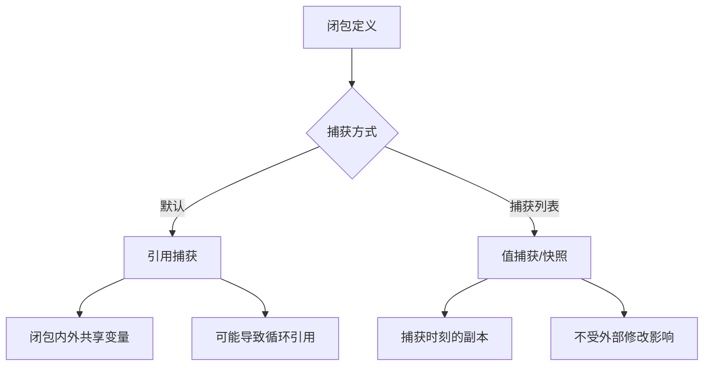
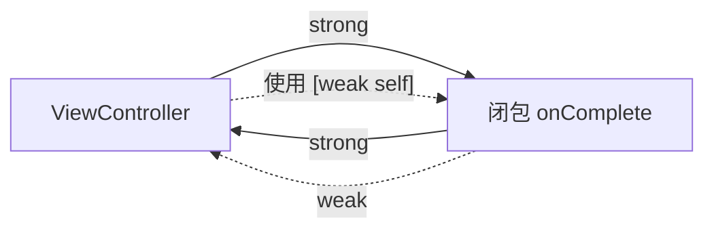
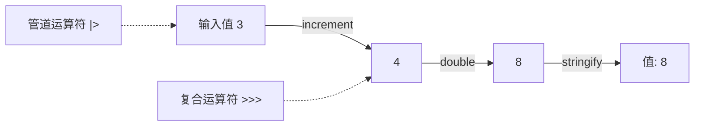

# 闭包与函数式编程详细解析

> **核心结论**：Swift 闭包是自包含的功能块，能捕获并存储其上下文中的常量与变量引用。掌握捕获语义、逃逸闭包行为和高阶函数链式调用，是写出安全、简洁、高性能 Swift 代码的关键。

---

## 核心结论 TL;DR

| 维度 | 核心洞察 |
|------|---------|
| **闭包本质** | 闭包是引用类型，捕获外部变量的**引用**而非值，除非使用捕获列表显式指定 |
| **内存安全** | `[weak self]` 解决循环引用，`[unowned self]` 仅在确保生命周期安全时使用 |
| **逃逸闭包** | `@escaping` 闭包可在函数返回后执行，需显式写 `self.`，是异步编程的基础 |
| **高阶函数** | `map/filter/reduce` 链式调用配合 `lazy` 可避免中间数组分配，显著提升性能 |
| **函数组合** | Swift 函数是一级公民，支持函数类型传递、柯里化和自定义运算符 |

---

## 1. 闭包语法

### 1.1 完整闭包语法

Swift 闭包的完整形式包含参数列表、返回类型和闭包体：

```swift
// ✅ 完整闭包语法
let multiply: (Int, Int) -> Int = { (a: Int, b: Int) -> Int in
    return a * b
}
print(multiply(3, 4)) // 12

// ✅ 类型推断 — 编译器从上下文推断参数和返回类型
let add: (Int, Int) -> Int = { a, b in
    return a + b
}

// ✅ 单表达式闭包 — 隐式返回
let subtract: (Int, Int) -> Int = { a, b in a - b }
```

### 1.2 参数名简写（$0/$1）

当闭包参数类型可推断时，Swift 提供 `$0`、`$1` 等简写：

```swift
let numbers = [3, 1, 4, 1, 5, 9, 2, 6]

// ✅ 使用参数名简写
let sorted = numbers.sorted { $0 < $1 }

// ✅ 运算符函数 — 最简写法
let sorted2 = numbers.sorted(by: <)

// ❌ 错误：参数名简写在复杂闭包中降低可读性
let result = data.reduce(into: [:]) { $0[$1.category, default: 0] += $1.amount }
// ✅ 改用命名参数
let result = data.reduce(into: [:]) { accumulator, item in
    accumulator[item.category, default: 0] += item.amount
}
```

**最佳实践**：仅在闭包体只有一行且语义清晰时使用 `$0/$1`，超过 2 个参数或逻辑复杂时使用命名参数。

### 1.3 尾随闭包（Trailing Closure）

当闭包是函数的最后一个参数时，可移到括号外部：

```swift
// ✅ 尾随闭包语法
let evenNumbers = numbers.filter { $0 % 2 == 0 }

// ✅ 唯一参数时可省略括号
UIView.animate(withDuration: 0.3) {
    self.view.alpha = 1.0
}
```

### 1.4 多尾随闭包（Multiple Trailing Closures, Swift 5.3+）

```swift
// ✅ 多尾随闭包 — 第一个标签省略，后续保留
UIView.animate(withDuration: 0.3) {
    self.view.alpha = 1.0
} completion: { finished in
    print("动画完成: \(finished)")
}

// ✅ SwiftUI 中的典型用法
Button {
    viewModel.submit()
} label: {
    Text("提交")
        .font(.headline)
}
```

---

## 2. 捕获语义

### 2.1 值捕获 vs 引用捕获

**结论先行**：Swift 闭包默认以引用方式捕获变量，这意味着闭包内外共享同一个变量。

```swift
// ✅ 默认引用捕获 — 闭包内外共享变量
var counter = 0
let increment = { counter += 1 }
increment()
increment()
print(counter) // 2 — 闭包修改了外部变量

// ✅ 捕获列表实现值捕获 — 捕获时刻的快照
var value = 10
let snapshot = { [value] in
    print(value) // 始终为 10
}
value = 20
snapshot() // 输出 10，不是 20
```



### 2.2 捕获列表 — [weak self] / [unowned self]

```swift
class NetworkManager {
    var onComplete: (() -> Void)?
    
    // ❌ 循环引用 — self 持有闭包，闭包持有 self
    func fetchBad() {
        onComplete = {
            self.handleResult() // 强引用 self → 内存泄漏
        }
    }
    
    // ✅ weak self — 闭包执行时 self 可能已释放
    func fetchGood() {
        onComplete = { [weak self] in
            guard let self else { return } // Swift 5.7+ 简写
            self.handleResult()
        }
    }
    
    // ✅ unowned self — 确保 self 生命周期 >= 闭包
    func fetchWithUnowned() {
        onComplete = { [unowned self] in
            self.handleResult() // 若 self 已释放则 crash
        }
    }
    
    func handleResult() { print("完成") }
}
```

| 修饰符 | 引用计数 | self 释放后行为 | 使用场景 |
|--------|---------|----------------|---------|
| 无（强引用） | +1 | 不会释放（循环引用） | 不推荐用于 self |
| `[weak self]` | 不增加 | self 变为 nil | **大多数异步回调** |
| `[unowned self]` | 不增加 | **崩溃**（野指针） | 确保同生命周期时 |

### 2.3 闭包引起的循环引用与解决



```swift
// ❌ 典型循环引用场景
class ViewController: UIViewController {
    var timer: Timer?
    
    override func viewDidLoad() {
        super.viewDidLoad()
        // Timer 持有闭包，闭包持有 self，self 持有 timer
        timer = Timer.scheduledTimer(withTimeInterval: 1.0, repeats: true) {
            _ in self.updateUI() // 循环引用！
        }
    }
    
    // ✅ 修复：使用 [weak self]
    func setupTimer() {
        timer = Timer.scheduledTimer(withTimeInterval: 1.0, repeats: true) { [weak self] _ in
            self?.updateUI()
        }
    }
    
    func updateUI() { /* ... */ }
    deinit { timer?.invalidate() }
}
```

### 2.4 逃逸闭包（@escaping）vs 非逃逸闭包

**结论先行**：非逃逸闭包（默认）在函数返回前执行完毕，编译器可做更多优化；逃逸闭包可在函数返回后执行，常用于异步回调。

```swift
// ✅ 非逃逸闭包（默认） — 函数返回前执行
func apply(_ value: Int, transform: (Int) -> Int) -> Int {
    return transform(value)
}

// ✅ 逃逸闭包 — 存储或异步执行
func fetchData(completion: @escaping (Data) -> Void) {
    DispatchQueue.global().async {
        let data = Data() // 模拟网络请求
        completion(data)  // 函数已返回，闭包仍在执行
    }
}

// ❌ 错误：逃逸闭包中不写 self 会编译报错
class DataLoader {
    var data: Data?
    func load(completion: @escaping () -> Void) {
        DispatchQueue.main.async {
            // self.data = Data() // 需要显式写 self
            completion()
        }
    }
}
```

| 特性 | 非逃逸闭包 | 逃逸闭包 (@escaping) |
|------|-----------|---------------------|
| 生命周期 | 函数返回前结束 | 可在函数返回后执行 |
| self 引用 | 隐式 | 必须显式写 `self.` |
| 内存优化 | 栈分配（可能） | 堆分配 |
| 循环引用风险 | 无 | 有 |
| 典型场景 | `map/filter/sorted` | 异步回调、事件处理 |

### 2.5 自动闭包（@autoclosure）

```swift
// ✅ @autoclosure — 延迟求值
func log(level: LogLevel, message: @autoclosure () -> String) {
    guard level >= .warning else { return }
    print(message()) // 仅在需要时才求值
}

// 调用时无需写花括号
log(level: .debug, message: "用户数: \(expensiveCount())") // expensiveCount() 不会执行

// ✅ 标准库中的典型用例
let value = optionalInt ?? 42 // ?? 的右侧就是 @autoclosure

// ❌ 避免滥用 — 隐藏了闭包性质，降低可读性
func bad(_ condition: @autoclosure () -> Bool,
         _ action: @autoclosure () -> Void) { /* 难以理解 */ }
```

---

## 3. 高阶函数

### 3.1 map / filter / reduce

**结论先行**：这三个函数是函数式编程的基石，分别对应「变换」「筛选」「聚合」操作。

```swift
let scores = [85, 92, 78, 95, 88, 72, 96]

// ✅ map — 变换每个元素
let grades = scores.map { score -> String in
    switch score {
    case 90...: return "A"
    case 80..<90: return "B"
    default: return "C"
    }
}
// ["B", "A", "C", "A", "B", "C", "A"]

// ✅ filter — 筛选元素
let highScores = scores.filter { $0 >= 90 }
// [92, 95, 96]

// ✅ reduce — 聚合为单一值
let total = scores.reduce(0, +)
let average = Double(total) / Double(scores.count)
```

### 3.2 flatMap / compactMap

```swift
let nestedArrays = [[1, 2, 3], [4, 5], [6, 7, 8, 9]]

// ✅ flatMap — 展平嵌套集合
let flat = nestedArrays.flatMap { $0 }
// [1, 2, 3, 4, 5, 6, 7, 8, 9]

let strings = ["1", "two", "3", "four", "5"]

// ✅ compactMap — 过滤 nil
let numbers = strings.compactMap { Int($0) }
// [1, 3, 5]

// ❌ 错误：用 map 会得到 [Optional<Int>]
let badNumbers = strings.map { Int($0) }
// [Optional(1), nil, Optional(3), nil, Optional(5)]
```

### 3.3 forEach / contains / allSatisfy

```swift
let items = [1, 2, 3, 4, 5]

// ✅ forEach — 遍历（无返回值）
items.forEach { print($0) }

// ✅ contains — 是否存在
let hasEven = items.contains { $0 % 2 == 0 } // true

// ✅ allSatisfy — 是否全部满足
let allPositive = items.allSatisfy { $0 > 0 } // true
```

### 3.4 sorted / min / max

```swift
struct Student {
    let name: String
    let score: Int
}

let students = [
    Student(name: "Alice", score: 92),
    Student(name: "Bob", score: 85),
    Student(name: "Charlie", score: 95)
]

// ✅ sorted — 自定义排序
let ranked = students.sorted { $0.score > $1.score }

// ✅ min / max — 取极值
let topStudent = students.max { $0.score < $1.score }
print(topStudent?.name ?? "N/A") // "Charlie"
```

### 3.5 链式调用与性能考虑（lazy）

**结论先行**：多个高阶函数链式调用会创建多个中间数组，使用 `lazy` 可将其转为惰性求值，仅遍历一次。

```swift
let largeArray = Array(1...1_000_000)

// ❌ 性能差：创建 2 个中间数组
let result1 = largeArray
    .filter { $0 % 2 == 0 }     // 创建 500000 元素的数组
    .map { $0 * $0 }             // 再创建 500000 元素的数组
    .prefix(10)

// ✅ 高性能：lazy 避免中间数组分配
let result2 = largeArray.lazy
    .filter { $0 % 2 == 0 }
    .map { $0 * $0 }
    .prefix(10)
// 仅处理前 20 个元素即可得到 10 个结果
```

| 方式 | 中间数组 | 遍历次数 | 内存占用 |
|------|---------|---------|---------|
| 普通链式 | 每步创建新数组 | N 次全量遍历 | O(n) × 步骤数 |
| `lazy` 链式 | 无中间数组 | 单次按需遍历 | O(1) |

---

## 4. 函数组合

### 4.1 函数作为一级公民

```swift
// ✅ 函数可以赋值给变量
func double(_ x: Int) -> Int { x * 2 }
let operation: (Int) -> Int = double
print(operation(5)) // 10

// ✅ 函数可以作为参数
func apply(_ x: Int, _ f: (Int) -> Int) -> Int {
    return f(x)
}
print(apply(5, double)) // 10

// ✅ 函数可以作为返回值
func makeMultiplier(_ factor: Int) -> (Int) -> Int {
    return { $0 * factor }
}
let triple = makeMultiplier(3)
print(triple(7)) // 21
```

### 4.2 函数类型

```swift
// 函数类型声明
typealias Predicate<T> = (T) -> Bool
typealias Transform<T, U> = (T) -> U
typealias Reducer<T, U> = (U, T) -> U

// ✅ 使用类型别名提高可读性
func filterItems<T>(_ items: [T], using predicate: Predicate<T>) -> [T] {
    items.filter(predicate)
}

let isEven: Predicate<Int> = { $0 % 2 == 0 }
let evenNumbers = filterItems([1, 2, 3, 4, 5], using: isEven)
```

### 4.3 柯里化（Currying）

```swift
// ✅ 手动柯里化
func add(_ a: Int) -> (Int) -> Int {
    return { b in a + b }
}
let add5 = add(5)
print(add5(3))  // 8

// ✅ 通用柯里化函数
func curry<A, B, C>(_ f: @escaping (A, B) -> C) -> (A) -> (B) -> C {
    return { a in { b in f(a, b) } }
}

func multiply(_ a: Int, _ b: Int) -> Int { a * b }
let curriedMultiply = curry(multiply)
let double = curriedMultiply(2)
print(double(5))  // 10
```

### 4.4 自定义运算符

```swift
// ✅ 函数组合运算符（管道）
precedencegroup ForwardPipe {
    associativity: left
    higherThan: AssignmentPrecedence
}

infix operator |>: ForwardPipe

func |> <A, B>(value: A, function: (A) -> B) -> B {
    return function(value)
}

// ✅ 函数复合运算符
precedencegroup CompositionPrecedence {
    associativity: right
    higherThan: ForwardPipe
}

infix operator >>>: CompositionPrecedence

func >>> <A, B, C>(f: @escaping (A) -> B, g: @escaping (B) -> C) -> (A) -> C {
    return { a in g(f(a)) }
}

// 使用
func increment(_ x: Int) -> Int { x + 1 }
func stringify(_ x: Int) -> String { "值: \(x)" }

let transform = increment >>> double >>> stringify
print(transform(3)) // "值: 8" — (3+1)*2 = 8

// 管道写法
let result = 3 |> increment |> double |> stringify
print(result) // "值: 8"
```



---

## 5. 与 C++ Lambda 对比

| 特性 | Swift 闭包 | C++ Lambda |
|------|-----------|-----------|
| **语法** | `{ params in body }` | `[captures](params) { body }` |
| **默认捕获** | 引用捕获 | 无默认，需显式声明 |
| **值捕获** | `[value]` 捕获列表 | `[=]` 或 `[x]` |
| **引用捕获** | 默认行为 | `[&]` 或 `[&x]` |
| **类型** | 引用类型（堆分配） | 值类型（唯一闭包类型） |
| **泛型擦除** | `Any` / 协议 | `std::function<>` |
| **内存管理** | ARC 自动管理 | 手动确保引用有效 |
| **逃逸标记** | `@escaping` 显式标记 | 无（需自行注意生命周期） |
| **this 捕获** | `[weak self]`/`[unowned self]` | `[this]`/`[*this]`(C++17) |
| **性能** | 堆分配 + ARC 开销 | 栈分配（除非 `std::function`） |

```swift
// Swift：引用类型闭包
var x = 10
let closure = { print(x) }
x = 20
closure() // 输出 20 — 引用捕获
```

```cpp
// C++：值捕获是默认安全的
int x = 10;
auto closure = [x]() { std::cout << x; };
x = 20;
closure(); // 输出 10 — 值捕获
```

---

## 最佳实践

1. **默认使用 `[weak self]`**：在逃逸闭包中捕获 self 时，除非有明确理由，否则始终用 `[weak self]`
2. **链式调用加 `lazy`**：对大集合的多步 `map/filter` 链使用 `lazy` 避免中间数组
3. **合理使用参数简写**：1-2 个参数且单行闭包用 `$0/$1`，复杂逻辑用命名参数
4. **优先用 `compactMap`**：需要过滤 nil 时用 `compactMap` 而非 `map` + `filter`
5. **避免闭包嵌套过深**：超过 3 层嵌套应重构为命名函数或使用 `async/await`
6. **`@autoclosure` 谨慎使用**：仅用于延迟求值场景（如日志、断言），不要滥用

---

## 常见陷阱

### 陷阱 1：逃逸闭包中忘记 [weak self] 导致内存泄漏

```swift
// ❌ 错误
class ViewModel {
    var handler: (() -> Void)?
    func setup() {
        handler = { self.reload() } // 循环引用
    }
}

// ✅ 修复
class ViewModel {
    var handler: (() -> Void)?
    func setup() {
        handler = { [weak self] in self?.reload() }
    }
}
```

### 陷阱 2：在循环中捕获变量

```swift
// ❌ 错误：所有闭包共享同一个 i 的引用
var closures: [() -> Int] = []
for i in 0..<5 {
    closures.append { i } // Swift 中 for-in 的 i 是 let，每次循环是新绑定
}
// 实际上 Swift 中这个是安全的！每次循环 i 是新的常量

// ⚠️ 但使用 var 时要注意
var index = 0
var closures2: [() -> Int] = []
while index < 5 {
    closures2.append { index } // 所有闭包共享同一个 index
    index += 1
}
closures2.map { $0() } // [5, 5, 5, 5, 5] — 全是 5！

// ✅ 修复：使用捕获列表
var index2 = 0
var closures3: [() -> Int] = []
while index2 < 5 {
    closures3.append { [index2] in index2 }
    index2 += 1
}
closures3.map { $0() } // [0, 1, 2, 3, 4]
```

### 陷阱 3：误用 unowned 导致崩溃

```swift
// ❌ 危险：网络请求完成时 VC 可能已销毁
func loadData() {
    networkManager.fetch { [unowned self] data in
        self.update(data) // 若 self 已释放 → EXC_BAD_ACCESS
    }
}

// ✅ 修复：异步场景一律用 weak
func loadData() {
    networkManager.fetch { [weak self] data in
        self?.update(data)
    }
}
```

---

## 面试考点

### 考题 1：Swift 闭包的捕获语义是什么？和 C++ Lambda 有何不同？

**参考答案**：Swift 闭包默认以引用方式捕获外部变量，闭包内外共享同一变量。可通过捕获列表 `[value]` 实现值捕获。C++ Lambda 无默认捕获，需显式声明 `[=]`（值）或 `[&]`（引用），且 Lambda 是值类型，Swift 闭包是引用类型。

**追问**：
- 为什么 Swift 闭包是引用类型？（支持 ARC 管理、多个变量可共享同一闭包实例）
- `[weak self]` 和 `[unowned self]` 的选择策略？

### 考题 2：什么是逃逸闭包？为什么需要 @escaping？

**参考答案**：逃逸闭包是指在函数返回后仍可执行的闭包，比如存储在属性中或传入异步 API。`@escaping` 告知编译器闭包需要堆分配且可能导致循环引用，因此要求显式写 `self.`，这是一种安全设计。

**追问**：
- 非逃逸闭包有什么编译器优化？（栈分配、无 ARC 开销）
- `@autoclosure @escaping` 可以组合使用吗？（可以，但很少见）

### 考题 3：如何优化大集合上的 map/filter 链式调用？

**参考答案**：使用 `lazy` 将 eager 求值转为惰性求值。普通链式调用每一步都创建新数组，`lazy` 会将多步操作融合为单次遍历，避免中间数组分配，显著降低内存占用。

**追问**：
- `lazy` 的返回类型是什么？（`LazySequence` / `LazyFilterSequence` 等包装类型）
- 什么场景下 `lazy` 反而更慢？（小集合、需要多次遍历结果时）

---

## 参考资源

- [The Swift Programming Language — Closures](https://docs.swift.org/swift-book/documentation/the-swift-programming-language/closures/)
- [Swift Evolution — SE-0279: Multiple Trailing Closures](https://github.com/apple/swift-evolution/blob/main/proposals/0279-multiple-trailing-closures.md)
- [Swift Evolution — SE-0103: Make Non-Escaping Closures the Default](https://github.com/apple/swift-evolution/blob/main/proposals/0103-make-noescape-by-default.md)
- [objc.io — Advanced Swift: Functions](https://www.objc.io/books/advanced-swift/)
