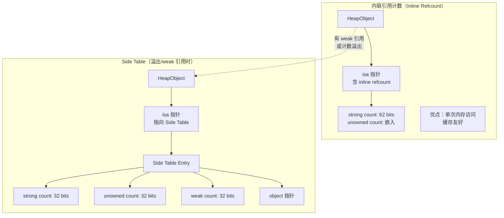
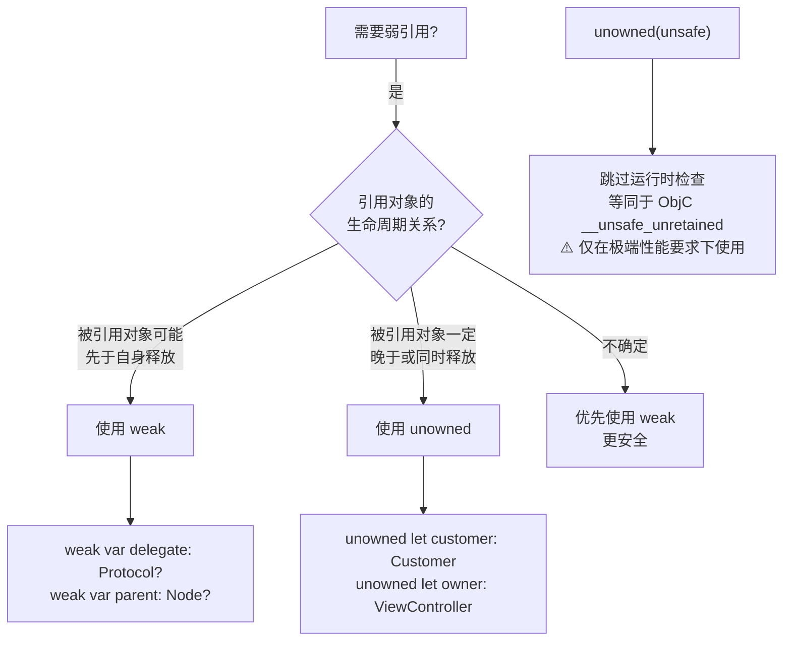
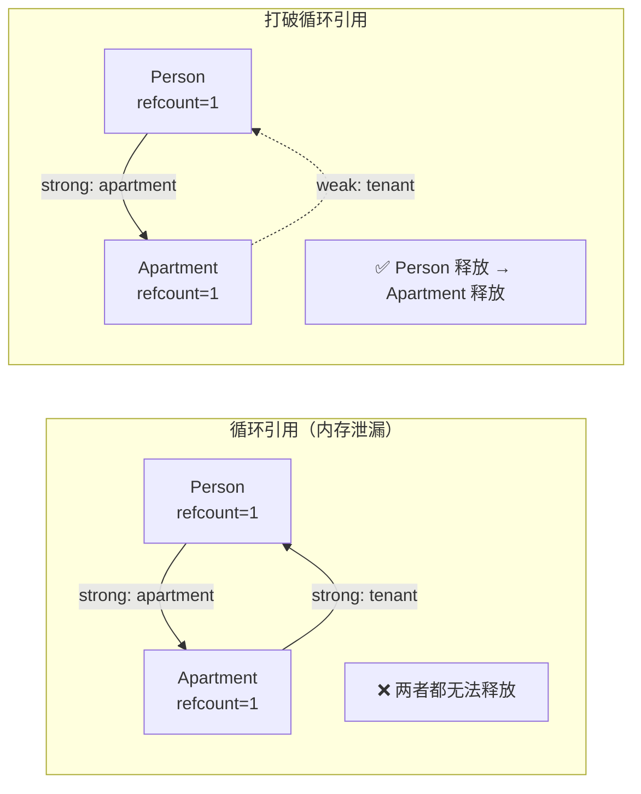
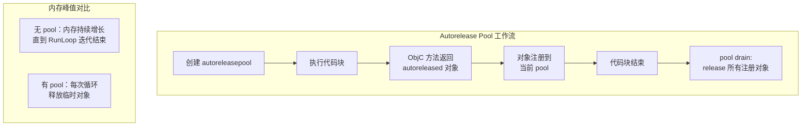

# ARC 与引用管理详细解析

> **核心结论**：ARC（Automatic Reference Counting）是 Swift 内存管理的核心机制，编译器在编译期自动插入 retain/release 调用，将引用计数管理从程序员手中解放出来。理解 strong/weak/unowned 三种引用类型的适用场景、闭包捕获语义以及循环引用检测方法，是编写无内存泄漏 Swift 代码的关键。

---

## 核心结论 TL;DR

| 维度 | 核心结论 |
|------|----------|
| **ARC 原理** | 编译器自动在适当位置插入 `swift_retain`/`swift_release`，引用计数存储在对象 isa 指针或 side table 中 |
| **引用类型选择** | strong 为默认、weak 用于可 nil 的弱持有（delegate）、unowned 用于确保生命周期覆盖的非 nil 弱持有 |
| **循环引用** | class 之间互引、delegate 模式、闭包捕获是三大循环引用来源，使用 Memory Graph Debugger 检测 |
| **闭包捕获** | `[weak self]` + `guard let self` 是最安全的闭包捕获模式，`[unowned self]` 仅在确保生命周期时使用 |
| **ARC vs GC** | ARC 确定性释放、无暂停、低开销；GC 自动处理循环引用但有 STW 暂停和内存占用高的问题 |

---

## 一、ARC 工作原理

### 1.1 核心结论

**ARC 在编译期自动插入 retain/release 调用，运行时维护每个堆对象的引用计数。当引用计数降为 0 时，对象立即被销毁并释放内存。**

### 1.2 引用计数机制

```swift
// ARC 自动管理引用计数的过程（伪代码表示编译器行为）

class Person {
    var name: String
    init(name: String) { self.name = name }
    deinit { print("\(name) is being deinitialized") }
}

func arcDemo() {
    // 编译器插入：swift_retain(person) — refcount = 1
    let person = Person(name: "Alice")
    
    // 编译器插入：swift_retain(person) — refcount = 2
    let anotherRef = person
    
    // anotherRef 离开作用域：swift_release(person) — refcount = 1
    // person 离开作用域：swift_release(person) — refcount = 0 → deinit
}
```

### 1.3 编译器自动插入 retain/release 的时机

```swift
// ✅ 编译器自动处理的场景
class Resource {
    var data: Data?
    deinit { print("Resource released") }
}

func compilerInsertPoints() {
    let res = Resource()       // retain：变量绑定
    useResource(res)           // retain：参数传递（可能被优化掉）
    let copy = res             // retain：赋值给新变量
    // copy 作用域结束          // release
    // res 作用域结束            // release → refcount == 0 → deinit
}

func useResource(_ res: Resource) {
    // 函数入口：retain（参数保活）
    print(res.data ?? "empty")
    // 函数出口：release
}
```

### 1.4 引用计数存储位置



```swift
// 引用计数存储的底层结构（Swift 运行时简化）
// 正常情况：引用计数内联在 isa 指针中
// HeapObject 布局：
//   +0: isa (包含 inline refcount)
//   +8: 实例数据

// 当以下情况发生时，迁移到 Side Table：
// 1. 对象被 weak 引用
// 2. 引用计数超过 inline 能表示的范围
// 3. 需要存储额外的运行时信息

// ❌ 错误认知：每个对象都有独立的引用计数字段
// ✅ 正确理解：引用计数内联在 isa 指针的高位中（64 位架构）
```

### 1.5 ARC vs GC（垃圾回收）对比

| 特性 | ARC（Swift） | GC（Java/Go） |
|------|-------------|---------------|
| **释放时机** | 确定性（refcount=0 立即释放） | 不确定（GC 周期触发） |
| **暂停** | 无 STW（Stop-The-World） | 有 STW 暂停（虽然现代 GC 已优化） |
| **循环引用** | 需手动处理（weak/unowned） | 自动处理 |
| **内存开销** | 低（仅引用计数字段） | 高（GC 元数据 + 标记位） |
| **CPU 开销** | 分摊（每次 retain/release） | 集中（GC 周期） |
| **实时性** | 优秀（适合 UI/音视频） | 较差（GC 暂停影响帧率） |
| **编程复杂度** | 中等（需理解循环引用） | 低（自动处理） |

### 1.6 ARC vs C++ RAII 对比

| 特性 | ARC（Swift） | RAII（C++） |
|------|-------------|-------------|
| **管理方式** | 编译器自动插入 retain/release | 构造获取/析构释放 |
| **引用计数** | 运行时维护 | 无（或 shared_ptr 有） |
| **共享所有权** | 默认支持（strong ref） | 需要 `shared_ptr` |
| **弱引用** | `weak`/`unowned` 内建 | `weak_ptr` 需显式使用 |
| **循环引用** | 需 weak/unowned 打破 | `shared_ptr` 同样需要 `weak_ptr` |
| **性能** | retain/release 有原子操作开销 | 无引用计数则零开销 |
| **安全性** | 不会 use-after-free（weak 自动 nil） | 可能悬挂指针 |

---

## 二、三种引用类型

### 2.1 核心结论

**Swift 提供 strong、weak、unowned 三种引用类型。strong 是默认方式，增加引用计数；weak 不增加计数且自动置 nil；unowned 不增加计数但不会置 nil（对象释放后访问会崩溃）。**

### 2.2 strong 引用

```swift
// ✅ strong 引用（默认）
class Engine {
    var horsepower: Int
    init(horsepower: Int) { self.horsepower = horsepower }
    deinit { print("Engine \(horsepower)HP deinitialized") }
}

class Car {
    var engine: Engine  // 默认 strong 引用
    init(engine: Engine) { self.engine = engine }
}

func strongDemo() {
    let engine = Engine(horsepower: 200)  // refcount = 1
    let car = Car(engine: engine)          // refcount = 2
    // car 释放 → engine refcount = 1
    // engine 释放 → refcount = 0 → deinit
}
```

### 2.3 weak 引用

```swift
// ✅ weak 引用 — 自动置 nil，必须是 Optional
class Apartment {
    let unit: String
    weak var tenant: Person?  // weak：不增加引用计数
    init(unit: String) { self.unit = unit }
    deinit { print("Apartment \(unit) deinitialized") }
}

class Person {
    let name: String
    var apartment: Apartment?
    init(name: String) { self.name = name }
    deinit { print("\(name) deinitialized") }
}

func weakDemo() {
    var john: Person? = Person(name: "John")
    var unit4A: Apartment? = Apartment(unit: "4A")
    
    john?.apartment = unit4A
    unit4A?.tenant = john    // weak 引用，不增加 john 的引用计数
    
    john = nil               // John refcount → 0 → deinit
    print(unit4A?.tenant)    // nil（weak 自动置 nil）
}
```

### 2.4 unowned 引用

```swift
// ✅ unowned 引用 — 非 Optional，假定对象一定存在
class Customer {
    let name: String
    var card: CreditCard?
    init(name: String) { self.name = name }
    deinit { print("\(name) deinitialized") }
}

class CreditCard {
    let number: UInt64
    unowned let customer: Customer  // 信用卡不能没有客户
    init(number: UInt64, customer: Customer) {
        self.number = number
        self.customer = customer
    }
    deinit { print("Card #\(number) deinitialized") }
}

func unownedDemo() {
    var john: Customer? = Customer(name: "John")
    john?.card = CreditCard(number: 1234_5678, customer: john!)
    
    john = nil  // Customer 和 CreditCard 都被释放
    // ❌ 如果此时还持有 CreditCard 的引用并访问 .customer → crash
}
```

### 2.5 weak vs unowned 选择决策



```swift
// ✅ weak — delegate 模式（delegate 可能先释放）
protocol DataSourceDelegate: AnyObject {
    func didUpdate()
}

class DataSource {
    weak var delegate: DataSourceDelegate?
}

// ✅ unowned — 闭包中确保 self 生命周期覆盖
class NetworkManager {
    var onComplete: (() -> Void)?
    
    func fetch() {
        // ❌ 错误：unowned 在异步回调中不安全
        onComplete = { [unowned self] in
            self.handleResult()  // 如果 NetworkManager 已释放 → crash
        }
        
        // ✅ 正确：异步回调用 weak
        onComplete = { [weak self] in
            guard let self else { return }
            self.handleResult()
        }
    }
    
    func handleResult() { }
}
```

### 2.6 unowned(unsafe) 的存在与风险

```swift
// ⚠️ unowned(unsafe) — 仅在极端性能场景使用
class UnsafeExample {
    // 普通 unowned：对象释放后访问会触发运行时 trap（crash with message）
    unowned let safeRef: SomeClass
    
    // unowned(unsafe)：对象释放后访问是 undefined behavior
    // 等同于 ObjC 的 __unsafe_unretained
    unowned(unsafe) let unsafeRef: SomeClass
    
    // 使用场景：
    // 1. 与 C/ObjC 互操作时的性能关键路径
    // 2. 已通过其他方式保证生命周期安全
    // 3. 需要避免 unowned 的运行时检查开销
    
    init(ref: SomeClass) {
        self.safeRef = ref
        self.unsafeRef = ref
    }
}
```

---

## 三、循环引用

### 3.1 核心结论

**循环引用（Retain Cycle）是 ARC 环境下内存泄漏的主要来源。类之间的互引、delegate 模式和闭包捕获是三大典型场景。使用 Xcode Memory Graph Debugger 和 Instruments Leaks 工具可以有效检测。**

### 3.2 类之间的循环引用



```swift
// ❌ 循环引用 — 内存泄漏
class Teacher {
    var student: Student?
    deinit { print("Teacher deinit") }  // 永远不会调用
}

class Student {
    var teacher: Teacher?  // ❌ strong 引用形成循环
    deinit { print("Student deinit") }  // 永远不会调用
}

func retainCycleDemo() {
    let teacher = Teacher()
    let student = Student()
    teacher.student = student
    student.teacher = teacher
    // 函数结束：teacher refcount=1, student refcount=1 → 泄漏
}

// ✅ 修复：使用 weak 打破循环
class FixedStudent {
    weak var teacher: Teacher?  // ✅ weak 引用
    deinit { print("Student deinit") }
}
```

### 3.3 delegate 模式中的循环引用

```swift
// ❌ 经典错误：delegate 用 strong 引用
protocol ViewDelegate: AnyObject {
    func viewDidTap()
}

class CustomView {
    // ❌ 错误：strong delegate 导致循环引用
    // var delegate: ViewDelegate?
    
    // ✅ 正确：weak delegate
    weak var delegate: ViewDelegate?
}

class ViewController: ViewDelegate {
    let customView = CustomView()  // VC → View (strong)
    
    func setup() {
        customView.delegate = self  // View → VC (应该是 weak)
    }
    
    func viewDidTap() { print("tapped") }
    deinit { print("ViewController deinit") }
}
```

### 3.4 闭包捕获导致的循环引用

```swift
// ❌ 闭包捕获 self 导致循环引用
class DataLoader {
    var data: Data?
    var onLoaded: (() -> Void)?
    
    func load() {
        // ❌ 闭包隐式捕获 self（strong）
        onLoaded = {
            self.data = Data()  // self → onLoaded → closure → self
            print("loaded")
        }
    }
    
    deinit { print("DataLoader deinit") }  // 永远不会调用
}

// ✅ 使用捕获列表修复
class FixedDataLoader {
    var data: Data?
    var onLoaded: (() -> Void)?
    
    func load() {
        // ✅ [weak self] 打破循环
        onLoaded = { [weak self] in
            guard let self else { return }
            self.data = Data()
            print("loaded")
        }
    }
    
    deinit { print("FixedDataLoader deinit") }
}
```

### 3.5 检测循环引用的方法

| 工具 | 使用方式 | 优势 | 局限 |
|------|----------|------|------|
| **Memory Graph Debugger** | Xcode Debug → Debug Memory Graph | 可视化对象引用关系图 | 需要运行时调试 |
| **Instruments - Leaks** | Product → Profile → Leaks | 自动检测泄漏对象 | 间歇性泄漏可能遗漏 |
| **Instruments - Allocations** | 查看 Persistent/Transient 对象 | 追踪对象生命周期 | 需要手动分析 |
| **deinit 打印** | 在 deinit 中添加 print | 简单直接 | 仅适合开发阶段 |
| **MLeaksFinder（三方库）** | 自动检测 VC 泄漏 | 无需手动操作 | 仅检测 ViewController |

---

## 四、闭包中的捕获与内存管理

### 4.1 核心结论

**闭包默认以 strong 方式捕获外部变量。在 @escaping 闭包中捕获 self 极易造成循环引用，应使用 `[weak self]` + `guard let self` 模式。**

### 4.2 捕获列表详解

```swift
class ViewModel {
    var title = "Hello"
    var count = 0
    var onUpdate: (() -> Void)?
    
    // ✅ [weak self] — 最安全的模式
    func setupWeakCapture() {
        onUpdate = { [weak self] in
            guard let self else { return }
            self.count += 1
            print(self.title)
        }
    }
    
    // ⚠️ [unowned self] — 仅在确保生命周期时使用
    func setupUnownedCapture() {
        // 同步闭包或确保 self 存活时可用
        let items = (0..<10).map { [unowned self] i in
            "\(self.title) - \(i)"
        }
        print(items)
    }
    
    // ✅ 值类型捕获 — 捕获时拷贝，之后不受影响
    func setupValueCapture() {
        let currentTitle = title  // 值类型
        onUpdate = {
            print(currentTitle)  // 捕获的是值的副本，无循环引用风险
        }
    }
    
    deinit { print("ViewModel deinit") }
}
```

### 4.3 @escaping 闭包的内存影响

```swift
class NetworkService {
    var tasks: [() -> Void] = []
    
    // @escaping 闭包：闭包的生命周期超过函数调用
    func addTask(_ task: @escaping () -> Void) {
        tasks.append(task)  // 闭包被存储，可能持续持有捕获的对象
    }
    
    // 非 @escaping 闭包：闭包在函数返回前执行完毕
    func executeImmediately(_ task: () -> Void) {
        task()  // 函数返回后闭包不再存在，无泄漏风险
    }
}

// ❌ 常见泄漏模式
class Controller {
    let service = NetworkService()
    var name = "Controller"
    
    func leakySetup() {
        // ❌ @escaping 闭包捕获 self → self 持有 service → service 持有闭包 → 循环
        service.addTask {
            print(self.name)
        }
    }
    
    func safeSetup() {
        // ✅ 使用 weak self
        service.addTask { [weak self] in
            guard let self else { return }
            print(self.name)
        }
    }
    
    deinit { print("Controller deinit") }
}
```

### 4.4 最佳实践：guard let self 模式

```swift
// ✅ 推荐：Swift 5.7+ 的 guard let self 模式
class ModernViewController {
    var data: [String] = []
    
    func fetchData() {
        APIClient.fetch { [weak self] result in
            // Swift 5.7+：guard let self 直接解包
            guard let self else { return }
            
            // 之后可以直接使用 self，无需可选链
            self.data = result
            self.reloadUI()
        }
    }
    
    // ❌ 旧模式（Swift 5.7 之前）
    func fetchDataOld() {
        APIClient.fetch { [weak self] result in
            guard let strongSelf = self else { return }
            strongSelf.data = result
        }
    }
    
    func reloadUI() { }
}

// ✅ 区分场景
class TaskManager {
    var onComplete: (() -> Void)?
    
    // 场景 1：对象释放后不需要执行 → [weak self]
    func setupOptionalCallback() {
        onComplete = { [weak self] in
            guard let self else { return }  // 对象已释放就跳过
            self.cleanup()
        }
    }
    
    // 场景 2：对象释放后仍需执行某些逻辑 → 分离关注点
    func setupRequiredCallback() {
        let resourcePath = self.resourcePath  // 捕获值类型
        onComplete = {
            FileManager.default.removeItem(atPath: resourcePath)  // 不依赖 self
        }
    }
    
    var resourcePath: String { "/tmp/resource" }
    func cleanup() { }
}
```

---

## 五、deinit 与资源释放

### 5.1 核心结论

**deinit 是 Swift 类的析构器，在对象引用计数降为 0 时自动调用。它是释放非内存资源（文件句柄、网络连接、观察者注册等）的最后机会。**

### 5.2 deinit 的调用时机

```swift
class FileHandler {
    let fileDescriptor: Int32
    let path: String
    
    init(path: String) {
        self.path = path
        self.fileDescriptor = open(path, O_RDONLY)
        print("Opened file: \(path)")
    }
    
    deinit {
        close(fileDescriptor)           // 释放文件描述符
        print("Closed file: \(path)")
    }
}

class Observer {
    let name: String
    
    init(name: String) {
        self.name = name
        NotificationCenter.default.addObserver(
            self, selector: #selector(handle(_:)),
            name: .someNotification, object: nil
        )
    }
    
    deinit {
        // ⚠️ iOS 9+ 不再需要手动移除，但显式移除是好习惯
        NotificationCenter.default.removeObserver(self)
        print("\(name) observer removed")
    }
    
    @objc func handle(_ note: Notification) { }
}
```

### 5.3 deinit 中的注意事项

```swift
class Resource {
    var buffer: UnsafeMutablePointer<UInt8>?
    
    init(size: Int) {
        buffer = .allocate(capacity: size)
    }
    
    deinit {
        // ✅ 可以访问所有属性
        buffer?.deallocate()
        
        // ✅ 可以调用方法
        cleanup()
        
        // ❌ 不应在 deinit 中做的事：
        // 1. 不要抛出错误（deinit 不能 throws）
        // 2. 不要启动异步操作
        // 3. 不要将 self 传递给其他对象（对象正在被销毁）
    }
    
    func cleanup() {
        print("Cleaning up resources")
    }
}
```

### 5.4 deinit 与 C++ 析构函数对比

| 特性 | Swift deinit | C++ ~Destructor |
|------|-------------|-----------------|
| **调用时机** | 引用计数归 0 | 栈对象离开作用域/delete |
| **自动生成** | 无属性需清理时不需要 | 编译器总会生成（可能是 trivial） |
| **继承** | 子类自动调用父类 deinit | 需要 virtual 析构函数 |
| **异常** | 不能抛出 | 不应抛出（C++11 默认 noexcept） |
| **值类型** | struct 无 deinit | struct 可以有析构函数 |
| **确定性** | 确定性（refcount=0 即调用） | 确定性（作用域结束即调用） |

### 5.5 defer 语句的资源清理

```swift
// ✅ defer 用于函数内的确定性清理
func processFile(at path: String) throws -> Data {
    let fd = open(path, O_RDONLY)
    guard fd >= 0 else { throw FileError.cannotOpen }
    
    defer {
        close(fd)  // 无论函数如何退出，都会执行
        print("File descriptor closed")
    }
    
    guard let size = fileSize(fd) else {
        throw FileError.cannotRead  // defer 依然执行
    }
    
    return readData(fd, size: size)  // defer 在 return 后执行
}

// ✅ 多个 defer 按 LIFO 顺序执行
func multipleDefer() {
    print("Start")
    defer { print("First defer") }   // 第 3 个执行
    defer { print("Second defer") }  // 第 2 个执行
    defer { print("Third defer") }   // 第 1 个执行
    print("End")
}
// 输出：Start → End → Third defer → Second defer → First defer

// ✅ defer vs deinit 的适用场景
// defer：函数级别的资源清理（文件描述符、锁等）
// deinit：对象级别的资源清理（移除观察者、关闭连接等）
```

---

## 六、Autorelease Pool

### 6.1 核心结论

**`autoreleasepool` 在 Swift 中主要用于与 ObjC 互操作和大循环中的内存峰值控制。纯 Swift 代码很少需要显式使用，但在处理 ObjC 框架返回的对象或大量临时对象时是关键优化手段。**

### 6.2 @autoreleasepool 在 Swift 中的使用

```swift
import Foundation

// ✅ 大循环中控制内存峰值
func processLargeDataset() {
    for i in 0..<1_000_000 {
        autoreleasepool {
            // ObjC 框架返回的对象会进入 autorelease pool
            let image = loadImage(at: i)    // NSImage/UIImage
            let processed = applyFilter(image)
            saveResult(processed, index: i)
            // autoreleasepool 块结束时释放临时对象
        }
    }
}

// ❌ 不使用 autoreleasepool 的问题
func processWithoutPool() {
    for i in 0..<1_000_000 {
        let image = loadImage(at: i)
        let processed = applyFilter(image)
        saveResult(processed, index: i)
        // 所有临时对象直到 RunLoop 迭代结束才释放
        // → 内存峰值极高，可能 OOM
    }
}
```

### 6.3 与 ObjC 互操作时的注意事项

```swift
// ✅ ObjC 互操作场景
class ImageProcessor {
    func batchProcess(paths: [String]) {
        // ObjC 框架的方法可能返回 autoreleased 对象
        for path in paths {
            autoreleasepool {
                // NSString、NSData、UIImage 等 ObjC 类型
                let nsPath = path as NSString
                let data = NSData(contentsOfFile: path)
                // 这些 ObjC 对象在 autoreleasepool 结束时释放
            }
        }
    }
}

// ⚠️ 纯 Swift 类型不需要 autoreleasepool
func pureSwiftLoop() {
    for i in 0..<1_000_000 {
        // Swift 原生类型使用 ARC，不经过 autorelease 机制
        let array = [1, 2, 3, i]
        let string = "item_\(i)"
        // ARC 在作用域结束时直接 release，不需要 autoreleasepool
    }
}
```



---

## 七、最佳实践

### 7.1 引用类型选择

```swift
// ✅ 规则 1：delegate 始终用 weak
protocol Delegate: AnyObject { }
class View {
    weak var delegate: Delegate?
}

// ✅ 规则 2：parent-child 关系，child 用 weak/unowned 引用 parent
class TreeNode {
    var children: [TreeNode] = []        // strong：parent 拥有 children
    weak var parent: TreeNode?           // weak：child 不拥有 parent
}

// ✅ 规则 3：闭包捕获 self 用 [weak self]
class VC {
    func setup() {
        fetchData { [weak self] data in
            guard let self else { return }
            self.update(data)
        }
    }
    func update(_ data: Any) { }
    func fetchData(completion: @escaping (Any) -> Void) { }
}

// ✅ 规则 4：不确定时优先选择 weak
// weak 的代价仅是 Optional 解包，但安全性远高于 unowned
```

### 7.2 避免常见陷阱

```swift
// ❌ 陷阱 1：Timer 造成的循环引用
class BadTimerVC {
    var timer: Timer?
    func start() {
        // ❌ Timer 强引用 target(self)，self 强引用 timer
        timer = Timer.scheduledTimer(
            timeInterval: 1.0, target: self,
            selector: #selector(tick), userInfo: nil, repeats: true
        )
    }
    @objc func tick() { }
    deinit { timer?.invalidate() }  // 永远不会被调用！
}

// ✅ 修复：使用 block-based Timer (iOS 10+)
class GoodTimerVC {
    var timer: Timer?
    func start() {
        timer = Timer.scheduledTimer(withTimeInterval: 1.0, repeats: true) { [weak self] _ in
            self?.tick()
        }
    }
    func tick() { }
    deinit {
        timer?.invalidate()
        print("GoodTimerVC deinit")  // ✅ 正常调用
    }
}
```

---

## 八、常见陷阱

| 陷阱 | 描述 | 修复方案 |
|------|------|----------|
| **delegate 强引用** | delegate 属性未声明 weak | 使用 `weak var delegate` |
| **闭包隐式捕获** | @escaping 闭包中直接使用 self | 使用 `[weak self]` 捕获列表 |
| **Timer 循环引用** | Timer target 强引用 self | 使用 block-based API 或 weak proxy |
| **NotificationCenter** | addObserver 使用 selector 模式 | iOS 9+ 自动移除或使用闭包 API |
| **unowned 崩溃** | unowned 引用的对象已释放 | 不确定时用 weak 替代 |
| **嵌套闭包泄漏** | 外层 [weak self] 内层忘记 | 内层闭包也需要处理 self 可选性 |
| **集合持有闭包** | Array/Dictionary 存储闭包捕获 self | 清理集合或使用 weak 捕获 |

---

## 九、面试考点

### 考点 1：ARC 与垃圾回收的本质区别

**Q：Swift 的 ARC 和 Java 的 GC 有什么区别？ARC 的优劣势是什么？**

**A：**
- ARC 是编译期机制，在编译时插入 retain/release；GC 是运行时机制，通过标记-清除/分代回收管理内存
- ARC 优势：确定性释放（refcount=0 立即释放）、无 STW 暂停、内存开销低
- ARC 劣势：无法自动处理循环引用，需要程序员使用 weak/unowned 手动打破
- 在实时性要求高的场景（UI 渲染、音视频处理），ARC 远优于 GC

**追问：引用计数的 retain/release 操作是否有线程安全问题？如何保证的？**

→ Swift 引用计数操作使用原子操作（atomic operations）保证线程安全。在 arm64 架构上使用 `ldxr`/`stxr` 指令对（load-exclusive/store-exclusive），x86 上使用 `lock` 前缀指令。这也是 struct 值类型在多线程下更高效的原因之一——无需原子操作。

### 考点 2：weak 和 unowned 的实现差异

**Q：weak 引用如何在对象释放后自动变为 nil？底层机制是什么？**

**A：**
- 当对象被 weak 引用时，运行时会创建 side table entry
- Side table 维护 weak 引用的列表
- 对象 strong refcount 归 0 → deinit → 遍历 side table 将所有 weak 引用置为 nil
- weak 引用实际指向 side table entry 而非对象本身，通过间接查找获取对象

**追问：unowned 和 weak 在性能上有什么差别？为什么？**

→ unowned 更快，因为：(1) 不需要创建 side table entry（除非对象已有）；(2) 访问时不需要间接查找；(3) 不需要在 deinit 时遍历清除。但 unowned 在对象释放后访问会 trap（crash），而 weak 自动返回 nil。

### 考点 3：闭包循环引用的排查与修复

**Q：如何排查一个页面的内存泄漏？从发现到修复的完整流程是什么？**

**A：**
1. **发现**：deinit 未调用 / Instruments Leaks 报告 / Memory Graph 显示异常
2. **定位**：Xcode Memory Graph Debugger 查看对象引用关系图，找到循环路径
3. **分析**：确认是 delegate 强引用、闭包捕获还是 class 间互引
4. **修复**：根据生命周期关系选择 weak 或 unowned 打破循环
5. **验证**：确认 deinit 正常调用 / Memory Graph 无泄漏节点

**追问：在复杂的异步链中（多个嵌套闭包），如何确保不泄漏？**

→ 最外层使用 `[weak self]`，内层闭包中 `guard let self` 后可以直接使用 self（Swift 5.7+）。关键原则：只要闭包被 self 直接或间接持有（存储属性、集合等），就必须用 weak 捕获。纯局部闭包（非 @escaping）不需要。

---

## 十、参考资源

| 资源 | 链接/位置 |
|------|----------|
| **Apple ARC 官方文档** | [Automatic Reference Counting — The Swift Programming Language](https://docs.swift.org/swift-book/documentation/the-swift-programming-language/automaticreferencecounting/) |
| **Swift 运行时源码** | [apple/swift - HeapObject.h](https://github.com/apple/swift/blob/main/stdlib/public/SwiftShims/HeapObject.h) |
| **WWDC - ARC in Swift** | WWDC 2021: ARC in Swift: Basics and beyond |
| **Instruments 使用指南** | Xcode Help → Instruments → Leaks / Allocations |
| **C++ RAII 对比** | [RAII 与资源管理详细解析](../../../Cpp_Language/05_内存管理与资源安全/RAII与资源管理_详细解析.md) |
| **Swift 运行时与值类型** | [Swift 运行时与 ABI 稳定性](../../iOS_Framework_Architecture/04_底层运行机制/Swift运行时与ABI稳定性_详细解析.md) |
