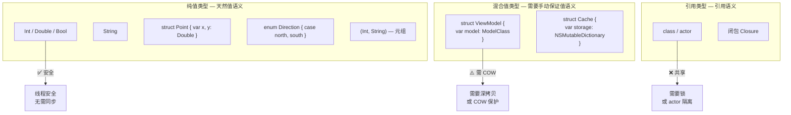
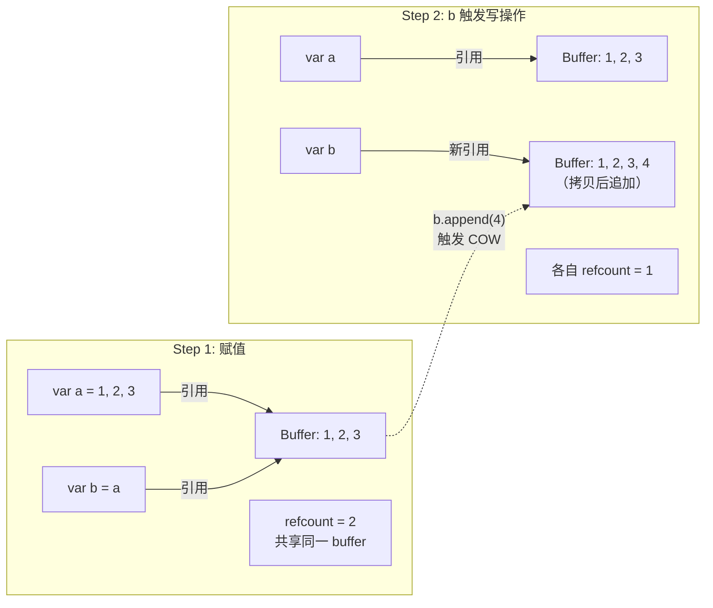
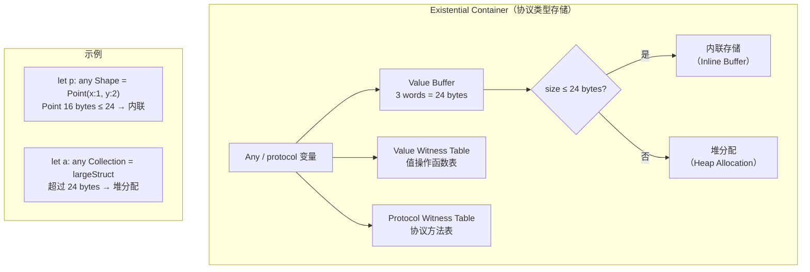
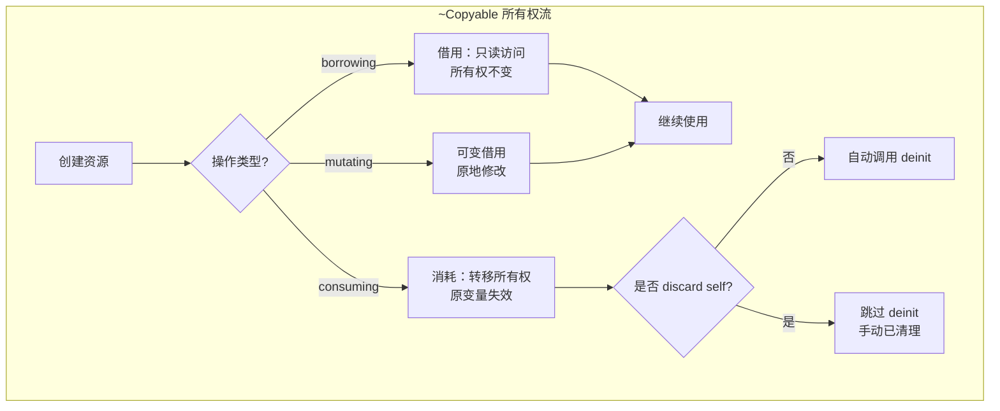
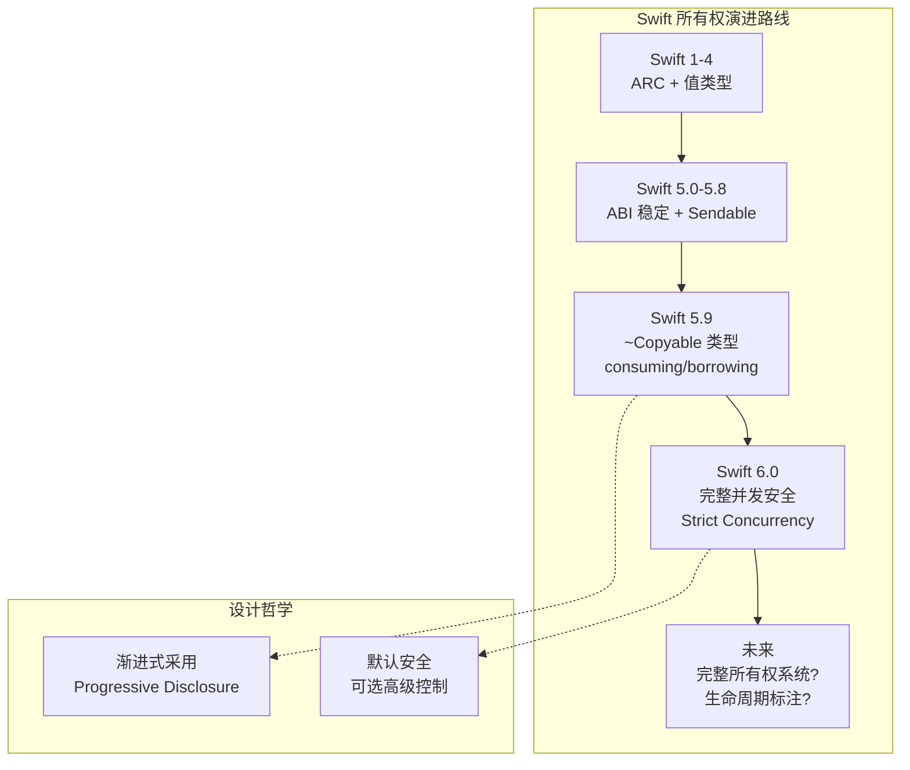

# 值语义与所有权详细解析

> **核心结论**：值语义是 Swift 类型系统的核心设计哲学——每个值独立拥有自己的数据副本，修改不影响其他持有者。结合写时复制（COW）优化、Unsafe 指针家族和 Swift 5.9+ 引入的 ~Copyable 类型，Swift 构建了从安全到高性能的完整内存管理体系，并朝着 Rust 式所有权系统逐步演进。

---

## 核心结论 TL;DR

| 维度 | 核心结论 |
|------|----------|
| **值语义** | 值语义 ≠ 值类型。包含引用类型属性的 struct 需要深拷贝才能保证值语义，纯值类型天然线程安全 |
| **COW 机制** | 标准库集合类型（Array/Dictionary/Set/String）使用写时复制，赋值 O(1)，仅在写入时触发 O(n) 拷贝 |
| **内存布局** | 值类型内联存储，Existential Container 使用 3-word inline buffer；class 实例有 isa + refcount 头开销 |
| **Unsafe 指针** | 6 种指针类型覆盖不同场景，`withUnsafe*` 系列闭包 API 是安全使用指针的推荐方式 |
| **~Copyable** | Swift 5.9+ 引入不可复制类型，通过 consuming/borrowing 实现类 Rust 的移动语义与借用检查 |

---

## 一、值语义 vs 引用语义

### 1.1 核心结论

**值语义保证赋值后两个变量完全独立——修改一个不影响另一个。Swift 的 struct/enum 默认提供值语义，但包含引用类型属性的 struct 如果不实现深拷贝，仍然会出现共享状态问题。**

### 1.2 值语义的定义与保证

```swift
// ✅ 值语义：赋值后独立
var a = [1, 2, 3]
var b = a          // 逻辑上的完整拷贝（实际 COW 延迟）
b.append(4)
print(a)           // [1, 2, 3] — 不受影响
print(b)           // [1, 2, 3, 4]

// ❌ 引用语义：赋值后共享
class MutableArray {
    var elements: [Int] = []
}
let refA = MutableArray()
let refB = refA      // 共享同一个对象
refB.elements.append(1)
print(refA.elements)  // [1] — 被影响了！
```

### 1.3 值类型不等于值语义

```swift
// ⚠️ 包含引用类型属性的 struct — 浅拷贝 ≠ 值语义
class Storage {
    var data: [Int]
    init(data: [Int]) { self.data = data }
}

struct Container {
    var storage: Storage  // 引用类型属性
    var name: String      // 值类型属性
}

func brokenValueSemantics() {
    let c1 = Container(storage: Storage(data: [1, 2]), name: "A")
    var c2 = c1   // struct 拷贝：name 深拷贝，storage 仅拷贝引用！
    
    c2.storage.data.append(3)
    print(c1.storage.data)  // [1, 2, 3] — ❌ c1 也被修改了！
}

// ✅ 修复：实现深拷贝保证值语义
struct SafeContainer {
    private var _storage: Storage
    
    var storage: Storage {
        get { _storage }
        set { _storage = Storage(data: newValue.data) }  // 深拷贝
    }
    
    init(storage: Storage) {
        self._storage = Storage(data: storage.data)
    }
}
```

### 1.4 纯值类型 vs 混合值类型



### 1.5 线程安全性保证

```swift
// ✅ 纯值类型天然线程安全
struct ImmutableConfig {
    let maxRetry: Int
    let timeout: TimeInterval
    let endpoint: String
}

// 可以安全地跨线程传递，无需同步
func threadSafeDemo() {
    let config = ImmutableConfig(maxRetry: 3, timeout: 30, endpoint: "/api")
    
    DispatchQueue.global().async {
        print(config.maxRetry)  // ✅ 安全：每个线程持有独立副本
    }
    
    DispatchQueue.global().async {
        print(config.timeout)   // ✅ 安全
    }
}

// ❌ 引用类型需要同步机制
class MutableConfig {
    var maxRetry: Int = 3       // ❌ 数据竞争风险
}

// ✅ Swift 6 Sendable 协议强制检查
struct SafeData: Sendable {
    let value: Int              // ✅ 不可变值类型，自动 Sendable
}

// ❌ 编译器会报错
// class UnsafeData: Sendable {
//     var value: Int = 0       // ❌ 可变属性不满足 Sendable
// }
```

---

## 二、写时复制（Copy-on-Write）

### 2.1 核心结论

**COW 是 Swift 标准库集合类型的核心优化策略。赋值操作只拷贝引用（O(1)），当某一副本需要修改时才触发实际数据拷贝（O(n)）。通过 `isKnownUniquelyReferenced` 判断是否需要拷贝。**

### 2.2 COW 机制原理



### 2.3 isKnownUniquelyReferenced 函数

```swift
// ✅ isKnownUniquelyReferenced 是 COW 的核心判断
class Buffer {
    var data: [Int]
    init(_ data: [Int]) { self.data = data }
}

struct COWArray {
    private var buffer: Buffer
    
    init(_ data: [Int]) {
        buffer = Buffer(data)
    }
    
    // 读操作：直接访问，无拷贝
    var count: Int { buffer.data.count }
    
    subscript(index: Int) -> Int {
        get { buffer.data[index] }
        set {
            // 写操作：检查是否唯一引用
            copyIfNeeded()
            buffer.data[index] = newValue
        }
    }
    
    mutating func append(_ element: Int) {
        copyIfNeeded()
        buffer.data.append(element)
    }
    
    // COW 核心：仅在共享时拷贝
    private mutating func copyIfNeeded() {
        if !isKnownUniquelyReferenced(&buffer) {
            buffer = Buffer(buffer.data)  // 深拷贝
            print("COW triggered: buffer copied")
        }
    }
}

// 使用演示
var arr1 = COWArray([1, 2, 3])
var arr2 = arr1                  // 共享 buffer，无拷贝
arr2.append(4)                   // 触发 COW，arr2 获得独立 buffer
print(arr1.count)                // 3 — 不受影响
print(arr2.count)                // 4
```

### 2.4 标准库 COW 实现

```swift
// 标准库中使用 COW 的类型
// Array<Element>     — ManagedBuffer 后端
// Dictionary<K, V>   — 哈希表 buffer
// Set<Element>       — 哈希表 buffer
// String             — StringBuffer

// 验证 COW 行为
func verifyCOW() {
    var a = [1, 2, 3]
    
    // 赋值前后地址对比
    withUnsafePointer(to: &a) { print("a stack: \($0)") }
    
    var b = a  // 此时 a 和 b 共享底层 buffer
    
    // ✅ 验证：修改前共享同一 buffer
    print(a.withUnsafeBufferPointer { $0.baseAddress! })  // 相同地址
    print(b.withUnsafeBufferPointer { $0.baseAddress! })  // 相同地址
    
    b.append(4)  // 触发 COW
    
    // ✅ 验证：修改后不同 buffer
    print(a.withUnsafeBufferPointer { $0.baseAddress! })  // 地址 A
    print(b.withUnsafeBufferPointer { $0.baseAddress! })  // 地址 B ≠ A
}
```

### 2.5 COW 的性能分析

| 操作 | 时间复杂度 | 说明 |
|------|-----------|------|
| 赋值 `let b = a` | O(1) | 仅拷贝引用指针 |
| 读取 `a[0]` | O(1) | 直接访问 buffer |
| 唯一引用时写入 | O(1) | 无需拷贝 |
| 共享引用时写入 | O(n) | 触发整个 buffer 拷贝 |
| `isKnownUniquelyReferenced` | O(1) | 检查引用计数 |

```swift
// ⚠️ COW 性能陷阱：频繁触发拷贝
func cowPerformanceTrap() {
    var original = Array(0..<10000)
    
    // ❌ 每次循环都触发 COW（因为 copy 还持有引用）
    let copy = original
    for i in 0..<original.count {
        original[i] += 1  // 第一次触发 COW，之后唯一引用不再触发
    }
    
    // ✅ 如果不需要 copy，及时释放
    var data = Array(0..<10000)
    // 直接操作，无共享，无 COW
    for i in 0..<data.count {
        data[i] += 1  // 唯一引用，无拷贝
    }
}
```

---

## 三、内存布局

### 3.1 核心结论

**`MemoryLayout<T>` 提供编译期类型布局信息。值类型内联存储在栈上，Existential Container 使用 3-word inline buffer 存储小值类型，超出则堆分配。class 实例在堆上分配，有 isa 指针和引用计数的 16 字节头开销。**

### 3.2 MemoryLayout 详解

```swift
import Foundation

// MemoryLayout 的三个核心属性
print(MemoryLayout<Int>.size)       // 8 — 实际数据大小
print(MemoryLayout<Int>.stride)     // 8 — 数组中的步长（含对齐填充）
print(MemoryLayout<Int>.alignment)  // 8 — 对齐要求

// 复合类型的布局
struct Point {
    var x: Double  // 8 bytes
    var y: Double  // 8 bytes
}
print(MemoryLayout<Point>.size)      // 16
print(MemoryLayout<Point>.stride)    // 16
print(MemoryLayout<Point>.alignment) // 8

// ⚠️ 字段顺序影响内存布局（编译器可能重排）
struct MixedFields {
    var a: Bool    // 1 byte
    var b: Int64   // 8 bytes
    var c: Bool    // 1 byte
}
print(MemoryLayout<MixedFields>.size)    // 17（含填充）
print(MemoryLayout<MixedFields>.stride)  // 24（对齐到 8）

// 枚举的布局
enum Direction {
    case north, south, east, west
}
print(MemoryLayout<Direction>.size)   // 1（4 个 case 用 1 byte 够）

enum Payload {
    case empty
    case value(Int)    // 关联值 8 bytes
}
print(MemoryLayout<Payload>.size)     // 9（8 + 1 tag）
print(MemoryLayout<Payload>.stride)   // 16（对齐）
```

### 3.3 Existential Container



```swift
// Existential Container 大小验证
protocol Shape {
    func area() -> Double
}

struct SmallShape: Shape {  // 16 bytes — 内联
    var width: Double
    var height: Double
    func area() -> Double { width * height }
}

struct LargeShape: Shape {  // 32 bytes — 堆分配
    var a: Double
    var b: Double
    var c: Double
    var d: Double
    func area() -> Double { a * b }
}

// 协议类型变量的大小（Existential Container）
print(MemoryLayout<any Shape>.size)    // 40 = 24(buffer) + 8(VWT) + 8(PWT)
print(MemoryLayout<any Shape>.stride)  // 40
```

### 3.4 对象内存布局

```swift
// Class 实例的堆内存布局
// +0:  isa 指针 (8 bytes) — 指向类元数据，含 inline refcount
// +8:  引用计数 (8 bytes) — 或指向 side table
// +16: 第一个存储属性
// +24: 第二个存储属性
// ...

class MyClass {
    var x: Int = 10      // offset +16
    var y: Double = 3.14 // offset +24
    var z: Bool = true   // offset +32
}

// 验证
let obj = MyClass()
print(class_getInstanceSize(MyClass.self))  // 40 = 16(header) + 8 + 8 + 1(+padding)

// 值类型 vs 引用类型内存开销对比
struct PointValue { var x, y: Double }          // 16 bytes（无头开销）
class PointReference { var x: Double = 0; var y: Double = 0 }  // 32 bytes（16 头 + 16 数据）

print(MemoryLayout<PointValue>.size)             // 16
print(class_getInstanceSize(PointReference.self)) // 32
```

---

## 四、Unsafe 指针家族

### 4.1 核心结论

**Swift 提供 6 种 Unsafe 指针类型，覆盖从类型安全到原始字节的不同操作需求。`withUnsafe*` 系列闭包 API 是推荐的安全使用方式，可限定指针的作用域并防止悬挂指针。**

### 4.2 指针类型一览

| 指针类型 | 类型安全 | 可变性 | 用途 |
|----------|---------|--------|------|
| `UnsafePointer<T>` | ✅ 类型化 | 只读 | 读取特定类型数据 |
| `UnsafeMutablePointer<T>` | ✅ 类型化 | 可读写 | 修改特定类型数据 |
| `UnsafeRawPointer` | ❌ 原始 | 只读 | 读取原始字节 |
| `UnsafeMutableRawPointer` | ❌ 原始 | 可读写 | 修改原始字节 |
| `UnsafeBufferPointer<T>` | ✅ 类型化 | 只读 | 连续内存区域（数组） |
| `UnsafeMutableBufferPointer<T>` | ✅ 类型化 | 可读写 | 可变连续内存区域 |

### 4.3 基本指针操作

```swift
// UnsafeMutablePointer — 手动内存管理
func pointerBasics() {
    // 分配
    let ptr = UnsafeMutablePointer<Int>.allocate(capacity: 3)
    
    // 初始化（必须在使用前初始化）
    ptr.initialize(to: 10)
    (ptr + 1).initialize(to: 20)
    (ptr + 2).initialize(to: 30)
    
    // 读取
    print(ptr.pointee)           // 10
    print(ptr[1])                // 20
    print((ptr + 2).pointee)     // 30
    
    // 修改
    ptr.pointee = 100
    
    // ⚠️ 必须按顺序：deinitialize → deallocate
    ptr.deinitialize(count: 3)
    ptr.deallocate()
    
    // ❌ 常见错误
    // ptr.deallocate()  // 忘记 deinitialize — 对于非 trivial 类型会泄漏
    // print(ptr.pointee)  // 释放后访问 — undefined behavior
}

// UnsafeRawPointer — 原始字节操作
func rawPointerDemo() {
    let rawPtr = UnsafeMutableRawPointer.allocate(byteCount: 16, alignment: 8)
    
    // 存储不同类型到同一内存
    rawPtr.storeBytes(of: 42, as: Int.self)
    rawPtr.storeBytes(of: 3.14, toByteOffset: 8, as: Double.self)
    
    // 读取
    let intValue = rawPtr.load(as: Int.self)                        // 42
    let doubleValue = rawPtr.load(fromByteOffset: 8, as: Double.self) // 3.14
    
    rawPtr.deallocate()
}
```

### 4.4 withUnsafe 系列 API

```swift
// ✅ 推荐：使用 withUnsafe* 闭包限定指针作用域
func safePointerUsage() {
    var value = 42
    
    // withUnsafePointer — 只读访问
    withUnsafePointer(to: &value) { ptr in
        print("Address: \(ptr), Value: \(ptr.pointee)")
    }
    // ptr 在闭包外不可用，防止悬挂指针
    
    // withUnsafeMutablePointer — 可变访问
    withUnsafeMutablePointer(to: &value) { ptr in
        ptr.pointee = 100
    }
    print(value)  // 100
    
    // Array 的 buffer 访问
    var array = [1, 2, 3, 4, 5]
    
    array.withUnsafeBufferPointer { buffer in
        // buffer 是 UnsafeBufferPointer<Int>
        for i in 0..<buffer.count {
            print(buffer[i])
        }
        print("Base address: \(buffer.baseAddress!)")
    }
    
    // withUnsafeBytes — 原始字节访问
    let data = Data([0x48, 0x65, 0x6C, 0x6C, 0x6F])
    data.withUnsafeBytes { rawBuffer in
        // rawBuffer 是 UnsafeRawBufferPointer
        let firstByte = rawBuffer[0]  // 0x48 = 'H'
        print(firstByte)
    }
}
```

### 4.5 指针操作的安全准则

```swift
// ✅ 安全准则
// 1. 优先使用 withUnsafe* 闭包 API
// 2. 不要让指针逃逸出闭包作用域
// 3. 先 initialize 再使用，先 deinitialize 再 deallocate
// 4. 类型化指针不要 rebind 到不同类型（violates strict aliasing）

// ❌ 危险操作示例
func unsafeAntiPatterns() {
    var value = 42
    
    // ❌ 让指针逃逸出闭包
    var escapedPtr: UnsafePointer<Int>?
    withUnsafePointer(to: &value) { ptr in
        escapedPtr = ptr  // ❌ 闭包结束后 ptr 可能无效
    }
    // escapedPtr?.pointee  // undefined behavior
    
    // ❌ 类型双关（type punning）
    // let intPtr = UnsafeMutablePointer<Int>.allocate(capacity: 1)
    // intPtr.initialize(to: 42)
    // let floatPtr = UnsafeRawPointer(intPtr).assumingMemoryBound(to: Float.self)
    // print(floatPtr.pointee)  // 未定义行为
}
```

---

## 五、~Copyable（Noncopyable Types）— Swift 5.9+

### 5.1 核心结论

**~Copyable 标记的类型不能被隐式复制，每个值在任意时刻只有一个所有者。这使得 Swift 能够在类型系统层面建模独占资源（文件句柄、锁、数据库连接等），类似于 Rust 的移动语义。**

### 5.2 为什么需要不可复制类型

```swift
// ❌ 问题：可复制类型无法表达独占语义
struct FileHandleBad {
    let fd: Int32
    
    func close() {
        Darwin.close(fd)
    }
}

func doubleFree() {
    let file = FileHandleBad(fd: open("/tmp/test", O_RDONLY))
    let copy = file   // ❌ fd 被复制了！
    file.close()      // 关闭 fd
    copy.close()      // ❌ double close — undefined behavior
}

// ✅ 解决：使用 ~Copyable 禁止复制
struct FileHandle: ~Copyable {
    let fd: Int32
    
    init(path: String) {
        fd = open(path, O_RDONLY)
    }
    
    deinit {
        close(fd)       // ✅ 只会关闭一次
        print("File closed")
    }
    
    // let copy = file  // ❌ 编译错误：不能复制 ~Copyable 类型
}
```

### 5.3 consuming / borrowing 参数修饰符

```swift
struct UniqueResource: ~Copyable {
    var name: String
    
    // consuming：转移所有权，调用后原变量不可再使用
    consuming func destroy() {
        print("Destroying \(name)")
        // self 被消耗，函数结束后自动调用 deinit
    }
    
    // borrowing：借用，不转移所有权
    borrowing func inspect() -> String {
        return "Resource: \(name)"
    }
    
    // mutating 隐含 inout 语义
    mutating func rename(to newName: String) {
        name = newName
    }
    
    deinit {
        print("\(name) deinitialized")
    }
}

func ownershipDemo() {
    var res = UniqueResource(name: "DB Connection")
    
    // borrowing：只读借用，res 仍然有效
    let info = res.inspect()
    print(info)
    
    // mutating：可变借用
    res.rename(to: "Redis Connection")
    
    // consuming：转移所有权，res 之后不可用
    res.destroy()
    
    // print(res.name)  // ❌ 编译错误：res 已被消耗
}
```

### 5.4 discard self

```swift
// discard self — 放弃资源而不调用 deinit
struct ManagedBuffer: ~Copyable {
    let pointer: UnsafeMutableRawPointer
    let size: Int
    
    init(size: Int) {
        pointer = .allocate(byteCount: size, alignment: 8)
        self.size = size
    }
    
    // 手动释放后，告诉编译器不要再调用 deinit
    consuming func release() {
        pointer.deallocate()
        discard self  // 跳过 deinit
    }
    
    deinit {
        // 默认清理路径
        pointer.deallocate()
        print("ManagedBuffer auto-cleaned")
    }
}
```

### 5.5 典型使用场景

```swift
// 场景 1：互斥锁
struct Mutex: ~Copyable {
    private var _lock = pthread_mutex_t()
    
    init() {
        pthread_mutex_init(&_lock, nil)
    }
    
    borrowing func lock() {
        pthread_mutex_lock(&_lock)
    }
    
    borrowing func unlock() {
        pthread_mutex_unlock(&_lock)
    }
    
    deinit {
        pthread_mutex_destroy(&_lock)
    }
}

// 场景 2：RAII 风格的锁守卫
struct MutexGuard: ~Copyable {
    let mutex: UnsafePointer<Mutex>
    
    init(locking mutex: UnsafePointer<Mutex>) {
        self.mutex = mutex
        mutex.pointee.lock()
    }
    
    deinit {
        mutex.pointee.unlock()  // 离开作用域自动解锁
    }
}

// 场景 3：唯一令牌
struct Token: ~Copyable {
    let id: UUID
    private(set) var isValid: Bool = true
    
    init() { id = UUID() }
    
    consuming func redeem() -> String {
        let result = "Redeemed: \(id)"
        // Token 被消耗后不可再使用 — 编译期保证一次性
        return result
    }
    
    deinit {
        if isValid { print("Token \(id) expired unused") }
    }
}
```



---

## 六、所有权系统演进（Swift 6+）

### 6.1 核心结论

**Swift 正在从隐式复制的语义模型向显式所有权模型演进。borrowing/consuming 参数修饰符让程序员可以精确控制值的生命周期和拷贝行为，目标是在保持 Swift 易用性的同时接近 Rust 的内存安全保证。**

### 6.2 borrowing 参数

```swift
// borrowing：明确表示函数只借用参数，不会持有
func printDescription(borrowing value: SomeType) {
    // 只读访问 value，不会拷贝
    print(value.description)
}
// 调用后 value 仍然有效

// 对于大型值类型，borrowing 避免不必要的拷贝
struct LargeStruct {
    var data: [Double]  // 可能很大
    
    // ✅ 借用语义：不拷贝，直接引用原始数据
    borrowing func sum() -> Double {
        data.reduce(0, +)
    }
}
```

### 6.3 consuming 参数

```swift
// consuming：明确表示函数会消耗（获取所有权）参数
func process(consuming data: [Int]) -> [Int] {
    // data 的所有权转移到函数内部
    var result = data  // 不会触发 COW（唯一引用）
    result.append(999)
    return result
}

var myData = [1, 2, 3]
let result = process(consuming: myData)
// myData 已被消耗，之后不应使用
// （当前版本编译器可能不会强制报错，但语义上已转移）
```

### 6.4 Swift vs C++ 移动语义对比

| 特性 | Swift (consuming) | C++ (std::move) |
|------|------------------|-----------------|
| **语法** | `consuming func take(_ x: T)` | `void take(T&& x)` |
| **编译期检查** | 编译器阻止消耗后使用 | 编译器不阻止（moved-from 状态可访问） |
| **moved-from 状态** | 不存在（变量直接不可用） | 有效但不确定的状态 |
| **默认行为** | 值类型默认拷贝 | 值类型默认拷贝 |
| **显式标记** | `consuming` / `borrowing` | `std::move()` / `const &` |
| **安全性** | 编译期保证 | 程序员责任 |

### 6.5 Swift vs Rust 所有权系统对比

| 特性 | Swift | Rust |
|------|-------|------|
| **默认行为** | 值类型可复制，class 引用共享 | 所有类型默认 move |
| **复制** | 隐式（除 ~Copyable） | 需要实现 Clone trait，显式 `.clone()` |
| **借用** | `borrowing` 参数 | `&T`（不可变借用）、`&mut T`（可变借用） |
| **借用检查器** | 部分（~Copyable 类型） | 完整（所有类型） |
| **生命周期标注** | 无 | `'a` 生命周期参数 |
| **循环引用** | ARC + weak/unowned | 不可能（所有权树） |
| **学习曲线** | 渐进式（可选择使用） | 陡峭（必须理解） |
| **运行时开销** | ARC 引用计数 | 零运行时开销 |



### 6.6 未来演进方向

```swift
// 可能的未来特性（基于 Swift Evolution 讨论）

// 1. 更完整的借用检查
// borrowing func process(borrowing a: Array<Int>, borrowing b: Array<Int>) -> Int
// 编译器保证 a 和 b 不会在函数内被修改

// 2. 泛型中的 ~Copyable 支持
// func swap<T: ~Copyable>(_ a: inout T, _ b: inout T) {
//     let tmp = consume a
//     a = consume b
//     b = consume tmp
// }

// 3. 可能的生命周期标注（讨论中）
// func firstElement<T>(borrowing array: borrowing [T]) -> borrowing T
// 返回值的生命周期绑定到输入参数

// 当前建议：
// - 普通代码：使用标准 ARC + 值类型
// - 性能关键：使用 consuming/borrowing 优化拷贝
// - 独占资源：使用 ~Copyable 建模
```

---

## 七、最佳实践

### 7.1 值语义与 COW

```swift
// ✅ 规则 1：优先使用值类型
struct UserProfile {        // ✅ 值类型
    var name: String
    var age: Int
    var tags: [String]      // Array 自带 COW
}

// ✅ 规则 2：混合类型必须实现 COW
struct ImageWrapper {
    private var _storage: ImageStorage
    
    var image: UIImage {
        get { _storage.image }
        set {
            if !isKnownUniquelyReferenced(&_storage) {
                _storage = ImageStorage(image: newValue)
            } else {
                _storage.image = newValue
            }
        }
    }
}

// ✅ 规则 3：大值类型用 consuming 传递
func processLargeData(consuming data: [Double]) -> Double {
    // data 被消耗，避免不必要的拷贝
    return data.reduce(0, +)
}
```

### 7.2 指针使用规范

```swift
// ✅ 规则 4：始终使用 withUnsafe* 闭包
var array = [1, 2, 3]
array.withUnsafeBufferPointer { buffer in
    // 安全地使用指针
    memcpy(destination, buffer.baseAddress!, buffer.count * MemoryLayout<Int>.stride)
}

// ✅ 规则 5：指针不要逃逸出闭包
// ❌ var savedPtr: UnsafePointer<Int>?
// ❌ withUnsafePointer(to: &x) { savedPtr = $0 }

// ✅ 规则 6：allocate/initialize/deinitialize/deallocate 成对使用
let ptr = UnsafeMutablePointer<String>.allocate(capacity: 1)
ptr.initialize(to: "Hello")
defer {
    ptr.deinitialize(count: 1)
    ptr.deallocate()
}
```

---

## 八、常见陷阱

| 陷阱 | 描述 | 修复方案 |
|------|------|----------|
| **假值语义** | struct 含引用类型属性，拷贝后共享状态 | 实现 COW 或使用纯值类型 |
| **COW 意外触发** | 持有额外引用导致每次写入都拷贝 | 及时释放不需要的引用 |
| **Existential 装箱** | 大值类型转协议类型触发堆分配 | 使用泛型约束替代协议类型 |
| **指针逃逸** | withUnsafe 闭包中让指针逃逸 | 仅在闭包内使用指针 |
| **忘记 deinitialize** | deallocate 前未 deinitialize 非 trivial 类型 | 始终成对使用 |
| **~Copyable 误用** | 对不需要独占语义的类型使用 ~Copyable | 仅对真正的独占资源使用 |
| **Stride vs Size** | 用 size 计算数组偏移而非 stride | 数组偏移始终使用 stride |

---

## 九、面试考点

### 考点 1：值语义与 COW 机制

**Q：Swift 的 Array 是值类型，但赋值后两个 Array 共享底层存储，这不矛盾吗？**

**A：**
- 不矛盾。Swift Array 使用写时复制（COW）优化
- 赋值时仅拷贝引用指针（O(1)），两个 Array 共享底层 buffer
- 当任一方修改时，检查 `isKnownUniquelyReferenced`，若共享则先拷贝（O(n)）
- 对外呈现完整的值语义——修改一个不影响另一个
- 这是性能与安全的完美平衡

**追问：如何实现自定义类型的 COW？isKnownUniquelyReferenced 对 NSObject 子类有效吗？**

→ 用 private class 作为 storage，mutating 方法中检查 `isKnownUniquelyReferenced(&storage)`，非唯一则深拷贝。注意：`isKnownUniquelyReferenced` 仅对纯 Swift 类有效，对 NSObject 子类始终返回 false（因为 ObjC 运行时可能有额外引用）。

### 考点 2：Existential Container 与泛型的性能差异

**Q：`func process(_ shape: any Shape)` 和 `func process<T: Shape>(_ shape: T)` 在性能上有什么区别？**

**A：**
- 协议类型（`any Shape`）：使用 Existential Container（40 bytes），通过 Protocol Witness Table 间接派发，大值类型堆分配
- 泛型（`<T: Shape>`）：编译器特化为具体类型，内联存储，静态派发，零抽象开销
- 性能差距可达 10-100 倍（取决于调用频率和值大小）
- 规则：高频调用路径用泛型，需要类型擦除时才用 any

**追问：Existential Container 的 3-word inline buffer 能存多大的值？超出怎么办？**

→ 3 words = 24 bytes（64 位架构）。小于等于 24 bytes 的值类型内联存储，超出则堆分配一个 box 来存储，inline buffer 只存放指向 box 的指针。这就是为什么小 struct 比大 struct 作为协议类型传递更高效。

### 考点 3：~Copyable 与所有权

**Q：Swift 的 ~Copyable 类型解决了什么问题？与 Rust 的所有权系统有何异同？**

**A：**
- ~Copyable 解决独占资源的安全建模问题：文件句柄、锁、令牌等不应被复制的资源
- 编译器保证每个值只有一个所有者，防止 double-free 和 use-after-move
- 与 Rust 相比：Swift 是渐进式的（opt-in），Rust 是全面的（所有类型默认 move）
- Swift 目前没有生命周期标注（Rust 有 `'a`），借用检查仅限于 ~Copyable 类型
- Swift 的设计哲学是 Progressive Disclosure——简单场景零心智负担，复杂场景可选高级控制

**追问：consuming 和 borrowing 在实际项目中有哪些应用场景？**

→ consuming 适用于：(1) 大数组/集合的管道式处理（避免 COW）；(2) 构建器模式（Builder 被消耗生成最终对象）；(3) ~Copyable 资源的转移。borrowing 适用于：(1) 只读访问大值类型（避免拷贝）；(2) 明确语义——函数不会持有参数引用。

---

## 十、参考资源

| 资源 | 链接/位置 |
|------|----------|
| **Swift 官方文档 - 内存安全** | [Memory Safety — Swift Programming Language](https://docs.swift.org/swift-book/documentation/the-swift-programming-language/memorysafety/) |
| **SE-0390: Noncopyable structs and enums** | [Swift Evolution Proposal](https://github.com/apple/swift-evolution/blob/main/proposals/0390-noncopyable-structs-and-enums.md) |
| **SE-0377: borrowing and consuming** | [Swift Evolution Proposal](https://github.com/apple/swift-evolution/blob/main/proposals/0377-parameter-ownership-modifiers.md) |
| **WWDC 2024: Consume noncopyable types** | Apple Developer Videos |
| **Swift 运行时源码** | [apple/swift - stdlib/public/core](https://github.com/apple/swift/tree/main/stdlib/public/core) |
| **ARC 与引用管理** | [ARC 与引用管理详细解析](./ARC与引用管理_详细解析.md) |
| **C++ RAII 对比** | [RAII 与资源管理详细解析](../../Cpp_Language/05_内存管理与资源安全/RAII与资源管理_详细解析.md) |
| **Swift 运行时与值类型** | [Swift 运行时与 ABI 稳定性](../../iOS_Framework_Architecture/04_底层运行机制/Swift运行时与ABI稳定性_详细解析.md) |
