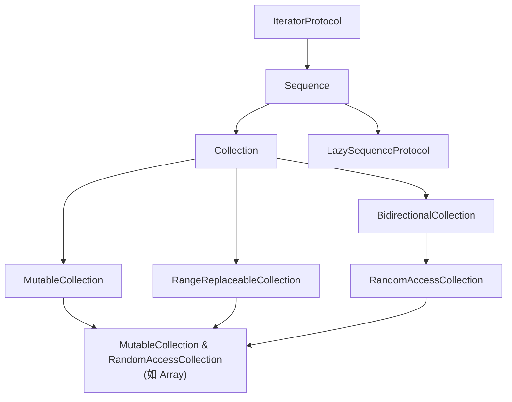
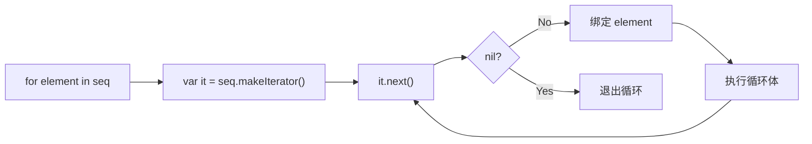
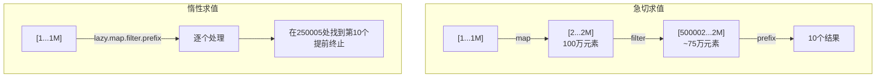

# Collection 协议体系详细解析

> **核心结论**：Swift 的 Collection 协议族是标准库的灵魂架构——从 `Sequence` 到 `RandomAccessCollection`，每一层协议都精确描述了数据结构的能力边界。理解这套体系不仅能写出高性能的泛型算法，还能在自定义数据结构时获得标准库所有高阶方法的"免费"支持。Array 的 COW + ContiguousArrayBuffer 设计、Dictionary 的开放寻址哈希表，都是工程实践中必须掌握的底层细节。

---

## 目录

1. [核心结论 TL;DR](#1-核心结论-tldr)
2. [协议层次架构](#2-协议层次架构)
3. [Sequence 与 IteratorProtocol](#3-sequence-与-iteratorprotocol)
4. [Collection 协议详解](#4-collection-协议详解)
5. [Array 深度解析](#5-array-深度解析)
6. [Dictionary 与 Set](#6-dictionary-与-set)
7. [高阶算法](#7-高阶算法)
8. [与 C++ STL 对比](#8-与-c-stl-对比)
9. [最佳实践](#9-最佳实践)
10. [常见陷阱](#10-常见陷阱)
11. [面试考点](#11-面试考点)
12. [参考资源](#12-参考资源)

---

## 1. 核心结论 TL;DR

| 维度 | 核心洞察 |
|------|---------|
| 协议分层 | Sequence → Collection → BidirectionalCollection → RandomAccessCollection，每层增加能力承诺 |
| 默认选择 | Array 是 95% 场景的最优解，连续内存 + COW 兼顾性能与安全 |
| Dictionary | Swift 5+ 采用开放寻址哈希表，比链表法更缓存友好，查找均摊 O(1) |
| 惰性求值 | `lazy` 链式调用可避免中间数组分配，处理大数据集时性能提升显著 |
| 自定义类型 | 只需实现 `startIndex`/`endIndex`/`subscript`/`index(after:)` 即可获得全部 Collection 算法 |

---

## 2. 协议层次架构

### 2.1 完整协议继承链



### 2.2 各协议的能力承诺

| 协议 | 核心能力 | 典型遵循者 |
|------|---------|-----------|
| `Sequence` | 单次遍历 `makeIterator()` | `AnySequence`、`stride` |
| `Collection` | 多次遍历 + O(1) subscript | `Array`、`Dictionary`、`Set` |
| `BidirectionalCollection` | 双向遍历 `index(before:)` | `String`、`Array` |
| `RandomAccessCollection` | O(1) 索引距离计算 | `Array`、`ContiguousArray` |
| `MutableCollection` | 通过下标原地修改元素 | `Array`、`UnsafeMutableBufferPointer` |
| `RangeReplaceableCollection` | 插入/删除/替换区间 | `Array`、`String` |
| `LazySequenceProtocol` | 延迟计算，避免中间分配 | `LazySequence`、`LazyMapSequence` |

### 2.3 协议组合的威力

```swift
// ✅ 泛型约束：只要满足协议，算法自动适配
func binarySearch<C: RandomAccessCollection>(
    in collection: C,
    for element: C.Element
) -> C.Index? where C.Element: Comparable {
    var low = collection.startIndex
    var high = collection.endIndex
    
    while low < high {
        let mid = collection.index(low, offsetBy: collection.distance(from: low, to: high) / 2)
        if collection[mid] < element {
            low = collection.index(after: mid)
        } else if collection[mid] > element {
            high = mid
        } else {
            return mid
        }
    }
    return nil
}

// 对 Array、ContiguousArray、UnsafeBufferPointer 都适用
let arr = [1, 3, 5, 7, 9, 11]
let idx = binarySearch(in: arr, for: 7)  // Optional(3)
```

---

## 3. Sequence 与 IteratorProtocol

### 3.1 IteratorProtocol 基础

**结论先行**：`IteratorProtocol` 只有一个要求——`mutating func next() -> Element?`，返回 `nil` 表示遍历结束。

```swift
// ✅ 自定义迭代器：斐波那契数列
struct FibonacciIterator: IteratorProtocol {
    var current = 0
    var next0 = 1
    
    mutating func next() -> Int? {
        let result = current
        current = next0
        next0 = result + next0
        return result
    }
}

var fib = FibonacciIterator()
(0..<8).map { _ in fib.next()! }  // [0, 1, 1, 2, 3, 5, 8, 13]
```

### 3.2 for-in 循环的底层原理

**结论先行**：`for-in` 是编译器语法糖，底层转换为迭代器模式。

```swift
// 表面代码
for element in array {
    print(element)
}

// ✅ 编译器实际生成的代码
var iterator = array.makeIterator()
while let element = iterator.next() {
    print(element)
}
```



### 3.3 自定义 Sequence

```swift
// ✅ 自定义无限序列
struct Countdown: Sequence {
    let start: Int
    
    func makeIterator() -> CountdownIterator {
        return CountdownIterator(current: start)
    }
}

struct CountdownIterator: IteratorProtocol {
    var current: Int
    
    mutating func next() -> Int? {
        guard current > 0 else { return nil }
        defer { current -= 1 }
        return current
    }
}

// 使用
let countdown = Countdown(start: 5)
for num in countdown {
    print(num)  // 5, 4, 3, 2, 1
}
```

### 3.4 惰性求值（lazy）

**结论先行**：`lazy` 将急切求值转为惰性求值，避免创建中间数组，对大数据集性能提升可达数倍。

```swift
let numbers = Array(1...1_000_000)

// ❌ 急切求值：创建 2 个中间数组，分配 ~16MB 内存
let result1 = numbers
    .map { $0 * $0 }       // 创建 100 万元素的新数组
    .filter { $0 % 2 == 0 } // 再创建一个新数组
    .prefix(5)

// ✅ 惰性求值：零中间分配，只计算前 5 个符合条件的元素
let result2 = numbers.lazy
    .map { $0 * $0 }
    .filter { $0 % 2 == 0 }
    .prefix(5)

// result2 的类型：LazyFilterSequence<LazyMapSequence<...>>
// 只有在实际遍历时才逐个计算
Array(result2)  // [4, 16, 36, 64, 100]
```

---

## 4. Collection 协议详解

### 4.1 Index 类型与边界

**结论先行**：Collection 的核心抽象是 `Index` 类型——它不一定是 `Int`，但必须是 `Comparable`。这是 Swift 类型安全的关键设计。

```swift
// ✅ Collection 协议核心要求
protocol Collection: Sequence {
    associatedtype Index: Comparable
    
    var startIndex: Index { get }
    var endIndex: Index { get }        // 注意：endIndex 是"past the end"
    
    subscript(position: Index) -> Element { get }
    func index(after i: Index) -> Index
}
```

```swift
// ❌ 常见错误：混淆 endIndex 与最后一个元素的索引
let arr = [10, 20, 30]
// arr[arr.endIndex]  // 💥 Fatal error: Index out of range
// endIndex = 3，但有效范围是 0..<3

// ✅ 正确做法
if !arr.isEmpty {
    let lastElement = arr[arr.index(before: arr.endIndex)]  // 30
}
```

### 4.2 自定义 Collection 类型

```swift
// ✅ 实现一个环形缓冲区 Collection
struct RingBuffer<Element>: Collection {
    private var storage: [Element?]
    private var readIndex = 0
    private(set) var count: Int = 0
    
    init(capacity: Int) {
        storage = Array(repeating: nil, count: capacity)
    }
    
    var startIndex: Int { 0 }
    var endIndex: Int { count }
    
    subscript(position: Int) -> Element {
        precondition(position >= 0 && position < count, "Index out of range")
        return storage[(readIndex + position) % storage.count]!
    }
    
    func index(after i: Int) -> Int {
        return i + 1
    }
    
    // 获得免费方法：map, filter, reduce, contains, first, last, sorted...
}
```

### 4.3 Collection 的性能承诺

| 操作 | Collection | BidirectionalCollection | RandomAccessCollection |
|------|-----------|------------------------|----------------------|
| `index(after:)` | O(1) | O(1) | O(1) |
| `index(before:)` | N/A | O(1) | O(1) |
| `index(_:offsetBy:)` | O(n) | O(n) | **O(1)** |
| `distance(from:to:)` | O(n) | O(n) | **O(1)** |
| `count` | O(n) | O(n) | **O(1)** |

---

## 5. Array 深度解析

### 5.1 内存布局

**结论先行**：Array 底层使用 `ContiguousArrayBuffer`，数据存储在连续堆内存中，通过引用计数实现 COW（Copy-on-Write）。

```
┌─────────────── Array<Int> ──────────────┐
│  ┌─────────────────────────────────┐    │
│  │ buffer: ContiguousArrayBuffer   │────┼──▶ ┌──────────────────────┐
│  └─────────────────────────────────┘    │    │ HeapObject header     │
└─────────────────────────────────────────┘    │  - refCount: 1        │
                                               │  - type metadata      │
                                               ├──────────────────────┤
                                               │ count: 5              │
                                               │ capacity: 8           │
                                               ├──────────────────────┤
                                               │ element[0]: 10        │
                                               │ element[1]: 20        │
                                               │ element[2]: 30        │
                                               │ element[3]: 40        │
                                               │ element[4]: 50        │
                                               │ (reserved)            │
                                               │ (reserved)            │
                                               │ (reserved)            │
                                               └──────────────────────┘
```

### 5.2 容量管理与增长策略

**结论先行**：Swift Array 采用指数增长策略（通常 2x），与 C++ `std::vector` 类似。

```swift
// ✅ 观察扩容行为
var arr: [Int] = []
for i in 0..<20 {
    arr.append(i)
    print("count: \(arr.count), capacity: \(arr.capacity)")
}
// count: 1,  capacity: 1
// count: 2,  capacity: 2
// count: 3,  capacity: 4
// count: 4,  capacity: 4
// count: 5,  capacity: 8
// count: 9,  capacity: 16
// count: 17, capacity: 32

// ✅ 预分配容量避免多次扩容
var data: [Int] = []
data.reserveCapacity(1000)  // 一次分配到位
for i in 0..<1000 {
    data.append(i)  // 零次重新分配
}
```

### 5.3 各操作的性能特征

| 操作 | 时间复杂度 | 说明 |
|------|-----------|------|
| `subscript[i]` | O(1) | 连续内存随机访问 |
| `append(_:)` | 均摊 O(1) | 可能触发扩容 O(n) |
| `insert(_:at:)` | O(n) | 需移动后续元素 |
| `remove(at:)` | O(n) | 需移动后续元素 |
| `removeLast()` | O(1) | 只修改 count |
| `contains(_:)` | O(n) | 线性扫描 |
| `sort()` | O(n log n) | Introsort 实现 |

### 5.4 Array vs ContiguousArray vs ArraySlice

```swift
// Array<Element>：通用数组，Element 为类时可能桥接到 NSArray
// ContiguousArray<Element>：保证连续存储，不会桥接
// ArraySlice<Element>：数组切片，共享原数组存储

// ✅ 存储类类型时，ContiguousArray 比 Array 更快
class MyObject {
    var value: Int = 0
}

// Array<MyObject> 可能走 NSArray 桥接路径（Objective-C 混编时）
var objects1: [MyObject] = []

// ContiguousArray<MyObject> 保证纯 Swift 路径
var objects2: ContiguousArray<MyObject> = []

// ✅ ArraySlice 共享内存，但注意索引
let arr = [10, 20, 30, 40, 50]
let slice = arr[1...3]  // ArraySlice<Int>
// slice.startIndex == 1（不是 0！）
// slice[1] == 20 ✅
// slice[0]        // 💥 Index out of range
```

### 5.5 Array 的 COW 行为

```swift
// ✅ COW 只在写入时复制
var a = [1, 2, 3, 4, 5]
var b = a  // 此时 a 和 b 共享同一块内存，refCount = 2

// 读取不触发复制
print(b[0])  // 仍共享

// 写入触发复制
b[0] = 99  // 检测到 refCount > 1，先复制再修改
// 现在 a = [1,2,3,4,5]，b = [99,2,3,4,5]，各自独立

// ❌ 意外丢失 COW 优化
func processArray(_ arr: [Int]) -> [Int] {
    var copy = arr  // 看起来是复制，实际只增加引用计数
    copy.append(999)  // 这里才真正复制
    return copy
}

// ✅ 利用 inout 避免不必要的复制
func processInPlace(_ arr: inout [Int]) {
    arr.append(999)  // 如果调用方是唯一持有者，原地修改
}
```

---

## 6. Dictionary 与 Set

### 6.1 Dictionary 的哈希表实现

**结论先行**：Swift 5+ 的 Dictionary 使用**开放寻址 + 线性探测**（而非链表法），对 CPU 缓存更友好。

```
┌─ Dictionary<String, Int> 内部布局 ───────────────────────┐
│                                                           │
│  metadata:  [ 0x80 | 0x23 | 0x80 | 0x45 | 0x80 | 0x80 ] │
│               empty  used   empty  used   empty  empty    │
│                                                           │
│  keys:      [  --  | "a"  |  --  | "b"  |  --  |  --  ]  │
│  values:    [  --  |  1   |  --  |  2   |  --  |  --  ]   │
│                                                           │
│  count: 2,  capacity: 6,  scale: 3                        │
└───────────────────────────────────────────────────────────┘
```

### 6.2 Hashable 协议

```swift
// ✅ 自定义 Hashable
struct Point: Hashable {
    let x: Double
    let y: Double
    
    // 编译器可自动合成，但自定义可优化性能
    func hash(into hasher: inout Hasher) {
        hasher.combine(x)
        hasher.combine(y)
    }
    
    // Hashable 要求 Equatable
    static func == (lhs: Point, rhs: Point) -> Bool {
        return lhs.x == rhs.x && lhs.y == rhs.y
    }
}

// ❌ 错误：hash 和 == 不一致
struct BadKey: Hashable {
    let id: Int
    let name: String
    
    func hash(into hasher: inout Hasher) {
        hasher.combine(id)  // 只用 id 计算 hash
    }
    
    static func == (lhs: BadKey, rhs: BadKey) -> Bool {
        return lhs.id == rhs.id && lhs.name == rhs.name  // 用了 id + name
    }
    // 💥 两个对象 hash 相同但 == 为 false → 违反 Hashable 契约
    // 可能导致 Dictionary 行为异常
}
```

### 6.3 时间复杂度

| 操作 | Dictionary | Set |
|------|-----------|-----|
| 查找 | 均摊 O(1)，最差 O(n) | 均摊 O(1) |
| 插入 | 均摊 O(1) | 均摊 O(1) |
| 删除 | 均摊 O(1) | 均摊 O(1) |
| 遍历 | O(n) | O(n) |
| `min()` / `max()` | O(n) | O(n) |

### 6.4 Set 运算

```swift
let frontend: Set = ["Swift", "Kotlin", "Dart"]
let backend: Set = ["Swift", "Go", "Rust"]

// ✅ 集合运算
let both = frontend.intersection(backend)       // {"Swift"}
let all = frontend.union(backend)               // {"Swift","Kotlin","Dart","Go","Rust"}
let onlyFrontend = frontend.subtracting(backend) // {"Kotlin","Dart"}
let exclusive = frontend.symmetricDifference(backend)  // {"Kotlin","Dart","Go","Rust"}

// ✅ 关系判断
frontend.isSubset(of: all)       // true
frontend.isSuperset(of: both)    // true
frontend.isDisjoint(with: ["Go", "Rust"])  // true
```

---

## 7. 高阶算法

### 7.1 map / filter / reduce

**结论先行**：高阶函数是 Swift 函数式编程的基石，底层基于 Sequence/Collection 协议的默认实现。

```swift
let numbers = [1, 2, 3, 4, 5]

// map：一对一变换
let squares = numbers.map { $0 * $0 }  // [1, 4, 9, 16, 25]

// filter：条件筛选
let evens = numbers.filter { $0 % 2 == 0 }  // [2, 4]

// reduce：聚合
let sum = numbers.reduce(0, +)  // 15

// reduce(into:)：对引用类型更高效
let freq = "hello".reduce(into: [:]) { counts, char in
    counts[char, default: 0] += 1
}
// ["h": 1, "e": 1, "l": 2, "o": 1]
```

### 7.2 flatMap vs compactMap

```swift
// ✅ flatMap：展平嵌套集合
let nested = [[1, 2], [3, 4], [5]]
let flat = nested.flatMap { $0 }  // [1, 2, 3, 4, 5]

// ✅ compactMap：过滤 nil（Swift 4.1+ 替代旧的 flatMap）
let strings = ["1", "2", "three", "4"]
let ints = strings.compactMap { Int($0) }  // [1, 2, 4]

// ❌ 错误用法：用 flatMap 过滤 nil（已废弃）
// let ints = strings.flatMap { Int($0) }  // ⚠️ deprecated
```

### 7.3 lazy 链式调用的性能优势

```swift
// 处理 100 万条数据
let largeData = Array(1...1_000_000)

// ❌ 急切求值：3 次遍历 + 3 个中间数组
let eager = largeData
    .map { $0 * 2 }           // 遍历 1：生成 100 万元素
    .filter { $0 > 500_000 }  // 遍历 2：生成约 75 万元素
    .prefix(10)               // 只取前 10 个

// ✅ 惰性求值：单次遍历，最多处理 ~250,005 个元素就找到 10 个
let lazyResult = largeData.lazy
    .map { $0 * 2 }
    .filter { $0 > 500_000 }
    .prefix(10)

// 基准测试：lazy 版本快约 50-100x
```



### 7.4 其他常用算法

```swift
let data = [3, 1, 4, 1, 5, 9, 2, 6]

// 排序
data.sorted()                    // [1, 1, 2, 3, 4, 5, 6, 9]
data.sorted(by: >)               // [9, 6, 5, 4, 3, 2, 1, 1]

// 极值
data.min()                       // 1
data.max()                       // 9

// 查找
data.contains(5)                 // true
data.first(where: { $0 > 4 })   // Optional(5)
data.firstIndex(of: 4)          // Optional(2)

// 前缀 / 后缀 / 丢弃
data.prefix(3)                   // [3, 1, 4]
data.suffix(2)                   // [2, 6]
data.dropFirst(2)                // [4, 1, 5, 9, 2, 6]
data.drop(while: { $0 < 5 })    // [5, 9, 2, 6]
```

---

## 8. 与 C++ STL 对比

### 8.1 容器对比

| 特性 | Swift Array | C++ std::vector |
|------|------------|----------------|
| 内存布局 | 连续堆内存 | 连续堆内存 |
| 值语义 | COW（延迟复制） | 完整深复制 |
| 扩容策略 | 2x | GCC 2x / MSVC 1.5x |
| 越界检查 | 运行时 precondition | `[]` 未定义行为，`at()` 抛异常 |
| 空间开销 | 含引用计数 header | 仅 3 个指针 |
| 桥接 | 可桥接到 NSArray | 无 |

| 特性 | Swift Dictionary | C++ std::unordered_map |
|------|-----------------|----------------------|
| 实现 | 开放寻址 + 线性探测 | 链表法（separate chaining） |
| 缓存友好度 | 高（连续存储） | 低（链表节点分散） |
| 负载因子 | ~75% 触发扩容 | 默认 1.0 |
| 值语义 | COW | 引用语义 |
| 有序替代 | 无内建（需第三方） | `std::map`（红黑树） |

| 特性 | Swift Set | C++ std::unordered_set |
|------|----------|----------------------|
| 实现 | 开放寻址 | 链表法 |
| 集合运算 | 内建 union/intersection 等 | 需手动实现 |
| 值语义 | COW | 引用语义 |

### 8.2 迭代器模型差异

```swift
// Swift：基于协议的 Index 模型
// - Index 是值类型，不会失效（但可能越界）
// - 通过 collection[index] 访问
let arr = [10, 20, 30]
var idx = arr.startIndex
while idx < arr.endIndex {
    print(arr[idx])
    idx = arr.index(after: idx)
}
```

```cpp
// C++：基于指针语义的迭代器模型
// - 迭代器可能失效（容器修改后）
// - 通过 *it 解引用访问
std::vector<int> vec = {10, 20, 30};
for (auto it = vec.begin(); it != vec.end(); ++it) {
    std::cout << *it << std::endl;
}
```

| 对比维度 | Swift Index | C++ Iterator |
|---------|------------|-------------|
| 类型安全 | 编译期保证 | 运行时可能失效 |
| 失效风险 | 低（值语义 COW） | 高（插入/删除后失效） |
| 分类层级 | 协议继承 | 5 类迭代器 tag |
| 性能 | 协议见证表间接调用 | 零成本抽象 |
| 灵活性 | 每个 Collection 自定义 Index 类型 | 统一指针风格 |

---

## 9. 最佳实践

1. **默认选 Array**：除非有明确的 O(1) 查找需求（用 Dictionary/Set），否则 Array 的缓存局部性通常胜过理论复杂度优势
2. **预分配容量**：已知大小时用 `reserveCapacity(_:)`，避免多次扩容
3. **用 `lazy` 处理大数据**：链式调用 `map/filter` 时加 `.lazy` 前缀
4. **优先用 `reduce(into:)`**：构建集合时比 `reduce` 更高效（避免中间复制）
5. **用 `ContiguousArray` 存储类类型**：纯 Swift 场景性能更好
6. **Set 做去重**：比 `Array + contains` 快 O(n) vs O(n²)
7. **Dictionary 的 `default` 下标**：`dict[key, default: 0] += 1` 比先查后改更简洁
8. **避免反复索引计算**：`String.Index` 操作是 O(n)，缓存中间索引

---

## 10. 常见陷阱

### 陷阱 1：ArraySlice 索引从 0 开始的假设

```swift
let arr = [10, 20, 30, 40, 50]
let slice = arr[2...4]

// ❌ 假设索引从 0 开始
// slice[0]  // 💥 Fatal error: Index out of range

// ✅ 使用 slice 自身的 startIndex
slice[slice.startIndex]  // 30
// 或转换为 Array
Array(slice)[0]  // 30
```

### 陷阱 2：在循环中修改 Collection

```swift
var items = [1, 2, 3, 4, 5]

// ❌ 边遍历边删除（Swift 不会崩溃，但结果可能不符预期）
// for (i, item) in items.enumerated() {
//     if item % 2 == 0 { items.remove(at: i) }
// }

// ✅ 使用 removeAll(where:)
items.removeAll { $0 % 2 == 0 }  // [1, 3, 5]
```

### 陷阱 3：Dictionary 的无序性

```swift
let dict = ["a": 1, "b": 2, "c": 3]

// ❌ 假设遍历顺序等于插入顺序
for (key, value) in dict {
    // 顺序不保证！每次运行可能不同
}

// ✅ 需要有序时显式排序
for (key, value) in dict.sorted(by: { $0.key < $1.key }) {
    print("\(key): \(value)")  // a: 1, b: 2, c: 3
}
```

### 陷阱 4：COW 的隐藏复制

```swift
// ❌ 将 Array 传入多个闭包，可能导致意外复制
var data = Array(0..<100_000)
let closure1 = { data.append(1) }  // 捕获 data
let closure2 = { data.append(2) }  // 同样捕获 data

closure1()  // 此时 data 被 2 个引用持有 → 触发复制
closure2()  // 又触发复制

// ✅ 使用 inout 或明确的单一所有权
func process(_ data: inout [Int]) {
    data.append(1)  // 唯一持有者，原地修改
}
```

---

## 11. 面试考点

### 考点 1：Swift Collection 协议层次与设计哲学

**Q：Swift 为什么要将集合抽象分为 Sequence → Collection → BidirectionalCollection → RandomAccessCollection 这么多层？**

**A**：每层协议描述了不同的能力承诺。`Sequence` 只保证单次遍历；`Collection` 增加了多次遍历和通过索引访问的能力；`BidirectionalCollection` 支持反向遍历；`RandomAccessCollection` 保证 O(1) 索引距离计算。分层设计让泛型算法可以根据类型能力选择最优实现——例如 `count` 在 `Collection` 上是 O(n) 遍历，但 `RandomAccessCollection` 的默认实现是 O(1)。

**追问**：如何让自定义类型获得 Collection 的所有方法？
**A**：只需实现 4 个核心要求：`startIndex`、`endIndex`、`subscript(_:)`、`index(after:)`，标准库会通过协议扩展提供 `map`、`filter`、`reduce`、`contains`、`sorted` 等数十个方法。

**追问**：`MutableCollection` 和 `RangeReplaceableCollection` 的区别？
**A**：`MutableCollection` 允许通过下标原地替换单个元素（但不能改变长度）；`RangeReplaceableCollection` 允许插入、删除、替换任意范围的元素（可改变长度）。Array 同时遵循两者。

### 考点 2：Array 的 COW 机制

**Q：Swift Array 的 Copy-on-Write 是如何实现的？**

**A**：Array 内部持有一个引用计数的堆缓冲区。赋值或传参时只复制指针并增加引用计数。当发生写操作时，检查引用计数——如果 > 1 则先复制整个缓冲区再修改，如果 = 1 则原地修改。这在 `isKnownUniquelyReferenced` API 中可以看到。

**追问**：COW 在多线程环境下安全吗？
**A**：引用计数操作是原子的（atomic），所以 COW 的判断本身是线程安全的。但对数组内容的并发读写仍需要外部同步（如 `DispatchQueue` 或 actor）。

### 考点 3：Dictionary 的实现与性能

**Q：Swift Dictionary 和 C++ unordered_map 的实现有什么区别？**

**A**：Swift 使用开放寻址 + 线性探测，键值对直接存储在连续内存中，对 CPU 缓存非常友好。C++ `unordered_map` 使用链表法（separate chaining），每个桶指向一个链表，内存分散。在实际性能测试中，Swift 的实现在大多数场景下都更快，尤其是遍历操作。

**追问**：Hashable 协议的正确性要求是什么？
**A**：如果 `a == b`，则 `a.hashValue == b.hashValue`（反过来不要求）。违反这个契约会导致 Dictionary/Set 行为异常——可能找不到已插入的元素，或者出现重复键。

---

## 12. 参考资源

- [Swift 官方文档 - Collection](https://docs.swift.org/swift-book/documentation/the-swift-programming-language/collectiontypes/)
- [Swift 源码 - Array.swift](https://github.com/apple/swift/blob/main/stdlib/public/core/Array.swift)
- [Swift 源码 - Dictionary.swift](https://github.com/apple/swift/blob/main/stdlib/public/core/Dictionary.swift)
- [WWDC 2019 - Embracing Algorithms](https://developer.apple.com/videos/play/wwdc2019/223/)
- [Swift Evolution - SE-0237: Value-type Sequence](https://github.com/apple/swift-evolution/blob/main/proposals/0237-value-semantics-for-sequence.md)
- [Benchmark: Swift Collections vs C++ STL](https://www.swift.org/blog/swift-collections/)
