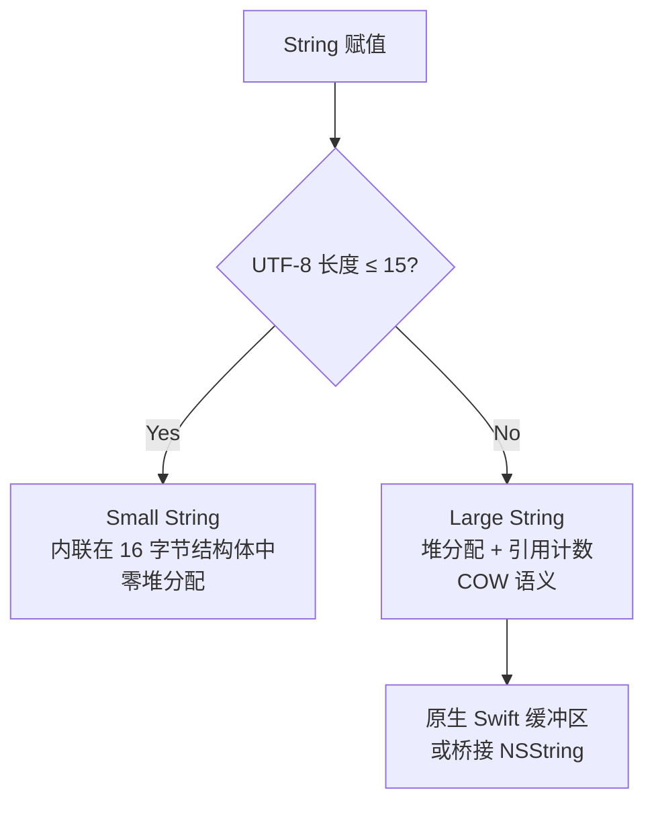
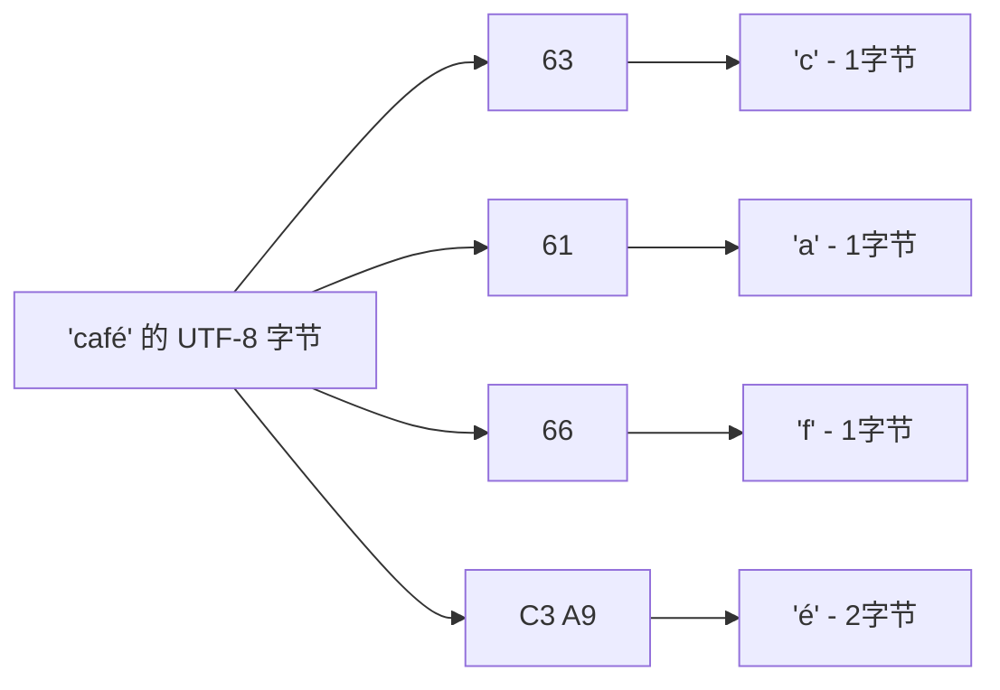
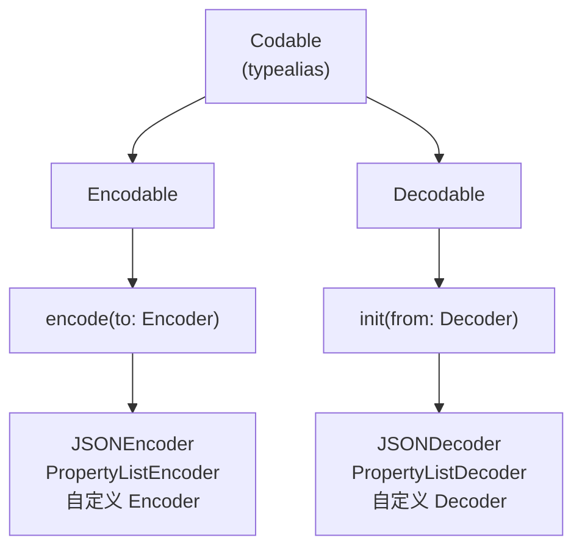
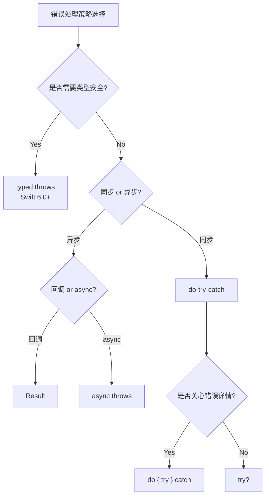

# 字符串与 Codable 详细解析

> **核心结论**：Swift 的 String 是 Unicode 正确性的标杆实现——基于 UTF-8 编码、Extended Grapheme Cluster 语义、Small String Optimization，在正确性与性能之间取得了精妙平衡。Codable 协议通过编译器自动合成彻底消除了 JSON 序列化的样板代码，而自定义编解码能力又足以应对最复杂的 API 场景。Error 协议 + Result 类型 + Typed Throws 构成了 Swift 完整的错误处理体系。

---

## 目录

1. [核心结论 TL;DR](#1-核心结论-tldr)
2. [String 内部表示](#2-string-内部表示)
3. [Character 与 Unicode](#3-character-与-unicode)
4. [Substring 与字符串切片](#4-substring-与字符串切片)
5. [字符串操作](#5-字符串操作)
6. [Codable 协议体系](#6-codable-协议体系)
7. [自定义编解码](#7-自定义编解码)
8. [错误处理体系](#8-错误处理体系)
9. [最佳实践](#9-最佳实践)
10. [常见陷阱](#10-常见陷阱)
11. [面试考点](#11-面试考点)
12. [参考资源](#12-参考资源)

---

## 1. 核心结论 TL;DR

| 维度 | 核心洞察 |
|------|---------|
| String 编码 | Swift 5+ 内部采用 UTF-8，兼顾与 C/系统层互操作性和内存效率 |
| 索引设计 | `String.Index` 不是 Int，因为 Unicode 字符长度不固定，O(1) 整数下标会给出错误语义 |
| Codable | 编译器为所有属性都 Codable 的类型自动合成 `init(from:)` 和 `encode(to:)`，零样板代码 |
| 错误处理 | `throws` + `Result` + typed throws（Swift 6.0）覆盖同步/异步/类型安全三大场景 |
| Small String | 长度 ≤ 15 字节的字符串直接存储在栈上（64 位系统），无堆分配 |

---

## 2. String 内部表示

### 2.1 UTF-8 编码（Swift 5+）

**结论先行**：Swift 5 将 String 的内部存储从 UTF-16 迁移到 UTF-8，这是一个重大架构变更，带来了更好的内存效率和 C 互操作性。

```
┌─────────── String 内存布局选择 ──────────────────────────┐
│                                                           │
│  Swift 4: UTF-16（与 NSString 一致）                       │
│  Swift 5+: UTF-8（与系统层/网络层一致）                     │
│                                                           │
│  "Hello" 在不同编码下的内存占用：                            │
│  UTF-8:  [48 65 6C 6C 6F]             → 5 bytes           │
│  UTF-16: [00 48 00 65 00 6C 00 6C 00 6F] → 10 bytes       │
│                                                           │
│  "你好" 在不同编码下：                                      │
│  UTF-8:  [E4 BD A0 E5 A5 BD]          → 6 bytes           │
│  UTF-16: [4F 60 59 7D]                → 4 bytes            │
└───────────────────────────────────────────────────────────┘
```

### 2.2 Small String Optimization

**结论先行**：长度 ≤ 15 字节（64 位系统）的字符串直接内联存储在 String 结构体中，零堆分配。

```swift
// String 结构体大小 = 16 字节（2 个 word）
// Word 1: 存储标志位 + 长度/容量
// Word 2: 小字符串内联数据 或 堆缓冲区指针

// ✅ 小字符串：内联存储（≤15 字节 UTF-8）
let small = "Hello"          // 5 bytes → 内联，零堆分配
let chinese = "你好"          // 6 bytes → 内联
let emoji = "😀"             // 4 bytes → 内联

// 堆分配字符串：超过 15 字节
let large = "This is a longer string"  // 23 bytes → 堆分配
```



### 2.3 String 的 COW 行为

```swift
var s1 = "Hello, World!"  // 堆分配（13 bytes > 15 on 32-bit, 但 64-bit 可能内联）
var s2 = s1  // 共享存储，refCount++

s2.append(" Swift")  // 写时复制：检测到 refCount > 1，先复制再修改
// s1 = "Hello, World!"
// s2 = "Hello, World! Swift"
```

### 2.4 与 C++ std::string 对比

| 特性 | Swift String | C++ std::string |
|------|-------------|----------------|
| 编码 | UTF-8（语义保证） | 无编码语义（字节数组） |
| SSO 阈值 | 15 字节（64 位） | 15-22 字节（实现相关） |
| 值语义 | COW | 完整深复制（C++11 后禁止 COW） |
| Unicode 支持 | 原生 Character = Grapheme Cluster | 无，需第三方库（ICU） |
| 索引类型 | `String.Index`（不透明） | `size_t`（整数） |
| 空终止符 | 可选（`withCString`） | 始终有 `\0` |
| 线程安全 | COW 引用计数原子操作 | 不安全（C++11 后） |

---

## 3. Character 与 Unicode

### 3.1 Character = Extended Grapheme Cluster

**结论先行**：Swift 的 `Character` 不是一个 Unicode 码点，而是一个 Extended Grapheme Cluster（用户感知的字符），这是 Unicode 正确性的关键。

```swift
// ✅ 一个 Character 可能由多个 Unicode 标量组成
let flag: Character = "🇨🇳"  // 由 2 个 Regional Indicator 组成
flag.unicodeScalars.count     // 2 (U+1F1E8 + U+1F1F3)

let family: Character = "👨‍👩‍👧‍👦"  // 由 7 个标量 + ZWJ 连接
family.unicodeScalars.count   // 7

let accent: Character = "é"  // 可能是 1 个标量（U+00E9）
                              // 或 2 个标量（e + ◌́ = U+0065 + U+0301）

// 关键：无论底层由几个标量组成，Swift 都视为 1 个 Character
"🇨🇳".count  // 1
"👨‍👩‍👧‍👦".count  // 1
"café".count   // 4（不是 5）
```

### 3.2 String.Index 为什么不是 Int

**结论先行**：由于 Character 长度可变（1-8+ 个 UTF-8 字节），整数下标无法在 O(1) 内定位字符。Swift 选择暴露这一复杂性，而非隐藏它。

```swift
let str = "café"

// ❌ 不能用整数下标
// str[2]  // 编译错误

// ✅ 必须用 String.Index
let index = str.index(str.startIndex, offsetBy: 2)
str[index]  // "f"

// ❌ 为什么不能用 Int？
// "🇨🇳Hello" 的 UTF-8 字节：[F0 9F 87 A8 F0 9F 87 B3 48 65 6C 6C 6F]
// 字符 "🇨🇳" 占 8 字节，"H" 占 1 字节
// 如果 str[1] 表示"第2个字符"，需要 O(n) 扫描才能找到位置
// Swift 拒绝提供 O(n) 的下标操作伪装成 O(1) 的 API
```



### 3.3 字符串遍历与索引操作

```swift
let greeting = "Hello, 世界! 🌍"

// ✅ 遍历 Character
for char in greeting {
    print(char, terminator: " ")  // H e l l o ,   世 界 !   🌍
}

// ✅ 遍历 Unicode 标量
for scalar in greeting.unicodeScalars {
    print(scalar.value, terminator: " ")
}

// ✅ 遍历 UTF-8 字节
for byte in greeting.utf8 {
    print(byte, terminator: " ")
}

// ✅ 索引操作
let start = greeting.startIndex
let fifth = greeting.index(start, offsetBy: 4)     // 'o'
let last = greeting.index(before: greeting.endIndex) // '🌍'

// ✅ 范围操作
let range = greeting.index(start, offsetBy: 7)..<greeting.index(start, offsetBy: 9)
greeting[range]  // "世界"
```

### 3.4 多语言字符处理

```swift
// ✅ Unicode 规范化：比较时自动处理
let e1 = "é"                    // U+00E9（预组合形式）
let e2 = "e\u{0301}"           // U+0065 + U+0301（分解形式）
e1 == e2                        // true（Swift 自动规范化比较）
e1.utf8.count                   // 2
e2.utf8.count                   // 3（底层不同，但语义相同）

// ✅ 处理 emoji 和修饰符
let thumbsUp = "👍"              // 基础 emoji
let thumbsUpDark = "👍🏿"         // emoji + 肤色修饰符
thumbsUp.count                   // 1
thumbsUpDark.count               // 1（视为单个字符）
thumbsUpDark.unicodeScalars.count // 2
```

---

## 4. Substring 与字符串切片

### 4.1 Substring 与 String 的关系

**结论先行**：`Substring` 与原 `String` 共享底层存储，是一种零拷贝切片。但如果长期持有 Substring，会阻止原字符串释放。

```
┌──── String "Hello, World!" ────────────────────┐
│  ┌────────────────────────────────────────────┐ │
│  │ H  e  l  l  o  ,     W  o  r  l  d  !    │ │
│  └────────────────────────────────────────────┘ │
│       ↑              ↑                          │
│       └──── Substring "ello, W" ────┘           │
│             共享存储，零拷贝                      │
└─────────────────────────────────────────────────┘
```

```swift
let str = "Hello, World!"
let sub = str.dropFirst(1).prefix(7)  // "ello, W" 类型是 Substring
type(of: sub)  // Substring

// Substring 和 String 可以互操作
let newStr = String(sub)  // 显式转换：此时复制数据，独立存储
```

### 4.2 共享存储与 COW

```swift
// ✅ Substring 共享原字符串的内存
var original = "This is a very long string that takes up a lot of memory"
let slice: Substring = original.prefix(10)  // "This is a "

// slice 持有对 original 底层缓冲区的引用
// 即使 original 被修改，slice 仍指向旧缓冲区（COW）

original += " more text"
// original 触发 COW，分配新缓冲区
// slice 仍指向旧缓冲区
```

### 4.3 Substring 转 String 的时机

```swift
// ❌ 长期持有 Substring → 阻止大字符串释放
class DataProcessor {
    var name: Substring  // 持有对大字符串的引用
    
    init(line: String) {
        // 假设 line = "name=John;age=30;city=Beijing;..."
        name = line.split(separator: ";").first!
            .split(separator: "=").last!  // "John"
        // 但整个 line 的缓冲区都无法释放！
    }
}

// ✅ 及时转换为 String
class DataProcessorFixed {
    var name: String  // 独立存储
    
    init(line: String) {
        name = String(line.split(separator: ";").first!
            .split(separator: "=").last!)  // 复制 "John"，释放 line
    }
}
```

---

## 5. 字符串操作

### 5.1 字符串拼接

```swift
// 方式 1：+ 运算符（简单场景）
let greeting = "Hello" + ", " + "World!"

// 方式 2：append（可变字符串，性能更好）
var message = "Count: "
message.append(String(42))

// 方式 3：字符串插值（最推荐）
let name = "Swift"
let version = 6
let info = "Language: \(name), Version: \(version)"

// ✅ 自定义插值
extension String.StringInterpolation {
    mutating func appendInterpolation(json value: Encodable) {
        let encoder = JSONEncoder()
        encoder.outputFormatting = .prettyPrinted
        if let data = try? encoder.encode(value),
           let str = String(data: data, encoding: .utf8) {
            appendLiteral(str)
        }
    }
}

struct User: Codable { let name: String; let age: Int }
let user = User(name: "Alice", age: 30)
print("User: \(json: user)")
```

### 5.2 字符串比较与搜索

```swift
let text = "Swift Programming Language"

// 比较
text == "swift programming language"  // false（大小写敏感）
text.lowercased() == "swift programming language"  // true
text.caseInsensitiveCompare("SWIFT PROGRAMMING LANGUAGE") == .orderedSame  // true

// 搜索
text.contains("Program")     // true
text.hasPrefix("Swift")      // true
text.hasSuffix("Language")   // true

// 查找范围
if let range = text.range(of: "Programming") {
    text[range]  // "Programming"
    text.distance(from: text.startIndex, to: range.lowerBound)  // 6
}
```

### 5.3 正则表达式（Swift 5.7+ Regex）

```swift
// ✅ Swift 5.7 原生正则语法
let input = "2024-03-15"

// Regex 字面量
let dateRegex = /(\d{4})-(\d{2})-(\d{2})/
if let match = input.firstMatch(of: dateRegex) {
    print(match.1)  // "2024"
    print(match.2)  // "03"
    print(match.3)  // "15"
}

// ✅ RegexBuilder DSL（类型安全）
import RegexBuilder

let emailRegex = Regex {
    OneOrMore(.word)
    "@"
    OneOrMore(.word)
    "."
    Repeat(2...6) {
        CharacterClass(.word)
    }
}

let email = "user@example.com"
email.wholeMatch(of: emailRegex) != nil  // true

// ✅ 字符串替换
let cleaned = "Hello   World".replacing(/\s+/, with: " ")  // "Hello World"
```

---

## 6. Codable 协议体系

### 6.1 Encodable / Decodable 协议

**结论先行**：`Codable` 是 `Encodable & Decodable` 的类型别名。编译器对所有属性都 Codable 的 struct/class/enum 自动合成实现。

```swift
// ✅ 自动合成：零样板代码
struct Article: Codable {
    let id: Int
    let title: String
    let tags: [String]
    let publishDate: Date?
}

// 编译器自动生成：
// - init(from decoder: Decoder) throws
// - func encode(to encoder: Encoder) throws
// - enum CodingKeys: String, CodingKey
```



### 6.2 编译器自动合成的条件

```swift
// ✅ 自动合成条件：
// 1. 所有存储属性都遵循 Codable
// 2. 没有自定义 init(from:) 或 encode(to:)

struct User: Codable {
    let name: String       // String: Codable ✅
    let age: Int           // Int: Codable ✅
    let scores: [Double]   // [Double]: Codable ✅
    let metadata: [String: String]  // Dictionary: Codable ✅
}

// ❌ 不能自动合成
struct BadModel: Codable {
    let callback: () -> Void  // 闭包不是 Codable
    // 💥 编译错误：Type 'BadModel' does not conform to 'Codable'
}
```

### 6.3 CodingKeys 自定义

```swift
// ✅ 自定义 JSON 键名映射
struct Product: Codable {
    let id: Int
    let productName: String
    let isAvailable: Bool
    
    enum CodingKeys: String, CodingKey {
        case id
        case productName = "product_name"    // snake_case → camelCase
        case isAvailable = "is_available"
    }
}

// 或使用全局策略
let decoder = JSONDecoder()
decoder.keyDecodingStrategy = .convertFromSnakeCase

// JSON: {"id": 1, "product_name": "iPhone", "is_available": true}
// 自动映射到 productName / isAvailable
```

### 6.4 JSONEncoder / JSONDecoder 配置

```swift
// ✅ 完整配置示例
let encoder = JSONEncoder()
encoder.outputFormatting = [.prettyPrinted, .sortedKeys]
encoder.dateEncodingStrategy = .iso8601
encoder.keyEncodingStrategy = .convertToSnakeCase
encoder.dataEncodingStrategy = .base64

let decoder = JSONDecoder()
decoder.dateDecodingStrategy = .iso8601
decoder.keyDecodingStrategy = .convertFromSnakeCase
decoder.dataDecodingStrategy = .base64

// 使用
struct Event: Codable {
    let name: String
    let startDate: Date
    let payload: Data
}

let event = Event(name: "WWDC", startDate: Date(), payload: Data([0x01, 0x02]))
let json = try encoder.encode(event)
print(String(data: json, encoding: .utf8)!)
let decoded = try decoder.decode(Event.self, from: json)
```

---

## 7. 自定义编解码

### 7.1 手动实现 init(from:) 和 encode(to:)

```swift
// ✅ 处理嵌套 JSON 结构
// JSON: { "user": { "name": "Alice", "profile": { "age": 30, "city": "Beijing" } } }
struct UserProfile: Codable {
    let name: String
    let age: Int
    let city: String
    
    enum OuterKeys: String, CodingKey { case user }
    enum UserKeys: String, CodingKey { case name, profile }
    enum ProfileKeys: String, CodingKey { case age, city }
    
    init(from decoder: Decoder) throws {
        let outer = try decoder.container(keyedBy: OuterKeys.self)
        let user = try outer.nestedContainer(keyedBy: UserKeys.self, forKey: .user)
        name = try user.decode(String.self, forKey: .name)
        
        let profile = try user.nestedContainer(keyedBy: ProfileKeys.self, forKey: .profile)
        age = try profile.decode(Int.self, forKey: .age)
        city = try profile.decode(String.self, forKey: .city)
    }
    
    func encode(to encoder: Encoder) throws {
        var outer = encoder.container(keyedBy: OuterKeys.self)
        var user = outer.nestedContainer(keyedBy: UserKeys.self, forKey: .user)
        try user.encode(name, forKey: .name)
        
        var profile = user.nestedContainer(keyedBy: ProfileKeys.self, forKey: .profile)
        try profile.encode(age, forKey: .age)
        try profile.encode(city, forKey: .city)
    }
}
```

### 7.2 处理异构 JSON（多态解码）

```swift
// JSON 中 type 字段决定具体类型
// { "type": "text", "content": "Hello" }
// { "type": "image", "url": "https://...", "width": 100 }

enum MessageContent: Codable {
    case text(String)
    case image(url: String, width: Int)
    
    enum CodingKeys: String, CodingKey {
        case type, content, url, width
    }
    
    init(from decoder: Decoder) throws {
        let container = try decoder.container(keyedBy: CodingKeys.self)
        let type = try container.decode(String.self, forKey: .type)
        
        switch type {
        case "text":
            let content = try container.decode(String.self, forKey: .content)
            self = .text(content)
        case "image":
            let url = try container.decode(String.self, forKey: .url)
            let width = try container.decode(Int.self, forKey: .width)
            self = .image(url: url, width: width)
        default:
            throw DecodingError.dataCorrupted(
                .init(codingPath: container.codingPath,
                      debugDescription: "Unknown type: \(type)"))
        }
    }
    
    func encode(to encoder: Encoder) throws {
        var container = encoder.container(keyedBy: CodingKeys.self)
        switch self {
        case .text(let content):
            try container.encode("text", forKey: .type)
            try container.encode(content, forKey: .content)
        case .image(let url, let width):
            try container.encode("image", forKey: .type)
            try container.encode(url, forKey: .url)
            try container.encode(width, forKey: .width)
        }
    }
}
```

### 7.3 容错解码

```swift
// ✅ 属性包装器实现容错解码
@propertyWrapper
struct DefaultEmpty<T: Codable & RangeReplaceableCollection>: Codable {
    var wrappedValue: T
    
    init(wrappedValue: T) { self.wrappedValue = wrappedValue }
    
    init(from decoder: Decoder) throws {
        let container = try decoder.singleValueContainer()
        wrappedValue = (try? container.decode(T.self)) ?? T()
    }
}

@propertyWrapper
struct DefaultZero: Codable {
    var wrappedValue: Int
    
    init(wrappedValue: Int) { self.wrappedValue = wrappedValue }
    
    init(from decoder: Decoder) throws {
        let container = try decoder.singleValueContainer()
        wrappedValue = (try? container.decode(Int.self)) ?? 0
    }
}

// 使用
struct APIResponse: Codable {
    let name: String
    @DefaultEmpty var tags: [String]    // JSON 中缺失或为 null → []
    @DefaultZero var retryCount: Int    // JSON 中缺失或非数字 → 0
}

// {"name": "test"} → tags = [], retryCount = 0
// {"name": "test", "tags": null} → tags = []
```

---

## 8. 错误处理体系

### 8.1 Error 协议

```swift
// ✅ 自定义错误类型
enum NetworkError: Error {
    case invalidURL
    case timeout(seconds: Int)
    case httpError(statusCode: Int, message: String)
    case decodingFailed(underlying: Error)
}

// 添加 LocalizedError 提供用户友好描述
extension NetworkError: LocalizedError {
    var errorDescription: String? {
        switch self {
        case .invalidURL: return "无效的 URL"
        case .timeout(let seconds): return "请求超时（\(seconds)秒）"
        case .httpError(let code, let msg): return "HTTP \(code): \(msg)"
        case .decodingFailed(let err): return "解码失败: \(err.localizedDescription)"
        }
    }
}
```

### 8.2 throws / rethrows / async throws

```swift
// ✅ throws：函数可能抛出错误
func fetchData(from url: String) throws -> Data {
    guard let url = URL(string: url) else {
        throw NetworkError.invalidURL
    }
    // ...
    return Data()
}

// ✅ rethrows：只有当闭包参数抛出时才抛出
func retry<T>(times: Int, task: () throws -> T) rethrows -> T {
    for attempt in 1..<times {
        do { return try task() }
        catch { if attempt == times - 1 { throw error } }
    }
    return try task()
}

// ✅ async throws：异步 + 可抛出
func fetchUser(id: Int) async throws -> User {
    let (data, response) = try await URLSession.shared.data(
        from: URL(string: "https://api.example.com/users/\(id)")!
    )
    guard let httpResponse = response as? HTTPURLResponse,
          httpResponse.statusCode == 200 else {
        throw NetworkError.httpError(statusCode: 0, message: "Bad response")
    }
    return try JSONDecoder().decode(User.self, from: data)
}
```

### 8.3 Result<Success, Failure> 类型

```swift
// ✅ Result 适合回调/存储场景
enum Result<Success, Failure: Error> {
    case success(Success)
    case failure(Failure)
}

// 回调风格
func fetchData(completion: @escaping (Result<Data, NetworkError>) -> Void) {
    // ...
    completion(.success(Data()))
    // 或
    completion(.failure(.timeout(seconds: 30)))
}

// ✅ Result 与 throws 互转
let result: Result<Int, Error> = Result { try riskyOperation() }

switch result {
case .success(let value): print("成功: \(value)")
case .failure(let error): print("失败: \(error)")
}

// Result → throws
let value = try result.get()
```

### 8.4 try / try? / try!

```swift
// try：正常的错误传播
func process() throws {
    let data = try fetchData(from: "https://api.example.com")
    // 如果 fetchData 抛出，错误自动向上传播
}

// try?：将错误转为 nil
let data = try? fetchData(from: "https://api.example.com")
// data 类型是 Data?，错误被静默忽略

// try!：断言不会出错（出错则崩溃）
let config = try! loadDefaultConfig()  // 100% 确定不会失败时使用

// ❌ 滥用 try!
// let userData = try! fetchFromNetwork()  // 网络请求可能失败 → 崩溃
```

### 8.5 Typed Throws（Swift 6.0）

```swift
// ✅ Swift 6.0：指定错误类型
func parse(json: String) throws(ParseError) -> Document {
    guard !json.isEmpty else {
        throw .emptyInput
    }
    // ...
}

enum ParseError: Error {
    case emptyInput
    case invalidSyntax(line: Int)
    case unexpectedToken(String)
}

// 调用方可以精确匹配错误类型
do {
    let doc = try parse(json: input)
} catch .emptyInput {
    print("输入为空")
} catch .invalidSyntax(let line) {
    print("第 \(line) 行语法错误")
} catch .unexpectedToken(let token) {
    print("意外的 token: \(token)")
}
// 无需 catch-all！编译器确保已处理所有 case
```



---

## 9. 最佳实践

1. **字符串索引用 `String.Index`**：不要试图将 String 转为 `[Character]` 再用 Int 索引，除非确实需要随机访问
2. **及时将 `Substring` 转为 `String`**：避免长期持有 Substring 导致大字符串无法释放
3. **用字符串插值代替 `+` 拼接**：`"\(a)\(b)"` 比 `a + b` 更高效（避免中间字符串分配）
4. **Codable 优先用编译器合成**：只在真正需要自定义映射时才手动实现
5. **用 `keyDecodingStrategy` 替代手写 CodingKeys**：全局 snake_case ↔ camelCase 转换更简洁
6. **容错解码用 `decodeIfPresent` 或属性包装器**：API 返回值不可信时做好防御
7. **错误类型用 enum + 关联值**：提供足够的上下文信息辅助调试
8. **async/await 场景用 `async throws`**：比 `Result` 回调更清晰
9. **`try?` 只用于真正可忽略的错误**：重要操作必须用 `do-catch` 捕获

---

## 10. 常见陷阱

### 陷阱 1：字符串 count 的 O(n) 复杂度

```swift
let str = "Hello, 世界! 🌍"

// ❌ 在循环中反复调用 .count
for i in 0..<str.count {  // 每次 .count 都是 O(n)！
    // 总复杂度 O(n²)
}

// ✅ 缓存 count 或直接遍历
let length = str.count
for i in 0..<length { /* ... */ }

// 更好：直接用 for-in
for char in str { /* ... */ }
```

### 陷阱 2：Codable 日期解码默认策略

```swift
// ❌ 默认 dateDecodingStrategy 是 .deferredToDate
// 期望 JSON 中的日期是 Double（timeIntervalSinceReferenceDate）
// {"date": 733449600.0}  → 这不是你通常想要的

// ✅ 根据 API 实际格式设置策略
let decoder = JSONDecoder()
decoder.dateDecodingStrategy = .iso8601  // "2024-03-15T10:30:00Z"
// 或自定义
let formatter = DateFormatter()
formatter.dateFormat = "yyyy-MM-dd"
decoder.dateDecodingStrategy = .formatted(formatter)
```

### 陷阱 3：try? 静默吞掉错误

```swift
// ❌ 无法排查问题
let user = try? decoder.decode(User.self, from: data)
// user 为 nil，但不知道为什么失败

// ✅ 至少记录错误
let user: User?
do {
    user = try decoder.decode(User.self, from: data)
} catch {
    print("Decode failed: \(error)")  // 输出具体原因
    user = nil
}
```

### 陷阱 4：String 与 NSString 桥接的陷阱

```swift
// ❌ NSString.length 是 UTF-16 码元数，不是字符数
let str = "👨‍👩‍👧‍👦"
str.count                        // 1（Swift Character）
(str as NSString).length         // 11（UTF-16 码元数）

// 跨框架传递时注意索引不兼容
let nsRange = NSRange(location: 0, length: (str as NSString).length)
let swiftRange = Range(nsRange, in: str)  // ✅ 安全转换
```

---

## 11. 面试考点

### 考点 1：String.Index 设计原因

**Q：Swift 的 String 为什么不支持 `str[0]` 这样的整数下标？**

**A**：因为 Swift String 基于 UTF-8 编码，一个 Character（Extended Grapheme Cluster）可能由 1-8+ 个字节组成。整数下标暗示 O(1) 随机访问，但定位第 n 个字符必须从头扫描，是 O(n) 操作。Swift 选择暴露这一复杂性——使用 `String.Index` 类型，迫使开发者意识到性能代价。

**追问**：如果确实需要高频随机访问字符怎么办？
**A**：可以转换为 `Array<Character>`，代价是 O(n) 的一次性转换 + 额外内存。对于纯 ASCII 字符串，可以使用 `.utf8` 视图的整数索引。

**追问**：String 的 `count` 属性是 O(1) 还是 O(n)？
**A**：O(n)。因为需要遍历所有 UTF-8 字节来计算 Grapheme Cluster 数量。`utf8.count` 是 O(1)（存储在 header 中）。

### 考点 2：Codable 自动合成机制

**Q：Swift 编译器是如何自动合成 Codable 实现的？什么情况下会失败？**

**A**：编译器在类型的所有存储属性都遵循 Codable 时自动合成。它生成一个 `CodingKeys` 枚举（case 名与属性名一一对应），以及 `init(from:)` 和 `encode(to:)` 方法。失败情况包括：属性类型不遵循 Codable（如闭包、未标记的自定义类型）、已手动定义了部分 Codable 方法但未完整实现。

**追问**：如何处理服务端返回的字段比模型多或少的情况？
**A**：多出的字段自动忽略。缺失的字段需要将属性声明为 Optional（`Type?`），或使用 `decodeIfPresent` + 默认值。也可以通过属性包装器实现全局容错。

### 考点 3：Error 协议与错误处理策略

**Q：Swift 的 `throws` 和 `Result` 类型分别适用于什么场景？Swift 6.0 的 typed throws 解决了什么问题？**

**A**：`throws` 适合同步函数的错误传播，调用链通过 `try` 自动传播。`Result` 适合异步回调和需要存储结果的场景。两者的共同问题是错误类型被擦除为 `any Error`，调用方无法在编译期知道具体错误类型。Swift 6.0 的 typed throws（`throws(ErrorType)`）让函数签名精确声明错误类型，`catch` 可以穷尽匹配所有 case，无需 catch-all 兜底。

**追问**：`rethrows` 和 `throws` 的区别？
**A**：`rethrows` 的函数只在其闭包参数抛出时才被视为 throwing。如果传入的闭包不 throws，调用方不需要 `try`。这让 `map`、`filter` 等高阶函数既能接受 throwing 闭包，又不强制所有调用方加 `try`。

---

## 12. 参考资源

- [Swift 官方文档 - Strings and Characters](https://docs.swift.org/swift-book/documentation/the-swift-programming-language/stringsandcharacters/)
- [Swift 官方文档 - Encoding and Decoding](https://docs.swift.org/swift-book/documentation/the-swift-programming-language/encoding-and-decoding/)
- [Swift 源码 - String.swift](https://github.com/apple/swift/blob/main/stdlib/public/core/String.swift)
- [UTF-8 String - Swift.org Blog](https://www.swift.org/blog/utf8-string/)
- [SE-0413: Typed throws](https://github.com/apple/swift-evolution/blob/main/proposals/0413-typed-throws.md)
- [WWDC 2019 - What's New in Swift 5.1](https://developer.apple.com/videos/play/wwdc2019/402/)
- [Flight School - Codable Guide](https://flight.school/books/codable/)
