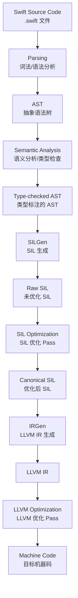

# 编译器架构与优化详细解析

> **核心结论**：Swift 编译器采用多阶段流水线架构（Source → AST → SIL → LLVM IR → Machine Code），其中 SIL（Swift Intermediate Language）是 Swift 独有的中间表示层，承担了大量 Swift 特有的优化（ARC 优化、泛型特化、去虚拟化等）。理解编译流水线有助于：(1) 编写对编译器更友好的代码；(2) 利用 SIL 诊断性能问题；(3) 合理使用 WMO、@inlinable 等优化手段。方法派发机制（Direct / VTable / Message）直接影响运行时性能，选择正确的派发方式可获得 2-10x 的方法调用性能差异。

---

## 目录

1. [Swift 编译器架构](#一swift-编译器架构)
2. [SIL（Swift Intermediate Language）](#二silswift-intermediate-language)
3. [方法派发机制](#三方法派发机制)
4. [编译器优化](#四编译器优化)
5. [编译性能优化](#五编译性能优化)
6. [Instruments 性能分析](#六instruments-性能分析)
7. [面试要点](#七面试要点)
8. [最佳实践](#八最佳实践)
9. [常见陷阱](#九常见陷阱)

---

## 一、Swift 编译器架构

### 1.1 核心结论

**Swift 编译器（swiftc）基于 LLVM 构建，但在 LLVM IR 之上增加了 SIL 层，用于处理 Swift 语言特有的优化。完整编译流水线包含 7 个阶段，每个阶段有明确的输入输出和职责边界。**

### 1.2 完整编译流水线



### 1.3 各阶段详解

| 阶段 | 输入 | 输出 | 核心职责 |
|------|------|------|---------|
| **Parsing** | .swift 源码 | AST | 词法分析（Lexer）+ 语法分析（Parser），生成抽象语法树 |
| **Semantic Analysis** | AST | Type-checked AST | 类型推断、类型检查、协议一致性验证、泛型约束求解 |
| **SILGen** | Type-checked AST | Raw SIL | 将 AST 降级为 SIL，插入 ARC 指令、生成 witness table |
| **SIL Optimization** | Raw SIL | Canonical SIL | Swift 特有优化：ARC 优化、泛型特化、内联、去虚拟化 |
| **IRGen** | Canonical SIL | LLVM IR | 将 SIL 降级为 LLVM IR，映射 Swift 类型到 LLVM 类型 |
| **LLVM Optimization** | LLVM IR | Optimized LLVM IR | 通用编译优化：循环优化、向量化、死代码消除 |
| **Code Generation** | Optimized LLVM IR | .o 目标文件 | 生成目标平台机器码 |

### 1.4 与 C/C++ 编译流程的对比

| 维度 | Swift（swiftc） | C/C++（Clang） |
|------|----------------|----------------|
| **前端** | Swift Parser → AST → SIL | Preprocessor → Clang AST |
| **中间表示** | SIL（Swift 专有）+ LLVM IR | 仅 LLVM IR |
| **类型检查** | 复杂的类型推断 + 协议约束求解 | 相对简单的类型检查 |
| **ARC 处理** | SIL 层插入 retain/release | Clang 在 AST → IR 阶段处理 |
| **泛型处理** | SIL 层特化 + 运行时 witness table | 模板实例化（编译时完全展开） |
| **头文件** | 无头文件，模块化导入 | 预处理器 #include |
| **编译速度** | 较慢（类型推断 + SIL 优化） | 较快（简单类型系统） |

### 1.5 查看各阶段输出

```bash
# 查看 AST
swiftc -dump-ast main.swift

# 查看 Raw SIL（未优化）
swiftc -emit-silgen main.swift

# 查看 Canonical SIL（优化后）
swiftc -emit-sil main.swift

# 查看 LLVM IR
swiftc -emit-ir main.swift

# 查看汇编
swiftc -emit-assembly main.swift

# 查看编译时间细分
swiftc -Xfrontend -debug-time-compilation main.swift
```

---

## 二、SIL（Swift Intermediate Language）

### 2.1 核心结论

**SIL 是 Swift 编译器独有的中间表示，位于 AST 和 LLVM IR 之间。它的设计目标是捕获 Swift 语言的高级语义（ARC、泛型、协议、值类型等），使得 Swift 特有的优化可以在此层完成，而非下沉到 LLVM 层。**

### 2.2 SIL 的设计目标

```
┌─────────────────────────────────────────────────────────────────┐
│                      SIL 设计目标                                │
├─────────────────────────────────────────────────────────────────┤
│                                                                  │
│  1. 保留 Swift 高级语义                                          │
│     • 值类型 vs 引用类型的区分                                   │
│     • ARC 的精确语义（retain/release/copy/destroy）              │
│     • 泛型类型参数与 witness table                               │
│                                                                  │
│  2. 支持 Swift 特有优化                                          │
│     • ARC 优化（消除冗余 retain/release）                        │
│     • 泛型特化（为具体类型生成特化代码）                         │
│     • 去虚拟化（将虚调用优化为直接调用）                         │
│     • 所有权分析（检测内存安全违规）                             │
│                                                                  │
│  3. 强制正确性保证                                               │
│     • 定义赋值检查（DI：Definite Initialization）                │
│     • 独占访问检查（Exclusivity Enforcement）                    │
│     • 内存安全保证                                               │
│                                                                  │
│  LLVM IR 无法表达这些 Swift 特有语义 → 需要 SIL 层              │
└─────────────────────────────────────────────────────────────────┘
```

### 2.3 Raw SIL vs Canonical SIL

| 特征 | Raw SIL（SILGen 输出） | Canonical SIL（优化后） |
|------|------------------------|------------------------|
| **ARC 指令** | 保守的 retain/release（每次访问都插入） | 优化后的最小 retain/release |
| **泛型** | 保留泛型参数 | 部分特化为具体类型 |
| **控制流** | 直接从 AST 转换，可能冗余 | 优化后的 CFG（控制流图） |
| **诊断** | 用于强制正确性检查（DI、Exclusivity） | 用于优化和代码生成 |
| **用途** | 编译器诊断 | 后续 IRGen 的输入 |

### 2.4 关键 SIL 优化 Pass

| Pass 名称 | 功能 | 性能影响 |
|-----------|------|---------|
| **ARC Optimization** | 消除冗余 retain/release 对 | 高 — 减少引用计数操作 |
| **Generic Specialization** | 为具体类型生成特化版本 | 高 — 消除泛型间接开销 |
| **Devirtualization** | 将虚方法调用优化为直接调用 | 高 — 消除 vtable 查表 |
| **Function Inlining** | 将小函数内联到调用点 | 中 — 减少调用开销 |
| **Dead Code Elimination** | 删除不可达代码 | 低 — 减小二进制体积 |
| **Copy Propagation** | 消除不必要的值拷贝 | 中 — 减少拷贝开销 |
| **Constant Folding** | 编译期求值常量表达式 | 低 — 减少运行时计算 |
| **Closure Optimization** | 内联闭包、消除上下文捕获 | 中 — 减少堆分配 |

### 2.5 SIL 示例解读

```swift
// Swift 源码
func add(_ a: Int, _ b: Int) -> Int {
    return a + b
}
```

```
// swiftc -emit-sil（简化）
sil @$s4main3addyS2i_SitF : $@convention(thin) (Int, Int) -> Int {
bb0(%0 : $Int, %1 : $Int):
  %2 = struct_extract %0 : $Int, #Int._value    // 提取底层值
  %3 = struct_extract %1 : $Int, #Int._value
  %4 = builtin "add_Int64"(%2 : $Builtin.Int64, %3 : $Builtin.Int64) : $Builtin.Int64
  %5 = struct $Int (%4 : $Builtin.Int64)        // 封装回 Int
  return %5 : $Int
}
```

**解读**：SIL 保留了 Swift 类型信息（`$Int`），同时展示了底层操作（`struct_extract` → `builtin add` → `struct` 封装）。

---

## 三、方法派发机制

### 3.1 核心结论

**Swift 支持三种方法派发方式：直接派发（最快）、VTable 派发（默认 class 方法）、消息派发（@objc dynamic）。选择正确的派发方式可获得 2-10x 的方法调用性能差异。编译器会自动选择最优派发方式，但开发者可通过 `final`、`private`、`@objc dynamic` 等关键字影响决策。**

### 3.2 三种派发方式

#### 直接派发（Direct / Static Dispatch）

```swift
// 直接派发的情况：
struct Point {
    func distance() -> Double { ... }  // ✅ struct 方法 → 直接派发
}

final class Config {
    func load() { ... }  // ✅ final class 方法 → 直接派发
}

class ViewModel {
    private func validate() { ... }  // ✅ private 方法 → 直接派发
}

extension UIView {
    func shake() { ... }  // ✅ extension 方法（非 @objc） → 直接派发
}
```

**特点**：编译时确定调用地址，可内联优化，无运行时开销。

#### VTable 派发（Virtual Table Dispatch）

```swift
// VTable 派发的情况：
class Animal {
    func speak() { print("...") }  // ✅ class 方法默认 → VTable 派发
}

class Dog: Animal {
    override func speak() { print("Woof") }  // ✅ override → VTable 派发
}

let animal: Animal = Dog()
animal.speak()  // 运行时通过 VTable 查找实际方法
```

**特点**：运行时通过 vtable 查表确定调用地址，支持多态，有一次间接跳转开销。

#### 消息派发（Message Dispatch）

```swift
// 消息派发的情况：
class AnalyticsTracker: NSObject {
    @objc dynamic func track(_ event: String) { ... }  // ✅ 消息派发
}

// 支持 Method Swizzling
extension AnalyticsTracker {
    @objc dynamic func swizzled_track(_ event: String) {
        // 注入逻辑
        self.swizzled_track(event)  // 调用原始实现
    }
}
```

**特点**：通过 ObjC 运行时消息发送（objc_msgSend），支持 Method Swizzling、KVO 等动态特性，开销最大。

### 3.3 派发方式决策树

```mermaid
graph TB
    A[方法调用] --> B{声明在哪里？}
    B -->|Struct / Enum| C[直接派发]
    B -->|Protocol| D{调用方式？}
    B -->|Class| E{是否有修饰符？}
    B -->|Extension| F{是否 @objc？}
    
    D -->|泛型约束 T: Protocol| G[直接派发<br/>Protocol Witness Table]
    D -->|协议类型 any Protocol| H[VTable 派发<br/>Existential Container]
    
    E -->|final / private / static| C
    E -->|@objc dynamic| I[消息派发]
    E -->|普通方法| J[VTable 派发]
    
    F -->|是| I
    F -->|否| C
```

### 3.4 性能对比数据

```
┌─────────────────────────────────────────────────────────────────┐
│              方法派发性能对比（单次调用，纳秒级）                  │
├─────────────────────────────────────────────────────────────────┤
│                                                                  │
│  Direct Dispatch     │██                          ~1-2ns         │
│  VTable Dispatch     │████                        ~3-5ns         │
│  Message Dispatch    │████████████████             ~15-25ns      │
│                                                                  │
│  内联后 Direct       │█                            <1ns          │
│                                                                  │
│  注意：单次差异微小，但热路径上百万次调用时差异显著               │
│  建议：性能敏感路径使用 final / struct，避免 @objc dynamic        │
└─────────────────────────────────────────────────────────────────┘
```

### 3.5 与 C++ 虚函数表的对比

| 维度 | Swift VTable | C++ VTable |
|------|-------------|------------|
| **默认行为** | class 方法默认虚（可 final 关闭） | 方法默认非虚（需 virtual 开启） |
| **去虚拟化** | 编译器积极去虚拟化（WMO 模式下） | LTO 模式下可去虚拟化 |
| **多重继承** | 不支持（协议替代） | 支持（多个 vtable 指针） |
| **Extension** | 不进入 VTable（直接派发） | N/A |
| **消息派发** | @objc dynamic（可选） | 无（无运行时消息机制） |
| **表结构** | 单一连续 vtable | 可能有多个 vtable（MI） |

---

## 四、编译器优化

### 4.1 全模块优化（Whole Module Optimization / WMO）

**核心原理**：默认情况下 Swift 编译器逐文件编译，每个文件是独立的编译单元，编译器无法跨文件优化。WMO 将整个模块作为一个编译单元，使编译器获得全局视图。

```bash
# 启用 WMO
swiftc -whole-module-optimization main.swift utils.swift

# Xcode 设置
# Build Settings → Swift Compiler - Code Generation
# Optimization Level: -Owholemodule (Release)
```

**WMO 启用的关键优化**：

| 优化类型 | 无 WMO | 有 WMO |
|---------|--------|--------|
| 跨文件内联 | ❌ 无法内联 | ✅ 可内联 |
| 跨文件去虚拟化 | ❌ 无法推断 | ✅ 可推断 final |
| 泛型特化 | ❌ 仅文件内 | ✅ 跨文件特化 |
| 死代码消除 | ❌ 保守保留 | ✅ 全局分析 |
| 访问控制推断 | ❌ 假设 public | ✅ 推断 internal 为 private |

```swift
// File: Utils.swift
class DataProcessor {
    func process(_ data: Data) -> Result { ... }
}

// File: Main.swift
let processor = DataProcessor()
processor.process(data)
// 无 WMO: VTable 派发（不知道 DataProcessor 没有子类）
// 有 WMO: 直接派发（编译器确认无子类 → 推断为 final）
```

### 4.2 函数内联（@inlinable / @usableFromInline）

```swift
// @inlinable: 允许函数体跨模块内联
@inlinable
public func fastAdd(_ a: Int, _ b: Int) -> Int {
    return a + b  // 函数体暴露给调用模块，编译器可内联
}

// @usableFromInline: 配合 @inlinable，暴露 internal 类型
@usableFromInline
internal struct InternalConfig {
    @usableFromInline var value: Int
    
    @inlinable
    internal init(value: Int) { self.value = value }
}
```

**使用场景与权衡**：

| 场景 | 是否标记 @inlinable | 原因 |
|------|-------------------|------|
| 简单计算函数（<5行） | ✅ 推荐 | 内联收益大，无抽象泄露风险 |
| 公共 API 核心逻辑 | ⚠️ 谨慎 | 函数体成为 ABI 的一部分，后续无法修改 |
| 复杂业务逻辑 | ❌ 不推荐 | 内联收益小，暴露实现细节 |
| 泛型函数 | ✅ 推荐 | 支持跨模块泛型特化 |

### 4.3 泛型特化（Generic Specialization）

```swift
// 泛型函数
func sort<T: Comparable>(_ array: inout [T]) {
    // 编译器为常用类型生成特化版本
    // sort<Int>、sort<String> 等 → 直接操作具体类型，无泛型间接开销
}

// 手动提示特化（标准库内部使用）
@_specialize(where T == Int)
@_specialize(where T == String)
public func binarySearch<T: Comparable>(_ array: [T], _ target: T) -> Int? {
    // 编译器为 Int 和 String 生成特化版本
    ...
}
```

**泛型特化前后性能差异**：

```
┌─────────────────────────────────────────────────────────────────┐
│              泛型特化性能对比（数组排序 100万元素）               │
├─────────────────────────────────────────────────────────────────┤
│                                                                  │
│  未特化泛型   │████████████████████████████████████   280ms      │
│  特化后       │████████████                           100ms      │
│  手写 Int 版  │███████████                             95ms      │
│                                                                  │
│  结论：泛型特化后性能接近手写类型特定版本                         │
└─────────────────────────────────────────────────────────────────┘
```

### 4.4 去虚拟化（Devirtualization）

```swift
// 编译器分析后，将虚调用优化为直接调用

// 场景一：final class
final class Logger {
    func log(_ msg: String) { print(msg) }
}
// 编译器知道 log() 不会被 override → 直接派发

// 场景二：WMO 推断
// 如果整个模块中没有 Animal 的子类
class Animal {
    func speak() { print("...") }
}
// WMO 模式下编译器推断 speak() 可直接派发

// 场景三：具体类型已知
func feedAnimal(_ animal: Dog) {  // 参数类型是 Dog，不是 Animal
    animal.speak()  // 编译器知道具体类型 → 直接派发
}
```

### 4.5 引用计数优化（ARC Optimization）

```swift
// 优化前（Raw SIL）
func processData() {
    let obj = MyClass()
    // retain obj
    doSomething(obj)
    // retain obj (传参)
    // release obj (传参结束)
    doAnother(obj)
    // retain obj (传参)
    // release obj (传参结束)
    // release obj (作用域结束)
}

// 优化后（Canonical SIL）
func processData() {
    let obj = MyClass()
    // retain obj (初始)
    doSomething(obj)      // 不需要额外 retain/release
    doAnother(obj)        // 不需要额外 retain/release
    // release obj (作用域结束)
}
// ARC 优化消除了 4 次冗余的 retain/release 操作
```

### 4.6 死代码消除

```swift
// 编译器会消除不可达代码
func example() {
    let mode = "production"
    
    if mode == "debug" {
        // 编译器常量折叠后，此分支永远不可达 → 消除
        enableDebugLogging()
    }
    
    // 未使用的函数也会被消除（WMO 模式下）
}
```

---

## 五、编译性能优化

### 5.1 增量编译策略

```
┌─────────────────────────────────────────────────────────────────┐
│                 Swift 增量编译机制                                │
├─────────────────────────────────────────────────────────────────┤
│                                                                  │
│  Swift 编译器维护文件间依赖图：                                  │
│                                                                  │
│  A.swift ──uses──→ B.swift ──uses──→ C.swift                    │
│                                                                  │
│  修改 C.swift 时：                                               │
│  • 如果 C 的公开接口未变：只重编译 C                             │
│  • 如果 C 的公开接口改变：重编译 C + B（+ 可能 A）              │
│                                                                  │
│  加速建议：                                                      │
│  • 使用 internal/private 限制接口暴露范围                        │
│  • 将稳定接口放入独立模块                                        │
│  • 避免在头部声明中使用复杂类型推断                              │
└─────────────────────────────────────────────────────────────────┘
```

### 5.2 编译时间分析

```bash
# 警告编译耗时超过阈值的函数体
swiftc -Xfrontend -warn-long-function-bodies=100 main.swift
# 函数体类型检查超过 100ms 时发出警告

# 警告编译耗时超过阈值的表达式
swiftc -Xfrontend -warn-long-expression-type-checking=100 main.swift

# 输出每个函数的编译时间统计
swiftc -Xfrontend -debug-time-function-bodies main.swift

# Xcode 设置
# Build Settings → Other Swift Flags:
# -Xfrontend -warn-long-function-bodies=200
# -Xfrontend -warn-long-expression-type-checking=200
```

### 5.3 减少编译时间的技巧

#### 避免复杂类型推断

```swift
// ❌ 编译器需要大量时间推断类型
let result = dict.values
    .filter { $0.count > 3 }
    .map { $0.uppercased() }
    .sorted()
    .joined(separator: ", ")

// ✅ 提供显式类型标注
let values: [String] = dict.values.filter { $0.count > 3 }
let uppercased: [String] = values.map { $0.uppercased() }
let result: String = uppercased.sorted().joined(separator: ", ")
```

#### 拆分复杂表达式

```swift
// ❌ 单一巨大表达式 — 类型检查指数级增长
let view = HStack {
    ForEach(items) { item in
        VStack {
            Text(item.title).font(.headline).foregroundColor(.primary)
            Text(item.subtitle).font(.subheadline).foregroundColor(.secondary)
            Image(item.icon).resizable().frame(width: 24, height: 24)
        }
        .padding()
        .background(Color.white)
        .cornerRadius(8)
    }
}

// ✅ 拆分为独立子视图
struct ItemRow: View {
    let item: Item
    var body: some View {
        VStack {
            Text(item.title).font(.headline).foregroundColor(.primary)
            Text(item.subtitle).font(.subheadline).foregroundColor(.secondary)
            Image(item.icon).resizable().frame(width: 24, height: 24)
        }
        .padding()
        .background(Color.white)
        .cornerRadius(8)
    }
}
```

#### 避免过度使用运算符重载

```swift
// ❌ 混合运算符 + 泛型 → 类型检查器组合爆炸
let point = CGPoint(x: a + b * c - d / e, y: f + g * h - i / j)

// ✅ 分步计算
let px = a + b * c - d / e
let py = f + g * h - i / j
let point = CGPoint(x: px, y: py)
```

### 5.4 模块化与编译并行度

```
┌─────────────────────────────────────────────────────────────────┐
│               模块化提升编译并行度                                │
├─────────────────────────────────────────────────────────────────┤
│                                                                  │
│  单体工程（串行）：                                              │
│  [─────── App Module ───────────────────────────────────] 60s   │
│                                                                  │
│  模块化工程（并行）：                                            │
│  [── Core ──]                                                    │
│  [── Network ──]          → 并行编译                             │
│  [── UI ──]               → 最长路径决定总时间                   │
│              [── App ──]  → 依赖完成后编译                       │
│  总时间：35s（节省 42%）                                         │
│                                                                  │
│  策略：                                                          │
│  • 将工程拆分为独立 Swift Package / Framework                    │
│  • 减少模块间依赖，扁平化依赖图                                  │
│  • 稳定模块预编译为二进制（XCFramework）                         │
└─────────────────────────────────────────────────────────────────┘
```

---

## 六、Instruments 性能分析

### 6.1 核心工具概览

| 工具 | 用途 | 关键指标 |
|------|------|---------|
| **Time Profiler** | CPU 热点分析 | 方法耗时占比、调用栈 |
| **Allocations** | 内存分配追踪 | 堆分配次数、对象存活数 |
| **Leaks** | 内存泄漏检测 | 循环引用、未释放对象 |
| **System Trace** | 系统级分析 | 线程调度、锁竞争、系统调用 |
| **Network** | 网络性能分析 | 请求延迟、带宽使用 |
| **Core Animation** | 渲染性能 | 帧率、离屏渲染、图层混合 |

### 6.2 Time Profiler 实战

```
性能分析工作流：
┌─────────────────────────────────────────────────────────────────┐
│  1. 设定性能目标                                                 │
│     • 启动时间 < 1s                                              │
│     • 列表滚动 60fps                                             │
│     • API 响应 < 500ms                                           │
│                                                                  │
│  2. Profile（Cmd + I）                                           │
│     • 选择 Time Profiler                                         │
│     • 执行目标场景                                               │
│     • 记录 5-10 秒                                               │
│                                                                  │
│  3. 分析调用栈                                                   │
│     • 按 Self Weight 排序 → 找到最耗时方法                       │
│     • Invert Call Tree → 从叶子节点向上分析                      │
│     • Hide System Libraries → 聚焦应用代码                       │
│                                                                  │
│  4. 优化 → 重新 Profile → 验证                                   │
└─────────────────────────────────────────────────────────────────┘
```

### 6.3 Allocations 实战

```swift
// 常见内存问题与 Allocations 工具检测

// 问题一：过度堆分配
// Allocations 中看到大量 malloc/free → 考虑值类型替代
class Point { var x, y: Double }  // ❌ 堆分配
struct Point { var x, y: Double } // ✅ 栈分配

// 问题二：闭包捕获导致不必要的对象存活
// Allocations → Mark Generation → 检查 Generation 间存活对象
func setupTimer() {
    timer = Timer.scheduledTimer(withTimeInterval: 1, repeats: true) { [weak self] _ in
        self?.update()  // weak 避免循环引用
    }
}

// 问题三：自动释放池压力
// Allocations → 检查 autorelease 对象峰值
func processLargeData() {
    for i in 0..<100000 {
        autoreleasepool {
            let data = createTemporaryData(i)  // 在 autoreleasepool 内释放
            process(data)
        }
    }
}
```

### 6.4 System Trace 与并发分析

```
使用 System Trace 诊断并发问题：

1. 线程饥饿：观察线程状态（Running / Blocked / Preempted）
2. 锁竞争：查看 os_unfair_lock / pthread_mutex 的等待时间
3. 优先级反转：检查低优先级线程持锁时高优先级线程等待
4. Actor 串行瓶颈：观察 Swift Concurrency Runtime 线程的利用率
```

---

## 七、面试要点

### Q1: Swift 的编译流程与 C++ 有什么区别？

**答案**：Swift 编译流程在 AST 和 LLVM IR 之间增加了 SIL（Swift Intermediate Language）层。SIL 保留了 Swift 高级语义（ARC、泛型、协议、值类型等），使得 Swift 特有的优化（ARC 优化、泛型特化、去虚拟化）可以在此层完成。C++ 的 Clang 前端直接生成 LLVM IR，因为 C++ 的模板在编译时完全展开，不需要类似 SIL 的中间层。

### Q2: Swift 有几种方法派发方式？分别在什么情况下使用？

**答案**：三种。(1) 直接派发：struct/enum 方法、final class 方法、private 方法、extension 方法；(2) VTable 派发：class 的普通方法（默认）；(3) 消息派发：标记 @objc dynamic 的方法。直接派发最快（~1-2ns），可被内联；VTable 派发一次间接跳转（~3-5ns）；消息派发通过 objc_msgSend（~15-25ns），但支持 Method Swizzling。

### Q3: 什么是 Whole Module Optimization？它启用了哪些优化？

**答案**：WMO 将整个 Swift 模块作为一个编译单元，使编译器获得全局视图。主要启用：(1) 跨文件函数内联；(2) 跨文件去虚拟化（推断 internal class 为 final）；(3) 跨文件泛型特化；(4) 全局死代码消除。代价是增量编译粒度从文件级变为模块级，Clean Build 时间略增。

### Q4: @inlinable 的作用和风险是什么？

**答案**：@inlinable 允许函数体跨模块边界内联，调用方模块可直接将函数体展开，消除调用开销。风险是函数体成为模块公共 ABI 的一部分，后续修改函数实现需要所有依赖方重新编译。适用于简单、稳定的公共工具函数，不适用于可能变化的业务逻辑。

### Q5: 如何诊断和优化 Swift 编译时间？

**答案**：(1) 使用 `-Xfrontend -warn-long-function-bodies=100` 找到编译耗时函数；(2) 为复杂表达式添加显式类型标注，减少类型推断负担；(3) 拆分大型 SwiftUI 视图为独立子视图；(4) 使用模块化架构提升编译并行度；(5) 对稳定依赖使用预编译二进制框架。

---

## 八、最佳实践

### 8.1 方法派发优化

```swift
// ✅ 对不需要继承的 class 标记 final
final class NetworkManager {
    func request(_ url: URL) async throws -> Data { ... }
}

// ✅ 优先使用 struct（直接派发 + 栈分配）
struct APIRequest {
    let url: URL
    let method: HTTPMethod
    func execute() async throws -> Response { ... }
}

// ✅ 对内部类型使用 private/internal 帮助编译器推断
internal class CacheManager {  // WMO 下可能被推断为 final
    func get(_ key: String) -> Data? { ... }
}
```

### 8.2 编译器优化配置

```
Release 构建推荐配置：
┌─────────────────────────────────────────────────────────────────┐
│  Optimization Level:           -O (Optimize for Speed)          │
│  Compilation Mode:             Whole Module                     │
│  Strip Debug Symbols:          Yes                              │
│  Dead Code Stripping:          Yes                              │
│  Link-Time Optimization:       Monolithic (可选)                │
│                                                                  │
│  Debug 构建推荐配置：                                            │
│  Optimization Level:           -Onone                           │
│  Compilation Mode:             Incremental                      │
│  Active Compilation Conditions: DEBUG                           │
└─────────────────────────────────────────────────────────────────┘
```

### 8.3 性能分析流程

1. **先测量，再优化** — 不要凭直觉优化
2. **使用 Release 构建测试** — Debug 模式下无优化，性能数据无参考价值
3. **关注热路径** — 80% 的时间花在 20% 的代码上
4. **每次只改一处** — 便于量化优化效果

---

## 九、常见陷阱

### 陷阱一：Debug 模式下测性能

```swift
// ❌ Debug 模式无优化，测试结果不可靠
// 泛型未特化、ARC 未优化、函数未内联
// 性能可能差 10-50x

// ✅ 始终使用 Release 模式测试性能
// Xcode: Edit Scheme → Run → Build Configuration → Release
```

### 陷阱二：过度使用 @objc dynamic

```swift
// ❌ 不需要动态特性时使用 @objc dynamic
class ViewModel {
    @objc dynamic func calculate() -> Int { ... }
    // 每次调用经过 objc_msgSend，无法内联
}

// ✅ 仅在需要 KVO / Method Swizzling 时使用
class ViewModel {
    func calculate() -> Int { ... }  // VTable 或直接派发
}
```

### 陷阱三：@inlinable 滥用导致 ABI 锁定

```swift
// ❌ 将复杂/可能变化的逻辑标记为 @inlinable
@inlinable public func processPayment(_ order: Order) -> Receipt {
    // 这个实现成为公共 ABI 的一部分
    // 未来无法修改而不破坏二进制兼容性！
    ...
}

// ✅ 仅对简单、稳定的函数使用
@inlinable public func clamp<T: Comparable>(_ value: T, _ low: T, _ high: T) -> T {
    min(max(value, low), high)
}
```

### 陷阱四：忽略编译时间增长

```swift
// ❌ 不断添加复杂类型推断，编译时间悄悄增长
// 项目从 30s 变为 5min 而无人注意

// ✅ CI 中监控编译时间
// xcodebuild -buildTimingSummary
// 设置编译时间预算，超出时告警
```

### 陷阱五：WMO 的增量编译陷阱

```
⚠️ WMO 模式下的注意事项：
• WMO 在 Release 构建中默认启用，但增量编译粒度为整个模块
• 修改一个文件可能导致整个模块重编译
• 解决方案：开发时使用 Incremental 模式，Release 时使用 WMO
```

---

## 参考资源

- [Swift Compiler Architecture](https://swift.org/swift-compiler/)
- [SIL Programmer's Manual](https://github.com/apple/swift/blob/main/docs/SIL.rst)
- [Optimizing Swift Performance — WWDC 2015](https://developer.apple.com/videos/play/wwdc2015/409/)
- [Understanding Swift Performance — WWDC 2016](https://developer.apple.com/videos/play/wwdc2016/416/)
- [Instruments Help](https://help.apple.com/instruments/)
