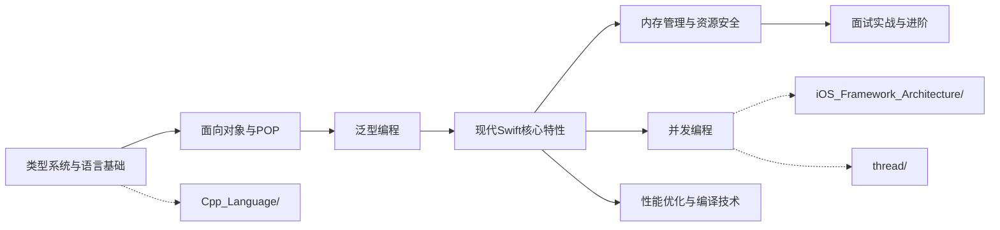

# Swift 语言深度解析 - 文档导航

> 本目录包含关于 Swift 语言核心特性、类型系统、面向协议编程与现代 Swift 最佳实践的系统性深度文章

---

## 知识金字塔框架

```
                    ┌─────────────────────┐
                    │    专家级精通        │
                    │  Macros · ~Copyable  │
                    │   编译期优化 · ABI   │
                    ├─────────────────────┤
                  ┌─┤    高级应用层        ├─┐
                  │ │ Property Wrappers    │ │
                  │ │ Result Builders      │ │
                  │ │ Structured Concurrency│ │
                  ├─┼─────────────────────┼─┤
                ┌─┤ │    中级核心层        │ ├─┐
                │ │ │ 泛型编程 · 闭包      │ │ │
                │ │ │ Collection 体系      │ │ │
                │ │ │ 类型擦除 · Opaque    │ │ │
                ├─┼─┼─────────────────────┼─┼─┤
              ┌─┤ │ │    基础能力层        │ │ ├─┐
              │ │ │ │ 面向对象 · POP       │ │ │ │
              │ │ │ │ 访问控制 · Extension │ │ │ │
              ├─┼─┼─┼─────────────────────┼─┼─┼─┤
              │ │ │ │    底层基石层        │ │ │ │
              │ │ │ │ 类型系统 · 值/引用   │ │ │ │
              │ │ │ │ Optional · 内存布局  │ │ │ │
              └─┴─┴─┴─────────────────────┴─┴─┴─┘
```

---

## 文档结构

本文档采用**金字塔结构**组织，主文章提供全景视图，子文件深入关键概念。

### 主文章

| 文件 | 描述 | 行数 |
|------|------|------|
| **[Swift_Language_深度解析.md](./Swift_Language_深度解析.md)** | Swift 语言全景概览：类型系统、POP、现代特性演进与面试高频考点 | ~700 |

### 子文件（按主题分类）

#### 类型系统与语言基础

| 文件 | 描述 | 行数 |
|------|------|------|
| [基础类型与类型推导_详细解析.md](./01_类型系统与语言基础/基础类型与类型推导_详细解析.md) | 值/引用类型、Optional、类型推断、类型转换 | ~700 |
| [枚举与模式匹配_详细解析.md](./01_类型系统与语言基础/枚举与模式匹配_详细解析.md) | 枚举关联值、模式匹配、值语义、初始化与生命周期 | ~700 |

#### 面向对象与面向协议编程

| 文件 | 描述 | 行数 |
|------|------|------|
| [类继承与多态_详细解析.md](./02_面向对象与面向协议编程/类继承与多态_详细解析.md) | 类/结构体差异、继承、多态、访问控制、Extension | ~800 |
| [面向协议编程_详细解析.md](./02_面向对象与面向协议编程/面向协议编程_详细解析.md) | POP 范式、Protocol Extension、条件一致性、PWT | ~800 |

#### 泛型编程

| 文件 | 描述 | 行数 |
|------|------|------|
| [泛型基础与约束_详细解析.md](./03_泛型编程/泛型基础与约束_详细解析.md) | 泛型函数/类型、where 约束、关联类型 | ~700 |
| [高级泛型与类型系统_详细解析.md](./03_泛型编程/高级泛型与类型系统_详细解析.md) | Opaque/Existential Types、类型擦除、泛型特化 | ~800 |

#### 现代 Swift 核心特性

| 文件 | 描述 | 行数 |
|------|------|------|
| [闭包与函数式编程_详细解析.md](./04_现代Swift核心特性/闭包与函数式编程_详细解析.md) | 闭包语法/捕获、高阶函数、函数组合 | ~700 |
| [PropertyWrappers与ResultBuilders_详细解析.md](./04_现代Swift核心特性/PropertyWrappers与ResultBuilders_详细解析.md) | 属性包装器原理、Result Builders、DSL | ~700 |
| [Macros与编译期能力_详细解析.md](./04_现代Swift核心特性/Macros与编译期能力_详细解析.md) | Swift 5.9+ 宏系统、SwiftSyntax | ~600 |

#### 内存管理与资源安全

| 文件 | 描述 | 行数 |
|------|------|------|
| [ARC与引用管理_详细解析.md](./05_内存管理与资源安全/ARC与引用管理_详细解析.md) | ARC 机制、strong/weak/unowned、循环引用 | ~800 |
| [值语义与所有权_详细解析.md](./05_内存管理与资源安全/值语义与所有权_详细解析.md) | COW、~Copyable、borrowing/consuming、Unsafe | ~700 |

#### Swift 标准库

| 文件 | 描述 | 行数 |
|------|------|------|
| [Collection协议体系_详细解析.md](./06_Swift标准库/Collection协议体系_详细解析.md) | Sequence/Collection 协议链、常用容器、算法 | ~800 |
| [字符串与Codable_详细解析.md](./06_Swift标准库/字符串与Codable_详细解析.md) | String/Unicode、Codable、错误处理体系 | ~700 |

#### 并发编程

| 文件 | 描述 | 行数 |
|------|------|------|
| [README.md](./07_并发编程/README.md) | Swift 并发编程导航，链接至 iOS_Framework_Architecture 并发文档 | ~50 |

#### 性能优化与编译技术

| 文件 | 描述 | 行数 |
|------|------|------|
| [编译器架构与优化_详细解析.md](./08_性能优化与编译技术/编译器架构与优化_详细解析.md) | Swift 编译器流水线、SIL、方法派发、WMO | ~800 |
| [ABI稳定性与互操作_详细解析.md](./08_性能优化与编译技术/ABI稳定性与互操作_详细解析.md) | ABI/模块稳定、Library Evolution、ObjC 互操作 | ~700 |

#### 面试实战与进阶

| 文件 | 描述 | 行数 |
|------|------|------|
| [Swift高频面试题解析_详细解析.md](./09_面试实战与进阶/Swift高频面试题解析_详细解析.md) | 高频面试题解析：类型系统、POP、内存管理、并发、方案设计 | ~1000 |

---

## 核心概念速查表

### 类型系统

| 术语 | 英文 | 简要解释 | 详见 |
|------|------|---------|------|
| Value Type | 值类型 | struct/enum，赋值时拷贝，栈上分配 | 类型系统 |
| Reference Type | 引用类型 | class，赋值时共享引用，堆上分配 | 类型系统 |
| Optional | Optional Type | 用 `?` 表示可能为 nil 的值，本质是枚举 | 类型系统 |
| Type Inference | 类型推断 | 编译器自动推导变量/表达式类型 | 类型推导 |
| Pattern Matching | 模式匹配 | switch/if-case 的多模式匹配机制 | 枚举与模式匹配 |

### 面向对象与协议

| 术语 | 英文 | 简要解释 | 详见 |
|------|------|---------|------|
| POP | Protocol-Oriented Programming | 以协议为核心的编程范式 | 面向协议编程 |
| PWT | Protocol Witness Table | 协议见证表，类似 C++ vtable | 面向协议编程 |
| Extension | Extension | 为已有类型添加方法/协议遵循 | 类继承与多态 |
| Access Control | 访问控制 | open/public/internal/fileprivate/private | 类继承与多态 |

### 泛型与高级特性

| 术语 | 英文 | 简要解释 | 详见 |
|------|------|---------|------|
| Opaque Type | some Protocol | 隐藏具体类型，保留类型身份 | 高级泛型 |
| Existential | any Protocol | 类型擦除容器，运行时多态 | 高级泛型 |
| Property Wrapper | @propertyWrapper | 属性访问逻辑的封装与复用 | 现代特性 |
| Result Builder | @resultBuilder | DSL 构建器（如 SwiftUI ViewBuilder） | 现代特性 |

### 内存与性能

| 术语 | 英文 | 简要解释 | 详见 |
|------|------|---------|------|
| ARC | Automatic Reference Counting | 自动引用计数，编译器插入 retain/release | 内存管理 |
| COW | Copy-on-Write | 写时复制，值类型的性能优化策略 | 值语义与所有权 |
| ~Copyable | Noncopyable Types | Swift 5.9+ 不可复制类型，线性类型系统 | 值语义与所有权 |
| SIL | Swift Intermediate Language | Swift 中间语言，编译器优化核心 | 编译器架构 |
| WMO | Whole Module Optimization | 全模块优化，跨文件内联与去虚化 | 编译器架构 |

---

## 学习路径

根据不同的学习目标，推荐以下学习路径：

### 路径一：快速入门（1-2天）

适合：想快速了解 Swift 语言全貌的开发者

```
Swift_Language_深度解析.md（全文）
    │
    ├─→ 基础类型与类型推导_详细解析.md（Optional / 值vs引用）
    │
    └─→ 类继承与多态_详细解析.md（struct vs class）
```

### 路径二：深入原理（1-2周）

适合：需要理解 Swift 底层机制的工程师

```
Swift_Language_深度解析.md
    │
    ├─→ 基础类型与类型推导_详细解析.md
    │
    ├─→ 枚举与模式匹配_详细解析.md
    │
    ├─→ 面向协议编程_详细解析.md（PWT 原理）
    │
    ├─→ 高级泛型与类型系统_详细解析.md（Opaque / Existential）
    │
    ├─→ ARC与引用管理_详细解析.md
    │
    └─→ 编译器架构与优化_详细解析.md（SIL / 方法派发）
```

### 路径三：面试强化（3-5天）

适合：准备 Swift/iOS 高级面试的候选人

```
Swift_Language_深度解析.md（面试高频考点部分）
    │
    ├─→ 基础类型与类型推导_详细解析.md（值/引用类型差异）
    │
    ├─→ 面向协议编程_详细解析.md（POP vs OOP）
    │
    ├─→ ARC与引用管理_详细解析.md（循环引用解决方案）
    │
    ├─→ 编译器架构与优化_详细解析.md（方法派发机制）
    │
    └─→ Swift高频面试题解析_详细解析.md（面试实战题）
```

### 路径四：工程实践导向（3-5天）

适合：需要在项目中设计高质量 Swift 代码的开发者

```
Swift_Language_深度解析.md
    │
    ├─→ 面向协议编程_详细解析.md（协议设计最佳实践）
    │
    ├─→ PropertyWrappers与ResultBuilders_详细解析.md（DSL 设计）
    │
    ├─→ 值语义与所有权_详细解析.md（COW / ~Copyable）
    │
    └─→ ABI稳定性与互操作_详细解析.md（ObjC 互操作）
```

---

## 进阶路线图



**推荐进阶顺序**：
1. **语言核心**：完成本文档所有子模块（01-06）
2. **并发编程**：学习 `iOS_Framework_Architecture/` 中的 Swift Concurrency 部分
3. **性能优化**：深入编译器架构、SIL 优化与 ABI 稳定性
4. **多线程原理**：结合 `thread/` 理解 GCD 与底层线程机制
5. **面试实战**：通过 `09_面试实战与进阶/` 检验学习成果

---

## 与 C++ 知识库对照表

| 模块编号 | Swift 模块 | C++ 对应模块 | 核心差异 |
|---------|-----------|-------------|---------|
| 01 | 类型系统与语言基础 | 01_类型系统与语言基础 | Swift 强调值语义与 Optional，C++ 侧重类型推导与 UB |
| 02 | 面向对象与面向协议编程 | 02_面向对象编程 | Swift 引入 POP 范式，C++ 依赖虚函数多态 |
| 03 | 泛型编程 | 03_泛型编程与模板 | Swift 用 Protocol 约束，C++ 用 Concepts/SFINAE |
| 04 | 现代Swift核心特性 | 04_现代Cpp核心特性 | Swift 有 Property Wrappers/Macros，C++ 有移动语义/constexpr |
| 05 | 内存管理与资源安全 | 05_内存管理与资源安全 | Swift 用 ARC，C++ 用 RAII + 智能指针 |
| 06 | Swift标准库 | 06_STL深入解析 | Swift Collection 协议链 vs C++ 迭代器模型 |
| 07 | 并发编程 | 07_并发编程 | Swift Structured Concurrency vs C++ std::thread |
| 08 | 性能优化与编译技术 | 08_性能优化与编译技术 | Swift SIL/WMO vs C++ LTO/向量化 |
| 09 | 面试实战与进阶 | 09_面试实战与进阶 | 语言特性侧重不同，方法论一致 |

---

## 写作原则

本系列文档遵循以下写作原则：

### 1. 金字塔结构
- 主文章提供全景概览，明确"做什么"和"为什么"
- 子文件深入细节，解释"怎么做"和"如何优化"
- 每篇文章开头有核心结论，便于快速把握要点

### 2. 面向实践
- 避免纯理论推导，强调概念与实际应用的关联
- 提供具体的代码示例，使用 Swift 5.9+ 现代语法
- 包含常见问题、踩坑点和最佳实践

### 3. 面试导向
- 每个模块标注 Top 3 面试高频考点
- 提供追问场景与标准答案思路
- 涵盖值/引用类型混淆、循环引用等典型陷阱

### 4. 渐进深入
- 每个概念先给出直观解释，再展开技术细节
- 配合 ASCII 图解辅助理解内存布局与协议派发
- 提供"进一步阅读"指引，满足深入学习需求

---

## 目标读者

本系列文档面向以下读者：

| 读者类型 | 背景假设 | 重点章节 |
|---------|---------|---------|
| **初级开发者** | 有其他语言经验，Swift 入门 | 类型系统、枚举与模式匹配 |
| **中级开发者** | 熟悉 Swift 语法，需要深入原理 | POP、泛型、ARC 机制 |
| **高级开发者** | 需要设计高质量架构 | Property Wrappers、编译器优化、ABI |
| **面试候选人** | 准备 Swift/iOS 技术面试 | 面试高频考点、常见陷阱 |

**前置知识**：
- 基本的编程概念（变量、函数、控制流）
- 了解面向对象基本概念（类、对象、继承）
- 不要求深入的编译原理背景（文中会解释必要概念）

---

## 相关知识库

本知识库是 Swift 体系的基础部分，建议结合以下知识库学习：

- **[../iOS_Framework_Architecture/](../iOS_Framework_Architecture/)** - iOS 框架架构深度解析（含 Swift Concurrency）
- **[../thread/](../thread/)** - 多线程编程深度解析（GCD / pthread）
- **[../Cpp_Language/](../Cpp_Language/)** - C++ 语言深度解析（对照学习）

---

## 参考资源

### 官方文档
- [The Swift Programming Language](https://docs.swift.org/swift-book/)
- [Swift Evolution Proposals](https://github.com/apple/swift-evolution)
- [Swift Standard Library](https://developer.apple.com/documentation/swift)

### 权威书籍
- Eidhof, C. et al. - *Advanced Swift*
- Sundell, J. - *Swift by Sundell* 系列
- Apple Inc. - *The Swift Programming Language* (官方书籍)

### 在线资源
- swift.org - Swift 开源项目官方
- Swift Forums - 社区讨论与提案
- WWDC Sessions - Apple 年度开发者大会
- Compiler Explorer (godbolt.org) - 在线查看 SIL/IR

---

## 更新日志

| 日期 | 版本 | 更新内容 |
|------|------|----------|
| 2026-04-18 | v1.0 | 创建 Swift 语言知识库目录结构与导航 |

---

> 如有问题或建议，欢迎反馈。
