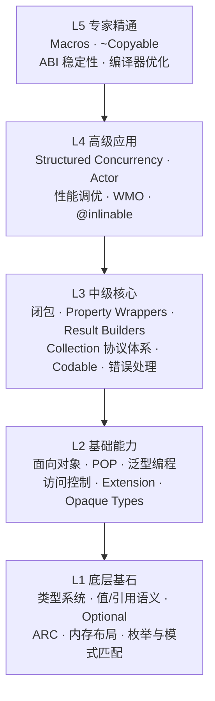
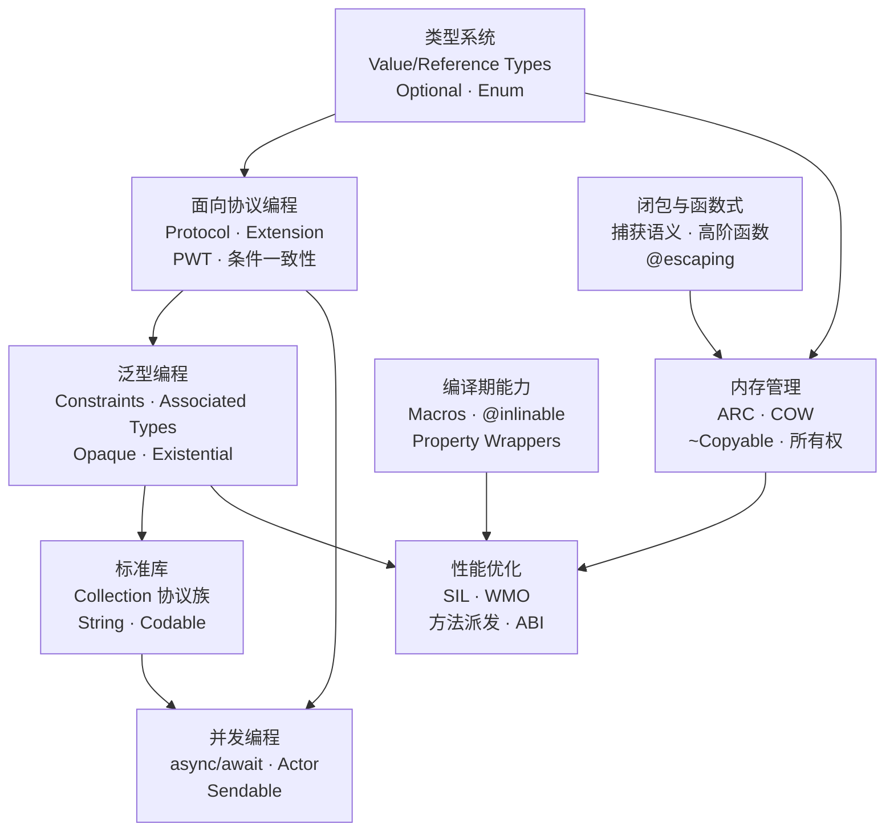
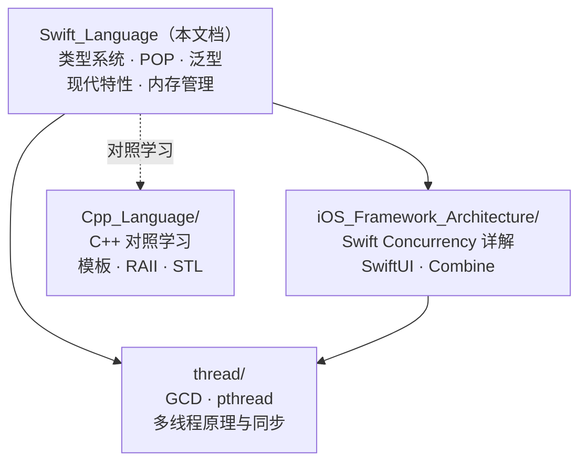

# Swift 语言深度解析

> "Swift is a programming language for everyone — designed to be safe, fast, and expressive."
> — Chris Lattner, Swift 创始人

> 系统性梳理 Swift 语言核心特性、编程范式与现代 Swift 最佳实践

---

## 核心结论（TL;DR）

**现代 Swift 的核心设计哲学是：安全性优先（Safety by Default）—— 在编译期消除尽可能多的错误类别，同时保持表达力与性能。**

Swift 语言体系基于以下关键支柱：

1. **类型系统（Type System）**：静态类型 + 强类型推断，值类型优先（Struct/Enum），Optional 消除空指针崩溃，是编译期安全的基石
2. **面向协议编程（Protocol-Oriented Programming）**：以 Protocol + Extension + 泛型约束替代传统类继承，实现可组合的多态
3. **内存管理（Memory Management）**：ARC 自动引用计数 + 值语义 + COW，实现确定性释放与零暂停的内存安全
4. **泛型编程（Generic Programming）**：基于协议约束的类型安全泛型，Opaque Types / Existential Types 提供灵活的抽象层
5. **结构化并发（Structured Concurrency）**：async/await + Actor 模型，在编译期防止数据竞争
6. **编译期能力（Compile-time Capabilities）**：Macros、@inlinable、WMO 全模块优化，在安全的前提下逼近 C 级性能

**一句话理解 Swift**：Swift 是一把经过精心设计的瑞士军刀——它在编译期帮你检查每一处可能的安全隐患，让你把精力集中在业务逻辑而非防御性编程上。**安全不是限制，而是自由。**

---

## 目录

- [核心结论（TL;DR）](#核心结论tldr)
- [文章导航](#文章导航)
- [方法论框架：Swift 知识金字塔](#方法论框架swift-知识金字塔)
- [各模块核心概念速览](#各模块核心概念速览)
- [Swift 版本演进时间线](#swift-版本演进时间线)
- [Part I：语言基础体系](#part-i语言基础体系)
- [Part II：高级特性与工程实践](#part-ii高级特性与工程实践)
- [与已有知识库的关系](#与已有知识库的关系)
- [面试高频考点速查](#面试高频考点速查)
- [参考资源](#参考资源)

---

## 文章导航

本文采用金字塔结构组织，主文章提供全景视图，子文件深入关键概念：

### 类型系统与语言基础

- [基础类型与类型推导_详细解析](./01_类型系统与语言基础/基础类型与类型推导_详细解析.md) - 值/引用类型、Optional、类型推断、类型转换
- [枚举与模式匹配_详细解析](./01_类型系统与语言基础/枚举与模式匹配_详细解析.md) - 枚举关联值、模式匹配、值语义、初始化与生命周期

### 面向对象与面向协议编程

- [类继承与多态_详细解析](./02_面向对象与面向协议编程/类继承与多态_详细解析.md) - Struct vs Class、属性系统、继承、访问控制、Extension
- [面向协议编程_详细解析](./02_面向对象与面向协议编程/面向协议编程_详细解析.md) - POP 范式、Protocol Extension、条件一致性、PWT

### 泛型编程

- [泛型基础与约束_详细解析](./03_泛型编程/泛型基础与约束_详细解析.md) - 泛型函数/类型、where 约束、关联类型
- [高级泛型与类型系统_详细解析](./03_泛型编程/高级泛型与类型系统_详细解析.md) - Opaque/Existential Types、类型擦除、泛型特化

### 现代 Swift 核心特性

- [闭包与函数式编程_详细解析](./04_现代Swift核心特性/闭包与函数式编程_详细解析.md) - 闭包语法/捕获、高阶函数、函数组合
- [PropertyWrappers与ResultBuilders_详细解析](./04_现代Swift核心特性/PropertyWrappers与ResultBuilders_详细解析.md) - 属性包装器原理、Result Builders、DSL
- [Macros与编译期能力_详细解析](./04_现代Swift核心特性/Macros与编译期能力_详细解析.md) - Swift 5.9+ 宏系统、SwiftSyntax

### 内存管理与资源安全

- [ARC与引用管理_详细解析](./05_内存管理与资源安全/ARC与引用管理_详细解析.md) - ARC 机制、strong/weak/unowned、循环引用
- [值语义与所有权_详细解析](./05_内存管理与资源安全/值语义与所有权_详细解析.md) - COW、~Copyable、borrowing/consuming、Unsafe

### Swift 标准库

- [Collection协议体系_详细解析](./06_Swift标准库/Collection协议体系_详细解析.md) - Sequence/Collection 协议链、常用容器、算法
- [字符串与Codable_详细解析](./06_Swift标准库/字符串与Codable_详细解析.md) - String/Unicode、Codable、错误处理体系

### 并发编程

- [README](./07_并发编程/README.md) - Swift 并发编程导航，链接至 iOS_Framework_Architecture 并发文档

### 性能优化与编译技术

- [编译器架构与优化_详细解析](./08_性能优化与编译技术/编译器架构与优化_详细解析.md) - Swift 编译流水线、SIL、方法派发、WMO
- [ABI稳定性与互操作_详细解析](./08_性能优化与编译技术/ABI稳定性与互操作_详细解析.md) - ABI/模块稳定、Library Evolution、ObjC 互操作

### 面试实战与进阶

- [Swift高频面试题解析_详细解析](./09_面试实战与进阶/Swift高频面试题解析_详细解析.md) - 高频面试题解析：类型系统、POP、内存管理、并发、方案设计

---

## 方法论框架：Swift 知识金字塔



**金字塔阅读指南**：
- **自底向上**学习：先建立 L1 底层基石的直觉（类型系统、内存管理），再逐层构建高级抽象
- **自顶向下**查阅：遇到具体问题时，从专家层向下追溯根本原因
- **横向打通**：同一层的概念往往相互关联——POP 需要泛型约束、闭包需要理解 ARC 捕获语义

---

## 各模块核心概念速览

### 类型系统与语言基础

| 概念 | 英文 | 一句话总结 | 详见 |
|------|------|-----------|------|
| **值类型** | Value Type | Struct/Enum/Tuple，赋值时拷贝，栈上分配，天然线程安全 | 类型系统 |
| **引用类型** | Reference Type | Class，赋值时共享引用，堆上分配，ARC 管理 | 类型系统 |
| **Optional** | Optional Type | `enum Optional<T> { case none, some(T) }`，编译期空安全 | 类型系统 |
| **类型推断** | Type Inference | 编译器根据上下文自动推导类型，减少冗余注解 | 类型推导 |
| **模式匹配** | Pattern Matching | switch/if-case 穷尽匹配，支持关联值解构与 where 守卫 | 枚举与模式匹配 |
| **枚举** | Enum | 一等类型，支持关联值、方法、协议遵循，远超 C 枚举 | 枚举与模式匹配 |

### 面向对象与面向协议编程

| 概念 | 英文 | 一句话总结 | 详见 |
|------|------|-----------|------|
| **POP** | Protocol-Oriented Programming | 以协议为核心的编程范式，组合优于继承 | 面向协议编程 |
| **PWT** | Protocol Witness Table | 协议见证表，存储协议方法的具体实现地址 | 面向协议编程 |
| **Extension** | Extension | 为已有类型添加方法/计算属性/协议遵循，无需源码 | 类继承与多态 |
| **访问控制** | Access Control | open > public > internal > fileprivate > private 五级控制 | 类继承与多态 |
| **协议扩展** | Protocol Extension | 为协议提供默认实现，实现"横切关注点" | 面向协议编程 |
| **条件一致性** | Conditional Conformance | `extension Array: Equatable where Element: Equatable` | 面向协议编程 |

### 泛型与高级类型

| 概念 | 英文 | 一句话总结 | 详见 |
|------|------|-----------|------|
| **泛型约束** | Generic Constraints | `<T: Protocol>` 约束泛型参数能力，编译期检查 | 泛型基础 |
| **关联类型** | Associated Types | 协议的"泛型参数"，`associatedtype Element` | 泛型基础 |
| **Opaque Type** | `some Protocol` | 隐藏具体类型，保留类型身份，编译期确定 | 高级泛型 |
| **Existential** | `any Protocol` | 类型擦除容器，运行时多态，有开箱开销 | 高级泛型 |
| **类型擦除** | Type Erasure | `AnyHashable`/`AnyPublisher` 等包装器隐藏具体类型 | 高级泛型 |

### 内存与性能

| 概念 | 英文 | 一句话总结 | 详见 |
|------|------|-----------|------|
| **ARC** | Automatic Reference Counting | 编译器自动插入 retain/release，确定性释放 | ARC与引用管理 |
| **COW** | Copy-on-Write | 写时复制，值类型的延迟拷贝优化策略 | 值语义与所有权 |
| **~Copyable** | Noncopyable Types | Swift 5.9+ 线性类型，资源独占所有权 | 值语义与所有权 |
| **SIL** | Swift Intermediate Language | Swift 独有中间语言，承担 ARC 优化/泛型特化 | 编译器架构 |
| **WMO** | Whole Module Optimization | 全模块优化，跨文件内联与去虚拟化 | 编译器架构 |
| **方法派发** | Method Dispatch | Direct / VTable / Message 三种派发方式 | 编译器架构 |

---

## Swift 版本演进时间线

```
┌─────────────────────────────────────────────────────────────────────────────────┐
│                           Swift 版本演进时间线                                   │
├─────────────────────────────────────────────────────────────────────────────────┤
│                                                                                 │
│  Swift 1.0 (2014)              Swift 2.0 (2015)         Swift 3.0 (2016)       │
│  ═════════════                 ═════════════             ═════════════          │
│                                                                                 │
│  【语言诞生】                  【错误处理】              【大统一重命名】         │
│  ├─ 值类型优先设计             ├─ do/try/catch          ├─ API 命名规范化       │
│  ├─ Optional 空安全            ├─ guard 语句            ├─ C API 自动导入       │
│  ├─ 类型推断                   ├─ protocol extensions   ├─ 移除 C 风格 for     │
│  ├─ 枚举关联值                 ├─ 可用性检查 #available  ├─ Swift Package Manager│
│  ├─ 泛型系统                   └─ defer 语句            └─ 开源（Linux 支持）   │
│  └─ 闭包与高阶函数                                                              │
│                                                                                 │
│  Swift 4.0 (2017)              Swift 5.0 (2019)         Swift 5.5 (2021)       │
│  ═════════════                 ═════════════             ═════════════          │
│                                                                                 │
│  【Codable 时代】              【ABI 稳定】              【并发革命】            │
│  ├─ Codable 协议               ├─ ABI 稳定性            ├─ async/await         │
│  ├─ String 重新设计            ├─ Module 稳定性          ├─ Actor 模型          │
│  ├─ 多行字符串字面量           ├─ Raw String            ├─ Structured Concurrency│
│  ├─ KeyPath 表达式             ├─ Result 类型           ├─ AsyncSequence       │
│  └─ 条件一致性                 └─ Property Wrappers     └─ Sendable 协议       │
│                                                                                 │
│  Swift 5.9 (2023)              Swift 6.0 (2024)                                │
│  ═════════════                 ═════════════                                    │
│                                                                                 │
│  【宏与所有权】                【完全并发安全】                                  │
│  ├─ Swift Macros               ├─ 严格并发检查（默认）                           │
│  ├─ ~Copyable 类型             ├─ 完全数据竞争安全                               │
│  ├─ consuming/borrowing        ├─ Typed throws                                  │
│  ├─ if/switch 表达式           ├─ 128 位整数                                    │
│  └─ Parameter Packs            └─ 非可拷贝泛型                                  │
│                                                                                 │
│  演进特点：                                                                     │
│  • Swift 1-3：语言定型期（语法大改、API 规范化、开源）                           │
│  • Swift 4-5.0：稳定期（Codable、ABI 稳定、向后兼容承诺）                       │
│  • Swift 5.5-5.9：现代化（并发模型、Macros、所有权）                             │
│  • Swift 6.0：安全里程碑（编译期数据竞争安全）                                   │
│                                                                                 │
└─────────────────────────────────────────────────────────────────────────────────┘
```

---

## Part I：语言基础体系

> 语言基础体系涵盖类型系统、面向对象/面向协议编程和泛型编程——构成 Swift 知识金字塔的 L1-L2 层

### 1.1 类型系统概述

Swift 是**静态类型语言**（Statically Typed）：每个变量的类型在编译期确定。但 Swift 更进一步——通过**类型推断**几乎消除了所有冗余类型注解。

```
┌──────────────────────────────────────────────────────────────────┐
│                      Swift 类型系统分类                            │
├──────────────────────────────────────────────────────────────────┤
│                                                                  │
│  值类型（Value Types）── 赋值 = 拷贝                             │
│  ├─ 结构体：Int / Double / String / Array / Dictionary           │
│  ├─ 枚举：Optional / Result / 自定义枚举                        │
│  └─ 元组：(Int, String) / (x: Int, y: Int)                     │
│                                                                  │
│  引用类型（Reference Types）── 赋值 = 共享引用                   │
│  ├─ 类：UIViewController / 自定义 class                         │
│  ├─ 闭包：(Int) -> String                                       │
│  └─ Actor：actor BankAccount { ... }                            │
│                                                                  │
│  特殊类型                                                        │
│  ├─ Optional<T>：enum { case none, case some(T) }               │
│  ├─ Any / AnyObject：类型擦除                                   │
│  ├─ some Protocol：Opaque Type（编译期确定）                     │
│  ├─ any Protocol：Existential Type（运行时多态）                 │
│  └─ Never / Void：底类型与空返回                                │
│                                                                  │
└──────────────────────────────────────────────────────────────────┘
```

**核心要点**：
- **值类型优先**：Swift 标准库中 Struct 远多于 Class（String、Array、Dictionary 都是值类型）
- **Optional 是枚举**：`Int?` 本质是 `Optional<Int>`，消除了 null pointer 问题
- **类型推断**：`let x = 42` 编译器自动推导为 `Int`，无需显式标注

### 1.2 值类型与引用类型

Swift 最核心的设计决策：**默认使用值类型**。

```swift
// 值类型：赋值 = 拷贝（独立副本）
struct Point {
    var x: Double
    var y: Double
}

var a = Point(x: 1, y: 2)
var b = a          // 拷贝
b.x = 10
// a.x == 1, b.x == 10  互不影响

// 引用类型：赋值 = 共享（同一对象）
class PointClass {
    var x: Double
    var y: Double
    init(x: Double, y: Double) { self.x = x; self.y = y }
}

let c = PointClass(x: 1, y: 2)
let d = c          // 共享引用
d.x = 10
// c.x == 10  d 的修改影响了 c
```

**选择决策**：默认用 Struct，仅在需要引用语义（共享状态）、继承、或 ObjC 互操作时使用 Class。

> 详见：[基础类型与类型推导_详细解析](./01_类型系统与语言基础/基础类型与类型推导_详细解析.md)

### 1.3 Optional 与模式匹配

**Optional** 是 Swift 安全体系的基石——编译器强制你处理"值可能不存在"的情况：

```swift
// Optional 本质
enum Optional<Wrapped> {
    case none
    case some(Wrapped)
}

// 安全解包方式
let name: String? = fetchName()

// 1. if let 绑定
if let name = name {
    print("Hello, \(name)")
}

// 2. guard let 提前退出
guard let name = name else { return }

// 3. nil 合并运算符
let displayName = name ?? "Anonymous"

// 4. 可选链
let count = name?.count  // Int?
```

**模式匹配**是 Swift 枚举的强大搭档：

```swift
enum NetworkResult {
    case success(Data, URLResponse)
    case failure(Error)
}

switch result {
case .success(let data, let response) where response.statusCode == 200:
    process(data)
case .success(_, let response):
    handleRedirect(response)
case .failure(let error):
    handleError(error)
}
```

> 详见：[枚举与模式匹配_详细解析](./01_类型系统与语言基础/枚举与模式匹配_详细解析.md)

### 1.4 面向协议编程（POP）

> "Don't start with a class. Start with a protocol." — WWDC 2015

Swift 的核心范式不是 OOP，而是 **Protocol-Oriented Programming**：

```swift
// 定义协议
protocol Drawable {
    func draw(in context: GraphicsContext)
}

// 协议扩展提供默认实现
extension Drawable {
    func debugDraw(in context: GraphicsContext) {
        print("Drawing \(type(of: self))")
        draw(in: context)
    }
}

// 值类型遵循协议（不需要继承！）
struct Circle: Drawable {
    let radius: Double
    func draw(in context: GraphicsContext) {
        context.drawCircle(radius: radius)
    }
}

struct Rectangle: Drawable {
    let width: Double, height: Double
    func draw(in context: GraphicsContext) {
        context.drawRect(width: width, height: height)
    }
}

// 泛型约束使用协议
func render<T: Drawable>(_ shape: T, in context: GraphicsContext) {
    shape.draw(in: context)  // 编译期确定，Direct Dispatch
}
```

**POP vs OOP 核心差异**：

| 维度 | OOP（类继承） | POP（协议组合） |
|------|-------------|----------------|
| 多态方式 | vtable 间接调用 | PWT / 泛型特化 |
| 值类型支持 | 不支持 | 完全支持 |
| 多重遵循 | 单继承限制 | 多协议组合 |
| 默认实现 | 父类实现 | Protocol Extension |
| 性能 | 虚函数开销 | 可内联优化 |

**Protocol Witness Table（PWT）**——Swift 版的"虚函数表"：

```
┌──────────────────────────────────────────────────────────────┐
│               PWT（协议见证表）内存布局                        │
├──────────────────────────────────────────────────────────────┤
│                                                              │
│  protocol Drawable {                                         │
│      func draw(in:)                                          │
│  }                                                           │
│                                                              │
│  Existential Container（any Drawable）：                      │
│  ┌──────────────────────┐                                    │
│  │  Value Buffer (3 words)│ ─── 内联存储或堆指针              │
│  ├──────────────────────┤                                    │
│  │  VWT (Value Witness)  │ ─── copy/move/destroy             │
│  ├──────────────────────┤                                    │
│  │  PWT (Protocol Witness)│ ─── &Circle.draw(in:)            │
│  └──────────────────────┘                                    │
│                                                              │
│  泛型约束（<T: Drawable>）：                                  │
│  编译器传递 PWT 作为隐藏参数，WMO 下可内联特化消除间接调用    │
│                                                              │
└──────────────────────────────────────────────────────────────┘
```

> 详见：[面向协议编程_详细解析](./02_面向对象与面向协议编程/面向协议编程_详细解析.md) / [类继承与多态_详细解析](./02_面向对象与面向协议编程/类继承与多态_详细解析.md)

### 1.5 泛型编程

Swift 泛型通过**协议约束**（而非 C++ 的 SFINAE/Concepts）实现编译期类型安全：

```swift
// 泛型函数 + 协议约束
func findIndex<T: Equatable>(of value: T, in array: [T]) -> Int? {
    for (index, element) in array.enumerated() {
        if element == value { return index }
    }
    return nil
}

// 关联类型：协议的"泛型参数"
protocol Container {
    associatedtype Element
    var count: Int { get }
    subscript(index: Int) -> Element { get }
}

// Opaque Type (some) vs Existential (any)
func makeShape() -> some Drawable {   // 编译期确定，可优化
    Circle(radius: 10)
}

func drawAny(_ shape: any Drawable) { // 运行时多态，有开箱开销
    shape.draw(in: currentContext)
}
```

**some vs any 决策规则**：
- `some Protocol`：返回值/属性类型固定时使用，编译期优化（SwiftUI View）
- `any Protocol`：需要异构集合或运行时灵活性时使用

> 详见：[泛型基础与约束_详细解析](./03_泛型编程/泛型基础与约束_详细解析.md) / [高级泛型与类型系统_详细解析](./03_泛型编程/高级泛型与类型系统_详细解析.md)

---

## Part II：高级特性与工程实践

> 高级特性涵盖现代 Swift 特性、内存管理、标准库、并发和性能优化——构成知识金字塔的 L3-L5 层

### 2.1 闭包与函数式编程

Swift 闭包是**引用类型**，能捕获并存储其上下文中的变量引用：

```swift
// 闭包捕获语义
var counter = 0
let increment = { counter += 1 }  // 捕获 counter 的引用
increment()
print(counter)  // 1

// 安全捕获模式：[weak self] + guard
class ViewController {
    var name = "Main"
    func setupTimer() {
        Timer.scheduledTimer(withTimeInterval: 1, repeats: true) { [weak self] _ in
            guard let self else { return }
            print(self.name)
        }
    }
}

// 高阶函数链
let result = numbers
    .lazy                          // 避免中间数组分配
    .filter { $0 > 0 }
    .map { $0 * $0 }
    .prefix(10)
    .reduce(0, +)
```

> 详见：[闭包与函数式编程_详细解析](./04_现代Swift核心特性/闭包与函数式编程_详细解析.md)

### 2.2 Property Wrappers 与 Result Builders

**Property Wrappers** 封装属性访问逻辑，**Result Builders** 构建 DSL：

```swift
// Property Wrapper：属性逻辑复用
@propertyWrapper
struct Clamped<T: Comparable> {
    var wrappedValue: T {
        didSet { wrappedValue = min(max(wrappedValue, range.lowerBound), range.upperBound) }
    }
    let range: ClosedRange<T>
    
    init(wrappedValue: T, _ range: ClosedRange<T>) {
        self.range = range
        self.wrappedValue = min(max(wrappedValue, range.lowerBound), range.upperBound)
    }
}

struct Player {
    @Clamped(0...100) var health: Int = 100
    @Clamped(0...999) var score: Int = 0
}

// Result Builder：SwiftUI 的核心机制
@resultBuilder
struct HTMLBuilder {
    static func buildBlock(_ components: String...) -> String {
        components.joined(separator: "\n")
    }
    static func buildOptional(_ component: String?) -> String {
        component ?? ""
    }
}
```

> 详见：[PropertyWrappers与ResultBuilders_详细解析](./04_现代Swift核心特性/PropertyWrappers与ResultBuilders_详细解析.md)

### 2.3 内存管理：ARC 与值语义

**ARC（Automatic Reference Counting）** 是 Swift 内存管理的核心——编译器自动插入 retain/release：

```
┌──────────────────────────────────────────────────────────────┐
│                    ARC 引用类型决策树                          │
├──────────────────────────────────────────────────────────────┤
│                                                              │
│               需要引用另一个对象？                             │
│                    │                                         │
│              ┌─────┴─────┐                                   │
│             Yes          No → 无需引用                        │
│              │                                               │
│         拥有所有权？                                          │
│              │                                               │
│        ┌─────┴─────┐                                         │
│       Yes          No                                        │
│        │            │                                        │
│     strong      引用对象可能先被释放？                         │
│   （默认）          │                                        │
│              ┌─────┴─────┐                                   │
│             Yes          No                                  │
│              │            │                                  │
│           weak        unowned                                │
│       （delegate）  （parent-child）                          │
│                                                              │
│  三大循环引用来源：                                           │
│  1. 类之间互引（A.b = B, B.a = A）                           │
│  2. delegate 模式（delegate 未用 weak）                      │
│  3. 闭包捕获 self（未用 [weak self]）                        │
│                                                              │
└──────────────────────────────────────────────────────────────┘
```

**COW（Copy-on-Write）**——值语义的性能秘密：

```swift
var array1 = [1, 2, 3, 4, 5]  // 引用计数 = 1
var array2 = array1             // 共享 buffer，引用计数 = 2（未拷贝！）
array2.append(6)                // 写入时才真正拷贝 buffer（COW 触发）
```

**~Copyable（不可复制类型）**——Swift 5.9 引入的线性类型：

```swift
struct FileHandle: ~Copyable {
    private var fd: Int32?
    
    init(fd: Int32) { self.fd = fd }
    
    consuming func close() {    // consuming 转移所有权
        Darwin.close(fd!)
        fd = nil                // 标记已关闭，防止 deinit 双重 close
    }
    
    deinit {
        if let fd { Darwin.close(fd) }  // 仅在未手动 close 时释放
    }
}
```

> 详见：[ARC与引用管理_详细解析](./05_内存管理与资源安全/ARC与引用管理_详细解析.md) / [值语义与所有权_详细解析](./05_内存管理与资源安全/值语义与所有权_详细解析.md)

### 2.4 Swift 标准库

**Collection 协议族**是标准库的灵魂架构：

```
Sequence
    │
    ▼
Collection ──→ BidirectionalCollection ──→ RandomAccessCollection
    │                                           │
    ▼                                           ▼
MutableCollection                         String.UTF8View
RangeReplaceableCollection                Array / ContiguousArray
```

**常用容器底层实现**：

| 容器 | 底层结构 | 查找 | 插入 | 删除 | 特点 |
|------|---------|------|------|------|------|
| **Array** | 连续内存 + COW | O(n) | O(n) | O(n) | 缓存友好 |
| **Dictionary** | 开放寻址哈希表 | O(1) | O(1) | O(1) | COW |
| **Set** | 同 Dictionary | O(1) | O(1) | O(1) | 值唯一 |
| **String** | UTF-8 编码 buffer | O(n) | O(n) | O(n) | Unicode 正确 |

> 详见：[Collection协议体系_详细解析](./06_Swift标准库/Collection协议体系_详细解析.md) / [字符串与Codable_详细解析](./06_Swift标准库/字符串与Codable_详细解析.md)

### 2.5 并发编程

Swift 5.5+ 的 **Structured Concurrency** 和 **Actor** 模型是并发编程的革命：

```swift
// async/await：结构化异步
func fetchUserProfile() async throws -> UserProfile {
    async let avatar = downloadAvatar()        // 并行子任务
    async let friends = fetchFriends()
    
    let profile = try await UserProfile(
        avatar: avatar,
        friends: friends
    )
    return profile
}

// Actor：编译期数据竞争安全
actor BankAccount {
    private var balance: Double = 0
    
    func deposit(_ amount: Double) {
        balance += amount  // Actor 隔离，无需锁
    }
    
    func getBalance() -> Double { balance }
}

// Swift 6.0：严格并发检查
// Sendable 协议确保跨并发域传递的数据安全
struct UserData: Sendable {
    let id: Int
    let name: String
}
```

> 详见：[并发编程 README](./07_并发编程/README.md)（链接至 iOS_Framework_Architecture 并发文档）

### 2.6 性能优化与编译技术

Swift 编译器采用多阶段流水线：**Source → AST → SIL → LLVM IR → Machine Code**

**方法派发机制**——直接影响运行时性能：

| 派发方式 | 适用场景 | 性能 | 可否内联 |
|---------|---------|------|---------|
| **Direct Dispatch** | Struct 方法、final class 方法 | 最快（~1ns） | 可以 |
| **VTable Dispatch** | Class 的 override 方法 | 较快（~2-3ns） | WMO 下可去虚拟化 |
| **Message Dispatch** | @objc dynamic 方法 | 最慢（~5ns+） | 不可 |

**关键优化手段**：

```swift
// 1. final 关键字：消除 VTable 派发
final class NetworkManager {
    func fetch() { ... }  // Direct Dispatch
}

// 2. @inlinable：跨模块内联
@inlinable
public func fastOperation<T: Numeric>(_ value: T) -> T {
    value * value
}

// 3. WMO + internal 访问级别：编译器自动去虚拟化
// Build Settings → Whole Module Optimization = YES
```

**Swift Macros**（5.9+）——编译期代码生成：

```swift
// 使用宏自动生成样板代码
@Observable  // 自动合成属性观察代码
class UserSettings {
    var theme: Theme = .light
    var fontSize: Int = 14
}

// 自定义宏
@attached(member, names: named(init))
macro AutoInit() = #externalMacro(module: "MyMacros", type: "AutoInitMacro")
```

> 详见：[编译器架构与优化_详细解析](./08_性能优化与编译技术/编译器架构与优化_详细解析.md) / [ABI稳定性与互操作_详细解析](./08_性能优化与编译技术/ABI稳定性与互操作_详细解析.md) / [Macros与编译期能力_详细解析](./04_现代Swift核心特性/Macros与编译期能力_详细解析.md)

---

## 概念关系全景图



---

## 与已有知识库的关系

本知识库是 Swift 语言体系的基础部分，与已有知识库形成互补：



**交叉知识点**：
- **Swift Concurrency** → `iOS_Framework_Architecture/` 中有 async/await、Actor、TaskGroup 的完整实现解析
- **GCD/pthread 底层** → `thread/` 中有线程池、锁机制、无锁编程的详细分析
- **与 C++ 对照** → `Cpp_Language/` 中 RAII vs ARC、Templates vs Generics、STL vs Collection 的对比学习

**建议学习路径**：
1. 先掌握本文档（类型系统、POP、内存管理）
2. 再学习 `iOS_Framework_Architecture/`（Swift Concurrency、框架设计）
3. 最后深入 `thread/`（GCD、底层线程机制）
4. 有 C++ 背景者可参照 `Cpp_Language/` 进行对比学习

---

## 面试高频考点速查

### L1 基础层（初级/中级）

| # | 考点 | 核心答案 | 追问方向 |
|---|------|---------|---------|
| 1 | **值类型 vs 引用类型** | Struct 拷贝语义，Class 共享引用 | String 是值类型吗？为什么 Array 是值类型却能高效？（COW） |
| 2 | **Optional 本质** | `enum Optional<T> { case none, some(T) }` | 隐式解包 `!` 什么时候用？Optional chaining 底层如何实现？ |
| 3 | **ARC 工作原理** | 编译器自动插入 retain/release | 与 GC 的区别？循环引用如何产生？weak vs unowned 选择？ |
| 4 | **枚举关联值** | Swift 枚举可携带任意类型的关联数据 | 枚举的内存布局？indirect 关键字的作用？ |

### L2 进阶层（中级/高级）

| # | 考点 | 核心答案 | 追问方向 |
|---|------|---------|---------|
| 5 | **POP vs OOP** | 协议 + 扩展 + 泛型约束 vs 类继承 | PWT 的内存布局？协议扩展的派发是静态还是动态？ |
| 6 | **some vs any** | some 编译期固定类型，any 运行时擦除 | Existential Container 结构？何时用 some 何时用 any？ |
| 7 | **方法派发机制** | Direct / VTable / Message 三种 | final 如何影响派发？@objc dynamic 的使用场景？ |
| 8 | **闭包捕获语义** | 默认捕获引用，[weak/unowned self] 避免循环引用 | @escaping vs @Sendable？闭包是引用类型意味着什么？ |

### L3 专家层（高级/资深）

| # | 考点 | 核心答案 | 追问方向 |
|---|------|---------|---------|
| 9 | **COW 实现原理** | isKnownUniquelyReferenced 检查 + 延迟拷贝 | 自定义 COW 如何实现？非唯一引用时的性能开销？ |
| 10 | **ABI 稳定性** | Swift 5.0 冻结了类型布局/调用约定/名称修饰 | Library Evolution 模式？@frozen vs non-frozen？ |
| 11 | **SIL 与编译优化** | Swift 特有中间语言，承担 ARC 优化/泛型特化/去虚拟化 | swiftc -emit-sil 如何分析？WMO 的优化边界？ |
| 12 | **Actor 与 Sendable** | Actor 隔离状态防数据竞争，Sendable 标记跨域安全类型 | Swift 6.0 严格并发检查？@MainActor 的作用？ |

> 详见：[Swift高频面试题解析_详细解析](./09_面试实战与进阶/Swift高频面试题解析_详细解析.md)

---

## 参考资源

### 官方文档
- [The Swift Programming Language](https://docs.swift.org/swift-book/) - 官方语言指南
- [Swift Evolution Proposals](https://github.com/apple/swift-evolution) - 语言演进提案
- [Swift Standard Library](https://developer.apple.com/documentation/swift) - 标准库 API
- [Swift.org](https://swift.org) - 开源项目官方

### 权威书籍
- Apple Inc. - *The Swift Programming Language* (官方书籍)
- Eidhof, C. et al. - *Advanced Swift* (objc.io)
- Sundell, J. - *Swift by Sundell* 系列文章
- Vandevoorde, D. et al. - *C++ Templates*（对照学习参考）

### WWDC 关键 Sessions
- WWDC 2015 - Protocol-Oriented Programming in Swift（POP 奠基演讲）
- WWDC 2016 - Understanding Swift Performance（值类型/引用类型/方法派发）
- WWDC 2021 - Meet async/await in Swift（并发入门）
- WWDC 2022 - Embrace Swift Generics（some/any 详解）
- WWDC 2023 - Write Swift Macros（宏系统）
- WWDC 2024 - Migrate your app to Swift 6（并发安全迁移）

### 在线资源
- swift.org/blog - Swift 官方博客
- Swift Forums (forums.swift.org) - 社区讨论与提案
- Compiler Explorer (godbolt.org) - 在线查看 SIL/LLVM IR
- Swift Algorithm Club - 数据结构与算法的 Swift 实现

---

## 更新日志

| 日期 | 版本 | 更新内容 |
|------|------|----------|
| 2026-04-18 | v1.0 | 创建 Swift 语言知识库主文档（全景视图） |

---

> 如有问题或建议，欢迎反馈。
