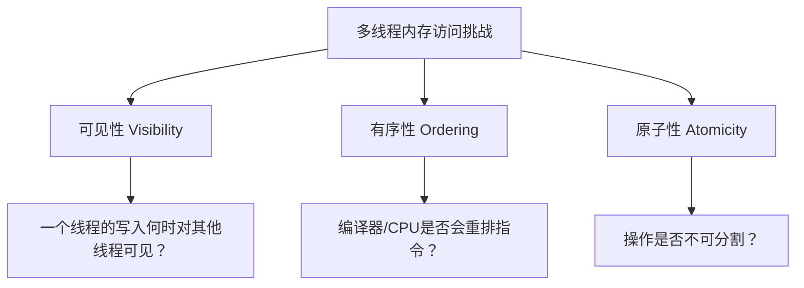
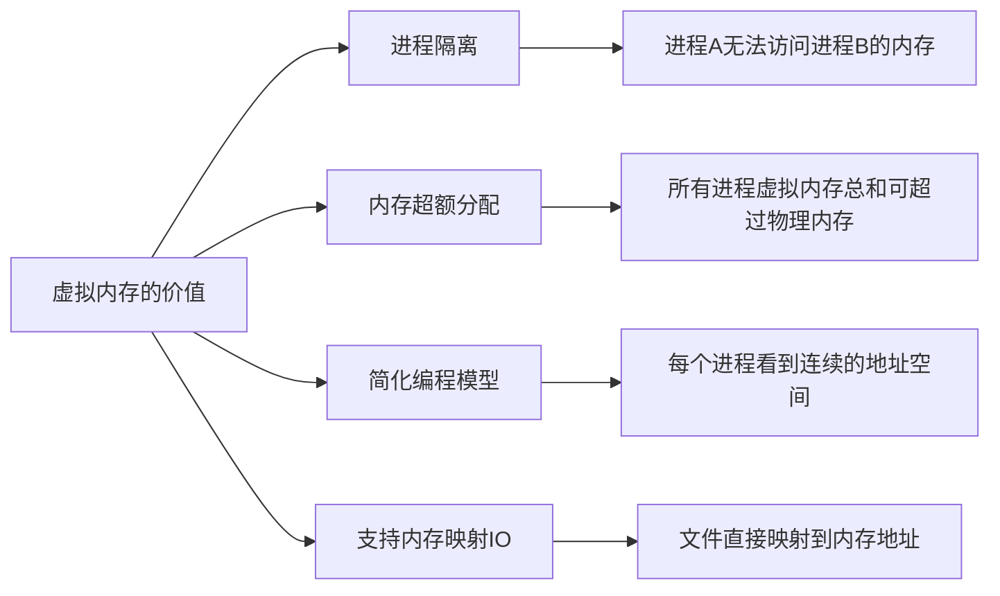
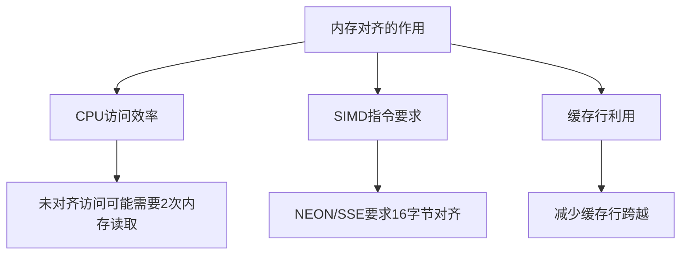
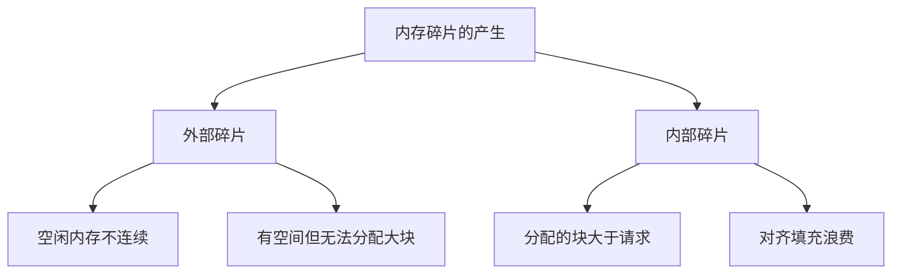
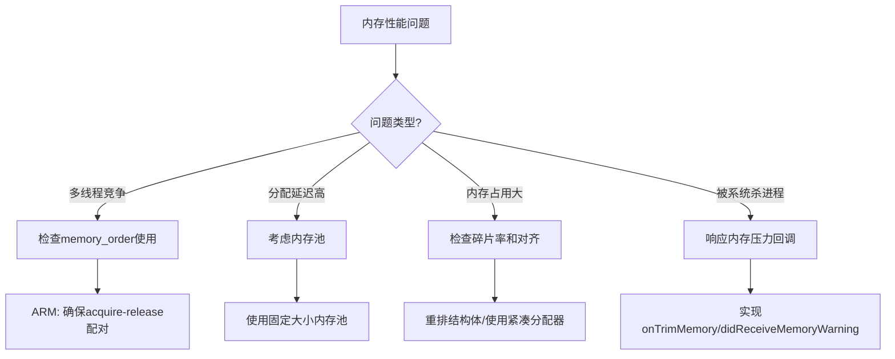

# 内存模型详解

> **核心要点**：本文从C++应用开发者视角，深入解析内存工作原理的四大基础概念——内存模型（Memory Model）、虚拟内存（Virtual Memory）、内存对齐（Memory Alignment）和内存碎片（Memory Fragmentation）。掌握这些概念是进行有效内存优化的基石。

---

## 目录
- [1. 内存模型（Memory Model）](#1-内存模型memory-model)
- [2. 虚拟内存与物理内存](#2-虚拟内存与物理内存)
- [3. 内存对齐（Memory Alignment）](#3-内存对齐memory-alignment)
- [4. 内存碎片（Memory Fragmentation）](#4-内存碎片memory-fragmentation)
- [5. 总结与Android/iOS差异对比](#5-总结与androidios差异对比)

---

## 1. 内存模型（Memory Model）

### 1.1 Why：为什么需要理解C++内存模型？

**结论**：C++内存模型是多线程编程正确性的理论基础，它定义了多线程环境下内存访问的可见性、有序性和原子性规则。

在多线程编程中，我们面临三个核心挑战：



**移动平台的特殊性**：
- **Android（ARM架构）**：ARM是弱内存序架构，允许更多的指令重排
- **iOS（ARM64）**：同样基于ARM，内存序行为与Android类似
- **对比x86**：x86是强内存序，自动提供更强的有序性保证

这意味着在移动平台开发时，必须显式使用正确的内存序约束，否则代码在x86开发机上正常运行，但在ARM设备上可能出现难以复现的并发Bug。

### 1.2 What：C++11内存模型的核心定义

#### 1.2.1 memory_order 枚举

C++11定义了6种内存序（Memory Order），按强度从弱到强排列：

| Memory Order | 同步强度 | 典型场景 | ARM指令开销 |
|--------------|----------|----------|-------------|
| `memory_order_relaxed` | 最弱 | 计数器、统计 | 无额外指令 |
| `memory_order_consume` | 弱 | 依赖链传递（少用） | 编译器优化 |
| `memory_order_acquire` | 中 | 读锁、获取数据 | `ldar` 指令 |
| `memory_order_release` | 中 | 写锁、发布数据 | `stlr` 指令 |
| `memory_order_acq_rel` | 较强 | 读-修改-写操作 | 组合指令 |
| `memory_order_seq_cst` | 最强 | 默认值，全局一致 | `dmb` 屏障 |

#### 1.2.2 Happens-Before 关系

**定义**：如果操作A happens-before 操作B，则A的效果对B可见，且A在B之前执行。

```cpp
// 线程1
data = 42;                              // (1)
ready.store(true, memory_order_release); // (2) release写

// 线程2
while (!ready.load(memory_order_acquire)); // (3) acquire读
assert(data == 42);                        // (4) 保证成功
```

在这个例子中：
- (1) happens-before (2)：程序顺序
- (2) synchronizes-with (3)：release-acquire配对
- (3) happens-before (4)：程序顺序
- **因此 (1) happens-before (4)**：data的写入对线程2可见

### 1.3 How：代码示例与性能对比

#### 1.3.1 不同memory_order的使用示例

```cpp
#include <atomic>
#include <thread>
#include <cassert>

// 示例1：Relaxed - 仅保证原子性，适合计数器
class Counter {
    std::atomic<int> count_{0};
public:
    void increment() {
        // 只需原子性，不关心顺序
        count_.fetch_add(1, std::memory_order_relaxed);
    }
    int get() const {
        return count_.load(std::memory_order_relaxed);
    }
};

// 示例2：Acquire-Release - 经典的生产者-消费者模式
class SPSCQueue {
    std::atomic<int> write_idx_{0};
    std::atomic<int> read_idx_{0};
    int buffer_[1024];
    
public:
    bool push(int value) {
        int w = write_idx_.load(std::memory_order_relaxed);
        int next = (w + 1) % 1024;
        if (next == read_idx_.load(std::memory_order_acquire)) {
            return false; // 队列满
        }
        buffer_[w] = value;  // 数据写入在release之前
        write_idx_.store(next, std::memory_order_release);
        return true;
    }
    
    bool pop(int& value) {
        int r = read_idx_.load(std::memory_order_relaxed);
        if (r == write_idx_.load(std::memory_order_acquire)) {
            return false; // 队列空
        }
        value = buffer_[r];  // acquire之后读取数据
        read_idx_.store((r + 1) % 1024, std::memory_order_release);
        return true;
    }
};

// 示例3：Sequential Consistency - 需要全局一致顺序时使用
std::atomic<bool> x{false}, y{false};
std::atomic<int> z{0};

void thread1() {
    x.store(true, std::memory_order_seq_cst);
}
void thread2() {
    y.store(true, std::memory_order_seq_cst);
}
void thread3() {
    while (!x.load(std::memory_order_seq_cst));
    if (y.load(std::memory_order_seq_cst)) z++;
}
void thread4() {
    while (!y.load(std::memory_order_seq_cst));
    if (x.load(std::memory_order_seq_cst)) z++;
}
// seq_cst保证：程序结束时 z >= 1（要么thread3看到y=true，要么thread4看到x=true）
```

#### 1.3.2 ARM vs x86 架构差异

```cpp
// 这段代码在x86上可能"碰巧"正确，但在ARM上会失败
std::atomic<int> flag{0};
int data = 0;

void producer() {
    data = 42;
    flag.store(1, std::memory_order_relaxed);  // BUG: 应该用release
}

void consumer() {
    while (flag.load(std::memory_order_relaxed) == 0);  // BUG: 应该用acquire
    assert(data == 42);  // ARM上可能失败！
}
```

**ARM架构汇编对比**：

```asm
; ARM64 - relaxed store (无屏障)
str w0, [x1]

; ARM64 - release store (使用stlr指令)
stlr w0, [x1]

; ARM64 - seq_cst store (需要显式屏障)
stlr w0, [x1]
dmb ish
```

#### 1.3.3 性能对比数据

在ARM Cortex-A72（典型移动平台CPU）上的测试数据：

| 操作类型 | 单次延迟 (ns) | 相对开销 |
|----------|---------------|----------|
| 普通写入 | ~1 | 1x |
| relaxed store | ~1 | 1x |
| release store | ~5 | 5x |
| seq_cst store | ~20-40 | 20-40x |

**优化建议**：
- 计数器、统计类操作使用 `relaxed`
- 生产者-消费者、锁实现使用 `acquire-release` 配对
- 仅在确实需要全局一致顺序时使用 `seq_cst`

---

## 2. 虚拟内存与物理内存

### 2.1 Why：为什么现代OS使用虚拟内存？

**结论**：虚拟内存是操作系统实现进程隔离、内存保护和高效内存管理的基础机制。

虚拟内存解决的核心问题：



### 2.2 What：虚拟内存核心概念

#### 2.2.1 页表与地址转换

```
虚拟地址 (VA)                    物理地址 (PA)
┌─────────────────┐            ┌─────────────────┐
│ VPN │  Offset   │  ──TLB──>  │ PFN │  Offset   │
│     │  (12bit)  │   /页表    │     │  (12bit)  │
└─────────────────┘            └─────────────────┘
  Virtual Page      保持不变      Physical Frame
  Number                         Number
```

**关键概念**：
- **页面大小**：通常4KB，Android/iOS支持大页（2MB/1GB）
- **TLB（Translation Lookaside Buffer）**：页表缓存，加速地址转换
- **页表层级**：ARM64使用4级页表（iOS/Android）

#### 2.2.2 页面状态

```cpp
// Linux/Android 页面状态
enum PageState {
    RESIDENT,      // 在物理内存中
    SWAPPED,       // 被换出到交换空间（Android一般不启用swap）
    ZERO_FILL,     // 零填充页（延迟分配）
    FILE_BACKED,   // 文件映射页
    SHARED,        // 共享内存页
};
```

#### 2.2.3 Copy-on-Write (COW)

```cpp
// fork() 后的 COW 机制示意
pid_t pid = fork();
if (pid == 0) {
    // 子进程
    // 此时父子进程共享相同的物理页（只读）
    data[0] = 100;  // 写入时触发COW
    // 内核：1) 分配新物理页 2) 复制数据 3) 更新子进程页表
}
```

### 2.3 How：代码示例与系统差异

#### 2.3.1 mmap 使用示例

```cpp
#include <sys/mman.h>
#include <fcntl.h>
#include <unistd.h>

// 示例1：匿名内存映射（大块内存分配）
void* allocate_large_buffer(size_t size) {
    void* ptr = mmap(
        nullptr,           // 让内核选择地址
        size,              // 大小
        PROT_READ | PROT_WRITE,  // 读写权限
        MAP_PRIVATE | MAP_ANONYMOUS,  // 私有、匿名映射
        -1,                // 无文件
        0                  // 偏移
    );
    if (ptr == MAP_FAILED) {
        return nullptr;
    }
    return ptr;
}

// 示例2：文件内存映射（零拷贝读取）
class MemoryMappedFile {
    void* data_ = nullptr;
    size_t size_ = 0;
    
public:
    bool open(const char* path) {
        int fd = ::open(path, O_RDONLY);
        if (fd < 0) return false;
        
        // 获取文件大小
        size_ = lseek(fd, 0, SEEK_END);
        
        // 映射文件
        data_ = mmap(nullptr, size_, PROT_READ, MAP_PRIVATE, fd, 0);
        close(fd);  // 映射后可以关闭fd
        
        // 提示内核按顺序访问
        madvise(data_, size_, MADV_SEQUENTIAL);
        
        return data_ != MAP_FAILED;
    }
    
    ~MemoryMappedFile() {
        if (data_ && data_ != MAP_FAILED) {
            munmap(data_, size_);
        }
    }
    
    const void* data() const { return data_; }
    size_t size() const { return size_; }
};
```

#### 2.3.2 Android ashmem 共享内存

```cpp
// Android 共享内存 (ashmem) - 跨进程共享
#include <linux/ashmem.h>
#include <sys/ioctl.h>

int create_ashmem(const char* name, size_t size) {
    int fd = open("/dev/ashmem", O_RDWR);
    if (fd < 0) return -1;
    
    ioctl(fd, ASHMEM_SET_NAME, name);
    ioctl(fd, ASHMEM_SET_SIZE, size);
    
    return fd;  // 可通过Binder传递给其他进程
}

// 使用示例
void* share_buffer_with_other_process(size_t size) {
    int fd = create_ashmem("video_frame_buffer", size);
    void* ptr = mmap(nullptr, size, PROT_READ | PROT_WRITE, MAP_SHARED, fd, 0);
    // 通过Binder将fd传递给其他进程
    // 其他进程可以mmap同一个fd，访问同一块物理内存
    return ptr;
}
```

#### 2.3.3 iOS 共享内存

```cpp
// iOS 使用 POSIX 共享内存
#include <sys/mman.h>
#include <fcntl.h>

void* create_ios_shared_memory(const char* name, size_t size) {
    int fd = shm_open(name, O_CREAT | O_RDWR, 0666);
    if (fd < 0) return nullptr;
    
    ftruncate(fd, size);
    void* ptr = mmap(nullptr, size, PROT_READ | PROT_WRITE, MAP_SHARED, fd, 0);
    close(fd);
    
    return ptr;
}
```

#### 2.3.4 Android LMK vs iOS Jetsam

| 特性 | Android LMK | iOS Jetsam |
|------|-------------|------------|
| **触发机制** | 基于内存阈值 | 基于内存压力级别 |
| **进程优先级** | oom_adj 值 (-17~15) | Jetsam 优先级 band |
| **杀进程策略** | 从高oom_adj开始杀 | 从低优先级开始杀 |
| **应用感知** | onTrimMemory() 回调 | didReceiveMemoryWarning |
| **内存类型** | PSS (Proportional Set Size) | Dirty + Compressed |

```cpp
// Android: 响应内存压力
// 在Java层实现 onTrimMemory，通过JNI调用C++释放内存
extern "C" JNIEXPORT void JNICALL
Java_com_app_NativeLib_onTrimMemory(JNIEnv* env, jobject obj, jint level) {
    switch (level) {
        case 5:   // TRIM_MEMORY_RUNNING_LOW
            release_texture_cache();
            break;
        case 15:  // TRIM_MEMORY_RUNNING_CRITICAL
            release_all_caches();
            break;
    }
}
```

#### 2.3.5 性能数据：页面大小对TLB的影响

| 页面大小 | TLB条目数 | 可覆盖内存 | TLB Miss开销 |
|----------|-----------|------------|--------------|
| 4KB | 64 | 256KB | ~10-100 cycles |
| 2MB (大页) | 64 | 128MB | ~10-100 cycles |

**建议**：音视频Buffer等大块连续内存考虑使用大页（需系统支持）

---

## 3. 内存对齐（Memory Alignment）

### 3.1 Why：为什么需要内存对齐？

**结论**：内存对齐直接影响CPU访问效率、SIMD指令使用和缓存利用率。



**未对齐访问的代价**：
- **x86**：硬件自动处理，但有性能损失
- **ARM**：早期版本直接触发异常，现代ARM自动处理但更慢
- **SIMD**：未对齐可能导致程序崩溃或严重性能下降

### 3.2 What：对齐规则与关键字

#### 3.2.1 自然对齐规则

```cpp
// 类型的自然对齐
sizeof(char) = 1,   alignof(char) = 1
sizeof(short) = 2,  alignof(short) = 2
sizeof(int) = 4,    alignof(int) = 4
sizeof(long) = 8,   alignof(long) = 8   // 64位系统
sizeof(double) = 8, alignof(double) = 8
sizeof(void*) = 8,  alignof(void*) = 8  // 64位系统
```

#### 3.2.2 结构体对齐与填充

```cpp
// 未优化的结构体布局
struct BadLayout {
    char a;      // 1字节，偏移0
    // 7字节填充
    double b;    // 8字节，偏移8
    char c;      // 1字节，偏移16
    // 3字节填充
    int d;       // 4字节，偏移20
    // 4字节尾部填充
};  // 总大小: 32字节

// 优化后的结构体布局
struct GoodLayout {
    double b;    // 8字节，偏移0
    int d;       // 4字节，偏移8
    char a;      // 1字节，偏移12
    char c;      // 1字节，偏移13
    // 2字节尾部填充
};  // 总大小: 16字节  -- 节省50%内存!

static_assert(sizeof(BadLayout) == 32, "");
static_assert(sizeof(GoodLayout) == 16, "");
```

#### 3.2.3 alignas 和 alignof

```cpp
#include <cstddef>
#include <new>

// 使用 alignas 指定对齐
struct alignas(64) CacheLineAligned {  // 对齐到缓存行
    int data[16];  // 64字节
};

// SIMD友好的对齐
struct alignas(16) SimdVector {
    float v[4];  // 16字节，适合 NEON/SSE 128位寄存器
};

// 检查对齐
static_assert(alignof(CacheLineAligned) == 64, "");
static_assert(alignof(SimdVector) == 16, "");

// 分配对齐内存
void* alloc_aligned(size_t size, size_t alignment) {
    // C++17 方式
    return ::operator new(size, std::align_val_t{alignment});
}

// 或使用 posix_memalign
void* alloc_aligned_posix(size_t size, size_t alignment) {
    void* ptr = nullptr;
    if (posix_memalign(&ptr, alignment, size) != 0) {
        return nullptr;
    }
    return ptr;
}
```

### 3.3 How：SIMD对齐与性能对比

#### 3.3.1 NEON SIMD 对齐要求

```cpp
#include <arm_neon.h>

// 正确: 16字节对齐的加载
void add_vectors_aligned(float* __restrict dst, 
                         const float* __restrict a,
                         const float* __restrict b, 
                         size_t count) {
    // 假设 a, b, dst 都是16字节对齐
    for (size_t i = 0; i < count; i += 4) {
        float32x4_t va = vld1q_f32(a + i);  // 对齐加载
        float32x4_t vb = vld1q_f32(b + i);
        float32x4_t vc = vaddq_f32(va, vb);
        vst1q_f32(dst + i, vc);              // 对齐存储
    }
}

// 处理未对齐的数据
void add_vectors_safe(float* dst, const float* a, const float* b, size_t count) {
    size_t i = 0;
    
    // 处理头部未对齐部分
    while (i < count && ((uintptr_t)(a + i) & 0xF) != 0) {
        dst[i] = a[i] + b[i];
        i++;
    }
    
    // SIMD处理对齐部分
    size_t aligned_end = count - (count % 4);
    for (; i < aligned_end; i += 4) {
        float32x4_t va = vld1q_f32(a + i);
        float32x4_t vb = vld1q_f32(b + i);
        vst1q_f32(dst + i, vaddq_f32(va, vb));
    }
    
    // 处理尾部
    for (; i < count; i++) {
        dst[i] = a[i] + b[i];
    }
}
```

#### 3.3.2 性能对比数据

在 ARM Cortex-A72 上处理 1MB float 数组的测试结果：

| 访问方式 | 耗时 (ms) | 相对性能 |
|----------|-----------|----------|
| 标量访问 | 2.1 | 1x |
| NEON 对齐访问 | 0.35 | 6x |
| NEON 未对齐访问 | 0.52 | 4x |

#### 3.3.3 结构体优化实战

```cpp
// 视频帧元数据 - 优化前
struct VideoFrameBad {
    bool is_keyframe;     // 1B + 7B padding
    int64_t pts;          // 8B
    bool is_eos;          // 1B + 3B padding
    int width;            // 4B
    bool needs_display;   // 1B + 3B padding
    int height;           // 4B
    int64_t dts;          // 8B
    int format;           // 4B + 4B padding
};  // 总大小: 48字节

// 视频帧元数据 - 优化后
struct VideoFrameGood {
    int64_t pts;          // 8B
    int64_t dts;          // 8B
    int width;            // 4B
    int height;           // 4B
    int format;           // 4B
    bool is_keyframe;     // 1B
    bool is_eos;          // 1B
    bool needs_display;   // 1B + 1B padding
};  // 总大小: 32字节 -- 节省33%!

static_assert(sizeof(VideoFrameBad) == 48, "");
static_assert(sizeof(VideoFrameGood) == 32, "");
```

---

## 4. 内存碎片（Memory Fragmentation）

### 4.1 Why：为什么会产生内存碎片？

**结论**：内存碎片是长时间运行的应用的主要痛点之一，它会导致内存分配失败、性能下降和内存浪费。



**移动应用的特殊性**：
- 长时间后台运行
- 频繁的对象创建/销毁（如视频帧、图片Bitmap）
- 内存受限，碎片问题更严重

### 4.2 What：碎片的类型与影响

#### 4.2.1 外部碎片 (External Fragmentation)

```
内存状态示意:
┌─────┬─────┬─────┬─────┬─────┬─────┬─────┬─────┐
│Used │Free │Used │Free │Used │Free │Used │Free │
│100KB│50KB │200KB│30KB │150KB│80KB │100KB│40KB │
└─────┴─────┴─────┴─────┴─────┴─────┴─────┴─────┘

总空闲: 200KB (50+30+80+40)
最大可分配: 80KB
尝试分配 120KB -> 失败！（碎片导致）
```

#### 4.2.2 内部碎片 (Internal Fragmentation)

```cpp
// 内部碎片示例
void* ptr = malloc(100);  // 请求100字节
// 分配器实际可能分配128字节（对齐到2的幂次）
// 28字节成为内部碎片

// jemalloc 的size class示例
// 8, 16, 32, 48, 64, 80, 96, 112, 128, 160, 192, ...
// 请求100字节 -> 分配112字节（12字节内部碎片）
```

#### 4.2.3 碎片率计算

```cpp
// 碎片率 = 1 - (最大可用块 / 总空闲内存)
// 或者
// 碎片率 = 1 - (已使用内存 / 已分配内存)

struct MemoryStats {
    size_t total_allocated;    // 从系统申请的总内存
    size_t total_used;         // 实际使用的内存
    size_t largest_free_block; // 最大空闲块
    size_t total_free;         // 总空闲内存
    
    double internal_fragmentation() const {
        return 1.0 - static_cast<double>(total_used) / total_allocated;
    }
    
    double external_fragmentation() const {
        if (total_free == 0) return 0;
        return 1.0 - static_cast<double>(largest_free_block) / total_free;
    }
};
```

### 4.3 How：碎片解决方案与监控

#### 4.3.1 展示碎片产生的场景

```cpp
#include <vector>
#include <cstdlib>
#include <cstdio>

// 模拟产生碎片的场景
void demonstrate_fragmentation() {
    std::vector<void*> ptrs;
    
    // 阶段1: 分配大量小对象
    for (int i = 0; i < 10000; i++) {
        ptrs.push_back(malloc(rand() % 1000 + 1));  // 1-1000字节随机大小
    }
    
    // 阶段2: 随机释放50%
    for (size_t i = 0; i < ptrs.size(); i += 2) {
        free(ptrs[i]);
        ptrs[i] = nullptr;
    }
    
    // 阶段3: 尝试分配大块 - 可能失败或需要从系统申请新内存
    void* large_block = malloc(1024 * 1024);  // 1MB
    // 此时虽然有大量空闲内存，但可能无法找到连续的1MB
    
    // 清理
    free(large_block);
    for (void* p : ptrs) free(p);
}
```

#### 4.3.2 内存池解决方案

```cpp
#include <vector>
#include <cstdint>
#include <cassert>

// 固定大小内存池 - 消除碎片
template<size_t BlockSize, size_t BlockCount>
class FixedSizePool {
    alignas(std::max_align_t) uint8_t memory_[BlockSize * BlockCount];
    std::vector<void*> free_list_;
    
public:
    FixedSizePool() {
        free_list_.reserve(BlockCount);
        for (size_t i = 0; i < BlockCount; i++) {
            free_list_.push_back(&memory_[i * BlockSize]);
        }
    }
    
    void* allocate() {
        if (free_list_.empty()) return nullptr;
        void* ptr = free_list_.back();
        free_list_.pop_back();
        return ptr;
    }
    
    void deallocate(void* ptr) {
        assert(ptr >= memory_ && ptr < memory_ + sizeof(memory_));
        free_list_.push_back(ptr);
    }
    
    size_t available() const { return free_list_.size(); }
    size_t capacity() const { return BlockCount; }
    
    // 零碎片！始终可以分配直到池满
};

// 使用示例 - 视频帧缓冲池
using FramePool = FixedSizePool<1920 * 1080 * 4, 8>;  // 8个1080p RGBA帧

void process_video() {
    FramePool pool;
    
    // 分配帧缓冲
    void* frame1 = pool.allocate();
    void* frame2 = pool.allocate();
    
    // 处理...
    
    // 归还 - 无碎片产生
    pool.deallocate(frame1);
    pool.deallocate(frame2);
}
```

#### 4.3.3 Slab分配器概念

```cpp
// Slab分配器 - 为不同大小的对象维护独立的池
class SlabAllocator {
    // 多个size class的内存池
    FixedSizePool<64, 1024> pool_64_;
    FixedSizePool<128, 512> pool_128_;
    FixedSizePool<256, 256> pool_256_;
    FixedSizePool<512, 128> pool_512_;
    
public:
    void* allocate(size_t size) {
        if (size <= 64) return pool_64_.allocate();
        if (size <= 128) return pool_128_.allocate();
        if (size <= 256) return pool_256_.allocate();
        if (size <= 512) return pool_512_.allocate();
        return malloc(size);  // 大对象走系统分配
    }
    
    void deallocate(void* ptr, size_t size) {
        if (size <= 64) { pool_64_.deallocate(ptr); return; }
        if (size <= 128) { pool_128_.deallocate(ptr); return; }
        if (size <= 256) { pool_256_.deallocate(ptr); return; }
        if (size <= 512) { pool_512_.deallocate(ptr); return; }
        free(ptr);
    }
};
```

#### 4.3.4 Android/iOS碎片监控

```cpp
// Android: 使用 mallinfo() 监控碎片
#include <malloc.h>

void report_android_memory_fragmentation() {
    struct mallinfo info = mallinfo();
    
    printf("Total allocated from system: %d KB\n", info.arena / 1024);
    printf("Free chunks: %d\n", info.ordblks);
    printf("Fastbin blocks: %d\n", info.smblks);
    printf("Mapped regions: %d\n", info.hblks);
    printf("Mapped bytes: %d KB\n", info.hblkhd / 1024);
    printf("Used bytes: %d KB\n", info.uordblks / 1024);
    printf("Free bytes: %d KB\n", info.fordblks / 1024);
    
    // 碎片率估算
    double frag_rate = 1.0 - (double)info.uordblks / info.arena;
    printf("Estimated fragmentation: %.2f%%\n", frag_rate * 100);
}

// iOS: 使用 mstats() 或 malloc_zone_statistics()
#ifdef __APPLE__
#include <malloc/malloc.h>

void report_ios_memory_fragmentation() {
    malloc_zone_t* zone = malloc_default_zone();
    malloc_statistics_t stats;
    malloc_zone_statistics(zone, &stats);
    
    printf("Blocks in use: %u\n", stats.blocks_in_use);
    printf("Size in use: %zu KB\n", stats.size_in_use / 1024);
    printf("Max size in use: %zu KB\n", stats.max_size_in_use / 1024);
    printf("Size allocated: %zu KB\n", stats.size_allocated / 1024);
}
#endif
```

---

## 5. 总结与Android/iOS差异对比

### 5.1 四大概念总结

| 概念 | 核心要点 | 优化建议 |
|------|----------|----------|
| **内存模型** | 定义多线程可见性与有序性 | ARM平台必须显式使用正确的memory_order |
| **虚拟内存** | 进程隔离与内存管理基础 | 利用mmap实现零拷贝，响应内存压力回调 |
| **内存对齐** | 影响CPU和SIMD效率 | 重排结构体字段，SIMD数据16字节对齐 |
| **内存碎片** | 长期运行应用的痛点 | 使用内存池，监控碎片率 |

### 5.2 Android vs iOS 完整对比

| 特性 | Android | iOS |
|------|---------|-----|
| **架构** | 主要ARM (v7/v8) | ARM64 only |
| **内存模型** | 弱内存序 | 弱内存序 |
| **共享内存** | ashmem, MemoryFile | shm_open, mach_vm |
| **内存压力处理** | LMK + onTrimMemory | Jetsam + didReceiveMemoryWarning |
| **大页支持** | 有限支持 | 有限支持 |
| **默认分配器** | jemalloc (新版)/dlmalloc | libmalloc |
| **碎片监控** | mallinfo() | malloc_zone_statistics() |
| **SIMD** | NEON | NEON |

### 5.3 性能优化决策树



---

## 参考资料

1. C++ Concurrency in Action, 2nd Edition - Anthony Williams
2. Linux Kernel Development, 3rd Edition - Robert Love
3. Android Internals: A Confectioner's Cookbook - Jonathan Levin
4. iOS Internals: A Reverse Engineering Approach - Jonathan Levin
5. What Every Programmer Should Know About Memory - Ulrich Drepper
