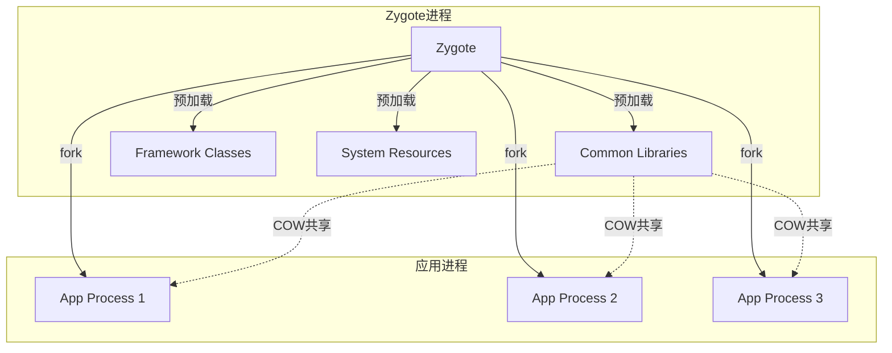
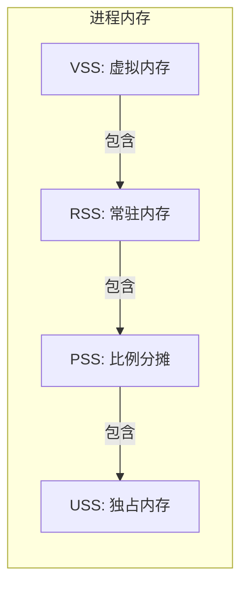
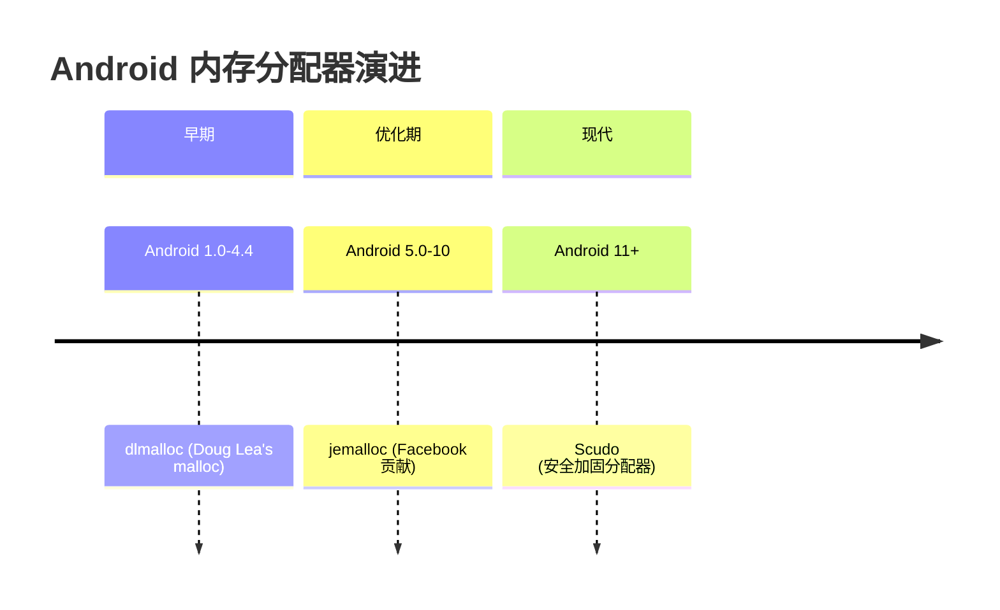
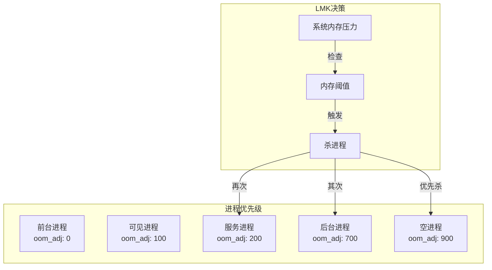
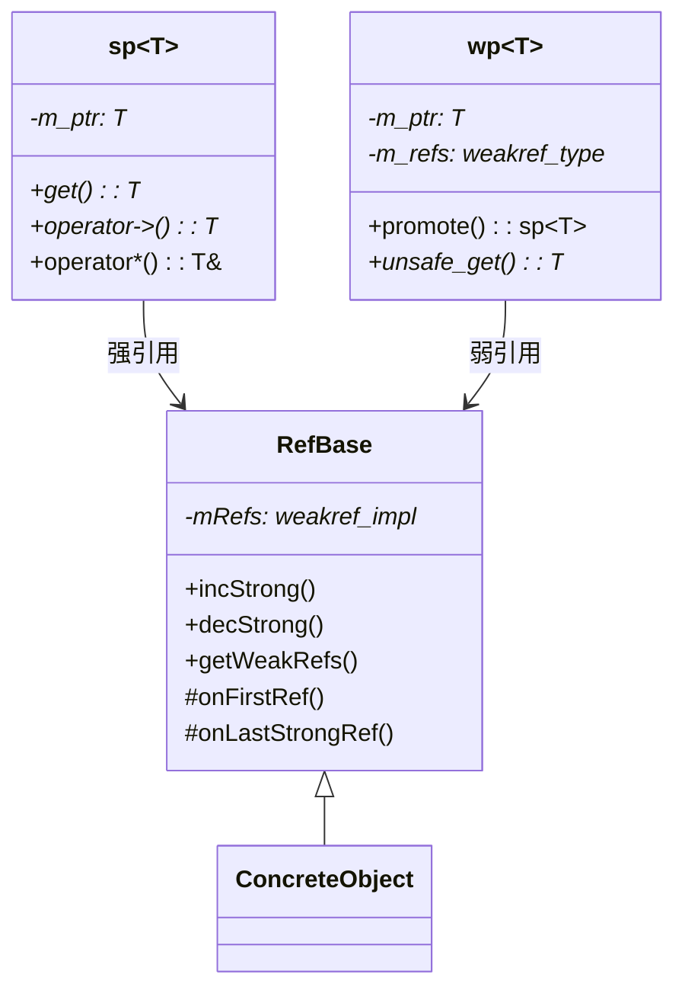

# Android 内存优化

> **核心结论**：Android C++ 开发面临无 GC 兜底、LMK 主动杀进程、碎片化设备内存限制差异大三重挑战。掌握 Native Heap 管理、引用计数机制、内存压力响应是关键。

## 1. Android 内存架构概述

### 1.1 进程内存模型

Android 采用 Linux 内核，但有独特的进程创建机制：



**Zygote Fork 机制优势**：
- 共享只读内存页（Copy-On-Write）
- 应用启动时间减少 50%+
- 系统整体内存占用降低 20-30%

### 1.2 内存分区详解

| 分区 | 描述 | 特点 | 典型大小 |
|------|------|------|----------|
| **Java Heap** | Dalvik/ART 管理的堆 | 有 GC、受 heapsize 限制 | 128-512MB |
| **Native Heap** | C/C++ malloc 分配 | 无 GC、仅受系统限制 | 无硬性上限 |
| **Code** | .so 库和 dex 代码 | mmap 映射、可共享 | 变化大 |
| **Stack** | 线程栈空间 | 每线程默认 1MB | N × 1MB |
| **Graphics** | GPU 内存（GL/Vulkan） | 独立于进程统计 | 变化大 |
| **Ashmem** | 匿名共享内存 | 跨进程共享 | 按需 |

### 1.3 内存指标解释



| 指标 | 含义 | 使用场景 |
|------|------|----------|
| **VSS** (Virtual Set Size) | 虚拟地址空间总大小 | 仅供参考，含未映射页 |
| **RSS** (Resident Set Size) | 实际占用物理内存 | 包含共享库，会重复计算 |
| **PSS** (Proportional Set Size) | 按比例分摊共享内存 | **系统级内存分析首选** |
| **USS** (Unique Set Size) | 进程独占内存 | 分析进程自身内存增长 |

### 1.4 内存限制配置

```bash
# 查看设备内存限制
adb shell getprop dalvik.vm.heapsize      # 单应用 Java 堆上限
adb shell getprop dalvik.vm.heapgrowthlimit # 常规应用限制
adb shell cat /proc/meminfo               # 系统总内存
```

**典型设备配置**：

| 设备RAM | heapgrowthlimit | heapsize (largeHeap) |
|---------|-----------------|----------------------|
| 2GB | 128MB | 256MB |
| 4GB | 256MB | 512MB |
| 8GB+ | 384MB | 512MB |

---

## 2. Native（C++）内存管理

### 2.1 Why: 为什么需要特别关注？

**三大核心挑战**：

1. **无 GC 兜底**：Native 内存泄漏不会触发 Java GC，持续累积直到 OOM
2. **统计盲区**：Java 层 `Runtime.getRuntime().totalMemory()` 看不到 Native 占用
3. **碎片化风险**：频繁 malloc/free 导致内存碎片，即使总量够也可能分配失败

### 2.2 What: Android 内存分配器演进



**Scudo 分配器特点**：

```cpp
// Scudo 内存布局
// ┌─────────────┬──────────────┬─────────────┐
// │   Header    │   Chunk      │   Checksum  │
// │  (8 bytes)  │  (用户数据)   │  (内嵌)      │
// └─────────────┴──────────────┴─────────────┘
```

| 分配器 | 优势 | 劣势 | 适用场景 |
|--------|------|------|----------|
| **dlmalloc** | 简单、内存紧凑 | 多线程性能差 | 单线程场景 |
| **jemalloc** | 多线程高性能、碎片少 | 内存开销略大 | 通用场景 |
| **Scudo** | 安全检测、UAF防护 | 性能略低于 jemalloc | Android 11+ 默认 |

### 2.3 How: ASharedMemory 使用

**创建和使用共享内存**：

```cpp
#include <android/sharedmem.h>
#include <sys/mman.h>
#include <unistd.h>

class SharedMemoryBuffer {
public:
    static constexpr size_t BUFFER_SIZE = 4 * 1024 * 1024; // 4MB
    
    bool create() {
        // 创建共享内存区域
        fd_ = ASharedMemory_create("my_shared_buffer", BUFFER_SIZE);
        if (fd_ < 0) {
            __android_log_print(ANDROID_LOG_ERROR, "SharedMem", 
                               "Failed to create shared memory");
            return false;
        }
        
        // 设置保护模式（可选：限制为只读）
        // ASharedMemory_setProt(fd_, PROT_READ);
        
        // 映射到进程地址空间
        data_ = mmap(nullptr, BUFFER_SIZE, 
                     PROT_READ | PROT_WRITE, 
                     MAP_SHARED, fd_, 0);
        
        if (data_ == MAP_FAILED) {
            close(fd_);
            fd_ = -1;
            return false;
        }
        
        return true;
    }
    
    // 获取 fd 用于跨进程传递（通过 Binder）
    int getFd() const { return fd_; }
    
    void* getData() { return data_; }
    
    ~SharedMemoryBuffer() {
        if (data_ != MAP_FAILED && data_ != nullptr) {
            munmap(data_, BUFFER_SIZE);
        }
        if (fd_ >= 0) {
            close(fd_);
        }
    }
    
private:
    int fd_ = -1;
    void* data_ = nullptr;
};
```

### 2.4 How: AHardwareBuffer 零拷贝图像传输

```cpp
#include <android/hardware_buffer.h>
#include <android/hardware_buffer_jni.h>

class HardwareBufferWrapper {
public:
    bool create(uint32_t width, uint32_t height) {
        AHardwareBuffer_Desc desc = {
            .width = width,
            .height = height,
            .layers = 1,
            .format = AHARDWAREBUFFER_FORMAT_R8G8B8A8_UNORM,
            .usage = AHARDWAREBUFFER_USAGE_CPU_READ_OFTEN |
                     AHARDWAREBUFFER_USAGE_CPU_WRITE_OFTEN |
                     AHARDWAREBUFFER_USAGE_GPU_SAMPLED_IMAGE,
            .stride = 0,  // 由系统决定
        };
        
        int result = AHardwareBuffer_allocate(&desc, &buffer_);
        if (result != 0) {
            return false;
        }
        
        // 获取实际描述（stride 可能被调整）
        AHardwareBuffer_describe(buffer_, &desc_);
        return true;
    }
    
    // CPU 写入数据
    bool writePixels(const void* data, size_t size) {
        void* mappedData = nullptr;
        int result = AHardwareBuffer_lock(
            buffer_, 
            AHARDWAREBUFFER_USAGE_CPU_WRITE_OFTEN,
            -1,      // fence
            nullptr, // rect (全部)
            &mappedData
        );
        
        if (result != 0) return false;
        
        // 考虑 stride 对齐
        const uint32_t rowBytes = desc_.width * 4; // RGBA
        const uint8_t* src = static_cast<const uint8_t*>(data);
        uint8_t* dst = static_cast<uint8_t*>(mappedData);
        
        for (uint32_t y = 0; y < desc_.height; ++y) {
            memcpy(dst, src, rowBytes);
            src += rowBytes;
            dst += desc_.stride * 4;
        }
        
        AHardwareBuffer_unlock(buffer_, nullptr);
        return true;
    }
    
    // 获取 EGLImage 用于 GPU 渲染
    AHardwareBuffer* getBuffer() { return buffer_; }
    
    ~HardwareBufferWrapper() {
        if (buffer_) {
            AHardwareBuffer_release(buffer_);
        }
    }
    
private:
    AHardwareBuffer* buffer_ = nullptr;
    AHardwareBuffer_Desc desc_ = {};
};
```

### 2.5 How: 自定义 Allocator 追踪内存

```cpp
#include <android/log.h>
#include <malloc.h>
#include <atomic>
#include <mutex>
#include <unordered_map>

class MemoryTracker {
public:
    static MemoryTracker& instance() {
        static MemoryTracker tracker;
        return tracker;
    }
    
    void* allocate(size_t size, const char* tag) {
        void* ptr = malloc(size);
        if (ptr) {
            std::lock_guard<std::mutex> lock(mutex_);
            allocations_[ptr] = {size, tag};
            totalAllocated_ += size;
            
            if (totalAllocated_ > peakMemory_) {
                peakMemory_ = totalAllocated_.load();
            }
            
            __android_log_print(ANDROID_LOG_DEBUG, "MemTracker",
                "[ALLOC] %s: %zu bytes @ %p (total: %zu)",
                tag, size, ptr, totalAllocated_.load());
        }
        return ptr;
    }
    
    void deallocate(void* ptr) {
        if (!ptr) return;
        
        std::lock_guard<std::mutex> lock(mutex_);
        auto it = allocations_.find(ptr);
        if (it != allocations_.end()) {
            totalAllocated_ -= it->second.size;
            __android_log_print(ANDROID_LOG_DEBUG, "MemTracker",
                "[FREE] %s: %zu bytes @ %p (total: %zu)",
                it->second.tag, it->second.size, ptr, 
                totalAllocated_.load());
            allocations_.erase(it);
        }
        free(ptr);
    }
    
    void dumpLeaks() {
        std::lock_guard<std::mutex> lock(mutex_);
        __android_log_print(ANDROID_LOG_WARN, "MemTracker",
            "=== Memory Leak Report ===");
        __android_log_print(ANDROID_LOG_WARN, "MemTracker",
            "Peak: %zu bytes, Current: %zu bytes, Leaks: %zu",
            peakMemory_.load(), totalAllocated_.load(), 
            allocations_.size());
        
        for (const auto& [ptr, info] : allocations_) {
            __android_log_print(ANDROID_LOG_WARN, "MemTracker",
                "  LEAK: %s - %zu bytes @ %p",
                info.tag, info.size, ptr);
        }
    }
    
private:
    struct AllocInfo {
        size_t size;
        const char* tag;
    };
    
    std::mutex mutex_;
    std::unordered_map<void*, AllocInfo> allocations_;
    std::atomic<size_t> totalAllocated_{0};
    std::atomic<size_t> peakMemory_{0};
};

// 宏定义简化使用
#define TRACKED_ALLOC(size, tag) \
    MemoryTracker::instance().allocate(size, tag)
#define TRACKED_FREE(ptr) \
    MemoryTracker::instance().deallocate(ptr)
```

---

## 3. Low Memory Killer（LMK）与内存压力

### 3.1 LMK 机制原理



**oom_adj_score 范围**：
- `-1000`：系统关键进程，永不杀
- `0`：前台进程
- `100-200`：可见/服务进程
- `700-900`：后台/空进程
- `1000`：可立即杀死

### 3.2 减少被杀概率的策略

```cpp
// JNI 回调处理内存压力
extern "C" JNIEXPORT void JNICALL
Java_com_example_app_NativeLib_onTrimMemory(
    JNIEnv* env, jobject thiz, jint level) {
    
    switch (level) {
        case 5:  // TRIM_MEMORY_RUNNING_MODERATE
            // 释放非关键缓存
            releaseNonCriticalCaches();
            break;
            
        case 10: // TRIM_MEMORY_RUNNING_LOW
            // 释放大部分缓存
            releaseMostCaches();
            break;
            
        case 15: // TRIM_MEMORY_RUNNING_CRITICAL
            // 释放所有可释放内存
            releaseAllCaches();
            // 调用 malloc_trim 归还内存给系统
            malloc_trim(0);
            break;
            
        case 20: // TRIM_MEMORY_UI_HIDDEN
            // UI 不可见，释放 UI 相关资源
            releaseUIResources();
            break;
            
        case 40: // TRIM_MEMORY_BACKGROUND
        case 60: // TRIM_MEMORY_MODERATE
        case 80: // TRIM_MEMORY_COMPLETE
            // 后台状态，尽可能释放
            releaseAllCaches();
            releaseUIResources();
            malloc_trim(0);
            break;
    }
    
    __android_log_print(ANDROID_LOG_INFO, "Memory",
        "onTrimMemory level=%d, freed memory", level);
}

void releaseNonCriticalCaches() {
    // 释放图片缓存
    ImageCache::instance().trimToSize(
        ImageCache::instance().maxSize() / 2);
    
    // 释放解码缓冲区池
    BufferPool::instance().releaseUnused();
}

void releaseMostCaches() {
    ImageCache::instance().clear();
    BufferPool::instance().releaseAll();
    
    // 释放字体缓存
    FontCache::instance().trim();
}

void releaseAllCaches() {
    releaseMostCaches();
    
    // 释放所有可释放的内存
    GlobalResourceManager::instance().releaseAll();
}
```

---

## 4. 引用计数在 Android 中的应用

### 4.1 Why: Android Framework 的选择

**选择引用计数的原因**：
1. **跨语言边界**：Java 和 Native 需要共同管理对象生命周期
2. **确定性释放**：多媒体/图形资源需要及时释放
3. **性能考虑**：避免 GC 停顿影响实时性

### 4.2 What: RefBase 机制



### 4.3 How: sp<>/wp<> 使用模式

```cpp
#include <utils/RefBase.h>
#include <utils/StrongPointer.h>

using namespace android;

// 继承 RefBase 的资源类
class Texture : public RefBase {
public:
    Texture(int width, int height) 
        : width_(width), height_(height) {
        data_ = new uint8_t[width * height * 4];
        ALOGD("Texture created: %dx%d", width, height);
    }
    
protected:
    // RefBase 生命周期回调
    void onFirstRef() override {
        ALOGD("Texture first reference");
        // 可以在这里做延迟初始化
    }
    
    void onLastStrongRef(const void* id) override {
        ALOGD("Texture last strong reference");
        // 强引用归零，即将析构
    }
    
    ~Texture() override {
        delete[] data_;
        ALOGD("Texture destroyed");
    }
    
private:
    int width_, height_;
    uint8_t* data_;
};

// 资源管理器（持有弱引用避免循环）
class TextureCache {
public:
    void add(const char* name, const sp<Texture>& texture) {
        cache_[name] = texture;  // 存储弱引用
    }
    
    sp<Texture> get(const char* name) {
        auto it = cache_.find(name);
        if (it != cache_.end()) {
            // 尝试提升为强引用
            sp<Texture> texture = it->second.promote();
            if (texture != nullptr) {
                return texture;
            }
            // 对象已销毁，移除缓存条目
            cache_.erase(it);
        }
        return nullptr;
    }
    
private:
    std::map<std::string, wp<Texture>> cache_;
};

// 使用示例
void demonstrateRefCounting() {
    TextureCache cache;
    
    {
        // 创建纹理，引用计数 = 1
        sp<Texture> texture = new Texture(1024, 1024);
        
        // 加入缓存（弱引用，不增加计数）
        cache.add("hero_texture", texture);
        
        // 传递给另一个强指针，引用计数 = 2
        sp<Texture> anotherRef = texture;
        
        ALOGD("Strong refs: texture + anotherRef");
        
        // 从缓存获取（提升弱引用），引用计数 = 3
        sp<Texture> fromCache = cache.get("hero_texture");
        
    } // texture, anotherRef, fromCache 都离开作用域
      // 引用计数 -> 0，Texture 被销毁
    
    // 此时缓存中的弱引用已失效
    sp<Texture> invalid = cache.get("hero_texture");
    // invalid == nullptr
}
```

### 4.4 与 std::shared_ptr 对比

| 特性 | Android sp<>/wp<> | std::shared_ptr/weak_ptr |
|------|-------------------|--------------------------|
| **控制块位置** | 对象内嵌（侵入式） | 独立分配（非侵入式） |
| **内存开销** | 更小 | 多一次堆分配 |
| **生命周期回调** | onFirstRef/onLastStrongRef | 自定义 deleter |
| **线程安全** | 原子操作 | 原子操作 |
| **跨语言支持** | 设计时考虑 JNI | 仅 C++ |
| **标准化** | Android 专用 | C++11 标准 |

---

## 5. Android 特有优化技巧

### 5.1 HWUI 内存影响

```cpp
// 减少 HWUI 内存占用的 Native 层配合
class RenderOptimization {
public:
    // 避免创建过大的离屏缓冲
    static constexpr int MAX_LAYER_SIZE = 2048;
    
    // 使用较小的纹理尺寸
    static int calculateOptimalTextureSize(int requested) {
        // 考虑 GPU 内存限制
        int maxSize = std::min(requested, MAX_LAYER_SIZE);
        // 向上取整到 2 的幂次（某些 GPU 更高效）
        return nextPowerOfTwo(maxSize);
    }
    
private:
    static int nextPowerOfTwo(int n) {
        n--;
        n |= n >> 1;
        n |= n >> 2;
        n |= n >> 4;
        n |= n >> 8;
        n |= n >> 16;
        return n + 1;
    }
};
```

### 5.2 mmap 优化大资源加载

```cpp
#include <sys/mman.h>
#include <sys/stat.h>
#include <fcntl.h>

class MappedAsset {
public:
    bool open(const char* path) {
        fd_ = ::open(path, O_RDONLY);
        if (fd_ < 0) return false;
        
        struct stat st;
        if (fstat(fd_, &st) < 0) {
            ::close(fd_);
            return false;
        }
        size_ = st.st_size;
        
        // 映射文件，延迟加载
        data_ = mmap(nullptr, size_, PROT_READ, MAP_PRIVATE, fd_, 0);
        if (data_ == MAP_FAILED) {
            ::close(fd_);
            return false;
        }
        
        // 告知内核访问模式，优化预读
        madvise(data_, size_, MADV_SEQUENTIAL);
        
        return true;
    }
    
    // 预加载指定区域
    void prefetch(size_t offset, size_t length) {
        if (data_ && offset + length <= size_) {
            madvise(static_cast<char*>(data_) + offset, 
                   length, MADV_WILLNEED);
        }
    }
    
    // 释放不再需要的区域
    void release(size_t offset, size_t length) {
        if (data_ && offset + length <= size_) {
            madvise(static_cast<char*>(data_) + offset,
                   length, MADV_DONTNEED);
        }
    }
    
    const void* data() const { return data_; }
    size_t size() const { return size_; }
    
    ~MappedAsset() {
        if (data_ && data_ != MAP_FAILED) {
            munmap(data_, size_);
        }
        if (fd_ >= 0) {
            ::close(fd_);
        }
    }
    
private:
    int fd_ = -1;
    void* data_ = nullptr;
    size_t size_ = 0;
};
```

### 5.3 madvise 参数对比

| 参数 | 含义 | 使用场景 |
|------|------|----------|
| `MADV_SEQUENTIAL` | 顺序访问 | 视频流、日志文件 |
| `MADV_RANDOM` | 随机访问 | 数据库、索引文件 |
| `MADV_WILLNEED` | 即将访问 | 预加载资源 |
| `MADV_DONTNEED` | 不再需要 | 释放已处理数据 |

---

## 6. 实战性能数据

### 6.1 内存分配器性能对比

| 操作 | dlmalloc | jemalloc | Scudo |
|------|----------|----------|-------|
| **单线程 malloc(64)** | 45 ns | 38 ns | 52 ns |
| **单线程 malloc(4KB)** | 120 ns | 85 ns | 95 ns |
| **8线程并发 malloc** | 850 ns | 95 ns | 180 ns |
| **内存碎片率** | 15-25% | 5-10% | 8-12% |
| **安全检测开销** | 无 | 无 | +10-15% |

### 6.2 Native 内存泄漏影响

| 泄漏速率 | 应用存活时间 | 用户体验影响 |
|----------|-------------|-------------|
| 1 MB/min | ~30 分钟 | 严重 |
| 100 KB/min | ~5 小时 | 中等 |
| 10 KB/min | ~50 小时 | 轻微 |
| < 1 KB/min | 基本无影响 | 无 |

### 6.3 优化效果量化

| 优化手段 | PSS 减少 | 启动时间影响 | 实现复杂度 |
|----------|---------|-------------|-----------|
| **ASharedMemory 替代 malloc** | 0%（共享不重复计算） | +5ms | 中 |
| **AHardwareBuffer 零拷贝** | 30-50% | -20ms | 高 |
| **mmap + MADV_DONTNEED** | 20-40% | +2ms | 低 |
| **对象池替代频繁分配** | 10-20% | -15ms | 中 |
| **malloc_trim 归还内存** | 5-15% | +10ms | 低 |

---

## 总结

Android C++ 内存优化的核心原则：

1. **了解你的内存**：区分 PSS/RSS/USS，定位真正的内存占用
2. **善用系统 API**：ASharedMemory、AHardwareBuffer 实现高效共享
3. **响应内存压力**：正确处理 onTrimMemory，避免被 LMK 杀死
4. **选择正确的引用**：理解 sp<>/wp<>，避免循环引用
5. **量化优化效果**：用数据说话，避免过度优化
