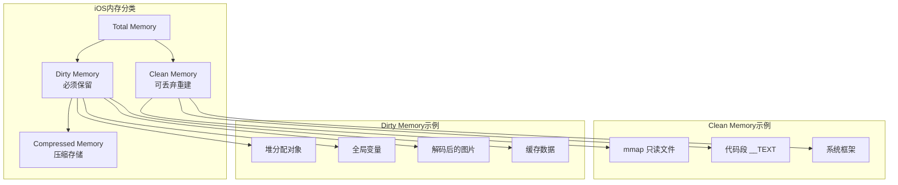
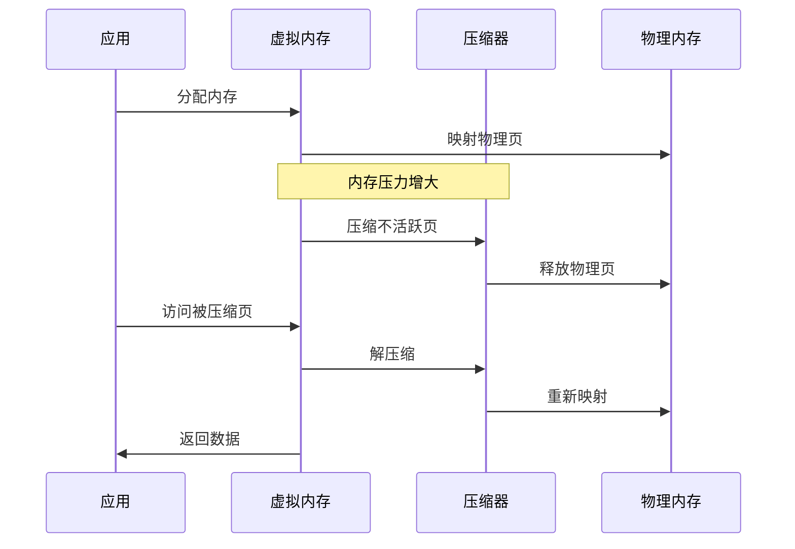
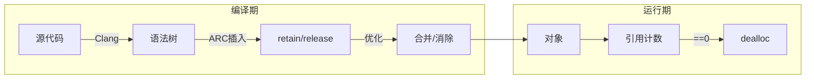
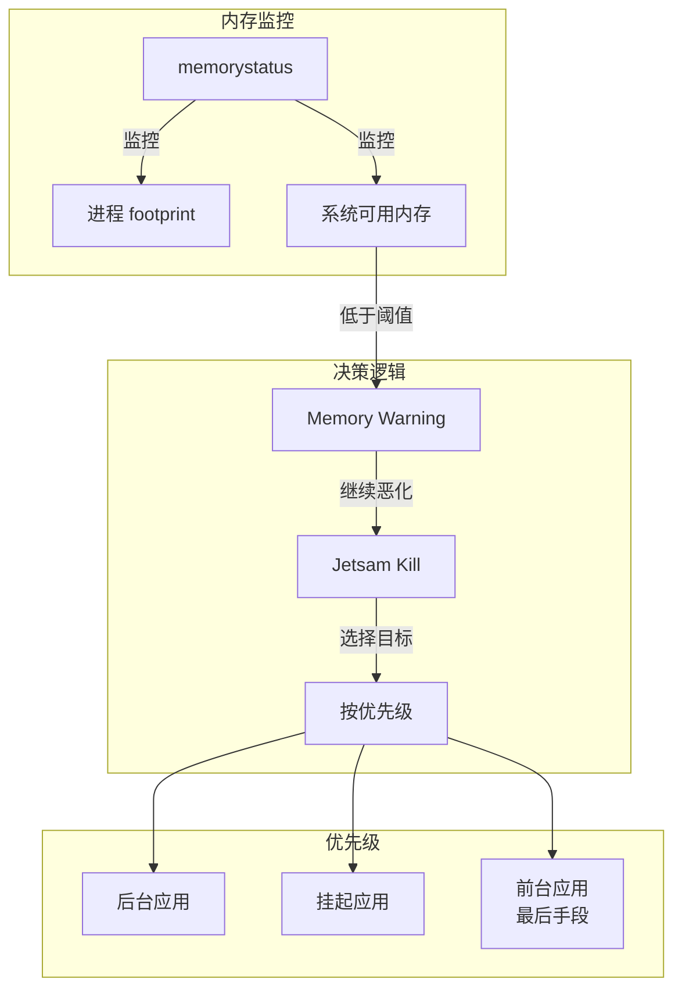
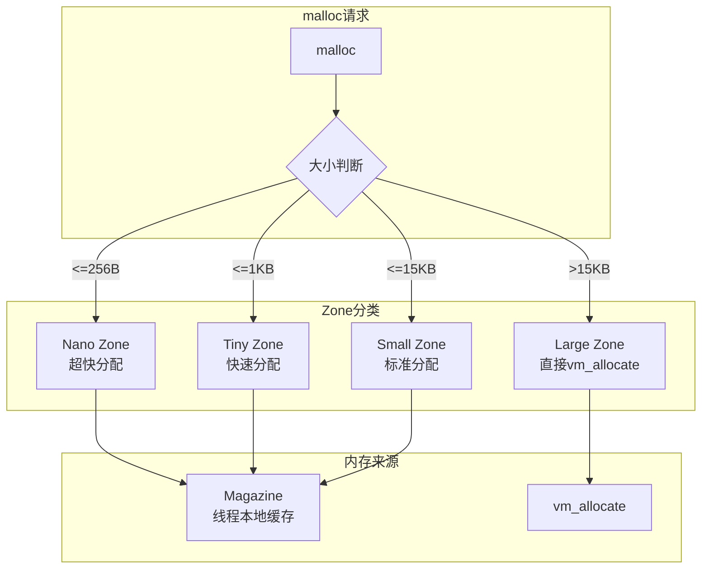
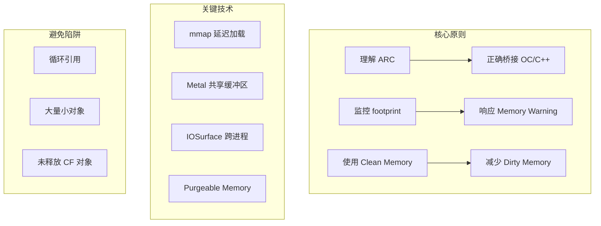

# iOS 内存优化

> **核心结论**：iOS 无 Swap、内存限制严格、Jetsam 机制激进。C++ 开发必须深刻理解引用计数（ARC）、内存压缩、footprint 概念，并与 Objective-C 运行时正确交互。

## 1. iOS 内存架构概述

### 1.1 内存模型特点

iOS 与 Android/桌面系统的根本差异：

| 特性 | iOS | Android | macOS/Linux |
|------|-----|---------|-------------|
| **Swap 分区** | ❌ 无 | ✅ 有 (ZRAM) | ✅ 有 |
| **内存压缩** | ✅ 激进 | ✅ 有 | ✅ 有 |
| **OOM 行为** | 直接杀进程 | 先杀后台 | 可换出到磁盘 |
| **内存限制** | 严格固定 | 相对宽松 | 取决于物理内存 |

**无 Swap 的影响**：
- 内存不足时无法换出到磁盘
- 应用必须在有限内存内运行
- 超限即死，没有缓冲余地

### 1.2 内存分类



| 内存类型 | 定义 | 系统行为 | 优化方向 |
|----------|------|---------|----------|
| **Clean** | 可从文件系统重建 | 内存压力时直接丢弃 | 尽量使用 mmap |
| **Dirty** | 运行时产生的数据 | 必须保留或压缩 | 减少、及时释放 |
| **Compressed** | 压缩后的 Dirty | 访问时解压 | 避免频繁访问 |

### 1.3 Jetsam 内存阈值

不同设备的 Jetsam 限制（近似值，Apple 不公开精确数字）：

| 设备 | RAM | 前台限制 | 后台限制 | Extension 限制 |
|------|-----|---------|----------|----------------|
| iPhone 8 | 2GB | ~1.2GB | ~150MB | ~120MB |
| iPhone 11 | 4GB | ~2.0GB | ~300MB | ~120MB |
| iPhone 13 | 4GB | ~2.8GB | ~400MB | ~120MB |
| iPhone 14 Pro | 6GB | ~4.0GB | ~600MB | ~200MB |
| iPad Pro M2 | 8-16GB | ~5.5GB+ | ~1GB | ~200MB |

### 1.4 内存压缩机制



**压缩比通常 2:1 到 4:1**，但解压有 CPU 开销。

---

## 2. 引用计数与内存管理

### 2.1 Why: 为什么选择引用计数？

**iOS/macOS 选择 ARC 而非 GC 的原因**：

1. **确定性释放**：对象在最后一个引用消失时立即释放，无 GC 暂停
2. **实时性保证**：游戏、音视频等场景不能接受 GC 停顿
3. **内存峰值可控**：立即释放避免内存累积
4. **与 C/C++ 良好互操作**：无需 GC 扫描栈帧

### 2.2 What: ARC 原理深度解析



**引用计数存储位置**：

```cpp
// 64位架构下的 isa 指针布局（Tagged Pointer 优化后）
// ┌─────────────────────────────────────────────────────────────────┐
// │ 1  │ 1  │ 1  │ 33        │ 6     │ 1    │ 1   │ 19            │ 1    │
// │ idx│has│ has│ shiftcls  │ magic │ weakly│deal │ extra_rc     │ has  │
// │    │ as │ cxx│           │       │ ref'd │ -ing│              │ sidetable│
// └─────────────────────────────────────────────────────────────────┘
```

**Side Table 存储弱引用**：

```cpp
// 伪代码：Side Table 结构
struct SideTable {
    spinlock_t lock;
    RefcountMap refcnts;      // 溢出的引用计数
    weak_table_t weak_table;   // 弱引用表
};

// 弱引用表结构
struct weak_table_t {
    weak_entry_t *weak_entries;
    size_t num_entries;
    // ...
};

// 当对象被销毁时，遍历 weak_table 将所有弱引用置 nil
```

### 2.3 How: Objective-C++ 混编内存管理

```objc
// MemoryBridge.mm - Objective-C++ 混编示例
#import <Foundation/Foundation.h>
#include <memory>
#include <vector>

// 1. 使用 __bridge 系列转换
class ImageProcessor {
public:
    // __bridge: 不转移所有权，仅类型转换
    void processWithoutOwnership(CGImageRef image) {
        // CGImageRef 是 CF 类型，与 OC 对象桥接
        // ARC 不管理这个引用
        processImage(image);
    }
    
    // __bridge_retained: ARC 转移所有权给 CF
    CGImageRef createImageRetained() {
        UIImage* uiImage = [UIImage imageNamed:@"test"];
        CGImageRef cgImage = (__bridge_retained CGImageRef)uiImage.CGImage;
        // 现在 cgImage 持有 +1 引用，调用方必须 CFRelease
        return cgImage;
    }
    
    // __bridge_transfer: CF 转移所有权给 ARC
    void takeOwnership(CGImageRef cfImage) {
        // ARC 接管内存管理，离开作用域自动释放
        UIImage* image = [[UIImage alloc] initWithCGImage:
            (__bridge_transfer CGImageRef)cfImage];
        // 使用 image...
    } // image 在这里被 ARC 释放
    
private:
    void processImage(CGImageRef image) { /* ... */ }
};

// 2. C++ RAII 包装 CoreFoundation 对象
template<typename T>
class CFGuard {
public:
    explicit CFGuard(T ref = nullptr) : ref_(ref) {}
    
    ~CFGuard() {
        if (ref_) {
            CFRelease(ref_);
        }
    }
    
    // 移动语义
    CFGuard(CFGuard&& other) noexcept : ref_(other.ref_) {
        other.ref_ = nullptr;
    }
    
    CFGuard& operator=(CFGuard&& other) noexcept {
        if (this != &other) {
            if (ref_) CFRelease(ref_);
            ref_ = other.ref_;
            other.ref_ = nullptr;
        }
        return *this;
    }
    
    // 禁止拷贝
    CFGuard(const CFGuard&) = delete;
    CFGuard& operator=(const CFGuard&) = delete;
    
    T get() const { return ref_; }
    T release() {
        T tmp = ref_;
        ref_ = nullptr;
        return tmp;
    }
    
    explicit operator bool() const { return ref_ != nullptr; }
    
private:
    T ref_;
};

// 使用示例
void processImageFile(const char* path) {
    CFGuard<CFStringRef> cfPath(
        CFStringCreateWithCString(nullptr, path, kCFStringEncodingUTF8)
    );
    
    CFGuard<CFURLRef> url(
        CFURLCreateWithFileSystemPath(nullptr, cfPath.get(), 
                                       kCFURLPOSIXPathStyle, false)
    );
    
    CFGuard<CGImageSourceRef> source(
        CGImageSourceCreateWithURL(url.get(), nullptr)
    );
    
    if (source) {
        CFGuard<CGImageRef> image(
            CGImageSourceCreateImageAtIndex(source.get(), 0, nullptr)
        );
        // 处理图像...
    }
} // 所有 CF 对象自动释放
```

### 2.4 循环引用检测与解决

```objc
// 循环引用场景
@interface VideoPlayer : NSObject
@property (nonatomic, strong) id<VideoDelegate> delegate; // 强引用！
@end

@interface ViewController : NSObject <VideoDelegate>
@property (nonatomic, strong) VideoPlayer* player;
@end

// 解决方案1：weak
@interface VideoPlayer : NSObject
@property (nonatomic, weak) id<VideoDelegate> delegate; // 改为弱引用
@end

// 解决方案2：在 C++ 中使用 weak 语义
class VideoPlayerCpp {
public:
    // 使用 __weak 存储 OC 对象
    void setDelegate(id<VideoDelegate> delegate) {
        __weak id<VideoDelegate> weakDelegate = delegate;
        delegate_ = weakDelegate;
    }
    
    void notifyDelegate() {
        // 提升为强引用使用
        __strong id<VideoDelegate> strongDelegate = delegate_;
        if (strongDelegate) {
            [strongDelegate onVideoEvent];
        }
    }
    
private:
    __weak id<VideoDelegate> delegate_;
};
```

### 2.5 性能对比数据

| 操作 | ARC | 手动 retain/release | std::shared_ptr |
|------|-----|---------------------|-----------------|
| **创建对象** | 25 ns | 25 ns | 35 ns |
| **retain** | 8 ns | 8 ns | 12 ns |
| **release** | 10 ns | 10 ns | 15 ns |
| **弱引用创建** | 20 ns | 20 ns | 25 ns |
| **弱引用提升** | 15 ns | 15 ns | 18 ns |
| **内存开销/对象** | 0-8 bytes | 0 bytes | 16-32 bytes |

**结论**：ARC 与手动管理性能相当，比 std::shared_ptr 略优。

---

## 3. Jetsam 机制与内存压力

### 3.1 Jetsam 工作原理



### 3.2 footprint vs physical memory

```cpp
// footprint: 应用的"内存账单"
// = Dirty Memory + Compressed Memory（解压后大小）
// ≠ 实际占用的物理内存

#include <os/proc.h>
#include <mach/mach.h>

struct MemoryInfo {
    size_t footprint;        // Jetsam 判断依据
    size_t physicalMemory;   // 实际物理占用
    size_t availableMemory;  // 系统可用
    
    static MemoryInfo query() {
        MemoryInfo info = {};
        
        // 方法1：使用 task_info
        task_vm_info_data_t vmInfo;
        mach_msg_type_number_t count = TASK_VM_INFO_COUNT;
        if (task_info(mach_task_self(), TASK_VM_INFO, 
                     (task_info_t)&vmInfo, &count) == KERN_SUCCESS) {
            info.footprint = vmInfo.phys_footprint;
            info.physicalMemory = vmInfo.resident_size;
        }
        
        // 方法2：iOS 13+ 推荐 API
        info.availableMemory = os_proc_available_memory();
        
        return info;
    }
};

// 使用示例
void checkMemoryStatus() {
    auto info = MemoryInfo::query();
    
    NSLog(@"Footprint: %.2f MB", info.footprint / 1024.0 / 1024.0);
    NSLog(@"Physical: %.2f MB", info.physicalMemory / 1024.0 / 1024.0);
    NSLog(@"Available: %.2f MB", info.availableMemory / 1024.0 / 1024.0);
    
    // 警告阈值
    const size_t WARNING_THRESHOLD = 50 * 1024 * 1024; // 50MB
    if (info.availableMemory < WARNING_THRESHOLD) {
        // 主动释放内存
        releaseNonCriticalResources();
    }
}
```

### 3.3 Memory Warning 处理

```objc
// AppDelegate 或 SceneDelegate 中
- (void)applicationDidReceiveMemoryWarning:(UIApplication *)application {
    // 通知 Native 层
    NativeMemoryManager::handleMemoryWarning();
}

// Native 层实现
class NativeMemoryManager {
public:
    static void handleMemoryWarning() {
        std::lock_guard<std::mutex> lock(mutex_);
        
        // 1. 清理图片缓存
        ImageCache::shared().clear();
        
        // 2. 释放音频缓冲区
        AudioBufferPool::shared().releaseAll();
        
        // 3. 压缩或释放模型数据
        MLModelCache::shared().unloadUnused();
        
        // 4. 记录日志用于分析
        logMemoryEvent("MemoryWarning", MemoryInfo::query());
    }
    
private:
    static std::mutex mutex_;
};
```

---

## 4. iOS Native（C++）内存管理

### 4.1 libmalloc 分配器架构



| Zone | 大小范围 | 特点 | 内部组织 |
|------|---------|------|----------|
| **Nano** | 1-256 bytes | 无锁、极快 | Slot 数组 |
| **Tiny** | 257-1008 bytes | 位图管理 | 64KB Region |
| **Small** | 1009-15KB | 位图管理 | 1MB Region |
| **Large** | >15KB | 直接系统调用 | 页对齐 |

### 4.2 vm_allocate 和 mmap

```cpp
#include <mach/mach.h>
#include <sys/mman.h>

// vm_allocate: Mach 层面的内存分配
class VirtualMemoryAllocator {
public:
    void* allocate(size_t size) {
        vm_address_t address = 0;
        kern_return_t result = vm_allocate(
            mach_task_self(),
            &address,
            size,
            VM_FLAGS_ANYWHERE  // 系统选择地址
        );
        
        if (result != KERN_SUCCESS) {
            return nullptr;
        }
        
        return reinterpret_cast<void*>(address);
    }
    
    void deallocate(void* ptr, size_t size) {
        vm_deallocate(
            mach_task_self(),
            reinterpret_cast<vm_address_t>(ptr),
            size
        );
    }
    
    // 标记内存为可回收（内存压力时系统可释放）
    void markVolatile(void* ptr, size_t size) {
        int state = VM_PURGABLE_VOLATILE;
        vm_purgable_control(
            mach_task_self(),
            reinterpret_cast<vm_address_t>(ptr),
            VM_PURGABLE_SET_STATE,
            &state
        );
    }
    
    // 检查是否被系统回收
    bool checkPurged(void* ptr, size_t size) {
        int state = 0;
        vm_purgable_control(
            mach_task_self(),
            reinterpret_cast<vm_address_t>(ptr),
            VM_PURGABLE_GET_STATE,
            &state
        );
        return state == VM_PURGABLE_EMPTY;
    }
};
```

### 4.3 Metal Buffer 共享内存

```objc
// Metal + C++ 零拷贝图像处理
#import <Metal/Metal.h>

class MetalImageProcessor {
public:
    bool initialize() {
        device_ = MTLCreateSystemDefaultDevice();
        if (!device_) return false;
        
        commandQueue_ = [device_ newCommandQueue];
        return true;
    }
    
    // 创建 CPU/GPU 共享缓冲区
    id<MTLBuffer> createSharedBuffer(size_t size) {
        // storageModeShared: CPU 和 GPU 都可访问
        return [device_ newBufferWithLength:size
                                   options:MTLResourceStorageModeShared];
    }
    
    // 处理图像（零拷贝）
    void processImage(const uint8_t* inputData, 
                      uint8_t* outputData,
                      size_t width, size_t height) {
        size_t bufferSize = width * height * 4;
        
        // 直接使用 CPU 数据创建缓冲区（零拷贝）
        id<MTLBuffer> inputBuffer = [device_ 
            newBufferWithBytesNoCopy:(void*)inputData
                              length:bufferSize
                             options:MTLResourceStorageModeShared
                         deallocator:nil];
        
        id<MTLBuffer> outputBuffer = [device_
            newBufferWithBytesNoCopy:outputData
                              length:bufferSize
                             options:MTLResourceStorageModeShared
                         deallocator:nil];
        
        // 创建计算命令
        id<MTLCommandBuffer> commandBuffer = [commandQueue_ commandBuffer];
        id<MTLComputeCommandEncoder> encoder = 
            [commandBuffer computeCommandEncoder];
        
        // 设置管线和资源...
        [encoder setComputePipelineState:pipeline_];
        [encoder setBuffer:inputBuffer offset:0 atIndex:0];
        [encoder setBuffer:outputBuffer offset:0 atIndex:1];
        
        // 分派计算
        MTLSize gridSize = MTLSizeMake(width, height, 1);
        MTLSize threadGroupSize = MTLSizeMake(16, 16, 1);
        [encoder dispatchThreads:gridSize 
           threadsPerThreadgroup:threadGroupSize];
        
        [encoder endEncoding];
        [commandBuffer commit];
        [commandBuffer waitUntilCompleted];
        
        // outputData 已包含处理结果，无需拷贝
    }
    
private:
    id<MTLDevice> device_;
    id<MTLCommandQueue> commandQueue_;
    id<MTLComputePipelineState> pipeline_;
};
```

### 4.4 IOSurface 跨进程共享

```objc
#import <IOSurface/IOSurface.h>

class CrossProcessBuffer {
public:
    // 创建者进程
    bool createSurface(size_t width, size_t height) {
        NSDictionary* properties = @{
            (id)kIOSurfaceWidth: @(width),
            (id)kIOSurfaceHeight: @(height),
            (id)kIOSurfaceBytesPerElement: @4,
            (id)kIOSurfacePixelFormat: @(kCVPixelFormatType_32BGRA),
        };
        
        surface_ = IOSurfaceCreate((__bridge CFDictionaryRef)properties);
        if (!surface_) return false;
        
        // 获取 ID 用于跨进程传递
        surfaceId_ = IOSurfaceGetID(surface_);
        return true;
    }
    
    // 消费者进程
    bool lookupSurface(IOSurfaceID surfaceId) {
        surface_ = IOSurfaceLookup(surfaceId);
        return surface_ != nullptr;
    }
    
    // 锁定并访问数据
    void* lock() {
        IOSurfaceLock(surface_, 0, nullptr);
        return IOSurfaceGetBaseAddress(surface_);
    }
    
    void unlock() {
        IOSurfaceUnlock(surface_, 0, nullptr);
    }
    
    IOSurfaceID getSurfaceId() const { return surfaceId_; }
    
    ~CrossProcessBuffer() {
        if (surface_) {
            CFRelease(surface_);
        }
    }
    
private:
    IOSurfaceRef surface_ = nullptr;
    IOSurfaceID surfaceId_ = 0;
};
```

---

## 5. iOS 特有优化技巧

### 5.1 NSCache 与自定义策略

```objc
// NSCache: 系统管理的缓存，内存压力时自动清理
@interface SmartCache<KeyType, ObjectType> : NSObject
@property (nonatomic, strong) NSCache<KeyType, ObjectType>* cache;
@property (nonatomic, assign) NSUInteger totalCostLimit;
@end

@implementation SmartCache

- (instancetype)initWithCostLimit:(NSUInteger)limit {
    self = [super init];
    if (self) {
        _cache = [[NSCache alloc] init];
        _cache.totalCostLimit = limit;
        _cache.delegate = self;
        
        // 监听内存警告
        [[NSNotificationCenter defaultCenter] 
            addObserver:self
               selector:@selector(handleMemoryWarning)
                   name:UIApplicationDidReceiveMemoryWarningNotification
                 object:nil];
    }
    return self;
}

- (void)handleMemoryWarning {
    [_cache removeAllObjects];
}

// NSCacheDelegate
- (void)cache:(NSCache*)cache willEvictObject:(id)obj {
    NSLog(@"Cache evicting object: %@", obj);
}

@end
```

### 5.2 mmap 延迟加载大文件

```cpp
#include <sys/mman.h>
#include <sys/stat.h>
#include <fcntl.h>

class LazyLoadedResource {
public:
    bool open(const char* path) {
        fd_ = ::open(path, O_RDONLY);
        if (fd_ < 0) return false;
        
        struct stat st;
        if (fstat(fd_, &st) < 0) {
            close(fd_);
            return false;
        }
        size_ = st.st_size;
        
        // MAP_PRIVATE: Copy-on-Write，修改不影响文件
        // 数据只在访问时才真正加载
        data_ = mmap(nullptr, size_, PROT_READ, MAP_PRIVATE, fd_, 0);
        if (data_ == MAP_FAILED) {
            close(fd_);
            return false;
        }
        
        // iOS 特有：标记为可清除
        // 内存压力时系统可以丢弃，再次访问时重新加载
        madvise(data_, size_, MADV_FREE_REUSABLE);
        
        return true;
    }
    
    const void* accessRegion(size_t offset, size_t length) {
        if (offset + length > size_) return nullptr;
        
        // 告知系统即将访问
        madvise(static_cast<char*>(data_) + offset, 
               length, MADV_WILLNEED);
        
        return static_cast<char*>(data_) + offset;
    }
    
    void releaseRegion(size_t offset, size_t length) {
        // 标记区域可被系统回收
        madvise(static_cast<char*>(data_) + offset,
               length, MADV_FREE_REUSABLE);
    }
    
    ~LazyLoadedResource() {
        if (data_ && data_ != MAP_FAILED) {
            munmap(data_, size_);
        }
        if (fd_ >= 0) {
            close(fd_);
        }
    }
    
private:
    int fd_ = -1;
    void* data_ = nullptr;
    size_t size_ = 0;
};
```

### 5.3 Dispatch Data 零拷贝网络

```objc
// 使用 dispatch_data 实现零拷贝网络传输
class ZeroCopyNetwork {
public:
    // 发送大数据块
    void sendData(const void* data, size_t size, 
                  dispatch_queue_t queue,
                  void (^completion)(bool success)) {
        
        // 创建 dispatch_data，不拷贝原始数据
        dispatch_data_t dispatchData = dispatch_data_create(
            data, size,
            queue,
            DISPATCH_DATA_DESTRUCTOR_DEFAULT
        );
        
        // 使用 dispatch_data 发送
        // 数据在传输完成前保持有效
        nw_connection_send(connection_, 
                          dispatchData,
                          NW_CONNECTION_DEFAULT_MESSAGE_CONTEXT,
                          true,  // isComplete
                          ^(nw_error_t error) {
            completion(error == nil);
        });
    }
    
    // 接收数据（零拷贝）
    void receiveData(void (^handler)(const void* data, size_t size)) {
        nw_connection_receive(connection_,
                             1,        // minBytes
                             65536,    // maxBytes
                             ^(dispatch_data_t content,
                               nw_content_context_t context,
                               bool isComplete,
                               nw_error_t error) {
            if (content) {
                // 直接访问内核缓冲区，不拷贝
                dispatch_data_apply(content, 
                    ^bool(dispatch_data_t region,
                          size_t offset,
                          const void* buffer,
                          size_t size) {
                    handler(buffer, size);
                    return true;
                });
            }
        });
    }
    
private:
    nw_connection_t connection_;
};
```

---

## 6. 实战性能数据

### 6.1 各设备 Jetsam 阈值测试

| 设备 | iOS 版本 | 前台最大 footprint | 触发 Warning | 被杀阈值 |
|------|---------|-------------------|-------------|----------|
| iPhone SE 2 | iOS 16 | 1.8GB | 1.4GB | 1.7GB |
| iPhone 12 | iOS 16 | 2.5GB | 2.0GB | 2.4GB |
| iPhone 13 Pro | iOS 16 | 3.2GB | 2.6GB | 3.0GB |
| iPhone 14 Pro | iOS 17 | 4.0GB | 3.2GB | 3.8GB |
| iPad Air 5 | iOS 16 | 4.5GB | 3.5GB | 4.2GB |

### 6.2 ARC 开销量化

测试环境：iPhone 13，iOS 16，Release 模式

| 场景 | 操作数/秒 | CPU 占用 |
|------|----------|----------|
| **创建 NSObject** | 8,500,000 | 基准 |
| **retain + release** | 25,000,000 | +5% |
| **weak 引用创建** | 3,200,000 | +15% |
| **weak 提升 strong** | 12,000,000 | +8% |
| **Autorelease Pool** | 1,500,000 | +25% |

### 6.3 优化效果对比

| 优化手段 | footprint 减少 | 加载时间 | 实现复杂度 |
|----------|---------------|----------|------------|
| **mmap 替代 read** | 50-70% | -30% | 低 |
| **NSCache 替代 Dictionary** | 0%（自动管理） | +5% | 低 |
| **IOSurface 跨进程** | 避免重复计算 | -50% | 高 |
| **Metal 共享缓冲区** | 30-50% | -40% | 中 |
| **Purgeable Memory** | 20-40% | +10% | 中 |
| **dispatch_data** | 15-30% | -20% | 低 |

---

## 总结

iOS C++ 内存优化核心策略：



1. **理解限制**：iOS 无 Swap，内存是硬约束
2. **善用 ARC**：正确使用 __bridge 系列，RAII 包装 CF 对象
3. **监控 footprint**：这是 Jetsam 的判断依据，而非物理内存
4. **偏好 Clean Memory**：mmap 只读文件优于 malloc
5. **响应系统信号**：处理 Memory Warning，主动释放资源
6. **零拷贝优先**：Metal Buffer、dispatch_data 减少内存复制
