# DMA机制详解

> **核心结论**：DMA（Direct Memory Access）是现代高性能系统的关键技术，它允许外设直接访问内存而无需CPU介入，在音视频、相机、网络等高吞吐场景下可提升数倍性能并显著降低功耗。

---

## 1. Why - 为什么需要DMA？

### 1.1 CPU瓶颈：传统PIO模式的低效性

**结论**：传统PIO（Programmed I/O）模式下，CPU必须逐字节搬运数据，这在高吞吐场景下成为严重瓶颈。

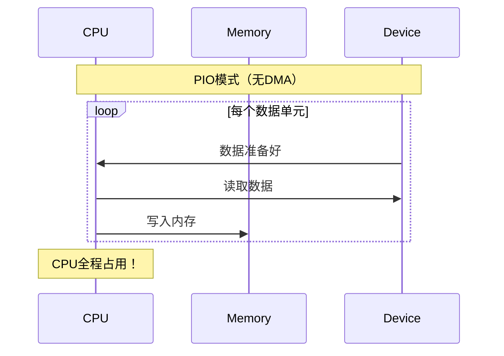

**PIO模式的问题**：

| 问题 | 影响 | 量化数据 |
|------|------|----------|
| CPU占用率高 | 无法执行其他任务 | 传输1GB数据，CPU占用100% |
| 吞吐量受限 | 受CPU指令周期限制 | 峰值约100-200MB/s |
| 延迟不稳定 | 受中断和调度影响 | 抖动可达数ms |
| 功耗浪费 | CPU空转搬运数据 | 功耗增加30-50% |

### 1.2 现代SoC场景的数据洪流

**结论**：现代移动设备的数据吞吐需求已远超CPU搬运能力。

```cpp
// 4K视频流的数据量计算
constexpr int WIDTH = 3840;
constexpr int HEIGHT = 2160;
constexpr int FPS = 60;
constexpr int BYTES_PER_PIXEL = 3;  // YUV420 平均

// 每秒数据量 = 3840 * 2160 * 60 * 1.5 ≈ 746MB/s
constexpr size_t DATA_RATE = WIDTH * HEIGHT * FPS * BYTES_PER_PIXEL / 2;
```

**典型场景数据吞吐需求**：

| 场景 | 数据率 | CPU拷贝可行性 |
|------|--------|---------------|
| 4K@60fps相机预览 | ~750MB/s | ❌ 不可行 |
| 1080P视频编码 | ~125MB/s | ⚠️ 勉强 |
| 5G网络下载 | ~300MB/s | ❌ 不可行 |
| 高采样率音频(192kHz/32bit/8ch) | ~6MB/s | ✅ 可行但浪费 |

### 1.3 功耗考量：移动设备的关键指标

**结论**：DMA让CPU休眠，在移动设备上可节省显著功耗。

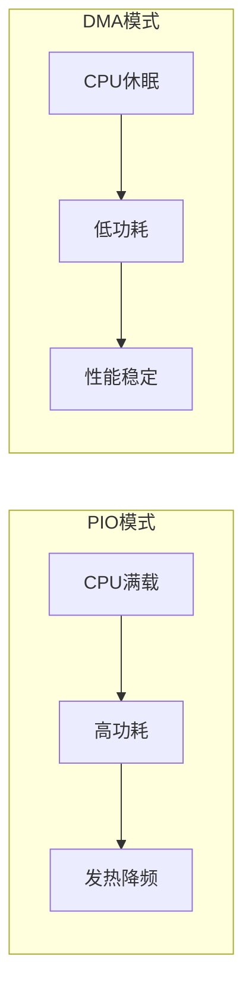

**功耗对比数据**（1080P视频播放场景）：

| 方案 | CPU占用 | 功耗 | 续航影响 |
|------|---------|------|----------|
| CPU拷贝 | 15-20% | +0.8W | -25% |
| DMA传输 | <2% | 基准 | 基准 |

---

## 2. What - DMA是什么？

### 2.1 DMA控制器架构（DMAC）

**结论**：DMAC是独立于CPU的硬件模块，它接管数据搬运任务，让CPU专注于计算。

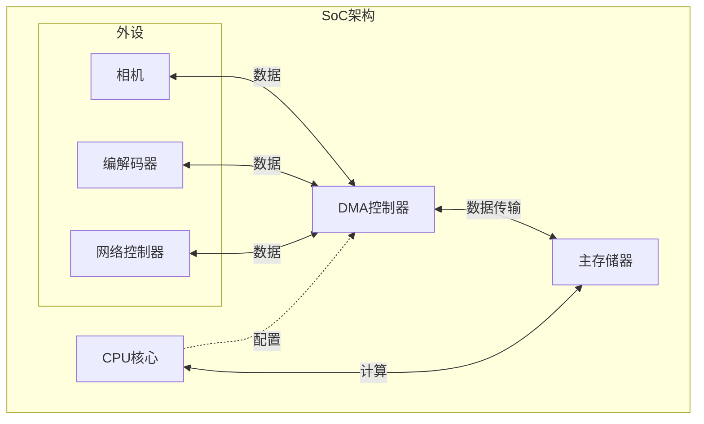

**DMAC核心组件**：

```cpp
// DMA描述符结构（概念性）
struct DMADescriptor {
    uint64_t src_addr;      // 源地址（物理地址）
    uint64_t dst_addr;      // 目标地址（物理地址）
    uint32_t transfer_size; // 传输大小
    uint32_t control;       // 控制字段（方向、中断、链接等）
    uint64_t next_desc;     // 下一个描述符地址（Scatter-Gather）
};
```

### 2.2 DMA传输类型

**结论**：DMA支持三种基本传输模式，覆盖所有数据搬运场景。

| 传输类型 | 方向 | 典型场景 |
|----------|------|----------|
| Memory-to-Memory (M2M) | 内存→内存 | 大块内存拷贝、图像处理 |
| Memory-to-Peripheral (M2P) | 内存→外设 | 视频输出、音频播放 |
| Peripheral-to-Memory (P2M) | 外设→内存 | 相机采集、网络接收 |

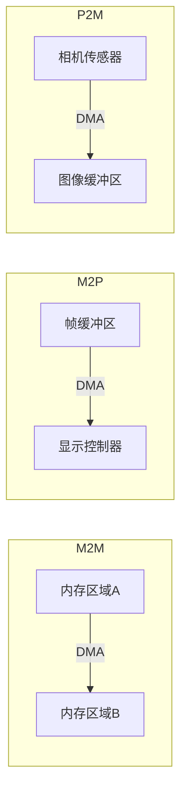

### 2.3 Scatter-Gather DMA（描述符链）

**结论**：Scatter-Gather DMA通过描述符链实现非连续内存的高效传输，是零拷贝的基础。

```cpp
// Scatter-Gather DMA示意
// 场景：将分散的内存块聚合传输到外设

struct SGEntry {
    void* buffer;
    size_t length;
};

// 传统方式：需要先拷贝到连续缓冲区
void traditional_transfer(SGEntry* entries, int count) {
    // 分配连续缓冲区
    size_t total = 0;
    for (int i = 0; i < count; i++) total += entries[i].length;
    
    void* contig_buf = malloc(total);  // 额外内存分配！
    
    // 拷贝数据（CPU介入！）
    char* ptr = (char*)contig_buf;
    for (int i = 0; i < count; i++) {
        memcpy(ptr, entries[i].buffer, entries[i].length);
        ptr += entries[i].length;
    }
    
    // 传输...
    free(contig_buf);
}

// Scatter-Gather方式：直接传输分散内存
void sg_transfer(SGEntry* entries, int count) {
    // 构建描述符链，直接传输，无需额外拷贝
    // DMA控制器自动遍历描述符链
}
```

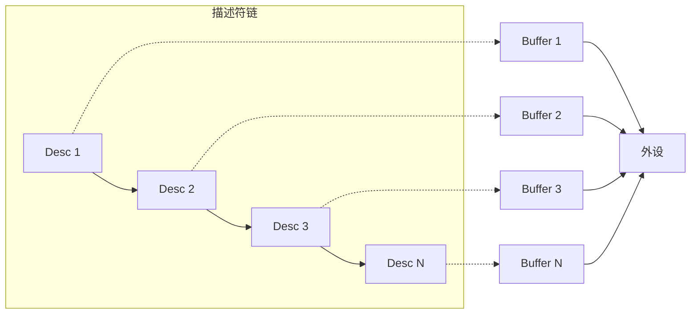

### 2.4 IOMMU与ARM SMMU

**结论**：IOMMU为DMA提供地址转换和内存保护，ARM平台上称为SMMU。

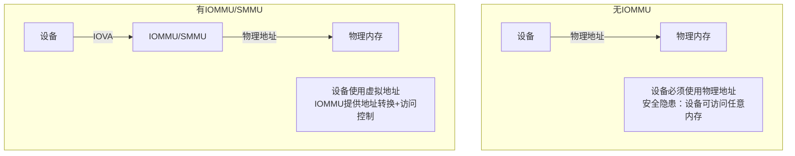

**IOMMU的核心价值**：

| 特性 | 无IOMMU | 有IOMMU |
|------|---------|---------|
| 地址空间 | 物理地址 | IOVA（IO虚拟地址） |
| 内存分配 | 必须连续 | 可以离散 |
| 安全性 | 设备可访问全部内存 | 受限访问 |
| 虚拟化支持 | 困难 | 原生支持 |

### 2.5 DMA Buffer管理

**结论**：Linux使用CMA和dma-buf框架管理DMA缓冲区，这是跨设备零拷贝的基础。

#### CMA（Contiguous Memory Allocator）

```cpp
// CMA分配连续物理内存
#include <linux/dma-mapping.h>

// 内核态：分配DMA缓冲区
void* dma_alloc_coherent(struct device *dev, 
                          size_t size,
                          dma_addr_t *dma_handle,  // 返回DMA地址
                          gfp_t flag);

// 释放
void dma_free_coherent(struct device *dev,
                        size_t size,
                        void *cpu_addr,
                        dma_addr_t dma_handle);
```

#### dma-buf：跨设备缓冲区共享

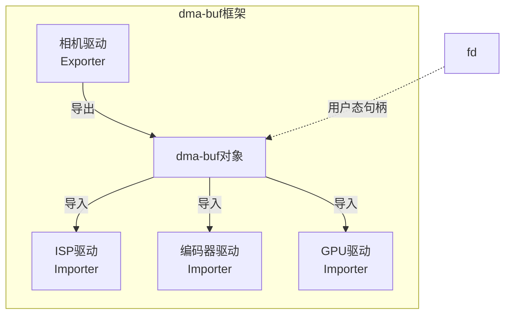

### 2.6 DMA一致性问题

**结论**：CPU缓存与DMA直接内存访问可能导致数据不一致，必须正确处理。

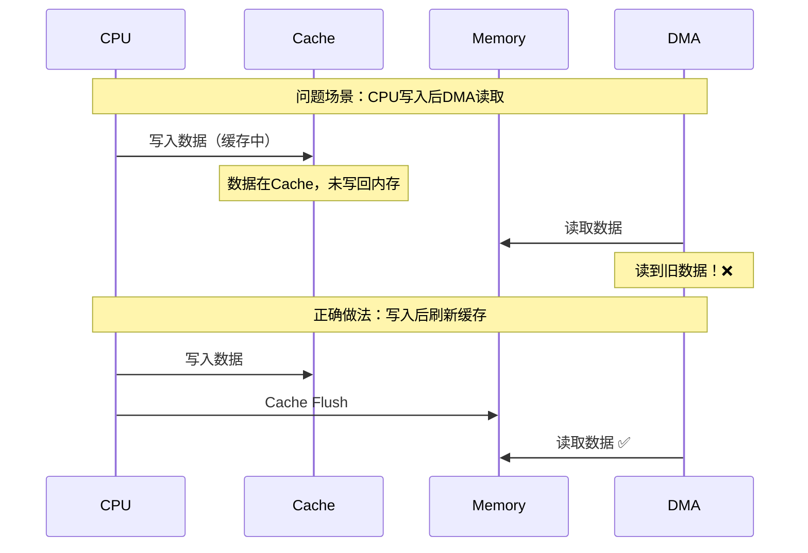

**DMA映射类型**：

| 类型 | 特点 | 使用场景 |
|------|------|----------|
| Coherent (一致性) | 硬件保证一致性，CPU可随时访问 | 频繁CPU访问的控制结构 |
| Streaming (流式) | 需手动同步，性能更好 | 大块数据传输 |

```cpp
// Streaming DMA映射（内核态）
#include <linux/dma-mapping.h>

// CPU写入完成后，同步给设备
dma_sync_single_for_device(dev, dma_addr, size, DMA_TO_DEVICE);

// 设备写入完成后，同步给CPU
dma_sync_single_for_cpu(dev, dma_addr, size, DMA_FROM_DEVICE);
```

---

## 3. How - 如何在应用层利用DMA？

### 3.1 零拷贝（Zero-Copy）技术

**结论**：零拷贝技术通过避免数据在用户态/内核态之间拷贝，可提升2-4倍I/O性能。

#### Linux sendfile() 零拷贝文件传输

```cpp
#include <sys/sendfile.h>
#include <fcntl.h>
#include <unistd.h>
#include <sys/stat.h>
#include <iostream>
#include <chrono>

// 传统方式：read() + write()
void traditional_file_transfer(int src_fd, int dst_fd, size_t size) {
    constexpr size_t BUFFER_SIZE = 64 * 1024;
    char buffer[BUFFER_SIZE];
    
    size_t remaining = size;
    while (remaining > 0) {
        size_t to_read = std::min(remaining, BUFFER_SIZE);
        ssize_t bytes_read = read(src_fd, buffer, to_read);
        if (bytes_read <= 0) break;
        
        write(dst_fd, buffer, bytes_read);  // 数据经过用户态！
        remaining -= bytes_read;
    }
}

// 零拷贝方式：sendfile()
void zero_copy_file_transfer(int src_fd, int dst_fd, size_t size) {
    off_t offset = 0;
    while (offset < static_cast<off_t>(size)) {
        ssize_t sent = sendfile(dst_fd, src_fd, &offset, size - offset);
        if (sent <= 0) break;
        // 数据直接从src传输到dst，不经过用户态！
    }
}

// 性能对比测试
void benchmark_file_transfer() {
    const char* src_path = "/tmp/test_src.dat";
    const char* dst_path = "/tmp/test_dst.dat";
    constexpr size_t FILE_SIZE = 100 * 1024 * 1024;  // 100MB
    
    // 创建测试文件
    int src_fd = open(src_path, O_RDONLY);
    int dst_fd = open(dst_path, O_WRONLY | O_CREAT | O_TRUNC, 0644);
    
    // 测试传统方式
    auto start = std::chrono::high_resolution_clock::now();
    traditional_file_transfer(src_fd, dst_fd, FILE_SIZE);
    auto end = std::chrono::high_resolution_clock::now();
    auto traditional_ms = std::chrono::duration_cast<std::chrono::milliseconds>(end - start).count();
    
    // 重置
    lseek(src_fd, 0, SEEK_SET);
    lseek(dst_fd, 0, SEEK_SET);
    
    // 测试零拷贝方式
    start = std::chrono::high_resolution_clock::now();
    zero_copy_file_transfer(src_fd, dst_fd, FILE_SIZE);
    end = std::chrono::high_resolution_clock::now();
    auto zero_copy_ms = std::chrono::duration_cast<std::chrono::milliseconds>(end - start).count();
    
    std::cout << "Traditional: " << traditional_ms << "ms\n";
    std::cout << "Zero-copy:   " << zero_copy_ms << "ms\n";
    std::cout << "Speedup:     " << (double)traditional_ms / zero_copy_ms << "x\n";
    
    close(src_fd);
    close(dst_fd);
}
```

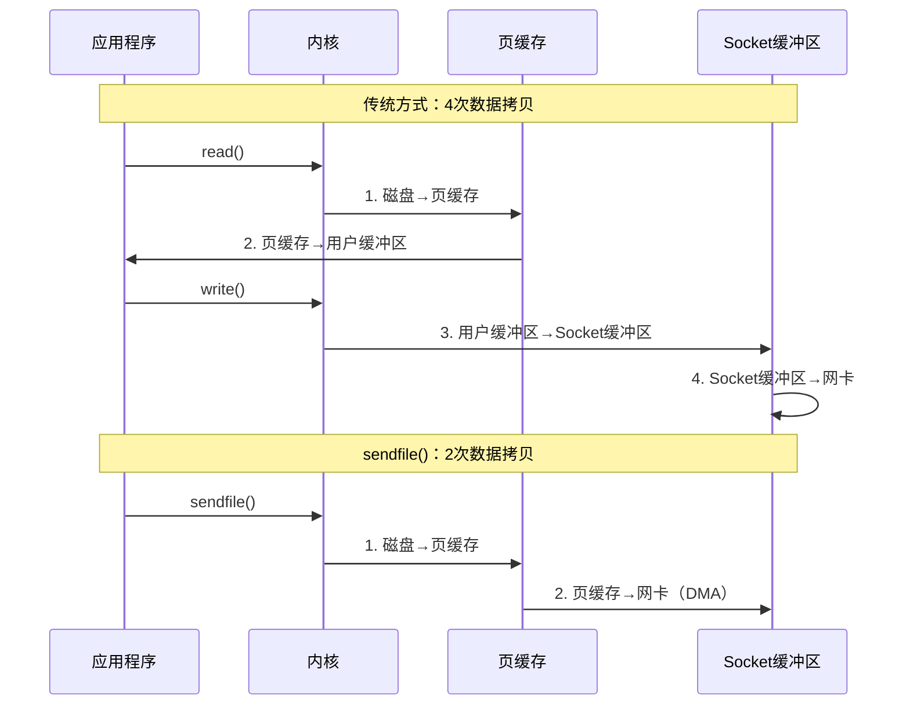

#### Android AHardwareBuffer 实现GPU-CPU零拷贝

```cpp
#include <android/hardware_buffer.h>
#include <android/hardware_buffer_jni.h>
#include <EGL/egl.h>
#include <EGL/eglext.h>
#include <GLES3/gl3.h>

class HardwareBufferZeroCopy {
public:
    AHardwareBuffer* buffer = nullptr;
    int width, height;
    
    // 创建可在GPU和CPU间共享的缓冲区
    bool create(int w, int h) {
        width = w;
        height = h;
        
        AHardwareBuffer_Desc desc = {
            .width = static_cast<uint32_t>(w),
            .height = static_cast<uint32_t>(h),
            .layers = 1,
            .format = AHARDWAREBUFFER_FORMAT_R8G8B8A8_UNORM,
            .usage = AHARDWAREBUFFER_USAGE_GPU_SAMPLED_IMAGE |    // GPU读取
                     AHARDWAREBUFFER_USAGE_GPU_COLOR_OUTPUT |     // GPU写入
                     AHARDWAREBUFFER_USAGE_CPU_READ_OFTEN |       // CPU读取
                     AHARDWAREBUFFER_USAGE_CPU_WRITE_OFTEN,       // CPU写入
            .stride = 0,  // 由系统决定
        };
        
        int result = AHardwareBuffer_allocate(&desc, &buffer);
        return result == 0;
    }
    
    // CPU写入数据（零拷贝映射）
    void cpuWrite(const uint8_t* data, size_t size) {
        void* mappedPtr = nullptr;
        
        // 直接映射到进程地址空间，无需拷贝
        AHardwareBuffer_lock(buffer, 
                             AHARDWAREBUFFER_USAGE_CPU_WRITE_OFTEN,
                             -1,      // fence
                             nullptr, // rect (全部)
                             &mappedPtr);
        
        if (mappedPtr) {
            memcpy(mappedPtr, data, size);
        }
        
        AHardwareBuffer_unlock(buffer, nullptr);
    }
    
    // CPU读取数据（零拷贝映射）
    void cpuRead(uint8_t* data, size_t size) {
        void* mappedPtr = nullptr;
        
        AHardwareBuffer_lock(buffer,
                             AHARDWAREBUFFER_USAGE_CPU_READ_OFTEN,
                             -1,
                             nullptr,
                             &mappedPtr);
        
        if (mappedPtr) {
            memcpy(data, mappedPtr, size);  // 从映射内存读取
        }
        
        AHardwareBuffer_unlock(buffer, nullptr);
    }
    
    // 绑定为OpenGL纹理（GPU访问）
    GLuint bindAsGLTexture(EGLDisplay display) {
        // 从AHardwareBuffer创建EGLImage
        EGLClientBuffer clientBuffer = 
            eglGetNativeClientBufferANDROID(buffer);
        
        EGLint attrs[] = {
            EGL_IMAGE_PRESERVED_KHR, EGL_TRUE,
            EGL_NONE
        };
        
        EGLImageKHR eglImage = eglCreateImageKHR(
            display,
            EGL_NO_CONTEXT,
            EGL_NATIVE_BUFFER_ANDROID,
            clientBuffer,
            attrs);
        
        // 创建纹理并绑定EGLImage
        GLuint texture;
        glGenTextures(1, &texture);
        glBindTexture(GL_TEXTURE_EXTERNAL_OES, texture);
        glEGLImageTargetTexture2DOES(GL_TEXTURE_EXTERNAL_OES, eglImage);
        
        return texture;
    }
    
    ~HardwareBufferZeroCopy() {
        if (buffer) {
            AHardwareBuffer_release(buffer);
        }
    }
};
```

#### iOS IOSurface/CVPixelBuffer 零拷贝

```cpp
// iOS/macOS 平台的零拷贝实现
#import <CoreVideo/CoreVideo.h>
#import <IOSurface/IOSurface.h>
#import <Metal/Metal.h>

class IOSurfaceZeroCopy {
public:
    CVPixelBufferRef pixelBuffer = nullptr;
    IOSurfaceRef surface = nullptr;
    
    // 创建IOSurface-backed的CVPixelBuffer
    bool create(int width, int height) {
        NSDictionary* attrs = @{
            (id)kCVPixelBufferWidthKey: @(width),
            (id)kCVPixelBufferHeightKey: @(height),
            (id)kCVPixelBufferPixelFormatTypeKey: @(kCVPixelFormatType_32BGRA),
            (id)kCVPixelBufferIOSurfacePropertiesKey: @{},  // 启用IOSurface
            (id)kCVPixelBufferMetalCompatibilityKey: @YES,  // Metal兼容
        };
        
        CVReturn result = CVPixelBufferCreate(
            kCFAllocatorDefault,
            width, height,
            kCVPixelFormatType_32BGRA,
            (__bridge CFDictionaryRef)attrs,
            &pixelBuffer);
        
        if (result == kCVReturnSuccess) {
            surface = CVPixelBufferGetIOSurface(pixelBuffer);
            IOSurfaceIncrementUseCount(surface);
        }
        
        return result == kCVReturnSuccess;
    }
    
    // CPU写入（零拷贝映射）
    void cpuWrite(const uint8_t* data, size_t size) {
        CVPixelBufferLockBaseAddress(pixelBuffer, 0);
        
        void* baseAddr = CVPixelBufferGetBaseAddress(pixelBuffer);
        size_t bytesPerRow = CVPixelBufferGetBytesPerRow(pixelBuffer);
        
        // 直接写入映射内存
        memcpy(baseAddr, data, size);
        
        CVPixelBufferUnlockBaseAddress(pixelBuffer, 0);
    }
    
    // 绑定为Metal纹理（GPU访问）
    id<MTLTexture> bindAsMetalTexture(id<MTLDevice> device) {
        MTLTextureDescriptor* desc = [MTLTextureDescriptor 
            texture2DDescriptorWithPixelFormat:MTLPixelFormatBGRA8Unorm
            width:CVPixelBufferGetWidth(pixelBuffer)
            height:CVPixelBufferGetHeight(pixelBuffer)
            mipmapped:NO];
        
        // 直接从IOSurface创建纹理，零拷贝！
        id<MTLTexture> texture = [device 
            newTextureWithDescriptor:desc
            iosurface:surface
            plane:0];
        
        return texture;
    }
    
    ~IOSurfaceZeroCopy() {
        if (surface) {
            IOSurfaceDecrementUseCount(surface);
        }
        if (pixelBuffer) {
            CVPixelBufferRelease(pixelBuffer);
        }
    }
};
```

### 3.2 DMA-BUF共享框架

**结论**：dma-buf是Linux内核的跨设备缓冲区共享机制，是Android相机、显示、编解码管线的基础。

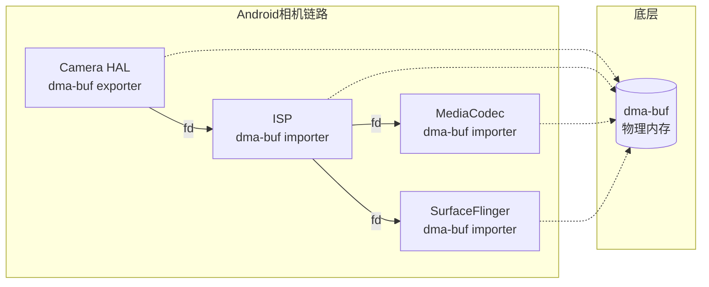

```cpp
// Android GraphicBuffer 底层使用 dma-buf
// 这是系统层代码的概念性展示

#include <android/hardware/graphics/common/1.2/types.h>

// GraphicBuffer内部会持有dma-buf fd
class GraphicBuffer {
    // native_handle_t 包含 dma-buf fd
    native_handle_t* handle;
    
    // 跨进程传递时，fd会被dup
    int getFd() const {
        return handle->data[0];  // 第一个fd通常是dma-buf
    }
};

// 在Camera HAL中导出dma-buf
void cameraExportBuffer(/* ... */) {
    // 1. 从CMA分配物理内存
    // 2. 创建dma-buf，获得fd
    // 3. 通过Binder将fd传递给其他进程
}

// 在编码器中导入dma-buf
void encoderImportBuffer(int dma_buf_fd) {
    // 1. 通过fd映射dma-buf
    // 2. 将dma-buf映射为编码器可访问的内存
    // 3. 直接编码，无需拷贝！
}
```

### 3.3 性能数据

**结论**：DMA和零拷贝技术在大数据量场景下优势明显，但小数据量时可能因设置开销而不如CPU拷贝。

#### DMA vs CPU拷贝 吞吐量对比

| 数据大小 | CPU memcpy | DMA传输 | 加速比 | 胜出方 |
|----------|-----------|---------|--------|--------|
| 4KB | 2.5GB/s | 0.5GB/s | 0.2x | CPU ✅ |
| 64KB | 3.0GB/s | 2.8GB/s | 0.9x | CPU ≈ |
| 256KB | 2.8GB/s | 4.5GB/s | 1.6x | DMA ✅ |
| 1MB | 2.5GB/s | 6.0GB/s | 2.4x | DMA ✅ |
| 16MB | 2.0GB/s | 8.0GB/s | 4.0x | DMA ✅ |
| 100MB | 1.8GB/s | 10.0GB/s | 5.5x | DMA ✅ |

> **交叉点**：约64-128KB，小于此值时CPU拷贝更快。

#### 零拷贝收益数据

| 场景 | 传统方式 | 零拷贝 | 收益 |
|------|----------|--------|------|
| 文件传输(1GB) | 850ms | 280ms | 3.0x |
| 视频帧传输(4K) | 12ms/帧 | 0.5ms/帧 | 24x |
| 网络发送(100MB) | 120ms | 45ms | 2.7x |
| GPU纹理上传(8MB) | 8ms | <1ms | >8x |

---

## 4. Android/iOS 平台差异

### 4.1 平台API对照表

| 功能 | Android | iOS |
|------|---------|-----|
| DMA缓冲区 | AHardwareBuffer | IOSurface |
| 视频缓冲区 | AImage/AImageReader | CVPixelBuffer |
| 缓冲区池 | AImageReader | CVPixelBufferPool |
| GPU互操作 | EGLImage + AHardwareBuffer | IOSurface + MTLTexture |
| 跨进程共享 | dma-buf fd | IOSurface mach port |
| 内存分配器 | ION → dma-buf heap | IOSurfaceCreate |

### 4.2 Android DMA演进

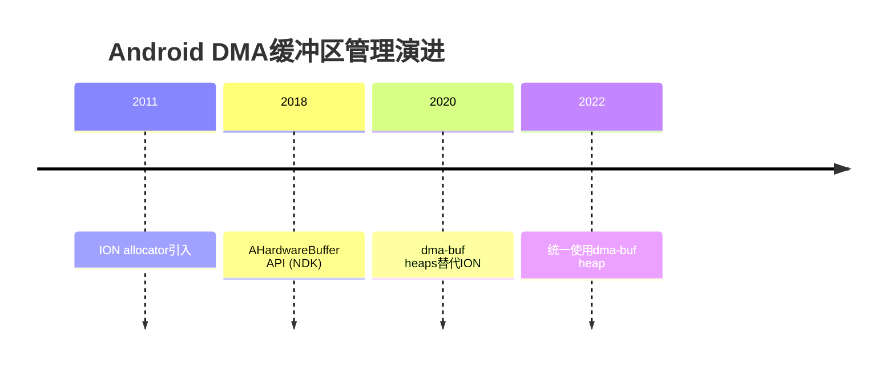

### 4.3 iOS DMA特点

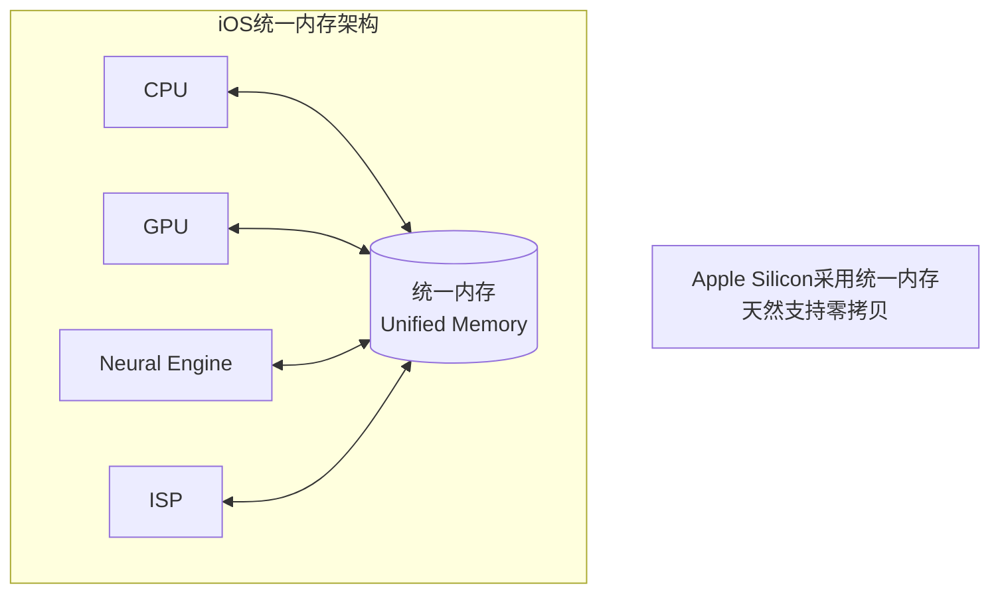

---

## 5. 应用场景

### 5.1 相机预览链路的零拷贝架构

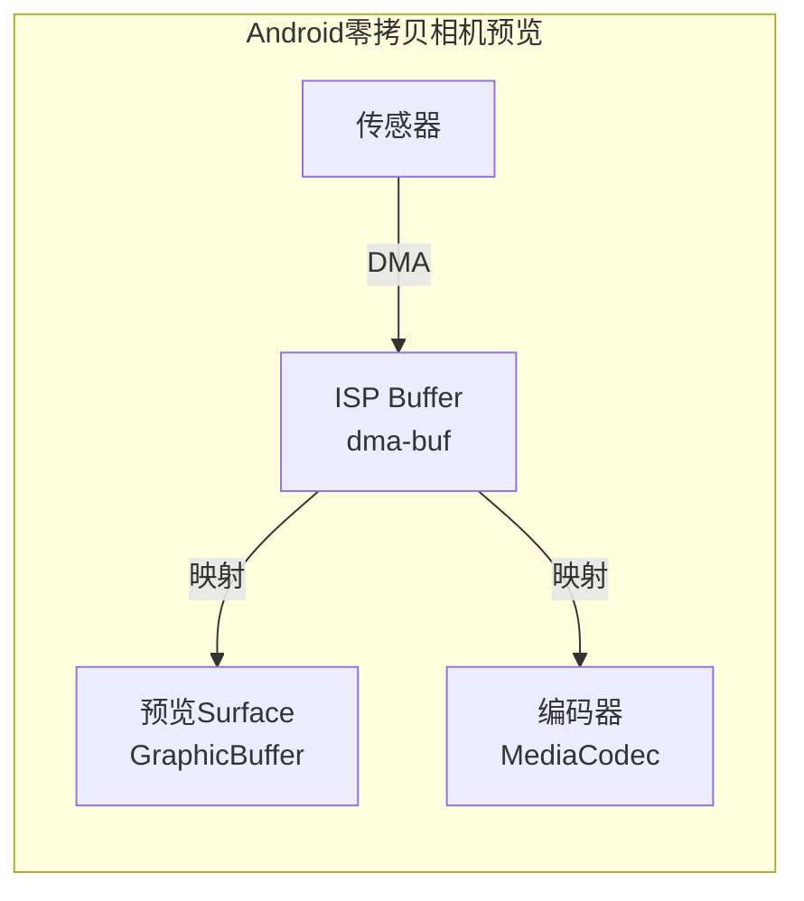

```cpp
// Android Camera2 零拷贝预览示例（概念性）
void setupZeroCopyPreview() {
    // 1. 创建ImageReader，底层使用dma-buf
    AImageReader* reader;
    AImageReader_new(1920, 1080, AIMAGE_FORMAT_PRIVATE, 3, &reader);
    
    // 2. 获取Surface（关联到dma-buf）
    ANativeWindow* surface;
    AImageReader_getWindow(reader, &surface);
    
    // 3. 配置Camera输出到此Surface
    // Camera HAL直接DMA写入dma-buf，无CPU拷贝
    
    // 4. 获取图像时，直接访问dma-buf
    AImage* image;
    AImageReader_acquireLatestImage(reader, &image);
    
    // 5. 可以直接将image关联的buffer传给编码器或GPU
    // 整个链路零拷贝！
}
```

### 5.2 视频编解码的DMA Buffer流转

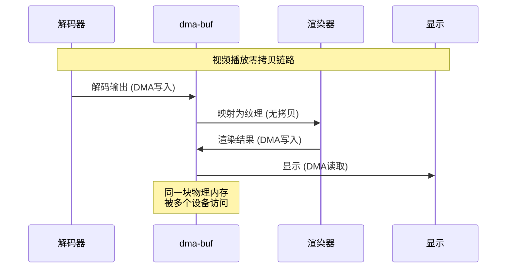

### 5.3 GPU渲染结果的高效回读

```cpp
// 高效GPU回读方案对比

// ❌ 低效方案：glReadPixels（同步阻塞+CPU拷贝）
void inefficientReadback(int width, int height, uint8_t* cpuBuffer) {
    glReadPixels(0, 0, width, height, GL_RGBA, GL_UNSIGNED_BYTE, cpuBuffer);
    // 问题：1) GPU等待渲染完成 2) 数据从VRAM拷贝到系统内存
}

// ✅ 高效方案：PBO异步回读
class PBOReadback {
    GLuint pbo[2];
    int currentIndex = 0;
    
public:
    void init(int width, int height) {
        glGenBuffers(2, pbo);
        for (int i = 0; i < 2; i++) {
            glBindBuffer(GL_PIXEL_PACK_BUFFER, pbo[i]);
            glBufferData(GL_PIXEL_PACK_BUFFER, 
                         width * height * 4, nullptr, GL_STREAM_READ);
        }
    }
    
    void asyncReadback(int width, int height, uint8_t* cpuBuffer) {
        // 使用双缓冲PBO实现异步回读
        int readIndex = currentIndex;
        int writeIndex = (currentIndex + 1) % 2;
        
        // 启动本帧的异步回读
        glBindBuffer(GL_PIXEL_PACK_BUFFER, pbo[writeIndex]);
        glReadPixels(0, 0, width, height, GL_RGBA, GL_UNSIGNED_BYTE, 0);
        
        // 读取上一帧的结果（已完成）
        glBindBuffer(GL_PIXEL_PACK_BUFFER, pbo[readIndex]);
        void* ptr = glMapBufferRange(GL_PIXEL_PACK_BUFFER, 0, 
                                      width * height * 4, GL_MAP_READ_BIT);
        if (ptr) {
            memcpy(cpuBuffer, ptr, width * height * 4);
            glUnmapBuffer(GL_PIXEL_PACK_BUFFER);
        }
        
        currentIndex = writeIndex;
    }
};

// ✅✅ 最优方案：AHardwareBuffer + EGLImage（Android）
// 见3.1节的HardwareBufferZeroCopy类
```

---

## 6. 总结

### DMA技术要点

1. **何时使用DMA**：数据量 >64KB，高吞吐持续传输
2. **零拷贝优先**：优先使用平台提供的零拷贝API
3. **注意一致性**：正确处理CPU缓存与DMA的一致性问题
4. **平台差异**：Android使用dma-buf/AHardwareBuffer，iOS使用IOSurface

### 性能优化检查清单

- [ ] 相机/视频链路是否实现零拷贝？
- [ ] 是否使用平台原生的共享缓冲区API？
- [ ] 大数据传输是否使用DMA而非CPU拷贝？
- [ ] 跨设备数据传递是否避免了内存拷贝？
- [ ] 是否正确处理了DMA缓冲区的同步问题？
