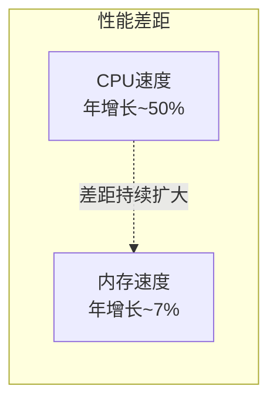
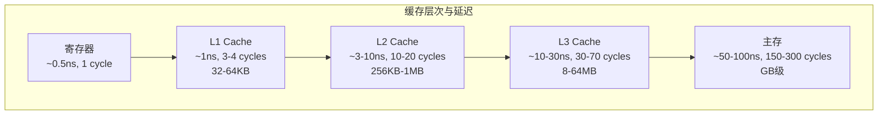
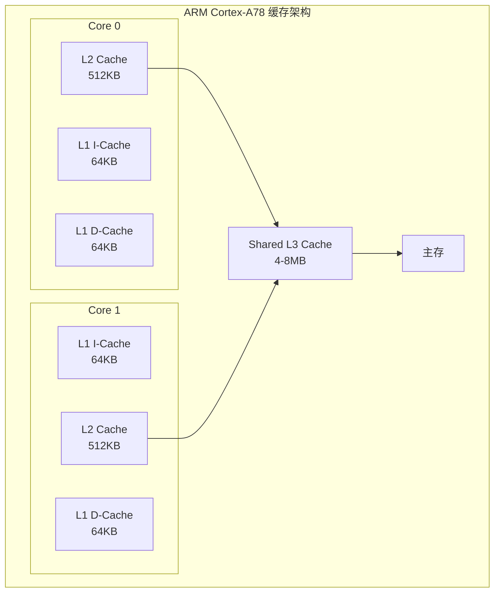
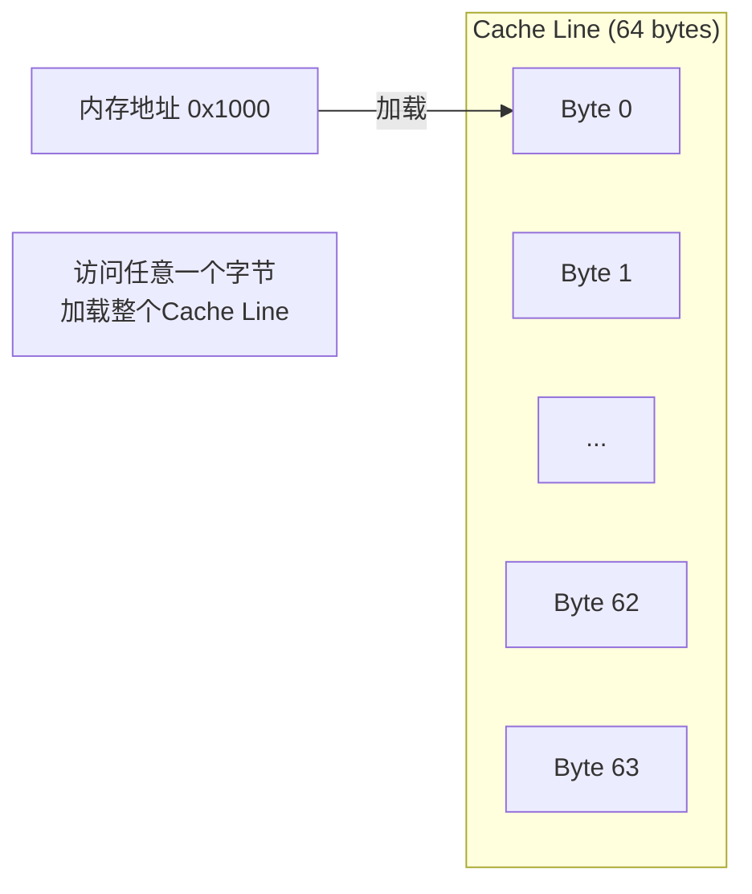
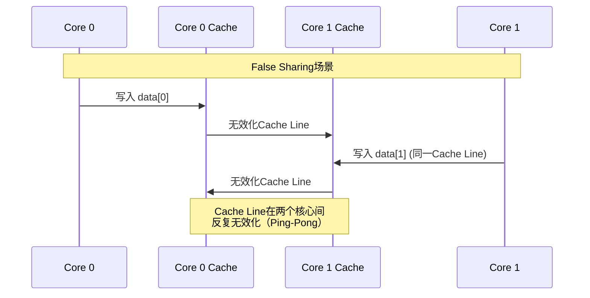
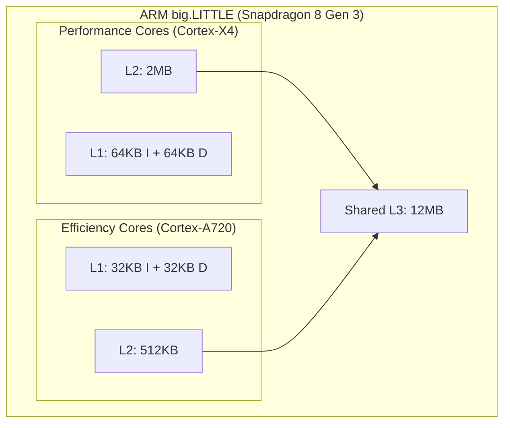
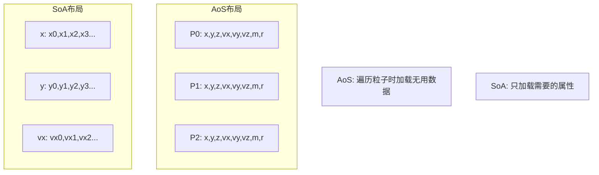
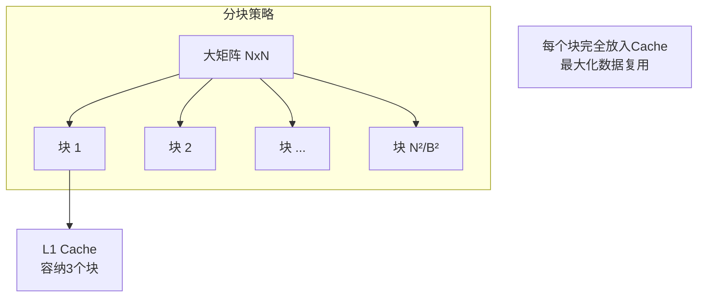

# 缓存优化策略

> **核心结论**：Cache Miss是现代CPU性能的头号杀手。一次L3 Miss的延迟（~50-100ns）相当于执行200-400条CPU指令。通过数据局部性优化、Cache Line对齐、预取策略等手段，可获得2-10倍的性能提升。

---

## 1. Why - 为什么Cache Miss是性能杀手？

### 1.1 内存墙（Memory Wall）问题

**结论**：CPU速度的提升远快于内存速度，二者的差距每年都在扩大，这就是"内存墙"。



**历史演进数据**：

| 年份 | CPU频率 | 内存延迟 | 延迟周期数 |
|------|---------|----------|------------|
| 1990 | 50MHz | 50ns | 2.5 cycles |
| 2000 | 1GHz | 60ns | 60 cycles |
| 2010 | 3GHz | 50ns | 150 cycles |
| 2024 | 5GHz | 50ns | 250 cycles |

> 现代CPU等待一次内存访问的时间，可以执行**250+条指令**！

### 1.2 数据访问延迟层级

**结论**：缓存层次结构是解决内存墙的核心手段，访问延迟差异可达100倍。



**各级缓存访问延迟对比**：

| 层级 | 延迟(ns) | 延迟(cycles @3GHz) | 典型大小 | 带宽 |
|------|----------|-------------------|----------|------|
| L1 D-Cache | 1 | 3-4 | 32-64KB | 1TB/s |
| L2 Cache | 3-10 | 10-20 | 256KB-1MB | 300GB/s |
| L3 Cache | 10-30 | 30-70 | 8-64MB | 100GB/s |
| DDR4/5 | 50-100 | 150-300 | 8-64GB | 50GB/s |

### 1.3 音视频处理中的Cache Miss影响

**结论**：在音视频处理等数据密集型场景，Cache Miss可导致30-80%的性能损失。

```cpp
// 实际案例：图像滤波处理
// 问题代码：按列遍历，Cache Miss严重

void image_filter_bad(uint8_t* img, int width, int height) {
    // ❌ 按列遍历 - 每次访问跨越一整行，Cache极不友好
    for (int x = 0; x < width; x++) {
        for (int y = 0; y < height; y++) {
            int idx = y * width + x;  // 步长=width，严重Cache Miss
            img[idx] = process_pixel(img[idx]);
        }
    }
}

void image_filter_good(uint8_t* img, int width, int height) {
    // ✅ 按行遍历 - 连续内存访问，Cache友好
    for (int y = 0; y < height; y++) {
        for (int x = 0; x < width; x++) {
            int idx = y * width + x;  // 步长=1，完美利用Cache Line
            img[idx] = process_pixel(img[idx]);
        }
    }
}
```

**性能对比数据（1920x1080图像）**：

| 遍历方式 | 耗时 | L1 Miss率 | L3 Miss率 |
|----------|------|-----------|-----------|
| 按列遍历 | 45ms | 25% | 18% |
| 按行遍历 | 8ms | 0.1% | 0.05% |
| **加速比** | **5.6x** | - | - |

---

## 2. What - Cache Miss是什么？

### 2.1 CPU缓存层次结构

**结论**：现代CPU采用多级缓存架构，L1最快但最小，L3最大但较慢。



**ARM与x86缓存特性对比**：

| 特性 | ARM Cortex-A78 | Apple M3 | Intel Core i9-14900K |
|------|----------------|----------|---------------------|
| L1 I-Cache | 64KB | 192KB | 32KB |
| L1 D-Cache | 64KB | 128KB | 48KB |
| L2 Cache | 512KB/核 | 16MB共享 | 2MB/核 |
| L3 Cache | 4-8MB | 24MB | 36MB |
| Cache Line | 64B | 128B | 64B |

### 2.2 Cache Line概念

**结论**：Cache以Cache Line（通常64字节）为单位进行数据传输，访问一个字节会加载整行。

```cpp
// Cache Line 结构示意
// 典型大小：64字节（x86/ARM）或 128字节（Apple Silicon）

struct CacheLineExample {
    // 假设64字节Cache Line
    int data[16];  // 16 * 4 = 64字节，正好一个Cache Line
};

// 当访问 data[0] 时，整个64字节都会被加载到Cache
// 这意味着后续访问 data[1] ~ data[15] 都是Cache Hit！
```



### 2.3 Cache Miss三种类型

**结论**：理解三种Cache Miss类型，才能针对性优化。

| 类型 | 原因 | 优化策略 |
|------|------|----------|
| Compulsory Miss (冷启动) | 数据首次访问 | 预取(Prefetch) |
| Capacity Miss (容量) | 缓存容量不足 | 分块(Tiling) |
| Conflict Miss (冲突) | 地址映射冲突 | 对齐优化 |

```cpp
#include <chrono>
#include <iostream>
#include <vector>
#include <random>

// 演示三种Cache Miss

// 1. Compulsory Miss - 首次访问
void demo_compulsory_miss() {
    std::vector<int> data(1000000);
    
    // 第一次遍历：全部Compulsory Miss
    auto start = std::chrono::high_resolution_clock::now();
    volatile int sum = 0;
    for (int i = 0; i < 1000000; i++) {
        sum += data[i];  // 首次访问，必定Miss
    }
    auto end = std::chrono::high_resolution_clock::now();
    auto first_pass = std::chrono::duration_cast<std::chrono::microseconds>(end - start).count();
    
    // 第二次遍历：大部分Hit（如果数据仍在Cache）
    start = std::chrono::high_resolution_clock::now();
    sum = 0;
    for (int i = 0; i < 1000000; i++) {
        sum += data[i];  // 可能Hit
    }
    end = std::chrono::high_resolution_clock::now();
    auto second_pass = std::chrono::duration_cast<std::chrono::microseconds>(end - start).count();
    
    std::cout << "First pass:  " << first_pass << " us\n";
    std::cout << "Second pass: " << second_pass << " us\n";
}

// 2. Capacity Miss - 工作集超过缓存容量
void demo_capacity_miss() {
    // L3 通常 8-32MB，我们用64MB数据
    constexpr size_t SIZE = 64 * 1024 * 1024 / sizeof(int);
    std::vector<int> large_data(SIZE);
    
    volatile int sum = 0;
    // 多次遍历，但数据太大无法全部放入Cache
    for (int pass = 0; pass < 3; pass++) {
        auto start = std::chrono::high_resolution_clock::now();
        for (size_t i = 0; i < SIZE; i++) {
            sum += large_data[i];
        }
        auto end = std::chrono::high_resolution_clock::now();
        auto ms = std::chrono::duration_cast<std::chrono::milliseconds>(end - start).count();
        std::cout << "Pass " << pass << ": " << ms << " ms\n";
        // 每次都差不多，因为数据被驱逐了
    }
}

// 3. Conflict Miss - 地址冲突
void demo_conflict_miss() {
    // 创建特定间距的访问模式，可能导致Cache冲突
    constexpr int STRIDE = 4096;  // 常见的Cache冲突间距
    constexpr int COUNT = 1000;
    std::vector<int> data(STRIDE * COUNT);
    
    // 按步长访问，可能导致冲突
    volatile int sum = 0;
    auto start = std::chrono::high_resolution_clock::now();
    for (int iter = 0; iter < 1000; iter++) {
        for (int i = 0; i < COUNT; i++) {
            sum += data[i * STRIDE];
        }
    }
    auto end = std::chrono::high_resolution_clock::now();
    auto us = std::chrono::duration_cast<std::chrono::microseconds>(end - start).count();
    std::cout << "Strided access: " << us << " us\n";
}
```

### 2.4 False Sharing（伪共享）

**结论**：False Sharing是多线程程序的隐形杀手，不同线程访问同一Cache Line的不同数据会导致Cache行在核心间频繁无效化。



```cpp
#include <thread>
#include <atomic>
#include <chrono>
#include <iostream>

// ❌ False Sharing示例
struct BadCounters {
    std::atomic<int> counter0;  // 与counter1在同一Cache Line
    std::atomic<int> counter1;
};

// ✅ 避免False Sharing
struct alignas(64) GoodCounters {
    struct alignas(64) Counter {
        std::atomic<int> value;
        char padding[64 - sizeof(std::atomic<int>)];  // 填充到64字节
    };
    
    Counter counter0;
    Counter counter1;  // 在不同的Cache Line
};

void benchmark_false_sharing() {
    constexpr int ITERATIONS = 10000000;
    
    // 测试False Sharing
    {
        BadCounters bad;
        bad.counter0 = 0;
        bad.counter1 = 0;
        
        auto start = std::chrono::high_resolution_clock::now();
        
        std::thread t0([&]() {
            for (int i = 0; i < ITERATIONS; i++) {
                bad.counter0.fetch_add(1, std::memory_order_relaxed);
            }
        });
        
        std::thread t1([&]() {
            for (int i = 0; i < ITERATIONS; i++) {
                bad.counter1.fetch_add(1, std::memory_order_relaxed);
            }
        });
        
        t0.join();
        t1.join();
        
        auto end = std::chrono::high_resolution_clock::now();
        auto ms = std::chrono::duration_cast<std::chrono::milliseconds>(end - start).count();
        std::cout << "With False Sharing:    " << ms << " ms\n";
    }
    
    // 测试无False Sharing
    {
        GoodCounters good;
        good.counter0.value = 0;
        good.counter1.value = 0;
        
        auto start = std::chrono::high_resolution_clock::now();
        
        std::thread t0([&]() {
            for (int i = 0; i < ITERATIONS; i++) {
                good.counter0.value.fetch_add(1, std::memory_order_relaxed);
            }
        });
        
        std::thread t1([&]() {
            for (int i = 0; i < ITERATIONS; i++) {
                good.counter1.value.fetch_add(1, std::memory_order_relaxed);
            }
        });
        
        t0.join();
        t1.join();
        
        auto end = std::chrono::high_resolution_clock::now();
        auto ms = std::chrono::duration_cast<std::chrono::milliseconds>(end - start).count();
        std::cout << "Without False Sharing: " << ms << " ms\n";
    }
}

// 典型输出：
// With False Sharing:    450 ms
// Without False Sharing: 85 ms
// 加速比：~5x
```

### 2.5 ARM处理器的缓存特点

**结论**：ARM big.LITTLE架构和Apple Silicon有独特的缓存设计，需针对性优化。

#### ARM big.LITTLE缓存差异



| 核心类型 | L1 D-Cache | L2 Cache | 适用场景 |
|----------|------------|----------|----------|
| 大核(Cortex-X4) | 64KB | 2MB | 计算密集型 |
| 中核(Cortex-A720) | 64KB | 512KB | 日常任务 |
| 小核(Cortex-A520) | 32KB | 256KB | 后台低功耗 |

#### Apple Silicon缓存特点

| 特性 | Apple M3 | 传统ARM |
|------|----------|---------|
| Cache Line大小 | 128字节 | 64字节 |
| L1 D-Cache | 128KB | 64KB |
| L2 Cache | 16MB共享 | 256KB-2MB/核 |
| 统一内存 | 是 | 否 |

```cpp
// Apple Silicon优化：考虑128字节Cache Line
#if defined(__APPLE__) && defined(__aarch64__)
    constexpr size_t CACHE_LINE_SIZE = 128;
#else
    constexpr size_t CACHE_LINE_SIZE = 64;
#endif

struct alignas(CACHE_LINE_SIZE) PlatformAlignedData {
    // 数据对齐到平台Cache Line大小
    int data[CACHE_LINE_SIZE / sizeof(int)];
};
```

---

## 3. How - 如何优化Cache性能？

### 3.1 数据局部性优化

**结论**：优化数据访问的时间局部性和空间局部性是Cache优化的核心。

#### 行优先 vs 列优先遍历

```cpp
#include <chrono>
#include <iostream>
#include <vector>

constexpr int ROWS = 4096;
constexpr int COLS = 4096;

// ❌ 列优先遍历 - Cache不友好
long long sum_column_major(const std::vector<std::vector<int>>& matrix) {
    long long sum = 0;
    for (int j = 0; j < COLS; j++) {      // 外层遍历列
        for (int i = 0; i < ROWS; i++) {  // 内层遍历行
            sum += matrix[i][j];          // 步长=COLS，Cache Miss严重
        }
    }
    return sum;
}

// ✅ 行优先遍历 - Cache友好
long long sum_row_major(const std::vector<std::vector<int>>& matrix) {
    long long sum = 0;
    for (int i = 0; i < ROWS; i++) {      // 外层遍历行
        for (int j = 0; j < COLS; j++) {  // 内层遍历列
            sum += matrix[i][j];          // 步长=1，连续访问
        }
    }
    return sum;
}

void benchmark_traversal() {
    std::vector<std::vector<int>> matrix(ROWS, std::vector<int>(COLS, 1));
    
    // 测试列优先
    auto start = std::chrono::high_resolution_clock::now();
    volatile auto sum1 = sum_column_major(matrix);
    auto end = std::chrono::high_resolution_clock::now();
    auto col_time = std::chrono::duration_cast<std::chrono::milliseconds>(end - start).count();
    
    // 测试行优先
    start = std::chrono::high_resolution_clock::now();
    volatile auto sum2 = sum_row_major(matrix);
    end = std::chrono::high_resolution_clock::now();
    auto row_time = std::chrono::duration_cast<std::chrono::milliseconds>(end - start).count();
    
    std::cout << "Column-major: " << col_time << " ms\n";
    std::cout << "Row-major:    " << row_time << " ms\n";
    std::cout << "Speedup:      " << (double)col_time / row_time << "x\n";
}

// 典型输出（4096x4096矩阵）：
// Column-major: 180 ms
// Row-major:    25 ms
// Speedup:      7.2x
```

#### SoA vs AoS数据布局

```cpp
#include <vector>
#include <chrono>
#include <iostream>

// AoS (Array of Structures) - 传统面向对象布局
struct ParticleAoS {
    float x, y, z;       // 位置
    float vx, vy, vz;    // 速度
    float mass;
    float radius;
    // 32字节/粒子
};

// SoA (Structure of Arrays) - Cache友好布局
struct ParticlesSoA {
    std::vector<float> x, y, z;       // 位置数组
    std::vector<float> vx, vy, vz;    // 速度数组
    std::vector<float> mass;
    std::vector<float> radius;
    
    void resize(size_t n) {
        x.resize(n); y.resize(n); z.resize(n);
        vx.resize(n); vy.resize(n); vz.resize(n);
        mass.resize(n); radius.resize(n);
    }
};

constexpr int NUM_PARTICLES = 1000000;
constexpr int ITERATIONS = 100;

// AoS更新位置
void update_positions_aos(std::vector<ParticleAoS>& particles, float dt) {
    for (auto& p : particles) {
        p.x += p.vx * dt;  // 访问x后，vx可能在同一Cache Line
        p.y += p.vy * dt;  // 但整体效率较低
        p.z += p.vz * dt;
    }
}

// SoA更新位置
void update_positions_soa(ParticlesSoA& particles, float dt, size_t n) {
    // 每个循环只访问需要的数据，Cache利用率高
    for (size_t i = 0; i < n; i++) {
        particles.x[i] += particles.vx[i] * dt;  // x和vx分别连续存储
    }
    for (size_t i = 0; i < n; i++) {
        particles.y[i] += particles.vy[i] * dt;
    }
    for (size_t i = 0; i < n; i++) {
        particles.z[i] += particles.vz[i] * dt;
    }
}

// SoA + SIMD优化
#if defined(__ARM_NEON)
#include <arm_neon.h>

void update_positions_soa_simd(ParticlesSoA& particles, float dt, size_t n) {
    float32x4_t dt_vec = vdupq_n_f32(dt);
    
    for (size_t i = 0; i < n; i += 4) {
        // 一次处理4个粒子的x坐标
        float32x4_t x = vld1q_f32(&particles.x[i]);
        float32x4_t vx = vld1q_f32(&particles.vx[i]);
        x = vmlaq_f32(x, vx, dt_vec);  // x += vx * dt
        vst1q_f32(&particles.x[i], x);
    }
    // 类似处理y和z...
}
#endif

void benchmark_aos_soa() {
    std::vector<ParticleAoS> particles_aos(NUM_PARTICLES);
    ParticlesSoA particles_soa;
    particles_soa.resize(NUM_PARTICLES);
    
    float dt = 0.016f;
    
    // AoS
    auto start = std::chrono::high_resolution_clock::now();
    for (int i = 0; i < ITERATIONS; i++) {
        update_positions_aos(particles_aos, dt);
    }
    auto end = std::chrono::high_resolution_clock::now();
    auto aos_time = std::chrono::duration_cast<std::chrono::milliseconds>(end - start).count();
    
    // SoA
    start = std::chrono::high_resolution_clock::now();
    for (int i = 0; i < ITERATIONS; i++) {
        update_positions_soa(particles_soa, dt, NUM_PARTICLES);
    }
    end = std::chrono::high_resolution_clock::now();
    auto soa_time = std::chrono::duration_cast<std::chrono::milliseconds>(end - start).count();
    
    std::cout << "AoS: " << aos_time << " ms\n";
    std::cout << "SoA: " << soa_time << " ms\n";
    std::cout << "Speedup: " << (double)aos_time / soa_time << "x\n";
}

// 典型输出：
// AoS: 320 ms
// SoA: 95 ms
// Speedup: 3.4x
```

**AoS vs SoA内存布局对比**：



### 3.2 Cache Line对齐

**结论**：正确的Cache Line对齐可消除False Sharing，提升多线程性能。

```cpp
#include <new>
#include <cstdint>

// C++17 hardware_destructive_interference_size
#ifdef __cpp_lib_hardware_interference_size
    constexpr size_t CACHE_LINE = std::hardware_destructive_interference_size;
#else
    constexpr size_t CACHE_LINE = 64;  // 默认值
#endif

// 方法1：alignas关键字
struct alignas(CACHE_LINE) AlignedCounter {
    int64_t count;
    // 自动填充到CACHE_LINE大小
};

// 方法2：手动padding
struct PaddedCounter {
    int64_t count;
    char padding[CACHE_LINE - sizeof(int64_t)];
};

// 方法3：使用std::aligned_alloc
void* allocate_aligned(size_t size) {
    return std::aligned_alloc(CACHE_LINE, size);
}

// 实际应用：线程本地计数器
class ThreadLocalCounters {
    struct alignas(CACHE_LINE) Counter {
        std::atomic<int64_t> value{0};
    };
    
    std::vector<Counter> counters;
    
public:
    explicit ThreadLocalCounters(int num_threads) 
        : counters(num_threads) {}
    
    void increment(int thread_id) {
        counters[thread_id].value.fetch_add(1, std::memory_order_relaxed);
    }
    
    int64_t total() const {
        int64_t sum = 0;
        for (const auto& c : counters) {
            sum += c.value.load(std::memory_order_relaxed);
        }
        return sum;
    }
};
```

### 3.3 预取（Prefetch）策略

**结论**：软件预取可以隐藏内存延迟，但需要找到正确的预取距离。

```cpp
#include <cstdint>

// GCC/Clang 内置预取
// __builtin_prefetch(addr, rw, locality)
// rw: 0=读取, 1=写入
// locality: 0=无局部性, 1=低局部性, 2=中等局部性, 3=高局部性

// 示例：链表遍历预取
struct Node {
    int data;
    Node* next;
};

int traverse_with_prefetch(Node* head) {
    int sum = 0;
    Node* current = head;
    
    while (current != nullptr) {
        // 预取后续节点
        if (current->next != nullptr) {
            __builtin_prefetch(current->next, 0, 3);
            
            // 预取更远的节点（2步之后）
            if (current->next->next != nullptr) {
                __builtin_prefetch(current->next->next, 0, 2);
            }
        }
        
        sum += current->data;
        current = current->next;
    }
    return sum;
}

// 示例：数组处理预取
void process_array_with_prefetch(float* data, size_t n) {
    constexpr size_t PREFETCH_DISTANCE = 16;  // 预取距离（元素数）
    
    for (size_t i = 0; i < n; i++) {
        // 预取未来的数据
        if (i + PREFETCH_DISTANCE < n) {
            __builtin_prefetch(&data[i + PREFETCH_DISTANCE], 0, 1);
        }
        
        // 处理当前数据
        data[i] = process(data[i]);
    }
}

// ARM NEON预取指令
#if defined(__ARM_NEON)
#include <arm_neon.h>

void neon_prefetch_example(float* data, size_t n) {
    for (size_t i = 0; i < n; i += 4) {
        // ARM PLD预取指令
        __builtin_prefetch(&data[i + 64], 0, 0);  // 预取256字节后的数据
        
        // NEON处理
        float32x4_t v = vld1q_f32(&data[i]);
        v = vmulq_f32(v, v);  // 平方
        vst1q_f32(&data[i], v);
    }
}
#endif
```

**预取策略选择**：

| 访问模式 | 预取距离 | 局部性提示 |
|----------|----------|------------|
| 顺序访问 | 8-16 Cache Lines | locality=1 |
| 跳跃访问 | 依赖步长计算 | locality=0 |
| 随机访问 | 预取无效 | 不使用预取 |
| 重复访问 | 首次访问时 | locality=3 |

### 3.4 Cache-Oblivious算法：分块（Tiling）

**结论**：分块技术将大问题分解为适合缓存的小块，是处理大数据的关键。

```cpp
#include <vector>
#include <chrono>
#include <iostream>
#include <algorithm>

constexpr int N = 1024;  // 矩阵大小

// ❌ 朴素矩阵乘法 - Cache不友好
void matmul_naive(const std::vector<std::vector<float>>& A,
                  const std::vector<std::vector<float>>& B,
                  std::vector<std::vector<float>>& C) {
    for (int i = 0; i < N; i++) {
        for (int j = 0; j < N; j++) {
            float sum = 0;
            for (int k = 0; k < N; k++) {
                sum += A[i][k] * B[k][j];  // B的列访问，Cache Miss严重
            }
            C[i][j] = sum;
        }
    }
}

// ✅ 分块矩阵乘法 - Cache友好
void matmul_blocked(const std::vector<std::vector<float>>& A,
                    const std::vector<std::vector<float>>& B,
                    std::vector<std::vector<float>>& C) {
    // 块大小：选择能放入L1 Cache的大小
    // 3个NxN块需要 3*BLOCK*BLOCK*4 字节 < L1 D-Cache (32-64KB)
    // BLOCK = 64: 3*64*64*4 = 48KB
    constexpr int BLOCK = 64;
    
    // 初始化C为0
    for (int i = 0; i < N; i++) {
        std::fill(C[i].begin(), C[i].end(), 0.0f);
    }
    
    // 分块遍历
    for (int ii = 0; ii < N; ii += BLOCK) {
        for (int jj = 0; jj < N; jj += BLOCK) {
            for (int kk = 0; kk < N; kk += BLOCK) {
                // 处理一个块
                int i_end = std::min(ii + BLOCK, N);
                int j_end = std::min(jj + BLOCK, N);
                int k_end = std::min(kk + BLOCK, N);
                
                for (int i = ii; i < i_end; i++) {
                    for (int k = kk; k < k_end; k++) {
                        float a_ik = A[i][k];
                        for (int j = jj; j < j_end; j++) {
                            C[i][j] += a_ik * B[k][j];
                        }
                    }
                }
            }
        }
    }
}

void benchmark_matmul() {
    std::vector<std::vector<float>> A(N, std::vector<float>(N, 1.0f));
    std::vector<std::vector<float>> B(N, std::vector<float>(N, 1.0f));
    std::vector<std::vector<float>> C(N, std::vector<float>(N, 0.0f));
    
    // 朴素版本
    auto start = std::chrono::high_resolution_clock::now();
    matmul_naive(A, B, C);
    auto end = std::chrono::high_resolution_clock::now();
    auto naive_ms = std::chrono::duration_cast<std::chrono::milliseconds>(end - start).count();
    
    // 分块版本
    start = std::chrono::high_resolution_clock::now();
    matmul_blocked(A, B, C);
    end = std::chrono::high_resolution_clock::now();
    auto blocked_ms = std::chrono::duration_cast<std::chrono::milliseconds>(end - start).count();
    
    std::cout << "Naive:   " << naive_ms << " ms\n";
    std::cout << "Blocked: " << blocked_ms << " ms\n";
    std::cout << "Speedup: " << (double)naive_ms / blocked_ms << "x\n";
}

// 典型输出（1024x1024矩阵）：
// Naive:   4500 ms
// Blocked: 850 ms
// Speedup: 5.3x
```



### 3.5 缓存一致性管理

**结论**：在DMA传输场景，必须正确管理CPU Cache与内存的一致性。

```cpp
// Linux内核态缓存管理
#include <linux/dma-mapping.h>

// CPU写入后，同步到内存供DMA读取
void prepare_for_dma_read(struct device *dev, void *cpu_addr, 
                           dma_addr_t dma_addr, size_t size) {
    // 将CPU Cache中的脏数据写回内存
    dma_sync_single_for_device(dev, dma_addr, size, DMA_TO_DEVICE);
}

// DMA写入后，无效化Cache供CPU读取
void sync_after_dma_write(struct device *dev, void *cpu_addr,
                           dma_addr_t dma_addr, size_t size) {
    // 无效化CPU Cache，下次读取从内存获取
    dma_sync_single_for_cpu(dev, dma_addr, size, DMA_FROM_DEVICE);
}

// 用户态：清除指令缓存（JIT场景）
#if defined(__GNUC__)
void clear_instruction_cache(void* start, size_t size) {
    // 清除指令缓存，用于JIT代码
    __builtin___clear_cache(start, (char*)start + size);
}
#endif

// ARM64特定的缓存操作
#if defined(__aarch64__)
void arm64_cache_flush(void* addr, size_t size) {
    uintptr_t start = (uintptr_t)addr;
    uintptr_t end = start + size;
    
    // 按Cache Line刷新
    for (uintptr_t p = start; p < end; p += 64) {
        // DC CIVAC: Clean and Invalidate by VA to PoC
        asm volatile("dc civac, %0" : : "r"(p) : "memory");
    }
    
    // 数据同步屏障
    asm volatile("dsb sy" : : : "memory");
}

void arm64_cache_invalidate(void* addr, size_t size) {
    uintptr_t start = (uintptr_t)addr;
    uintptr_t end = start + size;
    
    for (uintptr_t p = start; p < end; p += 64) {
        // DC IVAC: Invalidate by VA to PoC
        asm volatile("dc ivac, %0" : : "r"(p) : "memory");
    }
    
    asm volatile("dsb sy" : : : "memory");
}
#endif
```

---

## 4. 性能分析

### 4.1 使用perf分析Cache Miss

```bash
# Linux下使用perf统计Cache性能
perf stat -e cache-references,cache-misses,L1-dcache-loads,L1-dcache-load-misses ./your_program

# 示例输出：
# 1,234,567,890  cache-references
#    12,345,678  cache-misses  # 1.0% of all cache refs
# 2,345,678,901  L1-dcache-loads
#   234,567,890  L1-dcache-load-misses  # 10% of all L1-dcache loads

# 详细的缓存分析
perf record -e cache-misses ./your_program
perf report
```

### 4.2 优化前后性能对比

**图像处理优化案例（1920x1080 RGBA图像）**：

| 优化阶段 | 耗时(ms) | L1 Miss率 | 加速比 |
|----------|----------|-----------|--------|
| 原始版本（列优先） | 45 | 25% | 1.0x |
| 行优先遍历 | 8 | 0.1% | 5.6x |
| + Cache Line对齐 | 7 | 0.08% | 6.4x |
| + SIMD向量化 | 2 | 0.05% | 22.5x |

**粒子系统优化案例（100万粒子）**：

| 数据布局 | 每帧更新(ms) | Cache Miss | 加速比 |
|----------|-------------|------------|--------|
| AoS（原始） | 32 | 12% | 1.0x |
| SoA | 9.5 | 1.8% | 3.4x |
| SoA + SIMD | 3.2 | 1.2% | 10x |
| SoA + SIMD + 预取 | 2.5 | 0.8% | 12.8x |

### 4.3 ARM处理器Cache特性对比

| 处理器 | L1 D-Cache | L2 Cache | L3 Cache | Cache Line |
|--------|------------|----------|----------|------------|
| Cortex-A78 | 64KB | 512KB | 4MB | 64B |
| Cortex-X3 | 64KB | 1MB | 8MB | 64B |
| Apple A17 | 128KB | 16MB | - | 128B |
| Apple M3 | 128KB | 16MB | 24MB | 128B |
| Snapdragon 8 Gen 3 | 64KB | 2MB | 12MB | 64B |

---

## 5. 实战案例

### 5.1 图像处理中的Cache-Friendly像素遍历

```cpp
#include <cstdint>
#include <vector>

// 图像结构
struct Image {
    std::vector<uint8_t> data;  // RGBA格式
    int width, height;
    int stride;  // 行步长（可能有padding）
    
    uint8_t* row(int y) { return data.data() + y * stride; }
};

// ❌ 低效：逐像素随机访问
void apply_filter_bad(Image& img, int filter_size) {
    for (int y = 0; y < img.height; y++) {
        for (int x = 0; x < img.width; x++) {
            // 对每个像素访问周围像素（跳跃访问）
            int sum_r = 0, sum_g = 0, sum_b = 0;
            for (int fy = -filter_size; fy <= filter_size; fy++) {
                for (int fx = -filter_size; fx <= filter_size; fx++) {
                    int ny = std::clamp(y + fy, 0, img.height - 1);
                    int nx = std::clamp(x + fx, 0, img.width - 1);
                    uint8_t* p = img.row(ny) + nx * 4;
                    sum_r += p[0];
                    sum_g += p[1];
                    sum_b += p[2];
                }
            }
            // ...
        }
    }
}

// ✅ 高效：行缓冲 + 滑动窗口
void apply_filter_good(Image& img, int filter_size) {
    int diameter = 2 * filter_size + 1;
    
    // 为滤波窗口维护行缓冲
    std::vector<std::vector<int>> row_sums(diameter);
    for (auto& row : row_sums) {
        row.resize(img.width * 3);  // RGB三通道
    }
    
    // 预计算初始行和
    for (int ky = 0; ky < diameter && ky < img.height; ky++) {
        uint8_t* row = img.row(ky);
        for (int x = 0; x < img.width; x++) {
            row_sums[ky][x * 3 + 0] = row[x * 4 + 0];
            row_sums[ky][x * 3 + 1] = row[x * 4 + 1];
            row_sums[ky][x * 3 + 2] = row[x * 4 + 2];
        }
    }
    
    // 滑动窗口处理
    for (int y = 0; y < img.height; y++) {
        // 利用行缓冲，避免重复访问
        // 每行只需要O(width)的内存访问，而非O(width * diameter²)
        // ...
    }
}

// ✅✅ 最优：分块处理大图像
void apply_filter_tiled(Image& img, int filter_size) {
    // 选择适合L2 Cache的块大小
    // 假设L2 = 256KB，每像素4字节
    // 块大小 = sqrt(256KB / 4) ≈ 256
    constexpr int TILE_SIZE = 256;
    
    for (int tile_y = 0; tile_y < img.height; tile_y += TILE_SIZE) {
        for (int tile_x = 0; tile_x < img.width; tile_x += TILE_SIZE) {
            // 处理一个块
            int y_end = std::min(tile_y + TILE_SIZE, img.height);
            int x_end = std::min(tile_x + TILE_SIZE, img.width);
            
            // 块内的数据完全在Cache中
            for (int y = tile_y; y < y_end; y++) {
                uint8_t* row = img.row(y);
                for (int x = tile_x; x < x_end; x++) {
                    // 处理像素...
                }
            }
        }
    }
}
```

### 5.2 音频Buffer处理的局部性优化

```cpp
#include <cstdint>
#include <vector>

// 音频处理：多通道交错 vs 分离通道

// ❌ 交错格式处理单通道 - Cache不友好
void process_interleaved_bad(float* audio, int num_samples, int num_channels) {
    // 只处理第0通道
    for (int i = 0; i < num_samples; i++) {
        audio[i * num_channels + 0] *= 0.5f;  // 步长=num_channels
    }
}

// ✅ 转换为分离格式处理
void process_planar_good(float** channels, int num_samples, int num_channels) {
    // 每个通道连续存储
    for (int ch = 0; ch < num_channels; ch++) {
        float* channel = channels[ch];
        for (int i = 0; i < num_samples; i++) {
            channel[i] *= 0.5f;  // 步长=1，Cache友好
        }
    }
}

// ✅✅ SIMD优化的分离格式处理
#if defined(__ARM_NEON)
#include <arm_neon.h>

void process_planar_neon(float* channel, int num_samples) {
    float32x4_t gain = vdupq_n_f32(0.5f);
    
    int i = 0;
    // NEON处理（每次4个样本）
    for (; i + 4 <= num_samples; i += 4) {
        __builtin_prefetch(&channel[i + 64], 0, 1);  // 预取
        
        float32x4_t samples = vld1q_f32(&channel[i]);
        samples = vmulq_f32(samples, gain);
        vst1q_f32(&channel[i], samples);
    }
    
    // 处理剩余样本
    for (; i < num_samples; i++) {
        channel[i] *= 0.5f;
    }
}
#endif
```

### 5.3 视频帧Buffer的内存布局优化

```cpp
#include <cstdint>
#include <cstdlib>

// 视频帧内存布局优化

// 帧缓冲区结构
struct VideoFrame {
    uint8_t* y_plane;   // Y平面
    uint8_t* u_plane;   // U平面
    uint8_t* v_plane;   // V平面
    int width, height;
    int y_stride;
    int uv_stride;
};

// ✅ Cache Line对齐的帧分配
VideoFrame* allocate_aligned_frame(int width, int height) {
    constexpr size_t CACHE_LINE = 64;
    
    VideoFrame* frame = new VideoFrame();
    frame->width = width;
    frame->height = height;
    
    // Stride对齐到Cache Line
    frame->y_stride = (width + CACHE_LINE - 1) & ~(CACHE_LINE - 1);
    frame->uv_stride = ((width / 2) + CACHE_LINE - 1) & ~(CACHE_LINE - 1);
    
    // 分配对齐内存
    size_t y_size = frame->y_stride * height;
    size_t uv_size = frame->uv_stride * (height / 2);
    
    frame->y_plane = static_cast<uint8_t*>(std::aligned_alloc(CACHE_LINE, y_size));
    frame->u_plane = static_cast<uint8_t*>(std::aligned_alloc(CACHE_LINE, uv_size));
    frame->v_plane = static_cast<uint8_t*>(std::aligned_alloc(CACHE_LINE, uv_size));
    
    return frame;
}

// ✅ Cache友好的YUV转RGB
void yuv_to_rgb_cache_friendly(const VideoFrame* yuv, uint8_t* rgb, int rgb_stride) {
    // 分块处理，块大小选择以适合L1 Cache
    constexpr int BLOCK_SIZE = 16;  // 16x16像素块
    
    for (int by = 0; by < yuv->height; by += BLOCK_SIZE) {
        for (int bx = 0; bx < yuv->width; bx += BLOCK_SIZE) {
            // 处理一个块
            int y_end = std::min(by + BLOCK_SIZE, yuv->height);
            int x_end = std::min(bx + BLOCK_SIZE, yuv->width);
            
            for (int y = by; y < y_end; y++) {
                const uint8_t* y_row = yuv->y_plane + y * yuv->y_stride;
                const uint8_t* u_row = yuv->u_plane + (y / 2) * yuv->uv_stride;
                const uint8_t* v_row = yuv->v_plane + (y / 2) * yuv->uv_stride;
                uint8_t* rgb_row = rgb + y * rgb_stride;
                
                for (int x = bx; x < x_end; x++) {
                    int Y = y_row[x];
                    int U = u_row[x / 2] - 128;
                    int V = v_row[x / 2] - 128;
                    
                    // YUV to RGB conversion
                    int R = Y + ((359 * V) >> 8);
                    int G = Y - ((88 * U + 183 * V) >> 8);
                    int B = Y + ((454 * U) >> 8);
                    
                    rgb_row[x * 3 + 0] = std::clamp(R, 0, 255);
                    rgb_row[x * 3 + 1] = std::clamp(G, 0, 255);
                    rgb_row[x * 3 + 2] = std::clamp(B, 0, 255);
                }
            }
        }
    }
}
```

---

## 6. 总结

### Cache优化核心原则

1. **空间局部性**：连续访问内存，避免跳跃
2. **时间局部性**：重复使用的数据保持在Cache中
3. **避免False Sharing**：多线程数据对齐到不同Cache Line
4. **适当预取**：大数据量顺序访问时使用软件预取
5. **分块处理**：大数据集分块以适应Cache容量

### 优化检查清单

- [ ] 二维数组是否按行优先遍历？
- [ ] 热点数据是否使用SoA布局？
- [ ] 多线程共享数据是否存在False Sharing？
- [ ] 大数据处理是否使用分块？
- [ ] 关键数据结构是否Cache Line对齐？
- [ ] 是否使用性能分析工具验证Cache Miss率？

### 平台注意事项

| 平台 | Cache Line | 关键API | 注意事项 |
|------|------------|---------|----------|
| Android ARM | 64B | __builtin_prefetch | big.LITTLE不同核心缓存差异 |
| iOS ARM64 | 128B | __builtin_prefetch | 统一内存架构 |
| Apple M系列 | 128B | __builtin_prefetch | 大L2共享缓存 |
