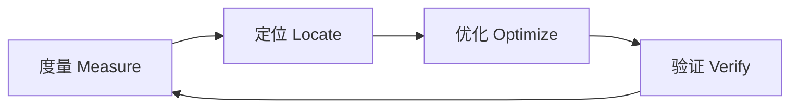
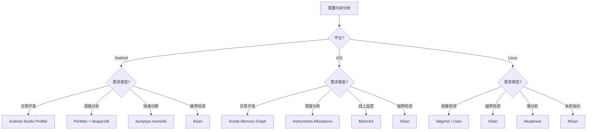

# 内存分析工具

## 1. 内存分析方法论

> **核心结论**：内存优化的前提是精确度量——没有测量就没有优化。

### 1.1 度量→定位→优化→验证闭环



| 阶段 | 目标 | 工具类型 |
|-----|------|---------|
| 度量 | 获取内存使用基线 | Profiler、统计工具 |
| 定位 | 找出问题代码位置 | 堆栈追踪、内存图 |
| 优化 | 应用优化策略 | 代码重构、数据结构调整 |
| 验证 | 确认优化效果 | A/B测试、回归测试 |

### 1.2 内存问题分类（MECE）

| 问题类型 | 现象 | 检测难度 | 危害程度 |
|---------|------|---------|---------|
| **内存泄漏** | 内存持续增长不释放 | 中等 | 高 |
| **内存碎片** | 可用内存充足但分配失败 | 高 | 中 |
| **过度分配** | 分配远超实际需要 | 低 | 中 |
| **峰值过高** | 瞬时内存飙升 | 中等 | 高 |
| **未初始化读取** | 读取未初始化内存 | 高 | 高 |
| **越界访问** | Buffer overflow/underflow | 高 | 极高 |

---

## 2. 跨平台工具

### 2.1 Valgrind / Memcheck

> **结论**：Valgrind 是 Linux 平台最成熟的内存检测工具，但性能开销大，不适合移动平台。

**原理**：动态二进制插桩（Dynamic Binary Instrumentation），在运行时重写每条指令。

**基本使用**：

```bash
# 编译时加 -g 保留调试信息
g++ -g -O0 -o myapp myapp.cpp

# 运行 Memcheck
valgrind --leak-check=full --show-leak-kinds=all ./myapp

# 生成详细报告
valgrind --leak-check=full --log-file=valgrind.log ./myapp
```

**输出报告解读**：

```
==12345== HEAP SUMMARY:
==12345==     in use at exit: 72 bytes in 3 blocks
==12345==   total heap usage: 10 allocs, 7 frees, 1,024 bytes allocated
==12345== 
==12345== 72 bytes in 3 blocks are definitely lost in loss record 1 of 1
==12345==    at 0x4C2FB0F: malloc (in /usr/lib/valgrind/...)
==12345==    by 0x401234: createBuffer() (myapp.cpp:15)
==12345==    by 0x401345: processData() (myapp.cpp:42)
```

| 泄漏类型 | 含义 | 严重程度 |
|---------|------|---------|
| definitely lost | 确定泄漏，无法访问 | 高 |
| indirectly lost | 间接泄漏，依赖其他泄漏 | 中 |
| possibly lost | 可能泄漏，指针算术 | 低 |
| still reachable | 程序结束时仍可访问 | 通常无害 |

**限制**：
- Android 上需要 root 权限且配置复杂
- iOS 完全不支持
- 运行速度降低 10-50 倍

### 2.2 AddressSanitizer（ASan）

> **核心结论**：ASan 是现代 C++ 开发的必备工具——编译时插桩，检测精准，开销可接受。

**Why ASan 是必备？**
- 编译时插桩，比 Valgrind 快 2x
- 覆盖 buffer overflow、use-after-free、double-free、stack-use-after-return
- 支持所有主流平台（Linux、Android、iOS、macOS）

**编译和使用**：

```bash
# GCC/Clang
clang++ -fsanitize=address -fno-omit-frame-pointer -g -O1 -o myapp myapp.cpp

# CMake 配置
set(CMAKE_CXX_FLAGS "${CMAKE_CXX_FLAGS} -fsanitize=address -fno-omit-frame-pointer")
```

**检测示例**：

```cpp
// heap-buffer-overflow 示例
void testHeapOverflow() {
    int* arr = new int[10];
    arr[10] = 42;  // ASan 报错: heap-buffer-overflow
    delete[] arr;
}

// use-after-free 示例
void testUseAfterFree() {
    int* ptr = new int(42);
    delete ptr;
    *ptr = 100;  // ASan 报错: heap-use-after-free
}

// double-free 示例
void testDoubleFree() {
    int* ptr = new int(42);
    delete ptr;
    delete ptr;  // ASan 报错: double-free
}
```

**Android NDK 配置**：

```groovy
// build.gradle (Module)
android {
    defaultConfig {
        externalNativeBuild {
            cmake {
                arguments "-DANDROID_ARM_MODE=arm",
                          "-DANDROID_STL=c++_shared"
                cppFlags "-fsanitize=address -fno-omit-frame-pointer"
            }
        }
    }
}
```

```cmake
# CMakeLists.txt
if(ANDROID)
    set(CMAKE_CXX_FLAGS "${CMAKE_CXX_FLAGS} -fsanitize=address -fno-omit-frame-pointer")
    set(CMAKE_SHARED_LINKER_FLAGS "${CMAKE_SHARED_LINKER_FLAGS} -fsanitize=address")
endif()
```

运行时需要 wrap.sh：

```bash
#!/system/bin/sh
export ASAN_OPTIONS=detect_leaks=0
exec "$@"
```

**Xcode 配置**：

1. Product → Scheme → Edit Scheme
2. Run → Diagnostics → Address Sanitizer ✓
3. 或在 Build Settings 中添加 `-fsanitize=address`

**性能开销**：

| 指标 | 开销 |
|-----|------|
| 运行时间 | ~2x |
| 内存使用 | ~3x |
| 代码体积 | ~2x |

### 2.3 LeakSanitizer（LSan）

> **结论**：LSan 专注内存泄漏检测，可独立使用或与 ASan 配合。

```bash
# 独立使用
clang++ -fsanitize=leak -g -o myapp myapp.cpp

# 与 ASan 配合（默认启用）
clang++ -fsanitize=address -g -o myapp myapp.cpp
```

**抑制已知误报**：

```bash
# lsan.supp 文件
leak:ThirdPartyLib::allocateBuffer
leak:libsystem_*.dylib
```

```bash
export LSAN_OPTIONS=suppressions=lsan.supp
./myapp
```

### 2.4 Memory Sanitizer（MSan）

> **结论**：MSan 检测未初始化内存读取，但需要整个程序（含库）都用 MSan 编译。

```bash
clang++ -fsanitize=memory -fPIE -pie -g -o myapp myapp.cpp
```

```cpp
void testUninitializedRead() {
    int arr[10];
    int sum = 0;
    for (int i = 0; i < 10; i++) {
        sum += arr[i];  // MSan 报错: use-of-uninitialized-value
    }
}
```

**限制**：
- 仅支持 Linux x86_64
- 所有链接的库都需要用 MSan 编译
- 不支持 Android/iOS

### 2.5 Heaptrack / Massif

> **结论**：Heaptrack 和 Massif 用于堆内存 Profiling，生成内存使用时间线。

**Heaptrack（推荐）**：

```bash
# 录制
heaptrack ./myapp

# 分析（GUI）
heaptrack_gui heaptrack.myapp.12345.gz

# 生成火焰图
heaptrack_print --flamegraph heaptrack.myapp.12345.gz > flamegraph.txt
```

**Massif（Valgrind 组件）**：

```bash
valgrind --tool=massif ./myapp
ms_print massif.out.12345
```

输出包含内存使用时间线的 ASCII 图表：

```
    MB
3.0^                                               #
   |                                              @#
   |                                             @@#
   |                                            @@@#
   |                                   ::::::@@@@@@#
2.0+                               ::::::::@@@@@@@#
   |                           ::::::::::::@@@@@@@#
   |                      :::::::::::@:::::@@@@@@@#
   |                  ::::::::::::@@@:::::@@@@@@@@#
1.0+              ::::::::::::::::@@@:::::@@@@@@@@#
```

---

## 3. Android 专用工具

### 3.1 Perfetto

> **结论**：Perfetto 是 Android 官方推荐的系统级性能分析工具，支持 Native Heap Profiling。

**使用 heapprofd 进行 Native 内存追踪**：

```bash
# 配置文件 heap_profile.cfg
buffers: {
    size_kb: 63488
    fill_policy: DISCARD
}
data_sources: {
    config {
        name: "android.heapprofd"
        heapprofd_config {
            sampling_interval_bytes: 4096
            process_cmdline: "com.example.myapp"
            shmem_size_bytes: 8388608
            block_client: true
            continuous_dump_config {
                dump_phase_ms: 0
                dump_interval_ms: 1000
            }
        }
    }
}
duration_ms: 30000
```

```bash
# 推送配置并开始录制
adb push heap_profile.cfg /data/local/tmp/
adb shell perfetto -c /data/local/tmp/heap_profile.cfg -o /data/local/tmp/heap.pb

# 拉取并分析
adb pull /data/local/tmp/heap.pb
# 在 https://ui.perfetto.dev 打开分析
```

**解读 Perfetto 内存数据**：
- **Native Heap**: malloc/free 的内存
- **Java Heap**: ART 管理的对象内存
- **Graphics**: GPU 缓冲区
- **Code**: 代码段内存映射

### 3.2 Android Studio Profiler

> **结论**：Android Studio Profiler 提供可视化的 Native Memory 分析，适合日常开发调试。

**Record Native Allocations 步骤**：

1. 打开 Android Studio → View → Tool Windows → Profiler
2. 选择设备和进程
3. 点击 Memory → Record native allocations
4. 执行触发内存操作的场景
5. 点击 Stop 停止录制
6. 分析调用栈和分配大小

**识别内存泄漏**：
- 重复操作（如进入/退出页面）
- 观察 Native Memory 曲线是否持续上涨
- 对比前后 heap dump 的差异

### 3.3 dumpsys meminfo

> **结论**：dumpsys meminfo 是快速查看应用内存状态的命令行工具。

```bash
# 查看特定应用
adb shell dumpsys meminfo com.example.myapp

# 持续监控
watch -n 1 "adb shell dumpsys meminfo com.example.myapp | grep -E 'TOTAL|Native|Graphics'"
```

**输出解读**：

```
                   Pss  Private  Private  SwapPss     Heap     Heap     Heap
                 Total    Dirty    Clean    Dirty     Size    Alloc     Free
                ------   ------   ------   ------   ------   ------   ------
  Native Heap    15234    15180        0       48    20480    16384     4096
  Dalvik Heap     8234     8180        0       12    12288     8192     4096
        Stack      512      512        0        0
       Ashmem     1024      512      512        0
    Other dev       64        0       64        0
     .so mmap     8192      320     6144        0
    .apk mmap     1024        0      512        0
        TOTAL    34284    24704     7232       60
```

| 指标 | 含义 |
|-----|------|
| Pss Total | 比例集大小，共享内存按比例计算 |
| Private Dirty | 私有脏页，应用独占且已修改 |
| Private Clean | 私有干净页，可丢弃重新加载 |
| Native Heap | malloc 分配的内存 |
| Dalvik Heap | Java 对象内存 |

### 3.4 malloc_debug / malloc_hooks

> **结论**：Android libc 提供的 malloc 调试功能，可追踪所有 native 分配。

**配置方法**：

```bash
# 设置调试选项
adb shell setprop libc.debug.malloc.options "backtrace leak_track"
adb shell setprop libc.debug.malloc.program com.example.myapp

# 重启应用后，获取泄漏报告
adb shell dumpsys meminfo com.example.myapp -d
```

**主要选项**：

| 选项 | 功能 |
|-----|------|
| backtrace | 记录分配调用栈 |
| leak_track | 追踪潜在泄漏 |
| fill | 分配时填充特定值 |
| guard | 添加保护区检测越界 |

---

## 4. iOS 专用工具

### 4.1 Instruments - Allocations

> **结论**：Allocations 是 iOS 内存分析的核心工具，追踪所有堆分配。

**使用方法**：

1. Xcode → Product → Profile (⌘I)
2. 选择 Allocations 模板
3. 点击 Record 开始录制
4. 执行应用场景
5. 分析 Call Tree 和 Allocations List

**关键视图**：
- **All Heap Allocations**: 所有堆分配
- **All Anonymous VM**: 匿名虚拟内存
- **VM Tracker**: 虚拟内存区域跟踪
- **Statistics**: 分配统计

### 4.2 Instruments - Leaks

> **结论**：Leaks 工具自动检测 retain cycle 和 C++ 内存泄漏。

**配合 Allocations 使用**：
1. 创建 Blank 模板
2. 添加 Allocations 和 Leaks 两个 instrument
3. 同时录制，Leaks 会定期扫描

### 4.3 Xcode Memory Graph

> **结论**：Memory Graph 可视化对象引用关系，是发现循环引用的利器。

**使用方法**：

1. 运行应用并触发目标场景
2. Debug → Debug Memory Graph (或点击底部工具栏的三圆图标)
3. 查看对象关系图
4. 点击紫色感叹号查看泄漏对象

**导出分析**：

```bash
# 导出 memgraph 文件
leaks --outputGraph=/tmp/leak.memgraph PID

# 命令行分析
leaks /tmp/leak.memgraph
```

### 4.4 vmmap / heap / leaks 命令行工具

```bash
# 查看进程内存映射
vmmap PID
vmmap --summary PID

# 堆分析
heap PID
heap --sortBySize PID

# 泄漏检测
leaks PID
leaks --traceTree=0x12345678 PID  # 追踪特定地址
```

**脚本化监控**：

```bash
#!/bin/bash
while true; do
    echo "=== $(date) ==="
    vmmap --summary $1 | grep -E "TOTAL|MALLOC"
    sleep 5
done
```

### 4.5 MetricKit / os_signpost

> **结论**：MetricKit 用于线上内存监控，收集用户设备的内存指标。

```swift
import MetricKit

class MemoryMetricsSubscriber: NSObject, MXMetricManagerSubscriber {
    func didReceive(_ payloads: [MXMetricPayload]) {
        for payload in payloads {
            if let memoryMetrics = payload.memoryMetrics {
                // 峰值内存
                let peakMemory = memoryMetrics.peakMemoryUsage
                // 平均挂起内存
                let avgSuspendedMemory = memoryMetrics.averageSuspendedMemory
                
                // 上报到自己的服务器
                reportMetrics(peak: peakMemory, avg: avgSuspendedMemory)
            }
        }
    }
}
```

**os_signpost 自定义追踪**：

```swift
import os.signpost

let log = OSLog(subsystem: "com.example.myapp", category: "Memory")

func processLargeImage(_ image: UIImage) {
    os_signpost(.begin, log: log, name: "ProcessImage")
    // 处理逻辑
    os_signpost(.end, log: log, name: "ProcessImage")
}
```

---

## 5. 自定义内存追踪

### 5.1 重载 global operator new/delete

```cpp
#include <cstdlib>
#include <iostream>
#include <mutex>
#include <unordered_map>

struct AllocationInfo {
    size_t size;
    const char* file;
    int line;
};

class MemoryTracker {
public:
    static MemoryTracker& instance() {
        static MemoryTracker tracker;
        return tracker;
    }
    
    void recordAlloc(void* ptr, size_t size, const char* file = nullptr, int line = 0) {
        std::lock_guard<std::mutex> lock(mutex_);
        allocations_[ptr] = {size, file, line};
        totalAllocated_ += size;
        peakMemory_ = std::max(peakMemory_, totalAllocated_);
    }
    
    void recordFree(void* ptr) {
        std::lock_guard<std::mutex> lock(mutex_);
        auto it = allocations_.find(ptr);
        if (it != allocations_.end()) {
            totalAllocated_ -= it->second.size;
            allocations_.erase(it);
        }
    }
    
    void report() {
        std::lock_guard<std::mutex> lock(mutex_);
        std::cout << "=== Memory Report ===" << std::endl;
        std::cout << "Current: " << totalAllocated_ << " bytes" << std::endl;
        std::cout << "Peak: " << peakMemory_ << " bytes" << std::endl;
        std::cout << "Leaks: " << allocations_.size() << " blocks" << std::endl;
        
        for (const auto& [ptr, info] : allocations_) {
            std::cout << "  Leak: " << ptr << " (" << info.size << " bytes)";
            if (info.file) {
                std::cout << " at " << info.file << ":" << info.line;
            }
            std::cout << std::endl;
        }
    }

private:
    std::mutex mutex_;
    std::unordered_map<void*, AllocationInfo> allocations_;
    size_t totalAllocated_ = 0;
    size_t peakMemory_ = 0;
};

// 全局 operator new/delete 重载
void* operator new(size_t size) {
    void* ptr = std::malloc(size);
    if (!ptr) throw std::bad_alloc();
    MemoryTracker::instance().recordAlloc(ptr, size);
    return ptr;
}

void operator delete(void* ptr) noexcept {
    MemoryTracker::instance().recordFree(ptr);
    std::free(ptr);
}

void* operator new[](size_t size) {
    void* ptr = std::malloc(size);
    if (!ptr) throw std::bad_alloc();
    MemoryTracker::instance().recordAlloc(ptr, size);
    return ptr;
}

void operator delete[](void* ptr) noexcept {
    MemoryTracker::instance().recordFree(ptr);
    std::free(ptr);
}
```

### 5.2 内存水位线监控

```cpp
#include <atomic>
#include <functional>

class MemoryWatermark {
public:
    using Callback = std::function<void(size_t current, size_t watermark)>;
    
    static MemoryWatermark& instance() {
        static MemoryWatermark monitor;
        return monitor;
    }
    
    void setWarningWatermark(size_t bytes, Callback callback) {
        warningWatermark_ = bytes;
        warningCallback_ = std::move(callback);
    }
    
    void setCriticalWatermark(size_t bytes, Callback callback) {
        criticalWatermark_ = bytes;
        criticalCallback_ = std::move(callback);
    }
    
    void onAllocation(size_t size) {
        size_t current = currentMemory_.fetch_add(size) + size;
        checkWatermarks(current);
    }
    
    void onDeallocation(size_t size) {
        currentMemory_.fetch_sub(size);
    }

private:
    void checkWatermarks(size_t current) {
        if (current > criticalWatermark_ && criticalCallback_) {
            criticalCallback_(current, criticalWatermark_);
        } else if (current > warningWatermark_ && warningCallback_) {
            warningCallback_(current, warningWatermark_);
        }
    }
    
    std::atomic<size_t> currentMemory_{0};
    size_t warningWatermark_ = 0;
    size_t criticalWatermark_ = 0;
    Callback warningCallback_;
    Callback criticalCallback_;
};
```

---

## 6. 工具对比总结

| 工具 | 平台 | 检测类型 | 运行开销 | 线上可用 | 适用场景 |
|-----|------|---------|---------|---------|---------|
| Valgrind | Linux | 泄漏、越界、未初始化 | 10-50x | 否 | 开发调试 |
| ASan | 全平台 | 越界、UAF、double-free | 2x | 否 | 日常开发 |
| LSan | Linux/macOS | 内存泄漏 | 1.1x | 否 | CI 集成 |
| MSan | Linux | 未初始化读取 | 3x | 否 | 深度调试 |
| Heaptrack | Linux | 堆 profiling | 2-3x | 否 | 优化分析 |
| Perfetto | Android | Native heap | 低 | 部分 | 性能调优 |
| AS Profiler | Android | Native/Java heap | 中等 | 否 | 日常开发 |
| dumpsys | Android | 内存概览 | 极低 | 是 | 快速诊断 |
| Allocations | iOS/macOS | 堆分配 | 中等 | 否 | 深度分析 |
| Memory Graph | iOS/macOS | 对象引用 | 低 | 否 | 循环引用 |
| MetricKit | iOS | 聚合指标 | 极低 | 是 | 线上监控 |
| 自定义追踪 | 全平台 | 可定制 | 可控 | 是 | 定制需求 |

---

## 7. 工具选择决策树



---

## 参考资源

- [AddressSanitizer 官方文档](https://clang.llvm.org/docs/AddressSanitizer.html)
- [Perfetto 官方文档](https://perfetto.dev/docs/)
- [Instruments User Guide](https://help.apple.com/instruments/mac/current/)
- [Android Memory Profiling](https://developer.android.com/studio/profile/memory-profiler)
