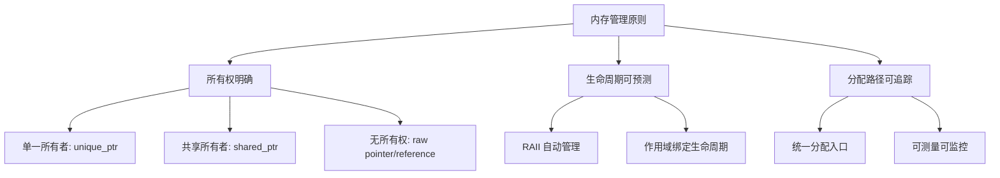
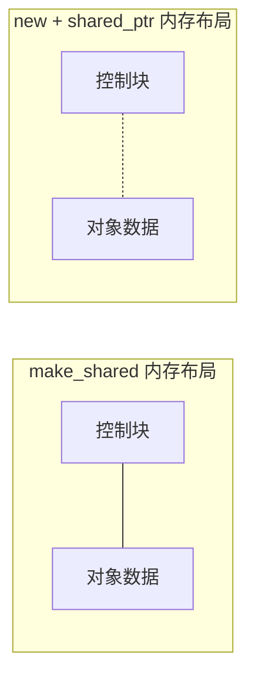

# C++ 内存管理最佳实践案例

## 1. C++ 内存管理核心原则

> **核心结论**：好的内存管理 = RAII + 智能指针 + 分层策略

### 1.1 三大核心原则



| 原则 | 实践方法 | 违反后果 |
|-----|---------|---------|
| 所有权明确 | 使用智能指针明确所有权 | 内存泄漏、double-free |
| 生命周期可预测 | RAII + 作用域管理 | 悬垂指针、资源泄漏 |
| 分配路径可追踪 | 统一的 allocator | 难以调试和优化 |

---

## 2. 智能指针最佳实践

### 2.1 std::unique_ptr

> **结论**：`unique_ptr` 是默认首选——零开销、独占所有权、明确语义。

**工厂模式返回 unique_ptr**：

```cpp
#include <memory>
#include <string>

class Image {
public:
    virtual ~Image() = default;
    virtual void process() = 0;
};

class JpegImage : public Image {
public:
    explicit JpegImage(const std::string& path) : path_(path) {}
    void process() override { /* JPEG 处理逻辑 */ }
private:
    std::string path_;
};

class PngImage : public Image {
public:
    explicit PngImage(const std::string& path) : path_(path) {}
    void process() override { /* PNG 处理逻辑 */ }
private:
    std::string path_;
};

// 工厂函数返回 unique_ptr
std::unique_ptr<Image> createImage(const std::string& path) {
    if (path.ends_with(".jpg") || path.ends_with(".jpeg")) {
        return std::make_unique<JpegImage>(path);
    } else if (path.ends_with(".png")) {
        return std::make_unique<PngImage>(path);
    }
    return nullptr;
}

// 使用示例
void processImages() {
    auto img = createImage("photo.jpg");
    if (img) {
        img->process();
    }
    // 自动释放，无需手动 delete
}
```

**自定义 Deleter 释放 C API 资源**：

```cpp
#include <memory>
#include <cstdio>

// 文件句柄的自定义 deleter
struct FileDeleter {
    void operator()(FILE* fp) const {
        if (fp) {
            std::fclose(fp);
        }
    }
};

using UniqueFile = std::unique_ptr<FILE, FileDeleter>;

UniqueFile openFile(const char* path, const char* mode) {
    return UniqueFile(std::fopen(path, mode));
}

// Lambda 形式的 deleter
auto openFileWithLambda(const char* path, const char* mode) {
    auto deleter = [](FILE* fp) {
        if (fp) std::fclose(fp);
    };
    return std::unique_ptr<FILE, decltype(deleter)>(
        std::fopen(path, mode), deleter
    );
}
```

**Android AHardwareBuffer 的 RAII 封装**：

```cpp
#include <memory>
#include <android/hardware_buffer.h>

struct AHardwareBufferDeleter {
    void operator()(AHardwareBuffer* buffer) const {
        if (buffer) {
            AHardwareBuffer_release(buffer);
        }
    }
};

using UniqueHardwareBuffer = std::unique_ptr<AHardwareBuffer, AHardwareBufferDeleter>;

UniqueHardwareBuffer createHardwareBuffer(uint32_t width, uint32_t height) {
    AHardwareBuffer_Desc desc = {
        .width = width,
        .height = height,
        .layers = 1,
        .format = AHARDWAREBUFFER_FORMAT_R8G8B8A8_UNORM,
        .usage = AHARDWAREBUFFER_USAGE_CPU_READ_OFTEN | 
                 AHARDWAREBUFFER_USAGE_CPU_WRITE_OFTEN |
                 AHARDWAREBUFFER_USAGE_GPU_SAMPLED_IMAGE,
    };
    
    AHardwareBuffer* buffer = nullptr;
    if (AHardwareBuffer_allocate(&desc, &buffer) != 0) {
        return nullptr;
    }
    return UniqueHardwareBuffer(buffer);
}
```

**iOS CVPixelBuffer 的 RAII 封装**：

```cpp
#include <memory>
#include <CoreVideo/CoreVideo.h>

struct CVPixelBufferDeleter {
    void operator()(CVPixelBufferRef buffer) const {
        if (buffer) {
            CVPixelBufferRelease(buffer);
        }
    }
};

using UniquePixelBuffer = std::unique_ptr<
    std::remove_pointer_t<CVPixelBufferRef>, 
    CVPixelBufferDeleter
>;

UniquePixelBuffer createPixelBuffer(size_t width, size_t height) {
    CVPixelBufferRef buffer = nullptr;
    NSDictionary* attrs = @{
        (id)kCVPixelBufferIOSurfacePropertiesKey: @{}
    };
    
    CVReturn status = CVPixelBufferCreate(
        kCFAllocatorDefault,
        width, height,
        kCVPixelFormatType_32BGRA,
        (__bridge CFDictionaryRef)attrs,
        &buffer
    );
    
    if (status != kCVReturnSuccess) {
        return nullptr;
    }
    return UniquePixelBuffer(buffer);
}
```

### 2.2 std::shared_ptr

> **结论**：`shared_ptr` 仅用于真正的共享所有权场景，注意原子操作的开销。

**何时使用 shared_ptr**：

```cpp
#include <memory>
#include <vector>

// 正确场景：真正的共享所有权
class TextureCache {
public:
    // 多个对象可能同时持有同一纹理
    std::shared_ptr<Texture> getTexture(const std::string& name) {
        auto it = cache_.find(name);
        if (it != cache_.end()) {
            return it->second;  // 返回共享指针
        }
        auto texture = std::make_shared<Texture>(loadFromDisk(name));
        cache_[name] = texture;
        return texture;
    }

private:
    std::unordered_map<std::string, std::shared_ptr<Texture>> cache_;
};
```

**make_shared vs new 的内存布局差异**：

```cpp
#include <memory>

class LargeObject {
    char data[1024];
};

void compareAllocationPatterns() {
    // 方式1: make_shared（推荐）
    // 单次分配：控制块 + 对象在连续内存
    auto ptr1 = std::make_shared<LargeObject>();
    
    // 方式2: new + shared_ptr
    // 两次分配：对象一块，控制块一块
    auto ptr2 = std::shared_ptr<LargeObject>(new LargeObject());
}
```



| 方式 | 分配次数 | 内存局部性 | 释放时机 |
|-----|---------|-----------|---------|
| make_shared | 1 次 | 好 | weak_ptr 全部释放后 |
| new + shared_ptr | 2 次 | 差 | 对象可早于控制块释放 |

**性能开销对比**：

```cpp
#include <memory>
#include <chrono>
#include <iostream>

void benchmarkSmartPointers() {
    constexpr int iterations = 1000000;
    
    // unique_ptr 基准
    auto start = std::chrono::high_resolution_clock::now();
    for (int i = 0; i < iterations; ++i) {
        auto ptr = std::make_unique<int>(42);
    }
    auto uniqueTime = std::chrono::high_resolution_clock::now() - start;
    
    // shared_ptr 测试
    start = std::chrono::high_resolution_clock::now();
    for (int i = 0; i < iterations; ++i) {
        auto ptr = std::make_shared<int>(42);
    }
    auto sharedTime = std::chrono::high_resolution_clock::now() - start;
    
    // 拷贝 shared_ptr（原子操作开销）
    auto sharedPtr = std::make_shared<int>(42);
    start = std::chrono::high_resolution_clock::now();
    for (int i = 0; i < iterations; ++i) {
        auto copy = sharedPtr;  // 原子引用计数增加
    }
    auto copyTime = std::chrono::high_resolution_clock::now() - start;
    
    std::cout << "unique_ptr: " 
              << std::chrono::duration_cast<std::chrono::microseconds>(uniqueTime).count() 
              << " us\n";
    std::cout << "shared_ptr create: " 
              << std::chrono::duration_cast<std::chrono::microseconds>(sharedTime).count() 
              << " us\n";
    std::cout << "shared_ptr copy: " 
              << std::chrono::duration_cast<std::chrono::microseconds>(copyTime).count() 
              << " us\n";
}
```

典型结果（x86_64）：

| 操作 | 时间（百万次） |
|-----|--------------|
| unique_ptr 创建/销毁 | ~50ms |
| shared_ptr 创建/销毁 | ~80ms |
| shared_ptr 拷贝 | ~30ms |

### 2.3 std::weak_ptr

> **结论**：`weak_ptr` 用于打破循环引用和实现缓存场景。

**观察者模式中打破循环引用**：

```cpp
#include <memory>
#include <vector>
#include <algorithm>

class Observer;

class Subject {
public:
    void attach(std::shared_ptr<Observer> observer) {
        observers_.push_back(observer);  // weak_ptr 打破循环
    }
    
    void notify() {
        // 遍历时清理过期的 weak_ptr
        observers_.erase(
            std::remove_if(observers_.begin(), observers_.end(),
                [](const std::weak_ptr<Observer>& wp) { return wp.expired(); }),
            observers_.end()
        );
        
        for (auto& wp : observers_) {
            if (auto sp = wp.lock()) {
                sp->update();
            }
        }
    }

private:
    std::vector<std::weak_ptr<Observer>> observers_;
};

class Observer : public std::enable_shared_from_this<Observer> {
public:
    void subscribeTo(std::shared_ptr<Subject> subject) {
        subject_ = subject;
        subject->attach(shared_from_this());
    }
    
    void update() { /* 处理通知 */ }

private:
    std::shared_ptr<Subject> subject_;  // 强引用 Subject
};
```

**缓存场景**：

```cpp
#include <memory>
#include <unordered_map>
#include <mutex>

template<typename Key, typename Value>
class WeakCache {
public:
    std::shared_ptr<Value> get(const Key& key) {
        std::lock_guard<std::mutex> lock(mutex_);
        
        auto it = cache_.find(key);
        if (it != cache_.end()) {
            if (auto sp = it->second.lock()) {
                return sp;  // 缓存命中
            }
            // 对象已被销毁，移除过期条目
            cache_.erase(it);
        }
        return nullptr;
    }
    
    void put(const Key& key, std::shared_ptr<Value> value) {
        std::lock_guard<std::mutex> lock(mutex_);
        cache_[key] = value;
    }

private:
    std::mutex mutex_;
    std::unordered_map<Key, std::weak_ptr<Value>> cache_;
};
```

---

## 3. RAII 设计模式

> **结论**：RAII 是 C++ 资源管理的基石——构造获取、析构释放。

### 3.1 文件句柄 RAII 包装

```cpp
#include <string>
#include <stdexcept>
#include <cstdio>

class File {
public:
    explicit File(const std::string& path, const std::string& mode)
        : handle_(std::fopen(path.c_str(), mode.c_str())) {
        if (!handle_) {
            throw std::runtime_error("Failed to open file: " + path);
        }
    }
    
    ~File() {
        if (handle_) {
            std::fclose(handle_);
        }
    }
    
    // 禁止拷贝
    File(const File&) = delete;
    File& operator=(const File&) = delete;
    
    // 允许移动
    File(File&& other) noexcept : handle_(other.handle_) {
        other.handle_ = nullptr;
    }
    
    File& operator=(File&& other) noexcept {
        if (this != &other) {
            if (handle_) std::fclose(handle_);
            handle_ = other.handle_;
            other.handle_ = nullptr;
        }
        return *this;
    }
    
    size_t read(void* buffer, size_t size) {
        return std::fread(buffer, 1, size, handle_);
    }
    
    size_t write(const void* buffer, size_t size) {
        return std::fwrite(buffer, 1, size, handle_);
    }
    
    FILE* get() const { return handle_; }

private:
    FILE* handle_;
};
```

### 3.2 GPU 资源 RAII（OpenGL/Vulkan/Metal）

```cpp
#include <cstdint>
#include <utility>

// OpenGL 纹理 RAII
class GLTexture {
public:
    GLTexture() {
        glGenTextures(1, &id_);
    }
    
    ~GLTexture() {
        if (id_ != 0) {
            glDeleteTextures(1, &id_);
        }
    }
    
    GLTexture(GLTexture&& other) noexcept : id_(other.id_) {
        other.id_ = 0;
    }
    
    GLTexture& operator=(GLTexture&& other) noexcept {
        if (this != &other) {
            if (id_ != 0) glDeleteTextures(1, &id_);
            id_ = other.id_;
            other.id_ = 0;
        }
        return *this;
    }
    
    GLTexture(const GLTexture&) = delete;
    GLTexture& operator=(const GLTexture&) = delete;
    
    void bind(GLenum target = GL_TEXTURE_2D) const {
        glBindTexture(target, id_);
    }
    
    GLuint id() const { return id_; }

private:
    GLuint id_ = 0;
};

// Vulkan Buffer RAII
class VulkanBuffer {
public:
    VulkanBuffer(VkDevice device, VkDeviceSize size, VkBufferUsageFlags usage)
        : device_(device) {
        VkBufferCreateInfo createInfo = {
            .sType = VK_STRUCTURE_TYPE_BUFFER_CREATE_INFO,
            .size = size,
            .usage = usage,
            .sharingMode = VK_SHARING_MODE_EXCLUSIVE,
        };
        vkCreateBuffer(device_, &createInfo, nullptr, &buffer_);
    }
    
    ~VulkanBuffer() {
        if (buffer_ != VK_NULL_HANDLE) {
            vkDestroyBuffer(device_, buffer_, nullptr);
        }
        if (memory_ != VK_NULL_HANDLE) {
            vkFreeMemory(device_, memory_, nullptr);
        }
    }
    
    VulkanBuffer(VulkanBuffer&& other) noexcept
        : device_(other.device_), buffer_(other.buffer_), memory_(other.memory_) {
        other.buffer_ = VK_NULL_HANDLE;
        other.memory_ = VK_NULL_HANDLE;
    }
    
    // ... 其他成员函数

private:
    VkDevice device_;
    VkBuffer buffer_ = VK_NULL_HANDLE;
    VkDeviceMemory memory_ = VK_NULL_HANDLE;
};
```

### 3.3 锁的 RAII

```cpp
#include <mutex>
#include <shared_mutex>

class ThreadSafeCounter {
public:
    int get() const {
        std::shared_lock lock(mutex_);  // RAII 读锁
        return value_;
    }
    
    void increment() {
        std::unique_lock lock(mutex_);  // RAII 写锁
        ++value_;
    }
    
    void conditionalIncrement(bool condition) {
        std::unique_lock lock(mutex_, std::defer_lock);
        
        if (condition) {
            lock.lock();  // 条件加锁
            ++value_;
        }
    }  // 自动解锁

private:
    mutable std::shared_mutex mutex_;
    int value_ = 0;
};
```

### 3.4 Android JNI 资源 RAII

```cpp
#include <jni.h>
#include <string>

// Local Reference RAII
template<typename T>
class JniLocalRef {
public:
    JniLocalRef(JNIEnv* env, T ref) : env_(env), ref_(ref) {}
    
    ~JniLocalRef() {
        if (ref_) {
            env_->DeleteLocalRef(ref_);
        }
    }
    
    JniLocalRef(const JniLocalRef&) = delete;
    JniLocalRef& operator=(const JniLocalRef&) = delete;
    
    JniLocalRef(JniLocalRef&& other) noexcept
        : env_(other.env_), ref_(other.ref_) {
        other.ref_ = nullptr;
    }
    
    T get() const { return ref_; }
    operator T() const { return ref_; }
    explicit operator bool() const { return ref_ != nullptr; }

private:
    JNIEnv* env_;
    T ref_;
};

// Global Reference RAII
template<typename T>
class JniGlobalRef {
public:
    JniGlobalRef() = default;
    
    JniGlobalRef(JNIEnv* env, T localRef) {
        if (localRef) {
            ref_ = static_cast<T>(env->NewGlobalRef(localRef));
        }
    }
    
    ~JniGlobalRef() {
        reset(nullptr, nullptr);
    }
    
    void reset(JNIEnv* env, T localRef) {
        if (ref_ && env) {
            env->DeleteGlobalRef(ref_);
        }
        ref_ = localRef ? static_cast<T>(env->NewGlobalRef(localRef)) : nullptr;
    }
    
    T get() const { return ref_; }

private:
    T ref_ = nullptr;
};

// JNI 字符串 RAII
class JniString {
public:
    JniString(JNIEnv* env, jstring str)
        : env_(env), jstr_(str),
          chars_(str ? env->GetStringUTFChars(str, nullptr) : nullptr) {}
    
    ~JniString() {
        if (chars_) {
            env_->ReleaseStringUTFChars(jstr_, chars_);
        }
    }
    
    const char* c_str() const { return chars_; }
    std::string toString() const { return chars_ ? chars_ : ""; }

private:
    JNIEnv* env_;
    jstring jstr_;
    const char* chars_;
};

// 使用示例
extern "C" JNIEXPORT void JNICALL
Java_com_example_MyClass_processData(JNIEnv* env, jobject thiz, jstring input) {
    JniString inputStr(env, input);
    
    // 获取类和方法
    JniLocalRef<jclass> clazz(env, env->GetObjectClass(thiz));
    jmethodID method = env->GetMethodID(clazz, "callback", "(Ljava/lang/String;)V");
    
    // 处理数据
    std::string result = processNative(inputStr.c_str());
    
    // 回调
    JniLocalRef<jstring> jResult(env, env->NewStringUTF(result.c_str()));
    env->CallVoidMethod(thiz, method, jResult.get());
}
// 所有 JNI 资源自动释放
```

---

## 4. 移动语义与完美转发

> **结论**：移动语义避免不必要的拷贝，是现代 C++ 性能优化的关键。

### 4.1 移动构造和移动赋值

```cpp
#include <cstring>
#include <utility>
#include <algorithm>

class Buffer {
public:
    explicit Buffer(size_t size)
        : size_(size), data_(new char[size]) {
        std::memset(data_, 0, size_);
    }
    
    // 拷贝构造（深拷贝）
    Buffer(const Buffer& other)
        : size_(other.size_), data_(new char[other.size_]) {
        std::memcpy(data_, other.data_, size_);
    }
    
    // 移动构造（窃取资源）
    Buffer(Buffer&& other) noexcept
        : size_(other.size_), data_(other.data_) {
        other.size_ = 0;
        other.data_ = nullptr;
    }
    
    // 拷贝赋值
    Buffer& operator=(const Buffer& other) {
        if (this != &other) {
            Buffer temp(other);  // 拷贝
            swap(temp);          // 交换
        }
        return *this;
    }
    
    // 移动赋值
    Buffer& operator=(Buffer&& other) noexcept {
        if (this != &other) {
            delete[] data_;
            data_ = other.data_;
            size_ = other.size_;
            other.data_ = nullptr;
            other.size_ = 0;
        }
        return *this;
    }
    
    ~Buffer() {
        delete[] data_;
    }
    
    void swap(Buffer& other) noexcept {
        std::swap(size_, other.size_);
        std::swap(data_, other.data_);
    }

private:
    size_t size_;
    char* data_;
};
```

### 4.2 std::move 在容器中避免拷贝

```cpp
#include <vector>
#include <string>
#include <utility>

void demonstrateMove() {
    std::vector<std::string> vec;
    
    std::string str = "Hello, World! This is a long string that exceeds SSO.";
    
    // 拷贝 - str 仍然有效
    vec.push_back(str);
    
    // 移动 - str 变为空
    vec.push_back(std::move(str));
    
    // str 现在是 moved-from 状态
    // 仍然可以赋值或销毁，但不应该读取
}

// 返回值优化（RVO）+ 移动语义
std::vector<int> createLargeVector() {
    std::vector<int> result;
    result.reserve(10000);
    for (int i = 0; i < 10000; ++i) {
        result.push_back(i);
    }
    return result;  // RVO 或移动，不会拷贝
}
```

### 4.3 emplace_back vs push_back

```cpp
#include <vector>
#include <string>

class Widget {
public:
    Widget(int id, std::string name) : id_(id), name_(std::move(name)) {
        // 构造
    }
    
    Widget(const Widget& other) : id_(other.id_), name_(other.name_) {
        // 拷贝构造（昂贵）
    }
    
    Widget(Widget&& other) noexcept 
        : id_(other.id_), name_(std::move(other.name_)) {
        // 移动构造（便宜）
    }

private:
    int id_;
    std::string name_;
};

void compareEmplaceAndPush() {
    std::vector<Widget> vec;
    vec.reserve(3);
    
    // push_back: 先构造临时对象，再移动到容器
    vec.push_back(Widget(1, "First"));  // 构造 + 移动
    
    // emplace_back: 直接在容器内构造
    vec.emplace_back(2, "Second");  // 仅构造
    
    // 对于已存在的对象，push_back 和 emplace_back 等效
    Widget w(3, "Third");
    vec.push_back(std::move(w));      // 移动
    // vec.emplace_back(std::move(w)); // 也是移动
}
```

**性能对比**：

| 操作 | 构造次数 | 移动/拷贝次数 |
|-----|---------|--------------|
| `push_back(Widget(...))` | 1 | 1 (移动) |
| `emplace_back(...)` | 1 | 0 |
| `push_back(existingWidget)` | 0 | 1 (拷贝) |
| `push_back(std::move(w))` | 0 | 1 (移动) |

---

## 5. 内存映射文件（mmap）

> **结论**：mmap 适合大文件只读访问，利用操作系统的页面缓存。

### 5.1 跨平台 mmap 封装

```cpp
#include <cstdint>
#include <cstddef>
#include <stdexcept>

#ifdef _WIN32
#include <windows.h>
#else
#include <sys/mman.h>
#include <sys/stat.h>
#include <fcntl.h>
#include <unistd.h>
#endif

class MemoryMappedFile {
public:
    explicit MemoryMappedFile(const char* path) {
#ifdef _WIN32
        file_ = CreateFileA(path, GENERIC_READ, FILE_SHARE_READ, 
                           nullptr, OPEN_EXISTING, FILE_ATTRIBUTE_NORMAL, nullptr);
        if (file_ == INVALID_HANDLE_VALUE) {
            throw std::runtime_error("Failed to open file");
        }
        
        LARGE_INTEGER fileSize;
        GetFileSizeEx(file_, &fileSize);
        size_ = static_cast<size_t>(fileSize.QuadPart);
        
        mapping_ = CreateFileMappingA(file_, nullptr, PAGE_READONLY, 0, 0, nullptr);
        if (!mapping_) {
            CloseHandle(file_);
            throw std::runtime_error("Failed to create file mapping");
        }
        
        data_ = MapViewOfFile(mapping_, FILE_MAP_READ, 0, 0, 0);
        if (!data_) {
            CloseHandle(mapping_);
            CloseHandle(file_);
            throw std::runtime_error("Failed to map view of file");
        }
#else
        fd_ = open(path, O_RDONLY);
        if (fd_ < 0) {
            throw std::runtime_error("Failed to open file");
        }
        
        struct stat sb;
        if (fstat(fd_, &sb) < 0) {
            close(fd_);
            throw std::runtime_error("Failed to stat file");
        }
        size_ = sb.st_size;
        
        data_ = mmap(nullptr, size_, PROT_READ, MAP_PRIVATE, fd_, 0);
        if (data_ == MAP_FAILED) {
            close(fd_);
            throw std::runtime_error("Failed to mmap file");
        }
        
        // 建议内核按顺序预读
        madvise(data_, size_, MADV_SEQUENTIAL);
#endif
    }
    
    ~MemoryMappedFile() {
#ifdef _WIN32
        if (data_) UnmapViewOfFile(data_);
        if (mapping_) CloseHandle(mapping_);
        if (file_ != INVALID_HANDLE_VALUE) CloseHandle(file_);
#else
        if (data_ != MAP_FAILED) munmap(data_, size_);
        if (fd_ >= 0) close(fd_);
#endif
    }
    
    MemoryMappedFile(const MemoryMappedFile&) = delete;
    MemoryMappedFile& operator=(const MemoryMappedFile&) = delete;
    
    const void* data() const { return data_; }
    size_t size() const { return size_; }

private:
#ifdef _WIN32
    HANDLE file_ = INVALID_HANDLE_VALUE;
    HANDLE mapping_ = nullptr;
    void* data_ = nullptr;
#else
    int fd_ = -1;
    void* data_ = MAP_FAILED;
#endif
    size_t size_ = 0;
};
```

### 5.2 Android AAssetManager + mmap

```cpp
#include <android/asset_manager.h>
#include <android/asset_manager_jni.h>

class AndroidAssetMmap {
public:
    AndroidAssetMmap(AAssetManager* mgr, const char* filename) {
        asset_ = AAssetManager_open(mgr, filename, AASSET_MODE_BUFFER);
        if (!asset_) {
            throw std::runtime_error("Failed to open asset");
        }
        
        size_ = AAsset_getLength(asset_);
        data_ = AAsset_getBuffer(asset_);  // 内部使用 mmap
    }
    
    ~AndroidAssetMmap() {
        if (asset_) {
            AAsset_close(asset_);
        }
    }
    
    const void* data() const { return data_; }
    size_t size() const { return size_; }

private:
    AAsset* asset_ = nullptr;
    const void* data_ = nullptr;
    size_t size_ = 0;
};
```

### 5.3 madvise 优化建议

| 策略 | 场景 |
|-----|------|
| `MADV_SEQUENTIAL` | 顺序读取（视频解码） |
| `MADV_RANDOM` | 随机访问（数据库） |
| `MADV_WILLNEED` | 预加载即将使用的页 |
| `MADV_DONTNEED` | 释放不再需要的页 |

---

## 6. 跨平台内存管理策略

> **结论**：通过抽象层实现跨平台统一接口，平台特定实现通过条件编译选择。

### 6.1 统一的 MemoryAllocator 接口

```cpp
#include <cstddef>
#include <cstdint>

// 抽象接口
class IMemoryAllocator {
public:
    virtual ~IMemoryAllocator() = default;
    
    virtual void* allocate(size_t size, size_t alignment = alignof(std::max_align_t)) = 0;
    virtual void deallocate(void* ptr, size_t size) = 0;
    virtual void* reallocate(void* ptr, size_t oldSize, size_t newSize) = 0;
    
    // 统计接口
    virtual size_t getAllocatedBytes() const = 0;
    virtual size_t getPeakBytes() const = 0;
};

// 默认实现（使用系统 malloc）
class DefaultAllocator : public IMemoryAllocator {
public:
    void* allocate(size_t size, size_t alignment) override {
        void* ptr = nullptr;
#if defined(_WIN32)
        ptr = _aligned_malloc(size, alignment);
#else
        if (posix_memalign(&ptr, alignment, size) != 0) {
            ptr = nullptr;
        }
#endif
        if (ptr) {
            allocated_ += size;
            peak_ = std::max(peak_, allocated_);
        }
        return ptr;
    }
    
    void deallocate(void* ptr, size_t size) override {
        if (ptr) {
#if defined(_WIN32)
            _aligned_free(ptr);
#else
            free(ptr);
#endif
            allocated_ -= size;
        }
    }
    
    void* reallocate(void* ptr, size_t oldSize, size_t newSize) override {
        void* newPtr = allocate(newSize, alignof(std::max_align_t));
        if (newPtr && ptr) {
            std::memcpy(newPtr, ptr, std::min(oldSize, newSize));
            deallocate(ptr, oldSize);
        }
        return newPtr;
    }
    
    size_t getAllocatedBytes() const override { return allocated_; }
    size_t getPeakBytes() const override { return peak_; }

private:
    size_t allocated_ = 0;
    size_t peak_ = 0;
};

// Android 特定实现（可选使用 jemalloc）
#ifdef __ANDROID__
class AndroidAllocator : public IMemoryAllocator {
    // Android 特定优化...
};
#endif

// iOS 特定实现
#ifdef __APPLE__
class AppleAllocator : public IMemoryAllocator {
    // 使用 vm_allocate 等...
};
#endif

// 工厂函数
std::unique_ptr<IMemoryAllocator> createPlatformAllocator() {
#if defined(__ANDROID__)
    return std::make_unique<AndroidAllocator>();
#elif defined(__APPLE__)
    return std::make_unique<AppleAllocator>();
#else
    return std::make_unique<DefaultAllocator>();
#endif
}
```

---

## 7. 音视频/图形处理内存优化实战

### 7.1 视频帧缓冲管理 - 帧池实现

```cpp
#include <vector>
#include <queue>
#include <mutex>
#include <condition_variable>
#include <memory>

struct VideoFrame {
    uint8_t* data[4];    // 平面数据指针
    int linesize[4];     // 每行字节数
    int width;
    int height;
    int format;          // 像素格式
    int64_t pts;         // 时间戳
    
    void reset() {
        pts = 0;
        // 数据不清零，避免开销
    }
};

class FramePool {
public:
    explicit FramePool(size_t capacity, int width, int height, int format)
        : capacity_(capacity), width_(width), height_(height), format_(format) {
        
        // 预分配所有帧
        for (size_t i = 0; i < capacity_; ++i) {
            frames_.push_back(allocateFrame());
            available_.push(frames_.back().get());
        }
    }
    
    // 获取可用帧（阻塞）
    VideoFrame* acquire(std::chrono::milliseconds timeout = std::chrono::milliseconds(100)) {
        std::unique_lock<std::mutex> lock(mutex_);
        
        if (!cv_.wait_for(lock, timeout, [this] { return !available_.empty(); })) {
            return nullptr;  // 超时
        }
        
        VideoFrame* frame = available_.front();
        available_.pop();
        frame->reset();
        return frame;
    }
    
    // 归还帧
    void release(VideoFrame* frame) {
        std::lock_guard<std::mutex> lock(mutex_);
        available_.push(frame);
        cv_.notify_one();
    }
    
    size_t availableCount() const {
        std::lock_guard<std::mutex> lock(mutex_);
        return available_.size();
    }

private:
    std::unique_ptr<VideoFrame> allocateFrame() {
        auto frame = std::make_unique<VideoFrame>();
        frame->width = width_;
        frame->height = height_;
        frame->format = format_;
        
        // 根据格式计算大小并分配（以 YUV420P 为例）
        size_t ySize = width_ * height_;
        size_t uvSize = ySize / 4;
        
        frame->data[0] = new uint8_t[ySize];   // Y
        frame->data[1] = new uint8_t[uvSize];  // U
        frame->data[2] = new uint8_t[uvSize];  // V
        frame->data[3] = nullptr;
        
        frame->linesize[0] = width_;
        frame->linesize[1] = width_ / 2;
        frame->linesize[2] = width_ / 2;
        frame->linesize[3] = 0;
        
        return frame;
    }
    
    size_t capacity_;
    int width_, height_, format_;
    
    std::vector<std::unique_ptr<VideoFrame>> frames_;
    std::queue<VideoFrame*> available_;
    
    mutable std::mutex mutex_;
    std::condition_variable cv_;
};

// 使用 RAII 自动归还
class FrameGuard {
public:
    FrameGuard(FramePool& pool, VideoFrame* frame)
        : pool_(pool), frame_(frame) {}
    
    ~FrameGuard() {
        if (frame_) {
            pool_.release(frame_);
        }
    }
    
    VideoFrame* get() const { return frame_; }
    VideoFrame* release() {
        VideoFrame* f = frame_;
        frame_ = nullptr;
        return f;
    }

private:
    FramePool& pool_;
    VideoFrame* frame_;
};
```

### 7.2 无锁环形缓冲区 - 音频处理

```cpp
#include <atomic>
#include <cstdint>
#include <cstring>
#include <algorithm>

template<typename T>
class LockFreeRingBuffer {
public:
    explicit LockFreeRingBuffer(size_t capacity)
        : capacity_(nextPowerOfTwo(capacity)),
          mask_(capacity_ - 1),
          buffer_(new T[capacity_]) {}
    
    ~LockFreeRingBuffer() {
        delete[] buffer_;
    }
    
    // 单生产者写入
    size_t write(const T* data, size_t count) {
        const size_t writePos = writePos_.load(std::memory_order_relaxed);
        const size_t readPos = readPos_.load(std::memory_order_acquire);
        
        const size_t available = capacity_ - (writePos - readPos);
        const size_t toWrite = std::min(count, available);
        
        if (toWrite == 0) return 0;
        
        // 写入数据（可能需要两段拷贝）
        const size_t firstPart = std::min(toWrite, capacity_ - (writePos & mask_));
        std::memcpy(buffer_ + (writePos & mask_), data, firstPart * sizeof(T));
        
        if (toWrite > firstPart) {
            std::memcpy(buffer_, data + firstPart, (toWrite - firstPart) * sizeof(T));
        }
        
        writePos_.store(writePos + toWrite, std::memory_order_release);
        return toWrite;
    }
    
    // 单消费者读取
    size_t read(T* data, size_t count) {
        const size_t readPos = readPos_.load(std::memory_order_relaxed);
        const size_t writePos = writePos_.load(std::memory_order_acquire);
        
        const size_t available = writePos - readPos;
        const size_t toRead = std::min(count, available);
        
        if (toRead == 0) return 0;
        
        // 读取数据
        const size_t firstPart = std::min(toRead, capacity_ - (readPos & mask_));
        std::memcpy(data, buffer_ + (readPos & mask_), firstPart * sizeof(T));
        
        if (toRead > firstPart) {
            std::memcpy(data + firstPart, buffer_, (toRead - firstPart) * sizeof(T));
        }
        
        readPos_.store(readPos + toRead, std::memory_order_release);
        return toRead;
    }
    
    size_t size() const {
        return writePos_.load(std::memory_order_acquire) - 
               readPos_.load(std::memory_order_acquire);
    }
    
    size_t capacity() const { return capacity_; }
    bool empty() const { return size() == 0; }
    bool full() const { return size() == capacity_; }

private:
    static size_t nextPowerOfTwo(size_t n) {
        n--;
        n |= n >> 1;
        n |= n >> 2;
        n |= n >> 4;
        n |= n >> 8;
        n |= n >> 16;
        n |= n >> 32;
        return n + 1;
    }
    
    const size_t capacity_;
    const size_t mask_;
    T* buffer_;
    
    alignas(64) std::atomic<size_t> writePos_{0};  // Cache line 对齐
    alignas(64) std::atomic<size_t> readPos_{0};
};

// 音频处理使用示例
class AudioProcessor {
public:
    AudioProcessor() : ringBuffer_(48000) {}  // 1秒缓冲
    
    // 音频输入线程调用（不分配内存）
    void onAudioInput(const float* samples, size_t count) {
        size_t written = ringBuffer_.write(samples, count);
        if (written < count) {
            // 缓冲区满，丢弃旧数据或告警
        }
    }
    
    // 音频输出线程调用（不分配内存）
    size_t getAudioOutput(float* buffer, size_t count) {
        return ringBuffer_.read(buffer, count);
    }

private:
    LockFreeRingBuffer<float> ringBuffer_;
};
```

---

## 8. 反模式与常见错误

> **结论**：识别和避免反模式是高效内存管理的关键。

### 8.1 在循环中频繁 new/delete

```cpp
// 错误示例
void processItemsBad(const std::vector<int>& items) {
    for (int item : items) {
        auto* buffer = new char[1024];  // 每次循环都分配
        process(buffer, item);
        delete[] buffer;                 // 每次循环都释放
    }
}

// 正确示例
void processItemsGood(const std::vector<int>& items) {
    std::vector<char> buffer(1024);  // 一次分配
    for (int item : items) {
        process(buffer.data(), item);
    }
}
```

### 8.2 智能指针循环引用

```cpp
// 错误示例 - 内存泄漏
class Node {
public:
    std::shared_ptr<Node> next;
    std::shared_ptr<Node> prev;  // 循环引用！
};

// 正确示例
class Node {
public:
    std::shared_ptr<Node> next;
    std::weak_ptr<Node> prev;    // weak_ptr 打破循环
};
```

### 8.3 大对象拷贝传递

```cpp
// 错误示例
void processImage(Image img) {  // 拷贝整个图像！
    // ...
}

// 正确示例
void processImage(const Image& img) {  // const 引用
    // ...
}

void processImage(Image&& img) {  // 移动语义
    // ...
}
```

### 8.4 未预分配 vector 容量

```cpp
// 错误示例 - 多次重新分配
std::vector<int> buildVectorBad(int n) {
    std::vector<int> vec;
    for (int i = 0; i < n; ++i) {
        vec.push_back(i);  // 可能触发多次扩容
    }
    return vec;
}

// 正确示例
std::vector<int> buildVectorGood(int n) {
    std::vector<int> vec;
    vec.reserve(n);  // 预分配
    for (int i = 0; i < n; ++i) {
        vec.push_back(i);
    }
    return vec;
}
```

### 8.5 忘记虚析构函数

```cpp
// 错误示例 - 派生类析构函数不会被调用
class Base {
public:
    ~Base() { /* ... */ }  // 非虚析构函数！
};

class Derived : public Base {
    std::vector<int> data_;
public:
    ~Derived() { /* data_ 不会被正确清理 */ }
};

void leak() {
    Base* ptr = new Derived();
    delete ptr;  // 只调用 Base::~Base()，内存泄漏！
}

// 正确示例
class Base {
public:
    virtual ~Base() = default;
};
```

---

## 9. 内存优化检查清单

### 设计阶段

- [ ] 明确每个资源的所有权（谁创建、谁销毁）
- [ ] 设计生命周期：资源何时创建、何时释放
- [ ] 选择合适的智能指针类型
- [ ] 评估是否需要自定义 allocator
- [ ] 规划内存预算和峰值限制

### 编码阶段

- [ ] 使用 RAII 管理所有资源
- [ ] 优先使用 `make_unique` / `make_shared`
- [ ] 大对象传递使用 const 引用或移动语义
- [ ] 容器预分配 `reserve()`
- [ ] 避免在热路径（循环、回调）中分配内存
- [ ] 基类有派生类时使用虚析构函数
- [ ] STL 算法优先（避免手动循环）

### 测试阶段

- [ ] 使用 ASan 检测内存错误
- [ ] 使用 LSan 检测内存泄漏
- [ ] 使用 Profiler 分析内存使用
- [ ] 压力测试下观察内存增长
- [ ] 验证内存峰值在预算内

### 上线前检查

- [ ] 关闭 Sanitizer（仅调试用）
- [ ] 配置内存监控上报（MetricKit、自定义）
- [ ] 设置内存水位线告警
- [ ] 准备内存问题应急处理方案
- [ ] 记录基线内存数据用于对比

---

## 参考资源

- [C++ Core Guidelines - Resource Management](https://isocpp.github.io/CppCoreGuidelines/CppCoreGuidelines#S-resource)
- [Effective Modern C++](https://www.oreilly.com/library/view/effective-modern-c/9781491908419/)
- [Android NDK Memory Management](https://developer.android.com/ndk/guides/memory)
- [Apple Memory Management Guide](https://developer.apple.com/library/archive/documentation/Performance/Conceptual/ManagingMemory/)
