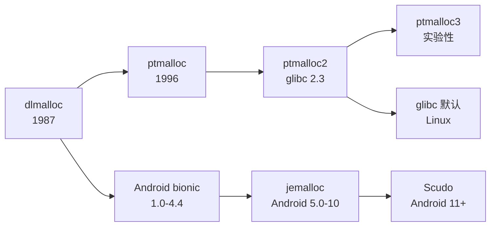
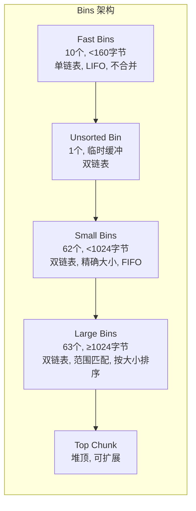
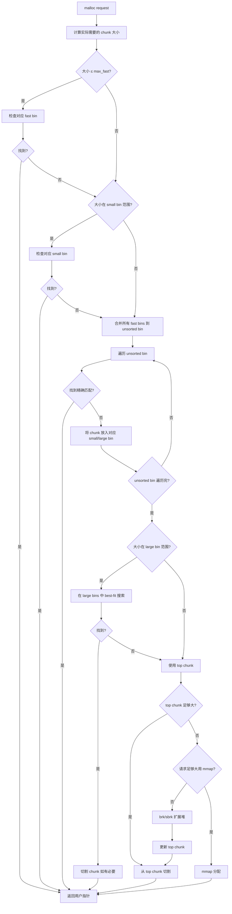
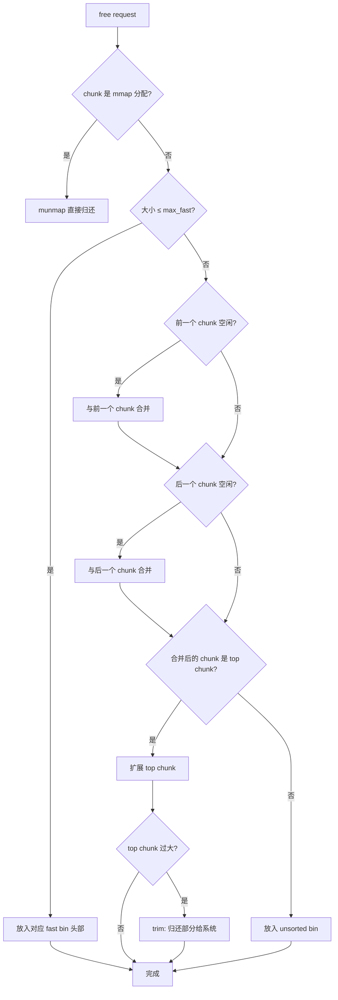
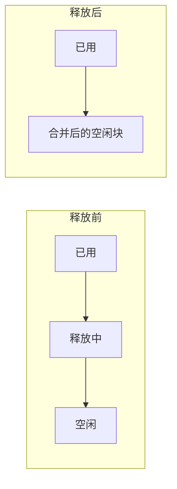
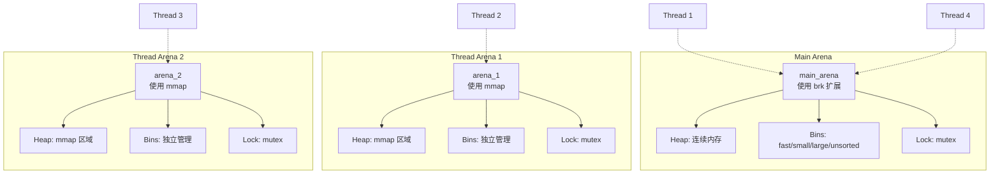
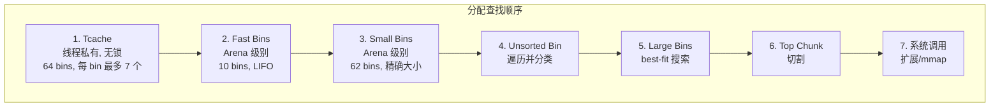
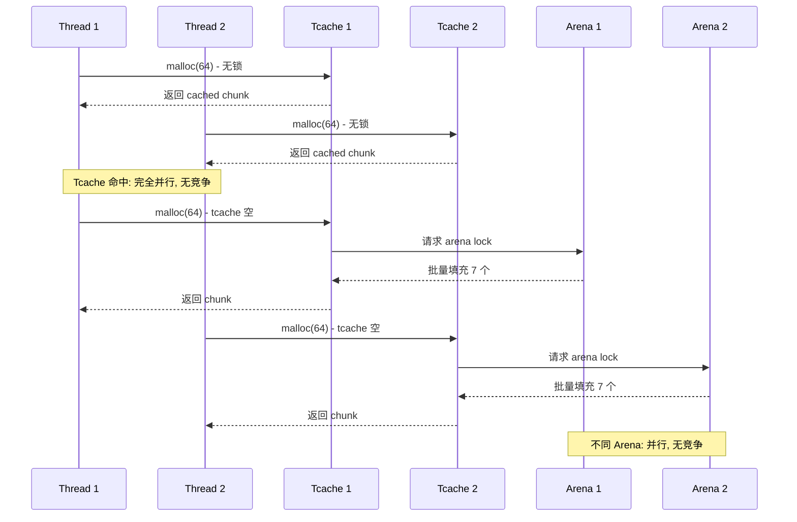
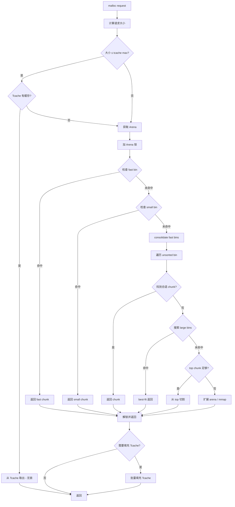
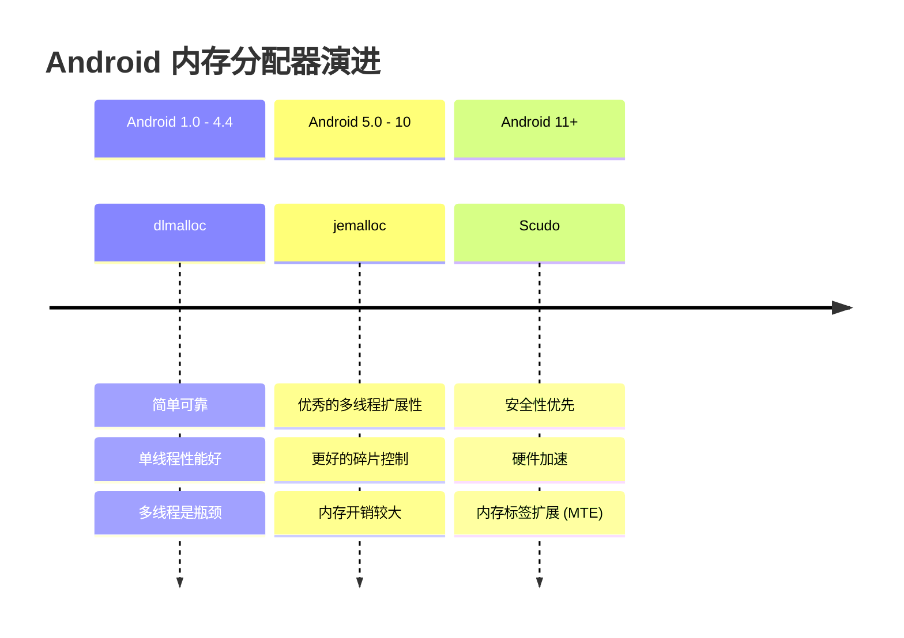

# dlmalloc 与 ptmalloc 详解

> **核心结论**：dlmalloc 是现代内存分配器的鼻祖，ptmalloc 在其基础上引入 Arena 机制解决多线程瓶颈。理解这两者是掌握 jemalloc、tcmalloc、Scudo 等现代分配器的基础。

## 一、概述

### 1.1 演进关系

dlmalloc（Doug Lea's Malloc）和 ptmalloc（POSIX Thread Malloc）存在直接的继承关系：



| 分配器 | 时间 | 主要改进 | 应用场景 |
|--------|------|----------|----------|
| dlmalloc | 1987 | 首创 binning 策略、边界标记 | 嵌入式、Android 早期 |
| ptmalloc | 1996 | 引入 Arena 机制 | 多线程应用 |
| ptmalloc2 | 2001 | 优化 arena 管理，成为 glibc 默认 | Linux 标准库 |
| ptmalloc3 | 2006 | 实验性改进 | 未广泛采用 |

### 1.2 核心设计哲学

**dlmalloc 的设计目标**：
- 空间效率：最小化元数据开销
- 时间效率：快速分配常见大小
- 碎片控制：通过合并减少外部碎片

**ptmalloc 的额外目标**：
- 多线程扩展性：减少锁竞争
- 线程局部性：提高缓存命中率

---

## 二、dlmalloc 详解

### 2.1 Why - 为什么理解 dlmalloc？

**三个核心理由**：

1. **基础性**：dlmalloc 的 chunk 管理和 binning 策略被后续所有主流分配器借鉴
2. **实用性**：至今仍广泛用于嵌入式系统、游戏引擎、WebAssembly 运行时
3. **简洁性**：单文件实现（~5000行），是学习内存分配器的最佳入门材料

### 2.2 What - dlmalloc 核心架构

#### 2.2.1 Chunk 结构

Chunk 是 dlmalloc 的基本内存单元，包含元数据和用户数据：

```
已分配的 Chunk:
┌─────────────────────────────────────┐
│ prev_size (仅当前一chunk空闲时有效)   │ 8 bytes (64-bit)
├─────────────────────────────────────┤
│ size          │ A │ M │ P │         │ 8 bytes + 3 bits flags
├─────────────────────────────────────┤
│                                     │
│         用户数据 (payload)           │ 请求大小对齐后
│                                     │
└─────────────────────────────────────┘

空闲的 Chunk:
┌─────────────────────────────────────┐
│ prev_size                           │
├─────────────────────────────────────┤
│ size          │ A │ M │ P │         │
├─────────────────────────────────────┤
│ fd (forward pointer)                │ → 下一个空闲chunk
├─────────────────────────────────────┤
│ bk (backward pointer)               │ → 上一个空闲chunk
├─────────────────────────────────────┤
│ fd_nextsize (仅large chunk)         │ → 下一个不同大小的chunk
├─────────────────────────────────────┤
│ bk_nextsize (仅large chunk)         │ → 上一个不同大小的chunk
├─────────────────────────────────────┤
│         未使用空间                   │
├─────────────────────────────────────┤
│ size (footer, 用于向后合并)          │
└─────────────────────────────────────┘
```

**标志位含义**：

| 标志 | 名称 | 含义 |
|------|------|------|
| P | PREV_INUSE | 前一个 chunk 是否正在使用 |
| M | IS_MMAPPED | 是否通过 mmap 分配 |
| A | NON_MAIN_ARENA | 是否属于非主 arena（ptmalloc 专用）|

**关键参数**（64位系统）：

```cpp
#define MALLOC_ALIGNMENT    16          // 内存对齐
#define MIN_CHUNK_SIZE      32          // 最小 chunk 大小
#define MINSIZE             (MIN_CHUNK_SIZE + CHUNK_OVERHEAD)
```

**边界标记（Boundary Tag）技术**：

空闲 chunk 在尾部复制 size 字段，使得：
- O(1) 时间向后查找前一个 chunk
- O(1) 时间判断是否可以合并
- 代价：每个空闲 chunk 额外 8 字节

#### 2.2.2 Binning 策略

dlmalloc 使用分层的 bin 组织空闲 chunk：



**Small Bins 详解**（共 62 个）：

```cpp
// 32位系统: 8字节间隔, 范围 16-504 字节
// 64位系统: 16字节间隔, 范围 32-1008 字节

Bin[0]:  32 bytes   (64-bit)
Bin[1]:  48 bytes
Bin[2]:  64 bytes
...
Bin[61]: 1008 bytes

// 查找: O(1), 精确大小匹配
```

**Large Bins 详解**（共 63 个）：

```cpp
// 覆盖范围逐渐增大
Bins[0-31]:   64字节间隔    (1024 - 3072 bytes)
Bins[32-47]:  512字节间隔   (3072 - 11264 bytes)  
Bins[48-55]:  4096字节间隔  (11264 - 44032 bytes)
Bins[56-59]:  32768字节间隔 (44032 - 175104 bytes)
Bins[60-61]:  262144字节间隔
Bin[62]:      剩余所有大小

// 查找: O(log n), best-fit 策略
```

**Fast Bins 详解**（共 10 个）：

```cpp
// 单链表, LIFO, 不合并相邻块
// 最大 fast bin size: 160 bytes (64-bit 默认)

fastbin[0]: 32 bytes
fastbin[1]: 48 bytes
...
fastbin[9]: 176 bytes

// 特点: 
// 1. 最快路径, 无需检查相邻块
// 2. 可能导致碎片, 需定期 consolidate
```

#### 2.2.3 分配流程



**伪代码实现**：

```cpp
void* dlmalloc(size_t bytes) {
    size_t nb = request2size(bytes);  // 对齐 + 头部开销
    
    // 1. Fast bin 快速路径
    if (nb <= max_fast) {
        idx = fastbin_index(nb);
        if ((victim = fastbin[idx]) != NULL) {
            fastbin[idx] = victim->fd;
            return chunk2mem(victim);
        }
    }
    
    // 2. Small bin 查找
    if (in_smallbin_range(nb)) {
        idx = smallbin_index(nb);
        if ((victim = smallbin[idx].bk) != smallbin[idx]) {
            unlink(victim);
            set_inuse(victim);
            return chunk2mem(victim);
        }
    }
    
    // 3. 合并 fast bins (如果有待处理的 fast chunks)
    if (have_fastchunks()) {
        malloc_consolidate();
    }
    
    // 4. 遍历 unsorted bin
    while ((victim = unsorted_bin.bk) != &unsorted_bin) {
        size = chunksize(victim);
        
        // 精确匹配
        if (size == nb) {
            unlink(victim);
            set_inuse(victim);
            return chunk2mem(victim);
        }
        
        // 放入对应的 small/large bin
        if (in_smallbin_range(size)) {
            insert_to_smallbin(victim, size);
        } else {
            insert_to_largebin(victim, size);
        }
    }
    
    // 5. Large bin best-fit
    if (!in_smallbin_range(nb)) {
        victim = find_best_fit_in_largebins(nb);
        if (victim != NULL) {
            remainder = split_if_needed(victim, nb);
            if (remainder) insert_to_unsorted(remainder);
            return chunk2mem(victim);
        }
    }
    
    // 6. 使用 top chunk
    if (chunksize(top) >= nb) {
        victim = top;
        top = chunk_at_offset(victim, nb);
        set_head(top, (chunksize(victim) - nb) | PREV_INUSE);
        set_head(victim, nb | PREV_INUSE);
        return chunk2mem(victim);
    }
    
    // 7. 扩展堆或 mmap
    return sysmalloc(nb);
}
```

#### 2.2.4 释放流程



**伪代码实现**：

```cpp
void dlfree(void* mem) {
    chunk* p = mem2chunk(mem);
    size_t size = chunksize(p);
    
    // 1. mmap 分配的直接归还
    if (is_mmapped(p)) {
        munmap(p, size);
        return;
    }
    
    // 2. 小 chunk 放入 fast bin
    if (size <= max_fast) {
        idx = fastbin_index(size);
        p->fd = fastbin[idx];
        fastbin[idx] = p;
        return;
    }
    
    // 3. 向前合并 (如果前一个 chunk 空闲)
    if (!prev_inuse(p)) {
        prevsize = p->prev_size;
        p = chunk_at_offset(p, -prevsize);
        size += prevsize;
        unlink(p);  // 从原来的 bin 中移除
    }
    
    // 4. 向后合并 (如果后一个 chunk 空闲)
    chunk* next = chunk_at_offset(p, size);
    if (!inuse(next)) {
        size += chunksize(next);
        unlink(next);
    }
    
    // 5. 更新大小并设置标志
    set_head(p, size | PREV_INUSE);
    set_foot(p, size);
    
    // 6. 如果与 top 相邻，合并到 top
    if (chunk_at_offset(p, size) == top) {
        top = p;
        set_head(top, (chunksize(top) + size) | PREV_INUSE);
        
        // 考虑 trim
        if (chunksize(top) > trim_threshold) {
            systrim(top);
        }
        return;
    }
    
    // 7. 放入 unsorted bin
    p->fd = unsorted_bin.fd;
    p->bk = &unsorted_bin;
    unsorted_bin.fd->bk = p;
    unsorted_bin.fd = p;
}
```

#### 2.2.5 内存碎片处理

**合并策略（Coalescing）**：



**malloc_consolidate 操作**：

```cpp
void malloc_consolidate() {
    // 遍历所有 fast bins
    for (int i = 0; i < NFASTBINS; i++) {
        while ((p = fastbin[i]) != NULL) {
            fastbin[i] = p->fd;
            
            // 尝试与前后合并
            if (!prev_inuse(p)) {
                // 向前合并...
            }
            if (!inuse(next_chunk(p))) {
                // 向后合并...
            }
            
            // 放入 unsorted bin
            insert_to_unsorted(p);
        }
    }
}
```

#### 2.2.6 dlmalloc 的局限性

| 局限性 | 描述 | 影响 |
|--------|------|------|
| 全局锁 | 所有操作共享一个锁 | 多线程性能急剧下降 |
| 无线程缓存 | 每次分配都需要访问全局数据结构 | 缓存命中率低 |
| 碎片积累 | 长时间运行后碎片难以消除 | 内存利用率下降 |
| Top chunk 依赖 | 堆必须连续增长 | 地址空间受限 |

---

## 三、ptmalloc 详解

### 3.1 Why - 为什么 ptmalloc 取代 dlmalloc？

**核心问题**：dlmalloc 的全局锁在多线程场景下成为严重瓶颈。

```
4线程并发分配性能对比:
┌────────────────────────────────────────────┐
│ dlmalloc:  |████                    | 25%  │  ← 锁竞争严重
│ ptmalloc:  |████████████████████    | 85%  │  ← Arena 分散竞争
│ 理想线性:  |████████████████████████| 100% │
└────────────────────────────────────────────┘
```

### 3.2 What - ptmalloc 核心架构

#### 3.2.1 Arena 机制

**Arena** 是 ptmalloc 引入的核心抽象，每个 arena 拥有独立的：
- 堆内存区域
- Bins 数据结构
- 互斥锁



**Arena 数量限制**：

```cpp
// 32位系统: 2 × CPU核心数
// 64位系统: 8 × CPU核心数

// 例如: 8核 64位系统最多 64 个 arenas
```

**Arena 选择算法**：

```cpp
arena* arena_get() {
    // 1. 尝试使用线程上次使用的 arena
    arena* a = thread_arena;
    if (a && mutex_trylock(&a->lock) == 0) {
        return a;
    }
    
    // 2. 遍历 arena 链表，找未锁定的
    for (a = main_arena.next; a != &main_arena; a = a->next) {
        if (mutex_trylock(&a->lock) == 0) {
            thread_arena = a;
            return a;
        }
    }
    
    // 3. 创建新 arena (如果未达上限)
    if (arena_count < arena_max) {
        a = create_new_arena();
        thread_arena = a;
        return a;
    }
    
    // 4. 强制等待 main_arena
    mutex_lock(&main_arena.lock);
    return &main_arena;
}
```

#### 3.2.2 Bins 管理（继承 + 扩展）

ptmalloc 完整继承了 dlmalloc 的 bins 结构，并新增了 **Tcache**：



**Tcache（glibc 2.26+ 引入）**：

```cpp
// 每个线程独有，完全无锁
typedef struct tcache_perthread {
    tcache_entry* entries[TCACHE_MAX_BINS];  // 64 bins
    uint8_t counts[TCACHE_MAX_BINS];         // 每 bin 的 chunk 数量
} tcache_perthread;

#define TCACHE_MAX_BINS     64
#define TCACHE_FILL_COUNT   7   // 每 bin 最多缓存 7 个
#define TCACHE_MAX_SIZE     1032  // 最大缓存大小 (64位)

// Tcache 结构:
// entries[0]: 32 bytes    (最多7个)
// entries[1]: 48 bytes    (最多7个)
// ...
// entries[63]: 1032 bytes (最多7个)
```

**Tcache vs Fast Bin 对比**：

| 特性 | Tcache | Fast Bin |
|------|--------|----------|
| 作用域 | 线程私有 | Arena 共享 |
| 锁 | 无 | Arena 锁 |
| 缓存数量 | 每 bin 7 个 | 无限制 |
| 合并 | 不合并 | 不合并 |
| 大小范围 | ≤ 1032 字节 | ≤ 176 字节 |

#### 3.2.3 多线程并发处理



**锁粒度优化**：

```cpp
// dlmalloc: 全局锁
static mutex_t global_lock;

// ptmalloc: Arena 级别锁
struct malloc_state {
    mutex_t mutex;           // 每个 arena 独立的锁
    // ... bins, top chunk, etc.
};

// glibc 2.26+: Tcache 无锁 + Arena 锁
// 最快路径完全无锁
```

#### 3.2.4 分配流程（ptmalloc）



#### 3.2.5 内存回收与碎片管理

**M_TRIM_THRESHOLD**：

```cpp
// 当 top chunk 超过阈值时，归还给系统
// 默认: 128 KB

mallopt(M_TRIM_THRESHOLD, 256 * 1024);  // 设为 256KB

// 工作原理:
if (chunksize(top) > trim_threshold) {
    size_t extra = chunksize(top) - pad;
    sbrk(-extra);  // 归还给操作系统
}
```

**M_MMAP_THRESHOLD**：

```cpp
// 大于此阈值的请求直接使用 mmap
// 默认: 128 KB (但会动态调整)

mallopt(M_MMAP_THRESHOLD, 512 * 1024);  // 设为 512KB

// 动态调整:
// 如果 mmap 分配被 free，阈值可能上调
// 最大可达 DEFAULT_MMAP_THRESHOLD_MAX (通常 32MB)
```

**Arena 级别碎片问题**：

```
问题: 每个 Arena 独立管理内存，可能出现:
- Arena A 有大量空闲内存
- Arena B 内存不足需要扩展
- 系统总体内存浪费

解决方案:
1. 限制 Arena 数量
2. 定期 malloc_trim()
3. 考虑使用 jemalloc/tcmalloc
```

### 3.3 How - ptmalloc 实践

#### 3.3.1 调优参数

```cpp
#include <malloc.h>

void configure_ptmalloc() {
    // 1. 内存归还阈值 (默认 128KB)
    mallopt(M_TRIM_THRESHOLD, 128 * 1024);
    
    // 2. mmap 阈值 (默认 128KB, 动态调整)
    mallopt(M_MMAP_THRESHOLD, 256 * 1024);
    
    // 3. Top chunk 保留空间 (默认 0)
    mallopt(M_TOP_PAD, 64 * 1024);
    
    // 4. 最大 Arena 数量 (默认 8 × CPU)
    mallopt(M_ARENA_MAX, 4);
    
    // 5. Arena 测试数量 (创建新 arena 前测试的数量)
    mallopt(M_ARENA_TEST, 2);
    
    // 6. mmap 最大数量 (默认 65536)
    mallopt(M_MMAP_MAX, 1024);
}

// 强制归还内存给系统
int released = malloc_trim(0);

// 获取内存统计信息
struct mallinfo mi = mallinfo();
printf("Total allocated: %d\n", mi.uordblks);
printf("Total free: %d\n", mi.fordblks);
printf("Arenas: %d\n", mi.hblks);
```

#### 3.3.2 常见问题诊断

**问题 1: Arena 过多导致虚拟内存暴增**

```bash
# 现象: 进程虚拟内存远超实际使用
$ cat /proc/<pid>/status | grep Vm
VmSize: 20480000 kB  # 虚拟内存 20GB!
VmRSS:    512000 kB  # 实际使用 500MB

# 原因: 每个 Arena 预留 64MB (64位系统)
# 64核机器: 8 × 64 = 512 个 Arena × 64MB = 32GB 虚拟内存

# 解决:
export MALLOC_ARENA_MAX=4  # 或在代码中
mallopt(M_ARENA_MAX, 4);
```

**问题 2: 内存不释放（mmap 阈值动态上调）**

```cpp
// 现象: 大块内存 free 后 RSS 不下降

// 原因: ptmalloc 动态调整 mmap_threshold
// 释放大块 mmap 内存后，阈值可能上调
// 后续同样大小的分配改用 brk，不会自动归还

// 解决方案:
mallopt(M_MMAP_THRESHOLD, 128 * 1024);  // 固定阈值
// 或
mallopt(M_MMAP_THRESHOLD, -1);  // 禁用动态调整
```

**问题 3: Fast bin 延迟合并导致碎片**

```cpp
// 现象: 大量小内存分配释放后，大块分配失败

// 原因: fast bin 不自动合并
// 解决: 手动触发 consolidation
malloc_trim(0);

// 或调小 fast bin 最大值
mallopt(M_MXFAST, 0);  // 禁用 fast bins
```

#### 3.3.3 Android 上的演进



**放弃 dlmalloc/ptmalloc 的原因**：

| 原因 | dlmalloc | ptmalloc |
|------|----------|----------|
| 多线程性能 | 差（全局锁）| 一般（Arena 竞争）|
| 碎片控制 | 一般 | 差（多 Arena 碎片）|
| 安全性 | 弱（无防护）| 弱（无防护）|
| 移动端适配 | 未优化 | 未优化 |

---

## 四、dlmalloc vs ptmalloc 对比

| 特性 | dlmalloc | ptmalloc2 |
|------|----------|-----------|
| **多线程支持** | 全局锁，严重竞争 | Arena + Tcache，可扩展 |
| **单线程性能** | ~100 ns/op | ~120 ns/op（略有开销）|
| **4线程吞吐** | ~25% 线性扩展 | ~85% 线性扩展 |
| **内存开销** | 8-16 bytes/chunk | 8-16 bytes/chunk + Arena 结构 |
| **碎片控制** | 较好（单堆）| 较差（多 Arena 独立）|
| **代码复杂度** | ~5000 行 | ~15000 行 |
| **可移植性** | 极高（单文件）| 依赖 glibc |
| **安全特性** | 基础检查 | 基础检查 + 少量防护 |

---

## 五、性能基准数据

### 5.1 单线程性能

| 操作 | dlmalloc | ptmalloc2 | 说明 |
|------|----------|-----------|------|
| malloc(32) | 45 ns | 52 ns | tcache 命中 |
| malloc(256) | 58 ns | 65 ns | small bin |
| malloc(4096) | 85 ns | 95 ns | large bin |
| malloc(1MB) | 150 ns | 160 ns | mmap |
| free(32) | 35 ns | 40 ns | tcache/fast bin |

### 5.2 多线程吞吐量

```
测试条件: 8核 CPU, 每线程 1M 次 malloc/free(64 bytes)

线程数 │ dlmalloc (ops/s) │ ptmalloc2 (ops/s) │ 扩展比
───────┼──────────────────┼───────────────────┼────────
   1   │    18,000,000    │    15,000,000     │  1.00x
   2   │    12,000,000    │    28,000,000     │  1.87x
   4   │     6,500,000    │    52,000,000     │  3.47x
   8   │     4,000,000    │    85,000,000     │  5.67x

dlmalloc 多线程反而下降（锁竞争）
ptmalloc 接近线性扩展（多 Arena）
```

### 5.3 长时间运行碎片率

```
测试: 随机大小分配(16-4096 bytes)，50%分配/50%释放，运行1小时

指标              │ dlmalloc │ ptmalloc2
──────────────────┼──────────┼───────────
实际使用内存      │  512 MB  │   512 MB
分配器占用内存    │  580 MB  │   720 MB
碎片率            │   13%    │    41%
虚拟内存占用      │  600 MB  │  2.5 GB

ptmalloc 碎片率高的原因:
1. 多 Arena 各自持有空闲内存
2. Arena 间内存不共享
3. 动态 mmap 阈值导致大块不释放
```

### 5.4 不同大小分配性能曲线

```
分配延迟 (ns)
    │
200 ┤                                    ╭─── dlmalloc (mmap)
    │                              ╭─────╯
150 ┤                        ╭─────╯
    │                  ╭─────╯        ╭─── ptmalloc (mmap)  
100 ┤            ╭─────╯        ╭─────╯
    │      ╭─────╯        ╭─────╯
 50 ┤╭─────╯        ╭─────╯
    │ tcache   fast  small   large    mmap
────┴───┬─────┬─────┬───────┬─────────┬──────── 分配大小
       32   160   1024    32KB    128KB+
```

---

## 六、总结

### 6.1 选型建议

| 场景 | 推荐 | 理由 |
|------|------|------|
| 嵌入式/单线程 | dlmalloc | 简单、可移植、低开销 |
| 通用 Linux 应用 | ptmalloc2 | glibc 默认，无需额外配置 |
| 高并发服务 | jemalloc/tcmalloc | 更好的多线程扩展和碎片控制 |
| 安全敏感 | Scudo/hardened_malloc | 安全特性优先 |

### 6.2 核心要点回顾

1. **dlmalloc** 奠定了现代分配器的基础：chunk 结构、boundary tag、binning 策略
2. **ptmalloc** 引入 Arena 机制解决多线程瓶颈，但带来碎片问题
3. **Tcache** 是 ptmalloc 性能的关键：线程私有、无锁、批量操作
4. 理解 bins 的层次结构（tcache → fast → small → unsorted → large → top）是性能调优的基础
5. 生产环境需关注：Arena 数量限制、mmap 阈值、定期 trim

### 6.3 延伸阅读

- [dlmalloc 源码](http://gee.cs.oswego.edu/dl/html/malloc.html)
- [glibc malloc 实现](https://sourceware.org/glibc/wiki/MallocInternals)
- [Understanding glibc malloc](https://sploitfun.wordpress.com/2015/02/10/understanding-glibc-malloc/)
