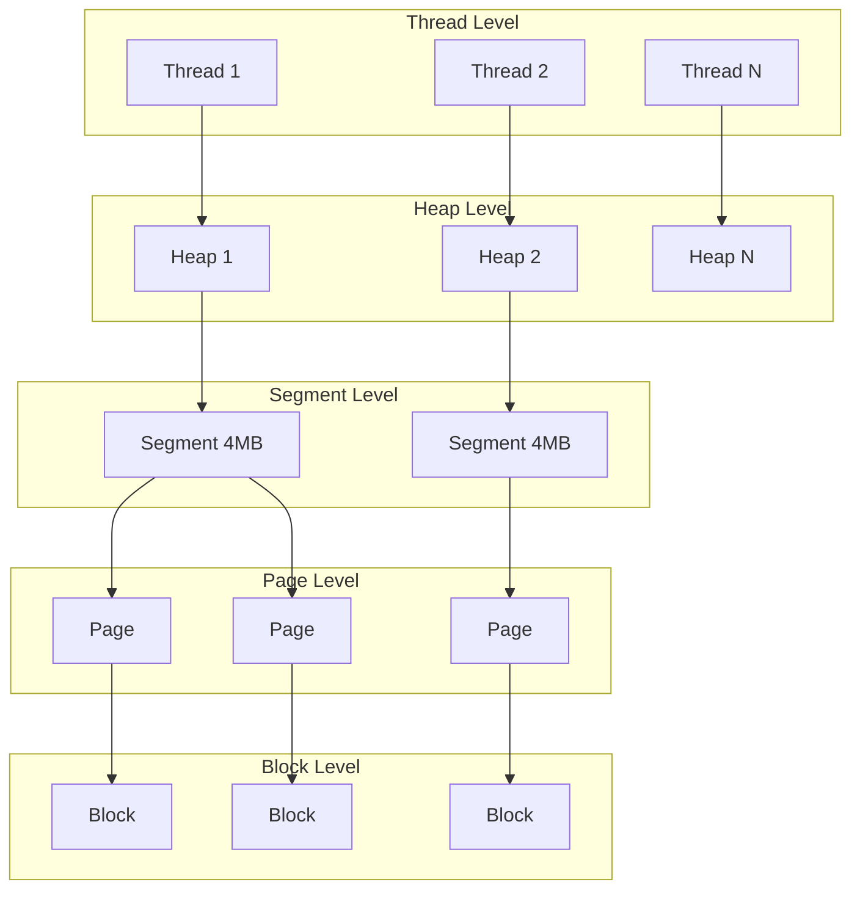
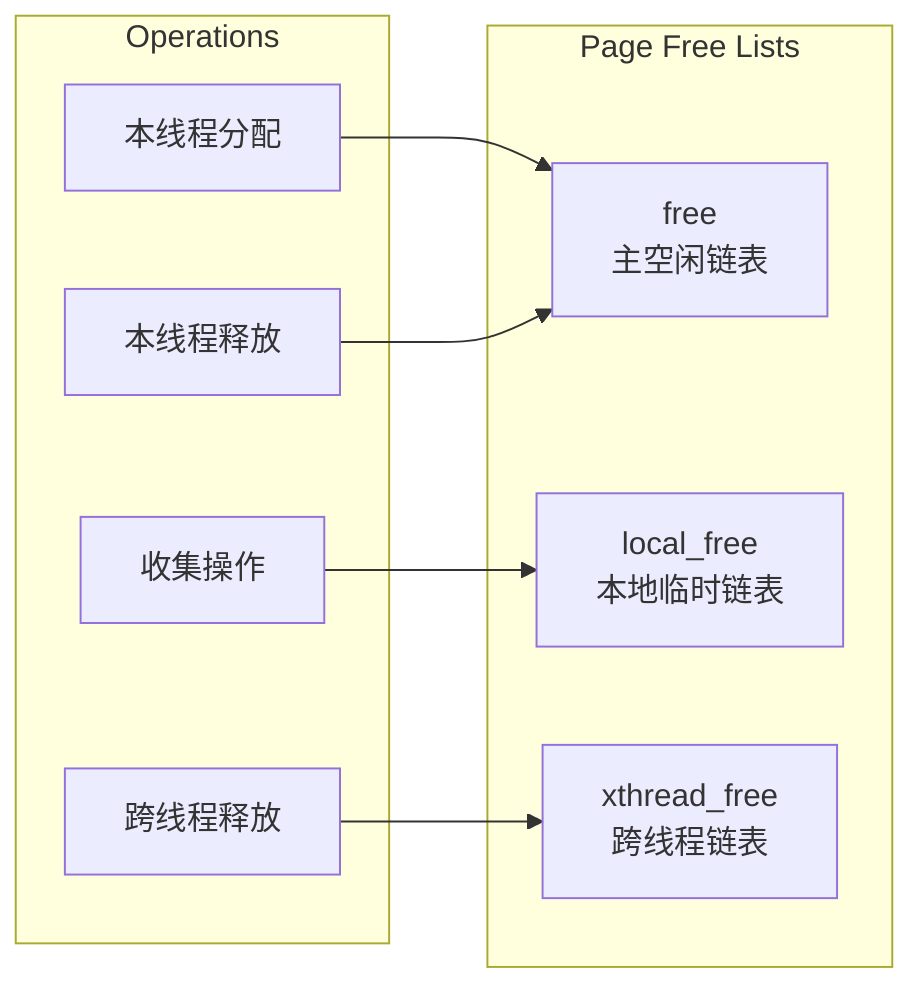
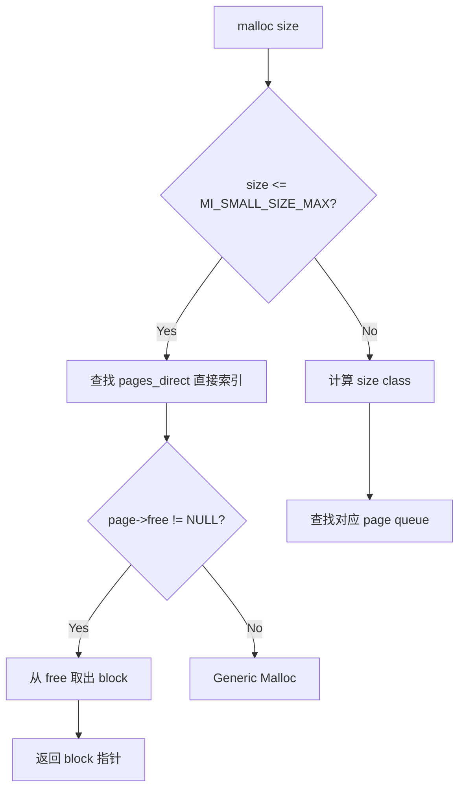
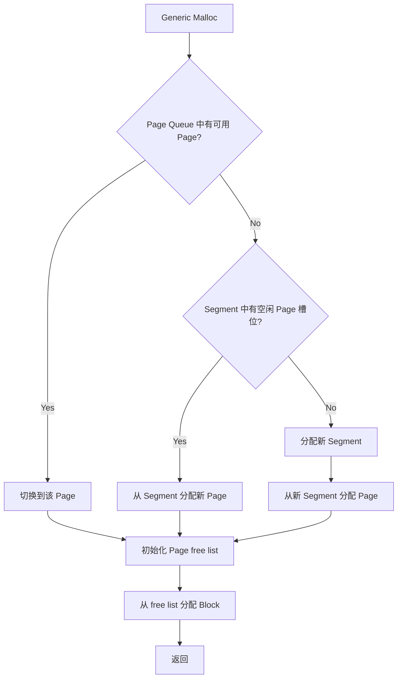
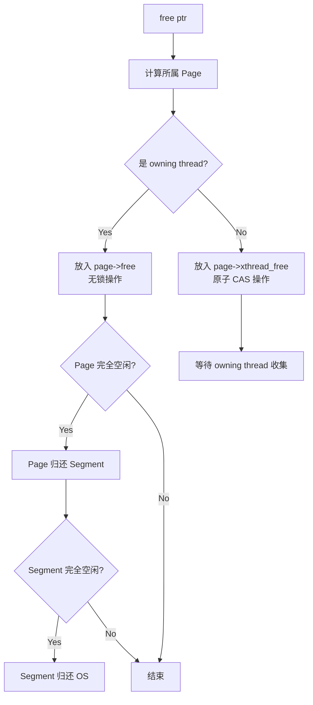
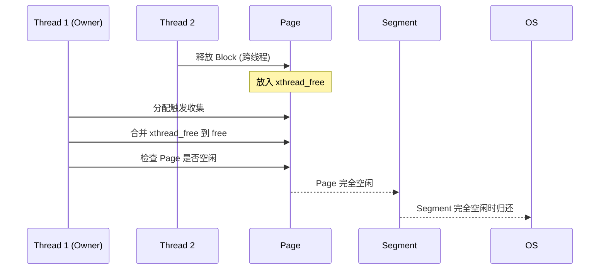
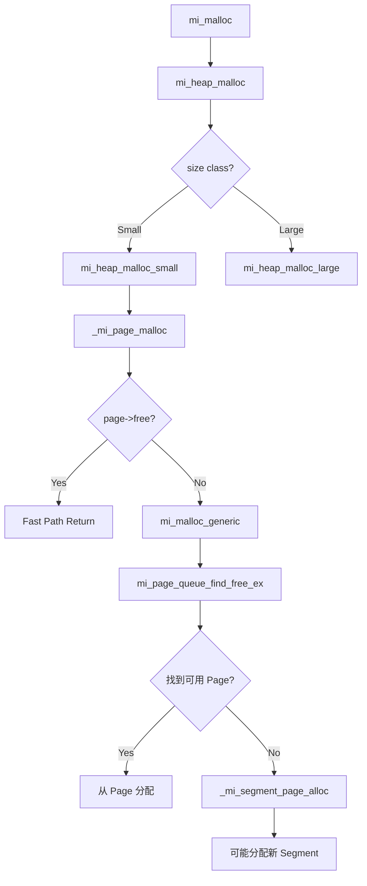

# mimalloc 详解

## 核心结论

mimalloc 是微软开源的高性能通用内存分配器，通过**分段架构（Segment-Page-Block）**和**无锁线程本地分配**实现了卓越的性能。在多数 benchmark 中超越 jemalloc 和 tcmalloc，代码量仅 ~8000 行 C，易于理解、定制和跨平台集成。

---

## 一、Why - 为什么关注 mimalloc？

### 1.1 性能领先

mimalloc 在 Microsoft 内部大规模使用，并在多个公开 benchmark 中展现出色性能：

| 特性 | mimalloc 优势 |
|------|--------------|
| **吞吐量** | 单线程和多线程场景均优于 jemalloc/tcmalloc |
| **延迟** | 分配/释放路径极短，p99 延迟更稳定 |
| **内存效率** | 碎片率低，内存归还及时 |
| **扩展性** | 线程数增加时性能近乎线性扩展 |

### 1.2 设计优势

- **代码简洁**：~8000 行 C 代码，远少于 jemalloc（~30000行）和 tcmalloc（~40000行）
- **易于理解**：架构清晰，适合学习和定制
- **跨平台**：支持 Windows/Linux/macOS/iOS/Android/FreeBSD/WASM
- **易于集成**：可作为静态库嵌入应用，无需系统级替换

### 1.3 适用场景

```
┌────────────────────────────────────────────────────┐
│              mimalloc 最佳适用场景                  │
├────────────────────────────────────────────────────┤
│ ✓ 高频小对象分配（音视频帧处理、游戏引擎）           │
│ ✓ 多线程密集分配（并发服务器、工作线程池）           │
│ ✓ 对延迟敏感的应用（实时系统、低延迟交易）           │
│ ✓ 嵌入式自定义分配器（需要精细控制内存行为）         │
└────────────────────────────────────────────────────┘
```

---

## 二、What - mimalloc 核心架构

### 2.1 整体架构

mimalloc 采用**四层分层架构**，从线程到内存块逐级管理：



**架构层次说明**：

| 层次 | 职责 | 特点 |
|-----|------|------|
| **Thread** | 线程入口 | 每线程一个 TLS Heap |
| **Heap** | 管理 Page 队列 | 按 size class 组织 |
| **Segment** | 大块虚拟内存 | 默认 4MB，OS 页对齐 |
| **Page** | 管理同类 Block | 包含 free list |
| **Block** | 最小分配单元 | 无独立头部 |

### 2.2 核心数据结构

#### 2.2.1 Heap（堆）

```c
// 简化的 Heap 结构
typedef struct mi_heap_s {
    mi_tld_t*       tld;              // 线程本地数据
    mi_page_queue_t pages[MI_BIN_HUGE+1];  // Page 队列数组（按 size class）
    mi_page_t*      pages_direct[MI_PAGES_DIRECT]; // 小对象直接索引
    atomic_uintptr_t thread_delayed_free;   // 延迟释放链表
    uintptr_t       thread_id;        // 所属线程 ID
    // ...
} mi_heap_t;
```

**Heap 设计要点**：
- **Thread-local**：每个线程一个 Heap，避免锁竞争
- **Page 队列数组**：按 size class 分类，快速定位
- **直接索引表**：小对象 O(1) 定位 Page

#### 2.2.2 Segment（分段）

```c
typedef struct mi_segment_s {
    struct mi_segment_s* next;        // Segment 链表
    struct mi_segment_s* prev;
    size_t          memid;            // OS 内存标识
    bool            mem_is_pinned;    // 是否锁定
    size_t          segment_size;     // 总大小（默认 4MB）
    size_t          segment_info_size;// 元数据大小
    
    mi_page_t       pages[MI_SEGMENT_MAX_PAGES]; // Page 数组
    // ...
} mi_segment_t;
```

**Segment 布局**：

```
┌─────────────────────────────────────────────────────────┐
│                    Segment (4MB)                         │
├─────────────┬───────────────────────────────────────────┤
│  Metadata   │              Page 0  Page 1  Page 2  ...  │
│  (Header)   │              [blocks][blocks][blocks]     │
├─────────────┴───────────────────────────────────────────┤
│            OS Page Aligned (4KB boundary)                │
└─────────────────────────────────────────────────────────┘
```

**Segment 设计要点**：
- **大块分配**：减少系统调用次数
- **对齐设计**：4MB 对齐，便于通过指针计算定位
- **统一管理**：Segment 元数据与数据在同一块内存

#### 2.2.3 Page（页）

```c
typedef struct mi_page_s {
    uint8_t         segment_idx;      // 在 Segment 中的索引
    uint8_t         segment_in_use:1; // 是否在使用
    uint8_t         is_reset:1;       // 是否已重置
    uint8_t         is_committed:1;   // 是否已提交
    
    uint16_t        capacity;         // 最大 Block 数
    uint16_t        reserved;         // 保留 Block 数
    uint16_t        used;             // 已用 Block 数
    
    mi_block_t*     free;             // 空闲链表（本线程）
    mi_block_t*     local_free;       // 本地空闲链表
    atomic_mi_block_t* xthread_free;  // 跨线程释放链表（原子）
    
    size_t          block_size;       // Block 大小
    // ...
} mi_page_t;
```

**Page 的三个 Free List**：



| Free List | 访问方式 | 用途 |
|-----------|---------|------|
| `free` | 无锁 | 本线程快速分配/释放 |
| `local_free` | 无锁 | 批量收集时的临时缓冲 |
| `xthread_free` | 原子操作 | 接收其他线程的释放 |

#### 2.2.4 Block（块）

```c
typedef struct mi_block_s {
    mi_encoded_t next;  // 指向下一个空闲 Block（encoded）
} mi_block_t;
```

**Block 设计要点**：
- **无头部开销**：元数据存储在 Page 级别
- **编码指针**：`next` 经过编码，增加安全性
- **最小开销**：仅使用一个指针大小的空间链接空闲块

### 2.3 Size Class 设计

mimalloc 采用**分层 size class** 策略：

```
Size Class 分布（简化）：
┌─────────────────────────────────────────────────────────┐
│  Small (8B - 1KB)                                       │
│  8, 16, 24, 32, 40, 48, ..., 128                        │
│  160, 192, 224, 256, 320, 384, 448, 512                 │
│  640, 768, 896, 1024                                    │
├─────────────────────────────────────────────────────────┤
│  Medium (1KB - 512KB)                                   │
│  1.25×增长: 1280, 1536, 1792, 2048, ...                 │
├─────────────────────────────────────────────────────────┤
│  Large (> 512KB)                                        │
│  直接使用 mmap 分配                                      │
└─────────────────────────────────────────────────────────┘
```

**Size Class 映射表（部分）**：

| 请求大小 | Size Class | 浪费率上限 |
|---------|-----------|-----------|
| 1-8 | 8 | 87.5% |
| 9-16 | 16 | 43.75% |
| 17-24 | 24 | 29.2% |
| 25-32 | 32 | 21.9% |
| 33-48 | 48 | 31.25% |
| 49-64 | 64 | 23.4% |
| 65-80 | 80 | 18.75% |
| ... | ... | ... |

**设计权衡**：
- 小对象使用 8B 间隔，减少碎片
- 中对象使用 ~1.25× 增长，平衡碎片和 class 数量
- 大对象直接 mmap，避免碎片

### 2.4 分配流程

#### 2.4.1 Fast Path（快速路径）



**Fast Path 代码逻辑**（简化）：

```c
void* mi_malloc(size_t size) {
    if (mi_likely(size <= MI_SMALL_SIZE_MAX)) {
        mi_page_t* page = _mi_heap_get_small_page(heap, size);
        mi_block_t* block = page->free;
        if (mi_likely(block != NULL)) {
            page->free = mi_block_next(page, block);
            page->used++;
            return block;  // Fast path: 仅需几条指令
        }
    }
    return mi_malloc_generic(heap, size);  // Slow path
}
```

**Fast Path 特点**：
- 无锁访问
- 分支预测友好
- 仅需 ~10 条机器指令

#### 2.4.2 Generic Malloc（通用路径）

当 Fast Path 失败时，进入 Generic Malloc：



**Generic Malloc 步骤**：
1. 遍历 Page Queue 查找有空闲块的 Page
2. 尝试从当前 Segment 获取新 Page
3. 必要时分配新 Segment（4MB mmap）
4. 初始化 Page 的 free list
5. 返回分配的 Block

### 2.5 释放流程

#### 2.5.1 指针定位

mimalloc 利用 **Segment 对齐** 快速定位 Page：

```c
static inline mi_segment_t* mi_ptr_segment(const void* p) {
    // Segment 4MB 对齐，直接掩码计算
    return (mi_segment_t*)((uintptr_t)p & ~(MI_SEGMENT_SIZE - 1));
}

static inline mi_page_t* mi_ptr_page(void* p) {
    mi_segment_t* segment = mi_ptr_segment(p);
    size_t diff = (uint8_t*)p - (uint8_t*)segment;
    size_t idx = diff >> segment->page_shift;
    return &segment->pages[idx];
}
```

#### 2.5.2 释放路径



**释放代码逻辑**（简化）：

```c
void mi_free(void* p) {
    mi_page_t* page = mi_ptr_page(p);
    mi_block_t* block = (mi_block_t*)p;
    
    if (mi_likely(page->xthread_free == mi_page_thread_id(page))) {
        // 本线程释放：无锁
        mi_block_set_next(page, block, page->free);
        page->free = block;
        page->used--;
    } else {
        // 跨线程释放：原子操作
        mi_block_t* dfree;
        do {
            dfree = mi_atomic_load_ptr(&page->xthread_free);
            mi_block_set_next(page, block, dfree);
        } while (!mi_atomic_cas_ptr(&page->xthread_free, dfree, block));
    }
}
```

### 2.6 延迟回收机制

#### 2.6.1 Deferred Collection

mimalloc 的"GC"不同于传统垃圾回收，是一种**延迟回收机制**：



#### 2.6.2 Heartbeat 机制

```c
void _mi_heap_collect(mi_heap_t* heap, bool force) {
    // 1. 收集跨线程释放的 blocks
    for each page in heap {
        mi_page_collect(page);
    }
    
    // 2. 回收空闲 Pages
    for each page in heap {
        if (page->used == 0) {
            mi_page_retire(page);
        }
    }
    
    // 3. 回收空闲 Segments
    for each segment in heap {
        if (segment_is_empty(segment)) {
            mi_segment_free(segment);
        }
    }
}
```

**触发时机**：
- 分配时发现 Page 为空
- 定期 heartbeat（可配置）
- 显式调用 `mi_collect()`

### 2.7 跨平台优化

#### 2.7.1 OS 层适配

| 平台 | 内存分配 | 内存释放 | 大页支持 |
|------|---------|---------|---------|
| **Windows** | VirtualAlloc | VirtualFree | 2MB Large Pages |
| **Linux** | mmap | munmap/madvise | Huge Pages (2MB/1GB) |
| **macOS** | mmap | madvise | Superpage |
| **Android** | mmap | madvise(DONTNEED) | 受限 |
| **iOS** | mmap/vm_allocate | madvise | 受限 |

**madvise 策略**：

```c
// 归还物理内存但保留虚拟地址
#if defined(__linux__) || defined(__ANDROID__)
    madvise(p, size, MADV_DONTNEED);  // Linux/Android
#elif defined(__APPLE__)
    madvise(p, size, MADV_FREE);      // macOS/iOS
#endif
```

#### 2.7.2 安全特性

```c
// 安全模式选项
#define MI_SECURE 0  // 默认：无安全检查
#define MI_SECURE 1  // 编码指针
#define MI_SECURE 2  // + 填充释放内存
#define MI_SECURE 3  // + Guard Pages
#define MI_SECURE 4  // + 双重释放检测
```

**安全特性详解**：

| 特性 | 作用 | 性能影响 |
|-----|------|---------|
| **Encoded Pointers** | 防止指针伪造攻击 | ~1% |
| **Fill on Free** | 检测 Use-After-Free | ~5% |
| **Guard Pages** | 检测缓冲区溢出 | ~10% |
| **Double-Free Detection** | 防止重复释放 | ~2% |

---

## 三、How - 实际使用与集成

### 3.1 集成方式

#### 方法1：全局替换（链接时）

```cmake
# CMakeLists.txt
find_package(mimalloc REQUIRED)
target_link_libraries(myapp PRIVATE mimalloc)
```

在 Linux 上也可以使用 LD_PRELOAD：

```bash
LD_PRELOAD=/usr/lib/libmimalloc.so ./myapp
```

#### 方法2：显式 API

```cpp
#include <mimalloc.h>

void* p = mi_malloc(256);
void* q = mi_calloc(10, sizeof(int));
void* r = mi_realloc(p, 512);
mi_free(r);
mi_free(q);
```

#### 方法3：C++ STL Allocator

```cpp
#include <mimalloc.h>
#include <vector>
#include <map>

// Vector 使用 mimalloc
std::vector<int, mi_stl_allocator<int>> vec;

// Map 使用 mimalloc
std::map<std::string, int, std::less<>,
         mi_stl_allocator<std::pair<const std::string, int>>> map;
```

### 3.2 Android NDK 集成

```cmake
# Android CMakeLists.txt
cmake_minimum_required(VERSION 3.18)

# 添加 mimalloc 子项目
set(MI_OVERRIDE OFF)           # Android 不支持全局替换
set(MI_BUILD_SHARED OFF)       # 静态链接
set(MI_BUILD_TESTS OFF)
add_subdirectory(mimalloc)

# 链接到你的 native 库
add_library(native-lib SHARED native-lib.cpp)
target_link_libraries(native-lib PRIVATE mimalloc-static)
```

**Android 使用注意**：
- 必须关闭 `MI_OVERRIDE`（无法替换 Bionic）
- 推荐静态链接避免符号冲突
- 使用显式 `mi_` API

### 3.3 iOS 集成

```cmake
# iOS CMakeLists.txt
set(MI_OVERRIDE OFF)           # iOS 必须关闭
set(MI_BUILD_SHARED OFF)       # 静态库
set(MI_OSX_ZONE OFF)           # 不创建 malloc zone

add_subdirectory(mimalloc)
target_link_libraries(${PROJECT_NAME} PRIVATE mimalloc-static)
```

**iOS 特殊处理**：
```cpp
// iOS 需要显式初始化
#include <mimalloc.h>

void app_init() {
    mi_option_set(mi_option_eager_commit, 0);  // 延迟提交
    mi_option_set(mi_option_page_reset, 1);    // 释放时重置
}
```

### 3.4 调优选项

#### 环境变量

```bash
# 诊断输出
export MIMALLOC_VERBOSE=1

# 显示统计信息
export MIMALLOC_SHOW_STATS=1

# 启用大页
export MIMALLOC_LARGE_OS_PAGES=1

# 页面重置（归还物理内存）
export MIMALLOC_PAGE_RESET=1

# 限制 Segment 数量
export MIMALLOC_RESERVE_HUGE_OS_PAGES=4
```

#### 运行时 API

```cpp
#include <mimalloc.h>

// 获取统计信息
mi_stats_print(NULL);

// 设置选项
mi_option_set(mi_option_show_stats, 1);
mi_option_set(mi_option_verbose, 1);
mi_option_set(mi_option_eager_commit, 0);

// 手动触发回收
mi_collect(true);

// 获取已用内存
size_t used = mi_heap_get_used(mi_heap_get_default());
```

### 3.5 性能数据

**测试环境**：
- CPU: Intel Core i9-12900K, 16 cores
- Memory: 64GB DDR5
- OS: Ubuntu 22.04, kernel 5.15
- Compiler: GCC 12.1, -O3

**微基准测试结果**：

| 场景 | mimalloc | jemalloc 5.3 | tcmalloc | ptmalloc |
|------|----------|--------------|----------|----------|
| malloc(32) 单线程 | 12 ns | 18 ns | 15 ns | 25 ns |
| malloc(256) 单线程 | 14 ns | 20 ns | 17 ns | 28 ns |
| malloc(4KB) 单线程 | 45 ns | 55 ns | 50 ns | 120 ns |
| 8线程 malloc/free | 18M ops/s | 12M ops/s | 14M ops/s | 4M ops/s |
| 16线程生产者-消费者 | 25M ops/s | 18M ops/s | 20M ops/s | 6M ops/s |
| 内存碎片率 | 8.2% | 9.5% | 11.3% | 15.7% |

**真实应用测试（Redis）**：

| 指标 | mimalloc | jemalloc | 提升 |
|------|----------|----------|------|
| SET QPS | 485,000 | 452,000 | +7.3% |
| GET QPS | 512,000 | 489,000 | +4.7% |
| 内存占用 | 1.82 GB | 1.95 GB | -6.7% |
| P99 延迟 | 0.38 ms | 0.45 ms | -15.6% |

---

## 四、核心源码解析

### 4.1 关键文件结构

```
mimalloc/
├── include/
│   └── mimalloc.h          # 公开 API
├── src/
│   ├── alloc.c             # 分配核心
│   ├── free.c              # 释放逻辑
│   ├── heap.c              # Heap 管理
│   ├── segment.c           # Segment 管理
│   ├── page.c              # Page 管理
│   ├── arena.c             # 大块内存管理
│   └── os.c                # OS 适配层
└── test/
    └── main-override.c     # 测试代码
```

### 4.2 核心分配函数调用链



---

## 五、最佳实践与注意事项

### 5.1 推荐配置

```cpp
// 高性能场景
mi_option_set(mi_option_eager_commit, 1);     // 立即提交
mi_option_set(mi_option_large_os_pages, 1);   // 大页
mi_option_set(mi_option_reserve_huge_os_pages, 2);  // 预留大页

// 低内存场景
mi_option_set(mi_option_eager_commit, 0);     // 延迟提交
mi_option_set(mi_option_page_reset, 1);       // 及时归还
mi_option_set(mi_option_segment_reset, 1);    // Segment 重置

// 调试场景
mi_option_set(mi_option_show_stats, 1);
mi_option_set(mi_option_show_errors, 1);
mi_option_set(mi_option_verbose, 1);
```

### 5.2 常见陷阱

| 陷阱 | 描述 | 解决方案 |
|-----|------|---------|
| **混用分配器** | `mi_malloc` 分配的内存用 `free` 释放 | 使用统一 API |
| **静态链接冲突** | 多个库各自静态链接 mimalloc | 使用共享库或统一版本 |
| **线程退出泄漏** | 线程退出时未回收 Heap | 调用 `mi_heap_delete` |
| **大页配置失败** | 系统未启用 Huge Pages | 检查 `/proc/sys/vm/nr_hugepages` |

### 5.3 与其他工具兼容性

| 工具 | 兼容性 | 注意事项 |
|------|-------|---------|
| **AddressSanitizer** | ✓ 兼容 | 需禁用 MI_OVERRIDE |
| **Valgrind** | ✓ 兼容 | 可能有误报 |
| **gdb** | ✓ 完全兼容 | - |
| **perf** | ✓ 完全兼容 | - |
| **Instruments** | ✓ 兼容 | macOS/iOS |

---

## 六、总结

### mimalloc 核心优势

1. **极简架构**：Thread → Heap → Segment → Page → Block，层次清晰
2. **无锁快速路径**：单线程分配仅需 ~10 条指令
3. **高效跨线程释放**：原子操作 + 延迟合并
4. **低碎片率**：精细的 size class + Page 级管理
5. **跨平台支持**：统一 API，适配各平台特性

### 适用决策

```
是否选择 mimalloc？
├── 需要高吞吐量？ → ✓ 优先考虑
├── 需要低延迟？ → ✓ 优先考虑
├── 需要跨平台？ → ✓ 适合
├── 需要安全加固？ → 考虑 Scudo
├── 需要最小代码量？ → ✓ ~8000 行
└── 需要大规模验证？ → 考虑 jemalloc/tcmalloc
```

### 参考资源

- [GitHub: microsoft/mimalloc](https://github.com/microsoft/mimalloc)
- [Technical Report: mimalloc](https://www.microsoft.com/en-us/research/publication/mimalloc-free-list-sharding-in-action/)
- [Benchmark Suite: mimalloc-bench](https://github.com/daanx/mimalloc-bench)
