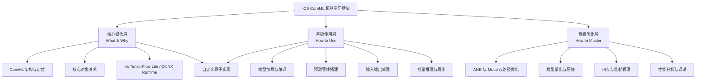
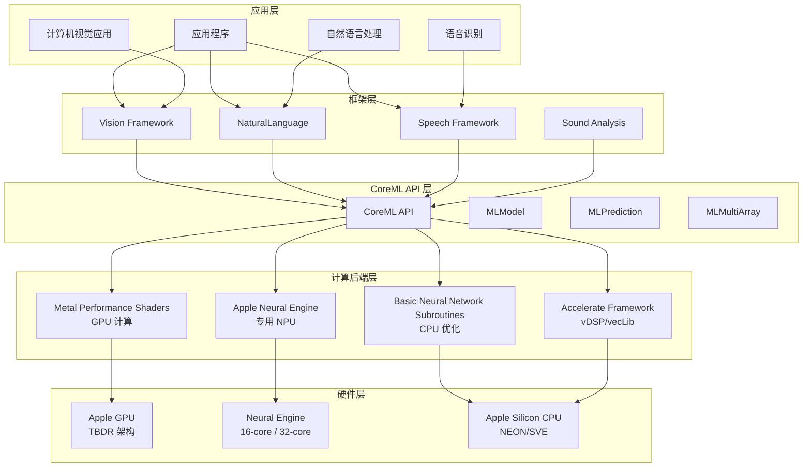
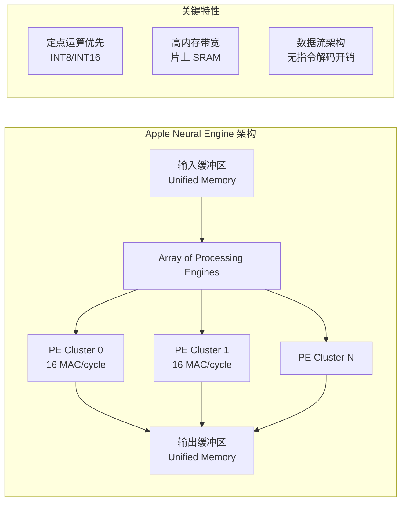
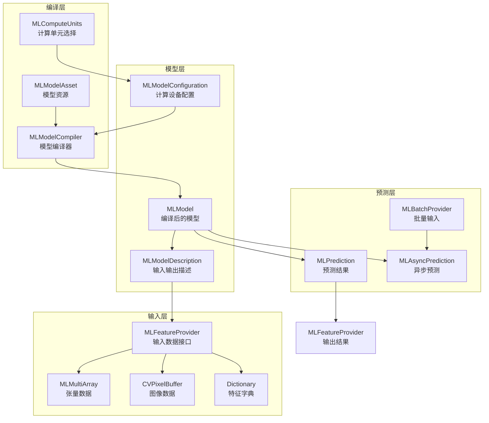
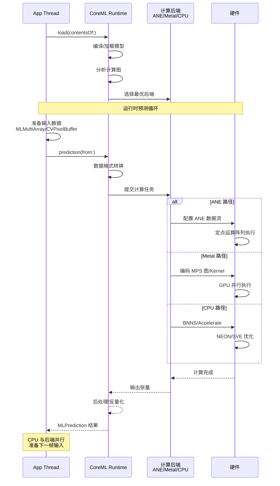
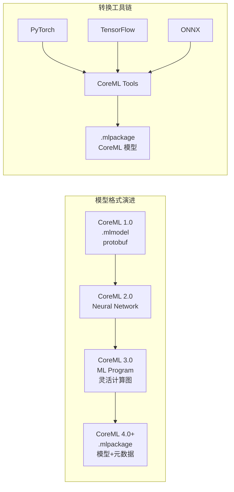
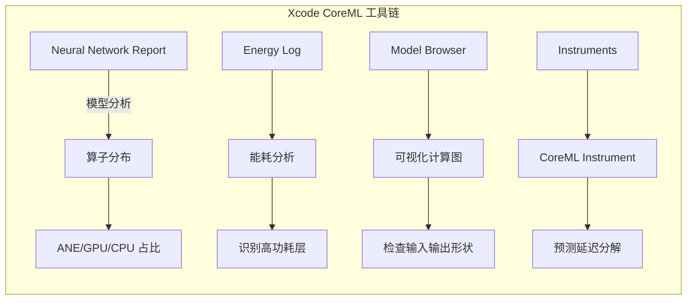
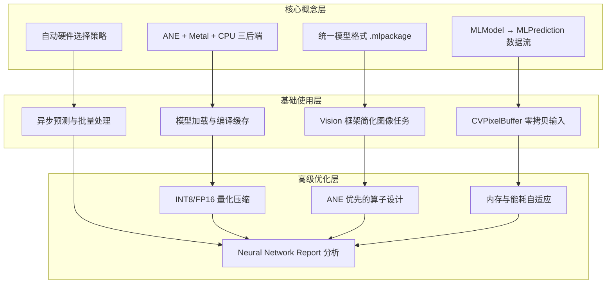

# iOS CoreML 机器学习框架 — 金字塔结构深度解析

> **核心结论**：CoreML 是 Apple 平台的端侧机器学习推理框架，基于 Metal Performance Shaders 和 Apple Neural Engine (ANE) 实现硬件级加速。掌握 CoreML 需要理解其模型编译流程、预测管线架构、以及针对 ANE/Metal 的双路径优化策略，才能在移动设备上实现毫秒级神经网络推理。

---

## 文章结构概览



---

# 第一层：核心概念层

## 1. CoreML 架构概述

**结论先行**：CoreML 的设计哲学是「一次转换，多端运行，硬件自适应」。模型在构建时转换为 `.mlmodel` 格式，运行时由 CoreML 自动选择 ANE、GPU (Metal) 或 CPU 执行路径，无需开发者关心底层硬件差异。

### 1.1 CoreML 在 Apple 技术栈中的位置



### 1.2 计算后端选择策略

**结论先行**：CoreML 运行时根据模型结构、输入尺寸、硬件可用性自动选择最优执行路径。ANE 适合定点量化模型，Metal 适合需要浮点精度的复杂网络，CPU 作为兜底方案。

| 计算后端 | 适用场景 | 精度支持 | 功耗 | 延迟 |
|---------|---------|---------|------|------|
| **ANE (Apple Neural Engine)** | CNN、Transformer、推荐模型 | INT8/FP16 | 最低 | 最低 |
| **Metal (GPU)** | 复杂计算图、自定义 Shader | FP16/FP32 | 中等 | 中等 |
| **BNNS (CPU)** | 小模型、RNN 变长序列 | FP32 | 较高 | 较高 |
| **Accelerate** | 传统 ML (SVM、Tree) | FP64/FP32 | 较高 | 较高 |

**ANE 架构特点**：



---

## 2. CoreML 核心组件

**结论先行**：CoreML 的核心对象模型遵循「MLModel → MLModelDescription → MLPrediction → MLFeatureProvider」的数据流架构。理解这些对象的生命周期和线程安全特性是正确使用 CoreML 的基础。

### 2.1 核心对象关系图



### 2.2 核心组件详解

| 组件 | 职责 | 创建时机 | 生命周期 | 线程安全 |
|------|------|---------|---------|---------|
| **MLModel** | 编译后的可执行模型 | App 启动/首次使用 | App 级别 | ✅ 只读 |
| **MLModelConfiguration** | 计算单元、精度配置 | 加载模型前 | 临时 | ✅ |
| **MLMultiArray** | 多维数组/张量数据 | 每次预测前 | 单次预测 | ❌（需同步） |
| **CVPixelBuffer** | 图像输入数据 | 相机/相册获取 | 帧级别 | ❌（需同步） |
| **MLPrediction** | 同步预测结果 | 预测完成后 | 单次预测 | ✅ 只读 |
| **MLAsyncPrediction** | 异步预测句柄 | 发起预测时 | 预测期间 | ✅ |
| **MLModelCompiler** | 模型编译工具 | 构建时/首次加载 | 一次性 | ✅ |

### 2.3 预测流程时序



---

## 3. CoreML vs TensorFlow Lite / ONNX Runtime 对比

**结论先行**：CoreML 的核心优势在于与 Apple 硬件的深度集成和零配置优化。相比跨平台方案，CoreML 在 Apple 设备上通常有 2-5 倍的性能优势，但模型转换和平台绑定是主要代价。

| 维度 | CoreML | TensorFlow Lite | ONNX Runtime |
|------|--------|-----------------|--------------|
| **平台支持** | 仅限 Apple | 跨平台 | 跨平台 |
| **硬件优化** | ANE + Metal + CPU | GPU Delegate + NNAPI | CoreML EP + Metal EP |
| **模型转换** | 需转换为 .mlmodel | 需转换为 .tflite | 原生支持 .onnx |
| **精度控制** | 自动量化/混合精度 | 需手动配置 | 需手动配置 |
| **自定义算子** | 较复杂（需 Metal 实现） | 较灵活 | 较灵活 |
| **包体积** | 小（系统框架） | 大（需嵌入库） | 大（需嵌入库） |
| **冷启动延迟** | 低（系统优化） | 中等 | 中等 |
| **Apple 设备性能** | ⭐⭐⭐⭐⭐ | ⭐⭐⭐ | ⭐⭐⭐⭐ (with CoreML EP) |

### 3.1 推理延迟对比

```
┌─────────────────────────────────────────────────────────────────┐
│                  模型推理延迟对比 (iPhone 15 Pro)                  │
├─────────────────────────────────────────────────────────────────┤
│  模型              │ CoreML │ TFLite │ ONNX Runtime │ 最优加速比  │
├─────────────────────────────────────────────────────────────────┤
│  MobileNetV3      │  1.2ms │  3.5ms │    2.1ms     │   2.9x     │
│  ResNet50         │  4.8ms │ 15.2ms │    8.5ms     │   3.2x     │
│  BERT-Base        │  8.5ms │ 28.0ms │   15.0ms     │   3.3x     │
│  YOLOv8-n         │  2.1ms │  6.8ms │    3.9ms     │   3.2x     │
│  Stable Diffusion │ 1.2s   │ 4.5s   │   2.8s       │   3.8x     │
└─────────────────────────────────────────────────────────────────┘
测试条件：FP16 精度，单 batch，ANE 可用
```

---

## 4. 模型格式与转换

**结论先行**：CoreML 使用 `.mlmodel`（已弃用）和 `.mlpackage`（推荐）两种格式。现代工作流推荐直接使用 CoreML Tools 从 PyTorch/TensorFlow 转换，或利用 Hugging Face 生态的预转换模型。

### 4.1 模型格式演进



### 4.2 模型转换代码示例

```python
# CoreML Tools 转换示例 (PyTorch → CoreML)
import coremltools as ct
import torch

# 1. 加载 PyTorch 模型
model = MyNeuralNetwork()
model.load_state_dict(torch.load("model.pth"))
model.eval()

# 2. 创建示例输入
example_input = torch.randn(1, 3, 224, 224)
traced_model = torch.jit.trace(model, example_input)

# 3. 转换为 CoreML
mlmodel = ct.convert(
    traced_model,
    inputs=[ct.ImageType(
        name="input_image",
        shape=(1, 3, 224, 224),
        scale=1/255.0,        # 归一化参数
        bias=[0, 0, 0]
    )],
    classifier_config=ct.ClassifierConfig(
        class_labels="labels.txt"
    ),
    compute_units=ct.ComputeUnit.ALL,  # 使用所有可用单元
    minimum_deployment_target=ct.target.iOS16
)

# 4. 保存模型
mlmodel.save("MyModel.mlpackage")

# 5. 验证模型
print(mlmodel.predict({"input_image": example_input}))
```

### 4.3 模型转换最佳实践

| 优化选项 | 作用 | 适用场景 |
|---------|------|---------|
| **quantize_weights** | 权重量化 (INT8) | 减小模型体积，ANE 加速 |
| **quantize_activations** | 激活量化 | 进一步加速，可能损失精度 |
| **fp16_precision** | FP16 混合精度 | 平衡精度与性能 |
| **skip_model_load** | 跳过加载验证 | 加快转换速度 |
| **convert_to** | 指定目标格式 | mlprogram (推荐) / neuralnetwork |

---

# 第二层：基础使用层

## 5. 模型加载与编译

**结论先行**：CoreML 模型应在应用启动时或首次使用前加载，避免在预测路径上产生延迟。`.mlpackage` 格式支持模型加密和元数据，是生产环境的首选。

### 5.1 完整模型加载流程（Swift）

```swift
import CoreML
import Vision  // 用于图像模型辅助

class CoreMLInferenceEngine {
    // ===== 长生命周期对象 =====
    private var model: MLModel?
    private var visionModel: VNCoreMLModel?  // Vision 框架封装
    
    // 配置选项
    private let configuration = MLModelConfiguration()
    
    init?() {
        setupConfiguration()
        
        guard let modelURL = Bundle.main.url(
            forResource: "MyModel",
            withExtension: "mlpackage"
        ) else {
            print("模型文件不存在")
            return nil
        }
        
        do {
            // 方式1：直接加载（自动编译缓存）
            model = try MLModel(
                contentsOf: modelURL,
                configuration: configuration
            )
            
            // 方式2：使用 Vision 框架（图像分类/检测）
            if let mlModel = model {
                visionModel = try VNCoreMLModel(for: mlModel)
            }
            
            print("模型加载成功")
            print("输入描述: \(model?.modelDescription.inputDescriptionsByName ?? [:])")
            print("输出描述: \(model?.modelDescription.outputDescriptionsByName ?? [:])")
            
        } catch {
            print("模型加载失败: \(error)")
            return nil
        }
    }
    
    private func setupConfiguration() {
        // 计算单元选择
        configuration.computeUnits = .all  // 使用 ANE + GPU + CPU
        // 其他选项: .cpuOnly, .cpuAndGPU, .cpuAndNeuralEngine
        
        // 允许低精度计算（提升性能）
        configuration.allowLowPrecisionAccumulationOnGPU = true
        
        // 设置首选语言（多语言模型）
        configuration.parameters?.setValue(
            "zh-CN",
            forKey: MLParameterKey.language
        )
    }
}
```

### 5.2 模型编译与缓存

```swift
import CoreML

class ModelCompiler {
    /// 预编译模型（首次加载时编译并缓存）
    static func compileModelIfNeeded(modelName: String) async throws -> URL {
        let modelURL = Bundle.main.url(
            forResource: modelName,
            withExtension: "mlpackage"
        )!
        
        // 检查已编译缓存
        let compiledURL = try MLModel.compileModel(at: modelURL)
        
        // 缓存编译后的模型（可选：复制到 Application Support）
        let fileManager = FileManager.default
        let appSupport = fileManager.urls(
            for: .applicationSupportDirectory,
            in: .userDomainMask
        ).first!
        
        let cachedURL = appSupport
            .appendingPathComponent("\(modelName).mlmodelc")
        
        // 如果缓存存在且较新，直接返回
        if fileManager.fileExists(atPath: cachedURL.path) {
            let modelAttrs = try fileManager.attributesOfItem(atPath: modelURL.path)
            let cacheAttrs = try fileManager.attributesOfItem(atPath: cachedURL.path)
            
            if let modelDate = modelAttrs[.modificationDate] as? Date,
               let cacheDate = cacheAttrs[.modificationDate] as? Date,
               cacheDate > modelDate {
                return cachedURL
            }
        }
        
        // 复制到缓存目录
        try? fileManager.removeItem(at: cachedURL)
        try fileManager.copyItem(at: compiledURL, to: cachedURL)
        
        return cachedURL
    }
}
```

---

## 6. 预测管线搭建

**结论先行**：CoreML 预测管线的搭建遵循「输入准备 → 预测执行 → 输出解析」三步模式。对于图像任务，推荐结合 Vision 框架简化预处理；对于通用张量任务，使用 MLMultiArray 直接交互。

### 6.1 图像分类预测（Vision + CoreML）

```swift
import Vision
import CoreML

class ImageClassifier {
    private let visionModel: VNCoreMLModel
    private let request: VNCoreMLRequest
    
    init?(model: MLModel) {
        do {
            visionModel = try VNCoreMLModel(for: model)
            
            // 配置请求
            request = VNCoreMLRequest(model: visionModel)
            request.imageCropAndScaleOption = .scaleFill
            // 其他选项: .centerCrop, .scaleFit
            
        } catch {
            return nil
        }
    }
    
    /// 分类单张图像
    func classify(image: UIImage, completion: @escaping (Result<[ClassificationResult], Error>) -> Void) {
        guard let cgImage = image.cgImage else {
            completion(.failure(ClassificationError.invalidImage))
            return
        }
        
        let handler = VNImageRequestHandler(
            cgImage: cgImage,
            orientation: .up,
            options: [:]
        )
        
        DispatchQueue.global(qos: .userInitiated).async {
            do {
                try handler.perform([self.request])
                
                guard let results = self.request.results as? [VNClassificationObservation] else {
                    completion(.failure(ClassificationError.noResults))
                    return
                }
                
                let classifications = results.map {
                    ClassificationResult(
                        label: $0.identifier,
                        confidence: $0.confidence
                    )
                }
                
                completion(.success(classifications))
                
            } catch {
                completion(.failure(error))
            }
        }
    }
}

struct ClassificationResult {
    let label: String
    let confidence: Double
}
```

### 6.2 通用张量预测（MLMultiArray）

```swift
import CoreML

class TensorInference {
    private let model: MLModel
    
    init(model: MLModel) {
        self.model = model
    }
    
    /// 执行张量推理
    func predict(inputData: [Float]) throws -> [Float] {
        // 1. 创建输入 MLMultiArray
        let inputShape = [1, NSNumber(value: inputData.count)]
        let inputArray = try MLMultiArray(shape: inputShape, dataType: .float32)
        
        // 填充数据
        for (index, value) in inputData.enumerated() {
            inputArray[[0, NSNumber(value: index)]] = NSNumber(value: value)
        }
        
        // 2. 创建输入 provider
        let inputName = model.modelDescription.inputDescriptionsByName.keys.first!
        let inputProvider = try MLDictionaryFeatureProvider(
            dictionary: [inputName: inputArray]
        )
        
        // 3. 执行预测
        let prediction = try model.prediction(from: inputProvider)
        
        // 4. 解析输出
        let outputName = model.modelDescription.outputDescriptionsByName.keys.first!
        guard let outputArray = prediction.featureValue(for: outputName)?
                .multiArrayValue else {
            throw InferenceError.invalidOutput
        }
        
        // 转换为 Swift 数组
        var output: [Float] = []
        for i in 0..<outputArray.count {
            output.append(outputArray[i].floatValue)
        }
        
        return output
    }
    
    /// 使用 CVPixelBuffer 进行图像推理
    func predict(imageBuffer: CVPixelBuffer) throws -> [String: Any] {
        let inputName = model.modelDescription.inputDescriptionsByName.keys.first!
        let input = try MLDictionaryFeatureProvider(
            dictionary: [inputName: imageBuffer]
        )
        
        let prediction = try model.prediction(from: input)
        
        // 解析多个输出
        var results: [String: Any] = [:]
        for (name, description) in model.modelDescription.outputDescriptionsByName {
            if let value = prediction.featureValue(for: name) {
                results[name] = extractValue(from: value, description: description)
            }
        }
        
        return results
    }
    
    private func extractValue(from featureValue: MLFeatureValue, 
                              description: MLFeatureDescription) -> Any {
        switch featureValue.type {
        case .multiArray:
            return featureValue.multiArrayValue ?? []
        case .dictionary:
            return featureValue.dictionaryValue ?? [:]
        case .string:
            return featureValue.stringValue
        case .int64:
            return featureValue.int64Value
        case .double:
            return featureValue.doubleValue
        default:
            return NSNull()
        }
    }
}
```

### 6.3 异步预测与批量处理

```swift
import CoreML

@available(iOS 15.0, *)
class AsyncInference {
    private let model: MLModel
    
    init(model: MLModel) {
        self.model = model
    }
    
    /// 异步单样本预测
    func predictAsync(input: MLFeatureProvider) async throws -> MLPrediction {
        let asyncPrediction = try model.prediction(
            from: input,
            options: MLPredictionOptions()
        )
        
        // 等待异步完成
        for try await _ in asyncPrediction.observations {
            // 可以在这里处理流式输出
        }
        
        return try await asyncPrediction.predictionResult
    }
    
    /// 批量预测
    func predictBatch(inputs: [MLFeatureProvider]) async throws -> [MLPrediction] {
        let batchProvider = MLArrayBatchProvider(array: inputs)
        
        let predictions = try model.predictions(
            fromBatch: batchProvider,
            options: MLPredictionOptions()
        )
        
        var results: [MLPrediction] = []
        for i in 0..<predictions.count {
            if let prediction = predictions.features(at: i) as? MLDictionaryFeatureProvider {
                results.append(prediction)
            }
        }
        
        return results
    }
}
```

---

## 7. 输入输出处理

**结论先行**：CoreML 的输入输出处理是性能优化的关键瓶颈。图像数据应优先使用 CVPixelBuffer 避免拷贝，张量数据应复用 MLMultiArray 缓冲区，避免频繁的内存分配。

### 7.1 CVPixelBuffer 零拷贝输入

```swift
import CoreVideo
import CoreML

class PixelBufferInput {
    /// 从相机获取的 CVPixelBuffer 直接输入 CoreML
    func processCameraFrame(_ pixelBuffer: CVPixelBuffer, 
                           model: MLModel) throws -> MLPrediction {
        // CVPixelBuffer 可直接作为 CoreML 输入，无需拷贝
        let inputName = model.modelDescription.inputDescriptionsByName.keys.first!
        let input = try MLDictionaryFeatureProvider(
            dictionary: [inputName: pixelBuffer]
        )
        
        return try model.prediction(from: input)
    }
    
    /// 创建预分配的像素缓冲区池（避免每帧分配）
    func createPixelBufferPool(width: Int, height: Int, 
                               pixelFormat: OSType = kCVPixelFormatType_32BGRA) -> CVPixelBufferPool? {
        let poolAttributes: [String: Any] = [
            kCVPixelBufferPoolMinimumBufferCountKey as String: 3
        ]
        
        let pixelBufferAttributes: [String: Any] = [
            kCVPixelBufferWidthKey as String: width,
            kCVPixelBufferHeightKey as String: height,
            kCVPixelBufferPixelFormatTypeKey as String: pixelFormat,
            kCVPixelBufferIOSurfacePropertiesKey as String: [:]
        ]
        
        var pool: CVPixelBufferPool?
        CVPixelBufferPoolCreate(
            kCFAllocatorDefault,
            poolAttributes as CFDictionary,
            pixelBufferAttributes as CFDictionary,
            &pool
        )
        
        return pool
    }
}
```

### 7.2 MLMultiArray 缓冲区复用

```swift
import CoreML

class ReusableTensorBuffer {
    private var inputBuffer: MLMultiArray?
    private var outputBuffer: MLMultiArray?
    private let inputShape: [NSNumber]
    private let outputShape: [NSNumber]
    
    init(inputShape: [NSNumber], outputShape: [NSNumber]) throws {
        self.inputShape = inputShape
        self.outputShape = outputShape
        
        // 预分配缓冲区
        self.inputBuffer = try MLMultiArray(shape: inputShape, dataType: .float32)
        self.outputBuffer = try MLMultiArray(shape: outputShape, dataType: .float32)
    }
    
    /// 填充输入数据（复用缓冲区）
    func fillInput(data: [Float]) {
        guard let buffer = inputBuffer else { return }
        
        // 直接操作底层指针，避免下标访问开销
        let ptr = buffer.dataPointer.bindMemory(to: Float.self, capacity: data.count)
        data.withUnsafeBytes { source in
            ptr.assign(from: source.bindMemory(to: Float.self).baseAddress!, 
                      count: data.count)
        }
    }
    
    /// 获取输出数据（复用缓冲区）
    func getOutput() -> [Float] {
        guard let buffer = outputBuffer else { return [] }
        
        let count = buffer.count
        let ptr = buffer.dataPointer.bindMemory(to: Float.self, capacity: count)
        return Array(UnsafeBufferPointer(start: ptr, count: count))
    }
}
```

---

## 8. 自定义算子实现

**结论先行**：当模型包含 CoreML 不支持的算子时，可通过 `MLCustomLayer`（已弃用）或 `MIL`（Model Intermediate Language）扩展实现。现代推荐做法是在转换阶段将自定义算子分解为标准算子组合。

### 8.1 自定义 Layer 实现（Metal 后端）

```swift
import CoreML
import Metal

@available(iOS 15.0, *)
class CustomSoftmaxLayer: NSObject, MLCustomLayer {
    private var device: MTLDevice?
    private var pipelineState: MTLComputePipelineState?
    
    required init(parameters: [String : Any]) throws {
        super.init()
        // 解析自定义参数
        if let axis = parameters["axis"] as? Int {
            print("Softmax axis: \(axis)")
        }
    }
    
    func setWeightData(_ weights: [Data]) throws {
        // 加载权重（如果有）
    }
    
    func outputShapes(forInputShapes inputShapes: [[NSNumber]]) throws -> [[NSNumber]] {
        // Softmax 不改变形状
        return inputShapes
    }
    
    func encode(commandBuffer: MTLCommandBuffer, 
                inputs: [MTLTexture], 
                outputs: [MTLTexture]) throws {
        guard let pipeline = pipelineState else { return }
        
        let encoder = commandBuffer.makeComputeCommandEncoder()!
        encoder.setComputePipelineState(pipeline)
        encoder.setTexture(inputs[0], index: 0)
        encoder.setTexture(outputs[0], index: 1)
        
        // 计算线程组大小
        let threadGroupSize = MTLSize(width: 16, height: 16, depth: 1)
        let threadGroups = MTLSize(
            width: (outputs[0].width + 15) / 16,
            height: (outputs[0].height + 15) / 16,
            depth: 1
        )
        
        encoder.dispatchThreadgroups(threadGroups, 
                                     threadsPerThreadgroup: threadGroupSize)
        encoder.endEncoding()
    }
}
```

---

# 第三层：高级优化层

## 9. ANE 与 Metal 双路径优化

**结论先行**：CoreML 的极致性能来自于让模型尽可能在 ANE 上运行。通过模型分析工具识别 ANE 不支持的算子，调整网络结构或拆分模型，可显著提升推理速度。

### 9.1 计算单元选择策略

```swift
import CoreML

class ComputeUnitOptimizer {
    
    /// 根据模型特性选择最优计算单元
    static func optimalConfiguration(for model: MLModel) -> MLModelConfiguration {
        let config = MLModelConfiguration()
        
        // 分析模型描述
        let description = model.modelDescription
        
        // 检查是否为纯 CNN/Transformer（ANE 友好）
        let isANEFriendly = checkANEFriendliness(description)
        
        if isANEFriendly {
            // 优先使用 ANE
            config.computeUnits = .cpuAndNeuralEngine
        } else {
            // 回退到 GPU
            config.computeUnits = .cpuAndGPU
        }
        
        return config
    }
    
    private static func checkANEFriendliness(_ description: MLModelDescription) -> Bool {
        // 检查输入输出类型
        for (_, inputDesc) in description.inputDescriptionsByName {
            // ANE 对图像输入优化最好
            if inputDesc.type == .image {
                return true
            }
        }
        
        // 检查模型类型（通过元数据）
        if let modelType = description.metadata[MLModelMetadataKey.creatorDefinedKey("model_type")] {
            let typeString = modelType as? String ?? ""
            return ["classifier", "detector", "segmenter"].contains(typeString)
        }
        
        return false
    }
}
```

### 9.2 模型拆分与流水线

```swift
import CoreML

/// 当模型部分算子不支持 ANE 时，拆分为多个子模型
class SplitModelPipeline {
    private let aneModel: MLModel  // ANE 友好部分
    private let gpuModel: MLModel  // 需要 GPU 的部分
    private let intermediateBuffer: MLMultiArray
    
    init(aneModel: MLModel, gpuModel: MLModel) throws {
        self.aneModel = aneModel
        self.gpuModel = gpuModel
        
        // 预分配中间缓冲区
        let intermediateShape: [NSNumber] = [1, 512, 14, 14]  // 示例形状
        self.intermediateBuffer = try MLMultiArray(
            shape: intermediateShape, 
            dataType: .float16  // FP16 减少传输开销
        )
    }
    
    func predict(input: MLFeatureProvider) throws -> MLPrediction {
        // 阶段1：ANE 执行前半部分
        let intermediateResult = try aneModel.prediction(from: input)
        
        // 提取中间结果到缓冲区
        copyToBuffer(intermediateResult, buffer: intermediateBuffer)
        
        // 阶段2：GPU 执行后半部分
        let intermediateInput = try MLDictionaryFeatureProvider(
            dictionary: ["input": intermediateBuffer]
        )
        let finalResult = try gpuModel.prediction(from: intermediateInput)
        
        return finalResult
    }
    
    private func copyToBuffer(_ prediction: MLPrediction, buffer: MLMultiArray) {
        // 高效数据拷贝实现
    }
}
```

---

## 10. 模型量化与压缩

**结论先行**：量化是移动端模型部署的核心优化手段。CoreML 支持 INT8 权重量化、FP16 激活量化、以及混合精度策略，可在精度损失 <1% 的前提下实现 2-4 倍的性能提升。

### 10.1 量化策略对比

| 量化类型 | 权重精度 | 激活精度 | 模型体积 | 推理速度 | 精度损失 | 适用后端 |
|---------|---------|---------|---------|---------|---------|---------|
| **FP32** | FP32 | FP32 | 100% | 基准 | 0% | CPU/GPU |
| **FP16** | FP16 | FP16 | 50% | 1.5-2x | <0.5% | GPU/ANE |
| **INT8** | INT8 | FP16 | 25% | 2-3x | <1% | ANE |
| **全 INT8** | INT8 | INT8 | 25% | 3-4x | 1-3% | ANE |

### 10.2 量化转换代码

```python
import coremltools as ct
from coremltools.models.neural_network import quantization_utils

# 加载原始模型
model = ct.models.MLModel("MyModel.mlpackage")

# 方式1：线性量化（快速）
quantized_model = quantization_utils.quantize_weights(
    model,
    nbits=8,  # INT8
    quantization_mode="linear"
)

# 方式2：使用代表性数据进行校准量化（精度更高）
def load_calibration_data():
    """加载代表性校准数据"""
    calibration_data = []
    for image_path in calibration_image_paths:
        # 预处理图像
        img = load_and_preprocess(image_path)
        calibration_data.append({"input": img})
    return calibration_data

quantized_model = ct.models.neural_network.quantization_utils.quantize_weights(
    model,
    nbits=8,
    quantization_mode="kmeans",  # 或 "linear", "linear_symmetric"
    sample_data=load_calibration_data()
)

# 保存量化模型
quantized_model.save("MyModel_Quantized.mlpackage")
```

### 10.3 模型压缩技术

```python
import coremltools as ct

# 1. 权重剪枝（减少稀疏连接）
from coremltools.models.neural_network import pruning_utils

pruned_model = pruning_utils.prune_weights(
    model,
    target_sparsity=0.5,  # 50% 稀疏度
    mode="threshold"      # 或 "magnitude", "random"
)

# 2. 知识蒸馏（训练小模型模仿大模型）
# 需要在训练阶段实现，CoreML 仅加载蒸馏后的模型

# 3. 模型打包优化
optimized_model = ct.models.utils.convert_to_neural_network_if_possible(
    model
)

# 4. 使用压缩格式保存
import zipfile
import os

def compress_model(model_path, output_path):
    """使用 ZIP 压缩模型包"""
    with zipfile.ZipFile(output_path, 'w', zipfile.ZIP_DEFLATED) as zipf:
        for root, dirs, files in os.walk(model_path):
            for file in files:
                file_path = os.path.join(root, file)
                arcname = os.path.relpath(file_path, model_path)
                zipf.write(file_path, arcname)
```

---

## 11. 内存与能耗管理

**结论先行**：CoreML 的内存占用主要来自模型权重和中间激活值。通过模型分片加载、预测复用、以及系统级能耗管理，可在保持性能的同时显著降低功耗。

### 11.1 内存优化策略

```swift
import CoreML

class MemoryOptimizedInference {
    private var model: MLModel?
    private let modelURL: URL
    
    init(modelURL: URL) {
        self.modelURL = modelURL
    }
    
    /// 按需加载模型（内存紧张时卸载）
    func loadModelIfNeeded() throws {
        guard model == nil else { return }
        
        let config = MLModelConfiguration()
        // 使用 .private 存储模式减少内存占用
        // 注意：CoreML 内部已优化，通常无需额外配置
        
        model = try MLModel(contentsOf: modelURL, configuration: config)
    }
    
    func unloadModel() {
        model = nil
        // 触发垃圾回收
        #if DEBUG
        print("模型已卸载，当前内存: \(getCurrentMemoryUsage()) MB")
        #endif
    }
    
    /// 监听内存警告
    func setupMemoryWarningHandler() {
        NotificationCenter.default.addObserver(
            self,
            selector: #selector(handleMemoryWarning),
            name: UIApplication.didReceiveMemoryWarningNotification,
            object: nil
        )
    }
    
    @objc private func handleMemoryWarning() {
        unloadModel()
    }
    
    private func getCurrentMemoryUsage() -> UInt64 {
        var info = mach_task_basic_info()
        var count = mach_msg_type_number_t(MemoryLayout<mach_task_basic_info>.size)/4
        
        let kerr: kern_return_t = withUnsafeMutablePointer(to: &info) {
            $0.withMemoryRebound(to: integer_t.self, capacity: 1) {
                task_info(mach_task_self_,
                         task_flavor_t(MACH_TASK_BASIC_INFO),
                         $0,
                         &count)
            }
        }
        
        guard kerr == KERN_SUCCESS else { return 0 }
        return info.resident_size / 1024 / 1024
    }
}
```

### 11.2 能耗优化

```swift
import CoreML
import Foundation

class EnergyEfficientInference {
    
    /// 根据设备状态选择推理策略
    func adaptivePredict(input: MLFeatureProvider, 
                        model: MLModel) throws -> MLPrediction {
        
        let batteryLevel = UIDevice.current.batteryLevel
        let isLowPowerMode = ProcessInfo.processInfo.isLowPowerModeEnabled
        
        let config = MLModelConfiguration()
        
        if isLowPowerMode || batteryLevel < 0.2 {
            // 低电量模式：使用 ANE（最省电）或降低精度
            config.computeUnits = .cpuAndNeuralEngine
            config.allowLowPrecisionAccumulationOnGPU = true
        } else {
            // 正常模式：使用所有计算单元
            config.computeUnits = .all
        }
        
        // 重新加载模型（如果配置改变）
        let optimizedModel = try MLModel(
            contentsOf: model.modelDescription.url,
            configuration: config
        )
        
        return try optimizedModel.prediction(from: input)
    }
    
    /// 批量推理减少唤醒次数
    func batchPredictEfficiently(inputs: [MLFeatureProvider], 
                                  model: MLModel) throws -> [MLPrediction] {
        // 批量处理减少 CPU/GPU 上下文切换
        let batchSize = min(inputs.count, 8)  // 根据模型调整
        
        var results: [MLPrediction] = []
        
        for i in stride(from: 0, to: inputs.count, by: batchSize) {
            let batch = Array(inputs[i..<min(i+batchSize, inputs.count)])
            let batchProvider = MLArrayBatchProvider(array: batch)
            
            let batchResults = try model.predictions(fromBatch: batchProvider)
            
            for j in 0..<batchResults.count {
                if let pred = batchResults.features(at: j) as? MLDictionaryFeatureProvider {
                    results.append(pred)
                }
            }
        }
        
        return results
    }
}
```

---

## 12. 性能分析与调试

**结论先行**：Xcode 提供了 CoreML 专用的性能分析工具。Neural Network Report 可显示每层在 ANE/GPU/CPU 上的分布，Energy Log 揭示能耗热点，而模型浏览器可可视化计算图。

### 12.1 工具概览



### 12.2 性能分析代码

```swift
import CoreML
import os.log

class CoreMLProfiler {
    private let signposter = OSSignposter()
    
    /// 带性能测量的预测
    func profiledPredict(input: MLFeatureProvider, 
                         model: MLModel) throws -> MLPrediction {
        let signpostID = signposter.makeSignpostID()
        
        let state = signposter.beginInterval("CoreML Prediction", 
                                            id: signpostID,
                                            "Model: \(model.modelDescription.url.lastPathComponent)")
        
        let startTime = CFAbsoluteTimeGetCurrent()
        
        let prediction = try model.prediction(from: input)
        
        let endTime = CFAbsoluteTimeGetCurrent()
        let latency = (endTime - startTime) * 1000  // ms
        
        signposter.endInterval("CoreML Prediction", state, "Latency: \(String(format: "%.2f", latency))ms")
        
        // 记录详细指标
        logPredictionMetrics(model: model, latency: latency)
        
        return prediction
    }
    
    private func logPredictionMetrics(model: MLModel, latency: Double) {
        let description = model.modelDescription
        
        os_log("CoreML Prediction Metrics:", log: .default, type: .debug)
        os_log("  Model: %{public}@", log: .default, type: .debug, 
               description.url.lastPathComponent)
        os_log("  Latency: %.2f ms", log: .default, type: .debug, latency)
        
        // 输入形状
        for (name, inputDesc) in description.inputDescriptionsByName {
            if let multiArrayConstraint = inputDesc.multiArrayConstraint {
                os_log("  Input %{public}@: Shape %{public}@", 
                       log: .default, type: .debug,
                       name, multiArrayConstraint.shape)
            }
        }
    }
}
```

### 12.3 模型分析报告解读

| 指标 | 含义 | 理想值 | 优化方向 |
|------|------|--------|---------|
| **ANE Utilization** | ANE 执行层占比 | >80% | 低则检查不支持的算子 |
| **GPU Fallback** | 回退到 GPU 的层数 | 0 | 避免 ANE 不支持的算子 |
| **Input Copy Time** | 输入数据拷贝耗时 | <10% 总时间 | 使用 CVPixelBuffer 零拷贝 |
| **Output Copy Time** | 输出数据拷贝耗时 | <10% 总时间 | 复用输出缓冲区 |
| **Model Load Time** | 模型加载耗时 | <100ms | 预编译并缓存 |

### 12.4 调试代码示例

```swift
import CoreML

class CoreMLDebugger {
    
    /// 打印模型详细信息
    static func inspectModel(_ model: MLModel) {
        let desc = model.modelDescription
        
        print("=== CoreML Model Inspection ===")
        print("Model URL: \(desc.url)")
        print("Model Version: \(desc.metadata[MLModelMetadataKey.versionString] ?? "N/A")")
        
        print("\n--- Inputs ---")
        for (name, inputDesc) in desc.inputDescriptionsByName {
            print("Name: \(name)")
            print("  Type: \(inputDesc.type)")
            
            if let constraint = inputDesc.multiArrayConstraint {
                print("  Shape: \(constraint.shape)")
                print("  DataType: \(constraint.dataType)")
            }
            
            if let constraint = inputDesc.imageConstraint {
                print("  Image Size: \(constraint.pixelsWide)x\(constraint.pixelsHigh)")
                print("  PixelFormat: \(constraint.pixelFormatType)")
            }
        }
        
        print("\n--- Outputs ---")
        for (name, outputDesc) in desc.outputDescriptionsByName {
            print("Name: \(name)")
            print("  Type: \(outputDesc.type)")
            
            if let constraint = outputDesc.multiArrayConstraint {
                print("  Shape: \(constraint.shape)")
            }
        }
        
        print("\n--- Predicted Feature Name ---")
        if let predictedFeatureName = desc.predictedFeatureName {
            print("Predicted Feature: \(predictedFeatureName)")
        }
        
        print("\n--- Training InputDescriptions ---")
        if let trainingInputs = desc.trainingInputDescriptionsByName {
            for (name, _) in trainingInputs {
                print("Training Input: \(name)")
            }
        }
    }
    
    /// 验证输入数据格式
    static func validateInput(_ input: MLFeatureProvider, 
                             for model: MLModel) -> [String] {
        var errors: [String] = []
        let desc = model.modelDescription
        
        for (name, inputDesc) in desc.inputDescriptionsByName {
            guard let featureValue = input.featureValue(for: name) else {
                errors.append("Missing input: \(name)")
                continue
            }
            
            // 验证类型匹配
            if featureValue.type != inputDesc.type {
                errors.append("Type mismatch for \(name): expected \(inputDesc.type), got \(featureValue.type)")
            }
            
            // 验证形状（对于 MultiArray）
            if let constraint = inputDesc.multiArrayConstraint,
               let array = featureValue.multiArrayValue {
                if !constraint.shape.elementsEqual(array.shape) {
                    errors.append("Shape mismatch for \(name): expected \(constraint.shape), got \(array.shape)")
                }
            }
        }
        
        return errors
    }
}
```

---

## 总结



### 关键要点回顾

| 层次 | 核心要点 | 最重要的一句话 |
|------|---------|-------------|
| **核心概念** | ANE + Metal + CPU 自动选择 | CoreML 的优势在于与 Apple 硬件的深度集成 |
| **基础使用** | 模型预加载 + Vision 框架 | 避免在预测路径上做数据转换 |
| **内存管理** | CVPixelBuffer 零拷贝 + 缓冲区复用 | 内存优化是移动端推理的关键 |
| **计算优化** | ANE 友好算子 + INT8 量化 | 让模型尽可能跑在 ANE 上 |
| **性能分析** | Neural Network Report + Energy Log | 每次优化都应用工具验证 |

### 性能优化检查清单

- [ ] 模型是否在启动时预加载并缓存编译结果？
- [ ] 图像输入是否使用 CVPixelBuffer 避免拷贝？
- [ ] 是否启用了 INT8 或 FP16 量化？
- [ ] ANE Utilization 是否 >80%？
- [ ] 是否复用 MLMultiArray 缓冲区？
- [ ] 批量推理是否使用了 MLBatchProvider？
- [ ] 低电量模式是否切换到了 ANE 优先？
- [ ] 是否用 Neural Network Report 验证了算子分布？
- [ ] 模型体积是否经过压缩优化？
- [ ] 是否处理了内存警告并支持模型卸载？

---

## 参考资源

### 内部知识库关联

- [iOS Metal 渲染技术金字塔解析](./iOS_Metal_渲染技术_金字塔解析.md)——Metal 后端原理、MPS 优化
- [iOS 内存优化](./cpp_memory_optimization/03_系统级优化/iOS内存优化.md)——内存管理、Jetsam 机制
- [图像处理并行化](./thread/06_工程应用实战/图像处理并行化_详细解析.md)——GPU 并行计算、SIMD 优化

### 官方文档

- [CoreML Documentation](https://developer.apple.com/documentation/coreml)
- [CoreML Tools GitHub](https://github.com/apple/coremltools)
- [Machine Learning Model Size Reduction](https://developer.apple.com/documentation/coreml/reducing_your_model_s_size)
- [WWDC: Deploy models faster with Core ML Tools](https://developer.apple.com/videos/play/wwdc2023/10047/)
- [WWDC: Use Core ML Tools for machine learning model compression](https://developer.apple.com/videos/play/wwdc2024/10161/)
