# Apple 框架生态全景与战略定位 — 详细解析

> **核心结论**：Apple 框架生态采用分层架构设计（Cocoa Touch → Media → Core Services → Core OS），以 Swift 语言演进为引擎，推动 UIKit 向 SwiftUI 的声明式转型、GCD 向 Swift Concurrency 的结构化并发迁移。理解各框架的战略定位、版本演进时间线、以及 Apple 投入重点，是 iOS 开发者技术选型和长期职业规划的关键。

---

## 文章结构概览

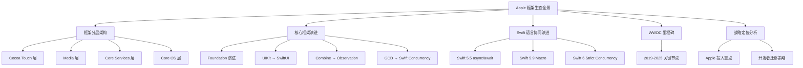

---

# 第一章：Apple 框架分层架构

## 1.1 四层架构全景图

**结论先行**：Apple 框架生态采用清晰的四层架构，从底层的硬件抽象到上层的应用开发，每层都有明确的职责边界和依赖关系。上层框架可以调用下层框架，反之则不成立。

```mermaid
graph TB
    subgraph Cocoa Touch Layer
        UIKIT[UIKit]
        SWIFTUI[SwiftUI]
        MAPKIT[MapKit]
        PUSHKIT[PushKit]
        MESSAGE[MessageUI]
        NOTIFICATION[NotificationCenter]
    end
    
    subgraph Media Layer
        AVFOUNDATION[AVFoundation]
        COREVIDEO[Core Video]
        COREAUDIO[Core Audio]
        OPENGLES[OpenGL ES]
        METAL[Metal]
        COREANIMATION[Core Animation]
        COREGRAPHICS[Core Graphics]
        CORETEXT[Core Text]
        COREIMAGE[Core Image]
        VISION[Vision]
        SPEECH[Speech]
    end
    
    subgraph Core Services Layer
        FOUNDATION[Foundation]
        COREDATA[Core Data]
        COREML[Core ML]
        CLOUDKIT[CloudKit]
        ACCOUNTS[Accounts]
        SOCIAL[Social]
        STOREKIT[StoreKit]
        CORELOCATION[Core Location]
        SECURITY[Security]
        SYSTEMCONFIG[System Configuration]
    end
    
    subgraph Core OS Layer
        ACCELERATE[Accelerate]
        COREBLUETOOTH[Core Bluetooth]
        EXTERNALACCESSORY[External Accessory]
        LOCALAUTH[Local Authentication]
        NETWORK[Network.framework]
        KERNELMATH[Kernel Math]
        LIBDISPATCH[libdispatch]
        OSLOG[OSLog]
    end
    
    subgraph Hardware Abstraction
        KERNEL[Darwin Kernel]
        DRIVER[Device Drivers]
        GPU[Apple GPU]
        ANE[Neural Engine]
        CPU[Apple Silicon CPU]
    end
    
    UIKIT --> COREANIMATION
    SWIFTUI --> COREANIMATION
    SWIFTUI --> FOUNDATION
    UIKIT --> FOUNDATION
    
    COREANIMATION --> METAL
    COREANIMATION --> OPENGLES
    COREGRAPHICS --> CORETEXT
    COREIMAGE --> METAL
    VISION --> COREML
    SPEECH --> COREML
    AVFOUNDATION --> COREAUDIO
    AVFOUNDATION --> COREVIDEO
    
    COREML --> ACCELERATE
    COREML --> METAL
    COREDATA --> FOUNDATION
    CLOUDKIT --> FOUNDATION
    
    FOUNDATION --> LIBDISPATCH
    FOUNDATION --> OSLOG
    NETWORK --> KERNEL
    COREBLUETOOTH --> DRIVER
    
    METAL --> GPU
    COREML --> ANE
    ACCELERATE --> CPU
    KERNELMATH --> CPU
```

### 1.2 各层职责详解

| 层级 | 核心框架 | 职责定位 | 开发者接触频率 |
|------|---------|---------|---------------|
| **Cocoa Touch** | UIKit、SwiftUI、MapKit | 应用界面、用户交互、系统服务集成 | ⭐⭐⭐⭐⭐ 最高 |
| **Media** | AVFoundation、Metal、Core Animation | 音视频处理、图形渲染、计算机视觉 | ⭐⭐⭐⭐ 高 |
| **Core Services** | Foundation、Core Data、Core ML | 数据持久化、机器学习、网络服务 | ⭐⭐⭐⭐ 高 |
| **Core OS** | Accelerate、Network、libdispatch | 高性能计算、底层网络、并发原语 | ⭐⭐⭐ 中 |

---

## 1.2 Cocoa Touch Layer — 应用开发核心

**结论先行**：Cocoa Touch 是 iOS 开发者最频繁接触的框架层，承载应用界面构建、用户交互处理、以及系统服务集成。UIKit 与 SwiftUI 的双轨并行是 Apple 当前的战略重点。

### UIKit 架构组件

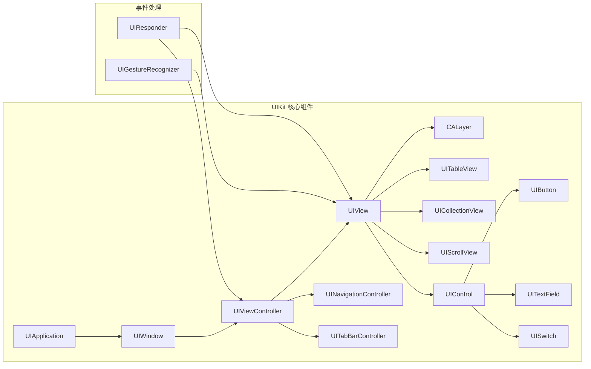

### SwiftUI 声明式架构

```mermaid
graph TB
    subgraph SwiftUI 架构
        APP_SUI[App Protocol] --> SCENE[Scene]
        SCENE --> WINDOWGROUP[WindowGroup]
        WINDOWGROUP --> VIEW_SUI[View]
        
        VIEW_SUI --> STATE[@State]
        VIEW_SUI --> OBSOBJ[@ObservedObject]
        VIEW_SUI --> STATEOBJ[@StateObject]
        VIEW_SUI --> ENV[@Environment]
        VIEW_SUI --> BINDING[@Binding]
        
        STATE --> PROPERTY[Property Wrapper]
        OBSOBJ --> PROPERTY
        STATEOBJ --> PROPERTY
        ENV --> PROPERTY
        BINDING --> PROPERTY
    end
    
    subgraph 与 UIKit 桥接
        UIViewRepresentable --> UIKit
        UIViewControllerRepresentable --> UIKit
    end
```

---

# 第二章：核心框架版本演进

## 2.1 Foundation 框架演进时间线

**结论先行**：Foundation 是 Apple 平台的基石框架，从 Objective-C 时代延续至今。Swift 重写（Swift 3）和 Swift 原生类型桥接（Swift 5）是两大里程碑，大幅提升了 Swift 开发者的使用体验。

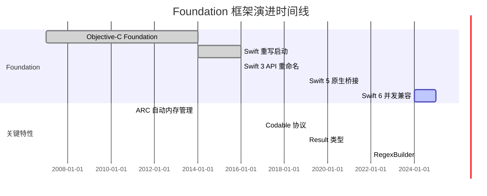

### Foundation 核心组件演进

| 版本 | 年份 | 关键变化 | 影响 |
|------|------|---------|------|
| iOS 2.0 | 2008 | 引入 NSOperationQueue | 多线程编程基础 |
| iOS 4.0 | 2010 | Grand Central Dispatch | 系统级并发支持 |
| iOS 5.0 | 2011 | ARC 自动内存管理 | 消除手动 retain/release |
| Swift 3 | 2016 | API 命名规范统一 | 去除 NS 前缀，驼峰命名 |
| Swift 4 | 2017 | Codable 协议 | 序列化/反序列化简化 |
| Swift 5 | 2019 | 原生类型桥接 | String ↔ NSString 零拷贝 |
| Swift 5.5 | 2021 | async/await 支持 | 异步 Foundation API |
| Swift 6 | 2024 | Strict Concurrency | 线程安全检查 |

---

## 2.2 UIKit 与 SwiftUI 演进对比

**结论先行**：UIKit 向 SwiftUI 的演进是 Apple UI 框架的战略转型。UIKit 以 15 年积累提供完整功能覆盖，SwiftUI 以声明式语法和跨平台能力代表未来方向。Apple 采取双轨并行策略，而非简单替代。

### UIKit 演进时间线

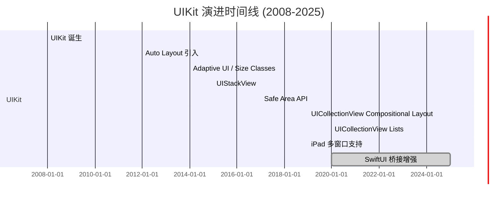

### SwiftUI 演进时间线

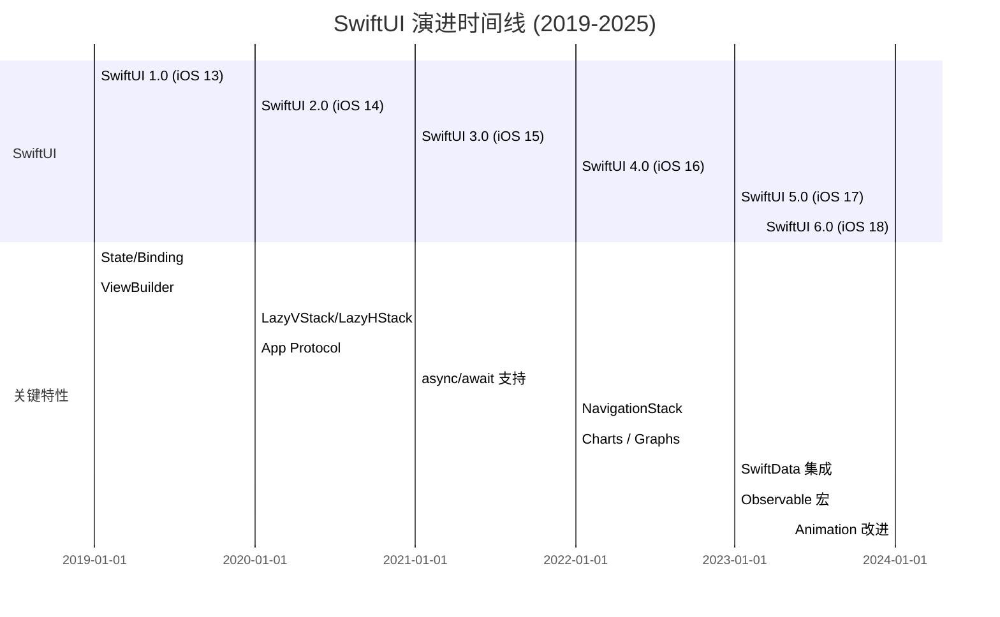

### SwiftUI 版本特性详细对比

| 版本 | iOS 版本 | 关键特性 | 代码示例 |
|------|---------|---------|---------|
| **SwiftUI 1.0** | iOS 13 | 声明式语法基础 | `@State`, `@Binding`, `List`, `NavigationView` |
| **SwiftUI 2.0** | iOS 14 | 应用生命周期、Lazy 容器 | `App`, `Scene`, `LazyVStack`, `Toolbar` |
| **SwiftUI 3.0** | iOS 15 | 异步支持、搜索增强 | `.task`, `.searchable`, `AsyncImage`, `Material` |
| **SwiftUI 4.0** | iOS 16 | 导航重构、图表 | `NavigationStack`, `Charts`, `Grid` |
| **SwiftUI 5.0** | iOS 17 | 数据流重构、动画增强 | `@Observable`, `SwiftData`, `PhaseAnimator` |
| **SwiftUI 6.0** | iOS 18 | 视觉特效、跨平台 | `MeshGradient`, `EntryView`, visionOS 增强 |

---

## 2.3 SwiftUI vs UIKit 战略定位对比

**结论先行**：SwiftUI 是 Apple 的长期战略方向，但 UIKit 将在未来 5-10 年内继续共存。新功能优先在 SwiftUI 实现，UIKit 通过桥接获得能力；复杂自定义 UI 和性能敏感场景仍需 UIKit。

### 架构对比

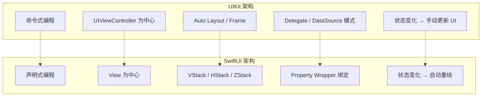

### 功能覆盖对比表

| 维度 | UIKit | SwiftUI | 推荐选择 |
|------|-------|---------|---------|
| **成熟度** | ⭐⭐⭐⭐⭐ 15年积累 | ⭐⭐⭐⭐ 6年发展 | 复杂场景选 UIKit |
| **开发效率** | ⭐⭐⭐ 样板代码多 | ⭐⭐⭐⭐⭐ 简洁声明式 | 新项目优先 SwiftUI |
| **自定义能力** | ⭐⭐⭐⭐⭐ 完全控制 | ⭐⭐⭐⭐ 大部分可覆盖 | 深度自定义选 UIKit |
| **跨平台** | ⭐⭐ iOS only | ⭐⭐⭐⭐⭐ iOS/macOS/tvOS/visionOS | 多平台选 SwiftUI |
| **性能** | ⭐⭐⭐⭐⭐ 最优 | ⭐⭐⭐⭐ 接近原生 | 极致性能选 UIKit |
| **调试体验** | ⭐⭐⭐⭐⭐ 成熟工具链 | ⭐⭐⭐⭐ 持续改进 | 复杂调试选 UIKit |
| **第三方生态** | ⭐⭐⭐⭐⭐ 丰富 | ⭐⭐⭐⭐ 快速增长 | 依赖第三方选 UIKit |

### 代码对比示例

```swift
// UIKit: 命令式编程 (iOS 13+)
class CounterViewController: UIViewController {
    private var count = 0
    private let label = UILabel()
    private let button = UIButton()
    
    override func viewDidLoad() {
        super.viewDidLoad()
        setupUI()
        updateUI()
    }
    
    private func setupUI() {
        label.translatesAutoresizingMaskIntoConstraints = false
        button.translatesAutoresizingMaskIntoConstraints = false
        view.addSubview(label)
        view.addSubview(button)
        
        NSLayoutConstraint.activate([
            label.centerXAnchor.constraint(equalTo: view.centerXAnchor),
            label.centerYAnchor.constraint(equalTo: view.centerYAnchor),
            button.topAnchor.constraint(equalTo: label.bottomAnchor, constant: 20),
            button.centerXAnchor.constraint(equalTo: view.centerXAnchor)
        ])
        
        button.setTitle("Increment", for: .normal)
        button.addTarget(self, action: #selector(increment), for: .touchUpInside)
    }
    
    @objc private func increment() {
        count += 1
        updateUI()  // 手动更新 UI
    }
    
    private func updateUI() {
        label.text = "Count: \(count)"
    }
}
```

```swift
// SwiftUI: 声明式编程 (iOS 13+)
import SwiftUI

struct CounterView: View {
    @State private var count = 0  // 状态声明
    
    var body: some View {
        VStack(spacing: 20) {
            Text("Count: \(count)")
            Button("Increment") {
                count += 1  // 状态变化自动触发重绘
            }
        }
    }
}
```

---

## 2.4 Combine 与 Observation 演进

**结论先行**：Combine 是 Apple 的响应式编程框架（2019），Observation 是 Swift 5.9 引入的轻量级观察机制（2023）。Observation 通过宏实现编译期优化，是数据流管理的未来方向，但 Combine 在复杂异步流处理中仍有价值。

### 演进时间线

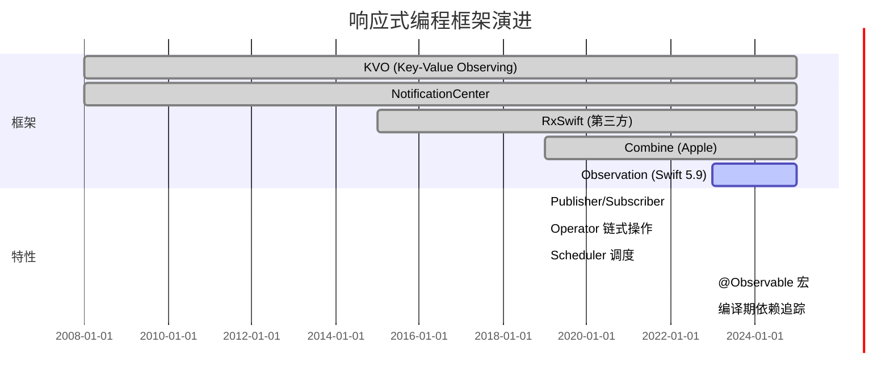

### Combine vs Observation 对比

| 维度 | Combine | Observation | 适用场景 |
|------|---------|-------------|---------|
| **引入时间** | iOS 13 (2019) | iOS 17 (2023) | - |
| **核心概念** | Publisher/Subscriber | @Observable 宏 | - |
| **学习曲线** | 陡峭（函数式概念） | 平缓（自然语法） | 新手选 Observation |
| **性能** | 运行时订阅管理 | 编译期依赖追踪 | 高频更新选 Observation |
| **复杂流处理** | ⭐⭐⭐⭐⭐ 丰富 Operator | ⭐⭐ 基础观察 | 复杂异步流选 Combine |
| **与 SwiftUI 集成** | 需 ObservableObject | 原生支持 | SwiftUI 选 Observation |
| **向后兼容** | iOS 13+ | iOS 17+ | 旧版本选 Combine |

### Observation 代码示例 (iOS 17+)

```swift
import SwiftUI
import Observation

// 使用 @Observable 宏替代 ObservableObject
@Observable
class ViewModel {
    var count = 0
    var userName = ""
    
    // 无需 @Published，所有属性自动可观察
    func increment() {
        count += 1
    }
}

struct ContentView: View {
    let viewModel = ViewModel()  // 无需 @StateObject
    
    var body: some View {
        VStack {
            Text("Count: \(viewModel.count)")
            Button("Increment") {
                viewModel.increment()
            }
            
            // 只有 count 变化时，这部分才会重绘
            CounterDisplay(count: viewModel.count)
        }
    }
}

struct CounterDisplay: View {
    let count: Int
    
    var body: some View {
        Text("Current: \(count)")
            .font(.largeTitle)
    }
}
```

### Combine 代码示例 (iOS 13+)

```swift
import Combine
import SwiftUI

// 传统 Combine 方式
class LegacyViewModel: ObservableObject {
    @Published var count = 0
    @Published var userName = ""
    
    private var cancellables = Set<AnyCancellable>()
    
    init() {
        // 复杂流处理：防抖 + 过滤
        $userName
            .debounce(for: .milliseconds(300), scheduler: DispatchQueue.main)
            .filter { !$0.isEmpty }
            .sink { [weak self] name in
                self?.validateUserName(name)
            }
            .store(in: &cancellables)
    }
    
    private func validateUserName(_ name: String) {
        // 验证逻辑
    }
}
```

---

## 2.5 Swift Concurrency 演进

**结论先行**：Swift Concurrency（async/await）是 Apple 对 GCD 的现代化替代，从 Swift 5.5 引入到 Swift 6 的 Strict Concurrency，标志着 iOS 并发编程进入结构化、类型安全的新阶段。

### 演进时间线

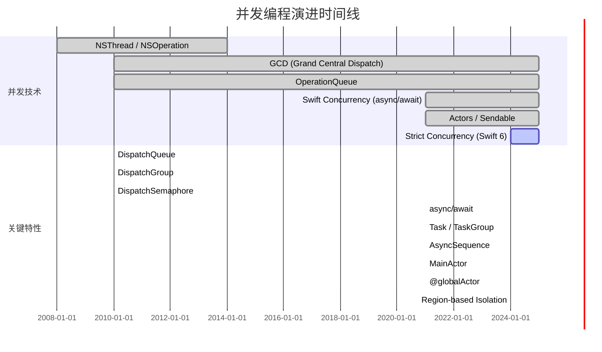

### GCD vs Swift Concurrency 对比

| 维度 | GCD | Swift Concurrency | 推荐选择 |
|------|-----|-------------------|---------|
| **API 风格** | C 风格，基于 block | Swift 原生，async/await | 新项目选 Swift Concurrency |
| **可读性** | 回调嵌套，复杂 | 顺序执行，直观 | Swift Concurrency |
| **错误处理** | 手动传递 Error | 原生 throw/catch | Swift Concurrency |
| **取消机制** | 手动管理 DispatchWorkItem | 结构化取消 Task | Swift Concurrency |
| **线程安全** | 手动管理 | Actor 隔离 + Sendable | Swift Concurrency |
| **向后兼容** | iOS 4+ | iOS 13+ | 旧版本用 GCD |
| **性能** | 最优（底层） | 接近最优（编译器优化） | 极致性能用 GCD |

### Swift Concurrency 代码示例 (iOS 15+)

```swift
import Foundation

// 定义 Actor 保证线程安全
actor DataCache {
    private var cache: [String: Data] = [:]
    
    func get(_ key: String) -> Data? {
        return cache[key]
    }
    
    func set(_ key: String, value: Data) {
        cache[key] = value
    }
}

// 网络请求服务
struct APIService {
    // async/await 替代回调
    func fetchUser(id: Int) async throws -> User {
        let url = URL(string: "https://api.example.com/users/\(id)")!
        let (data, _) = try await URLSession.shared.data(from: url)
        return try JSONDecoder().decode(User.self, from: data)
    }
    
    // 并行请求多个资源
    func fetchDashboardData() async throws -> DashboardData {
        async let userTask = fetchUser(id: 1)
        async let postsTask = fetchPosts()
        async let notificationsTask = fetchNotifications()
        
        // 等待所有并行任务完成
        let user = try await userTask
        let posts = try await postsTask
        let notifications = try await notificationsTask
        
        return DashboardData(user: user, posts: posts, notifications: notifications)
    }
    
    private func fetchPosts() async throws -> [Post] { [] }
    private func fetchNotifications() async throws -> [Notification] { [] }
}

// ViewModel 中使用
@MainActor
class UserViewModel: ObservableObject {
    @Published var user: User?
    @Published var isLoading = false
    @Published var error: Error?
    
    private let apiService = APIService()
    private var fetchTask: Task<Void, Never>?
    
    func loadUser(id: Int) {
        // 取消之前的任务
        fetchTask?.cancel()
        
        fetchTask = Task {
            isLoading = true
            defer { isLoading = false }
            
            do {
                user = try await apiService.fetchUser(id: id)
            } catch {
                if !Task.isCancelled {
                    self.error = error
                }
            }
        }
    }
}

struct User: Codable {
    let id: Int
    let name: String
}

struct Post: Codable {}
struct Notification: Codable {}
struct DashboardData {
    let user: User
    let posts: [Post]
    let notifications: [Notification]
}
```

---

# 第三章：Swift 语言与框架协同演进

## 3.1 Swift 版本演进里程碑

**结论先行**：Swift 语言演进与框架发展深度绑定。Swift 5.5 的 async/await 推动 Foundation 异步 API 重构，Swift 5.9 的宏系统赋能 Observation 框架，Swift 6 的 Strict Concurrency 要求框架全面支持 Sendable。

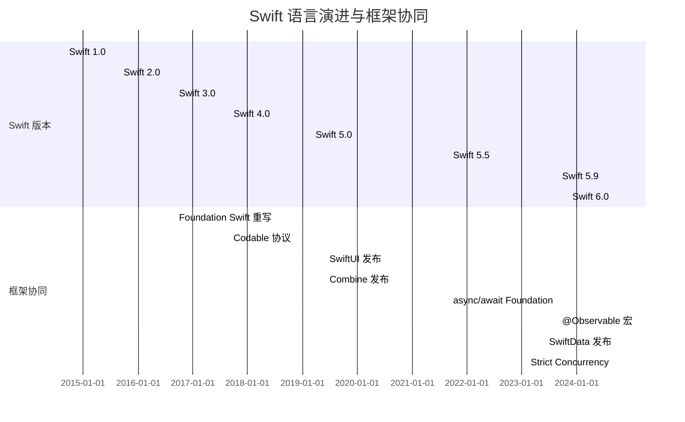

### Swift 关键版本特性表

| 版本 | 年份 | 语言特性 | 框架影响 |
|------|------|---------|---------|
| **Swift 1.0** | 2014 | 基础语法、可选类型、协议扩展 | Foundation 桥接启动 |
| **Swift 2.0** | 2015 | 错误处理 guard/defer、协议扩展默认实现 | 框架 API 开始 Swift 化 |
| **Swift 3.0** | 2016 | API 命名规范、去除 C 风格循环 | Foundation 全面重写 |
| **Swift 4.0** | 2017 | Codable、KeyPath、字符串多行字面量 | JSON 处理简化 |
| **Swift 5.0** | 2019 | ABI 稳定、Result 类型、原生字符串 | 框架二进制稳定 |
| **Swift 5.5** | 2021 | async/await、Actor、Structured Concurrency | Foundation 异步 API |
| **Swift 5.9** | 2023 | 宏系统、if/switch 表达式、泛型改进 | Observation 框架诞生 |
| **Swift 6.0** | 2024 | Strict Concurrency、完整并发检查 | 框架 Sendable 适配 |

---

## 3.2 Swift 5.5 async/await 详解

**结论先行**：Swift 5.5 的 async/await 是 iOS 并发编程的革命性变化，将嵌套回调转换为顺序代码，配合 Task 和 Actor 实现结构化并发。

### async/await 核心概念

```mermaid
graph TB
    subgraph async/await 核心组件
        ASYNC[async 函数] --> AWAIT[await 挂起点]
        AWAIT --> TASK[Task 执行单元]
        TASK --> ACTOR[Actor 隔离域]
        
        TASK --> TASKGROUP[TaskGroup 结构化并发]
        TASK --> ASYNCLET[async let 并行绑定]
        
        ACTOR --> MAINACTOR[@MainActor]
        ACTOR --> GLOBALACTOR[@globalActor]
    end
    
    subgraph 执行模型
        COOPERATIVE[协作式线程池] --> CONTINUATION[Continuation 恢复]
        CONTINUATION --> EXECUTOR[Executor 调度]
    end
```

### async/await 代码示例

```swift
// iOS 15+ Swift Concurrency

// 1. 定义异步函数
func fetchData(from url: URL) async throws -> Data {
    let (data, response) = try await URLSession.shared.data(from: url)
    guard let httpResponse = response as? HTTPURLResponse,
          httpResponse.statusCode == 200 else {
        throw URLError(.badServerResponse)
    }
    return data
}

// 2. 并行执行多个任务
func fetchMultipleData() async throws -> [Data] {
    let urls = [url1, url2, url3]
    
    // 使用 TaskGroup 结构化并发
    return try await withThrowingTaskGroup(of: Data.self) { group in
        for url in urls {
            group.addTask {
                try await fetchData(from: url)
            }
        }
        
        var results: [Data] = []
        for try await data in group {
            results.append(data)
        }
        return results
    }
}

// 3. async let 并行绑定
func fetchDashboard() async throws -> Dashboard {
    async let userData = fetchData(from: userURL)
    async let settingsData = fetchData(from: settingsURL)
    async let statsData = fetchData(from: statsURL)
    
    // 同时等待三个并行任务
    let user = try await JSONDecoder().decode(User.self, from: userData)
    let settings = try await JSONDecoder().decode(Settings.self, from: settingsData)
    let stats = try await JSONDecoder().decode(Stats.self, from: statsData)
    
    return Dashboard(user: user, settings: settings, stats: stats)
}

// 4. Actor 隔离
actor BankAccount {
    private var balance: Double = 0
    
    func deposit(_ amount: Double) {
        balance += amount
    }
    
    func withdraw(_ amount: Double) throws -> Double {
        guard balance >= amount else {
            throw BankError.insufficientFunds
        }
        balance -= amount
        return amount
    }
    
    func getBalance() -> Double {
        return balance
    }
}

enum BankError: Error {
    case insufficientFunds
}
```

---

## 3.3 Swift 5.9 Macro 系统详解

**结论先行**：Swift 5.9 引入的宏系统允许在编译期生成代码，是 Observation 框架的技术基础。宏分为独立宏（表达式/声明）和附加宏（Peer/Accessor/Member），大幅减少了样板代码。

### 宏类型架构

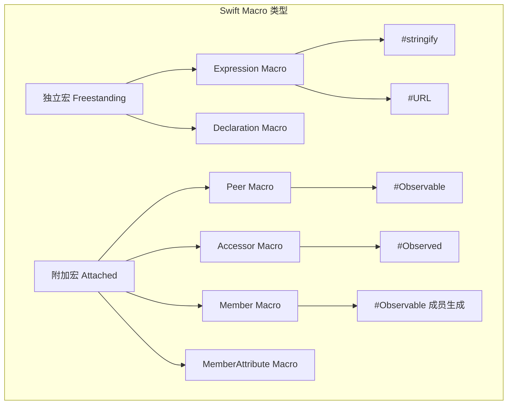

### Macro 代码示例

```swift
// Swift 5.9+ Macro 示例

// 1. @Observable 宏展开示例
@Observable
class ViewModel {
    var count = 0
    var name = ""
}

// 编译期展开为（简化版）：
// class ViewModel {
//     private var _count: Int = 0
//     private var _name: String = ""
//     
//     var count: Int {
//         get { _count }
//         set { 
//             _count = newValue
//             // 触发观察通知
//         }
//     }
//     
//     var name: String {
//         get { _name }
//         set {
//             _name = newValue
//             // 触发观察通知
//         }
//     }
// }

// 2. 自定义宏（需要单独定义宏包）
// @attached(peer, names: suffixed(Mock))
// public macro Mockable() = #externalMacro(...)

// 使用自定义宏
@Mockable
protocol APIService {
    func fetchUser(id: Int) async throws -> User
}

// 自动生成 MockAPIService 实现
```

---

## 3.4 Swift 6 Strict Concurrency 详解

**结论先行**：Swift 6 的 Strict Concurrency 是语言级别的线程安全检查，要求所有跨并发边界的数据传递符合 Sendable 协议。这是 Swift 并发模型的最终形态，确保数据竞争在编译期被发现。

### Strict Concurrency 核心概念

```mermaid
graph TB
    subgraph Swift 6 Strict Concurrency
        SENDABLE[Sendable Protocol] --> VALUE[Value Type]
        SENDABLE --> ACTORISOLATED[Actor Isolated]
        SENDABLE --> UNSAFESENDABLE[@unchecked Sendable]
        
        ISOLATION[Region-based Isolation] --> SENDABLECHECK[Sendable 检查]
        ISOLATION --> ACTORBOUNDARY[Actor 边界跨越]
        
        GLOBALACTOR[@globalActor] --> MAINACTOR[@MainActor]
        GLOBALACTOR --> CUSTOMACTOR[自定义 Global Actor]
    end
    
    subgraph 编译期检查
        SENDABLECHECK --> DATARACE[数据竞争检测]
        SENDABLECHECK --> CROSSISOLATION[跨隔离域检查]
    end
```

### Swift 6 Concurrency 代码示例

```swift
// Swift 6+ Strict Concurrency

// 1. Sendable 协议
struct User: Sendable {
    let id: Int
    let name: String
    // 所有属性必须是 Sendable
}

// 2. Actor 隔离
@MainActor
class ViewModel: ObservableObject {
    @Published var users: [User] = []
    
    // 自动在 MainActor 执行
    func updateUsers(_ newUsers: [User]) {
        users = newUsers
    }
}

// 3. 非隔离函数与隔离域转换
nonisolated func processData() async -> [User] {
    // 在非主线程执行
    return []
}

@MainActor
func updateUI() async {
    let data = await processData()  // 跨越隔离域
    // 回到主线程更新 UI
}

// 4. 自定义 Global Actor
@globalActor
struct DatabaseActor {
    static let shared = DatabaseActor()
    static let sharedContext = NSManagedObjectContext()
    
    func execute<T>(_ operation: @escaping () throws -> T) async rethrows -> T {
        // 在数据库队列执行
        return try await operation()
    }
}

// 使用自定义 Actor
@DatabaseActor
class DatabaseService {
    func save(_ object: NSManagedObject) async throws {
        // 在 DatabaseActor 隔离域执行
    }
}

// 5. @unchecked Sendable（谨慎使用）
final class Cache: @unchecked Sendable {
    private var storage: [String: Any] = [:]
    private let lock = NSLock()
    
    func get(_ key: String) -> Any? {
        lock.lock()
        defer { lock.unlock() }
        return storage[key]
    }
}
```

---

# 第四章：WWDC 2019-2025 关键框架演进

## 4.1 里程碑事件时间线

**结论先行**：WWDC 2019 是 Apple 框架生态的分水岭，SwiftUI、Combine、Swift Concurrency（预览）集中发布，标志着声明式 UI 和响应式编程成为官方推荐范式。

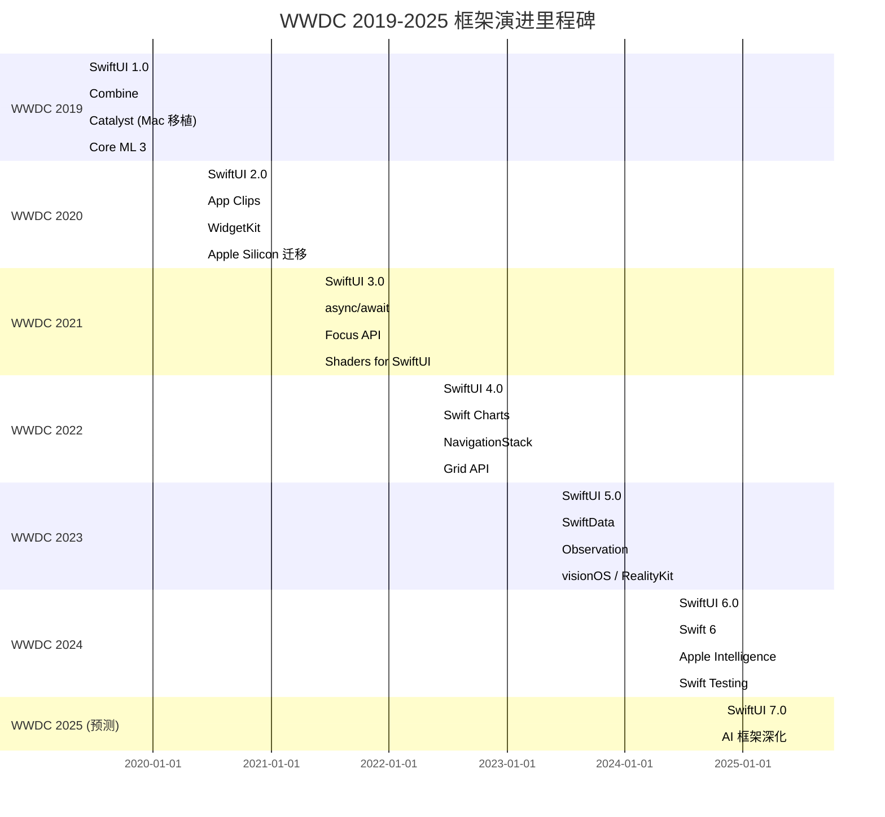

### WWDC 关键框架演进表

| 年份 | 核心主题 | 关键框架/特性 | 战略意义 |
|------|---------|--------------|---------|
| **2019** | 声明式革命 | SwiftUI、Combine、Catalyst | 统一 Apple 平台开发范式 |
| **2020** | 生态扩展 | WidgetKit、App Clips、Apple Silicon | 扩展应用触达场景 |
| **2021** | 异步编程 | async/await、SwiftUI 3.0 | 现代化并发模型 |
| **2022** | 功能完善 | Charts、NavigationStack、Grid | 补足 SwiftUI 功能短板 |
| **2023** | 数据与空间 | SwiftData、Observation、visionOS | 空间计算时代开启 |
| **2024** | AI 与稳定 | Apple Intelligence、Swift 6、Swift Testing | AI 原生与并发安全 |

---

## 4.2 各年度详细演进

### WWDC 2019: 声明式革命

**核心发布**：
- **SwiftUI**: 声明式 UI 框架，跨 Apple 平台
- **Combine**: 响应式编程框架
- **Catalyst**: iPad App 移植到 Mac
- **Core ML 3**: 设备端训练、模型个性化

```swift
// WWDC 2019 SwiftUI 示例 (iOS 13+)
import SwiftUI

struct ContentView: View {
    @State private var selection = 0
    
    var body: some View {
        TabView(selection: $selection) {
            Text("First View")
                .tabItem {
                    Image(systemName: "1.circle")
                    Text("First")
                }
                .tag(0)
            
            Text("Second View")
                .tabItem {
                    Image(systemName: "2.circle")
                    Text("Second")
                }
                .tag(1)
        }
    }
}
```

### WWDC 2020: 生态扩展

**核心发布**：
- **SwiftUI 2.0**: App/Scene 生命周期、Lazy 容器
- **WidgetKit**: 主屏幕小组件
- **App Clips**: 轻量级应用片段
- **Apple Silicon**: Mac 平台统一

```swift
// WWDC 2020 WidgetKit 示例 (iOS 14+)
import WidgetKit
import SwiftUI

struct Provider: TimelineProvider {
    func placeholder(in context: Context) -> SimpleEntry {
        SimpleEntry(date: Date(), count: 0)
    }
    
    func getSnapshot(in context: Context, completion: @escaping (SimpleEntry) -> ()) {
        let entry = SimpleEntry(date: Date(), count: 10)
        completion(entry)
    }
    
    func getTimeline(in context: Context, completion: @escaping (Timeline<Entry>) -> ()) {
        var entries: [SimpleEntry] = []
        let currentDate = Date()
        
        for hourOffset in 0 ..< 5 {
            let entryDate = Calendar.current.date(byAdding: .hour, value: hourOffset, to: currentDate)!
            let entry = SimpleEntry(date: entryDate, count: hourOffset)
            entries.append(entry)
        }
        
        let timeline = Timeline(entries: entries, policy: .atEnd)
        completion(timeline)
    }
}

struct SimpleEntry: TimelineEntry {
    let date: Date
    let count: Int
}

struct MyWidgetEntryView : View {
    var entry: Provider.Entry
    
    var body: some View {
        Text("Count: \(entry.count)")
            .font(.headline)
    }
}

@main
struct MyWidget: Widget {
    let kind: String = "MyWidget"
    
    var body: some WidgetConfiguration {
        StaticConfiguration(kind: kind, provider: Provider()) { entry in
            MyWidgetEntryView(entry: entry)
        }
        .configurationDisplayName("My Widget")
        .description("This is an example widget.")
    }
}
```

### WWDC 2021: 异步编程

**核心发布**：
- **Swift Concurrency**: async/await、Actor、Task
- **SwiftUI 3.0**: `.task`、`.searchable`、Focus API
- **Core ML 更新**: 性能优化、新模型支持

```swift
// WWDC 2021 Swift Concurrency 示例 (iOS 15+)
import SwiftUI

struct AsyncImageView: View {
    let imageURL: URL
    
    var body: some View {
        AsyncImage(url: imageURL) { phase in
            switch phase {
            case .empty:
                ProgressView()
            case .success(let image):
                image.resizable().scaledToFit()
            case .failure:
                Image(systemName: "photo")
            @unknown default:
                EmptyView()
            }
        }
    }
}

struct TaskView: View {
    @State private var data: String = ""
    
    var body: some View {
        Text(data)
            .task {
                // 自动在 Task 中执行，视图消失时自动取消
                await loadData()
            }
    }
    
    func loadData() async {
        try? await Task.sleep(nanoseconds: 1_000_000_000)
        data = "Loaded"
    }
}
```

### WWDC 2022: 功能完善

**核心发布**：
- **Swift Charts**: 声明式图表框架
- **NavigationStack**: 导航栈重构
- **Grid**: 网格布局 API

```swift
// WWDC 2022 Swift Charts 示例 (iOS 16+)
import Charts

struct SalesChart: View {
    let data: [SalesData]
    
    var body: some View {
        Chart(data) { item in
            BarMark(
                x: .value("Month", item.month),
                y: .value("Sales", item.sales)
            )
            .foregroundStyle(by: .value("Category", item.category))
        }
    }
}

struct SalesData: Identifiable {
    let id = UUID()
    let month: String
    let sales: Double
    let category: String
}

// WWDC 2022 NavigationStack 示例 (iOS 16+)
struct ContentView: View {
    @State private var path = NavigationPath()
    
    var body: some View {
        NavigationStack(path: $path) {
            List {
                NavigationLink("Go to Detail", value: "detail")
            }
            .navigationDestination(for: String.self) { value in
                if value == "detail" {
                    DetailView()
                }
            }
        }
    }
}
```

### WWDC 2023: 数据与空间

**核心发布**：
- **SwiftData**: Core Data 的现代替代
- **Observation**: 轻量级观察框架
- **visionOS**: 空间计算平台

```swift
// WWDC 2023 SwiftData 示例 (iOS 17+)
import SwiftData

@Model
class Person {
    var name: String
    var birthDate: Date
    
    init(name: String, birthDate: Date) {
        self.name = name
        self.birthDate = birthDate
    }
}

// WWDC 2023 Observation 示例 (iOS 17+)
import SwiftUI
import Observation

@Observable
class ViewModel {
    var count = 0
    
    func increment() {
        count += 1
    }
}

struct ContentView: View {
    let viewModel = ViewModel()
    
    var body: some View {
        VStack {
            Text("Count: \(viewModel.count)")
            Button("Increment") {
                viewModel.increment()
            }
        }
    }
}
```

### WWDC 2024: AI 与稳定

**核心发布**：
- **Apple Intelligence**: 设备端 AI 能力
- **Swift 6**: Strict Concurrency
- **Swift Testing**: 新测试框架

```swift
// WWDC 2024 Swift Testing 示例
import Testing

struct CalculatorTests {
    @Test
    func addition() {
        let calculator = Calculator()
        #expect(calculator.add(2, 3) == 5)
    }
    
    @Test
    func divisionByZero() {
        let calculator = Calculator()
        #expect(throws: CalculatorError.divisionByZero) {
            try calculator.divide(10, 0)
        }
    }
    
    @Test(arguments: [1, 2, 3, 4, 5])
    func square(number: Int) {
        let calculator = Calculator()
        #expect(calculator.square(number) == number * number)
    }
}
```

---

# 第五章：Apple 战略定位与开发者建议

## 5.1 各框架战略定位分析

**结论先行**：Apple 框架生态呈现「 SwiftUI 优先、UIKit 维护、新框架快速迭代」的战略格局。开发者应优先掌握 SwiftUI + Swift Concurrency + Observation 组合，同时保持 UIKit 能力以应对复杂场景。

### 框架战略定位矩阵

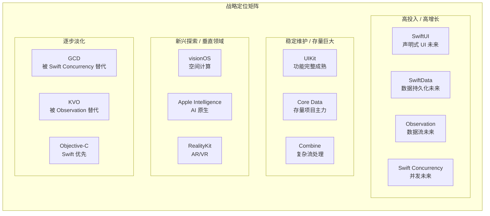

### 框架投入优先级表

| 框架 | Apple 投入度 | 社区活跃度 | 学习优先级 | 适用场景 |
|------|------------|-----------|-----------|---------|
| **SwiftUI** | ⭐⭐⭐⭐⭐ 最高 | ⭐⭐⭐⭐⭐ | P0 最高 | 所有新 UI 开发 |
| **Swift Concurrency** | ⭐⭐⭐⭐⭐ 最高 | ⭐⭐⭐⭐⭐ | P0 最高 | 所有异步代码 |
| **Observation** | ⭐⭐⭐⭐⭐ 最高 | ⭐⭐⭐⭐ | P1 高 | SwiftUI 数据流 |
| **SwiftData** | ⭐⭐⭐⭐ 高 | ⭐⭐⭐⭐ | P1 高 | 新数据持久化 |
| **UIKit** | ⭐⭐⭐⭐ 维护 | ⭐⭐⭐⭐⭐ | P1 高 | 复杂自定义、存量维护 |
| **Combine** | ⭐⭐⭐ 维护 | ⭐⭐⭐⭐ | P2 中 | 复杂响应式流 |
| **Core Data** | ⭐⭐⭐ 维护 | ⭐⭐⭐⭐ | P2 中 | 存量项目、复杂关系 |
| **GCD** | ⭐⭐ 淡化 | ⭐⭐⭐ | P3 低 | 旧版本兼容、底层优化 |

---

## 5.2 开发者迁移策略

**结论先行**：技术迁移应采取「渐进式」策略，而非「大爆炸式」重写。新功能使用新框架，存量代码逐步迁移，保持业务连续性。

### 迁移路线图

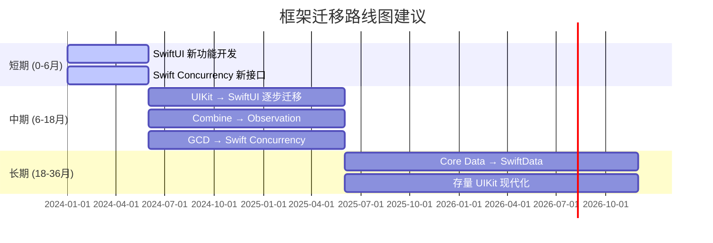

### 迁移决策矩阵

| 场景 | 当前技术 | 目标技术 | 迁移策略 | 风险等级 |
|------|---------|---------|---------|---------|
| 新功能开发 | UIKit | SwiftUI | 直接使用 SwiftUI | 低 |
| 新异步逻辑 | GCD | Swift Concurrency | 直接使用 async/await | 低 |
| 新数据流 | Combine/ObservableObject | Observation | 使用 @Observable | 低 |
| 新数据持久化 | Core Data | SwiftData | 优先 SwiftData | 中 |
| 存量 UI 重构 | UIKit | SwiftUI | 组件级逐步替换 | 中 |
| 存量异步重构 | GCD | Swift Concurrency | API 级逐步替换 | 中 |
| 存量数据重构 | Core Data | SwiftData | 谨慎评估后迁移 | 高 |

---

## 5.3 技术栈推荐组合

### 2025 推荐技术栈

```mermaid
graph TB
    subgraph 2025 推荐技术栈
        UI[UI 层] --> SWIFTUI[SwiftUI 6.0]
        UI --> UIKIT[UIKit 桥接]
        
        DATA[数据层] --> OBSERVATION[@Observable]
        DATA --> SWIFTDATA[SwiftData]
        DATA --> COREDATA[Core Data 存量]
        
        CONCURRENCY[并发层] --> SWIFTCONCURRENCY[Swift Concurrency]
        CONCURRENCY --> ACTOR[Actor 隔离]
        
        NETWORK[网络层] --> URLSESSION[URLSession + async/await]
        NETWORK --> NETWORKFRAMEWORK[Network.framework]
        
        AI[AI 层] --> APPLEINTELLIGENCE[Apple Intelligence]
        AI --> COREML[Core ML]
        
        TEST[测试层] --> SWIFTTESTING[Swift Testing]
        TEST --> XCTEST[XCTest 存量]
    end
```

### 技术栈版本要求表

| 技术 | 最低版本 | 推荐版本 | 关键特性 |
|------|---------|---------|---------|
| **Swift** | 5.9 | 6.0 | Macro、Strict Concurrency |
| **SwiftUI** | 5.0 (iOS 17) | 6.0 (iOS 18) | Observable、Animation |
| **Xcode** | 15.0 | 16.0 | Swift 6、Apple Intelligence |
| **iOS Target** | 15.0 | 17.0+ | Swift Concurrency 完整支持 |

---

## 总结

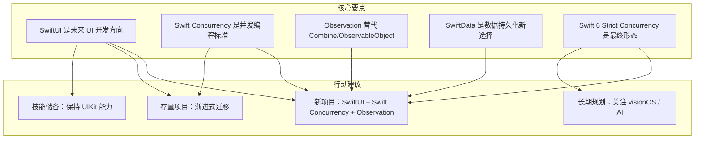

### 关键要点回顾

| 层次 | 核心要点 | 最重要的一句话 |
|------|---------|-------------|
| **架构分层** | Cocoa Touch → Media → Core Services → Core OS | 上层依赖下层，理解边界避免越层调用 |
| **UI 框架** | SwiftUI 优先，UIKit 共存 | 新项目用 SwiftUI，复杂场景用 UIKit |
| **数据流** | Observation 替代 Combine | @Observable 是 SwiftUI 数据流的未来 |
| **并发** | Swift Concurrency 替代 GCD | async/await + Actor 是并发编程标准 |
| **数据持久化** | SwiftData 替代 Core Data | 新项目优先 SwiftData |
| **语言** | Swift 6 Strict Concurrency | 编译期线程安全是最终目标 |

### 学习路径建议

1. **基础阶段**：Swift 语言 → SwiftUI 基础 → Swift Concurrency
2. **进阶阶段**：Observation → SwiftData → 自定义 ViewModifier
3. **高级阶段**：UIKit 桥接 → Core Animation → Metal 集成
4. **前沿阶段**：visionOS → RealityKit → Apple Intelligence

---

## 参考资源

### 内部知识库关联

- [iOS CoreML 机器学习框架金字塔解析](../../iOS_CoreML_机器学习框架_金字塔解析.md) —— Core ML 框架详解
- [iOS Metal 渲染技术金字塔解析](../../iOS_Metal_渲染技术_金字塔解析.md) —— Metal 图形渲染
- [疑难崩溃问题治理方法论与实践指南](../../疑难崩溃问题治理方法论与实践指南.md) —— 稳定性治理

### 官方文档

- [SwiftUI Documentation](https://developer.apple.com/documentation/swiftui)
- [Swift Concurrency Documentation](https://developer.apple.com/documentation/swift/swift-standard-library/concurrency)
- [SwiftData Documentation](https://developer.apple.com/documentation/swiftdata)
- [Observation Documentation](https://developer.apple.com/documentation/observation)
- [Swift.org](https://swift.org)

### WWDC 推荐视频

- [WWDC 2019: Introducing SwiftUI](https://developer.apple.com/videos/play/wwdc2019/204/)
- [WWDC 2021: Meet async/await in Swift](https://developer.apple.com/videos/play/wwdc2021/10132/)
- [WWDC 2023: Meet SwiftData](https://developer.apple.com/videos/play/wwdc2023/10187/)
- [WWDC 2023: Meet Observation](https://developer.apple.com/videos/play/wwdc2023/10149/)
- [WWDC 2024: Migrate your app to Swift 6](https://developer.apple.com/videos/play/wwdc2024/10169/)
