# 新兴框架与未来趋势 — 详细解析

> **核心结论**：Apple 平台正在经历从移动优先到 AI 优先、从 2D 界面到空间计算的范式转移。Vision Framework 的 OCR 能力、RealityKit 的空间渲染、ActivityKit 的实时活动、SwiftData 的现代持久化、以及 Apple Intelligence 的端侧 AI，共同构成了 iOS 18+ 时代的技术新基建。

---

## 文章结构概览

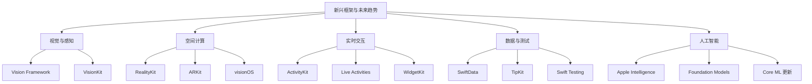

---

# 第一章：视觉与感知框架

## 1.1 Vision Framework — 计算机视觉核心

**结论先行**：Vision Framework 是 Apple 平台的计算机视觉统一接口，基于 Core ML 和 Metal 实现硬件加速。iOS 16+ 引入的 Live Text、iOS 17+ 的 Visual Look Up、以及 iOS 18+ 的增强 OCR，使其成为文档扫描、图像分析的首选框架。

### Vision Framework 架构

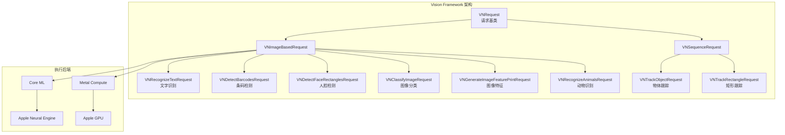

### Vision 核心功能表

| 功能 | 请求类 | 最低版本 | 典型应用场景 |
|------|--------|---------|-------------|
| **文字识别** | VNRecognizeTextRequest | iOS 13 | 文档扫描、名片识别、实时翻译 |
| **条码/二维码** | VNDetectBarcodesRequest | iOS 11 | 扫码支付、商品溯源 |
| **人脸检测** | VNDetectFaceRectanglesRequest | iOS 11 | 美颜相机、人脸解锁 |
| **人脸特征点** | VNDetectFaceLandmarksRequest | iOS 11 | 表情识别、AR 贴纸 |
| **图像分类** | VNClassifyImageRequest | iOS 13 | 相册自动分类、内容审核 |
| **物体跟踪** | VNTrackObjectRequest | iOS 11 | 视频追踪、运动分析 |
| **动物识别** | VNRecognizeAnimalsRequest | iOS 13 | 宠物识别、生态监测 |
| **人体姿态** | VNDetectHumanBodyPoseRequest | iOS 14 | 健身应用、动作识别 |
| **手部姿态** | VNDetectHumanHandPoseRequest | iOS 14 | 手势控制、手语识别 |

### 文字识别代码示例 (iOS 16+)

```swift
import Vision
import UIKit

class TextRecognitionService {
    
    /// 识别图像中的文字
    func recognizeText(in image: UIImage, completion: @escaping (Result<[String], Error>) -> Void) {
        guard let cgImage = image.cgImage else {
            completion(.failure(VisionError.invalidImage))
            return
        }
        
        // 创建文字识别请求
        let request = VNRecognizeTextRequest { request, error in
            if let error = error {
                completion(.failure(error))
                return
            }
            
            guard let observations = request.results as? [VNRecognizedTextObservation] else {
                completion(.success([]))
                return
            }
            
            // 提取识别结果
            let recognizedTexts = observations.compactMap { observation in
                observation.topCandidates(1).first?.string
            }
            
            completion(.success(recognizedTexts))
        }
        
        // 配置识别参数
        request.recognitionLevel = .accurate  // .fast 或 .accurate
        request.recognitionLanguages = ["zh-Hans", "en-US"]
        request.usesLanguageCorrection = true
        
        // 执行请求
        let handler = VNImageRequestHandler(cgImage: cgImage, options: [:])
        
        DispatchQueue.global(qos: .userInitiated).async {
            do {
                try handler.perform([request])
            } catch {
                completion(.failure(error))
            }
        }
    }
    
    /// 识别并返回带位置信息的文字
    func recognizeTextWithBoundingBoxes(in image: UIImage, 
                                         completion: @escaping (Result<[(text: String, boundingBox: CGRect)], Error>) -> Void) {
        guard let cgImage = image.cgImage else {
            completion(.failure(VisionError.invalidImage))
            return
        }
        
        let request = VNRecognizeTextRequest { request, error in
            if let error = error {
                completion(.failure(error))
                return
            }
            
            guard let observations = request.results as? [VNRecognizedTextObservation] else {
                completion(.success([]))
                return
            }
            
            let results = observations.compactMap { observation -> (String, CGRect)? in
                guard let candidate = observation.topCandidates(1).first else { return nil }
                return (candidate.string, observation.boundingBox)
            }
            
            completion(.success(results))
        }
        
        request.recognitionLevel = .accurate
        request.recognitionLanguages = ["zh-Hans", "en-US"]
        
        let handler = VNImageRequestHandler(cgImage: cgImage, options: [:])
        
        DispatchQueue.global(qos: .userInitiated).async {
            do {
                try handler.perform([request])
            } catch {
                completion(.failure(error))
            }
        }
    }
    
    enum VisionError: Error {
        case invalidImage
        case recognitionFailed
    }
}
```

### Live Text 实时文字识别 (iOS 16+)

```swift
import UIKit
import VisionKit

// 使用系统提供的 Live Text 交互界面
class LiveTextViewController: UIViewController {
    
    private var imageView: UIImageView!
    private var interaction: ImageAnalysisInteraction?
    
    override func viewDidLoad() {
        super.viewDidLoad()
        
        setupImageView()
        setupLiveText()
    }
    
    private func setupImageView() {
        imageView = UIImageView(image: UIImage(named: "document"))
        imageView.contentMode = .scaleAspectFit
        imageView.isUserInteractionEnabled = true
        view.addSubview(imageView)
    }
    
    private func setupLiveText() {
        // 检查设备是否支持 Live Text
        guard ImageAnalyzer.isSupported else {
            print("设备不支持 Live Text")
            return
        }
        
        // 创建图像分析交互
        let interaction = ImageAnalysisInteraction()
        interaction.preferredInteractionTypes = .automatic
        interaction.allowableInteractionTypes = .all
        
        imageView.addInteraction(interaction)
        self.interaction = interaction
        
        // 分析图像
        analyzeImage()
    }
    
    private func analyzeImage() {
        guard let image = imageView.image else { return }
        
        let analyzer = ImageAnalyzer()
        let configuration = ImageAnalyzer.Configuration([
            .text,
            .machineReadableCodes
        ])
        
        Task {
            do {
                let analysis = try await analyzer.analyze(image, configuration: configuration)
                await MainActor.run {
                    self.interaction?.analysis = analysis
                }
            } catch {
                print("分析失败: \(error)")
            }
        }
    }
}
```

---

## 1.2 VisionKit — 文档扫描与相机集成

**结论先行**：VisionKit 在 Vision Framework 基础上封装了高阶功能，特别是 VNDocumentCameraViewController 提供系统级文档扫描界面，是开发扫描类应用的首选方案。

### VisionKit 功能架构

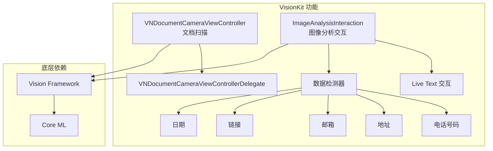

### 文档扫描代码示例 (iOS 13+)

```swift
import VisionKit
import UIKit

class DocumentScannerViewController: UIViewController {
    
    weak var delegate: DocumentScannerDelegate?
    
    func startScanning() {
        // 检查扫描功能是否可用
        guard VNDocumentCameraViewController.isSupported else {
            showAlert(message: "设备不支持文档扫描")
            return
        }
        
        let scannerViewController = VNDocumentCameraViewController()
        scannerViewController.delegate = self
        present(scannerViewController, animated: true)
    }
    
    private func showAlert(message: String) {
        let alert = UIAlertController(title: "提示", message: message, preferredStyle: .alert)
        alert.addAction(UIAlertAction(title: "确定", style: .default))
        present(alert, animated: true)
    }
}

// MARK: - VNDocumentCameraViewControllerDelegate
extension DocumentScannerViewController: VNDocumentCameraViewControllerDelegate {
    
    func documentCameraViewController(_ controller: VNDocumentCameraViewController, 
                                      didFinishWith scan: VNDocumentCameraScan) {
        controller.dismiss(animated: true)
        
        // 处理扫描结果
        var scannedImages: [UIImage] = []
        for pageIndex in 0..<scan.pageCount {
            let image = scan.imageOfPage(at: pageIndex)
            scannedImages.append(image)
        }
        
        // 获取扫描的原始图像
        let originalImage = scan.imageOfPage(at: 0)
        
        // 回调给委托
        delegate?.documentScanner(self, didFinishWith: scannedImages)
        
        // 可选：对扫描结果进行 OCR
        performOCR(on: originalImage)
    }
    
    func documentCameraViewControllerDidCancel(_ controller: VNDocumentCameraViewController) {
        controller.dismiss(animated: true)
        delegate?.documentScannerDidCancel(self)
    }
    
    func documentCameraViewController(_ controller: VNDocumentCameraViewController, 
                                      didFailWithError error: Error) {
        controller.dismiss(animated: true)
        delegate?.documentScanner(self, didFailWithError: error)
    }
    
    private func performOCR(on image: UIImage) {
        // 使用 Vision Framework 进行文字识别
        let textRecognitionService = TextRecognitionService()
        textRecognitionService.recognizeText(in: image) { result in
            switch result {
            case .success(let texts):
                print("识别到的文字: \(texts)")
            case .failure(let error):
                print("识别失败: \(error)")
            }
        }
    }
}

// MARK: - DocumentScannerDelegate
protocol DocumentScannerDelegate: AnyObject {
    func documentScanner(_ scanner: DocumentScannerViewController, didFinishWith images: [UIImage])
    func documentScannerDidCancel(_ scanner: DocumentScannerViewController)
    func documentScanner(_ scanner: DocumentScannerViewController, didFailWithError error: Error)
}
```

---

# 第二章：空间计算框架

## 2.1 RealityKit — 空间渲染引擎

**结论先行**：RealityKit 是 Apple 的 3D 渲染和空间计算框架，为 ARKit 和 visionOS 提供底层支持。其核心优势在于与 Apple 硬件的深度集成（Neural Engine 用于场景理解、GPU 用于渲染），以及 Swift 原生 API 设计。

### RealityKit 架构

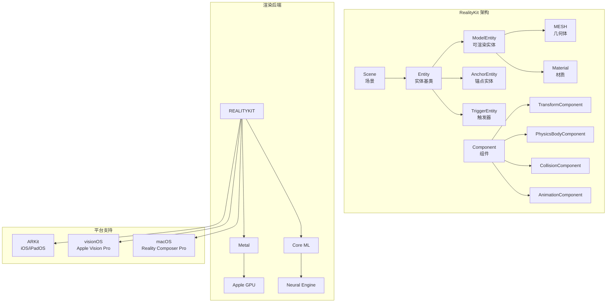

### RealityKit 核心概念表

| 概念 | 说明 | 对应类/协议 | 使用场景 |
|------|------|------------|---------|
| **Entity** | 场景中的对象基类 | `Entity` | 所有 3D 对象的基类 |
| **ModelEntity** | 可渲染的 3D 模型 | `ModelEntity` | 显示 3D 模型 |
| **AnchorEntity** | 现实世界锚点 | `AnchorEntity` | AR 空间定位 |
| **Component** | 实体的行为和属性 | `Component` 协议 | 组合实体功能 |
| **System** | 处理组件的游戏逻辑 | `System` 协议 | 批量更新实体 |
| **Material** | 表面外观 | `Material` 协议 | 定义材质效果 |
| **Mesh** | 几何形状 | `MeshResource` | 定义几何体 |

### RealityKit 基础代码示例 (iOS 15+)

```swift
import RealityKit
import ARKit

class RealityKitViewController: UIViewController {
    var arView: ARView!
    
    override func viewDidLoad() {
        super.viewDidLoad()
        
        setupARView()
        loadModel()
        setupCoachingOverlay()
    }
    
    private func setupARView() {
        arView = ARView(frame: view.bounds)
        arView.autoresizingMask = [.flexibleWidth, .flexibleHeight]
        view.addSubview(arView)
        
        // 配置 AR 会话
        let config = ARWorldTrackingConfiguration()
        config.planeDetection = [.horizontal, .vertical]
        arView.session.run(config)
    }
    
    private func loadModel() {
        // 加载 USDZ 模型
        let modelName = "robot_walking"
        
        ModelEntity.loadModelAsync(named: modelName)
            .sink(receiveCompletion: { completion in
                if case .failure(let error) = completion {
                    print("加载模型失败: \(error)")
                }
            }, receiveValue: { [weak self] model in
                self?.placeModel(model)
            })
            .store(in: &cancellables)
    }
    
    private var cancellables: Set<AnyCancellable> = []
    
    private func placeModel(_ model: ModelEntity) {
        // 创建锚点（放置在相机前方 1 米处）
        let anchor = AnchorEntity(world: [0, 0, -1])
        anchor.addChild(model)
        
        // 添加碰撞检测
        model.generateCollisionShapes(recursive: true)
        
        // 添加到场景
        arView.scene.addAnchor(anchor)
        
        // 添加手势识别
        arView.installGestures([.rotation, .scale], for: model)
    }
    
    private func setupCoachingOverlay() {
        let coachingOverlay = ARCoachingOverlayView()
        coachingOverlay.session = arView.session
        coachingOverlay.goal = .horizontalPlane
        coachingOverlay.autoresizingMask = [.flexibleWidth, .flexibleHeight]
        arView.addSubview(coachingOverlay)
    }
}
```

### RealityKit + SwiftUI 集成 (iOS 15+)

```swift
import SwiftUI
import RealityKit
import ARKit

struct ARViewContainer: UIViewRepresentable {
    @Binding var modelName: String
    
    func makeUIView(context: Context) -> ARView {
        let arView = ARView(frame: .zero)
        
        // 配置 AR 会话
        let config = ARWorldTrackingConfiguration()
        config.planeDetection = [.horizontal]
        arView.session.run(config)
        
        return arView
    }
    
    func updateUIView(_ uiView: ARView, context: Context) {
        // 加载并放置模型
        loadModel(named: modelName, into: uiView)
    }
    
    private func loadModel(named: String, into arView: ARView) {
        // 移除现有模型
        arView.scene.anchors.removeAll()
        
        ModelEntity.loadModelAsync(named: named)
            .sink(receiveCompletion: { _ in },
                  receiveValue: { model in
                let anchor = AnchorEntity(plane: .horizontal)
                anchor.addChild(model)
                arView.scene.addAnchor(anchor)
            })
            .store(in: &context.coordinator.cancellables)
    }
    
    func makeCoordinator() -> Coordinator {
        Coordinator()
    }
    
    class Coordinator {
        var cancellables = Set<AnyCancellable>()
    }
}

struct RealityKitSwiftUIView: View {
    @State private var selectedModel = "robot_walking"
    
    var body: some View {
        VStack {
            ARViewContainer(modelName: $selectedModel)
                .edgesIgnoringSafeArea(.all)
            
            Picker("选择模型", selection: $selectedModel) {
                Text("机器人").tag("robot_walking")
                Text("椅子").tag("chair_swan")
                Text("吉他").tag("toy_guitar")
            }
            .pickerStyle(SegmentedPickerStyle())
            .padding()
        }
    }
}
```

---

## 2.2 ARKit — 增强现实基础

**结论先行**：ARKit 是 Apple 的 AR 开发基础框架，提供运动跟踪、平面检测、场景理解、人脸跟踪等核心能力。ARKit 6 引入 4K 视频支持、ARKit 7 优化了场景几何，与 RealityKit 配合构建完整 AR 体验。

### ARKit 演进时间线

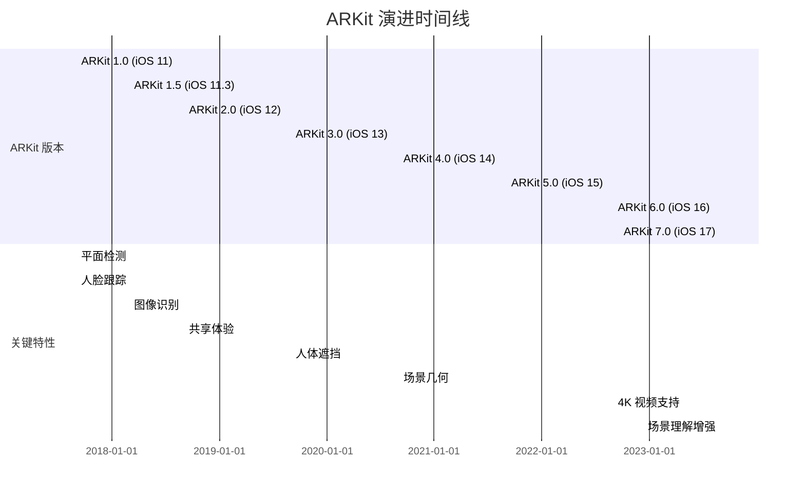

### ARKit 核心功能代码示例 (iOS 16+)

```swift
import ARKit
import RealityKit

class ARKitManager: NSObject, ARSessionDelegate {
    private var arView: ARView
    private var planeAnchors: [ARPlaneAnchor] = []
    
    init(arView: ARView) {
        self.arView = arView
        super.init()
        arView.session.delegate = self
    }
    
    // MARK: - 配置 AR 会话
    func setupSession() {
        let configuration = ARWorldTrackingConfiguration()
        
        // 启用平面检测
        configuration.planeDetection = [.horizontal, .vertical]
        
        // 启用场景重建（需要 LiDAR）
        if ARWorldTrackingConfiguration.supportsSceneReconstruction(.mesh) {
            configuration.sceneReconstruction = .mesh
        }
        
        // 启用人物遮挡
        if ARWorldTrackingConfiguration.supportsFrameSemantics(.personSegmentationWithDepth) {
            configuration.frameSemantics.insert(.personSegmentationWithDepth)
        }
        
        arView.session.run(configuration)
    }
    
    // MARK: - ARSessionDelegate
    func session(_ session: ARSession, didAdd anchors: [ARAnchor]) {
        for anchor in anchors {
            if let planeAnchor = anchor as? ARPlaneAnchor {
                planeAnchors.append(planeAnchor)
                addPlaneVisualization(for: planeAnchor)
            }
        }
    }
    
    func session(_ session: ARSession, didUpdate anchors: [ARAnchor]) {
        for anchor in anchors {
            if let planeAnchor = anchor as? ARPlaneAnchor {
                updatePlaneVisualization(for: planeAnchor)
            }
        }
    }
    
    // MARK: - 平面可视化
    private func addPlaneVisualization(for planeAnchor: ARPlaneAnchor) {
        let mesh = MeshResource.generatePlane(width: 1, depth: 1)
        let material = SimpleMaterial(color: .blue.withAlphaComponent(0.3), isMetallic: false)
        let model = ModelEntity(mesh: mesh, materials: [material])
        
        let anchorEntity = AnchorEntity(anchor: planeAnchor)
        anchorEntity.addChild(model)
        arView.scene.addAnchor(anchorEntity)
    }
    
    private func updatePlaneVisualization(for planeAnchor: ARPlaneAnchor) {
        // 更新平面可视化
    }
    
    // MARK: - 射线检测
    func performRaycast(from point: CGPoint) -> ARRaycastResult? {
        let raycastQuery = arView.raycastQuery(from: point, 
                                               allowing: .existingPlaneGeometry, 
                                               alignment: .horizontal)
        let results = arView.session.raycast(raycastQuery)
        return results.first
    }
}
```

---

## 2.3 visionOS — 空间计算平台

**结论先行**：visionOS 是 Apple Vision Pro 的操作系统，基于 iPadOS 演进而来，专为空间计算优化。SwiftUI 是 visionOS 的一等公民，RealityKit 提供 3D 渲染，ARKit 提供空间感知，共同构成空间应用开发栈。

### visionOS 开发栈

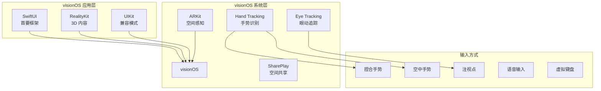

### visionOS SwiftUI 代码示例

```swift
import SwiftUI
import RealityKit
import RealityKitContent

@main
struct MyVisionApp: App {
    var body: some Scene {
        WindowGroup {
            ContentView()
        }
        .windowStyle(.volumetric)  // 3D 窗口样式
        
        ImmersiveSpace(id: "ImmersiveSpace") {
            ImmersiveView()
        }
    }
}

struct ContentView: View {
    @State private var showImmersiveSpace = false
    @Environment(\.openImmersiveSpace) var openImmersiveSpace
    @Environment(\.dismissImmersiveSpace) var dismissImmersiveSpace
    
    var body: some View {
        VStack {
            Model3D(named: "Scene", bundle: realityKitContentBundle)
                .padding(.bottom, 50)
            
            Text("Hello, visionOS!")
                .font(.extraLargeTitle)
            
            Toggle("显示沉浸式空间", isOn: $showImmersiveSpace)
                .toggleStyle(.button)
                .padding()
        }
        .padding()
        .onChange(of: showImmersiveSpace) { _, isShowing in
            Task {
                if isShowing {
                    await openImmersiveSpace(id: "ImmersiveSpace")
                } else {
                    await dismissImmersiveSpace()
                }
            }
        }
    }
}

struct ImmersiveView: View {
    var body: some View {
        RealityView { content in
            // 创建 3D 内容
            let sphere = MeshResource.generateSphere(radius: 0.5)
            let material = SimpleMaterial(color: .blue, isMetallic: true)
            let entity = ModelEntity(mesh: sphere, materials: [material])
            
            // 放置在前方 1 米处
            entity.position = [0, 1, -1]
            
            // 添加旋转动画
            let rotation = Transform(pitch: 0, yaw: .pi, roll: 0)
            entity.move(to: rotation, relativeTo: entity, duration: 2)
            
            content.add(entity)
        }
    }
}
```

---

# 第三章：实时交互框架

## 3.1 ActivityKit — 实时活动管理

**结论先行**：ActivityKit 是 iOS 16.1+ 引入的实时活动框架，用于在灵动岛（Dynamic Island）和锁屏界面展示实时信息。它是 Live Activities 的底层 API，适用于外卖进度、体育比分、打车状态等场景。

### ActivityKit 架构

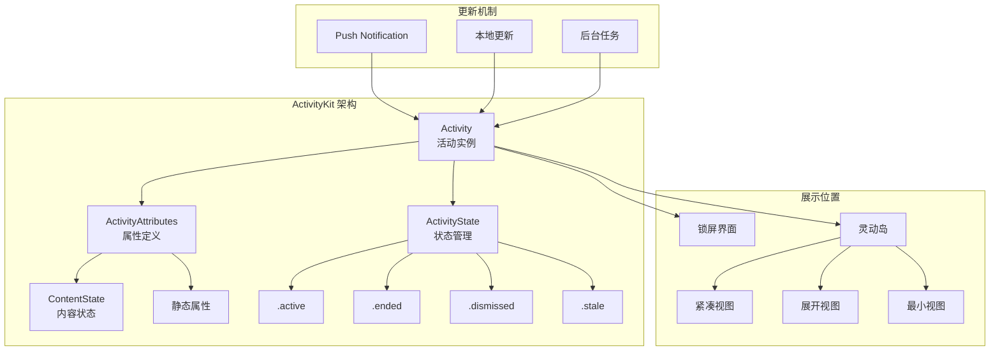

### ActivityKit 代码示例 (iOS 16.1+)

```swift
import ActivityKit
import SwiftUI

// MARK: - 定义活动属性
struct DeliveryAttributes: ActivityAttributes {
    public struct ContentState: Codable, Hashable {
        var driverName: String
        var estimatedArrival: Date
        var currentStatus: DeliveryStatus
        var progress: Double  // 0.0 - 1.0
    }
    
    var orderNumber: String
    var restaurantName: String
    var items: [String]
}

enum DeliveryStatus: String, Codable, CaseIterable {
    case preparing = "准备中"
    case pickedUp = "已取餐"
    case onTheWay = "配送中"
    case arriving = "即将到达"
    case delivered = "已送达"
}

// MARK: - ActivityKit 管理器
@available(iOS 16.1, *)
class DeliveryActivityManager {
    static let shared = DeliveryActivityManager()
    private var currentActivity: Activity<DeliveryAttributes>?
    
    /// 开始实时活动
    func startActivity(orderNumber: String, 
                       restaurantName: String,
                       items: [String],
                       driverName: String) {
        // 检查是否支持实时活动
        guard ActivityAuthorizationInfo().areActivitiesEnabled else {
            print("实时活动未启用")
            return
        }
        
        let attributes = DeliveryAttributes(
            orderNumber: orderNumber,
            restaurantName: restaurantName,
            items: items
        )
        
        let initialState = DeliveryAttributes.ContentState(
            driverName: driverName,
            estimatedArrival: Date().addingTimeInterval(1800),
            currentStatus: .preparing,
            progress: 0.1
        )
        
        let content = ActivityContent(state: initialState, staleDate: nil)
        
        do {
            let activity = try Activity.request(
                attributes: attributes,
                content: content,
                pushType: .token  // 支持推送更新
            )
            currentActivity = activity
            print("实时活动已启动: \(activity.id)")
            
            // 监听推送令牌更新
            Task {
                for await token in activity.pushTokenUpdates {
                    let tokenString = token.map { String(format: "%02x", $0) }.joined()
                    print("推送令牌: \(tokenString)")
                    // 将令牌发送到服务器
                }
            }
            
        } catch {
            print("启动实时活动失败: \(error)")
        }
    }
    
    /// 更新活动状态
    func updateActivity(status: DeliveryStatus, progress: Double) {
        guard let activity = currentActivity else { return }
        
        let updatedState = DeliveryAttributes.ContentState(
            driverName: "张师傅",
            estimatedArrival: Date().addingTimeInterval(900),
            currentStatus: status,
            progress: progress
        )
        
        let alertConfiguration = AlertConfiguration(
            title: "配送状态更新",
            body: "您的订单状态已更新为: \(status.rawValue)",
            sound: .default
        )
        
        Task {
            await activity.update(
                ActivityContent(state: updatedState, staleDate: nil),
                alertConfiguration: alertConfiguration
            )
        }
    }
    
    /// 结束活动
    func endActivity() {
        guard let activity = currentActivity else { return }
        
        let finalState = DeliveryAttributes.ContentState(
            driverName: "张师傅",
            estimatedArrival: Date(),
            currentStatus: .delivered,
            progress: 1.0
        )
        
        Task {
            await activity.end(
                ActivityContent(state: finalState, staleDate: nil),
                dismissalPolicy: .default
            )
            currentActivity = nil
        }
    }
}

// MARK: - SwiftUI 视图
@available(iOS 16.1, *)
struct DeliveryLiveActivityView: View {
    let context: ActivityViewContext<DeliveryAttributes>
    
    var body: some View {
        VStack {
            HStack {
                VStack(alignment: .leading) {
                    Text(context.attributes.restaurantName)
                        .font(.headline)
                    Text("订单: \(context.attributes.orderNumber)")
                        .font(.caption)
                        .foregroundColor(.secondary)
                }
                
                Spacer()
                
                Text(context.state.currentStatus.rawValue)
                    .font(.caption)
                    .padding(.horizontal, 8)
                    .padding(.vertical, 4)
                    .background(Color.blue.opacity(0.2))
                    .cornerRadius(8)
            }
            
            ProgressView(value: context.state.progress)
                .progressViewStyle(LinearProgressViewStyle())
            
            HStack {
                Text("配送员: \(context.state.driverName)")
                    .font(.caption)
                Spacer()
                Text("预计到达: \(context.state.estimatedArrival, style: .time)")
                    .font(.caption)
            }
        }
        .padding()
    }
}
```

### Widget Extension 配置

```swift
import WidgetKit
import SwiftUI

@main
struct DeliveryWidgets: WidgetBundle {
    var body: some Widget {
        DeliveryLiveActivityWidget()
    }
}

@available(iOS 16.1, *)
struct DeliveryLiveActivityWidget: Widget {
    var body: some WidgetConfiguration {
        ActivityConfiguration(for: DeliveryAttributes.self) { context in
            // 锁屏界面视图
            DeliveryLiveActivityView(context: context)
        } dynamicIsland: { context in
            // 灵动岛配置
            DynamicIsland {
                // 展开视图
                DynamicIslandExpandedRegion(.leading) {
                    Image(systemName: "bicycle")
                        .font(.title2)
                }
                DynamicIslandExpandedRegion(.trailing) {
                    Text(context.state.currentStatus.rawValue)
                        .font(.caption)
                }
                DynamicIslandExpandedRegion(.center) {
                    Text(context.attributes.restaurantName)
                        .font(.headline)
                }
                DynamicIslandExpandedRegion(.bottom) {
                    ProgressView(value: context.state.progress)
                        .progressViewStyle(LinearProgressViewStyle())
                }
            } compactLeading: {
                // 紧凑视图左侧
                Image(systemName: "bicycle")
            } compactTrailing: {
                // 紧凑视图右侧
                Text("\(Int(context.state.progress * 100))%")
                    .font(.caption2)
            } minimal: {
                // 最小视图
                Image(systemName: "bicycle")
            }
        }
    }
}
```

---

## 3.2 WidgetKit — 桌面小组件生态

**结论先行**：WidgetKit 是 iOS 14+ 引入的小组件框架，iOS 17 新增交互式小组件和 StandBy 支持。小组件是应用在主屏幕的延伸，遵循「 glanceable 」设计原则，不提供完整交互，而是引导用户进入应用。

### WidgetKit 演进时间线

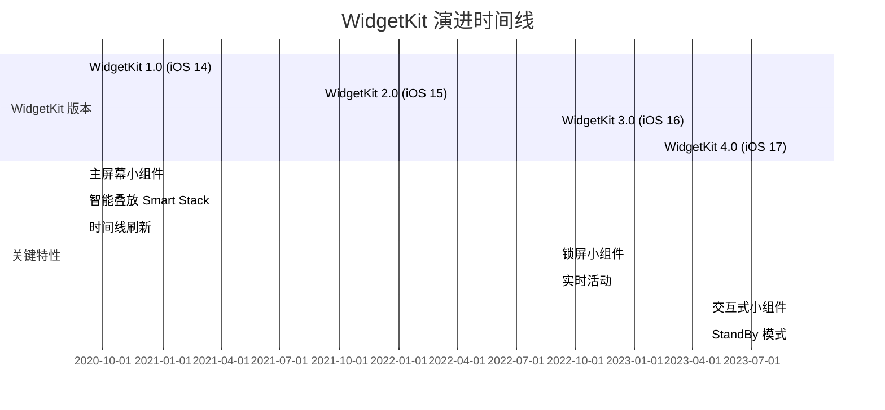

### WidgetKit 代码示例 (iOS 17+)

```swift
import WidgetKit
import SwiftUI

// MARK: - 数据模型
struct WeatherEntry: TimelineEntry {
    let date: Date
    let temperature: Int
    let condition: WeatherCondition
    let city: String
    let isDaytime: Bool
}

enum WeatherCondition: String {
    case sunny = "sun.max.fill"
    case cloudy = "cloud.fill"
    case rainy = "cloud.rain.fill"
    case snowy = "snowflake"
    
    var color: Color {
        switch self {
        case .sunny: return .orange
        case .cloudy: return .gray
        case .rainy: return .blue
        case .snowy: return .cyan
        }
    }
}

// MARK: - Provider
struct WeatherProvider: TimelineProvider {
    func placeholder(in context: Context) -> WeatherEntry {
        WeatherEntry(
            date: Date(),
            temperature: 25,
            condition: .sunny,
            city: "北京",
            isDaytime: true
        )
    }
    
    func getSnapshot(in context: Context, completion: @escaping (WeatherEntry) -> Void) {
        let entry = placeholder(in: context)
        completion(entry)
    }
    
    func getTimeline(in context: Context, completion: @escaping (Timeline<WeatherEntry>) -> Void) {
        var entries: [WeatherEntry] = []
        let currentDate = Date()
        
        // 生成未来 24 小时的时间线
        for hourOffset in 0..<24 {
            let entryDate = Calendar.current.date(byAdding: .hour, value: hourOffset, to: currentDate)!
            let entry = WeatherEntry(
                date: entryDate,
                temperature: 20 + Int.random(in: -5...10),
                condition: [.sunny, .cloudy, .rainy].randomElement()!,
                city: "北京",
                isDaytime: hourOffset >= 6 && hourOffset < 18
            )
            entries.append(entry)
        }
        
        let timeline = Timeline(entries: entries, policy: .atEnd)
        completion(timeline)
    }
}

// MARK: - 视图
struct WeatherWidgetView: View {
    var entry: WeatherProvider.Entry
    @Environment(\.widgetFamily) var family
    
    var body: some View {
        switch family {
        case .systemSmall:
            SmallWeatherView(entry: entry)
        case .systemMedium:
            MediumWeatherView(entry: entry)
        case .systemLarge:
            LargeWeatherView(entry: entry)
        case .accessoryCircular:
            AccessoryCircularView(entry: entry)
        case .accessoryRectangular:
            AccessoryRectangularView(entry: entry)
        case .accessoryInline:
            AccessoryInlineView(entry: entry)
        default:
            SmallWeatherView(entry: entry)
        }
    }
}

struct SmallWeatherView: View {
    let entry: WeatherEntry
    
    var body: some View {
        VStack {
            Image(systemName: entry.condition.rawValue)
                .font(.largeTitle)
                .foregroundColor(entry.condition.color)
            
            Text("\(entry.temperature)°")
                .font(.title)
                .bold()
            
            Text(entry.city)
                .font(.caption)
                .foregroundColor(.secondary)
        }
    }
}

struct MediumWeatherView: View {
    let entry: WeatherEntry
    
    var body: some View {
        HStack {
            VStack(alignment: .leading) {
                Text(entry.city)
                    .font(.headline)
                Text("\(entry.temperature)°")
                    .font(.largeTitle)
                    .bold()
            }
            
            Spacer()
            
            VStack {
                Image(systemName: entry.condition.rawValue)
                    .font(.system(size: 50))
                    .foregroundColor(entry.condition.color)
                Text(entry.condition.rawValue)
                    .font(.caption)
            }
        }
        .padding()
    }
}

struct LargeWeatherView: View {
    let entry: WeatherEntry
    
    var body: some View {
        VStack {
            // 当前天气
            HStack {
                VStack(alignment: .leading) {
                    Text(entry.city)
                        .font(.title2)
                    Text("\(entry.temperature)°")
                        .font(.system(size: 60))
                        .bold()
                }
                Spacer()
                Image(systemName: entry.condition.rawValue)
                    .font(.system(size: 80))
                    .foregroundColor(entry.condition.color)
            }
            
            Divider()
            
            // 未来几小时预报
            HStack(spacing: 20) {
                ForEach(0..<5) { offset in
                    let futureDate = Calendar.current.date(byAdding: .hour, value: offset + 1, to: entry.date)!
                    VStack {
                        Text(futureDate, style: .time)
                            .font(.caption)
                        Image(systemName: WeatherCondition.sunny.rawValue)
                            .foregroundColor(.orange)
                        Text("\(entry.temperature + offset)°")
                            .font(.caption)
                    }
                }
            }
        }
        .padding()
    }
}

// 锁屏小组件视图
struct AccessoryCircularView: View {
    let entry: WeatherEntry
    
    var body: some View {
        ZStack {
            AccessoryWidgetBackground()
            VStack {
                Image(systemName: entry.condition.rawValue)
                    .foregroundColor(entry.condition.color)
                Text("\(entry.temperature)°")
                    .font(.headline)
            }
        }
    }
}

struct AccessoryRectangularView: View {
    let entry: WeatherEntry
    
    var body: some View {
        HStack {
            Image(systemName: entry.condition.rawValue)
                .foregroundColor(entry.condition.color)
            Text("\(entry.temperature)° in \(entry.city)")
        }
    }
}

struct AccessoryInlineView: View {
    let entry: WeatherEntry
    
    var body: some View {
        Text("\(Image(systemName: entry.condition.rawValue)) \(entry.temperature)°")
    }
}

// MARK: - Widget 配置
@main
struct WeatherWidget: Widget {
    let kind: String = "WeatherWidget"
    
    var body: some WidgetConfiguration {
        StaticConfiguration(kind: kind, provider: WeatherProvider()) { entry in
            WeatherWidgetView(entry: entry)
        }
        .configurationDisplayName("天气小组件")
        .description("显示当前天气和预报")
        .supportedFamilies([
            .systemSmall,
            .systemMedium,
            .systemLarge,
            .accessoryCircular,
            .accessoryRectangular,
            .accessoryInline
        ])
    }
}
```

---

# 第四章：数据与测试框架

## 4.1 SwiftData — 现代数据持久化

**结论先行**：SwiftData 是 iOS 17+ 引入的现代数据持久化框架，基于 Swift 宏实现编译期模型定义，是 Core Data 的继任者。其核心优势在于与 SwiftUI 的深度集成、类型安全、以及声明式语法。

### SwiftData vs Core Data 对比

```mermaid
graph TB
    subgraph SwiftData 架构
        MODEL[@Model 宏] --> CONTEXT[ModelContext<br/>上下文]
        CONTEXT --> CONTAINER[ModelContainer<br/>容器]
        
        QUERY[@Query 属性包装器] --> SWIFTUI[SwiftUI 视图]
        SWIFTUI --> AUTOSAVE[自动保存]
    end
    
    subgraph Core Data 架构
        NSENTITY[NSEntityDescription] --> NSCONTEXT[NSManagedObjectContext]
        NSCONTEXT --> NSPERSISTENT[NSPersistentContainer]
        
        NSFETCHEDRESULTS[NSFetchedResultsController] --> UIKIT[UIKit 视图]
    end
    
    subgraph 底层存储
        SWIFTDATA_SQLITE[SQLite]
        COREDATA_SQLITE[SQLite]
        SWIFTDATA_BINARY[Binary]
        COREDATA_BINARY[Binary]
        SWIFTDATA_MEMORY[In-Memory]
        COREDATA_MEMORY[In-Memory]
    end
    
    CONTAINER --> SWIFTDATA_SQLITE
    NSPERSISTENT --> COREDATA_SQLITE
```

### SwiftData vs Core Data 对比表

| 维度 | SwiftData | Core Data | 推荐选择 |
|------|-----------|-----------|---------|
| **引入版本** | iOS 17 | iOS 3 | 新项目选 SwiftData |
| **API 风格** | Swift 原生、声明式 | Objective-C 风格 | SwiftData |
| **模型定义** | @Model 宏 | Xcode 数据模型编辑器 | SwiftData 更简洁 |
| **类型安全** | 编译期检查 | 运行时检查 | SwiftData |
| **SwiftUI 集成** | @Query 原生支持 | 需额外封装 | SwiftData |
| **向后兼容** | iOS 17+ | iOS 3+ | 旧版本用 Core Data |
| **功能完整度** | 基础功能 | 完整功能（迁移、版本等） | 复杂场景用 Core Data |
| **性能** | 接近 Core Data | 优化成熟 | 接近 |

### SwiftData 代码示例 (iOS 17+)

```swift
import SwiftData
import SwiftUI

// MARK: - 数据模型定义
@Model
class Person {
    var name: String
    var birthDate: Date
    var email: String?
    
    // 关系定义
    @Relationship(deleteRule: .cascade) var notes: [Note] = []
    
    init(name: String, birthDate: Date, email: String? = nil) {
        self.name = name
        self.birthDate = birthDate
        self.email = email
    }
}

@Model
class Note {
    var content: String
    var createdAt: Date
    
    // 反向关系
    var person: Person?
    
    init(content: String, createdAt: Date = Date()) {
        self.content = content
        self.createdAt = createdAt
    }
}

// MARK: - SwiftUI 视图
struct PeopleListView: View {
    @Environment(\.modelContext) private var modelContext
    @Query(sort: \Person.name) private var people: [Person]
    
    @State private var searchText = ""
    
    var body: some View {
        NavigationStack {
            List {
                ForEach(filteredPeople) { person in
                    NavigationLink(destination: PersonDetailView(person: person)) {
                        PersonRowView(person: person)
                    }
                }
                .onDelete(perform: deletePeople)
            }
            .searchable(text: $searchText)
            .navigationTitle("联系人")
            .toolbar {
                ToolbarItem(placement: .navigationBarTrailing) {
                    Button(action: addPerson) {
                        Label("添加", systemImage: "plus")
                    }
                }
            }
        }
    }
    
    private var filteredPeople: [Person] {
        if searchText.isEmpty {
            return people
        }
        return people.filter { $0.name.localizedCaseInsensitiveContains(searchText) }
    }
    
    private func addPerson() {
        let newPerson = Person(
            name: "新联系人",
            birthDate: Date(),
            email: nil
        )
        modelContext.insert(newPerson)
    }
    
    private func deletePeople(offsets: IndexSet) {
        for index in offsets {
            modelContext.delete(filteredPeople[index])
        }
    }
}

struct PersonRowView: View {
    let person: Person
    
    var body: some View {
        VStack(alignment: .leading) {
            Text(person.name)
                .font(.headline)
            if let email = person.email {
                Text(email)
                    .font(.caption)
                    .foregroundColor(.secondary)
            }
            Text("\(person.notes.count) 条笔记")
                .font(.caption2)
                .foregroundColor(.gray)
        }
    }
}

struct PersonDetailView: View {
    @Bindable var person: Person
    @Environment(\.modelContext) private var modelContext
    
    var body: some View {
        Form {
            Section("基本信息") {
                TextField("姓名", text: $person.name)
                DatePicker("生日", selection: $person.birthDate, displayedComponents: .date)
                TextField("邮箱", text: Binding(
                    get: { person.email ?? "" },
                    set: { person.email = $0.isEmpty ? nil : $0 }
                ))
            }
            
            Section("笔记") {
                ForEach(person.notes) { note in
                    VStack(alignment: .leading) {
                        Text(note.content)
                        Text(note.createdAt, style: .date)
                            .font(.caption)
                            .foregroundColor(.secondary)
                    }
                }
                
                Button("添加笔记") {
                    let note = Note(content: "新笔记")
                    note.person = person
                    person.notes.append(note)
                }
            }
        }
        .navigationTitle(person.name)
    }
}

// MARK: - 高级查询
struct AdvancedQueryView: View {
    @Environment(\.modelContext) private var modelContext
    
    // 谓词查询
    @Query(filter: #Predicate<Person> { person in
        person.name.contains("张")
    }, sort: \Person.birthDate) 
    private zhangFamily: [Person]
    
    // 动态查询
    @State private var minAge = 18
    
    var body: some View {
        List {
            Section("张家成员") {
                ForEach(zhangFamily) { person in
                    Text(person.name)
                }
            }
            
            Section("动态查询") {
                DynamicAgeQueryView(minAge: minAge)
            }
        }
    }
}

struct DynamicAgeQueryView: View {
    let minAge: Int
    
    @Query 
    private var people: [Person]
    
    init(minAge: Int) {
        let calendar = Calendar.current
        let maxBirthDate = calendar.date(byAdding: .year, value: -minAge, to: Date())!
        
        _people = Query(filter: #Predicate<Person> { person in
            person.birthDate <= maxBirthDate
        }, sort: \Person.name)
    }
    
    var body: some View {
        ForEach(people) { person in
            Text(person.name)
        }
    }
}

// MARK: - App 入口
@main
struct SwiftDataApp: App {
    var body: some Scene {
        WindowGroup {
            PeopleListView()
        }
        .modelContainer(for: [Person.self, Note.self])
    }
}
```

---

## 4.2 TipKit — 用户引导框架

**结论先行**：TipKit 是 iOS 17+ 引入的用户引导框架，用于在应用内展示提示（Tips），帮助用户发现新功能。它支持基于规则的显示逻辑、频率控制、以及与 UI 元素的关联。

### TipKit 代码示例 (iOS 17+)

```swift
import TipKit
import SwiftUI

// MARK: - 定义提示
struct SearchTip: Tip {
    var title: Text {
        Text("试试搜索功能")
    }
    
    var message: Text? {
        Text("点击这里可以快速查找内容")
    }
    
    var image: Image? {
        Image(systemName: "magnifyingglass")
    }
    
    // 显示规则
    var rules: [Rule] {
        #Rule(Self.$hasSeenSearch) {
            $0 == false
        }
    }
    
    // 选项配置
    var options: [TipOption] {
        [
            .maxDisplayCount(3),
            .displayFrequency(.daily)
        ]
    }
    
    @Parameter
    static var hasSeenSearch: Bool = false
}

struct NewFeatureTip: Tip {
    var title: Text {
        Text("新功能上线！")
    }
    
    var message: Text? {
        Text("我们现在支持深色模式了")
    }
    
    var actions: [Action] {
        [
            Action(id: "try-now", title: "立即尝试"),
            Action(id: "later", title: "稍后再说")
        ]
    }
}

// MARK: - 使用提示
struct ContentViewWithTips: View {
    private var searchTip = SearchTip()
    private var newFeatureTip = NewFeatureTip()
    
    @State private var searchText = ""
    @State private var isDarkMode = false
    
    var body: some View {
        NavigationStack {
            List {
                // 提示展示
                TipView(searchTip)
                    .tipBackground(Color.blue.opacity(0.1))
                
                ForEach(0..<20) { index in
                    Text("项目 \(index)")
                }
            }
            .navigationTitle("提示示例")
            .searchable(text: $searchText)
            .searchFocused($searchText, equals: "")
            .toolbar {
                ToolbarItem(placement: .navigationBarTrailing) {
                    Button(action: { isDarkMode.toggle() }) {
                        Image(systemName: isDarkMode ? "moon.fill" : "sun.max.fill")
                    }
                    .popoverTip(newFeatureTip) { action in
                        switch action.id {
                        case "try-now":
                            isDarkMode = true
                        case "later":
                            break
                        default:
                            break
                        }
                    }
                }
            }
            .onChange(of: searchText) { _, newValue in
                if !newValue.isEmpty {
                    SearchTip.hasSeenSearch = true
                }
            }
        }
    }
}

// MARK: - App 配置
@main
struct TipKitApp: App {
    var body: some Scene {
        WindowGroup {
            ContentViewWithTips()
        }
    }
}

// 在 AppDelegate 或初始化时配置 TipKit
class AppDelegate: NSObject, UIApplicationDelegate {
    func application(_ application: UIApplication, 
                     didFinishLaunchingWithOptions launchOptions: [UIApplication.LaunchOptionsKey: Any]? = nil) -> Bool {
        
        // 配置 TipKit
        try? Tips.configure([
            .displayFrequency(.immediate),
            .datastoreLocation(.applicationDefault)
        ])
        
        return true
    }
}
```

---

## 4.3 Swift Testing — 新测试框架

**结论先行**：Swift Testing 是 Apple 在 WWDC 2024 推出的新测试框架，旨在替代 XCTest。它基于 Swift 宏实现，提供更简洁的语法、更好的并发支持、以及更丰富的断言表达式。

### Swift Testing vs XCTest 对比

| 维度 | Swift Testing | XCTest | 优势 |
|------|--------------|--------|------|
| **语法** | 声明式、简洁 | 类和方法 | Swift Testing 更简洁 |
| **并发支持** | 原生 async/await | 有限支持 | Swift Testing 更好 |
| **参数化测试** | @Test(arguments:) | 需手动实现 | Swift Testing 内置 |
| **组织方式** | @Suite、@Test | 类继承 | Swift Testing 灵活 |
| **断言** | #expect、#require | XCTAssert | Swift Testing 表达力强 |
| **向后兼容** | iOS 18+ / macOS 15+ | 全版本 | XCTest 兼容性好 |

### Swift Testing 代码示例 (iOS 18+)

```swift
import Testing

// MARK: - 被测试代码
struct Calculator {
    func add(_ a: Int, _ b: Int) -> Int {
        return a + b
    }
    
    func subtract(_ a: Int, _ b: Int) -> Int {
        return a - b
    }
    
    func divide(_ a: Int, _ b: Int) throws -> Int {
        guard b != 0 else {
            throw CalculatorError.divisionByZero
        }
        return a / b
    }
    
    func multiply(_ a: Int, _ b: Int) -> Int {
        return a * b
    }
}

enum CalculatorError: Error {
    case divisionByZero
}

// MARK: - 测试套件
@Suite("计算器测试")
struct CalculatorTests {
    let calculator = Calculator()
    
    // MARK: 基础测试
    @Test("加法运算")
    func addition() {
        #expect(calculator.add(2, 3) == 5)
        #expect(calculator.add(-1, 1) == 0)
        #expect(calculator.add(0, 0) == 0)
    }
    
    @Test("减法运算")
    func subtraction() {
        #expect(calculator.subtract(5, 3) == 2)
        #expect(calculator.subtract(3, 5) == -2)
    }
    
    // MARK: 异常测试
    @Test("除零异常")
    func divisionByZero() {
        #expect(throws: CalculatorError.divisionByZero) {
            try calculator.divide(10, 0)
        }
    }
    
    @Test("正常除法")
    func normalDivision() throws {
        let result = try calculator.divide(10, 2)
        #expect(result == 5)
    }
    
    // MARK: 参数化测试
    @Test("乘法运算", arguments: [
        (2, 3, 6),
        (5, 5, 25),
        (0, 100, 0),
        (-2, 3, -6),
        (-2, -3, 6)
    ])
    func multiplication(a: Int, b: Int, expected: Int) {
        #expect(calculator.multiply(a, b) == expected)
    }
    
    // MARK: 异步测试
    @Test("异步加法")
    func asyncAddition() async {
        let result = await asyncAdd(2, 3)
        #expect(result == 5)
    }
    
    func asyncAdd(_ a: Int, _ b: Int) async -> Int {
        try? await Task.sleep(nanoseconds: 100_000_000)
        return a + b
    }
    
    // MARK: 条件测试
    @Test("仅在 iOS 18 运行", .enabled(if: isIOS18()))
    func iOS18Feature() {
        #expect(true)
    }
    
    func isIOS18() -> Bool {
        if #available(iOS 18.0, *) {
            return true
        }
        return false
    }
}

// MARK: - 带生命周期的测试
@Suite(.serialized)
struct DatabaseTests {
    var database: Database!
    
    init() {
        // 每个测试前的初始化
        database = Database()
    }
    
    deinit {
        // 每个测试后的清理
        database?.close()
    }
    
    @Test("数据库连接")
    func connection() {
        #expect(database.isConnected == true)
    }
    
    @Test("数据插入")
    func insert() throws {
        try database.insert(key: "test", value: "value")
        #expect(database.count == 1)
    }
}

// 模拟数据库
class Database {
    var isConnected = true
    var count = 0
    
    func insert(key: String, value: String) throws {
        count += 1
    }
    
    func close() {
        isConnected = false
    }
}

// MARK: - Trait 标记测试
@Suite
struct PerformanceTests {
    @Test("性能基准", .tags(.performance))
    func benchmark() {
        var sum = 0
        for i in 0..<1000000 {
            sum += i
        }
        #expect(sum > 0)
    }
}

// 自定义 Tag
extension Tag {
    @Tag static var performance: Self
}
```

---

# 第五章：人工智能框架

## 5.1 Apple Intelligence — 设备端 AI

**结论先行**：Apple Intelligence 是 Apple 在 WWDC 2024 推出的端侧 AI 能力集合，包括语言模型、图像生成、以及 Siri 智能化。其核心优势在于隐私保护（设备端处理）和系统集成（跨应用协作）。

### Apple Intelligence 架构

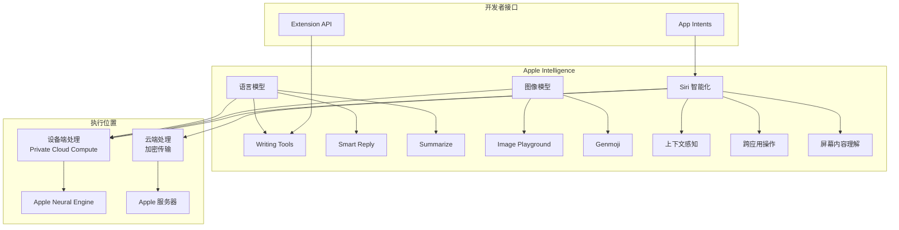

### Apple Intelligence 功能表

| 功能 | 说明 | 开发者接口 | 最低版本 |
|------|------|-----------|---------|
| **Writing Tools** | 文本重写、校对、摘要 | 系统自动集成 | iOS 18 |
| **Smart Reply** | 智能回复建议 | Messages API | iOS 18 |
| **Image Playground** | 图像生成 | ImagePlayground API | iOS 18 |
| **Genmoji** | 自定义表情生成 | 系统键盘 | iOS 18 |
| **Siri 增强** | 上下文感知、屏幕理解 | App Intents | iOS 18 |
| **Private Cloud Compute** | 云端私密计算 | 自动使用 | iOS 18 |

### App Intents 代码示例 (iOS 18+)

```swift
import AppIntents

// MARK: - 定义 App Intent
struct SendMessageIntent: AppIntent {
    static var title: LocalizedStringResource = "发送消息"
    static var description = IntentDescription("向联系人发送消息")
    
    @Parameter(title: "联系人", description: "消息接收者")
    var contact: ContactEntity
    
    @Parameter(title: "消息内容", description: "要发送的内容")
    var message: String
    
    @MainActor
    func perform() async throws -> some IntentResult {
        // 执行发送消息操作
        let messageService = MessageService()
        try await messageService.send(to: contact.id, content: message)
        
        return .result(dialog: "消息已发送给 \(contact.name)")
    }
}

// MARK: - 实体定义
struct ContactEntity: AppEntity {
    let id: String
    let name: String
    let phoneNumber: String?
    
    static var typeDisplayRepresentation: TypeDisplayRepresentation = "联系人"
    
    var displayRepresentation: DisplayRepresentation {
        DisplayRepresentation(title: "\(name)")
    }
}

// MARK: - 实体查询
struct ContactQuery: EntityQuery {
    func entities(for identifiers: [String]) async throws -> [ContactEntity] {
        // 根据 ID 查询联系人
        let contacts = await ContactStore.shared.fetchContacts(ids: identifiers)
        return contacts.map { ContactEntity(id: $0.id, name: $0.name, phoneNumber: $0.phone) }
    }
    
    func suggestedEntities() async throws -> [ContactEntity] {
        // 返回建议的联系人
        let recentContacts = await ContactStore.shared.fetchRecentContacts()
        return recentContacts.map { ContactEntity(id: $0.id, name: $0.name, phoneNumber: $0.phone) }
    }
}

// MARK: - Siri 快捷指令扩展
struct MyAppShortcuts: AppShortcutsProvider {
    static var appShortcuts: [AppShortcut] {
        AppShortcut(
            intent: SendMessageIntent(),
            phrases: [
                "用 \(.applicationName) 给 \($contact) 发消息",
                "告诉 \($contact) \($message)"
            ],
            shortTitle: "发消息",
            systemImageName: "message.fill"
        )
    }
}

// MARK: - 模拟服务
class MessageService {
    func send(to contactId: String, content: String) async throws {
        // 实际发送逻辑
        print("发送消息给 \(contactId): \(content)")
    }
}

class ContactStore {
    static let shared = ContactStore()
    
    func fetchContacts(ids: [String]) async -> [Contact] {
        // 实际查询逻辑
        return []
    }
    
    func fetchRecentContacts() async -> [Contact] {
        // 实际查询逻辑
        return []
    }
}

struct Contact {
    let id: String
    let name: String
    let phone: String?
}
```

---

## 5.2 Core ML 更新与设备端模型

**结论先行**：Core ML 持续演进，支持更大的模型、更快的推理、以及更多的模型格式。与 Apple Intelligence 配合，Core ML 为开发者提供了在应用中集成 AI 能力的完整工具链。

### Core ML 演进路线图

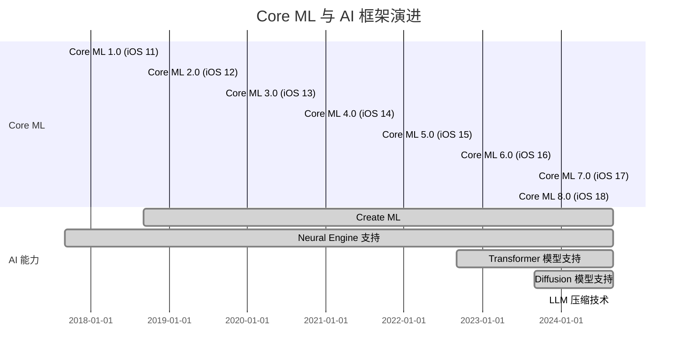

---

# 第六章：框架成熟度评估与选型指南

## 6.1 框架成熟度评估矩阵

**结论先行**：新兴框架的选型需要综合考虑成熟度、学习成本、向后兼容性。建议采用「保守尝鲜」策略：生产环境使用成熟框架，创新项目尝试新框架。

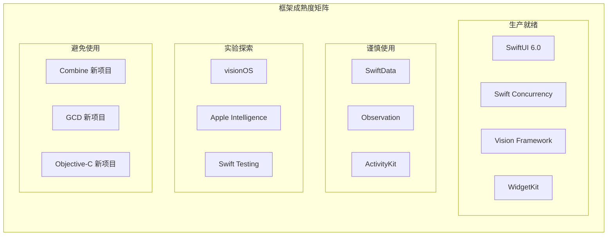

### 框架选型决策表

| 框架 | 成熟度 | 学习曲线 | 向后兼容 | 生产建议 | 替代方案 |
|------|--------|---------|---------|---------|---------|
| **Vision** | ⭐⭐⭐⭐⭐ | 中 | iOS 11+ | ✅ 生产使用 | 第三方 ML Kit |
| **RealityKit** | ⭐⭐⭐⭐ | 高 | iOS 13+ | ✅ 生产使用 | SceneKit |
| **ActivityKit** | ⭐⭐⭐⭐ | 低 | iOS 16.1+ | ✅ 生产使用 | 本地通知 |
| **WidgetKit** | ⭐⭐⭐⭐⭐ | 低 | iOS 14+ | ✅ 生产使用 | - |
| **SwiftData** | ⭐⭐⭐ | 低 | iOS 17+ | ⚠️ 谨慎使用 | Core Data |
| **TipKit** | ⭐⭐⭐⭐ | 低 | iOS 17+ | ✅ 生产使用 | 自定义引导 |
| **Swift Testing** | ⭐⭐⭐ | 低 | iOS 18+ | ⚠️ 实验使用 | XCTest |
| **Apple Intelligence** | ⭐⭐ | 中 | iOS 18+ | ⚠️ 实验使用 | 云端 AI |

---

## 6.2 技术演进路线图

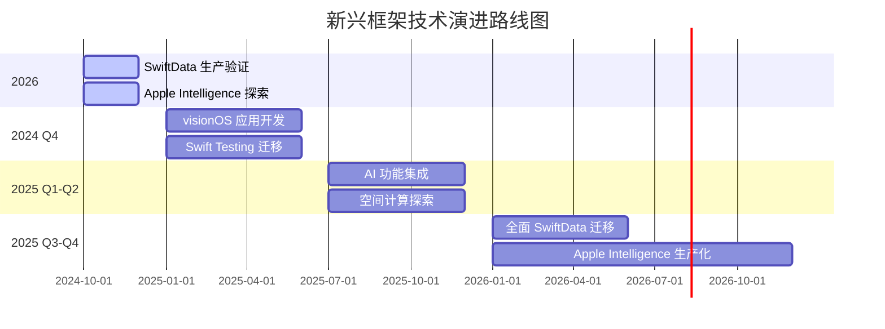

---

## 总结

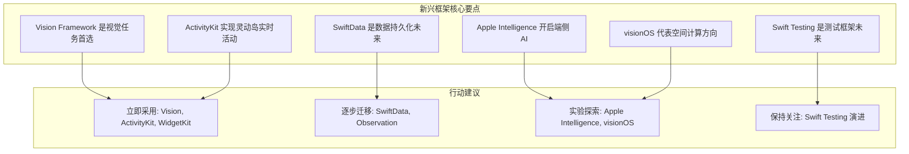

### 关键要点回顾

| 框架类别 | 核心要点 | 最重要的一句话 |
|---------|---------|-------------|
| **视觉感知** | Vision Framework 覆盖 OCR、检测、跟踪 | 视觉任务优先使用 Vision，而非第三方 |
| **空间计算** | RealityKit + ARKit + visionOS | 空间计算是未来 10 年的重要方向 |
| **实时交互** | ActivityKit 灵动岛 + WidgetKit | 实时活动提升用户参与度 |
| **数据持久化** | SwiftData 替代 Core Data | 新项目优先 SwiftData |
| **测试** | Swift Testing 替代 XCTest | 关注 Swift Testing 演进 |
| **AI** | Apple Intelligence 端侧优先 | 隐私敏感场景优先端侧 AI |

### 学习路径建议

1. **立即学习**：Vision Framework、ActivityKit、WidgetKit
2. **短期学习**：SwiftData、Observation、TipKit
3. **中期规划**：Apple Intelligence App Intents、RealityKit 进阶
4. **长期储备**：visionOS 开发、空间计算设计模式

---

## 参考资源

### 内部知识库关联

- [iOS CoreML 机器学习框架金字塔解析](../../iOS_CoreML_机器学习框架_金字塔解析.md) —— Core ML 深度解析
- [iOS Metal 渲染技术金字塔解析](../../iOS_Metal_渲染技术_金字塔解析.md) —— RealityKit 底层渲染
- [Apple框架生态全景与战略定位](./Apple框架生态全景与战略定位_详细解析.md) —— 框架整体战略

### 官方文档

- [Vision Framework Documentation](https://developer.apple.com/documentation/vision)
- [ActivityKit Documentation](https://developer.apple.com/documentation/activitykit)
- [WidgetKit Documentation](https://developer.apple.com/documentation/widgetkit)
- [SwiftData Documentation](https://developer.apple.com/documentation/swiftdata)
- [Swift Testing Documentation](https://developer.apple.com/documentation/testing)
- [Apple Intelligence Documentation](https://developer.apple.com/documentation/apple-intelligence)
- [visionOS Documentation](https://developer.apple.com/documentation/visionos)

### WWDC 推荐视频

- [WWDC 2022: What's new in Vision](https://developer.apple.com/videos/play/wwdc2022/10026/)
- [WWDC 2023: Meet SwiftData](https://developer.apple.com/videos/play/wwdc2023/10187/)
- [WWDC 2023: Meet ActivityKit](https://developer.apple.com/videos/play/wwdc2023/10184/)
- [WWDC 2024: Meet Swift Testing](https://developer.apple.com/videos/play/wwdc2024/10186/)
- [WWDC 2024: Apple Intelligence](https://developer.apple.com/videos/play/wwdc2024/10176/)
