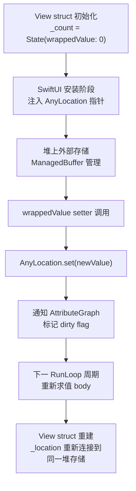
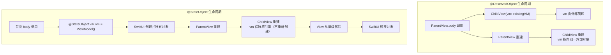
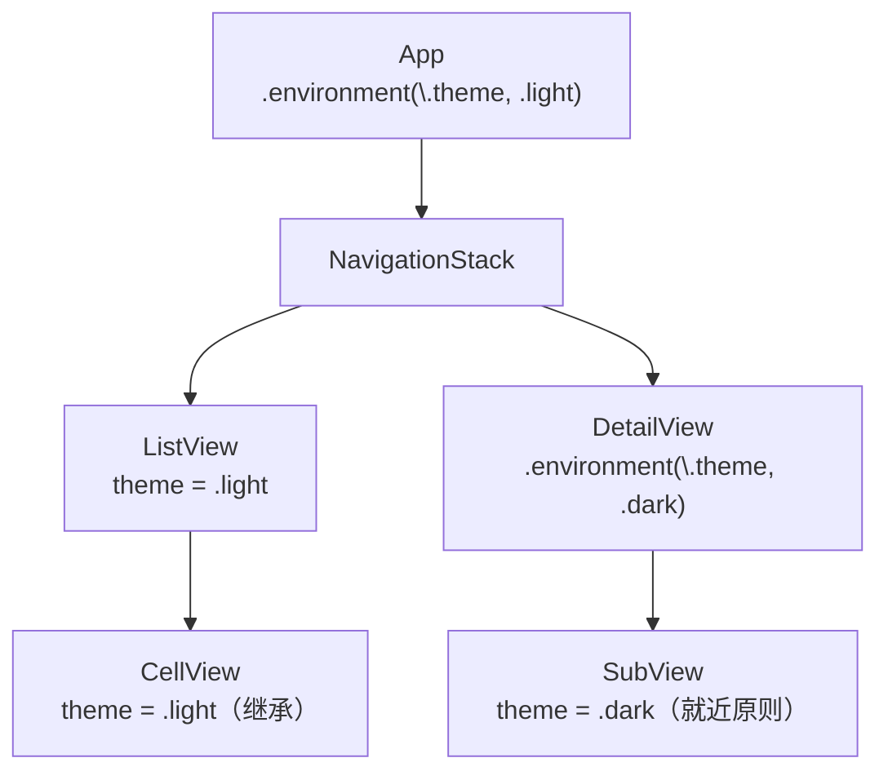
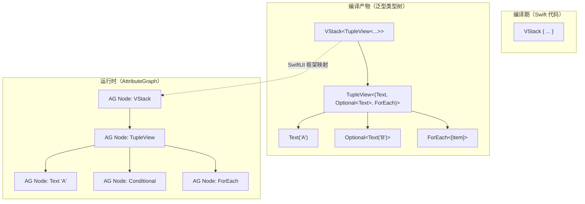
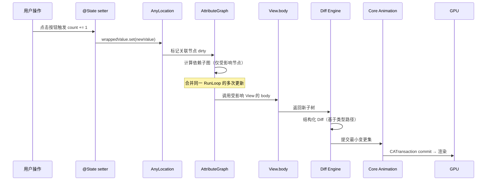
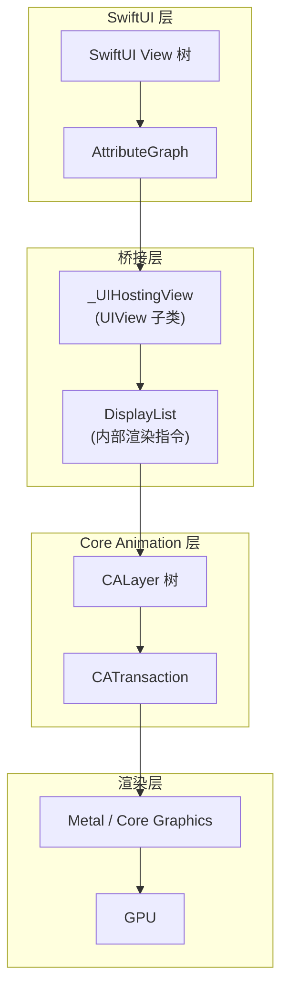

# SwiftUI 关键字与运行原理深度解析

> **文档版本**: iOS 17+ / Swift 5.9+ / Xcode 15+  
> **核心定位**: 深入剖析 SwiftUI 关键字体系的编译期展开与运行时行为  
> **前置阅读**: [SwiftUI架构与渲染机制](SwiftUI架构与渲染机制_详细解析.md) · [SwiftUI高级实践与性能优化](SwiftUI高级实践与性能优化_详细解析.md)

---

## 核心结论 TL;DR

| 关键字 | 一句话本质 | 存储位置 | 更新粒度 |
|--------|-----------|---------|---------|
| `@State` | Framework 管理的值类型外部存储 | SwiftUI 内部堆分配（非 View struct 成员） | 单属性精确更新 |
| `@Binding` | getter/setter 闭包对，不拥有数据 | 无存储，引用 Source of Truth | 随源端一起更新 |
| `@ObservedObject` | 外部传入的 ObservableObject 引用 | 调用方管理 | 对象级（任何 @Published 触发） |
| `@StateObject` | 生命周期绑定 View 的 ObservableObject | SwiftUI 框架托管 | 对象级（任何 @Published 触发） |
| `@Observable` | Swift 宏驱动的属性级追踪 | @State 托管或外部引用 | **属性级精准追踪** |
| `@Environment` | 通过 KeyPath 查找的环境值 | 视图树隐式传播 | 被访问 Key 变化时更新 |
| `@EnvironmentObject` | 类型匹配的隐式注入对象 | 祖先 View 提供 | 对象级 |
| `@AppStorage` | UserDefaults 的响应式包装 | UserDefaults 持久化 | 单 Key 更新 |
| `@SceneStorage` | 场景级状态恢复存储 | 系统管理的场景存储 | 单 Key 更新 |

---

## 二、Swift 语言特性如何支撑 SwiftUI

**核心结论：SwiftUI 的声明式语法依赖三大编译器特性——Result Builder 提供 DSL、Opaque Type 保留类型信息、Property Wrapper 封装状态管理逻辑。**

### 2.1 Result Builder (@ViewBuilder) 编译期展开原理

`@ViewBuilder` 是 `@resultBuilder` 属性标注的结构体。编译器在编译期将闭包中的 DSL 语法转换为一系列静态方法调用。

#### 核心 Builder 方法

| 方法 | 触发条件 | 作用 |
|------|---------|------|
| `buildBlock(_:)` | 多个表达式顺序排列 | 将子视图组合为 `TupleView` |
| `buildEither(first:)` / `buildEither(second:)` | `if-else` 分支 | 生成 `_ConditionalContent<TrueView, FalseView>` |
| `buildOptional(_:)` | `if` 无 `else` | 生成 `Optional<SomeView>` |
| `buildArray(_:)` | `for-in` 循环 | 生成 `[SomeView]` |
| `buildLimitedAvailability(_:)` | `if #available` | 类型擦除为 `AnyView` |

#### 编译器展开示例

**开发者编写的 DSL 语法：**

```swift
// Swift 5.9+ / iOS 17+
struct ContentView: View {
    @State private var isLoggedIn = false

    var body: some View {
        VStack {
            Text("Header")
            if isLoggedIn {
                Text("Welcome")
            } else {
                Text("Please login")
            }
            Text("Footer")
        }
    }
}
```

**编译器展开后的等价代码：**

```swift
// 编译器实际生成的代码（简化表示）
var body: some View {
    VStack {
        // @ViewBuilder 将闭包转换为：
        ViewBuilder.buildBlock(
            Text("Header"),
            ViewBuilder.buildEither(
                isLoggedIn
                    ? .first(ViewBuilder.buildEither(first: Text("Welcome")))
                    : .second(ViewBuilder.buildEither(second: Text("Please login")))
            ),
            Text("Footer")
        )
    }
    // 返回类型：VStack<TupleView<(Text, _ConditionalContent<Text, Text>, Text)>>
}
```

> **关键洞察**：`if-else` 不会销毁/创建视图，而是生成 `_ConditionalContent` 泛型类型。两个分支的视图始终存在于类型系统中，仅通过枚举切换显示。这保证了 AttributeGraph 节点标识的稳定性（详见 [SwiftUI架构与渲染机制](SwiftUI架构与渲染机制_详细解析.md) AttributeGraph 引擎章节）。

### 2.2 Opaque Return Type (some View) 原理

**核心结论：`some View` 是编译器反向泛型（Reverse Generic），保留具体类型信息供 AttributeGraph 进行精确节点标识，而 `AnyView` 会擦除类型导致 Diff 失效。**

#### 为何 body 返回 some View 而非 AnyView

```swift
// ✅ some View：编译器推断具体类型为 VStack<TupleView<(Text, Text)>>
var body: some View {
    VStack {
        Text("Hello")
        Text("World")
    }
}

// ❌ AnyView：类型信息被擦除，AttributeGraph 无法通过类型层级区分节点
var body: AnyView {
    AnyView(VStack {
        Text("Hello")
        Text("World")
    })
}
```

**编译器类型推断机制**：

1. 编译器对 `body` 属性的返回值进行完整类型推断
2. `some View` 对外隐藏具体类型，对编译器保留——调用方只知道遵循 `View`，内部保持完整泛型类型
3. 每次 `body` 调用**必须返回相同的具体类型**（这是 Opaque Type 的约束）

**对 AttributeGraph 的影响**：

| 返回类型 | AttributeGraph 行为 | Diff 效率 |
|---------|---------------------|----------|
| `some View` | 根据编译期确定的泛型嵌套路径精确匹配节点 | O(n) 结构化 Diff |
| `AnyView` | 运行时类型检查，无法复用节点 | O(n) 全量比较，频繁销毁重建 |

### 2.3 Property Wrapper 在 SwiftUI 中的角色

**核心结论：Property Wrapper 是 SwiftUI 状态管理的编译器糖衣——`@State var count` 被展开为存储 `State<Int>` 结构体、生成 `wrappedValue` 访问器和 `$count` 投影属性。**

#### wrappedValue / projectedValue 机制

```swift
// @State var count = 0 在编译期展开为：
@propertyWrapper
struct State<Value> {
    // 实际存储（指向 SwiftUI 框架管理的外部位置）
    internal var _value: Value
    internal var _location: AnyLocation<Value>?

    var wrappedValue: Value {
        get { _location?.get() ?? _value }
        nonmutating set { _location?.set(newValue) }  // nonmutating！
    }

    // $ 前缀访问
    var projectedValue: Binding<Value> {
        Binding(
            get: { wrappedValue },
            set: { wrappedValue = $0 }
        )
    }
}
```

#### 编译器处理流程

```swift
// 开发者写的：
struct MyView: View {
    @State private var count = 0
}

// 编译器展开为：
struct MyView: View {
    private var _count = State<Int>(wrappedValue: 0)

    private var count: Int {
        get { _count.wrappedValue }
        nonmutating set { _count.wrappedValue = newValue }
    }

    // $ 前缀属性
    private var $count: Binding<Int> {
        _count.projectedValue
    }
}
```

#### 自定义 Property Wrapper 实现状态管理

```swift
// Swift 5.9+ / iOS 17+
// 自定义 Debounced 属性包装器
@propertyWrapper
struct Debounced<Value>: DynamicProperty {
    @State private var debouncedValue: Value
    @State private var pendingValue: Value
    private let delay: TimeInterval

    init(wrappedValue: Value, delay: TimeInterval = 0.3) {
        _debouncedValue = State(initialValue: wrappedValue)
        _pendingValue = State(initialValue: wrappedValue)
        self.delay = delay
    }

    var wrappedValue: Value {
        get { debouncedValue }
        nonmutating set {
            pendingValue = newValue
            // 简化示例：实际需要 Task + cancellation
        }
    }

    var projectedValue: Binding<Value> {
        Binding(get: { pendingValue }, set: { wrappedValue = $0 })
    }
}
```

> **注意**：自定义属性包装器需遵循 `DynamicProperty` 协议才能参与 SwiftUI 的更新机制。SwiftUI 在每次渲染前会调用 `DynamicProperty.update()` 方法。

---

## 三、状态关键字深度解析

### 3.1 @State

**核心结论：`@State` 的数据不存储在 View struct 内部，而是由 SwiftUI 框架在堆上分配的外部存储管理，View 重建时通过 AnyLocation 指针重新连接。**

#### 底层类型

```swift
// State<Value> 底层结构（伪代码还原）
public struct State<Value>: DynamicProperty {
    @usableFromInline
    internal var _value: Value                    // 初始值
    @usableFromInline
    internal var _location: AnyLocation<Value>?   // 框架注入的存储指针

    public init(wrappedValue value: Value) {
        _value = value
    }

    public var wrappedValue: Value {
        get {
            // 首次访问前 _location 为 nil，返回 _value
            // 框架安装后通过 _location 读取外部存储
            guard let location = _location else { return _value }
            return location.get()
        }
        nonmutating set {
            guard let location = _location else { return }
            location.set(newValue)
            // 内部触发 AttributeGraph 的 dirty 标记
        }
    }

    public var projectedValue: Binding<Value> {
        guard let location = _location else {
            fatalError("Accessing $state outside of body")
        }
        return Binding(location: location)
    }
}
```

#### 存储与更新机制



#### 编译展开验证

```swift
// Swift 5.9+ / iOS 17+
struct CounterView: View {
    @State private var count = 0   // 等价于 private var _count = State(wrappedValue: 0)

    var body: some View {
        VStack {
            Text("\(count)")           // 读取 _count.wrappedValue
            Button("Increment") {
                count += 1             // 调用 _count.wrappedValue { nonmutating set }
            }
            ChildView(count: $count)   // 传递 _count.projectedValue (Binding<Int>)
        }
    }
}
```

#### ⚠️ 常见误用

```swift
// ❌ 误用 1：在初始化器中修改 @State（此时 _location 尚未注入）
init(initialCount: Int) {
    _count = State(initialValue: initialCount)  // ✅ 正确用法：通过 _前缀 初始化
    count = initialCount                         // ❌ 错误：此时 wrappedValue setter 无效
}

// ❌ 误用 2：在子视图中声明 @State
struct ParentView: View {
    var body: some View {
        ChildView()  // ChildView 的 @State 在每次 ParentView.body 求值时不会重置
    }
}
struct ChildView: View {
    @State private var data = loadExpensiveData()  // ⚠️ 初始值只在首次安装时使用
    // ...
}
```

### 3.2 @Binding

**核心结论：`@Binding` 不存储任何数据，本质是一对 getter/setter 闭包，通过 setter 回调将变化传播回 Source of Truth。**

#### 底层类型

```swift
// Binding<Value> 核心结构（简化）
@frozen public struct Binding<Value> {
    // 核心：一对闭包
    internal var getter: () -> Value
    internal var setter: (Value, Transaction) -> Void

    public var wrappedValue: Value {
        get { getter() }
        nonmutating set { setter(newValue, Transaction()) }
    }

    public var projectedValue: Binding<Value> { self }
}
```

#### $ 前缀产生 Binding 的原理

```swift
struct ParentView: View {
    @State private var text = ""

    var body: some View {
        // $text 等价于 _text.projectedValue
        // projectedValue 返回 Binding<String>
        // Binding 内部：
        //   getter = { self._text.wrappedValue }
        //   setter = { self._text.wrappedValue = $0 }
        TextField("Input", text: $text)
    }
}
```

#### ⚠️ 常见误用：手动创建 Binding 的陷阱

```swift
// ❌ 危险：引用了 self，可能造成循环引用或访问已释放对象
let binding = Binding<String>(
    get: { self.viewModel.name },
    set: { self.viewModel.name = $0 }
)

// ✅ 安全方式：使用 @Observable 的 @Bindable
@Observable class ViewModel {
    var name: String = ""
}

struct SafeView: View {
    @Bindable var viewModel: ViewModel

    var body: some View {
        TextField("Name", text: $viewModel.name)
    }
}
```

### 3.3 @ObservedObject / @StateObject

**核心结论：两者都依赖 `ObservableObject` 协议 + `objectWillChange` Publisher 触发更新，核心差异在于对象的生命周期归属。**

#### ObservableObject 协议

```swift
public protocol ObservableObject: AnyObject {
    associatedtype ObjectWillChangePublisher: Publisher = ObservableObjectPublisher
        where ObjectWillChangePublisher.Failure == Never

    var objectWillChange: ObjectWillChangePublisher { get }
}

// @Published 属性在 willSet 时触发 objectWillChange.send()
class ViewModel: ObservableObject {
    @Published var count = 0    // 任何 @Published 变化 → objectWillChange.send()
    @Published var name = ""    // 即使只修改 name，也会通知所有观察此对象的 View
}
```

#### 生命周期差异对比



#### @StateObject 保持引用的机制

```swift
// SwiftUI 内部实现（伪代码）
struct StateObject<ObjectType: ObservableObject>: DynamicProperty {
    // 使用 @autoclosure 延迟创建
    private let thunk: () -> ObjectType

    // 实际存储在框架管理的外部 Box 中
    @State private var box: ObjectBox<ObjectType>?

    init(wrappedValue thunk: @autoclosure @escaping () -> ObjectType) {
        self.thunk = thunk
    }

    var wrappedValue: ObjectType {
        // 首次访问时创建，后续直接返回
        if box == nil { box = ObjectBox(thunk()) }
        return box!.object
    }
}
```

#### ⚠️ 常见误用

```swift
// ❌ 子视图中使用 @StateObject（应为 @ObservedObject）
struct ChildView: View {
    @StateObject var viewModel: ViewModel  // ❌ @StateObject 用于创建，不是接收

    var body: some View { Text(viewModel.name) }
}

// ✅ 正确：子视图用 @ObservedObject 接收外部传入的对象
struct ChildView: View {
    @ObservedObject var viewModel: ViewModel

    var body: some View { Text(viewModel.name) }
}
```

### 3.4 @Observable (iOS 17+)

**核心结论：`@Observable` 是 Swift 宏，在编译期生成属性级观察代码，实现从对象级刷新到属性级精准追踪的质变。**（详见 [SwiftUI高级实践与性能优化](SwiftUI高级实践与性能优化_详细解析.md) Observation 框架章节）

#### 宏展开完整代码

```swift
// 开发者编写：
@Observable
class UserModel {
    var name: String = ""
    var age: Int = 0
}

// ⬇️ 宏展开后生成：
class UserModel: Observable {
    // 观察注册器
    @ObservationIgnored
    private let _$observationRegistrar = ObservationRegistrar()

    // name 属性展开
    @ObservationTracked
    var name: String = "" {
        get {
            access(keyPath: \.name)
            return _name
        }
        set {
            withMutation(keyPath: \.name) {
                _name = newValue
            }
        }
    }
    @ObservationIgnored private var _name: String = ""

    // age 属性展开
    @ObservationTracked
    var age: Int = 0 {
        get {
            access(keyPath: \.age)
            return _age
        }
        set {
            withMutation(keyPath: \.age) {
                _age = newValue
            }
        }
    }
    @ObservationIgnored private var _age: Int = 0

    // Observable 协议一致性
    internal nonisolated func access<Member>(
        keyPath: KeyPath<UserModel, Member>
    ) {
        _$observationRegistrar.access(self, keyPath: keyPath)
    }

    internal nonisolated func withMutation<Member, MutationResult>(
        keyPath: KeyPath<UserModel, Member>,
        _ mutation: () throws -> MutationResult
    ) rethrows -> MutationResult {
        try _$observationRegistrar.withMutation(of: self, keyPath: keyPath, mutation)
    }
}
```

#### 属性级追踪 vs 对象级刷新

```swift
// @Observable：仅读取 name 的 View 不会因 age 变化而刷新
struct NameView: View {
    var user: UserModel  // 无需 @ObservedObject

    var body: some View {
        Text(user.name)  // 仅追踪 name 属性
        // user.age 变化时，此 View 的 body 不会被重新调用
    }
}

// ObservableObject：任何 @Published 变化都触发全部观察者
class OldUser: ObservableObject {
    @Published var name = ""
    @Published var age = 0  // age 变化会刷新所有观察此对象的 View
}
```

#### withObservationTracking 原理

```swift
// SwiftUI 内部使用此函数追踪 body 中访问了哪些 @Observable 属性
withObservationTracking {
    // 执行 body，记录所有 access(keyPath:) 调用
    let content = view.body
    return content
} onChange: {
    // 当任何被追踪属性变化时触发
    // SwiftUI 标记该 View 需要重新求值
    scheduleViewUpdate(for: view)
}
```

#### @Bindable 的作用

```swift
// iOS 17+ / Swift 5.9+
@Observable class Settings {
    var fontSize: Double = 14
    var isDarkMode: Bool = false
}

struct SettingsView: View {
    @Bindable var settings: Settings  // @Bindable 允许对 @Observable 对象生成 Binding

    var body: some View {
        Slider(value: $settings.fontSize, in: 8...32)  // $ 产生 Binding<Double>
        Toggle("Dark Mode", isOn: $settings.isDarkMode)
    }
}
```

#### ⚠️ 常见误用

```swift
// ❌ 混用 @Observable 和 ObservableObject
@Observable
class MixedModel: ObservableObject {  // ❌ 不要同时使用
    @Published var name = ""  // @Published 与 @Observable 冲突
}

// ✅ iOS 17+ 直接使用 @Observable，无需 ObservableObject
@Observable class PureModel {
    var name = ""
}
```

### 3.5 @Environment / @EnvironmentObject

**核心结论：`@Environment` 通过 KeyPath 在 `EnvironmentValues` 结构体中查找值，沿视图树向下传播；`@EnvironmentObject` 通过类型匹配隐式注入，未注入时运行时崩溃。**

#### EnvironmentValues 与 KeyPath 查找

```swift
// 自定义 EnvironmentKey 完整实现
// Swift 5.9+ / iOS 17+

// 1. 定义 Key
struct ThemeColorKey: EnvironmentKey {
    static let defaultValue: Color = .blue  // 必须提供默认值
}

// 2. 扩展 EnvironmentValues
extension EnvironmentValues {
    var themeColor: Color {
        get { self[ThemeColorKey.self] }
        set { self[ThemeColorKey.self] = newValue }
    }
}

// 3. 使用
struct ThemedView: View {
    @Environment(\.themeColor) private var themeColor  // KeyPath 查找

    var body: some View {
        Text("Themed")
            .foregroundColor(themeColor)
    }
}

// 4. 注入
ParentView()
    .environment(\.themeColor, .red)  // 覆盖所有子树的 themeColor
```

#### 环境值传播规则



**规则**：子视图的 `.environment()` 修饰符覆盖祖先传入的值（就近原则），未覆盖则继承祖先值。

#### @EnvironmentObject 的隐式依赖风险

```swift
// ❌ 未注入 EnvironmentObject 时的运行时崩溃
struct ProfileView: View {
    @EnvironmentObject var user: UserStore  // 隐式依赖

    var body: some View {
        Text(user.name)
    }
}

// 如果在导航到 ProfileView 的路径上未调用 .environmentObject(userStore)
// → 运行时 fatalError: "No ObservableObject of type UserStore found"

// ✅ iOS 17+ 推荐：使用 @Environment 替代 @EnvironmentObject
@Observable class UserStore {
    var name = ""
}

struct SafeProfileView: View {
    @Environment(UserStore.self) private var user  // iOS 17+ 新语法

    var body: some View {
        Text(user.name)
    }
}
```

### 3.6 @AppStorage / @SceneStorage

**核心结论：`@AppStorage` 是 UserDefaults 的响应式包装器，适合轻量偏好设置；`@SceneStorage` 用于场景级状态恢复，系统自动管理生命周期。**

#### UserDefaults 同步机制

```swift
// @AppStorage 底层（简化）
@propertyWrapper
struct AppStorage<Value>: DynamicProperty {
    private let key: String
    private let store: UserDefaults

    var wrappedValue: Value {
        get { store.value(forKey: key) as? Value ?? defaultValue }
        nonmutating set {
            store.set(newValue, forKey: key)
            // 同时触发 SwiftUI 更新
        }
    }
}

// 使用
struct SettingsView: View {
    @AppStorage("fontSize") private var fontSize = 14.0
    @AppStorage("isDarkMode") private var isDarkMode = false
    @SceneStorage("selectedTab") private var selectedTab = 0

    var body: some View {
        TabView(selection: $selectedTab) { /* ... */ }
    }
}
```

#### 适用类型与限制

| 类型 | @AppStorage | @SceneStorage |
|------|-------------|---------------|
| `Bool, Int, Double, String, URL, Data` | ✅ | ✅ |
| `RawRepresentable (enum)` | ✅ | ✅ |
| 自定义 Codable 对象 | ❌（需手动编码为 Data） | ❌ |
| 数据大小限制 | UserDefaults 实际约 ~1MB 推荐 | 系统管理，更严格 |
| **线程安全** | UserDefaults 自身线程安全，但快速连续写入可能丢失 | 仅主线程访问 |

---

## 四、声明式 UI 运行原理分解

**核心结论：SwiftUI 在编译期确定视图树的类型结构，运行时基于此类型结构构建 AttributeGraph，状态变化仅触发受影响子图的重新求值。**

### 4.1 视图树的构建过程

#### 编译期：@ViewBuilder → 嵌套泛型类型

```swift
// 源代码
VStack {
    Text("A")
    if showB { Text("B") }
    ForEach(items) { item in Text(item.name) }
}

// 编译产物类型（简化表示）
VStack<
    TupleView<(
        Text,
        Optional<Text>,                    // if without else → Optional
        ForEach<[Item], Item.ID, Text>
    )>
>
```

#### 运行时：类型树 → AttributeGraph



> **深入理解**：AttributeGraph 节点使用编译期确定的类型路径（如 `TupleView.element.0`）作为结构标识。这就是为什么 `some View` 如此重要——它保留类型信息让 AttributeGraph 可以精确匹配节点（详见 [SwiftUI架构与渲染机制](SwiftUI架构与渲染机制_详细解析.md)）。

### 4.2 视图标识与 Diff 机制

#### 结构标识（Structural Identity）

```swift
// SwiftUI 通过视图在类型树中的位置自动标识
VStack {
    Text("Hello")   // 标识：TupleView.element.0
    Text("World")   // 标识：TupleView.element.1
    // 两个 Text 因位置不同而被唯一标识
}
```

#### 显式标识（Explicit Identity）

```swift
// .id() 修饰符强制指定标识
ScrollViewReader { proxy in
    ScrollView {
        ForEach(items) { item in
            ItemRow(item: item)
                .id(item.id)  // 显式标识
        }
    }
}

// ⚠️ .id() 的副作用：id 值变化时，SwiftUI 将该节点视为全新节点
// → 丢弃所有 @State、重置动画、重新执行 onAppear
Text("Hello")
    .id(someValue)  // someValue 变化时 → Text 完全销毁重建
```

#### ForEach 的 id 参数对 Diff 性能的影响

```swift
// ✅ Identifiable 协议：稳定 id → 高效 Diff
struct Item: Identifiable {
    let id: UUID
    var name: String
}
ForEach(items) { item in ... }  // O(n) Diff

// ⚠️ 使用 \.self 作为 id：值变化 = id 变化 → 整行重建
ForEach(strings, id: \.self) { str in ... }  // 字符串内容变化时节点被销毁重建

// ❌ 使用不稳定 id（如数组索引）：插入/删除导致大量误匹配
ForEach(Array(items.enumerated()), id: \.offset) { index, item in ... }
```

### 4.3 更新传播链路

**完整更新时序：**



> **关键优化点**：AttributeGraph 在同一 RunLoop 周期内合并多次状态变更（类似 React 的批量更新），避免不必要的多次 body 求值。

---

## 五、SwiftUI 与 Core Animation 的交互原理

**核心结论：SwiftUI 最终通过 `_UIHostingView`（UIKit）或 `NSHostingView`（AppKit）桥接到 Core Animation 层，所有视觉表现本质都是 CALayer 操作。**

### 5.1 渲染层桥接



**映射关系：**

| SwiftUI 概念 | Core Animation 对应 |
|-------------|-------------------|
| View | CALayer（不一定 1:1） |
| .opacity() | CALayer.opacity |
| .offset() | CALayer.transform (translation) |
| .scaleEffect() | CALayer.transform (scale) |
| .background() | 子 CALayer |
| .clipShape() | CALayer.mask |
| .shadow() | CALayer.shadowPath/shadowColor |

### 5.2 事务提交机制

```swift
// SwiftUI 内部将视图变化打包为 CATransaction（伪代码）
CATransaction.begin()
CATransaction.setDisableActions(!isAnimating)

// 应用 Diff 结果到 CALayer 树
for change in diffResults {
    switch change {
    case .updateOpacity(let layer, let value):
        layer.opacity = Float(value)
    case .updateTransform(let layer, let transform):
        layer.transform = transform
    case .insertLayer(let parent, let child):
        parent.addSublayer(child)
    // ...
    }
}

CATransaction.commit()
```

### 5.3 动画实现原理

```swift
// withAnimation 本质：设置 Transaction 的 animation 属性
public func withAnimation<Result>(
    _ animation: Animation? = .default,
    _ body: () throws -> Result
) rethrows -> Result {
    var transaction = Transaction()
    transaction.animation = animation
    // SwiftUI 将此 Transaction 传播到所有因 body() 导致的状态变化
    return try withTransaction(transaction, body)
}

// 最终映射到 Core Animation：
// Transaction.animation → CABasicAnimation/CASpringAnimation
// .easeInOut → CAMediaTimingFunction(name: .easeInEaseOut)
// .spring() → CASpringAnimation (damping, stiffness, mass)
```

### 5.4 drawingGroup() 的作用

```swift
// drawingGroup() 将子树扁平化为单个 Metal 渲染的离屏纹理
VStack {
    ForEach(0..<1000) { i in
        Circle()
            .fill(Color.random)
            .frame(width: 10, height: 10)
    }
}
.drawingGroup()  // 所有子视图合并到一个 Metal 纹理中渲染

// 效果：
// 无 drawingGroup：1000 个 CALayer → 大量合成开销
// 有 drawingGroup：1 个 Metal 纹理 → GPU 一次绘制
// ⚠️ 代价：失去 CALayer 独立动画能力
```

### 5.5 Canvas 视图的底层

```swift
// iOS 15+ / Swift 5.5+
// Canvas 提供直接 GPU 绘制能力，绕过 View 树
Canvas { context, size in
    // context 是 GraphicsContext（包装 CGContext + Metal 加速）
    let rect = CGRect(origin: .zero, size: size)
    context.fill(Path(rect), with: .color(.blue))

    // 支持 symbol 复用已有 SwiftUI View
    let symbol = context.resolveSymbol(id: "icon")!
    context.draw(symbol, at: CGPoint(x: 100, y: 100))
} symbols: {
    Image(systemName: "star.fill")
        .tag("icon")
}
// Canvas 底层：单个 Metal/CoreGraphics 绘制调用，不创建视图树
```

---

## 六、性能相关的运行时行为

**核心结论：SwiftUI 性能优化的本质是减少不必要的 body 求值和最小化 AttributeGraph 子图更新范围。**

### 6.1 body 求值频率与 Equatable 优化

```swift
// SwiftUI 默认对 View struct 做「浅比较」决定是否跳过 body 求值
// 实现 Equatable 可提供自定义比较逻辑

struct ExpensiveView: View, Equatable {
    let data: LargeData
    let config: Config

    // 自定义比较：仅比较关键字段
    static func == (lhs: Self, rhs: Self) -> Bool {
        lhs.data.id == rhs.data.id && lhs.config.version == rhs.config.version
    }

    var body: some View {
        // 只有 == 返回 false 时才重新求值
        ComplexLayout(data: data, config: config)
    }
}

// 使用 .equatable() 修饰符显式启用
ParentView {
    ExpensiveView(data: data, config: config)
        .equatable()  // 显式告知 SwiftUI 使用 Equatable 比较
}
```

### 6.2 惰性求值机制

```swift
// LazyVStack：仅实例化可见区域内的子视图
ScrollView {
    LazyVStack {
        ForEach(0..<100_000) { index in
            Text("Row \(index)")
                .onAppear { print("Row \(index) appeared") }
            // 只有滚动到可见时才调用 body
        }
    }
}

// 对比：VStack（非 Lazy）会一次性实例化所有 100000 个子视图
// 内存占用：LazyVStack ~O(可见行数) vs VStack ~O(总行数)
```

### 6.3 @ViewBuilder 条件分支的性能陷阱

```swift
// ❌ if-else 导致整棵子树销毁重建
var body: some View {
    if isCompact {
        CompactLayout()   // 标识：_ConditionalContent.TrueContent
    } else {
        ExpandedLayout()  // 标识：_ConditionalContent.FalseContent
    }
    // 切换时：旧分支完全销毁（丢失 @State），新分支完全创建
}

// ✅ 优化方案：保持同一视图，用参数控制布局
var body: some View {
    AdaptiveLayout(isCompact: isCompact)
    // 同一类型 → AttributeGraph 节点保持 → @State 不丢失
}
```

### 6.4 AnyView 的类型擦除代价

```swift
// ❌ AnyView 破坏类型信息
func makeView(for type: ContentType) -> AnyView {
    switch type {
    case .text: return AnyView(TextView())
    case .image: return AnyView(ImageView())
    case .video: return AnyView(VideoView())
    }
    // AttributeGraph 无法通过类型区分 → 每次切换都完全重建
}

// ✅ 替代方案 1：使用 @ViewBuilder
@ViewBuilder
func makeView(for type: ContentType) -> some View {
    switch type {
    case .text: TextView()
    case .image: ImageView()
    case .video: VideoView()
    }
    // 编译器生成 _ConditionalContent 嵌套类型 → 结构化 Diff
}

// ✅ 替代方案 2：使用 Group
var body: some View {
    Group {
        switch type {
        case .text: TextView()
        case .image: ImageView()
        case .video: VideoView()
        }
    }
}
```

---

## 七、调试与验证技术

**核心结论：`Self._printChanges()` 是定位不必要刷新的首选工具，配合 Instruments SwiftUI 模板可精确分析性能瓶颈。**

### 7.1 Self._printChanges() 追踪更新原因

```swift
// iOS 15+ / Swift 5.5+
struct DebugView: View {
    @State private var count = 0
    @ObservedObject var viewModel: SomeViewModel

    var body: some View {
        // 在 body 开头调用
        let _ = Self._printChanges()
        // 控制台输出示例：
        // DebugView: @self, @identity, _count changed.
        // DebugView: _viewModel changed.

        VStack {
            Text("\(count)")
            Button("Tap") { count += 1 }
        }
    }
}
```

**输出含义解读：**

| 输出 | 含义 |
|------|------|
| `@self changed` | View struct 本身被重新创建（父视图 body 重新求值） |
| `@identity changed` | 视图标识变化（首次出现或 id 变更） |
| `_count changed` | 特定 @State/@Binding 属性值变化 |
| `_viewModel changed` | @ObservedObject 发布了 objectWillChange |

### 7.2 Instruments: SwiftUI 模板

```
使用步骤：
1. Xcode → Product → Profile → 选择 "SwiftUI" 模板
2. 关注指标：
   - View Body：body 被调用的次数和耗时
   - View Properties：哪些属性触发了更新
   - Core Animation Commits：CA 层提交频率
3. 优化目标：
   - 减少不必要的 body 调用
   - body 单次执行时间 < 1ms（保证 60fps 的 16ms 预算）
   - 避免主线程阻塞
```

### 7.3 SWIFT_DETERMINISTIC_HASHING 对 id 稳定性的影响

```swift
// Swift 的 Hashable 默认每次启动使用随机种子
// 这意味着 String.hashValue 在不同启动之间不一致

// 如果使用 hashValue 作为 ForEach 的 id：
ForEach(items, id: \.name.hashValue) { item in ... }
// ⚠️ 每次启动 hashValue 不同 → 状态恢复失败

// 调试时可设置环境变量使 hash 确定化：
// Scheme → Run → Arguments → Environment Variables
// SWIFT_DETERMINISTIC_HASHING = 1

// ✅ 正确做法：使用稳定的业务 ID
ForEach(items, id: \.stableID) { item in ... }
```

---

## 附录：关键字完整对比矩阵

| 特性 | @State | @Binding | @ObservedObject | @StateObject | @Observable | @Environment | @EnvironmentObject |
|------|--------|----------|-----------------|--------------|-------------|-------------|-------------------|
| **iOS 最低版本** | 13 | 13 | 13 | 14 | 17 | 13 | 13 |
| **数据所有权** | 拥有 | 引用 | 引用 | 拥有 | 视情况 | 引用 | 引用 |
| **存储类型** | 值类型 | 闭包对 | 引用类型 | 引用类型 | 引用类型 | 值/引用 | 引用类型 |
| **更新粒度** | 属性 | 随源端 | 对象 | 对象 | **属性** | Key 级 | 对象 |
| **生命周期** | 框架管理 | 源端决定 | 外部管理 | 框架管理 | 视用法 | 视图树 | 视图树 |
| **$ 前缀** | Binding | Binding | Wrapper | Wrapper | @Bindable | — | — |
| **推荐用途** | 私有简单值 | 父子传值 | 接收外部 VM | 创建 VM | 通用模型 | 系统/自定义设置 | 共享依赖 |

---

## 交叉引用索引

| 主题 | 参考文档 |
|------|---------|
| AttributeGraph 引擎详解 | [SwiftUI架构与渲染机制](SwiftUI架构与渲染机制_详细解析.md) — AttributeGraph 引擎章节 |
| Observation 框架与 @Observable 实践 | [SwiftUI高级实践与性能优化](SwiftUI高级实践与性能优化_详细解析.md) — Observation 框架章节 |
| Swift 运行时与 ABI 稳定性 | [Swift运行时与ABI稳定性](../04_底层运行机制/Swift运行时与ABI稳定性_详细解析.md) |
| Property Wrapper 在运行时的实现 | [Swift运行时与ABI稳定性](../04_底层运行机制/Swift运行时与ABI稳定性_详细解析.md) — 元数据系统章节 |

---

> **文档维护说明**: 本文档聚焦 SwiftUI 关键字编译期/运行时行为分析。随 Swift/SwiftUI 版本更新（特别是 Swift 6.0 严格并发和后续 @Observable 增强），需同步更新相关章节。
