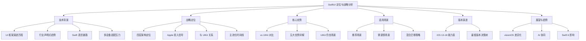
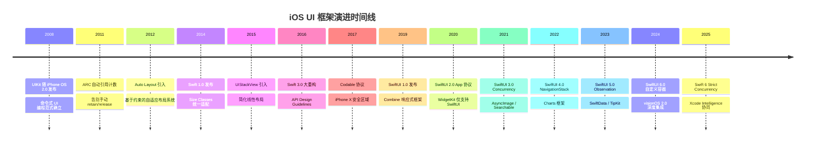
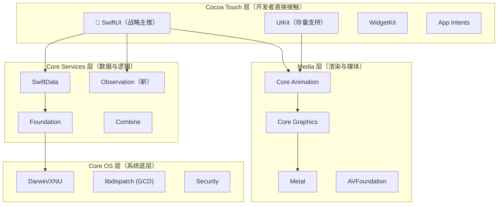
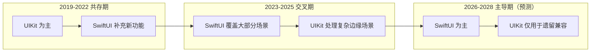
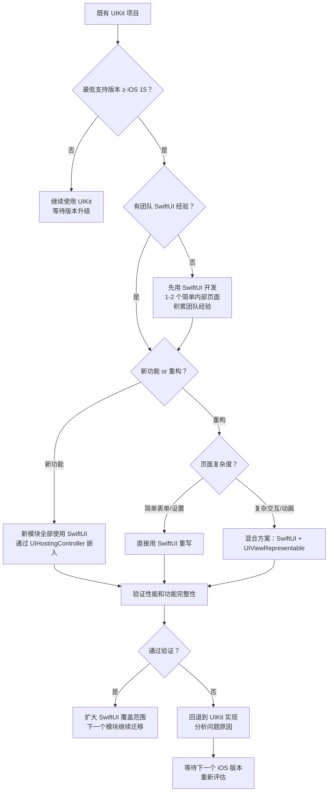
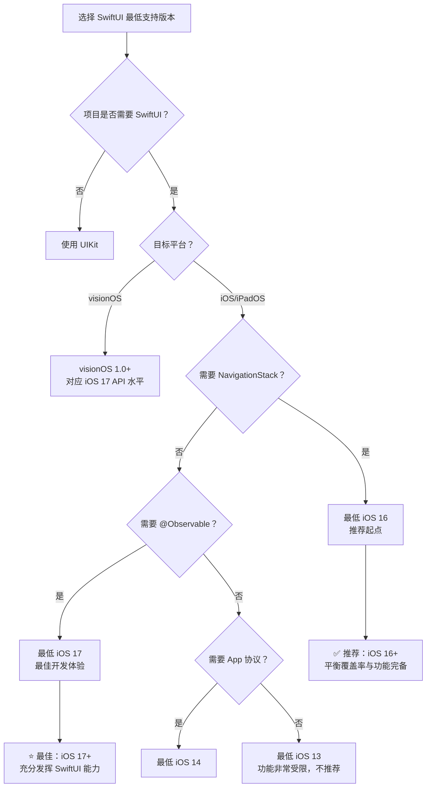
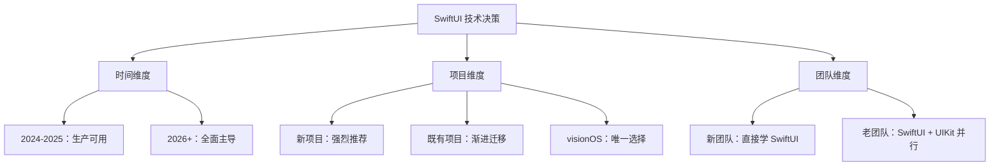

# SwiftUI 定位与战略分析 — 详细解析

> **文档版本**: iOS 13–18 / Swift 5.1–6.0  
> **核心定位**: SwiftUI 的战略定位、出现背景、核心优势与适用场景全景分析  
> **交叉引用**:  
> - [Apple 框架生态全景与战略定位](../01_框架生态与演进/Apple框架生态全景与战略定位_详细解析.md)  
> - [SwiftUI 架构与渲染机制](SwiftUI架构与渲染机制_详细解析.md)  
> - [SwiftUI 高级实践与性能优化](SwiftUI高级实践与性能优化_详细解析.md)

---

## 核心结论 TL;DR

| 维度 | 核心结论 |
|------|----------|
| **战略定位** | SwiftUI 是 Apple 面向未来十年的 **唯一官方推荐 UI 框架**，承担跨平台统一、声明式转型、AI 协同三大战略使命 |
| **核心优势** | 声明式语法减少 40-60% 代码量；原生支持 6 个平台；状态驱动自动保持 UI 一致性；与 Swift 语言深度耦合获得编译期安全 |
| **适用场景** | 全新 App、WidgetKit、visionOS 应用、表单/设置页面、原型验证、多平台同步开发 |
| **不适用场景** | 需兼容 iOS 12 及以下、百万级 Cell 高频列表、需精细动画控制、深度依赖 UIKit 第三方库的既有项目 |
| **迁移策略** | 采用「UIHostingController 渐进式迁移」策略，新模块用 SwiftUI，既有模块按优先级逐步替换 |
| **成熟度预判** | iOS 17 (2023) 达到生产可用；iOS 19-20 (2025-2026) 预计覆盖 90% 以上 UIKit 常见场景 |

---

## 文章结构概览



---

# 第一章：SwiftUI 出现的技术背景

**结论先行：SwiftUI 的诞生并非偶然，而是 iOS UI 框架十年演进的必然结果——行业声明式 UI 浪潮、Swift 语言能力成熟、Apple 多设备生态扩张三重力量共同推动。**

## 1.1 iOS UI 框架演进历程

### 时间线总览



### 演进驱动力分析

| 阶段 | 时间 | 核心矛盾 | Apple 解决方案 | 局限性 |
|------|------|-----------|---------------|--------|
| **手动布局时代** | 2008-2012 | 单一屏幕尺寸，frame 布局即可 | UIKit + `layoutSubviews` | 新设备尺寸需全量适配 |
| **约束布局时代** | 2012-2015 | 多屏幕尺寸（3.5"/4"/4.7"/5.5"） | Auto Layout + Size Classes | 约束代码冗长、冲突难调试 |
| **可视化布局时代** | 2015-2019 | Storyboard/XIB 协作冲突 | Interface Builder 增强 | XML 合并冲突、运行时崩溃 |
| **声明式时代** | 2019-至今 | 6 个平台 + 开发效率 | SwiftUI 声明式 UI | 早期功能不完善 |

**关键洞察**：每一次 UI 框架的重大演进，都源于 **设备形态扩展** 带来的适配压力。从 iPhone 单一设备到 iPhone/iPad/Mac/Watch/TV/Vision Pro 六大平台，传统命令式 UI 的维护成本呈指数级增长。

## 1.2 行业趋势驱动：声明式 UI 浪潮

**结论先行：React (2013) 引领的声明式 UI 革命深刻改变了整个前端和移动端开发范式，Apple 必须做出回应。**

### 声明式 UI 框架发展时间线

| 年份 | 框架 | 平台 | 核心创新 |
|------|------|------|----------|
| 2013 | React | Web | Virtual DOM、组件化、单向数据流 |
| 2017 | Flutter | 跨平台 | 自绘引擎、Widget Tree、Hot Reload |
| 2018 | SwiftUI 内部立项 | Apple 内部 | 声明式 + Property Wrapper（推测） |
| 2019 | SwiftUI 1.0 | Apple 全平台 | 原生声明式、Xcode Preview |
| 2019 | Jetpack Compose (Alpha) | Android | Kotlin 声明式 UI |
| 2021 | Jetpack Compose 1.0 | Android | 正式发布 |

### 行业共识：声明式 UI 的优势

```
┌─────────────────────────────────────────────────────────────────────┐
│                    声明式 UI vs 命令式 UI 本质差异                     │
├─────────────────────────────────────────────────────────────────────┤
│                                                                     │
│   命令式 (UIKit/Android View)         声明式 (SwiftUI/Compose)      │
│                                                                     │
│   开发者关注「怎么做」                 开发者关注「是什么」            │
│   ├─ 创建视图                          ├─ 描述状态                   │
│   ├─ 手动更新属性                      ├─ 描述状态→视图的映射          │
│   ├─ 管理视图层级                      └─ 框架自动处理更新            │
│   └─ 处理不一致状态                                                  │
│                                                                     │
│   问题：状态 ↔ 视图 同步容易出错       优势：状态 ↔ 视图 自动一致     │
│                                                                     │
└─────────────────────────────────────────────────────────────────────┘
```

**Apple 不得不回应的原因**：

1. **开发者流失风险**：Flutter/React Native 等跨平台方案吸引开发者离开原生生态
2. **开发效率差距**：UIKit 的命令式代码量是声明式的 2-3 倍
3. **人才招聘压力**：新一代开发者更熟悉声明式范式（React 生态）
4. **竞争对手跟进**：Google 同步推进 Jetpack Compose，形成行业标准

## 1.3 Swift 语言能力铺路

**结论先行：SwiftUI 之所以在 2019 年而非更早发布，关键在于 Swift 语言需要先具备 Result Builder、Property Wrapper、Opaque Types 三大特性。**

### SwiftUI 依赖的 Swift 语言特性

| Swift 特性 | 版本 | SwiftUI 中的应用 | 没有该特性的替代方案 |
|------------|------|------------------|---------------------|
| **Property Wrapper** | Swift 5.1 | `@State`, `@Binding`, `@Environment`, `@Published` | 手动实现 getter/setter + KVO，代码量增加 3-5 倍 |
| **Result Builder** (原 Function Builder) | Swift 5.1 | `@ViewBuilder` 实现 DSL 式视图构建 | 链式调用或工厂方法，丧失声明式语法优势 |
| **Opaque Types** (`some`) | Swift 5.1 | `var body: some View` 隐藏具体类型 | 使用 `AnyView` 类型擦除，损失性能和类型安全 |
| **Key Path Member Lookup** | Swift 5.1 | `@dynamicMemberLookup` 简化绑定语法 | 手动编写大量绑定代码 |
| **Macro** | Swift 5.9 | `@Observable`, `#Preview` | Combine 的 `@Published` + `ObservableObject`（更重的响应式链） |
| **Noncopyable Types** | Swift 5.9 | 内部资源管理优化 | 运行时检查 |

### 代码示例：Property Wrapper 如何简化 SwiftUI

```swift
// 没有 Property Wrapper 的假想 SwiftUI（不可能优雅实现）
struct CounterView: View {
    // 需要手动管理状态存储、通知、更新
    private var _count: ManagedState<Int> = ManagedState(wrappedValue: 0)
    var count: Int {
        get { _count.wrappedValue }
        set { 
            _count.wrappedValue = newValue
            _count.notifyChange()  // 手动通知
        }
    }
    
    var body: some View { /* ... */ }
}

// 有 Property Wrapper 的真实 SwiftUI（Swift 5.1+）
struct CounterView: View {
    @State private var count = 0  // 一行搞定状态声明、存储、通知
    
    var body: some View {
        Button("Count: \(count)") {
            count += 1  // 自动触发视图更新
        }
    }
}
```

**关键洞察**：SwiftUI 不仅是一个 UI 框架，更是 **Swift 语言能力的集大成展示**。Swift 团队和 SwiftUI 团队高度协同，语言特性的演进方向很大程度上是为 SwiftUI 服务的。

## 1.4 多设备适配压力

**结论先行：Apple 设备线从 2008 年的 1 个扩展到 2024 年的 6 个平台，传统 UIKit 方案的适配成本已不可持续。**

| 平台 | 发布年份 | 屏幕尺寸/形态 | UI 框架要求 |
|------|---------|--------------|------------|
| **iPhone** | 2007 | 3.5" → 6.9" | UIKit / SwiftUI |
| **iPad** | 2010 | 7.9" → 13" + 多窗口 | UIKit / SwiftUI |
| **Apple Watch** | 2015 | 38mm → 49mm 圆角 | WatchKit → SwiftUI（推荐） |
| **Apple TV** | 2015 | 大屏 + Focus 导航 | TVUIKit → SwiftUI |
| **Mac** (Catalyst/原生) | 2019 | 多窗口 + 菜单栏 | AppKit / Catalyst / SwiftUI |
| **Vision Pro** | 2024 | 空间计算 3D | **仅 SwiftUI** |

**六平台适配成本对比**：

```
传统方案（每个平台独立开发）：
  iPhone UIKit + iPad UIKit + Watch WatchKit + TV TVUIKit + Mac AppKit + Vision ???
  = 6 套代码 × 维护成本 = 指数级复杂度

SwiftUI 方案：
  1 套核心代码 + 平台差异化修饰 = 线性复杂度
```

> **特别强调**：visionOS 是 Apple 第一个 **仅支持 SwiftUI 作为原生 UI 框架** 的平台。这是 Apple 对 SwiftUI 战略地位最明确的信号——未来新平台将不再提供 UIKit 支持。

---

# 第二章：Apple 框架生态中的战略定位

**结论先行：SwiftUI 位于 Apple 四层框架架构的最上层（Cocoa Touch），是面向开发者的第一接触面。Apple 通过系统性的投入信号（新框架绑定、WWDC Session 倾斜、新平台独占）表明 SwiftUI 是不可逆的战略方向。**

## 2.1 SwiftUI 在四层架构中的位置

> 详细的四层架构说明请参考 [Apple 框架生态全景与战略定位](../01_框架生态与演进/Apple框架生态全景与战略定位_详细解析.md)



**SwiftUI 的架构特殊性**：

- SwiftUI 是 Apple 框架中 **唯一同时跨越 Cocoa Touch 和 Core Services 两层** 的框架
- 底层渲染依赖 Core Animation（通过 AttributeGraph 引擎桥接）
- 数据层深度集成 Observation 框架（iOS 17+，取代 Combine 的 UI 数据绑定场景）
- SwiftUI 声明式语法直接对接 SwiftData、Charts、TipKit 等新框架

## 2.2 Apple 战略投入信号分析

### WWDC SwiftUI 相关 Session 数量趋势

| 年份 | WWDC SwiftUI Sessions | 占比（预估） | 关键主题 |
|------|----------------------|-------------|----------|
| 2019 | ~15 | 8% | SwiftUI 首发、基础 API |
| 2020 | ~20 | 11% | App 生命周期、Widget、多平台 |
| 2021 | ~18 | 10% | Async/Await 集成、Searchable |
| 2022 | ~22 | 12% | NavigationStack、Charts、SwiftUI 4.0 |
| 2023 | ~25 | 14% | Observation、SwiftData、TipKit、visionOS |
| 2024 | ~28 | 16% | 自定义容器、Mesh Gradient、visionOS 2.0 |
| 2025 | ~30+ | 17%+ | Xcode Intelligence、Swift 6 集成（预测） |

**趋势**：SwiftUI Session 数量逐年递增，占比从 8% 上升到 16%+，反映 Apple 持续加大投入。

### 新框架优先支持 SwiftUI 的证据

| 新框架 | 发布年份 | SwiftUI 支持 | UIKit 支持 | 结论 |
|--------|---------|-------------|-----------|------|
| **WidgetKit** | 2020 | ✅ 唯一支持 | ❌ | SwiftUI Only |
| **Charts** | 2022 | ✅ 原生 API | ⚠️ 需 UIHostingController 包装 | SwiftUI First |
| **SwiftData** | 2023 | ✅ `@Query` 原生集成 | ⚠️ 需手动配置 ModelContext | SwiftUI First |
| **TipKit** | 2023 | ✅ `TipView` 原生修饰符 | ⚠️ 需 `TipUIView` 包装 | SwiftUI First |
| **StoreKit 2 视图** | 2023 | ✅ `SubscriptionStoreView` | ❌ | SwiftUI Only |
| **visionOS** | 2024 | ✅ 唯一原生 UI | ❌ 无 UIKit 支持 | SwiftUI Only |
| **Xcode Intelligence** | 2025 | ✅ Preview 深度集成 | ⚠️ 有限支持 | SwiftUI First |

**关键结论**：自 2020 年起，Apple 新发布的 **所有面向 UI 的框架** 都采用 SwiftUI-First 或 SwiftUI-Only 策略。

### Xcode Preview 与 SwiftUI 的深度绑定

Xcode Preview 是 Apple 在 IDE 层面对 SwiftUI 的战略绑定：

- **实时预览**：修改代码后毫秒级渲染更新，无需编译运行
- **多设备同时预览**：一次编码，同时查看 iPhone/iPad/Watch 效果
- **交互式预览**：直接在 Canvas 中操作 UI，无需启动模拟器
- **UIKit 支持有限**：UIKit 视图需通过 `UIViewRepresentable` 包装才能使用 Preview

```swift
// SwiftUI 原生 Preview（Swift 5.9+ Macro 语法）
#Preview("Light Mode") {
    ContentView()
        .environment(\.colorScheme, .light)
}

#Preview("Dark Mode") {
    ContentView()
        .environment(\.colorScheme, .dark)
}

// UIKit 使用 Preview 需要额外包装
#Preview {
    let vc = MyUIKitViewController()
    return vc  // 需要返回 UIViewController
}
```

## 2.3 SwiftUI 与 UIKit 的战略关系

**结论先行：SwiftUI 与 UIKit 的关系是「渐进式替代」而非「立即替换」。Apple 通过桥接 API（UIHostingController / UIViewRepresentable）确保平滑过渡。**



### 桥接机制一览

| 桥接方向 | API | 用途 |
|----------|-----|------|
| UIKit → SwiftUI | `UIHostingController` | 在 UIKit 项目中嵌入 SwiftUI 视图 |
| SwiftUI → UIKit | `UIViewRepresentable` | 在 SwiftUI 中使用 UIKit 组件 |
| SwiftUI → UIKit | `UIViewControllerRepresentable` | 在 SwiftUI 中嵌入 UIKit ViewController |
| AppKit → SwiftUI | `NSHostingController` | macOS 中嵌入 SwiftUI |
| SwiftUI → AppKit | `NSViewRepresentable` | SwiftUI 中使用 AppKit 组件 |

## 2.4 SwiftUI 成为主流的时间线预测

| 阶段 | 时间 | 标志性事件 | SwiftUI 覆盖率 |
|------|------|-----------|---------------|
| **试验期** | 2019-2021 | 功能缺失多，仅适合简单页面 | 20-30% |
| **成长期** | 2022-2023 | NavigationStack、Observation 补齐关键短板 | 50-60% |
| **成熟期** | 2024-2025 | 自定义容器、visionOS 独占、性能大幅优化 | 70-80% |
| **主导期** | 2026-2028 | 预计覆盖 90%+ 场景，新项目默认 SwiftUI | 90%+ |

**判断依据**：

1. UIKit 近两年几乎没有重大新 API（仅维护性更新）
2. Apple 内部应用（设置、天气、股市等）已大量采用 SwiftUI
3. 新平台（visionOS）完全切断 UIKit 支持
4. Xcode Intelligence 优先为 SwiftUI 生成代码

---

# 第三章：SwiftUI 的核心优势与差异化价值

**结论先行：SwiftUI 的核心竞争力不在单一维度，而在「声明式语法 + 实时预览 + 原生多平台 + 状态驱动 + Swift 深度集成」五位一体的系统性优势。**

## 3.1 SwiftUI vs UIKit 深度对比

| # | 对比维度 | SwiftUI | UIKit | 优势方 |
|---|---------|---------|-------|--------|
| 1 | **编程范式** | 声明式（描述「是什么」） | 命令式（描述「怎么做」） | SwiftUI |
| 2 | **语法风格** | DSL 式链式修饰符 | OOP 属性赋值 + delegate | SwiftUI |
| 3 | **状态管理** | `@State`/`@Binding`/`@Observable` 内建 | 手动 KVO/NotificationCenter/delegate | SwiftUI |
| 4 | **布局系统** | `VStack`/`HStack`/`ZStack` + modifier | Auto Layout 约束系统 | SwiftUI（简洁性）|
| 5 | **动画** | `.animation()` 隐式动画、`withAnimation` | `UIView.animate` + Core Animation | **UIKit**（精细控制）|
| 6 | **导航** | `NavigationStack` + `NavigationLink` | `UINavigationController` + push/pop | 平手（各有优劣）|
| 7 | **渲染性能** | AttributeGraph 差分更新 | 直接操作 CALayer | **UIKit**（大数据列表）|
| 8 | **学习曲线** | 低（函数式思维，代码量少） | 高（大量设计模式、delegate） | SwiftUI |
| 9 | **生态成熟度** | 快速成长中（2019 起） | 极度成熟（2008 起，16 年积累） | **UIKit** |
| 10 | **调试工具** | Xcode Preview、Instruments（发展中） | 完善的 Debug View Hierarchy | **UIKit** |
| 11 | **多平台** | 原生支持 6 个平台 | 仅 iOS/iPadOS (+ Catalyst) | SwiftUI |
| 12 | **社区资源** | 增长快，Stack Overflow 答案有时不足 | 海量成熟资源 | **UIKit** |
| 13 | **代码量** | 少 40-60% | 基准 | SwiftUI |
| 14 | **热更新/Preview** | 原生 Xcode Preview 实时渲染 | 需包装才能用 Preview | SwiftUI |
| 15 | **可测试性** | `ViewInspector` 等第三方库 | `XCUITest` 成熟体系 | **UIKit** |

## 3.2 核心优势详解

### 优势一：声明式语法 → 代码量减少 40-60%

**UIKit 实现一个带头像的联系人列表 Cell（约 60 行）**：

```swift
// UIKit - iOS 13+ / Swift 5.0+
class ContactCell: UITableViewCell {
    private let avatarImageView = UIImageView()
    private let nameLabel = UILabel()
    private let subtitleLabel = UILabel()
    private let chevronImageView = UIImageView()
    
    override init(style: UITableViewCell.CellStyle, reuseIdentifier: String?) {
        super.init(style: style, reuseIdentifier: reuseIdentifier)
        setupViews()
        setupConstraints()
    }
    
    required init?(coder: NSCoder) { fatalError() }
    
    private func setupViews() {
        avatarImageView.layer.cornerRadius = 22
        avatarImageView.clipsToBounds = true
        avatarImageView.contentMode = .scaleAspectFill
        avatarImageView.translatesAutoresizingMaskIntoConstraints = false
        
        nameLabel.font = .systemFont(ofSize: 17, weight: .semibold)
        nameLabel.translatesAutoresizingMaskIntoConstraints = false
        
        subtitleLabel.font = .systemFont(ofSize: 14)
        subtitleLabel.textColor = .secondaryLabel
        subtitleLabel.translatesAutoresizingMaskIntoConstraints = false
        
        chevronImageView.image = UIImage(systemName: "chevron.right")
        chevronImageView.tintColor = .tertiaryLabel
        chevronImageView.translatesAutoresizingMaskIntoConstraints = false
        
        [avatarImageView, nameLabel, subtitleLabel, chevronImageView]
            .forEach { contentView.addSubview($0) }
    }
    
    private func setupConstraints() {
        NSLayoutConstraint.activate([
            avatarImageView.leadingAnchor.constraint(equalTo: contentView.leadingAnchor, constant: 16),
            avatarImageView.centerYAnchor.constraint(equalTo: contentView.centerYAnchor),
            avatarImageView.widthAnchor.constraint(equalToConstant: 44),
            avatarImageView.heightAnchor.constraint(equalToConstant: 44),
            
            nameLabel.leadingAnchor.constraint(equalTo: avatarImageView.trailingAnchor, constant: 12),
            nameLabel.topAnchor.constraint(equalTo: contentView.topAnchor, constant: 10),
            nameLabel.trailingAnchor.constraint(lessThanOrEqualTo: chevronImageView.leadingAnchor, constant: -8),
            
            subtitleLabel.leadingAnchor.constraint(equalTo: nameLabel.leadingAnchor),
            subtitleLabel.topAnchor.constraint(equalTo: nameLabel.bottomAnchor, constant: 2),
            subtitleLabel.trailingAnchor.constraint(equalTo: nameLabel.trailingAnchor),
            
            chevronImageView.trailingAnchor.constraint(equalTo: contentView.trailingAnchor, constant: -16),
            chevronImageView.centerYAnchor.constraint(equalTo: contentView.centerYAnchor),
        ])
    }
    
    func configure(name: String, subtitle: String, avatar: UIImage?) {
        nameLabel.text = name
        subtitleLabel.text = subtitle
        avatarImageView.image = avatar
    }
}
```

**SwiftUI 实现同样效果（约 20 行）**：

```swift
// SwiftUI - iOS 14+ / Swift 5.3+
struct ContactRow: View {
    let name: String
    let subtitle: String
    let avatar: Image
    
    var body: some View {
        HStack(spacing: 12) {
            avatar
                .resizable()
                .scaledToFill()
                .frame(width: 44, height: 44)
                .clipShape(Circle())
            
            VStack(alignment: .leading, spacing: 2) {
                Text(name)
                    .font(.system(size: 17, weight: .semibold))
                Text(subtitle)
                    .font(.system(size: 14))
                    .foregroundStyle(.secondary)
            }
            
            Spacer()
            
            Image(systemName: "chevron.right")
                .foregroundStyle(.tertiary)
        }
        .padding(.horizontal, 16)
        .padding(.vertical, 10)
    }
}
```

**代码量对比**：UIKit 约 60 行 → SwiftUI 约 20 行，**减少 67%**。

### 优势二：实时预览 → 开发效率提升

**Xcode Preview 工作流**：

```
传统 UIKit 开发循环：
  编写代码 → 编译（30s-2min）→ 启动模拟器（10-30s）→ 导航到目标页面 → 查看效果
  单次迭代：1-3 分钟

SwiftUI Preview 开发循环：
  编写代码 → Preview 自动刷新（<1s）→ 直接查看效果
  单次迭代：1-3 秒

效率提升：约 30-60 倍的迭代速度
```

```swift
// 多设备同时预览示例（Swift 5.9+ / iOS 17+）
#Preview("iPhone SE") {
    ContactRow(name: "Tim Cook", subtitle: "CEO", avatar: Image(systemName: "person.fill"))
        .previewDevice("iPhone SE (3rd generation)")
}

#Preview("iPhone 15 Pro Max") {
    ContactRow(name: "Tim Cook", subtitle: "CEO", avatar: Image(systemName: "person.fill"))
        .previewDevice("iPhone 15 Pro Max")
}

#Preview("Dark Mode") {
    ContactRow(name: "Tim Cook", subtitle: "CEO", avatar: Image(systemName: "person.fill"))
        .preferredColorScheme(.dark)
}
```

### 优势三：原生多平台 → 一套代码适配 6 个平台

```swift
// 跨平台共享视图（iOS 14+ / macOS 11+ / watchOS 7+ / tvOS 14+）
struct SettingsView: View {
    @AppStorage("notifications") private var notificationsEnabled = true
    @AppStorage("darkMode") private var darkModeEnabled = false
    
    var body: some View {
        Form {
            Section("通用") {
                Toggle("启用通知", isOn: $notificationsEnabled)
                Toggle("深色模式", isOn: $darkModeEnabled)
            }
            
            Section("关于") {
                LabeledContent("版本", value: "1.0.0")
                LabeledContent("构建号", value: "42")
            }
        }
        #if os(iOS)
        .navigationTitle("设置")
        #elseif os(macOS)
        .frame(width: 400)
        #endif
    }
}
```

### 优势四：状态驱动 → 自动 UI 一致性

```swift
// iOS 17+ / Swift 5.9+ — Observation 框架
@Observable
class ShoppingCart {
    var items: [Item] = []
    var totalPrice: Decimal { items.reduce(0) { $0 + $1.price } }
    var isEmpty: Bool { items.isEmpty }
}

struct CartView: View {
    var cart: ShoppingCart  // 无需 @ObservedObject，直接传入
    
    var body: some View {
        // 自动追踪 cart.items 和 cart.totalPrice 的变化
        // 只要 items 变化，视图自动更新，无需手动调用 reloadData()
        List(cart.items) { item in
            ItemRow(item: item)
        }
        .overlay {
            if cart.isEmpty {
                ContentUnavailableView("购物车为空", systemImage: "cart")
            }
        }
        .safeAreaInset(edge: .bottom) {
            Text("总计: ¥\(cart.totalPrice)")
                .font(.headline)
        }
    }
}
```

### 优势五：Swift 语言深度集成 → 类型安全

```swift
// 编译时类型安全示例
struct TypeSafeView: View {
    @State private var count = 0
    
    var body: some View {
        VStack {
            // ✅ 编译器确保 Text 接收 String
            Text("Count: \(count)")
            
            // ✅ 编译器确保 Button action 闭包类型正确
            Button("Increment") { count += 1 }
            
            // ❌ 编译错误：Text 不能直接接收 Int
            // Text(count)  // 编译期就会报错，而非运行时崩溃
            
            // ✅ 编译器确保 ForEach 的数据类型符合 Identifiable
            ForEach(0..<count, id: \.self) { i in
                Text("Item \(i)")
            }
        }
    }
}
```

## 3.3 UIKit 仍然更优的场景

**UIKit 的不可替代性不应被低估，以下场景中 UIKit 仍是更优选择：**

### 场景一：复杂自定义动画和手势

```swift
// UIKit：精细控制交互式转场动画
class CustomTransitionAnimator: NSObject, UIViewControllerAnimatedTransitioning {
    func transitionDuration(using ctx: UIViewControllerContextTransitioning?) -> TimeInterval { 0.5 }
    
    func animateTransition(using ctx: UIViewControllerContextTransitioning) {
        // 完全控制每一帧的动画轨迹
        let toView = ctx.view(forKey: .to)!
        ctx.containerView.addSubview(toView)
        toView.transform = CGAffineTransform(scaleX: 0.1, y: 0.1)
        
        UIView.animateKeyframes(withDuration: 0.5, delay: 0) {
            UIView.addKeyframe(withRelativeStartTime: 0, relativeDuration: 0.3) {
                toView.transform = CGAffineTransform(scaleX: 1.1, y: 1.1)
            }
            UIView.addKeyframe(withRelativeStartTime: 0.3, relativeDuration: 0.2) {
                toView.transform = .identity
            }
        } completion: { _ in
            ctx.completeTransition(!ctx.transitionWasCancelled)
        }
    }
}
// SwiftUI 中实现等价效果需要 matchedGeometryEffect + 大量技巧，且控制粒度不如 UIKit
```

### 场景二：高频大数据列表性能

```swift
// UIKit：通过预取和 Cell 复用实现百万级列表流畅滚动
class HighPerformanceListVC: UIViewController, UITableViewDataSourcePrefetching {
    func tableView(_ tableView: UITableView, prefetchRowsAt indexPaths: [IndexPath]) {
        // 精确控制预取时机和策略
        let urls = indexPaths.compactMap { dataSource[$0.row].thumbnailURL }
        ImagePrefetcher.shared.prefetch(urls)
    }
    
    // Cell 高度缓存，避免重复计算
    private var heightCache: [IndexPath: CGFloat] = [:]
    func tableView(_ tableView: UITableView, estimatedHeightForRowAt indexPath: IndexPath) -> CGFloat {
        heightCache[indexPath] ?? 80
    }
}
// SwiftUI 的 LazyVStack/List 在 iOS 17+ 性能已大幅提升，但极端场景仍不及 UIKit
```

### 场景三：需要完整 UIKit API 覆盖

| UIKit API | SwiftUI 替代状态 (截至 iOS 18) |
|-----------|-------------------------------|
| `UICollectionViewCompositionalLayout` | `LazyVGrid` 部分覆盖，复杂布局不足 |
| `UIPageViewController` | `TabView(.page)` 基本可用 |
| `UISearchController` | `.searchable()` 基本覆盖 |
| `UIDocumentPickerViewController` | 需 `UIViewControllerRepresentable` 包装 |
| `UIActivityViewController` | `ShareLink` (iOS 16+) 基本覆盖 |
| `UIDragInteraction` / `UIDropInteraction` | `.draggable()` / `.dropDestination()` 基本覆盖 |
| `UITextView`（富文本编辑） | `TextEditor` 功能有限，复杂场景需包装 |
| `WKWebView` | 需 `UIViewRepresentable` 包装 |

---

# 第四章：适用场景与不适用场景

**结论先行：SwiftUI 的适用性取决于四个关键因素——最低支持版本、项目复杂度、团队经验、UIKit 依赖程度。全新项目（最低 iOS 16+）强烈推荐 SwiftUI。**

## 4.1 推荐使用 SwiftUI 的场景

| 场景 | 项目类型 | 团队规模 | 复杂度 | 最低版本 | 推荐指数 |
|------|---------|---------|--------|---------|---------|
| 🟢 全新 App 项目 | 新项目 | 任意 | 中低 | iOS 16+ | ⭐⭐⭐⭐⭐ |
| 🟢 小组件 (WidgetKit) | Widget | 1-3 人 | 低 | iOS 14+ | ⭐⭐⭐⭐⭐ |
| 🟢 visionOS 应用 | 空间计算 | 任意 | 任意 | visionOS 1.0 | ⭐⭐⭐⭐⭐ |
| 🟢 设置/表单页面 | 功能模块 | 任意 | 低 | iOS 15+ | ⭐⭐⭐⭐⭐ |
| 🟢 原型/快速验证 | MVP | 1-5 人 | 低中 | iOS 16+ | ⭐⭐⭐⭐⭐ |
| 🟢 多平台同步开发 | 跨平台 | 3-10 人 | 中 | 各平台最新-2 | ⭐⭐⭐⭐ |
| 🟡 中大型新功能模块 | 模块化 | 5+ 人 | 中高 | iOS 17+ | ⭐⭐⭐⭐ |
| 🟡 Watch 独立应用 | watchOS | 1-3 人 | 中 | watchOS 7+ | ⭐⭐⭐⭐ |

## 4.2 不适用或需谨慎的场景

| 场景 | 原因 | 替代方案 | 风险等级 |
|------|------|---------|---------|
| 🔴 需兼容 iOS 12 及以下 | SwiftUI 最低要求 iOS 13 | 继续使用 UIKit | 高 |
| 🔴 百万级 Cell 高频更新列表 | SwiftUI 列表性能瓶颈 | UIKit `UITableView` / `UICollectionView` | 高 |
| 🟠 大量 UIKit 第三方库依赖 | 包装成本高，行为不一致风险 | 保持 UIKit，渐进迁移 | 中高 |
| 🟠 需精细动画控制 | SwiftUI 动画抽象层限制 | UIKit + Core Animation | 中 |
| 🟡 深度定制 UICollectionView 布局 | LazyVGrid 功能有限 | UIKit CompositionalLayout | 中 |
| 🟡 复杂富文本编辑 | TextEditor 功能不足 | UIKit UITextView / WKWebView | 中 |

## 4.3 混合策略：渐进式迁移路径



### 渐进式迁移的关键原则

1. **新模块优先**：所有新功能模块默认使用 SwiftUI
2. **低风险先行**：从设置页面、表单页面等低复杂度模块开始
3. **性能验证**：每个迁移模块都要做 A/B 性能对比
4. **回退能力**：保留 UIKit 实现作为降级方案，直到 SwiftUI 版本稳定
5. **版本跟进**：每年 WWDC 后重新评估 SwiftUI 的能力边界

---

# 第五章：SwiftUI 版本演进与能力边界

**结论先行：SwiftUI 从 iOS 13 的「玩具级」到 iOS 18 的「生产级」经历了六个大版本。选择最低支持版本直接决定了可用 API 的丰富程度，iOS 16+ 是目前推荐的最低门槛。**

## 5.1 各版本关键能力对照表

| 能力维度 | iOS 13 (2019) | iOS 14 (2020) | iOS 15 (2021) | iOS 16 (2022) | iOS 17 (2023) | iOS 18 (2024) |
|---------|---------------|---------------|---------------|---------------|---------------|---------------|
| **App 生命周期** | ❌ 需 UIKit | ✅ `@main` App 协议 | ✅ | ✅ | ✅ | ✅ |
| **列表** | `List` 基础 | `LazyVStack` `LazyHStack` | 下拉刷新 `.refreshable` | 多选 `List(selection:)` | `Section` 动画改进 | 性能大幅优化 |
| **导航** | `NavigationView` | 同上 | 同上 | ✅ `NavigationStack` + `NavigationSplitView` | `NavigationPath` 增强 | 增强 |
| **网格** | ❌ | ✅ `LazyVGrid` `LazyHGrid` | 同上 | 同上 | 同上 | 自定义容器 API |
| **搜索** | ❌ | ❌ | ✅ `.searchable` | Token 搜索 | 搜索建议增强 | 增强 |
| **图表** | ❌ | ❌ | ❌ | ✅ Swift Charts | 增强 | 增强 |
| **数据持久化** | Core Data 手动集成 | 同上 | 同上 | 同上 | ✅ SwiftData `@Query` | 增强 |
| **状态管理** | `@State` `@ObservedObject` | `@StateObject` | `.task` | 同上 | ✅ `@Observable` (Observation) | 增强 |
| **动画** | 基础隐式动画 | `matchedGeometryEffect` | `TimelineView` | 布局动画增强 | 关键帧动画 `KeyframeAnimator` | `MeshGradient` |
| **多平台** | iOS/macOS/watchOS | + WidgetKit | + 同上增强 | + 锁屏小组件 | + visionOS | + visionOS 2.0 |
| **表单** | `Form` 基础 | 同上 | `FocusState` | `LabeledContent` | `ContentUnavailableView` | 增强 |
| **地图** | ❌ 需包装 | 同上 | 同上 | 同上 | ✅ `Map` 原生 | 增强 |
| **Preview** | `PreviewProvider` | 同上 | 同上 | 同上 | ✅ `#Preview` Macro | 增强 |

## 5.2 各版本"痛点修复"与"新增能力"

### iOS 14：从不可用到勉强可用

**痛点修复**：
- ✅ 引入 `@StateObject` 解决 `@ObservedObject` 在视图重建时状态丢失问题
- ✅ `LazyVStack` / `LazyHStack` 解决大列表性能问题
- ✅ `App` 协议实现纯 SwiftUI 应用生命周期（不再依赖 `AppDelegate`）

**新增能力**：
- WidgetKit 小组件（SwiftUI Only）
- `@AppStorage` / `@SceneStorage` 简化数据持久化
- `ProgressView`、`TextEditor`、`Map` 等新组件

### iOS 15：开发体验大幅提升

**痛点修复**：
- ✅ `.task` 修饰符替代 `onAppear` + `Task {}` 的异步数据加载
- ✅ `FocusState` 管理键盘焦点
- ✅ 下拉刷新 `.refreshable` 内建支持
- ✅ `AsyncImage` 异步图片加载

**新增能力**：
- `.searchable` 搜索功能
- `swipeActions` 列表滑动操作
- Material 背景效果
- `confirmationDialog` 替代 ActionSheet

### iOS 16：导航系统重构——里程碑版本

**痛点修复**：
- ✅ **`NavigationStack` 彻底替换 `NavigationView`**——解决了长期以来最大的痛点
- ✅ `NavigationSplitView` 统一 iPad 分栏导航
- ✅ `Layout` 协议支持自定义布局容器

**新增能力**：
- Swift Charts 图表框架
- `ShareLink` / `PhotosPicker` / `MultiDatePicker`
- 锁屏小组件 (Live Activities)
- `AnyLayout` 布局切换

### iOS 17：状态管理革命

**痛点修复**：
- ✅ **`@Observable` 宏彻底简化状态管理**——不再需要 `@Published` + `ObservableObject`
- ✅ `#Preview` 宏简化预览代码
- ✅ 动画系统增强：`KeyframeAnimator`、`PhaseAnimator`

**新增能力**：
- SwiftData 数据持久化框架
- TipKit 引导提示框架
- `ContentUnavailableView` 空状态
- `ScrollView` 可编程滚动位置 `.scrollPosition(id:)`
- MapKit 原生 SwiftUI API

### iOS 18：走向完备

**痛点修复**：
- ✅ 自定义容器布局 API 增强
- ✅ `MeshGradient` 复杂渐变
- ✅ 列表和滚动视图性能大幅优化

**新增能力**：
- 自定义 `Tab` 标签栏
- `ControlWidgetButton` 控制中心小组件
- visionOS 2.0 空间 UI 增强
- Xcode Intelligence 代码生成集成

## 5.3 最低支持版本选择决策树



**推荐策略**：

| 最低版本 | 设备覆盖率（2025 预估） | SwiftUI 功能完备度 | 推荐度 |
|---------|----------------------|-------------------|--------|
| iOS 13 | ~99% | 30% — 严重不足 | ❌ 不推荐 |
| iOS 14 | ~98% | 45% — 基本可用 | ⚠️ 勉强 |
| iOS 15 | ~95% | 55% — 可用 | 🟡 一般 |
| iOS 16 | ~90% | 75% — 良好 | ✅ 推荐 |
| iOS 17 | ~80% | 90% — 优秀 | ⭐ 最佳 |
| iOS 18 | ~60% | 95% — 接近完备 | 🔮 前瞻 |

---

# 第六章：展望与趋势

**结论先行：SwiftUI 的未来发展方向是「空间计算 + AI 协同 + 严格并发安全」三位一体，iOS 开发者应提前布局。**

## 6.1 SwiftUI 在各平台的差异化策略

| 平台 | SwiftUI 定位 | 差异化能力 | 开发者建议 |
|------|-------------|-----------|-----------|
| **iOS/iPadOS** | 主流 UI 框架 | 完整 API、最广泛覆盖 | 新项目默认选择 |
| **macOS** | 逐步替代 AppKit | 菜单栏、多窗口、Settings | 注意 macOS 特有 API |
| **watchOS** | 首选且推荐 | 数字表冠、复杂表盘 | 几乎必须使用 SwiftUI |
| **tvOS** | 逐步替代 TVUIKit | Focus 系统、大屏布局 | 新 tvOS 项目推荐 |
| **visionOS** | **唯一选择** | 空间容器、3D 手势、沉浸空间 | 必须掌握 |
| **CarPlay** | 有限支持 | 通过 CarPlay 框架桥接 | 暂以 UIKit 为主 |

### visionOS 独有的 SwiftUI 能力

```swift
// visionOS 空间 UI 示例（visionOS 1.0+）
struct ImmersiveSpaceExample: View {
    var body: some View {
        RealityView { content in
            // 加载 3D 模型
            if let model = try? await Entity(named: "Globe") {
                content.add(model)
            }
        }
        .gesture(
            DragGesture()
                .targetedToAnyEntity()
                .onChanged { value in
                    // 3D 空间中的拖拽手势
                    value.entity.position = value.convert(value.location3D, from: .local, to: .scene)
                }
        )
    }
}

// 打开沉浸式空间
struct ContentView: View {
    @Environment(\.openImmersiveSpace) var openImmersiveSpace
    
    var body: some View {
        Button("进入沉浸空间") {
            Task { await openImmersiveSpace(id: "MyImmersiveSpace") }
        }
    }
}
```

## 6.2 AI 时代：SwiftUI + Xcode Intelligence 协同

**结论先行：SwiftUI 的声明式语法天然适合 AI 代码生成，Xcode Intelligence 将使 SwiftUI 的开发效率再提升一个量级。**

### SwiftUI 对 AI 辅助开发的优势

| 维度 | SwiftUI 优势 | UIKit 劣势 |
|------|-------------|-----------|
| **代码可预测性** | 声明式语法结构固定，AI 容易学习模式 | 命令式代码路径多，AI 难以把握上下文 |
| **组件化程度** | View 高度独立，适合局部生成 | ViewController 耦合重，难以局部生成 |
| **Preview 验证** | AI 生成后立即可视化验证 | 需要编译运行才能验证 |
| **修饰符链** | 修改时只需增删修饰符 | 修改需理解完整生命周期 |
| **代码量少** | Token 消耗少，上下文窗口利用率高 | 代码冗长，上下文窗口浪费 |

### Xcode Intelligence 与 SwiftUI 的协同工作流（2025+ 预测）

```
1. 开发者用自然语言描述 UI 需求
   → "创建一个带搜索栏的联系人列表，支持下拉刷新和滑动删除"

2. Xcode Intelligence 生成 SwiftUI 代码
   → 自动生成 List + .searchable + .refreshable + swipeActions

3. Xcode Preview 实时展示效果
   → 开发者在 Canvas 中直接查看

4. 开发者用自然语言微调
   → "把头像改成圆形，添加在线状态指示器"

5. AI 增量修改代码
   → 精确修改对应的 View 修饰符

6. 循环迭代直到满意
```

## 6.3 Swift 6 Strict Concurrency 对 SwiftUI 的影响

**结论先行：Swift 6 的严格并发检查将使 SwiftUI 代码更安全，但迁移成本不容忽视。`@MainActor` 将成为 SwiftUI View 的默认隔离域。**

### 关键变化

| Swift 6 特性 | 对 SwiftUI 的影响 | 开发者行动 |
|-------------|-----------------|-----------|
| **`@MainActor` 默认** | SwiftUI View 的 `body` 自动在主线程执行 | 确认所有 View 修饰符线程安全 |
| **Sendable 检查** | 跨 actor 传递数据需要 `Sendable` 一致性 | 数据模型添加 `Sendable` 协议 |
| **全局变量隔离** | `@State` 等全局可变状态需要明确隔离 | 审计全局状态使用 |
| **`nonisolated` 优化** | 纯计算属性可标记 `nonisolated` 避免不必要的线程跳转 | 优化性能关键路径 |

### 迁移示例

```swift
// Swift 5 模式（宽松，可能有数据竞争）
class DataManager: ObservableObject {
    @Published var items: [Item] = []
    
    func loadItems() {
        // ⚠️ 可能在后台线程修改 @Published 属性
        URLSession.shared.dataTask(with: url) { data, _, _ in
            let items = try? JSONDecoder().decode([Item].self, from: data!)
            self.items = items ?? []  // 🐛 后台线程修改 UI 状态
        }.resume()
    }
}

// Swift 6 模式（严格，编译时保证安全）
@Observable
@MainActor
class DataManager {
    var items: [Item] = []
    
    func loadItems() async throws {
        let (data, _) = try await URLSession.shared.data(from: url)
        let items = try JSONDecoder().decode([Item].self, from: data)
        self.items = items  // ✅ 在 @MainActor 上下文，安全
    }
}
```

### 迁移建议时间线

```
2024-2025：开启 Swift 6 的 Strict Concurrency 警告模式
           逐步修复并发安全警告
           
2025-2026：新项目直接使用 Swift 6 模式
           既有项目完成迁移

2026+：    Swift 6 模式成为行业标准
           不符合的代码视为技术债务
```

---

# 总结：SwiftUI 技术决策框架



**最终建议**：

1. **新项目（iOS 16+）**：默认使用 SwiftUI，UIKit 仅在必要时补充
2. **既有项目**：新模块用 SwiftUI，旧模块按优先级渐进迁移
3. **技术储备**：无论当前是否使用 SwiftUI，都应投入学习——这是 Apple 平台开发的确定性未来
4. **关注版本**：每年 WWDC 后重新评估 SwiftUI 的能力边界和迁移时机

---

> **延伸阅读**：  
> - [SwiftUI 架构与渲染机制](SwiftUI架构与渲染机制_详细解析.md) — 深入理解 AttributeGraph、视图标识、渲染流程  
> - [SwiftUI 高级实践与性能优化](SwiftUI高级实践与性能优化_详细解析.md) — 实战技巧、性能优化、大型项目架构  
> - [Apple 框架生态全景与战略定位](../01_框架生态与演进/Apple框架生态全景与战略定位_详细解析.md) — 框架生态全景视图
