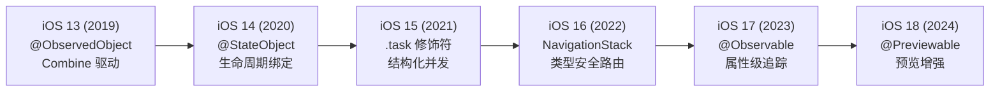
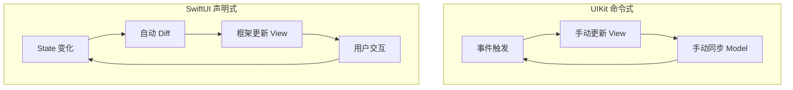
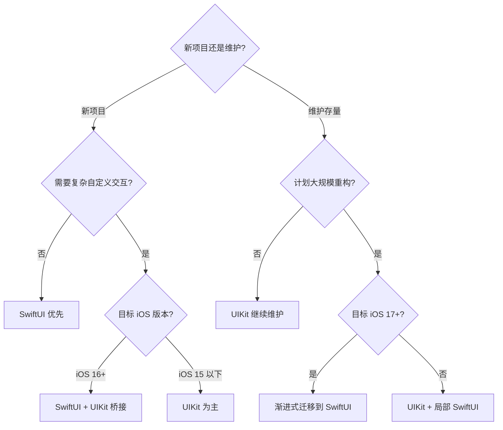
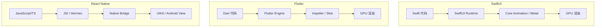

# SwiftUI 最佳实践与横向对比深度解析

> **文档版本**: iOS 17+ / Swift 5.9+ / Xcode 15+  
> **核心定位**: SwiftUI 架构设计、反模式规避与跨框架横向对比  
> **前置阅读**: [SwiftUI高级实践与性能优化](SwiftUI高级实践与性能优化_详细解析.md) · [跨平台方案对比与选型](../07_架构设计与工程化/跨平台方案对比与选型_详细解析.md)

---

## 一、核心结论 TL;DR

| 维度 | 核心结论 |
|------|----------|
| **推荐架构** | iOS 17+ 采用 MV 模式（@Observable 直连），复杂项目用 MVVM，超大型项目考虑 TCA |
| **状态管理** | 新项目首选 @Observable（iOS 17+），存量项目制定渐进式迁移计划 |
| **vs UIKit** | SwiftUI 开发效率提升 30-50%，UIKit 在复杂自定义交互场景仍有不可替代性 |
| **vs Flutter** | SwiftUI 原生集成度碾压，Flutter 跨平台一致性和热重载体验更优 |
| **vs React Native** | RN 适合 Web 团队快速切入移动端，SwiftUI 在性能和 Apple 生态深度集成上完胜 |
| **反模式** | 10 大反模式中，body 副作用和 AnyView 滥用是最常见的生产事故根源 |
| **上线检查** | 20 项生产检查清单覆盖性能、内存、兼容性、可访问性全维度 |

---

## 二、SwiftUI 状态管理演进路径

> **核心结论：@Observable 是状态管理的终局形态，属性级追踪彻底解决了过度刷新问题。新项目应直接采用，存量项目应制定迁移时间表。**

### 2.1 演进时间线



### 2.2 三代状态管理完整对比表

| 对比维度 | @ObservedObject (iOS 13) | @StateObject (iOS 14) | @Observable (iOS 17) |
|---------|--------------------------|----------------------|---------------------|
| **触发粒度** | 对象级：任一 @Published 变化触发整体刷新 | 对象级：同 @ObservedObject | **属性级**：仅访问的属性变化时刷新 |
| **内存管理** | 外部持有，View 重建时可能丢失 | View 绑定，自动管理生命周期 | View 绑定，Swift 原生值语义 |
| **线程安全** | 需手动 @MainActor 或 DispatchQueue.main | 需手动处理 | @MainActor 自动推断，配合 Actor 隔离 |
| **代码量** | 多（需 Combine import + @Published 逐属性标记） | 中（同上但创建更简洁） | **少**（@Observable 宏自动合成） |
| **调试难度** | 高（objectWillChange 触发链难以追踪） | 高（同上） | **低**（_printChanges 精确到属性） |
| **Combine 依赖** | 强依赖 | 强依赖 | **无依赖** |
| **计算属性追踪** | 不支持（需手动触发） | 不支持 | **自动支持** |
| **嵌套对象** | 需手动转发 objectWillChange | 需手动转发 | **自动递归追踪** |

### 2.3 同一业务场景的三代实现对比

**业务场景：用户资料编辑页，含姓名、头像 URL 和保存状态**

**第一代：@ObservedObject (iOS 13)**

```swift
// ⚠️ iOS 13 — 对象级刷新，修改 name 也会触发头像区域重绘
import Combine

class ProfileViewModel: ObservableObject {
    @Published var name: String = ""
    @Published var avatarURL: URL?
    @Published var isSaving: Bool = false
    
    func save() {
        isSaving = true
        // 网络请求...
    }
}

struct ProfileView: View {
    @ObservedObject var viewModel: ProfileViewModel  // ⚠️ 外部持有，父视图重建时对象可能被重建
    
    var body: some View {
        Form {
            TextField("姓名", text: $viewModel.name)
            AsyncImage(url: viewModel.avatarURL)     // name 变化时也会重绘
            Button("保存") { viewModel.save() }
                .disabled(viewModel.isSaving)
        }
    }
}
```

**第二代：@StateObject (iOS 14)**

```swift
// ✅ iOS 14 — 生命周期绑定，但仍是对象级刷新
class ProfileViewModel: ObservableObject {
    @Published var name: String = ""
    @Published var avatarURL: URL?
    @Published var isSaving: Bool = false
    
    func save() { /* ... */ }
}

struct ProfileView: View {
    @StateObject private var viewModel = ProfileViewModel()  // ✅ 生命周期与 View 绑定
    
    var body: some View {
        Form {
            TextField("姓名", text: $viewModel.name)
            AsyncImage(url: viewModel.avatarURL)  // 仍然会因 name 变化重绘
            Button("保存") { viewModel.save() }
        }
    }
}
```

**第三代：@Observable (iOS 17)**

```swift
// ✅ iOS 17 — 属性级追踪，精准刷新
import Observation

@Observable
class ProfileViewModel {
    var name: String = ""        // 无需 @Published
    var avatarURL: URL?
    var isSaving: Bool = false
    
    // ✅ 计算属性自动追踪
    var canSave: Bool { !name.isEmpty && !isSaving }
    
    func save() async {
        isSaving = true
        // await 网络请求...
        isSaving = false
    }
}

struct ProfileView: View {
    @State private var viewModel = ProfileViewModel()  // 使用 @State 持有
    
    var body: some View {
        Form {
            TextField("姓名", text: $viewModel.name)
            AvatarSection(url: viewModel.avatarURL)    // ✅ name 变化不会触发此子视图刷新
            Button("保存") { Task { await viewModel.save() } }
                .disabled(!viewModel.canSave)
        }
    }
}

// ✅ 拆分子视图，精准控制刷新范围
struct AvatarSection: View {
    let url: URL?
    var body: some View {
        AsyncImage(url: url)
    }
}
```

### 2.4 从 ObservableObject 到 @Observable 的渐进式迁移指南

```mermaid
graph TB
    A[评估现有代码] --> B{最低支持 iOS 17?}
    B -->|是| C[全量迁移]
    B -->|否| D[双协议兼容]
    C --> E[移除 Combine 导入<br/>替换 @Published<br/>添加 @Observable 宏]
    D --> F[创建兼容层<br/>条件编译]
    E --> G[更新属性包装器<br/>@ObservedObject → @State]
    F --> G
    G --> H[移除手动 objectWillChange]
    H --> I[测试验证刷新行为]
```

**迁移步骤详解：**

| 步骤 | 操作 | 风险等级 | 注意事项 |
|------|------|---------|---------|
| 1. 添加 @Observable 宏 | 替换 `ObservableObject` 协议 | 低 | 编译器会提示冲突 |
| 2. 移除 @Published | 删除所有 `@Published` 属性包装器 | 低 | @Observable 自动追踪所有存储属性 |
| 3. 替换属性包装器 | `@StateObject` → `@State`，`@ObservedObject` → 直接传递 | **中** | 确保父视图正确持有 |
| 4. 移除 Combine 导入 | 删除 `import Combine`（如无其他使用） | 低 | 检查是否有 Publisher 订阅 |
| 5. 替换 @EnvironmentObject | 使用 `@Environment` + 自定义 key | 中 | API 变化较大 |
| 6. 处理不需追踪的属性 | 添加 `@ObservationIgnored` | 低 | 常量、缓存等无需触发刷新的属性 |

**条件编译兼容方案（支持 iOS 15+）：**

```swift
#if canImport(Observation)
import Observation

@Observable
class UserStore {
    var currentUser: User?
    var isLoggedIn: Bool { currentUser != nil }
}
#else
import Combine

class UserStore: ObservableObject {
    @Published var currentUser: User?
    var isLoggedIn: Bool { currentUser != nil }
}
#endif
```

### 2.5 推荐策略表

| 项目类型 | 最低 iOS | 推荐方案 | 理由 |
|---------|---------|---------|------|
| 全新项目 | iOS 17+ | @Observable + MV 模式 | 最少代码、最优性能 |
| 全新项目 | iOS 15+ | @StateObject + MVVM | 成熟稳定，社区资源丰富 |
| 存量项目迁移 | iOS 17+ | 渐进式迁移到 @Observable | 新模块用 @Observable，旧模块逐步替换 |
| 存量项目维护 | iOS 14+ | 保持 @StateObject | 迁移成本高于收益 |
| SDK / 框架 | iOS 13+ | @ObservedObject + 协议抽象 | 最大兼容性 |

---

## 三、SwiftUI 项目架构设计最佳实践

> **核心结论：没有银弹架构。小型项目用 MV 模式，中型项目用 MVVM，大型项目考虑 TCA。架构选择应由团队能力和项目复杂度共同决定。**

### 3.1 推荐架构模式

#### MVVM + SwiftUI 完整架构示例

```
📁 Features/
  📁 Profile/
    📄 ProfileView.swift          // View 层
    📄 ProfileViewModel.swift     // ViewModel 层
    📄 ProfileModel.swift         // Model 层
    📄 ProfileService.swift       // 网络/数据服务
```

```swift
// === Model 层 ===
struct User: Codable, Identifiable, Equatable {
    let id: UUID
    var name: String
    var email: String
    var avatarURL: URL?
}

// === Service 层 ===
protocol UserServiceProtocol: Sendable {
    func fetchUser(id: UUID) async throws -> User
    func updateUser(_ user: User) async throws -> User
}

struct UserService: UserServiceProtocol {
    func fetchUser(id: UUID) async throws -> User { /* 网络请求 */ }
    func updateUser(_ user: User) async throws -> User { /* 网络请求 */ }
}

// === ViewModel 层 (iOS 17+) ===
@Observable
@MainActor
class ProfileViewModel {
    private let service: UserServiceProtocol
    
    var user: User?
    var errorMessage: String?
    var isLoading = false
    
    init(service: UserServiceProtocol = UserService()) {
        self.service = service
    }
    
    func loadUser(id: UUID) async {
        isLoading = true
        defer { isLoading = false }
        do {
            user = try await service.fetchUser(id: id)
        } catch {
            errorMessage = error.localizedDescription
        }
    }
    
    func save() async {
        guard var user else { return }
        do {
            self.user = try await service.updateUser(user)
        } catch {
            errorMessage = error.localizedDescription
        }
    }
}

// === View 层 ===
struct ProfileView: View {
    @State private var viewModel: ProfileViewModel
    let userID: UUID
    
    init(userID: UUID, service: UserServiceProtocol = UserService()) {
        self.userID = userID
        _viewModel = State(initialValue: ProfileViewModel(service: service))
    }
    
    var body: some View {
        Group {
            if viewModel.isLoading {
                ProgressView()
            } else if let user = viewModel.user {
                ProfileContent(user: Binding(
                    get: { user },
                    set: { viewModel.user = $0 }
                ))
            }
        }
        .task { await viewModel.loadUser(id: userID) }
        .alert("错误", isPresented: .constant(viewModel.errorMessage != nil)) {
            Button("确定") { viewModel.errorMessage = nil }
        } message: {
            Text(viewModel.errorMessage ?? "")
        }
    }
}
```

#### TCA (The Composable Architecture) 概要

```swift
// TCA 核心概念：State + Action + Reducer + Store
@Reducer
struct ProfileFeature {
    @ObservableState
    struct State: Equatable {
        var user: User?
        var isLoading = false
        @Presents var alert: AlertState<Action.Alert>?
    }
    
    enum Action {
        case onAppear
        case userLoaded(Result<User, Error>)
        case saveTapped
        case alert(PresentationAction<Alert>)
        enum Alert: Equatable { case dismiss }
    }
    
    @Dependency(\.userClient) var userClient
    
    var body: some ReducerOf<Self> {
        Reduce { state, action in
            switch action {
            case .onAppear:
                state.isLoading = true
                return .run { send in
                    await send(.userLoaded(Result { try await userClient.fetch() }))
                }
            case .userLoaded(.success(let user)):
                state.isLoading = false
                state.user = user
                return .none
            case .userLoaded(.failure(let error)):
                state.isLoading = false
                state.alert = AlertState { TextState(error.localizedDescription) }
                return .none
            // ...
            }
        }
    }
}
```

**TCA 适用场景：** 大型团队、复杂业务流程、需要严格可测试性和时间旅行调试的项目。

#### MV 模式：iOS 17+ 轻量架构

```swift
// iOS 17+ @Observable 简化后，ViewModel 层可以被极大简化甚至省略
@Observable
class AppModel {
    var users: [User] = []
    var selectedUser: User?
    
    func loadUsers() async { /* ... */ }
}

// View 直接持有 Model，无需 ViewModel 中转
struct UserListView: View {
    @State private var model = AppModel()
    
    var body: some View {
        List(model.users) { user in
            UserRow(user: user)
                .onTapGesture { model.selectedUser = user }
        }
        .task { await model.loadUsers() }
    }
}
```

#### 架构选型决策表

| 维度 | MV 模式 | MVVM | TCA |
|------|---------|------|-----|
| **项目规模** | 小型 / 原型 | 中大型 | 大型 / 超大型 |
| **团队经验** | 初学 SwiftUI | 有 iOS 经验 | 函数式编程经验 |
| **最低 iOS** | 17+ | 14+ | 15+（TCA 要求） |
| **可测试性** | 中 | 高 | 极高 |
| **学习曲线** | 低 | 中 | **高** |
| **代码量** | 最少 | 中等 | 较多（样板代码） |
| **状态可预测性** | 中 | 中高 | **极高**（单向数据流） |
| **调试体验** | 一般 | 良好 | 优秀（时间旅行） |
| **适合场景** | 工具类 App、Widget | 大多数商业 App | 金融、社交、电商核心模块 |

### 3.2 状态管理最佳实践

#### 状态提升（Lifting State Up）原则

```swift
// ❌ 反模式：兄弟视图各自管理同一状态
struct ParentView: View {
    var body: some View {
        FilterBar()     // 内部持有 filterText
        ResultList()    // 内部也持有 filterText → 不同步！
    }
}

// ✅ 正确：状态提升到共同父视图
struct ParentView: View {
    @State private var filterText = ""
    
    var body: some View {
        FilterBar(text: $filterText)
        ResultList(filter: filterText)
    }
}
```

#### 大型项目状态分层

| 层级 | 作用域 | 实现方式 | 示例 |
|------|--------|---------|------|
| **Local State** | 单个视图 | `@State` | 文本框输入、展开/折叠状态 |
| **Shared State** | 功能模块内共享 | `@Observable` + 参数传递 | 列表筛选条件、表单数据 |
| **Global State** | 全 App 共享 | `@Environment` + 依赖注入 | 用户登录态、主题设置、网络状态 |

#### @Environment 依赖注入最佳实践

```swift
// 1. 定义 Environment Key
struct UserStoreKey: EnvironmentKey {
    static let defaultValue: UserStore = UserStore()
}

extension EnvironmentValues {
    var userStore: UserStore {
        get { self[UserStoreKey.self] }
        set { self[UserStoreKey.self] = newValue }
    }
}

// 2. 在 App 入口注入
@main
struct MyApp: App {
    @State private var userStore = UserStore()
    
    var body: some Scene {
        WindowGroup {
            ContentView()
                .environment(\.userStore, userStore)
        }
    }
}

// 3. 在任意子视图中使用
struct SettingsView: View {
    @Environment(\.userStore) private var userStore
    
    var body: some View {
        Text(userStore.currentUser?.name ?? "未登录")
    }
}
```

### 3.3 视图组织与模块化

#### 视图拆分原则

| 拆分信号 | 说明 |
|---------|------|
| body 超过 40-50 行 | 视图过大，难以维护和理解 |
| 包含独立刷新区域 | 拆分后避免不必要的父视图刷新 |
| 可复用组件 | 在多处使用的 UI 组件 |
| 不同数据源 | 依赖不同数据的区域应独立 |
| 编译时间过长 | Swift 类型推断在复杂 body 中指数级增长 |

#### Feature 模块化与 SPM 集成

```
📦 Package.swift
📁 Sources/
  📁 AppCore/          // 核心：App入口、路由
  📁 ProfileFeature/   // Feature模块：独立编译、测试
  📁 SettingsFeature/
  📁 SharedUI/         // 共享UI组件
  📁 Networking/       // 网络层
  📁 Models/           // 共享数据模型
```

```swift
// Package.swift 模块定义
let package = Package(
    name: "AppModules",
    platforms: [.iOS(.v17)],
    products: [
        .library(name: "ProfileFeature", targets: ["ProfileFeature"]),
        .library(name: "SharedUI", targets: ["SharedUI"]),
    ],
    targets: [
        .target(name: "ProfileFeature", dependencies: ["SharedUI", "Networking"]),
        .target(name: "SharedUI"),
        .target(name: "Networking", dependencies: ["Models"]),
        .testTarget(name: "ProfileFeatureTests", dependencies: ["ProfileFeature"]),
    ]
)
```

### 3.4 导航架构设计

#### NavigationStack + 路由枚举的类型安全导航

```swift
// 类型安全路由定义
enum AppRoute: Hashable {
    case profile(userID: UUID)
    case settings
    case detail(itemID: String)
    case webView(url: URL)
}

// Coordinator 管理导航状态
@Observable
class AppRouter {
    var path = NavigationPath()
    
    func navigate(to route: AppRoute) {
        path.append(route)
    }
    
    func pop() {
        guard !path.isEmpty else { return }
        path.removeLast()
    }
    
    func popToRoot() {
        path = NavigationPath()
    }
}

// 根视图集成
struct RootView: View {
    @State private var router = AppRouter()
    
    var body: some View {
        NavigationStack(path: $router.path) {
            HomeView()
                .navigationDestination(for: AppRoute.self) { route in
                    switch route {
                    case .profile(let id): ProfileView(userID: id)
                    case .settings: SettingsView()
                    case .detail(let id): DetailView(itemID: id)
                    case .webView(let url): WebView(url: url)
                    }
                }
        }
        .environment(router)
    }
}
```

#### Deep Link 处理方案

```swift
@main
struct MyApp: App {
    @State private var router = AppRouter()
    
    var body: some Scene {
        WindowGroup {
            RootView()
                .onOpenURL { url in
                    handleDeepLink(url)
                }
        }
    }
    
    private func handleDeepLink(_ url: URL) {
        guard let components = URLComponents(url: url, resolvingAgainstBaseURL: false),
              let host = components.host else { return }
        
        router.popToRoot()
        
        switch host {
        case "profile":
            if let id = components.queryItems?.first(where: { $0.name == "id" })?.value,
               let uuid = UUID(uuidString: id) {
                router.navigate(to: .profile(userID: uuid))
            }
        case "settings":
            router.navigate(to: .settings)
        default:
            break
        }
    }
}
```

---

## 四、SwiftUI 常见反模式与规避策略

> **核心结论：以下 10 个反模式覆盖了 80% 的 SwiftUI 生产问题。每一个都会导致性能退化、崩溃或维护噩梦。**

### 反模式 1：过度使用 @State 管理共享状态

```swift
// ❌ 错误：两个视图各自持有 @State，数据不同步
struct ViewA: View {
    @State private var count = 0       // ViewA 的 count
    var body: some View { Button("A: \(count)") { count += 1 } }
}
struct ViewB: View {
    @State private var count = 0       // ViewB 的 count — 不同步！
    var body: some View { Text("B: \(count)") }
}

// ✅ 正确：共享状态提升到父视图或使用 @Observable 模型
struct ParentView: View {
    @State private var count = 0
    var body: some View {
        ViewA(count: $count)
        ViewB(count: count)
    }
}
```

### 反模式 2：在 body 中执行副作用

```swift
// ❌ 错误：body 是纯函数，不应包含副作用
struct BadView: View {
    @State private var data: [Item] = []
    var body: some View {
        let _ = fetchData()     // ⚠️ 每次重绘都触发网络请求！
        List(data) { item in Text(item.name) }
    }
}

// ✅ 正确：使用 .task 修饰符执行异步操作
struct GoodView: View {
    @State private var data: [Item] = []
    var body: some View {
        List(data) { item in Text(item.name) }
            .task {                          // ✅ 生命周期绑定，自动取消
                data = await fetchData()
            }
    }
}
```

### 反模式 3：滥用 AnyView 导致类型擦除性能损失

```swift
// ❌ 错误：AnyView 类型擦除阻止 SwiftUI diff 优化
func makeView(type: ViewType) -> AnyView {
    switch type {
    case .text: return AnyView(Text("Hello"))
    case .image: return AnyView(Image("photo"))
    case .button: return AnyView(Button("Tap") {})
    }
}

// ✅ 正确：使用 @ViewBuilder 或 Group 保留类型信息
@ViewBuilder
func makeView(type: ViewType) -> some View {
    switch type {
    case .text: Text("Hello")
    case .image: Image("photo")
    case .button: Button("Tap") {}
    }
}
```

### 反模式 4：if-else 分支导致不必要的视图重建

```swift
// ❌ 错误：条件分支导致视图身份变化 → 状态丢失
struct BadToggle: View {
    @State var isOn: Bool
    var body: some View {
        if isOn {
            TextField("输入", text: .constant(""))  // 身份 A
        } else {
            TextField("输入", text: .constant(""))  // 身份 B — 切换时重建！
        }
    }
}

// ✅ 正确：使用 opacity / overlay 保持视图身份
struct GoodToggle: View {
    @State var isOn: Bool
    var body: some View {
        TextField("输入", text: .constant(""))
            .opacity(isOn ? 1 : 0.5)   // ✅ 同一视图，修改属性
    }
}
```

### 反模式 5：忽略 Equatable 优化导致过度刷新

```swift
// ❌ 错误：未实现 Equatable，每次父视图刷新都触发子视图 body
struct ExpensiveRow: View {
    let item: Item    // 如果 Item 未实现 Equatable，SwiftUI 无法判断是否变化
    var body: some View {
        // 复杂渲染逻辑...
    }
}

// ✅ 正确：Model 实现 Equatable，SwiftUI 可跳过未变化的行
struct Item: Identifiable, Equatable {
    let id: UUID
    let name: String
    let price: Double
}

struct EfficientRow: View, Equatable {
    let item: Item
    
    static func == (lhs: Self, rhs: Self) -> Bool {
        lhs.item == rhs.item
    }
    
    var body: some View {
        // 复杂渲染逻辑 — 仅 item 变化时才重新执行
    }
}
```

### 反模式 6：@ObservedObject 在子视图中创建对象

```swift
// ❌ 错误：父视图重建时，viewModel 被重新创建，状态丢失
struct ChildView: View {
    @ObservedObject var viewModel = SomeViewModel()  // ⚠️ 每次父视图刷新重建！
    var body: some View { Text(viewModel.text) }
}

// ✅ 正确：使用 @StateObject 在视图内创建并持有
struct ChildView: View {
    @StateObject private var viewModel = SomeViewModel()  // ✅ 生命周期与视图绑定
    var body: some View { Text(viewModel.text) }
}
```

### 反模式 7：过深的视图嵌套导致编译时间爆炸

```swift
// ❌ 错误：深度嵌套导致 Swift 类型推断时间指数增长
var body: some View {
    VStack {
        HStack {
            VStack {
                HStack {
                    ForEach(0..<10) { i in
                        VStack {
                            Text("Item \(i)")
                            // ... 更多嵌套
                        }
                    }
                }
            }
        }
    }
}

// ✅ 正确：提取子视图，降低类型推断复杂度
var body: some View {
    VStack {
        HeaderSection()
        ContentGrid()
        FooterSection()
    }
}
```

### 反模式 8：GeometryReader 滥用导致布局问题

```swift
// ❌ 错误：GeometryReader 占据所有可用空间，破坏自适应布局
struct BadLayout: View {
    var body: some View {
        GeometryReader { geo in
            Text("Hello")
                .frame(width: geo.size.width * 0.8)  // ⚠️ GeometryReader 让父视图尺寸不确定
        }
    }
}

// ✅ 正确：优先使用 frame、padding 等声明式布局
struct GoodLayout: View {
    var body: some View {
        Text("Hello")
            .frame(maxWidth: .infinity)
            .padding(.horizontal, 32)  // ✅ 声明式，可预测
    }
}
// 仅在真正需要读取父视图尺寸时使用 GeometryReader，且用 .background 或 .overlay 包装
```

### 反模式 9：在 .onAppear 中做异步操作

```swift
// ❌ 错误：onAppear 无法管理 Task 生命周期
struct BadView: View {
    var body: some View {
        Text("Hello")
            .onAppear {
                Task {                              // ⚠️ 视图消失后 Task 仍在运行
                    let data = await fetchData()    // 可能更新已消失的视图状态
                }
            }
    }
}

// ✅ 正确：使用 .task，自动取消和生命周期管理
struct GoodView: View {
    @State private var data: Data?
    var body: some View {
        Text("Hello")
            .task {
                data = await fetchData()  // ✅ 视图消失时自动 cancel
            }
    }
}
```

### 反模式 10：不恰当的 @EnvironmentObject 导致运行时崩溃

```swift
// ❌ 错误：忘记注入 @EnvironmentObject → 运行时崩溃（非编译时错误！）
struct SomeView: View {
    @EnvironmentObject var store: UserStore  // ⚠️ 如果祖先视图未注入，崩溃
    var body: some View { Text(store.name) }
}

// ✅ iOS 17+ 正确方案：使用 @Environment + 自定义 Key（编译时安全）
struct SomeView: View {
    @Environment(UserStore.self) private var store  // ✅ 有 defaultValue，不会崩溃
    var body: some View { Text(store.name) }
}
```

---

## 五、SwiftUI vs UIKit 全面深度对比

> **核心结论：SwiftUI 和 UIKit 不是替代关系而是互补关系。新项目优先 SwiftUI，复杂自定义 UI 和部分系统 API 仍需 UIKit 桥接。**
>
> 更多架构对比参见 [客户端架构模式对比](../07_架构设计与工程化/客户端架构模式对比_详细解析.md)。

### 5.1 架构层面对比

#### 范式对比



| 对比项 | UIKit | SwiftUI |
|--------|-------|---------|
| **编程范式** | 命令式：手动创建、配置、更新视图 | 声明式：描述 UI 应该是什么样子 |
| **视图本质** | UIView 是类（引用类型），持有可变状态 | View 是结构体（值类型），不可变描述 |
| **生命周期** | viewDidLoad → viewWillAppear → ... 完整链 | .onAppear / .onDisappear / .task 简化 |
| **布局系统** | Auto Layout (约束系统) | 声明式 Stack / Grid / alignment |
| **内存模型** | 手动管理引用循环（weak/unowned） | 值类型为主，引用循环风险低 |
| **数据流** | Delegate、KVO、NotificationCenter、Closure | @State、@Binding、@Observable、@Environment |

### 5.2 性能特征对比

**基准测试数据（iPhone 15 Pro, iOS 17.4, Release Build）：**

| 性能指标 | UIKit | SwiftUI | 差距 | 备注 |
|---------|-------|---------|------|------|
| **长列表滚动 FPS (10K 行)** | 60 FPS 稳定 | 58-60 FPS | ~3% | LazyVStack + 正确 ID |
| **首屏渲染 (简单列表)** | ~45ms | ~55ms | +22% | SwiftUI 有额外 diff 开销 |
| **首屏渲染 (复杂表单)** | ~80ms | ~70ms | -13% | SwiftUI 声明式渲染更高效 |
| **内存占用 (静态页面)** | ~12MB | ~14MB | +17% | SwiftUI runtime 开销 |
| **动画帧率 (复杂组合动画)** | 60 FPS | 58-60 FPS | ~3% | SwiftUI 隐式动画已高度优化 |
| **冷启动时间** | 基准 | +5-10ms | +5% | SwiftUI 运行时初始化 |
| **热重载速度** | N/A | ~0.5s (Preview) | — | SwiftUI Preview 优势 |

**各场景性能优劣：**

| 场景 | 推荐框架 | 理由 |
|------|---------|------|
| 超大列表 (100K+) | UIKit (UICollectionView) | 预取、cell 复用机制成熟 |
| 复杂自定义动画 | UIKit (Core Animation) | 精准控制动画层级和时机 |
| 标准表单页面 | **SwiftUI** | 代码量少 60%，性能相当 |
| 富文本编辑 | UIKit (UITextView) | SwiftUI TextEditor 功能有限 |
| 地图交互 | UIKit (MapKit) | SwiftUI Map API 仍在演进中 |

### 5.3 开发效率对比

| 维度 | UIKit | SwiftUI | 差距 |
|------|-------|---------|------|
| **代码量 (登录页)** | ~200 LOC | ~80 LOC | **-60%** |
| **代码量 (设置列表)** | ~350 LOC | ~120 LOC | **-66%** |
| **代码量 (复杂表单)** | ~500 LOC | ~200 LOC | **-60%** |
| **新项目启动周期** | 2-3 周 | 1-2 周 | **-40%** |
| **UI 迭代速度** | 需编译运行 | Preview 即时预览 | **5-10x** |
| **调试效率** | View Hierarchy 成熟 | _printChanges + Instruments | 各有优势 |
| **新人上手时间** | 2-4 周 | 1-2 周 | **-50%** |

### 5.4 生态与工具链对比

| 维度 | UIKit | SwiftUI |
|------|-------|---------|
| **第三方库** | 极其丰富 (SnapKit, Kingfisher 等) | 快速增长，核心库已覆盖 |
| **Xcode 支持** | Interface Builder, Storyboard | Canvas Preview, #Preview 宏 |
| **调试工具** | View Debugger 成熟完善 | Instruments SwiftUI 模板 (Xcode 15+) |
| **文档质量** | 完善 (10+ 年积累) | 持续完善中，WWDC Session 丰富 |
| **Stack Overflow** | 海量 Q&A | 快速增长，但深度问题较少 |
| **企业采用率** | 几乎 100% 存量项目 | 新项目 70%+ 采用 (2024) |

### 5.5 选型决策矩阵

| 评估维度 (满分 10) | UIKit | SwiftUI | 权重 |
|------|-------|---------|------|
| 开发效率 | 6 | **9** | 高 |
| 运行性能 | **9** | 8 | 高 |
| 学习曲线 | 5 | **8** | 中 |
| 自定义能力 | **10** | 7 | 中 |
| 代码可维护性 | 6 | **9** | 高 |
| 测试友好性 | 6 | **8** | 中 |
| 跨 Apple 平台 | 3 | **10** | 中 |
| 第三方生态 | **10** | 7 | 低 |
| 长期战略 | 5 | **10** | 高 |
| 团队招聘 | 7 | **8** | 中 |
| 动态化能力 | **8** | 4 | 低 |
| 无障碍支持 | 7 | **9** | 中 |
| 国际化 | 7 | **8** | 低 |
| 暗色模式 | 6 | **9** | 低 |
| 系统集成深度 | 8 | **9** | 中 |
| **加权总分** | **~6.5** | **~8.5** | — |



---

## 六、SwiftUI vs Flutter vs React Native 横向对比

> **核心结论：没有最好的框架，只有最适合的选择。SwiftUI 在 Apple 生态无可替代，Flutter 在跨平台一致性上领先，RN 是 Web 团队的最佳桥梁。**
>
> 更多跨平台对比参见 [跨平台方案对比与选型](../07_架构设计与工程化/跨平台方案对比与选型_详细解析.md)。

### 6.1 技术架构对比



| 架构特征 | SwiftUI | Flutter | React Native |
|---------|---------|---------|-------------|
| **渲染引擎** | Core Animation + Metal | Impeller (iOS) / Skia | 原生视图 (JSI 直调) |
| **渲染方式** | 依赖系统控件 | **自绘引擎** (像素级一致) | 映射到原生控件 |
| **语言运行时** | Swift (AOT 编译) | Dart (AOT 编译) | JavaScript (JIT/Hermes AOT) |
| **通信机制** | 原生调用 (零开销) | Platform Channel (序列化) | JSI (C++ 直调，接近零开销) |

### 6.2 多维度对比表

| 维度 | SwiftUI | Flutter | React Native |
|------|---------|---------|-------------|
| **编程语言** | Swift | Dart | JavaScript / TypeScript |
| **渲染方式** | 系统原生渲染 | 自绘引擎 | 原生控件映射 |
| **运行性能** | ⭐⭐⭐⭐⭐ (原生) | ⭐⭐⭐⭐ (接近原生) | ⭐⭐⭐ (桥接开销) |
| **热重载** | Preview (有限) | ⭐⭐⭐⭐⭐ (秒级) | ⭐⭐⭐⭐ (Fast Refresh) |
| **平台覆盖** | Apple 全平台 | iOS/Android/Web/桌面 | iOS/Android (Web 有限) |
| **学习曲线** | 中 (需 Swift 基础) | 中 (Dart 易学) | 低 (JS/TS 广泛) |
| **状态管理** | @Observable 原生 | Provider/Riverpod/BLoC | Redux/Zustand/Recoil |
| **布局系统** | Stack/Grid 声明式 | Widget 树声明式 | Flexbox (Yoga 引擎) |
| **动画能力** | ⭐⭐⭐⭐ (隐式动画优秀) | ⭐⭐⭐⭐⭐ (Rive 集成) | ⭐⭐⭐ (Reanimated) |
| **原生集成度** | ⭐⭐⭐⭐⭐ (无缝) | ⭐⭐⭐ (Platform Channel) | ⭐⭐⭐⭐ (TurboModules) |
| **包体积增量** | 0 (系统框架) | +4-8MB (引擎) | +2-5MB (运行时) |
| **启动速度** | ⭐⭐⭐⭐⭐ | ⭐⭐⭐⭐ | ⭐⭐⭐ |
| **社区活跃度** | 中 (Apple 生态) | **高** (GitHub 160K+ ⭐) | **高** (历史积累) |
| **企业采用率** | Apple 生态项目高 | 中大型企业增长快 | 大厂广泛使用 |
| **未来前景** | Apple 战略级投入 | Google 持续投入 | Meta 持续投入 + 社区 |
| **调试工具** | Xcode Instruments | DevTools + 性能面板 | Flipper / React DevTools |
| **无障碍** | ⭐⭐⭐⭐⭐ (系统级) | ⭐⭐⭐⭐ (Semantics) | ⭐⭐⭐ (有限) |
| **国际化** | ⭐⭐⭐⭐⭐ (String Catalogs) | ⭐⭐⭐⭐ (intl/arb) | ⭐⭐⭐ (i18n 库) |

### 6.3 各框架适用场景

| 场景 | 推荐框架 | 理由 |
|------|---------|------|
| Apple 生态深度集成 (HealthKit, ARKit, WidgetKit) | **SwiftUI** | 原生 API 零桥接开销 |
| 多 Apple 平台共享 (iOS/macOS/watchOS/tvOS) | **SwiftUI** | 唯一原生跨 Apple 平台方案 |
| iOS + Android 一致 UI/UX | **Flutter** | 自绘引擎保证像素级一致 |
| 中小团队跨平台 | **Flutter** | 一套代码，开发效率高 |
| Web 团队切入移动端 | **React Native** | JS/TS 技能复用 |
| 快速验证 MVP | **React Native** / **Flutter** | 热重载 + 跨平台 |
| 高性能图形应用 | **SwiftUI** + Metal | 原生 GPU 访问 |
| 内容型 App (新闻、电商) | **Flutter** | UI 一致性需求高，业务迭代快 |
| 企业内部工具 App | **React Native** | Web 团队能快速上手 |

### 6.4 混合方案分析

#### SwiftUI + Flutter Module 集成

```
┌─────────────────────────────┐
│         SwiftUI App         │
│  (原生页面 + 系统集成)       │
├─────────────────────────────┤
│      FlutterViewController  │
│  (跨平台共享业务模块)        │
├─────────────────────────────┤
│    Platform Channel 通信     │
└─────────────────────────────┘
```

**适用场景：** 已有 SwiftUI 原生 App，需要嵌入跨平台业务模块（如共享的聊天、支付页面）。
**代价：** 包体积 +5-8MB，启动性能有额外开销，两套渲染引擎并存。

#### SwiftUI + KMP (Kotlin Multiplatform) 共享业务逻辑

```
┌─────────────────────────┐ ┌─────────────────────────┐
│   SwiftUI (iOS UI)      │ │   Jetpack Compose       │
│                         │ │   (Android UI)          │
├─────────────────────────┴─┴─────────────────────────┤
│           KMP Shared Module (Kotlin)                 │
│     网络层 / 数据层 / 业务逻辑 / 状态管理            │
└─────────────────────────────────────────────────────┘
```

**适用场景：** 希望保留各平台原生 UI 体验，同时共享 70% 的业务逻辑代码。
**优势：** UI 完全原生，无性能妥协；业务逻辑统一维护。
**挑战：** Kotlin/Native 与 Swift 互操作仍有摩擦，内存管理模型差异。

#### 渐进式跨平台策略决策

| 阶段 | 策略 | 说明 |
|------|------|------|
| **Phase 1** | SwiftUI 纯原生 | 核心体验用原生，快速上线 |
| **Phase 2** | 评估跨平台需求 | 确认 Android 版本优先级 |
| **Phase 3a** | SwiftUI + KMP | 共享业务逻辑，UI 各自原生 |
| **Phase 3b** | 迁移到 Flutter | 如果 UI 一致性比原生体验更重要 |

---

## 七、生产环境检查清单

> **核心结论：上线前务必逐项检查以下 20 项。每一项都对应过真实的线上事故。**

### SwiftUI 项目上线检查清单

| # | 检查项 | 类别 | 风险级别 | 检查方法 |
|---|--------|------|---------|---------|
| 1 | **所有 @StateObject 正确使用**（非 @ObservedObject 创建对象） | 状态 | 🔴 高 | 代码审查 + 搜索 `@ObservedObject.*=` |
| 2 | **body 中无副作用**（无网络请求、无重计算） | 性能 | 🔴 高 | `_printChanges()` 验证 |
| 3 | **无 AnyView 使用**（除非有合理理由） | 性能 | 🟡 中 | 全局搜索 `AnyView` |
| 4 | **大列表使用 LazyVStack / List** | 性能 | 🔴 高 | 检查 ForEach 容器 |
| 5 | **所有 @EnvironmentObject 已注入** | 稳定性 | 🔴 高 | 全路径测试 + Preview |
| 6 | **异步操作使用 .task 而非 .onAppear + Task** | 内存 | 🟡 中 | 搜索 `.onAppear.*Task` |
| 7 | **图片资源使用正确尺寸和缓存策略** | 内存 | 🟡 中 | Instruments Memory |
| 8 | **NavigationStack 路由覆盖所有 Deep Link** | 功能 | 🟡 中 | Deep Link 测试矩阵 |
| 9 | **Dark Mode 全页面验证** | UI | 🟡 中 | 切换暗色模式遍历 |
| 10 | **Dynamic Type 大字体测试** | 可访问性 | 🟡 中 | 设置最大字体验证 |
| 11 | **VoiceOver 全流程可用** | 可访问性 | 🟡 中 | 开启 VoiceOver 遍历 |
| 12 | **iPad 布局适配**（如支持） | 兼容性 | 🟡 中 | iPad 模拟器验证 |
| 13 | **横屏模式验证**（如支持） | 兼容性 | 🟢 低 | 旋转测试 |
| 14 | **最低支持 iOS 版本真机测试** | 兼容性 | 🔴 高 | 低版本设备真机 |
| 15 | **Instruments 无内存泄漏** | 内存 | 🔴 高 | Leaks Instrument |
| 16 | **Release 模式性能 Baseline 达标** | 性能 | 🔴 高 | Time Profiler |
| 17 | **网络错误 / 空状态 / 加载态全覆盖** | UX | 🟡 中 | 断网 + Mock 测试 |
| 18 | **本地化字符串完整** | 国际化 | 🟡 中 | 导出 String Catalog 检查 |
| 19 | **敏感数据未明文存储** | 安全 | 🔴 高 | Keychain 审查 |
| 20 | **Crash 监控 + 日志系统集成** | 运维 | 🔴 高 | 验证 Crash 上报链路 |

---

## 参考与交叉引用

| 文档 | 关联内容 |
|------|---------|
| [SwiftUI高级实践与性能优化](SwiftUI高级实践与性能优化_详细解析.md) | 状态管理详细代码、列表性能优化、UIKit 混用 |
| [Apple框架生态全景与战略定位](../01_框架生态与演进/Apple框架生态全景与战略定位_详细解析.md) | SwiftUI 在 Apple 框架战略中的定位 |
| [跨平台方案对比与选型](../07_架构设计与工程化/跨平台方案对比与选型_详细解析.md) | Flutter/RN/KMP 详细技术分析 |
| [客户端架构模式对比](../07_架构设计与工程化/客户端架构模式对比_详细解析.md) | MVVM/MVC/TCA 架构深度对比 |

---

> **文档维护**: 本文档随 iOS/Swift 版本演进持续更新。下次更新计划：iOS 19 新特性发布后。
