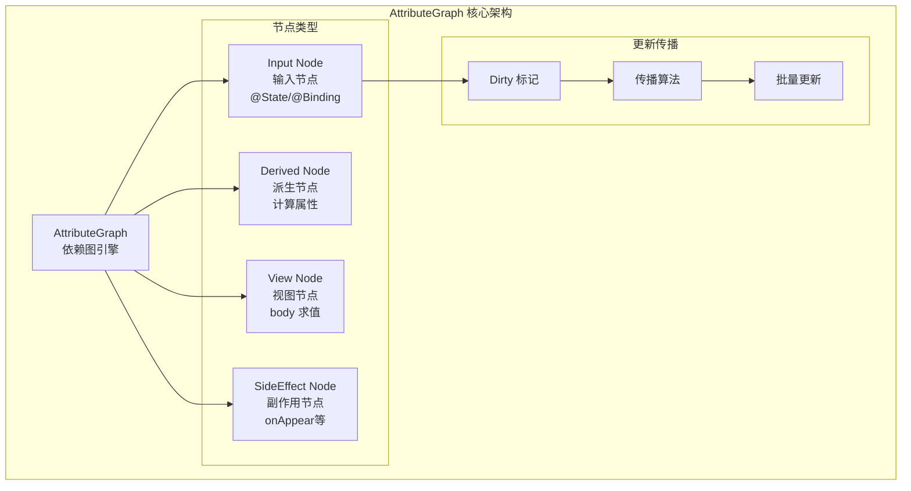
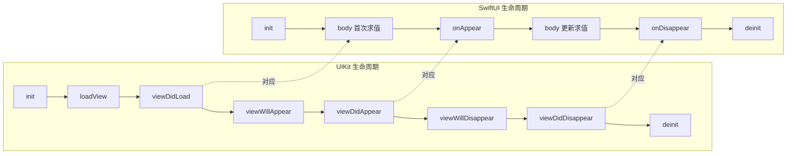

# SwiftUI 架构与渲染机制深度解析

> **文档版本**: iOS 16+ / Swift 5.9+  
> **核心定位**: 从底层原理理解 SwiftUI 的声明式渲染引擎

---

## 核心结论 TL;DR

| 维度 | 核心结论 |
|------|----------|
| **架构范式** | SwiftUI 采用声明式 UI，通过描述「状态到视图的映射」而非「操作步骤」构建界面 |
| **依赖追踪** | AttributeGraph 引擎实现细粒度依赖追踪，仅更新受影响的视图子树 |
| **视图标识** | 结构标识（类型+位置）为主，显式 `id()` 修饰符为辅 |
| **状态驱动** | `@State`/`@Binding`/`@Environment` 通过属性包装器触发 AttributeGraph 节点更新 |
| **渲染流程** | View body 求值 → AttributeGraph 更新 → Core Animation 层提交 → GPU 渲染 |

---

## 一、声明式 UI 范式 vs 命令式 UI

### 1.1 本质区别对比

```
┌─────────────────────────────────────────────────────────────────────────┐
│                          UI 开发范式对比                                 │
├─────────────────────────────────────────────────────────────────────────┤
│                                                                         │
│   命令式 (UIKit)                          声明式 (SwiftUI)              │
│   ─────────────────                       ─────────────────             │
│                                                                         │
│   ┌─────────────┐                         ┌─────────────┐               │
│   │  初始化视图  │                         │  定义状态   │               │
│   └──────┬──────┘                         └──────┬──────┘               │
│          ▼                                       ▼                      │
│   ┌─────────────┐                         ┌─────────────┐               │
│   │  响应事件   │◄──── 手动更新 ────►      │  声明视图   │               │
│   └──────┬──────┘                         └──────┬──────┘               │
│          ▼                                       │                      │
│   ┌─────────────┐                                │ 自动同步              │
│   │  修改属性   │                                ▼                      │
│   └──────┬──────┘                         ┌─────────────┐               │
│          ▼                                │ 框架处理    │               │
│   ┌─────────────┐                         │ 渲染更新    │               │
│   │  调用 setNeedsDisplay                  └─────────────┘               │
│   └──────┬──────┘                                                       │
│          ▼                                                              │
│   ┌─────────────┐                                                       │
│   │  系统重绘   │                                                       │
│   └─────────────┘                                                       │
│                                                                         │
└─────────────────────────────────────────────────────────────────────────┘
```

### 1.2 代码范式对比

**UIKit 命令式代码 (iOS 13 之前)**:

```swift
// iOS 13 之前：命令式 UIKit
class CounterViewController: UIViewController {
    private let countLabel = UILabel()
    private var count = 0 {
        didSet {
            // 必须手动更新 UI
            countLabel.text = "Count: \(count)"
        }
    }
    
    override func viewDidLoad() {
        super.viewDidLoad()
        setupUI()
    }
    
    private func setupUI() {
        // 1. 创建视图层次
        view.addSubview(countLabel)
        
        // 2. 配置约束
        countLabel.translatesAutoresizingMaskIntoConstraints = false
        NSLayoutConstraint.activate([
            countLabel.centerXAnchor.constraint(equalTo: view.centerXAnchor),
            countLabel.centerYAnchor.constraint(equalTo: view.centerYAnchor)
        ])
        
        // 3. 初始状态
        countLabel.text = "Count: 0"
        
        // 4. 添加按钮
        let button = UIButton(type: .system)
        button.setTitle("Increment", for: .normal)
        button.addTarget(self, action: #selector(increment), for: .touchUpInside)
        view.addSubview(button)
        // ... 更多约束代码
    }
    
    @objc private func increment() {
        count += 1  // 触发 didSet 手动更新 UI
    }
}
```

**SwiftUI 声明式代码 (iOS 13+)**:

```swift
// SwiftUI：声明式 - 描述「状态到视图的映射」
struct CounterView: View {
    @State private var count = 0  // 状态声明
    
    var body: some View {
        VStack {
            Text("Count: \(count)")  // 声明式：描述 count 如何映射到 Text
            Button("Increment") {
                count += 1  // 仅修改状态，框架自动处理 UI 更新
            }
        }
    }
}
```

### 1.3 范式对比表格

| 维度 | UIKit (命令式) | SwiftUI (声明式) |
|------|----------------|------------------|
| **心智模型** | 操作步骤序列 | 状态到视图的函数映射 |
| **状态管理** | 手动同步状态与 UI | 自动依赖追踪与同步 |
| **代码结构** | 分散的 setup/update 逻辑 | 集中的 body 描述 |
| **可预测性** | 依赖开发者正确调用更新 | 框架保证状态-UI 一致性 |
| **测试难度** | 需模拟用户交互序列 | 可测试纯函数式视图转换 |
| **学习曲线** | 需理解完整 UIKit 生命周期 | 需理解响应式编程范式 |

---

## 二、AttributeGraph 引擎：核心依赖追踪机制

### 2.1 AttributeGraph 架构概览

**核心结论**: AttributeGraph 是 SwiftUI 的底层依赖图引擎，负责追踪状态依赖、计算视图更新、最小化重绘范围。



### 2.2 节点类型详解

```swift
// AttributeGraph 伪代码表示

// 1. Input Node - 输入节点
// 对应 @State, @Binding, @Environment 等状态源
class InputNode<Value>: AttributeNode {
    var value: Value
    var subscribers: [AttributeNode] = []
    
    func setValue(_ newValue: Value) {
        if value != newValue {
            value = newValue
            markDirty()  // 标记为脏，触发下游更新
        }
    }
}

// 2. Derived Node - 派生节点
// 对应计算属性、View 的 body 求值
class DerivedNode<Output>: AttributeNode {
    var compute: () -> Output
    var cachedValue: Output?
    var dependencies: [AttributeNode] = []
    
    func evaluate() -> Output {
        if isDirty || cachedValue == nil {
            cachedValue = compute()  // 重新计算
            isDirty = false
        }
        return cachedValue!
    }
}

// 3. View Node - 视图节点
// 每个 View 的 body 对应一个 View Node
class ViewNode: AttributeNode {
    var viewType: Any.Type
    var children: [ViewNode] = []
    var identity: ViewIdentity
    
    func render() -> RenderOutput {
        // 调用 body 求值
        let bodyContent = evaluateBody()
        // 生成渲染指令
        return generateRenderCommands(bodyContent)
    }
}
```

### 2.3 依赖追踪与更新传播

```
┌─────────────────────────────────────────────────────────────────────────┐
│                     AttributeGraph 更新传播流程                          │
├─────────────────────────────────────────────────────────────────────────┤
│                                                                         │
│   状态变化                                                               │
│      │                                                                  │
│      ▼                                                                  │
│   ┌─────────────┐                                                       │
│   │ @State 修改 │  ──►  InputNode.setValue()                            │
│   └──────┬──────┘                                                       │
│          │                                                              │
│          ▼                                                              │
│   ┌─────────────┐                                                       │
│   │ markDirty() │  ──►  标记当前节点为 Dirty                             │
│   └──────┬──────┘                                                       │
│          │                                                              │
│          ▼                                                              │
│   ┌─────────────┐                                                       │
│   │ 传播到子节点 │  ──►  递归标记所有依赖节点为 Dirty                      │
│   └──────┬──────┘                                                       │
│          │                                                              │
│          ▼                                                              │
│   ┌─────────────┐                                                       │
│   │ 调度更新    │  ──►  加入 RunLoop 下一次迭代                          │
│   └──────┬──────┘                                                       │
│          │                                                              │
│          ▼                                                              │
│   ┌─────────────┐                                                       │
│   │ 批量求值    │  ──►  所有 Dirty 节点按拓扑序重新求值                   │
│   └──────┬──────┘                                                       │
│          │                                                              │
│          ▼                                                              │
│   ┌─────────────┐                                                       │
│   │ 生成渲染指令 │  ──►  比较新旧视图树，生成最小变更集                    │
│   └─────────────┘                                                       │
│                                                                         │
└─────────────────────────────────────────────────────────────────────────┘
```

### 2.4 更新传播示例

```swift
struct DependencyExample: View {
    @State private var count = 0           // Input Node A
    @State private var message = "Hello"   // Input Node B
    
    // Derived Node C - 依赖 A
    var doubledCount: Int {
        count * 2
    }
    
    var body: some View {
        VStack {
            // View Node D - 依赖 A
            Text("Count: \(count)")
            
            // View Node E - 依赖 C (Derived from A)
            Text("Doubled: \(doubledCount)")
            
            // View Node F - 依赖 B
            Text(message)
            
            Button("Increment") {
                count += 1  // 仅触发 A → C → D → E 的更新
            }
            
            Button("Change Message") {
                message = "World"  // 仅触发 B → F 的更新
            }
        }
    }
}
```

**依赖图结构**:

```
Input Node A (@State count)
    ├──► Derived Node C (doubledCount)
    │       └──► View Node E (Text "Doubled")
    └──► View Node D (Text "Count")

Input Node B (@State message)
    └──► View Node F (Text message)
```

---

## 三、View 协议与 body 求值机制

### 3.1 View 协议核心定义

**核心结论**: `View` 协议是 SwiftUI 的基石，`body` 是一个计算属性，其调用时机由 AttributeGraph 控制，而非每次状态变化都调用。

```swift
// SwiftUI View 协议定义 (简化版)
public protocol View {
    // 关联类型：body 的具体类型
    associatedtype Body: View
    
    // 计算属性：描述视图内容
    @ViewBuilder var body: Self.Body { get }
    
    // 类型标识：用于视图树比较
    static var _viewType: ViewType { get }
}

// View 协议的默认实现
extension View {
    // 静态类型信息，用于编译时优化
    public static var _viewType: ViewType {
        ViewType(Self.self)
    }
}
```

### 3.2 body 求值时机

```
┌─────────────────────────────────────────────────────────────────────────┐
│                        body 求值触发条件                                 │
├─────────────────────────────────────────────────────────────────────────┤
│                                                                         │
│   body 求值触发场景:                                                      │
│                                                                         │
│   1. 首次显示                                                            │
│      └── 必须完整构建视图树                                               │
│                                                                         │
│   2. 依赖的状态发生变化                                                   │
│      └── @State/@Binding/@ObservedObject 等值改变                        │
│      └── 且该状态被当前 View 或其子树引用                                 │
│                                                                         │
│   3. 环境值变化 (@Environment)                                           │
│      └── 如 colorScheme、sizeCategory 等                                 │
│                                                                         │
│   4. 父视图重新求值                                                      │
│      └── 父视图 body 被调用时，子视图可能重新求值                         │
│                                                                         │
│   body 不会求值的场景:                                                    │
│                                                                         │
│   ✗ 无关状态变化（未在当前 View 中引用）                                   │
│   ✗ 动画进行中（通过 Transaction 控制）                                    │
│   ✗ 被 @ViewBuilder 条件排除的分支                                        │
│                                                                         │
└─────────────────────────────────────────────────────────────────────────┘
```

### 3.3 结构标识 vs 显式标识

**核心结论**: SwiftUI 使用「结构标识」（类型 + 位置）作为默认视图识别机制，`id()` 修饰符提供显式标识覆盖。

```swift
// 结构标识示例：类型 + 位置决定视图身份
struct IdentityDemo: View {
    @State private var items = ["A", "B", "C"]
    
    var body: some View {
        VStack {
            // 每个 ForEach 迭代位置决定视图身份
            ForEach(items, id: \.self) { item in
                Text(item)
                    // 视图身份 = Text 类型 + ForEach 中的位置
            }
        }
    }
}

// 显式标识：使用 id() 修饰符
struct ExplicitIdentityDemo: View {
    @State private var selectedId: UUID?
    
    var body: some View {
        VStack {
            // 显式指定视图身份
            Text("First")
                .id("text-1")  // 显式标识符
            
            Text("Second")
                .id("text-2")  // 显式标识符
            
            // 动态标识
            if let id = selectedId {
                DetailView()
                    .id(id)  // 不同 id = 不同视图实例
            }
        }
    }
}
```

### 3.4 标识机制对比表

| 机制 | 原理 | 适用场景 | 注意事项 |
|------|------|----------|----------|
| **结构标识** | 类型 + 位置决定身份 | 大多数静态视图 | 改变位置会丢失状态 |
| **显式 id()** | 自定义标识符 | 动态列表、条件视图 | 改变 id 会重置视图状态 |
| **ForEach id:** | 数据驱动的标识 | 列表数据 | 需保证 id 唯一且稳定 |
| **@State 位置** | 与视图实例绑定 | 视图内部状态 | 视图身份改变则状态丢失 |

---

## 四、Diff 算法与更新策略

### 4.1 视图树比较算法

**核心结论**: SwiftUI 使用高效的树 Diff 算法，通过视图标识快速定位变更，最小化实际 UI 更新。

```
┌─────────────────────────────────────────────────────────────────────────┐
│                      SwiftUI Diff 算法流程                               │
├─────────────────────────────────────────────────────────────────────────┤
│                                                                         │
│   旧视图树                    新视图树                                   │
│                                                                         │
│      VStack                     VStack                                  │
│      /    \                     /    \                                  │
│   Text    Button              Text    Button  ← 类型+位置相同，复用       │
│     ↓                              ↓                                    │
│   "Old"                         "New"   ← 内容变化，更新属性             │
│                                                                         │
│   ─────────────────────────────────────────                             │
│                                                                         │
│   旧视图树                    新视图树                                   │
│                                                                         │
│      VStack                     VStack                                  │
│      /    \                     /    \                                  │
│   Text    Image               Text    Button  ← 位置相同但类型不同        │
│           ↓                              ↓                              │
│         移除 Image                   创建 Button                         │
│                                                                         │
│   ─────────────────────────────────────────                             │
│                                                                         │
│   旧视图树                    新视图树                                   │
│                                                                         │
│      VStack                     VStack                                  │
│      /    \                     /    |    \                             │
│   Text    Button              Text  Toggle  Button                      │
│                              ↑ 插入新节点                               │
│                                                                         │
└─────────────────────────────────────────────────────────────────────────┘
```

### 4.2 更新策略详解

```swift
// 更新策略示例
struct UpdateStrategyDemo: View {
    @State private var showDetail = false
    @State private var count = 0
    
    var body: some View {
        VStack {
            // 策略1: 条件视图 - 完全创建/销毁
            if showDetail {
                DetailView()
                // 进入: 创建新实例
                // 退出: 销毁实例，状态丢失
            }
            
            // 策略2: 透明度控制 - 保留实例
            DetailView()
                .opacity(showDetail ? 1 : 0)
            // 始终存在，仅改变透明度属性
            
            // 策略3: 显式 id 控制生命周期
            CounterView(count: count)
                .id(count)  // count 变化 = 新视图实例
            
            // 策略4: 使用 @StateObject 保持状态
            PersistentView()
                // 即使条件切换，内部 @StateObject 保持
        }
    }
}

// 条件视图状态保持方案
struct ConditionalViewWithState: View {
    @State private var showView = false
    
    // 使用 StateObject 在条件切换间保持状态
    @StateObject private var persistentData = DataStore()
    
    var body: some View {
        VStack {
            if showView {
                // 使用 .id 和外部 StateObject 保持状态
                InnerView()
                    .id("inner-view")  // 稳定标识
                    .environmentObject(persistentData)
            }
        }
    }
}
```

### 4.3 性能优化策略

| 策略 | 实现方式 | 效果 |
|------|----------|------|
| **减少 body 复杂度** | 拆分子 View | 缩小重计算范围 |
| **使用 EquatableView** | `.equatable()` | 跳过不必要的比较 |
| **稳定视图标识** | 避免频繁改变 `id()` | 保持视图状态 |
| **延迟加载** | `LazyVStack`, `LazyHStack` | 减少初始渲染量 |
| **避免大数组** | 分页加载、虚拟列表 | 降低内存占用 |

---

## 五、View 生命周期

### 5.1 SwiftUI 生命周期修饰符

**核心结论**: SwiftUI 提供 `onAppear`/`onDisappear`/`task` 等生命周期钩子，与 UIKit 生命周期有对应关系但不完全等同。

```swift
struct LifecycleDemo: View {
    @State private var isVisible = false
    
    var body: some View {
        VStack {
            Text("Hello")
                // 视图出现在屏幕上时调用
                .onAppear {
                    print("View appeared")
                    isVisible = true
                }
                // 视图从屏幕消失时调用
                .onDisappear {
                    print("View disappeared")
                    isVisible = false
                }
                // iOS 15+: 异步任务，自动取消
                .task {
                    await loadData()
                }
                // iOS 15+: 带优先级的任务
                .task(priority: .background) {
                    await performBackgroundWork()
                }
                // iOS 17+: 视图进入场景时调用
                .onGeometryChange(for: CGRect.self) { proxy in
                    proxy.frame(in: .global)
                } action: { newFrame in
                    print("Frame changed: \(newFrame)")
                }
        }
    }
    
    private func loadData() async {
        // 异步加载数据
        // 视图消失时自动取消
    }
    
    private func performBackgroundWork() async {
        // 后台优先级任务
    }
}
```

### 5.2 与 UIKit 生命周期对比



### 5.3 生命周期对比表

| UIKit | SwiftUI | 触发时机 | 注意事项 |
|-------|---------|----------|----------|
| `init` | `init` | 实例创建 | 避免在 init 中触发状态更新 |
| `viewDidLoad` | `body` 首次求值 | 视图准备显示 | body 可能被多次调用 |
| `viewWillAppear` | - | - | 使用 `onAppear` 替代 |
| `viewDidAppear` | `onAppear` | 视图已显示 | 可安全访问视图几何信息 |
| `viewWillDisappear` | - | - | 使用 `onDisappear` 替代 |
| `viewDidDisappear` | `onDisappear` | 视图已消失 | 清理资源、取消任务 |
| `deinit` | `deinit` | 实例销毁 | 注意循环引用 |

### 5.4 异步任务生命周期管理

```swift
struct AsyncLifecycleDemo: View {
    @State private var data: [Item] = []
    @State private var isLoading = false
    
    var body: some View {
        List(data) { item in
            ItemRow(item: item)
        }
        .task(id: refreshToken) {  // iOS 15+: id 变化时重启任务
            await loadData()
        }
        .refreshable {  // 下拉刷新
            await loadData()
        }
    }
    
    // 视图消失时自动取消
    private func loadData() async {
        isLoading = true
        defer { isLoading = false }
        
        do {
            // 长时间运行的任务
            data = try await API.fetchItems()
        } catch {
            // 视图消失时，未完成的 await 会自动抛出 CancellationError
            if error is CancellationError {
                print("Task cancelled due to view disappearance")
            }
        }
    }
}
```

---

## 六、渲染管线完整流程

### 6.1 渲染管线架构图

```mermaid
graph TB
    subgraph "SwiftUI 渲染管线"
        direction TB
        
        A[状态变化<br/>@State/@Binding] --> B[AttributeGraph<br/>标记 Dirty 节点]
        B --> C[调度更新<br/>RunLoop 下一次迭代]
        C --> D[批量求值<br/>拓扑序遍历]
        D --> E[Diff 算法<br/>比较视图树]
        E --> F[生成渲染指令<br/>Render Commands]
        F --> G[Core Animation<br/>图层树更新]
        G --> H[Metal/OpenGL<br/>GPU 渲染]
        H --> I[显示到屏幕]
    end
    
    subgraph "关键组件"
        AG[AttributeGraph<br/>依赖图引擎]
        DG[Diffing Engine<br/>差异计算]
        RE[Render Encoder<br/>渲染编码器]
    end
    
    B -.-> AG
    E -.-> DG
    F -.-> RE
```

### 6.2 渲染流程详解

```
┌─────────────────────────────────────────────────────────────────────────┐
│                    SwiftUI 渲染管线详细流程                              │
├─────────────────────────────────────────────────────────────────────────┤
│                                                                         │
│  Phase 1: 状态变化检测                                                   │
│  ─────────────────────                                                   │
│  @State 修改 ──► withMutation { ... } ──► 调用 willSet                  │
│       │                                         │                       │
│       │                                         ▼                       │
│       │                              AttributeGraph 标记节点 Dirty       │
│       │                                         │                       │
│       │                                         ▼                       │
│       │                              调度异步更新（下一个 RunLoop）        │
│       │                                                                 │
│  Phase 2: 批量更新求值                                                   │
│  ─────────────────────                                                   │
│  RunLoop 回调 ──► 收集所有 Dirty 节点                                     │
│       │                                                                 │
│       ▼                                                                 │
│  拓扑排序 ──► 按依赖关系确定求值顺序                                       │
│       │                                                                 │
│       ▼                                                                 │
│  遍历求值 ──► 对每个 Dirty View Node 调用 body                           │
│       │                                                                 │
│       ▼                                                                 │
│  生成新视图树 ──► 构建新的视图描述结构                                     │
│                                                                         │
│  Phase 3: Diff 与渲染指令生成                                            │
│  ────────────────────────────                                            │
│  旧视图树 ──┐                                                            │
│             ├──► Tree Diff 算法 ──► 识别变更节点                          │
│  新视图树 ──┘                                                            │
│       │                                                                 │
│       ▼                                                                 │
│  生成渲染指令:                                                            │
│  - 创建新图层 (CALayer)                                                  │
│  - 更新图层属性 (frame, opacity, transform)                              │
│  - 删除旧图层                                                            │
│  - 插入/移除动画                                                         │
│                                                                         │
│  Phase 4: Core Animation 提交                                            │
│  ────────────────────────────                                            │
│  渲染指令 ──► CALayer 属性更新                                            │
│       │                                                                 │
│       ▼                                                                 │
│  CATransaction 提交                                                      │
│       │                                                                 │
│       ▼                                                                 │
│  隐式/显式动画处理                                                        │
│       │                                                                 │
│       ▼                                                                 │
│  提交到 Render Server                                                    │
│                                                                         │
│  Phase 5: GPU 渲染                                                       │
│  ─────────────────                                                       │
│  Render Server ──► 生成 GPU 指令 (Metal/OpenGL)                          │
│       │                                                                 │
│       ▼                                                                 │
│  GPU 执行渲染                                                            │
│       │                                                                 │
│       ▼                                                                 │
│  帧缓冲区输出                                                            │
│       │                                                                 │
│       ▼                                                                 │
│  显示控制器扫描输出到屏幕                                                  │
│                                                                         │
└─────────────────────────────────────────────────────────────────────────┘
```

### 6.3 渲染性能关键点

```swift
// 渲染性能优化示例
struct RenderOptimizationDemo: View {
    @State private var offset: CGFloat = 0
    
    var body: some View {
        VStack {
            // 优化1: 使用 drawingGroup 启用离屏渲染
            ComplexView()
                .drawingGroup(opaque: false, colorMode: .linear)
            
            // 优化2: 使用 layer 渲染优化
            Text("Optimized")
                .layerEffect(ShaderLibrary.effect, maxSampleOffset: .zero)
            
            // 优化3: 避免透明度过渡触发布局
            ExpensiveView()
                .compositingGroup()  // 隔离渲染组
                .opacity(0.5)
        }
    }
}
```

---

## 七、状态属性包装器底层实现

### 7.1 @State 底层机制

**核心结论**: `@State` 使用 `State` 结构体包装值，通过 `_location` 与 AttributeGraph 的 Input Node 关联，实现状态变化到视图更新的自动传播。

```swift
// @State 简化实现原理

@propertyWrapper
public struct State<Value>: DynamicProperty {
    // 存储实际值的位置引用
    @inlinable internal var _location: AnyLocation<Value>?
    
    // 包装值访问
    public var wrappedValue: Value {
        get {
            // 从 AttributeGraph 节点读取值
            _location!.get()
        }
        nonmutating set {
            // 写入 AttributeGraph 节点，触发更新
            _location!.set(newValue)
        }
    }
    
    // 投影值 ($state) 返回 Binding
    public var projectedValue: Binding<Value> {
        Binding(
            get: { self.wrappedValue },
            set: { self.wrappedValue = $0 }
        )
    }
    
    // 初始化
    public init(wrappedValue value: Value) {
        // 延迟绑定到 AttributeGraph
    }
    
    // 与 AttributeGraph 建立连接
    internal mutating func update() {
        // 在 body 求值前调用，确保 _location 有效
    }
}

// 使用示例
struct StateDemo: View {
    @State private var count = 0  // 创建 State 实例
    
    var body: some View {
        Button("Count: \(count)") {
            count += 1  // 调用 wrappedValue setter
        }
    }
}
```

### 7.2 @Binding 底层机制

```swift
// @Binding 简化实现原理

@propertyWrapper
public struct Binding<Value> {
    // 存储 getter/setter 闭包
    internal var _get: () -> Value
    internal var _set: (Value) -> Void
    
    public var wrappedValue: Value {
        get { _get() }
        nonmutating set { _set(newValue) }
    }
    
    public var projectedValue: Binding<Value> { self }
    
    // 从 State 创建 Binding
    public static func constant(_ value: Value) -> Binding<Value> {
        Binding(get: { value }, set: { _ in })
    }
}

// 使用示例
struct BindingDemo: View {
    @State private var isOn = false
    
    var body: some View {
        // $isOn 是 Binding<Bool>
        Toggle("Enable", isOn: $isOn)
        
        // 手动创建 Binding
        ChildView(binding: Binding(
            get: { isOn },
            set: { isOn = $0 }
        ))
    }
}

struct ChildView: View {
    @Binding var binding: Bool
    
    var body: some View {
        Toggle("Child", isOn: $binding)
    }
}
```

### 7.3 @Environment 底层机制

```swift
// @Environment 简化实现原理

@propertyWrapper
public struct Environment<Value>: DynamicProperty {
    // 使用 KeyPath 标识环境值
    internal let keyPath: KeyPath<EnvironmentValues, Value>
    
    // 缓存的值
    @inlinable internal var _value: Value?
    
    public var wrappedValue: Value {
        // 从环境值表中读取
        _value!
    }
    
    public init(_ keyPath: KeyPath<EnvironmentValues, Value>) {
        self.keyPath = keyPath
    }
    
    // 从父视图环境继承
    internal mutating func update() {
        // 在 body 求值前从 EnvironmentValues 读取
    }
}

// EnvironmentValues 定义
public struct EnvironmentValues: CustomStringConvertible {
    // 存储所有环境值的字典
    internal var _values: [ObjectIdentifier: Any] = [:]
    
    // 访问特定环境值
    public subscript<Key: EnvironmentKey>(key: Key.Type) -> Key.Value {
        get { _values[ObjectIdentifier(key)] as? Key.Value ?? Key.defaultValue }
        set { _values[ObjectIdentifier(key)] = newValue }
    }
}

// 自定义环境值
private struct ThemeKey: EnvironmentKey {
    static let defaultValue: Theme = .light
}

extension EnvironmentValues {
    var theme: Theme {
        get { self[ThemeKey.self] }
        set { self[ThemeKey.self] = newValue }
    }
}

// 使用
struct EnvironmentDemo: View {
    @Environment(\.theme) private var theme
    @Environment(\.colorScheme) private var colorScheme
    @Environment(\.dismiss) private var dismiss
    
    var body: some View {
        Text("Current theme: \(theme)")
            .foregroundColor(theme.primaryColor)
    }
}
```

### 7.4 状态包装器对比表

| 属性包装器 | 存储位置 | 更新范围 | 适用场景 | 生命周期 |
|------------|----------|----------|----------|----------|
| `@State` | AttributeGraph | 当前 View | 视图私有状态 | 与视图绑定 |
| `@Binding` | 引用外部存储 | 源状态所在 View | 父子视图通信 | 依赖源状态 |
| `@ObservedObject` | 外部对象 | 使用该对象的所有 View | 跨视图共享状态 | 外部管理 |
| `@StateObject` | AttributeGraph | 当前 View | 需要保持的引用类型 | 与视图绑定 |
| `@Environment` | 环境值表 | 子树中所有 View | 全局/主题配置 | 应用级 |
| `@EnvironmentObject` | 环境对象表 | 子树中所有 View | 依赖注入 | 应用级 |

### 7.5 状态更新传播机制

```
┌─────────────────────────────────────────────────────────────────────────┐
│                     状态更新传播完整流程                                 │
├─────────────────────────────────────────────────────────────────────────┤
│                                                                         │
│   @State 更新                                                            │
│      │                                                                  │
│      ▼                                                                  │
│   ┌─────────────────┐                                                   │
│   │ wrappedValue    │                                                   │
│   │    setter       │                                                   │
│   └────────┬────────┘                                                   │
│            │                                                            │
│            ▼                                                            │
│   ┌─────────────────┐                                                   │
│   │ _location.set() │  ──► 写入 AttributeGraph Input Node               │
│   └────────┬────────┘                                                   │
│            │                                                            │
│            ▼                                                            │
│   ┌─────────────────┐                                                   │
│   │ markDirty()     │  ──► 标记节点为 Dirty                              │
│   └────────┬────────┘                                                   │
│            │                                                            │
│            ▼                                                            │
│   ┌─────────────────┐                                                   │
│   │ 传播到依赖节点   │  ──► 递归标记所有下游节点                           │
│   └────────┬────────┘                                                   │
│            │                                                            │
│            ▼                                                            │
│   ┌─────────────────┐                                                   │
│   │ 调度异步更新     │  ──► 注册到 RunLoop .beforeWaiting                │
│   └────────┬────────┘                                                   │
│            │                                                            │
│            ▼                                                            │
│   ┌─────────────────┐                                                   │
│   │ 执行更新         │  ──► 下一个 RunLoop 迭代执行                      │
│   └────────┬────────┘                                                   │
│            │                                                            │
│            ▼                                                            │
│   ┌─────────────────┐                                                   │
│   │ body 重新求值   │  ──► 调用受影响的 View body                        │
│   └────────┬────────┘                                                   │
│            │                                                            │
│            ▼                                                            │
│   ┌─────────────────┐                                                   │
│   │ 生成新视图树     │                                                   │
│   └────────┬────────┘                                                   │
│            │                                                            │
│            ▼                                                            │
│   ┌─────────────────┐                                                   │
│   │ Diff 算法       │  ──► 比较新旧视图树                                │
│   └────────┬────────┘                                                   │
│            │                                                            │
│            ▼                                                            │
│   ┌─────────────────┐                                                   │
│   │ 更新渲染层       │  ──► Core Animation 提交                          │
│   └─────────────────┘                                                   │
│                                                                         │
└─────────────────────────────────────────────────────────────────────────┘
```

---

## 八、总结与最佳实践

### 8.1 核心概念回顾

```mermaid
graph TB
    subgraph "SwiftUI 核心架构"
        A[声明式 UI 范式] --> B[View 协议]
        B --> C[body 计算属性]
        C --> D[AttributeGraph]
        D --> E[依赖追踪]
        E --> F[Diff 算法]
        F --> G[Core Animation]
        
        H[状态管理] --> D
        H --> I[@State/@Binding]
        H --> J[@Environment]
        
        K[视图标识] --> L[结构标识]
        K --> M[显式 id]
    end
```

### 8.2 最佳实践清单

**状态管理**
- 优先使用 `@State` 管理视图私有状态
- 使用 `@Binding` 实现父子视图双向通信
- 使用 `@StateObject` 管理需要保持生命周期的引用类型
- 避免在 `body` 中创建 `@ObservedObject`

**性能优化**
- 将复杂视图拆分为独立子 View
- 使用 `LazyVStack`/`LazyHStack` 替代 `VStack`/`HStack` 处理大数据
- 避免在 `body` 中执行耗时计算
- 使用 `.equatable()` 跳过不必要的比较

**生命周期**
- 使用 `.task()` 管理异步任务（iOS 15+）
- 在 `onDisappear` 中清理资源
- 避免在 `init` 中触发状态更新

**调试技巧**
- 使用 `_printChanges()` 查看视图更新原因
- 使用 Instruments SwiftUI 模板分析性能
- 使用 `.id()` 控制视图生命周期

---

## 参考文档

- [SwiftUI Essentials - Apple Developer](https://developer.apple.com/documentation/swiftui/app-essentials)
- [Data Flow in SwiftUI - WWDC 2020](https://developer.apple.com/videos/play/wwdc2020/10040)
- [Demystify SwiftUI - WWDC 2021](https://developer.apple.com/videos/play/wwdc2021/10022)
- [The SwiftUI Layout Protocol - WWDC 2022](https://developer.apple.com/videos/play/wwdc2022/10056)
