# UIKit 性能优化深度解析

> 版本要求: iOS 13+ | Swift 5.5+ | Xcode 14+
> 交叉引用: [渲染性能与能耗优化](../06_性能优化框架/渲染性能与能耗优化_详细解析.md) | [启动优化与包体积治理](../06_性能优化框架/启动优化与包体积治理_详细解析.md) | [UIKit架构与事件机制](./UIKit架构与事件机制_详细解析.md)

---

## 核心结论 TL;DR

| # | 优化策略 | 核心原理 | 预期收益 | 优先级 |
|---|---------|---------|---------|-------|
| 1 | **Cell 复用 + 预注册** | 避免重复创建视图对象，复用池管理生命周期 | 列表滚动帧率 → 60fps | P0 |
| 2 | **离屏渲染消除** | 避免 GPU 上下文切换与临时 FrameBuffer 创建 | 帧率提升 10-20fps | P0 |
| 3 | **图片下采样 + 异步解码** | 降低位图内存占用，避免主线程解码阻塞 | 内存降低 50-80% | P0 |
| 4 | **AutoLayout 精简约束** | 减少 Cassowary 求解器迭代次数 | Cell 布局耗时降低 30-50% | P1 |
| 5 | **视图层级扁平化** | 减少 Commit 阶段序列化开销和 GPU 合成层数 | Commit 耗时降低 20-40% | P1 |
| 6 | **estimatedHeight 预设** | 避免 Self-Sizing Cell 的全量高度预计算 | 首屏加载加速 3-5x | P1 |
| 7 | **shadowPath 预设** | 避免 Core Animation 实时计算阴影路径 | 阴影渲染性能提升 5-10x | P1 |
| 8 | **Diffable DataSource** | 增量更新替代 reloadData，减少不必要的 Cell 重建 | 更新耗时降低 60-80% | P2 |
| 9 | **Prefetching 预加载** | 预取即将可见的数据和图片，避免滚动卡顿 | 快速滚动卡顿消除 | P2 |
| 10 | **Core Animation 事务合并** | 减少 CATransaction commit 次数 | 批量更新性能提升 2-3x | P2 |

**性能瓶颈分类速查：**

| 瓶颈类型 | 典型表现 | 检测手段 | 关键指标 |
|---------|---------|---------|---------|
| **CPU 瓶颈** | 主线程卡顿、布局计算慢 | Time Profiler、RunLoop 监控 | 主线程 CPU > 80% |
| **GPU 瓶颈** | 离屏渲染、过度绘制 | Core Animation Instruments | FPS < 55 |
| **内存瓶颈** | OOM 崩溃、Jetsam 事件 | Allocations、Memory Graph | 内存峰值 > 1.5GB |
| **I/O 瓶颈** | 图片加载慢、数据库查询阻塞 | System Trace、os_signpost | 磁盘读取 > 10ms/次 |

---

## 二、UIKit 性能特征与瓶颈分类

### 2.1 UIKit 性能模型

**核心结论：UIKit 渲染遵循严格的管线模型，一帧 16.67ms 的时间预算在 CPU（Layout/Display/Prepare/Commit）与 GPU（Render/Composite）之间分配，任一阶段超时都会导致掉帧。**

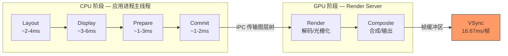

### 2.2 四大性能瓶颈类型

| 瓶颈类型 | 产生原因 | 典型场景 | 诊断信号 | 核心优化方向 |
|---------|---------|---------|---------|------------|
| **CPU 瓶颈** | 主线程计算密集：布局求解、文本排版、业务逻辑 | 复杂 Cell 布局、JSON 解析、正则匹配 | Time Profiler 主线程占用率高 | 异步化、缓存、算法优化 |
| **GPU 瓶颈** | 合成层过多、离屏渲染、过度绘制 | 多层圆角阴影叠加、半透明视图堆叠 | Core Animation FPS 下降 | 减少离屏渲染、扁平化层级 |
| **内存瓶颈** | 大图解码、视图缓存过多、循环引用泄漏 | 图片画廊、长列表缓存未清理 | Memory Graph 内存持续增长 | 下采样、NSCache 限额、弱引用 |
| **I/O 瓶颈** | 同步磁盘读写、网络阻塞主线程 | SQLite 主线程查询、同步图片加载 | System Trace 磁盘/网络等待 | 异步 I/O、预加载、缓存 |

### 2.3 关键性能指标

| 指标 | 目标值 | 劣化阈值 | 采集方式 | 说明 |
|------|-------|---------|---------|------|
| **FPS（帧率）** | ≥ 58fps | < 55fps | CADisplayLink | 连续 3 帧低于阈值触发告警 |
| **主线程 CPU** | < 60% | > 80% | mach_thread_info | 单帧 CPU 时间 < 10ms |
| **内存峰值** | < 500MB | > 1GB | task_info | 接近 Jetsam 限额需告警 |
| **首屏渲染时间** | < 300ms | > 800ms | os_signpost | 从 viewDidLoad 到首帧上屏 |
| **卡顿率** | < 1% | > 3% | RunLoop Observer | 主线程阻塞 > 50ms 计为卡顿 |
| **离屏渲染次数** | 0 | > 5/屏 | Core Animation 调试 | Color Offscreen-Rendered 黄色标记 |

### 2.4 性能预算模型

**核心结论：60fps 要求每帧 16.67ms 完成全部工作，合理的预算分配是保证流畅度的基础。**

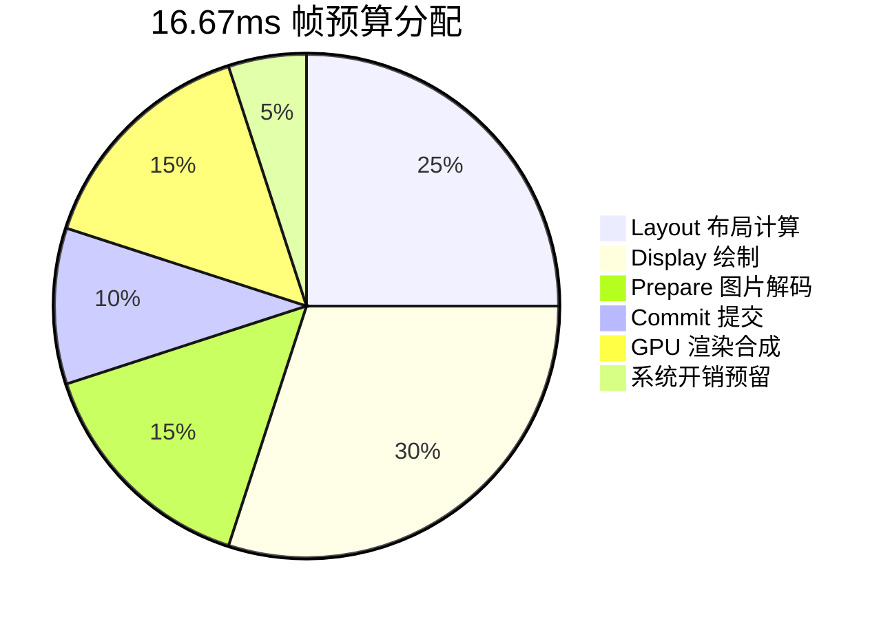

| 阶段 | 预算时间 | 超标后果 | 优化手段 |
|------|---------|---------|---------|
| **Layout** | ~4ms | Cell 高度计算卡顿 | 缓存高度、简化约束 |
| **Display** | ~5ms | 自定义绘制掉帧 | 异步绘制、预渲染位图 |
| **Prepare** | ~2.5ms | 图片解码阻塞 | 异步解码、下采样 |
| **Commit** | ~1.5ms | 图层树序列化慢 | 扁平化层级、减少图层 |
| **GPU** | ~2.5ms | 合成/渲染超时 | 消除离屏渲染、减少过度绘制 |
| **预留** | ~1ms | — | 安全余量 |

---

## 三、列表性能优化（UITableView / UICollectionView）

### 3.1 Cell 复用机制优化

**核心结论：Cell 复用是列表性能的基石，预注册 + 正确的复用标识管理可以消除 99% 的列表创建开销。**

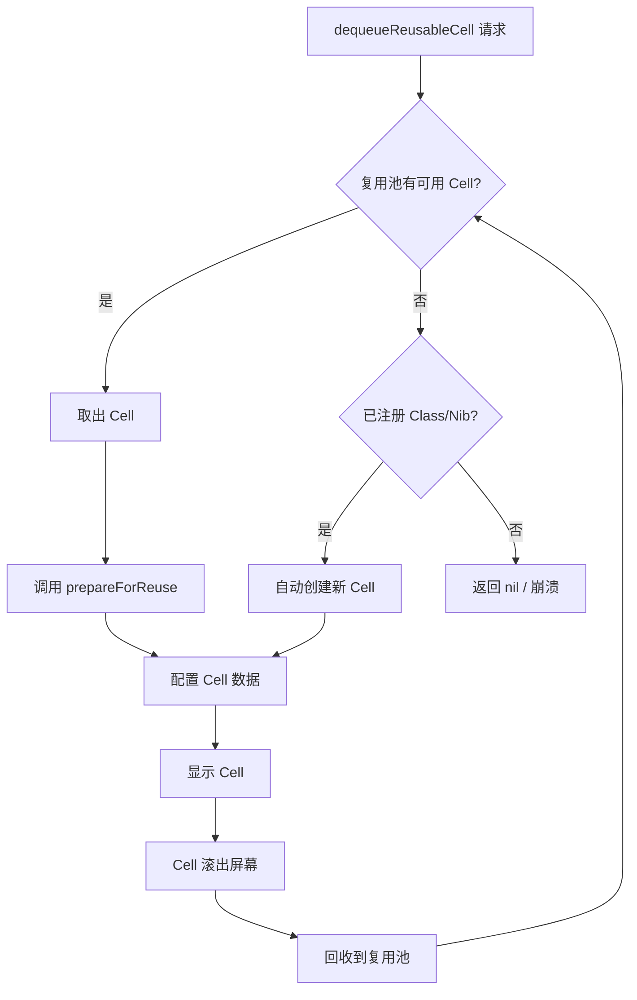

**复用优化检查点：**

| 优化项 | 推荐做法 | 反模式 | 性能影响 |
|-------|---------|-------|---------|
| **注册方式** | viewDidLoad 中 register 预注册 | cellForRow 中手动 init | 消除首次创建延迟 |
| **复用标识** | 静态常量定义，一种 Cell 一个 ID | 动态拼接字符串作为 ID | 避免复用池碎片化 |
| **prepareForReuse** | 重置图片、取消异步任务 | 不重置导致数据残留 | 防止图片闪烁 |
| **Cell 类型数量** | ≤ 5 种不同类型 | 10+ 种类型 | 复用命中率下降 |

### 3.2 Self-Sizing Cell 性能

**核心结论：`estimatedRowHeight` 的正确设置可将首屏加载速度提升 3-5 倍，它避免了 UIKit 对所有 Cell 进行高度预计算。**

| 配置方式 | 首屏加载时间（1000 条数据） | 滚动性能 | 推荐度 |
|---------|--------------------------|---------|-------|
| 固定高度 `rowHeight = 80` | ~5ms | 最优 | 固定高度场景首选 |
| `estimatedRowHeight = 80` + AutoLayout | ~20ms | 良好 | 动态高度场景首选 |
| 仅 `automaticDimension` 无 estimated | ~200ms | 良好 | 不推荐 |
| `heightForRowAt` 手动计算 + 缓存 | ~15ms | 最优 | 极致性能场景 |

**高度缓存策略：**

```swift
// 核心思路：以数据模型标识为 key 缓存已计算的高度
private var heightCache: [String: CGFloat] = [:]
```

### 3.3 预加载与分页

**核心结论：`UITableViewDataSourcePrefetching` 配合分页加载，可在用户感知之前完成数据和图片的预取，消除快速滚动时的空白卡顿。**

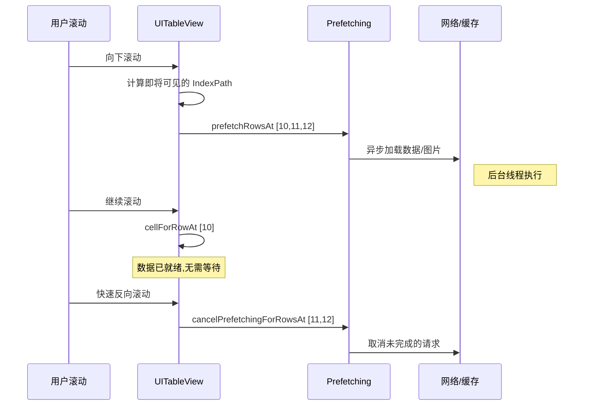

**分页加载最佳策略：**

| 策略 | 实现要点 | 适用场景 | 注意事项 |
|------|---------|---------|---------|
| **阈值预加载** | 滚动到倒数第 N 条时触发 | 无限滚动列表 | N 通常取 5-10 |
| **Prefetching API** | 实现 prefetchRowsAt / cancelPrefetching | 图片/富文本列表 | 必须支持取消 |
| **游标分页** | 基于 cursor 而非 offset | 实时更新数据源 | 避免数据重复/遗漏 |
| **骨架屏占位** | 加载中显示骨架 Cell | 首屏加载 | 提升用户感知速度 |

### 3.4 图片异步加载与缓存

**核心结论：主线程图片解码是列表卡顿的首要原因，异步解码 + 下采样可同时解决 CPU 和内存两个瓶颈。**


**图片内存优化对比：**

| 场景 | 原始尺寸 | 显示尺寸 | 未优化内存 | 下采样后内存 | 节省比例 |
|------|---------|---------|----------|------------|---------|
| 相册缩略图 | 4032×3024 | 80×80 | 46.6MB | 25.6KB | 99.9% |
| 列表头像 | 1024×1024 | 44×44 | 4MB | 7.7KB | 99.8% |
| 详情大图 | 4032×3024 | 375×281 | 46.6MB | 422KB | 99.1% |

> 计算公式：内存 = width × height × 4 bytes（RGBA）

### 3.5 Diffable DataSource 性能特征

**核心结论：Diffable DataSource 使用 Myers Diff 算法（O(N+D) 复杂度），在中小数据集（< 5000）上表现优异，大数据集需注意 Diff 计算应放在后台线程。**

| 数据集规模 | Diff 计算耗时（iPhone 14） | 推荐策略 |
|-----------|--------------------------|---------|
| < 100 条 | < 1ms | 直接主线程 apply |
| 100-1000 条 | 1-10ms | 主线程 apply 可接受 |
| 1000-5000 条 | 10-50ms | 后台计算 Snapshot，主线程 apply |
| > 5000 条 | > 50ms | 分段加载 + 后台 Diff |

### 3.6 Compositional Layout vs Flow Layout 性能对比

| 维度 | UICollectionViewFlowLayout | UICollectionViewCompositionalLayout |
|------|---------------------------|-------------------------------------|
| **布局计算** | 简单网格快速，复杂布局需自定义 | 声明式定义，引擎内部优化 |
| **内存占用** | 低（缓存所有属性） | 中（按 Section 缓存） |
| **滚动性能** | 简单场景优，复杂场景劣 | 一致性好，复杂场景优 |
| **增量更新** | 配合 performBatchUpdates | 原生 Diffable DataSource 协作 |
| **复杂布局能力** | 需继承自定义 Layout | 原生支持正交滚动、瀑布流等 |
| **推荐场景** | 简单等高网格 | iOS 13+ 所有新项目 |

### 3.7 列表性能优化检查清单

| # | 检查项 | 通过标准 | 检测方法 |
|---|-------|---------|---------|
| 1 | Cell 已预注册 | viewDidLoad 中 register | 代码审查 |
| 2 | 复用标识使用静态常量 | 无动态拼接 | 代码审查 |
| 3 | estimatedHeight 已设置 | 值接近实际平均高度 | 代码审查 |
| 4 | 图片异步加载 + 下采样 | 主线程无解码操作 | Time Profiler |
| 5 | prepareForReuse 正确重置 | 无图片闪烁/数据残留 | 手动滚动测试 |
| 6 | Prefetching 已实现 | 快速滚动无空白 Cell | 快速滑动测试 |
| 7 | 无离屏渲染 Cell | Offscreen-Rendered 无黄色 | Core Animation 调试 |
| 8 | Cell 视图层级 ≤ 10 层 | View Debugger 检查 | Xcode View Hierarchy |
| 9 | 无主线程 I/O | 无同步网络/磁盘操作 | System Trace |
| 10 | 高度缓存机制 | 相同数据不重复计算 | Time Profiler |

---

## 四、离屏渲染优化

### 4.1 离屏渲染触发条件

**核心结论：离屏渲染（Offscreen Rendering）需要 GPU 创建额外的帧缓冲区并进行上下文切换，代价是正常渲染的 2-3 倍，应尽一切可能避免。**

| 触发条件 | 触发原因 | 是否可避免 | 替代方案 |
|---------|---------|-----------|---------|
| `cornerRadius` + `masksToBounds` | 需要额外 buffer 裁剪超出圆角区域的内容 | 是 | 预渲染圆角图片、`cornerCurve` |
| `shadow` 无 `shadowPath` | GPU 需实时计算视图轮廓的阴影形状 | 是 | 预设 `shadowPath` |
| `mask`（CALayer mask） | 需要在额外 buffer 中合成 mask 和内容 | 部分可避免 | 预渲染带遮罩的图片 |
| `group opacity`（allowsGroupOpacity） | 子层需先合成再整体设置透明度 | 是 | 关闭 `allowsGroupOpacity` |
| `shouldRasterize = true` | 主动触发离屏渲染并缓存结果 | 有意为之 | 适用于静态复杂视图 |
| 高斯模糊（UIVisualEffectView） | 需要多 pass 渲染完成模糊效果 | 否 | 降低模糊区域大小 |
| 文本渲染（UILabel 含特殊效果） | 带阴影/描边的文本需额外合成 | 部分 | Core Text 预渲染 |

### 4.2 为什么离屏渲染昂贵

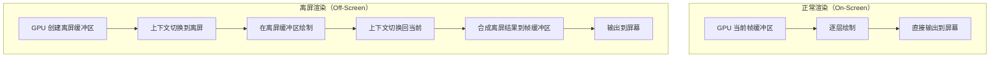

**性能开销分解：**

| 开销来源 | 说明 | 量化影响 |
|---------|------|---------|
| **上下文切换** | GPU 需要保存/恢复渲染状态，切换 render target | 每次约 0.1-0.5ms |
| **临时缓冲区分配** | 创建与视图等大的离屏 FrameBuffer | 额外内存 = width × height × 4 |
| **二次合成** | 离屏结果需要再次合成到主帧缓冲区 | 渲染时间翻倍 |
| **缓存失效** | GPU tile-based 渲染的缓存局部性被破坏 | 缓存命中率下降 |

### 4.3 优化策略

#### 4.3.1 圆角优化

| 方案 | 实现复杂度 | 性能 | 适用场景 |
|------|----------|------|---------|
| **cornerCurve = .continuous**（iOS 13+） | 低 | 仅 backgroundColor 时不触发离屏 | 纯色背景圆角 |
| **UIBezierPath 裁剪** | 中 | 预渲染，无离屏 | 图片圆角 |
| **预渲染圆角图片** | 中 | 最优，后台线程完成 | 列表 Cell 头像 |
| **CAShapeLayer mask** | 低 | 仍触发离屏（但可配合 rasterize） | 复杂形状裁剪 |

#### 4.3.2 阴影优化

```swift
// 关键优化：预设 shadowPath 避免实时计算
layer.shadowPath = UIBezierPath(roundedRect: bounds, cornerRadius: 8).cgPath
```

| 配置 | 阴影渲染耗时（100 个视图） | 是否离屏渲染 |
|------|--------------------------|------------|
| shadow 无 path | ~15ms | 是 |
| shadow + shadowPath | ~1.5ms | 否 |
| shadow + shouldRasterize | ~2ms（首次 15ms） | 是（缓存后否） |

#### 4.3.3 光栅化（shouldRasterize）

**核心结论：`shouldRasterize` 是"以空间换时间"的策略，将复杂视图渲染结果缓存为位图，但缓存有效时间约 100ms，频繁变化的视图不应使用。**

| 适用场景 | 不适用场景 |
|---------|----------|
| 静态复杂视图（多层阴影叠加） | 频繁更新内容的 Cell |
| 不滚动区域的装饰视图 | 动画中的视图 |
| 透明度不变的复杂图层 | 尺寸频繁变化的视图 |

### 4.4 离屏渲染检测方法

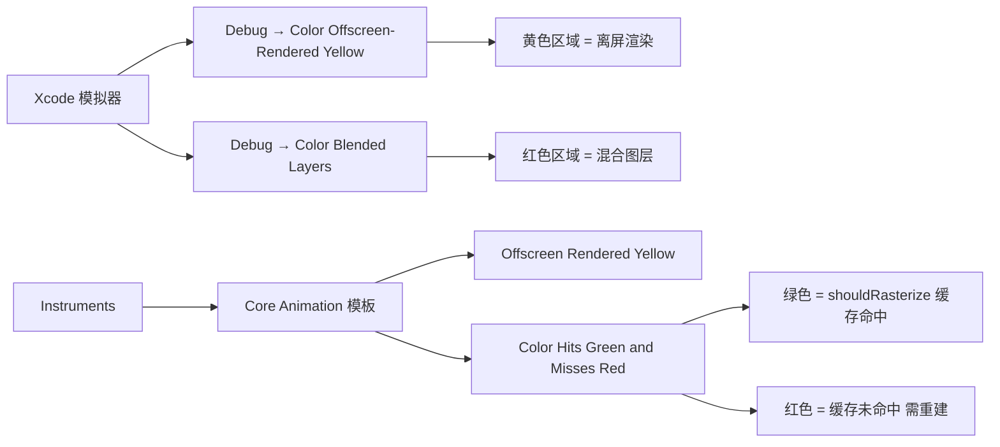

---

## 五、AutoLayout 性能优化

### 5.1 AutoLayout 性能特征

**核心结论：AutoLayout 底层使用 Cassowary 线性约束求解算法，在大多数场景下为 O(N) 线性复杂度，但存在约束冲突或 priority 竞争时可能退化为 O(N²) 甚至更高。**

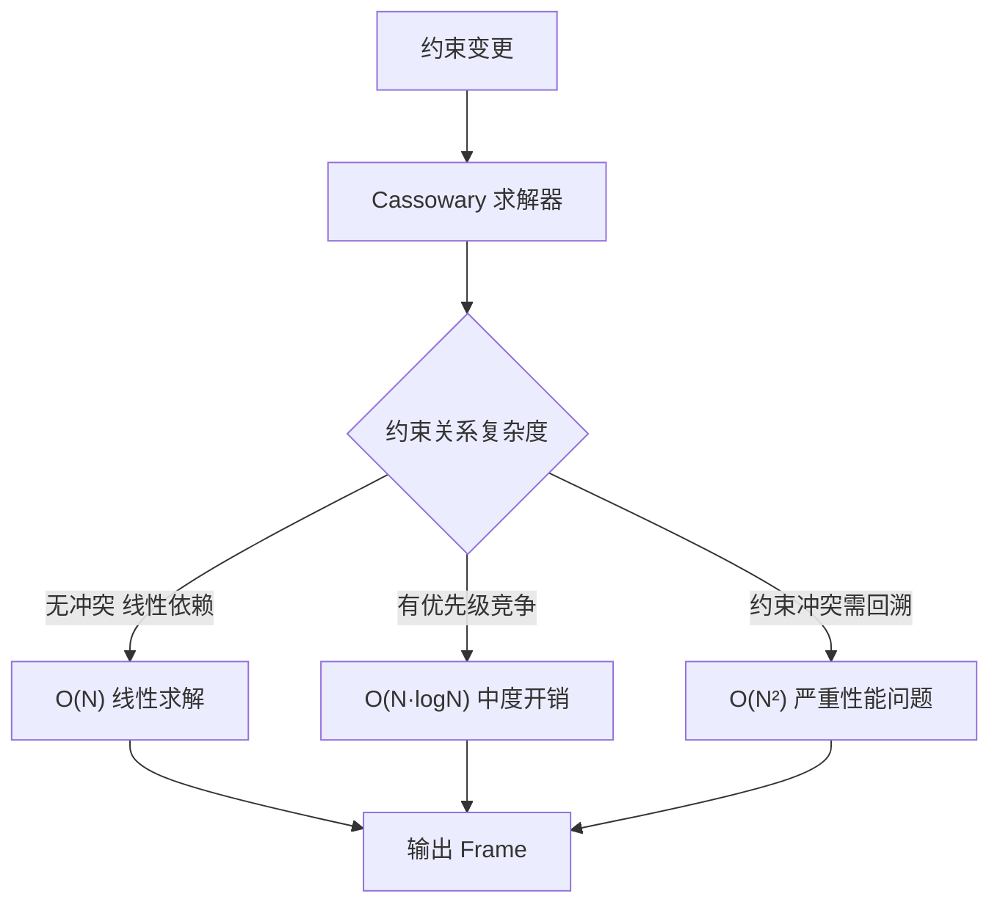

**约束数量与求解耗时关系：**

| 约束数量 | 求解耗时（iPhone 14） | 是否可接受（列表 Cell） | 是否可接受（静态页面） |
|---------|---------------------|---------------------|---------------------|
| 10-20 | < 0.1ms | 完全可接受 | 完全可接受 |
| 50-100 | 0.1-0.5ms | 可接受 | 完全可接受 |
| 100-200 | 0.5-2ms | 边界，需关注 | 可接受 |
| 200-500 | 2-10ms | 不可接受 | 需优化 |
| > 500 | > 10ms | 严重性能问题 | 不可接受 |

### 5.2 性能敏感场景

| 场景 | 敏感度 | 原因 | 推荐布局方式 |
|------|-------|------|------------|
| **列表 Cell**（高速滚动） | 极高 | 每帧需重新计算多个 Cell 布局 | AutoLayout（精简）或 Frame-based |
| **频繁动画视图** | 高 | 每帧约束求解成本叠加 | 直接修改 transform/frame |
| **复杂表单页面** | 中 | 一次性布局，滚动时不重新计算 | AutoLayout 可接受 |
| **静态信息展示** | 低 | 仅在 viewDidLayoutSubviews 计算一次 | 任何方式均可 |

### 5.3 优化策略

| 策略 | 效果 | 实施难度 | 适用场景 |
|------|------|---------|---------|
| **减少约束层级深度** | 求解器迭代次数减少 | 低 | 所有场景 |
| **避免不等式约束** | 消除分支回溯 | 低 | 高频更新视图 |
| **Frame-based 布局** | 消除求解器开销 | 中 | 高性能 Cell |
| **StackView 合理使用** | 简化约束管理 | 低 | 线性布局 |
| **updateConstraints 批量更新** | 减少求解次数 | 中 | 动态约束变更 |
| **缓存 intrinsicContentSize** | 避免重复测量 | 中 | 自定义视图 |

> **StackView 注意事项**：UIStackView 内部会创建隐式约束，嵌套过深（> 3 层）时约束数量呈指数增长，列表 Cell 中应谨慎使用。

### 5.4 AutoLayout vs Frame-based vs SwiftUI Layout 性能基准

| 维度 | Frame-based | AutoLayout | SwiftUI Layout |
|------|------------|------------|----------------|
| **布局计算速度** | 最快（直接赋值） | 中等（Cassowary 求解） | 中等（值类型 Diff） |
| **列表 Cell 性能** | 最优 | 良好（精简约束时） | 良好（iOS 16+ 优化后） |
| **动态适配能力** | 差（需手动计算） | 优秀（声明式约束） | 优秀（声明式） |
| **维护成本** | 高（计算逻辑复杂） | 中（可视化/代码） | 低（声明式语法） |
| **旋转/多尺寸适配** | 差 | 优秀 | 优秀 |
| **推荐场景** | 极致性能 Cell | 通用 UI 开发 | 新项目 / SwiftUI 优先 |

---

## 六、图片渲染与内存优化

### 6.1 图片解码全流程

**核心结论：一张图片从磁盘到屏幕需要经历解压缩 → 解码 → 上传 GPU 三个阶段，解码阶段内存膨胀最为严重（压缩数据 → 原始位图可能膨胀 10-100 倍）。**

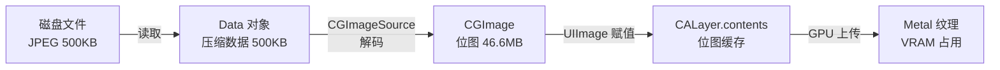

### 6.2 大图内存占用计算

| 图片尺寸 | 色彩格式 | bytesPerPixel | 位图内存 | 典型来源 |
|---------|---------|--------------|---------|---------|
| 4032×3024 | RGBA | 4 | **46.6MB** | iPhone 摄像头 |
| 4032×3024 | Wide Color P3 | 8 | **93.2MB** | Pro RAW |
| 1920×1080 | RGBA | 4 | **7.9MB** | 1080p 截图 |
| 512×512 | RGBA | 4 | **1MB** | App Icon |
| 44×44 @3x = 132×132 | RGBA | 4 | **68KB** | 列表头像 |

### 6.3 下采样技术

**核心结论：使用 ImageIO 框架的 `CGImageSourceCreateThumbnailAtIndex` 可以在解码阶段直接生成目标尺寸的位图，避免解码完整大图后再缩放。**

```swift
// 核心下采样 API — 仅解码所需尺寸，避免全图解码
let options: [CFString: Any] = [
    kCGImageSourceThumbnailMaxPixelSize: maxDimension,
    kCGImageSourceCreateThumbnailFromImageAlways: true,
    kCGImageSourceShouldCacheImmediately: true  // 立即解码
]
let thumbnail = CGImageSourceCreateThumbnailAtIndex(source, 0, options as CFDictionary)
```

### 6.4 图片缓存策略

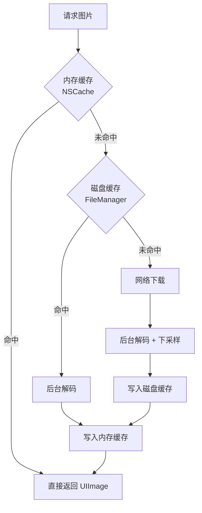

| 缓存层级 | 存储介质 | 访问速度 | 容量策略 | 生命周期 |
|---------|---------|---------|---------|---------|
| **L1 内存缓存** | NSCache | ~0.01ms | countLimit + totalCostLimit | 内存警告时自动清理 |
| **L2 磁盘缓存** | 文件系统 | ~1-5ms | 磁盘空间上限（如 200MB） | LRU 策略定期淘汰 |
| **L3 网络** | CDN/服务端 | ~50-500ms | 无限 | 由 HTTP 缓存头控制 |

### 6.5 异步解码

| 方案 | API | 线程安全 | 适用场景 |
|------|-----|---------|---------|
| **GCD 后台解码** | CGBitmapContext + drawImage | 是 | 通用方案 |
| **ImageIO 即时解码** | kCGImageSourceShouldCacheImmediately | 是 | 配合下采样 |
| **UIGraphicsImageRenderer** | renderer.image { } | 否（需主线程） | 简单变换 |
| **Core Image** | CIContext.createCGImage | 是（共享 context 需同步） | 带滤镜处理 |

### 6.6 图片格式选择

| 格式 | 压缩率 | 解码速度 | Alpha 支持 | HDR 支持 | 推荐场景 |
|------|-------|---------|-----------|---------|---------|
| **HEIF** | 最高（比 JPEG 小 50%） | 中（硬件加速） | 是 | 是 | iOS 默认拍摄、存储优先 |
| **JPEG** | 高 | 快（硬件加速） | 否 | 否 | 照片展示、兼容性优先 |
| **PNG** | 低（无损） | 快 | 是 | 否 | 图标、UI 素材 |
| **WebP** | 高（比 JPEG 小 25-30%） | 中 | 是 | 否 | 网络传输优先 |
| **AVIF** | 最高 | 慢（软解码） | 是 | 是 | 未来趋势，iOS 16+ |

---

## 七、渲染优化进阶

### 7.1 Core Animation 事务优化

**核心结论：CATransaction 隐式事务在每个 RunLoop 周期自动提交，频繁触发 UI 更新会导致多次不必要的 commit。使用显式事务或合并更新可减少提交次数。**

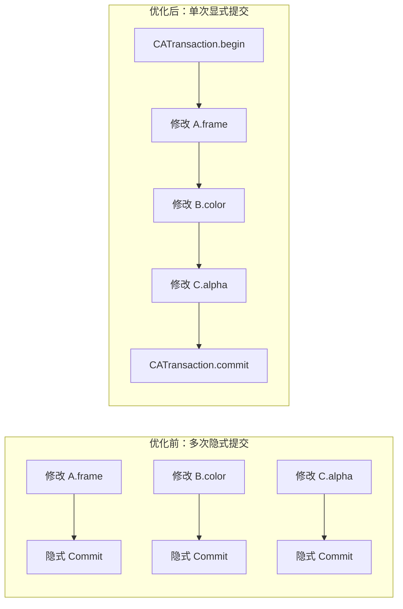

> **实际建议**：多数场景下 RunLoop 结束时的自动提交已足够高效，显式事务主要用于需要禁用动画（`setDisableActions(true)`）或设置自定义 duration 时。

### 7.2 视图层级扁平化

**核心结论：每个 CALayer 都会增加 Commit 阶段的序列化开销和 GPU 的合成成本，层级深度应控制在 10 层以内。**

| 层级深度 | Commit 耗时（100 个视图） | GPU 合成耗时 | 推荐操作 |
|---------|--------------------------|-------------|---------|
| ≤ 5 层 | < 0.5ms | < 0.3ms | 理想状态 |
| 5-10 层 | 0.5-1.5ms | 0.3-1ms | 可接受 |
| 10-20 层 | 1.5-5ms | 1-3ms | 需要优化 |
| > 20 层 | > 5ms | > 3ms | 严重问题 |

**扁平化策略：**
- 使用 `draw(_:)` 将多个子视图合并为单次绘制
- 使用 `CAShapeLayer` 替代多个装饰性子视图
- 移除不可见的视图（alpha = 0 的视图仍参与布局和渲染）

### 7.3 drawRect 替代方案

| 方案 | 适用场景 | 性能特征 | 内存影响 |
|------|---------|---------|---------|
| **CAShapeLayer** | 矢量图形（线条、路径） | GPU 直接渲染，无位图 | 低 |
| **CAGradientLayer** | 渐变背景 | GPU 硬件加速 | 低 |
| **CATextLayer** | 简单文本显示 | 避免 UILabel 的 drawRect | 低 |
| **预渲染位图** | 静态复杂图形 | 一次渲染、多次复用 | 中（缓存位图） |
| **draw(_:) 自定义绘制** | 极其复杂的自定义内容 | CPU 绘制 + backing store 内存 | 高 |

> **原则**：能用专用 Layer 子类实现的效果，就不要用 `draw(_:)` 自定义绘制。`draw(_:)` 会为视图创建一块与视图等大的 backing store 位图，内存开销显著。

### 7.4 文本渲染优化

**核心结论：文本渲染是 UIKit 中容易被忽视的性能瓶颈，尤其在列表中大量文本的排版和渲染会显著影响帧率。**

| 方案 | 排版能力 | 渲染性能 | 异步支持 | 适用场景 |
|------|---------|---------|---------|---------|
| **UILabel** | 好（AttributedString） | 中 | 否（主线程） | 通用文本显示 |
| **CATextLayer** | 基础 | 较好（GPU 加速） | 否 | 简单文本、性能敏感 |
| **Core Text** | 最强（精细控制） | 最优（可异步） | 是 | 富文本编辑器、异步文本渲染 |
| **TextKit 2**（iOS 15+） | 强 | 良好 | 部分 | 现代文本布局 |

**异步文本渲染思路**：在后台线程使用 Core Text 完成文本排版和光栅化，生成位图后在主线程赋值给 `layer.contents`，框架如 YYText / Texture 即采用此方案。

### 7.5 动画性能

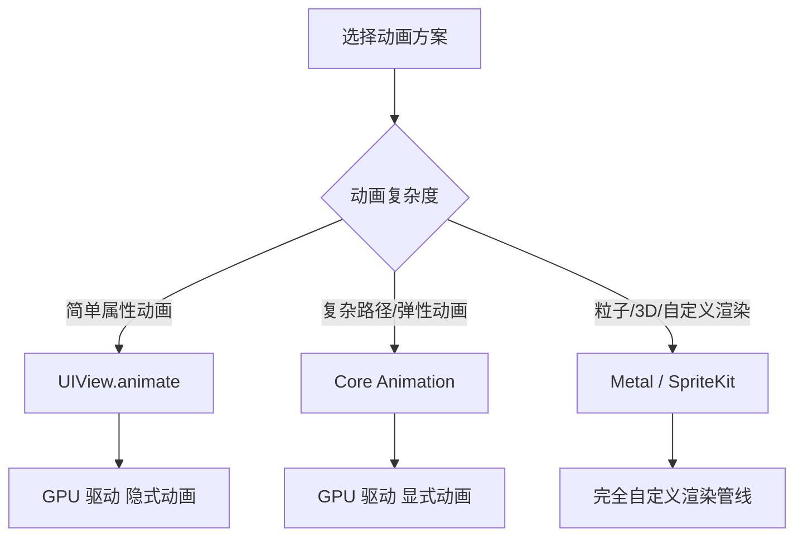

| 方案 | 性能 | 灵活度 | CPU 占用 | 适用场景 |
|------|------|-------|---------|---------|
| **UIView.animate** | 优（GPU 驱动） | 中 | 极低 | 位移/缩放/透明度 |
| **Core Animation（CAAnimation）** | 优 | 高 | 低 | 路径动画、组合动画、弹性 |
| **UIViewPropertyAnimator** | 优 | 高（可交互） | 低 | 可中断/反转的交互动画 |
| **CADisplayLink 手动驱动** | 中 | 最高 | 中-高 | 自定义物理引擎 |
| **Metal 自定义渲染** | 最优 | 最高 | 取决于实现 | 粒子系统、3D 场景 |

---

## 八、UIKit vs 其他 UI 框架性能对比

### 8.1 UIKit vs SwiftUI 性能对比

**核心结论：UIKit 在列表滚动和复杂布局上仍有优势，SwiftUI 在 iOS 17+ 持续优化后差距缩小。新项目推荐 SwiftUI 优先，性能热点用 UIKit 补充。**

| 维度 | UIKit | SwiftUI（iOS 17+） | 差距趋势 |
|------|-------|-------------------|---------|
| **列表滚动 FPS** | 58-60fps | 55-60fps | 逐年缩小 |
| **复杂布局计算** | 1x（基准） | 1.2-1.5x | SwiftUI 持续优化 |
| **启动速度** | 较快 | 首次编译 Body 有开销 | SwiftUI 缓存优化后接近 |
| **内存占用** | 较低 | 略高（Diff 引擎） | 差距较小 |
| **动画性能** | Core Animation 驱动 | 同 Core Animation | 基本一致 |
| **热重载** | 不支持 | Xcode Previews | SwiftUI 开发效率优势 |

### 8.2 UIKit vs Flutter 渲染管线对比

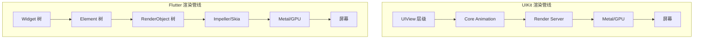

| 对比维度 | UIKit | Flutter |
|---------|-------|---------|
| **渲染引擎** | Core Animation（系统级优化） | Impeller（自研，iOS 上用 Metal） |
| **平台调用** | 原生直接调用，零开销 | Platform Channel 跨进程通信 |
| **列表性能** | 原生 Cell 复用，成熟优化 | 自建复用机制，持续优化中 |
| **启动速度** | 快（系统框架预加载） | 慢（引擎初始化 ~200ms） |
| **包体积增量** | 0（系统框架） | +10-15MB（引擎 + 框架） |
| **平台特性** | 完整原生能力 | 通过 Plugin 桥接 |

### 8.3 UIKit vs React Native 桥接开销

| 通信场景 | 桥接开销 | 影响 | 优化方案 |
|---------|---------|------|---------|
| **JS → Native 属性更新** | ~0.1-1ms/次 | 高频更新时累积 | 批量更新（Fabric 架构） |
| **Native → JS 事件回调** | ~0.1-0.5ms/次 | 手势/滚动事件 | JSI 直接调用（新架构） |
| **列表 Cell 渲染** | 每个 Cell 需跨桥 | 大列表性能瓶颈 | 使用原生列表组件 |
| **动画** | 旧架构需跨桥驱动 | 动画卡顿 | useNativeDriver / Reanimated |

> React Native 新架构（Fabric + JSI + TurboModules）大幅降低了桥接开销，但在高性能场景仍不及 UIKit 原生。

### 8.4 各框架性能适用场景推荐

| 场景 | 推荐框架 | 理由 |
|------|---------|------|
| **高性能滚动列表** | UIKit | 成熟的 Cell 复用 + 原生渲染 |
| **复杂交互动画** | UIKit / Core Animation | GPU 直驱，零桥接 |
| **标准业务页面** | SwiftUI | 开发效率高，性能足够 |
| **跨平台一致性 UI** | Flutter | 自绘引擎保证一致性 |
| **快速业务迭代** | React Native | JS 热更新 + 大量组件生态 |
| **游戏/3D 渲染** | Metal / SpriteKit | 底层 GPU 控制 |
| **混合架构** | UIKit + SwiftUI | UIHostingController 桥接 |

### 8.5 混合使用的性能注意事项

| 混合方式 | 性能开销 | 关键注意点 |
|---------|---------|-----------|
| **UIHostingController（SwiftUI in UIKit）** | 低-中 | 避免在 Cell 中频繁创建/销毁 |
| **UIViewRepresentable（UIKit in SwiftUI）** | 低 | Coordinator 生命周期管理 |
| **Flutter PlatformView** | 中-高 | 纹理共享模式优于虚拟显示 |
| **React Native Native Module** | 低 | TurboModules 优于旧 Bridge |

---

## 九、性能监测与调试方法

### 9.1 Instruments 模板

**核心结论：Instruments 是 iOS 性能分析的金标准工具，不同性能问题应使用对应的模板进行精准诊断。**

| 模板 | 检测目标 | 关键指标 | 适用场景 |
|------|---------|---------|---------|
| **Time Profiler** | CPU 热点函数 | 函数调用栈 + 耗时占比 | 主线程卡顿定位 |
| **Core Animation** | 渲染性能 | FPS、离屏渲染、混合图层 | 列表滚动优化 |
| **Allocations** | 内存分配 | 堆内存增长曲线、对象计数 | 内存泄漏/峰值 |
| **Leaks** | 内存泄漏 | 泄漏对象引用链 | 循环引用排查 |
| **System Trace** | 系统调用 | 线程状态、I/O 等待 | I/O 瓶颈/线程阻塞 |
| **Network** | 网络请求 | 请求时序、数据量 | 网络性能优化 |
| **Animation Hitches** | 动画卡顿 | Hitch 时间、commit 耗时 | iOS 15+ 动画分析 |
| **Metal System Trace** | GPU 性能 | GPU 利用率、管线阶段 | GPU 瓶颈定位 |

### 9.2 Xcode 内建工具

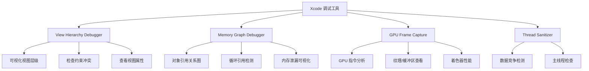

### 9.3 运行时监控方案

#### 9.3.1 FPS 监控

```swift
// CADisplayLink 方案核心逻辑
let link = CADisplayLink(target: self, selector: #selector(tick))
link.add(to: .main, forMode: .common)
// 在 tick 中计算相邻两帧时间差，累计后取平均 FPS
```

#### 9.3.2 卡顿检测

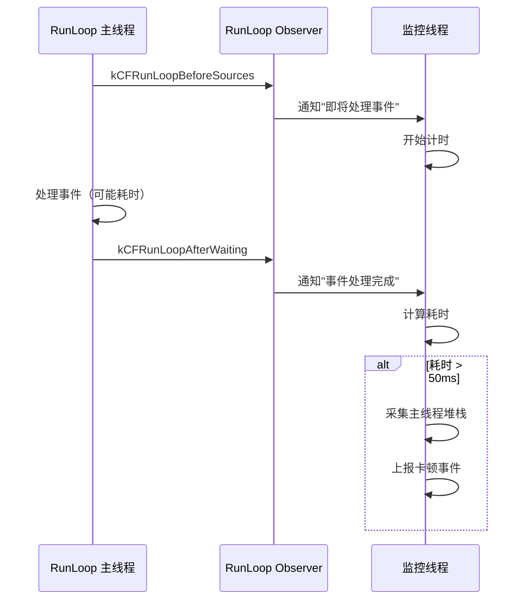

#### 9.3.3 内存水位监控

| 监控项 | 采集 API | 告警阈值 | 响应策略 |
|-------|---------|---------|---------|
| **物理内存** | `task_info` (phys_footprint) | > 500MB | 清理缓存、上报 |
| **虚拟内存** | `task_info` (virtual_size) | > 2GB | 分析内存映射 |
| **内存警告** | `didReceiveMemoryWarning` | 系统触发 | 清空图片/数据缓存 |
| **Jetsam 限额** | 设备型号查表 | 接近限额 80% | 主动释放、降级策略 |

### 9.4 线上性能监控指标

| 采集指标 | 采集方式 | 上报频率 | 告警阈值 | 告警策略 |
|---------|---------|---------|---------|---------|
| **FPS 均值** | CADisplayLink | 每 5s | < 55fps | P1 日报 |
| **卡顿率** | RunLoop Observer | 实时 | > 3% | P0 即时 |
| **OOM 崩溃率** | 下次启动检测 | 启动时 | > 0.5% | P0 即时 |
| **内存峰值** | task_info | 每 10s | > 800MB | P1 日报 |
| **首屏耗时** | os_signpost | 每次启动 | > 500ms | P1 周报 |
| **列表帧率** | MetricKit | 系统采集 | < 55fps | P2 周报 |
| **Hitch Rate** | MetricKit（iOS 15+） | 系统采集 | > 5ms/s | P1 日报 |

### 9.5 性能优化决策流程

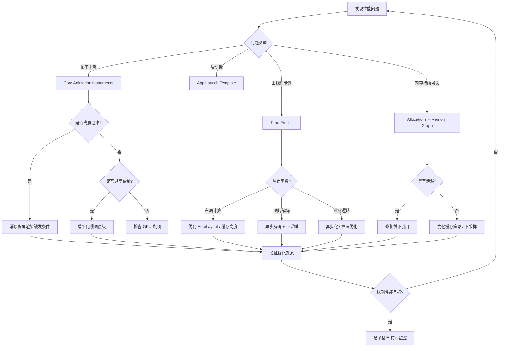

---

## 参考与交叉引用

| 主题 | 文档路径 | 互补关系 |
|------|---------|---------|
| Core Animation 渲染管线详解 | [渲染性能与能耗优化](../06_性能优化框架/渲染性能与能耗优化_详细解析.md) | 本文聚焦 UIKit 层，该文覆盖底层 CA 管线 |
| 启动优化与 dyld 加载 | [启动优化与包体积治理](../06_性能优化框架/启动优化与包体积治理_详细解析.md) | 本文不涉及启动阶段优化 |
| UIKit 架构与渲染基础 | [UIKit架构与事件机制](./UIKit架构与事件机制_详细解析.md) | 本文基于该文的渲染管线知识展开 |
