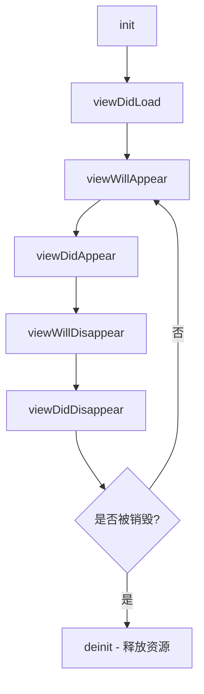
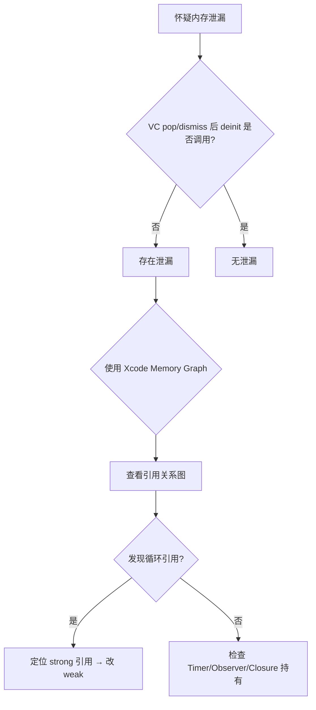
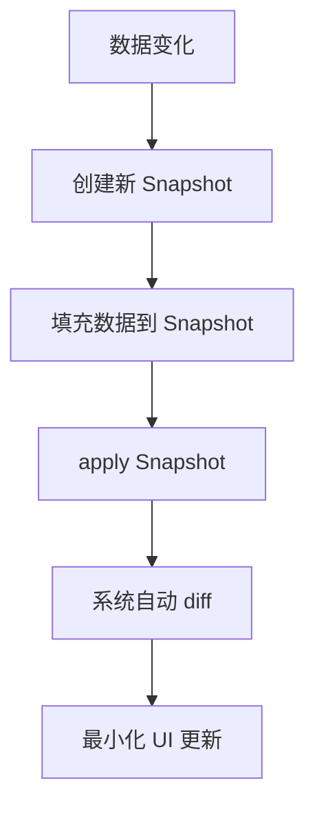
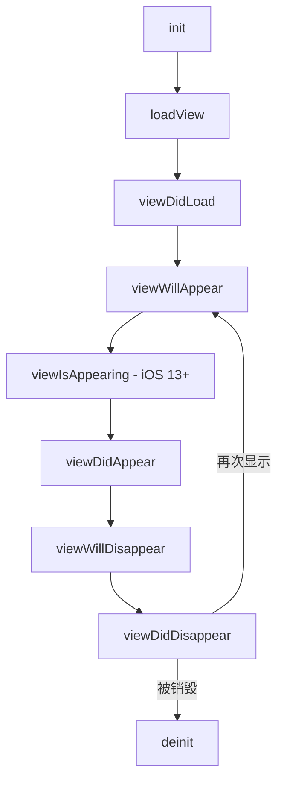
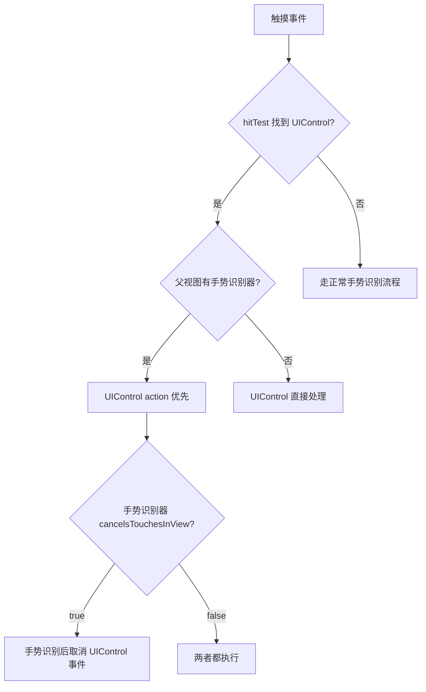
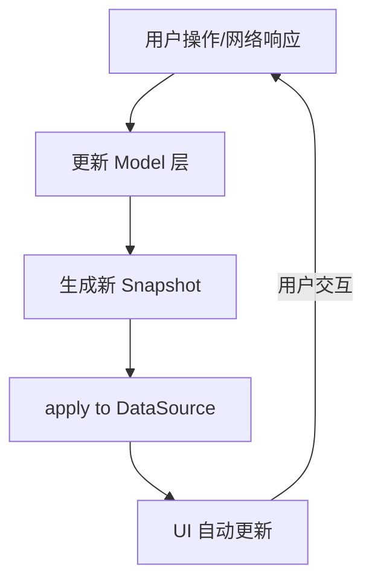

# UIKit 最佳实践与避坑指南

> 版本要求: iOS 13+ | Swift 5.5+ | Xcode 14+
> 关联文档: [UIKit架构与事件机制](./UIKit架构与事件机制_详细解析.md) | [UIKit高级组件与自定义](./UIKit高级组件与自定义_详细解析.md) | [渲染性能与能耗优化](../06_性能优化框架/渲染性能与能耗优化_详细解析.md)

---

## 核心结论 TL;DR

### Top 10 UIKit 开发原则

| # | 原则 | 说明 |
|---|------|------|
| 1 | **UI 操作必须在主线程** | UIKit 非线程安全，违反会导致不确定崩溃和渲染异常 |
| 2 | **delegate 必须用 weak** | 避免循环引用导致内存泄漏，delegate 模式是 UIKit 最常见的泄漏源 |
| 3 | **closure 中谨慎捕获 self** | UIKit 回调、Timer、动画 completion 中使用 `[weak self]` |
| 4 | **translatesAutoresizingMaskIntoConstraints = false** | 代码创建 AutoLayout 约束前的必须步骤，否则约束冲突 |
| 5 | **Cell 复用时重置状态** | 在 `prepareForReuse()` 中清除残留状态，防止视觉错乱 |
| 6 | **viewDidLoad 不要依赖 frame** | 此时布局未完成，frame 为零值或不准确 |
| 7 | **避免在 cellForRow 中做耗时操作** | 图片解码、网络请求等应异步处理或预加载 |
| 8 | **约束更新用 batch 方式** | 避免频繁 add/remove 约束，优先使用 isActive 或 priority 切换 |
| 9 | **使用 Diffable DataSource** | 替代手动 reloadData/insertRows，自动差分更新消除崩溃风险 |
| 10 | **生命周期方法职责单一** | 每个生命周期方法只做该时机应做的事 |

### Top 5 常见陷阱

| 陷阱 | 后果 | 快速修复 |
|------|------|----------|
| 子线程更新 UI | 不确定崩溃、界面不刷新 | `DispatchQueue.main.async {}` 或 `@MainActor` |
| delegate 未 weak | VC 无法释放、内存持续增长 | `weak var delegate: XXXDelegate?` |
| AutoLayout 忘记关闭 autoresizing | 约束冲突、布局异常 | 设置 `translatesAutoresizingMaskIntoConstraints = false` |
| Cell 状态残留 | 滚动时显示错乱 | 重写 `prepareForReuse()` 重置所有可变状态 |
| Timer/CADisplayLink 强引用 | VC 永远不释放 | 使用 `[weak self]` block-based API 或中间代理 |

---

## 二、内存管理最佳实践

### 2.1 delegate 的正确管理

**核心结论：UIKit 中几乎所有 delegate 属性都应声明为 weak，忘记 weak 是 iOS 开发中最常见的内存泄漏原因。**

#### weak delegate 原则

UIKit 中 delegate 模式形成了典型的双向引用：对象 A 持有对象 B（强引用），B 是 A 的 delegate。若 delegate 也用强引用，则形成循环引用。

| 场景 | 正确声明 | 后果（若未 weak） |
|------|----------|-------------------|
| UITableViewDelegate | `weak var delegate` | VC 与 TableView 互持，VC 无法释放 |
| 自定义 delegate | `weak var delegate` | 两个对象互持，内存泄漏 |
| UITextFieldDelegate | `weak var delegate` | 持有 TextField 的 VC 泄漏 |

```swift
// ❌ 错误：delegate 未声明 weak
protocol DataManagerDelegate: AnyObject {
    func didUpdateData()
}
class DataManager {
    var delegate: DataManagerDelegate?  // 强引用！
}
class MyVC: UIViewController, DataManagerDelegate {
    let manager = DataManager()
    override func viewDidLoad() {
        super.viewDidLoad()
        manager.delegate = self  // 循环引用：MyVC → manager → delegate → MyVC
    }
}
```

```swift
// ✅ 正确：weak delegate
class DataManager {
    weak var delegate: DataManagerDelegate?  // weak 打破循环
}
```

### 2.2 循环引用常见场景

**核心结论：UIKit 回调中的循环引用有三大高发区——closure 捕获 self、NotificationCenter 闭包观察者、Timer/CADisplayLink 的 target。**

#### 场景一：closure 捕获 self

```swift
// ❌ 错误：动画 completion 中强捕获 self（若动画被持有）
class AnimVC: UIViewController {
    var completionBlock: (() -> Void)?
    func startAnimation() {
        completionBlock = {
            self.view.alpha = 1.0  // self 被 closure 强捕获
        }
    }
}
```

```swift
// ✅ 正确：使用 [weak self]
completionBlock = { [weak self] in
    self?.view.alpha = 1.0
}
```

> **注意**：`UIView.animate` 的 completion 不会造成循环引用（系统不会被 self 持有），但自定义存储的 closure 必须用 `[weak self]`。

#### 场景二：Timer 强引用 target

```swift
// ❌ 错误：Timer 强持有 self，VC 无法释放
class TimerVC: UIViewController {
    var timer: Timer?
    override func viewDidLoad() {
        super.viewDidLoad()
        timer = Timer.scheduledTimer(timeInterval: 1, target: self,
                                     selector: #selector(tick), userInfo: nil, repeats: true)
    }
    @objc func tick() { /* ... */ }
}
```

```swift
// ✅ 正确：使用 block-based API + [weak self]
timer = Timer.scheduledTimer(withTimeInterval: 1, repeats: true) { [weak self] _ in
    self?.tick()
}
```

#### 场景三：NotificationCenter 闭包观察者

```swift
// ❌ 错误：闭包观察者强持有 self 且未移除
NotificationCenter.default.addObserver(
    forName: .someNotification, object: nil, queue: .main
) { _ in
    self.handleNotification()  // 强捕获 self
}
```

```swift
// ✅ 正确：[weak self] + 存储 token 并移除
var token: NSObjectProtocol?
token = NotificationCenter.default.addObserver(
    forName: .someNotification, object: nil, queue: .main
) { [weak self] _ in
    self?.handleNotification()
}
// deinit 中: NotificationCenter.default.removeObserver(token!)
```

### 2.3 weak vs unowned 选择

**核心结论：默认用 weak；只有当你能 100% 确保引用对象生命周期 >= closure 生命周期时，才用 unowned。**

| 特性 | `weak` | `unowned` |
|------|--------|-----------|
| 引用类型 | Optional（自动置 nil） | 非 Optional |
| 对象释放后访问 | 安全返回 nil | **崩溃（野指针）** |
| 性能开销 | 略高（需 Optional 解包） | 略低 |
| 适用场景 | delegate、异步回调、Timer | 父子关系确定（如 `[unowned self] in self.view`） |
| **推荐度** | **首选** | 仅在性能敏感且生命周期确定时 |

### 2.4 UIViewController 生命周期中的内存管理

**核心结论：VC 是内存管理的核心单元，viewDidLoad 创建的强引用资源应在 deinit 中显式清理，导航栈中的 VC pop 后应立即释放。**



| 时机 | 内存管理要点 |
|------|-------------|
| `viewDidLoad` | 创建一次性资源（子视图、约束、Observer），但注意引用关系 |
| `didReceiveMemoryWarning` | 释放可重建的缓存数据（图片缓存、临时数据） |
| `viewDidDisappear` | 停止持续性任务（Timer、动画、音视频播放） |
| `deinit` | 移除 Observer、invalidate Timer、断开外部连接 |
| **导航栈 pop** | VC 应被释放——若 deinit 未调用，说明存在泄漏 |

### 2.5 CADisplayLink 的正确使用

**核心结论：CADisplayLink 与 Timer 一样强持有 target，但因为它绑定 RunLoop 运行，泄漏后会导致 VC 永远不释放且持续消耗 CPU。**

```swift
// ❌ 错误：CADisplayLink 强持有 self
class AnimationVC: UIViewController {
    var displayLink: CADisplayLink?
    override func viewDidLoad() {
        super.viewDidLoad()
        displayLink = CADisplayLink(target: self, selector: #selector(update))
        displayLink?.add(to: .main, forMode: .common)
    }
    @objc func update() { /* 刷新动画 */ }
    // VC pop 后 displayLink 仍持有 self → 永不释放
}
```

```swift
// ✅ 正确：使用 proxy 或 iOS 15+ block API
// 方案1：iOS 15+ block-based
if #available(iOS 15.0, *) {
    displayLink = CADisplayLink(target: self, selector: #selector(update))
    // 或使用中间代理对象打破强引用
}
// 方案2：deinit / viewWillDisappear 中手动 invalidate
override func viewWillDisappear(_ animated: Bool) {
    super.viewWillDisappear(animated)
    displayLink?.invalidate()
    displayLink = nil
}
```

### 2.6 检测工具

| 工具 | 用途 | 使用要点 |
|------|------|----------|
| **Instruments - Leaks** | 运行时检测已泄漏的对象 | 关注 Leak Cycles 视图，查看引用环 |
| **Xcode Memory Graph** | 可视化对象引用关系 | Debug Navigator → Memory，查找紫色感叹号标记 |
| **Debug Memory Graph** | 查看某对象的所有强引用来源 | 右键对象 → Show Memory Inspector |
| **deinit 打印** | 最简单直接的泄漏检测 | 在 VC 的 deinit 中 `print("deinit: \(Self.self)")` |
| **MLeaksFinder（第三方）** | 自动检测 VC/View 泄漏 | pop/dismiss 后 2 秒检测对象是否还存活 |

#### 泄漏检测决策流程



---

## 三、主线程与 UI 更新

### 3.1 为什么 UI 必须在主线程更新

**核心结论：UIKit 的底层实现（CALayer 树、渲染提交、事件处理）全部非线程安全，子线程操作 UI 会导致数据竞争、渲染撕裂甚至崩溃。**

底层原因：
1. **CALayer 属性非原子性**：frame、bounds、transform 等属性的读写不加锁
2. **渲染提交绑定 RunLoop**：CATransaction 在主线程 RunLoop 周期末尾提交
3. **事件分发假设单线程**：Hit-Testing、手势识别依赖主线程顺序执行
4. **UIApplication 事件循环**：所有 UI 事件在主线程的 RunLoop 中派发

### 3.2 常见违规场景

```swift
// ❌ 错误：网络回调直接更新 UI（回调在后台线程）
URLSession.shared.dataTask(with: url) { data, _, _ in
    self.imageView.image = UIImage(data: data!)  // 后台线程！
    self.label.text = "Done"
}.resume()
```

```swift
// ✅ 正确：回到主线程更新
URLSession.shared.dataTask(with: url) { data, _, _ in
    DispatchQueue.main.async {
        self.imageView.image = UIImage(data: data!)
        self.label.text = "Done"
    }
}.resume()
```

#### async/await 中的陷阱

```swift
// ❌ 错误：async 函数中 await 后可能不在主线程
func fetchData() async {
    let data = await networkService.fetch()
    self.label.text = "\(data)"  // await 后可能不在主线程！
}
```

```swift
// ✅ 正确：使用 @MainActor
@MainActor
func fetchData() async {
    let data = await networkService.fetch()
    self.label.text = "\(data)"  // @MainActor 保证主线程
}
```

### 3.3 DispatchQueue.main.async vs @MainActor

| 特性 | `DispatchQueue.main.async` | `@MainActor` |
|------|---------------------------|--------------|
| 可用版本 | iOS 4+ | iOS 13+ (Swift 5.5) |
| 作用范围 | 代码块级别 | 函数/类级别 |
| 编译期检查 | ❌ 无 | ✅ 编译器强制检查 |
| 嵌套开销 | 已在主线程仍会排队 | 已在主线程直接执行 |
| 与 async/await | 需手动切换 | 自然集成 |
| **推荐** | 传统代码、简单回调 | 新代码、async/await 场景 |

### 3.4 检测方法

| 工具 | 配置方式 | 说明 |
|------|----------|------|
| **Main Thread Checker** | Xcode → Scheme → Diagnostics → 勾选 | 运行时自动检测子线程 UI 操作，零代码侵入 |
| **Thread Sanitizer (TSan)** | Xcode → Scheme → Diagnostics → 勾选 | 检测数据竞争，会降低运行速度 |
| **dispatchPrecondition** | 代码中添加断言 | `dispatchPrecondition(condition: .onQueue(.main))` |

#### 主线程检查最佳实践

```swift
// ✅ 封装主线程安全执行函数
func executeOnMain(_ block: @escaping () -> Void) {
    if Thread.isMainThread {
        block()
    } else {
        DispatchQueue.main.async { block() }
    }
}

// ✅ 在关键 UI 方法中添加断言（Debug 阶段）
func updateUI(with data: Model) {
    dispatchPrecondition(condition: .onQueue(.main))
    titleLabel.text = data.title
    subtitleLabel.text = data.subtitle
}
```

---

## 四、AutoLayout 约束管理

### 4.1 约束冲突排查方法

**核心结论：AutoLayout 约束冲突是最常见的布局问题，控制台输出的 `Unable to simultaneously satisfy constraints` 包含了定位问题的全部信息。**

排查步骤：
1. **读控制台日志**：找到 `Will attempt to recover by breaking constraint`，被破坏的约束是冲突点
2. **添加符号断点**：`UIViewAlertForUnsatisfiableConstraints`，断点触发时查看约束
3. **给约束命名**：设置 `constraint.identifier = "myConstraint"` 方便定位
4. **使用 Reveal / Xcode View Debugger**：可视化查看约束关系

### 4.2 常见约束冲突场景

#### 忘记关闭 translatesAutoresizingMaskIntoConstraints

```swift
// ❌ 错误：忘记设置 false，系统自动生成的约束与手动约束冲突
let label = UILabel()
view.addSubview(label)
NSLayoutConstraint.activate([
    label.centerXAnchor.constraint(equalTo: view.centerXAnchor),
    label.centerYAnchor.constraint(equalTo: view.centerYAnchor)
])
// 控制台: Unable to simultaneously satisfy constraints...
```

```swift
// ✅ 正确：先关闭 autoresizing
let label = UILabel()
label.translatesAutoresizingMaskIntoConstraints = false
view.addSubview(label)
NSLayoutConstraint.activate([
    label.centerXAnchor.constraint(equalTo: view.centerXAnchor),
    label.centerYAnchor.constraint(equalTo: view.centerYAnchor)
])
```

#### 动态高度 Cell 约束不完整

```swift
// ❌ 错误：约束链不完整，Cell 无法计算高度
// 只约束了 top 和 leading，缺少 bottom 约束
titleLabel.topAnchor.constraint(equalTo: contentView.topAnchor, constant: 8),
titleLabel.leadingAnchor.constraint(equalTo: contentView.leadingAnchor, constant: 16),
titleLabel.trailingAnchor.constraint(equalTo: contentView.trailingAnchor, constant: -16)
// 缺少 bottom → contentView 高度不确定
```

```swift
// ✅ 正确：从 top 到 bottom 形成完整约束链
titleLabel.topAnchor.constraint(equalTo: contentView.topAnchor, constant: 8),
titleLabel.leadingAnchor.constraint(equalTo: contentView.leadingAnchor, constant: 16),
titleLabel.trailingAnchor.constraint(equalTo: contentView.trailingAnchor, constant: -16),
titleLabel.bottomAnchor.constraint(equalTo: contentView.bottomAnchor, constant: -8)
```

### 4.3 约束更新时机

**核心结论：理解 updateConstraints / layoutSubviews / setNeedsLayout / layoutIfNeeded 的调用时机是正确使用 AutoLayout 的关键。**

| 方法 | 触发方式 | 执行时机 | 适用场景 |
|------|----------|----------|----------|
| `setNeedsUpdateConstraints()` | 标记需要更新约束 | 下一个 layout pass | 约束需要变化时 |
| `updateConstraints()` | 系统调用 | layout pass 开始 | 批量更新约束 |
| `setNeedsLayout()` | 标记需要重新布局 | 下一个 layout pass | 约束变化后触发布局 |
| `layoutIfNeeded()` | 立即执行 | 当前调用栈 | **动画中使用**，立即应用约束变化 |
| `layoutSubviews()` | 系统调用 | layout pass 中 | 手动调整子视图 frame |

```swift
// ✅ 约束动画的正确写法
heightConstraint.constant = 200
UIView.animate(withDuration: 0.3) {
    self.view.layoutIfNeeded()  // 在动画 block 中调用
}
```

### 4.4 约束性能最佳实践

| 实践 | 说明 |
|------|------|
| 避免频繁 remove/add 约束 | 改用 `isActive` 切换或修改 `constant` |
| 使用 priority 动态调整 | 两组约束设不同 priority，切换 priority 而非增删 |
| 减少约束总数 | 使用 `UIStackView` 替代手动约束可减少 50%+ 约束 |
| 避免不必要的 `layoutIfNeeded` | 只在动画或需要立即获取 frame 时调用 |

---

## 五、UITableView / UICollectionView 最佳实践

### 5.1 Cell 复用机制正确使用

**核心结论：Cell 复用是 UIKit 最精妙的性能优化，但也是状态残留 Bug 的最大来源。必须在 `prepareForReuse()` 中重置所有可变状态。**

```swift
// ❌ 错误：未重置状态，复用时图片残留
class ProductCell: UITableViewCell {
    @IBOutlet var productImage: UIImageView!
    @IBOutlet var titleLabel: UILabel!

    func configure(with product: Product) {
        titleLabel.text = product.name
        if let url = product.imageURL {
            loadImage(url)  // 异步加载
        }
        // 没有处理 imageURL 为 nil 的情况！复用时可能显示旧图
    }
}
```

```swift
// ✅ 正确：prepareForReuse + 清除状态
class ProductCell: UITableViewCell {
    override func prepareForReuse() {
        super.prepareForReuse()
        productImage.image = nil       // 清除旧图片
        titleLabel.text = nil          // 清除旧文本
        imageTask?.cancel()            // 取消进行中的加载
    }
    func configure(with product: Product) {
        titleLabel.text = product.name
        productImage.image = product.imageURL != nil ? nil : UIImage(named: "placeholder")
        if let url = product.imageURL { loadImage(url) }
    }
}
```

### 5.2 Diffable DataSource 最佳实践

**核心结论：Diffable DataSource 通过 Snapshot 机制自动差分更新，彻底消除了 `numberOfRows` 与实际数据不一致导致的 `NSInternalInconsistencyException` 崩溃。**



| 方面 | 传统 DataSource | Diffable DataSource |
|------|----------------|---------------------|
| 更新方式 | `reloadData()` / `performBatchUpdates` | `apply(snapshot)` |
| 崩溃风险 | 高（indexPath 不一致） | **几乎为零** |
| 动画 | 需手动管理 | 自动带动画 |
| 线程安全 | 手动同步 | `apply` 内部处理 |
| **推荐度** | 维护旧代码 | **新代码首选** |

```swift
// ✅ 正确的 Diffable DataSource 使用
var snapshot = NSDiffableDataSourceSnapshot<Section, Item>()
snapshot.appendSections([.main])
snapshot.appendItems(items, toSection: .main)
dataSource.apply(snapshot, animatingDifferences: true)

// ⚠️ 注意：Item 必须实现 Hashable，且 hash 值必须稳定唯一
```

### 5.3 动态高度计算优化

**核心结论：Self-Sizing Cell 只需三步——设置 `estimatedRowHeight`、Cell 内部约束完整、`rowHeight = UITableView.automaticDimension`。**

| 步骤 | 代码 | 说明 |
|------|------|------|
| 设置预估高度 | `tableView.estimatedRowHeight = 80` | 必须设置，影响滚动条准确性 |
| 自动高度 | `tableView.rowHeight = .automaticDimension` | 让系统根据约束计算 |
| Cell 约束完整 | top → bottom 完整链 | Cell contentView 内约束形成完整高度链 |

### 5.4 预加载机制

```swift
// ✅ UITableViewDataSourcePrefetching 正确实现
extension MyVC: UITableViewDataSourcePrefetching {
    func tableView(_ tableView: UITableView, prefetchRowsAt indexPaths: [IndexPath]) {
        for indexPath in indexPaths {
            let item = items[indexPath.row]
            imageLoader.prefetch(url: item.imageURL)  // 预加载图片
        }
    }
    func tableView(_ tableView: UITableView, cancelPrefetchingForRowsAt indexPaths: [IndexPath]) {
        for indexPath in indexPaths {
            imageLoader.cancelPrefetch(url: items[indexPath.row].imageURL)
        }
    }
}
```

### 5.5 常见反模式

| 反模式 | 问题 | 正确做法 |
|--------|------|----------|
| `cellForRow` 中解码大图 | 滚动卡顿 | 异步解码 + 缓存 |
| 频繁调用 `reloadData()` | 全量刷新、丢失动画 | 使用 Diffable DataSource |
| Cell 中直接网络请求 | Cell 复用时请求混乱 | VC/VM 层管理请求，Cell 只展示 |
| `tableView.reloadData()` in `cellForRow` | 死循环/崩溃 | 绝对禁止 |
| 未设置 `estimatedRowHeight` | Self-Sizing 性能差 | 设置合理的预估值 |

---

## 六、UIViewController 生命周期管理

### 6.1 生命周期方法调用时机

**核心结论：UIViewController 生命周期方法严格有序，每个方法有明确的职责边界，在错误的时机执行操作是 UIKit 最常见的 Bug 来源。**

| 方法 | 调用时机 | 调用次数 | 适合做的事 | 不该做的事 |
|------|----------|----------|-----------|-----------|
| `init` | 对象创建 | 1 次 | 初始化属性 | 访问 view |
| `viewDidLoad` | view 加载到内存 | 1 次 | 创建子视图、约束、Observer | 依赖 frame 值 |
| `viewWillAppear` | view 即将显示 | **多次** | 刷新数据、恢复状态 | 一次性初始化 |
| `viewIsAppearing` (iOS 13+) | view 布局已完成 | **多次** | 依赖 frame 的操作 | 耗时操作 |
| `viewDidAppear` | view 已显示 | **多次** | 启动动画、开始定位 | 布局调整 |
| `viewWillDisappear` | view 即将消失 | **多次** | 保存状态、停止动画 | — |
| `viewDidDisappear` | view 已消失 | **多次** | 停止耗资源任务 | — |
| `deinit` | 对象销毁 | 1 次 | 移除 Observer、invalidate Timer | — |



### 6.2 常见误用

#### viewDidLoad 中获取 frame

```swift
// ❌ 错误：viewDidLoad 中 frame 未确定
override func viewDidLoad() {
    super.viewDidLoad()
    let width = view.frame.width  // 可能不准确！
    circleView.layer.cornerRadius = circleView.frame.height / 2  // 0 或不对
}
```

```swift
// ✅ 正确：在 viewDidLayoutSubviews 或 viewIsAppearing 中
override func viewDidLayoutSubviews() {
    super.viewDidLayoutSubviews()
    circleView.layer.cornerRadius = circleView.frame.height / 2
}
```

#### viewWillAppear 做一次性初始化

```swift
// ❌ 错误：viewWillAppear 会多次调用，网络请求重复执行
override func viewWillAppear(_ animated: Bool) {
    super.viewWillAppear(animated)
    fetchUserProfile()  // 每次出现都请求，浪费资源
}
```

```swift
// ✅ 正确：一次性操作放 viewDidLoad，viewWillAppear 只做刷新
override func viewDidLoad() {
    super.viewDidLoad()
    fetchUserProfile()  // 只执行一次
}
override func viewWillAppear(_ animated: Bool) {
    super.viewWillAppear(animated)
    refreshUnreadCount()  // 轻量刷新
}
```

#### 父子 VC 忘记调用 didMove(toParent:)

```swift
// ❌ 错误：子 VC 生命周期方法不会被正确调用
addChild(childVC)
view.addSubview(childVC.view)
childVC.view.frame = containerView.bounds
// 忘记了 didMove(toParent:)!
```

```swift
// ✅ 正确：完整的添加流程
addChild(childVC)
view.addSubview(childVC.view)
childVC.view.frame = containerView.bounds
childVC.didMove(toParent: self)   // 必须调用

// 移除时：
childVC.willMove(toParent: nil)   // 先调用
childVC.view.removeFromSuperview()
childVC.removeFromParent()
```

### 6.3 Presentation 机制陷阱

**核心结论：iOS 13+ 默认 `modalPresentationStyle` 为 `.pageSheet`（非全屏），导致 presenting VC 的 `viewWillDisappear/viewDidDisappear` 不会被调用。**

| Style | 全屏覆盖 | presenting VC disappear 回调 | 说明 |
|-------|---------|----------------------------|------|
| `.fullScreen` | ✅ | ✅ 调用 | iOS 12 及以前默认 |
| `.pageSheet` | ❌ | ❌ 不调用 | **iOS 13+ 默认** |
| `.overFullScreen` | ✅（透明背景） | ❌ 不调用 | 背景 VC 仍可见 |
| `.overCurrentContext` | 否 | ❌ 不调用 | 当前上下文内 |

```swift
// ⚠️ 如果依赖 disappear 回调保存数据，需显式设置 fullScreen
let vc = DetailViewController()
vc.modalPresentationStyle = .fullScreen  // 明确指定
present(vc, animated: true)
```

### 6.4 容器 VC 自定义注意事项

**核心结论：自定义容器 VC 必须正确转发子 VC 的生命周期方法，否则子 VC 的 `viewWillAppear` 等方法不会被调用。**

关键规则：
1. `addChild()` → `addSubview()` → `didMove(toParent: self)` —— 添加顺序
2. `willMove(toParent: nil)` → `removeFromSuperview()` → `removeFromParent()` —— 移除顺序
3. 如果重写 `shouldAutomaticallyForwardAppearanceMethods` 返回 false，必须手动调用 `beginAppearanceTransition` / `endAppearanceTransition`

---

## 七、事件处理与手势识别避坑

### 7.1 手势冲突处理策略

**核心结论：手势冲突是 UIKit 中最常见的交互问题，核心解决思路是通过 `UIGestureRecognizerDelegate` 控制手势识别的优先级和共存关系。**

> 详细的手势识别状态机参见 [UIKit架构与事件机制 - 手势识别](./UIKit架构与事件机制_详细解析.md)

| 冲突场景 | 解决方案 |
|----------|----------|
| ScrollView 内 Tap 手势 | `tapGesture.cancelsTouchesInView = false` |
| 嵌套 ScrollView 滚动冲突 | 实现 `gestureRecognizerShouldBegin(_:)` 判断方向 |
| 长按 + Tap 同时存在 | `tap.require(toFail: longPress)` |
| Pan 与 Swipe 冲突 | `swipe.require(toFail: pan)` 或方向判断 |

```swift
// ✅ 解决 ScrollView 内 Tap 手势冲突
class MyVC: UIViewController, UIGestureRecognizerDelegate {
    func setupGestures() {
        let tap = UITapGestureRecognizer(target: self, action: #selector(handleTap))
        tap.delegate = self
        scrollView.addGestureRecognizer(tap)
    }
    func gestureRecognizer(_ g: UIGestureRecognizer,
        shouldRecognizeSimultaneouslyWith other: UIGestureRecognizer) -> Bool {
        return true  // 允许 Tap 和 ScrollView Pan 共存
    }
}
```

### 7.2 hitTest 自定义的正确方式

**核心结论：自定义 `hitTest(_:with:)` 可以实现扩大点击区域、透传触摸等高级交互，但必须遵循 UIKit 的事件传递规则。**

```swift
// ✅ 扩大按钮点击区域（向外扩展 20pt）
class LargeHitButton: UIButton {
    override func point(inside point: CGPoint, with event: UIEvent?) -> Bool {
        let expandedBounds = bounds.insetBy(dx: -20, dy: -20)
        return expandedBounds.contains(point)
    }
}
```

```swift
// ✅ 透传触摸到下层视图（悬浮面板只拦截内部控件的触摸）
class PassthroughView: UIView {
    override func hitTest(_ point: CGPoint, with event: UIEvent?) -> UIView? {
        let hitView = super.hitTest(point, with: event)
        return hitView == self ? nil : hitView  // self 不响应，子视图响应
    }
}
```

### 7.3 UIControl 事件与手势的优先级

**核心结论：UIControl（如 UIButton）的 action 默认优先于父视图的手势识别器，但 `UITapGestureRecognizer` 添加到同一视图时会抢占 UIControl 事件。**

| 场景 | 行为 |
|------|------|
| Button 在有 Tap 手势的父视图中 | Button action 正常响应（UIControl 优先） |
| Tap 手势添加到 Button 自身 | 手势抢占 action，action 不触发 |
| Tap 手势 `cancelsTouchesInView = false` | 两者都触发 |



### 7.4 嵌套 ScrollView 手势处理

**核心结论：嵌套 ScrollView（如外层垂直滚动、内层水平滚动）是最常见的手势冲突场景，需要通过 delegate 方法判断滚动方向。**

```swift
// ✅ 解决嵌套 ScrollView 方向冲突
func gestureRecognizerShouldBegin(_ gesture: UIGestureRecognizer) -> Bool {
    guard let pan = gesture as? UIPanGestureRecognizer else { return true }
    let velocity = pan.velocity(in: pan.view)
    // 外层只响应垂直滑动
    return abs(velocity.y) > abs(velocity.x)
}
```

---

## 八、数据同步与状态管理

### 8.1 UIKit 中的状态管理挑战

**核心结论：UIKit 是命令式 UI 框架，没有内建状态管理机制，开发者必须手动维护数据与 UI 的一致性，这是 Bug 的主要来源。**

| 维度 | UIKit（命令式） | SwiftUI（声明式） |
|------|----------------|-------------------|
| 更新方式 | 手动调用 `reloadData()`、设置属性 | 自动响应 `@State` 变化 |
| 状态来源 | 无约束，可散落各处 | `@State`/`@ObservedObject` 明确绑定 |
| 一致性保证 | **开发者负责** | 框架保证 |
| 复杂度 | 随功能增长急剧上升 | 相对平稳 |

### 8.2 常用状态管理模式对比

| 模式 | 适用场景 | 优点 | 缺点 |
|------|----------|------|------|
| **Delegate** | 1 对 1 通信 | 协议清晰、类型安全 | 不适合 1 对多 |
| **NotificationCenter** | 1 对多广播 | 解耦彻底 | 类型不安全、调试困难 |
| **KVO** | 属性级观察 | 细粒度 | API 繁琐、容易忘记移除 |
| **Combine** | 响应式数据流 | 声明式、可组合 | 学习曲线、iOS 13+ |
| **Diffable DataSource** | 列表数据 | 自动 diff、线程安全 | 仅限集合视图 |

### 8.3 数据驱动 UI 更新的最佳实践

**核心结论：单一数据源（Single Source of Truth）+ Diffable DataSource 是 UIKit 中最可靠的状态管理模式。**



关键原则：
1. **单一数据源**：一个数据模型驱动一个 UI 组件，禁止多处修改
2. **单向数据流**：Model → Snapshot → UI，UI 事件 → 更新 Model → 触发新的 Snapshot
3. **不可变 Snapshot**：每次生成新的 Snapshot 而非修改旧的

### 8.4 反模式

| 反模式 | 问题 | 解决方案 |
|--------|------|----------|
| 过度使用 NotificationCenter | 数据流难以追踪、调试困难 | Delegate / Combine 替代 |
| 全局可变状态（单例中的 var） | 多处修改引发竞态、状态不一致 | 依赖注入 + 值类型 |
| VC 直接修改其他 VC 的 UI | 耦合严重、违反封装 | Delegate / 回调闭包 |
| 在多处修改同一数组后 reloadData | 数组与 UI 不同步导致崩溃 | Diffable DataSource |
| 异步回调中不检查当前状态 | 页面已消失仍更新 UI | 检查 `isViewLoaded && view.window != nil` |

---

## 九、其他常见陷阱速查表

| # | 陷阱 | 原因 | 解决方案 |
|---|------|------|----------|
| 1 | `UIAlertController` 在 iPad 崩溃 | iPad 上 `.actionSheet` 需要 `popoverPresentationController` | 设置 `sourceView` / `sourceRect` |
| 2 | `UIScrollView` 内容不滚动 | contentSize 未设置或约束不完整 | 确保内部约束完整定义 contentSize |
| 3 | 键盘遮挡输入框 | 未监听键盘通知调整布局 | 监听 `UIResponder.keyboardWillShowNotification` 调整 |
| 4 | `UIStackView` 隐藏子视图后布局异常 | `isHidden = true` 后约束可能冲突 | 使用 `arrangedSubviews` 的 remove/add 代替 |
| 5 | 导航栏返回按钮自定义后手势返回失效 | 自定义 `leftBarButtonItem` 会禁用返回手势 | 设置 `interactivePopGestureRecognizer.delegate` |
| 6 | `UIImage(named:)` 内存不释放 | 系统缓存在内存中不自动释放 | 大图使用 `UIImage(contentsOfFile:)` |
| 7 | `UITextField` 设置 text 不触发 delegate | 代码设置 `text` 不触发 `editingChanged` | 设置后手动调用 `sendActions(for: .editingChanged)` |
| 8 | Dark Mode 下颜色异常 | 使用硬编码颜色值 | 使用 `UIColor.systemBackground` 等语义色或 Asset Catalog |
| 9 | Safe Area 在旧设备上不生效 | `safeAreaLayoutGuide` iOS 11+ | 使用 `@available` 检查或 `topLayoutGuide` 兼容 |
| 10 | `UITableView` 多余分割线 | 空 Cell 也显示分割线 | `tableView.tableFooterView = UIView()` |
| 11 | 旋转后布局错乱 | 约束依赖固定宽高值 | 使用 `Size Class` + 相对约束 |
| 12 | `present` 后背景 VC 变暗 | iOS 13+ `.pageSheet` 默认有 dimming | 使用 `.overFullScreen` 或自定义转场 |
| 13 | `UICollectionView` 在 `viewDidLoad` 中 reload 无效 | 数据源还未设置完成 | 确保 dataSource 先设置，或延迟到 `viewWillAppear` |
| 14 | `layoutSubviews` 中修改约束导致死循环 | 修改约束触发重新布局，再次调用 `layoutSubviews` | 使用标志位防止重入，或在 `updateConstraints` 中处理 |
| 15 | `UIView.animate` 中直接修改 `transform` 和 `frame` | `transform` 非 identity 时 `frame` 不可靠 | 使用 `bounds` + `center` 代替 `frame`，或只用 `transform` |
| 16 | 自定义 Cell 中 `awakeFromNib` 与 `init` 混淆 | Storyboard 用 `awakeFromNib`，代码用 `init` | 按创建方式选择正确的初始化方法 |
| 17 | `WKWebView` 在低内存时页面白屏 | 系统回收 Web Content 进程 | 监听 `webViewWebContentProcessDidTerminate` 重新 reload |

---

## 十、调试技巧与工具链

### 10.1 视图调试核心工具

| 工具 | 用途 | 快捷方式 |
|------|------|----------|
| **Xcode View Debugger** | 3D 查看视图层级、约束 | Debug → View Debugging → Capture View Hierarchy |
| **`recursiveDescription`** | 打印视图层级树 | `po view.value(forKey: "recursiveDescription")` |
| **`_autolayoutTrace`** | 打印 ambiguous 约束 | `po view.value(forKey: "_autolayoutTrace")` |
| **`exerciseAmbiguityInLayout`** | 可视化模糊约束 | Debug 时在 lldb 调用 |
| **Reveal（第三方）** | 实时修改视图属性 | 连接设备或模拟器 |

### 10.2 常用 LLDB 调试命令

```
// 打印视图层级
(lldb) po UIApplication.shared.keyWindow?.rootViewController

// 查找特定类的所有实例
(lldb) expression -l objc -- (void)[NSObject _printAllObjectsOfClass:@"MyViewController"]

// 强制刷新 UI（在断点暂停时修改属性后）
(lldb) expression CATransaction.flush()
```

### 10.3 性能检测清单

| 检测项 | 工具 | 标准 |
|--------|------|------|
| 帧率 | Instruments - Core Animation | 稳定 60fps（Pro Motion 120fps） |
| 离屏渲染 | Core Animation → Color Offscreen-Rendered | 黄色区域应尽量少 |
| 图片混合 | Core Animation → Color Blended Layers | 红色区域应尽量少 |
| 内存峰值 | Instruments - Allocations | 不超过设备可用内存的 50% |
| 主线程阻塞 | Instruments - Time Profiler | 主线程任务 < 16ms |

---

## 参考资源

| 资源 | 链接 |
|------|------|
| Apple - UIKit Documentation | https://developer.apple.com/documentation/uikit |
| Apple - View Controller Programming Guide | https://developer.apple.com/library/archive/featuredarticles/ViewControllerPGforiPhoneOS/ |
| Apple - Auto Layout Guide | https://developer.apple.com/library/archive/documentation/UserExperience/Conceptual/AutolayoutPG/ |
| Apple - Memory Management (ARC) | https://docs.swift.org/swift-book/documentation/the-swift-programming-language/automaticreferencecounting/ |
| WWDC 2019 - Advances in UI Data Sources | https://developer.apple.com/videos/play/wwdc2019/220/ |
| WWDC 2023 - What's new in UIKit | https://developer.apple.com/videos/play/wwdc2023/10055/ |
