# UIKit 架构与事件机制深度解析

> 版本要求: iOS 13+ | Swift 5.5+ | Xcode 14+

---

## 核心结论 TL;DR

| 维度 | 核心结论 |
|------|----------|
| **架构层次** | UIApplication → UIWindowScene → UIWindow → UIViewController → UIView，Scene 是 iOS 13+ 多窗口的核心抽象 |
| **生命周期** | iOS 13+ 使用 UISceneDelegate 替代 UIApplicationDelegate 处理 UI 生命周期，两者共存但职责分离 |
| **事件响应** | Hit-Testing 采用深度优先逆序遍历，pointInside 判定边界，hitTest 递归查找最优响应者 |
| **手势识别** | UIGestureRecognizer 状态机驱动，支持 require(toFail:) 解决冲突，delaysTouchesBegan 控制触摸延迟 |
| **布局系统** | Cassowary 算法求解线性约束，优先级(1000 required ~ 1)控制冲突解决，intrinsicContentSize 提供固有尺寸 |
| **渲染管线** | layoutSubviews → draw(_:) → Core Animation 层树提交 → GPU 渲染，CATransaction 控制提交时机 |
| **RunLoop 关系** | UIKit 依赖 CFRunLoop，CATransaction 在 runloop 周期结束时自动提交，performSelector 实现延迟执行 |

---

## 一、UIKit 整体架构

### 1.1 架构层次模型

**核心结论：UIKit 采用分层架构，iOS 13+ 引入 UIWindowScene 支持多窗口场景，每个 Scene 拥有独立的窗口层级和生命周期。**

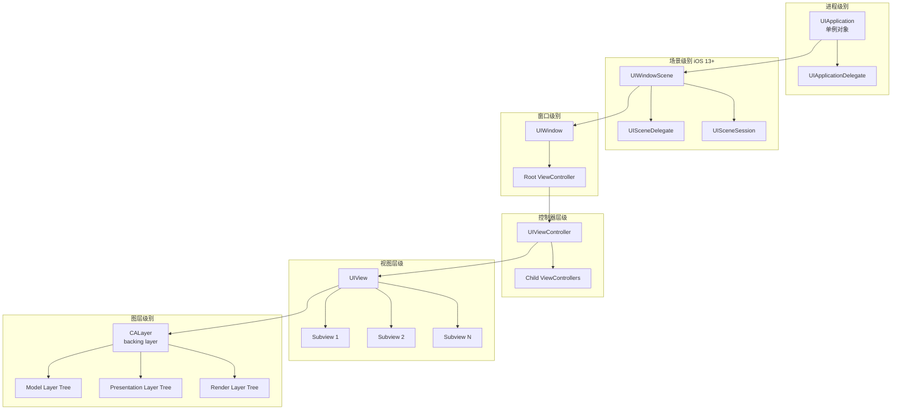

### 1.2 各层级职责详解

| 层级 | 类/协议 | 核心职责 | 关键方法/属性 |
|------|---------|----------|---------------|
| **应用** | UIApplication | 应用级事件分发、状态管理、URL 处理 | `shared`, `open(_:)`, `registerForRemoteNotifications()` |
| **场景** | UIWindowScene | 多窗口场景管理、尺寸/方向变化 | `sizeRestrictions`, `interfaceOrientation` |
| **窗口** | UIWindow | 视图层级容器、事件传递根节点 | `rootViewController`, `makeKeyAndVisible()` |
| **控制器** | UIViewController | 视图生命周期、容器管理、转场协调 | `viewDidLoad()`, `viewWillAppear()`, `addChild()` |
| **视图** | UIView | 渲染内容、事件响应、布局管理 | `layoutSubviews()`, `draw(_:)`, `hitTest(_:with:)` |
| **图层** | CALayer | 实际渲染位图、动画、变换 | `contents`, `transform`, `add(_:forKey:)` |

### 1.3 Swift/ObjC 获取层级示例

```swift
// Swift: 获取当前关键窗口和场景
func getCurrentHierarchy() {
    guard let windowScene = UIApplication.shared.connectedScenes.first as? UIWindowScene,
          let keyWindow = windowScene.windows.first(where: { $0.isKeyWindow }),
          let rootVC = keyWindow.rootViewController else {
        return
    }
    
    print("Scene: \(windowScene.session.role)")
    print("Window: \(keyWindow)")
    print("Root VC: \(type(of: rootVC))")
}
```

```objc
// Objective-C: 遍历视图层级
- (void)printViewHierarchy:(UIView *)view depth:(NSInteger)depth {
    NSString *indent = [@"" stringByPaddingToLength:depth * 2 withString:@" " startingAtIndex:0];
    NSLog(@"%@%@: frame=%@, bounds=%@", 
          indent, 
          NSStringFromClass([view class]),
          NSStringFromCGRect(view.frame),
          NSStringFromCGRect(view.bounds));
    
    for (UIView *subview in view.subviews) {
        [self printViewHierarchy:subview depth:depth + 1];
    }
}

// 使用
[self printViewHierarchy:self.window depth:0];
```

---

## 二、App 生命周期

### 2.1 生命周期演进：UIApplicationDelegate vs UISceneDelegate

**核心结论：iOS 13+ 引入 UISceneDelegate 分离 UI 生命周期，UIApplicationDelegate 保留应用级事件，两者通过 UIWindowScene 协作。**

#### 架构对比

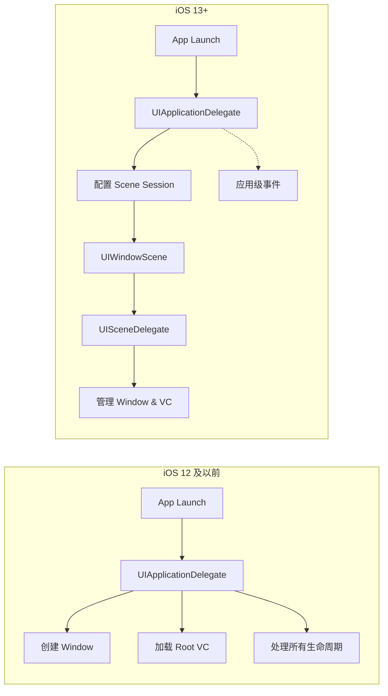

#### 职责分离矩阵

| 事件类型 | UIApplicationDelegate (iOS 13+) | UISceneDelegate |
|----------|--------------------------------|-----------------|
| **应用启动** | `didFinishLaunchingWithOptions` | - |
| **场景创建** | `configurationForConnecting` | `willConnectTo` |
| **进入前台** | - | `sceneWillEnterForeground` |
| **激活状态** | - | `sceneDidBecomeActive` |
| **失活状态** | - | `sceneWillResignActive` |
| **进入后台** | - | `sceneDidEnterBackground` |
| **场景销毁** | - | `sceneDidDisconnect` |
| **推送注册** | `didRegisterForRemoteNotifications` | - |
| **内存警告** | `didReceiveMemoryWarning` | - |
| **打开 URL** | `openURL` | `scene(_:openURLContexts:)` |

### 2.2 状态转换图

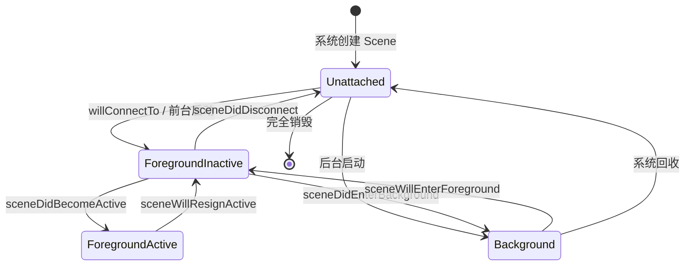

### 2.3 生命周期方法实现示例

```swift
// Swift: UISceneDelegate 完整实现
import UIKit

class SceneDelegate: UIResponder, UIWindowSceneDelegate {
    var window: UIWindow?
    
    // MARK: - 场景连接
    func scene(_ scene: UIScene, willConnectTo session: UISceneSession, 
               options connectionOptions: UIScene.ConnectionOptions) {
        guard let windowScene = (scene as? UIWindowScene) else { return }
        
        window = UIWindow(windowScene: windowScene)
        window?.rootViewController = UINavigationController(rootViewController: ViewController())
        window?.makeKeyAndVisible()
        
        // 处理启动时的 URL/Activity
        if let urlContext = connectionOptions.urlContexts.first {
            handleURL(urlContext.url)
        }
    }
    
    // MARK: - 前台/激活状态
    func sceneWillEnterForeground(_ scene: UIScene) {
        // 从后台恢复，准备 UI
        print("即将进入前台")
    }
    
    func sceneDidBecomeActive(_ scene: UIScene) {
        // 开始用户交互，恢复计时器/动画
        print("已激活")
    }
    
    // MARK: - 失活/后台状态
    func sceneWillResignActive(_ scene: UIScene) {
        // 暂停游戏、保存状态
        print("即将失活")
    }
    
    func sceneDidEnterBackground(_ scene: UIScene) {
        // 保存数据、释放资源
        print("已进入后台")
        (UIApplication.shared.delegate as? AppDelegate)?.saveContext()
    }
    
    // MARK: - 场景断开
    func sceneDidDisconnect(_ scene: UIScene) {
        // 清理资源，Scene 可能被系统回收
        print("场景已断开")
    }
}
```

```objc
// Objective-C: UIApplicationDelegate 与 SceneDelegate 协作
// AppDelegate.h
@interface AppDelegate : UIResponder <UIApplicationDelegate>
@property (strong, nonatomic) UIWindow *window;
@end

// AppDelegate.m
@implementation AppDelegate

- (BOOL)application:(UIApplication *)application 
didFinishLaunchingWithOptions:(NSDictionary *)launchOptions {
    // iOS 13+ 不在这里创建 Window，由 SceneDelegate 处理
    if (@available(iOS 13.0, *)) {
        return YES;
    }
    
    // iOS 12 兼容
    self.window = [[UIWindow alloc] initWithFrame:[[UIScreen mainScreen] bounds]];
    self.window.rootViewController = [[UINavigationController alloc] initWithRootViewController:[[ViewController alloc] init]];
    [self.window makeKeyAndVisible];
    return YES;
}

// 配置 Scene Session
- (UISceneConfiguration *)application:(UIApplication *)application 
configurationForConnectingSceneSession:(UISceneSession *)connectingSceneSession 
                              options:(UISceneConnectionOptions *)options  API_AVAILABLE(ios(13.0)){
    UISceneConfiguration *config = [[UISceneConfiguration alloc] initWithName:@"Default" sessionRole:connectingSceneSession.role];
    config.delegateClass = [SceneDelegate class];
    return config;
}

// 应用级内存警告
- (void)applicationDidReceiveMemoryWarning:(UIApplication *)application {
    [[NSURLCache sharedURLCache] removeAllCachedResponses];
}

@end
```

---

## 三、UIResponder 响应链

### 3.1 Hit-Testing 算法详解

**核心结论：Hit-Testing 采用深度优先逆序遍历，从 Window 开始递归调用 hitTest(_:with:)，pointInside 判定触摸点是否在视图边界内，最终返回最上层可响应的视图。**

#### 算法流程图

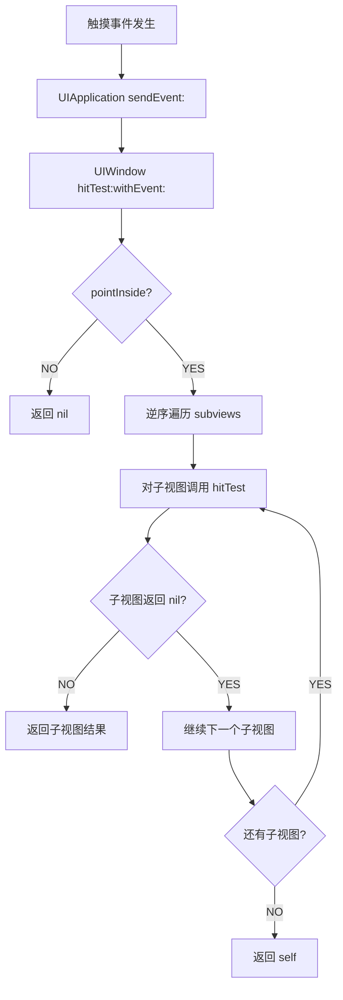

#### Hit-Testing 执行顺序示例

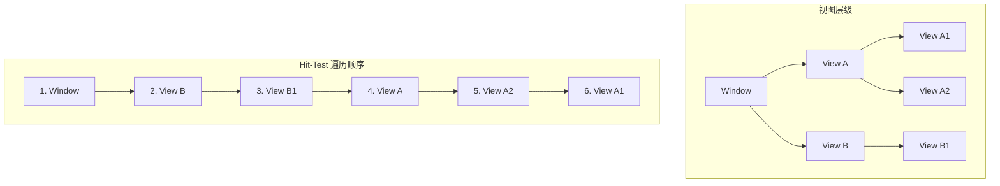

### 3.2 核心方法解析

| 方法 | 作用 | 默认行为 | 重写场景 |
|------|------|----------|----------|
| `hitTest(_:with:)` | 返回响应触摸事件的视图 | 检查 pointInside，递归子视图 | 自定义触摸区域、穿透透明区域 |
| `point(inside:with:)` | 判断点是否在视图内 | 检查点是否在 bounds 内 | 不规则形状、扩大点击区域 |
| `touchesBegan(_:with:)` | 触摸开始 | 传递给 nextResponder | 自定义触摸处理 |
| `touchesMoved(_:with:)` | 触摸移动 | 传递给 nextResponder | 跟踪触摸移动 |
| `touchesEnded(_:with:)` | 触摸结束 | 传递给 nextResponder | 处理点击完成 |
| `touchesCancelled(_:with:)` | 触摸取消 | 传递给 nextResponder | 清理状态 |

### 3.3 代码实现示例

```swift
// Swift: 自定义 Hit-Testing 扩大点击区域
class ExpandableButton: UIButton {
    var expandedHitArea: UIEdgeInsets = UIEdgeInsets(top: -20, left: -20, bottom: -20, right: -20)
    
    override func point(inside point: CGPoint, with event: UIEvent?) -> Bool {
        let expandedBounds = bounds.inset(by: expandedHitArea)
        return expandedBounds.contains(point)
    }
}

// Swift: 穿透透明区域的容器视图
class PassThroughView: UIView {
    override func hitTest(_ point: CGPoint, with event: UIEvent?) -> UIView? {
        let view = super.hitTest(point, with: event)
        // 如果命中的是自己且背景透明，则返回 nil 让事件穿透
        if view == self && self.backgroundColor == .clear {
            return nil
        }
        return view
    }
}

// Swift: 不规则形状视图的 Hit-Testing
class CircleView: UIView {
    override func point(inside point: CGPoint, with event: UIEvent?) -> Bool {
        let radius = min(bounds.width, bounds.height) / 2
        let center = CGPoint(x: bounds.midX, y: bounds.midY)
        let distance = hypot(point.x - center.x, point.y - center.y)
        return distance <= radius
    }
}
```

```objc
// Objective-C: 自定义 Hit-Testing
@interface CustomHitTestView : UIView
@property (nonatomic, assign) UIEdgeInsets touchInsets;
@end

@implementation CustomHitTestView

- (BOOL)pointInside:(CGPoint)point withEvent:(UIEvent *)event {
    CGRect hitFrame = UIEdgeInsetsInsetRect(self.bounds, self.touchInsets);
    return CGRectContainsPoint(hitFrame, point);
}

// 重写 hitTest 实现事件拦截
- (UIView *)hitTest:(CGPoint)point withEvent:(UIEvent *)event {
    // 先执行标准 hit-testing
    UIView *view = [super hitTest:point withEvent:event];
    
    // 自定义逻辑：只允许特定子视图响应
    if (view && ![view isKindOfClass:[UIButton class]]) {
        return nil; // 拦截非按钮的触摸
    }
    
    return view;
}

@end
```

### 3.4 响应链传递机制

```mermaid
graph LR
    A[UIView] -->|nextResponder| B[Superview]
    B -->|nextResponder| C[UIViewController]
    C -->|nextResponder| D[ViewController's View]
    D -->|nextResponder| E[Parent ViewController]
    E -->|nextResponder| F[UIWindow]
    F -->|nextResponder| G[UIApplication]
    G -->|nextResponder| H[UIApplicationDelegate]
```

---

## 四、手势识别系统

### 4.1 UIGestureRecognizer 状态机

**核心结论：UIGestureRecognizer 采用状态机驱动，从 Possible 开始，根据触摸事件转换为 Began/Changed/Ended 或 Failed/Cancelled，支持 require(toFail:) 解决手势冲突。**

#### 状态机图

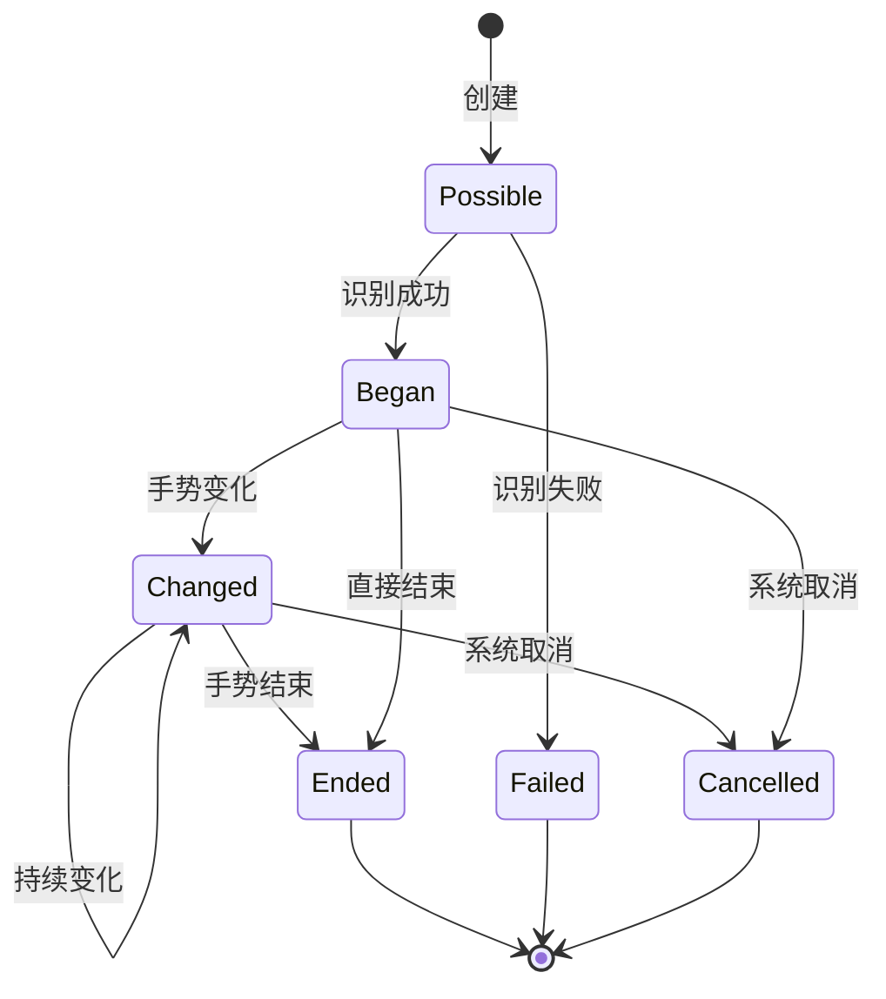

#### 状态说明

| 状态 | 含义 | 触发条件 |
|------|------|----------|
| `Possible` | 初始状态，等待识别 | 手势识别器创建后 |
| `Began` | 识别成功，开始跟踪 | 满足手势识别条件 |
| `Changed` | 手势状态变化 | 手势参数变化（如位移、缩放） |
| `Ended` | 手势正常结束 | 用户释放触摸 |
| `Cancelled` | 手势被取消 | 系统中断（如来电）或其他手势胜出 |
| `Failed` | 识别失败 | 不满足手势条件 |

### 4.2 手势冲突解决机制

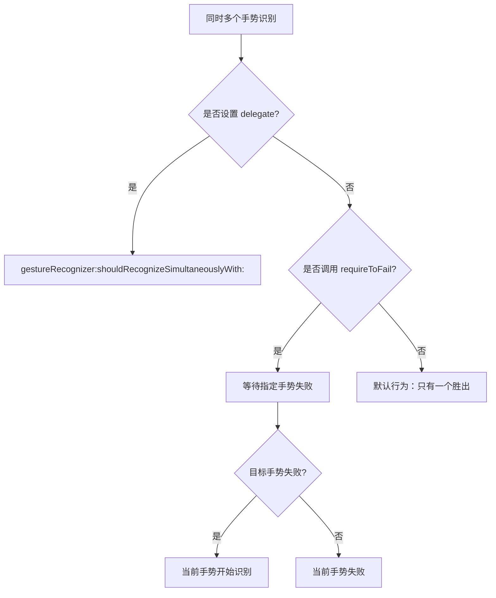

### 4.3 代码实现示例

```swift
// Swift: 自定义手势识别器
class LongPressThenPanGestureRecognizer: UIGestureRecognizer {
    private var startPoint: CGPoint = .zero
    private var minimumPressDuration: TimeInterval = 0.5
    private var timer: Timer?
    
    override func touchesBegan(_ touches: Set<UITouch>, with event: UIEvent) {
        super.touchesBegan(touches, with: event)
        
        guard let touch = touches.first else { return }
        startPoint = touch.location(in: view)
        
        // 延迟识别
        timer = Timer.scheduledTimer(withTimeInterval: minimumPressDuration, repeats: false) { [weak self] _ in
            self?.state = .began
        }
    }
    
    override func touchesMoved(_ touches: Set<UITouch>, with event: UIEvent) {
        super.touchesMoved(touches, with: event)
        
        guard let touch = touches.first else { return }
        let currentPoint = touch.location(in: view)
        
        if state == .began || state == .changed {
            state = .changed
        } else if state == .possible {
            // 移动距离过大，识别失败
            let distance = hypot(currentPoint.x - startPoint.x, currentPoint.y - startPoint.y)
            if distance > 10 {
                timer?.invalidate()
                state = .failed
            }
        }
    }
    
    override func touchesEnded(_ touches: Set<UITouch>, with event: UIEvent) {
        super.touchesEnded(touches, with: event)
        timer?.invalidate()
        
        if state == .began || state == .changed {
            state = .ended
        } else {
            state = .failed
        }
    }
    
    override func touchesCancelled(_ touches: Set<UITouch>, with event: UIEvent) {
        super.touchesCancelled(touches, with: event)
        timer?.invalidate()
        state = .cancelled
    }
    
    override func reset() {
        super.reset()
        timer?.invalidate()
        startPoint = .zero
    }
}

// Swift: 手势冲突解决
class GestureConflictResolver: NSObject, UIGestureRecognizerDelegate {
    
    func setupGestures(for view: UIView) {
        let tapGesture = UITapGestureRecognizer(target: self, action: #selector(handleTap))
        tapGesture.numberOfTapsRequired = 2
        
        let singleTapGesture = UITapGestureRecognizer(target: self, action: #selector(handleSingleTap))
        
        let panGesture = UIPanGestureRecognizer(target: self, action: #selector(handlePan))
        
        // 双击等待单击失败
        tapGesture.require(toFail: singleTapGesture)
        
        // 设置代理解决同时识别
        panGesture.delegate = self
        tapGesture.delegate = self
        
        view.addGestureRecognizer(singleTapGesture)
        view.addGestureRecognizer(tapGesture)
        view.addGestureRecognizer(panGesture)
    }
    
    // 允许同时识别
    func gestureRecognizer(_ gestureRecognizer: UIGestureRecognizer, 
                          shouldRecognizeSimultaneouslyWith otherGestureRecognizer: UIGestureRecognizer) -> Bool {
        // 允许 Pan 和 Pinch 同时识别
        if (gestureRecognizer is UIPanGestureRecognizer && otherGestureRecognizer is UIPinchGestureRecognizer) ||
           (gestureRecognizer is UIPinchGestureRecognizer && otherGestureRecognizer is UIPanGestureRecognizer) {
            return true
        }
        return false
    }
    
    // 控制触摸延迟
    func gestureRecognizer(_ gestureRecognizer: UIGestureRecognizer, 
                          shouldReceive touch: UITouch) -> Bool {
        return true
    }
    
    @objc private func handleTap() { print("双击") }
    @objc private func handleSingleTap() { print("单击") }
    @objc private func handlePan() { print("拖动") }
}
```

```objc
// Objective-C: 手势识别与冲突解决
@interface GestureDemoViewController () <UIGestureRecognizerDelegate>
@property (nonatomic, strong) UIPanGestureRecognizer *panGesture;
@property (nonatomic, strong) UIRotationGestureRecognizer *rotationGesture;
@end

@implementation GestureDemoViewController

- (void)viewDidLoad {
    [super viewDidLoad];
    
    // 创建手势
    self.panGesture = [[UIPanGestureRecognizer alloc] initWithTarget:self 
                                                              action:@selector(handlePan:)];
    self.rotationGesture = [[UIRotationGestureRecognizer alloc] initWithTarget:self 
                                                                        action:@selector(handleRotation:)];
    
    // 设置代理
    self.panGesture.delegate = self;
    self.rotationGesture.delegate = self;
    
    // 添加到手势视图
    [self.gestureView addGestureRecognizer:self.panGesture];
    [self.gestureView addGestureRecognizer:self.rotationGesture];
}

#pragma mark - UIGestureRecognizerDelegate

- (BOOL)gestureRecognizer:(UIGestureRecognizer *)gestureRecognizer 
shouldRecognizeSimultaneouslyWithGestureRecognizer:(UIGestureRecognizer *)otherGestureRecognizer {
    // 允许 Pan 和 Rotation 同时识别
    if (([gestureRecognizer isKindOfClass:[UIPanGestureRecognizer class]] && 
         [otherGestureRecognizer isKindOfClass:[UIRotationGestureRecognizer class]]) ||
        ([gestureRecognizer isKindOfClass:[UIRotationGestureRecognizer class]] && 
         [otherGestureRecognizer isKindOfClass:[UIPanGestureRecognizer class]])) {
        return YES;
    }
    return NO;
}

// 控制手势在特定区域生效
- (BOOL)gestureRecognizer:(UIGestureRecognizer *)gestureRecognizer 
       shouldReceiveTouch:(UITouch *)touch {
    CGPoint location = [touch locationInView:self.gestureView];
    // 只在下半部分响应手势
    return location.y > self.gestureView.bounds.size.height / 2;
}

#pragma mark - Handlers

- (void)handlePan:(UIPanGestureRecognizer *)gesture {
    CGPoint translation = [gesture translationInView:self.gestureView];
    gesture.view.transform = CGAffineTransformTranslate(gesture.view.transform, 
                                                        translation.x, translation.y);
    [gesture setTranslation:CGPointZero inView:self.gestureView];
}

- (void)handleRotation:(UIRotationGestureRecognizer *)gesture {
    gesture.view.transform = CGAffineTransformRotate(gesture.view.transform, gesture.rotation);
    gesture.rotation = 0;
}

@end
```

### 4.4 手势与触摸事件的关系

| 属性 | 作用 | 使用场景 |
|------|------|----------|
| `cancelsTouchesInView` | 手势识别后取消视图触摸 | 默认 YES，防止同时响应 |
| `delaysTouchesBegan` | 延迟 touchesBegan 到识别失败 | 需要区分手势和点击 |
| `delaysTouchesEnded` | 延迟 touchesEnded 等待识别 | 双击识别时延迟单击结束 |

---

## 五、AutoLayout 引擎

### 5.1 Cassowary 算法原理

**核心结论：AutoLayout 基于 Cassowary 约束求解算法，将布局约束转化为线性等式/不等式系统，通过 Simplex 算法求解，支持优先级(1000 required ~ 1)控制冲突解决。**

#### 算法流程

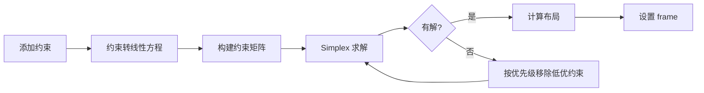

#### 约束优先级

| 优先级 | 值 | 含义 | 使用场景 |
|--------|-----|------|----------|
| `required` | 1000 | 必须满足 | 基本布局约束 |
| `defaultHigh` | 750 | 高优先级 | 内容压缩阻力 |
| `defaultLow` | 250 | 低优先级 | 内容吸附 |
| `fittingSizeLevel` | 50 | 适配尺寸 | 计算 fitting size |
| 自定义 | 1-999 | 任意级别 | 精细控制 |

### 5.2 约束属性详解

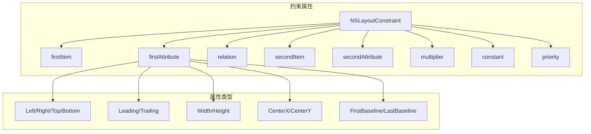

### 5.3 Intrinsic Content Size 与 Content Hugging/Compression Resistance

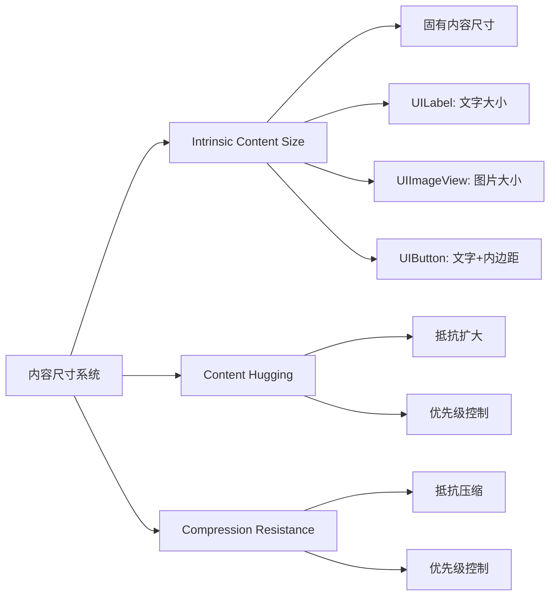

### 5.4 代码实现示例

```swift
// Swift: 程序化 AutoLayout 完整示例
class AutoLayoutDemoViewController: UIViewController {
    
    private let containerView = UIView()
    private let headerLabel = UILabel()
    private let bodyLabel = UILabel()
    private let actionButton = UIButton(type: .system)
    
    override func viewDidLoad() {
        super.viewDidLoad()
        setupViews()
        setupConstraints()
    }
    
    private func setupViews() {
        containerView.backgroundColor = .systemBackground
        containerView.layer.cornerRadius = 12
        
        headerLabel.text = "标题"
        headerLabel.font = .preferredFont(forTextStyle: .headline)
        headerLabel.numberOfLines = 0
        
        bodyLabel.text = "这是正文内容，可能很长需要自动换行。"
        bodyLabel.font = .preferredFont(forTextStyle: .body)
        bodyLabel.numberOfLines = 0
        
        actionButton.setTitle("确定", for: .normal)
        actionButton.backgroundColor = .systemBlue
        actionButton.setTitleColor(.white, for: .normal)
        actionButton.layer.cornerRadius = 8
        
        [containerView, headerLabel, bodyLabel, actionButton].forEach {
            $0.translatesAutoresizingMaskIntoConstraints = false
            containerView.addSubview($0)
        }
        view.addSubview(containerView)
    }
    
    private func setupConstraints() {
        NSLayoutConstraint.activate([
            // 容器约束
            containerView.centerXAnchor.constraint(equalTo: view.centerXAnchor),
            containerView.centerYAnchor.constraint(equalTo: view.centerYAnchor),
            containerView.leadingAnchor.constraint(greaterThanOrEqualTo: view.leadingAnchor, constant: 20),
            containerView.trailingAnchor.constraint(lessThanOrEqualTo: view.trailingAnchor, constant: -20),
            
            // 标题约束
            headerLabel.topAnchor.constraint(equalTo: containerView.topAnchor, constant: 20),
            headerLabel.leadingAnchor.constraint(equalTo: containerView.leadingAnchor, constant: 20),
            headerLabel.trailingAnchor.constraint(equalTo: containerView.trailingAnchor, constant: -20),
            
            // 正文约束
            bodyLabel.topAnchor.constraint(equalTo: headerLabel.bottomAnchor, constant: 12),
            bodyLabel.leadingAnchor.constraint(equalTo: containerView.leadingAnchor, constant: 20),
            bodyLabel.trailingAnchor.constraint(equalTo: containerView.trailingAnchor, constant: -20),
            
            // 按钮约束
            actionButton.topAnchor.constraint(equalTo: bodyLabel.bottomAnchor, constant: 20),
            actionButton.leadingAnchor.constraint(equalTo: containerView.leadingAnchor, constant: 20),
            actionButton.trailingAnchor.constraint(equalTo: containerView.trailingAnchor, constant: -20),
            actionButton.bottomAnchor.constraint(equalTo: containerView.bottomAnchor, constant: -20),
            actionButton.heightAnchor.constraint(equalToConstant: 44)
        ])
        
        // 设置内容吸附和压缩阻力
        headerLabel.setContentHuggingPriority(.defaultHigh + 1, for: .vertical)
        bodyLabel.setContentCompressionResistancePriority(.defaultHigh + 1, for: .vertical)
    }
}

// Swift: 使用 Layout Anchor iOS 9+
extension UIView {
    func pinToSuperview(insets: UIEdgeInsets = .zero) {
        guard let superview = superview else { return }
        translatesAutoresizingMaskIntoConstraints = false
        NSLayoutConstraint.activate([
            topAnchor.constraint(equalTo: superview.topAnchor, constant: insets.top),
            leadingAnchor.constraint(equalTo: superview.leadingAnchor, constant: insets.left),
            trailingAnchor.constraint(equalTo: superview.trailingAnchor, constant: -insets.right),
            bottomAnchor.constraint(equalTo: superview.bottomAnchor, constant: -insets.bottom)
        ])
    }
}
```

```objc
// Objective-C: AutoLayout 程序化实现
@interface AutoLayoutObjCViewController ()
@property (nonatomic, strong) UIView *containerView;
@property (nonatomic, strong) UILabel *titleLabel;
@property (nonatomic, strong) UIButton *actionButton;
@end

@implementation AutoLayoutObjCViewController

- (void)viewDidLoad {
    [super viewDidLoad];
    [self setupViews];
    [self setupConstraints];
}

- (void)setupViews {
    self.containerView = [[UIView alloc] init];
    self.containerView.backgroundColor = [UIColor systemBackgroundColor];
    self.containerView.translatesAutoresizingMaskIntoConstraints = NO;
    
    self.titleLabel = [[UILabel alloc] init];
    self.titleLabel.text = @"Objective-C AutoLayout";
    self.titleLabel.font = [UIFont preferredFontForTextStyle:UIFontTextStyleHeadline];
    self.titleLabel.translatesAutoresizingMaskIntoConstraints = NO;
    
    self.actionButton = [UIButton buttonWithType:UIButtonTypeSystem];
    [self.actionButton setTitle:@"Action" forState:UIControlStateNormal];
    self.actionButton.translatesAutoresizingMaskIntoConstraints = NO;
    
    [self.containerView addSubview:self.titleLabel];
    [self.containerView addSubview:self.actionButton];
    [self.view addSubview:self.containerView];
}

- (void)setupConstraints {
    // 使用 Visual Format Language
    NSDictionary *views = @{
        @"container": self.containerView,
        @"title": self.titleLabel,
        @"button": self.actionButton
    };
    
    NSDictionary *metrics = @{
        @"padding": @20,
        @"spacing": @12
    };
    
    // 容器约束
    [NSLayoutConstraint activateConstraints:[NSLayoutConstraint 
        constraintsWithVisualFormat:@"H:|-padding-[container]-padding-|"
                            options:0 
                            metrics:metrics 
                              views:views]];
    
    [NSLayoutConstraint activateConstraints:[NSLayoutConstraint 
        constraintsWithVisualFormat:@"V:|-100-[container]"
                            options:0 
                            metrics:metrics 
                              views:views]];
    
    // 内部约束
    [NSLayoutConstraint activateConstraints:[NSLayoutConstraint 
        constraintsWithVisualFormat:@"H:|-padding-[title]-padding-|"
                            options:0 
                            metrics:metrics 
                              views:views]];
    
    [NSLayoutConstraint activateConstraints:[NSLayoutConstraint 
        constraintsWithVisualFormat:@"V:|-padding-[title]-spacing-[button]-padding-|"
                            options:NSLayoutFormatAlignAllCenterX 
                            metrics:metrics 
                              views:views]];
    
    // 单独约束
    [self.actionButton.widthAnchor constraintEqualToConstant:120].active = YES;
    [self.actionButton.heightAnchor constraintEqualToConstant:44].active = YES;
    
    // 设置内容优先级
    [self.titleLabel setContentHuggingPriority:UILayoutPriorityDefaultHigh + 1 
                                       forAxis:UILayoutConstraintAxisVertical];
}

@end
```

### 5.5 性能陷阱与优化

| 陷阱 | 原因 | 解决方案 |
|------|------|----------|
| **过度约束** | 约束过多导致求解复杂度增加 | 移除冗余约束，使用固有尺寸 |
| **歧义布局** | 约束不足导致多解 | 确保每个视图都有完整约束 |
| **冲突约束** | 约束相互矛盾 | 使用优先级区分，或移除冲突 |
| **频繁更新** | 每帧修改约束 | 批量修改后统一 layoutIfNeeded |
| **嵌套深度** | 视图层级过深 | 扁平化视图层级 |

---

## 六、UIView 渲染管线

### 6.1 渲染流程详解

**核心结论：UIView 渲染遵循 layoutSubviews → draw(_:) → Core Animation 层树提交 → GPU 渲染的流程，CATransaction 控制提交时机，在 RunLoop 周期结束时统一提交。**

#### 渲染管线图

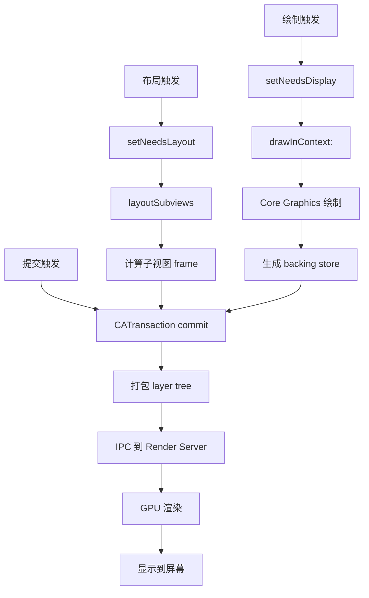

### 6.2 布局阶段详解

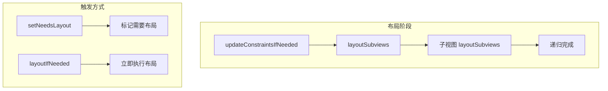

| 方法 | 作用 | 调用时机 |
|------|------|----------|
| `setNeedsLayout()` | 标记需要重新布局 | 修改约束或视图层级后 |
| `layoutIfNeeded()` | 立即执行布局（如有标记） | 需要同步获取布局结果 |
| `layoutSubviews()` | 执行实际布局 | 系统调用，子类重写 |
| `updateConstraints()` | 更新约束 | AutoLayout 布局时 |

### 6.3 绘制阶段详解

| 方法 | 作用 | 调用时机 |
|------|------|----------|
| `setNeedsDisplay()` | 标记需要重绘 | 内容变化时 |
| `draw(_:)` | 执行绘制 | 系统调用，子类重写 |
| `draw(_:for:)` | 打印时绘制 | 打印功能 |
| `layer.draw(in:)` | 图层绘制 | 自定义图层内容 |

### 6.4 代码实现示例

```swift
// Swift: 自定义绘制视图
class CustomDrawingView: UIView {
    var progress: CGFloat = 0.5 {
        didSet {
            setNeedsDisplay() // 标记重绘
        }
    }
    
    var progressColor: UIColor = .systemBlue
    
    // 使用 CAShapeLayer 优化性能
    private let progressLayer = CAShapeLayer()
    
    override init(frame: CGRect) {
        super.init(frame: frame)
        setupLayer()
    }
    
    required init?(coder: NSCoder) {
        super.init(coder: coder)
        setupLayer()
    }
    
    private func setupLayer() {
        layer.addSublayer(progressLayer)
        progressLayer.fillColor = nil
        progressLayer.lineCap = .round
    }
    
    override func layoutSubviews() {
        super.layoutSubviews()
        updateProgressPath()
    }
    
    private func updateProgressPath() {
        let lineWidth: CGFloat = 8
        let radius = (min(bounds.width, bounds.height) - lineWidth) / 2
        let center = CGPoint(x: bounds.midX, y: bounds.midY)
        
        let startAngle = -CGFloat.pi / 2
        let endAngle = startAngle + (2 * CGFloat.pi * progress)
        
        let path = UIBezierPath(
            arcCenter: center,
            radius: radius,
            startAngle: startAngle,
            endAngle: endAngle,
            clockwise: true
        )
        
        progressLayer.path = path.cgPath
        progressLayer.strokeColor = progressColor.cgColor
        progressLayer.lineWidth = lineWidth
    }
    
    // 传统 draw 方法（备用）
    override func draw(_ rect: CGRect) {
        // 使用 Core Graphics 绘制
        guard let context = UIGraphicsGetCurrentContext() else { return }
        
        context.setFillColor(UIColor.systemGray6.cgColor)
        context.fill(rect)
        
        // 绘制文字
        let text = "Progress: \(Int(progress * 100))%"
        let attributes: [NSAttributedString.Key: Any] = [
            .font: UIFont.preferredFont(forTextStyle: .body),
            .foregroundColor: UIColor.label
        ]
        let size = text.size(withAttributes: attributes)
        let point = CGPoint(
            x: (rect.width - size.width) / 2,
            y: (rect.height - size.height) / 2
        )
        text.draw(at: point, withAttributes: attributes)
    }
}

// Swift: 异步绘制优化
class AsyncDrawingView: UIView {
    private var displayLink: CADisplayLink?
    
    override class var layerClass: AnyClass {
        return CATiledLayer.self
    }
    
    func startAsyncRender() {
        displayLink = CADisplayLink(target: self, selector: #selector(renderFrame))
        displayLink?.add(to: .main, forMode: .common)
    }
    
    @objc private func renderFrame() {
        // 在后台线程执行复杂绘制
        DispatchQueue.global(qos: .userInitiated).async { [weak self] in
            guard let self = self else { return }
            
            UIGraphicsPushContext(UIGraphicsGetCurrentContext()!)
            // 执行绘制...
            UIGraphicsPopContext()
            
            DispatchQueue.main.async {
                self.layer.setNeedsDisplay()
            }
        }
    }
}
```

```objc
// Objective-C: 自定义绘制与布局
@interface CustomRenderView : UIView
@property (nonatomic, assign) CGFloat cornerRadius;
@property (nonatomic, strong) UIColor *borderColor;
@property (nonatomic, assign) CGFloat borderWidth;
@end

@implementation CustomRenderView

- (instancetype)initWithFrame:(CGRect)frame {
    self = [super initWithFrame:frame];
    if (self) {
        self.backgroundColor = [UIColor clearColor];
        self.cornerRadius = 8.0;
        self.borderWidth = 1.0;
        self.borderColor = [UIColor systemGrayColor];
    }
    return self;
}

- (void)layoutSubviews {
    [super layoutSubviews];
    
    // 更新 layer 属性
    self.layer.cornerRadius = self.cornerRadius;
    self.layer.borderWidth = self.borderWidth;
    self.layer.borderColor = self.borderColor.CGColor;
    
    // 添加阴影（性能注意：阴影会触发离屏渲染）
    self.layer.shadowColor = [UIColor blackColor].CGColor;
    self.layer.shadowOffset = CGSizeMake(0, 2);
    self.layer.shadowRadius = 4;
    self.layer.shadowOpacity = 0.1;
    
    // 优化：设置 shadowPath 避免离屏渲染
    self.layer.shadowPath = [UIBezierPath bezierPathWithRoundedRect:self.bounds 
                                                       cornerRadius:self.cornerRadius].CGPath;
}

- (void)drawRect:(CGRect)rect {
    // 自定义绘制
    CGContextRef context = UIGraphicsGetCurrentContext();
    
    // 绘制渐变背景
    CGColorSpaceRef colorSpace = CGColorSpaceCreateDeviceRGB();
    CGFloat locations[] = {0.0, 1.0};
    NSArray *colors = @[(__bridge id)[UIColor systemBlueColor].CGColor,
                        (__bridge id)[UIColor systemPurpleColor].CGColor];
    CGGradientRef gradient = CGGradientCreateWithColors(colorSpace, (__bridge CFArrayRef)colors, locations);
    
    CGPoint startPoint = CGPointMake(CGRectGetMidX(rect), CGRectGetMinY(rect));
    CGPoint endPoint = CGPointMake(CGRectGetMidX(rect), CGRectGetMaxY(rect));
    
    CGContextDrawLinearGradient(context, gradient, startPoint, endPoint, 0);
    
    CGGradientRelease(gradient);
    CGColorSpaceRelease(colorSpace);
}

@end
```

---

## 七、UIKit 与 RunLoop 的关系

### 7.1 RunLoop 机制与 UIKit

**核心结论：UIKit 依赖 CFRunLoop 处理事件和定时器，CATransaction 在 RunLoop 周期结束时自动提交，performSelector 系列方法利用 RunLoop 实现延迟执行。**

#### RunLoop 与 UIKit 交互图

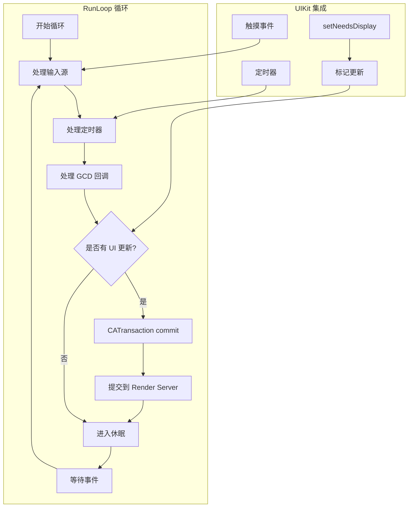

### 7.2 CATransaction 提交机制

| 事务类型 | 触发方式 | 提交时机 |
|----------|----------|----------|
| **隐式事务** | 修改 layer 属性 | RunLoop 周期结束自动提交 |
| **显式事务** | `CATransaction.begin()` | 调用 `commit()` 时 |
| **动画事务** | `CATransaction.setAnimationDuration()` | 同上 |

### 7.3 performSelector 机制

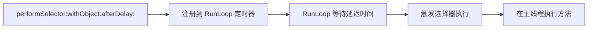

### 7.4 代码实现示例

```swift
// Swift: RunLoop 与 UIKit 交互
class RunLoopDemo {
    
    // 延迟执行
    func delayedExecution() {
        // 使用 performSelector
        perform(#selector(doSomething), with: nil, afterDelay: 1.0)
        
        // 使用 GCD
        DispatchQueue.main.asyncAfter(deadline: .now() + 1.0) { [weak self] in
            self?.doSomething()
        }
        
        // 使用 RunLoop 定时器
        let timer = Timer.scheduledTimer(withTimeInterval: 1.0, repeats: false) { _ in
            print("Timer fired")
        }
        RunLoop.current.add(timer, forMode: .common)
    }
    
    // 控制 CATransaction
    func explicitTransaction() {
        CATransaction.begin()
        CATransaction.setAnimationDuration(0.3)
        CATransaction.setCompletionBlock {
            print("动画完成")
        }
        
        // 修改 layer 属性
        view.layer.opacity = 0.5
        view.layer.transform = CATransform3DMakeScale(0.9, 0.9, 1)
        
        CATransaction.commit()
    }
    
    // 禁用隐式动画
    func disableImplicitAnimation() {
        CATransaction.begin()
        CATransaction.setDisableActions(true)
        
        view.layer.position = CGPoint(x: 100, y: 100)
        
        CATransaction.commit()
    }
    
    // 在特定 RunLoop mode 执行
    func performInSpecificMode() {
        // 在 tracking mode 执行（滚动时）
        performSelector(onMainThread: #selector(doSomething), 
                       with: nil, 
                       waitUntilDone: false, 
                       modes: [RunLoop.Mode.tracking.rawValue])
    }
    
    @objc private func doSomething() {
        print("Executed")
    }
    
    private var view: UIView!
}

// Swift: 自定义 RunLoop Observer
class RunLoopObserver {
    private var observer: CFRunLoopObserver?
    
    func addObserver() {
        let observer = CFRunLoopObserverCreateWithHandler(
            kCFAllocatorDefault,
            CFRunLoopActivity.beforeWaiting.rawValue | CFRunLoopActivity.afterWaiting.rawValue,
            true,
            0
        ) { _, activity in
            switch activity {
            case .beforeWaiting:
                print("RunLoop 即将休眠 - UI 更新提交点")
            case .afterWaiting:
                print("RunLoop 被唤醒")
            default:
                break
            }
        }
        
        CFRunLoopAddObserver(CFRunLoopGetMain(), observer, .commonModes)
        self.observer = observer
    }
    
    deinit {
        if let observer = observer {
            CFRunLoopRemoveObserver(CFRunLoopGetMain(), observer, .commonModes)
        }
    }
}
```

```objc
// Objective-C: RunLoop 与 UIKit 交互
@interface RunLoopObjCDemo : NSObject
@property (nonatomic, strong) UIView *targetView;
@end

@implementation RunLoopObjCDemo

#pragma mark - 延迟执行

- (void)performDelayedActions {
    // performSelector 延迟
    [self performSelector:@selector(action1) withObject:nil afterDelay:1.0];
    
    // 取消延迟执行
    [NSObject cancelPreviousPerformRequestsWithTarget:self selector:@selector(action1) object:nil];
    
    // GCD 延迟
    dispatch_after(dispatch_time(DISPATCH_TIME_NOW, (int64_t)(1.0 * NSEC_PER_SEC)), 
                   dispatch_get_main_queue(), ^{
        [self action1];
    });
}

#pragma mark - CATransaction

- (void)performTransaction {
    [CATransaction begin];
    [CATransaction setAnimationDuration:0.5];
    [CATransaction setAnimationTimingFunction:[CAMediaTimingFunction functionWithName:kCAMediaTimingFunctionEaseInEaseOut]];
    [CATransaction setCompletionBlock:^{
        NSLog(@"Transaction completed");
    }];
    
    // 批量修改 layer 属性
    self.targetView.layer.opacity = 0.5;
    self.targetView.layer.cornerRadius = 20;
    
    [CATransaction commit];
}

#pragma mark - RunLoop Observer

- (void)setupRunLoopObserver {
    CFRunLoopObserverRef observer = CFRunLoopObserverCreateWithHandler(
        kCFAllocatorDefault,
        kCFRunLoopBeforeWaiting | kCFRunLoopAfterWaiting,
        YES,
        0,
        ^(CFRunLoopObserverRef observer, CFRunLoopActivity activity) {
            switch (activity) {
                case kCFRunLoopBeforeWaiting:
                    NSLog(@"RunLoop 即将休眠 - CATransaction 自动提交");
                    break;
                case kCFRunLoopAfterWaiting:
                    NSLog(@"RunLoop 被唤醒");
                    break;
                default:
                    break;
            }
        }
    );
    
    CFRunLoopAddObserver(CFRunLoopGetMain(), observer, kCFRunLoopCommonModes);
    // 注意：需要保存 observer 引用防止释放
}

- (void)action1 {
    NSLog(@"Action 1 executed");
}

@end
```

### 7.5 常见模式与最佳实践

| 场景 | 推荐方案 | 注意事项 |
|------|----------|----------|
| 简单延迟 | `performSelector:afterDelay:` | 需要手动取消 |
| 可取消延迟 | `Timer` 或 `DispatchWorkItem` | 注意内存循环引用 |
| 批量 UI 更新 | `CATransaction` | 避免每帧单独提交 |
| 滚动时暂停 | `RunLoop.Mode.tracking` | 使用 commonModes 包含 tracking |
| 后台线程 UI | `DispatchQueue.main.async` | 必须在主线程更新 UI |

---

## 附录：参考与延伸阅读

### 官方文档
- [UIKit Documentation](https://developer.apple.com/documentation/uikit)
- [Auto Layout Guide](https://developer.apple.com/library/archive/documentation/UserExperience/Conceptual/AutolayoutPG/index.html)
- [Event Handling Guide](https://developer.apple.com/documentation/uikit/touches_presses_and_gestures)

### WWDC 推荐
- WWDC 2019: Introducing Multiple Windows on iPad
- WWDC 2020: Advances in UICollectionView
- WWDC 2021: Meet UIKit Actions and Menus

### 相关技术
- Core Animation 渲染机制
- Metal 图形渲染管线
- SwiftUI 声明式 UI 框架
