# UIKit 架构组成与战略定位全景解析

> 版本要求: iOS 13+ | Swift 5.9+ | Xcode 15+
> 交叉引用：[UIKit架构与事件机制](./UIKit架构与事件机制_详细解析.md) | [UIKit高级组件与自定义](./UIKit高级组件与自定义_详细解析.md) | [Apple框架生态全景](../01_框架生态与演进/Apple框架生态全景与战略定位_详细解析.md)

---

## 核心结论 TL;DR

| 维度 | 核心结论 |
|------|----------|
| **战略定位** | UIKit 是 iOS 应用层的基石框架，承载了 Apple 移动生态 17 年的 API 积累，是 Cocoa Touch 层最核心的 UI 基础设施 |
| **架构特点** | 六层分层架构（UIApplication → UIWindowScene → UIWindow → UIViewController → UIView → CALayer），职责单一、层层委托 |
| **核心优势** | 精确的渲染控制、完善的调试工具链、庞大的第三方生态、复杂交互场景的唯一选择 |
| **不可替代性** | 自定义转场动画、复杂手势交互、后台任务管理、TextKit 精细排版、键盘精确控制等场景至今只能用 UIKit |
| **与 SwiftUI 关系** | Apple 采取"双轨并行、渐进融合"策略，SwiftUI 底层仍依赖 UIKit 渲染，两者长期共存互补 |
| **演进方向** | UIKit 持续现代化改造（声明式配置、Compositional Layout、UIAction），同时作为 SwiftUI 的底层支撑持续演进 |

---

## 二、UIKit 在 Apple 框架生态中的战略定位

### 2.1 Apple 框架分层中的 UIKit

**核心结论：UIKit 位于 Cocoa Touch 层的核心位置，向上为应用提供完整的 UI 基础设施，向下桥接 Core Animation、Core Graphics、Metal 等底层图形框架，是连接业务逻辑与底层渲染的关键枢纽。**

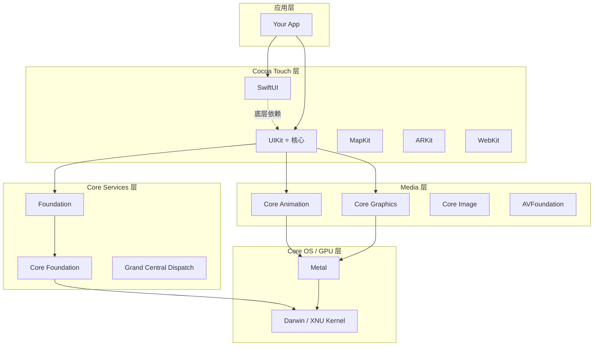

**UIKit 的枢纽地位体现在三个方面：**

| 方向 | 说明 |
|------|------|
| **向上** | 为所有 iOS 应用提供窗口管理、视图层级、事件分发、视图控制器生命周期等核心能力 |
| **向下** | 桥接 Core Animation 进行离屏合成，通过 Core Graphics 提供 2D 绘制，最终由 Metal 驱动 GPU 渲染 |
| **平行** | SwiftUI 在底层通过 UIHostingController 嵌入 UIKit 体系，MapKit/ARKit 等框架也依赖 UIKit 提供视图容器 |

### 2.2 UIKit 的历史演进

**核心结论：UIKit 从 2008 年初代 SDK 的基础视图框架，经历了 17 年持续演进，每一次重大版本都带来架构级改进，至今仍是 Apple 投入最多的 UI 框架。**

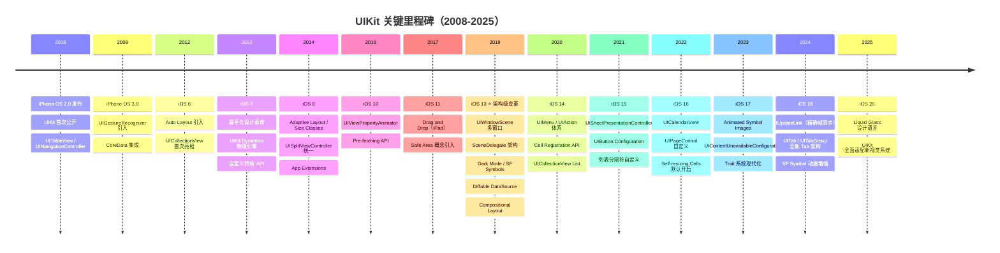

### 2.3 Apple 对 UIKit 的战略投入分析

**核心结论：即使在 SwiftUI 发布后，Apple 每年 WWDC 仍为 UIKit 安排大量 Session，新增 API 数量未见下降，证明 UIKit 的战略地位未被动摇。**

| 年份 | WWDC UIKit 相关 Session | 重要新增 API | 投入信号 |
|------|-------------------------|-------------|----------|
| 2019（iOS 13） | 12+ | UIWindowScene、Diffable DataSource、Compositional Layout、ContextMenu | **架构级重构** |
| 2020（iOS 14） | 8+ | UIMenu/UIAction、CellRegistration、ColorPicker、PHPicker | 声明式 API 渗透 |
| 2021（iOS 15） | 7+ | UISheetPresentation、Button.Configuration、SFSymbol 3 动画 | 组件现代化 |
| 2022（iOS 16） | 6+ | UICalendarView、UIEditMenuInteraction、Self-resizing Cells | 持续完善 |
| 2023（iOS 17） | 6+ | Animated Symbols、UIContentUnavailableConfiguration、Trait 改造 | 系统化升级 |
| 2024（iOS 18） | 7+ | UIUpdateLink、UITab 新架构、SF Symbol 6、Text Formatting | **重大更新** |
| 2025（iOS 26） | 8+ | Liquid Glass 视觉系统、全新导航范式 | **设计语言革新** |

**关键洞察：** Apple 对 UIKit 的投入呈现"波浪式上升"而非递减趋势。iOS 13 和 iOS 18/26 都是投入高峰，表明 UIKit 仍然是 Apple UI 战略的核心支柱。

### 2.4 UIKit 的不可替代性

**核心结论：在多个关键场景下，UIKit 是唯一选择或最优选择，SwiftUI 目前无法完全替代。**

| 场景 | UIKit 能力 | SwiftUI 现状 | 分析 |
|------|-----------|-------------|------|
| **自定义转场动画** | UIViewControllerAnimatedTransitioning 完全自定义 | 仅支持基础 NavigationTransition | UIKit 不可替代 |
| **复杂手势交互** | UIGestureRecognizer 状态机、simultaneousGestures | 手势组合受限、无状态机控制 | UIKit 显著优于 |
| **后台任务管理** | UIApplication.beginBackgroundTask、BGTaskScheduler | 无直接 API，需桥接 UIKit | UIKit 独占 |
| **键盘精确控制** | UITextField inputView/inputAccessoryView 自定义 | 有限自定义能力 | UIKit 优势明显 |
| **TextKit 排版** | NSTextLayoutManager、NSTextStorage 精细控制 | Text 组件能力有限 | UIKit 不可替代 |
| **CollectionView 复杂布局** | Compositional Layout + 自定义 FlowLayout | LazyVGrid 能力有限 | UIKit 显著优于 |
| **StatusBar/NavigationBar 精细控制** | 逐 VC 配置，动态切换 | preferredColorScheme 有限控制 | UIKit 优势明显 |
| **Storyboard/XIB 可视化** | 完整的 Interface Builder 支持 | Preview 替代但生态不同 | 各有所长 |
| **第三方 SDK 集成** | 几乎所有 SDK 基于 UIKit | 需通过 Representable 桥接 | UIKit 生态优势 |

### 2.5 UIKit 与 SwiftUI 的战略共存

**核心结论：Apple 采取"双轨并行"策略——SwiftUI 面向未来新项目快速开发，UIKit 保障存量项目和复杂场景，两者通过桥接 API 深度互操作。**

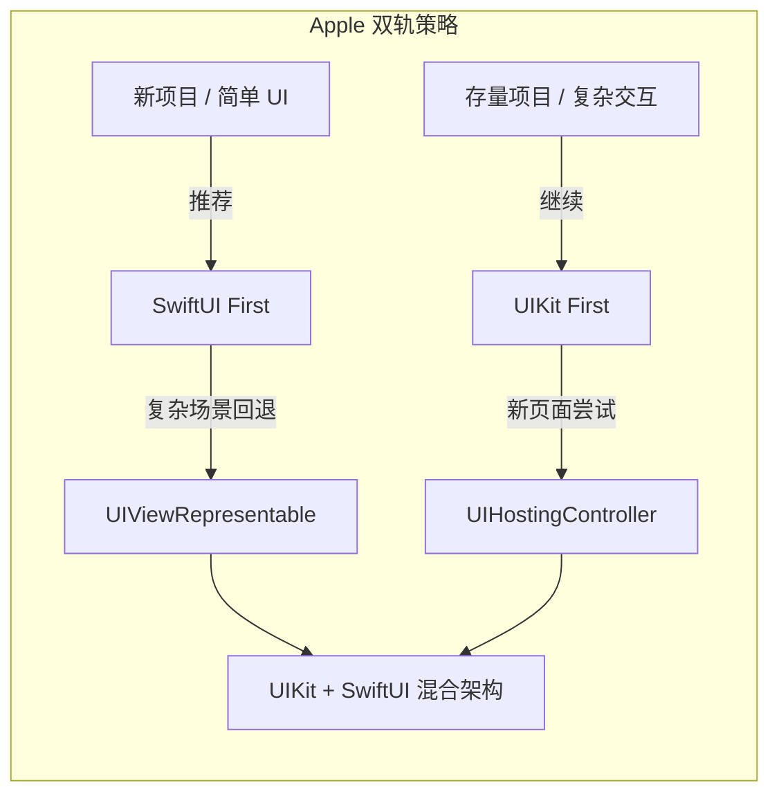

**长期展望三阶段：**

| 阶段 | 时间线 | 特征 | UIKit 角色 |
|------|--------|------|-----------|
| **当前：双轨并行** | 2019-2026 | SwiftUI 逐步成熟，UIKit 持续更新 | 主力框架，复杂场景首选 |
| **中期：SwiftUI 主导** | 2027-2030（预估） | SwiftUI 覆盖 90%+ 场景 | 底层支撑 + 复杂场景兜底 |
| **远期：深度融合** | 2030+（预估） | SwiftUI 与 UIKit 内部深度统一 | 作为底层实现持续存在 |

---

## 三、UIKit 整体架构层次详解

### 3.1 六层架构全景

**核心结论：UIKit 采用严格的六层分层架构，每层职责单一，通过 delegate 和 notification 实现层间解耦，形成"洋葱模型"式的嵌套结构。**

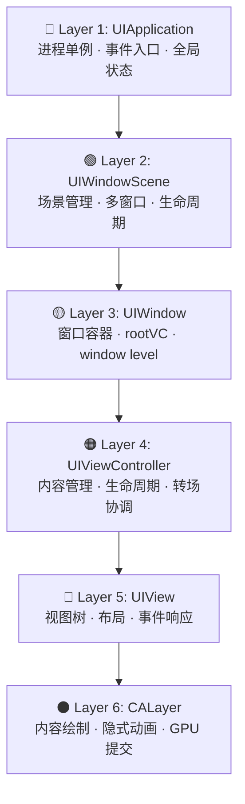

### 3.2 各层职责、核心属性与生命周期

| 层级 | 类名 | 核心职责 | 关键属性 | 生命周期特征 |
|------|------|---------|---------|-------------|
| **Layer 1** | UIApplication | 事件分发入口、全局状态管理、后台任务 | `delegate`, `keyWindow`(deprecated), `connectedScenes`, `applicationState` | 进程级单例，随 App 启动/终止 |
| **Layer 2** | UIWindowScene | 场景管理、多窗口支持、系统特性获取 | `windows`, `screen`, `traitCollection`, `sizeRestrictions` | Scene 连接/断开/前后台切换 |
| **Layer 3** | UIWindow | 视图层级根容器、事件分发中转 | `rootViewController`, `windowLevel`, `windowScene` | 随 Scene 创建/销毁 |
| **Layer 4** | UIViewController | 视图管理、导航协调、模态展示 | `view`, `children`, `parent`, `navigationItem`, `presentedViewController` | viewDidLoad → appear → disappear → dealloc |
| **Layer 5** | UIView | 内容展示、布局计算、手势响应 | `frame`, `bounds`, `center`, `transform`, `subviews`, `layer` | 随父视图 addSubview/removeFromSuperview |
| **Layer 6** | CALayer | 位图内容管理、合成属性、动画 | `contents`, `backgroundColor`, `borderWidth`, `shadowPath`, `opacity` | 与 UIView 一一对应，或独立存在 |

### 3.3 UIApplication 层

**核心结论：UIApplication 是整个应用的单例入口，负责事件分发、应用状态管理和全局配置。iOS 13+ 后其 UI 生命周期职责已移交给 SceneDelegate。**

**AppDelegate → SceneDelegate 职责演变：**

| 职责 | iOS 12 及之前（AppDelegate） | iOS 13+（SceneDelegate 架构） |
|------|---------------------------|-------------------------------|
| 应用启动配置 | `didFinishLaunching` | `didFinishLaunching`（不变） |
| UI 窗口创建 | AppDelegate 中创建 UIWindow | SceneDelegate `willConnectTo` |
| 前后台切换 | `applicationDidBecomeActive` | `sceneDidBecomeActive` |
| 状态恢复 | AppDelegate `shouldRestoreState` | SceneDelegate `stateRestorationActivity` |
| URL/Universal Link | AppDelegate | AppDelegate（不变） |
| 推送通知 | AppDelegate | AppDelegate（不变） |
| 多窗口管理 | ❌ 不支持 | ✅ 每个 Scene 独立管理 |

### 3.4 UIWindowScene 层（iOS 13+）

**核心结论：UIWindowScene 是 iOS 13 引入的架构级抽象，将"一个 App = 一个 UI 实例"扩展为"一个 App = 多个 Scene 实例"，是支持 iPad 多窗口、macOS Catalyst 和 CarPlay 的基础。**

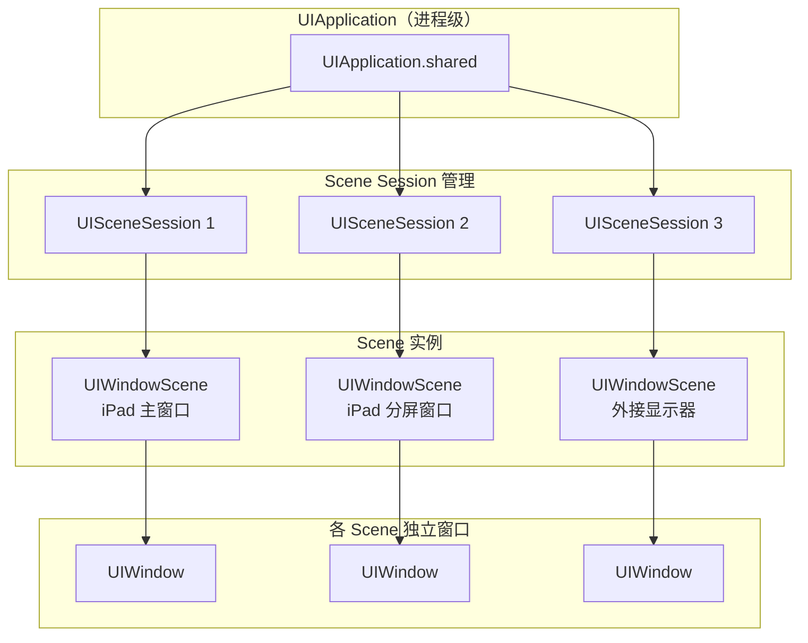

**Scene Session 管理机制：**

- **UISceneSession** 持久化存储 Scene 的配置和状态恢复数据
- **UISceneConfiguration** 定义 Scene 使用的 Delegate 类、Storyboard、Scene 子类
- 系统根据 `Info.plist` 中的 Scene Manifest 创建对应配置
- Scene 可被系统销毁后重新连接，Session 保持不变

### 3.5 UIWindow 层

**核心结论：UIWindow 是视图层级的根容器，通过 windowLevel 管理多窗口叠加顺序，通过 rootViewController 桥接控制器层级。**

| 属性 | 说明 | 典型用途 |
|------|------|---------|
| `windowLevel` | 窗口在 z 轴的层级 | `.normal`(0) < `.statusBar`(1000) < `.alert`(2000) |
| `rootViewController` | 窗口的根视图控制器 | 导航容器或 TabBarController |
| `isKeyWindow` | 是否为接收键盘事件的窗口 | 当前活跃窗口标识 |
| `windowScene` | 所属的 UIWindowScene（iOS 13+） | 多窗口场景关联 |

**Key Window 机制要点：**
- 同一时间只有一个 key window
- `makeKeyAndVisible()` 设置为 key window 并显示
- iOS 15+ 推荐使用 `windowScene.keyWindow` 替代 `UIApplication.shared.keyWindow`

### 3.6 UIViewController 层

**核心结论：UIViewController 是 UIKit 最重要的协调者，管理视图生命周期、处理导航转场、协调子控制器，是业务逻辑与视图层的桥梁。**

**ViewController 生命周期状态图：**

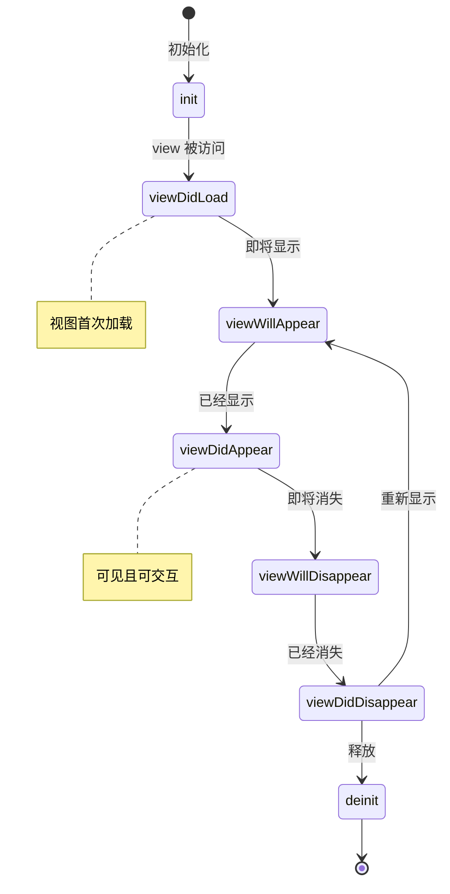

**容器 VC vs 内容 VC 分类：**

| 类型 | 代表类 | 职责 | 特征 |
|------|--------|------|------|
| **容器 VC** | UINavigationController | 管理 VC 栈，提供 push/pop 导航 | 持有 `viewControllers` 数组 |
| **容器 VC** | UITabBarController | 管理并列 VC 集合，底部 Tab 切换 | 持有 `viewControllers` 数组 |
| **容器 VC** | UISplitViewController | 管理主从布局，适配 iPad/Mac | 持有 `viewControllers`，支持折叠 |
| **容器 VC** | UIPageViewController | 管理分页滑动 VC 序列 | 通过 DataSource 提供页面 |
| **内容 VC** | UIViewController 子类 | 管理具体视图内容和业务逻辑 | 持有 `view` 层级 |
| **内容 VC** | UITableViewController | 预配置 TableView 管理 | 自带 tableView 和 refreshControl |

### 3.7 UIView 层

**核心结论：UIView 是 UIKit 的视觉基石，每个 UIView 持有一个 CALayer 进行实际渲染，UIView 本身负责布局、事件响应和动画协调。**

**视图树与层树的映射关系：**

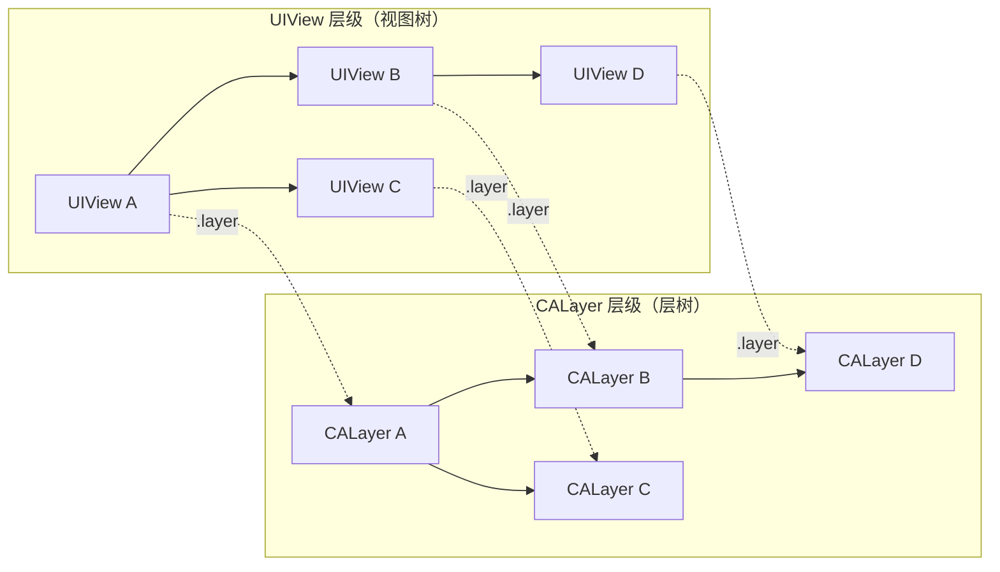

**bounds vs frame 核心区别：**

| 属性 | 坐标系 | 受 transform 影响 | 典型用途 |
|------|--------|------------------|---------|
| `frame` | 父视图坐标系 | ✅ 是 | 布局定位：设置视图在父视图中的位置和大小 |
| `bounds` | 自身坐标系 | ❌ 否 | 内容绘制：定义自身可绘制区域和内容偏移 |
| `center` | 父视图坐标系 | ❌ 否（是 frame 的中心点） | 动画移动：移动视图位置 |

### 3.8 CALayer 层

**核心结论：CALayer 是 UIKit 渲染的最终执行者，负责管理位图内容、合成属性和隐式动画。UIView 是 CALayer 的 delegate，两者职责边界清晰。**

**UIView 与 CALayer 职责边界：**

| 职责 | UIView | CALayer |
|------|--------|---------|
| 事件响应 | ✅ hitTest / 手势 | ❌ 无事件能力 |
| 布局管理 | ✅ Auto Layout | ❌（通过 layoutSublayers 回调） |
| 内容绘制 | `draw(_:rect)` | `contents` 位图 / `draw(in:)` |
| 动画 | UIView.animate 封装 | 隐式动画 + CAAnimation |
| 圆角/阴影 | 通过 layer 属性设置 | ✅ 直接支持 |
| 3D 变换 | ❌ 仅 2D affine | ✅ CATransform3D |
| 蒙版/裁剪 | clipsToBounds | mask / masksToBounds |

**CALayer 内容模型三要素：**

- **contents**：位图内容（CGImage），直接赋值或通过 `draw(in:)` 绘制
- **backgroundColor**：背景色，GPU 直接填充，性能最优
- **border/shadow/corner**：合成属性，由 Render Server 处理

> 📖 关于 CALayer 渲染管线和 Core Animation 提交机制的详细分析，参见 [UIKit架构与事件机制 · 渲染管线](./UIKit架构与事件机制_详细解析.md)

---

## 四、核心组件关系与协作

### 4.1 组件协作全景

**核心结论：UIKit 各组件通过事件流（向上传递）、指令流（向下分发）和渲染流（向 GPU 提交）三条路径协作，形成完整的"输入-处理-输出"闭环。**

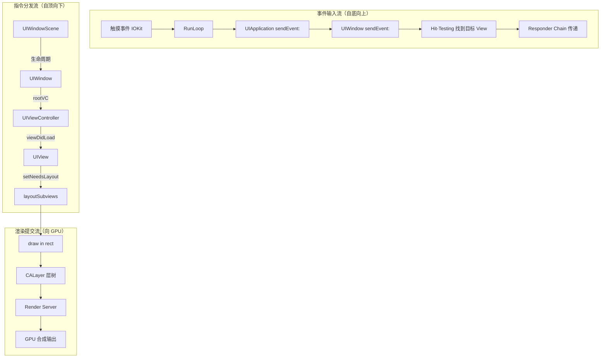

### 4.2 视图控制器容器体系

**核心结论：UIKit 的容器 VC 体系支持任意嵌套组合，形成树状管理结构，每个容器负责其子 VC 的展示区域和转场逻辑。**

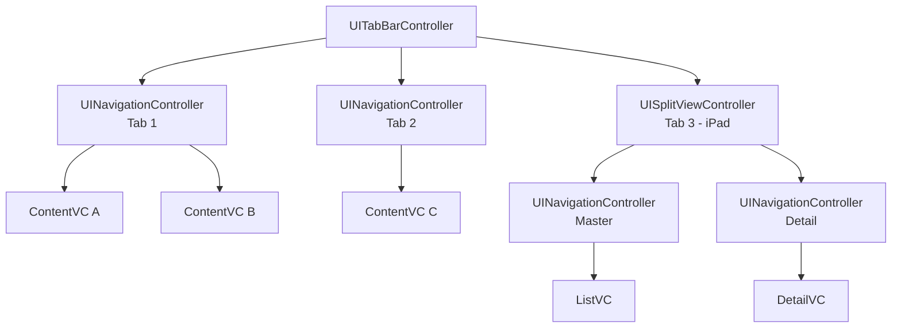

**容器 VC 嵌套协作规则：**

| 规则 | 说明 |
|------|------|
| **外观转发** | 容器 VC 自动将 `viewWillAppear` 等回调转发给可见的子 VC |
| **旋转协调** | 通过 `childForStatusBarStyle` 等方法决定由哪个子 VC 控制系统 UI 外观 |
| **Trait 传播** | `traitCollection` 沿容器树向下传播，子 VC 可通过 `traitCollectionDidChange` 响应 |
| **安全区域** | `additionalSafeAreaInsets` 逐层叠加，每个容器可贡献额外安全边距 |
| **Presentation Context** | `definesPresentationContext` 决定 modal 展示的容器边界 |

### 4.3 Storyboard/XIB vs 代码构建对比

| 维度 | Storyboard/XIB | 纯代码 |
|------|---------------|--------|
| **可视化预览** | ✅ Interface Builder 实时预览 | ❌ 需运行或使用 SwiftUI Preview |
| **协作冲突** | ❌ XML 难以 merge，团队协作痛点 | ✅ 纯文本，Git 友好 |
| **类型安全** | ❌ Segue/Outlet 运行时崩溃风险 | ✅ 编译时检查 |
| **复用性** | ⚠️ XIB 可复用，Storyboard 困难 | ✅ 高度可复用 |
| **动态布局** | ⚠️ 有限，需配合代码 | ✅ 完全动态 |
| **启动性能** | ⚠️ 大 Storyboard 加载耗时 | ✅ 按需创建 |
| **学习曲线** | ✅ 低，直观 | ⚠️ 中等，需熟悉 API |
| **适用场景** | 原型、简单页面、小团队 | 复杂 UI、大团队、组件化架构 |
| **业界趋势** | 逐渐减少使用 | ✅ 主流大厂首选 |

### 4.4 UIKit 组件依赖关系

**核心结论：UIKit 并非独立框架，其核心能力依赖 Core Animation、Core Graphics、Foundation 等底层框架，理解这些依赖是深入掌握 UIKit 的关键。**

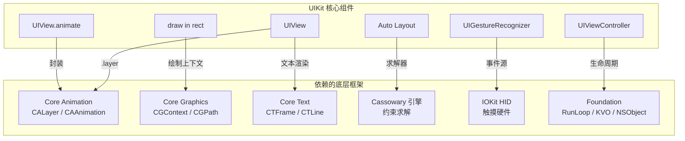

---

## 五、iOS 13+ UIWindowScene 架构革新

### 5.1 引入背景

**核心结论：UIWindowScene 架构的引入根本动机是 Apple 的多平台统一战略——iPad 多任务、macOS Catalyst 移植和 CarPlay 多屏都要求 App 能同时运行多个独立的 UI 实例。**

| 驱动因素 | 具体需求 | 技术挑战 |
|----------|---------|---------|
| **iPad 多任务** | Split View / Slide Over 中同一 App 打开多个窗口 | App 需支持多个独立 UI 状态 |
| **macOS Catalyst** | Mac App 天然支持多窗口 | 需要将 iOS App 映射为多窗口 |
| **CarPlay 多屏** | 手机屏 + 车载屏同时显示不同 UI | 需要同进程多 Scene |
| **外接显示器** | iPad 连接外接屏幕显示独立内容 | 同一 App 在不同 Screen 上渲染 |

### 5.2 新旧架构对比

**核心结论：从"单 Window 模型"到"Scene-based 模型"是 UIKit 自诞生以来最大的架构变革，将 UI 生命周期从进程级下沉到场景级。**

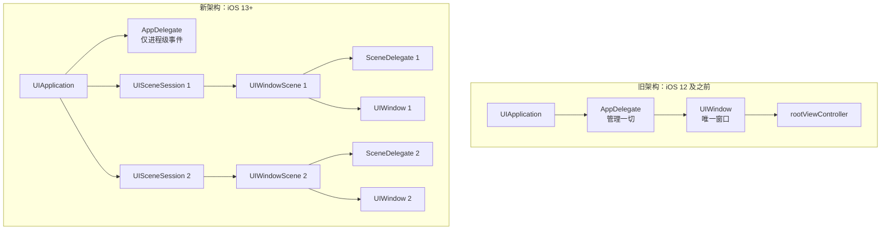

### 5.3 Scene 生命周期 vs App 生命周期

| 事件 | App 生命周期（AppDelegate） | Scene 生命周期（SceneDelegate） |
|------|---------------------------|-------------------------------|
| 启动完成 | `application(_:didFinishLaunchingWithOptions:)` | — |
| UI 创建 | — | `scene(_:willConnectTo:options:)` |
| 进入前台 | `applicationWillEnterForeground` | `sceneWillEnterForeground` |
| 激活 | `applicationDidBecomeActive` | `sceneDidBecomeActive` |
| 即将失活 | `applicationWillResignActive` | `sceneWillResignActive` |
| 进入后台 | `applicationDidEnterBackground` | `sceneDidEnterBackground` |
| UI 断开 | — | `sceneDidDisconnect` |
| 终止 | `applicationWillTerminate` | — |
| URL 打开 | `application(_:open:options:)` | `scene(_:openURLContexts:)` |

**关键区别：** 在 Scene-based 架构中，"进入后台"是 Scene 级别的事件——一个 Scene 在后台不意味着整个 App 在后台。

### 5.4 多 Scene 架构设计模式

**核心结论：多 Scene 架构要求开发者重新思考数据共享、状态管理和通信模式——从"全局单例"走向"Scene 隔离 + 共享层"。**

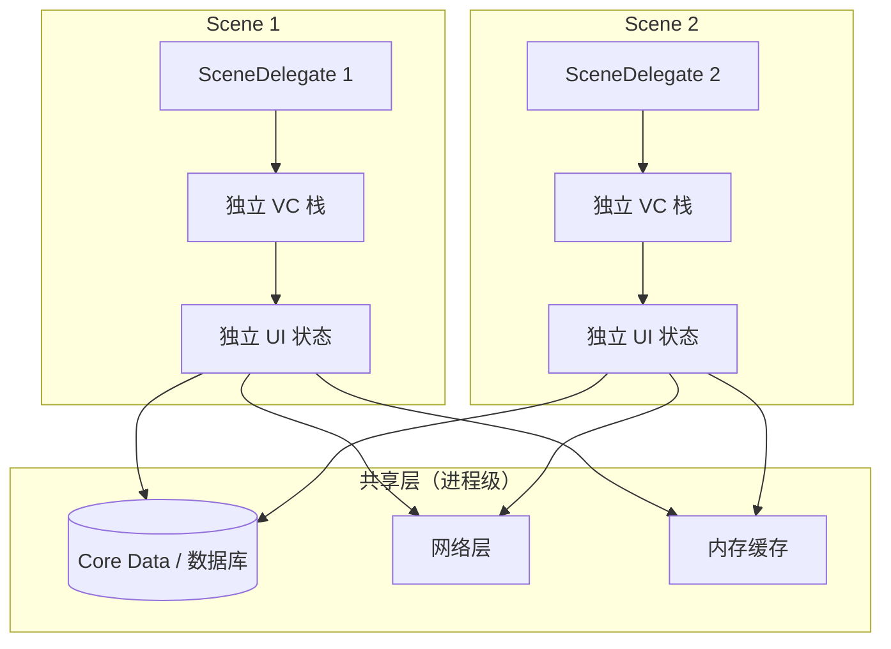

**Scene 间通信方式：**

| 方式 | 适用场景 | 特征 |
|------|---------|------|
| **NotificationCenter** | 广播式通知所有 Scene | 简单但松耦合 |
| **共享数据模型** | Core Data / UserDefaults 变化同步 | 数据驱动 |
| **UIApplication 自定义方法** | 通过 shared application 中转 | 中心化控制 |
| **NSUserActivity** | Scene 间传递用户活动上下文 | Apple 推荐的恢复/传递机制 |

### 5.5 对已有项目的影响与迁移策略

**核心结论：Scene 架构迁移是渐进式的，不支持多窗口的 App 只需最小改动即可适配，但要获得多窗口能力需要架构层面的调整。**

**迁移要点：**

| 步骤 | 内容 | 必要性 |
|------|------|--------|
| 1. 配置 Scene Manifest | Info.plist 添加 UIApplicationSceneManifest | ✅ 必需 |
| 2. 创建 SceneDelegate | 实现 `UIWindowSceneDelegate` | ✅ 必需 |
| 3. 迁移 UI 创建逻辑 | 从 AppDelegate 移至 SceneDelegate | ✅ 必需 |
| 4. 审计全局状态 | 检查单例/全局变量是否需要 Scene 隔离 | ⚠️ 多窗口时必需 |
| 5. 状态恢复适配 | 使用 `stateRestorationActivity` 替代旧 API | ⚠️ 推荐 |
| 6. 声明多窗口支持 | `UIApplicationSupportsMultipleScenes = YES` | 可选（iPad） |

---

## 六、UIKit vs SwiftUI 深度对比

### 6.1 架构差异

**核心结论：UIKit 采用命令式面向对象架构（手动管理状态与视图同步），SwiftUI 采用声明式函数式架构（状态驱动自动更新），两者的根本差异在于"谁负责同步状态与 UI"。**

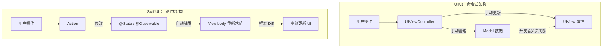

### 6.2 十五维度对比表

| # | 维度 | UIKit | SwiftUI |
|---|------|-------|---------|
| 1 | **编程范式** | 命令式、面向对象 | 声明式、函数式 |
| 2 | **渲染方式** | CALayer 层树 → Core Animation → Metal | AttributeGraph Diff → UIKit/AppKit 后端渲染 |
| 3 | **状态管理** | 手动（KVO/Delegate/Notification/闭包） | 自动（@State/@Binding/@Observable） |
| 4 | **布局系统** | Auto Layout（Cassowary 约束求解） | 内置布局协议（HStack/VStack/GeometryReader） |
| 5 | **动画系统** | UIView.animate / CAAnimation / UIViewPropertyAnimator | withAnimation / .animation modifier / 隐式动画 |
| 6 | **导航模型** | UINavigationController push/pop + modal present | NavigationStack / NavigationSplitView（iOS 16+） |
| 7 | **列表性能** | UITableView/UICollectionView 成熟的复用机制 | List/LazyVStack 复用机制逐步完善 |
| 8 | **可测试性** | XCTest + UI 测试，需模拟 VC 生命周期 | Preview 即时预览 + ViewInspector 等工具 |
| 9 | **调试工具** | View Hierarchy Debugger、Instruments、lldb po | Xcode Preview（有时不稳定）、_printChanges() |
| 10 | **跨平台** | 仅 iOS/iPadOS/tvOS/Mac Catalyst | iOS/macOS/watchOS/tvOS/visionOS 统一 |
| 11 | **生态成熟度** | 17 年积累，第三方库极其丰富 | 6 年积累，生态快速增长但仍有缺口 |
| 12 | **学习资料** | 海量教程、书籍、Stack Overflow 答案 | 快速增长，但深入资料相对较少 |
| 13 | **最低支持版本** | iOS 2+（持续向前兼容） | iOS 13+（每年新 API 需更高版本） |
| 14 | **复杂交互支持** | 完全控制手势、转场、键盘、文本 | 基础手势支持，复杂场景需桥接 UIKit |
| 15 | **适合项目类型** | 大型商业 App、长周期维护项目 | 新项目、中小型 App、快速原型 |

### 6.3 UIKit 的核心优势

**核心结论：UIKit 的核心竞争力在于"精确控制"和"生态深度"，这是 17 年持续迭代的结果，短期内无法被替代。**

| 优势领域 | 具体表现 |
|----------|---------|
| **精确的渲染控制** | 可直接操作 CALayer 属性、自定义 draw 方法、控制每一帧的渲染时机 |
| **完善的调试工具链** | View Hierarchy Debugger 可视化层级、Instruments Time Profiler、Core Animation 帧分析 |
| **成熟的第三方生态** | SnapKit、Kingfisher、IGListKit 等高质量库均基于 UIKit |
| **复杂交互的唯一选择** | 自定义转场、复杂手势组合、TextKit 排版、键盘精细控制 |
| **稳定可预测** | 17 年经过数百万 App 验证，行为一致性高，边界情况文档完善 |
| **向前兼容性** | iOS 2 的 API 至今仍可使用，迁移成本极低 |

### 6.4 SwiftUI 的核心优势

| 优势领域 | 具体表现 |
|----------|---------|
| **开发效率** | 声明式语法减少样板代码，同等功能代码量减少 40-60% |
| **跨平台** | 一套代码适配 iOS/macOS/watchOS/tvOS/visionOS |
| **实时预览** | Xcode Preview 秒级反馈，大幅提升 UI 调试效率 |
| **状态驱动** | @Observable + SwiftUI 自动 Diff，消除手动同步 Bug |
| **现代 API 设计** | Modifier 链式语法、类型安全、编译时检查 |

### 6.5 互操作桥接

**核心结论：Apple 提供了完整的双向桥接 API，使 UIKit 和 SwiftUI 可以在同一项目中无缝混用，这是"双轨策略"的技术基础。**

| 桥接方式 | 方向 | 使用场景 |
|----------|------|---------|
| **UIHostingController** | SwiftUI → UIKit | 在 UIKit 项目中嵌入 SwiftUI 视图（最常用） |
| **UIViewRepresentable** | UIKit View → SwiftUI | 在 SwiftUI 中使用 UIKit 视图（如 MKMapView） |
| **UIViewControllerRepresentable** | UIKit VC → SwiftUI | 在 SwiftUI 中使用 UIKit 控制器（如 UIImagePickerController） |

**桥接的核心协调机制：**

```swift
// UIViewRepresentable 协议核心方法（概念示意）
protocol UIViewRepresentable {
    func makeUIView(context:) -> UIViewType      // 创建 UIKit 视图
    func updateUIView(_:context:)                 // SwiftUI 状态变化时更新
    func makeCoordinator() -> Coordinator          // 处理 delegate 回调
}
```

### 6.6 选型决策流程

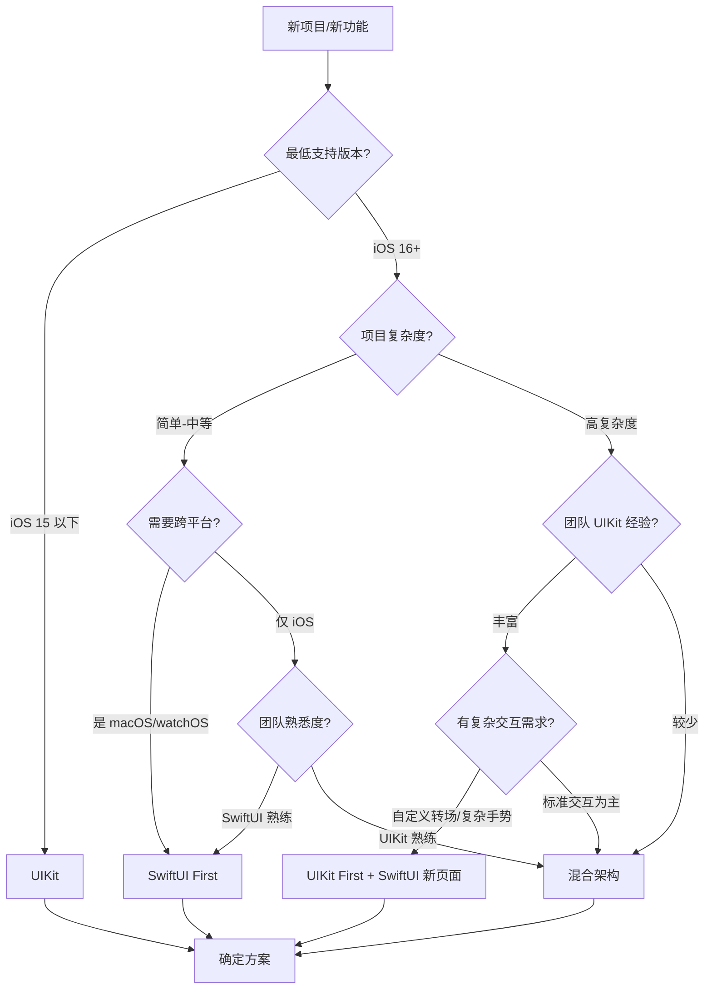

---

## 七、UIKit 的未来演进方向

### 7.1 Apple 的持续投入信号

**核心结论：iOS 16-18/26 中 UIKit 新增 API 的质量和数量表明，Apple 将持续投入 UIKit 的现代化改造，而非将其冻结。**

| 版本 | 代表性新增 API | 改进方向 |
|------|---------------|---------|
| **iOS 16** | `UICalendarView`、`UIEditMenuInteraction`、Self-resizing Cells 默认 | 组件补全 + 行为优化 |
| **iOS 17** | `UIContentUnavailableConfiguration`、Animated Symbol Images、`UITraitDefinition` 自定义 Trait | 声明式配置 + 系统集成 |
| **iOS 18** | `UIUpdateLink`（精确帧同步）、`UITab`/`UITabGroup` 全新架构、SF Symbol 6 | **架构重塑 + 性能突破** |
| **iOS 26** | Liquid Glass 设计语言全面适配、新导航范式 | **视觉系统革新** |

### 7.2 UIKit 的现代化改造

**核心结论：UIKit 的现代化改造呈现三大趋势——声明式配置、组合式布局、统一操作模型，本质是在保持命令式架构的同时吸收声明式理念的优点。**

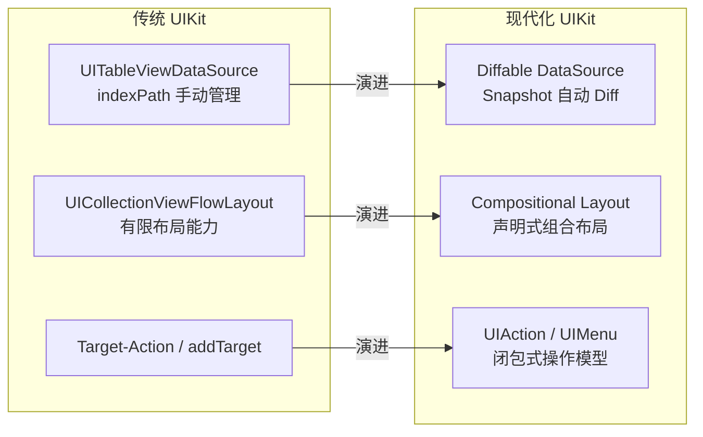

**UIContentConfiguration 体系：** 将 Cell 配置从继承式改为组合式，用声明式结构体替代命令式方法覆写：

```swift
// 现代 UIKit：声明式内容配置
var config = UIListContentConfiguration.cell()
config.text = "标题"
config.secondaryText = "副标题"
config.image = UIImage(systemName: "star")
cell.contentConfiguration = config
```

> 📖 关于 Compositional Layout 和 Diffable DataSource 的详细用法，参见 [UIKit高级组件与自定义](./UIKit高级组件与自定义_详细解析.md)

### 7.3 与 SwiftUI 的深度融合趋势

**核心结论：UIKit 与 SwiftUI 的边界正在模糊化——SwiftUI 底层依赖 UIKit 渲染，UIKit 新 API 吸收声明式设计，两者正走向"统一后端、双前端"的架构。**

| 融合信号 | 具体表现 |
|----------|---------|
| **SwiftUI 底层依赖** | SwiftUI 的 List 底层使用 UICollectionView，NavigationView 底层使用 UINavigationController |
| **API 风格趋同** | UIContentConfiguration 的声明式结构体风格与 SwiftUI 的 View modifier 高度相似 |
| **桥接 API 增强** | 每年优化 UIHostingController 性能，增强 sizing/layout 行为一致性 |
| **共享组件** | SF Symbols、Dynamic Type、Accessibility 等基础设施已完全统一 |
| **Trait 系统统一** | iOS 17 的 UITraitDefinition 与 SwiftUI Environment 概念对齐 |

### 7.4 UIKit 在 visionOS / macOS 的角色

**核心结论：UIKit 通过 Mac Catalyst 在 macOS 上运行，在 visionOS 中作为兼容层支持现有 iPad App，证明其架构的可移植性和 Apple 对其长期投入的信心。**

| 平台 | UIKit 角色 | 实现方式 |
|------|-----------|---------|
| **iOS / iPadOS** | 原生首选框架 | 直接运行 |
| **macOS** | 通过 Catalyst 运行 | UIKit → AppKit 自动桥接 |
| **visionOS** | iPad App 兼容运行 | UIKit App 运行在 2D 兼容模式 |
| **tvOS** | 原生 UI 框架 | UIKit 变体（无触摸，Focus Engine） |
| **watchOS** | ❌ 不支持 | WatchKit → SwiftUI |
| **CarPlay** | 原生支持 | UIWindowScene 多 Scene |

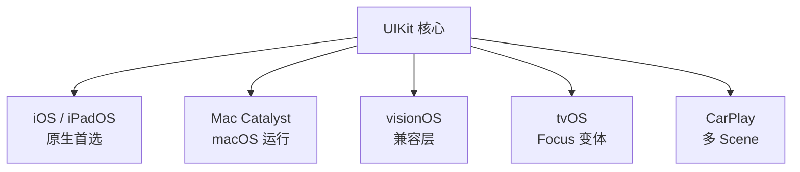

---

## 总结

UIKit 作为 Apple 移动生态的基石框架，经历 17 年持续演进，已形成成熟稳定的六层架构体系。在 SwiftUI 时代，UIKit 并未被边缘化，而是：

1. **持续接受现代化改造** — 声明式配置、组合式布局、统一操作模型
2. **作为 SwiftUI 的底层支撑** — SwiftUI 的渲染后端仍依赖 UIKit/Core Animation
3. **在复杂场景中不可替代** — 自定义转场、复杂手势、TextKit 排版等
4. **跨平台能力持续扩展** — Mac Catalyst、visionOS 兼容、CarPlay 多屏

对于 iOS 开发者而言，深入理解 UIKit 架构不仅是应对当下复杂项目的必备能力，更是理解 SwiftUI 底层行为、做出正确技术选型的基础。

> 📖 **延伸阅读：**
> - [UIKit架构与事件机制](./UIKit架构与事件机制_详细解析.md) — 事件响应链、Hit-Testing、AutoLayout 算法、渲染管线详解
> - [UIKit高级组件与自定义](./UIKit高级组件与自定义_详细解析.md) — Compositional Layout、Diffable DataSource、自定义转场实战
> - [Apple框架生态全景](../01_框架生态与演进/Apple框架生态全景与战略定位_详细解析.md) — Apple 框架整体战略与演进方向
