# UIKit 运行原理深度剖析

> 版本要求: iOS 13+ | Swift 5.5+ | Xcode 14+
> 定位：原理剖析文档，聚焦 UIKit 各核心机制的**运行时行为与内部实现**

---

## 核心结论 TL;DR

| 机制 | 一句话原理总结 |
|------|---------------|
| **事件处理** | 主线程 RunLoop 通过 Source1 接收 IOKit 事件，封装 UIEvent 后经 UIApplication.sendEvent → UIWindow → hitTest 逆序递归定位最终响应者 |
| **布局系统** | Cassowary 单纯形法将约束转化为线性方程组增量求解，updateConstraints → layoutSubviews 两阶段完成布局计算 |
| **渲染管线** | UIView 标记脏区 → CATransaction 在 RunLoop 周期末自动提交 → Render Server 进程接收序列化层树 → GPU 合成帧 |
| **动画系统** | Core Animation 维护 Model/Presentation/Render 三棵层树，动画由 Render Server 在独立进程中插值驱动，不阻塞主线程 |
| **手势识别** | UIGestureRecognizer 状态机独立于响应链运行，在 hitTest 之后、sendEvent 阶段优先拦截触摸，通过竞争仲裁决定最终手势 |

---

## 一、UIApplication 运行循环与事件分发原理

**核心结论：UIApplication 的事件循环本质上是主线程 RunLoop 的一次迭代——从 IOKit 端口接收硬件事件，封装为 UIEvent，经过事件队列调度后分发到视图层级。**

### 1.1 RunLoop 与 UIApplication 的绑定

UIApplication 在启动时通过 `UIApplicationMain` 函数创建主线程 RunLoop，并注册多个 Source/Observer 驱动整个 UI 事件循环。

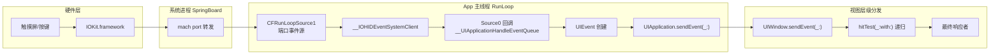

关键绑定关系：

| 组件 | 类型 | 职责 |
|------|------|------|
| **Source1** | mach port 事件源 | 接收 IOKit 的硬件中断事件（触摸、加速计等） |
| **Source0** | 非端口事件源 | 将 Source1 接收的事件转为 UIEvent 并入队 |
| **Observer（BeforeWaiting）** | RunLoop 观察者 | 触发 CATransaction 隐式提交、AutoreleasPool drain |
| **Observer（AfterWaiting）** | RunLoop 观察者 | 处理 GCD 主队列回调、定时器触发 |

### 1.2 RunLoop Mode 对 UI 的影响

**核心结论：RunLoop 在 Default 和 Tracking 两种 Mode 间切换，直接决定了滚动时定时器、网络回调等事件是否被暂停。**

| Mode | 标识符 | 激活时机 | 可运行的事件源 |
|------|--------|----------|---------------|
| **Default** | `kCFRunLoopDefaultMode` | 空闲状态 | NSTimer、performSelector、Source0/1、Observer |
| **Tracking** | `UITrackingRunLoopMode` | UIScrollView 滚动时 | 仅滚动相关的触摸事件和 Source |
| **Common** | `kCFRunLoopCommonModes` | 标记集合（包含上述两者） | 注册到 Common 的 Timer/Source 在两种 Mode 下均可运行 |

Mode 切换的典型影响：

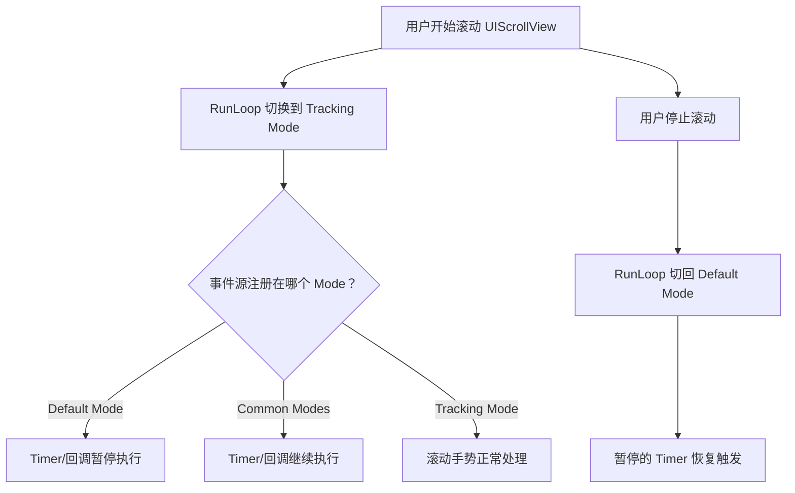

> **实践要点**：`NSTimer` 默认在 Default Mode 运行，滚动时暂停。需要将其加入 `RunLoop.current.add(timer, forMode: .common)` 以保持滚动期间持续触发。

### 1.3 事件队列处理流程

UIEvent 的生命周期从硬件中断到视图响应，经历以下阶段：

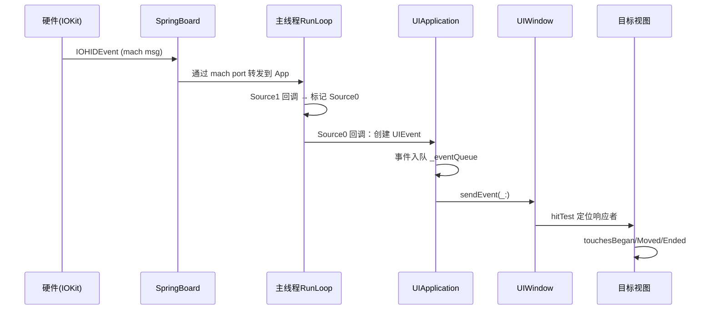

事件队列的关键特性：
- **FIFO 顺序**：UIEvent 按时间戳排序处理
- **合并策略**：连续的 Touch Moved 事件可被合并（coalescedTouches），减少回调频率
- **预测触摸**：iOS 9+ 提供 `predictedTouches(for:)`，用于低延迟绘图场景

### 1.4 App 状态机

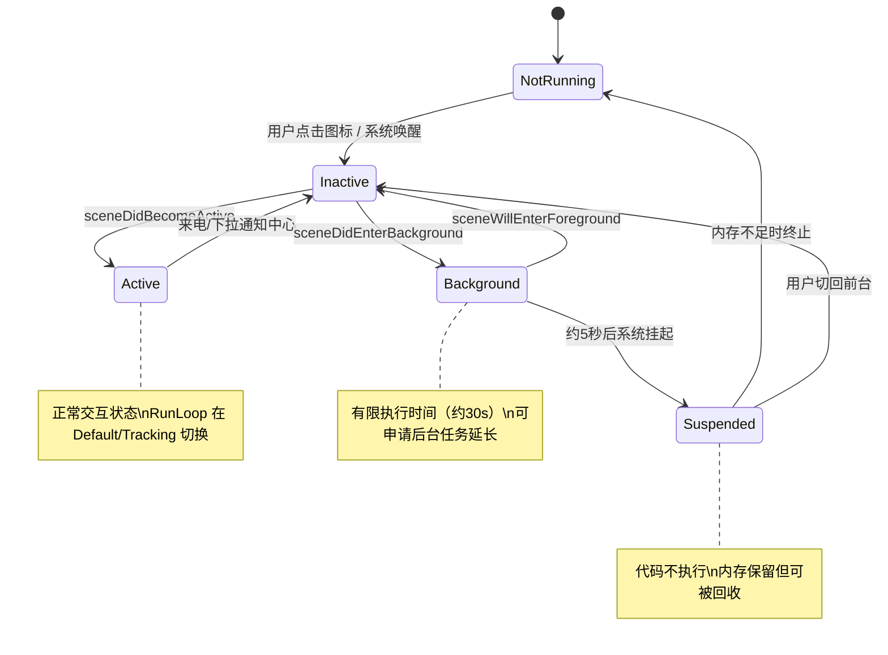

### 1.5 Scene 生命周期与 App 生命周期的交互

**核心结论：iOS 13+ 将 UI 生命周期下沉到 Scene 级别，App 级别仅处理进程事件（启动配置、推送注册、内存警告），多个 Scene 可独立处于不同状态。**

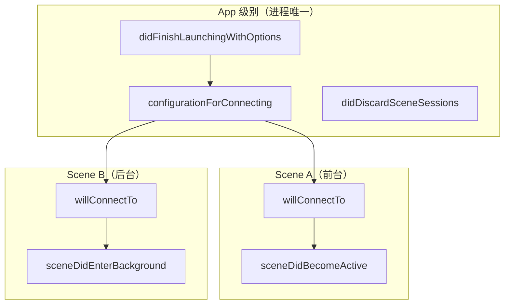

关键交互规则：

| 场景 | App Delegate | Scene Delegate | 说明 |
|------|-------------|---------------|------|
| 冷启动 | `didFinishLaunching` → `configurationForConnecting` | `willConnectTo` → `didBecomeActive` | App 先初始化，再创建 Scene |
| 热切换 | 不调用 | `willResignActive` → `didEnterBackground` | 仅 Scene 状态变化 |
| 后台终止 | `didDiscardSceneSessions` | — | Scene 被系统回收后通知 App |
| 多窗口(iPad) | 各 Scene 独立生命周期 | 各自的 delegate 独立回调 | 一个 foreground + 一个 background 完全可能 |

---

## 二、UIResponder 响应链与 Hit-Testing 算法

**核心结论：Hit-Testing 是一个自顶向下的逆序深度优先搜索，而响应链是自底向上的事件传递链——两者方向相反，协同完成事件的定位与处理。**

### 2.1 Hit-Testing 算法详解

`hitTest(_:with:)` 从 UIWindow 开始递归调用，核心逻辑如下：

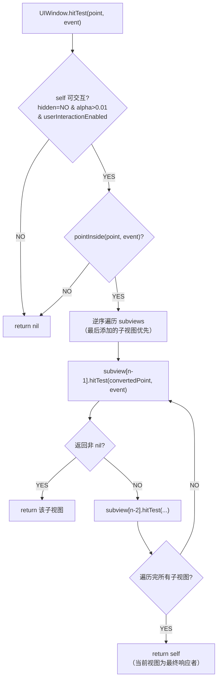

**为什么逆序遍历？** subviews 数组中后添加的视图在视觉上位于上层（z-order 更高），优先响应符合用户期望。

算法伪代码（3行核心逻辑）：

```swift
// hitTest 核心：逆序遍历子视图，递归查找
for subview in subviews.reversed() where subview.canReceiveTouch {
    if let hit = subview.hitTest(convert(point, to: subview), with: event) { return hit }
}
```

### 2.2 pointInside 的坐标变换

**核心结论：每一层 hitTest 调用都需要将触摸点从父视图坐标系变换到子视图坐标系，本质是仿射变换矩阵的逆变换。**

坐标变换过程：

| 步骤 | 操作 | 数学表达 |
|------|------|----------|
| 1 | Window 接收屏幕坐标 `P_screen` | 由 UIScreen 坐标系定义 |
| 2 | 转换到 Window 坐标 | `P_window = P_screen`（通常一致） |
| 3 | 转换到子视图坐标 | `P_child = M_inverse × (P_window - child.frame.origin)` |
| 4 | 考虑 transform | 若子视图有 `CGAffineTransform T`，则 `P_child = T⁻¹ × P_parent_relative` |
| 5 | pointInside 判定 | `0 ≤ P_child.x ≤ bounds.width && 0 ≤ P_child.y ≤ bounds.height` |

> **关键细节**：当视图设置了 `transform`（如旋转45°），hitTest 坐标变换自动应用 `transform` 的逆矩阵，确保触摸区域随视觉变换同步。

### 2.3 响应链构建规则

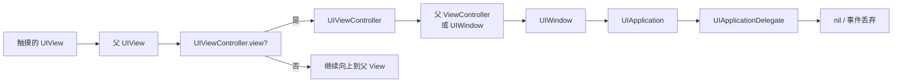

响应链构建的精确规则：

| 当前响应者 | 下一响应者 (next) | 特殊情况 |
|-----------|------------------|----------|
| **UIView** | 父视图 `superview` | 若该 view 是 VC 的 root view，则 next = VC |
| **UIViewController** | 父 VC 或 presenting VC | 若是 root VC，则 next = UIWindow |
| **UIWindow** | UIApplication | — |
| **UIApplication** | UIApplicationDelegate | 仅当 delegate 是 UIResponder 子类时 |

### 2.4 becomeFirstResponder / resignFirstResponder 机制

**核心结论：First Responder 是响应链的起点，决定了非触摸事件（键盘输入、摇晃、远程控制）的第一接收者。其切换触发键盘的显示/隐藏。**

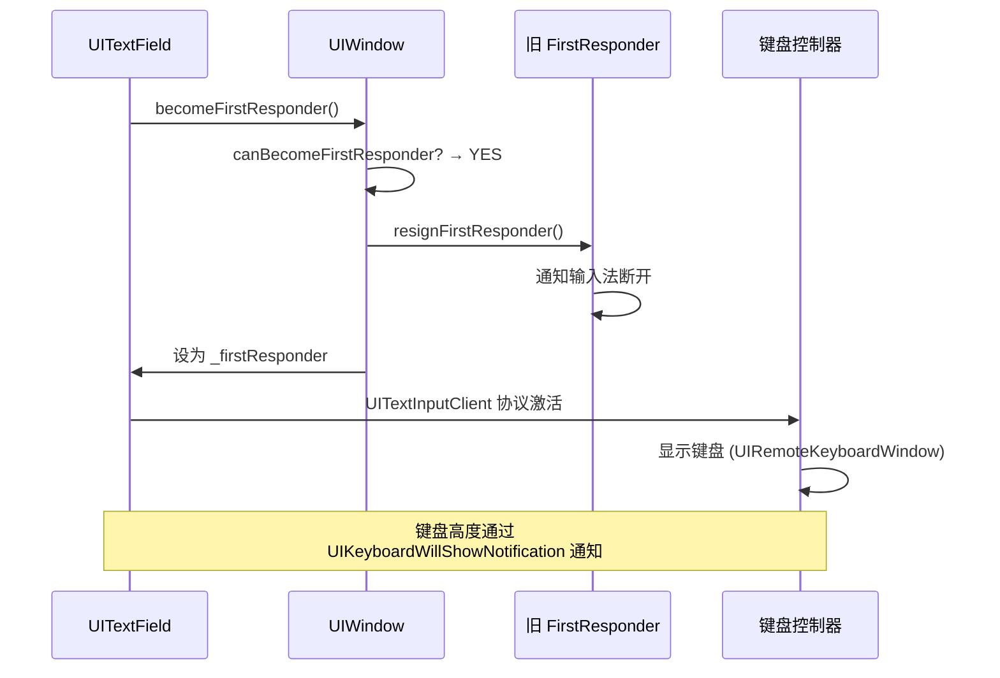

键盘管理的底层链路：
- `becomeFirstResponder` → UIKit 检查 `UITextInput` 协议 → 通知 `UIInputWindowController`
- 键盘实际运行在独立进程 (`textinput_service`)，通过 XPC 通信
- 键盘窗口层级：`UIRemoteKeyboardWindow` (windowLevel = 10000000)

### 2.5 UIControl target-action 与响应链的关系

**核心结论：UIControl 的 target-action 机制建立在响应链之上——当 target 为 nil 时，action 沿响应链向上传递直到找到实现者。**

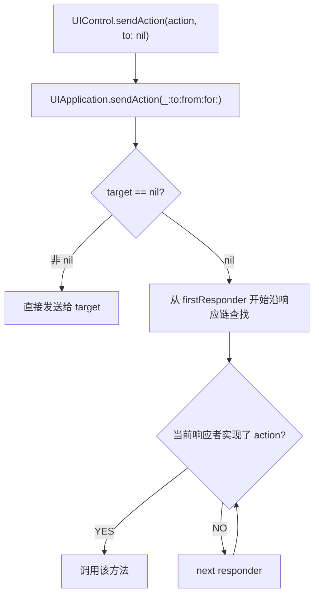

---

## 三、手势识别系统运行原理

**核心结论：UIGestureRecognizer 是一个独立于 UIResponder 的状态机系统，在事件分发链路中拥有优先拦截权——它先于视图的 touches 方法接收事件。**

### 3.1 UIGestureRecognizer 状态机

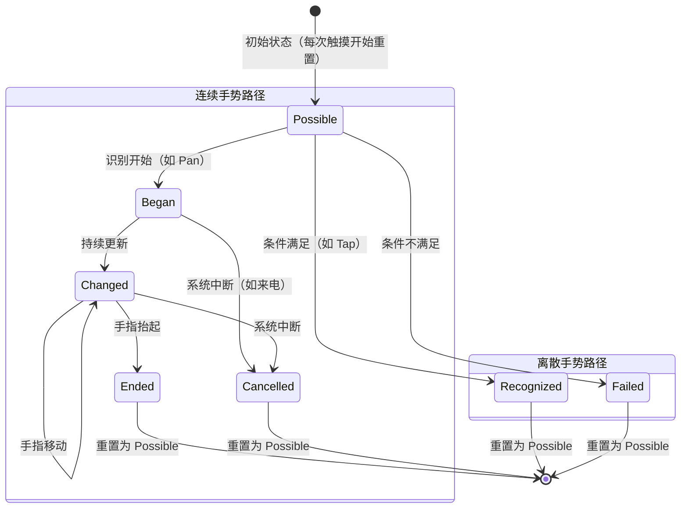

### 3.2 离散手势 vs 连续手势状态转换差异

| 特征 | 离散手势 (Tap/Swipe) | 连续手势 (Pan/Pinch/Rotation) |
|------|---------------------|-------------------------------|
| **状态路径** | Possible → Recognized/Failed | Possible → Began → Changed* → Ended/Cancelled |
| **action 调用次数** | 仅 1 次（Recognized 时） | 多次（Began/Changed/Ended 各一次+） |
| **识别时机** | 手势结束时判定 | 手势过程中持续更新 |
| **典型判定条件** | 触摸次数、时间窗口、移动距离阈值 | 移动距离 > 阈值即开始，持续追踪位移/速度 |
| **Failed 触发** | 超时或移动超阈值 | 极少（通常 Began 后不会 Fail） |

### 3.3 手势识别竞争机制

**核心结论：当多个手势识别器同时接收触摸时，UIKit 通过竞争仲裁机制决定胜出者——默认互斥，可通过 delegate 方法或依赖关系配置共存。**

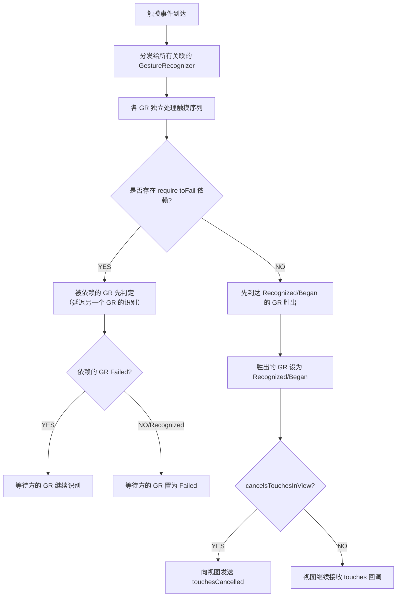

竞争仲裁的优先级规则：

| 优先级 | 规则 | 说明 |
|--------|------|------|
| 1 | `require(toFail:)` 依赖 | 显式指定"等另一个手势失败后我才识别" |
| 2 | `shouldRequireFailure(of:)` delegate | 动态返回依赖关系 |
| 3 | 子视图 GR > 父视图 GR | 默认子视图手势优先（类似 hitTest 逻辑） |
| 4 | 先识别成功者胜出 | 无其他规则时，状态机先转换的手势获胜 |

### 3.4 手势与响应链的协作

**核心结论：手势识别器在 UIWindow.sendEvent 阶段介入，先于视图的 touches 方法。通过三个关键属性控制触摸事件的流向。**

| 属性 | 默认值 | 效果 |
|------|--------|------|
| `cancelsTouchesInView` | true | 手势识别成功后，向视图发 touchesCancelled，阻断后续触摸 |
| `delaysTouchesBegan` | false | 手势处于 Possible 时延迟视图的 touchesBegan（等待手势判定结果） |
| `delaysTouchesEnded` | true | 手势处于 Possible 时延迟视图的 touchesEnded |

事件分发时序（delaysTouchesBegan = false 默认情况）：

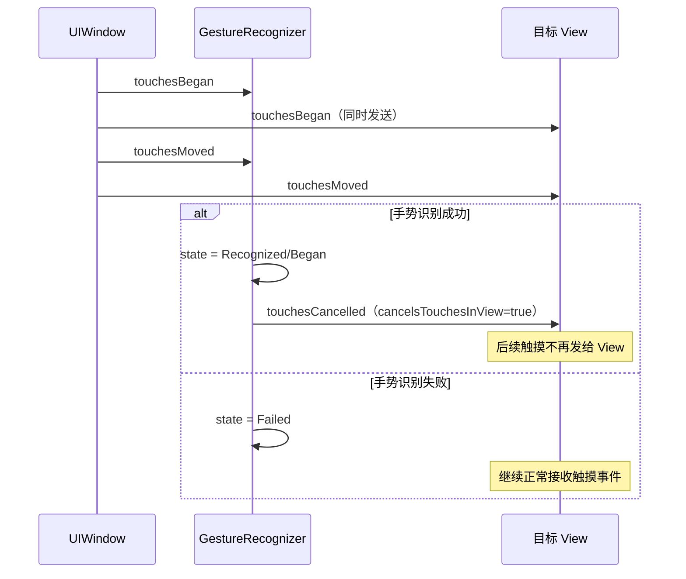

### 3.5 手势识别优先级控制决策流程

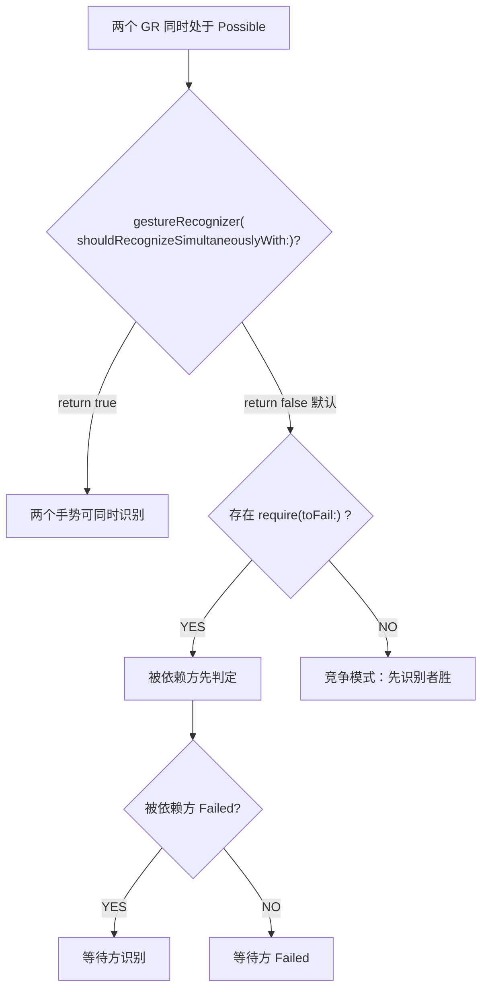

---

## 四、AutoLayout Cassowary 引擎深度剖析

**核心结论：AutoLayout 的核心是 Cassowary 增量约束求解器——将 UI 约束转化为线性方程组，用单纯形法求解，增量更新特性使得单次约束变化不需全局重算。**

### 4.1 Cassowary 算法原理

Cassowary 算法（1998年，Badros & Borning 提出）专为 GUI 约束求解设计，核心优势：

| 特性 | 说明 |
|------|------|
| **线性约束** | 所有约束均为线性等式/不等式：`a₁x₁ + a₂x₂ + ... = c` |
| **单纯形法** | 使用修改版单纯形法求解线性规划问题 |
| **增量求解** | 添加/删除约束时只需增量更新表，不需重新求解整个系统 |
| **优先级** | 支持 required（必须满足）和 optional（尽量满足）约束的混合求解 |

约束到方程的映射：

```
NSLayoutConstraint: view1.attribute1 = multiplier × view2.attribute2 + constant
                              ↓
数学表达: x₁ = m × x₂ + c  →  x₁ - m × x₂ = c（标准线性等式）
```

### 4.2 约束系统架构

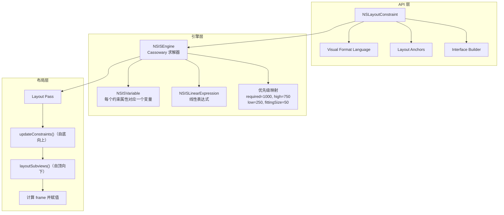

### 4.3 约束求解过程

**核心结论：每个视图的 minX/minY/width/height 对应 4 个求解变量，约束数量决定方程组规模，优先级决定冲突时的取舍策略。**

求解过程分步：

| 步骤 | 操作 | 示例 |
|------|------|------|
| 1. 变量创建 | 每个约束属性 → NSISVariable | `label.leading` → `var_x₁` |
| 2. 方程构建 | 约束 → 线性表达式 | `label.leading = super.leading + 16` → `x₁ = x₀ + 16` |
| 3. 优先级标注 | required 约束为硬约束 | priority=1000 → 必须满足 |
| 4. 增量求解 | 单纯形法迭代至最优解 | 所有变量获得具体数值 |
| 5. 冲突解决 | 低优先级约束可被违反 | priority=250 的约束在冲突时被忽略 |

### 4.4 intrinsicContentSize 机制

**核心结论：intrinsicContentSize 是控件根据内容自动计算的"天然尺寸"，通过 Content Hugging（抗拉伸）和 Compression Resistance（抗压缩）两个优先级参与约束系统。**

| 属性 | 默认优先级 | 约束含义 | 等价约束 |
|------|-----------|----------|----------|
| **Content Hugging** | 250 (low) | 不要比 intrinsicSize 更大 | `width ≤ intrinsicWidth` @ priority |
| **Compression Resistance** | 750 (high) | 不要比 intrinsicSize 更小 | `width ≥ intrinsicWidth` @ priority |

数学模型：intrinsicContentSize 实质上向求解器注入两组不等式约束——

```
// Hugging（抗拉伸）：视图宽度 ≤ 内容宽度，优先级 250
width ≤ intrinsicWidth  @ priority 250

// Compression Resistance（抗压缩）：视图宽度 ≥ 内容宽度，优先级 750
width ≥ intrinsicWidth  @ priority 750
```

> 当两个 UILabel 并排时，Hugging 优先级较低的 Label 会被拉伸填充剩余空间。

### 4.5 AutoLayout 性能特征

| 场景 | 复杂度 | 说明 |
|------|--------|------|
| 线性约束链 | **O(n)** | 约束形成线性依赖链时，增量求解器高效处理 |
| 约束交叉引用 | **O(n²)** | 多视图相互约束形成网状结构，求解器迭代次数增加 |
| 约束变更 | **O(1)~O(n)** | 增量更新通常高效，但大规模删除/添加可能触发重建 |

性能陷阱：

| 陷阱 | 原因 | 影响 |
|------|------|------|
| **约束爆炸** | 嵌套 StackView + 大量子视图 | 变量数指数增长，求解时间急剧上升 |
| **频繁约束修改** | 动画中逐帧更新 constant | 每帧触发增量求解，CPU 负载高 |
| **layoutIfNeeded 滥用** | 在循环中调用 | 强制同步布局计算，阻塞主线程 |
| **translatesAutoresizingMaskIntoConstraints** | 未设为 false | 自动生成冗余约束，与手动约束冲突 |

### 4.6 Layout Pass 流程

**核心结论：Layout Pass 分两阶段——updateConstraints 自底向上收集约束变更，layoutSubviews 自顶向下分配最终 frame。两者由 setNeedsLayout/setNeedsUpdateConstraints 标记触发。**

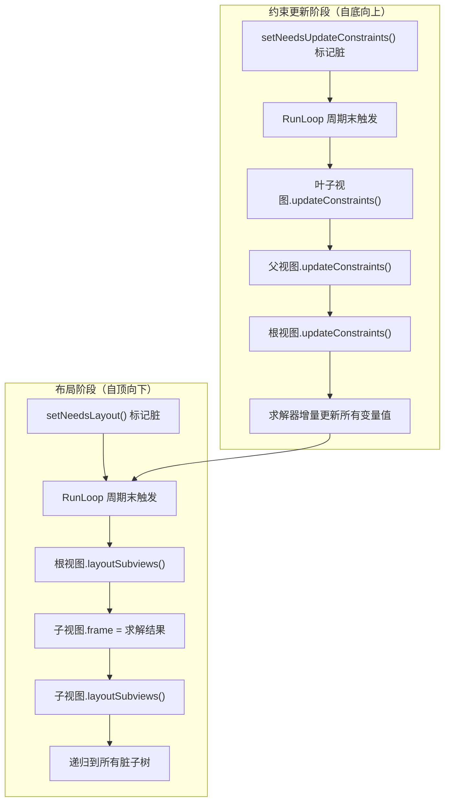

触发条件对比：

| 触发方法 | 行为 | 时机 |
|----------|------|------|
| `setNeedsLayout()` | 标记视图需要重新布局 | 下一个 RunLoop 周期 |
| `layoutIfNeeded()` | 立即执行布局（如果有脏标记） | 同步执行 |
| `setNeedsUpdateConstraints()` | 标记约束需要更新 | 下一个 RunLoop 周期 |
| `updateConstraintsIfNeeded()` | 立即更新约束 | 同步执行 |

### 4.7 与 frame-based 布局的性能对比

| 维度 | Frame-based | AutoLayout |
|------|-------------|------------|
| **计算方式** | 直接赋值 frame/bounds | 约束求解器计算 |
| **简单场景耗时** | ~0 (直接赋值) | 约束构建 + 求解 |
| **复杂场景维护性** | 差（需手动计算所有尺寸） | 好（声明式约束） |
| **屏幕适配** | 需大量条件分支 | 自动适应 |
| **Cell 高度计算** | `sizeThatFits` 手动计算 | `systemLayoutSizeFitting` 自动 |
| **性能瓶颈** | 无（计算量极小） | 约束数量 > 几百时出现可测量延迟 |

---

## 五、UIView 渲染管线与 Core Animation 交互

**核心结论：UIView 的渲染不在主线程完成——UIView 仅负责标记脏区和配置属性，实际像素合成由 Render Server（独立进程）和 GPU 完成，中间通过 CATransaction + IPC 传递层树。**

### 5.1 渲染管线完整流程

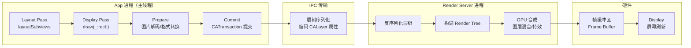

各阶段耗时分布（典型 16.67ms 帧预算）：

| 阶段 | 执行位置 | 典型耗时 | 主要工作 |
|------|----------|----------|----------|
| Layout | App/CPU | 1-3ms | 约束求解、frame 计算 |
| Display | App/CPU | 0-5ms | drawRect 绘制（若有自定义绘制） |
| Prepare | App/CPU | 0-2ms | 图片解码、格式转换 |
| Commit | App→RS/IPC | 1-2ms | 层树序列化、进程间传输 |
| Render | RS/GPU | 2-8ms | 图层合成、特效计算 |

### 5.2 CATransaction 机制

**核心结论：CATransaction 是 Core Animation 的事务管理器——所有 CALayer 属性修改都在事务中执行，隐式事务由 RunLoop Observer 在每个周期末自动提交。**

| 事务类型 | 创建方式 | 提交时机 | 使用场景 |
|----------|----------|----------|----------|
| **隐式事务** | 自动（修改 layer 属性时） | RunLoop BeforeWaiting 时自动提交 | 大部分 UI 更新 |
| **显式事务** | `CATransaction.begin()` | 手动 `CATransaction.commit()` | 需精确控制动画参数 |
| **嵌套事务** | 多次 begin | 每次 commit 对应最内层 begin | 组合不同动画配置 |

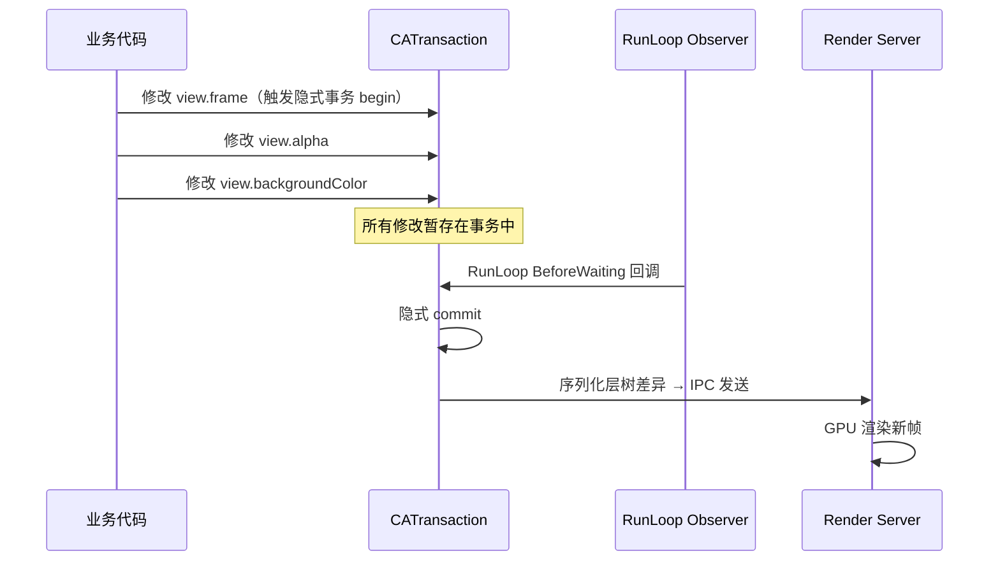

### 5.3 UIView 与 CALayer 的职责分离

**核心结论：UIView 封装了事件处理和响应链逻辑，CALayer 负责实际的视觉内容管理和渲染。这种分离源于 macOS/iOS 共享 Core Animation 的历史设计——macOS 的 NSView 不依赖 layer（可选 layer-backed），而 iOS 的 UIView 始终 layer-backed。**

| 职责 | UIView | CALayer |
|------|--------|---------|
| **触摸事件** | hitTest、touches 方法、手势识别 | 不处理事件 |
| **响应链** | 继承 UIResponder，参与响应链 | 无响应链概念 |
| **渲染内容** | 通过 `draw(_:)` 委托给 layer | `contents` 属性存储渲染位图 |
| **动画** | 高层 API (UIView.animate) | 底层 CAAnimation 实现 |
| **坐标系** | 左上角原点 | 左上角原点（但 anchorPoint 影响变换参考点） |
| **线程安全** | 仅主线程 | 仅主线程（Render Tree 除外） |

架构设计的本质原因：Core Animation 设计为跨平台渲染引擎（macOS + iOS），不绑定任何事件系统。UIView/NSView 各自适配平台事件模型，共享 CALayer 渲染能力。

### 5.4 draw(_:) 原理

**核心结论：`draw(_:)` 是昂贵的 CPU 操作——UIKit 为其创建位图上下文（backing store），所有绘制内容光栅化为位图后赋值给 `layer.contents`，占用大量内存。**

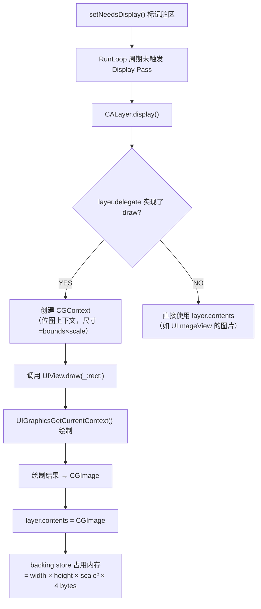

> **内存成本示例**：iPhone 15 Pro Max 全屏 view (2796×1290 @3x) 自定义 draw → backing store ≈ 2796×1290×4 ≈ 13.7MB。

### 5.5 离屏渲染触发条件

**核心结论：离屏渲染（Offscreen Rendering）指 GPU 无法直接单次合成的场景——需要先渲染到额外的帧缓冲区（offscreen buffer），再回读合成。开销在于缓冲区切换（context switch）和额外内存。**

| 触发条件 | 原因 | GPU 处理方式 |
|----------|------|-------------|
| **圆角 + clipsToBounds** | GPU 逐像素合成时需要知道所有子图层的最终像素才能裁剪 | 先离屏渲染所有子图层 → 裁剪 → 回写主缓冲区 |
| **阴影 (shadow)** | 阴影形状需根据 content 的 alpha 通道计算 | 先渲染 content → 提取 alpha → 生成阴影 → 合成 |
| **蒙版 (mask)** | mask 层与 content 层逐像素混合 | 先渲染 content → 渲染 mask → alpha 混合 |
| **光栅化 (shouldRasterize)** | 主动缓存为位图（用于避免重复渲染复杂层树） | 首次离屏渲染 → 缓存位图 → 后续直接使用 |
| **组透明 (allowsGroupOpacity)** | 组内图层需要先合成再整体应用透明度 | 先离屏合成组 → 应用 opacity → 回写 |

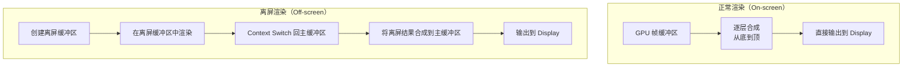

> **优化策略**：设置 `shadowPath` 可避免阴影的离屏渲染（GPU 直接按路径绘制阴影，无需读取 alpha 通道）。

### 5.6 Render Server 进程通信

**核心结论：Render Server（backboardd 的一部分）是独立于 App 的系统进程，通过 IPC（mach message）接收 App 提交的层树，在独立线程中驱动 GPU 渲染——这就是为什么动画在主线程卡顿时仍能流畅。**

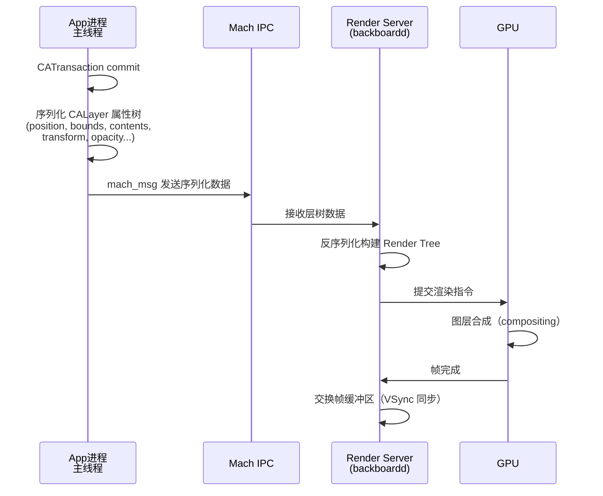

---

## 六、Core Graphics 与 Core Animation 协作原理

**核心结论：UIKit 渲染建立在三层栈之上——UIKit 提供高层 API，Core Animation 管理图层树和 GPU 合成，Core Graphics 提供 CPU 端 2D 绘图能力。Metal 从 iOS 12+ 替代 OpenGL ES 成为 Core Animation 的 GPU 后端。**

### 6.1 三层渲染栈

```mermaid
graph TB
    subgraph "应用层"
        A[UIKit<br/>UIView / UILabel / UIImageView]
    end
    subgraph "框架层"
        B[Core Animation<br/>CALayer / CAAnimation]
        C[Core Graphics<br/>CGContext / CGPath / CGImage]
        D[Core Text<br/>CTFrame / CTLine]
    end
    subgraph "GPU 后端"
        E["Metal (iOS 12+)"]
        F["OpenGL ES (已废弃)"]
    end
    subgraph "硬件"
        G[GPU<br/>图层合成 / 着色器执行]
        H[Display Controller<br/>帧缓冲区 → 屏幕]
    end
    
    A --> B
    A --> C
    A --> D
    B --> E
    B --> F
    C --> B
    D --> C
    E --> G
    F --> G
    G --> H
```

### 6.2 Core Animation 的 Backing Store 模型

**核心结论：每个有内容的 CALayer 都有一个 backing store（位图缓存），存储该层的渲染结果。shouldRasterize 可将整棵子树光栅化为单个位图缓存，以空间换时间。**

| 属性 | 说明 | 内存影响 |
|------|------|----------|
| `contents` | 直接设置 CGImage 作为层内容 | 图片内存 = 宽×高×4字节 |
| `drawsAsynchronously` | 异步绘制（iOS 6+），draw 在后台线程执行 | 额外一份缓冲区 |
| `shouldRasterize` | 将层树光栅化为位图缓存 | 缓存占用 = 层树可视区域×scale²×4字节 |
| `rasterizationScale` | 光栅化分辨率 | 需设为 `screen.scale`，否则模糊 |

shouldRasterize 缓存策略：
- 缓存有效期：约 **100ms** 无变更则保持，超时或属性变更则失效重建
- 缓存上限：约为屏幕面积的 **2.5 倍**
- 适用场景：复杂但**静态**的层树（如圆角+阴影的卡片）
- 不适用：频繁变化的内容（如滚动中的 cell、动画目标层）

### 6.3 Core Graphics 绘图上下文

**核心结论：CGContext 是 Core Graphics 的状态机式绘图引擎，UIKit 在其上层封装了坐标系翻转（UIKit 左上角原点 vs CG 左下角原点）。**

| Context 类型 | 创建方式 | 坐标系 | 用途 |
|-------------|----------|--------|------|
| **Bitmap Context** | `UIGraphicsBeginImageContext` | UIKit（左上角原点） | 离屏图片绘制 |
| **Layer Context** | `draw(_:)` 内自动创建 | UIKit（已翻转） | UIView 自定义绘制 |
| **PDF Context** | `UIGraphicsBeginPDFContext` | CG（左下角原点） | PDF 文档生成 |
| **Raw CG Context** | `CGContext(data:...)` | CG（左下角原点） | 底层位图操作 |

坐标系翻转原理：UIKit 在创建绘图上下文时自动应用 `CGContextTranslateCTM(ctx, 0, height)` + `CGContextScaleCTM(ctx, 1, -1)` 将 CG 坐标系翻转为左上角原点。

### 6.4 GPU 加速边界

**核心结论：Core Animation 的合成（compositing）操作在 GPU 执行，但文本渲染和自定义 draw 在 CPU 执行——识别 CPU/GPU 边界是渲染优化的关键。**

| 操作 | 执行端 | 说明 |
|------|--------|------|
| 图层合成（compositing） | **GPU** | 多个层的混合、叠加 |
| 仿射变换（transform） | **GPU** | 平移/旋转/缩放/3D |
| 透明度（opacity） | **GPU** | alpha 混合 |
| 圆角（无裁剪） | **GPU** | `cornerRadius` 不配合 `masksToBounds` |
| `draw(_:)` 绘制 | **CPU** | Core Graphics 光栅化 |
| 文本渲染 | **CPU** | Core Text 排版 + 光栅化 |
| 图片解码 | **CPU** | 压缩格式 → RGBA 位图 |
| 圆角 + 裁剪 | **GPU (离屏)** | 需要离屏缓冲区 |
| 阴影（无 shadowPath） | **GPU (离屏)** | 需读取 alpha 通道 |

### 6.5 Metal 在 UIKit 渲染中的角色

**核心结论：iOS 12+ Core Animation 的 GPU 后端从 OpenGL ES 迁移到 Metal，这是透明的底层变更——UIKit/Core Animation API 不变，但底层渲染指令和着色器由 Metal 驱动。**

| 版本 | GPU 后端 | 变化 |
|------|---------|------|
| iOS 2-11 | OpenGL ES | Core Animation 用 GL 指令合成图层 |
| iOS 12+ | Metal | 图层合成、特效均通过 Metal 命令缓冲区 |
| macOS 14+ | Metal 3 | 进一步优化合成管线 |

Metal 后端带来的改进：
- **渲染效率**：Metal 的低开销驱动模型减少 CPU→GPU 指令提交延迟
- **着色器优化**：图层混合、模糊等特效使用 Metal Shader 实现，性能优于 GL
- **统一内存**：Apple Silicon 上 CPU/GPU 共享内存，减少纹理上传开销

---

## 七、动画系统运行原理

**核心结论：Core Animation 的动画不在 App 进程执行——动画参数由 App 提交到 Render Server，后者在 VSync 信号驱动下逐帧插值，这就是为什么主线程卡顿时动画仍能流畅运行。**

### 7.1 Core Animation 三棵层树

```mermaid
graph TB
    subgraph "App 进程"
        A["Model Layer Tree<br/>（layer.position = 目标值）<br/>记录最终状态"]
        B["Presentation Layer Tree<br/>（layer.presentation()）<br/>当前显示的中间值"]
    end
    subgraph "Render Server 进程"
        C["Render Tree<br/>（私有，不可访问）<br/>实际驱动 GPU 渲染"]
    end
    
    A -->|"commit 时同步"| C
    C -->|"每帧插值结果"| B
```

三棵树的职责对比：

| 层树 | 访问方式 | 值类型 | 更新时机 |
|------|----------|--------|----------|
| **Model Tree** | `layer.position` | 动画目标值（终态） | 代码设置属性时立即更新 |
| **Presentation Tree** | `layer.presentation()?.position` | 当前插值中间值 | 每帧由 Render Server 回写 |
| **Render Tree** | 不可访问 | 实际渲染值 | Render Server 每帧更新 |

> **关键理解**：调用 `layer.position = newValue` 时，Model Tree 立即变为 newValue，但屏幕上看到的是 Presentation Tree 从旧值渐变到 newValue 的过程。

### 7.2 隐式动画 vs 显式动画

**核心结论：隐式动画由 CALayer 属性修改自动触发（通过 actionForKey 查找），UIView 的属性修改默认禁用隐式动画——只有在 UIView.animate 闭包内才会重新启用。**

| 特征 | 隐式动画 | 显式动画 |
|------|----------|----------|
| **触发方式** | 修改 CALayer 可动画属性 | 创建 CAAnimation 并 add 到 layer |
| **UIView 行为** | 默认禁用（返回 NSNull） | `UIView.animate` 内启用 |
| **配置灵活度** | 仅 duration/timingFunction | 完整控制（keyPath/keyTimes/values） |
| **底层机制** | `actionForKey:` → CABasicAnimation | 直接创建 CAAnimation 子类 |
| **禁用原因** | UIView 重写 `action(for:forKey:)` 在动画块外返回 nil | — |

隐式动画的查找链：

```mermaid
flowchart TB
    A["layer.position = newValue"] --> B["layer.actionForKey('position')"]
    B --> C{"layer.delegate（UIView）<br/>action(for:forKey:)?"}
    C -->|"动画块外：返回 NSNull"| D[无动画，直接设值]
    C -->|"UIView.animate 块内：返回 CABasicAnimation"| E[创建隐式动画]
    E --> F["CATransaction 收集动画"]
    F --> G["commit 时提交到 Render Server"]
```

### 7.3 UIView.animate 底层原理

**核心结论：`UIView.animate` 的本质是开启一个 CATransaction，设置动画参数，然后在闭包中修改属性——闭包内的属性修改通过 actionForKey 机制自动生成 CABasicAnimation。**

```mermaid
sequenceDiagram
    participant Code as 业务代码
    participant UV as UIView
    participant TX as CATransaction
    participant Layer as CALayer
    participant RS as Render Server

    Code->>UV: UIView.animate(duration:animations:)
    UV->>TX: CATransaction.begin()
    UV->>TX: setAnimationDuration(duration)
    UV->>TX: setAnimationTimingFunction(...)
    UV->>TX: 设置内部标志位：_inAnimationBlock = true
    
    Code->>Layer: 闭包内：view.alpha = 0.5
    Layer->>Layer: actionForKey("opacity")
    Layer->>UV: delegate.action(for:forKey:)
    UV->>UV: _inAnimationBlock = true → 返回 CABasicAnimation
    Note over Layer: fromValue=当前值, toValue=0.5
    
    UV->>TX: CATransaction.commit()
    TX->>RS: 提交动画到 Render Server
    RS->>RS: 每帧按 timingFunction 插值
```

### 7.4 Spring 动画物理模型

**核心结论：Spring 动画模拟阻尼弹簧的物理运动方程 `m·x'' + c·x' + k·x = 0`，iOS 通过 damping ratio 和 initial velocity 参数化控制弹性行为。**

弹簧方程参数映射：

| 物理参数 | UIKit 参数 | 说明 |
|----------|-----------|------|
| 质量 m | 内部固定 = 1 | 简化模型 |
| 弹性系数 k | 由 `duration` 推导 | 自然频率 ω₀ = √(k/m) |
| 阻尼系数 c | `dampingRatio` (0~1) | ζ = c / (2√(mk))；1.0 = 临界阻尼（无回弹） |
| 初速度 v₀ | `initialVelocity` | 手势释放速度 → 动画初始速度 |

阻尼比的视觉效果：

| dampingRatio | 行为 | 典型使用 |
|-------------|------|----------|
| 1.0 | 临界阻尼，平滑到达终点无回弹 | 一般 UI 转场 |
| 0.7~0.9 | 轻微回弹 | iOS 系统交互默认值 |
| 0.3~0.6 | 明显回弹 | 弹性卡片、趣味动效 |
| < 0.3 | 强烈振荡 | 极少使用 |

### 7.5 动画与 RunLoop 的关系

**核心结论：CADisplayLink 是连接 RunLoop 与屏幕刷新的桥梁——它在每个 VSync 信号时触发回调，驱动帧同步操作（自定义动画、游戏循环）。Core Animation 内建动画不需要 CADisplayLink，因为插值在 Render Server 中完成。**

```mermaid
graph TB
    subgraph "帧同步机制"
        A[Display VSync 信号<br/>60/120Hz] --> B[CADisplayLink 回调]
        B --> C[RunLoop 处理回调]
        C --> D{动画类型?}
        D -->|Core Animation 内建| E["Render Server 独立插值<br/>不依赖 App RunLoop"]
        D -->|自定义帧动画| F["CADisplayLink 驱动<br/>每帧手动更新属性"]
        D -->|UIScrollView 惯性| G["_UIScrollViewDecelerationRate<br/>RunLoop Tracking Mode"]
    end
```

CADisplayLink vs NSTimer 对比：

| 特性 | CADisplayLink | NSTimer |
|------|--------------|---------|
| 触发精度 | VSync 同步，帧级精度 | 最小 50ms 分辨率 |
| 帧率感知 | `targetTimestamp` 提供预期帧时间 | 无帧率概念 |
| 自适应帧率 | `preferredFrameRateRange` (iOS 15+) | 固定间隔 |
| RunLoop Mode | 需手动加入 `.common` | 同 |
| 适用场景 | 动画、游戏循环、绘图 | 定时任务、周期事件 |

---

## 交叉引用

- UIKit 架构基础与事件分发详解 → [UIKit架构与事件机制](./UIKit架构与事件机制_详细解析.md)
- ObjC Runtime 消息机制（响应链底层） → [ObjC Runtime与消息机制](../04_底层运行机制/ObjC_Runtime与消息机制_详细解析.md)
- Core Animation 渲染管线性能优化 → [渲染性能与能耗优化](../06_性能优化框架/渲染性能与能耗优化_详细解析.md)

---

> **文档定位**：本文聚焦 UIKit 核心机制的运行原理剖析，与 [UIKit架构与事件机制](./UIKit架构与事件机制_详细解析.md) 形成互补——前者侧重架构全景与 API 使用，本文深入每个机制的内部实现逻辑。
