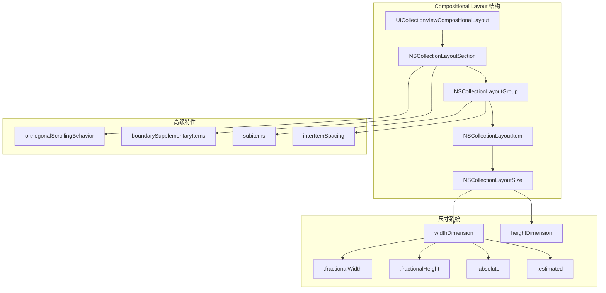
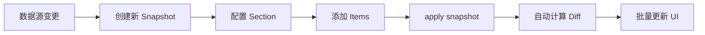
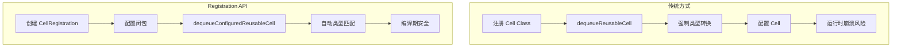
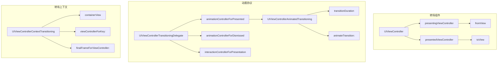
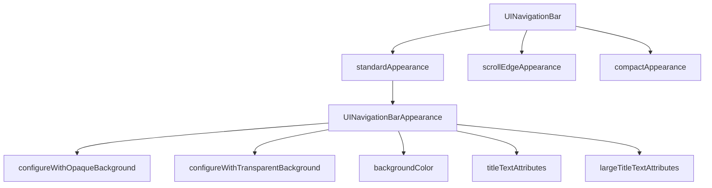
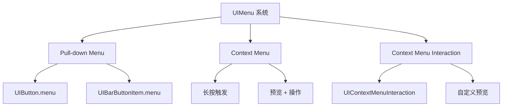

# UIKit 高级组件与自定义深度解析

> 版本要求: iOS 14+ | Swift 5.5+ | Xcode 14+

---

## 核心结论 TL;DR

| 特性 | 核心结论 | 版本要求 |
|------|----------|----------|
| **Compositional Layout** | 通过 NSCollectionLayoutSection/Group/Item 声明式定义布局，支持正交滚动和复杂嵌套 | iOS 13+ |
| **Diffable DataSource** | 使用 NSDiffableDataSourceSnapshot 自动计算差分更新，消除 indexPath 崩溃风险 | iOS 13+ |
| **Cell Registration** | UICollectionView.CellRegistration 实现类型安全的 Cell 注册与配置 | iOS 14+ |
| **自定义转场** | 实现 UIViewControllerTransitioningDelegate 和 UIViewControllerAnimatedTransitioning 控制转场动画 | iOS 7+ |
| **导航栏现代化** | UINavigationBarAppearance 统一配置导航栏外观，支持滚动边缘外观变化 | iOS 13+ |
| **UIMenu 系统** | UIAction + UIMenu 替代传统 UIAlertController 和 UIBarButtonItem 操作 | iOS 14+ |
| **UISheetPresentation** | UISheetPresentationController 实现半屏弹窗，支持自定义 detent 高度 | iOS 15+ |

---

## 一、UICollectionView 现代化

### 1.1 Compositional Layout 架构

**核心结论：Compositional Layout 通过 NSCollectionLayoutSection/Group/Item 三层结构声明式定义布局，支持正交滚动、嵌套组和动态尺寸，是现代 CollectionView 布局的标准方案。**

#### 架构层次图



#### 尺寸维度详解

| 维度类型 | 说明 | 示例 |
|----------|------|------|
| `.fractionalWidth(0.5)` | 容器宽度的 50% | 两列网格 |
| `.fractionalHeight(1.0)` | 容器高度的 100% | 等高布局 |
| `.absolute(100)` | 固定 100pt | 固定尺寸 |
| `.estimated(200)` | 预估 200pt，实际由内容决定 | 自适应高度 |

### 1.2 常见布局模式实现

```swift
// Swift: 列表布局
func createListLayout() -> UICollectionViewLayout {
    let itemSize = NSCollectionLayoutSize(
        widthDimension: .fractionalWidth(1.0),
        heightDimension: .estimated(44)
    )
    let item = NSCollectionLayoutItem(layoutSize: itemSize)
    
    let groupSize = NSCollectionLayoutSize(
        widthDimension: .fractionalWidth(1.0),
        heightDimension: .estimated(44)
    )
    let group = NSCollectionLayoutGroup.horizontal(
        layoutSize: groupSize,
        subitems: [item]
    )
    
    let section = NSCollectionLayoutSection(group: group)
    section.interGroupSpacing = 8
    section.contentInsets = NSDirectionalEdgeInsets(top: 16, leading: 16, bottom: 16, trailing: 16)
    
    return UICollectionViewCompositionalLayout(section: section)
}

// Swift: 网格布局
func createGridLayout() -> UICollectionViewLayout {
    let itemSize = NSCollectionLayoutSize(
        widthDimension: .fractionalWidth(0.5),
        heightDimension: .fractionalHeight(1.0)
    )
    let item = NSCollectionLayoutItem(layoutSize: itemSize)
    item.contentInsets = NSDirectionalEdgeInsets(top: 4, leading: 4, bottom: 4, trailing: 4)
    
    let groupSize = NSCollectionLayoutSize(
        widthDimension: .fractionalWidth(1.0),
        heightDimension: .fractionalWidth(0.5)
    )
    let group = NSCollectionLayoutGroup.horizontal(
        layoutSize: groupSize,
        subitem: item,
        count: 2
    )
    
    let section = NSCollectionLayoutSection(group: group)
    return UICollectionViewCompositionalLayout(section: section)
}

// Swift: 正交滚动布局
func createOrthogonalScrollLayout() -> UICollectionViewLayout {
    let itemSize = NSCollectionLayoutSize(
        widthDimension: .fractionalWidth(1.0),
        heightDimension: .fractionalHeight(1.0)
    )
    let item = NSCollectionLayoutItem(layoutSize: itemSize)
    
    let groupSize = NSCollectionLayoutSize(
        widthDimension: .fractionalWidth(0.8),
        heightDimension: .absolute(200)
    )
    let group = NSCollectionLayoutGroup.horizontal(
        layoutSize: groupSize,
        subitems: [item]
    )
    
    let section = NSCollectionLayoutSection(group: group)
    section.orthogonalScrollingBehavior = .groupPagingCentered
    section.interGroupSpacing = 16
    
    return UICollectionViewCompositionalLayout(section: section)
}

// Swift: 复杂嵌套布局
func createComplexLayout() -> UICollectionViewLayout {
    UICollectionViewCompositionalLayout { sectionIndex, layoutEnvironment in
        switch sectionIndex {
        case 0:
            return self.createBannerSection()
        case 1:
            return self.createCategoriesSection()
        case 2:
            return self.createProductsSection()
        default:
            return self.createDefaultSection()
        }
    }
}

private func createBannerSection() -> NSCollectionLayoutSection {
    let itemSize = NSCollectionLayoutSize(
        widthDimension: .fractionalWidth(1.0),
        heightDimension: .fractionalHeight(1.0)
    )
    let item = NSCollectionLayoutItem(layoutSize: itemSize)
    
    let groupSize = NSCollectionLayoutSize(
        widthDimension: .fractionalWidth(1.0),
        heightDimension: .absolute(180)
    )
    let group = NSCollectionLayoutGroup.horizontal(layoutSize: groupSize, subitems: [item])
    
    let section = NSCollectionLayoutSection(group: group)
    section.orthogonalScrollingBehavior = .paging
    return section
}

private func createCategoriesSection() -> NSCollectionLayoutSection {
    let itemSize = NSCollectionLayoutSize(
        widthDimension: .absolute(80),
        heightDimension: .absolute(80)
    )
    let item = NSCollectionLayoutItem(layoutSize: itemSize)
    
    let groupSize = NSCollectionLayoutSize(
        widthDimension: .estimated(400),
        heightDimension: .absolute(80)
    )
    let group = NSCollectionLayoutGroup.horizontal(layoutSize: groupSize, subitems: [item])
    group.interItemSpacing = .fixed(12)
    
    let section = NSCollectionLayoutSection(group: group)
    section.orthogonalScrollingBehavior = .continuous
    section.contentInsets = NSDirectionalEdgeInsets(top: 16, leading: 16, bottom: 16, trailing: 16)
    
    // 添加 Section Header
    let headerSize = NSCollectionLayoutSize(
        widthDimension: .fractionalWidth(1.0),
        heightDimension: .estimated(44)
    )
    let header = NSCollectionLayoutBoundarySupplementaryItem(
        layoutSize: headerSize,
        elementKind: UICollectionView.elementKindSectionHeader,
        alignment: .top
    )
    section.boundarySupplementaryItems = [header]
    
    return section
}

private func createProductsSection() -> NSCollectionLayoutSection {
    // 嵌套组：左侧大图 + 右侧两个小图
    let largeItemSize = NSCollectionLayoutSize(
        widthDimension: .fractionalWidth(0.5),
        heightDimension: .fractionalHeight(1.0)
    )
    let largeItem = NSCollectionLayoutItem(layoutSize: largeItemSize)
    
    let smallItemSize = NSCollectionLayoutSize(
        widthDimension: .fractionalWidth(1.0),
        heightDimension: .fractionalHeight(0.5)
    )
    let smallItem = NSCollectionLayoutItem(layoutSize: smallItemSize)
    
    let smallGroupSize = NSCollectionLayoutSize(
        widthDimension: .fractionalWidth(0.5),
        heightDimension: .fractionalHeight(1.0)
    )
    let smallGroup = NSCollectionLayoutGroup.vertical(
        layoutSize: smallGroupSize,
        subitem: smallItem,
        count: 2
    )
    smallGroup.interItemSpacing = .fixed(8)
    
    let mainGroupSize = NSCollectionLayoutSize(
        widthDimension: .fractionalWidth(1.0),
        heightDimension: .absolute(200)
    )
    let mainGroup = NSCollectionLayoutGroup.horizontal(
        layoutSize: mainGroupSize,
        subitems: [largeItem, smallGroup]
    )
    mainGroup.interItemSpacing = .fixed(8)
    
    let section = NSCollectionLayoutSection(group: mainGroup)
    section.interGroupSpacing = 8
    section.contentInsets = NSDirectionalEdgeInsets(top: 0, leading: 16, bottom: 16, trailing: 16)
    
    return section
}
```

```objc
// Objective-C: Compositional Layout
@interface CompositionalLayoutDemo : NSObject
- (UICollectionViewLayout *)createListLayout;
- (UICollectionViewLayout *)createGridLayout;
@end

@implementation CompositionalLayoutDemo

- (UICollectionViewLayout *)createListLayout {
    NSCollectionLayoutSize *itemSize = [NSCollectionLayoutSize 
        sizeWithWidthDimension:[NSCollectionLayoutDimension fractionalWidthDimension:1.0]
               heightDimension:[NSCollectionLayoutDimension estimatedDimension:44]];
    NSCollectionLayoutItem *item = [NSCollectionLayoutItem itemWithLayoutSize:itemSize];
    
    NSCollectionLayoutSize *groupSize = [NSCollectionLayoutSize 
        sizeWithWidthDimension:[NSCollectionLayoutDimension fractionalWidthDimension:1.0]
               heightDimension:[NSCollectionLayoutDimension estimatedDimension:44]];
    NSCollectionLayoutGroup *group = [NSCollectionLayoutGroup 
        horizontalGroupWithLayoutSize:groupSize 
        subitems:@[item]];
    
    NSCollectionLayoutSection *section = [NSCollectionLayoutSection sectionWithGroup:group];
    section.interGroupSpacing = 8;
    section.contentInsets = NSDirectionalEdgeInsetsMake(16, 16, 16, 16);
    
    return [[UICollectionViewCompositionalLayout alloc] initWithSection:section];
}

- (UICollectionViewLayout *)createGridLayout {
    NSCollectionLayoutSize *itemSize = [NSCollectionLayoutSize 
        sizeWithWidthDimension:[NSCollectionLayoutDimension fractionalWidthDimension:0.5]
               heightDimension:[NSCollectionLayoutDimension fractionalHeightDimension:1.0]];
    NSCollectionLayoutItem *item = [NSCollectionLayoutItem itemWithLayoutSize:itemSize];
    item.contentInsets = NSDirectionalEdgeInsetsMake(4, 4, 4, 4);
    
    NSCollectionLayoutSize *groupSize = [NSCollectionLayoutSize 
        sizeWithWidthDimension:[NSCollectionLayoutDimension fractionalWidthDimension:1.0]
               heightDimension:[NSCollectionLayoutDimension fractionalWidthDimension:0.5]];
    NSCollectionLayoutGroup *group = [NSCollectionLayoutGroup 
        horizontalGroupWithLayoutSize:groupSize 
        subitem:item 
        count:2];
    
    NSCollectionLayoutSection *section = [NSCollectionLayoutSection sectionWithGroup:group];
    return [[UICollectionViewCompositionalLayout alloc] initWithSection:section];
}

@end
```

### 1.3 正交滚动行为对比

| 行为 | 效果 | 使用场景 |
|------|------|----------|
| `.none` | 无正交滚动 | 标准垂直列表 |
| `.continuous` | 连续滚动 | 横向滚动列表 |
| `.continuousGroupLeading` | 从组起始连续滚动 | 对齐需求 |
| `.paging` | 分页滚动 | Banner 轮播 |
| `.groupPaging` | 按组分页 | 卡片切换 |
| `.groupPagingCentered` | 居中组分页 | 居中卡片 |

---

## 二、Diffable DataSource

### 2.1 差分更新机制

**核心结论：Diffable DataSource 使用 NSDiffableDataSourceSnapshot 自动计算数据源差异，通过 Hashable 标识唯一性，消除传统 indexPath 计算错误导致的崩溃。**

#### 架构图



#### 与传统方式对比

| 特性 | 传统 UICollectionViewDataSource | Diffable DataSource |
|------|----------------------------------|---------------------|
| **数据标识** | IndexPath | Hashable ID |
| **更新方式** | 手动计算 indexPath | 自动计算差异 |
| **动画支持** | 手动实现 | 内置动画 |
| **崩溃风险** | 高（indexPath 不匹配） | 低（自动同步） |
| **代码复杂度** | 高 | 低 |
| **版本要求** | iOS 6+ | iOS 13+ |

### 2.2 代码实现示例

```swift
// Swift: Diffable DataSource 完整实现
import UIKit

// MARK: - 数据模型
struct Product: Hashable {
    let id = UUID()
    let name: String
    let price: Double
    let imageURL: String?
    
    func hash(into hasher: inout Hasher) {
        hasher.combine(id)
    }
}

enum Section: Hashable {
    case featured
    case categories
    case products(categoryId: String)
}

// MARK: - ViewController
class DiffableCollectionViewController: UIViewController {
    
    private var collectionView: UICollectionView!
    private var dataSource: UICollectionViewDiffableDataSource<Section, Product>!
    
    private var products: [Product] = []
    
    override func viewDidLoad() {
        super.viewDidLoad()
        setupCollectionView()
        configureDataSource()
        loadInitialData()
    }
    
    private func setupCollectionView() {
        collectionView = UICollectionView(frame: view.bounds, collectionViewLayout: createLayout())
        collectionView.autoresizingMask = [.flexibleWidth, .flexibleHeight]
        view.addSubview(collectionView)
    }
    
    // MARK: - DataSource 配置
    private func configureDataSource() {
        // Cell Registration (iOS 14+)
        let cellRegistration = UICollectionView.CellRegistration<ProductCell, Product> { cell, indexPath, product in
            cell.configure(with: product)
        }
        
        // 创建 DataSource
        dataSource = UICollectionViewDiffableDataSource<Section, Product>(
            collectionView: collectionView
        ) { collectionView, indexPath, product in
            return collectionView.dequeueConfiguredReusableCell(
                using: cellRegistration,
                for: indexPath,
                item: product
            )
        }
        
        // 配置 Supplementary View
        let headerRegistration = UICollectionView.SupplementaryRegistration<TitleHeaderView>(
            elementKind: UICollectionView.elementKindSectionHeader
        ) { supplementaryView, elementKind, indexPath in
            if let section = self.dataSource.sectionIdentifier(for: indexPath.section) {
                supplementaryView.titleLabel.text = self.titleForSection(section)
            }
        }
        
        dataSource.supplementaryViewProvider = { collectionView, kind, indexPath in
            return collectionView.dequeueConfiguredReusableSupplementary(
                using: headerRegistration,
                for: indexPath
            )
        }
    }
    
    private func titleForSection(_ section: Section) -> String {
        switch section {
        case .featured:
            return "精选推荐"
        case .categories:
            return "分类"
        case .products(let categoryId):
            return "分类: \(categoryId)"
        }
    }
    
    // MARK: - 数据更新
    private func loadInitialData() {
        var snapshot = NSDiffableDataSourceSnapshot<Section, Product>()
        
        // 添加 Section
        snapshot.appendSections([.featured, .categories])
        
        // 添加 Items
        let featuredProducts = [
            Product(name: "iPhone 15 Pro", price: 7999, imageURL: nil),
            Product(name: "MacBook Pro", price: 14999, imageURL: nil)
        ]
        snapshot.appendItems(featuredProducts, toSection: .featured)
        
        let categoryProducts = [
            Product(name: "手机", price: 0, imageURL: nil),
            Product(name: "电脑", price: 0, imageURL: nil),
            Product(name: "平板", price: 0, imageURL: nil)
        ]
        snapshot.appendItems(categoryProducts, toSection: .categories)
        
        // 应用更新（带动画）
        dataSource.apply(snapshot, animatingDifferences: true)
    }
    
    // MARK: - 动态更新
    func updateProducts(_ newProducts: [Product]) {
        var snapshot = dataSource.snapshot()
        
        // 获取或创建产品 Section
        let productSection = Section.products(categoryId: "all")
        if !snapshot.sectionIdentifiers.contains(productSection) {
            snapshot.appendSections([productSection])
        }
        
        // 删除旧数据，添加新数据
        let existingItems = snapshot.itemIdentifiers(inSection: productSection)
        snapshot.deleteItems(existingItems)
        snapshot.appendItems(newProducts, toSection: productSection)
        
        dataSource.apply(snapshot, animatingDifferences: true)
    }
    
    // MARK: - 搜索过滤
    func filterProducts(with query: String) {
        let allProducts = products.filter { $0.name.contains(query) }
        
        var snapshot = NSDiffableDataSourceSnapshot<Section, Product>()
        snapshot.appendSections([.products(categoryId: "search")])
        snapshot.appendItems(allProducts)
        
        dataSource.apply(snapshot, animatingDifferences: true)
    }
    
    // MARK: - Section Snapshot（iOS 14+ 嵌套列表）
    func configureOutlineDataSource() {
        // 用于 UICollectionViewListCell 的嵌套数据
        var sectionSnapshot = NSDiffableDataSourceSectionSnapshot<Product>()
        
        let parent = Product(name: "电子产品", price: 0, imageURL: nil)
        let children = [
            Product(name: "手机", price: 0, imageURL: nil),
            Product(name: "电脑", price: 0, imageURL: nil)
        ]
        
        sectionSnapshot.append([parent])
        sectionSnapshot.append(children, to: parent)
        sectionSnapshot.expand([parent])
        
        // 应用到具体 section
        // dataSource.apply(sectionSnapshot, to: .categories, animatingDifferences: true)
    }
}

// MARK: - Cell 实现
class ProductCell: UICollectionViewCell {
    let imageView = UIImageView()
    let nameLabel = UILabel()
    let priceLabel = UILabel()
    
    override init(frame: CGRect) {
        super.init(frame: frame)
        setupViews()
    }
    
    required init?(coder: NSCoder) {
        fatalError("init(coder:) has not been implemented")
    }
    
    private func setupViews() {
        contentView.backgroundColor = .systemBackground
        contentView.layer.cornerRadius = 8
        contentView.layer.borderWidth = 0.5
        contentView.layer.borderColor = UIColor.separator.cgColor
        
        imageView.contentMode = .scaleAspectFill
        imageView.clipsToBounds = true
        imageView.layer.cornerRadius = 4
        
        nameLabel.font = .preferredFont(forTextStyle: .body)
        nameLabel.numberOfLines = 2
        
        priceLabel.font = .preferredFont(forTextStyle: .subheadline)
        priceLabel.textColor = .systemRed
        
        let stack = UIStackView(arrangedSubviews: [imageView, nameLabel, priceLabel])
        stack.axis = .vertical
        stack.spacing = 8
        stack.translatesAutoresizingMaskIntoConstraints = false
        
        contentView.addSubview(stack)
        NSLayoutConstraint.activate([
            stack.topAnchor.constraint(equalTo: contentView.topAnchor, constant: 8),
            stack.leadingAnchor.constraint(equalTo: contentView.leadingAnchor, constant: 8),
            stack.trailingAnchor.constraint(equalTo: contentView.trailingAnchor, constant: -8),
            stack.bottomAnchor.constraint(equalTo: contentView.bottomAnchor, constant: -8),
            imageView.heightAnchor.constraint(equalTo: imageView.widthAnchor)
        ])
    }
    
    func configure(with product: Product) {
        nameLabel.text = product.name
        priceLabel.text = product.price > 0 ? "¥\(product.price)" : ""
        imageView.backgroundColor = .systemGray5
    }
}

class TitleHeaderView: UICollectionReusableView {
    let titleLabel = UILabel()
    
    override init(frame: CGRect) {
        super.init(frame: frame)
        titleLabel.font = .preferredFont(forTextStyle: .headline)
        titleLabel.translatesAutoresizingMaskIntoConstraints = false
        addSubview(titleLabel)
        NSLayoutConstraint.activate([
            titleLabel.leadingAnchor.constraint(equalTo: leadingAnchor, constant: 16),
            titleLabel.trailingAnchor.constraint(equalTo: trailingAnchor, constant: -16),
            titleLabel.centerYAnchor.constraint(equalTo: centerYAnchor)
        ])
    }
    
    required init?(coder: NSCoder) {
        fatalError("init(coder:) has not been implemented")
    }
}
```

```objc
// Objective-C: Diffable DataSource
@interface Product : NSObject <NSCopying>
@property (nonatomic, strong) NSUUID *identifier;
@property (nonatomic, copy) NSString *name;
@property (nonatomic, assign) double price;
@end

@implementation Product
- (instancetype)init {
    self = [super init];
    if (self) {
        _identifier = [NSUUID UUID];
    }
    return self;
}

- (id)copyWithZone:(NSZone *)zone {
    Product *copy = [[Product allocWithZone:zone] init];
    copy.identifier = self.identifier;
    copy.name = self.name;
    copy.price = self.price;
    return copy;
}

- (BOOL)isEqual:(id)object {
    if (self == object) return YES;
    if (![object isKindOfClass:[Product class]]) return NO;
    Product *other = object;
    return [self.identifier isEqual:other.identifier];
}

- (NSUInteger)hash {
    return self.identifier.hash;
}
@end

@interface DiffableDemoViewController ()
@property (nonatomic, strong) UICollectionView *collectionView;
@property (nonatomic, strong) UICollectionViewDiffableDataSource<NSString *, Product *> *dataSource;
@end

@implementation DiffableDemoViewController

- (void)viewDidLoad {
    [super viewDidLoad];
    [self setupCollectionView];
    [self configureDataSource];
    [self loadData];
}

- (void)configureDataSource {
    UICollectionViewCellRegistration *cellRegistration = [UICollectionViewCellRegistration 
        registrationWithCellClass:[UICollectionViewListCell class] 
        configurationHandler:^(__kindof UICollectionViewListCell *cell, NSIndexPath *indexPath, Product *item) {
        UIListContentConfiguration *config = [cell defaultContentConfiguration];
        config.text = item.name;
        config.secondaryText = [NSString stringWithFormat:@"¥%.2f", item.price];
        cell.contentConfiguration = config;
    }];
    
    self.dataSource = [[UICollectionViewDiffableDataSource alloc] 
        initWithCollectionView:self.collectionView 
        cellProvider:^UICollectionViewCell *(UICollectionView *collectionView, NSIndexPath *indexPath, Product *item) {
        return [collectionView dequeueConfiguredReusableCellWithRegistration:cellRegistration 
                                                                    forIndexPath:indexPath 
                                                                            item:item];
    }];
}

- (void)loadData {
    NSDiffableDataSourceSnapshot *snapshot = [[NSDiffableDataSourceSnapshot alloc] init];
    [snapshot appendSectionsWithIdentifiers:@[@"products"]];
    
    Product *p1 = [[Product alloc] init];
    p1.name = @"iPhone";
    p1.price = 7999;
    
    Product *p2 = [[Product alloc] init];
    p2.name = @"iPad";
    p2.price = 5999;
    
    [snapshot appendItemsWithIdentifiers:@[p1, p2] intoSectionWithIdentifier:@"products"];
    [self.dataSource applySnapshot:snapshot animatingDifferences:YES];
}

@end
```

---

## 三、Cell Registration API

### 3.1 类型安全注册机制

**核心结论：iOS 14+ 引入 UICollectionView.CellRegistration 和 UIContentConfiguration，实现 Cell 注册与配置的解耦，提供编译期类型安全。**

#### 架构对比



### 3.2 UIContentConfiguration

**核心结论：UIContentConfiguration 将 Cell 内容配置抽象为独立对象，支持状态自动更新和样式复用，是现代 Cell 配置的标准方式。**

```swift
// Swift: Cell Registration 完整示例
class ModernCellRegistrationDemo: UIViewController {
    
    private var collectionView: UICollectionView!
    
    // 定义 Cell 类型
    struct Item: Hashable {
        let id = UUID()
        let title: String
        let subtitle: String
        let imageName: String
    }
    
    override func viewDidLoad() {
        super.viewDidLoad()
        setupCollectionView()
    }
    
    private func setupCollectionView() {
        // 列表布局
        var config = UICollectionLayoutListConfiguration(appearance: .insetGrouped)
        config.headerMode = .firstItemInSection
        let layout = UICollectionViewCompositionalLayout.list(using: config)
        
        collectionView = UICollectionView(frame: view.bounds, collectionViewLayout: layout)
        collectionView.autoresizingMask = [.flexibleWidth, .flexibleHeight]
        view.addSubview(collectionView)
        
        // 使用 Cell Registration
        configureDataSource()
    }
    
    private func configureDataSource() {
        // 方式 1: 使用默认 UICollectionViewListCell
        let cellRegistration = UICollectionView.CellRegistration<UICollectionViewListCell, Item> { cell, indexPath, item in
            var config = cell.defaultContentConfiguration()
            config.text = item.title
            config.secondaryText = item.subtitle
            config.image = UIImage(systemName: item.imageName)
            config.imageProperties.tintColor = .systemBlue
            cell.contentConfiguration = config
            
            // 配置 Accessories
            cell.accessories = [.disclosureIndicator()]
        }
        
        // 方式 2: 使用自定义 Cell
        let customCellRegistration = UICollectionView.CellRegistration<CustomListCell, Item> { cell, indexPath, item in
            cell.update(with: item)
        }
        
        // 创建 DataSource
        let dataSource = UICollectionViewDiffableDataSource<Int, Item>(collectionView: collectionView) { 
            collectionView, indexPath, item in
            return collectionView.dequeueConfiguredReusableCell(
                using: cellRegistration,
                for: indexPath,
                item: item
            )
        }
        
        // 加载数据
        var snapshot = NSDiffableDataSourceSnapshot<Int, Item>()
        snapshot.appendSections([0])
        snapshot.appendItems([
            Item(title: "Wi-Fi", subtitle: "已连接", imageName: "wifi"),
            Item(title: "蓝牙", subtitle: "打开", imageName: "bluetooth"),
            Item(title: "蜂窝网络", subtitle: "", imageName: "antenna.radiowaves.left.and.right")
        ])
        dataSource.apply(snapshot)
    }
}

// 自定义 Cell 配合 ContentConfiguration
class CustomListCell: UICollectionViewCell {
    
    private let containerView = UIView()
    private let titleLabel = UILabel()
    private let valueLabel = UILabel()
    private let iconImageView = UIImageView()
    
    override init(frame: CGRect) {
        super.init(frame: frame)
        setupViews()
    }
    
    required init?(coder: NSCoder) {
        fatalError("init(coder:) has not been implemented")
    }
    
    private func setupViews() {
        containerView.backgroundColor = .secondarySystemBackground
        containerView.layer.cornerRadius = 10
        
        iconImageView.tintColor = .systemBlue
        
        titleLabel.font = .preferredFont(forTextStyle: .body)
        
        valueLabel.font = .preferredFont(forTextStyle: .body)
        valueLabel.textColor = .secondaryLabel
        valueLabel.textAlignment = .right
        
        // 布局代码...
    }
    
    func update(with item: ModernCellRegistrationDemo.Item) {
        titleLabel.text = item.title
        valueLabel.text = item.subtitle
        iconImageView.image = UIImage(systemName: item.imageName)
    }
}

// 自定义 ContentConfiguration
struct CustomContentConfiguration: UIContentConfiguration {
    var title: String = ""
    var subtitle: String = ""
    var image: UIImage?
    var tintColor: UIColor = .systemBlue
    
    func makeContentView() -> UIView & UIContentView {
        return CustomContentView(configuration: self)
    }
    
    func updated(for state: UIConfigurationState) -> CustomContentConfiguration {
        // 根据状态更新配置
        var updated = self
        if let cellState = state as? UICellConfigurationState {
            if cellState.isHighlighted || cellState.isSelected {
                updated.tintColor = .systemIndigo
            }
        }
        return updated
    }
}

class CustomContentView: UIView, UIContentView {
    var configuration: UIContentConfiguration {
        didSet { configure() }
    }
    
    private let imageView = UIImageView()
    private let titleLabel = UILabel()
    private let subtitleLabel = UILabel()
    
    init(configuration: UIContentConfiguration) {
        self.configuration = configuration
        super.init(frame: .zero)
        setupViews()
        configure()
    }
    
    required init?(coder: NSCoder) {
        fatalError("init(coder:) has not been implemented")
    }
    
    private func setupViews() {
        // 布局设置...
    }
    
    private func configure() {
        guard let config = configuration as? CustomContentConfiguration else { return }
        titleLabel.text = config.title
        subtitleLabel.text = config.subtitle
        imageView.image = config.image
        imageView.tintColor = config.tintColor
    }
}
```

```objc
// Objective-C: Cell Registration
@interface ModernCellDemo : NSObject
@property (nonatomic, strong) UICollectionView *collectionView;
@property (nonatomic, strong) UICollectionViewCellRegistration *cellRegistration;
@end

@implementation ModernCellDemo

- (void)setupCellRegistration {
    self.cellRegistration = [UICollectionViewCellRegistration 
        registrationWithCellClass:[UICollectionViewListCell class] 
        configurationHandler:^(__kindof UICollectionViewListCell *cell, NSIndexPath *indexPath, id item) {
        UIListContentConfiguration *config = [cell defaultContentConfiguration];
        config.text = [item valueForKey:@"title"];
        config.secondaryText = [item valueForKey:@"subtitle"];
        cell.contentConfiguration = config;
    }];
}

@end
```

---

## 四、自定义转场动画

### 4.1 转场动画架构

**核心结论：通过实现 UIViewControllerTransitioningDelegate 和 UIViewControllerAnimatedTransitioning 协议，可以完全控制视图控制器的呈现和转场动画。**

#### 架构图



### 4.2 转场动画实现

```swift
// Swift: 自定义呈现转场
class CustomPresentationAnimator: NSObject, UIViewControllerAnimatedTransitioning {
    
    let isPresenting: Bool
    
    init(isPresenting: Bool) {
        self.isPresenting = isPresenting
        super.init()
    }
    
    func transitionDuration(using transitionContext: UIViewControllerContextTransitioning?) -> TimeInterval {
        return 0.3
    }
    
    func animateTransition(using transitionContext: UIViewControllerContextTransitioning) {
        if isPresenting {
            animatePresentation(using: transitionContext)
        } else {
            animateDismissal(using: transitionContext)
        }
    }
    
    private func animatePresentation(using transitionContext: UIViewControllerContextTransitioning) {
        guard let toView = transitionContext.view(forKey: .to),
              let toVC = transitionContext.viewController(forKey: .to) else {
            transitionContext.completeTransition(false)
            return
        }
        
        let containerView = transitionContext.containerView
        
        // 添加背景遮罩
        let dimmingView = UIView(frame: containerView.bounds)
        dimmingView.backgroundColor = UIColor.black.withAlphaComponent(0.5)
        dimmingView.alpha = 0
        dimmingView.tag = 999
        containerView.addSubview(dimmingView)
        
        // 设置初始状态
        toView.frame = transitionContext.finalFrame(for: toVC)
        toView.transform = CGAffineTransform(translationX: 0, y: toView.bounds.height)
        containerView.addSubview(toView)
        
        let duration = transitionDuration(using: transitionContext)
        
        UIView.animate(withDuration: duration, delay: 0, options: .curveEaseOut) {
            dimmingView.alpha = 1
            toView.transform = .identity
        } completion: { finished in
            transitionContext.completeTransition(finished && !transitionContext.transitionWasCancelled)
        }
    }
    
    private func animateDismissal(using transitionContext: UIViewControllerContextTransitioning) {
        guard let fromView = transitionContext.view(forKey: .from),
              let toView = transitionContext.view(forKey: .to) else {
            transitionContext.completeTransition(false)
            return
        }
        
        let containerView = transitionContext.containerView
        let dimmingView = containerView.viewWithTag(999)
        
        let duration = transitionDuration(using: transitionContext)
        
        UIView.animate(withDuration: duration, delay: 0, options: .curveEaseIn) {
            dimmingView?.alpha = 0
            fromView.transform = CGAffineTransform(translationX: 0, y: fromView.bounds.height)
        } completion: { finished in
            transitionContext.completeTransition(finished && !transitionContext.transitionWasCancelled)
        }
    }
}

// Swift: 转场代理
class CustomTransitioningDelegate: NSObject, UIViewControllerTransitioningDelegate {
    
    func presentationController(forPresented presented: UIViewController, 
                               presenting: UIViewController?, 
                               source: UIViewController) -> UIPresentationController? {
        return CustomPresentationController(presentedViewController: presented, 
                                           presenting: presenting)
    }
    
    func animationController(forPresented presented: UIViewController, 
                            presenting: UIViewController, 
                            source: UIViewController) -> UIViewControllerAnimatedTransitioning? {
        return CustomPresentationAnimator(isPresenting: true)
    }
    
    func animationController(forDismissed dismissed: UIViewController) -> UIViewControllerAnimatedTransitioning? {
        return CustomPresentationAnimator(isPresenting: false)
    }
}

// Swift: 自定义 PresentationController
class CustomPresentationController: UIPresentationController {
    
    private var dimmingView: UIView!
    
    override init(presentedViewController: UIViewController, presenting presentingViewController: UIViewController?) {
        super.init(presentedViewController: presentedViewController, presenting: presentingViewController)
        setupDimmingView()
    }
    
    private func setupDimmingView() {
        dimmingView = UIView()
        dimmingView.backgroundColor = UIColor.black.withAlphaComponent(0.5)
        dimmingView.alpha = 0
        
        let tapGesture = UITapGestureRecognizer(target: self, action: #selector(dimmingViewTapped))
        dimmingView.addGestureRecognizer(tapGesture)
    }
    
    @objc private func dimmingViewTapped() {
        presentedViewController.dismiss(animated: true)
    }
    
    override var frameOfPresentedViewInContainerView: CGRect {
        guard let containerView = containerView else { return .zero }
        
        let size = CGSize(
            width: containerView.bounds.width - 40,
            height: containerView.bounds.height * 0.6
        )
        let origin = CGPoint(
            x: 20,
            y: containerView.bounds.height - size.height - 20
        )
        return CGRect(origin: origin, size: size)
    }
    
    override func presentationTransitionWillBegin() {
        guard let containerView = containerView else { return }
        
        dimmingView.frame = containerView.bounds
        containerView.insertSubview(dimmingView, at: 0)
        
        presentedViewController.transitionCoordinator?.animate(alongsideTransition: { _ in
            self.dimmingView.alpha = 1
        })
    }
    
    override func dismissalTransitionWillBegin() {
        presentedViewController.transitionCoordinator?.animate(alongsideTransition: { _ in
            self.dimmingView.alpha = 0
        })
    }
}

// Swift: 使用自定义转场
class ViewController: UIViewController {
    private let transitionDelegate = CustomTransitioningDelegate()
    
    func presentCustomViewController() {
        let vc = UIViewController()
        vc.view.backgroundColor = .systemBackground
        vc.modalPresentationStyle = .custom
        vc.transitioningDelegate = transitionDelegate
        present(vc, animated: true)
    }
}
```

```objc
// Objective-C: 自定义转场
@interface CustomAnimator : NSObject <UIViewControllerAnimatedTransitioning>
@property (nonatomic, assign) BOOL isPresenting;
@end

@implementation CustomAnimator

- (NSTimeInterval)transitionDuration:(id<UIViewControllerContextTransitioning>)transitionContext {
    return 0.3;
}

- (void)animateTransition:(id<UIViewControllerContextTransitioning>)transitionContext {
    if (self.isPresenting) {
        [self animatePresentation:transitionContext];
    } else {
        [self animateDismissal:transitionContext];
    }
}

- (void)animatePresentation:(id<UIViewControllerContextTransitioning>)transitionContext {
    UIViewController *toVC = [transitionContext viewControllerForKey:UITransitionContextToViewControllerKey];
    UIView *toView = [transitionContext viewForKey:UITransitionContextToViewKey];
    UIView *containerView = [transitionContext containerView];
    
    toView.frame = [transitionContext finalFrameForViewController:toVC];
    toView.alpha = 0;
    toView.transform = CGAffineTransformMakeScale(0.8, 0.8);
    [containerView addSubview:toView];
    
    [UIView animateWithDuration:[self transitionDuration:transitionContext] 
                          delay:0 
         usingSpringWithDamping:0.8 
          initialSpringVelocity:0 
                        options:0 
                     animations:^{
        toView.alpha = 1;
        toView.transform = CGAffineTransformIdentity;
    } completion:^(BOOL finished) {
        [transitionContext completeTransition:![transitionContext transitionWasCancelled]];
    }];
}

- (void)animateDismissal:(id<UIViewControllerContextTransitioning>)transitionContext {
    UIView *fromView = [transitionContext viewForKey:UITransitionContextFromViewKey];
    
    [UIView animateWithDuration:[self transitionDuration:transitionContext] 
                     animations:^{
        fromView.alpha = 0;
        fromView.transform = CGAffineTransformMakeScale(0.8, 0.8);
    } completion:^(BOOL finished) {
        [transitionContext completeTransition:![transitionContext transitionWasCancelled]];
    }];
}

@end
```

---

## 五、UINavigationController 现代化

### 5.1 导航栏外观配置

**核心结论：iOS 13+ 引入 UINavigationBarAppearance 统一配置导航栏外观，支持标准、滚动边缘和紧凑三种外观状态，替代旧的 barTintColor/shadowImage 方式。**

#### 外观配置架构



### 5.2 代码实现示例

```swift
// Swift: 现代化导航栏配置
class NavigationBarConfigurator {
    
    static func configureNavigationBar() {
        let appearance = UINavigationBarAppearance()
        
        // 配置不透明背景
        appearance.configureWithOpaqueBackground()
        appearance.backgroundColor = .systemBackground
        
        // 标题样式
        appearance.titleTextAttributes = [
            .foregroundColor: UIColor.label,
            .font: UIFont.preferredFont(forTextStyle: .headline)
        ]
        
        // 大标题样式
        appearance.largeTitleTextAttributes = [
            .foregroundColor: UIColor.label,
            .font: UIFont.preferredFont(forTextStyle: .largeTitle)
        ]
        
        // 去除底部阴影
        appearance.shadowColor = .clear
        
        // 应用到导航栏
        let navigationBar = UINavigationBar.appearance()
        navigationBar.standardAppearance = appearance
        navigationBar.compactAppearance = appearance
        navigationBar.scrollEdgeAppearance = appearance
        
        // iOS 15+ 需要额外配置
        if #available(iOS 15.0, *) {
            navigationBar.compactScrollEdgeAppearance = appearance
        }
    }
    
    // 配置透明导航栏
    static func configureTransparentNavigationBar() {
        let appearance = UINavigationBarAppearance()
        appearance.configureWithTransparentBackground()
        
        let navigationBar = UINavigationBar.appearance()
        navigationBar.standardAppearance = appearance
        navigationBar.scrollEdgeAppearance = appearance
    }
    
    // 配置自定义返回按钮
    static func configureBackButton() {
        let appearance = UINavigationBarAppearance()
        appearance.configureWithOpaqueBackground()
        
        // 自定义返回按钮图标
        let backImage = UIImage(systemName: "arrow.left.circle.fill")
        appearance.setBackIndicatorImage(backImage, transitionMaskImage: backImage)
        
        // 去除返回按钮文字
        let backButtonAppearance = UIBarButtonItemAppearance()
        backButtonAppearance.normal.titleTextAttributes = [.foregroundColor: UIColor.clear]
        appearance.backButtonAppearance = backButtonAppearance
        
        UINavigationBar.appearance().standardAppearance = appearance
    }
}

// Swift: 在 ViewController 中使用
class ModernNavigationViewController: UINavigationController {
    
    override func viewDidLoad() {
        super.viewDidLoad()
        NavigationBarConfigurator.configureNavigationBar()
    }
}

// Swift: 自定义返回按钮处理
class CustomBackButtonViewController: UIViewController {
    
    override func viewDidLoad() {
        super.viewDidLoad()
        
        // 自定义返回按钮
        navigationItem.leftBarButtonItem = UIBarButtonItem(
            image: UIImage(systemName: "arrow.backward"),
            style: .plain,
            target: self,
            action: #selector(customBackAction)
        )
        
        // 或者保留系统返回但拦截事件
        navigationItem.hidesBackButton = false
        navigationController?.interactivePopGestureRecognizer?.delegate = self
    }
    
    @objc private func customBackAction() {
        // 执行清理操作
        cleanupBeforePop()
        navigationController?.popViewController(animated: true)
    }
    
    private func cleanupBeforePop() {
        // 清理资源
    }
}

extension CustomBackButtonViewController: UIGestureRecognizerDelegate {
    func gestureRecognizerShouldBegin(_ gestureRecognizer: UIGestureRecognizer) -> Bool {
        // 可以在这里拦截返回手势
        return navigationController?.viewControllers.count ?? 0 > 1
    }
}
```

```objc
// Objective-C: 导航栏配置
@interface NavigationBarConfigurator : NSObject
+ (void)configureNavigationBar;
@end

@implementation NavigationBarConfigurator

+ (void)configureNavigationBar {
    UINavigationBarAppearance *appearance = [[UINavigationBarAppearance alloc] init];
    [appearance configureWithOpaqueBackground];
    appearance.backgroundColor = [UIColor systemBackgroundColor];
    
    appearance.titleTextAttributes = @{
        NSForegroundColorAttributeName: [UIColor labelColor],
        NSFontAttributeName: [UIFont preferredFontForTextStyle:UIFontTextStyleHeadline]
    };
    
    UINavigationBar *navigationBar = [UINavigationBar appearance];
    navigationBar.standardAppearance = appearance;
    navigationBar.compactAppearance = appearance;
    navigationBar.scrollEdgeAppearance = appearance;
    
    if (@available(iOS 15.0, *)) {
        navigationBar.compactScrollEdgeAppearance = appearance;
    }
}

@end
```

---

## 六、UIMenu/UIAction 系统

### 6.1 UIMenu 架构

**核心结论：iOS 14+ 引入 UIMenu 和 UIAction 替代传统 UIAlertController 和 target-action 模式，支持上下文菜单、Pull-down 菜单和长按菜单，提供更现代的交互方式。**

#### 菜单类型对比



| 菜单类型 | 触发方式 | 使用场景 |
|----------|----------|----------|
| **Pull-down** | 点击按钮 | 下拉选项、筛选器 |
| **Context** | 长按 | 列表项操作、快捷操作 |
| **Inline** | 嵌入视图 | 设置页面选项 |

### 6.2 代码实现示例

```swift
// Swift: UIMenu 完整示例
class MenuDemoViewController: UIViewController {
    
    override func viewDidLoad() {
        super.viewDidLoad()
        setupPullDownMenu()
        setupContextMenuButton()
    }
    
    // MARK: - Pull-down Menu
    private func setupPullDownMenu() {
        // 创建 Actions
        let shareAction = UIAction(
            title: "分享",
            image: UIImage(systemName: "square.and.arrow.up"),
            handler: { _ in
                print("分享")
            }
        )
        
        let editAction = UIAction(
            title: "编辑",
            image: UIImage(systemName: "pencil"),
            handler: { _ in
                print("编辑")
            }
        )
        
        let deleteAction = UIAction(
            title: "删除",
            image: UIImage(systemName: "trash"),
            attributes: .destructive,
            handler: { _ in
                print("删除")
            }
        )
        
        // 创建子菜单
        let sortMenu = UIMenu(
            title: "排序方式",
            image: UIImage(systemName: "arrow.up.arrow.down"),
            children: [
                UIAction(title: "按名称", handler: { _ in }),
                UIAction(title: "按日期", handler: { _ in }),
                UIAction(title: "按大小", handler: { _ in })
            ]
        )
        
        // 创建主菜单
        let menu = UIMenu(
            title: "",
            children: [shareAction, editAction, sortMenu, deleteAction]
        )
        
        // 应用到按钮
        let menuButton = UIButton(type: .system)
        menuButton.setTitle("选项", for: .normal)
        menuButton.setImage(UIImage(systemName: "ellipsis.circle"), for: .normal)
        menuButton.menu = menu
        menuButton.showsMenuAsPrimaryAction = true // 点击直接显示菜单
        
        navigationItem.rightBarButtonItem = UIBarButtonItem(customView: menuButton)
    }
    
    // MARK: - Context Menu
    private func setupContextMenuButton() {
        let contextButton = UIButton(type: .system)
        contextButton.setTitle("长按我", for: .normal)
        contextButton.backgroundColor = .systemGray5
        contextButton.frame = CGRect(x: 100, y: 200, width: 100, height: 44)
        
        // 添加 Context Menu Interaction
        let interaction = UIContextMenuInteraction(delegate: self)
        contextButton.addInteraction(interaction)
        
        view.addSubview(contextButton)
    }
    
    // 列表 Cell 的 Context Menu
    func configureCellContextMenu(for cell: UICollectionViewCell, item: Item) {
        let interaction = UIContextMenuInteraction(delegate: self)
        cell.addInteraction(interaction)
    }
}

// MARK: - UIContextMenuInteractionDelegate
extension MenuDemoViewController: UIContextMenuInteractionDelegate {
    
    func contextMenuInteraction(
        _ interaction: UIContextMenuInteraction,
        configurationForMenuAtLocation location: CGPoint
    ) -> UIContextMenuConfiguration? {
        
        return UIContextMenuConfiguration(
            identifier: nil,
            previewProvider: { [weak self] in
                // 返回预览视图控制器
                return self?.createPreviewViewController()
            },
            actionProvider: { suggestedActions in
                return self.createContextMenu()
            }
        )
    }
    
    private func createContextMenu() -> UIMenu {
        let favoriteAction = UIAction(
            title: "收藏",
            image: UIImage(systemName: "star"),
            state: .off
        ) { _ in
            print("收藏")
        }
        
        let shareAction = UIAction(
            title: "分享",
            image: UIImage(systemName: "square.and.arrow.up")
        ) { _ in
            print("分享")
        }
        
        let deleteAction = UIAction(
            title: "删除",
            image: UIImage(systemName: "trash"),
            attributes: .destructive
        ) { _ in
            print("删除")
        }
        
        return UIMenu(title: "", children: [favoriteAction, shareAction, deleteAction])
    }
    
    private func createPreviewViewController() -> UIViewController {
        let previewVC = UIViewController()
        previewVC.view.backgroundColor = .systemBackground
        previewVC.preferredContentSize = CGSize(width: 300, height: 400)
        
        let imageView = UIImageView(image: UIImage(systemName: "photo"))
        imageView.contentMode = .scaleAspectFit
        imageView.frame = previewVC.view.bounds
        previewVC.view.addSubview(imageView)
        
        return previewVC
    }
    
    // 自定义预览动画
    func contextMenuInteraction(
        _ interaction: UIContextMenuInteraction,
        willPerformPreviewActionForMenuWith configuration: UIContextMenuConfiguration,
        animator: UIContextMenuInteractionCommitAnimating
    ) {
        animator.addCompletion { [weak self] in
            // 预览后跳转到详情页
            let detailVC = UIViewController()
            detailVC.view.backgroundColor = .systemBackground
            detailVC.title = "详情"
            self?.navigationController?.pushViewController(detailVC, animated: true)
        }
    }
}

// Swift: CollectionView 列表的 Context Menu（iOS 14+）
extension MenuDemoViewController: UICollectionViewDelegate {
    
    func collectionView(
        _ collectionView: UICollectionView,
        contextMenuConfigurationForItemAt indexPath: IndexPath,
        point: CGPoint
    ) -> UIContextMenuConfiguration? {
        
        return UIContextMenuConfiguration(
            identifier: indexPath as NSCopying,
            previewProvider: nil
        ) { suggestedActions in
            let editAction = UIAction(title: "编辑") { _ in }
            let deleteAction = UIAction(title: "删除", attributes: .destructive) { _ in }
            return UIMenu(title: "", children: [editAction, deleteAction])
        }
    }
}
```

```objc
// Objective-C: UIMenu
@interface MenuDemoObjC : UIViewController
@end

@implementation MenuDemoObjC

- (void)viewDidLoad {
    [super viewDidLoad];
    [self setupMenu];
}

- (void)setupMenu {
    UIAction *action1 = [UIAction actionWithTitle:@"选项1" 
                                            image:[UIImage systemImageNamed:@"star"] 
                                       identifier:nil 
                                          handler:^(__kindof UIAction *action) {
        NSLog(@"选项1 被选中");
    }];
    
    UIAction *action2 = [UIAction actionWithTitle:@"删除" 
                                            image:[UIImage systemImageNamed:@"trash"] 
                                       identifier:nil 
                                          handler:^(__kindof UIAction *action) {
        NSLog(@"删除");
    }];
    action2.attributes = UIMenuElementAttributesDestructive;
    
    UIMenu *menu = [UIMenu menuWithTitle:@"" children:@[action1, action2]];
    
    UIButton *button = [UIButton buttonWithType:UIButtonTypeSystem];
    [button setTitle:@"菜单" forState:UIControlStateNormal];
    button.menu = menu;
    button.showsMenuAsPrimaryAction = YES;
    
    self.navigationItem.rightBarButtonItem = [[UIBarButtonItem alloc] initWithCustomView:button];
}

@end
```

---

## 七、UISheetPresentationController

### 7.1 半屏弹窗架构

**核心结论：iOS 15+ 引入 UISheetPresentationController 实现原生半屏弹窗，支持自定义 detent（停靠点）、拖拽关闭和尺寸自适应，替代传统的自定义 PresentationController。**

#### Detent 类型对比

| Detent | 高度 | 使用场景 |
|--------|------|----------|
| `.medium()` | 屏幕高度的约 50% | 标准半屏 |
| `.large()` | 全屏 | 完整内容展示 |
| 自定义 | 任意比例/固定值 | 特定需求 |

### 7.2 代码实现示例

```swift
// Swift: UISheetPresentationController 完整示例
class SheetDemoViewController: UIViewController {
    
    func presentSheet() {
        let contentVC = SheetContentViewController()
        
        if #available(iOS 15.0, *) {
            if let sheet = contentVC.sheetPresentationController {
                // 配置 Detents
                sheet.detents = [.medium(), .large()]
                
                // 允许拖拽到中等高度
                sheet.selectedDetentIdentifier = .medium
                
                // 显示抓取条
                sheet.prefersGrabberVisible = true
                
                // 允许滚动扩展
                sheet.prefersScrollingExpandsWhenScrolledToEdge = true
                
                // 边缘圆角
                sheet.preferredCornerRadius = 20
                
                //  largestUndimmedDetentIdentifier 允许底层交互
                sheet.largestUndimmedDetentIdentifier = .medium
            }
        }
        
        present(contentVC, animated: true)
    }
    
    // 自定义 Detent（iOS 16+）
    @available(iOS 16.0, *)
    func presentWithCustomDetent() {
        let contentVC = SheetContentViewController()
        
        if let sheet = contentVC.sheetPresentationController {
            // 创建自定义 detent
            let customDetent = UISheetPresentationController.Detent.custom { context in
                return 300 // 固定高度
            }
            
            let fractionalDetent = UISheetPresentationController.Detent.custom { context in
                return context.maximumDetentValue * 0.3 // 30% 屏幕高度
            }
            
            sheet.detents = [customDetent, fractionalDetent, .large()]
            sheet.selectedDetentIdentifier = customDetent.identifier
            sheet.prefersGrabberVisible = true
        }
        
        present(contentVC, animated: true)
    }
}

// Swift: Sheet 内容视图控制器
class SheetContentViewController: UIViewController {
    
    private let scrollView = UIScrollView()
    private let contentStack = UIStackView()
    
    override func viewDidLoad() {
        super.viewDidLoad()
        setupViews()
    }
    
    private func setupViews() {
        view.backgroundColor = .systemBackground
        
        // 设置 Sheet 代理
        if #available(iOS 15.0, *) {
            sheetPresentationController?.delegate = self
        }
        
        scrollView.translatesAutoresizingMaskIntoConstraints = false
        view.addSubview(scrollView)
        
        contentStack.axis = .vertical
        contentStack.spacing = 16
        contentStack.translatesAutoresizingMaskIntoConstraints = false
        scrollView.addSubview(contentStack)
        
        NSLayoutConstraint.activate([
            scrollView.topAnchor.constraint(equalTo: view.topAnchor),
            scrollView.leadingAnchor.constraint(equalTo: view.leadingAnchor),
            scrollView.trailingAnchor.constraint(equalTo: view.trailingAnchor),
            scrollView.bottomAnchor.constraint(equalTo: view.bottomAnchor),
            
            contentStack.topAnchor.constraint(equalTo: scrollView.topAnchor, constant: 20),
            contentStack.leadingAnchor.constraint(equalTo: scrollView.leadingAnchor, constant: 20),
            contentStack.trailingAnchor.constraint(equalTo: scrollView.trailingAnchor, constant: -20),
            contentStack.bottomAnchor.constraint(equalTo: scrollView.bottomAnchor, constant: -20),
            contentStack.widthAnchor.constraint(equalTo: scrollView.widthAnchor, constant: -40)
        ])
        
        // 添加内容
        let titleLabel = UILabel()
        titleLabel.text = "Sheet 标题"
        titleLabel.font = .preferredFont(forTextStyle: .title2)
        contentStack.addArrangedSubview(titleLabel)
        
        for i in 1...10 {
            let label = UILabel()
            label.text = "内容项 \(i)"
            contentStack.addArrangedSubview(label)
        }
        
        // 关闭按钮
        let closeButton = UIButton(type: .system)
        closeButton.setTitle("关闭", for: .normal)
        closeButton.addTarget(self, action: #selector(closeTapped), for: .touchUpInside)
        contentStack.addArrangedSubview(closeButton)
    }
    
    @objc private func closeTapped() {
        dismiss(animated: true)
    }
}

// MARK: - UISheetPresentationControllerDelegate
@available(iOS 15.0, *)
extension SheetContentViewController: UISheetPresentationControllerDelegate {
    
    func sheetPresentationControllerDidChangeSelectedDetentIdentifier(
        _ sheetPresentationController: UISheetPresentationController
    ) {
        print("Detent 变化: \(String(describing: sheetPresentationController.selectedDetentIdentifier))")
    }
}

// Swift: 多 Sheet 层叠（iOS 15+）
class MultiSheetDemo {
    
    func presentStackedSheets(from viewController: UIViewController) {
        let firstSheet = createSheet(with: "第一层")
        
        if #available(iOS 15.0, *) {
            if let sheet = firstSheet.sheetPresentationController {
                sheet.detents = [.medium()]
                sheet.prefersGrabberVisible = true
            }
        }
        
        viewController.present(firstSheet, animated: true) {
            // 在第一层上再呈现第二层
            let secondSheet = self.createSheet(with: "第二层")
            
            if #available(iOS 15.0, *) {
                if let sheet = secondSheet.sheetPresentationController {
                    sheet.detents = [.medium(), .large()]
                    sheet.prefersGrabberVisible = true
                }
            }
            
            firstSheet.present(secondSheet, animated: true)
        }
    }
    
    private func createSheet(with title: String) -> UIViewController {
        let vc = UIViewController()
        vc.view.backgroundColor = .systemBackground
        
        let label = UILabel()
        label.text = title
        label.font = .preferredFont(forTextStyle: .title1)
        label.translatesAutoresizingMaskIntoConstraints = false
        vc.view.addSubview(label)
        NSLayoutConstraint.activate([
            label.centerXAnchor.constraint(equalTo: vc.view.centerXAnchor),
            label.centerYAnchor.constraint(equalTo: vc.view.centerYAnchor)
        ])
        
        return vc
    }
}
```

```objc
// Objective-C: UISheetPresentationController
@interface SheetDemoObjC : UIViewController
@end

@implementation SheetDemoObjC

- (void)presentSheet {
    UIViewController *contentVC = [[UIViewController alloc] init];
    contentVC.view.backgroundColor = [UIColor systemBackgroundColor];
    
    if (@available(iOS 15.0, *)) {
        UISheetPresentationController *sheet = contentVC.sheetPresentationController;
        if (sheet) {
            sheet.detents = @[[UISheetPresentationControllerDetent mediumDetent],
                             [UISheetPresentationControllerDetent largeDetent]];
            sheet.selectedDetentIdentifier = [UISheetPresentationControllerDetent mediumDetent].identifier;
            sheet.prefersGrabberVisible = YES;
            sheet.preferredCornerRadius = 20;
        }
    }
    
    [self presentViewController:contentVC animated:YES completion:nil];
}

@end
```

---

## 附录：版本兼容性速查

| 特性 | 最低版本 | 替代方案 |
|------|----------|----------|
| Compositional Layout | iOS 13 | UICollectionViewFlowLayout |
| Diffable DataSource | iOS 13 | 传统 DataSource + 手动更新 |
| Cell Registration | iOS 14 | register(_:forCellWithReuseIdentifier:) |
| UIContentConfiguration | iOS 14 | 自定义 Cell 配置方法 |
| UIMenu | iOS 14 | UIAlertController / 自定义下拉菜单 |
| UISheetPresentationController | iOS 15 | 自定义 PresentationController |
| UINavigationBarAppearance | iOS 13 | barTintColor / shadowImage |

---

## 参考文档

- [UICollectionView Documentation](https://developer.apple.com/documentation/uikit/uicollectionview)
- [Modern Collection Views](https://developer.apple.com/documentation/uikit/views_and_controls/collection_views/implementing_modern_collection_views)
- [UIContextMenuInteraction](https://developer.apple.com/documentation/uikit/uicontextmenuinteraction)
- [UISheetPresentationController](https://developer.apple.com/documentation/uikit/uisheetpresentationcontroller)
