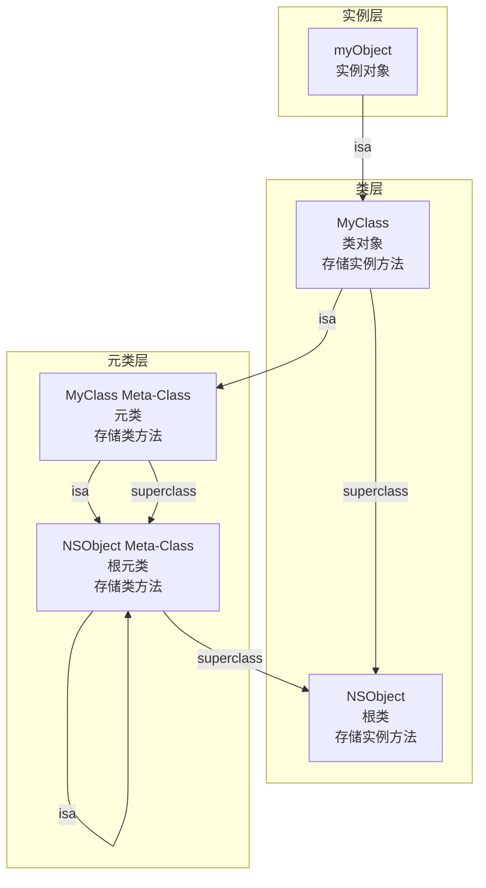
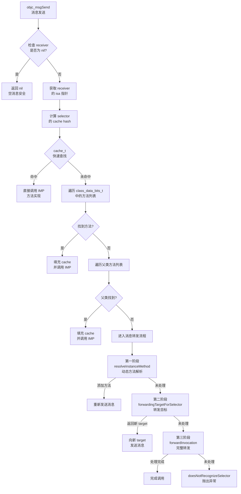
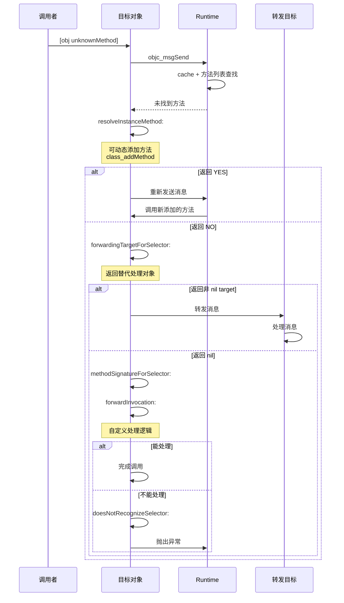
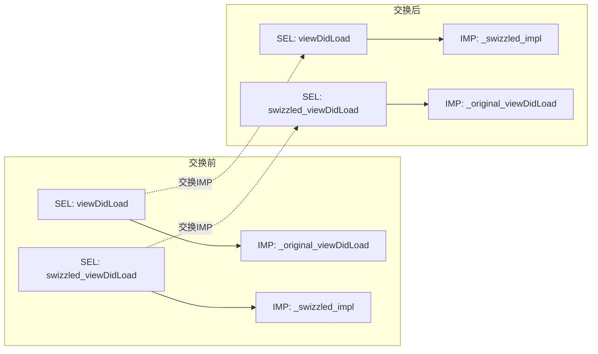
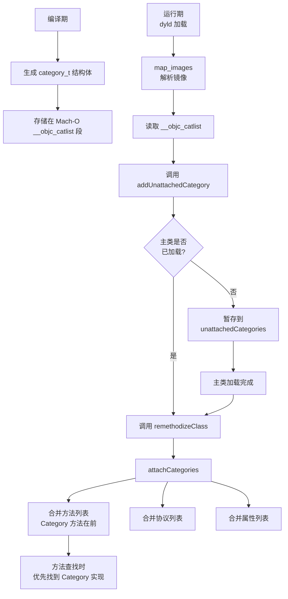
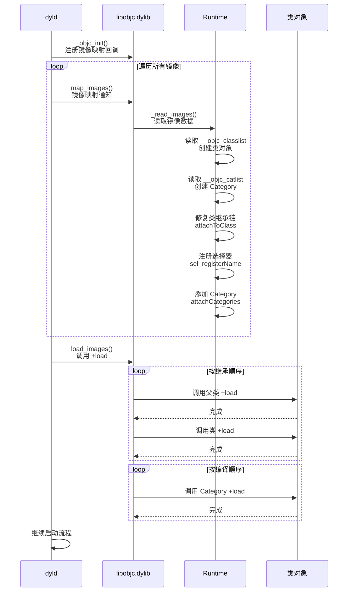
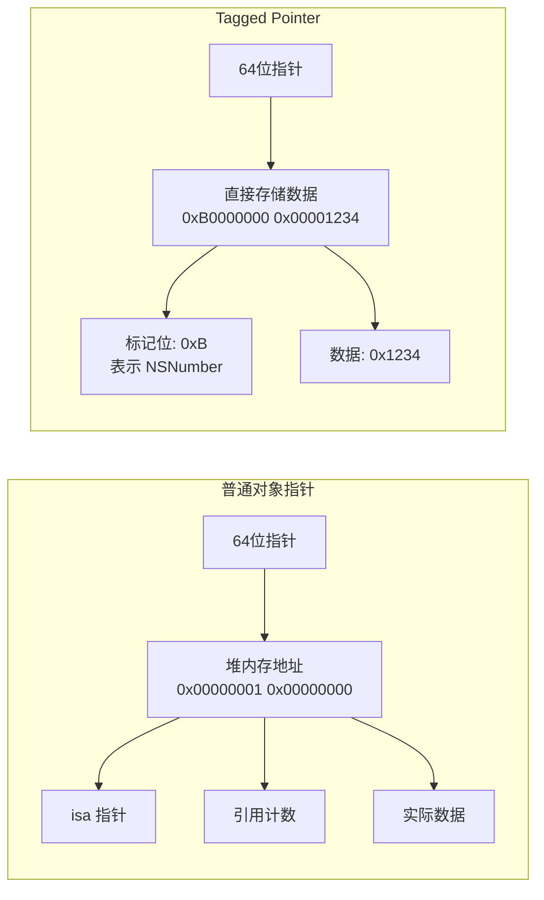

# Objective-C Runtime 与消息机制深度解析

## 核心结论 TL;DR

| 维度 | 核心结论 |
|------|----------|
| **对象模型** | 所有 ObjC 对象都是 `objc_object` 结构体，通过 `isa` 指针关联到类，类通过元类链连接到根元类 |
| **消息发送** | `objc_msgSend` 采用缓存优先策略，未命中时遍历方法列表，支持完整的三阶段消息转发机制 |
| **方法交换** | Method Swizzling 本质是交换 `method_t` 的 `IMP` 指针，必须在 `+load` 中且使用 `dispatch_once` 保证线程安全 |
| **Category** | 运行时合并到主类方法列表，方法排在前面导致覆盖，+load 按编译顺序独立调用，+initialize 懒加载且只调用一次 |
| **关联对象** | 通过全局 `AssociationsHashMap` 存储，支持 `OBJC_ASSOCIATION_RETAIN/ASSIGN/COPY` 三种内存策略 |
| **类加载** | dyld 加载 Mach-O → `_objc_init` → `map_images` → `load_images`，+load 在 `load_images` 阶段同步调用 |
| **Tagged Pointer** | 小对象（NSNumber/NSString/NSDate）直接编码到指针，避免堆分配，64位系统支持 |

---

## 一、ObjC 对象模型

### 1.1 核心结论

**所有 ObjC 对象本质都是 C 结构体，通过 isa 指针建立类与元类的层次关系，形成完整的面向对象体系。**

### 1.2 objc_object 与 objc_class 结构

```c
// objc/runtime/objc-private.h
// 所有 ObjC 对象的基结构
struct objc_object {
    Class isa;  // 指向对象的类（或 Tagged Pointer 标记）
};

// 类对象结构（继承自 objc_object）
struct objc_class : objc_object {
    Class superclass;           // 父类指针
    cache_t cache;              // 方法缓存（快速查找）
    class_data_bits_t bits;     // 存储 class_rw_t/class_ro_t 的位域
    
    // 获取实际的方法列表等数据
    class_rw_t *data() const {
        return bits.data();
    }
};
```

### 1.3 isa 指针的演进

**非指针型 isa（Non-pointer isa）- arm64 架构：**

```c
// isa 位域定义（arm64）
#   define ISA_MASK        0x0000000ffffffff8ULL
#   define ISA_MAGIC_MASK  0x000003f000000001ULL
#   define ISA_MAGIC_VALUE 0x000001a000000001ULL

// isa 存储的额外信息（64位中利用剩余位）
union isa_t {
    Class cls;
    uintptr_t bits;
    struct {
        uintptr_t nonpointer        : 1;  // 0=普通指针, 1=优化isa
        uintptr_t has_assoc         : 1;  // 是否有关联对象
        uintptr_t has_cxx_dtor      : 1;  // 是否有C++析构函数
        uintptr_t shiftcls          : 33; // 实际的类地址（需移位）
        uintptr_t magic             : 6;  // 调试器标记
        uintptr_t weakly_referenced : 1;  // 是否被弱引用
        uintptr_t deallocating      : 1;  // 是否正在析构
        uintptr_t has_sidetable_rc  : 1;  // 引用计数是否存于side table
        uintptr_t extra_rc          : 19; // 额外的引用计数
    };
};
```

### 1.4 元类链（Meta-Class Chain）

**核心结论：类对象的 isa 指向元类，元类的 isa 指向根元类，根元类的 isa 指向自身，形成闭环。**



### 1.5 类数据结构详解

```c
// 类的只读数据（编译时确定）
struct class_ro_t {
    uint32_t flags;
    uint32_t instanceStart;
    uint32_t instanceSize;      // 实例对象大小
    const uint8_t * ivarLayout;
    const char * name;          // 类名
    method_list_t * baseMethodList;   // 基础方法列表
    protocol_list_t * baseProtocols;  // 协议列表
    const ivar_list_t * ivars;        // 成员变量列表
    const uint8_t * weakIvarLayout;
    property_list_t * baseProperties; // 属性列表
};

// 类的读写数据（运行时可修改）
struct class_rw_t {
    uint32_t flags;
    uint32_t version;
    const class_ro_t *ro;       // 指向只读数据
    
    // 运行时合并后的方法/协议/属性（包含 Category 添加的）
    method_array_t methods;
    property_array_t properties;
    protocol_array_t protocols;
    
    Class firstSubclass;
    Class nextSiblingClass;
    char *demangledName;
};
```

### 1.6 代码示例：探索对象结构

```objc
// 需要导入 runtime 头文件
#import <objc/runtime.h>
#import <objc/objc.h>

@interface MyClass : NSObject
@property (nonatomic, strong) NSString *name;
- (void)instanceMethod;
+ (void)classMethod;
@end

@implementation MyClass
- (void)instanceMethod {
    NSLog(@"Instance method called");
}
+ (void)classMethod {
    NSLog(@"Class method called");
}
@end

// 探索对象模型
void exploreObjectModel() {
    MyClass *obj = [[MyClass alloc] init];
    
    // 1. 获取对象的 isa
    Class cls = object_getClass(obj);
    NSLog(@"对象地址: %p", obj);
    NSLog(@"对象 isa (类对象): %p", cls);
    
    // 2. 获取类的 isa（元类）
    Class metaClass = object_getClass(cls);
    NSLog(@"类对象的 isa (元类): %p", metaClass);
    
    // 3. 获取元类的 isa（根元类）
    Class rootMetaClass = object_getClass(metaClass);
    NSLog(@"元类的 isa (根元类): %p", rootMetaClass);
    
    // 4. 验证根元类的 isa 指向自身
    Class rootMetaIsa = object_getClass(rootMetaClass);
    NSLog(@"根元类的 isa: %p (应等于自身)", rootMetaIsa);
    
    // 5. 类名验证
    NSLog(@"类名: %s", class_getName(cls));
    NSLog(@"元类名: %s", class_getName(metaClass));
    
    // 6. 父类链
    NSLog(@"MyClass 父类: %s", class_getName(class_getSuperclass(cls)));
    NSLog(@"NSObject 父类: %p", class_getSuperclass([NSObject class]));
}

// 输出示例：
// 对象地址: 0x600003c04100
// 对象 isa (类对象): 0x104f0b0b0 (MyClass)
// 类对象的 isa (元类): 0x104f0b128 (MyClass)
// 元类的 isa (根元类): 0x1f90e6af8 (NSObject)
// 根元类的 isa: 0x1f90e6af8 (指向自身)
```

---

## 二、objc_msgSend 消息发送流程

### 2.1 核心结论

**消息发送采用缓存优先策略：先查快速缓存（cache_t），未命中再遍历方法列表，最后触发三阶段消息转发机制，整个过程高度优化且线程安全。**

### 2.2 消息发送完整流程图



### 2.3 Cache 查找机制

```c
// objc/runtime/objc-cache.mm
// cache_t 结构（高度优化的哈希表）
struct cache_t {
    // arm64: bucket_t *_buckets; mask_t _mask; mask_t _occupied;
    // x86_64: 使用联合体优化存储
    
    struct bucket_t *buckets;    // 哈希桶数组
    mask_t mask;                  // 掩码（容量-1）
    mask_t occupied;              // 已占用数量
    
    // 关键操作（汇编实现，极致性能）
    inline bucket_t *find(cache_key_t key, id receiver);
    static void expand(cache_t *cache, Class cls);
};

// bucket_t 存储 selector -> IMP 映射
struct bucket_t {
    cache_key_t _key;    // selector 的哈希值
    IMP _imp;            // 方法实现指针
};
```

**缓存查找伪代码（汇编级优化）：**

```asm
; objc_msgSend 汇编实现（arm64 简化版）
; x0 = receiver, x1 = selector

objc_msgSend:
    ; 检查 Tagged Pointer
    tbz     x0, #0, LNilOrTagged
    
    ; 获取 isa（普通对象）
    ldr     x13, [x0]           ; x13 = isa
    and     x16, x13, #ISA_MASK ; x16 = class pointer
    
    ; 进入缓存查找
LGetIsaDone:
    ldr     x11, [x16, #CACHE]  ; x11 = cache buckets
    
    ; 计算哈希: hash = selector & mask
    and     x12, x1, x11, lsr #48  ; x12 = selector & mask
    
    ; 查找 bucket
    add     x12, x11, x12, lsl #4  ; bucket = buckets + index*16
    ldp     x10, x11, [x12]        ; x10 = key, x11 = imp
    
    ; 比较 key
    cmp     x10, x1
    b.eq    LHit                   ; 命中，直接跳转
    
    ; 未命中，处理冲突或进入慢路径...
    b       __objc_msgSend_uncached

LHit:
    br      x11                    ; 跳转到 IMP
```

### 2.4 消息转发三阶段详解

#### 阶段一：动态方法解析

```objc
// 运行时动态添加方法实现
+ (BOOL)resolveInstanceMethod:(SEL)selector {
    if (selector == @selector(dynamicMethod)) {
        // 动态添加方法实现
        class_addMethod([self class], 
                       selector,
                       (IMP)dynamicMethodIMP, 
                       "v@:");
        return YES;  // 已处理，重新发送消息
    }
    return [super resolveInstanceMethod:selector];
}

// C 函数作为方法实现
void dynamicMethodIMP(id self, SEL _cmd) {
    NSLog(@"Dynamic method implementation called");
}
```

#### 阶段二：快速转发（转发目标）

```objc
// 将消息转发给其他对象处理
@interface TargetProxy : NSObject
@property (nonatomic, strong) id realTarget;
@end

@implementation MyClass

- (id)forwardingTargetForSelector:(SEL)selector {
    if (selector == @selector(methodNotInSelf)) {
        // 转发给 realTarget 处理
        return self.realTarget;
    }
    return [super forwardingTargetForSelector:selector];
}

@end
```

#### 阶段三：完整消息转发

```objc
// 完整转发：自定义消息处理方式
- (NSMethodSignature *)methodSignatureForSelector:(SEL)selector {
    // 提供方法签名（参数和返回值类型）
    if (selector == @selector(methodNotInSelf)) {
        return [NSMethodSignature signatureWithObjCTypes:"v@:@"];
    }
    return [super methodSignatureForSelector:selector];
}

- (void)forwardInvocation:(NSInvocation *)invocation {
    SEL selector = [invocation selector];
    
    if ([self.realTarget respondsToSelector:selector]) {
        // 转发给 realTarget
        [invocation invokeWithTarget:self.realTarget];
    } else {
        // 自定义处理：记录日志、返回默认值等
        NSLog(@"Unhandled selector: %@", NSStringFromSelector(selector));
        
        // 或者调用默认实现
        [self handleUnknownInvocation:invocation];
    }
}

// 最后防线：抛出异常
- (void)doesNotRecognizeSelector:(SEL)selector {
    NSLog(@"CRASH: -[%@ %@]: unrecognized selector sent to instance %p",
          NSStringFromClass([self class]),
          NSStringFromSelector(selector), 
          self);
    [super doesNotRecognizeSelector:selector];  // 抛出 NSInvalidArgumentException
}
```

### 2.5 消息转发流程图



---

## 三、Method Swizzling 方法交换

### 3.1 核心结论

**Method Swizzling 本质是交换 `method_t` 结构体中的 `IMP` 函数指针，必须在 `+load` 方法中使用 `dispatch_once` 确保线程安全，且交换的是类的方法列表中的方法实现。**

### 3.2 Method Swizzling 原理

```c
// method_t 结构体定义
struct method_t {
    SEL name;           // 方法选择器
    const char *types;  // 类型编码（返回值和参数类型）
    IMP imp;            // 方法实现指针（可交换）
};

// 交换原理示意图
```



### 3.3 标准实现（线程安全版本）

```objc
// UIViewController+Swizzling.h
@interface UIViewController (Swizzling)
@end

// UIViewController+Swizzling.m
#import "UIViewController+Swizzling.h"
#import <objc/runtime.h>

@implementation UIViewController (Swizzling)

// 在类加载时执行交换
+ (void)load {
    // 使用 dispatch_once 确保线程安全
    static dispatch_once_t onceToken;
    dispatch_once(&onceToken, ^{
        Class class = [self class];
        
        // 获取原始方法
        SEL originalSelector = @selector(viewDidLoad);
        Method originalMethod = class_getInstanceMethod(class, originalSelector);
        
        // 获取交换方法
        SEL swizzledSelector = @selector(swizzled_viewDidLoad);
        Method swizzledMethod = class_getInstanceMethod(class, swizzledSelector);
        
        // 关键：如果子类没有实现 viewDidLoad，需要先添加方法
        // 否则 class_getInstanceMethod 会返回父类的方法，导致父类也被交换
        BOOL didAddMethod = class_addMethod(class,
                                            originalSelector,
                                            method_getImplementation(swizzledMethod),
                                            method_getTypeEncoding(swizzledMethod));
        
        if (didAddMethod) {
            // 添加成功：替换 swizzled 方法为原始实现
            class_replaceMethod(class,
                               swizzledSelector,
                               method_getImplementation(originalMethod),
                               method_getTypeEncoding(originalMethod));
        } else {
            // 已存在：直接交换
            method_exchangeImplementations(originalMethod, swizzledMethod);
        }
    });
}

// 交换后的实现（实际调用时会指向原始 viewDidLoad）
- (void)swizzled_viewDidLoad {
    // 1. 先调用"原始"实现（由于交换，这里实际调用的是原来的 viewDidLoad）
    [self swizzled_viewDidLoad];
    
    // 2. 插入自定义逻辑
    NSLog(@"[Swizzling] %@ viewDidLoad", NSStringFromClass([self class]));
    
    // 3. 可以添加性能统计、埋点等
    [self trackPageView];
}

- (void)trackPageView {
    // 埋点逻辑
}

@end
```

### 3.4 线程安全注意事项

```objc
// ❌ 错误：非线程安全
+ (void)load {
    // 多线程环境下可能重复交换
    method_exchangeImplementations(method1, method2);
}

// ✅ 正确：使用 dispatch_once
+ (void)load {
    static dispatch_once_t onceToken;
    dispatch_once(&onceToken, ^{
        method_exchangeImplementations(method1, method2);
    });
}

// ✅ 更安全的宏定义
#define SWIZZLE_METHOD(class, original, swizzled) do { \
    static dispatch_once_t onceToken; \
    dispatch_once(&onceToken, ^{ \
        Method origMethod = class_getInstanceMethod(class, original); \
        Method swizMethod = class_getInstanceMethod(class, swizzled); \
        if (class_addMethod(class, original, \
                           method_getImplementation(swizMethod), \
                           method_getTypeEncoding(swizMethod))) { \
            class_replaceMethod(class, swizzled, \
                               method_getImplementation(origMethod), \
                               method_getTypeEncoding(origMethod)); \
        } else { \
            method_exchangeImplementations(origMethod, swizMethod); \
        } \
    }); \
} while(0)
```

### 3.5 常见陷阱与最佳实践

| 陷阱 | 说明 | 解决方案 |
|------|------|----------|
| **子类继承问题** | 直接交换父类方法会影响所有子类 | 使用 `class_addMethod` 先添加方法 |
| **调用顺序错误** | 在 swizzled 方法中调用自己导致死循环 | 调用 swizzled_xxx 方法（实际指向原始实现） |
| **多线程竞争** | 未使用 dispatch_once 可能导致重复交换 | 始终使用 dispatch_once 包装 |
| **方法不存在** | class_getInstanceMethod 返回 nil | 添加 nil 检查，使用 NSParameterAssert |
| **类型不匹配** | 交换的方法签名不一致 | 确保参数和返回值类型兼容 |

---

## 四、Category 机制详解

### 4.1 核心结论

**Category 在编译期独立生成，在运行期通过 `attachLists` 合并到主类的方法列表前面，因此 Category 方法会"覆盖"主类方法（实际是优先查找）。+load 在类加载时按编译顺序独立调用，+initialize 在首次消息发送时懒加载且只调用一次。**

### 4.2 Category 结构

```c
// objc/runtime/objc-runtime-new.h
struct category_t {
    const char *name;           // Category 名称
    classref_t cls;             // 关联的类
    struct method_list_t *instanceMethods;    // 实例方法列表
    struct method_list_t *classMethods;       // 类方法列表
    struct protocol_list_t *protocols;        // 协议列表
    struct property_list_t *instanceProperties; // 属性列表（不生成 ivar）
    
    // 以下字段在程序启动时由 dyld 填充
    struct property_list_t *_classProperties;
};
```

### 4.3 Category 加载与合并流程



### 4.4 +load vs +initialize 对比

| 特性 | +load | +initialize |
|------|-------|-------------|
| **调用时机** | 类/Category 加载时（启动阶段） | 首次向类发送消息前（懒加载） |
| **调用次数** | 主类和每个 Category 各调用一次 | 每个类只调用一次 |
| **调用顺序** | 父类 → 子类；主类 → Category（编译顺序） | 父类 → 子类（Category 不单独调用） |
| **线程安全** | 系统保证串行执行 | 系统自动加锁保证线程安全 |
| **使用场景** | Method Swizzling、全局配置 | 初始化静态变量、单例创建 |
| **注意事项** | 避免耗时操作，影响启动速度 | 可能被子类继承触发 |

### 4.5 代码示例：+load 与 +initialize

```objc
// MyClass.m
@implementation MyClass

+ (void)load {
    NSLog(@"MyClass +load");
}

+ (void)initialize {
    NSLog(@"MyClass +initialize");
}

@end

// MyClass+CategoryA.m
@implementation MyClass (CategoryA)

+ (void)load {
    NSLog(@"CategoryA +load");
}

// Category 不会覆盖 initialize
// 如果子类没有实现 initialize，会调用父类实现

@end

// MyClass+CategoryB.m
@implementation MyClass (CategoryB)

+ (void)load {
    NSLog(@"CategoryB +load");
}

@end

// 输出顺序（假设编译顺序 A 在前）：
// MyClass +load
// CategoryA +load
// CategoryB +load
// 
// 首次使用 MyClass 时：
// MyClass +initialize
```

### 4.6 Category 方法覆盖规则

```objc
// 假设有以下实现

// MyClass.m
@implementation MyClass
- (void)doSomething {
    NSLog(@"Main implementation");
}
@end

// MyClass+CategoryA.m
@implementation MyClass (CategoryA)
- (void)doSomething {
    NSLog(@"Category A");
}
@end

// MyClass+CategoryB.m
@implementation MyClass (CategoryB)
- (void)doSomething {
    NSLog(@"Category B");
}
@end

// 调用结果取决于编译顺序：
// 最后编译的 Category 方法会排在方法列表前面
// 如果 B 在 A 之后编译：输出 "Category B"
```

**重要提示：** Category 不能添加实例变量，因为实例变量布局在编译期确定。如果需要存储数据，请使用关联对象（Associated Objects）。

---

## 五、关联对象（Associated Objects）

### 5.1 核心结论

**关联对象通过全局 `AssociationsHashMap` 存储，使用 `objc_setAssociatedObject` 和 `objc_getAssociatedObject` API，支持 `RETAIN/ASSIGN/COPY` 三种内存管理策略，可以实现 Category 添加"属性"的效果。**

### 5.2 关联对象数据结构

```c
// objc/runtime/objc-references.mm

// 全局关联对象管理器
class AssociationsManager {
    static AssociationsHashMap *_map;  // 全局哈希表
    static spinlock_t _lock;           // 自旋锁保护
public:
    static void setAssociatedObject(id object, void *key, id value, objc_AssociationPolicy policy);
    static id getAssociatedObject(id object, void *key);
    static void removeAssociatedObjects(id object);
};

// 关联对象条目
class ObjectAssociation {
    uintptr_t _policy;  // 关联策略
    id _value;          // 关联值
};

// 使用 disguised_ptr 作为 key（隐藏指针值）
typedef uintptr_t disguised_ptr_t;
```

### 5.3 关联策略（Association Policy）

| 策略 | 对应属性修饰符 | 说明 |
|------|---------------|------|
| `OBJC_ASSOCIATION_ASSIGN` | `assign` | 弱引用，不保留对象 |
| `OBJC_ASSOCIATION_RETAIN_NONATOMIC` | `nonatomic, strong` | 强引用，非原子性 |
| `OBJC_ASSOCIATION_COPY_NONATOMIC` | `nonatomic, copy` | 拷贝值，非原子性 |
| `OBJC_ASSOCIATION_RETAIN` | `strong` | 强引用，原子性 |
| `OBJC_ASSOCIATION_COPY` | `copy` | 拷贝值，原子性 |

### 5.4 代码示例：为 Category 添加属性

```objc
// NSObject+AssociatedObject.h
@interface NSObject (AssociatedObject)
@property (nonatomic, strong) id customData;
@property (nonatomic, copy) NSString *customString;
@property (nonatomic, assign) NSInteger customTag;
@end

// NSObject+AssociatedObject.m
#import "NSObject+AssociatedObject.h"
#import <objc/runtime.h>

// 定义唯一的 key（使用 selector 地址保证唯一性）
static const char *kCustomDataKey = "customData";
static const char *kCustomStringKey = "customString";
static const char *kCustomTagKey = "customTag";

@implementation NSObject (AssociatedObject)

#pragma mark - customData (strong, nonatomic)
- (id)customData {
    return objc_getAssociatedObject(self, kCustomDataKey);
}

- (void)setCustomData:(id)customData {
    objc_setAssociatedObject(self,
                            kCustomDataKey,
                            customData,
                            OBJC_ASSOCIATION_RETAIN_NONATOMIC);
}

#pragma mark - customString (copy, nonatomic)
- (NSString *)customString {
    return objc_getAssociatedObject(self, kCustomStringKey);
}

- (void)setCustomString:(NSString *)customString {
    objc_setAssociatedObject(self,
                            kCustomStringKey,
                            customString,
                            OBJC_ASSOCIATION_COPY_NONATOMIC);
}

#pragma mark - customTag (assign)
- (NSInteger)customTag {
    // 对于基础类型，使用 NSNumber 包装
    NSNumber *number = objc_getAssociatedObject(self, kCustomTagKey);
    return [number integerValue];
}

- (void)setCustomTag:(NSInteger)customTag {
    objc_setAssociatedObject(self,
                            kCustomTagKey,
                            @(customTag),
                            OBJC_ASSOCIATION_RETAIN_NONATOMIC);
}

@end
```

### 5.5 关联对象生命周期

```objc
// 关联对象随宿主对象释放而自动清理
@interface MyView : UIView
@end

@implementation MyView

- (instancetype)init {
    self = [super init];
    if (self) {
        // 设置关联对象
        self.customData = [[MyDataObject alloc] init];
        // MyDataObject 会被 MyView retain
    }
    return self;
}

- (void)dealloc {
    // 不需要手动清理关联对象
    // 系统在 dealloc 时会自动调用 removeAssociatedObjects
    NSLog(@"MyView dealloc - 关联对象会自动释放");
}

@end
```

---

## 六、类加载流程

### 6.1 核心结论

**类加载由 dyld 驱动，经过 `_objc_init` → `map_images` → `load_images` 三阶段，+load 方法在 `load_images` 阶段同步调用，是启动性能的关键路径。**

### 6.2 完整加载时序图



### 6.3 关键函数详解

```c
// 1. _objc_init: 运行时初始化入口
void _objc_init(void) {
    // 注册镜像加载回调
    _dyld_objc_notify_register(&map_images, load_images, unmap_image);
}

// 2. map_images: 镜像映射处理
void map_images(unsigned count, const char * const paths[],
                const struct mach_header * const mhdrs[]) {
    rwlock_writer_t lock(runtimeLock);
    for (unsigned i = 0; i < count; i++) {
        _read_images(mhdrs[i]);
    }
}

// 3. _read_images: 读取镜像中的类信息
void _read_images(const mach_header *mh) {
    // 读取 __objc_classlist 段
    // 读取 __objc_catlist 段
    // 读取 __objc_selrefs 段
    // 修复类继承关系
    // 合并 Category
}

// 4. load_images: 调用 +load 方法
void load_images(const char *path, const mach_header *mh) {
    // 收集所有需要调用 +load 的类
    // 按继承顺序调用
    // 按编译顺序调用 Category 的 +load
}
```

### 6.4 启动优化建议

| 优化方向 | 具体措施 | 预期收益 |
|----------|----------|----------|
| **减少 +load 使用** | 将逻辑迁移到 +initialize 或首次使用时 | 减少启动时间 |
| **延迟加载** | 使用 dispatch_async 将非关键逻辑延迟到启动后 | 提升首屏速度 |
| **合并 Category** | 减少 Category 数量，合并相关功能 | 减少加载开销 |
| **优化类数量** | 删除未使用的类，合并小类 | 减少内存占用 |
| **使用 Swift** | Swift 没有 +load，类加载更高效 | 更快的启动速度 |

---

## 七、Tagged Pointer

### 7.1 核心结论

**Tagged Pointer 是 64 位架构下的小对象优化机制，将 NSNumber、NSString、NSDate 等小对象的值直接编码到指针中，避免堆内存分配，提升访问性能并减少内存占用。**

### 7.2 Tagged Pointer 原理



### 7.3 Tagged Pointer 位布局

```c
// 64位 Tagged Pointer 格式（arm64）
// 最高 4 位作为标记，区分对象类型

// 标记位定义
#   define TAG_MASK (1UL<<63)           // 最高位标记是否为 Tagged Pointer
#   define TAG_SLOT_SHIFT 60           // 类型标记位移
#   define TAG_PAYLOAD_LSHIFT 0        // 数据左移
#   define TAG_PAYLOAD_RSHIFT 4        // 数据右移（去掉标记位）

// 支持的类型（arm64）
enum {
    TAG_NSNumber      = 0b0000,  // 0
    TAG_NSDate        = 0b0001,  // 1
    TAG_NSString      = 0b0010,  // 2
    TAG_NSIndexPath   = 0b0011,  // 3
    TAG_NSManagedObjectID = 0b0100,  // 4
    TAG_NSDateInterval = 0b0101, // 5
    // ... 保留扩展
};

// 示例：NSNumber 存储小整数
// 指针值: 0xB000000000000123
// 二进制: 1011 0000 ... 0001 0010 0011
//         ↑↑↑↑
//         标记位 (0xB = 1011，表示 NSNumber，有符号)
//               ↑↑↑↑ ... ↑↑↑↑↑↑↑↑↑↑
//               实际数值 (0x123 = 291)
```

### 7.4 代码示例：Tagged Pointer 检测

```objc
#import <objc/runtime.h>

void exploreTaggedPointer() {
    // 小整数 - 使用 Tagged Pointer
    NSNumber *num1 = @1;
    NSNumber *num2 = @(-1);
    NSNumber *bigNum = @(0xFFFFFFFFFFFF);
    
    // 检测是否为 Tagged Pointer
    NSLog(@"num1: %p, isTaggedPointer: %d", 
          num1, _objc_isTaggedPointer((__bridge void *)num1));
    NSLog(@"num2: %p, isTaggedPointer: %d", 
          num2, _objc_isTaggedPointer((__bridge void *)num2));
    NSLog(@"bigNum: %p, isTaggedPointer: %d", 
          bigNum, _objc_isTaggedPointer((__bridge void *)bigNum));
    
    // 短字符串 - 使用 Tagged Pointer
    NSString *shortStr = @"Hi";
    NSString *longStr = @"This is a very long string that exceeds tagged pointer limit";
    
    NSLog(@"shortStr: %p, isTaggedPointer: %d", 
          shortStr, _objc_isTaggedPointer((__bridge void *)shortStr));
    NSLog(@"longStr: %p, isTaggedPointer: %d", 
          longStr, _objc_isTaggedPointer((__bridge void *)longStr));
}

// 输出示例（arm64）：
// num1: 0xb000000000000012, isTaggedPointer: 1
// num2: 0xb000000000000013, isTaggedPointer: 1
// bigNum: 0x600003c040c0, isTaggedPointer: 0
// shortStr: 0xa000000000000482, isTaggedPointer: 1
// longStr: 0x600003c04120, isTaggedPointer: 0
```

### 7.5 Tagged Pointer 性能优势

| 指标 | 普通对象 | Tagged Pointer | 提升 |
|------|----------|----------------|------|
| **内存分配** | 堆内存（~16字节+） | 无（内联在指针） | 100% 节省 |
| **访问速度** | 需要解引用 | 直接读取指针值 | 3-5x 提升 |
| **引用计数** | 需要原子操作 | 无（不需要 retain/release） | 消除开销 |
| **线程安全** | 需要锁/原子操作 | 值不可变，天然线程安全 | 简化同步 |

---

## 八、总结与最佳实践

### 8.1 性能优化建议

| 场景 | 建议 |
|------|------|
| **频繁调用的方法** | 使用 `cache_t` 友好的编码方式，避免动态添加方法 |
| **启动优化** | 减少 +load 使用，延迟非关键初始化 |
| **内存优化** | 利用 Tagged Pointer，使用小整数和短字符串 |
| **线程安全** | Method Swizzling 必须使用 dispatch_once |
| **扩展类功能** | Category + 关联对象，避免子类化 |

### 8.2 调试技巧

```objc
// 1. 打印对象完整信息
- (void)printObjectInfo:(id)obj {
    NSLog(@"Object: %@", obj);
    NSLog(@"Class: %@", NSStringFromClass([obj class]));
    NSLog(@"Isa: %p", object_getClass(obj));
    NSLog(@"Is Tagged Pointer: %d", _objc_isTaggedPointer((__bridge void *)obj));
}

// 2. 打印方法列表
- (void)printMethodsForClass:(Class)cls {
    unsigned int count;
    Method *methods = class_copyMethodList(cls, &count);
    for (unsigned int i = 0; i < count; i++) {
        NSLog(@"Method: %@", NSStringFromSelector(method_getName(methods[i])));
    }
    free(methods);
}

// 3. 打印 ivar 列表
- (void)printIvarsForClass:(Class)cls {
    unsigned int count;
    Ivar *ivars = class_copyIvarList(cls, &count);
    for (unsigned int i = 0; i < count; i++) {
        NSLog(@"Ivar: %s, Type: %s", ivar_getName(ivars[i]), ivar_getTypeEncoding(ivars[i]));
    }
    free(ivars);
}
```

### 8.3 版本兼容性说明

- **iOS 12+**: Tagged Pointer 默认启用，支持更多类型
- **arm64 架构**: Non-pointer isa 默认启用
- **macOS 10.14+**: 与 iOS 行为对齐
- **Swift 混编**: ObjC Runtime 对 Swift 类同样适用（@objc 标记的方法）

---

## 参考文档

1. [Apple objc4 源码](https://opensource.apple.com/source/objc4/)
2. [Objective-C Runtime Programming Guide](https://developer.apple.com/library/archive/documentation/Cocoa/Conceptual/ObjCRuntimeGuide/)
3. [WWDC - Optimizing App Startup Time](https://developer.apple.com/videos/play/wwdc2016/406/)
4. [objc_msgSend 汇编实现分析](http://www.sealiesoftware.com/blog/archive/2008/10/30/objc_explain_objc_msgSend.html)
