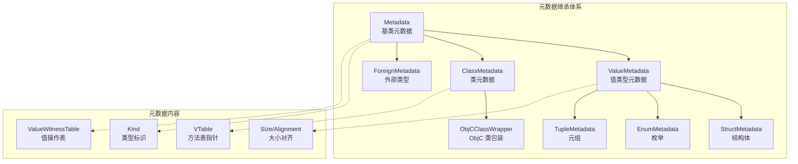
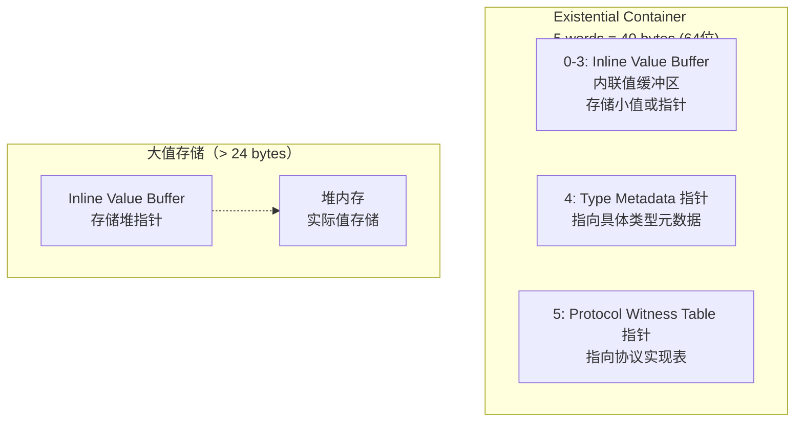
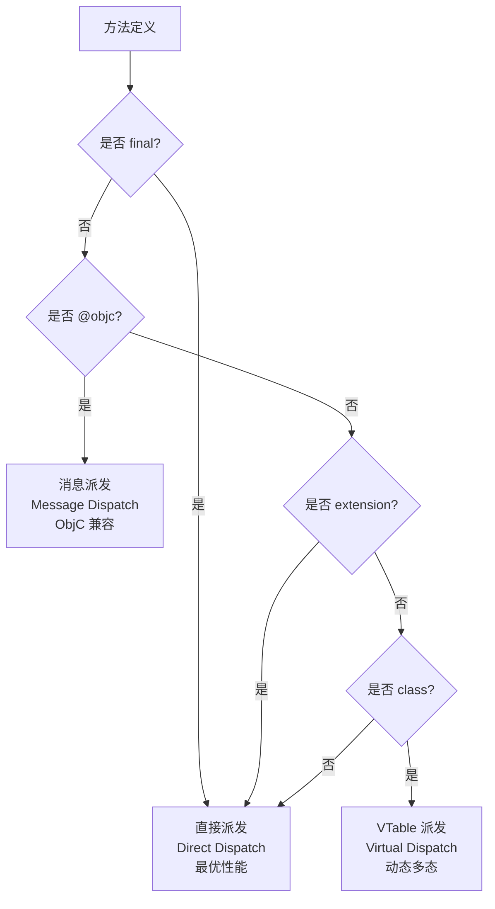
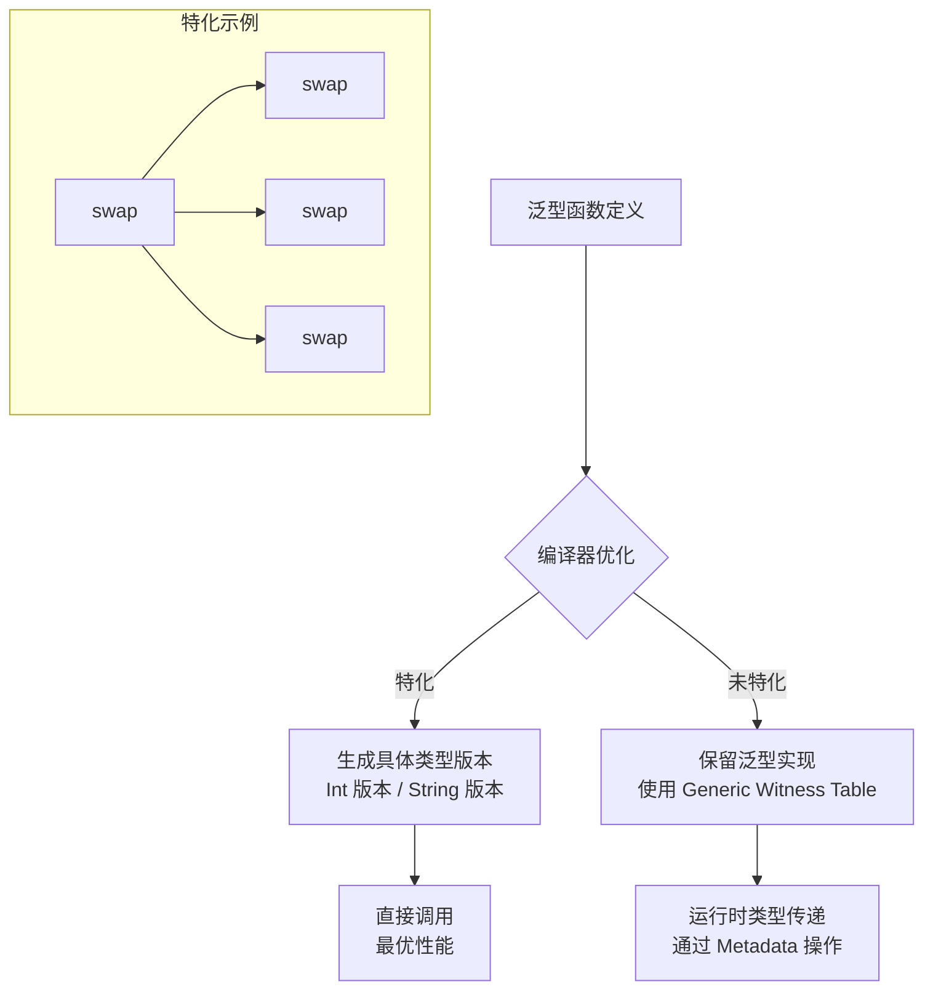
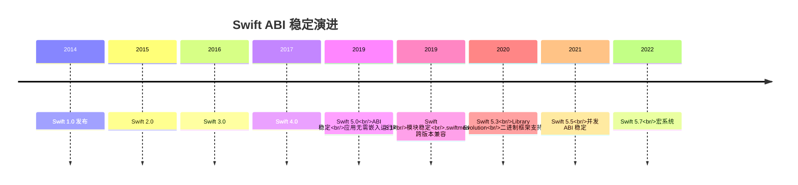
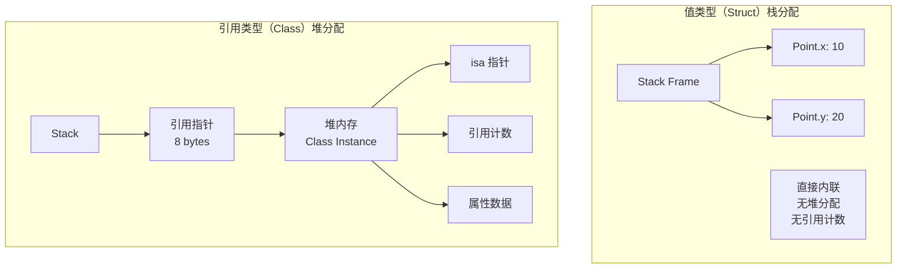
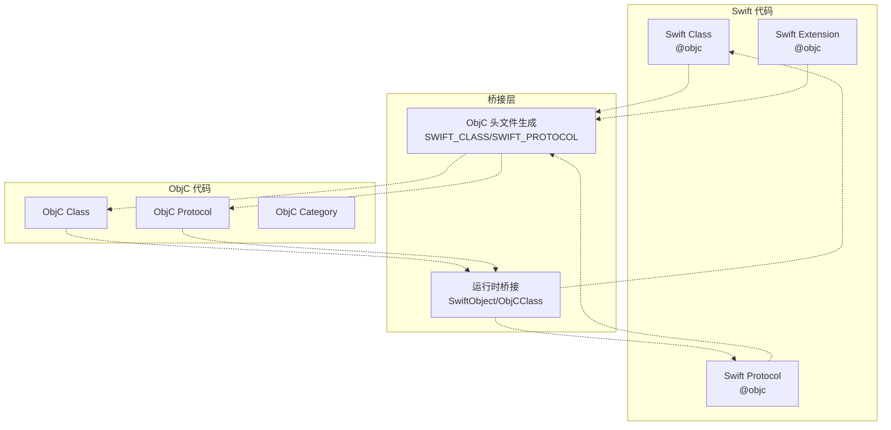

# Swift 运行时与 ABI 稳定性深度解析

## 核心结论 TL;DR

| 维度 | 核心结论 |
|------|----------|
| **类型元数据** | Swift 类型在运行时通过 Metadata 描述，值类型（Struct/Enum）内联存储，引用类型（Class）堆分配 |
| **协议派发** | 协议类型使用 Protocol Witness Table 实现动态派发，Existential Container 存储值或引用 |
| **方法派发** | Swift 类支持三种派发方式：直接派发（性能最优）、VTable 派发（默认）、消息派发（@objc） |
| **泛型特化** | 编译器在编译期对具体类型生成特化代码，运行时通过 Generic Witness Table 处理未特化情况 |
| **ABI 稳定** | Swift 5.0+ 实现 ABI 稳定，5.1+ 实现模块稳定，支持 Library Evolution 和二进制框架分发 |
| **值类型优化** | 栈分配 + 写时复制（COW）机制，避免不必要的拷贝，性能接近引用类型 |
| **互操作性** | @objc/@dynamic 桥接 ObjC，NS_SWIFT_NAME 控制命名映射，存在泛型桥接限制 |

---

## 一、Swift 类型元数据（Type Metadata）

### 1.1 核心结论

**Swift 每种类型在运行时都有对应的元数据结构，值类型（Struct/Enum）采用内联存储优化，引用类型（Class）使用堆分配，元数据包含类型大小、对齐方式、VTable 指针等关键信息。**

### 1.2 元数据结构层次



### 1.3 元数据结构定义

```swift
// Swift 元数据结构（简化版，基于 Swift 开源代码）

// 基础元数据头
struct Metadata {
    var kind: MetadataKind           // 类型标识（类、结构体、枚举等）
    // 后续字段根据 kind 变化
}

// 值类型元数据基类
struct ValueMetadata {
    var kind: MetadataKind
    var valueWitnesses: UnsafePointer<ValueWitnessTable>  // 值操作函数表
}

// 结构体元数据
struct StructMetadata {
    var kind: MetadataKind           // = Struct
    var valueWitnesses: UnsafePointer<ValueWitnessTable>
    var descriptor: UnsafePointer<StructDescriptor>
    // 泛型参数（如果有）
    var genericArgs: UnsafeRawPointer?
}

// 类元数据
struct ClassMetadata {
    var kind: MetadataKind           // = Class
    var superClass: UnsafePointer<ClassMetadata>?  // 父类元数据
    var cacheData1: UnsafeRawPointer?              // 运行时缓存
    var cacheData2: UnsafeRawPointer?
    var data: Int                                  // 特定数据
    var classFlags: ClassFlags
    var instanceAddressPoint: UInt32
    var instanceSize: UInt32         // 实例大小
    var instanceAlignmentMask: UInt16
    var reserved: UInt16
    var classSize: UInt32
    var classAddressPoint: UInt32
    var descriptor: UnsafePointer<ClassDescriptor>
    var ivarDestroyer: UnsafeRawPointer?
    // VTable 方法指针数组...
}

// 枚举元数据
struct EnumMetadata {
    var kind: MetadataKind           // = Enum
    var valueWitnesses: UnsafePointer<ValueWitnessTable>
    var descriptor: UnsafePointer<EnumDescriptor>
}
```

### 1.4 Value Witness Table（值见证表）

```swift
// 值见证表：定义值类型的生命周期操作
struct ValueWitnessTable {
    var initializeBufferWithCopyOfBuffer: UnsafeRawPointer
    var destroy: UnsafeRawPointer              // 析构函数
    var initializeWithCopy: UnsafeRawPointer   // 拷贝构造
    var assignWithCopy: UnsafeRawPointer       // 拷贝赋值
    var initializeWithTake: UnsafeRawPointer   // 移动构造
    var assignWithTake: UnsafeRawPointer       // 移动赋值
    var getEnumTagSinglePayload: UnsafeRawPointer
    var storeEnumTagSinglePayload: UnsafeRawPointer
    var size: Int                              // 类型大小
    var stride: Int                            // 步长（考虑对齐）
    var flags: ValueWitnessFlags               // 标志位
}
```

### 1.5 代码示例：探索类型元数据

```swift
import Foundation

// 定义测试类型
struct Point {
    var x: Double
    var y: Double
}

enum Status {
    case idle
    case loading(progress: Double)
    case completed(data: String)
}

class User {
    var name: String
    var age: Int
    
    init(name: String, age: Int) {
        self.name = name
        self.age = age
    }
    
    func greet() {
        print("Hello, \(name)")
    }
}

// 使用 Mirror 反射探索元数据
func exploreMetadata() {
    let point = Point(x: 10, y: 20)
    let status = Status.loading(progress: 0.5)
    let user = User(name: "Alice", age: 30)
    
    // 1. 结构体元数据探索
    print("=== Point (Struct) ===")
    let pointMirror = Mirror(reflecting: point)
    print("Display Style: \(String(describing: pointMirror.displayStyle))")
    print("Children count: \(pointMirror.children.count)")
    for (label, value) in pointMirror.children {
        print("  \(label ?? "nil"): \(type(of: value)) = \(value)")
    }
    print("Memory size: \(MemoryLayout<Point>.size) bytes")
    print("Alignment: \(MemoryLayout<Point>.alignment)")
    print("Stride: \(MemoryLayout<Point>.stride)")
    
    // 2. 枚举元数据探索
    print("\n=== Status (Enum) ===")
    let statusMirror = Mirror(reflecting: status)
    print("Display Style: \(String(describing: statusMirror.displayStyle))")
    print("Children count: \(statusMirror.children.count)")
    for (label, value) in statusMirror.children {
        print("  \(label ?? "nil"): \(type(of: value)) = \(value)")
    }
    print("Memory size: \(MemoryLayout<Status>.size) bytes")
    
    // 3. 类元数据探索
    print("\n=== User (Class) ===")
    let userMirror = Mirror(reflecting: user)
    print("Display Style: \(String(describing: userMirror.displayStyle))")
    print("Subject Type: \(userMirror.subjectType)")
    print("Memory size (reference): \(MemoryLayout<User>.size) bytes")
    print("Memory size (instance): \(class_getInstanceSize(User.self)) bytes")
}

// 输出示例：
// === Point (Struct) ===
// Display Style: Optional(Swift.Mirror.DisplayStyle.struct)
// Children count: 2
//   x: Double = 10.0
//   y: Double = 20.0
// Memory size: 16 bytes
// Alignment: 8
// Stride: 16
//
// === Status (Enum) ===
// Display Style: Optional(Swift.Mirror.DisplayStyle.enum)
// Children count: 1
//   progress: Double = 0.5
// Memory size: 9 bytes
//
// === User (Class) ===
// Display Style: Optional(Swift.Mirror.DisplayStyle.class)
// Subject Type: User
// Memory size (reference): 8 bytes
// Memory size (instance): 40 bytes
```

---

## 二、协议见证表（Protocol Witness Table）

### 2.1 核心结论

**协议类型通过 Protocol Witness Table（PWT）实现动态派发，Existential Container 在内存中存储值或引用，小值直接内联（Inline Value Buffer），大值使用堆分配。**

### 2.2 Existential Container 内存布局



### 2.3 Protocol Witness Table 结构

```swift
// 协议定义
protocol Drawable {
    func draw()
    var area: Double { get }
}

// 具体实现
struct Circle: Drawable {
    var radius: Double
    
    func draw() {
        print("Drawing circle with radius \(radius)")
    }
    
    var area: Double {
        return Double.pi * radius * radius
    }
}

struct Rectangle: Drawable {
    var width: Double
    var height: Double
    
    func draw() {
        print("Drawing rectangle \(width)x\(height)")
    }
    
    var area: Double {
        return width * height
    }
}
```

```
// Protocol Witness Table 内存布局
// Circle 的 Drawable PWT:

+------------------+
|  Protocol Witness Table (Circle : Drawable)  |
+------------------+
| 0 | draw() implementation  -> Circle.draw()   |
| 1 | area getter          -> Circle.area.getter|
+------------------+

// Rectangle 的 Drawable PWT:
+------------------+
|  Protocol Witness Table (Rectangle : Drawable)|
+------------------+
| 0 | draw() implementation  -> Rectangle.draw() |
| 1 | area getter          -> Rectangle.area.get |
+------------------+
```

### 2.4 代码示例：协议类型动态派发

```swift
import Foundation

// 使用协议类型（Existential Type）
func render(graphics: [Drawable]) {
    for item in graphics {
        // 通过 Protocol Witness Table 动态派发
        item.draw()
        print("Area: \(item.area)")
    }
}

// 泛型版本（静态派发，性能更好）
func renderGeneric<T: Drawable>(graphics: [T]) {
    for item in graphics {
        // 编译器生成特化代码，直接调用
        item.draw()
        print("Area: \(item.area)")
    }
}

// 性能对比测试
func performanceComparison() {
    let circles = (0..<1000000).map { Circle(radius: Double($0)) }
    let rectangles = (0..<1000000).map { Rectangle(width: Double($0), height: Double($0)) }
    
    // 方式1：协议类型数组（Existential）- 动态派发
    var existentials: [Drawable] = []
    existentials.append(contentsOf: circles.prefix(1000))
    existentials.append(contentsOf: rectangles.prefix(1000))
    
    let start1 = CFAbsoluteTimeGetCurrent()
    render(graphics: existentials)
    let time1 = CFAbsoluteTimeGetCurrent() - start1
    print("Existential dispatch time: \(time1) seconds")
    
    // 方式2：泛型（静态派发）- 性能更好
    let start2 = CFAbsoluteTimeGetCurrent()
    renderGeneric(graphics: circles)
    let time2 = CFAbsoluteTimeGetCurrent() - start2
    print("Generic dispatch time: \(time2) seconds")
}

// 优化建议：使用 some 关键字（Swift 5.1+）
// 返回不透明类型，编译器保留具体类型信息
func makeDrawable() -> some Drawable {
    return Circle(radius: 5.0)  // 具体类型对调用方隐藏，但编译器知道
}
```

### 2.5 Existential Container 大小对比

| 类型 | 大小 | 存储方式 |
|------|------|----------|
| `Int` / `Double` | 8 bytes | 直接内联到 Buffer |
| `String` / `Array` | 16 bytes | 直接内联到 Buffer |
| 小结构体（≤24 bytes） | ≤24 bytes | 直接内联到 Buffer |
| 大结构体（>24 bytes） | 8 bytes（指针） | Buffer 存指针，堆上存储实际值 |
| 类实例 | 8 bytes（引用） | Buffer 存引用 |

---

## 三、虚函数表（VTable）与方法派发

### 3.1 核心结论

**Swift 类支持三种方法派发方式：直接派发（编译期确定，性能最优）、VTable 派发（默认类方法）、消息派发（@objc 标记，与 ObjC 兼容），编译器根据修饰符和上下文自动选择最优策略。**

### 3.2 方法派发决策树



### 3.3 三种派发方式详解

#### 直接派发（Direct Dispatch）

```swift
// 1. 值类型方法 - 总是直接派发
struct Calculator {
    func add(_ a: Int, _ b: Int) -> Int {
        return a + b  // 直接调用，无运行时开销
    }
}

// 2. final 类方法 - 禁止重写，直接派发
final class FinalService {
    func process() {  // 直接派发
        print("Processing")
    }
}

// 3. extension 方法 - 静态派发
extension User {
    func validate() -> Bool {  // 直接派发
        return !name.isEmpty && age >= 0
    }
}

// 4. private 方法 - 编译器可优化为直接派发
class DataManager {
    private func loadData() {  // 直接派发
        // ...
    }
}
```

#### VTable 派发（Virtual Dispatch）

```swift
// 普通类方法 - 使用 VTable 派发
class Animal {
    func speak() {  // 加入 VTable
        print("Animal speaks")
    }
    
    func move() {   // 加入 VTable
        print("Animal moves")
    }
}

class Dog: Animal {
    override func speak() {  // 替换 VTable 条目
        print("Dog barks")
    }
    // move() 继承父类 VTable 条目
}

class Cat: Animal {
    override func speak() {  // 替换 VTable 条目
        print("Cat meows")
    }
}

// VTable 布局示意：
// Animal VTable: [speak() -> Animal.speak, move() -> Animal.move]
// Dog VTable:    [speak() -> Dog.speak,   move() -> Animal.move]
// Cat VTable:    [speak() -> Cat.speak,   move() -> Animal.move]
```

#### 消息派发（Message Dispatch）

```swift
import Foundation

// @objc 标记 - 使用 ObjC 消息派发
@objc class ObjectiveCClass: NSObject {
    @objc dynamic func dynamicMethod() {  // 消息派发
        print("Dynamic method")
    }
    
    @objc func objcMethod() {  // 消息派发（继承自 NSObject）
        print("ObjC method")
    }
}

// 支持 Method Swizzling
extension ObjectiveCClass {
    static func swizzleMethods() {
        let originalSelector = #selector(dynamicMethod)
        let swizzledSelector = #selector(swizzled_dynamicMethod)
        
        guard let originalMethod = class_getInstanceMethod(self, originalSelector),
              let swizzledMethod = class_getInstanceMethod(self, swizzledSelector) else {
            return
        }
        
        method_exchangeImplementations(originalMethod, swizzledMethod)
    }
    
    @objc dynamic func swizzled_dynamicMethod() {
        print("Before swizzled method")
        swizzled_dynamicMethod()  // 调用原方法（已交换）
        print("After swizzled method")
    }
}
```

### 3.4 VTable 内存布局

```
// Swift 类元数据中的 VTable 布局

ClassMetadata:
+----------------------------------+
| Kind                             |
| SuperClass                       |
| ...                              |
| Descriptor                       |
| IvarDestroyer                    |
+----------------------------------+
| VTable[0]: method1 implementation|  <- 基类方法
| VTable[1]: method2 implementation|
| VTable[2]: method3 implementation|
+----------------------------------+
| Override VTable[0]: method1 impl |  <- 子类覆盖
+----------------------------------+
```

### 3.5 派发方式性能对比

| 派发方式 | 性能 | 动态性 | 使用场景 |
|----------|------|--------|----------|
| **直接派发** | 最优（内联优化） | 无 | 值类型、final 类、extension |
| **VTable 派发** | 好（一次间接跳转） | 有 | 普通类继承、多态 |
| **消息派发** | 一般（缓存查找） | 最强 | ObjC 互操作、Swizzling |

---

## 四、泛型特化（Generic Specialization）

### 4.1 核心结论

**Swift 编译器在编译期对具体类型生成特化代码（Monomorphization），消除泛型抽象开销；未特化场景通过 Generic Witness Table 在运行时处理，使用 `@_specialize` 可强制指定特化类型。**

### 4.2 泛型特化原理



### 4.3 泛型特化代码示例

```swift
import Foundation

// 泛型函数定义
func swapValues<T>(_ a: inout T, _ b: inout T) {
    let temp = a
    a = b
    b = temp
}

// 使用不同具体类型
func testSpecialization() {
    var a = 10, b = 20
    swapValues(&a, &b)  // 编译器生成 swapValues<Int> 特化版本
    
    var s1 = "Hello", s2 = "World"
    swapValues(&s1, &s2)  // 编译器生成 swapValues<String> 特化版本
    
    var d1 = 1.5, d2 = 2.5
    swapValues(&d1, &d2)  // 编译器生成 swapValues<Double> 特化版本
}

// 强制指定特化类型（Swift 5.0+）
@_specialize(where T == Int)
@_specialize(where T == String)
@_specialize(where T == Double)
public func optimizedSwap<T>(_ a: inout T, _ b: inout T) {
    let temp = a
    a = b
    b = temp
}

// 泛型结构体特化
struct Stack<Element> {
    private var items: [Element] = []
    
    mutating func push(_ item: Element) {
        items.append(item)
    }
    
    mutating func pop() -> Element? {
        return items.popLast()
    }
}

// 编译器为常用类型生成特化代码
let intStack = Stack<Int>()      // Stack<Int>
let stringStack = Stack<String>() // Stack<String>
```

### 4.4 Generic Witness Table

```swift
// 未特化泛型函数使用 Generic Witness Table

// 伪代码：泛型函数内部实现
func genericOperation<T>(_ value: T) {
    // 编译器生成的泛型版本需要：
    // 1. T 的 Metadata（类型信息）
    // 2. T 的 Value Witness Table（拷贝/析构等操作）
    
    // 伪代码表示：
    // let metadata = getMetadataForType(T)
    // let vwt = metadata.valueWitnesses
    // vwt.destroy(value)
    // vwt.initializeWithCopy(dest, value)
}

// 调用时传递类型信息
genericOperation(42)        // 传递 Int 的 Metadata
genericOperation("Hello")   // 传递 String 的 Metadata
```

### 4.5 泛型性能优化建议

| 优化策略 | 说明 | 示例 |
|----------|------|------|
| **使用 @_specialize** | 强制编译器生成特化版本 | `@_specialize(where T == Int)` |
| **限制泛型参数** | 使用协议约束减少抽象 | `<T: Numeric>` |
| **避免泛型擦除** | 优先使用具体类型 | `some Collection` vs `any Collection` |
| **模块内泛型** | 同模块内更容易特化 | 将泛型代码放在同一模块 |

---

## 五、ABI 稳定性（Swift 5.0+）

### 5.1 核心结论

**Swift 5.0 实现 ABI 稳定，5.1 实现模块稳定（Module Stability），支持 Library Evolution，允许发布二进制框架而不暴露源代码，使用 `@frozen` 和 `@usableFromInline` 控制 API 演进。**

### 5.2 ABI 稳定演进时间线



### 5.3 ABI 稳定关键概念

| 概念 | 说明 | 版本 |
|------|------|------|
| **ABI Stability** | 应用编译后可在不同 Swift 运行时版本上运行 | Swift 5.0+ |
| **Module Stability** | .swiftmodule 文件跨编译器版本兼容 | Swift 5.1+ |
| **Library Evolution** | 支持发布二进制框架，API 可演进 | Swift 5.3+ |
| **Resilience Domain** | 模块边界，库内可优化，跨库需遵守 ABI | - |

### 5.4 Library Evolution 关键属性

```swift
import Foundation

// MARK: - @frozen（冻结类型）

// @frozen 枚举：承诺不添加新 case
// 允许编译器进行穷尽性检查优化
@frozen
public enum HTTPStatus: Int {
    case ok = 200
    case notFound = 404
    case serverError = 500
}

// 非 frozen 枚举（默认）：未来可能添加 case
public enum Result<T, E: Error> {
    case success(T)
    case failure(E)
}

// 使用非 frozen 枚举需要 @unknown default
func handleResult<T>(_ result: Result<T, Error>) {
    switch result {
    case .success(let value):
        print(value)
    case .failure(let error):
        print(error)
    @unknown default:
        print("Unknown case")
    }
}

// MARK: - @usableFromInline

public struct FastArray<Element> {
    private var storage: [Element]
    
    // @usableFromInline: 允许在 inlinable 函数中使用
    @usableFromInline
    internal var capacity: Int {
        return storage.capacity
    }
    
    // @inlinable: 允许跨模块内联
    @inlinable
    public var count: Int {
        return storage.count
    }
    
    @inlinable
    public init() {
        storage = []
    }
}

// MARK: - @available 与 ABI 兼容性

public class APIManager {
    // 标记 API 可用性
    @available(iOS 14.0, macOS 11.0, *)
    public func newAPI() async throws -> Data {
        // 新 API 实现
        return Data()
    }
    
    // 废弃旧 API
    @available(*, deprecated, renamed: "newAPI")
    public func oldAPI() -> Data? {
        return nil
    }
}
```

### 5.5 二进制框架发布配置

```swift
// Package.swift 中的 Library Evolution 配置
// swift-tools-version:5.3
import PackageDescription

let package = Package(
    name: "MyLibrary",
    products: [
        .library(
            name: "MyLibrary",
            type: .dynamic,  // 动态库支持 Library Evolution
            targets: ["MyLibrary"]
        ),
    ],
    targets: [
        .target(
            name: "MyLibrary",
            swiftSettings: [
                // 启用 Library Evolution
                .define("BUILD_LIBRARY_FOR_DISTRIBUTION")
            ]
        ),
    ]
)

// Xcode Build Settings:
// BUILD_LIBRARY_FOR_DISTRIBUTION = YES
// SKIP_INSTALL = NO
// DEFINES_MODULE = YES
```

---

## 六、值类型 vs 引用类型

### 6.1 核心结论

**Swift 值类型（Struct/Enum）采用栈分配 + 写时复制（COW）机制，避免不必要的拷贝，性能接近引用类型；引用类型（Class）使用堆分配，适合共享状态和继承场景。**

### 6.2 内存布局对比



### 6.3 写时复制（Copy-on-Write）机制

```swift
import Foundation

// 标准库中的 COW 实现示例
struct MyArray<Element> {
    private var storage: Storage<Element>
    
    private final class Storage<Element> {
        var buffer: [Element]
        var referenceCount: Int = 1
        
        init(buffer: [Element]) {
            self.buffer = buffer
        }
    }
    
    init() {
        storage = Storage(buffer: [])
    }
    
    // 写操作触发 COW
    mutating func append(_ element: Element) {
        // 检查是否需要复制
        if !isKnownUniquelyReferenced(&storage) {
            // 有多个引用，需要深拷贝
            storage = Storage(buffer: storage.buffer)
        }
        storage.buffer.append(element)
    }
    
    var count: Int {
        return storage.buffer.count
    }
}

// COW 行为演示
func demonstrateCOW() {
    var array1 = MyArray<Int>()
    array1.append(1)
    array1.append(2)
    
    var array2 = array1      // 共享存储，无拷贝
    print("After assignment: array1.count = \(array1.count), array2.count = \(array2.count)")
    
    array2.append(3)         // 触发 COW，array2 获得独立存储
    print("After mutation: array1.count = \(array1.count), array2.count = \(array2.count)")
}

// 输出：
// After assignment: array1.count = 2, array2.count = 2
// After mutation: array1.count = 2, array2.count = 3
```

### 6.4 性能对比数据

| 操作 | 值类型（Struct） | 引用类型（Class） | 备注 |
|------|-----------------|------------------|------|
| **创建** | 栈分配，O(1) | 堆分配，O(1) | 值类型更快（无 malloc） |
| **拷贝** | 浅拷贝，O(1) | 引用拷贝，O(1) | 值类型 COW 延迟实际拷贝 |
| **访问** | 直接访问，O(1) | 间接访问，O(1) | 值类型缓存友好 |
| **修改** | COW 可能触发 O(n) | O(1) | 值类型大对象修改有开销 |
| **内存** | 内联存储，无额外开销 | 16+ bytes 头开销 | 值类型更省内存 |
| **线程安全** | 值语义，天然安全 | 需要同步机制 | 值类型无数据竞争 |

### 6.5 选择建议

```swift
// 使用值类型（Struct）的场景：
struct Point { var x, y: Double }           // 几何数据
struct Configuration { var enabled: Bool }   // 配置对象
struct Identifier: Hashable { let id: UUID } // 标识符

// 使用引用类型（Class）的场景：
class DatabaseConnection {                   // 管理共享资源
    func query() -> [Record] { return [] }
}

class ViewController: UIViewController {      // UIKit 继承
    override func viewDidLoad() {}
}

class DataCache {                            // 需要身份标识
    static let shared = DataCache()
}

// 使用枚举的场景：
enum State {                                 // 有限状态
    case idle
    case loading
    case loaded(Data)
    case error(Error)
}

enum HTTPMethod: String {                    // 固定选项
    case get = "GET"
    case post = "POST"
}
```

---

## 七、Swift 与 ObjC 互操作

### 7.1 核心结论

**Swift 通过 `@objc`、`@dynamic` 和桥接头文件与 ObjC 互操作，使用 `NS_SWIFT_NAME` 控制 API 命名映射，但存在泛型桥接限制和类型系统差异。**

### 7.2 互操作机制架构



### 7.3 @objc 与 @dynamic 详解

```swift
import Foundation

// MARK: - @objc 暴露给 ObjC

@objc class SwiftClass: NSObject {
    // 自动暴露给 ObjC
    @objc var name: String = ""
    
    // 显式指定 ObjC 选择器
    @objc(doSomethingWithValue:)
    func doSomething(value: Int) {
        print(value)
    }
    
    // 可选方法（需要 @objc + @optional 协议）
    @objc dynamic func dynamicMethod() {
        print("Can be swizzled")
    }
}

// MARK: - @dynamic 强制消息派发

@objc class DynamicClass: NSObject {
    // @dynamic: 运行时才解析实现
    // 常用于 CoreData NSManagedObject
    @objc dynamic var dynamicProperty: String = ""
}

// MARK: - @objcMembers 自动暴露

@objcMembers
class AutoExposedClass: NSObject {
    var autoProperty: Int = 0      // 自动 @objc
    func autoMethod() {}           // 自动 @objc
    
    // 使用 @nonobjc 隐藏特定成员
    @nonobjc var swiftOnlyProperty: String = ""
}
```

### 7.4 NS_SWIFT_NAME 命名控制

```objc
// ObjC 头文件
@interface DataManager : NSObject

// 控制 Swift 中的 API 名称
- (void)fetchDataWithURL:(NSURL *)url 
       completionHandler:(void (^)(NSData *data, NSError *error))handler
    NS_SWIFT_NAME(fetchData(from:completionHandler:));

// 重命名整个类
@interface TSKDataTask : NSObject
@end
NS_SWIFT_NAME(DataTask)
@interface TSKDataTask (SwiftAPI)
@end

// 重命名枚举
typedef NS_ENUM(NSInteger, TSKErrorCode) {
    TSKErrorCodeNetwork = 100,
    TSKErrorCodeTimeout = 101
} NS_SWIFT_NAME(ErrorCode);

@end
```

```swift
// Swift 中使用（经过 NS_SWIFT_NAME 映射）
let manager = DataManager()
manager.fetchData(from: url) { data, error in
    // 处理结果
}

let task = DataTask()
let error: ErrorCode = .network
```

### 7.5 桥接头文件配置

```objc
// MyApp-Bridging-Header.h
// 暴露给 Swift 的 ObjC 头文件

#ifndef MyApp_Bridging_Header_h
#define MyApp_Bridging_Header_h

// 系统框架
#import <UIKit/UIKit.h>
#import <Foundation/Foundation.h>

// 第三方库
#import <AFNetworking/AFNetworking.h>
#import <SDWebImage/SDWebImage.h>

// 项目 ObjC 代码
#import "LegacyDataManager.h"
#import "CustomView.h"
#import "UtilityFunctions.h"

#endif /* MyApp_Bridging_Header_h */
```

```swift
// Swift 代码中直接使用 ObjC API
import Foundation

class ModernService {
    let legacyManager = LegacyDataManager()
    
    func fetchLegacyData() {
        // 调用 ObjC 方法
        legacyManager.fetchData { data, error in
            if let error = error {
                print("Error: \(error)")
            } else if let data = data {
                print("Data: \(data)")
            }
        }
    }
}
```

### 7.6 互操作限制与解决方案

| 限制 | 说明 | 解决方案 |
|------|------|----------|
| **泛型桥接** | Swift 泛型不能直接暴露给 ObjC | 使用 `Any` 或提供具体类型包装 |
| **Swift 独有特性** | 枚举关联值、元组等无法桥接 | 转换为 ObjC 兼容类型 |
| **值类型** | Struct 默认不暴露给 ObjC | 使用 `@objc` 类包装 |
| **协议扩展** | 默认实现不自动暴露 | 在类中显式实现或标记 `@objc` |
| **可选类型** | ObjC 没有可选类型概念 | 使用隐式解包或 `Optional` 桥接 |

```swift
// 泛型桥接限制示例与解决方案

// ❌ 不能直接暴露泛型
@objc class GenericService<T> {  // 错误：泛型类不能 @objc
}

// ✅ 解决方案1：使用 Any
@objc class AnyService {
    @objc func processAny(_ value: Any) {
        if let string = value as? String {
            print(string)
        }
    }
}

// ✅ 解决方案2：具体类型子类
class StringService: GenericService<String> {
    @objc func processString(_ value: String) {
        // 处理字符串
    }
}

// ✅ 解决方案3：协议抽象
@objc protocol Processable {
    @objc func process()
}

@objc class ServiceWrapper: NSObject {
    @objc func processItem(_ item: Processable) {
        item.process()
    }
}
```

---

## 八、总结与最佳实践

### 8.1 性能优化检查清单

| 优化项 | 建议 | 预期收益 |
|--------|------|----------|
| **优先使用值类型** | Struct/Enum 替代小 Class | 减少堆分配，提升缓存命中率 |
| **标记 final** | 不需要继承的类标记 final | 启用直接派发，允许编译器优化 |
| **使用泛型特化** | 对热点代码使用 @_specialize | 消除泛型抽象开销 |
| **减少 Existential** | 用 some 替代 any（Swift 5.1+） | 保留类型信息，启用静态派发 |
| **谨慎使用 @objc** | 仅在需要 ObjC 互操作时使用 | 避免消息派发开销 |
| **启用 Library Evolution** | 发布二进制框架时启用 | 支持 API 演进，保持兼容性 |

### 8.2 调试与诊断工具

```swift
import Foundation

// 1. 类型大小检查
func checkTypeSizes() {
    print("Int size: \(MemoryLayout<Int>.size)")
    print("String size: \(MemoryLayout<String>.size)")
    print("Array<Int> size: \(MemoryLayout<Array<Int>>.size)")
    print("Class reference size: \(MemoryLayout<NSObject>.size)")
}

// 2. 方法派发方式检查（通过 SIL 或汇编）
// 使用 swiftc -emit-sil 查看中间代码

// 3. 运行时类型检查
func checkRuntimeTypes() {
    let value: Any = 42
    
    // 类型检查
    if value is Int {
        print("Value is Int")
    }
    
    // 类型转换
    if let intValue = value as? Int {
        print("Converted value: \(intValue)")
    }
    
    // 获取类型元数据
    let type = type(of: value)
    print("Dynamic type: \(type)")
}

// 4. 引用唯一性检查（COW 优化）
func checkUniqueReference() {
    var array = [1, 2, 3]
    
    // 检查是否为唯一引用
    if isKnownUniquelyReferenced(&array as! UnsafeMutablePointer<[Int]>) {
        print("Unique reference - mutation will not copy")
    }
}
```

### 8.3 版本兼容性矩阵

| Swift 版本 | ABI 稳定 | 模块稳定 | Library Evolution | 关键特性 |
|------------|----------|----------|-------------------|----------|
| 4.x | ❌ | ❌ | ❌ | - |
| 5.0 | ✅ | ❌ | ❌ | 系统共享运行时 |
| 5.1 | ✅ | ✅ | ❌ | .swiftmodule 跨版本 |
| 5.3 | ✅ | ✅ | ✅ | 二进制框架支持 |
| 5.5+ | ✅ | ✅ | ✅ | 并发 ABI 稳定 |

---

## 参考文档

1. [Swift GitHub Repository](https://github.com/apple/swift)
2. [Swift ABI Stability Manifesto](https://github.com/apple/swift/blob/main/docs/ABIStabilityManifesto.md)
3. [Swift Library Evolution](https://www.swift.org/blog/library-evolution/)
4. [Swift Performance Guide](https://developer.apple.com/documentation/swift/optimizing_your_code)
5. [Swift Intermediate Language (SIL)](https://github.com/apple/swift/blob/main/docs/SIL.rst)
6. [WWDC - Swift ABI Stability](https://developer.apple.com/videos/play/wwdc2019/402/)
