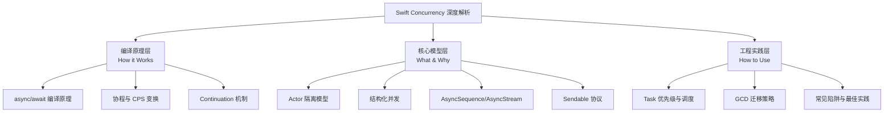
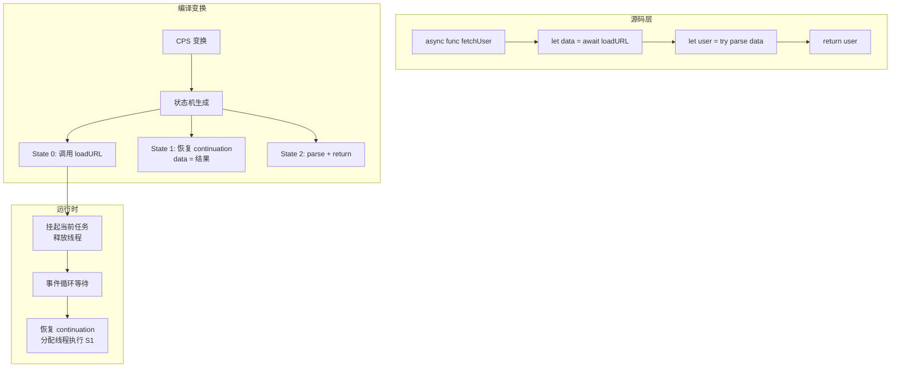
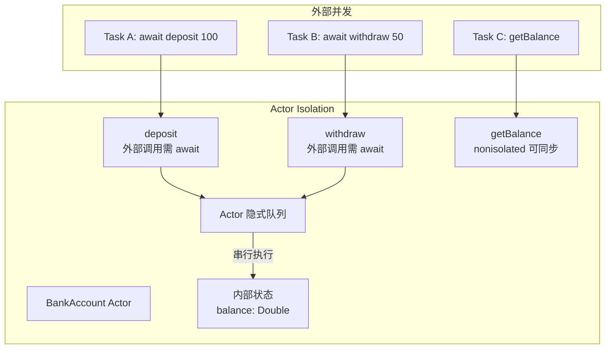
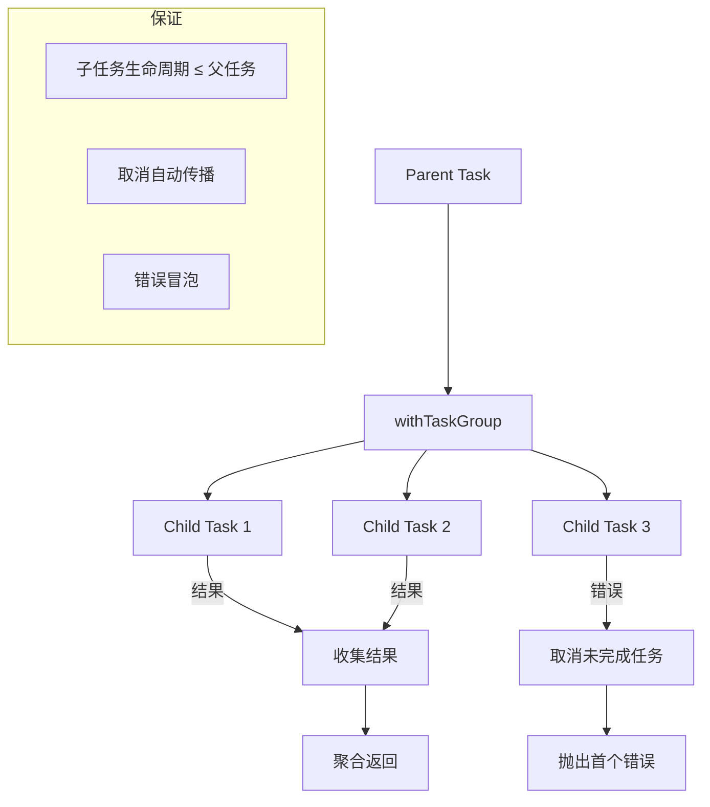
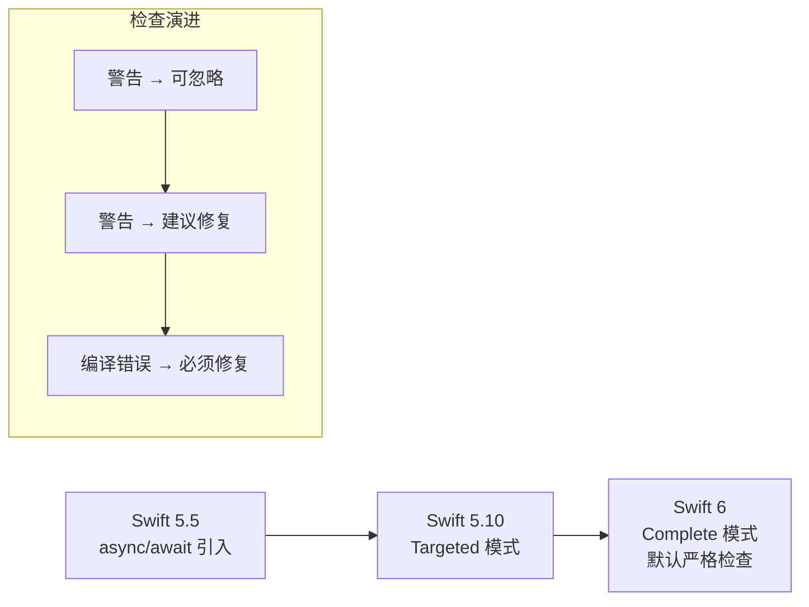
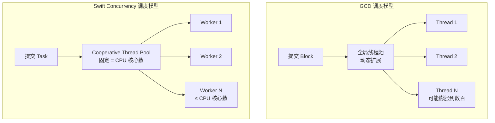

# Swift Concurrency 深度解析 — 详细解析

> **核心结论**：Swift Concurrency 是 Apple 于 WWDC 2021 推出的语言级并发模型，通过 async/await、Actor、结构化并发三大支柱，将并发编程从「手动线程管理」提升为「编译器保障的安全并发」。其核心优势在于：编译器自动推断 suspension point、Actor 隔离保证数据竞争安全、TaskGroup 提供结构化并发语义。从 GCD 迁移到 Swift Concurrency 不仅是 API 更替，更是从「基于回调的异步」到「基于协程的同步式异步」的范式转变。

---

## 核心结论 TL;DR

| 主题 | 核心结论 | 关键洞察 |
|------|---------|---------|
| **async/await** | 编译器将 async 函数变换为状态机（CPS 变换），suspension point 处保存 continuation | 不是语法糖，是语言级协程实现 |
| **Actor** | 通过 actor isolation 保证内部状态的互斥访问，reentrancy 是最大陷阱 | Actor 不是锁，是隔离边界；可重入性需显式处理 |
| **结构化并发** | TaskGroup 保证子任务的生命周期不超出父任务，取消自动传播 | 与 GCD 的「发射后不管」完全相反 |
| **AsyncSequence** | 异步拉取模型，天然支持背压，替代 Combine 的推送模型 | 背压由消费者控制拉取速度 |
| **Sendable** | 编译器静态检查跨并发边界的数据安全性，Swift 6 默认严格模式 | Sendable 检查是 Swift 6 最重要的并发安全特性 |
| **Task 调度** | Cooperative Thread Pool 固定线程数，避免线程爆炸，与 GCD 的线程池不同 | 合作式调度，非抢占式 |

---

## 文章结构概览



---

# 第一层：编译原理层

## 1. async/await 编译原理

**结论先行**：async/await 不是语法糖，而是语言级协程实现。编译器将 async 函数通过 CPS（Continuation-Passing Style）变换转为状态机，每个 suspension point 对应状态机的一个状态转换。这使得 async 函数在 suspension point 处可以挂起当前执行、释放线程，待异步操作完成后恢复执行。

### 1.1 协程实现机制



**CPS 变换过程详解**：

```swift
// 源码：开发者编写的 async 函数
func fetchUser(id: String) async throws -> User {
    let data = try await loadURL("https://api.example.com/users/\(id)")
    let user = try parse(data)
    return user
}

// 编译器内部等价变换（简化表示）
func fetchUser(id: String, continuation: Continuation) {
    switch continuation.state {
    case 0: // 初始状态
        let loadOp = loadURL("https://api.example.com/users/\(id)")
        loadOp.onComplete { result in
            continuation.data = result
            continuation.state = 1
            continuation.resume()  // 恢复执行
        }
        return  // 挂起，释放线程
    
    case 1: // loadURL 完成后恢复
        let data = continuation.data!
        let user = try parse(data)
        continuation.returnValue = user
        continuation.complete()
    }
}
```

### 1.2 Suspension Point 深度解析

**结论先行**：suspension point 是 async 函数中可能挂起执行的点，仅出现在 `await` 表达式处。编译器在每个 suspension point 插入状态保存和恢复逻辑，确保挂起时线程可被其他任务复用。

| Suspension Point 行为 | 说明 |
|----------------------|------|
| **挂起前** | 保存当前栈帧到堆上的 continuation 对象 |
| **挂起时** | 当前线程回到线程池，可执行其他 Task |
| **恢复时** | 从线程池获取线程，恢复 continuation 执行 |
| **不可挂起点** | 同步代码区域、nonisolated 区域内的同步代码 |

> **关键区分**：`await` 不一定导致挂起。如果被 await 的异步操作已完成（结果已缓存），则直接继续执行而不挂起。`await` 只是标记一个「可能挂起点」。

### 1.3 Continuation 机制

**结论先行**：Continuation 是 async/await 的核心运行时抽象，封装了函数挂起后的恢复信息。Swift 提供 `UnsafeContinuation` 和 `CheckedContinuation` 两种类型，用于将基于回调的 API 桥接到 async/await。

```swift
// CheckedContinuation 桥接回调式 API
func loadURL(_ url: String) async throws -> Data {
    try await withCheckedThrowingContinuation { continuation in
        let task = URLSession.shared.dataTask(with: URL(string: url)!) { data, response, error in
            if let error = error {
                continuation.resume(throwing: error)
            } else if let data = data {
                continuation.resume(returning: data)
            } else {
                continuation.resume(throwing: URLError(.badServerResponse))
            }
        }
        task.resume()
    }
}
```

**CheckedContinuation vs UnsafeContinuation**：

| 特性 | CheckedContinuation | UnsafeContinuation |
|------|--------------------|--------------------|
| **安全检查** | 运行时校验 resume 只调用一次 | 无检查，重复 resume 导致未定义行为 |
| **性能开销** | 微小的运行时检查开销 | 零开销 |
| **推荐场景** | 所有常规使用 | 极端性能敏感路径 |
| **Debug 诊断** | 重复 resume 触发 trap + 清晰错误 | 未定义行为，难以调试 |
| **默认选择** | ✅ 推荐 | ⚠️ 仅在 profile 确认热点后 |

---

# 第二层：核心模型层

## 2. Actor 模型深度解析

**结论先行**：Actor 是 Swift Concurrency 的数据隔离原语，通过编译器和运行时联合保证 actor 内部状态不会被并发访问。Actor 不是锁——它是隔离边界，外部访问必须经过 `await` 隐式排队。Actor 最大的陷阱是 reentrancy（可重入性），同一 actor 的多个方法可以交错执行。

### 2.1 Actor 隔离机制



```swift
// Actor 定义与隔离
actor BankAccount {
    private var balance: Double = 0
    
    // 隔离方法：外部必须 await 调用
    func deposit(_ amount: Double) {
        balance += amount
    }
    
    func withdraw(_ amount: Double) throws -> Double {
        guard balance >= amount else {
            throw InsufficientFundsError()
        }
        balance -= amount
        return amount
    }
    
    // nonisolated：脱离 Actor 隔离，可同步调用
    nonisolated var accountType: String {
        "Checking"  // 不访问隔离状态
    }
}

// 外部使用
let account = BankAccount()
await account.deposit(100.0)  // 必须 await
let withdrawn = try await account.withdraw(50.0)
print(account.accountType)  // 无需 await，nonisolated
```

### 2.2 Reentrancy（可重入性）— 最大陷阱

**结论先行**：Actor 方法在遇到 `await` 挂起时，会允许其他等待中的 actor 方法执行。这导致同一个 actor 的方法可以交错执行，造成逻辑错误。这是 Swift Actor 设计中争议最大的特性，也是从 GCD 串行队列迁移时最常见的 bug 来源。

```swift
actor ImageCache {
    private var cache: [URL: UIImage] = [:]
    private var inFlightRequests: [URL: Task<UIImage>] = [:]
    
    // ❌ 错误：reentrancy 导致重复下载
    func loadImage(_ url: URL) async -> UIImage {
        if let cached = cache[url] {
            return cached  // 缓存命中，直接返回
        }
        // ⚠️ 此处 await 挂起，其他调用可能进入
        // 如果两个 Task 同时执行到这里，都会发起网络请求
        let image = try! await downloadImage(url)
        cache[url] = image
        return image
    }
    
    // ✅ 正确：使用 in-flight 请求去重
    func loadImageDeduplicated(_ url: URL) async -> UIImage {
        if let cached = cache[url] {
            return cached
        }
        if let inFlight = inFlightRequests[url] {
            return await inFlight.value  // 复用已有请求
        }
        let task = Task<UIImage> {
            let image = try! await downloadImage(url)
            return image
        }
        inFlightRequests[url] = task
        let image = await task.value
        inFlightRequests[url] = nil
        cache[url] = image
        return image
    }
}
```

**Reentrancy 行为时序**：

```mermaid
sequenceDiagram
    participant TA as Task A
    participant Actor as ImageCache Actor
    participant TB as Task B
    
    TA->>Actor: loadImage(url) — 缓存未命中
    Actor->>Actor: 执行 downloadImage(url)
    Note over Actor: await 挂起，Actor 释放
    TB->>Actor: loadImage(url) — 缓存仍为空
    Note over Actor: ❌ 再次发起下载
    Actor-->>TA: 下载完成，缓存
    Actor-->>TB: 下载完成，再次缓存
```

### 2.3 GlobalActor 与 @MainActor

**结论先行**：GlobalActor 是全局唯一的 Actor 实例，`@MainActor` 是最常用的 GlobalActor，确保代码在主线程执行。`@MainActor` 的实现基于主线程的 dispatch queue，而非普通 Actor 的协作式调度。

```swift
// @MainActor 标注
@MainActor
class ViewModel: ObservableObject {
    @Published var items: [Item] = []
    
    func loadData() async {
        // 此方法自动在主线程执行
        items = await fetchItems()
    }
    
    // 显式脱离 MainActor
    nonisolated func computeHash(_ data: Data) -> Int {
        // 在调用线程执行，不切换到主线程
        return data.hashValue
    }
}

// 自定义 GlobalActor
protocol DatabaseActor: GlobalActor {}
enum DBActor: DatabaseActor {
    actor SharedActor {}
    static let shared = SharedActor()
}

@DBActor
func performQuery(_ sql: String) -> [Row] {
    // 自动在 DBActor 上串行执行
    return execute(sql)
}
```

| 特性 | 普通 Actor | GlobalActor | @MainActor |
|------|-----------|-------------|------------|
| **实例方式** | 每次创建新实例 | 全局单例 | 全局单例（主线程） |
| **调度机制** | Cooperative Thread Pool | Cooperative Thread Pool | Main Run Loop / DispatchQueue |
| **声明方式** | `actor Foo {}` | `@globalActor enum Foo` | 内置 `@MainActor` |
| **隔离粒度** | 实例级隔离 | 全局隔离 | 全局隔离（主线程） |
| **典型用途** | 封装可变状态 | 数据库访问、文件 I/O | UI 更新 |

---

## 3. TaskGroup 与结构化并发

**结论先行**：结构化并发是 Swift Concurrency 的核心设计哲学，要求子任务的生命周期不能超出父任务。`TaskGroup` 是结构化并发的实现原语，保证：1) 所有子任务完成后父任务才完成；2) 父任务取消时自动传播到子任务；3) 子任务的错误可被父任务收集。

### 3.1 TaskGroup / ThrowingTaskGroup



```swift
// TaskGroup：并行下载多张图片
func loadAllImages(urls: [URL]) async -> [UIImage] {
    await withTaskGroup(of: UIImage?.self) { group in
        for url in urls {
            group.addTask {
                try? await loadImage(url)  // 单个失败不影响其他
            }
        }
        
        var results: [UIImage] = []
        for await image in group {
            if let image = image {
                results.append(image)
            }
        }
        return results
    }
}

// ThrowingTaskGroup：任一失败则全部取消
func loadAllImagesStrict(urls: [URL]) async throws -> [UIImage] {
    try await withThrowingTaskGroup(of: UIImage.self) { group in
        for url in urls {
            group.addTask {
                try await loadImage(url)  // 失败会取消同组其他任务
            }
        }
        
        var results: [UIImage] = []
        for try await image in group {
            results.append(image)
        }
        return results
    }
}
```

### 3.2 任务取消传播

**结论先行**：Swift Concurrency 采用协作式取消（Cooperative Cancellation），取消不会强制中断任务，而是设置取消标志。任务需要在 suspension point 或手动检查 `Task.isCancelled` 来响应取消。

```swift
// 协作式取消检查
func processItems(_ items: [Item]) async throws -> [Result] {
    var results: [Result] = []
    for item in items {
        // 检查取消状态
        try Task.checkCancellation()
        
        let result = try await process(item)
        results.append(result)
    }
    return results
}

// 取消传播示例
func parentTask() async {
    let task = Task {
        await withTaskGroup(of: Void.self) { group in
            group.addTask {
                await longRunningWork1()  // 内部检查 isCancelled
            }
            group.addTask {
                await longRunningWork2()
            }
        }
    }
    
    // 3 秒后取消
    try? await Task.sleep(for: .seconds(3))
    task.cancel()  // 取消传播到所有子任务
}
```

| 取消机制 | 行为 | 使用场景 |
|---------|------|---------|
| `Task.cancel()` | 设置取消标志，传播到子任务 | 用户主动取消 |
| `Task.isCancelled` | 只读检查，不抛出 | 可恢复的取消 |
| `Task.checkCancellation()` | 检查并抛出 CancellationError | 不可恢复的取消 |
| `withTaskCancellationHandler` | 取消时执行同步回调 | 需要清理资源 |
| `Task.currentPriority` | 取消后优先级降低 | 优先级调整 |

---

## 4. AsyncSequence / AsyncStream

**结论先行**：AsyncSequence 是异步拉取序列协议，消费者通过 `for await` 主动拉取下一个值，天然支持背压（消费者控制速度）。AsyncStream 是 AsyncSequence 的高层封装，用于将推送式回调转换为异步序列。

### 4.1 AsyncSequence 协议体系

```mermaid
graph TB
    AS[AsyncSequence] --> AI[AsyncIterator]
    AS --> AC[AsyncCollection]
    AS --> ACh[AsyncChannel]
    
    subgraph 标准实现
        AS --> AST[AsyncStream]
        AS --> ASTC[AsyncThrowingStream]
        AS --> AT[AsyncTimer]
        AS -> AL[AsyncLineSequence<br/>URL.lines]
    end
    
    subgraph 自定义
        AS --> CUSTOM[自定义 AsyncSequence]
    end
```

```swift
// 使用内置 AsyncSequence
func readLogFile(url: URL) async {
    // URL.lines 是 AsyncSequence
    for await line in url.lines {
        print(line)
    }
}

// AsyncStream：将 NotificationCenter 回调转为异步序列
func observeNotifications(name: Notification.Name) -> AsyncStream<Notification> {
    AsyncStream { continuation in
        let observer = NotificationCenter.default.addObserver(
            forName: name,
            object: nil,
            queue: .main
        ) { notification in
            continuation.yield(notification)
        }
        
        continuation.onTermination = { _ in
            NotificationCenter.default.removeObserver(observer)
        }
    }
}

// 使用
for await notification in observeNotifications(name: .UIApplicationDidBecomeActive) {
    print("App became active")
}
```

### 4.2 自定义 AsyncSequence 与背压

```swift
// 自定义 AsyncSequence：分页数据加载
struct PaginatedLoader: AsyncSequence {
    typealias Element = [Item]
    
    let baseURL: URL
    let pageSize: Int
    
    struct Iterator: AsyncIteratorProtocol {
        let baseURL: URL
        let pageSize: Int
        var currentPage = 0
        var hasMore = true
        
        mutating func next() async throws -> [Item]? {
            guard hasMore else { return nil }
            
            // 背压：只有消费者调用 next() 时才加载下一页
            let url = baseURL.appending(queryItems: [
                .init(name: "page", value: "\(currentPage)"),
                .init(name: "size", value: "\(pageSize)")
            ])
            let response: PageResponse = try await fetch(url)
            currentPage += 1
            hasMore = response.hasMore
            return response.items
        }
    }
    
    func makeAsyncIterator() -> Iterator {
        Iterator(baseURL: baseURL, pageSize: pageSize)
    }
}

// 消费者控制拉取速度 → 天然背压
let loader = PaginatedLoader(baseURL: apiURL, pageSize: 20)
for await page in loader {
    // 处理完当前页才会请求下一页
    process(page)
}
```

| 模型 | 背压支持 | 典型实现 | 内存风险 |
|------|---------|---------|---------|
| **AsyncSequence（拉取）** | ✅ 天然支持 | for await 循环 | 无，消费者控制 |
| **AsyncStream（桥接）** | ⚠️ 需手动控制 | continuation.yield | 缓冲区溢出 |
| **Combine（推送）** | 需背压操作符 | sink + buffer | 高，需主动限流 |

---

## 5. Sendable 协议与并发安全

**结论先行**：Sendable 是 Swift Concurrency 的类型安全基石，标记跨并发边界安全传递的类型。编译器在 Swift 6 严格模式下对 Sendable 进行静态检查，确保跨 Task/Actor 传递的数据不会产生数据竞争。

### 5.1 Sendable 检查规则

```swift
// ✅ 自动符合 Sendable：值类型 + 所有存储属性为 Sendable
struct Point: Sendable {
    let x: Double  // let 不可变
    let y: Double
}

// ❌ 不符合 Sendable：包含引用类型可变状态
class Counter {
    var count = 0  // 可变引用类型 → 不 Sendable
}

// ✅ 使用 @unchecked Sendable：运行时安全但编译器无法验证
final class AtomicCounter: @unchecked Sendable {
    private let lock = NSLock()
    private var _count = 0
    
    var count: Int {
        lock.withLock { _count }
    }
    
    func increment() {
        lock.withLock { _count += 1 }
    }
}

// ✅ @Sendable 闭包：标记跨并发边界传递的闭包
Task {
    @Sendable () -> Void in
    // 闭包捕获的值必须是 Sendable 的
}

// ❌ 编译错误（Swift 6 严格模式）
func shareState() {
    var counter = 0
    Task {
        counter += 1  // 错误：捕获可变 var
    }
}

// ✅ 正确做法
func shareStateCorrect() {
    let counter = AtomicCounter()
    Task {
        counter.increment()  // counter 是 Sendable 的
    }
}
```

### 5.2 Swift 6 Strict Concurrency 演进

| 模式 | Swift 版本 | 检查级别 | 典型行为 |
|------|-----------|---------|---------|
| **Minimal** | Swift 5.5+ | 仅 @Sendable 闭包 | 警告极少 |
| **Targeted** | Swift 5.10 | `Sendable` 一致性检查 | 警告：非 Sendable 跨边界 |
| **Complete** | Swift 6 | 全面严格检查 | 错误：所有并发安全违规 |
| **Swift 6 Language Mode** | Swift 6+ | 默认 Complete | 全部变为编译错误 |



---

# 第三层：工程实践层

## 6. Task 优先级与调度

**结论先行**：Swift Concurrency 使用 Cooperative Thread Pool（合作式线程池），线程数量固定为 CPU 核心数，避免 GCD 的线程爆炸问题。Task 优先级映射到 QoS 类，运行时通过 priority escalation 确保高优先级任务及时执行。

### 6.1 TaskPriority 体系

```swift
// Task 优先级
Task(priority: .high) {
    // 对应 userInitiated QoS
    await processData()
}

Task(priority: .low) {
    // 对应 utility QoS
    await cleanupCache()
}

Task(priority: .background) {
    // 对应 background QoS
    await syncDatabase()
}
```

| TaskPriority | QoS 对应 | 使用场景 |
|-------------|---------|---------|
| `.high` | userInitiated | 用户直接触发的操作 |
| `.medium` | default | 常规异步操作 |
| `.low` | utility | 长时间后台任务，有进度 |
| `.background` | background | 低优先级维护任务 |
| `.userInitiated` | userInitiated | 等同 .high |

### 6.2 Cooperative Thread Pool 与 GCD 对比



| 维度 | GCD | Swift Concurrency |
|------|-----|-------------------|
| **线程数** | 动态扩展，可能数百 | 固定，等于 CPU 核心数 |
| **调度模型** | 抢占式（OS 调度） | 合作式（Task 自愿让出） |
| **栈空间** | 每线程 512KB 栈 | 堆上 continuation，无栈 |
| **线程阻塞** | 阻塞时创建新线程 | 不应阻塞，需 await 让出 |
| **优先级反转** | 需手动处理 | Runtime 自动 priority inversion 避免 |
| **取消支持** | 无原生支持 | Task.isCancelled + 传播 |

> 关于 GCD 和 pthread 的详细解析，请参阅 [iOS多线程详细解析](../../thread/05_跨平台多线程实践/iOS多线程_详细解析.md)

---

## 7. 从 GCD 迁移到 Swift Concurrency

**结论先行**：GCD → Swift Concurrency 迁移不是一次性重构，而是渐进式演进。核心策略：1) 用 `async/await` 替换 completion handler 嵌套；2) 用 Actor 替换串行 DispatchQueue 保护的状态；3) 用 TaskGroup 替换 DispatchGroup 并行控制；4) 用 CheckedContinuation 桥接尚未 async 化的 API。

### 7.1 迁移策略总览

```mermaid
graph LR
    subgraph 阶段1: 边缘替换
        CB[Completion Handler] --> AW[async/await]
        DG1[DispatchQueue.async] --> TASK[Task {}]
    end
    
    subgraph 阶段2: 状态保护替换
        SDQ[串行 DispatchQueue] --> ACT[Actor]
        LOCK[NSLock/os_unfair_lock] --> ACT2[Actor]
    end
    
    subgraph 阶段3: 并行控制替换
        DGRP[DispatchGroup] --> TG[TaskGroup]
        SEM[DispatchSemaphore] --> TGR[TaskGroup/AsyncStream]
    end
    
    阶段1 --> 阶段2 --> 阶段3
```

### 7.2 典型迁移模式

```swift
// ❌ GCD 回调地狱
func fetchUserProfile(userId: String, completion: @escaping (Result<User, Error>) -> Void) {
    URLSession.shared.dataTask(with: makeUserURL(userId)) { data, _, error in
        if let error = error {
            completion(.failure(error))
            return
        }
        guard let data = data else {
            completion(.failure(URLError(.badServerResponse)))
            return
        }
        self.parseUser(data) { result in
            switch result {
            case .success(let user):
                self.loadAvatar(url: user.avatarURL) { result in
                    switch result {
                    case .success(let avatar):
                        var user = user
                        user.avatar = avatar
                        completion(.success(user))
                    case .failure(let error):
                        completion(.failure(error))
                    }
                }
            case .failure(let error):
                completion(.failure(error))
            }
        }
    }.resume()
}

// ✅ async/await 线性化
func fetchUserProfile(userId: String) async throws -> User {
    let data = try await URLSession.shared.data(from: makeUserURL(userId)).0
    var user = try parseUser(data)
    user.avatar = try await loadAvatar(url: user.avatarURL)
    return user
}
```

```swift
// ❌ GCD 串行队列保护状态
class DataStore {
    private let queue = DispatchQueue(label: "com.app.datastore")
    private var _cache: [String: Data] = [:]
    
    func set(_ data: Data, forKey key: String) {
        queue.sync { _cache[key] = data }
    }
    
    func get(forKey key: String) -> Data? {
        queue.sync { _cache[key] }
    }
}

// ✅ Actor 替代
actor DataStore {
    private var cache: [String: Data] = [:]
    
    func set(_ data: Data, forKey key: String) {
        cache[key] = data
    }
    
    func get(forKey key: String) -> Data? {
        cache[key]
    }
}
```

```swift
// ❌ DispatchGroup 并行下载
func downloadAll(urls: [URL], completion: @escaping ([Data?]) -> Void) {
    let group = DispatchGroup()
    var results: [Data?] = Array(repeating: nil, count: urls.count)
    
    for (index, url) in urls.enumerated() {
        group.enter()
        URLSession.shared.dataTask(with: url) { data, _, _ in
            results[index] = data
            group.leave()
        }.resume()
    }
    
    group.notify(queue: .global()) {
        completion(results)
    }
}

// ✅ TaskGroup 替代
func downloadAll(urls: [URL]) async -> [Data?] {
    await withTaskGroup(of: (Int, Data?).self) { group in
        for (index, url) in urls.enumerated() {
            group.addTask {
                let data = try? await URLSession.shared.data(from: url).0
                return (index, data)
            }
        }
        
        var results: [Data?] = Array(repeating: nil, count: urls.count)
        for await (index, data) in group {
            results[index] = data
        }
        return results
    }
}
```

### 7.3 常见迁移陷阱

| 陷阱 | 现象 | 根因 | 解决方案 |
|------|------|------|---------|
| **在 Actor 中同步等待** | 死锁 | Actor 方法不能同步调用自身 | 全部使用 async/await |
| **Task.init 丢失上下文** | 优先级/结构化丢失 | `Task {}` 创建非结构化任务 | 优先用 withTaskGroup |
| **阻塞 Cooperative Thread** | 所有 Task 停滞 | 在 async 上下文使用信号量/锁 | 用 await 替代阻塞 |
| **CheckedContinuation 重复 resume** | 运行时 crash | 回调可能多次触发 | 确保 resume 恰好调用一次 |
| **Actor reentrancy 数据不一致** | 状态回退/重复操作 | await 挂起后其他调用进入 | in-flight 去重 + 状态机保护 |
| **@MainActor 死锁** | 主线程卡住 | 在 MainActor 方法中同步等待主线程 | 避免跨 Actor 同步等待 |

### 7.4 CheckedContinuation 桥接清单

```swift
// 桥接第三方 SDK 回调 → async/await
extension ThirdPartySDK {
    func authenticateAsync() async throws -> Token {
        try await withCheckedThrowingContinuation { continuation in
            self.authenticate { result in
                switch result {
                case .success(let token):
                    continuation.resume(returning: token)
                case .failure(let error):
                    continuation.resume(throwing: error)
                }
            }
        }
    }
}

// 桥接 delegate 回调 → AsyncStream
extension QRScanner: AVCaptureMetadataOutputObjectsDelegate {
    var scannedCodes: AsyncStream<String> {
        AsyncStream { continuation in
            self.onScan = { code in
                continuation.yield(code)
            }
            continuation.onTermination = { [weak self] _ in
                self?.stopScanning()
            }
        }
    }
}
```

---

## 附录：Swift Concurrency 完整 API 速查

| 类别 | API | 用途 | 最低版本 |
|------|-----|------|---------|
| **异步函数** | `async/await` | 异步代码线性化 | Swift 5.5, iOS 15 |
| **Actor** | `actor {}` | 状态隔离 | Swift 5.5, iOS 15 |
| **结构化并发** | `withTaskGroup` | 并行子任务 | Swift 5.5, iOS 15 |
| **结构化并发** | `withThrowingTaskGroup` | 可抛错的并行子任务 | Swift 5.5, iOS 15 |
| **非结构化任务** | `Task {}` | 独立异步任务 | Swift 5.5, iOS 15 |
| **非结构化任务** | `Task.detached` | 不继承上下文的任务 | Swift 5.5, iOS 15 |
| **桥接** | `withCheckedContinuation` | 回调 → async | Swift 5.5, iOS 15 |
| **桥接** | `withCheckedThrowingContinuation` | 回调 → async throws | Swift 5.5, iOS 15 |
| **异步序列** | `AsyncStream` | 回调 → AsyncSequence | Swift 5.5, iOS 15 |
| **异步序列** | `AsyncThrowingStream` | 可抛错的异步流 | Swift 5.5, iOS 15 |
| **时钟** | `Task.sleep(for:)` | 基于时间的挂起 | Swift 5.7, iOS 16 |
| **并发安全** | `Sendable` | 跨并发边界类型安全 | Swift 5.5, iOS 15 |
| **全局 Actor** | `@MainActor` | 主线程执行 | Swift 5.5, iOS 15 |
| **取消处理** | `withTaskCancellationHandler` | 取消时执行清理 | Swift 5.5, iOS 15 |

---

> **相关文档**：
> - 关于 GCD 和 pthread 的详细解析，请参阅 [iOS多线程详细解析](../../thread/05_跨平台多线程实践/iOS多线程_详细解析.md)
> - 关于网络框架与数据持久化，请参阅 [网络框架与数据持久化详细解析](./网络框架与数据持久化_详细解析.md)
> - 关于 SwiftUI 并发集成，请参阅 [SwiftUI深度解析](../02_SwiftUI深度解析/)
