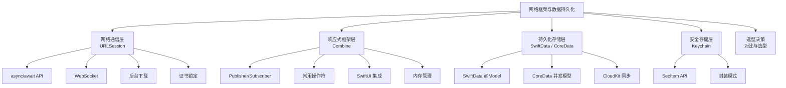
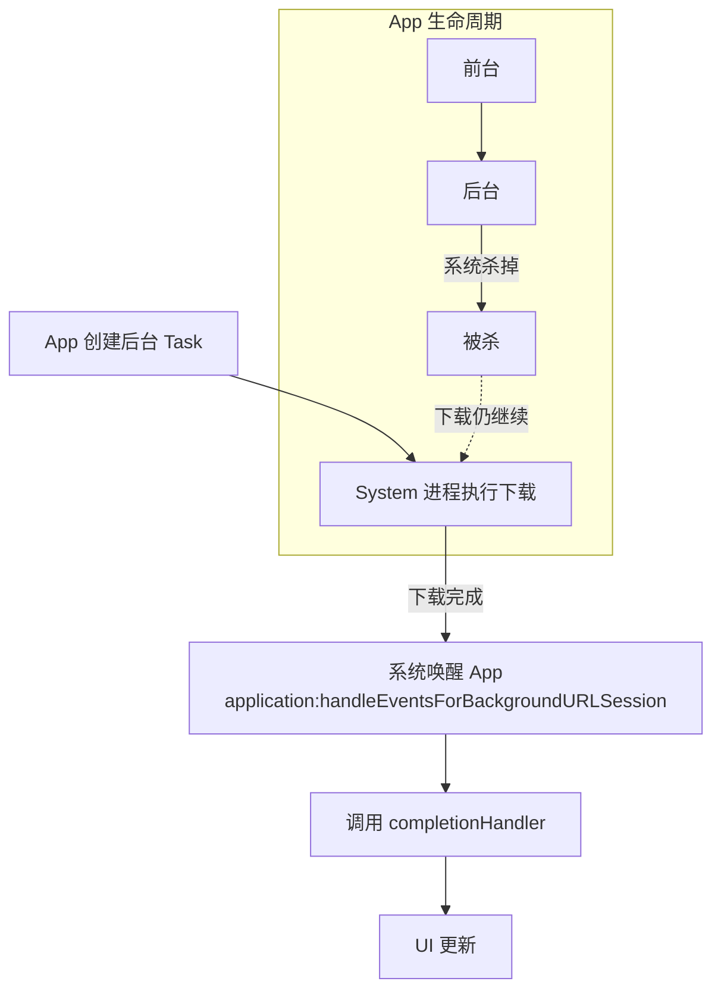
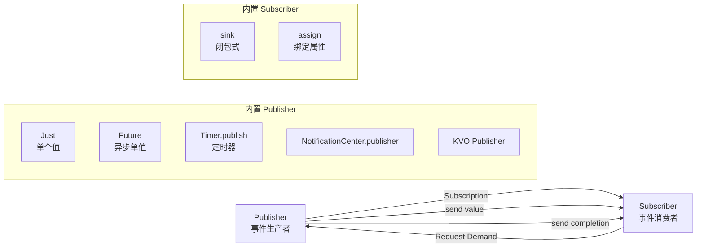
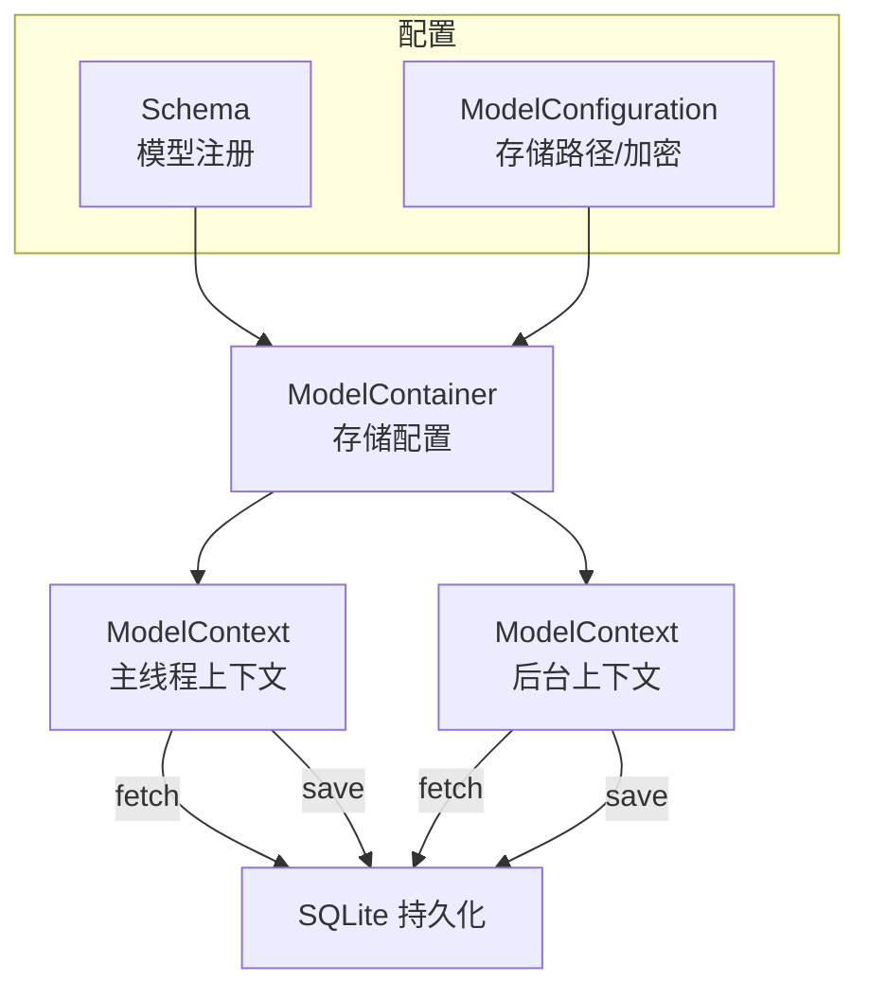
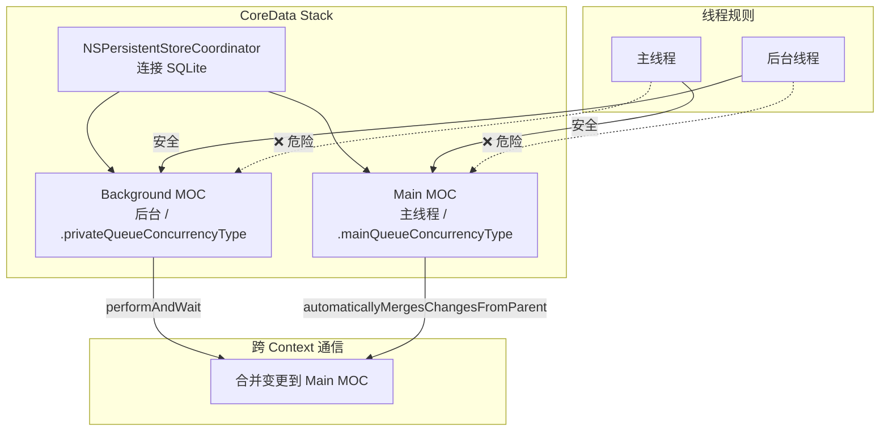

# 网络框架与数据持久化 — 详细解析

> **核心结论**：iOS 网络与持久化框架经历了从命令式到声明式的范式演进。URLSession 在 iOS 15 引入 async/await API 后成为现代化网络层基石；Combine 为响应式编程提供统一抽象；SwiftData（iOS 17+）用宏驱动的方式替代 CoreData 的繁琐模板代码；CoreData 仍是复杂持久化场景的成熟方案；Keychain 提供安全存储最后一道防线。选型核心原则：简单数据用 UserDefaults，安全凭证用 Keychain，结构化数据用 SwiftData/CoreData，实时流用 Combine。

---

## 核心结论 TL;DR

| 主题 | 核心结论 | 关键洞察 |
|------|---------|---------|
| **URLSession** | iOS 15 async/await API 使网络请求线性化，WebSocket 和后台下载是两大高阶能力 | 后台下载是唯一 app 被杀后仍可完成的机制 |
| **Combine** | Publisher-Subscriber 模型统一事件流，与 SwiftUI 通过 @Published 天然集成 | AnyCancellable 必须持有，否则订阅立即取消 |
| **SwiftData** | @Model 宏 + ModelContainer 大幅简化 CoreData 样板代码，但 iOS 17+ 限制 Adoption | 不是 CoreData 替代品，是 CoreData 的 Swift 原生封装 |
| **CoreData** | NSManagedObjectContext 并发模型是最大复杂性来源，必须遵守 thread confinement | CloudKit 同步是 CoreData 的杀手级特性 |
| **Keychain** | 硬件级加密存储，SecItem API 繁琐但无更安全的替代方案 | 第三方封装库（KeychainAccess）大幅降低使用门槛 |
| **选型决策** | 没有万能方案，根据数据特征和安全需求选择 | 混合使用是常态（UserDefaults + Keychain + SwiftData） |

---

## 文章结构概览



---

# 第一层：网络通信

## 1. URLSession 现代化

**结论先行**：URLSession 在 iOS 15 引入 async/await API 后，网络请求从回调嵌套变为线性代码。URLSessionWebSocketTask 提供原生 WebSocket 支持，后台下载是 app 被杀后仍可完成下载的唯一机制，证书锁定（Pinning）是防止中间人攻击的最终防线。

### 1.1 async/await API

```swift
// iOS 15+ async/await 网络请求
func fetchUser(id: String) async throws -> User {
    let url = URL(string: "https://api.example.com/users/\(id)")!
    let (data, response) = try await URLSession.shared.data(from: url)
    
    guard let httpResponse = response as? HTTPURLResponse,
          (200...299).contains(httpResponse.statusCode) else {
        throw NetworkError.invalidResponse(response)
    }
    
    return try JSONDecoder().decode(User.self, from: data)
}

// 上传数据
func uploadImage(_ image: UIImage, to url: URL) async throws -> URL {
    let data = image.jpegData(compressionQuality: 0.8)!
    var request = URLRequest(url: url)
    request.httpMethod = "POST"
    request.setValue("image/jpeg", forHTTPHeaderField: "Content-Type")
    
    let (_, response) = try await URLSession.shared.upload(for: request, from: data)
    guard let httpResponse = response as? HTTPURLResponse,
          httpResponse.statusCode == 201 else {
        throw NetworkError.uploadFailed
    }
    return url
}
```

| URLSession async API | 用途 | 最低版本 |
|---------------------|------|---------|
| `data(from:)` | GET 请求 | iOS 15 |
| `data(for:)` | 自定义 URLRequest | iOS 15 |
| `upload(for:from:)` | 上传数据 | iOS 15 |
| `download(from:)` | 下载文件 | iOS 15 |
| `bytes(from:)` | 流式读取 | iOS 15 |
| `webSocketTask(with:)` | WebSocket | iOS 15 |

### 1.2 URLSessionWebSocketTask

**结论先行**：URLSessionWebSocketTask 提供原生 WebSocket 支持，支持文本和二进制消息，配合 AsyncSequence 实现简洁的消息循环。

```swift
// WebSocket 连接与消息处理
actor WebSocketClient {
    private var webSocketTask: URLSessionWebSocketTask?
    
    func connect(to url: URL) async throws {
        let session = URLSession(configuration: .default)
        webSocketTask = session.webSocketTask(with: url)
        webSocketTask?.resume()
        
        // 使用 AsyncSequence 接收消息
        try await receiveMessages()
    }
    
    private func receiveMessages() async throws {
        guard let task = webSocketTask else { return }
        
        // 使用 AsyncSequence 迭代消息
        for try await message in task {
            switch message {
            case .string(let text):
                print("Received text: \(text)")
            case .data(let binaryData):
                print("Received binary: \(binaryData.count) bytes")
            @unknown default:
                break
            }
        }
    }
    
    func send(_ text: String) async throws {
        try await webSocketTask?.send(.string(text))
    }
    
    func disconnect() {
        webSocketTask?.cancel(with: .goingAway, reason: nil)
        webSocketTask = nil
    }
}
```

### 1.3 后台下载

**结论先行**：后台下载是 URLSession 最强大的特性之一，即使 app 被 system 杀掉，下载仍由系统进程完成。这是 iOS 上唯一支持 app 非活跃态数据传输的机制。



```swift
// 后台下载配置
class DownloadManager: NSObject, URLSessionDownloadDelegate {
    private lazy var session: URLSession = {
        let config = URLSessionConfiguration.background(withIdentifier: "com.app.backgroundDownload")
        config.isDiscretionary = true  // 系统择机下载
        config.sessionSendsLaunchEvents = true
        return URLSession(configuration: config, delegate: self, delegateQueue: nil)
    }()
    
    private var completionHandler: (() -> Void)?
    
    func download(from url: URL) {
        let task = session.downloadTask(with: url)
        task.resume()
    }
    
    // 下载完成回调
    func urlSession(_ session: URLSession, downloadTask: URLSessionDownloadTask,
                    didFinishDownloadingTo location: URL) {
        // 将临时文件移到永久位置
        let documentsDir = FileManager.default.urls(for: .documentDirectory, in: .userDomainMask)[0]
        let destination = documentsDir.appendingPathComponent(downloadTask.suggestedFilename ?? "file")
        try? FileManager.default.moveItem(at: location, to: destination)
    }
    
    // 后台下载完成，系统唤醒 App
    func application(_ application: UIApplication,
                     handleEventsForBackgroundURLSession identifier: String,
                     completionHandler: @escaping () -> Void) {
        self.completionHandler = completionHandler
    }
    
    func urlSessionDidFinishEvents(forBackgroundURLSession session: URLSession) {
        DispatchQueue.main.async { [weak self] in
            self?.completionHandler?()
            self?.completionHandler = nil
        }
    }
}
```

### 1.4 证书锁定（Certificate Pinning）

**结论先行**：证书锁定防止中间人攻击，通过验证服务器证书与本地预置的证书/公钥匹配。URLSession 通过 `urlSession(_:didReceive:completionHandler:)` delegate 方法实现。

```swift
class PinnedSessionDelegate: NSObject, URLSessionDelegate {
    // 预置的公钥哈希（Base64 SHA-256）
    private let pinnedPublicKeyHashes: Set<String> = [
        "grX4Ta9H7I3pDKXM0r0gT7Ec3K8=",  // 主证书
        "58qRu/uxXY6I6TzT2JlYvgzQ="     // 备份证书
    ]
    
    func urlSession(_ session: URLSession, didReceive challenge: URLAuthenticationChallenge,
                    completionHandler: @escaping (URLSession.AuthChallengeDisposition, URLCredential?) -> Void) {
        guard challenge.protectionSpace.authenticationMethod == NSURLAuthenticationMethodServerTrust,
              let serverTrust = challenge.protectionSpace.serverTrust else {
            completionHandler(.cancelAuthenticationChallenge, nil)
            return
        }
        
        // 验证证书链
        let policy = SecPolicyCreateSSL(true, challenge.protectionSpace.host as CFString)
        var trustResult: SecTrustResultType = .invalid
        SecTrustEvaluate(serverTrust, &trustResult)
        
        // 提取服务器证书公钥哈希
        let certificateCount = SecTrustGetCertificateCount(serverTrust)
        for index in 0..<certificateCount {
            guard let certificate = SecTrustGetCertificateAtIndex(serverTrust, index) else { continue }
            let publicKey = SecCertificateCopyKey(certificate)
            var error: Unmanaged<CFError>?
            guard let keyData = SecKeyCopyExternalRepresentation(publicKey!, &error) else { continue }
            
            let hash = sha256(keyData as Data)
            if pinnedPublicKeyHashes.contains(hash.base64EncodedString()) {
                completionHandler(.useCredential, URLCredential(trust: serverTrust))
                return
            }
        }
        
        completionHandler(.cancelAuthenticationChallenge, nil)
    }
}
```

---

# 第二层：响应式框架

## 2. Combine 框架

**结论先行**：Combine 是 Apple 的响应式编程框架，基于 Publisher-Subscriber 模型统一处理异步事件流。Combine 与 SwiftUI 的 @Published + ObservableObject 天然集成，是 MVVM 架构的核心纽带。内存管理的关键是持有 AnyCancellable，否则订阅立即被释放。

### 2.1 Publisher/Subscriber 模型



```swift
// Publisher 基本使用
let publisher = [1, 2, 3, 4, 5].publisher
    .map { $0 * 2 }
    .filter { $0 > 4 }
    .sink { value in
        print(value)  // 6, 8, 10
    }

// Future：将 async 操作包装为 Publisher
func loadUser(id: String) -> Future<User, Error> {
    Future { promise in
        URLSession.shared.dataTask(with: makeURL(id)) { data, _, error in
            if let error = error {
                promise(.failure(error))
            } else if let data = data {
                let user = try? JSONDecoder().decode(User.self, from: data)
                if let user = user {
                    promise(.success(user))
                }
            }
        }.resume()
    }
}
```

### 2.2 常用操作符分类

| 类别 | 操作符 | 功能 |
|------|--------|------|
| **变换** | `map`, `flatMap`, `scan`, `collect` | 值的变换与聚合 |
| **过滤** | `filter`, `removeDuplicates`, `replaceNil` | 条件过滤 |
| **组合** | `zip`, `combineLatest`, `merge` | 多流合并 |
| **时间** | `debounce`, `throttle`, `delay`, `timeout` | 时间控制 |
| **错误处理** | `catch`, `retry`, `replaceError` | 错误恢复 |
| **调度** | `receive(on:)`, `subscribe(on:)` | 线程切换 |
| **调试** | `print()`, `breakpoint()`, `handleEvents` | 调试辅助 |

### 2.3 与 SwiftUI 集成

```swift
// MVVM + SwiftUI + Combine 集成
class SearchViewModel: ObservableObject {
    @Published var searchText = ""
    @Published var results: [SearchResult] = []
    
    private var cancellables = Set<AnyCancellable>()
    
    init() {
        $searchText
            .debounce(for: .milliseconds(300), scheduler: RunLoop.main)
            .removeDuplicates()
            .flatMap { query -> AnyPublisher<[SearchResult], Never> in
                guard !query.isEmpty else {
                    return Just([]).eraseToAnyPublisher()
                }
                return self.search(query)
                    .catch { _ in Just([]) }
                    .eraseToAnyPublisher()
            }
            .receive(on: DispatchQueue.main)
            .assign(to: &$results)
    }
    
    private func search(_ query: String) -> AnyPublisher<[SearchResult], Error> {
        let url = URL(string: "https://api.example.com/search?q=\(query)")!
        return URLSession.shared.dataTaskPublisher(for: url)
            .map(\.data)
            .decode(type: [SearchResult].self, decoder: JSONDecoder())
            .eraseToAnyPublisher()
    }
}

struct SearchView: View {
    @StateObject private var viewModel = SearchViewModel()
    
    var body: some View {
        NavigationStack {
            List(viewModel.results) { result in
                Text(result.title)
            }
            .searchable(text: $viewModel.searchText)
        }
    }
}
```

### 2.4 内存管理：AnyCancellable

**结论先行**：Combine 订阅的生命周期由 AnyCancellable 控制。AnyCancellable 被释放时订阅自动取消。必须将 AnyCancellable 存储在适当的生命周期容器中（ViewModel 的 `Set<AnyCancellable>` 或 View 的 `cancellableSet`）。

```swift
// ✅ 正确：持有 AnyCancellable
class DashboardViewModel: ObservableObject {
    @Published var user: User?
    private var cancellables = Set<AnyCancellable>()
    
    func loadUser() {
        userService.fetchUser()
            .receive(on: DispatchQueue.main)
            .sink { completion in
                if case .failure(let error) = completion {
                    print("Error: \(error)")
                }
            } receiveValue: { [weak self] user in
                self?.user = user
            }
            .store(in: &cancellables)  // 持有，否则立即取消
    }
}

// ❌ 错误：AnyCancellable 未持有
func loadUser() {
    userService.fetchUser()
        .sink { user in
            // 永远不会执行！sink 返回的 AnyCancellable 立即被释放
            self.user = user
        }
}
```

| 存储策略 | 适用场景 | 生命周期 |
|---------|---------|---------|
| `Set<AnyCancellable>` | ViewModel / Service 单例 | 对象释放时取消 |
| View 的 `.onDisappear` | 视图级订阅 | 视图消失时取消 |
| `withCancelHandler` | 需要手动取消的订阅 | 手动调用 cancel() |
| 不存储 | 一次性订阅（如 Just） | 立即完成，无需持有 |

---

# 第三层：持久化存储

## 3. SwiftData 深度解析（iOS 17+）

**结论先行**：SwiftData 是 Apple 在 iOS 17 推出的现代持久化框架，基于宏驱动（@Model、@Query）替代 CoreData 的 .xcdatamodel 文件和代码生成。SwiftData 底层仍使用 CoreData 引擎，是 CoreData 的 Swift 原生 API 层，而非全新存储引擎。

### 3.1 @Model 宏解析

```swift
// SwiftData 模型定义
@Model
final class Article {
    var title: String
    var content: String
    var publishDate: Date
    var category: Category
    
    // 关系
    @Relationship(deleteRule: .cascade)
    var comments: [Comment] = []
    
    // 宏展开的等价代码（简化）
    // @Model 宏自动生成：
    // - Codable/Hashable 一致性
    // - 持久化属性后备存储
    // - 变更追踪（willSet/didSet 触发 update）
    // - Schema 注册
    
    init(title: String, content: String, category: Category) {
        self.title = title
        self.content = content
        self.publishDate = Date()
        self.category = category
    }
}

@Model
final class Comment {
    var text: String
    var createdAt: Date
    var article: Article?
    
    init(text: String) {
        self.text = text
        self.createdAt = Date()
    }
}

enum Category: String, Codable, PersistableEnum {
    case technology, design, business
}
```

### 3.2 ModelContainer / ModelContext



```swift
// ModelContainer 配置
@main
struct MyApp: App {
    var body: some Scene {
        WindowGroup {
            ContentView()
        }
        .modelContainer(for: [Article.self, Comment.self]) { result in
            switch result {
            case .success(let container):
                // 可选：配置迁移策略
                print("Container created")
            case .failure(let error):
                fatalError("Failed to create container: \(error)")
            }
        }
    }
}

// 手动创建 ModelContainer
let schema = Schema([Article.self, Comment.self])
let config = ModelConfiguration(
    schema: schema,
    isStoredInMemoryOnly: false,
    groupContainer: .appGroup("group.com.app.shared"),
    cloudKitDatabase: .automatic  // CloudKit 同步
)
let container = try ModelContainer(for: schema, configurations: [config])

// ModelContext 操作
let context = container.mainContext

// 插入
let article = Article(title: "SwiftData", content: "...", category: .technology)
context.insert(article)

// 查询
let articles = try context.fetch(FetchDescriptor<Article>(
    predicate: #Predicate { $0.category == .technology },
    sortBy: [SortDescriptor(\.publishDate, order: .reverse)]
))

// 删除
context.delete(article)

// 保存
try context.save()
```

### 3.3 @Query 视图集成

```swift
struct ArticleListView: View {
    @Query(
        filter: #Predicate<Article> { $0.category == .technology },
        sort: \Article.publishDate,
        order: .reverse
    ) private var articles: [Article]
    
    @Environment(\.modelContext) private var context
    
    var body: some View {
        List(articles) { article in
            VStack(alignment: .leading) {
                Text(article.title)
                    .font(.headline)
                Text(article.publishDate.formatted(date: .abbreviated, time: .shortened))
                    .font(.caption)
                    .foregroundStyle(.secondary)
            }
        }
    }
}
```

### 3.4 SwiftData vs CoreData 对比

| 维度 | SwiftData | CoreData |
|------|-----------|----------|
| **模型定义** | `@Model` 宏 + Swift 代码 | `.xcdatamodel` 可视化编辑器 |
| **查询** | `@Query` + `#Predicate` | `NSFetchRequest` + `NSPredicate` |
| **上下文** | `ModelContext`（简化 API） | `NSManagedObjectContext`（复杂 API） |
| **迁移** | 轻量迁移自动 | 轻量/手动/映射迁移 |
| **代码生成** | 宏自动展开 | `.xcdatamodeld` 生成 NSManagedObject 子类 |
| **最低版本** | iOS 17+ | iOS 3+ |
| **Swift 集成** | 原生 Swift，值语义 | ObjC 运行时，引用语义 |
| **调试** | 有限 | 丰富的 Instruments 支持 |
| **CloudKit** | `ModelConfiguration.cloudKitDatabase` | `NSPersistentCloudKitContainer` |
| **底层引擎** | CoreData（共享） | CoreData |

> **选型建议**：新项目且最低支持 iOS 17+ → SwiftData；需要 iOS 16 及以下 → CoreData；复杂迁移场景 → CoreData 更成熟。

---

## 4. CoreData 核心概念

**结论先行**：CoreData 的最大复杂性来自 NSManagedObjectContext 的并发模型。必须严格遵守 thread confinement 规则：每个 context 只能被创建它的线程/队列访问。NSPersistentCloudKitContainer 是 CoreData 的杀手级特性，提供无缝的 CloudKit 同步。

### 4.1 NSManagedObjectContext 并发模型



```swift
// CoreData Stack 搭建
class CoreDataStack {
    let persistentContainer: NSPersistentContainer
    
    init() {
        persistentContainer = NSPersistentContainer(name: "DataModel")
        
        // 配置 CloudKit 同步
        let description = persistentContainer.persistentStoreDescriptions.first
        description?.setOption(true as NSNumber,
                              forKey: NSPersistentHistoryTrackingKey)
        description?.setOption(true as NSNumber,
                              forKey: NSPersistentStoreRemoteChangeNotificationPostOptionKey)
        
        persistentContainer.loadPersistentStores { _, error in
            if let error = error {
                fatalError("CoreData failed: \(error)")
            }
        }
        
        // 自动合并后台变更
        persistentContainer.viewContext.automaticallyMergesChangesFromParent = true
        persistentContainer.viewContext.mergePolicy = NSMergeByPropertyObjectTrumpMergePolicy
    }
    
    // 安全的后台操作
    func performBackgroundTask(_ block: @escaping (NSManagedObjectContext) -> Void) {
        persistentContainer.performBackgroundTask { context in
            block(context)
            try? context.save()
        }
    }
    
    var viewContext: NSManagedObjectContext {
        persistentContainer.viewContext
    }
}
```

### 4.2 NSPersistentCloudKitContainer

```swift
// CloudKit 同步配置
class CloudCoreDataStack {
    let container: NSPersistentCloudKitContainer
    
    init() {
        container = NSPersistentCloudKitContainer(name: "DataModel")
        
        guard let description = container.persistentStoreDescriptions.first else {
            fatalError("Failed to load store description")
        }
        
        // 配置 CloudKit 数据库
        description.cloudKitContainerOptions = NSPersistentCloudKitContainerOptions(
            containerIdentifier: "iCloud.com.app.shared"
        )
        
        // 可选：指定数据库类型
        description.cloudKitContainerOptions?.databaseScope = .private
        
        container.loadPersistentStores { _, error in
            if let error = error as NSError? {
                // 处理错误
            }
        }
        
        container.viewContext.automaticallyMergesChangesFromParent = true
        container.viewContext.mergePolicy = NSMergeByPropertyObjectTrumpMergePolicy
    }
}
```

| CloudKit 同步场景 | 配置要点 |
|------------------|---------|
| **私有同步** | `databaseScope = .private`，用户数据 |
| **共享同步** | `databaseScope = .shared`，共享区域 |
| **公共读取** | `databaseScope = .public`，只读数据 |
| **冲突解决** | `mergePolicy` 决定优先级 |
| **增量同步** | `NSPersistentHistoryTracking` 追踪变更 |

---

# 第四层：安全存储

## 5. Keychain 安全存储

**结论先行**：Keychain 是 iOS 上最安全的数据存储方式，使用硬件级加密（Secure Enclave），即使越狱也难以提取。SecItem API 是 C 风格的函数接口，极其繁琐。推荐使用 KeychainAccess 等第三方封装库降低使用门槛。

### 5.1 SecItem API 详解

```swift
// Keychain 基本操作
enum KeychainHelper {
    // 保存
    static func save(data: Data, service: String, account: String) throws {
        // 先删除已有项
        let deleteQuery: [String: Any] = [
            kSecClass as String: kSecClassGenericPassword,
            kSecAttrService as String: service,
            kSecAttrAccount as String: account
        ]
        SecItemDelete(deleteQuery as CFDictionary)
        
        // 添加新项
        let addQuery: [String: Any] = [
            kSecClass as String: kSecClassGenericPassword,
            kSecAttrService as String: service,
            kSecAttrAccount as String: account,
            kSecValueData as String: data,
            kSecAttrAccessible as String: kSecAttrAccessibleAfterFirstUnlockThisDeviceOnly
        ]
        let status = SecItemAdd(addQuery as CFDictionary, nil)
        guard status == errSecSuccess else {
            throw KeychainError.unexpected(status)
        }
    }
    
    // 读取
    static func read(service: String, account: String) throws -> Data {
        let query: [String: Any] = [
            kSecClass as String: kSecClassGenericPassword,
            kSecAttrService as String: service,
            kSecAttrAccount as String: account,
            kSecReturnData as String: true,
            kSecMatchLimit as String: kSecMatchLimitOne
        ]
        var result: AnyObject?
        let status = SecItemCopyMatching(query as CFDictionary, &result)
        guard status == errSecSuccess else {
            throw KeychainError.unexpected(status)
        }
        return result as! Data
    }
    
    // 删除
    static func delete(service: String, account: String) throws {
        let query: [String: Any] = [
            kSecClass as String: kSecClassGenericPassword,
            kSecAttrService as String: service,
            kSecAttrAccount as String: account
        ]
        let status = SecItemDelete(query as CFDictionary)
        guard status == errSecSuccess || status == errSecItemNotFound else {
            throw KeychainError.unexpected(status)
        }
    }
    
    // 更新
    static func update(data: Data, service: String, account: String) throws {
        let query: [String: Any] = [
            kSecClass as String: kSecClassGenericPassword,
            kSecAttrService as String: service,
            kSecAttrAccount as String: account
        ]
        let attributes: [String: Any] = [
            kSecValueData as String: data
        ]
        let status = SecItemUpdate(query as CFDictionary, attributes as CFDictionary)
        guard status == errSecSuccess else {
            throw KeychainError.unexpected(status)
        }
    }
}
```

### 5.2 KeychainAccess 封装模式

```swift
// 使用 KeychainAccess 库（推荐）
import KeychainAccess

let keychain = Keychain(service: "com.app.service")
    .synchronizable(true)          // iCloud Keychain 同步
    .accessibility(.whenUnlocked)  // 解锁后可访问

// 保存
try keychain.set("secret_token", key: "auth_token")
try keychain.set("password123", key: "user_password")

// 读取
let token = try keychain.get("auth_token")

// 删除
try keychain.remove("auth_token")

// 保存 Data
let certData = try Data(contentsOf: certURL)
try keychain.set(data: certData, key: "client_cert")

// 使用 Secure Enclave（A7+ 芯片）
let secureKeychain = Keychain(service: "com.app.secure")
    .accessibility(.whenPasscodeSetThisDeviceOnly,  // 需要密码设置
                   authenticationPolicy: .userPresence)  // 需要 Face ID/Touch ID
try secureKeychain.set("biometric_secret", key: "secure_key")
```

| kSecAttrAccessible 选项 | 安全级别 | 适用场景 |
|------------------------|---------|---------|
| `kSecAttrAccessibleWhenUnlocked` | 中 | 默认选项，解锁后可访问 |
| `kSecAttrAccessibleWhenUnlockedThisDeviceOnly` | 中高 | 不跨设备同步 |
| `kSecAttrAccessibleAfterFirstUnlock` | 中 | 后台访问 |
| `kSecAttrAccessibleWhenPasscodeSetThisDeviceOnly` | 最高 | Secure Enclave + 生物识别 |
| `kSecAttrAccessibleAlways` | 低 | ⚠️ 已废弃，勿用 |

---

# 第五层：选型决策

## 6. UserDefaults vs Keychain vs SwiftData 选型决策

**结论先行**：存储方案选型没有万能答案，关键是根据数据特征（大小、结构、安全需求、生命周期）选择合适的方案。实际项目中混合使用是常态。

### 6.1 选型决策表

| 维度 | UserDefaults | Keychain | SwiftData | CoreData |
|------|-------------|----------|-----------|----------|
| **数据类型** | 简单键值对 | 敏感凭证 | 结构化对象 | 结构化对象 |
| **数据大小** | < 1MB | < 20KB/项 | 无硬限制 | 无硬限制 |
| **加密** | ❌ 无 | ✅ 硬件级 | ❌ 无 | ❌ 无 |
| **查询能力** | 按 key 查找 | 按 key 查找 | #Predicate + 排序 | NSPredicate + 排序 |
| **关系支持** | ❌ 无 | ❌ 无 | ✅ @Relationship | ✅ 关系建模 |
| **迁移** | 无需 | 手动版本 | 轻量迁移 | 轻量/手动/映射 |
| **iCloud 同步** | ✅ NSUbiquitousKeyValueStore | ✅ iCloud Keychain | ✅ CloudKit | ✅ CloudKit |
| **最低版本** | iOS 2+ | iOS 2+ | iOS 17+ | iOS 3+ |
| **Swift 集成** | @AppStorage | 需封装 | @Query + @Model | 需封装 |
| **线程安全** | 线程安全 | 线程安全 | ModelContext 规则 | MOC 规则 |
| **典型用途** | 偏好设置、开关 | 密码、Token | App 数据模型 | App 数据模型（旧项目） |

### 6.2 选型决策流程图

```mermaid
graph TB
    START[选择存储方案] --> Q1{数据是否敏感？}
    Q1 --> |是| KEYCHAIN[Keychain<br/>硬件级加密]
    Q1 --> |否| Q2{数据是否结构化？}
    
    Q2 --> |否，简单键值| Q3{是否需要跨设备同步？}
    Q3 --> |是| UBIQUITOUS[NSUbiquitousKeyValueStore<br/>iCloud 键值同步]
    Q3 --> |否| USERDEFAULTS[UserDefaults<br/>@AppStorage]
    
    Q2 --> |是，复杂对象| Q4{最低支持版本？}
    Q4 --> |iOS 17+| SWIFTDATA[SwiftData<br/>@Model + @Query]
    Q4 --> |iOS 16 及以下| Q5{需要 CloudKit 同步？}
    Q5 --> |是| COREDATA_CK[CoreData<br/>NSPersistentCloudKitContainer]
    Q5 --> |否| COREDATA[CoreData<br/>传统方案]
```

### 6.3 混合使用模式

```swift
// 典型的混合存储架构
class AppStorage {
    // UserDefaults：用户偏好
    @AppStorage("hasSeenOnboarding") var hasSeenOnboarding = false
    @AppStorage("selectedTheme") var selectedTheme = "system"
    
    // Keychain：敏感凭证
    private let keychain = Keychain(service: "com.app.auth")
    
    // SwiftData：业务数据
    @Environment(\.modelContext) private var modelContext
    
    func saveAuthToken(_ token: String) throws {
        try keychain.set(token, key: "auth_token")  // Keychain
    }
    
    func getAuthToken() -> String? {
        try? keychain.get("auth_token")
    }
    
    func saveArticle(_ article: Article) {
        modelContext.insert(article)  // SwiftData
    }
    
    func markOnboardingSeen() {
        hasSeenOnboarding = true  // UserDefaults
    }
}
```

---

## 附录：框架版本兼容性速查

| 框架 | 引入版本 | 关键更新版本 |
|------|---------|------------|
| **URLSession** | iOS 7 | iOS 15（async/await）、iOS 13（WebSocket） |
| **Combine** | iOS 13 | iOS 15（async/await 桥接） |
| **CoreData** | iOS 3 | iOS 10（NSPersistentContainer）、iOS 13（CloudKit） |
| **SwiftData** | iOS 17 | iOS 17.0（首版）、iOS 18（改进迁移） |
| **Keychain** | iOS 2 | iOS 8（Touch ID 访问控制）、iOS 11（Secure Enclave 密钥） |
| **UserDefaults** | iOS 2 | iOS 14（@AppStorage） |

---

> **相关文档**：
> - 关于 Swift Concurrency 的深度解析，请参阅 [Swift Concurrency深度解析](./Swift_Concurrency深度解析_详细解析.md)
> - 关于 GCD 和 pthread 的详细解析，请参阅 [iOS多线程详细解析](../../thread/05_跨平台多线程实践/iOS多线程_详细解析.md)
> - 关于 SwiftUI 数据流集成，请参阅 [SwiftUI深度解析](../02_SwiftUI深度解析/)
