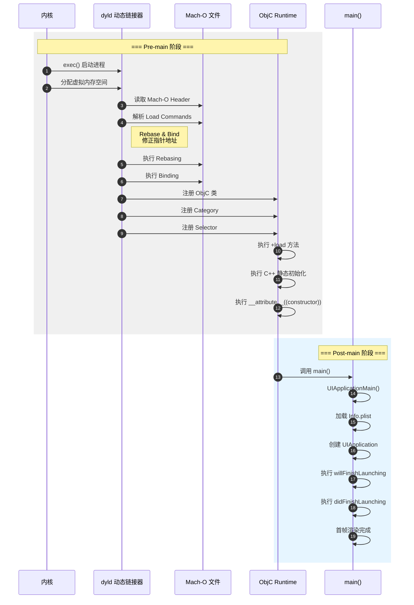

# iOS 启动优化与包体积治理深度解析

> 本文从 dyld 加载机制到二进制重排，从 Pre-main 到 Post-main 全链路剖析 iOS 启动性能优化策略，并深入探讨包体积治理的工程实践。

---

## 核心结论 TL;DR

| 优化维度 | 核心策略 | 预期收益 | 实施复杂度 |
|---------|---------|---------|-----------|
| **Pre-main 阶段** | 动态库合并、+load 治理、类精简 | 启动时间减少 100-300ms | ⭐⭐⭐ |
| **Post-main 阶段** | 启动任务编排、懒加载、首帧优化 | 首屏时间减少 200-500ms | ⭐⭐ |
| **二进制重排** | Order File + SanitizerCoverage | 页缺失减少 30-50% | ⭐⭐⭐⭐ |
| **包体积治理** | Link Map 分析、资源优化、App Thinning | 包体积减少 20-40% | ⭐⭐⭐ |
| **Swift 专项** | -Osize、WMO、泛型收敛 | 代码段减少 15-30% | ⭐⭐⭐ |
| **按需资源** | ODR + 资源标签管理 | 初始下载减少 50%+ | ⭐⭐⭐ |

---

## 一、App 启动流程全景

### 1.1 启动类型定义

```
┌─────────────────────────────────────────────────────────────────┐
│                     iOS App 启动类型                             │
├─────────────────┬─────────────────┬─────────────────────────────┤
│   冷启动(Cold)   │   热启动(Warm)   │        恢复启动(Resumed)     │
├─────────────────┼─────────────────┼─────────────────────────────┤
│ App 未运行       │ App 在后台运行   │ 从后台挂起状态恢复            │
│ 需完整加载       │ 需部分重新初始化 │ 无需重新加载                  │
│ 耗时最长         │ 耗时中等         │ 耗时最短                      │
└─────────────────┴─────────────────┴─────────────────────────────┘
```

**本文重点讨论冷启动优化**，这是用户体验的第一触点。

### 1.2 dyld 3/4 加载流程



### 1.3 Pre-main 各阶段耗时分析

基于 iPhone 12 Pro (iOS 16) 实测数据：

| 阶段 | 耗时占比 | 主要操作 | 优化空间 |
|-----|---------|---------|---------|
| **dyld 加载** | 15-25% | 映射动态库、解析符号 | ⭐⭐⭐⭐ |
| **Rebase/Bind** | 10-15% | 修正指针、绑定外部符号 | ⭐⭐⭐ |
| **ObjC 初始化** | 20-30% | 注册类/Category/Selector | ⭐⭐⭐⭐ |
| **+load 执行** | 15-25% | 执行所有 +load 方法 | ⭐⭐⭐⭐⭐ |
| **静态初始化** | 10-15% | C++ 静态对象、constructor | ⭐⭐⭐ |

```swift
// 测量 Pre-main 时间的方案（iOS 15+）
// 在 main.m 中添加：

#import <mach/mach_time.h>

static uint64_t launchStartTime;

// 在 main() 函数第一行记录
int main(int argc, char * argv[]) {
    launchStartTime = mach_absolute_time();
    // ... 原有代码
}

// 在 didFinishLaunching 中计算
- (BOOL)application:(UIApplication *)application 
didFinishLaunchingWithOptions:(NSDictionary *)launchOptions {
    
    uint64_t launchEndTime = mach_absolute_time();
    mach_timebase_info_data_t timebaseInfo;
    mach_timebase_info(&timebaseInfo);
    
    uint64_t elapsedNano = (launchEndTime - launchStartTime) 
                          * timebaseInfo.numer / timebaseInfo.denom;
    double elapsedMS = elapsedNano / 1e6;
    
    NSLog(@"Total launch time: %.2f ms", elapsedMS);
    return YES;
}
```

---

## 二、Pre-main 阶段优化

### 2.1 动态库数量优化

**核心结论**：每增加一个动态库，dyld 加载时间增加 5-15ms。

#### 2.1.1 动态库合并策略

```
优化前：30 个动态库 → 优化后：5 个动态库
预期收益：启动时间减少 150-300ms
```

**合并方案对比**：

| 方案 | 实现方式 | 优点 | 缺点 | 适用场景 |
|-----|---------|-----|------|---------|
| **静态库化** | 改为 .a 静态链接 | 完全消除加载开销 | 包体积增大 | 核心基础库 |
| **动态库合并** | 多库合并为单一 dylib | 减少加载次数 | 维护复杂 | 业务模块库 |
| **懒加载动态库** | dlopen 延迟加载 | 不阻塞启动 | 使用限制多 | 非核心功能 |

```ruby
# Podfile 配置示例：控制动态库生成

# 方案1：强制静态链接
use_frameworks! :linkage => :static

# 方案2：指定库为静态链接
pod 'AFNetworking', :modular_headers => true

# 方案3：部分动态 + 部分静态
use_frameworks!

pre_install do |installer|
  installer.pod_targets.each do |pod|
    # 将非核心库改为静态链接
    if ['Analytics', 'CrashReporter'].include?(pod.name)
      def pod.build_type
        Pod::BuildType.static_library
      end
    end
  end
end
```

#### 2.1.2 动态库加载耗时检测

```bash
# 使用 DYLD_PRINT_STATISTICS 查看详细加载统计
# Edit Scheme -> Run -> Arguments -> Environment Variables

DYLD_PRINT_STATISTICS=1
DYLD_PRINT_STATISTICS_DETAILS=1
```

输出示例解析：
```
total time: 285.4 milliseconds (100.0%)
total images loaded:  187 (182 from dyld shared cache)
total segments mapped: 45, into 1237 pages
total images loading time: 85.2 milliseconds (29.8%)
total rebase/binding time: 42.6 milliseconds (14.9%)
total ObjC setup time: 68.3 milliseconds (23.9%)
total initializer time: 89.3 milliseconds (31.2%)
```

### 2.2 +load 方法治理

**核心结论**：+load 方法在 Pre-main 阶段同步执行，是启动耗时重灾区。

#### 2.2.1 +load 方法检测脚本

```bash
#!/bin/bash
# scan_load_methods.sh - 扫描项目中所有 +load 实现

echo "=== 扫描 +load 方法 ==="
echo ""

# 扫描 Objective-C +load
find . -name "*.m" -o -name "*.mm" | xargs grep -h "^\+.*load" | grep -v "//" | sort | uniq

echo ""
echo "=== 扫描 Swift static init ==="
find . -name "*.swift" | xargs grep -l "init()" | head -20

echo ""
echo "=== 按文件统计 +load 数量 ==="
find . -name "*.m" -o -name "*.mm" | while read file; do
    count=$(grep -c "^\+.*load" "$file" 2>/dev/null || echo 0)
    if [ "$count" -gt 0 ]; then
        echo "$count: $file"
    fi
done | sort -rn
```

#### 2.2.2 +load 迁移方案

```objc
// ❌ 不推荐：在 +load 中执行耗时操作
@implementation AnalyticsTracker
+ (void)load {
    // 错误！阻塞启动
    [self setupCrashReporter];
    [self registerNotifications];
    [self preloadConfiguration];
}
@end

// ✅ 推荐：延迟到启动后执行
@implementation AnalyticsTracker
+ (void)load {
    // 仅注册，不执行
    [LaunchTaskManager registerTask:@selector(setupAnalytics) 
                           priority:LaunchTaskPriorityHigh
                             target:self];
}

+ (void)setupAnalytics {
    // 在 didFinishLaunching 后异步执行
    dispatch_async(dispatch_get_global_queue(DISPATCH_QUEUE_PRIORITY_DEFAULT, 0), ^{
        [self setupCrashReporter];
        [self registerNotifications];
        [self preloadConfiguration];
    });
}
@end
```

#### 2.2.3 Swift 类型注册开销

```swift
// ❌ 不推荐：大量 @objc 类增加注册开销
@objc class MySwiftClass: NSObject {
    // 每个 @objc 类都需注册到 Runtime
}

// ✅ 推荐：减少不必要的 @objc 标记
// 仅在需要 Objective-C 访问时添加
class MySwiftClass {
    // Swift 内部使用，无需 @objc
}

// 使用 @objcMembers 需谨慎
// 每个成员方法都会生成 ObjC 元数据
@objcMembers
class HeavyClass: NSObject {
    // 10 个方法 = 10 个 ObjC 注册
}
```

### 2.3 ObjC 类与 Category 精简

**核心结论**：每个类/Category 增加约 0.5-1ms 的注册时间。

#### 2.3.1 类数量优化策略

```
优化方向：
1. 合并相似功能的 Category
2. 移除未使用的类（Dead Code Stripping）
3. 将纯 Swift 类去 @objc 化
4. 使用结构体替代简单数据类
```

```swift
// ❌ 不推荐：过度使用类
@objc class UserConfig: NSObject {
    var name: String = ""
    var age: Int = 0
}

// ✅ 推荐：使用结构体
struct UserConfig {
    var name: String = ""
    var age: Int = 0
}

// ❌ 不推荐：分散的 Category
// UIView+Animation.m
@implementation UIView (Animation)
@end

// UIView+Layout.m  
@implementation UIView (Layout)
@end

// ✅ 推荐：合并相关 Category
// UIView+Extensions.m
@implementation UIView (Extensions)
// 动画 + 布局方法合并
@end
```

#### 2.3.2 Dead Code Stripping 配置

```
Build Settings:
├── Dead Code Stripping: YES
├── Strip Linked Product: YES
├── Strip Style: All Symbols (Release)
└── Deployment Postprocessing: YES
```

---

## 三、Post-main 阶段优化

### 3.1 启动任务编排框架设计

**核心结论**：启动任务需按优先级和依赖关系编排，避免阻塞主线程。

#### 3.1.1 任务优先级模型

```swift
// LaunchTaskManager.swift
// iOS 13+ 支持

import Foundation

enum LaunchTaskPriority: Int, Comparable {
    case critical = 0      // 必须在首帧前完成
    case high = 1          // 首帧后立即执行
    case normal = 2        // 可延迟执行
    case low = 3           // 空闲时执行
    case background = 4    // 后台执行
    
    static func < (lhs: LaunchTaskPriority, rhs: LaunchTaskPriority) -> Bool {
        return lhs.rawValue < rhs.rawValue
    }
}

enum LaunchTaskThread {
    case main              // 主线程同步
    case mainAsync         // 主线程异步
    case global            // 全局队列
    case custom(DispatchQueue)
}

struct LaunchTask {
    let id: String
    let priority: LaunchTaskPriority
    let thread: LaunchTaskThread
    let dependencies: [String]
    let timeout: TimeInterval
    let execution: (@escaping () -> Void) -> Void
}

final class LaunchTaskManager {
    static let shared = LaunchTaskManager()
    
    private var tasks: [LaunchTask] = []
    private var completedTasks: Set<String> = []
    private let lock = NSLock()
    
    private init() {}
    
    func register(_ task: LaunchTask) {
        lock.lock()
        tasks.append(task)
        lock.unlock()
    }
    
    func executeTasks(upTo priority: LaunchTaskPriority) {
        let sortedTasks = tasks
            .filter { $0.priority <= priority }
            .sorted { $0.priority < $1.priority }
        
        let group = DispatchGroup()
        
        for task in sortedTasks {
            // 检查依赖是否完成
            let depsSatisfied = task.dependencies.allSatisfy { 
                completedTasks.contains($0) 
            }
            guard depsSatisfied else { continue }
            
            group.enter()
            
            let queue: DispatchQueue = {
                switch task.thread {
                case .main: return .main
                case .mainAsync: return .main
                case .global: return .global()
                case .custom(let q): return q
                }
            }()
            
            let workItem = DispatchWorkItem {
                task.execution {
                    self.lock.lock()
                    self.completedTasks.insert(task.id)
                    self.lock.unlock()
                    group.leave()
                }
            }
            
            if task.thread == .main {
                workItem.perform()
            } else {
                queue.async(execute: workItem)
            }
            
            // 超时处理
            if task.timeout > 0 {
                DispatchQueue.global().asyncAfter(deadline: .now() + task.timeout) {
                    workItem.cancel()
                }
            }
        }
        
        group.wait()
    }
}
```

#### 3.1.2 任务编排使用示例

```swift
// AppDelegate.swift

@main
class AppDelegate: UIResponder, UIApplicationDelegate {
    
    func application(_ application: UIApplication,
                    didFinishLaunchingWithOptions launchOptions: [UIApplication.LaunchOptionsKey: Any]?) -> Bool {
        
        // 阶段1：关键任务（首帧前）
        LaunchTaskManager.shared.executeTasks(upTo: .critical)
        
        // 返回 true 让系统继续渲染首帧
        
        // 阶段2：首帧渲染完成后执行
        DispatchQueue.main.async {
            LaunchTaskManager.shared.executeTasks(upTo: .high)
        }
        
        return true
    }
}

// 业务模块注册启动任务
extension AnalyticsModule {
    static func setupLaunchTasks() {
        // 关键任务：初始化崩溃收集
        let crashTask = LaunchTask(
            id: "crash_reporter_init",
            priority: .critical,
            thread: .main,
            dependencies: [],
            timeout: 0.5,
            execution: { completion in
                CrashReporter.shared.initialize()
                completion()
            }
        )
        LaunchTaskManager.shared.register(crashTask)
        
        // 高优先级：初始化埋点（依赖崩溃收集）
        let analyticsTask = LaunchTask(
            id: "analytics_init",
            priority: .high,
            thread: .global,
            dependencies: ["crash_reporter_init"],
            timeout: 1.0,
            execution: { completion in
                Analytics.shared.setup()
                completion()
            }
        )
        LaunchTaskManager.shared.register(analyticsTask)
    }
}
```

### 3.2 首帧渲染优化

**核心结论**：首帧渲染时间 = 布局计算 + 绘制 + GPU 提交。

#### 3.2.1 首帧优化策略

```swift
// ❌ 不推荐：在 will/didFinishLaunching 中创建复杂 UI
func application(_ application: UIApplication,
                didFinishLaunchingWithOptions launchOptions: [UIApplication.LaunchOptionsKey: Any]?) -> Bool {
    
    window = UIWindow(frame: UIScreen.main.bounds)
    
    // 错误！同步创建复杂视图
    let rootVC = MainTabBarController() // 包含 5 个 Tab
    window?.rootViewController = rootVC
    window?.makeKeyAndVisible()
    
    return true
}

// ✅ 推荐：渐进式加载
func application(_ application: UIApplication,
                didFinishLaunchingWithOptions launchOptions: [UIApplication.LaunchOptionsKey: Any]?) -> Bool {
    
    window = UIWindow(frame: UIScreen.main.bounds)
    
    // 1. 先显示启动页/占位页
    let launchVC = LaunchPlaceholderViewController()
    window?.rootViewController = launchVC
    window?.makeKeyAndVisible()
    
    // 2. 异步加载主界面
    DispatchQueue.main.async {
        let mainVC = MainTabBarController()
        self.window?.rootViewController = mainVC
    }
    
    return true
}
```

#### 3.2.2 懒加载策略

```swift
class MainTabBarController: UITabBarController {
    
    // 懒加载 ViewControllers
    private lazy var homeVC: UIViewController = {
        return HomeViewController()
    }()
    
    private lazy var discoverVC: UIViewController = {
        return DiscoverViewController()
    }()
    
    private lazy var profileVC: UIViewController = {
        return ProfileViewController()
    }()
    
    override func viewDidLoad() {
        super.viewDidLoad()
        
        // 只加载第一个 Tab
        viewControllers = [homeVC]
        
        // 延迟加载其他 Tab
        DispatchQueue.main.asyncAfter(deadline: .now() + 0.5) { [weak self] in
            self?.loadRemainingTabs()
        }
    }
    
    private func loadRemainingTabs() {
        viewControllers = [homeVC, discoverVC, profileVC]
    }
}
```

---

## 四、二进制重排优化

### 4.1 页缺失问题分析

**核心结论**：默认链接顺序导致代码分散在多个内存页，引发大量 Page Fault。

```
内存页大小：16KB（iOS 16+ ARM64）
默认链接：按文件编译顺序排列
问题：启动代码分散在 50+ 个页面
优化：重排后集中在 10-15 个页面
```

### 4.2 Order File 生成方案

#### 4.2.1 基于 SanitizerCoverage 的方案

```bash
# 1. 配置编译选项（Debug 模式）
# Build Settings -> Other C Flags
-fsanitize-coverage=func,trace-pc-guard

# Build Settings -> Other Swift Flags
-sanitize-coverage=func
-sanitize=undefined
```

```objc
// OrderFileCollector.m
// 收集启动阶段的函数调用顺序

#import <dlfcn.h>
#import <libkern/OSAtomic.h>

static OSQueueHead queue = OS_ATOMIC_QUEUE_INIT;
static BOOL collecting = NO;

typedef struct {
    void *pc;
    void *next;
} Node;

// SanitizerCoverage 回调
void __sanitizer_cov_trace_pc_guard_init(uint32_t *start, uint32_t *stop) {
    static uint32_t N;
    if (start == stop || *start) return;
    for (uint32_t *x = start; x < stop; x++) {
        *x = ++N;
    }
}

void __sanitizer_cov_trace_pc_guard(uint32_t *guard) {
    if (!collecting) return;
    
    void *PC = __builtin_return_address(0);
    Node *node = malloc(sizeof(Node));
    node->pc = PC;
    OSAtomicEnqueue(&queue, node, offsetof(Node, next));
}

// 生成 Order File
+ (void)generateOrderFile {
    collecting = NO;
    
    NSMutableArray<NSString *> *symbols = [NSMutableArray array];
    NSMutableSet<NSString *> *seen = [NSMutableSet set];
    
    while (YES) {
        Node *node = OSAtomicDequeue(&queue, offsetof(Node, next));
        if (!node) break;
        
        Dl_info info;
        dladdr(node->pc, &info);
        
        if (info.dli_sname && ![seen containsObject:@(info.dli_sname)]) {
            [seen addObject:@(info.dli_sname)];
            [symbols addObject:@(info.dli_sname)];
        }
        
        free(node);
    }
    
    // 反转顺序（从调用先到后）
    NSArray *reversed = [[symbols reverseObjectEnumerator] allObjects];
    
    // 写入文件
    NSString *content = [reversed componentsJoinedByString:@"\n"];
    NSString *path = [NSTemporaryDirectory() stringByAppendingPathComponent:@"launch.order"];
    [content writeToFile:path atomically:YES encoding:NSUTF8StringEncoding error:nil];
    
    NSLog(@"Order file saved to: %@", path);
}
```

#### 4.2.2 自动化脚本

```bash
#!/bin/bash
# generate_order_file.sh

echo "=== 生成 Order File ==="

# 1. 构建带 SanitizerCoverage 的测试包
xcodebuild -workspace MyApp.xcworkspace \
           -scheme MyApp \
           -configuration Debug \
           -destination 'platform=iOS Simulator,name=iPhone 15' \
           build

# 2. 启动 App 并执行冷启动流程
# 使用 UI 自动化测试覆盖启动路径

# 3. 从设备提取 Order File
DEVICE_PATH="/tmp/launch.order"
LOCAL_PATH="./Resources/launch.order"

# 4. 清理符号（只保留项目内符号）
grep -E "^_\[|^+\[" "$LOCAL_PATH" > "./Resources/launch.filtered.order"

echo "=== Order File 生成完成 ==="
echo "路径: ./Resources/launch.filtered.order"
```

### 4.3 Order File 配置

```
Build Settings:
├── Order File: $(SRCROOT)/Resources/launch.filtered.order
├── Link-Time Optimization (LTO): Incremental
└── Optimization Level: -O2 (Release)
```

### 4.4 优化效果验证

```bash
# 使用 vmmap 查看页缺失
vmmap -pages <PID> | grep "__TEXT"

# 优化前：Page Faults: 150+
# 优化后：Page Faults: 60-80
```

---

## 五、包体积治理

### 5.1 Link Map 分析

**核心结论**：Link Map 是包体积分析的源头数据。

#### 5.1.1 生成 Link Map

```
Build Settings:
├── Write Link Map File: YES
├── Path to Link Map File: $(TARGET_TEMP_DIR)/$(PRODUCT_NAME)-LinkMap-$(CURRENT_VARIANT)-$(CURRENT_ARCH).txt
└── 构建后在 Derived Data 中查找
```

#### 5.1.2 Link Map 解析脚本

```python
#!/usr/bin/env python3
# linkmap_analyzer.py

import re
import sys
from collections import defaultdict

def parse_linkmap(filepath):
    """解析 Link Map 文件"""
    
    object_files = {}
    sections = {}
    symbols = []
    
    current_section = None
    
    with open(filepath, 'r') as f:
        for line in f:
            line = line.strip()
            
            # 解析 Object files 段
            if line.startswith('[') and ']' in line:
                match = re.match(r'\[(\d+)\]\s+(.+)', line)
                if match:
                    idx, path = match.groups()
                    object_files[int(idx)] = path
            
            # 解析 Section 段
            if line.startswith('0x'):
                parts = line.split()
                if len(parts) >= 4:
                    address = parts[0]
                    size = int(parts[1], 16)
                    segment = parts[2]
                    section = parts[3]
                    sections[f"{segment}.{section}"] = size
            
            # 解析 Symbols 段
            if re.match(r'0x[0-9a-fA-F]+\s+0x[0-9a-fA-F]+\s+\[', line):
                parts = line.split()
                if len(parts) >= 4:
                    address = parts[0]
                    size = int(parts[1], 16)
                    file_idx = int(parts[2].strip('[]'))
                    symbol = ' '.join(parts[3:])
                    symbols.append({
                        'address': address,
                        'size': size,
                        'file_idx': file_idx,
                        'symbol': symbol
                    })
    
    return object_files, sections, symbols

def analyze_by_object_file(object_files, symbols):
    """按目标文件统计体积"""
    
    file_sizes = defaultdict(int)
    
    for sym in symbols:
        file_idx = sym['file_idx']
        if file_idx in object_files:
            file_path = object_files[file_idx]
            file_sizes[file_path] += sym['size']
    
    # 排序输出
    sorted_files = sorted(file_sizes.items(), key=lambda x: x[1], reverse=True)
    
    print("=== 按文件统计体积 (Top 20) ===")
    total = sum(file_sizes.values())
    for path, size in sorted_files[:20]:
        percentage = (size / total) * 100
        print(f"{size:>10,} bytes ({percentage:>5.1f}%): {path}")
    
    return sorted_files

def analyze_by_section(sections):
    """按 Section 统计体积"""
    
    print("\n=== 按 Section 统计体积 ===")
    total = sum(sections.values())
    for name, size in sorted(sections.items(), key=lambda x: x[1], reverse=True):
        percentage = (size / total) * 100
        print(f"{size:>10,} bytes ({percentage:>5.1f}%): {name}")

if __name__ == '__main__':
    if len(sys.argv) < 2:
        print(f"Usage: {sys.argv[0]} <linkmap_file>")
        sys.exit(1)
    
    linkmap_file = sys.argv[1]
    object_files, sections, symbols = parse_linkmap(linkmap_file)
    
    analyze_by_section(sections)
    analyze_by_object_file(object_files, symbols)
```

### 5.2 __TEXT 段优化

| 优化项 | 方法 | 预期收益 |
|-------|------|---------|
| **字符串去重** | 使用 `__attribute__((objc_runtime_name("X")))` | 减少 5-10% |
| **移除调试符号** | Strip Debug Symbols: YES | 减少 10-20% |
| **压缩段** | `-Wl,-rename_section,__TEXT,__text,__TEXT,__text_enc` | 减少 5% |
| **Bitcode 移除** | ENABLE_BITCODE = NO (Xcode 14+) | 减少 30%+ |

### 5.3 Asset Catalog 优化

```
优化策略：
1. 使用 HEIC 替代 PNG（减少 50%+）
2. 启用 App Slicing（按设备分发资源）
3. 移除未使用的资源
4. 使用 On-Demand Resources 延迟加载
```

```bash
# 查找未使用资源脚本
#!/bin/bash

ASSETS_DIR="./Resources/Assets.xcassets"
SOURCE_DIR="./Sources"

echo "=== 扫描未使用资源 ==="

find "$ASSETS_DIR" -name "*.imageset" | while read imageset; do
    basename=$(basename "$imageset" .imageset)
    
    # 检查源码中是否引用
    count=$(grep -r "$basename" "$SOURCE_DIR" --include="*.swift" --include="*.m" | wc -l)
    
    if [ "$count" -eq 0 ]; then
        echo "未使用: $basename"
    fi
done
```

### 5.4 App Thinning 策略

```mermaid
graph TB
    A[App Thinning] --> B[Slicing]
    A --> C[Bitcode]
    A --> D[ODR]
    
    B --> B1[按架构分发<br/>arm64 / armv7]
    B --> B2[按屏幕分辨率<br/>@2x / @3x]
    
    C --> C1[LLVM IR 中间码]
    C --> C2[App Store 重编译优化]
    
    D --> D1[按需资源标签]
    D --> D2[首次安装精简]
```

---

## 六、按需资源 (On-Demand Resources)

### 6.1 ODR 架构设计

**核心结论**：ODR 可将初始下载量减少 50%+，特别适合游戏/内容型 App。

```
资源标签策略：
├── 初始资源 (initial)      - 随 App 下载
├── 关卡资源 (level_1..n)   - 按需下载
├── 高清资源 (hd_assets)    - WiFi 下下载
└── 稀有资源 (rare_items)   - 使用时下载
```

### 6.2 NSBundleResourceRequest 使用

```swift
// ODRManager.swift
// iOS 9+ 支持

import Foundation

final class ODRManager {
    static let shared = ODRManager()
    
    private var activeRequests: [String: NSBundleResourceRequest] = [:]
    
    // 预加载资源标签
    func prefetchTags(_ tags: Set<String>, completion: @escaping (Result<Void, Error>) -> Void) {
        let request = NSBundleResourceRequest(tags: tags)
        activeRequests[tags.joined(separator: ",")] = request
        
        request.conditionallyBeginAccessingResources { available in
            if available {
                completion(.success(()))
            } else {
                request.beginAccessingResources { error in
                    if let error = error {
                        completion(.failure(error))
                    } else {
                        completion(.success(()))
                    }
                }
            }
        }
    }
    
    // 加载带进度回调
    func loadResources(tags: Set<String>, 
                      progressHandler: @escaping (Double) -> Void,
                      completion: @escaping (Result<Void, Error>) -> Void) {
        let request = NSBundleResourceRequest(tags: tags)
        activeRequests[tags.joined(separator: ",")] = request
        
        // 监听下载进度
        request.progress.addObserver(self, forKeyPath: "fractionCompleted", 
                                     options: .new, context: nil)
        
        request.beginAccessingResources { [weak self] error in
            self?.activeRequests.removeValue(forKey: tags.joined(separator: ","))
            
            if let error = error {
                completion(.failure(error))
            } else {
                completion(.success(()))
            }
        }
    }
    
    // 结束资源访问
    func endAccessing(tags: Set<String>) {
        let key = tags.joined(separator: ",")
        if let request = activeRequests[key] {
            request.endAccessingResources()
            activeRequests.removeValue(forKey: key)
        }
    }
    
    // 设置保留优先级
    func setPreservationPriority(_ priority: Double, for tags: Set<String>) {
        NSBundle.main.setPreservationPriority(priority, forTags: tags)
    }
}
```

### 6.3 使用示例

```swift
// 游戏关卡加载示例
class GameLevelManager {
    
    func loadLevel(_ level: Int) {
        let tags = ["level_\(level)", "enemies_common"]
        
        // 显示加载界面
        showLoadingUI()
        
        ODRManager.shared.loadResources(
            tags: Set(tags),
            progressHandler: { progress in
                self.updateLoadingProgress(progress)
            },
            completion: { result in
                self.hideLoadingUI()
                
                switch result {
                case .success:
                    self.startLevel(level)
                case .failure(let error):
                    self.showError(error)
                }
            }
        )
    }
    
    func levelCompleted(_ level: Int) {
        // 释放已完成关卡的资源
        ODRManager.shared.endAccessing(tags: ["level_\(level)"])
        
        // 预加载下一关
        if level < maxLevel {
            ODRManager.shared.prefetchTags(["level_\(level + 1)"]) { _ in }
        }
    }
}
```

### 6.4 ODR 配置

```xml
<!-- Info.plist 配置 -->
<key>NSBundleResourceRequestTags</key>
<dict>
    <key>level_1</key>
    <array>
        <string>level1_background.png</string>
        <string>level1_music.mp3</string>
    </array>
    <key>level_2</key>
    <array>
        <string>level2_background.png</string>
        <string>level2_music.mp3</string>
    </array>
</dict>
```

---

## 七、Swift 包体积专项优化

### 7.1 泛型代码膨胀问题

**核心结论**：Swift 泛型在编译期实例化，过度使用导致代码膨胀。

```swift
// ❌ 不推荐：过度泛型化导致多份实现
struct NetworkRequest<T: Decodable> {
    func fetch() -> T { ... }
}

// 编译器会生成多份实现：
// NetworkRequest<User>.fetch()
// NetworkRequest<Order>.fetch()
// NetworkRequest<Product>.fetch()

// ✅ 推荐：使用类型擦除减少膨胀
protocol RequestProtocol {
    associatedtype Response: Decodable
    func fetch() -> Response
}

struct AnyRequest<Response: Decodable> {
    private let _fetch: () -> Response
    
    init<R: RequestProtocol>(_ request: R) where R.Response == Response {
        _fetch = request.fetch
    }
    
    func fetch() -> Response {
        return _fetch()
    }
}
```

### 7.2 编译优化选项

```
Swift Compiler - Code Generation:
├── Optimization Level
│   ├── -Onone (Debug)        - 无优化，调试友好
│   ├── -O (Release)          - 性能优化
│   └── -Osize (Release)      - 体积优化（推荐）
├── Whole Module Optimization
│   └── YES (Release)         - 跨文件优化
└── Generic Specialization
    └── 自动实例化泛型
```

### 7.3 -Osize vs -O 对比

| 优化级别 | 包体积 | 运行时性能 | 编译时间 | 适用场景 |
|---------|-------|-----------|---------|---------|
| -Onone | 100% | 60% | 快 | Debug |
| -O | 85% | 100% | 慢 | 性能敏感 |
| **-Osize** | **70%** | **95%** | **慢** | **通用推荐** |

```
// Build Settings 配置
SWIFT_OPTIMIZATION_LEVEL = -Osize
SWIFT_WHOLE_MODULE_OPTIMIZATION = YES
```

### 7.4 Swift 标准库裁剪

```
Deployment Target 影响：
├── iOS 12.2+ : 系统内置 Swift 标准库
│   └── 包体积减少 5-8MB
└── iOS 12.1- : 需嵌入 Swift 标准库
    └── 包含 libswiftCore.dylib 等
```

---

## 八、监控与度量

### 8.1 启动时间监控

```swift
// LaunchMonitor.swift

import MetricKit
import os.log

final class LaunchMonitor: NSObject {
    static let shared = LaunchMonitor()
    
    private let logger = OSLog(subsystem: "com.myapp", category: "Launch")
    
    func setup() {
        if #available(iOS 14.0, *) {
            MXMetricManager.shared.add(self)
        }
    }
    
    // 上报自定义启动指标
    func reportLaunchTime(_ duration: TimeInterval, type: LaunchType) {
        let attributes: [String: Any] = [
            "launch_type": type.rawValue,
            "duration_ms": duration * 1000,
            "device_model": UIDevice.current.model,
            "os_version": UIDevice.current.systemVersion
        ]
        
        // 上报到分析平台
        Analytics.shared.logEvent("app_launch", parameters: attributes)
        
        os_log("Launch time: %.2f ms, type: %{public}@", 
               log: logger, type: .info, duration * 1000, type.rawValue)
    }
}

enum LaunchType: String {
    case cold = "cold"
    case warm = "warm"
    case resumed = "resumed"
}

@available(iOS 14.0, *)
extension LaunchMonitor: MXMetricManagerSubscriber {
    func didReceive(_ payloads: [MXMetricPayload]) {
        for payload in payloads {
            if let appLaunchMetrics = payload.applicationLaunchMetrics {
                let histogram = appLaunchMetrics.histogrammedTimeToFirstDraw
                let launchTime = histogram.averageMeasurement()?.doubleValue ?? 0
                
                reportLaunchTime(launchTime / 1000, type: .cold)
            }
        }
    }
    
    func didReceive(_ payloads: [MXDiagnosticPayload]) {
        // 处理启动崩溃诊断
        for payload in payloads {
            for crash in payload.crashDiagnostics ?? [] {
                os_log("Launch crash: %{public}@", log: logger, type: .error, 
                       crash.callStackTree.description)
            }
        }
    }
}
```

### 8.2 包体积监控

```bash
#!/bin/bash
# size_monitor.sh - CI 包体积监控

APP_PATH="$1"
THRESHOLD_MB=100

# 计算包体积
APP_SIZE=$(du -sm "$APP_PATH" | cut -f1)

# 解析 Link Map
LINKMAP=$(find ~/Library/Developer/Xcode/DerivedData -name "*LinkMap*" -mtime -1 | head -1)
python3 linkmap_analyzer.py "$LINKMAP" > size_report.txt

# 检查阈值
if [ "$APP_SIZE" -gt "$THRESHOLD_MB" ]; then
    echo "❌ 包体积超过阈值: ${APP_SIZE}MB > ${THRESHOLD_MB}MB"
    exit 1
else
    echo "✅ 包体积检查通过: ${APP_SIZE}MB"
fi

# 输出报告
cat size_report.txt
```

---

## 九、总结

### 9.1 优化效果预期

| 优化项 | 启动时间优化 | 包体积优化 | 实施优先级 |
|-------|------------|-----------|-----------|
| 动态库合并 | 100-300ms | -5MB | P0 |
| +load 治理 | 50-150ms | - | P0 |
| 二进制重排 | 50-100ms | - | P1 |
| -Osize 优化 | - | -15% | P0 |
| ODR 实施 | - | -50% 初始 | P1 |
| 资源优化 | - | -20% | P1 |

### 9.2 实施路线图

```
Phase 1 (1-2周): 基础优化
├── 动态库合并
├── +load 方法治理
└── -Osize 编译选项

Phase 2 (2-3周): 深度优化
├── 二进制重排实施
├── 启动任务编排
└── 懒加载策略

Phase 3 (3-4周): 资源治理
├── ODR 架构实施
├── 资源清理
└── 监控体系搭建
```

---

> 关于 iOS 内存架构详情，请参阅 [iOS内存优化](../../cpp_memory_optimization/03_系统级优化/iOS内存优化.md)

---

## 参考文档

1. [Apple: Reducing Your App's Launch Time](https://developer.apple.com/documentation/xcode/reducing-your-app-s-launch-time)
2. [Apple: On-Demand Resources Guide](https://developer.apple.com/library/archive/documentation/FileManagement/Conceptual/On_Demand_Resources_Guide/)
3. [WWDC 2019: Optimizing App Launch](https://developer.apple.com/videos/play/wwdc2019/423/)
4. [WWDC 2020: Eliminate Lock-ups with MetricKit](https://developer.apple.com/videos/play/wwdc2020/10077/)
