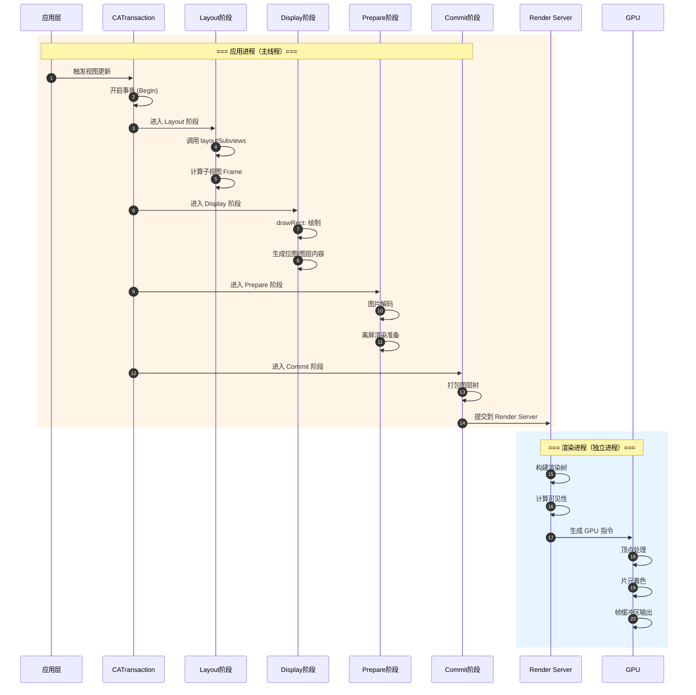

# iOS 渲染性能与能耗优化深度解析

> 本文深入剖析 Core Animation 渲染管线、离屏渲染机制、卡顿检测方案及电量优化策略，构建完整的 iOS 渲染性能优化知识体系。

---

## 核心结论 TL;DR

| 优化维度 | 核心策略 | 预期收益 | 适用场景 |
|---------|---------|---------|---------|
| **离屏渲染** | 避免 cornerRadius+masksToBounds 组合、预渲染阴影 | 帧率提升 10-20fps | 列表/复杂 UI |
| **卡顿检测** | RunLoop 监控 + CADisplayLink 帧率检测 | 实时发现卡顿 | 线上监控 |
| **图片渲染** | 下采样 + 异步解码 + UIGraphicsImageRenderer | 内存减少 50%+ | 大图展示 |
| **电量优化** | 后台任务管理 + 网络合并 + 定位精度控制 | 续航提升 20%+ | 全场景 |
| **性能度量** | os_signpost + Instruments 深度分析 | 精准定位瓶颈 | 开发调试 |
| **暗黑模式** | OLED 黑色省电 + 系统级适配 | 功耗降低 30-50% | OLED 设备 |

---

## 一、Core Animation 渲染管线

### 1.1 渲染流程全景



### 1.2 各阶段详细解析

| 阶段 | 执行线程 | 主要工作 | 耗时占比 | 优化重点 |
|-----|---------|---------|---------|---------|
| **Layout** | 主线程 | 计算视图层级、Frame | 15-20% | 减少层级、避免复杂 Auto Layout |
| **Display** | 主线程/后台 | 绘制内容、生成位图 | 30-40% | 异步绘制、减少 drawRect |
| **Prepare** | 主线程 | 图片解码、离屏渲染 | 20-30% | 预解码、避免离屏 |
| **Commit** | 主线程 | 序列化图层树 | 5-10% | 减少图层数量 |
| **Render** | 渲染进程 | 合成、光栅化 | GPU 受限 | 减少过度绘制 |

### 1.3 渲染时序与 VSync

```
┌─────────────────────────────────────────────────────────────────┐
│                    渲染时序与 VSync 同步                          │
├─────────────────────────────────────────────────────────────────┤
│                                                                 │
│  VSync ─┬───┬───┬───┬───┬───┬───┬───┬───┬───┬───┬───┬───┬───┬──→
│         │   │   │   │   │   │   │   │   │   │   │   │   │   │   │
│  帧提交  │ ▓▓▓│   │   │ ▓▓▓│   │   │ ▓▓▓│   │   │ ▓▓▓│   │   │
│         │   │   │   │   │   │   │   │   │   │   │   │   │   │   │
│  显示    │   │   │ ▓▓▓│   │   │ ▓▓▓│   │   │ ▓▓▓│   │   │ ▓▓▓│
│         │   │   │   │   │   │   │   │   │   │   │   │   │   │   │
│  掉帧    │   │   │   │   │   │   │ ▓▓▓▓▓▓▓│   │   │   │   │   │
│         │   │   │   │   │   │   │   │   │   │   │   │   │   │   │
└─────────────────────────────────────────────────────────────────┘

理想情况：每帧 16.67ms (60fps) 完成提交
掉帧情况：渲染超时，跳过一帧，实际 30fps
```

---

## 二、离屏渲染深度解析

### 2.1 离屏渲染触发条件

**核心结论**：离屏渲染是性能杀手，需严格监控和避免。

```
触发离屏渲染的属性组合：
┌─────────────────────────────────────────────────────────────────┐
│ 触发条件                          │ 触发原因                     │
├───────────────────────────────────┼─────────────────────────────┤
│ cornerRadius + masksToBounds      │ 需要裁剪圆角                 │
│ shadow + 无 shadowPath            │ 需要计算阴影路径             │
│ mask 属性                         │ 需要应用蒙版                 │
│ groupOpacity                      │ 需要组级透明度混合           │
│ shouldRasterize                   │ 光栅化到离屏缓冲区           │
│ edge antialiasing                 │ 边缘抗锯齿处理               │
│ UIBlurEffect                      │ 毛玻璃效果计算               │
│ CGGradient 绘制                   │ 渐变需要离屏计算             │
└───────────────────────────────────┴─────────────────────────────┘
```

### 2.2 离屏渲染检测方法

#### 2.2.1 Xcode 可视化检测

```
Debug -> View Debugging -> Rendering -> Color Offscreen-Rendered Yellow

黄色标记 = 发生离屏渲染的图层
```

#### 2.2.2 代码检测方案

```swift
// OffscreenRenderDetector.swift
// 运行时检测离屏渲染

import UIKit

final class OffscreenRenderDetector {
    static let shared = OffscreenRenderDetector()
    
    private var detectedLayers: Set<String> = []
    
    func scanView(_ view: UIView, depth: Int = 0) {
        let layer = view.layer
        var issues: [String] = []
        
        // 检测圆角 + 裁剪
        if layer.cornerRadius > 0 && layer.masksToBounds {
            issues.append("cornerRadius + masksToBounds")
        }
        
        // 检测阴影
        if layer.shadowOpacity > 0 && layer.shadowPath == nil {
            issues.append("shadow without shadowPath")
        }
        
        // 检测蒙版
        if layer.mask != nil {
            issues.append("layer.mask")
        }
        
        // 检测组透明度
        if layer.allowsGroupOpacity {
            issues.append("allowsGroupOpacity")
        }
        
        // 检测光栅化
        if layer.shouldRasterize {
            issues.append("shouldRasterize")
        }
        
        if !issues.isEmpty {
            let identifier = "\(type(of: view))_\(Unmanaged.passUnretained(view).toOpaque())"
            if !detectedLayers.contains(identifier) {
                detectedLayers.insert(identifier)
                print("⚠️ [深度:\(depth)] 检测到离屏渲染: \(type(of: view))")
                print("   位置: \(view.frame)")
                print("   原因: \(issues.joined(separator: ", "))")
            }
        }
        
        // 递归检测子视图
        for subview in view.subviews {
            scanView(subview, depth: depth + 1)
        }
    }
    
    func generateReport() -> String {
        return "共检测到 \(detectedLayers.count) 个离屏渲染图层"
    }
}

// 使用示例
extension UIViewController {
    func detectOffscreenRendering() {
        DispatchQueue.main.asyncAfter(deadline: .now() + 1) {
            OffscreenRenderDetector.shared.scanView(self.view)
            print(OffscreenRenderDetector.shared.generateReport())
        }
    }
}
```

### 2.3 离屏渲染优化方案

#### 2.3.1 圆角优化方案对比

| 方案 | 实现方式 | 性能 | 适用场景 |
|-----|---------|------|---------|
| **Core Graphics 预渲染** | 后台绘制圆角图片 | ⭐⭐⭐⭐⭐ | 头像/固定图片 |
| **CAShapeLayer 蒙版** | 用贝塞尔曲线裁剪 | ⭐⭐⭐⭐ | 动态视图 |
| **layer.cornerRadius** | 仅设置圆角 | ⭐⭐⭐ | 无裁剪需求 |
| **UIGraphicsImageRenderer** | 实时渲染圆角 | ⭐⭐⭐ | 简单场景 |
| **SDWebImage 圆角处理** | 下载时处理 | ⭐⭐⭐⭐⭐ | 网络图片 |

```swift
// 方案1: Core Graphics 预渲染圆角（推荐）
extension UIImage {
    func rounded(withRadius radius: CGFloat) -> UIImage? {
        let format = UIGraphicsImageRendererFormat()
        format.scale = self.scale
        format.opaque = false
        
        let renderer = UIGraphicsImageRenderer(size: size, format: format)
        return renderer.image { context in
            let rect = CGRect(origin: .zero, size: size)
            let path = UIBezierPath(roundedRect: rect, cornerRadius: radius)
            path.addClip()
            self.draw(in: rect)
        }
    }
}

// 方案2: CAShapeLayer 优化（无需离屏渲染）
class RoundedView: UIView {
    private let shapeLayer = CAShapeLayer()
    
    var cornerRadius: CGFloat = 10 {
        didSet { updatePath() }
    }
    
    override init(frame: CGRect) {
        super.init(frame: frame)
        setup()
    }
    
    required init?(coder: NSCoder) {
        super.init(coder: coder)
        setup()
    }
    
    private func setup() {
        layer.addSublayer(shapeLayer)
        shapeLayer.fillColor = backgroundColor?.cgColor
        backgroundColor = .clear // 关键！避免双重绘制
    }
    
    private func updatePath() {
        let path = UIBezierPath(roundedRect: bounds, cornerRadius: cornerRadius)
        shapeLayer.path = path.cgPath
    }
    
    override func layoutSubviews() {
        super.layoutSubviews()
        updatePath()
    }
}

// 方案3: 异步圆角处理（列表优化）
class AsyncRoundedImageView: UIImageView {
    var cornerRadius: CGFloat = 0 {
        didSet { applyRoundedCorner() }
    }
    
    private func applyRoundedCorner() {
        guard let image = image, cornerRadius > 0 else { return }
        
        // 取消之前的任务
        objc_setAssociatedObject(self, &AssociatedKeys.task, nil, .OBJC_ASSOCIATION_RETAIN)
        
        let size = bounds.size
        let radius = cornerRadius
        
        let task = DispatchWorkItem { [weak self] in
            let format = UIGraphicsImageRendererFormat()
            format.scale = UIScreen.main.scale
            
            let renderer = UIGraphicsImageRenderer(size: size, format: format)
            let roundedImage = renderer.image { context in
                let rect = CGRect(origin: .zero, size: size)
                let path = UIBezierPath(roundedRect: rect, cornerRadius: radius)
                path.addClip()
                image.draw(in: rect)
            }
            
            DispatchQueue.main.async {
                self?.image = roundedImage
            }
        }
        
        objc_setAssociatedObject(self, &AssociatedKeys.task, task, .OBJC_ASSOCIATION_RETAIN)
        DispatchQueue.global(qos: .userInitiated).async(execute: task)
    }
    
    private struct AssociatedKeys {
        static var task: UInt8 = 0
    }
}
```

#### 2.3.2 阴影优化

```swift
// ❌ 不推荐：触发离屏渲染
layer.shadowOpacity = 0.5
layer.shadowOffset = CGSize(width: 0, height: 2)
layer.shadowRadius = 4

// ✅ 推荐：使用 shadowPath 避免离屏渲染
layer.shadowOpacity = 0.5
layer.shadowOffset = CGSize(width: 0, height: 2)
layer.shadowRadius = 4
layer.shadowPath = UIBezierPath(rect: bounds).cgPath

// ✅ 推荐：预渲染阴影（性能最佳）
extension UIView {
    func addPreRenderedShadow(cornerRadius: CGFloat = 0) {
        let shadowLayer = CAShapeLayer()
        shadowLayer.path = UIBezierPath(roundedRect: bounds, cornerRadius: cornerRadius).cgPath
        shadowLayer.fillColor = backgroundColor?.cgColor
        shadowLayer.shadowColor = UIColor.black.cgColor
        shadowLayer.shadowOffset = CGSize(width: 0, height: 2)
        shadowLayer.shadowOpacity = 0.2
        shadowLayer.shadowRadius = 4
        
        layer.insertSublayer(shadowLayer, at: 0)
        backgroundColor = .clear
    }
}
```

---

## 三、卡顿检测与治理

### 3.1 RunLoop 监控方案

**核心结论**：基于 RunLoop 的卡顿检测是线上监控的标准方案。

```swift
// RunLoopMonitor.swift
// iOS 10+ 支持

import Foundation

final class RunLoopMonitor {
    static let shared = RunLoopMonitor()
    
    private var runLoopObserver: CFRunLoopObserver?
    private var semaphore: DispatchSemaphore?
    private var isMonitoring = false
    
    // 卡顿阈值（毫秒）
    var stutterThreshold: Double = 100  // 轻微卡顿
    var freezeThreshold: Double = 250   // 严重卡顿
    
    var onStutter: ((Double) -> Void)?
    var onFreeze: ((Double) -> Void)?
    
    private init() {}
    
    func start() {
        guard !isMonitoring else { return }
        isMonitoring = true
        
        semaphore = DispatchSemaphore(value: 0)
        
        // 创建 RunLoop 观察者
        let observerInfo = Unmanaged.passUnretained(self).toOpaque()
        
        runLoopObserver = CFRunLoopObserverCreateWithHandler(
            kCFAllocatorDefault,
            CFRunLoopActivity.beforeWaiting.rawValue | CFRunLoopActivity.afterWaiting.rawValue,
            true,
            0
        ) { [weak self] observer, activity in
            self?.semaphore?.signal()
        }
        
        CFRunLoopAddObserver(CFRunLoopGetMain(), runLoopObserver, .commonModes)
        
        // 开启监控线程
        DispatchQueue.global().async { [weak self] in
            while self?.isMonitoring == true {
                // 等待主线程信号，超时即判定为卡顿
                let waitResult = self?.semaphore?.wait(timeout: .now() + .milliseconds(50))
                
                if waitResult == .timedOut {
                    // 主线程未响应，判定卡顿
                    let duration = self?.stutterThreshold ?? 100
                    
                    if duration > (self?.freezeThreshold ?? 250) {
                        self?.onFreeze?(duration)
                    } else if duration > (self?.stutterThreshold ?? 100) {
                        self?.onStutter?(duration)
                    }
                }
            }
        }
    }
    
    func stop() {
        isMonitoring = false
        
        if let observer = runLoopObserver {
            CFRunLoopRemoveObserver(CFRunLoopGetMain(), observer, .commonModes)
            runLoopObserver = nil
        }
        
        semaphore = nil
    }
}

// 使用示例
class AppDelegate: UIResponder, UIApplicationDelegate {
    func application(_ application: UIApplication,
                    didFinishLaunchingWithOptions launchOptions: [UIApplication.LaunchOptionsKey: Any]?) -> Bool {
        
        // 配置卡顿监控
        RunLoopMonitor.shared.onStutter = { duration in
            print("⚠️ 检测到轻微卡顿: \(duration)ms")
            // 上报埋点
            Analytics.shared.logEvent("stutter_detected", parameters: [
                "duration": duration,
                "threshold": 100
            ])
        }
        
        RunLoopMonitor.shared.onFreeze = { duration in
            print("🚨 检测到严重卡顿: \(duration)ms")
            // 记录堆栈
            let stack = Thread.callStackSymbols.joined(separator: "\n")
            Analytics.shared.logEvent("freeze_detected", parameters: [
                "duration": duration,
                "stack": stack
            ])
        }
        
        RunLoopMonitor.shared.start()
        
        return true
    }
}
```

### 3.2 CADisplayLink 帧率检测

```swift
// FrameRateMonitor.swift

import UIKit

final class FrameRateMonitor: NSObject {
    static let shared = FrameRateMonitor()
    
    private var displayLink: CADisplayLink?
    private var lastTimestamp: TimeInterval = 0
    private var frameCount: Int = 0
    private var frameDurations: [TimeInterval] = []
    
    var onFPSUpdate: ((Double) -> Void)?
    var onFrameDrop: ((Int) -> Void)?
    
    private let maxFrameDuration: TimeInterval = 1.0 / 55.0  // 低于 55fps 算掉帧
    
    private override init() {}
    
    func start() {
        displayLink = CADisplayLink(target: self, selector: #selector(displayLinkTick))
        displayLink?.add(to: .main, forMode: .common)
        lastTimestamp = CACurrentMediaTime()
    }
    
    func stop() {
        displayLink?.invalidate()
        displayLink = nil
    }
    
    @objc private func displayLinkTick() {
        guard let displayLink = displayLink else { return }
        
        let currentTimestamp = displayLink.timestamp
        let frameDuration = currentTimestamp - lastTimestamp
        lastTimestamp = currentTimestamp
        
        frameCount += 1
        frameDurations.append(frameDuration)
        
        // 每秒计算一次 FPS
        if frameCount >= 60 {
            calculateFPS()
            frameCount = 0
            frameDurations.removeAll()
        }
        
        // 检测掉帧
        if frameDuration > maxFrameDuration {
            let droppedFrames = Int(frameDuration / (1.0 / 60.0)) - 1
            if droppedFrames > 0 {
                onFrameDrop?(droppedFrames)
            }
        }
    }
    
    private func calculateFPS() {
        let avgDuration = frameDurations.reduce(0, +) / Double(frameDurations.count)
        let fps = 1.0 / avgDuration
        onFPSUpdate?(fps)
    }
}

// FPS 显示视图
class FPSLabel: UILabel {
    private var monitor: FrameRateMonitor?
    
    override init(frame: CGRect) {
        super.init(frame: frame)
        setup()
    }
    
    required init?(coder: NSCoder) {
        super.init(coder: coder)
        setup()
    }
    
    private func setup() {
        font = UIFont.monospacedDigitSystemFont(ofSize: 12, weight: .medium)
        textAlignment = .center
        layer.cornerRadius = 4
        layer.masksToBounds = true
        
        monitor = FrameRateMonitor.shared
        monitor?.onFPSUpdate = { [weak self] fps in
            DispatchQueue.main.async {
                self?.updateDisplay(fps: fps)
            }
        }
        monitor?.start()
    }
    
    private func updateDisplay(fps: Double) {
        text = String(format: "%.0f FPS", fps)
        
        if fps >= 55 {
            backgroundColor = UIColor.green.withAlphaComponent(0.7)
            textColor = .white
        } else if fps >= 40 {
            backgroundColor = UIColor.orange.withAlphaComponent(0.7)
            textColor = .white
        } else {
            backgroundColor = UIColor.red.withAlphaComponent(0.7)
            textColor = .white
        }
    }
}
```

### 3.3 MetricKit 卡顿分析

```swift
// MetricKitAnalyzer.swift
// iOS 14+ 支持

import MetricKit
import os.log

@available(iOS 14.0, *)
final class MetricKitAnalyzer: NSObject, MXMetricManagerSubscriber {
    static let shared = MetricKitAnalyzer()
    
    private let logger = OSLog(subsystem: "com.myapp", category: "Performance")
    
    func register() {
        MXMetricManager.shared.add(self)
    }
    
    func unregister() {
        MXMetricManager.shared.remove(self)
    }
    
    // 接收性能指标
    func didReceive(_ payloads: [MXMetricPayload]) {
        for payload in payloads {
            analyzeAnimationMetrics(payload)
            analyzeCellularMetrics(payload)
            analyzeCPUMetrics(payload)
        }
    }
    
    // 接收诊断数据
    func didReceive(_ payloads: [MXDiagnosticPayload]) {
        for payload in payloads {
            // 分析 CPU 异常
            for cpuException in payload.cpuExceptionDiagnostics ?? [] {
                os_log("CPU 异常: 持续时间 %{public}@s, 使用率 %{public}@%%",
                       log: logger, type: .error,
                       cpuException.totalDuration, cpuException.totalCPUTime)
            }
            
            // 分析 Hang（卡顿）
            for hang in payload.hangDiagnostics ?? [] {
                os_log("Hang 检测: 持续时间 %{public}@s, 堆栈: %{public}@",
                       log: logger, type: .error,
                       hang.totalDuration, hang.callStackTree.description)
                
                // 上报到分析平台
                Analytics.shared.logEvent("hang_detected", parameters: [
                    "duration": hang.totalDuration,
                    "stack": hang.callStackTree.description
                ])
            }
        }
    }
    
    private func analyzeAnimationMetrics(_ payload: MXMetricPayload) {
        guard let animationMetrics = payload.animationMetrics else { return }
        
        let scrollHitchTimeRatio = animationMetrics.scrollHitchTimeRatio
        let hitches = scrollHitchTimeRatio.averageMeasurement()?.doubleValue ?? 0
        
        os_log("滚动卡顿率: %{public}@", log: logger, type: .info, hitches)
        
        if hitches > 0.05 {  // 卡顿率超过 5%
            os_log("⚠️ 滚动卡顿率过高，需要优化", log: logger, type: .error)
        }
    }
    
    private func analyzeCellularMetrics(_ payload: MXMetricPayload) {
        guard let cellularMetrics = payload.cellularConditionMetrics else { return }
        
        let timeToFirstByte = cellularMetrics.timeToFirstByte
        let avgTime = timeToFirstByte.averageMeasurement()?.doubleValue ?? 0
        
        os_log("网络首字节平均时间: %{public}@ms", log: logger, type: .info, avgTime)
    }
    
    private func analyzeCPUMetrics(_ payload: MXMetricPayload) {
        guard let cpuMetrics = payload.cpuMetrics else { return }
        
        let totalUsage = cpuMetrics.cumulativeCPUUsage
        os_log("累计 CPU 使用率: %{public}@", log: logger, type: .info, totalUsage)
    }
}
```

---

## 四、Instruments 实战指南

### 4.1 工具选择矩阵

| 工具 | 检测目标 | 使用场景 | 关键指标 |
|-----|---------|---------|---------|
| **Time Profiler** | CPU 耗时 | 卡顿分析、耗时函数定位 | 调用栈、Self/Total Time |
| **Core Animation** | 渲染性能 | 掉帧、离屏渲染 | FPS、GPU 占用、Color Offscreen |
| **Allocations** | 内存分配 | 内存泄漏、过度分配 | 存活对象、分配堆栈 |
| **Leaks** | 内存泄漏 | 循环引用检测 | 泄漏对象、引用链 |
| **System Trace** | 系统调用 | 线程调度、I/O 分析 | 线程状态、syscall |
| **Energy Log** | 电量消耗 | 功耗分析 | CPU/GPU/网络耗电 |

### 4.2 Time Profiler 使用指南

```
使用步骤：
1. Product -> Profile (Cmd+I)
2. 选择 Time Profiler
3. 点击 Record 开始录制
4. 操作 App 复现卡顿
5. 点击 Stop 停止录制
6. 分析调用栈

关键操作：
- 勾选 "Separate by Thread" - 按线程分组
- 勾选 "Invert Call Tree" - 反向显示调用树
- 勾选 "Hide System Libraries" - 隐藏系统库
- 设置 "Call Tree Constraints" - 过滤低耗时函数
```

### 4.3 Core Animation 工具

```
Debug Options（必开）：
├── Color Blended Layers (绿->红)    - 检测过度绘制
├── Color Offscreen-Rendered Yellow   - 检测离屏渲染
├── Color Hits Green and Misses Red   - 检测光栅化缓存
├── Color Copied Images               - 检测图片格式转换
└── Flash Updated Regions             - 检测频繁重绘区域
```

---

## 五、os_signpost API 实战

### 5.1 自定义性能标记

**核心结论**：os_signpost 是 Instruments 集成的标准性能标记方案。

```swift
// SignpostLogger.swift
// iOS 12+ 支持

import os.log

final class SignpostLogger {
    static let shared = SignpostLogger()
    
    private let log = OSLog(subsystem: "com.myapp", category: "Performance")
    
    // MARK: - 页面加载
    
    func beginPageLoad(_ pageName: String) -> OSSignpostID {
        let signpostID = OSSignpostID(log: log)
        os_signpost(.begin, log: log, name: "Page Load", signpostID: signpostID, "%{public}@", pageName)
        return signpostID
    }
    
    func endPageLoad(_ signpostID: OSSignpostID, pageName: String) {
        os_signpost(.end, log: log, name: "Page Load", signpostID: signpostID, "%{public}@", pageName)
    }
    
    // MARK: - 网络请求
    
    func beginNetworkRequest(_ url: String) -> OSSignpostID {
        let signpostID = OSSignpostID(log: log)
        os_signpost(.begin, log: log, name: "Network Request", signpostID: signpostID, "%{public}@", url)
        return signpostID
    }
    
    func endNetworkRequest(_ signpostID: OSSignpostID, url: String, bytes: Int) {
        os_signpost(.end, log: log, name: "Network Request", signpostID: signpostID, "%{public}@, %d bytes", url, bytes)
    }
    
    // MARK: - 图片解码
    
    func beginImageDecode(_ imageName: String) -> OSSignpostID {
        let signpostID = OSSignpostID(log: log)
        os_signpost(.begin, log: log, name: "Image Decode", signpostID: signpostID, "%{public}@", imageName)
        return signpostID
    }
    
    func endImageDecode(_ signpostID: OSSignpostID, imageName: String) {
        os_signpost(.end, log: log, name: "Image Decode", signpostID: signpostID, "%{public}@", imageName)
    }
    
    // MARK: - 数据库操作
    
    func beginDatabaseQuery(_ query: String) -> OSSignpostID {
        let signpostID = OSSignpostID(log: log)
        os_signpost(.begin, log: log, name: "Database Query", signpostID: signpostID, "%{public}@", query)
        return signpostID
    }
    
    func endDatabaseQuery(_ signpostID: OSSignpostID, query: String, rows: Int) {
        os_signpost(.end, log: log, name: "Database Query", signpostID: signpostID, "%{public}@, %d rows", query, rows)
    }
    
    // MARK: - 事件标记
    
    func markEvent(_ name: String, description: String) {
        os_signpost(.event, log: log, name: .init(name), "%{public}@", description)
    }
}

// 使用示例
class FeedViewController: UIViewController {
    private var pageLoadSignpost: OSSignpostID?
    
    override func viewDidLoad() {
        super.viewDidLoad()
        pageLoadSignpost = SignpostLogger.shared.beginPageLoad("FeedViewController")
        
        loadData()
    }
    
    override func viewDidAppear(_ animated: Bool) {
        super.viewDidAppear(animated)
        
        if let signpost = pageLoadSignpost {
            SignpostLogger.shared.endPageLoad(signpost, pageName: "FeedViewController")
            pageLoadSignpost = nil
        }
    }
    
    private func loadData() {
        let url = "https://api.example.com/feed"
        let networkSignpost = SignpostLogger.shared.beginNetworkRequest(url)
        
        APIClient.shared.fetchFeed { [weak self] result in
            SignpostLogger.shared.endNetworkRequest(networkSignpost, url: url, bytes: 1024)
            
            switch result {
            case .success(let data):
                self?.processData(data)
            case .failure(let error):
                print(error)
            }
        }
    }
}
```

### 5.2 Instruments 集成查看

```
查看步骤：
1. 使用 os_signpost 标记代码
2. Profile 启动 App
3. 选择 Logging 工具或 System Trace
4. 录制后查看 Signpost 时间线
5. 分析各阶段耗时分布
```

---

## 六、电量优化策略

### 6.1 电量消耗模型

```
┌─────────────────────────────────────────────────────────────────┐
│                     iOS 电量消耗模型                             │
├─────────────────────────────────────────────────────────────────┤
│                                                                 │
│  CPU 密集型        ████████████████████  高耗电                  │
│  - 复杂计算        持续 CPU 占用 > 50%                           │
│  - 频繁渲染        帧率不稳定                                    │
│                                                                 │
│  GPU 密集型        ██████████████████    高耗电                  │
│  - 复杂动画        离屏渲染、过度绘制                            │
│  - 视频处理        高分辨率渲染                                  │
│                                                                 │
│  网络请求          ████████████████      中高耗电                │
│  - 频繁请求        唤醒基带、建立连接                            │
│  - 大数据传输      持续射频活动                                  │
│                                                                 │
│  定位服务          ██████████████        中耗电                  │
│  - 高精度定位      GPS 持续工作                                  │
│  - 后台定位        频繁唤醒                                      │
│                                                                 │
│  后台任务          ██████████            低耗电                  │
│  - 音频播放        保持后台活跃                                  │
│  - 蓝牙通信        间歇性传输                                    │
│                                                                 │
└─────────────────────────────────────────────────────────────────┘
```

### 6.2 后台任务管理

```swift
// BackgroundTaskManager.swift
// iOS 13+ 支持 BGTaskScheduler

import BackgroundTasks

final class BackgroundTaskManager {
    static let shared = BackgroundTaskManager()
    
    private let refreshTaskIdentifier = "com.myapp.refresh"
    private let processingTaskIdentifier = "com.myapp.processing"
    
    func registerTasks() {
        // 注册刷新任务
        BGTaskScheduler.shared.register(forTaskWithIdentifier: refreshTaskIdentifier, using: nil) { task in
            self.handleRefreshTask(task as! BGAppRefreshTask)
        }
        
        // 注册处理任务
        BGTaskScheduler.shared.register(forTaskWithIdentifier: processingTaskIdentifier, using: nil) { task in
            self.handleProcessingTask(task as! BGProcessingTask)
        }
    }
    
    func scheduleRefresh() {
        let request = BGAppRefreshTaskRequest(identifier: refreshTaskIdentifier)
        request.earliestBeginDate = Date(timeIntervalSinceNow: 15 * 60) // 15 分钟后
        
        do {
            try BGTaskScheduler.shared.submit(request)
        } catch {
            print("无法调度刷新任务: \(error)")
        }
    }
    
    func scheduleProcessing() {
        let request = BGProcessingTaskRequest(identifier: processingTaskIdentifier)
        request.requiresNetworkConnectivity = true
        request.requiresExternalPower = false
        
        do {
            try BGTaskScheduler.shared.submit(request)
        } catch {
            print("无法调度处理任务: \(error)")
        }
    }
    
    private func handleRefreshTask(_ task: BGAppRefreshTask) {
        let queue = OperationQueue()
        queue.maxConcurrentOperationCount = 1
        
        let refreshOperation = BlockOperation {
            // 执行刷新操作
            self.syncData()
        }
        
        task.expirationHandler = {
            queue.cancelAllOperations()
        }
        
        refreshOperation.completionBlock = {
            task.setTaskCompleted(success: !refreshOperation.isCancelled)
        }
        
        queue.addOperations([refreshOperation], waitUntilFinished: false)
    }
    
    private func handleProcessingTask(_ task: BGProcessingTask) {
        // 执行耗时处理
        DispatchQueue.global().async {
            self.processLargeData()
            task.setTaskCompleted(success: true)
        }
    }
    
    private func syncData() {
        // 数据同步逻辑
    }
    
    private func processLargeData() {
        // 大数据处理逻辑
    }
}
```

### 6.3 网络请求合并

```swift
// NetworkBatchManager.swift

import Foundation

final class NetworkBatchManager {
    static let shared = NetworkBatchManager()
    
    private var pendingRequests: [String: [NetworkRequest]] = [:]
    private var batchTimer: Timer?
    private let batchInterval: TimeInterval = 0.5  // 500ms 合并窗口
    
    struct NetworkRequest {
        let endpoint: String
        let parameters: [String: Any]
        let completion: (Result<Data, Error>) -> Void
    }
    
    func enqueueRequest(endpoint: String, 
                       parameters: [String: Any],
                       completion: @escaping (Result<Data, Error>) -> Void) {
        let request = NetworkRequest(endpoint: endpoint, parameters: parameters, completion: completion)
        
        if pendingRequests[endpoint] == nil {
            pendingRequests[endpoint] = []
        }
        pendingRequests[endpoint]?.append(request)
        
        // 重置定时器
        scheduleBatchRequest()
    }
    
    private func scheduleBatchRequest() {
        batchTimer?.invalidate()
        batchTimer = Timer.scheduledTimer(withTimeInterval: batchInterval, repeats: false) { _ in
            self.flushBatchedRequests()
        }
    }
    
    private func flushBatchedRequests() {
        for (endpoint, requests) in pendingRequests {
            guard !requests.isEmpty else { continue }
            
            // 合并参数
            var mergedParameters: [String: Any] = [:]
            for request in requests {
                mergedParameters.merge(request.parameters) { current, _ in current }
            }
            
            // 发送批量请求
            sendBatchRequest(endpoint: endpoint, parameters: mergedParameters) { result in
                // 分发给所有等待的请求
                for request in requests {
                    request.completion(result)
                }
            }
        }
        
        pendingRequests.removeAll()
    }
    
    private func sendBatchRequest(endpoint: String, 
                                  parameters: [String: Any],
                                  completion: @escaping (Result<Data, Error>) -> Void) {
        // 实际网络请求
        APIClient.shared.request(endpoint: endpoint, parameters: parameters, completion: completion)
    }
}
```

### 6.4 定位精度控制

```swift
// LocationManager.swift

import CoreLocation

final class LocationManager: NSObject, CLLocationManagerDelegate {
    static let shared = LocationManager()
    
    private let manager = CLLocationManager()
    
    private override init() {
        super.init()
        manager.delegate = self
    }
    
    // 根据场景选择精度
    enum LocationScenario {
        case navigation   // 导航：最高精度
        case tracking     // 轨迹记录：高精度
        case nearby       // 附近搜索：中等精度
        case city         // 城市级：低精度
        case background   // 后台：最低精度
        
        var accuracy: CLLocationAccuracy {
            switch self {
            case .navigation: return kCLLocationAccuracyBestForNavigation
            case .tracking: return kCLLocationAccuracyBest
            case .nearby: return kCLLocationAccuracyNearestTenMeters
            case .city: return kCLLocationAccuracyHundredMeters
            case .background: return kCLLocationAccuracyThreeKilometers
            }
        }
        
        var distanceFilter: CLLocationDistance {
            switch self {
            case .navigation: return 5
            case .tracking: return 10
            case .nearby: return 50
            case .city: return 100
            case .background: return 500
            }
        }
    }
    
    func startUpdatingLocation(for scenario: LocationScenario) {
        manager.desiredAccuracy = scenario.accuracy
        manager.distanceFilter = scenario.distanceFilter
        
        // 后台场景使用 significant location changes
        if scenario == .background {
            manager.startMonitoringSignificantLocationChanges()
        } else {
            manager.startUpdatingLocation()
        }
    }
    
    func stopUpdatingLocation() {
        manager.stopUpdatingLocation()
        manager.stopMonitoringSignificantLocationChanges()
    }
    
    // 暂停定位以节省电量
    func pauseLocationUpdates() {
        manager.stopUpdatingLocation()
        // 使用区域监测替代持续定位
        if let location = manager.location {
            let region = CLCircularRegion(center: location.coordinate, 
                                          radius: 100, 
                                          identifier: "current_region")
            region.notifyOnExit = true
            manager.startMonitoring(for: region)
        }
    }
    
    func locationManager(_ manager: CLLocationManager, didExitRegion region: CLRegion) {
        // 离开区域后恢复定位
        startUpdatingLocation(for: .nearby)
    }
}
```

### 6.5 暗黑模式 OLED 省电

```swift
// DarkModeOptimizer.swift

import UIKit

final class DarkModeOptimizer {
    
    // 检查设备是否为 OLED
    static var isOLEDDevice: Bool {
        // iPhone X 及以后（除 XR/11）使用 OLED
        let oledModels = [
            "iPhone10,3", "iPhone10,6",  // iPhone X
            "iPhone11,2", "iPhone11,4", "iPhone11,6",  // XS/XS Max
            "iPhone12,1", "iPhone12,3", "iPhone12,5",  // 11 Pro/Max, 11
            "iPhone13,1", "iPhone13,2", "iPhone13,3", "iPhone13,4",  // 12 系列
            "iPhone14,4", "iPhone14,5", "iPhone14,2", "iPhone14,3",  // 13 系列
            "iPhone14,7", "iPhone14,8", "iPhone15,2", "iPhone15,3",  // 14 系列
            "iPhone15,4", "iPhone15,5", "iPhone16,1", "iPhone16,2",  // 15 系列
        ]
        
        var systemInfo = utsname()
        uname(&systemInfo)
        let model = String(cString: &systemInfo.machine.0)
        return oledModels.contains(model)
    }
    
    // OLED 最优颜色配置
    struct OLEDColors {
        // 纯黑背景（OLED 像素完全关闭）
        static let background = UIColor.black
        
        // 深灰层级
        static let surface = UIColor(red: 0.07, green: 0.07, blue: 0.07, alpha: 1.0)
        static let surfaceElevated = UIColor(red: 0.11, green: 0.11, blue: 0.11, alpha: 1.0)
        
        // 文字颜色
        static let onBackground = UIColor.white
        static let onSurface = UIColor(white: 0.87, alpha: 1.0)
        static let onSurfaceSecondary = UIColor(white: 0.6, alpha: 1.0)
    }
    
    // 自适应颜色（根据 OLED 设备调整）
    static func adaptiveBackground() -> UIColor {
        if isOLEDDevice {
            return UIColor { traitCollection in
                switch traitCollection.userInterfaceStyle {
                case .dark: return OLEDColors.background
                default: return .systemBackground
                }
            }
        }
        return .systemBackground
    }
}

// 使用示例
class OLEDOptimizedViewController: UIViewController {
    override func viewDidLoad() {
        super.viewDidLoad()
        
        // 使用 OLED 优化背景
        view.backgroundColor = DarkModeOptimizer.adaptiveBackground()
        
        // 检测 OLED 并提示
        if DarkModeOptimizer.isOLEDDevice {
            print("✅ OLED 设备检测，已启用省电优化")
        }
    }
}
```

---

## 七、图片渲染优化

### 7.1 图片解码时机控制

**核心结论**：图片解码是耗时操作，应在后台线程预解码。

```swift
// ImageDecoder.swift

import UIKit

final class ImageDecoder {
    
    // 同步解码（后台线程使用）
    static func decodedImage(_ image: UIImage) -> UIImage? {
        guard let cgImage = image.cgImage else { return nil }
        
        let size = image.size
        let colorSpace = CGColorSpaceCreateDeviceRGB()
        let context = CGContext(data: nil,
                               width: Int(size.width),
                               height: Int(size.height),
                               bitsPerComponent: 8,
                               bytesPerRow: 0,
                               space: colorSpace,
                               bitmapInfo: CGImageAlphaInfo.premultipliedLast.rawValue)
        
        guard let ctx = context else { return nil }
        
        let rect = CGRect(origin: .zero, size: size)
        ctx.draw(cgImage, in: rect)
        
        guard let decodedCGImage = ctx.makeImage() else { return nil }
        return UIImage(cgImage: decodedCGImage, scale: image.scale, orientation: image.imageOrientation)
    }
    
    // 异步解码
    static func decodeImage(_ image: UIImage, 
                           completion: @escaping (UIImage?) -> Void) {
        DispatchQueue.global(qos: .userInitiated).async {
            let decoded = decodedImage(image)
            DispatchQueue.main.async {
                completion(decoded)
            }
        }
    }
}

// UIImageView 扩展
extension UIImageView {
    func setImageWithDecode(_ image: UIImage?) {
        guard let img = image else {
            self.image = nil
            return
        }
        
        // 检查是否已解码
        if img.cgImage?.dataProvider?.data != nil {
            self.image = img
        } else {
            // 异步解码
            ImageDecoder.decodeImage(img) { [weak self] decoded in
                self?.image = decoded
            }
        }
    }
}
```

### 7.2 图片下采样

```swift
// ImageDownsampling.swift

import UIKit

final class ImageDownsampling {
    
    // 基于 CGImageSource 的高效下采样
    static func downsampleImage(at url: URL, 
                                to size: CGSize, 
                                scale: CGFloat = UIScreen.main.scale) -> UIImage? {
        let imageSourceOptions = [kCGImageSourceShouldCache: false] as CFDictionary
        guard let imageSource = CGImageSourceCreateWithURL(url as CFURL, imageSourceOptions) else {
            return nil
        }
        
        let maxDimensionInPixels = max(size.width, size.height) * scale
        let downsampleOptions = [
            kCGImageSourceCreateThumbnailFromImageAlways: true,
            kCGImageSourceShouldCacheImmediately: true,
            kCGImageSourceCreateThumbnailWithTransform: true,
            kCGImageSourceThumbnailMaxPixelSize: maxDimensionInPixels
        ] as CFDictionary
        
        guard let downsampledImage = CGImageSourceCreateThumbnailAtIndex(imageSource, 0, downsampleOptions) else {
            return nil
        }
        
        return UIImage(cgImage: downsampledImage, scale: scale, orientation: .up)
    }
    
    // 内存友好的下采样（适用于大图）
    static func downsampleImageData(_ data: Data, 
                                    to size: CGSize,
                                    scale: CGFloat = UIScreen.main.scale) -> UIImage? {
        let imageSourceOptions = [kCGImageSourceShouldCache: false] as CFDictionary
        guard let imageSource = CGImageSourceCreateWithData(data as CFData, imageSourceOptions) else {
            return nil
        }
        
        return createDownsampledImage(from: imageSource, to: size, scale: scale)
    }
    
    private static func createDownsampledImage(from imageSource: CGImageSource,
                                               to size: CGSize,
                                               scale: CGFloat) -> UIImage? {
        let maxDimensionInPixels = max(size.width, size.height) * scale
        let downsampleOptions = [
            kCGImageSourceCreateThumbnailFromImageAlways: true,
            kCGImageSourceShouldCacheImmediately: true,
            kCGImageSourceCreateThumbnailWithTransform: true,
            kCGImageSourceThumbnailMaxPixelSize: maxDimensionInPixels
        ] as CFDictionary
        
        guard let downsampledImage = CGImageSourceCreateThumbnailAtIndex(imageSource, 0, downsampleOptions) else {
            return nil
        }
        
        return UIImage(cgImage: downsampledImage, scale: scale, orientation: .up)
    }
}

// 列表图片优化
class OptimizedImageCell: UITableViewCell {
    private let optimizedImageView = UIImageView()
    
    func configure(with imageURL: URL, targetSize: CGSize) {
        // 先显示占位图
        optimizedImageView.image = UIImage(named: "placeholder")
        
        // 异步下采样
        DispatchQueue.global(qos: .userInitiated).async { [weak self] in
            let downsampled = ImageDownsampling.downsampleImage(at: imageURL, to: targetSize)
            
            DispatchQueue.main.async {
                self?.optimizedImageView.image = downsampled
            }
        }
    }
}
```

### 7.3 UIGraphicsImageRenderer 使用

```swift
// ImageRenderer.swift

import UIKit

final class ImageRenderer {
    
    // 创建圆角图片
    static func roundedImage(from image: UIImage, 
                            cornerRadius: CGFloat,
                            size: CGSize? = nil) -> UIImage? {
        let targetSize = size ?? image.size
        
        let format = UIGraphicsImageRendererFormat()
        format.scale = image.scale
        format.opaque = false
        
        let renderer = UIGraphicsImageRenderer(size: targetSize, format: format)
        
        return renderer.image { context in
            let rect = CGRect(origin: .zero, size: targetSize)
            let path = UIBezierPath(roundedRect: rect, cornerRadius: cornerRadius)
            path.addClip()
            image.draw(in: rect)
        }
    }
    
    // 创建带阴影的图片
    static func imageWithShadow(_ image: UIImage,
                                shadowColor: UIColor = .black,
                                shadowOffset: CGSize = CGSize(width: 0, height: 2),
                                shadowBlur: CGFloat = 4) -> UIImage? {
        let format = UIGraphicsImageRendererFormat()
        format.scale = image.scale
        format.opaque = false
        
        let shadowPadding = shadowBlur + abs(shadowOffset.height)
        let canvasSize = CGSize(
            width: image.size.width + shadowPadding * 2,
            height: image.size.height + shadowPadding * 2
        )
        
        let renderer = UIGraphicsImageRenderer(size: canvasSize, format: format)
        
        return renderer.image { context in
            let cgContext = context.cgContext
            
            // 设置阴影
            cgContext.setShadow(offset: shadowOffset, blur: shadowBlur, color: shadowColor.cgColor)
            
            // 绘制图片
            let drawRect = CGRect(
                x: shadowPadding,
                y: shadowPadding,
                width: image.size.width,
                height: image.size.height
            )
            image.draw(in: drawRect)
        }
    }
    
    // 创建渐变色图片
    static func gradientImage(size: CGSize,
                              colors: [UIColor],
                              startPoint: CGPoint = CGPoint(x: 0.5, y: 0),
                              endPoint: CGPoint = CGPoint(x: 0.5, y: 1)) -> UIImage? {
        let format = UIGraphicsImageRendererFormat()
        format.scale = UIScreen.main.scale
        format.opaque = false
        
        let renderer = UIGraphicsImageRenderer(size: size, format: format)
        
        return renderer.image { context in
            let cgContext = context.cgContext
            let colorSpace = CGColorSpaceCreateDeviceRGB()
            
            let cgColors = colors.map { $0.cgColor } as CFArray
            guard let gradient = CGGradient(colorsSpace: colorSpace,
                                           colors: cgColors,
                                           locations: nil) else { return }
            
            let start = CGPoint(x: size.width * startPoint.x, y: size.height * startPoint.y)
            let end = CGPoint(x: size.width * endPoint.x, y: size.height * endPoint.y)
            
            cgContext.drawLinearGradient(gradient, start: start, end: end, options: [])
        }
    }
}
```

---

## 八、性能优化最佳实践

### 8.1 优化检查清单

```
渲染性能检查清单：
□ 使用 Instruments 检测离屏渲染（黄色标记）
□ 检查 Color Blended Layers（避免过度绘制）
□ 确保图片尺寸与显示尺寸匹配
□ 使用异步解码处理大图
□ 列表使用 Cell 复用
□ 避免在滚动时进行复杂计算
□ 使用 shouldRasterize 缓存复杂视图
□ 检查内存警告并响应

电量优化检查清单：
□ 后台任务使用 BGTaskScheduler
□ 合并网络请求减少射频唤醒
□ 定位服务按需调整精度
□ 使用暗黑模式节省 OLED 电量
□ 避免频繁定时器
□ 使用 significant location changes 替代持续定位
□ 检测并优化 CPU 密集型操作
```

### 8.2 性能监控体系

```swift
// PerformanceMonitor.swift

import Foundation
import MetricKit
import os.log

final class PerformanceMonitor {
    static let shared = PerformanceMonitor()
    
    private init() {
        setupMonitoring()
    }
    
    private func setupMonitoring() {
        // 1. 帧率监控
        FrameRateMonitor.shared.onFPSUpdate = { fps in
            if fps < 55 {
                self.reportLowFPS(fps)
            }
        }
        FrameRateMonitor.shared.start()
        
        // 2. 卡顿监控
        RunLoopMonitor.shared.onStutter = { duration in
            self.reportStutter(duration)
        }
        RunLoopMonitor.shared.start()
        
        // 3. MetricKit（iOS 14+）
        if #available(iOS 14.0, *) {
            MetricKitAnalyzer.shared.register()
        }
        
        // 4. 内存警告监听
        NotificationCenter.default.addObserver(
            self,
            selector: #selector(handleMemoryWarning),
            name: UIApplication.didReceiveMemoryWarningNotification,
            object: nil
        )
    }
    
    private func reportLowFPS(_ fps: Double) {
        Analytics.shared.logEvent("low_fps", parameters: [
            "fps": fps,
            "timestamp": Date().timeIntervalSince1970
        ])
    }
    
    private func reportStutter(_ duration: Double) {
        Analytics.shared.logEvent("stutter", parameters: [
            "duration_ms": duration,
            "stack_trace": Thread.callStackSymbols.prefix(10).joined(separator: "\n")
        ])
    }
    
    @objc private func handleMemoryWarning() {
        Analytics.shared.logEvent("memory_warning", parameters: [
            "available_memory": getAvailableMemory()
        ])
        
        // 清理缓存
        ImageCache.shared.clear()
        DataCache.shared.clear()
    }
    
    private func getAvailableMemory() -> UInt64 {
        var info = mach_task_basic_info()
        var count = mach_msg_type_number_t(MemoryLayout<mach_task_basic_info>.size)/4
        
        let kerr: kern_return_t = withUnsafeMutablePointer(to: &info) {
            $0.withMemoryRebound(to: integer_t.self, capacity: 1) {
                task_info(mach_task_self_, task_flavor_t(MACH_TASK_BASIC_INFO), $0, &count)
            }
        }
        
        guard kerr == KERN_SUCCESS else { return 0 }
        return info.resident_size
    }
}

// 缓存管理
class ImageCache {
    static let shared = ImageCache()
    private let cache = NSCache<NSString, UIImage>()
    
    func clear() {
        cache.removeAllObjects()
    }
}

class DataCache {
    static let shared = DataCache()
    
    func clear() {
        // 清理数据缓存
    }
}
```

---

> 关于 Metal GPU 渲染管线详情，请参阅 [iOS Metal渲染技术](../../iOS_Metal_渲染技术_金字塔解析.md)

---

## 参考文档

1. [Apple: Core Animation Programming Guide](https://developer.apple.com/library/archive/documentation/Cocoa/Conceptual/CoreAnimation_guide/)
2. [Apple: Energy Efficiency Guide for iOS Apps](https://developer.apple.com/library/archive/documentation/Performance/Conceptual/EnergyGuide-iOS/)
3. [WWDC 2018: Optimizing App Assets](https://developer.apple.com/videos/play/wwdc2018/227/)
4. [WWDC 2019: Advances in App Background Execution](https://developer.apple.com/videos/play/wwdc2019/707/)
5. [WWDC 2020: Eliminate Lock-ups with MetricKit](https://developer.apple.com/videos/play/wwdc2020/10077/)
6. [Apple: os_signpost API Reference](https://developer.apple.com/documentation/os/logging)
