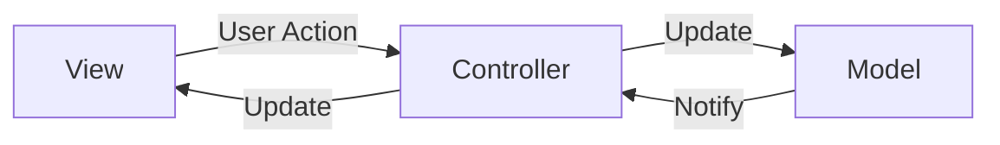
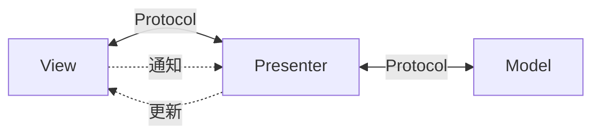
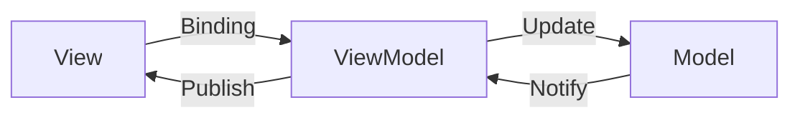
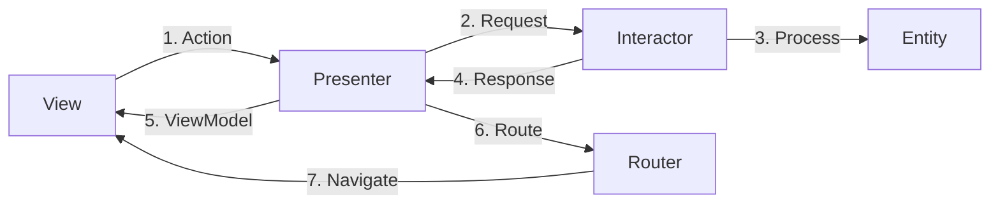
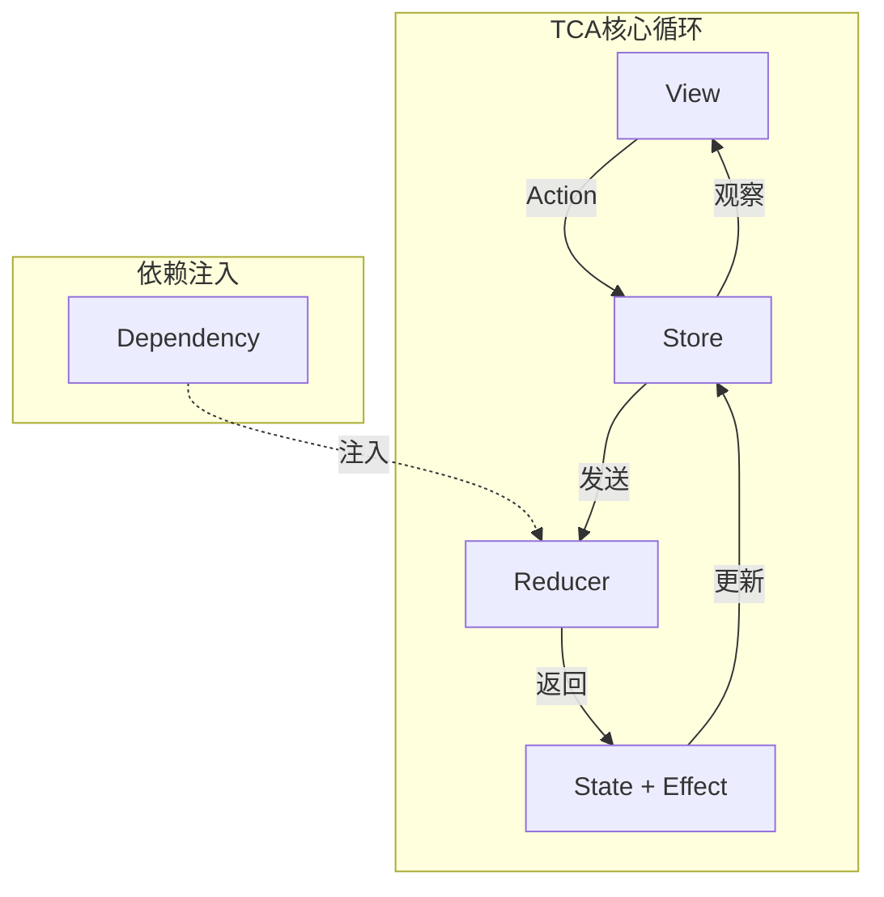
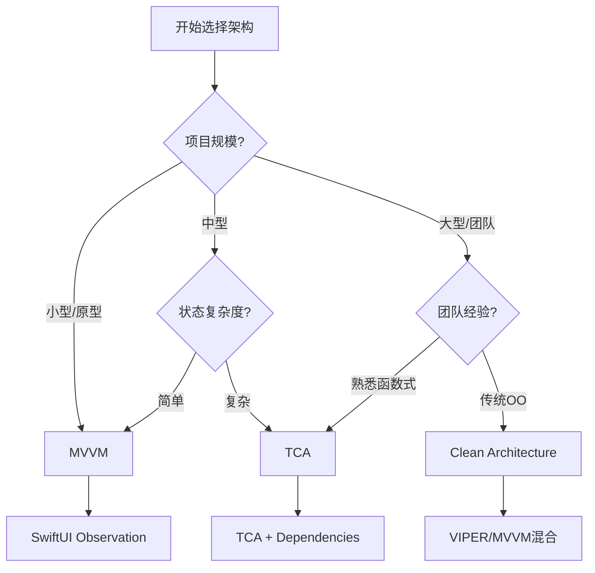
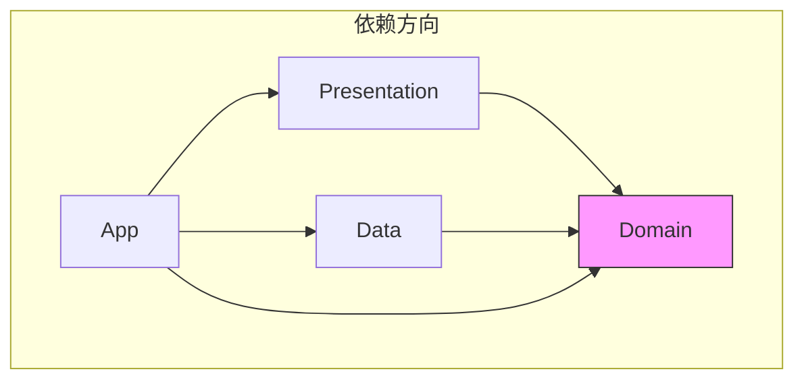
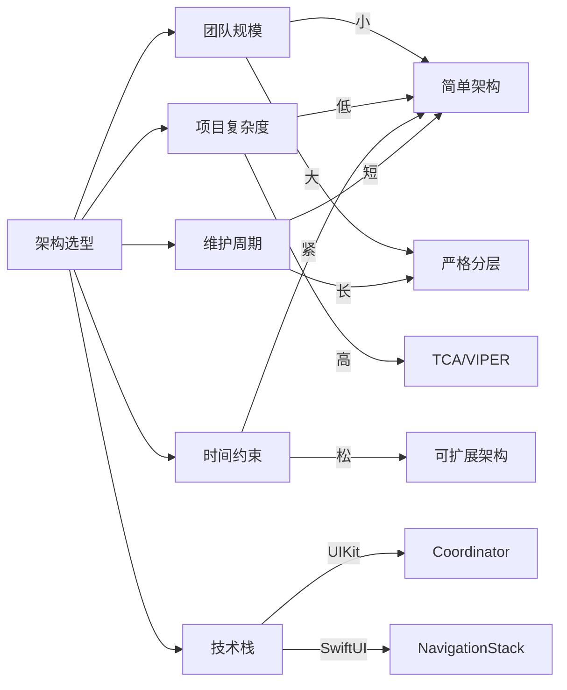

# iOS客户端架构模式对比深度解析

> **核心结论**：没有最好的架构，只有最适合的架构。TCA在复杂SwiftUI应用中表现优异，MVVM仍是大多数项目的稳妥选择，Clean Architecture适合大型团队协作，而MVC/MVP已逐渐退出主流舞台。

---

## 核心结论 TL;DR 表格

| 架构模式 | 复杂度 | 学习曲线 | 测试友好度 | 适用场景 | SwiftUI支持 |
|---------|--------|---------|-----------|---------|------------|
| MVC | 低 | 平缓 | 差 | 小型原型、遗留项目 | 一般 |
| MVP | 中 | 中等 | 中 | Android迁移项目 | 一般 |
| MVVM | 中 | 平缓 | 好 | 大多数iOS项目 | 优秀 |
| VIPER | 高 | 陡峭 | 优秀 | 超大型项目 | 较差 |
| TCA | 高 | 陡峭 | 优秀 | 复杂状态管理 | 完美 |
| Clean Architecture | 高 | 陡峭 | 优秀 | 企业级应用 | 良好 |

---

## 一、经典架构模式全面对比

### 1.1 MVC (Model-View-Controller)

**核心结论**：MVC是iOS开发的起点，但Massive View Controller问题使其在现代开发中受限。

#### 架构图



#### 数据流向

1. 用户操作触发View事件
2. Controller接收事件并更新Model
3. Model变化通知Controller
4. Controller更新View显示

#### 代码示例（Swift 5.9+）

```swift
// Model
struct User {
    let id: UUID
    var name: String
    var email: String
}

// Controller - 典型的Massive View Controller问题
class UserProfileViewController: UIViewController {
    
    private var user: User?
    private let apiService = APIService()
    
    @IBOutlet weak var nameLabel: UILabel!
    @IBOutlet weak var emailLabel: UILabel!
    @IBOutlet weak var loadingIndicator: UIActivityIndicatorView!
    
    override func viewDidLoad() {
        super.viewDidLoad()
        fetchUserData()
    }
    
    // ❌ 业务逻辑、网络请求、UI更新混杂在一起
    private func fetchUserData() {
        loadingIndicator.startAnimating()
        
        let url = URL(string: "https://api.example.com/user")!
        URLSession.shared.dataTask(with: url) { [weak self] data, response, error in
            DispatchQueue.main.async {
                self?.loadingIndicator.stopAnimating()
                
                if let error = error {
                    self?.showError(error)
                    return
                }
                
                guard let data = data,
                      let user = try? JSONDecoder().decode(User.self, from: data) else {
                    self?.showError(NSError(domain: "Parsing", code: -1))
                    return
                }
                
                self?.user = user
                self?.updateUI()
            }
        }.resume()
    }
    
    private func updateUI() {
        nameLabel.text = user?.name
        emailLabel.text = user?.email
    }
    
    private func showError(_ error: Error) {
        let alert = UIAlertController(title: "Error", message: error.localizedDescription, preferredStyle: .alert)
        alert.addAction(UIAlertAction(title: "OK", style: .default))
        present(alert, animated: true)
    }
}
```

#### 优缺点分析

| 优点 | 缺点 |
|-----|------|
| 概念简单，易于理解 | View Controller过于臃肿 |
| Apple官方推荐 | 难以单元测试 |
| 与UIKit深度集成 | 职责边界模糊 |
| 适合小型项目 | 代码复用性差 |

---

### 1.2 MVP (Model-View-Presenter)

**核心结论**：MVP通过Presenter解耦View和Model，但接口定义繁琐，在iOS生态中不如MVVM流行。

#### 架构图



#### 数据流向

1. View接收用户输入，转发给Presenter
2. Presenter处理业务逻辑
3. Presenter更新Model
4. Presenter通过协议回调更新View

#### 代码示例

```swift
// MARK: - Protocols

protocol UserProfileViewProtocol: AnyObject {
    func displayUser(_ user: User)
    func showLoading()
    func hideLoading()
    func showError(_ message: String)
}

protocol UserProfilePresenterProtocol: AnyObject {
    func viewDidLoad()
    func refreshTapped()
}

// MARK: - Presenter

class UserProfilePresenter: UserProfilePresenterProtocol {
    
    weak var view: UserProfileViewProtocol?
    private let userRepository: UserRepositoryProtocol
    
    init(repository: UserRepositoryProtocol) {
        self.userRepository = repository
    }
    
    func viewDidLoad() {
        loadUser()
    }
    
    func refreshTapped() {
        loadUser()
    }
    
    private func loadUser() {
        view?.showLoading()
        
        Task {
            do {
                let user = try await userRepository.fetchCurrentUser()
                await MainActor.run {
                    self.view?.displayUser(user)
                    self.view?.hideLoading()
                }
            } catch {
                await MainActor.run {
                    self.view?.showError(error.localizedDescription)
                    self.view?.hideLoading()
                }
            }
        }
    }
}

// MARK: - View

class UserProfileViewController: UIViewController, UserProfileViewProtocol {
    
    var presenter: UserProfilePresenterProtocol!
    
    @IBOutlet weak var nameLabel: UILabel!
    @IBOutlet weak var emailLabel: UILabel!
    @IBOutlet weak var loadingIndicator: UIActivityIndicatorView!
    
    override func viewDidLoad() {
        super.viewDidLoad()
        presenter.viewDidLoad()
    }
    
    // MARK: - UserProfileViewProtocol
    
    func displayUser(_ user: User) {
        nameLabel.text = user.name
        emailLabel.text = user.email
    }
    
    func showLoading() {
        loadingIndicator.startAnimating()
    }
    
    func hideLoading() {
        loadingIndicator.stopAnimating()
    }
    
    func showError(_ message: String) {
        let alert = UIAlertController(title: "Error", message: message, preferredStyle: .alert)
        alert.addAction(UIAlertAction(title: "OK", style: .default))
        present(alert, animated: true)
    }
}
```

#### 优缺点分析

| 优点 | 缺点 |
|-----|------|
| View和Model完全解耦 | 需要大量协议定义 |
| Presenter可独立测试 | 样板代码较多 |
| 职责清晰 | 双向通信复杂 |
| 适合跨平台迁移 | iOS社区支持较少 |

---

### 1.3 MVVM (Model-View-ViewModel)

**核心结论**：MVVM是iOS开发的主流选择，配合SwiftUI的@StateObject/@ObservedObject实现数据驱动UI。

#### 架构图



#### 数据流向

1. View通过数据绑定监听ViewModel
2. 用户操作直接修改ViewModel状态
3. ViewModel处理业务逻辑并更新Model
4. ViewModel发布状态变化，View自动更新

#### 代码示例（SwiftUI + Observation）

```swift
import SwiftUI
import Observation

// MARK: - Model

struct User: Codable, Identifiable {
    let id: UUID
    var name: String
    var email: String
    var avatarURL: URL?
}

// MARK: - ViewModel

@Observable
class UserProfileViewModel {
    
    // MARK: - State
    
    var user: User?
    var isLoading = false
    var errorMessage: String?
    
    // MARK: - Dependencies
    
    private let userRepository: UserRepositoryProtocol
    
    // MARK: - Initialization
    
    init(repository: UserRepositoryProtocol) {
        self.userRepository = repository
    }
    
    // MARK: - Public Methods
    
    func loadUser() async {
        isLoading = true
        errorMessage = nil
        
        do {
            user = try await userRepository.fetchCurrentUser()
        } catch {
            errorMessage = error.localizedDescription
        }
        
        isLoading = false
    }
    
    func updateName(_ newName: String) async {
        guard var currentUser = user else { return }
        
        currentUser.name = newName
        
        do {
            user = try await userRepository.updateUser(currentUser)
        } catch {
            errorMessage = error.localizedDescription
        }
    }
}

// MARK: - SwiftUI View

struct UserProfileView: View {
    
    @State private var viewModel: UserProfileViewModel
    
    init(viewModel: UserProfileViewModel) {
        self.viewModel = viewModel
    }
    
    var body: some View {
        VStack(spacing: 20) {
            if viewModel.isLoading {
                ProgressView()
            } else if let error = viewModel.errorMessage {
                ErrorView(message: error, retryAction: {
                    Task { await viewModel.loadUser() }
                })
            } else if let user = viewModel.user {
                UserInfoView(user: user, onNameChange: { newName in
                    Task { await viewModel.updateName(newName) }
                })
            }
        }
        .task {
            await viewModel.loadUser()
        }
    }
}

struct UserInfoView: View {
    let user: User
    let onNameChange: (String) -> Void
    
    @State private var isEditing = false
    @State private var editedName: String = ""
    
    var body: some View {
        VStack(spacing: 16) {
            AsyncImage(url: user.avatarURL) { image in
                image.resizable().aspectRatio(contentMode: .fill)
            } placeholder: {
                Circle().fill(Color.gray)
            }
            .frame(width: 100, height: 100)
            .clipShape(Circle())
            
            if isEditing {
                TextField("Name", text: $editedName)
                    .textFieldStyle(RoundedBorderTextFieldStyle())
                    .frame(maxWidth: 200)
                
                HStack {
                    Button("Cancel") {
                        isEditing = false
                    }
                    Button("Save") {
                        onNameChange(editedName)
                        isEditing = false
                    }
                    .buttonStyle(.borderedProminent)
                }
            } else {
                Text(user.name)
                    .font(.title)
                Text(user.email)
                    .font(.subheadline)
                    .foregroundStyle(.secondary)
                
                Button("Edit") {
                    editedName = user.name
                    isEditing = true
                }
            }
        }
        .padding()
    }
}

struct ErrorView: View {
    let message: String
    let retryAction: () -> Void
    
    var body: some View {
        VStack(spacing: 16) {
            Image(systemName: "exclamationmark.triangle")
                .font(.largeTitle)
                .foregroundStyle(.red)
            Text(message)
                .multilineTextAlignment(.center)
            Button("Retry", action: retryAction)
                .buttonStyle(.bordered)
        }
        .padding()
    }
}
```

#### 优缺点分析

| 优点 | 缺点 |
|-----|------|
| 与SwiftUI完美配合 | ViewModel可能臃肿 |
| 数据驱动UI更新 | 过度使用@Published |
| 测试友好 | 绑定调试困难 |
| 社区成熟 | 内存泄漏风险（闭包） |

---

### 1.4 VIPER

**核心结论**：VIPER极致的单一职责适合超大型项目，但过度设计会增加不必要的复杂度。

#### 架构图



#### 数据流向

1. View通知Presenter用户操作
2. Presenter请求Interactor处理业务逻辑
3. Interactor操作Entity（Model）
4. Interactor返回结果给Presenter
5. Presenter格式化数据为ViewModel
6. Presenter决定是否需要路由
7. Router执行页面跳转

#### 代码示例

```swift
// MARK: - Entity

struct UserEntity: Codable {
    let id: String
    let firstName: String
    let lastName: String
    let email: String
}

// MARK: - Protocols

protocol UserProfileViewProtocol: AnyObject {
    func displayUser(viewModel: UserProfileViewModel)
    func showLoading()
    func hideLoading()
}

protocol UserProfilePresenterProtocol: AnyObject {
    func viewDidLoad()
    func editProfileTapped()
}

protocol UserProfileInteractorProtocol: AnyObject {
    func fetchUser() async throws -> UserEntity
}

protocol UserProfileRouterProtocol: AnyObject {
    func navigateToEditProfile(for userId: String)
}

// MARK: - ViewModel (Display Model)

struct UserProfileViewModel {
    let fullName: String
    let email: String
    let initials: String
}

// MARK: - Interactor

class UserProfileInteractor: UserProfileInteractorProtocol {
    
    private let userService: UserServiceProtocol
    
    init(userService: UserServiceProtocol) {
        self.userService = userService
    }
    
    func fetchUser() async throws -> UserEntity {
        return try await userService.fetchCurrentUser()
    }
}

// MARK: - Presenter

class UserProfilePresenter: UserProfilePresenterProtocol {
    
    weak var view: UserProfileViewProtocol?
    var interactor: UserProfileInteractorProtocol!
    var router: UserProfileRouterProtocol!
    
    private var currentUser: UserEntity?
    
    func viewDidLoad() {
        view?.showLoading()
        
        Task {
            do {
                let user = try await interactor.fetchUser()
                currentUser = user
                
                let viewModel = mapToViewModel(user)
                await MainActor.run {
                    self.view?.displayUser(viewModel: viewModel)
                    self.view?.hideLoading()
                }
            } catch {
                await MainActor.run {
                    self.view?.hideLoading()
                    // 处理错误
                }
            }
        }
    }
    
    func editProfileTapped() {
        guard let userId = currentUser?.id else { return }
        router.navigateToEditProfile(for: userId)
    }
    
    private func mapToViewModel(_ entity: UserEntity) -> UserProfileViewModel {
        return UserProfileViewModel(
            fullName: "\(entity.firstName) \(entity.lastName)",
            email: entity.email,
            initials: "\(entity.firstName.prefix(1))\(entity.lastName.prefix(1))"
        )
    }
}

// MARK: - Router

class UserProfileRouter: UserProfileRouterProtocol {
    
    weak var viewController: UIViewController?
    
    static func createModule() -> UIViewController {
        let view = UserProfileViewController()
        let presenter = UserProfilePresenter()
        let interactor = UserProfileInteractor(userService: UserService())
        let router = UserProfileRouter()
        
        view.presenter = presenter
        presenter.view = view
        presenter.interactor = interactor
        presenter.router = router
        router.viewController = view
        
        return view
    }
    
    func navigateToEditProfile(for userId: String) {
        let editVC = EditProfileRouter.createModule(userId: userId)
        viewController?.navigationController?.pushViewController(editVC, animated: true)
    }
}

// MARK: - View

class UserProfileViewController: UIViewController, UserProfileViewProtocol {
    
    var presenter: UserProfilePresenterProtocol!
    
    // UI组件定义...
    
    override func viewDidLoad() {
        super.viewDidLoad()
        presenter.viewDidLoad()
    }
    
    func displayUser(viewModel: UserProfileViewModel) {
        // 更新UI...
    }
    
    func showLoading() {
        // 显示加载...
    }
    
    func hideLoading() {
        // 隐藏加载...
    }
}
```

#### 优缺点分析

| 优点 | 缺点 |
|-----|------|
| 极致的单一职责 | 文件数量爆炸 |
| 极高的可测试性 | 学习曲线陡峭 |
| 适合大型团队协作 | 过度设计风险 |
| 清晰的职责边界 | 开发效率较低 |

---

## 二、The Composable Architecture (TCA) 深度解析

### 2.1 TCA核心概念

**核心结论**：TCA通过函数式编程和单向数据流实现可预测的状态管理，是复杂SwiftUI应用的最佳选择。

#### 架构图



#### 核心组件

| 组件 | 职责 | 类型特征 |
|-----|------|---------|
| State | 描述UI状态 | 值类型（Struct） |
| Action | 描述状态变化 | 枚举（Enum） |
| Reducer | 处理状态变化 | 纯函数 |
| Effect | 处理副作用 | 异步操作 |
| Store | 管理状态和分发 | 可观察对象 |
| Dependency | 外部依赖注入 | 环境值 |

### 2.2 完整代码示例

```swift
import ComposableArchitecture
import SwiftUI

// MARK: - State

@Reducer
struct UserProfileFeature {
    
    @ObservableState
    struct State: Equatable {
        var user: User?
        var isLoading = false
        var errorMessage: String?
        var isEditingName = false
        var editedName: String = ""
        
        // 计算属性
        var displayName: String {
            user?.name ?? "Guest"
        }
        
        var canSaveName: Bool {
            !editedName.isEmpty && editedName != user?.name
        }
    }
    
    // MARK: - Action
    
    enum Action: BindableAction {
        case binding(BindingAction<State>)
        
        // 用户操作
        case onAppear
        case refreshButtonTapped
        case editNameButtonTapped
        case saveNameButtonTapped
        case cancelEditButtonTapped
        
        // 内部操作
        case userResponse(Result<User, Error>)
        case updateNameResponse(Result<User, Error>)
    }
    
    // MARK: - Dependency
    
    @Dependency(\.userRepository) var userRepository
    @Dependency(\.mainQueue) var mainQueue
    
    // MARK: - Reducer
    
    var body: some ReducerOf<Self> {
        BindingReducer()
        
        Reduce { state, action in
            switch action {
            case .binding:
                return .none
                
            case .onAppear, .refreshButtonTapped:
                state.isLoading = true
                state.errorMessage = nil
                
                return .run { send in
                    await send(.userResponse(Result {
                        try await userRepository.fetchCurrentUser()
                    }))
                }
                
            case .editNameButtonTapped:
                state.isEditingName = true
                state.editedName = state.user?.name ?? ""
                return .none
                
            case .cancelEditButtonTapped:
                state.isEditingName = false
                state.editedName = ""
                return .none
                
            case .saveNameButtonTapped:
                guard var user = state.user else { return .none }
                user.name = state.editedName
                state.isLoading = true
                
                return .run { send in
                    await send(.updateNameResponse(Result {
                        try await userRepository.updateUser(user)
                    }))
                }
                
            case let .userResponse(.success(user)):
                state.user = user
                state.isLoading = false
                return .none
                
            case let .userResponse(.failure(error)):
                state.errorMessage = error.localizedDescription
                state.isLoading = false
                return .none
                
            case let .updateNameResponse(.success(user)):
                state.user = user
                state.isEditingName = false
                state.isLoading = false
                return .none
                
            case let .updateNameResponse(.failure(error)):
                state.errorMessage = error.localizedDescription
                state.isLoading = false
                return .none
            }
        }
    }
}

// MARK: - SwiftUI View

struct UserProfileView: View {
    
    @Bindable var store: StoreOf<UserProfileFeature>
    
    var body: some View {
        VStack(spacing: 20) {
            if store.isLoading && store.user == nil {
                ProgressView()
            } else if let error = store.errorMessage {
                ErrorView(message: error) {
                    store.send(.refreshButtonTapped)
                }
            } else {
                userContent
            }
        }
        .onAppear {
            store.send(.onAppear)
        }
    }
    
    @ViewBuilder
    private var userContent: some View {
        if let user = store.user {
            VStack(spacing: 16) {
                // 头像
                AvatarView(url: user.avatarURL)
                
                // 名称编辑
                if store.isEditingName {
                    VStack {
                        TextField("Name", text: $store.editedName)
                            .textFieldStyle(RoundedBorderTextFieldStyle())
                            .frame(maxWidth: 200)
                        
                        HStack {
                            Button("Cancel") {
                                store.send(.cancelEditButtonTapped)
                            }
                            Button("Save") {
                                store.send(.saveNameButtonTapped)
                            }
                            .disabled(!store.canSaveName)
                            .buttonStyle(.borderedProminent)
                        }
                    }
                } else {
                    Text(user.name)
                        .font(.title)
                    Text(user.email)
                        .font(.subheadline)
                        .foregroundStyle(.secondary)
                    
                    Button("Edit Name") {
                        store.send(.editNameButtonTapped)
                    }
                }
                
                // 刷新按钮
                Button {
                    store.send(.refreshButtonTapped)
                } label: {
                    Label("Refresh", systemImage: "arrow.clockwise")
                }
                .disabled(store.isLoading)
            }
            .padding()
        }
    }
}

// MARK: - 依赖注入配置

extension DependencyValues {
    var userRepository: UserRepositoryProtocol {
        get { self[UserRepositoryKey.self] }
        set { self[UserRepositoryKey.self] = newValue }
    }
}

private enum UserRepositoryKey: DependencyKey {
    static let liveValue: UserRepositoryProtocol = LiveUserRepository()
    static let testValue: UserRepositoryProtocol = MockUserRepository()
    static let previewValue: UserRepositoryProtocol = MockUserRepository()
}

// MARK: - 测试

import XCTest

@MainActor
final class UserProfileFeatureTests: XCTestCase {
    
    func testLoadUserSuccess() async {
        let store = TestStore(initialState: UserProfileFeature.State()) {
            UserProfileFeature()
        } withDependencies: {
            $0.userRepository = MockUserRepository()
        }
        
        await store.send(.onAppear) {
            $0.isLoading = true
        }
        
        await store.receive(.userResponse(.success(.mock))) {
            $0.isLoading = false
            $0.user = .mock
        }
    }
    
    func testUpdateName() async {
        let store = TestStore(initialState: UserProfileFeature.State(
            user: .mock,
            isEditingName: true,
            editedName: "New Name"
        )) {
            UserProfileFeature()
        } withDependencies: {
            $0.userRepository = MockUserRepository()
        }
        
        await store.send(.saveNameButtonTapped) {
            $0.isLoading = true
        }
        
        var updatedUser = User.mock
        updatedUser.name = "New Name"
        
        await store.receive(.updateNameResponse(.success(updatedUser))) {
            $0.isLoading = false
            $0.user = updatedUser
            $0.isEditingName = false
        }
    }
}

// MARK: - Mock Data

extension User {
    static let mock = User(
        id: UUID(),
        name: "John Doe",
        email: "john@example.com",
        avatarURL: nil
    )
}
```

### 2.3 TCA优缺点分析

| 优点 | 缺点 |
|-----|------|
| 纯函数Reducer易于测试 | 学习曲线陡峭 |
| 副作用集中管理 | 样板代码较多 |
| 时间旅行调试 | 编译时间增加 |
| 依赖注入清晰 | 不适合简单场景 |
| 与SwiftUI深度集成 | 社区相对较小 |

---

## 三、SwiftUI时代的架构选择

### 3.1 MVVM + Observation vs TCA vs Redux-like

**核心结论**：简单应用选择MVVM + Observation，复杂状态管理选择TCA，跨平台需求考虑Redux-like。

#### 对比表格

| 特性 | MVVM + Observation | TCA | Redux-like (ReSwift) |
|-----|-------------------|-----|---------------------|
| 学习曲线 | 平缓 | 陡峭 | 中等 |
| 状态管理 | 分散 | 集中 | 集中 |
| 副作用处理 | 手动 | 框架支持 | Middleware |
| 测试友好度 | 好 | 优秀 | 好 |
| SwiftUI集成 | 完美 | 完美 | 一般 |
| 调试工具 | 有限 | 时间旅行 | 日志 |
| 适用规模 | 中小型 | 中大型 | 中型 |

#### 选择决策树



---

## 四、SPM模块化架构

### 4.1 模块划分策略

**核心结论**：按业务领域而非技术层次划分模块，遵循Domain/Data/Presentation分层原则。

#### 推荐模块结构

```
MyApp/
├── App/                    # 应用入口、组装
├── Features/
│   ├── UserFeature/        # 用户模块
│   ├── OrderFeature/       # 订单模块
│   └── PaymentFeature/     # 支付模块
├── Core/
│   ├── Domain/             # 业务实体、UseCase协议
│   ├── Data/               # 数据层实现
│   ├── Network/            # 网络基础设施
│   └── UIComponents/       # 共享UI组件
└── Infrastructure/
    ├── Logger/             # 日志
    ├── Analytics/          # 分析
    └── Keychain/           # 安全存储
```

#### Package.swift 示例

```swift
// swift-tools-version:5.9
import PackageDescription

let package = Package(
    name: "MyApp",
    platforms: [.iOS(.v17), .macOS(.v14)],
    products: [
        .library(name: "MyApp", targets: ["App"]),
        .library(name: "Domain", targets: ["Domain"]),
        .library(name: "UserFeature", targets: ["UserFeature"]),
    ],
    dependencies: [
        .package(url: "https://github.com/pointfreeco/swift-composable-architecture", from: "1.0.0"),
    ],
    targets: [
        // Domain层: 不依赖任何其他层
        .target(
            name: "Domain",
            dependencies: []
        ),
        
        // Data层: 只依赖Domain
        .target(
            name: "Data",
            dependencies: [
                "Domain",
                "Network",
            ]
        ),
        
        // Network层: 基础设施
        .target(
            name: "Network",
            dependencies: []
        ),
        
        // UserFeature: 依赖Domain，不直接依赖Data
        .target(
            name: "UserFeature",
            dependencies: [
                "Domain",
                "UIComponents",
                .product(name: "ComposableArchitecture", package: "swift-composable-architecture"),
            ]
        ),
        
        // App层: 组装所有模块
        .target(
            name: "App",
            dependencies: [
                "Domain",
                "Data",
                "UserFeature",
                "OrderFeature",
            ]
        ),
    ]
)
```

### 4.2 依赖方向控制



**关键原则**：
1. Domain层不依赖任何其他层
2. Data层只依赖Domain
3. Presentation层只依赖Domain
4. App层负责组装和依赖注入

---

## 五、依赖注入

### 5.1 方案对比

| 方案 | 优点 | 缺点 | 适用场景 |
|-----|------|------|---------|
| Protocol-based | 解耦、可测试 | 样板代码 | 传统iOS项目 |
| @Environment | SwiftUI原生 | 仅限SwiftUI | SwiftUI应用 |
| PropertyWrapper | 简洁 | 魔法感 | 现代Swift项目 |
| Swinject | 功能丰富 | 第三方依赖 | 复杂DI需求 |
| Factory | 编译安全 | 学习成本 | 现代Swift项目 |

### 5.2 Protocol-based DI 示例

```swift
// MARK: - Protocols

protocol UserRepositoryProtocol {
    func fetchCurrentUser() async throws -> User
    func updateUser(_ user: User) async throws -> User
}

protocol NetworkServiceProtocol {
    func request<T: Decodable>(_ endpoint: Endpoint) async throws -> T
}

// MARK: - Implementations

class LiveUserRepository: UserRepositoryProtocol {
    private let networkService: NetworkServiceProtocol
    private let cache: UserCacheProtocol
    
    init(networkService: NetworkServiceProtocol, cache: UserCacheProtocol) {
        self.networkService = networkService
        self.cache = cache
    }
    
    func fetchCurrentUser() async throws -> User {
        // 先尝试缓存
        if let cached = try? cache.getUser() {
            return cached
        }
        
        // 网络请求
        let user: User = try await networkService.request(.currentUser)
        try? cache.saveUser(user)
        return user
    }
    
    func updateUser(_ user: User) async throws -> User {
        let updated: User = try await networkService.request(.updateUser(user))
        try? cache.saveUser(updated)
        return updated
    }
}

// MARK: - Assembly

class DependencyContainer {
    
    static let shared = DependencyContainer()
    
    lazy var networkService: NetworkServiceProtocol = {
        LiveNetworkService()
    }()
    
    lazy var userCache: UserCacheProtocol = {
        UserCache()
    }()
    
    lazy var userRepository: UserRepositoryProtocol = {
        LiveUserRepository(
            networkService: networkService,
            cache: userCache
        )
    }()
    
    // ViewModel工厂方法
    func makeUserProfileViewModel() -> UserProfileViewModel {
        UserProfileViewModel(repository: userRepository)
    }
}

// MARK: - SwiftUI集成

struct UserProfileView: View {
    @StateObject private var viewModel = DependencyContainer.shared.makeUserProfileViewModel()
    
    var body: some View {
        // ...
    }
}
```

### 5.3 @Environment 注入示例

```swift
// MARK: - Environment Keys

private struct UserRepositoryKey: EnvironmentKey {
    static let defaultValue: UserRepositoryProtocol = MockUserRepository()
}

extension EnvironmentValues {
    var userRepository: UserRepositoryProtocol {
        get { self[UserRepositoryKey.self] }
        set { self[UserRepositoryKey.self] = newValue }
    }
}

// MARK: - 使用

struct UserProfileView: View {
    @Environment(\.userRepository) private var userRepository
    
    var body: some View {
        // 使用userRepository
        Text("Profile")
    }
}

// MARK: - App注入

@main
struct MyApp: App {
    var body: some Scene {
        WindowGroup {
            ContentView()
                .environment(\.userRepository, LiveUserRepository())
        }
    }
}
```

---

## 六、路由设计

### 6.1 方案对比

| 方案 | 优点 | 缺点 | 适用场景 |
|-----|------|------|---------|
| Coordinator | 集中管理 | 额外抽象层 | UIKit复杂导航 |
| NavigationStack | SwiftUI原生 | iOS 16+ | 现代SwiftUI |
| Router协议 | 解耦 | 需要规划 | 中大型项目 |
| Deep Link Handler | 统一入口 | 维护成本 | 需要Deep Link |

### 6.2 Coordinator 模式

```swift
// MARK: - Coordinator Protocol

protocol Coordinator: AnyObject {
    var childCoordinators: [Coordinator] { get set }
    var navigationController: UINavigationController { get set }
    
    func start()
    func addChild(_ coordinator: Coordinator)
    func removeChild(_ coordinator: Coordinator)
}

extension Coordinator {
    func addChild(_ coordinator: Coordinator) {
        childCoordinators.append(coordinator)
    }
    
    func removeChild(_ coordinator: Coordinator) {
        childCoordinators.removeAll { $0 === coordinator }
    }
}

// MARK: - App Coordinator

class AppCoordinator: Coordinator {
    
    var childCoordinators: [Coordinator] = []
    var navigationController: UINavigationController
    
    private let container: DependencyContainer
    
    init(navigationController: UINavigationController, container: DependencyContainer) {
        self.navigationController = navigationController
        self.container = container
    }
    
    func start() {
        showLogin()
    }
    
    func showLogin() {
        let coordinator = LoginCoordinator(
            navigationController: navigationController,
            container: container,
            delegate: self
        )
        addChild(coordinator)
        coordinator.start()
    }
    
    func showMainFlow() {
        let coordinator = MainTabCoordinator(
            navigationController: navigationController,
            container: container,
            delegate: self
        )
        addChild(coordinator)
        coordinator.start()
    }
}

// MARK: - Feature Coordinator

class UserProfileCoordinator: Coordinator {
    
    var childCoordinators: [Coordinator] = []
    var navigationController: UINavigationController
    
    private let container: DependencyContainer
    private let userId: String
    
    init(navigationController: UINavigationController, container: DependencyContainer, userId: String) {
        self.navigationController = navigationController
        self.container = container
        self.userId = userId
    }
    
    func start() {
        let viewModel = UserProfileViewModel(
            userId: userId,
            repository: container.userRepository
        )
        let viewController = UserProfileViewController(viewModel: viewModel)
        viewController.coordinator = self
        navigationController.pushViewController(viewController, animated: true)
    }
    
    func showEditProfile(for user: User) {
        let viewModel = EditProfileViewModel(user: user, repository: container.userRepository)
        let viewController = EditProfileViewController(viewModel: viewModel)
        viewController.coordinator = self
        navigationController.pushViewController(viewController, animated: true)
    }
}
```

### 6.3 NavigationStack 路由

```swift
// MARK: - Route Definition

enum AppRoute: Hashable {
    case login
    case home
    case profile(userId: String)
    case settings
    case detail(itemId: String)
}

// MARK: - Router

@Observable
class Router {
    var path = NavigationPath()
    
    func navigate(to route: AppRoute) {
        path.append(route)
    }
    
    func navigateBack() {
        path.removeLast()
    }
    
    func navigateToRoot() {
        path.removeLast(path.count)
    }
}

// MARK: - App View

struct ContentView: View {
    @State private var router = Router()
    
    var body: some View {
        NavigationStack(path: $router.path) {
            LoginView()
                .navigationDestination(for: AppRoute.self) { route in
                    switch route {
                    case .login:
                        LoginView()
                    case .home:
                        HomeView()
                    case .profile(let userId):
                        UserProfileView(userId: userId)
                    case .settings:
                        SettingsView()
                    case .detail(let itemId):
                        DetailView(itemId: itemId)
                    }
                }
        }
        .environment(router)
    }
}

// MARK: - Deep Link Handling

class DeepLinkHandler {
    
    func handle(url: URL, router: Router) -> Bool {
        guard let components = URLComponents(url: url, resolvingAgainstBaseURL: true),
              let host = components.host else {
            return false
        }
        
        switch host {
        case "profile":
            if let userId = components.queryItems?.first(where: { $0.name == "id" })?.value {
                router.navigate(to: .profile(userId: userId))
                return true
            }
            
        case "item":
            if let itemId = components.queryItems?.first(where: { $0.name == "id" })?.value {
                router.navigate(to: .detail(itemId: itemId))
                return true
            }
            
        default:
            return false
        }
        
        return false
    }
}
```

---

## 七、架构选型总结

### 7.1 场景推荐

| 项目类型 | 推荐架构 | 理由 |
|---------|---------|------|
| 小型MVP | MVVM | 快速开发，易于维护 |
| 中型应用 | MVVM + Clean | 平衡开发效率和可维护性 |
| 大型团队 | TCA | 状态管理可预测，测试友好 |
| 遗留项目 | 渐进式重构 | 逐步引入MVVM，避免大爆炸重构 |
| 跨平台需求 | KMP + MVVM | 共享业务逻辑，原生UI |

### 7.2 关键决策因素



---

## 参考资源

- [Apple SwiftUI Documentation](https://developer.apple.com/documentation/swiftui)
- [The Composable Architecture](https://github.com/pointfreeco/swift-composable-architecture)
- [Clean Architecture for SwiftUI](https://nalexn.github.io/clean-architecture-swiftui/)
- [Swift Package Manager](https://www.swift.org/package-manager/)

---

*本文档基于 iOS 17+ / Swift 5.9+ 编写，建议配合 Xcode 15+ 使用。*
