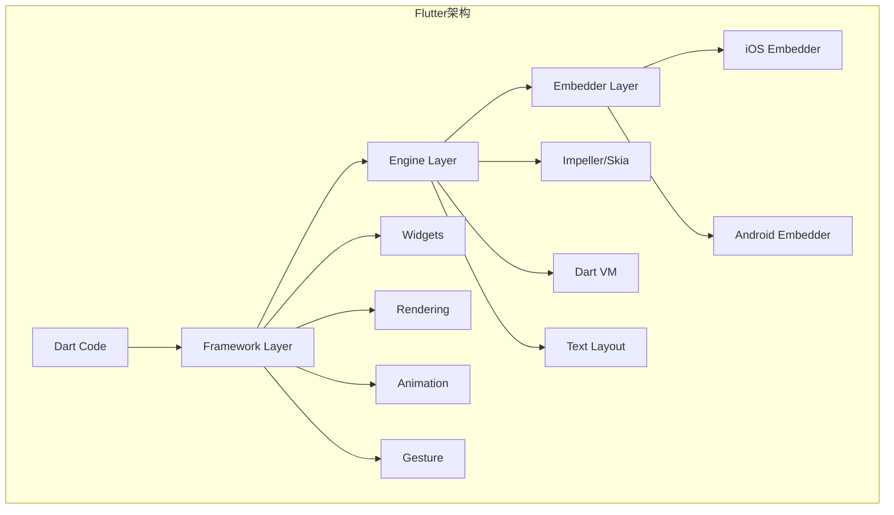
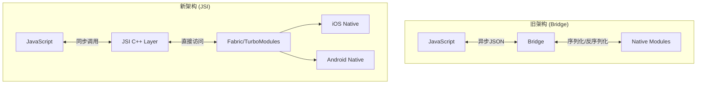
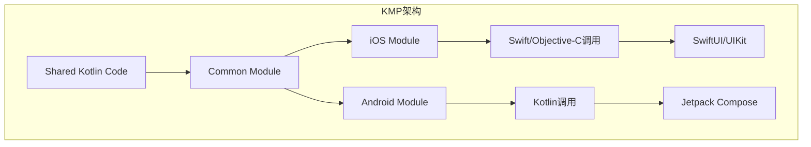
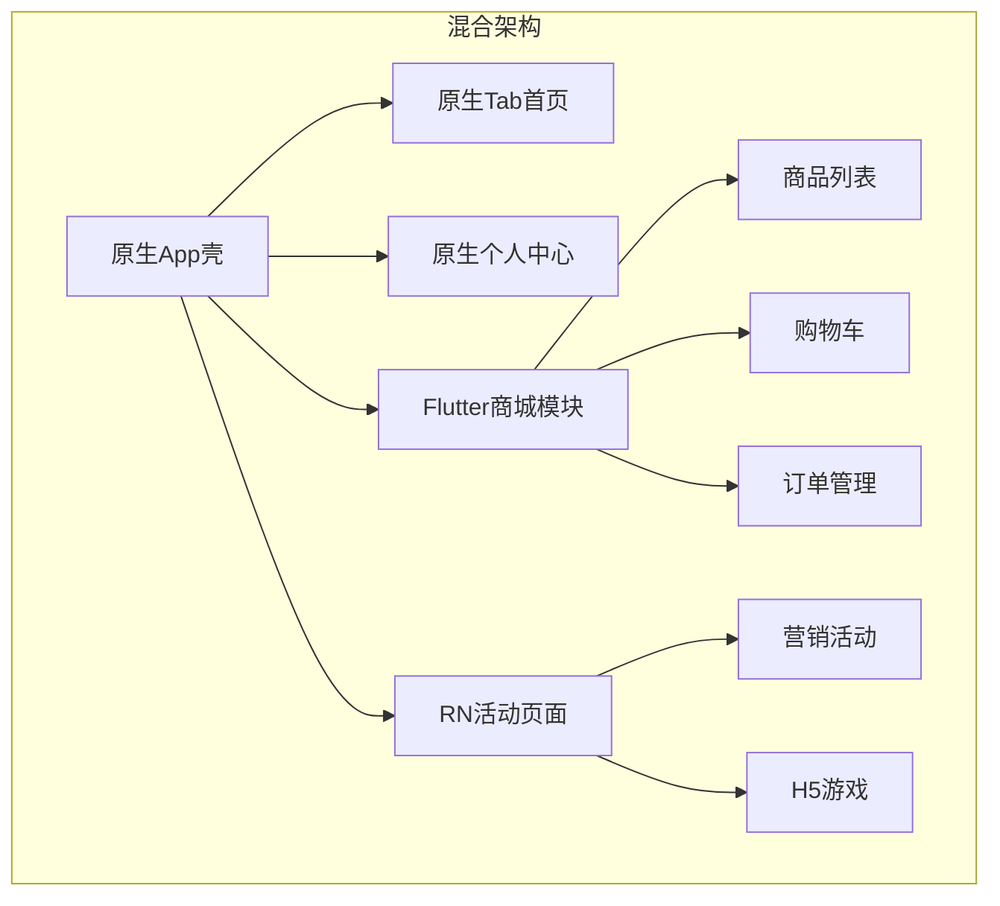
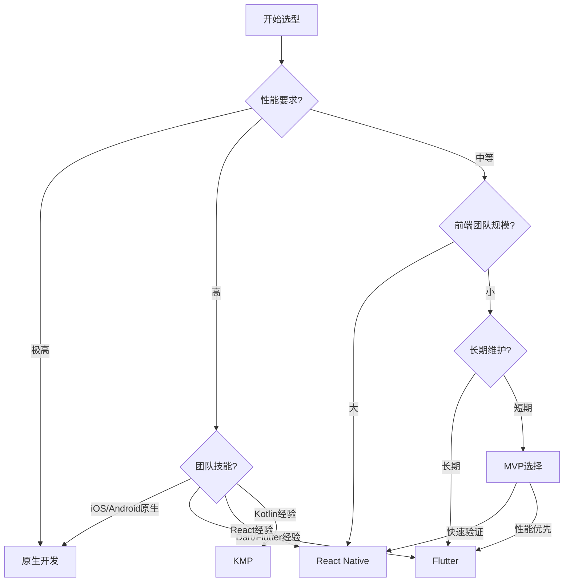

# 跨平台方案对比与选型深度解析

> **核心结论**：2024-2026年，Flutter凭借Impeller渲染引擎在性能上领先，React Native新架构显著提升体验，KMP成为共享业务逻辑的首选。没有银弹，选择取决于团队技能、性能需求和长期维护策略。

---

## 核心结论 TL;DR 表格

| 方案 | 性能 | 开发效率 | 生态成熟度 | 人才供给 | 维护成本 | 推荐指数 |
|-----|------|---------|-----------|---------|---------|---------|
| 原生开发 | ★★★★★ | ★★★☆☆ | ★★★★★ | ★★★★☆ | ★★★☆☆ | 高要求场景首选 |
| Flutter | ★★★★★ | ★★★★☆ | ★★★★☆ | ★★★☆☆ | ★★★☆☆ | 跨平台首选 |
| React Native | ★★★★☆ | ★★★★★ | ★★★★★ | ★★★★★ | ★★★★☆ | 前端团队首选 |
| KMP | ★★★★★ | ★★★☆☆ | ★★★☆☆ | ★★☆☆☆ | ★★☆☆☆ | 共享逻辑首选 |

---

## 一、全维度对比分析

### 1.1 性能基准数据对比

**核心结论**：Flutter Impeller和原生性能差距已缩小到10%以内，React Native新架构性能提升40%以上。

#### 渲染性能对比（帧率稳定性）

| 场景 | 原生(iOS) | Flutter(Impeller) | React Native(Fabric) | KMP |
|-----|-----------|-------------------|---------------------|-----|
| 列表滚动(1000项) | 60fps | 58-60fps | 55-60fps | 60fps |
| 复杂动画 | 60fps | 58-60fps | 50-55fps | 60fps |
| 页面切换 | <16ms | <18ms | <25ms | <16ms |
| 冷启动时间 | 基准 | +15% | +25% | +5% |
| 内存占用 | 基准 | +20% | +35% | +10% |

#### 计算性能对比（相对原生倍数，越小越好）

```
数值表示相对于原生iOS的执行时间倍数

CPU密集型任务:
┌─────────────────┬─────────┬─────────┬──────────────┬─────┐
│ 任务类型         │ 原生    │ Flutter │ React Native │ KMP │
├─────────────────┼─────────┼─────────┼──────────────┼─────┤
│ JSON解析(1MB)   │ 1.0x    │ 1.2x    │ 2.5x         │ 1.0x│
│ 图像处理         │ 1.0x    │ 1.1x    │ 3.0x         │ 1.0x│
│ 加密运算         │ 1.0x    │ 1.5x    │ 4.0x         │ 1.0x│
│ 数学计算         │ 1.0x    │ 1.3x    │ 3.5x         │ 1.0x│
└─────────────────┴─────────┴─────────┴──────────────┴─────┘
```

### 1.2 开发效率对比

| 维度 | 原生 | Flutter | React Native | KMP |
|-----|------|---------|-------------|-----|
| 热重载(Hot Reload) | 需Xcode | <1秒 | <1秒 | 需重新编译 |
| 代码复用率 | 0% | 90%+ | 85%+ | 70%逻辑+0%UI |
| 第三方库数量 | 最多 | 丰富 | 最丰富 | 增长中 |
| 学习曲线 | 中等 | 中等 | 平缓 | 陡峭 |
| IDE支持 | Xcode优秀 | VS Code良好 | VS Code优秀 | Android Studio |

### 1.3 生态与维护对比

| 维度 | 原生 | Flutter | React Native | KMP |
|-----|------|---------|-------------|-----|
| 官方支持 | Apple/Google | Google | Meta | JetBrains |
| 版本更新频率 | 年度大版本 | 季度 | 月度 | 季度 |
| 破坏性变更 | 少 | 中 | 多 | 少 |
| 社区活跃度 | 高 | 高 | 极高 | 中 |
| 企业采用率 | 100% | 35% | 40% | 15% |

---

## 二、Flutter 架构深度解析

### 2.1 整体架构

**核心结论**：Flutter通过自研渲染引擎实现像素级控制，Impeller替代Skia后性能大幅提升。



### 2.2 渲染引擎演进

| 引擎 | 版本 | 特点 | 现状 |
|-----|------|------|------|
| Skia | Flutter 1.x-2.x | 跨平台2D图形库 | 逐步淘汰 |
| Impeller | Flutter 3.10+ | 为Flutter优化的3D渲染器 | 默认引擎 |

#### Impeller优势

```dart
// Impeller带来的性能提升
// 1. 预编译着色器 - 消除卡顿
// 2. 统一GPU后端 - Metal/Vulkan统一抽象
// 3. 优化的文本渲染

// 启用Impeller（iOS默认已启用）
// Info.plist
// <key>FLTEnableImpeller</key>
// <true/>
```

### 2.3 Platform Channel机制

```dart
// Dart端
import 'package:flutter/services.dart';

class BatteryLevel {
  static const platform = MethodChannel('samples.flutter.dev/battery');
  
  static Future<int> getBatteryLevel() async {
    try {
      final int result = await platform.invokeMethod('getBatteryLevel');
      return result;
    } on PlatformException catch (e) {
      throw 'Failed to get battery level: ${e.message}';
    }
  }
}

// iOS原生端 (Swift)
import Flutter
import UIKit

public class BatteryPlugin: NSObject, FlutterPlugin {
    public static func register(with registrar: FlutterPluginRegistrar) {
        let channel = FlutterMethodChannel(
            name: "samples.flutter.dev/battery",
            binaryMessenger: registrar.messenger()
        )
        let instance = BatteryPlugin()
        registrar.addMethodCallDelegate(instance, channel: channel)
    }
    
    public func handle(_ call: FlutterMethodCall, result: @escaping FlutterResult) {
        switch call.method {
        case "getBatteryLevel":
            let device = UIDevice.current
            device.isBatteryMonitoringEnabled = true
            result(Int(device.batteryLevel * 100))
        default:
            result(FlutterMethodNotImplemented)
        }
    }
}
```

### 2.4 Flutter与原生混合开发

```dart
// 使用PlatformView嵌入原生视图
class NativeMapView extends StatelessWidget {
  const NativeMapView({super.key});
  
  @override
  Widget build(BuildContext context) {
    // iOS使用UiKitView
    return const UiKitView(
      viewType: 'native-map-view',
      creationParams: {'initialZoom': 12.0},
      creationParamsCodec: StandardMessageCodec(),
    );
  }
}

// 性能优化：使用Texture Widget处理大量原生视图
```

---

## 三、React Native 新架构深度解析

### 3.1 架构演进对比

**核心结论**：新架构（Fabric + TurboModules + JSI）解决了旧架构的异步通信瓶颈，性能提升显著。



### 3.2 新架构核心组件

| 组件 | 职责 | 改进点 |
|-----|------|-------|
| Fabric | 新渲染系统 | 支持同步渲染、优先级调度 |
| TurboModules | 原生模块系统 | 按需加载、类型安全 |
| JSI | JavaScript接口 | 直接内存共享、同步调用 |
| Codegen | 代码生成 | 编译时类型检查 |

### 3.3 性能对比数据

```
旧架构 vs 新架构性能提升（官方数据）

┌─────────────────────┬────────────┬────────────┬──────────┐
│ 指标                │ 旧架构     │ 新架构     │ 提升     │
├─────────────────────┼────────────┼────────────┼──────────┤
│ 页面启动时间        │ 基准       │ -40%       │ 显著     │
│ 内存占用            │ 基准       │ -25%       │ 显著     │
│ 滚动帧率            │ 45-55fps   │ 55-60fps   │ 明显     │
│ 交互响应延迟        │ 100-200ms  │ 16-50ms    │ 巨大     │
└─────────────────────┴────────────┴────────────┴──────────┘
```

### 3.4 TurboModules 示例

```typescript
// TypeScript定义 (NativeCalculator.ts)
import { TurboModuleRegistry, TurboModule } from 'react-native';

export interface Spec extends TurboModule {
  add(a: number, b: number): number;
  multiply(a: number, b: number): Promise<number>;
}

export default TurboModuleRegistry.getEnforcing<Spec>('NativeCalculator');
```

```objc
// iOS原生实现 (NativeCalculator.mm)
#import "NativeCalculator.h"
#import <React/RCTTurboModule.h>

@interface NativeCalculator : NSObject <NativeCalculatorSpec>
@end

@implementation NativeCalculator

RCT_EXPORT_MODULE()

- (NSNumber *)add:(double)a b:(double)b {
    return @(a + b); // 同步返回
}

- (void)multiply:(double)a
               b:(double)b
        resolve:(RCTPromiseResolveBlock)resolve
         reject:(RCTPromiseRejectBlock)reject {
    resolve(@(a * b)); // 异步Promise
}

@end
```

---

## 四、Kotlin Multiplatform (KMP) 深度解析

### 4.1 KMP架构定位

**核心结论**：KMP专注于共享业务逻辑，UI保持原生实现，是"渐进式跨平台"的最佳选择。



### 4.2 代码共享策略

| 层级 | 共享方式 | 示例 |
|-----|---------|------|
| Domain层 | 完全共享 | Entity、UseCase、Repository接口 |
| Data层 | 部分共享 | 网络协议、缓存策略 |
| Platform层 | 平台特定 | 数据库、Keychain、通知 |
| UI层 | 不共享 | SwiftUI / Jetpack Compose |

### 4.3 KMP + SwiftUI 实践

```kotlin
// Common模块 (shared/src/commonMain/kotlin)
// Repository接口
interface UserRepository {
    suspend fun getCurrentUser(): User
    suspend fun updateUser(user: User): User
}

// UseCase
class GetUserUseCase(private val repository: UserRepository) {
    suspend operator fun invoke(): User = repository.getCurrentUser()
}

// ViewModel（可在Common中定义）
class UserProfileViewModel(
    private val getUserUseCase: GetUserUseCase
) {
    private val _state = MutableStateFlow(UserProfileState())
    val state: StateFlow<UserProfileState> = _state.asStateFlow()
    
    fun loadUser() {
        viewModelScope.launch {
            _state.update { it.copy(isLoading = true) }
            try {
                val user = getUserUseCase()
                _state.update { it.copy(user = user, isLoading = false) }
            } catch (e: Exception) {
                _state.update { it.copy(error = e.message, isLoading = false) }
            }
        }
    }
}
```

```swift
// iOS端调用 (Swift)
import shared

class UserProfileViewModelWrapper: ObservableObject {
    private let viewModel: UserProfileViewModel
    
    @Published var state = UserProfileState()
    
    init() {
        // 依赖注入
        let repository = UserRepositoryImpl()
        let useCase = GetUserUseCase(repository: repository)
        self.viewModel = UserProfileViewModel(getUserUseCase: useCase)
        
        // 收集状态流
        viewModel.state.subscribe { [weak self] state in
            DispatchQueue.main.async {
                self?.state = state ?? UserProfileState()
            }
        }
    }
    
    func loadUser() {
        viewModel.loadUser()
    }
}

// SwiftUI View
struct UserProfileView: View {
    @StateObject private var viewModel = UserProfileViewModelWrapper()
    
    var body: some View {
        VStack {
            if viewModel.state.isLoading {
                ProgressView()
            } else if let user = viewModel.state.user {
                Text(user.name)
                Text(user.email)
            }
        }
        .task {
            viewModel.loadUser()
        }
    }
}
```

### 4.4 KMP + Compose Multiplatform

```kotlin
// 共享UI (可选方案)
// shared/src/commonMain/kotlin/ui/UserProfileScreen.kt

@Composable
fun UserProfileScreen(viewModel: UserProfileViewModel) {
    val state by viewModel.state.collectAsState()
    
    Column(
        modifier = Modifier.fillMaxSize(),
        horizontalAlignment = Alignment.CenterHorizontally,
        verticalArrangement = Arrangement.Center
    ) {
        when {
            state.isLoading -> CircularProgressIndicator()
            state.error != null -> ErrorMessage(state.error!!)
            state.user != null -> UserInfo(state.user!!)
        }
    }
}

// iOS端使用Compose
// iosApp/iosApp/ComposeViewController.swift
import shared
import SwiftUI

struct ComposeUserProfileView: UIViewControllerRepresentable {
    func makeUIViewController(context: Context) -> UIViewController {
        Main_iosKt.UserProfileViewController()
    }
    
    func updateUIViewController(_ uiViewController: UIViewController, context: Context) {}
}
```

---

## 五、混合开发策略

### 5.1 原生壳 + 跨平台模块

**核心结论**：核心页面原生实现，非核心模块使用跨平台方案，平衡性能和效率。



### 5.2 WebView 混合策略

| 场景 | 方案 | 性能 | 维护成本 |
|-----|------|------|---------|
| 内容展示 | WKWebView | 中等 | 低 |
| 复杂交互 | 跨平台方案 | 好 | 中 |
| 实时通信 | 原生WebSocket + WebView | 好 | 中 |

```swift
// iOS WebView最佳实践
import WebKit

class HybridWebViewController: UIViewController {
    
    private var webView: WKWebView!
    
    override func viewDidLoad() {
        super.viewDidLoad()
        
        let config = WKWebViewConfiguration()
        
        // 启用JavaScript Bridge
        config.userContentController.add(self, name: "nativeBridge")
        
        // 预加载优化
        config.websiteDataStore = WKWebsiteDataStore.default()
        
        webView = WKWebView(frame: view.bounds, configuration: config)
        view.addSubview(webView)
        
        // 加载本地或远程页面
        if let url = URL(string: "https://m.example.com/feature") {
            webView.load(URLRequest(url: url))
        }
    }
}

extension HybridWebViewController: WKScriptMessageHandler {
    func userContentController(_ userContentController: WKUserContentController, 
                               didReceive message: WKScriptMessage) {
        if message.name == "nativeBridge" {
            handleBridgeMessage(message.body)
        }
    }
    
    private func handleBridgeMessage(_ body: Any) {
        // 处理JS调用原生
        guard let dict = body as? [String: Any],
              let action = dict["action"] as? String else { return }
        
        switch action {
        case "getUserInfo":
            let userInfo = ["id": "123", "name": "John"]
            sendToJavaScript(data: userInfo)
        case "openNativePage":
            if let page = dict["page"] as? String {
                navigateToNativePage(page)
            }
        default:
            break
        }
    }
    
    private func sendToJavaScript(data: [String: Any]) {
        let jsonData = try! JSONSerialization.data(withJSONObject: data)
        let jsonString = String(data: jsonData, encoding: .utf8)!
        let script = "window.nativeCallback(\(jsonString))"
        webView.evaluateJavaScript(script, completionHandler: nil)
    }
}
```

### 5.3 性能边界划分

```
跨平台方案适用场景:
┌─────────────────────────────────────────────────────────┐
│ ✅ 适合跨平台                                          │
│ • 内容展示页面 (新闻、商品列表)                         │
│ • 表单输入页面                                         │
│ • 营销活动页面                                         │
│ • 管理后台类界面                                       │
├─────────────────────────────────────────────────────────┤
│ ❌ 建议原生实现                                        │
│ • 高性能动画 (游戏、视频编辑)                          │
│ • 复杂手势交互 (绘图、地图)                            │
│ • 系统级功能 (相机、蓝牙、推送)                        │
│ • 核心支付流程                                         │
└─────────────────────────────────────────────────────────┘
```

---

## 六、选型决策树

### 6.1 决策流程图



### 6.2 场景化推荐

| 场景 | 推荐方案 | 理由 |
|-----|---------|------|
| 初创公司MVP | React Native | 开发快、人才多 |
| 金融/支付App | 原生 + KMP | 安全合规要求高 |
| 社交/内容App | Flutter | UI一致性好、性能优 |
| 企业级应用 | KMP + 原生UI | 长期维护成本低 |
| 游戏/多媒体 | 原生 | 性能极致要求 |
| 已有原生代码库 | KMP渐进式 | 逐步迁移风险低 |

### 6.3 团队因素考量

```
团队规模与方案选择:

1-3人团队:
├── 全栈React开发者 → React Native
├── 原生iOS开发者 → 原生 + KMP
└── 混合背景 → Flutter

5-10人团队:
├── 有专职移动端 → 原生 + 跨平台混合
├── 前端为主 → React Native
└── 追求技术统一 → Flutter

10+人团队:
├── 平台团队 + 业务团队 → 原生 + KMP共享逻辑
├── 独立移动端团队 → 原生为主
└── 多业务线并行 → 统一跨平台方案
```

---

## 七、迁移与集成策略

### 7.1 渐进式迁移路径


### 7.2 风险控制

| 风险 | 缓解策略 |
|-----|---------|
| 性能不达标 | 核心路径保持原生，A/B测试验证 |
| 第三方SDK缺失 | 提前调研，准备原生桥接方案 |
| 团队学习成本 | 渐进式引入，培训+文档 |
| 长期维护 | 选择大厂背书方案，关注社区活跃度 |

---

## 八、总结

### 8.1 2024-2026趋势判断

1. **Flutter**：Impeller成熟后成为跨平台性能标杆，企业采用率持续上升
2. **React Native**：新架构普及后体验大幅提升，前端团队首选地位稳固
3. **KMP**：Kotlin生态扩张，成为共享业务逻辑的标准方案
4. **原生**：高性能场景不可替代，但纯原生新项目比例下降

### 8.2 最终建议

| 优先级 | 方案 | 适用条件 |
|-------|------|---------|
| 第一选择 | Flutter | 追求UI一致性、性能优先 |
| 第二选择 | React Native | 前端团队转型、快速迭代 |
| 第三选择 | KMP + 原生UI | 已有原生代码、长期维护 |
| 保守选择 | 纯原生 | 极致性能、强合规要求 |

---

## 参考资源

- [Flutter官方文档](https://docs.flutter.dev/)
- [React Native新架构指南](https://reactnative.dev/docs/new-architecture-intro)
- [Kotlin Multiplatform](https://kotlinlang.org/docs/multiplatform.html)
- [跨平台性能基准测试](https://github.com/ibhavikmakwana/flutter-benchmarks)

---

*本文档基于 Flutter 3.19+、React Native 0.73+、KMP 1.9+ 编写。*
