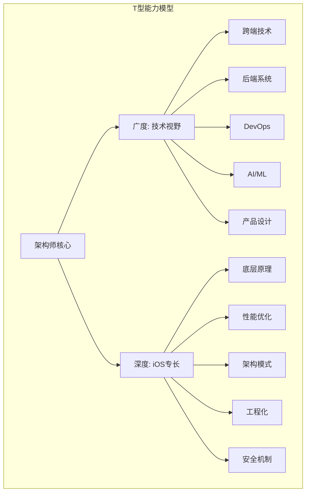
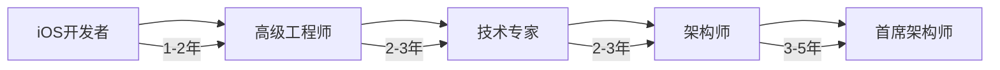
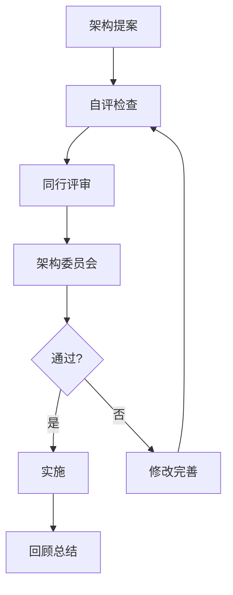

# AI时代iOS架构师能力模型深度解析

> **核心结论**：AI时代iOS架构师的核心竞争力从"写代码"转向"设计系统"。Prompt Engineering、Spec Writing、Harness Design成为新的必备技能，而底层技术深度仍是根基。

---

## 核心结论 TL;DR 表格

| 能力维度 | 传统要求 | AI时代新要求 | 重要性变化 |
|---------|---------|-------------|-----------|
| 编码实现 | ★★★★★ | ★★★☆☆ | 下降 |
| 架构设计 | ★★★★★ | ★★★★★ | 保持 |
| AI工具使用 | ★☆☆☆☆ | ★★★★★ | 激增 |
| 系统思维 | ★★★★☆ | ★★★★★ | 上升 |
| 技术领导 | ★★★☆☆ | ★★★★★ | 上升 |

---

## 一、iOS架构师T型技能矩阵

### 1.1 T型能力模型

**核心结论**：广度决定视野，深度决定影响力。架构师需要在iOS领域有深度专长，同时具备跨端、后端、DevOps的广度认知。



### 1.2 广度技能矩阵

| 领域 | 掌握程度 | 关键知识点 | 应用场景 |
|-----|---------|-----------|---------|
| 跨端技术 | 熟悉 | Flutter/RN/KMP原理、性能边界 | 技术选型、混合架构 |
| 后端系统 | 了解 | REST/gRPC/GraphQL、微服务、数据库 | API设计、前后端协作 |
| DevOps | 了解 | CI/CD、容器化、监控告警 | 交付流程优化 |
| AI/ML | 熟悉 | CoreML、端侧推理、Prompt Engineering | 智能化功能集成 |
| 产品设计 | 了解 | UX原则、数据驱动、A/B测试 | 技术方案评估 |

### 1.3 深度技能矩阵

| 领域 | 掌握程度 | 关键知识点 | 应用场景 |
|-----|---------|-----------|---------|
| 底层原理 | 精通 | Runtime、内存模型、编译器、Mach-O | 疑难问题排查 |
| 性能优化 | 精通 | 启动优化、内存管理、渲染优化、电量 | 性能攻坚 |
| 架构模式 | 精通 | MVVM/TCA/Clean、模块化、依赖注入 | 架构设计 |
| 工程化 | 精通 | SPM、CI/CD、代码规范、自动化 | 团队效率 |
| 安全机制 | 精通 | Keychain、代码签名、隐私合规 | 安全架构 |

---

## 二、10大核心技术领域

### 2.1 架构设计

**核心结论**：架构设计是架构师的核心竞争力，需要从模式复用者进化为模式创造者。

#### 关键知识点

```
架构设计知识体系:
├── 设计原则
│   ├── SOLID原则
│   ├── DRY/KISS/YAGNI
│   └── 依赖倒置、接口隔离
├── 架构模式
│   ├── MVC/MVP/MVVM/VIPER
│   ├── Clean Architecture
│   ├── TCA (SwiftUI时代)
│   └── 微前端/微模块
├── 设计方法
│   ├── 领域驱动设计(DDD)
│   ├── 事件驱动架构
│   └── CQRS/事件溯源
└── 架构评估
    ├── ATAM评估方法
    ├── 性能建模
    └── 技术债务管理
```

#### 能力要求

| 级别 | 能力描述 | 示例 |
|-----|---------|------|
| 初级 | 理解常用架构模式，能按规范实现 | 按MVVM规范编写模块 |
| 中级 | 能根据场景选择合适架构 | 为复杂模块选择TCA |
| 高级 | 能设计领域特定架构 | 设计符合业务特点的模块化方案 |
| 架构师 | 创造新架构模式，指导团队 | 设计跨团队共享的架构规范 |

### 2.2 性能优化

**核心结论**：性能优化需要系统方法论，从指标定义、数据采集、问题定位到优化验证的全链路能力。

#### 关键知识点

```swift
// 性能优化知识体系示例

// 1. 启动优化
// 使用 Instruments - App Launch模板
// 关键指标: TTI (Time To Interactive) < 1s

// 2. 内存优化
// 使用 Instruments - Allocations/Leaks
// 关键指标: 无内存泄漏，峰值内存 < 设备限制80%

// 3. 渲染优化
// 使用 Instruments - Core Animation
// 关键指标: 60fps，离屏渲染最小化

// 4. 电量优化
// 使用 Instruments - Energy Log
// 关键指标: 后台任务优化，定位服务按需使用
```

#### 优化工具链

| 工具 | 用途 | 关键指标 |
|-----|------|---------|
| Instruments | 性能分析 | CPU、内存、网络、电量 |
| MetricKit | 线上性能采集 | 启动时间、挂起率、电池 |
| Xcode Organizer | 崩溃分析 | 崩溃率、异常退出 |
| Firebase Performance | APM监控 | 自定义追踪、网络监控 |

### 2.3 内存管理

**核心结论**：Swift的ARC简化了内存管理，但循环引用、内存泄漏仍是架构师必须精通的领域。

#### 关键知识点

```swift
// 内存管理深度知识

// 1. ARC原理
// - 引用计数规则
// - 强引用、弱引用、无主引用
// - 循环引用检测

// 2. 常见内存陷阱
class MemoryTrapExamples {
    
    // 陷阱1: 闭包循环引用
    var completionHandler: (() -> Void)?
    
    func setupHandler() {
        // ❌ 循环引用
        completionHandler = {
            self.doSomething() // self被强引用
        }
        
        // ✅ 正确做法
        completionHandler = { [weak self] in
            self?.doSomething()
        }
    }
    
    // 陷阱2: 多线程内存安全
    var sharedData: [String: Any] = [:]
    
    func unsafeAccess() {
        DispatchQueue.global().async {
            self.sharedData["key"] = "value" // 非线程安全
        }
    }
    
    // ✅ 正确做法
    actor SafeDataStore {
        private var data: [String: Any] = [:]
        
        func setValue(_ value: Any, forKey key: String) {
            data[key] = value
        }
    }
    
    // 陷阱3: 大对象缓存
    var imageCache: [String: UIImage] = [:] // 无限增长
    
    // ✅ 正确做法
    let properCache = NSCache<NSString, UIImage>()
}
```

### 2.4 多线程与并发

**核心结论**：Swift Concurrency是现代iOS并发的标准，架构师需要精通async/await、Actor、结构化并发。

#### 关键知识点

```swift
// Swift Concurrency深度实践

// 1. Actor隔离
actor BankAccount {
    private var balance: Double = 0
    
    func deposit(_ amount: Double) {
        balance += amount
    }
    
    func getBalance() -> Double {
        return balance
    }
}

// 2. MainActor使用
@MainActor
class ViewModel: ObservableObject {
    @Published var items: [Item] = []
    
    func load() async {
        // 自动在主线程执行
        items = await fetchItems()
    }
}

// 3. 结构化并发
func fetchUserData() async throws -> UserData {
    async let profile = fetchProfile()
    async let settings = fetchSettings()
    async let preferences = fetchPreferences()
    
    // 并行执行，自动等待所有任务完成
    return try await UserData(
        profile: profile,
        settings: settings,
        preferences: preferences
    )
}

// 4. Task管理
class TaskManager {
    private var ongoingTask: Task<Void, Never>?
    
    func startLongOperation() {
        // 取消之前的任务
        ongoingTask?.cancel()
        
        ongoingTask = Task {
            do {
                try await performOperation()
            } catch is CancellationError {
                print("Task was cancelled")
            } catch {
                print("Error: \(error)")
            }
        }
    }
}
```

### 2.5 安全机制

**核心结论**：iOS安全架构师需要掌握代码签名、沙盒机制、Keychain、隐私合规等全方位安全知识。

#### 关键知识点

```swift
// iOS安全最佳实践

// 1. Keychain安全存储
import Security

class SecureStorage {
    
    static func save(data: Data, service: String, account: String) throws {
        let query: [String: Any] = [
            kSecClass as String: kSecClassGenericPassword,
            kSecAttrService as String: service,
            kSecAttrAccount as String: account,
            kSecValueData as String: data,
            kSecAttrAccessible as String: kSecAttrAccessibleWhenUnlockedThisDeviceOnly
        ]
        
        SecItemDelete(query as CFDictionary) // 删除旧值
        let status = SecItemAdd(query as CFDictionary, nil)
        
        guard status == errSecSuccess else {
            throw KeychainError.saveFailed
        }
    }
    
    static func load(service: String, account: String) -> Data? {
        let query: [String: Any] = [
            kSecClass as String: kSecClassGenericPassword,
            kSecAttrService as String: service,
            kSecAttrAccount as String: account,
            kSecReturnData as String: true
        ]
        
        var result: AnyObject?
        SecItemCopyMatching(query as CFDictionary, &result)
        return result as? Data
    }
}

// 2. 证书固定(Certificate Pinning)
import Foundation

final class PinningDelegate: NSObject, URLSessionDelegate {
    
    private let pinnedHashes: [String]
    
    func urlSession(
        _ session: URLSession,
        didReceive challenge: URLAuthenticationChallenge,
        completionHandler: @escaping (URLSession.AuthChallengeDisposition, URLCredential?) -> Void
    ) {
        guard let serverTrust = challenge.protectionSpace.serverTrust,
              let certificateChain = SecTrustCopyCertificateChain(serverTrust) as? [SecCertificate],
              !certificateChain.isEmpty else {
            completionHandler(.cancelAuthenticationChallenge, nil)
            return
        }
        
        // 验证证书哈希
        let isValid = certificateChain.contains { certificate in
            // 计算并比对证书哈希
            true // 简化示例
        }
        
        completionHandler(isValid ? .useCredential : .cancelAuthenticationChallenge, nil)
    }
}
```

### 2.6 工程化

**核心结论**：工程化能力是架构师规模化产出的基础，包括模块化、CI/CD、代码规范、自动化测试等。

#### 关键知识点

```yaml
# iOS工程化体系

模块化策略:
  - SPM包管理
  - 分层架构 (Domain/Data/Presentation)
  - 依赖注入
  - 接口隔离

CI/CD管线:
  - 代码提交: Pre-commit hooks (SwiftLint)
  - PR检查: 单元测试 + 静态分析
  - 合并后: 集成测试 + 构建
  - 发布: 自动化打包 + 分发

代码质量:
  - SwiftLint规则定制
  - SwiftFormat格式化
  - 代码覆盖率要求 (>80%)
  - Code Review流程

自动化测试:
  - 单元测试 (XCTest)
  - UI测试 (XCUITest)
  - 性能测试 (XCTMetric)
  - 快照测试 (SnapshotTesting)
```

### 2.7 跨平台

**核心结论**：架构师需要理解跨平台方案的边界，能在原生与跨平台之间做出合理权衡。

#### 关键知识点

- Flutter: Dart/Impeller渲染引擎、Platform Channel
- React Native: 新架构(Fabric/TurboModules)、JSI
- KMP: 共享逻辑、expect/actual机制
- 混合开发: 原生壳 + 跨平台模块策略

### 2.8 AI/ML

**核心结论**：端侧AI是iOS架构师的新战场，CoreML和Apple Intelligence正在改变应用架构。

#### 关键知识点

```swift
// CoreML集成示例
import CoreML
import Vision

class ImageAnalyzer {
    
    private let model: VNCoreMLModel
    
    init() throws {
        let config = MLModelConfiguration()
        config.computeUnits = .all // 使用GPU/Neural Engine
        
        let coreMLModel = try MobileNetV2(configuration: config)
        model = try VNCoreMLModel(for: coreMLModel.model)
    }
    
    func classify(image: UIImage, completion: @escaping ([VNClassificationObservation]) -> Void) {
        guard let cgImage = image.cgImage else { return }
        
        let request = VNCoreMLRequest(model: model) { request, error in
            guard let results = request.results as? [VNClassificationObservation] else {
                completion([])
                return
            }
            completion(results)
        }
        
        let handler = VNImageRequestHandler(cgImage: cgImage)
        try? handler.perform([request])
    }
}
```

### 2.9 音视频

**核心结论**：音视频开发需要理解编解码、渲染管线、同步机制等底层原理。

#### 关键知识点

- AVFoundation框架
- Metal渲染管线
- 音频会话管理
- 视频编解码 (H.264/HEVC)
- 直播/RTC架构

### 2.10 网络通信

**核心结论**：现代iOS网络架构需要考虑HTTP/3、GraphQL、gRPC、WebSocket等多种协议。

#### 关键知识点

```swift
// 现代网络架构示例

// 1. 协议定义
protocol Endpoint {
    var baseURL: URL { get }
    var path: String { get }
    var method: HTTPMethod { get }
    var headers: [String: String]? { get }
    var body: Encodable? { get }
}

// 2. 网络层实现
actor NetworkManager {
    
    private let session: URLSession
    private let decoder: JSONDecoder
    
    init(session: URLSession = .shared) {
        self.session = session
        self.decoder = JSONDecoder()
        decoder.keyDecodingStrategy = .convertFromSnakeCase
    }
    
    func request<T: Decodable>(_ endpoint: Endpoint) async throws -> T {
        let request = try buildRequest(for: endpoint)
        
        let (data, response) = try await session.data(for: request)
        
        guard let httpResponse = response as? HTTPURLResponse else {
            throw NetworkError.invalidResponse
        }
        
        guard (200...299).contains(httpResponse.statusCode) else {
            throw NetworkError.httpError(httpResponse.statusCode)
        }
        
        return try decoder.decode(T.self, from: data)
    }
    
    private func buildRequest(for endpoint: Endpoint) throws -> URLRequest {
        let url = endpoint.baseURL.appendingPathComponent(endpoint.path)
        var request = URLRequest(url: url)
        request.httpMethod = endpoint.method.rawValue
        request.allHTTPHeaderFields = endpoint.headers
        
        if let body = endpoint.body {
            request.httpBody = try JSONEncoder().encode(body)
        }
        
        return request
    }
}
```

---

## 三、能力雷达图

### 3.1 各级别能力要求

```mermaid
radar
    title iOS架构师能力雷达图
    
    axis 架构设计
    axis 性能优化
    axis 内存管理
    axis 多线程
    axis 安全机制
    axis 工程化
    axis 跨平台
    axis AI/ML
    axis 音视频
    axis 网络通信
    
    area "初级" 3, 2, 3, 2, 2, 2, 1, 1, 1, 3
    area "中级" 4, 3, 4, 3, 3, 3, 2, 2, 2, 4
    area "高级" 5, 4, 5, 4, 4, 4, 3, 3, 3, 5
    area "架构师" 5, 5, 5, 5, 5, 5, 4, 4, 4, 5
```

### 3.2 详细能力矩阵

| 能力领域 | 初级(1-2年) | 中级(3-5年) | 高级(5-8年) | 架构师(8年+) |
|---------|------------|------------|------------|-------------|
| **架构设计** | 理解MVC/MVVM，按规范实现 | 能选择合适架构模式 | 设计模块级架构 | 设计系统级架构，制定规范 |
| **性能优化** | 使用Instruments基础功能 | 定位并解决性能问题 | 系统性性能优化 | 建立性能监控体系 |
| **内存管理** | 理解ARC，避免循环引用 | 解决内存泄漏问题 | 设计内存优化方案 | 建立内存安全规范 |
| **多线程** | 使用GCD/DispatchQueue | 掌握Swift Concurrency | 设计并发架构 | 解决复杂并发问题 |
| **安全机制** | 使用Keychain基础功能 | 实现安全存储方案 | 设计安全架构 | 建立安全合规体系 |
| **工程化** | 使用CocoaPods/SPM | 配置CI/CD流程 | 设计模块化方案 | 建立工程化体系 |
| **跨平台** | 了解跨平台概念 | 评估跨平台方案 | 设计混合架构 | 制定跨平台策略 |
| **AI/ML** | 了解CoreML基础 | 集成现成模型 | 优化模型性能 | 设计AI架构 |
| **音视频** | 使用AVFoundation | 实现播放功能 | 优化播放体验 | 设计音视频架构 |
| **网络通信** | 使用URLSession | 封装网络层 | 设计网络架构 | 建立网络治理体系 |

---

## 四、成长路径

### 4.1 从开发者到架构师



### 4.2 各阶段关键里程碑

#### 初级阶段 (1-2年)

**目标**：成为合格的iOS开发者

- [ ] 精通Swift语言和iOS SDK
- [ ] 熟练使用UIKit/SwiftUI
- [ ] 理解常用设计模式
- [ ] 能独立完成功能模块
- [ ] 掌握基础调试技能

#### 中级阶段 (3-5年)

**目标**：成为独当一面的高级工程师

- [ ] 精通内存管理和性能优化
- [ ] 掌握Swift Concurrency
- [ ] 能设计模块级架构
- [ ] 具备代码审查能力
- [ ] 开始指导初级开发者

#### 高级阶段 (5-8年)

**目标**：成为领域技术专家

- [ ] 精通底层原理和源码
- [ ] 能解决复杂技术难题
- [ ] 设计系统级架构方案
- [ ] 推动技术演进
- [ ] 跨团队技术影响力

#### 架构师阶段 (8年+)

**目标**：成为技术领导者

- [ ] 制定技术战略
- [ ] 建立技术规范体系
- [ ] 培养技术梯队
- [ ] 推动技术创新
- [ ] 业务技术融合

### 4.3 AI时代的转型路径

```
传统能力 → AI增强能力:

编码实现
├── 传统: 手写每一行代码
└── AI时代: Prompt Engineering + 代码审查

架构设计
├── 传统: 手工绘制架构图
└── AI时代: AI辅助设计 + 架构评审

问题排查
├── 传统: 人工分析日志
└── AI时代: AI辅助诊断 + 根因分析

技术决策
├── 传统: 基于经验判断
└── AI时代: 数据驱动 + AI辅助评估

团队管理
├── 传统: 面对面沟通
└── AI时代: AI辅助代码审查 + 自动化度量
```

---

## 五、技术领导力

### 5.1 技术决策框架

**核心结论**：架构师的技术决策需要从"我觉得"转变为"数据证明"。

#### 决策矩阵

| 维度 | 权重 | 评估标准 |
|-----|------|---------|
| 技术可行性 | 25% | 团队能力、技术成熟度 |
| 业务价值 | 30% | ROI、战略契合度 |
| 维护成本 | 20% | 长期投入、技术债务 |
| 风险因素 | 15% | 技术风险、合规风险 |
| 时间成本 | 10% | 交付周期、机会成本 |

### 5.2 架构评审流程



#### 评审Checklist

```markdown
## 架构评审检查清单

### 功能性
- [ ] 是否满足所有需求
- [ ] 边界条件是否考虑
- [ ] 异常处理是否完善

### 非功能性
- [ ] 性能目标是否明确
- [ ] 可扩展性如何
- [ ] 安全性是否考虑
- [ ] 可用性指标定义

### 可维护性
- [ ] 代码复杂度可控
- [ ] 测试策略明确
- [ ] 文档是否完善

### 风险
- [ ] 技术风险识别
- [ ] 缓解措施到位
- [ ] 回滚方案准备
```

### 5.3 技术债务管理

```
技术债务管理策略:

识别:
├── 代码扫描工具 (SonarQube)
├── 架构违背检测
├── 性能退化监控
└── 安全漏洞扫描

评估:
├── 影响范围评估
├── 修复成本估算
├── 风险等级划分
└── 优先级排序

偿还:
├── 预留重构时间 (20%规则)
├── 增量式重构
├── 自动化测试保护
└── 文档同步更新

预防:
├── 代码审查严格化
├── 架构约束自动化
├── 技术雷达跟踪
└── 团队培训提升
```

---

## 六、AI时代的新能力要求

### 6.1 Prompt Engineering

**核心结论**：Prompt Engineering是AI时代架构师的基础技能，直接影响AI输出质量。

#### 核心技巧

```markdown
## iOS Prompt Engineering最佳实践

### 1. 上下文提供
- 项目技术栈 (Swift 5.9, SwiftUI, TCA)
- 架构约束 (Clean Architecture, 依赖方向)
- 代码规范 (SwiftLint规则)

### 2. 需求明确
- 功能需求 (Given/When/Then)
- 非功能需求 (性能、安全)
- 约束条件 (iOS版本、设备支持)

### 3. 输出规范
- 代码风格要求
- 注释规范
- 测试要求

### 示例Prompt:
"使用Swift 5.9和SwiftUI实现一个用户登录页面。
架构: MVVM + Observation
约束:
- 使用@MainActor
- 网络请求使用async/await
- 密码使用SecureField
- 需要表单验证
- 包含单元测试"
```

### 6.2 Spec Writing

**核心结论**：Spec Writing是连接需求与实现的桥梁，是AI可靠工作的前提。

#### Spec模板

```yaml
# iOS功能Spec模板

spec_id: FEATURE-001
title: 用户登录功能
priority: high
owner: iOS Team

context:
  background: 用户需要登录才能访问核心功能
  stakeholders: 产品经理、后端团队、安全团队

acceptance_criteria:
  - given: 用户在登录页面
    when: 输入有效邮箱和密码
    then: 
      - 调用登录API
      - 保存token到Keychain
      - 导航到首页
      
  - given: 用户在登录页面
    when: 输入无效凭证
    then:
      - 显示错误提示
      - 不清空输入框
      - 记录错误日志

technical_constraints:
  - 使用HTTPS通信
  - 密码最小长度8位
  - 支持密码可见性切换
  - 实现登录状态持久化

tech_stack:
  language: Swift 5.9
  ui: SwiftUI
  architecture: MVVM
  networking: URLSession
  storage: Keychain

test_requirements:
  unit_test_coverage: ">= 80%"
  ui_tests: true
  security_tests: true
```

### 6.3 Harness Design

**核心结论**：Harness Design是架构师在AI时代的核心竞争力，决定了AI工作的可靠性。

#### Harness组件

```
iOS项目Harness体系:
├── 编码约束
│   ├── SwiftLint规则
│   ├── SwiftFormat配置
│   └── 自定义规则
├── 构建流程
│   ├── Build Phases脚本
│   ├── 依赖验证
│   └── 资源检查
├── 测试体系
│   ├── 单元测试门槛
│   ├── UI测试覆盖
│   └── 性能基准
├── CI/CD
│   ├── 代码规范检查
│   ├── 静态分析
│   └── 自动化发布
└── 文档规范
    ├── AGENTS.md
    ├── 架构决策记录
    └── API文档
```

### 6.4 AI工具链掌握

| 工具类型 | 代表工具 | 用途 | 掌握程度 |
|---------|---------|------|---------|
| AI编码助手 | Cursor, Claude Code, Copilot | 代码生成、重构 | 熟练使用 |
| AI审查工具 | CodeRabbit, PR-Agent | 代码审查 | 了解使用 |
| AI文档工具 | Mintlify, ReadMe | 文档生成 | 了解使用 |
| AI测试工具 | Codium, Testim | 测试生成 | 了解使用 |

---

## 七、总结

### 7.1 能力模型演进

```
AI时代iOS架构师能力模型:

传统核心能力 (保持)
├── 底层技术深度
├── 架构设计能力
├── 性能优化能力
└── 问题排查能力

新兴核心能力 (新增)
├── Prompt Engineering
├── Spec Writing
├── Harness Design
├── AI工具链掌握
└── 系统思维能力

领导力能力 (增强)
├── 技术决策框架
├── 架构评审能力
├── 技术债务管理
└── 团队培养能力
```

### 7.2 学习建议

1. **夯实基础**：底层原理是永恒的竞争力
2. **拥抱AI**：Prompt Engineering和Harness Design是必修课
3. **拓展广度**：跨端、后端、AI都需要了解
4. **建立影响力**：技术博客、开源贡献、社区分享
5. **持续学习**：技术演进加速，保持学习心态

---

## 参考资源

- [Apple Developer Documentation](https://developer.apple.com/documentation/)
- [Swift.org](https://swift.org/)
- [Point-Free](https://www.pointfree.co/) - 函数式Swift
- [Swift by Sundell](https://www.swiftbysundell.com/)
- [iOS Dev Weekly](https://iosdevweekly.com/)

---

*本文档基于 iOS 17+ / Swift 5.9+ / AI工具2024-2026发展现状编写。*
